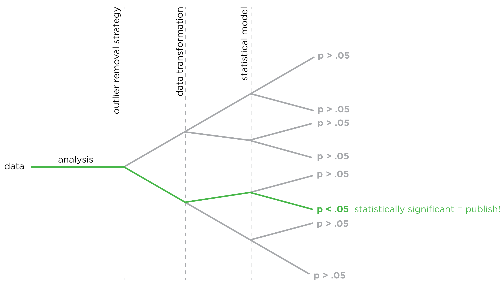

# (PART) Part I {-}

# Introduction {#intro}

## About this Book

First, let us discuss what this book is *not*. This book is not a guide on how to assess each psychological construct or disorder. This book is also not a comparative summary of the psychometrics of different measures. There already exist many resources that summarize and compare the reliability and validity of measures in psychology. Instead, this book is about the *principles* of psychological assessment [@Buros2021]. This book was originally written for a graduate-level course. The goal of this book is to help researchers and clinicians learn to think critically about assessments so they can better develop, evaluate, administer, score, integrate, and interpret psychological assessments. Learning important principles of assessment will put you in a better position to learn any assessment device, and to develop better ones. In this book, I apply a scientific perspective to the principles of psychological assessment. The assessments used in a given situation—whether in research or practice—should be supported by the strongest available science (or should be used cautiously while undergoing development and study). In addition to discussing principles, however, I also provide analysis scripts in the software R [@R-base], so that you are able to apply the principles discussed in this book.

## Why R?

R is free, open source, open platform, and widely used. Unlike proprietary software used for data analysis, R is not a black box. You can examine the code for any function or computation you perform. You can even modify and improve these functions by changing the code, and can create your own functions. R also has advanced capabilities for data wrangling, and has many packages available for advanced statistical analysis and graphing. In addition, there are strong resources available for creating your analyses in R so they are reproducible by others [@Gandrud2020].

## About The Author

Regarding my background, I am a licensed clinical psychologist. My research examines how children develop behavior problems. I am also a trained clinician, and I supervise training clinicians in assessment and therapy, particularly assessment and treatment of children's disruptive behavior. Given my expertise, many of the examples in the book deal with topics in clinical psychology, but many of the assessment principles discussed are relevant to all areas of psychology—and science more broadly—and are often overlooked in research and practice. As a card-carrying clinical scientist, my perspective is that the scientific epistemology is the strongest approach to knowledge, and that assessment should be led first and foremost by the epistemology of science, regardless of whether one is doing research or practice.

## What is Assessment?

Assessment is the gathering of information about a person, group, setting, or context. In psychological assessment, we are interested in gathering information about people's psychological functioning, including their thoughts, emotions, and behaviors. Psychological assessment can also consider biological and physiological processes that are linked to people's thoughts, emotions, and behaviors. Many assessment approaches can be used to assess people's thoughts, emotions, and behaviors, including self-report questionnaires, questionnaires reported by others (e.g., a spouse, parent, teacher, or friend), interviews, observations, biopsychological assessments (e.g., cortisol, heart rate, brain imaging), performance-based assessments, archival approaches (e.g., chart review), and combinations of these.

## Why Should I Care about Assessment (and Science)?

In research, assessments are conducted to advance knowledge, such as improved prediction or understanding. For example, in my research, I use assessments to understand what processes influence children's development of disruptive behavior. In society, assessments are conducted to improve decision making. For instance, assessments are conducted to determine whether to hire a job candidate or promote an employee. In a clinical context, assessments are conducted to improve treatment and the client's outcomes. For instance, assessments are conducted to determine which treatment would be most effective for a person suffering from depression. Assessments can be valuable both to understanding current functioning as well as making predictions. To best answer these questions and address these goals, we need to have confidence that our devices yield accurate answers for these purposes for the assessed individuals. Science is crucial for knowing how much (or how little) confidence we have in a given assessment for a given purpose and population. Effective treatment often depends on accurate assessment. Thus, knowing how to conduct and critically evaluate science will make you more effective at selecting, administering, and interpreting assessments.

Decisions resulting from assessments can have important life-altering consequences. High-stakes decisions based on assessments include decisions about whether a person is hospitalized, whether a child is removed from their abusive home, whether a person is deemed competent to stand trial, whether a prisoner is released on parole, and whether an applicant is admitted to graduate school. These important assessment-related decisions should be made using the best available science.

The problem is that there has been a proliferation of pseudoscience in assessment and treatment. There are widely used psychological assessments and treatments that we know are inaccurate, do not work, or in some cases, are known to be harmful. Lists of harmful psychological treatments [e.g., @Lilienfeld2007] and inaccurate assessments [e.g., @Hunsley2015] have been published, but these treatments and assessments are still used by professional providers to this day. Practice using such techniques violates the aphorism "first, do no harm." This would be inconceivable for other applied sciences, such as chemistry, engineering, and medicine. For instance, the prescription of a particular medication for a particular purpose requires approval by the U.S. Food and Drug Administration. Psychological assessments and treatments do not have the same level of oversight.

The gap between what we know based on science and what is implemented in practice (the science–practice gap) motivated McFall's [-@McFall1991] "Manifesto for a Science of Clinical Psychology," which he later expanded [@McFall2000]. The Manifesto has one cardinal principle and four corollaries:

> Cardinal Principle: Scientific clinical psychology is the only legitimate and acceptable form of clinical psychology.  
> First Corollary: Psychological services should not be administered to the public (except under strict experimental control) until they have satisfied these four minimal criteria:
>
> 1. The exact nature of the service must be described clearly.
> 2. The claimed benefits of the service must be stated explicitly.
> 3. These claimed benefits must be validated scientifically.
> 4. Possible negative side effects that might outweigh any benefits must be ruled out empirically.
>
> Second Corollary: The primary and overriding objective of doctoral training programs in clinical psychology must be to produce the most competent clinical scientists possible.  
> Third Corollary: A scientific epistemology differentiates science from pseudoscience.  
> Fourth Corollary: The most caring and humane psychological services are those that have been shown empirically to be the most effective, efficient, and safe.

The Manifesto orients you to the scientific perspective from which we will be examining psychological assessment techniques in this book.

### Assessment and the Replication Crisis in Science

Assessment is also crucial to advancing knowledge in research, as summarized in the maxim, "What we know depends on how we know it." Findings from studies boil down to the methods that were used to obtain them—everything comes down to methods.

Many domains of science, particularly social science, have struggled with a replication crisis, such that a large proportion of findings fail to replicate when independent investigators attempt to replicate the original findings [@Duncan2014; @Freese2017; @Larson2017; @Lilienfeld2017a; @OSC2015; @Shrout2018; @Tackett2019]. There is considerable speculation on what factors may best account for the replication crisis. For instance, one possible factor is the researcher degrees of freedom, which are unacknowledged choices in how researchers prepare, analyze, and report their data that can lead to detecting significance in the absence of real effects [@Loken2017]. This is similar to @Gelman2013's description of research as the garden of forking paths, where different decisions along the way can lead to different outcomes (see Figure \@ref(fig:gardenForkingPaths)). A second possibility for the replication crisis is that some replication studies have had limited statistical power (e.g., insufficiently large sample sizes). A third possibility may be that there is publication bias such that researchers tend to publish only significant findings, which is known as the file-drawer effect. A fourth possibility is that researchers may engage in ethically questionable research practices, such as multiple testing and selective reporting.

```{r gardenForkingPaths, out.width = "100%", fig.align = "center", fig.cap = "Garden of forking paths.", echo = FALSE}

```

However, difficulties with replication could exist even if researchers have the best of intentions, engage in ethical research practices, and are transparent about all of the methods they used and decisions they made. The replication crisis could owe, in part, to noisy (imprecise and inaccurate) measures. As @Loken2017 demonstrated, when measures are less noisy, measurement error weakens the association between the measures. But when using noisy measures and selecting what to publish based on statistical significance, measurement error can make the association appear stronger than it is. This is what @Loken2017 describe as the statistical significance filter: in a study with noisy measures and a small or moderate sample size, statistically significant estimates are likely to have a stronger effect size than the actual effect size—the "true" underlying effects could be small or nonexistent. However, the effect of noise (measurement error) diminishes as the sample size increases. So, the goal should be to use less noisy measures with larger sample sizes. And, as discussed in Chapter \@ref(ethics) on ethical considerations in psychological assessment, the use of pre-registration could be useful to control researcher degrees of freedom.

The lack of replicability of findings has the potential to negatively impact the people we study through misinformed assessment, treatment, and policy decisions. Therefore, it is crucial to use assessments with strong psychometric properties and/or to develop better assessments. By psychometrics, I refer to the reliability and validity of measures. These concepts will be described in greater detail in Chapters \@ref(reliability) and \@ref(validity), but for now, think about reliability as *consistency* of measurement and *validity* as accuracy of measurement.

### Science vs. pseudoscience in assessment

Science is the best system of epistemology we have to pursue truth. Science is a process, not a set of facts. It helps us overcome blind spots. The system is revisionary and self-correcting. Science is the epistemology that is the least susceptible to error due to authority, belief, intuition, bias, and preference, etc. Clients are in a vulnerable position, and deserve to receive services consistent with the strongest available evidence. By providing a client a service, you are implicitly making a claim and prediction. As a psychologist, you are claiming to have expert knowledge and competence. You are making a prediction that the client will improve because of your services. Ethically, you should be making these predictions based on science and a risk-benefit analysis. It is also important to make sure the client knows when services are unproven so they can provide fully informed consent. Otherwise, because of your position as a psychologist, they may believe that you are using a evidence-based approach when you are not.

We will be examining psychological assessment from a scientific perspective. Here are characteristics of science that distinguish it from pseudoscience:

1. Risky hypotheses are posed that are falsifiable. The hypotheses can be shown to be wrong.
2. Findings can be replicated independently by different research groups and different methods. Evidence converges across studies and methods.
3. Potential alternative explanations for findings are specified and examined empirically (with data).
4. Steps are taken to guard against the undue influence of personal beliefs and biases.
5. The strength of claims reflects the strength of evidence. Findings and the ability to make judgments or predictions are not overstated. For instance, it is important to present the degree of uncertainty from assessments with error bars or confidence intervals.
6. Scientifically supported measurement strategies are used based on their psychometrics, including reliability and validity.

Science does not progress without advances in measurement, including:

- more efficient measurement
- more precise measurement
- more accurate measurement
- more sophisticated modeling
- more sophisticated biopsychological (e.g., cognitive neuroscience) techniques, as opposed to self-report and neuropsychological techniques
- considerations of cultural and individual diversity
- ethical considerations

These considerations serve as the focus of this book.

## Prerequisites

This book was written in `Markdown` using the `bookdown` package [@R-bookdown] in `R` [@R-base]. The `bookdown` package was built on top of the `rmarkdown` [@R-rmarkdown] and `knitr` [@R-knitr] packages [@Xie2015].

If you want to compile the book, you will need the `bookdown` package. The `bookdown` package can be installed from CRAN:

```{r eval = FALSE}
install.packages("bookdown")
```

# Scores and Scales

Assessments yield information. The information is encoded in scores or in other types of data. It is important to consider the different types of data because the types of data restrict what options are available to analyze the data.

## Data Types

There are four general data types: nominal, ordinal, interval, and ratio. Depending on the use of the variable, the data could fall into more than one category. The type of data influences what kinds of data analysis you can do. For instance, parametric statistical analysis (e.g., *t*-test, analysis of variance [ANOVA], and linear regression) assumes that data are interval or ratio.

### Nominal

Nominal data are distinct categories. They are categorical and unordered. Nominal data make no quantitative claims. Nominal data represent things that we can name (e.g., cat and dog). Nominal data can be represented with numbers. For example, zipcodes are nominal. Numbers that represent a participant's sex, race, or ethnicity are also nominal. Higher numbers of nominal data do not reflect higher (or lower) levels of the construct because they numbers represent categories that do not have an order.

### Ordinal

Ordinal data are ordered categories: they have a name and an order. They make no claim about the conceptual distance between the ranks, only that higher values represent higher (or lower) levels of the construct. For example, ranks following a race are ordinal, that is, the person with rank 1 finished before the person with rank 2, who finished before the person with rank 3 (1 > 2 > 3 > 4). Ordinal data make a limited claim because the conceptual distance between adjacent numbers is not the same. For instance, the person who finished the race first might have finished 10 minutes before the second-place finisher; whereas the 3rd-place finisher might have finished 1 second after the second-place finisher.

That is, just because the numbers have the same *mathematical* distance does not mean that they represent the same *conceptual* distance on the construct. For example, if the respondent is asked how many drinks they had in the past day, and the options are 0 = 0 drinks; 1 = 1–2 drinks; 2 = 3 or more drinks, the scale is ordinal. Even the numbers have the same mathematical distance (1, 2, 3), they do not represent the same conceptual distance. Most data in psychology are ordinal data even though they are often treated as if they were interval data.

### Interval

Interval data are ordered and have meaningful distances (i.e., equal spacing between intervals). You can sum interval data (e.g., 2 is 2 away from 4), but you cannot multiply interval data ($2 \times 2 \ne 4$). Examples of interval data are temperature in Fahrenheit and Celsius—100 degrees Fahrenheit is not twice as hot as 50 degrees Farhenheit. Years of education is interval, whereas educational attainment (e.g., high school degree, college degree, graduate degree) is only ordinal. Although much data in psychology involves numbers that have the same mathematical distance between intervals, the intervals likely do not represent the same conceptual distance. For example, the difference in severity of two people who have two symptoms and four symptoms of depression, respectively, may not be the same difference in depression severity as two people who have four symptoms and six symptoms, respectively.

### Ratio

Ratio data are ordered, have meaningful distances, and have a true (absolute) zero that represents absence of the construct. With ratio data, multiplicative relationships are true. An example of ratio data are temperature in Kelvin—100 degrees Kelvin is twice as hot as 50 degrees Kelvin. There is a dream of having ratio scales in psychology, but we still do not have a true zero with psychological constructs—what does total absence of depression mean (apart from a dead person)?

## Score Transformation

There are a number of score transformations, depending on the goal. Some score transformations (e.g., log transform) seek to make data more normally distributed to meet assumptions of particular analysis approaches. Score transformations alter the original (raw) data. If you change the data, it can change the results. Score transformations are not neutral.

### Raw Scores

Raw scores are the original data, or they may be aggregations (e.g., sums or means) of multiple items. Raw scores are the most pure because they are closest to the original operation (e.g., behavior). A disadvantage of raw scores is they are scale-dependent, and therefore may not be comparable across different measures with different scales.

### Norm-Referenced Scores {#norm}

Norm-referenced scores are scores that are referenced to some norm. A norm is a standard of comparison. For instance, you may be interested in how well a participant performed relative to other children of the same sex, age, grade, or ethnicity. However, interpretation of norm-referenced scores depends on the measure and on the normative sample. A person's norm-referenced score can vary widely depending on which norms are used. Which reference group should you use? Age? Sex? Age and sex? Grade? Ethnicity? The optimal reference group depends on the purpose of the assessment.

[Discuss absolute functioning for ability to drive, etc; Discuss pros and cons of norms, including race-based norms;]

#### Percentile Ranks

Percentile ranks reflect what percent of people the person scored higher than. Percentile ranks are frequently used for tests of intellectual/cognitive ability, academic achievement, academic aptitude, and grant funding. They seem like interval data, but they are not intervals because the conceptual spacing between the numbers is not equal. The difference in ability for two people who scored at the 99th and 98th percentile, respectively, is not the same as the difference in ability for two people who scored at the 49th and 50th percentile, respectively. Percentile ranks are only judged against a baseline; there is no subtraction.

Percentile ranks have unusual effects. There are lots of people in the middle of a distribution, so a very small difference in raw scores gets expanded out in percentiles. For instance, a raw score of 20 may have a percentile rank of 50, but a raw score of 24 may have a percentile rank of 68. However, a larger raw score change at the ends of the distribution may have a smaller percentile change. For example, a raw score of 120 may have a percentile rank of 97 whereas a raw score of 140 may have a percentile rank of 99.  Thus, percentile ranks stretch out differences for some people but constrict differences for others.

#### Deviation (Standardized) Scores

Deviation or standardized scores are the transformation of raw scores to a normal distribution using some norm. The norm could be a comparison group, or it could be the sample itself. With deviation scores, you have similar challenges as percentile ranks including which reference group to use, but deviation scores have additional assumptions about the mean and standard deviation, which is dependent on a normal distribution. Many constructs we study in psychology are not normally distributed. For example, the frequency of hallucinations among people would show a positively skewed distribution with a truncation at zero, representing a floor effect—i.e., most people do not show hallucinations. You can compute a deviation score, but it may not be meaningful if the data and underlying construct are not normally distributed.

##### *z*-scores

The *z*-score is the most common standardized score, and it can help putting different measures with different scales on the same playing field. *z*-scores have a mean of zero and a standard deviation of 1. To get a *z*-score that uses the sample as its own norm, subtract the mean from all scores and divide by the standard deviation. Every *z*-score represents how far that person's score is from the (normed) average, represented in standard deviation units. 68% of scores fall within one standard deviation of the mean. 95% of scores fall within 2 standard deviations of the mean. 99.7% of scores fall within three standard deviations of the mean.

##### *T*-scores

*T*-scores have a mean of 50 and a standard deviation of 10. *T*-scores are frequently used with personality and symptom measures, where clinical cutoffs are often set at 70 (i.e., two standard deviations above the mean). For the Minnesota Multiphasic Personality Inventory (MMPI), you would examine peaks (elevations $\ge$ 70) and absences ($\le$ 30).

##### Standard scores

Standard scores have a mean of 100 and a standard deviation of 15. Standard scores are frequently used for tests of intellectual ability, academic achievement, and cognitive ability. Intellectual disability is generally considered an I.Q. less than 70 (two standard deviations below the mean), whereas giftedness is at 130 (two standard deviations above the mean).

##### Scale scores

Scale scores, commonly on tests of intellectual or cognitive ability, have a mean of 10 and a standard deviation of 3.
