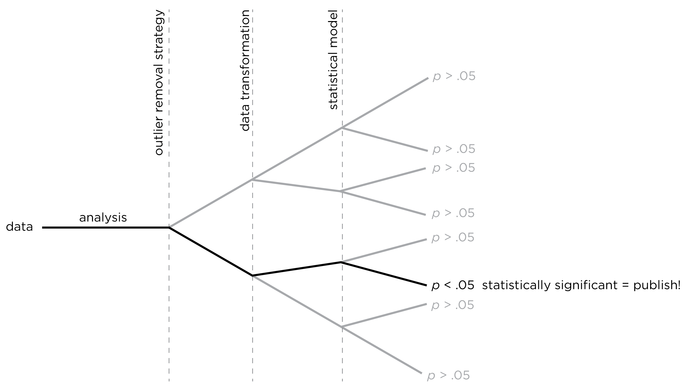

# (PART) Part I {-}

# Introduction {#intro}

## About This Book {#about}

First, let us discuss what this book is *not*.
This book is not a guide on how to assess each psychological construct or disorder.
This book is also not a comparative summary of the psychometrics of different measures.
There already exist many resources that summarize and compare the [reliability](#reliability) and [validity](#validity) of measures in psychology [@Buros2021].\index{reliability}\index{validity}
Instead, this book is about the *principles* of psychological assessment.
This book was originally written for a graduate-level course.
The goal of this book is to help researchers and clinicians learn to think critically about assessments so they can better develop, evaluate, administer, score, integrate, and interpret psychological assessments.
Learning important principles of assessment will put you in a better position to learn any assessment device and to develop better ones.
In this book, I apply a scientific perspective to the principles of psychological assessment.
The assessments used in a given situation—whether in research or practice—should be supported by the strongest available science, or they should be used cautiously while undergoing development and study.
In addition to discussing principles, however, I also provide analysis scripts in the software `R` [@R-base], so that you are able to apply the principles discussed in this book.\index{R}

## Why R? {#whyR}

`R` is free, open source, open platform, and widely used.\index{R}
Unlike proprietary software used for data analysis, `R` is not a black box.\index{R}
You can examine the code for any function or computation you perform.\index{R}
You can even modify and improve these functions by changing the code, and you can create your own functions.\index{R}
`R` also has advanced capabilities for data wrangling and has many packages available for advanced statistical analysis and graphing.\index{R}
In addition, there are strong resources available for creating your analyses in `R` so they are reproducible by others [@Gandrud2020].\index{R}

## About the Author {#aboutTheAuthor}

Regarding my background, I am a licensed clinical psychologist.
My research examines how children develop behavior problems.
I am also a trained clinician, and I supervise training clinicians in assessment and therapy, particularly assessment and treatment of children's disruptive behavior.
Given my expertise, many of the examples in the book deal with topics in clinical psychology, but many of the assessment principles discussed are relevant to all areas of psychology—and science more broadly—and are often overlooked in research and practice.
As a card-carrying clinical scientist, my perspective is that the scientific epistemology is the strongest approach to knowledge and that assessment should be guided first and foremost by the epistemology of science, regardless of whether one is doing research or practice.\index{clinical science}

## What Is Assessment? {#whatIsAssessment}

Assessment is the gathering of information about a person, group, setting, or context.\index{assessment!what is}
In psychological assessment, we are interested in gathering information about people's psychological functioning, including their thoughts, emotions, and behaviors.\index{cognitive assessment}\index{behavioral assessment}
Psychological assessment can also consider biological and physiological processes that are linked to people's thoughts, emotions, and behaviors.\index{psychophysiological assessment}
Many assessment approaches can be used to assess people's thoughts, emotions, and behaviors, including self-report questionnaires, questionnaires reported by others (e.g., a spouse, parent, teacher, or friend), interviews, observations, biopsychological assessments (e.g., cortisol, heart rate, brain imaging), performance-based assessments, archival approaches (e.g., chart review), and combinations of these.\index{psychophysiological assessment}\index{self-report}\index{informant report}\index{questionnaire}\index{performance-based assessment}\index{interview}\index{observation}

## Why Should I Care About Assessment (and Science)? {#whyCare}

In research, assessments are conducted to advance knowledge, such as improved prediction or understanding.\index{assessment!why perform}
For example, in my research, I use assessments to understand what processes influence children's development of disruptive behavior.\index{assessment!why perform}
In society, assessments are conducted to improve decision making.\index{assessment!why perform}
For instance, assessments are conducted to determine whether to hire a job candidate or promote an employee.\index{assessment!why perform}
In a clinical context, assessments are conducted to improve treatment and the client's outcomes.\index{assessment!why perform}
As an example, assessments are conducted to determine which treatment would be most effective for a person suffering from depression.\index{assessment!why perform}
Assessments can be valuable to understanding current functioning as well as making predictions.\index{assessment!why perform}
To best answer these questions and address these goals, we need to have confidence that our devices yield accurate answers for these purposes for the assessed individuals.\index{assessment!why perform}
Science is crucial for knowing how much (or how little) confidence we have in a given assessment for a given purpose and population.\index{assessment!why perform}\index{science}
Effective treatment often depends on accurate assessment.\index{assessment!why perform}
Thus, knowing how to conduct and critically evaluate science will make you more effective at selecting, administering, and interpreting assessments.\index{assessment!why perform}

Decisions resulting from assessments can have important life-altering consequences.\index{assessment!why perform}
High-stakes decisions based on assessments include decisions about whether a person is hospitalized, whether a child is removed from their abusive home, whether a person is deemed competent to stand trial, whether a prisoner is released on parole, and whether an applicant is admitted to graduate school.\index{assessment!why perform}
These important assessment-related decisions should be made using the best available science.\index{assessment!why perform}\index{science}

The problem is that there has been a proliferation of pseudoscience in assessment and treatment.\index{pseudoscience}
There are widely used psychological assessments and treatments that we know are inaccurate, do not work, or in some cases, that we know to be harmful.\index{pseudoscience}
Lists of harmful psychological treatments [e.g., @Lilienfeld2007] and inaccurate assessments [e.g., @Hunsley2015] have been published, but these treatments and assessments are still used by professional providers to this day.\index{pseudoscience}
Practice using such techniques violates the aphorism "first, do no harm."
This would be inconceivable for other applied sciences, such as chemistry, engineering, and medicine.\index{science}
For instance, the prescription of a particular medication for a particular purpose requires approval by the U.S. Food and Drug Administration (FDA).
Psychological assessments and treatments do not have the same level of oversight.

The gap between what we know based on science and what is implemented in practice (the science–practice gap) motivated McFall's [-@McFall1991] "Manifesto for a Science of Clinical Psychology," which he later expanded [@McFall2000].\index{clinical science}
The Manifesto has one cardinal principle and four corollaries:\index{clinical science}

> Cardinal Principle: Scientific clinical psychology is the only legitimate and acceptable form of clinical psychology.\index{clinical science}
> First Corollary: Psychological services should not be administered to the public (except under strict experimental control) until they have satisfied these four minimal criteria:\index{clinical science}
>
> 1. The exact nature of the service must be described clearly.\index{clinical science}
> 2. The claimed benefits of the service must be stated explicitly.\index{clinical science}
> 3. These claimed benefits must be validated scientifically.\index{clinical science}
> 4. Possible negative side effects that might outweigh any benefits must be ruled out empirically.\index{clinical science}
>
> Second Corollary: The primary and overriding objective of doctoral training programs in clinical psychology must be to produce the most competent clinical scientists possible.\index{clinical science}
> Third Corollary: A scientific epistemology differentiates science from pseudoscience.\index{clinical science}
> Fourth Corollary: The most caring and humane psychological services are those that have been shown empirically to be the most effective, efficient, and safe.\index{clinical science}

The Manifesto orients you to the scientific perspective from which we will be examining psychological assessment techniques in this book.\index{clinical science}\index{science}

### Assessment and the Replication Crisis in Science {#assessmentReplicationCrisis}

Assessment is also crucial to advancing knowledge in research, as summarized in the maxim, "What we know depends on how we know it."\index{methods!importance}
Findings from studies boil down to the methods that were used to obtain them—everything comes down to methods.\index{methods!importance}

Many domains of science, particularly social science, have struggled with a replication crisis, such that a large proportion of findings fail to replicate when independent investigators attempt to replicate the original findings [@Duncan2014; @Freese2017; @Larson2017; @Lilienfeld2017a; @OSC2015; @Shrout2018; @Tackett2019].\index{replication}\index{replication!failure to replicate}\index{science}
There is considerable speculation on what factors may best account for the replication crisis.\index{replication}\index{replication!failure to replicate}
For instance, one possible factor is the researcher degrees of freedom, which are unacknowledged choices in how researchers prepare, analyze, and report their data that can lead to detecting significance in the absence of real effects [@Loken2017].\index{replication}\index{replication!failure to replicate}
This is similar to @Gelman2013's description of research as the garden of forking paths, where different decisions along the way can lead to different outcomes (see Figure \@ref(fig:gardenForkingPaths)).\index{replication}\index{replication!failure to replicate}
A second possibility for the replication crisis is that some replication studies have had limited statistical power (e.g., insufficiently large sample sizes).\index{replication}\index{replication!failure to replicate}
A third possibility may be that there is publication bias such that researchers tend to publish only significant findings, which is known as the file-drawer effect.\index{replication}\index{replication!failure to replicate}
A fourth possibility is that researchers may engage in ethically questionable research practices, such as multiple testing and selective reporting.\index{ethics!questionable research practices}\index{replication}\index{replication!failure to replicate}

```{r gardenForkingPaths, out.width = "100%", fig.align = "center", fig.cap = "Garden of Forking Paths.", echo = FALSE}

```

However, difficulties with replication could exist even if researchers have the best of intentions, engage in ethical research practices, and are transparent about all of the methods they used and decisions they made.\index{replication}\index{replication!failure to replicate}
The replication crisis could owe, in part, to noisy (imprecise and inaccurate) measures.\index{replication}\index{replication!failure to replicate}
The field has paid insufficient attention to measurement [unreliability](#reliability) as a key culprit in the replication crisis.\index{reliability}
As @Loken2017 demonstrated, when measures are less noisy, [measurement error](#measurementError) weakens the association between the measures.\index{measurement error}
But when using noisy measures and selecting what to publish based on statistical significance, [measurement error](#measurementError) can make the association appear stronger than it is.\index{measurement error}\index{statistical significance!filter}
This is what @Loken2017 describe as the statistical significance filter: In a study with noisy measures and a small or moderate sample size, statistically significant estimates are likely to have a stronger effect size than the actual effect size—the "true" underlying effects could be small or nonexistent.\index{statistical significance!filter}
The statistical significance filter exists because, with a small sample size, the effect size will need to be larger in order to detect it as statistically significant due to larger standard errors.\index{statistical significance!filter}
That is, when researchers publish a statistically significant effect with a small or moderate sample size and noisy measures, the effect size will necessarily be large enough to detect it (and likely larger than the true effect).\index{effect size}\index{statistical significance!filter}
However, the effect of noise ([measurement error](#measurementError)) diminishes as the sample size increases.\index{effect size}\index{statistical significance!filter}
So, the goal should be to use less noisy measures with larger sample sizes.\index{measurement error}\index{statistical significance!filter}
And, as discussed in Chapter \@ref(ethics) on ethical considerations in psychological assessment, the use of pre-registration could be useful to control researcher degrees of freedom.\index{ethics}\index{preregistration}

The lack of replicability of findings has the potential to negatively impact the people we study through misinformed assessment, treatment, and policy decisions.\index{replication}
Therefore, it is crucial to use assessments with strong psychometric properties and/or to develop better assessments.\index{reliability}\index{validity}
By psychometrics, I refer to the [reliability](#reliability) and [validity](#validity) of measures.\index{reliability}\index{validity}
These concepts are described in greater detail in Chapters \@ref(reliability) and \@ref(validity), but for now, think about [reliability](#reliability) as *consistency* of measurement and [validity](#validity) as *accuracy* of measurement.\index{reliability}\index{validity}

### Science Versus Pseudoscience in Assessment {#scienceVsPseudoscience}

Science is the best system of epistemology we have to pursue truth.\index{science}
Science is a process, not a set of facts.\index{science}
It helps us overcome blind spots.\index{science}
The system is revisionary and self-correcting.\index{science}
Science is the epistemology that is the least susceptible to error due to authority, belief, intuition, bias, preference, etc.\index{science}
Clients are in a vulnerable position and deserve to receive services consistent with the strongest available evidence.\index{science}\index{clinical science}
By providing a client a service, you are implicitly making a claim and prediction.\index{clinical science}
As a psychologist, you are claiming to have expert knowledge and competence.\index{clinical science}
You are making a prediction that the client will improve because of your services.\index{clinical science}
[Ethically](#ethics), you should be making these predictions based on science and a risk-benefit analysis.\index{ethics}\index{science}\index{clinical science}
It is also important to make sure the client knows when services are unproven so they can provide fully informed consent.\index{ethics}\index{clinical science}
Otherwise, because of your position as a psychologist, they may believe that you are using an evidence-based approach when you are not.\index{ethics}\index{clinical science}

We will be examining psychological assessment from a scientific perspective.\index{science}
Here are characteristics of science that distinguish it from pseudoscience:\index{science}\index{pseudoscience}

1. Risky hypotheses are posed that are falsifiable.\index{science}
The hypotheses can be shown to be wrong.\index{science}
1. Findings can be replicated independently by different research groups and different methods.\index{science}
Evidence converges across studies and methods.\index{science}
1. Potential alternative explanations for findings are specified and examined empirically (with data).\index{science}
1. Steps are taken to guard against the undue influence of personal beliefs and biases.\index{science}
1. The strength of claims reflects the strength of evidence.\index{science}
Findings and the ability to make judgments or predictions are not overstated.\index{science}
For instance, it is important to present the degree of uncertainty from assessments with error bars or confidence intervals.\index{science}
1. Scientifically supported measurement strategies are used based on their psychometrics, including [reliability](#reliability) and [validity](#validity).\index{science}\index{reliability}\index{validity}

Science does not progress without advances in measurement, including\index{science}

- more efficient measurement (see Chapters \@ref(irt) and \@ref(cat))\index{efficient assessment}
- more [precise](#reliability) measurement\index{reliability}
- more [accurate](#validity) measurement\index{validity}
- more sophisticated modeling
- more sophisticated [biopsychological](#psychophysiological) (e.g., cognitive neuroscience) techniques, as opposed to self-report and neuropsychological techniques\index{psychophysiological assessment}
- considerations of cultural and individual [diversity](#diversity)\index{diversity}
- [ethical](#ethics) considerations\index{ethics}

These considerations serve as the focus of this book.

## Prerequisites {#prerequisites}

This book was written in `Markdown` using the `bookdown` package [@R-bookdown] in `R` [@R-base].\index{R}
The `bookdown` package was built on top of the `rmarkdown` [@R-rmarkdown] and `knitr` [@R-knitr] packages [@Xie2015].

Applied examples in `R` are provided throughout the book.\index{R}
Each chapter that has `R` examples has a section on "Getting Started", which provides the code to load relevant libraries, load data files, simulate data, add missing data, perform calculations, and more.\index{R}
The data files used for the examples are available on the Open Science Framework (OSF)\index{Open Science Framework}: https://osf.io/3pwza.

Most of the `R` packages used in this book can be installed from the Comprehensive R Archive Network (CRAN) using the following command:\index{R}

```{r, eval = FALSE}
install.packages("INSERT_PACKAGE_NAME_HERE")
```

Several of the packages are hosted on GitHub/GitLab repositories, including `uroc` [@Gneiting2021], `dmacs` [@R-dmacs], and `petersenlab` [@R-petersenlab].\index{GitHub}\index{petersenlab package}

You can install the `uroc` and `dmacs` packages using the following code:

```{r, eval = FALSE}
install.packages("remotes")
remotes::install_github("evwalz/uroc")
remotes::install_github("ddueber/dmacs")
```

Many of the `R` functions used in this book are available from the `petersenlab` package [@R-petersenlab]\index{petersenlab package}: https://github.com/DevPsyLab/petersenlab.
You can install the `petersenlab` package [@R-petersenlab] using the following code:\index{petersenlab package}

```{r, eval = FALSE}
install.packages("remotes")
remotes::install_github("DevPsyLab/petersenlab")
```

The code that generates this book is located on GitHub\index{GitHub}: https://github.com/isaactpetersen/Principles-Psychological-Assessment.
