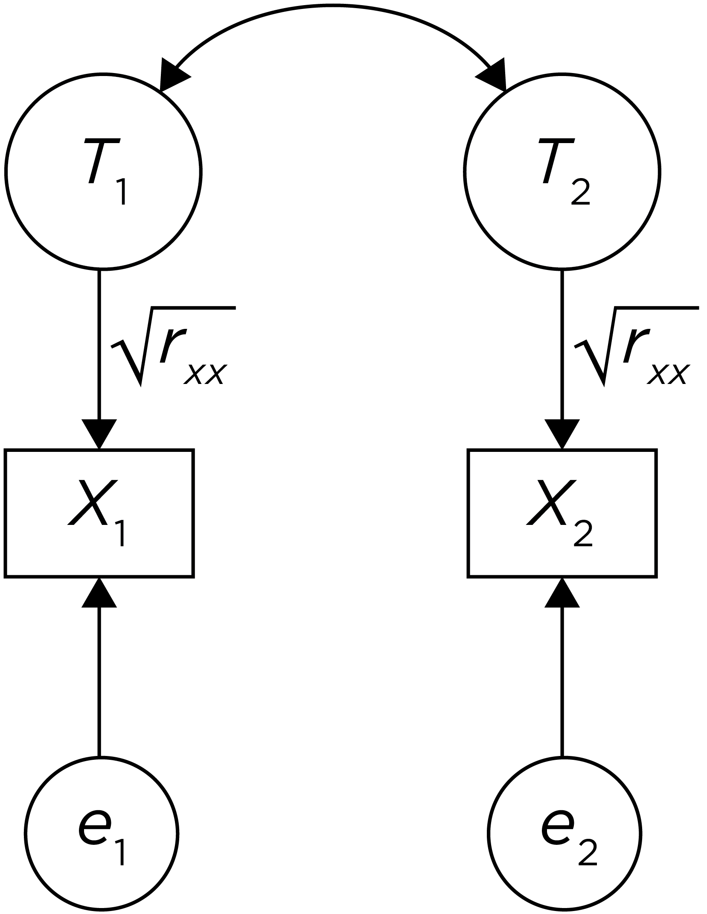
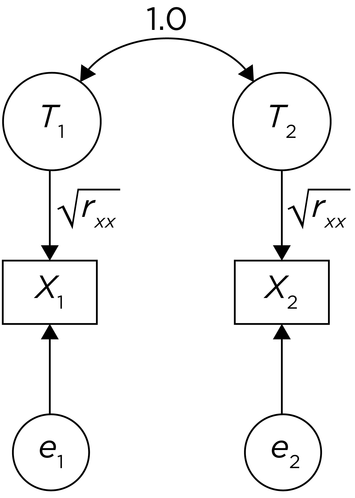

# Reliability {#reliability}

## Classical Test Theory {#ctt}

To understand the concept of reliability, it is helpful to understand *classical test theory* (CTT), which is also known as "true score theory." Classical test theory is one of various measurement theories, in addition to [item response theory](#irt) and [generalizability theory](#gTheoryReliability). CTT has been the predominant measurement theory through the history of psychology. CTT is a theory of how test scores relate to a construct. A *construct* is the concept or characteristic that a measure is intended to assess.

Let us assume you take a measurement of the same object multiple times (i.e., repeated measure). For example, you assess the mass of the same rock multiple times. However, you obtain different estimates of the rock's mass each time. There are multiple possible explanations for this observation. One possible explanation could be that the rock is changing in its mass, which would be consistent with the idea proposed by the Greek philosopher Heraclitus  that nothing is stable and the world is in flux. An alternative possibility, however, is that the rock is stable in its mass but the measurements are jittery—that is, they include error.

Based on the possibility that the rock is stable, and that differences in scores across time reflect measurement error, CTT proposes the following formula:

$$
\begin{aligned}
  X &= T + e \\
  \text{observed score} &= \text{true score} + \text{measurement error}
\end{aligned}
(\#eq:ctt)
$$

$X$ is the observed measurement or score, $T$ is the classical (or psychometric) "true score" and $e$ is the measurement error.

This formula is depicted visually in the form of a path diagram in Figure \@ref(fig:classicalTestTheory).

```{r classicalTestTheory, out.width = "100%", fig.align = "center", fig.cap = "Classical test theory formula in a path diagram.", echo = FALSE}
knitr::include_graphics("./Images/classicalTestTheory.png")
```

It is important to distinguish between the classical true score and the Platonic true score. The *Platonic true score* is the truth, and it does not depend of measurement. The Platonic true score is an abstract notion because it is not directly observable and is based on Platonic ideals and theories of the construct and what a person's "true" level is on the construct. In CTT, we attempt to approximate the Platonic true score with the classical true score, ($T$). If we took infinite repeated observations (and the measurements had no carryover effect), the average score approaches the classical true score, $T$. That is, $\overline{X} = T \text{ as number of observations} \rightarrow \infty$. CTT attempts to partition variance into different sources. *Variance* is an index of scores' variability, i.e., the degree to which scores differ. Variance is defined as the average squared deviation from the mean:

$$
\sigma^2_X = E[(X - \mu^2)]
(\#eq:variance)
$$

According to CTT, any observed measurement includes both true score (construct) variance ($\sigma^2_T$) and error variance ($\sigma^2_e$). Given the true score formula ($X = T + e$), this means that their variance is:

$$
\begin{aligned}
  \sigma^2_X &= \sigma^2_T + \sigma^2_e \\
  \text{observed score variance} &= \text{true score variance} + \text{error variance}
\end{aligned}
(\#eq:observedScoreVariance)
$$

Nevertheless, The *classical true score*, $T$, is the expected value and is not necessarily the same thing as the Platonic true score [@Borsboom2003; @Klein1969], because the expected value would need to be entirely valid/accurate (i.e., it would need to be the construct score) for it to be the Platonic true score. The expected score could also be influenced by systematic sources of error such as other constructs, which would not fall into the error portion of the CTT formula because, as described below, CTT assumes that error is random (not systematic).

The true score formula is theoretically useful, but it is not practically useful because it is an under-identified equation and we do not know the values of $T$ or $e$ based on knowing the observed score ($X$). For instance, if we obtain an observed score of 10, our formula is $10 = T + e$, and we do not know what the true score or error is. As a result, CTT makes several simplifying assumptions so we can estimate how stable (reliable) or noisy the measure is, and what proportion of the observed score reflects true score versus measurement error.

1. $E(e) = 0$

    The first assumption of CTT is that the expected value of the error is zero. Basically, the errors are expected to be random with a mean of zero. The likelihood that the observed score is an overestimate of $T$ is assumed to be the same as the likelihood that the observed score is an underestimate of $T$. In other words, the distribution of errors above $T$ is assumed to be the same as the distribution of errors below $T$. In reality, this assumption is likely false in many situations. For instance, social desirability bias is a systematic error where people rate themselves as better than they actually are; social desirability biases scores in a particular direction across respondents, so errors would not be entirely random. But using the assumption that the expected value of $e$ is zero, also informs that the expected value of the observed score ($X$) equals the expected value of the true score ($T$):
    
$$
\begin{aligned}
  E(X) &= E(T + e) \\
  &= E(T) + E(e) \\
  &= E(T) + 0 \\
  &= E(T)
\end{aligned}
(\#eq:expectedValueObservedScore)
$$

2. $r_{T,e} = 0$

    The second assumption is that the correlation between $T$ and $e$ is zero—that is, true scores and errors are uncorrelated. However, this assumption is likely false in many situations. For instance, one can imagine that, on a a paper-and-pencil intelligence test, scores may have greater error for respondents with lower true scores and may have less error for respondents with higher true scores.

3. $r_{e_1, e_2} = 0$

    The third assumption is that errors at time 1 ($e_1$) are not associated with errors at time 2 ($e_2$). However, this assumption is also likely false in many situations. For example, if some people have a high social desirability bias at time 1, they are likely to also have a high social desirability bias at time 2. That is, the errors are likely to be related across time.

These three assumptions are depicted in the path analytic diagram in Figure \@ref(fig:reliabilityPathDiagram1), which depicts the CTT approach to understanding reliability of a measure across two time points.

```{r reliabilityPathDiagram1, out.width = "100%", fig.align = "center", fig.cap = "Reliability of a measure across two time points, as depicted in a path diagram.", echo = FALSE}
knitr::include_graphics("./Images/Reliability_1.png")
```

In path analytic (and structural equation modeling) language, rectangles represent variables we observe, and circles represent latent (i.e., unobserved) variables. The observed scores at time 1 ($X_1$) and time 2 ($X_2$) are entities we observe, so they are represented by rectangles. We do not directly observe the true scores ($T_1, T_2$) and errors ($e_1, e_2$), so they are considered latent entities and are represented by circles. Single-headed arrows indicate regression paths, where conceptually, one variable is thought to influence another variable. As the model depicts, the observed scores  are thought to be influenced both by true scores and by error. We also expect the true scores at time 1 ($T_1$) and time 2 ($T_2$) to be correlated, so we have a covariance path, as indicated by a double-headed arrow. A *covariance* is an unstandardized index of the strength of association between two variables. Because a covariance is unstandardized, its scale depends on the scale of the variables. The covariance between two variables is the average product of their deviations from their respective means:

$$
\sigma_{XY} = E[(X - \mu_X)(X - \mu_Y)]
(\#eq:covariance)
$$

The covariance of a variable with itself is equivalent to its variance:

$$
\begin{aligned}
  \sigma_{XX} &= E[(X - \mu_X)(X - \mu_X)] \\
  &= E[(X - \mu_X)^2] \\
  &= \sigma^2_X
\end{aligned}
(\#eq:covarianceVariance)
$$

By contrast, a *correlation* is a standardized index of the strength of association between two variables. Because a correlation is standardized (fixed between [-1,1]), its scale does not depend on the scales of the variables. In this figure, no other parameters (regressions, covariances, or means) are specified, so implicit in the diagram:

- $E(e) = 0$
- $r_{T,e} = 0$
- $r_{e_1, e_2} = 0$

The factor loadings reflect the magnitude that the latent factor influences the observed variable. In this case, the true scores influence the observed scores with a magnitude of $\sqrt{r_{xx}}$, which is known as the *index of reliability*. The index of reliability is the theoretical estimate of the correlation between the true scores and the observed scores. This is depicted in Figure \@ref(fig:reliabilityPathDiagram2).

```{r reliabilityPathDiagram2, out.width = "100%", fig.align = "center", fig.cap = "Reliability of a measure across two time points, as depicted in a path diagram.", echo = FALSE}

```

We can use path tracing rules to estimate the reliability of the measure, where the reliability of the measure, i.e., the *coefficient of reliability* ($r_{xx}$), is estimated as the correlation between $x_1$ and $x_2$. According to path tracing rules [@Pearl2013], the correlation between $x_1$ and $x_2$ is equal to the sum of the standardized coefficients of all the routes through which $x_1$ and $x_2$ are connected. The contribution of a given route to the correlation between $x_1$ and $x_2$ is equal to the product of all standardized coefficients on that route that link $x_1$ and $x_2$ that move in the following directions: (a) forward (e.g., $T_1$ to $x_1$), or (b) backward once and then forward ($x_1$ to $T_1$ to $T_2$ to $x_2$). Path tracing does not allow moving forward and then backward—that is, it does not allow retracing (e.g., $e$ to $x_1$ to $T_1$) in the same route. It also does not allow passing through through more than one curved arrow (covariance path) or through the same variable twice in the same route. Once you know the contribution of each route to the correlation, you can calculate the total correlation between the two variables as the sum of the contribution of each route. Therefore, using one route, we can calculate the association between $x_1$ and $x_2$ as:

$$
\begin{aligned}
 r_{x_1,x_2} &= \sqrt{r_{xx}} \times r_{T_1,T_2} \times \sqrt{r_{xx}} \\
 &= r_{T_1,T_2} \times r_{xx} \\
 &= \text{correlation of true scores across time} \times \text{reliability}
\end{aligned}
(\#eq:associationBetweenTwoVars)
$$

When dealing with a stable construct, we would assume that the correlation between true scores across time is 1.0: $r_{T_1,T_2} = 1.0$, as depicted in Figure \@ref(fig:reliabilityPathDiagram3).

```{r reliabilityPathDiagram3, out.width = "100%", fig.align = "center", fig.cap = "Reliability of a measure of a stable construct across two time points, as depicted in a path diagram.", echo = FALSE}

```

Then, to calculate the association between $x_1$ and $x_2$ of a stable construct using path tracing rules:

$$
\begin{aligned}
 r_{x_1,x_2} &= \sqrt{r_{xx}} \times r_{T_1,T_2} \times \sqrt{r_{xx}} \\
 &= \sqrt{r_{xx}} \times 1 \times \sqrt{r_{xx}} \\
 &= r_{xx} \\
 &= \text{coefficient of reliability}
\end{aligned}
(\#eq:reliabilityCoefficient)
$$

That is, for a stable construct (i.e., whose true scores are perfectly correlated across time; $r_{T_1,T_2} = 1.0$), we estimate reliability as the correlation between the observed scores at time 1 ($x_1$) and the observed scores at time 2 ($x_2$). This is known as *test–retest reliability*. We therefore assume that the extent to which the correlation between $x_1$ and $x_2$ is less than one reflects measurement error (an unstable measure), rather than people's changes in their true score on the construct (an unstable construct).

As described above, the reliability coefficient ($r_{xx}$) is the association between a measure and itself over time, or with another measure in the domain. By contrast, the *reliability index* ($r_{xT}$) is the correlation between observed scores on a measure and the true scores [@Nunnally1994]. It is the square root of the reliability coefficient.

$$
\begin{aligned}
 r_{xT} &= \\
 &= \sqrt{r_{xx}} \\
 &= \text{index of reliability}
\end{aligned}
(\#eq:reliabilityIndex)
$$

## Measurement Error {#measurementError}

Measurement error is the difference between the measured (observed) value and the true value. All measurements come with uncertainty and measurement error. Even a measure of something as simple as whether someone is dead has error.

There are two main types of measurement error: systematic (nonrandom) errors and unsystematic (random) errors. In addition, measurement error can be within-person, between-person, or both.

### Systematic (Nonrandom) Error {#systematicError}

*Systematic errors* are depicted in Figure \@ref(fig:systematicError). Systematic errors are errors than influence consistently for a person or across the sample. They are errors that always occur, with the same value, when using the measure in the same way and in the same case. An example of a systematic error is a measure that consistently assesses constructs other than the construct the measure was designed to assess. For instance, if a test written in English to assess math skills is administered in a non-native English-speaking country, some portion of the scores will reflect variance attributable to English reading skills rather than the construct of interest (math skills). Other examples of systematic errors include response styles or subjective, idiosyncratic judgments by a rater—for instance, if the rater's judgments are systematically harsh or lenient. Systematic errors affect the average score (i.e., they result in bias) which makes the group-level estimates less accurate, and they make the measurements for an individual less accurate.

As depicted in Figure \@ref(fig:systematicError), systematic error does not affect the variability of the scores but it does affect the mean of the scores, so the person-level or group-level mean is less accurate. In other words, the systematic errors leads to a biased estimate of the average. However, multiple systematic errors may simultaneously co-exist and can operate in the same direction (exacerbating the magnitude of bias) or in opposite directions (suppressing the magnitude of bias).

```{r systematicError, echo = FALSE, message = FALSE, results = "hide", out.width = "100%", fig.cap = "Systematic error."}
library("tidyverse")
library("viridis")

sampleSize <- 1000
set.seed(52242)

rawMeasure <- data.frame(score = rnorm(sampleSize), measure = "rawMeasure")
addSystematicError <- data.frame(score = rawMeasure$score + 1, measure = "addSystematicError")
addRandomError <- data.frame(score = rawMeasure$score + rnorm(sampleSize), measure = "addRandomError")

errorList <- list(rawMeasure, addSystematicError, addRandomError)
errorData <- bind_rows(errorList)

ggplot(errorData %>% filter(measure != "addRandomError"), aes(x = score, fill = measure)) +
  geom_density(alpha = 0.25) +
  scale_fill_viridis_d(name = "",
                       breaks = c("rawMeasure", "addSystematicError"),
                       labels = c("Raw Measure", "Measure with Systematic Error Added")) +
  theme_bw() +
  theme(legend.position = "top")
```

### Unsytematic (Random) Error {#unsystematicError}

*Unsystematic (random) errors* are depicted in Figure \@ref(fig:systematicError). Random errors occur due to chance. For instance, they could arise from a participant being fatigued on a particular testing day, or from a participant getting luck in guessing the correct answer. Random errors do not have consistent effects for a person or across the sample, and they may vary from one observation to another. Random errors do not affect the average, i.e., the group-level estimate—they only affect the variability around the average (noise). However, random errors make measurements for an individual less accurate. A large number of observations of the same construct cancels out random errors, but does not cancel out systematic errors.

As depicted in Figure \@ref(fig:unsystematicError), random error does not affect the mean of the scores but it does increase the variability of the scores. In other words, the group-level mean is still accurate, but individuals' scores are less precise.

```{r unsystematicError, echo = FALSE, message = FALSE, results = "hide", out.width = "100%", fig.cap = "Random error."}
ggplot(errorData %>% filter(measure != "addSystematicError"), aes(x = score, fill = measure)) +
  geom_density(alpha = 0.25) +
  scale_fill_viridis_d(name = "",
                       breaks = c("rawMeasure", "addRandomError"),
                       labels = c("Raw Measure", "Measure with Random Error Added")) +
  theme_bw() +
  theme(legend.position = "top")
```

### Within-Person Error

Let us consider two data columns, one column for participants' scores at time 1 and another column for participants' scores at time 2. Adding within-person error would mean adding noise ($e$) within the given row (or rows) for the relevant participant(s). Adding between-person error would mean adding noise ($e$) across the rows within the column. 

Within-person errors occurs within a particular person. For instance, you could add within-person error to a dataset by adding error to the given row (or rows) for the relevant participant(s).

### Between-Person Error

Between-person error occurs across the sample. You could add between-person random error to a variable by adding adding error across the rows, within a column.

### Types of Measurement Error

There are four non-mutually exclusive types of measurement error: within-person random error, within-person random error, between-person random error, and between-person systematic error. The four types of measurement error are depicted in Figure \@ref(fig:measurementErrorTypes), as adapted from [@Willett2012].

```{r measurementErrorTypes, out.width = "100%", fig.align = "center", fig.cap = "Types of measurement error.", echo = FALSE}
knitr::include_graphics("./Images/MeasurementErrorTypes.png")
```

#### Within-Person Random Error

Adding within-person random error would involve adding random noise ($e$) to the given row (or rows) for the relevant participant(s). This could reflect momentary fluctuations in the assessment for a specific person. When adding within-person random error, the person’s and group’s measurements show no bias, i.e., there is no consistent increase or decrease in the scores from time 1 to time 2 (at least with a sample size large enough to cancel out the random error, according to the law of large numbers).	A person’s average approximates their true score if many repeated measurements are taken. A group’s average approximates the sample mean’s true score, especially when averaging the repeated measures across time. The influence of within-person random error is depicted in Figure \@ref(fig:withinPersonRandomError).

```{r withinPersonRandomError, out.width = "100%", fig.align = "center", fig.cap = "Within-person random error.", echo = FALSE}
knitr::include_graphics("./Images/Error_Within-PersonRandom.png")
```

#### Within-Person Systematic Error

Adding within-person systematic error would involve adding systematic noise ($e$) (the same variance across columns) to the given row (or rows), reflecting the relevant participant(s). These are within-person effects that are consistent across time. For example, social desirability bias is high for some people and low for others. Another instance in which within-person systematic error could have is of one or more people consistently misinterpret a particular question. Within-person systematic error increases person-level bias because the person’s mean shows a greater difference from their true score. The influence of within-person systematic error is depicted in Figure \@ref(fig:withinPersonSystematicError).

```{r withinPersonSystematicError, out.width = "100%", fig.align = "center", fig.cap = "Within-person systematic error.", echo = FALSE}
knitr::include_graphics("./Images/Error_Within-PersonSystematic.png")
```

#### Between-Person Random Error

Adding between-person random error at time 2 would involve adding random noise ($e$) across the rows, within the column.	Between-person random error would result in bias at the person-level but not at the group-level. It results in over-estimates of the person's true score for some people and under-estimates for other people, i.e., there is no consistent pattern across the sample. Thus, the group average approximates the sample’s mean true score (at least with a sample size large enough to cancel out the random error, according to the law of large numbers). However, the group’s variance is inflated. The influence of between-person random error is depicted in Figure \@ref(fig:betweenPersonRandomError).

```{r betweenPersonRandomError, out.width = "100%", fig.align = "center", fig.cap = "Between-person random error.", echo = FALSE}
knitr::include_graphics("./Images/Error_Between-PersonRandom.png")
```

#### Between-Person Systematic Error

Adding between-person systematic error at time 2 would involve adding systematic noise ($e$) across the rows, within the column. Between person systematic errors result from within-person errors that tend to be negative or positive across participants. For instance, this could reflect an influence with a shared effect across subjects. For example, social desirability leads to a positive group-level bias for rating their socially desirable attributes. Another example would be when a research assistant enters values wrong at time 2 (e.g., adding 10 to all participants’ scores). Between-person systematic error increases bias because it results in a greater group mean difference from the group’s mean true score. The influence of between-person systematic error is depicted in Figure \@ref(fig:betweenPersonSystematicError).

```{r betweenPersonSystematicError, out.width = "100%", fig.align = "center", fig.cap = "Between-person systematic error.", echo = FALSE}
knitr::include_graphics("./Images/Error_Between-PersonSystematic.png")
```

### Summary

In sum, all types of measurement error (whether systematic or random) lead to less accurate scores for an individual. But, different kinds of errors have different implications. Systematic and random error have different effects on accuracy at the group-level. Systematic error leads to less accurate estimates at the group-level whereas random error does not.

CTT assumes that all errors are random. According to CTT, as the number of measurements approaches infinity, the mean of the measurements gets closer to the true score, becuase the random errors cancel each other out. With more measurements, we reduce our uncertainty and increase our precision. According to CTT, if we take many measurements and the average of the measurements is 10, we have some confidence that $T \approx 10$. In reality, however, error for a given measure likely includes both systematic and random error.

## Overview of Reliability

The "Standards for Educational and Psychological Testing" set the standard for educational and psychological assessment, and are jointly published by the American Educational Research Association, American Psychological Association, and National Council on Measurement in Education. According to the "Standards" [@AERA2014, p. 33], reliability is the "consistency of the scores across instances of the testing procedure". In this book, I define reliability as how much repeatability, consistency, and precision the scores from a measure have.

Reliability ($r_{xx}$) has been defined mathematically as the proportion of observed score variance ($\sigma^2_X$) that is attributable to true score variance ($\sigma^2_T$):

$$
\begin{aligned}
 r_{xx} &= \frac{\sigma^2_T}{\sigma^2_T + \sigma^2_e} \\
 &= \frac{\sigma^2_T}{\sigma^2_X} \\
 &= \frac{\text{true score variance}}{\text{observed score variance}} \\
\end{aligned}
(\#eq:reliabilityRatio)
$$

An alternative formulation is that reliability ($r_{xx}$) is the the lack of error variance or the degree to which observed scores are uncorrelated with error scores. In CTT, reliability can be conceptualized in four primary ways, as depicted in Figure \@ref(fig:conceptualizingReliability) [@Furr2017].

```{r conceptualizingReliability, out.width = "100%", fig.align = "center", fig.cap = "Four different ways of conceptualizations reliability.", echo = FALSE}
knitr::include_graphics("./Images/conceptualizingReliability.png")
```

However, we cannot *calculate* reliability because we cannot measure the true score component of an observation. Therefore, we *estimate* reliability (the coefficient of reliability) based on the relation between two observations of the same measure (for test–retest reliability), or using other various estimates of reliability.

The coefficient of reliability can depend on several factors. Reliability is inversely related to the amount of measurement error. The coefficient of reliability, like correlation, also depends on the degree of spread (variance) of the scores. If the scores at one or both time points show restricted range, the scores will show a weaker association and coefficient of reliability, as shown in Figure \@ref(fig:restrictedRange). Instead of taking one person and repeatedly measuring them many times to get an estimate of their true score and the reliability of the measure, we typically estimate reliability by taking many people and doing repeated measures twice. This is a shortcut to estimate reliability, but even that is not often done. Reliability can also be related to the number of items in the measure. In general, the greater the number of items, the more reliable the measure (assuming the items assess the same construct), because we are averaging out random error.

We never see the true scores or the error scores, so we cannot compute reliability—we can only *estimate* it from the observed scores. This estimate of reliability gives a probabilistic answer of the reliability of the measure, rather than an absolute answer.

### How Reliable is Reliable Enough?

As described by @Nunnally1994, how reliable a measure should be depends on the proposed uses. If it is early in the research process, and the focus is on group-level inferences (e.g., associations or group differences), modest reliability (e.g., .70) may be sufficient and save time and money. Then, the researcher can see what the associations would be when disattenuated for unreliability, as described in Section \@ref(effectOfMeasurementErrorOnAssociations) of the chapter on validity. If the disattenuated associations are promising, it may be worth increasing the reliability of the measure. Associations are only weakly attenuated above a reliability of .80, so this may be an appropriate target for basic research.

However, when making decisions about individual people from their score on a measure, reliability and precision are more important because small difference in scores can lead to different decisions. @Nunnally1994 recommend that measures have at least a reliability of .90, and preferably a reliability of .95 or higher when making important decisions about individual people. Nevertheless, they also note that one should not switch to a less valid measure merely because it is more reliable.

### Standard Error of Measurement (SEM) {#standardErrorofMeasurement}

The estimate of reliability gives a general idea of the degree of uncertainty you have of a person's true score given their observed score. From this, we can estimate the standard error of measurement, which estimates the extent to which an observed score deviates from a true score. The standard error of measurement indicates the typical distance of the observed score from the true score.

$$
\text{standard error of measurement (SEM)} = \sigma_x \sqrt{1 - r_{xx}}
(\#eq:standardErrorOfMeasurement)
$$

where $\sigma_x$ represents the standard deviation of scores. Thus, the standard error of measurement is directly related to the reliability of the measure. The higher the reliability, the lower the standard error of measurement.

```{r standardErrorOfMeasurementPlot, echo = FALSE, message = FALSE, results = "hide", out.width = "100%", fig.height = 4, fig.cap = "Standard error of measurement as a function of reliability"}
library("ggplot2")

standardErrorOfMeasurementData <- expand.grid(reliability = seq(0, 1, by = 0.01),
                                              sd = c(1, 3, 5, 10))

standardErrorOfMeasurementData$sem <- standardErrorOfMeasurementData$sd * sqrt(1 - standardErrorOfMeasurementData$reliability)

ggplot(standardErrorOfMeasurementData, aes(reliability, sem, group = as.factor(sd), color = as.factor(sd))) +
  geom_line(size = 1.5) +
  theme_bw() +
  xlab("Reliability") +
  ylab("Standard Error of Measurement") + 
  scale_color_viridis_d(name = "Standard Deviation of Scores") +
  theme(legend.justification = c(1,1), legend.position = c(1,1)) +
  theme(legend.background = element_rect(color = "black", fill = "white", linetype = "solid"))
```

Here is the derivation of the SEM (from W. Joel Schneider):

$$
\begin{aligned}
  \text{Remember, based on } X = T + e: && \sigma^2_X &= \sigma^2_T + \sigma^2_e \\
  \text{Solve for }\sigma^2_T: && \sigma^2_T &= \sigma^2_X - \sigma^2_e \\
  \text{Remember:} && r_{xx} &= \frac{\sigma^2_T}{\sigma^2_X} \\
  \text{Substitute for } \sigma^2_T: && &= \frac{\sigma^2_X - \sigma^2_e}{\sigma^2_X} \\
  \text{Multiply by } \sigma^2_X: && \sigma^2_X \cdot r_{xx} &= \sigma^2_X - \sigma^2_e \\
  \text{Solve for } \sigma^2_e: && \sigma^2_e &= \sigma^2_X - \sigma^2_X \cdot r_{xx} \\
  \text{Factor out } \sigma^2_X: && \sigma^2_e &= \sigma^2_X (1 - r_{xx}) \\
  \text{Take the square root:} && \sigma_e &= \sigma_X \sqrt{1 - r_{xx}}
\end{aligned}
(\#eq:standardErrorOfMeasurementDerivation)
$$

The SEM is equivalent to the standard deviation of measurement error ($e$) [@Lek2018a]:

$$
\begin{aligned}
  \text{standard error of measurement (SEM)} &= \sigma_x \sqrt{1 - r_{xx}} \\
  &= \sqrt{\sigma_x^2} \sqrt{1 - r_{xx}} \\
  &= \sqrt{\sigma_x^2(1 - r_{xx})} \\
  &= \sqrt{\sigma_x^2 - \sigma_x^2 \cdot r_{xx}} \\
  &= \sqrt{\sigma_x^2 - \sigma_x^2 \frac{\sigma^2_T}{\sigma_x^2}} \\
  &= \sqrt{\sigma_x^2 - \sigma^2_T} \\
  &= \sqrt{\sigma^2_e} \\
  &= \sigma_e \\
\end{aligned}
(\#eq:standardErrorOfMeasurementAlternative)
$$

Around 95% of scores would be expected to fall within $\pm 2 \text{ SEMs}$ of the true score (or, more precisely, within $\pm `r qnorm(.975)` \text{ SEMs}$ of the true score). In other words, 95% of the time, the true score is expected to fall within $\pm 2 \text{ SEMs}$ of the observed score. Given an observed score of $X = 15$ and $\text{SEM} = 2$, the 95% confidence interval of the true score is [11, 19]. So, if a person's get a score of 15 on the measure, 95% of the time, their true score is expected to fall within 11–19. I provide an empirical example below of estimating the SEM in Section \@ref(standardErrorofMeasurement).

Based on the preceding discussion, consider the characteristics of measures that make them more useful from a reliability perspective. A useful measure would show wide variation across people (individual differences), so we can more accurately estimate its reliability. And we would expect a useful measure to show consistency, stability, precision, and reliability of scores.

## Getting Started

Now that we have discussed some introductory concepts involving reliability, applied examples in R are provided below. Each chapter that has R examples in this book has a section on "Getting Started" which provides the code to load relevant libraries, load data files, simulate data, add missing data, conduct calculations, and more.

### Load Libraries

```{r, message = FALSE, warning = FALSE}
library("psych")
library("blandr")
library("MBESS")
library("lavaan")
library("psychmeta")
library("irrCAC")
library("gtheory")
library("tidyverse")
library("tinytex")
library("knitr")
library("rmarkdown")
library("bookdown")
```

### Prepare Data

#### Simulate Data

For reproducibility, I set the seed below. Using the same seed will yield the same answer every time. There is nothing special about this particular seed.

```{r}
sampleSize <- 100

set.seed(52242)

rater1continuous <- rnorm(n = sampleSize, mean = 50, sd = 10)
rater2continuous <- rater1continuous + rnorm(n = sampleSize, mean = 0, sd = 4)
rater3continuous <- rater2continuous + rnorm(n = sampleSize, mean = 0, sd = 8)

rater1categorical <- sample(c(0,1), size = sampleSize, replace = TRUE)
rater2categorical <- rater1categorical
rater3categorical <- rater1categorical

rater2categorical[sample(1:length(rater2categorical), size = 10, replace = FALSE)] <- 0
rater3categorical[sample(1:length(rater3categorical), size = 10, replace = FALSE)] <- 1

time1 <- rnorm(n = sampleSize, mean = 50, sd = 10)
time2 <- time1 + rnorm(n = sampleSize, mean = 0, sd = 4)
time3 <- time2 + rnorm(n = sampleSize, mean = 0, sd = 8)

item1 <- rnorm(n = sampleSize, mean = 50, sd = 10)
item2 <- item1 + rnorm(n = sampleSize, mean = 0, sd = 4)
item3 <- item2 + rnorm(n = sampleSize, mean = 0, sd = 8)
item4 <- item3 + rnorm(n = sampleSize, mean = 0, sd = 12)

Person <- as.factor(rep(1:6, each = 8))
Occasion <- Rater <- as.factor(rep(1:2, each = 4, times = 6))
Item <- as.factor(rep(1:4, times = 12))
Score <- c(9,9,7,4,9,8,5,5,9,8,4,6,
           6,5,3,3,8,8,6,2,8,7,3,2,
           9,8,6,3,9,6,6,2,10,9,8,7,
           8,8,9,7,6,4,5,1,3,2,3,2)
```

#### Add Missing Data

Adding missing data to dataframes helps make examples more realistic to real-life data, and helps you get in the habit of programming to account for missing data.

```{r}
rater1continuous[c(5,10)] <- NA
rater2continuous[c(10,15)] <- NA
rater3continuous[c(10)] <- NA

rater1categorical[c(5,10)] <- NA
rater2categorical[c(10,15)] <- NA
rater3categorical[c(10)] <- NA

time1[c(5,10)] <- NA
time2[c(10,15)] <- NA
time3[c(10)] <- NA

item1[c(5,10)] <- NA
item2[c(10,15)] <- NA
item3[c(10)] <- NA
item4[c(10)] <- NA
```

#### Combine data into data frame

```{r}
mydata <- data.frame(rater1continuous, rater2continuous, rater3continuous,
                     rater1categorical, rater2categorical, rater3categorical,
                     time1, time2, time3,
                     item1, item2, item3, item4)

pio_cross_dat <- data.frame(Person, Item, Score, Occasion)
```

## Types of Reliability {#typesOfReliability}

Reliability is not one thing. There are several types of reliability. In this book, I focus on [test–retest](#testRetest-reliability), [inter-rater](#interrater-reliability), [intra-rater](#intrarater-reliability), [parallel-forms](#parallelForms-reliability), and [internal consistency](#internalConsistency-reliability) reliability.

### Test–Retest Reliability {#testRetest-reliability}

Test–retest reliability is defined as the consistency of scores across time. Typically, this is based on a two-week retest interval. The intent of a two-week interval between the original testing and the retest is to provide adequate time to pass to reduce any carryover effects from the original testing while not allowing too much time to pass such that the person's level on the construct (i.e., true scores) would change. [**DEFINE CARRYOVER effects**] Examples of carryover effects resulting from repeated measurement can include fatigue, boredom, learning (practice effects), etc. Another potential issue is that measurement errors can be correlated across the two measurements.

Test–retest reliability controls for transient error and random response error. If the construct is not stable across time (i.e., people's true scores change), test–retest reliability is not relevant because the CTT approach to estimating reliability assumes that the true scores are perfectly correlated across time (see Section \@ref(ctt)).

The length of the optimal retest interval depends on the construct of interest. For a construct in which people's levels change rapidly, a shorter retest interval may be appropriate. But one should pay attention to ways to reduce potential carryover effects. By contrast, if the retest interval is too long, people's levels on the construct may change during that span. If people's levels on the construct change from test to retest, we can no longer assume that the true scores are perfectly correlated across time, which would violate CTT assumptions for estimating test–retest reliability of a measure. The longer the retest interval, the smaller the observed association between scores across time will tend to be. For weak associations obtained from a lengthy retest interval, it can be difficult to determine how much of this weak association reflects measurement unreliability versus people's change in their levels on the construct. Thus, when conducting studies to evaluate test–retest reliability, it is important to consider the length of the retest interval and ways to reduce carryover effects.

#### Coefficient of Stability (and Coefficient of Dependability) {#stability}

The coefficient of stability is the most widely used when reporting the test–retest reliability of a measure. It is estimated using a Pearson correlation of the scores at time 1 with the score at time 2. That is, the coefficient of stability assesses the stability of individual differences. The Pearson correlation is called the coefficient of stability when the length of the retest interval (the delay between test and retest) is on the order of days or weeks. If the retest occurs almost at the same time as the original test (e.g., a 45-minute delay), the Pearson correlation is called the *coefficient of dependability* [@Revelle2019].

I estimate the coefficient of stability below:

```{r}
cor.test(x = mydata$time1, y = mydata$time2)
cor(mydata[,c("time1","time2","time3")], use = "pairwise.complete.obs")
```

Below is a scatterplot of the time 1 scores on the x-axis and time 2 scores on the y-axis. The black line is the best-fitting linear line. The red line is a locally estimated scatterplot smoothing (LOESS) line, which uses non-parametric estimation of the best fit.

```{r}
plot(mydata$time1, mydata$time2,
     main = substitute(paste(italic(r), " = ", x, sep = ""), list(x = round(cor.test(x = mydata$time1, y = mydata$time2)$estimate, 2))))
abline(lm(time2 ~ time1, data = mydata), col = "black")
mydataNoMissing <- na.omit(mydata[,c("time1","time2")])
lines(lowess(mydataNoMissing$time1, mydataNoMissing$time2), col = "red")
```

##### Considerations about the correlation coefficient {#correlationConsiderations}

The correlation coefficient ranges from -1.0 to +1.0. The correlation coefficient ($r$) tells you two things: (1) the direction of the association (positive or negative), and (2) the magnitude of the association. If the correlation coefficient is positive, the association is positive. If the correlation coefficient is negative, the association is negative. If the association is positive, as X increases, Y increases (or conversely, as X decreases, Y decreases). If the association is negative, as X increases, Y decreases (or conversely, as X decreases, Y increases). The smaller the absolute value of the correlation coefficient (i.e., the closer the $r$ value is to zero), the weaker the association, and the flatter the slope of the best-fit line in a scatterplot. The larger the absolute value of the correlation coefficient (i.e., the closer the absolute value of the $r$ value is to one), the stronger the association, and the steeper the slope of the best-fit line in a scatterplot. See Figure \@ref(fig:rangeOfCorrelations) for a range of different correlation coefficients and what some example data may look like for each direction and strength of association.

```{r, include = FALSE}
#Simulate data with specified correlation in relation to an existing variable (https://stats.stackexchange.com/a/313138/20338)
complement <- function(y, rho, x){
  if (missing(x)) x <- rnorm(length(y)) # Optional: supply a default if `x` is not given
  y.perp <- residuals(lm(x ~ y, na.action = na.omit))
  rho * sd(y.perp) * y + y.perp * sd(y, na.rm = TRUE) * sqrt(1 - rho^2)
}

correlations <- data.frame(criterion = rnorm(1000))

correlations$v1 <- complement(correlations$criterion, -1)
correlations$v2 <- complement(correlations$criterion, -.9)
correlations$v3 <- complement(correlations$criterion, -.8)
correlations$v4 <- complement(correlations$criterion, -.7)
correlations$v5 <- complement(correlations$criterion, -.6)
correlations$v6 <- complement(correlations$criterion, -.5)
correlations$v7 <- complement(correlations$criterion, -.4)
correlations$v8 <- complement(correlations$criterion, -.3)
correlations$v9 <- complement(correlations$criterion, -.2)
correlations$v10 <-complement(correlations$criterion, -.1)
correlations$v11 <-complement(correlations$criterion, 0)
correlations$v12 <-complement(correlations$criterion, .1)
correlations$v13 <-complement(correlations$criterion, .2)
correlations$v14 <-complement(correlations$criterion, .3)
correlations$v15 <-complement(correlations$criterion, .4)
correlations$v16 <-complement(correlations$criterion, .5)
correlations$v17 <-complement(correlations$criterion, .6)
correlations$v18 <-complement(correlations$criterion, .7)
correlations$v19 <-complement(correlations$criterion, .8)
correlations$v20 <-complement(correlations$criterion, .9)
correlations$v21 <-complement(correlations$criterion, 1)
```

```{r rangeOfCorrelations, echo = FALSE, message = FALSE, results = "hide", out.width = "100%", fig.height = 12, fig.cap = "Correlation coefficients"}
par(mfrow = c(7,3), mar = c(1, 0, 1, 0))

# -1.0
plot(correlations$criterion, correlations$v1, xaxt = "n", yaxt = "n", xlab = "" , ylab = "",
     main = substitute(paste(italic(r), " = ", x, sep = ""), list(x = round(cor.test(x = correlations$criterion, y = correlations$v1)$estimate, 2))))
abline(lm(v1 ~ criterion, data = correlations), col = "black")
lines(lowess(correlations$criterion, correlations$v1), col = "red")

# -.9
plot(correlations$criterion, correlations$v2, xaxt = "n", yaxt = "n", xlab = "" , ylab = "",
     main = substitute(paste(italic(r), " = ", x, sep = ""), list(x = round(cor.test(x = correlations$criterion, y = correlations$v2)$estimate, 2))))
abline(lm(v2 ~ criterion, data = correlations), col = "black")
lines(lowess(correlations$criterion, correlations$v2), col = "red")

# -.8
plot(correlations$criterion, correlations$v3, xaxt = "n", yaxt = "n", xlab = "" , ylab = "",
     main = substitute(paste(italic(r), " = ", x, sep = ""), list(x = round(cor.test(x = correlations$criterion, y = correlations$v3)$estimate, 2))))
abline(lm(v3 ~ criterion, data = correlations), col = "black")
lines(lowess(correlations$criterion, correlations$v3), col = "red")

# -.7
plot(correlations$criterion, correlations$v4, xaxt = "n", yaxt = "n", xlab = "" , ylab = "",
     main = substitute(paste(italic(r), " = ", x, sep = ""), list(x = round(cor.test(x = correlations$criterion, y = correlations$v4)$estimate, 2))))
abline(lm(v4 ~ criterion, data = correlations), col = "black")
lines(lowess(correlations$criterion, correlations$v4), col = "red")

# -.6
plot(correlations$criterion, correlations$v5, xaxt = "n", yaxt = "n", xlab = "" , ylab = "",
     main = substitute(paste(italic(r), " = ", x, sep = ""), list(x = round(cor.test(x = correlations$criterion, y = correlations$v5)$estimate, 2))))
abline(lm(v5 ~ criterion, data = correlations), col = "black")
lines(lowess(correlations$criterion, correlations$v5), col = "red")

# -.5
plot(correlations$criterion, correlations$v6, xaxt = "n", yaxt = "n", xlab = "" , ylab = "",
     main = substitute(paste(italic(r), " = ", x, sep = ""), list(x = round(cor.test(x = correlations$criterion, y = correlations$v6)$estimate, 2))))
abline(lm(v6 ~ criterion, data = correlations), col = "black")
lines(lowess(correlations$criterion, correlations$v6), col = "red")

# -.4
plot(correlations$criterion, correlations$v7, xaxt = "n", yaxt = "n", xlab = "" , ylab = "",
     main = substitute(paste(italic(r), " = ", x, sep = ""), list(x = round(cor.test(x = correlations$criterion, y = correlations$v7)$estimate, 2))))
abline(lm(v7 ~ criterion, data = correlations), col = "black")
lines(lowess(correlations$criterion, correlations$v7), col = "red")

# -.3
plot(correlations$criterion, correlations$v8, xaxt = "n", yaxt = "n", xlab = "" , ylab = "",
     main = substitute(paste(italic(r), " = ", x, sep = ""), list(x = round(cor.test(x = correlations$criterion, y = correlations$v8)$estimate, 2))))
abline(lm(v8 ~ criterion, data = correlations), col = "black")
lines(lowess(correlations$criterion, correlations$v8), col = "red")

# -.2
plot(correlations$criterion, correlations$v9, xaxt = "n", yaxt = "n", xlab = "" , ylab = "",
     main = substitute(paste(italic(r), " = ", x, sep = ""), list(x = round(cor.test(x = correlations$criterion, y = correlations$v9)$estimate, 2))))
abline(lm(v9 ~ criterion, data = correlations), col = "black")
lines(lowess(correlations$criterion, correlations$v9), col = "red")

# -.1
plot(correlations$criterion, correlations$v10, xaxt = "n", yaxt = "n", xlab = "" , ylab = "",
     main = substitute(paste(italic(r), " = ", x, sep = ""), list(x = round(cor.test(x = correlations$criterion, y = correlations$v10)$estimate, 2))))
abline(lm(v10 ~ criterion, data = correlations), col = "black")
lines(lowess(correlations$criterion, correlations$v10), col = "red")

# 0.0
plot(correlations$criterion, correlations$v11, xaxt = "n", yaxt = "n", xlab = "" , ylab = "",
     main = substitute(paste(italic(r), " = ", x, sep = ""), list(x = round(cor.test(x = correlations$criterion, y = correlations$v11)$estimate, 2))))
abline(lm(v11 ~ criterion, data = correlations), col = "black")
lines(lowess(correlations$criterion, correlations$v11), col = "red")

# 0.1
plot(correlations$criterion, correlations$v12, xaxt = "n", yaxt = "n", xlab = "" , ylab = "",
     main = substitute(paste(italic(r), " = ", x, sep = ""), list(x = round(cor.test(x = correlations$criterion, y = correlations$v12)$estimate, 2))))
abline(lm(v12 ~ criterion, data = correlations), col = "black")
lines(lowess(correlations$criterion, correlations$v12), col = "red")

# 0.2
plot(correlations$criterion, correlations$v13, xaxt = "n", yaxt = "n", xlab = "" , ylab = "",
     main = substitute(paste(italic(r), " = ", x, sep = ""), list(x = round(cor.test(x = correlations$criterion, y = correlations$v13)$estimate, 2))))
abline(lm(v13 ~ criterion, data = correlations), col = "black")
lines(lowess(correlations$criterion, correlations$v13), col = "red")

# 0.3
plot(correlations$criterion, correlations$v14, xaxt = "n", yaxt = "n", xlab = "" , ylab = "",
     main = substitute(paste(italic(r), " = ", x, sep = ""), list(x = round(cor.test(x = correlations$criterion, y = correlations$v14)$estimate, 2))))
abline(lm(v14 ~ criterion, data = correlations), col = "black")
lines(lowess(correlations$criterion, correlations$v14), col = "red")

# 0.4
plot(correlations$criterion, correlations$v15, xaxt = "n", yaxt = "n", xlab = "" , ylab = "",
     main = substitute(paste(italic(r), " = ", x, sep = ""), list(x = round(cor.test(x = correlations$criterion, y = correlations$v15)$estimate, 2))))
abline(lm(v15 ~ criterion, data = correlations), col = "black")
lines(lowess(correlations$criterion, correlations$v15), col = "red")

# 0.5
plot(correlations$criterion, correlations$v16, xaxt = "n", yaxt = "n", xlab = "" , ylab = "",
     main = substitute(paste(italic(r), " = ", x, sep = ""), list(x = round(cor.test(x = correlations$criterion, y = correlations$v16)$estimate, 2))))
abline(lm(v16 ~ criterion, data = correlations), col = "black")
lines(lowess(correlations$criterion, correlations$v16), col = "red")

# 0.6
plot(correlations$criterion, correlations$v17, xaxt = "n", yaxt = "n", xlab = "" , ylab = "",
     main = substitute(paste(italic(r), " = ", x, sep = ""), list(x = round(cor.test(x = correlations$criterion, y = correlations$v17)$estimate, 2))))
abline(lm(v17 ~ criterion, data = correlations), col = "black")
lines(lowess(correlations$criterion, correlations$v17), col = "red")

# 0.7
plot(correlations$criterion, correlations$v18, xaxt = "n", yaxt = "n", xlab = "" , ylab = "",
     main = substitute(paste(italic(r), " = ", x, sep = ""), list(x = round(cor.test(x = correlations$criterion, y = correlations$v18)$estimate, 2))))
abline(lm(v18 ~ criterion, data = correlations), col = "black")
lines(lowess(correlations$criterion, correlations$v18), col = "red")

# 0.8
plot(correlations$criterion, correlations$v19, xaxt = "n", yaxt = "n", xlab = "" , ylab = "",
     main = substitute(paste(italic(r), " = ", x, sep = ""), list(x = round(cor.test(x = correlations$criterion, y = correlations$v19)$estimate, 2))))
abline(lm(v19 ~ criterion, data = correlations), col = "black")
lines(lowess(correlations$criterion, correlations$v19), col = "red")

# 0.9
plot(correlations$criterion, correlations$v20, xaxt = "n", yaxt = "n", xlab = "" , ylab = "",
     main = substitute(paste(italic(r), " = ", x, sep = ""), list(x = round(cor.test(x = correlations$criterion, y = correlations$v20)$estimate, 2))))
abline(lm(v20 ~ criterion, data = correlations), col = "black")
lines(lowess(correlations$criterion, correlations$v20), col = "red")

# 1.0
plot(correlations$criterion, correlations$v21, xaxt = "n", yaxt = "n", xlab = "" , ylab = "",
     main = substitute(paste(italic(r), " = ", x, sep = ""), list(x = round(cor.test(x = correlations$criterion, y = correlations$v21)$estimate, 2))))
abline(lm(v21 ~ criterion, data = correlations), col = "black")
lines(lowess(correlations$criterion, correlations$v21), col = "red")

dev.off() #par(mfrow = c(1,1))
```

Keep in mind that the Pearson correlation examines the strength of the *linear* association between two variables. If the association between two variables is non-linear, the Pearson correlation provides the strength of the linear trend and may not provide a meaningful index of the strength of the association between the variables. For instance, Anscombe's quartet includes four sets of data that have nearly identical basic descriptive statistics, including the same bivariate correlation, yet have very different distributions and whose association takes very different forms (see Figure \@ref(fig:anscombeQuartet)).

```{r anscombeQuartet, echo = FALSE, message = FALSE, results = "hide", out.width = "100%", fig.height = 6, fig.width = 6, fig.cap = "Anscombe's Quartet"}
anscombe

par(mfrow = c(2,2))

plot(anscombe$x1, anscombe$y1, xlab = "x", ylab = "y", xlim = c(0,20), ylim = c(0,15),
     main = substitute(paste(italic(r), " = ", x, sep = ""), list(x = round(cor.test(x = anscombe$x1, y = anscombe$y1)$estimate, 2))))
abline(lm(y1 ~ x1, data = anscombe), col = "black", lty = 2)
#lines(lowess(anscombe$x1, anscombe$y1), col = "red")

plot(anscombe$x2, anscombe$y2, xlab = "x", ylab = "y", xlim = c(0,20), ylim = c(0,15),
     main = substitute(paste(italic(r), " = ", x, sep = ""), list(x = round(cor.test(x = anscombe$x2, y = anscombe$y2)$estimate, 2))))
abline(lm(y2 ~ x2, data = anscombe), col = "black", lty = 2)
#lines(lowess(anscombe$x2, anscombe$y2), col = "red")

plot(anscombe$x3, anscombe$y3, xlab = "x", ylab = "y", xlim = c(0,20), ylim = c(0,15),
     main = substitute(paste(italic(r), " = ", x, sep = ""), list(x = round(cor.test(x = anscombe$x3, y = anscombe$y3)$estimate, 2))))
abline(lm(y3 ~ x3, data = anscombe), col = "black", lty = 2)
#lines(lowess(anscombe$x3, anscombe$y3), col = "red")

plot(anscombe$x4, anscombe$y4, xlab = "x", ylab = "y", xlim = c(0,20), ylim = c(0,15),
     main = substitute(paste(italic(r), " = ", x, sep = ""), list(x = round(cor.test(x = anscombe$x4, y = anscombe$y4)$estimate, 2))))
abline(lm(y4 ~ x4, data = anscombe), col = "black", lty = 2)
#lines(lowess(anscombe$x4, anscombe$y4), col = "red")
```

The coefficient of stability (and dependability) has important weaknesses. It is a form of *relative* reliability rather than *absolute* reliability: it examines the consistency of scores across time relative to variation across people. Higher stability coefficients reflect greater stability of individual differences—not greater stability in people's absolute level on the measure. This is a major limitation. Figure \@ref(fig:relativeReliability) depicts two example data sets that show strong relative reliability (strong coefficient of stability) but poor absolute reliability based on inconsistency in people's absolute level across time.

(ref:ampersand) &

```{r relativeReliability, out.width = "100%", fig.align = "center", fig.cap = "Hypothetical data demonstrating good relative reliability despite poor absolute reliability. The figure depicts two fictional data sets (black and red circles) which both exhibit a similar linear association. The line of best fit is the solid line in the graph and is the same for both data sets, but the black circles sit much closer to the line than the red circles, leading to a much higher coefficient of stability ($r = .99$ and $.84$, respectively). However, neither sets of circles are on the line of complete agreement represented by the dashed line in the graph. If the circles fall on the line of complete agreement, it indicates that the measure's scores show consistency in absolute scores across time. Thus, although the measures show strong relative reliability despite poor absolute reliability. Figure reprinted from @Vaz2013, Figure 1, p. 3. Vaz, S., Falkmer, T., Passmore, A. E., Parsons, R., (ref:ampersand) Andreou, P. (2013). The case for using the repeatability coefficient when calculating test–retest reliability. *PLoS ONE*, *8*(9), e73990. [https://doi.org/10.1371/journal.pone.0073990](https://doi.org/10.1371/journal.pone.0073990)", echo = FALSE}
knitr::include_graphics("./Images/relative-reliability.png")
```

Another limitation of the coefficient of stability (and dependability) is that it is sensitive to outliers. Additionally, if there are little or no individual differences in scores on a given measure, the coefficient of stability will be low relative to the true reliability because correlation coefficients tend to be attenuated in the presence of restricted range, and it may not be a useful index of reliability depending on the purpose. [**See section on cognitive reliability paradox**]. See Figure \@ref(fig:restrictedRange) for an example of how a correlation coefficient tends to be attenuated when the range of one or both of the variables has restriction of range.

Here is the correlation without and with restriction of range on $x$ (i.e., $x$ is restricted to values between 55 and 65):

```{r restrictedRange, fig.cap = "Example of correlation without and with range restriction. Filled black points represent the points in common across the two scatterplots.", out.width = "100%", fig.width = 10, fig.height = 5}
par(mfrow = c(1,2))
par(mar = c(4, 0, 3, 0), oma = c(0, 4, 0, 0))

#Plot with no restricted range
plot(mydata$time1, mydata$time3,
     main = substitute(paste("No range restriction: ", italic(r), " = ", x, sep = ""), list(x = round(cor.test(x = mydata$time1, y = mydata$time3)$estimate, 2))),
     xlab = "time1",
     ylab = "time3",
     xlim = c(25,85),
     ylim = c(25,85))
points(mydata$time1[which(mydata$time1 > 55 & mydata$time1 < 65)], mydata$time3[which(mydata$time1 > 55 & mydata$time1 < 65)], pch = 19)
abline(lm(time3 ~ time1, data = mydata), col = "black")
mydataNoMissing <- na.omit(mydata[,c("time1","time3")])
lines(lowess(mydataNoMissing$time1, mydataNoMissing$time3), col = "red")

#Plot with restricted range
plot(mydata$time1[which(mydata$time1 > 55 & mydata$time1 < 65)], mydata$time3[which(mydata$time1 > 55 & mydata$time1 < 65)],
     main = substitute(paste("Restricted range for time1 (55-65): ", italic(r), " = ", x, sep = ""), list(x = round(cor.test(x = mydata$time1[which(mydata$time1 > 55 & mydata$time1 < 65)], y = mydata$time3[which(mydata$time1 > 55 & mydata$time1 < 65)])$estimate, 2))),
     xlab = "time1",
     ylab = "time3",
     xlim = c(25,85),
     ylim = c(25,85),
     yaxt = "n",
     pch = 19)
abline(lm(time3 ~ time1, data = mydata[which(mydata$time1 > 55 & mydata$time1 < 65),]), col = "black")
mydataNoMissing <- na.omit(mydata[,c("time1","time3")])
lines(lowess(mydataNoMissing$time1[which(mydataNoMissing$time1 > 55 & mydataNoMissing$time1 < 65)], mydataNoMissing$time3[which(mydataNoMissing$time1 > 55 & mydataNoMissing$time1 < 65)]), col = "red")

mtext("time3", side = 2, outer = TRUE, line = 2.7, adj = 0.6)
```

The observed correlation became much weaker due to restriction of range. Thus, when developing measures, it is important to ensure there is adequate variability of scores (i.e., individual differences), and that scores are not truncated due to ceiling or floor effects. Moreover, when interpreting associations with truncated variability, it is important to keep in mind that the true association is likely to be even stronger than what was observed if the measures did not have restricted range.

To address these limitations of the coefficient of stability, it is important to consider additional indices of test–retest reliability, such as the coefficient of repeatability and bias that are depicted in Bland-Altman plots, as described below.

#### Coefficient of Repeatability {#repeatability}

The coefficient of repeatability ($CR$), also known as the "smallest real difference", is a form of *absolute* reliability. That is, it reflects the consistency of scores across time within a person. It is calculated as ~1.96 times the standard deviation of the mean differences between the two measurements ($d_1$ and $d_2$): https://www.medcalc.org/manual/blandaltman.php [@Bland1986; @Bland1999]. The $CR$ is used for determining the lower and upper limits of agreement because it defines the range within which 95% of differences between the two measurement methods are expected to be. The precise value is `r qnorm(.975)` (not 1.96) times the standard deviation of the within-subject differences between the two measurements. This precise value is based on the fact that 95% of the area under a standard normal distribution lies within $\pm `r qnorm(.975)`$ standard deviations of the mean. This is based on the quantile of the 2.5th ($`r qnorm(.025)`$) and 97.5th ($`r qnorm(.975)`$) percentile of the standard normal distribution (the 95% confidence interval spans the 92.5th percentile to the 97.5th percentile). However, some researchers have rounded `r qnorm(.975)` to 1.96 or to 2 for simplicity.

The smaller the coefficient of repeatability, the more consistent the scores are across time within a person. The coefficient of repeatability is tied to the units of the measure, so how small is considered "good" absolute reliability depends on the measure. In general, however, given the same units of measurement, a smaller coefficient of repeatability indicates stronger absolute test–retest reliability.

$$
CR = `r qnorm(.975)` \times \sqrt{\frac{\sum(d_1 - d_2)^2}{n}}
(\#eq:coefficientOfRepeatability)
$$

```{r}
coefficientOfRepeatability <- function(measure1, measure2){
  value <- qnorm(.975) * sd((measure1 - measure2), na.rm = TRUE)
  
  return(value)
}

coefficientOfRepeatability(measure1 = mydata$time1, measure2 = mydata$time2)
```

##### Bland-Altman Plot {#blandAltmanPlot}

The Bland-Altman plot can be useful for visualizing the degree of (in)consistency of people's absolute scores on a measure across two time points [@Bland1986; @Bland1999].

```{r blandAltman, out.width = "100%", fig.align = "center", fig.cap = "Example of a Bland-Altman plot. Figure reprinted from @Vaz2013, Figure 2, p. 4. Vaz, S., Falkmer, T., Passmore, A. E., Parsons, R., (ref:ampersand) Andreou, P. (2013). The case for using the repeatability coefficient when calculating test–retest reliability. *PLoS ONE*, *8*(9), e73990. [https://doi.org/10.1371/journal.pone.0073990](https://doi.org/10.1371/journal.pone.0073990)", echo = FALSE}
knitr::include_graphics("./Images/blandAltman.png")
```

In a Bland-Altman plot, the x-axis represents the mean of a person's score across the two time points, and the y-axis represents the within-subject differences across time points. The horizontal line at $y = 0$ is called the line of identity. Points would fall on the line of identity if people's scores showed perfect consistency in absolute level across time points. Another line reflects the bias (i.e., mean difference from the measure across the two points). The bias plus or minus the coefficient of repeatability is the upper or lower limit of agreement (LOA), respectively. The top dashed line reflects the upper LOA. The bottom dashed line reflects the lower LOA. The Bland-Altman plot was created using the `blandr` package [@R-blandr].

```{r}
BAstats <- blandr.statistics(method1 = mydata$time1, method2 = mydata$time2)
BAplotlimits <- blandr.plot.limits(BAstats)
```

```{r, out.width = "100%", fig.cap = "Bland-Altman Plot"}
blandr.plot.rplot(BAstats, plot.limits = BAplotlimits, annotate = TRUE, method1name = "T1", method2name = "T2", ciDisplay = FALSE)
```

##### Bias {#blandAltmanBias}

Bias (also known as mean error in the context of assessing accuracy against a criterion, see Section \@ref(meanError)) is the average of the within-subject differences between the two measurements. Bias values closer to zero reflect stronger absolute test–retest reliability at the group-level. However, bias values can be closer to zero and individuals can still show large differences because large positive and negative differences could cancel each other out. As a result, it is also important to examine other indices of test–retest reliability, including the coefficient of stability and the coefficient of repeatability.

```{r}
bias <- function(measure1, measure2){
  value <- mean((measure1 - measure2), na.rm = TRUE)
  
  return(value)
}

bias(measure1 = mydata$time1, measure2 = mydata$time2)
```

##### 95% Limits of Agreement

$$
\text{Lower Limit of Agreement} = \text{Bias} - \text{Coefficient of Repeatability}
(\#eq:lowerLimitOfAgreement)
$$
$$
\text{Upper Limit of Agreement} = \text{Bias} + \text{Coefficient of Repeatability}
(\#eq:upperLimitOfAgreement)
$$

It is expected that the 95% limits of agreement (LOA) include 95% of differences between the two measurement methods (assuming the scores are normally distributed), based on how the coefficient of repeatability is calculated.

```{r}
lowerLOA <- function(measure1, measure2){
  value <- bias(measure1, measure2) - coefficientOfRepeatability(measure1, measure2)
  
  return(value)
}

upperLOA <- function(measure1, measure2){
  value <- bias(measure1, measure2) + coefficientOfRepeatability(measure1, measure2)
  
  return(value)
}

lowerLOA(measure1 = mydata$time1, measure2 = mydata$time2)
upperLOA(measure1 = mydata$time1, measure2 = mydata$time2)
```

##### Regression Slope

```{r}
BAstats$regression.fixed.slope
```

##### Bland-Altman Statistics

```{r}
BAstats
```

### Inter-Rater Reliability {#interrater-reliability}

Inter-rater reliability is the consistency of scores across raters. For instance, two different raters may make a diagnostic decision for the same client, two different people may provide observational ratings of the same participant, or two different researchers may process psychophysiological data (e.g., electroencephalography, electrocardiography) from the same person. Consistency of scores can also be assessed within the same rater, which is known as *intra*-rater reliability and is described in Section \@ref(intrarater-reliability). For assessing inter-rater reliability, intraclass correlation (ICC) is recommended for continuous data, such as ratings of a participants mood. By contrast, Cohen's kappa ($\kappa$) is recommended for categorical variables, such as making a diagnostic decision whether to give someone a diagnosis of depression or not.

#### Continuous Data

Use intraclass correlation (ICC) for estimating inter-rater reliability of continuous data. ICC was estimated using the `psych` package [@R-psych].

```{r}
ICC(mydata[,c("rater1continuous","rater2continuous","rater3continuous")], missing = FALSE)
```

#### Categorical Data

For estimating the inter-rater reliability of categorical data, use Cohen's kappa, Fleiss's kappa, the S index [**Falotico & Quatto, 2010 CITATION**], or Gwet's AC1 statistic [**Gwet, 2001 CITATION; Gwetm 2014 CITATION**] [@Bakeman2020]. Cohen's kappa was estimated using the `psych` package [@R-psych]. Fleiss's kappa and Gwet's AC1 statistic were estimated using the `irrCAC` package.

```{r}
cohen.kappa(mydata[,c("rater1categorical","rater2categorical","rater3categorical")])
fleiss.kappa.raw(na.omit(mydata[,c("rater1categorical","rater2categorical","rater3categorical")]))
gwet.ac1.raw(na.omit(mydata[,c("rater1categorical","rater2categorical","rater3categorical")]))
```

### Intra-Rater Reliability {#intrarater-reliability}

Principles of intra-rater are similar to principles of inter-rater reliability (described in Section \@ref(interrater-reliability)), except the *same* rater provides ratings on two occasions, rather than using multiple raters.

### Parallel- (or Alternate-) Forms Reliability {#parallelForms-reliability}

Parallel-forms reliability (also known as alternate-forms reliability) is the consistency of scores across two parallel forms. Parallel forms are two equivalent measures of the same construct that differ in content or format. The two measures can be administered in the same occasion, known as *immediate parallel-forms reliability*, or they can be administered separated by a delay, known as *delayed parallel-forms reliability*. Similar considerations of length of delay duration and ways to reduce carryover effects are relevant to parallel-forms reliability as they are to test–retest reliability.

Parallel-forms reliability is often estimated with the Pearson correlation, which is known as the *coefficient of equivalence*. The coefficient of equivalence is the consistency of scores across two parallel forms relative to variation across people. It is interpreted as the ratio of true score variance to observed score variance, consistent with the formal definition of reliability.

An example of parallel-forms reliability would be if we want to assess a participant twice with different measures of the same construct to avoid practice effects. This approach is often conducted in academic achievement testing, and it could involve retesting that is immediate or delayed. For instance, we could administer item set A at time 1 and item set B at time 2 for the same participant to get rid of any possibility that the person's score differed across time because of improved performance that resulted merely from prior exposure to the same items. Many standardized academic achievement and aptitude tests have developed parallel forms, including the the SAT, ACT, and GRE.

Parallel-forms reliability controls for specific error, i.e., error that is particular to a specific measure. However, parallel-forms reliability has the limitation that it assumes that the parallel forms are equivalent, such that it makes no difference which test you use. More specifically, two forms are considered equivalent when they assess the same construct, have the same mean and variance of scores, and have the same inter-correlations with external criteria. Though, technically, two instruments are only truly equivalent if they have the same true scores and variability of errors. Given these constraints, it can be difficult to assume that different forms are equivalent. Nevertheless, integrative data analysis and measurement harmonization may help make the assumption more tenable [@Hussong2020; @Hussong2013]. In general, parallel forms can be difficult to create and they can more than double the time it takes to develop a single measure, often with limited benefit, depending on the intended use.

### Internal Consistency Reliability {#internalConsistency-reliability}

Internal consistency reliability is the consistency of scores across items, that is, their inter-relatedness. Internal consistency is necessary, but insufficient, for establishing the homogeneity or unidimensionality of the measure, i.e., that the items on the measure assess the same construct.

There are many examples of internal consistency estimates, including Cronbach's coefficient alpha ($\alpha$), Kuder-Richardson Formula 20 (which is a special case of Cronbach's alpha with dichotomous items), omega coefficients, greatest lower bound, coefficient H, split-half reliability, average inter–item correlation, and average item–total correlation.

Internal consistency can be affected by many factors, such as:

- Wording of the item
- Participant's comprehension of the item, which could be impacted if using items with dated language or double negatives
- Interpretation
- Attention of the participant
- Compliance of the participant

Although establishing internal consistency can help ensure that items in the measure are inter-related, you do not want to select items just based on internal consistency. If you did, you would end up with items that are too similar. For example, you could end up with only with items that have similar item stems and are coded in the same direction. Therefore, selecting items solely based on internal consistency would likely not assess the breadth of the construct, and would reflect strong method variance of the wording of the particular items. In other words, internal consistency can be *too* high. Internal consistency is helpful to a point, but you do not want items to be too homogeneous or redundant.

#### Average Inter-Item Correlation {#interItemCorrelation-reliability}

One estimate of internal consistency is the average (mean or median) inter-item correlaton.

```{r}
interItemCorrelations <- cor(mydata[,c("item1","item2","item3","item4")], use = "pairwise.complete.obs")
diag(interItemCorrelations) <- NA
```

Here is the mean inter-item correlation:

```{r}
meanInterItemCorrelations <- colMeans(interItemCorrelations, na.rm = TRUE)
meanInterItemCorrelations

mean(meanInterItemCorrelations)

psych::alpha(mydata[,c("item1","item2","item3","item4")])$total$average_r
```

```{r}
hist(meanInterItemCorrelations)
abline(v = mean(meanInterItemCorrelations), lwd = 2)
```

Here is the median inter-item correlation:

```{r}
medianInterItemCorrelations <- apply(interItemCorrelations, 2, function(x) median(x, na.rm = TRUE))
medianInterItemCorrelations

median(interItemCorrelations[lower.tri(interItemCorrelations)])

psych::alpha(mydata[,c("item1","item2","item3","item4")])$total$median_r
```

#### Average Item–Total Correlation {#itemTotalCorrelation-reliability}

Another estimate of internal consistency is the average item–total correlation.

```{r}
itemTotalCorrelations <- psych::alpha(mydata[,c("item1","item2","item3","item4")])$item.stats["raw.r"]

mean(itemTotalCorrelations$raw.r)
```

When examining the item–total correlation for a given item, it is preferable to exclude the item of interest from the total score, so that the item is associated with the total score that is calculated from the remaining items. This reduces the extent to which the association reflects that the item is associated with itself.

```{r}
itemTotalCorrelationsDrop <- psych::alpha(mydata[,c("item1","item2","item3","item4")])$item.stats["r.drop"]

mean(itemTotalCorrelationsDrop$r.drop)
```

#### Split-half Reliability {#splitHalf-reliability}

When estimating split-half reliability, we randomly take half of the items on the measure, and relate scores on these items to the score on the other half of items. One challenge to split-half reliability is that, according to classical test theory, shorter tests tend to be less reliable than longer tests, so this would be an underestimate of the test’s reliability. In general, the greater the number of items, the more reliable the test. To overcome this, the Spearman-Brown prediction (or prophecy) formula predicts the reliability of a test after changing the test length. Thus, the Spearman-Brown prediction formula accounts for the shorter test in split-half reliability in predicting what the reliability of the full-length test would be.

Here is the Spearman-Brown prediction formula:

$$
\text{predicted test reliability, } r_{xx} = \frac{n \cdot r_{xx'}}{1+(n-1)r_{xx'}}
(\#eq:spearmanBrown)
$$

where $n =$ the number of tests combined (i.e., the ratio of the number of new items to the number of old items), and $r_{xx'} =$ the reliability of the original test.

Another challenge to split-half reliability is that the reliability differs depending on which items go into which half. Modern computational software allows for estimating the mean reliability estimate of all possible split-halves [@Revelle2019], while correcting for test length, as seen below. Split-half reliability was estimated using the `psych` package [@R-psych].

```{r}
splitHalf(mydata[,c("item1","item2","item3","item4")], brute = TRUE)
```

#### Cronbach's Alpha (Coefficient Alpha)

Cronbach’s alpha ($\alpha$), also known as coefficient alpha, is approximately equal to the mean reliability estimate of all split-halves, assuming that item standard deviations are equal. Alpha considers the inter-relatedness of a total set of items—giving us information about the extent to which each item in a set of items correlates with all other items. Alpha is the most commonly used for internal consistency rekiability, but it has many problems.

Cronbach's alpha assumes that the items are:
- uni-dimensional: that there is one predominant dimension that explains the variance among the items
- tau ($\tau$) equivalent: that the items are equally related to the construct

Cronbach's alpha is affected by:

- The number of items: the more items, the more inflated alpha is, even if correlations among the items are low.
- Variance of the item scores: if the variances of item scores are low (e.g., dichotomous scores), alphas tend to be an underestimate of internal consistency reliability.
- Violations of assumptions:
     - Cronbach's alpha assumes tau equivalence—that the items are equally related to the construct. However, this is an unrealistic assumption.
    - Cronbach's alpha depends on the dimensionality of the scale: alpha is only valid when the scale is uni-dimensional. If you use it with multidimensional scales, you know the extent to which items correlate with another, but nothing about whether they are actually measuring the same constructs.

Cronbach's alpha is appropriate only in situations where a scale is unidimensional, where the items equally contribute to the scale, and you would like to determine whether its items are inter-related. However, Cronbach's alpha does not assess the dimensionality of the scale or any type construct validity—it can only tell us how strongly the items hang together.

Cronbach's alpha ($\alpha$) was estimated using the `psych` package [@R-psych].

```{r}
psych::alpha(mydata[,c("item1","item2","item3","item4")])$total$raw_alpha
```

Standardized alpha (if the items are standardized before computing the scale score).
```{r}
psych::alpha(mydata[,c("item1","item2","item3","item4")])$total$std.alpha
```

Item statistics:

```{r}
psych::alpha(mydata[,c("item1","item2","item3","item4")])
```

However, because of the many weaknesses of Cronbach's alpha [@Cortina1993; @Dunn2014; @Flora2020; @Green2015; @Hayes2020; @Kelley2016; @McNeish2018; @Peters2014a; @Raykov2001; @Revelle2019; @Sijtsma2008; but see @Raykov2019], current recommendations are to use coefficient omega ($\omega$) instead, as described next.

#### Coefficient Omega ($\omega$)

Current recommendations are to use McDonald's coefficient omega ($\omega$) instead of Cronbach's alpha ($\alpha$) for internal consistency reliability. Specifically, it is recommended to use omega total ($\omega_t$) for continuous items that are unidimensional, omega hierarchical ($\omega_h$) for continuous items that are multi-dimensional, and omega categorical ($\omega_C$) for categorical items (i.e., items with fewer than five ordinal categories), with confidence intervals calculated from a bias-corrected bootstrap [@Flora2020; @Kelley2016].

##### Omega Total ($\omega_t$)

Omega total ($\omega_t$) (or simply omega) is the proportion of the total variance that is accounted for by the common factor [@Flora2020]. Omega total, like Cronbach's alpha, assumes that the items are uni-dimensional. Omega total ($\omega_t$) was calculated using the `MBESS` package [@R-MBESS]. This code quickly calculates a point estimate for omega total:

```{r, warning = FALSE}
ci.reliability(mydata[,c("item1","item2","item3","item4")], type = "omega", interval.type = "none")$est
```

If you want to calculate a confidence interval for omega, you will need to specify an `interval.type` and specify how many bootstrap replications.

```{r omegaIterations, cache = TRUE, cache.comments = FALSE}
bootstrapReplications <- 1000
```

The following code calculates a confidence interval from a bias-corrected bootstrap. For reproducibility, I set the seed below. Using the same seed will yield the same answer every time. There is nothing special about this particular seed. **Warning**: this code takes a while to run based on `r bootstrapReplications` bootstrap replications. You can reduce the number of replications to be faster. However, the number of bootstrap replications must be larger than the number of rows in the data.

```{r omegaTotal, warning = FALSE, cache = TRUE, cache.extra = list(getRversion(), packageVersion("MBESS"), mydata), cache.comments = FALSE, dependson = "omegaIterations"}
set.seed(52242)
ci.reliability(mydata[,c("item1","item2","item3","item4")], type = "omega", interval.type = "bca", B = bootstrapReplications)
```

##### Omega Hierarchical ($\omega_h$)

If the items are multi-dimensional and follow a bifactor structure, omega hierarchical ($\omega_h$) is preferred over omega total. Omega hierarchical is the proportion of the total variance that is accounted for by the general factor in set of multi-dimensional items [@Flora2020]. Use omega hierarchical for estimating internal consistency of continuous items that are multi-dimensional and follow a bifactor structure. If the multi-dimensional items follow a higher-order structure, use omega higher-order [$\omega_{ho}$; @Flora2020].

Omega hierarchical was calculated using the `MBESS` package [@R-MBESS].

```{r, warning = FALSE}
ci.reliability(mydata[,c("item1","item2","item3","item4")], type = "hierarchical", interval.type = "none")$est
```

The following code calculates a confidence interval from a bias-corrected bootstrap. For reproducibility, I set the seed below. Using the same seed will yield the same answer every time. There is nothing special about this particular seed. **Warning**: this code takes a while to run based on `r bootstrapReplications` bootstrap replications. You can reduce the number of replications to be faster. However, the number of bootstrap replications must be larger than the number of rows in the data.

```{r omegaHierarchical, warning = FALSE, cache = TRUE, cache.extra = list(getRversion(), packageVersion("MBESS"), mydata), cache.comments = FALSE, dependson = "omegaIterations"}
set.seed(52242)
ci.reliability(mydata[,c("item1","item2","item3","item4")], type = "hierarchical", interval.type = "bca", B = bootstrapReplications)
```

##### Omega Categorical ($\omega_C$)

Use omega categorical ($\omega_C$) for categorical items that are uni-dimensional. To handle categorical data, omega categorical is calculated using a polychoric correlation matrix instead of a Pearson correlation matrix. If the categorical items are multi-dimensional items, and they follow a bifactor structure, use omega hierarchical categorical [$\omega_{h\text{-cat}}$; @Flora2020]. If the categorical items are multi-dimensional, and they follow a higher-order structure, use omega higher-order categorical [$\omega_{ho\text{-cat}}$; @Flora2020].

Omega categorical was calculated using the `MBESS` package [@R-MBESS].

```{r, warning = FALSE}
ci.reliability(mydata[,c("item1","item2","item3","item4")], type = "categorical", interval.type = "none")$est
```

The following code calculates a confidence interval from a bias-corrected bootstrap. For reproducibility, I set the seed below. Using the same seed will yield the same answer every time. There is nothing special about this particular seed. **Warning**: this code takes a while to run based on `r bootstrapReplications` bootstrap replications. You can reduce the number of replications to be faster. However, the number of bootstrap replications must be larger than the number of rows in the data.

```{r omegaCategorical, warning = FALSE, cache = TRUE, cache.extra = list(getRversion(), packageVersion("MBESS"), mydata), cache.comments = FALSE, dependson = "omegaIterations"}
set.seed(52242)
ci.reliability(mydata[,c("rater1categorical","rater2categorical","rater3categorical")], type = "categorical", interval.type = "bca", B = bootstrapReplications)
```

### Comparison

All of types of reliability described in Section \@ref(typesOfReliability) are aspects of reliability. Even thought they are all called "reliability" they are very different from each other. Test–retest reliability and inter-rater reliability tend to be lower than immediate parallel-forms reliability and internal consistency reliability because they involve administering measures at different times or with different raters. However, delayed parallel-forms reliability tends to be lower than test–retest reliability because it involves assessing the construct at a different time point *and* with different items. Thus, if we put the different types of reliability in order from low to high, they tend to be (but not always) arranged like this:

$$
\text{delayed parallel-forms} < \text{test–retest}, \text{inter-rater} < \text{immediate parallel-forms}, \text{internal consistency}
$$

### Reliability of a Linear Composite Score

A linear composite score is a linear combination of variables, each of which has a given weight in the linear composite. Unit weights (i.e., weights of 1) would reflect an unweighted composite.

<!---
As we noted in Equation \@ref(eq:reliabilityRatio), reliability is the ratio of true score variance to observed score variance.
-->

We first specify the variables used to generate the correlation matrix, and the reliability, standard deviation, and weight of each variable. We specify items 2 and 3 to have twice the weight as item 1 in the composite, and item 4 to have 1.5 times the weight as item 1 in the composite.

```{r}
rxx <- c(0.70, 0.75, 0.80, 0.85) #reliability coefficients
rho <- cor(mydata[,c("item1","item2","item3","item4")], use = "pairwise.complete.obs")
sigma <- apply(mydata[,c("item1","item2","item3","item4")], 2, function(x) sd(x, na.rm = TRUE)) #standard deviations
weights <- c(1, 2, 2, 1.5) #weights of each variable in the linear combination
```

Here is the reliability of an unweighted composite:

```{r}
composite_rel_matrix(rel_vec = rxx, r_mat = rho, sd_vec = sigma)
```

Here is the reliability of a weighted composite:

```{r}
composite_rel_matrix(rel_vec = rxx, r_mat = rho, sd_vec = sigma, wt_vec = weights)
```

### Reliability of a Difference Score {#differenceScore-reliability}

Difference scores tend to be lower in reliability than the individual indices that compose the difference score. This is especially the case when the two indices are correlated. If the correlation between the indices is equal to their reliability of the indices, the reliability of the difference score will be zero [@Revelle2019]. If the correlation between the two indices is large, it requires a very high reliability for the difference score to show a strong reliability [@Trafimow2015]. To the extent that the two indices have unequal variances (e.g., if one index has a standard deviation that is four times the standard deviation of the second index), the reliabilities do not need to be quite as high for the difference score to be reliable [@Trafimow2015].

The reliability of a difference score can be calculated using the following formula [@Trafimow2015]:

$$
r_{x-y, x-y} = \frac{\sigma^2_x r_{xx} + \sigma^2_y r_{yy} - 2r_{xy} \sigma_{x}\sigma_{y}}{\sigma^2_x + \sigma^2_y - 2r_{xy} \sigma_{x}\sigma_{y}}
(\#eq:reliabilityOfDifferenceScore)
$$

Here is a function to calculate the reliability of a difference score:

```{r}
reliabilityOfDifferenceScore <- function(x, y, reliabilityX, reliabilityY){
  rxy <- as.numeric(cor.test(x = x, y = y)$estimate)
  sigmaX <- sd(x, na.rm = TRUE)
  sigmaY <- sd(y, na.rm = TRUE)
  
  reliability <- (sigmaX^2 * reliabilityX + sigmaY^2 * reliabilityY - (2 * rxy * sigmaX * sigmaY)) / (sigmaX^2 + sigmaY^2 - (2 * rxy * sigmaX * sigmaY))
  
  return(reliability)
}

reliabilityOfDifferenceScore(x = mydata$item1, y = mydata$item2, reliabilityX = .95, reliabilityY = .95)
```

For instance, in this case, the reliability of the difference score is .26 even though the reliability of both indices is .95.

In Figures \@ref(fig:reliabilityOfDifferenceScore) and \@ref(fig:reliabilityOfDifferenceScore2), I present the reliability of a difference score as a function of (a) the reliability of the indices that compose the difference score and (b) the correlation between them, assuming that both indices have equal variances.

```{r reliabilityOfDifferenceScore, echo = FALSE, message = FALSE, results = "hide", out.width = "100%", fig.height = 4, fig.cap = "Reliability of Difference Score as a Function of Reliability of Indices and the Correlation between Them"}
reliabilityOfDifferenceScoreEqualVariances <- function(x, y, reliabilityX, reliabilityY){
  rxy <- as.numeric(cor.test(x = x, y = y)$estimate)
  reliability <- (reliabilityX + reliabilityY - (2 * rxy)) / (2 * (1 - rxy))
  
  return(reliability)
}

reliabilityOfDifferenceScoreEqualVariancesValues <- function(correlation, reliabilityX, reliabilityY){
  reliability <- (reliabilityX + reliabilityY - (2 * correlation)) / (2 * (1 - correlation))
  
  return(reliability)
}

newDataDifferenceScore <- expand.grid(reliability = seq(0, 1, by = 0.01),
                                      correlation = c(0, .1, .3, .5, .7, .9))

newDataDifferenceScore$reliabilityOfDifferenceScore <- reliabilityOfDifferenceScoreEqualVariancesValues(correlation = newDataDifferenceScore$correlation, reliabilityX = newDataDifferenceScore$reliability, reliabilityY = newDataDifferenceScore$reliability)

ggplot(newDataDifferenceScore, aes(reliability, reliabilityOfDifferenceScore, group = as.factor(correlation), color = as.factor(correlation))) +
  geom_line(size = 1.5) +
  theme_bw() +
  scale_x_continuous(name = "Reliability of Indices", breaks = seq(from = 0, to = 1, by = .1), labels = seq(from = 0, to = 1, by = .1)) +
  scale_y_continuous(name = "Reliability of Difference Score", breaks = seq(from = 0, to = 1, by = .1), labels = seq(from = 0, to = 1, by = .1), limits = c(0,1)) +
  scale_color_viridis_d(name = "Correlation between Indices") +
  theme(legend.justification = c(0,1), legend.position = c(0,1)) +
  theme(legend.background = element_rect(color = "black", fill = "white", linetype = "solid"))
```

```{r reliabilityOfDifferenceScore2, echo = FALSE, message = FALSE, results = "hide", out.width = "100%", fig.height = 4, fig.cap = "Reliability of Difference Score as a Function of Correlation between Indices and Reliability of Indices"}
newDataDifferenceScore2 <- expand.grid(reliability = c(0, .1, .3, .5, .7, .9),
                                       correlation = seq(0, 1, by = 0.01))

newDataDifferenceScore2$reliabilityOfDifferenceScore <- reliabilityOfDifferenceScoreEqualVariancesValues(correlation = newDataDifferenceScore2$correlation, reliabilityX = newDataDifferenceScore2$reliability, reliabilityY = newDataDifferenceScore2$reliability)

ggplot(newDataDifferenceScore2, aes(correlation, reliabilityOfDifferenceScore, group = as.factor(reliability), color = as.factor(reliability))) +
  geom_line(size = 1.5) +
  theme_bw() +
  scale_x_continuous(name = "Correlation between Indices", breaks = seq(from = 0, to = 1, by = .1), labels = seq(from = 0, to = 1, by = .1)) +
  scale_y_continuous(name = "Reliability of Difference Score", breaks = seq(from = 0, to = 1, by = .1), labels = seq(from = 0, to = 1, by = .1), limits = c(0,1)) +
  scale_color_viridis_d(name = "Reliability of Indices") +
  theme(legend.justification = c(1,1), legend.position = c(1,1)) +
  theme(legend.background = element_rect(color = "black", fill = "white", linetype = "solid"))
```

## Applied Examples

Although reliability is an important consideration for measures, stronger reliability is not always better. Reliability is not one thing; it is not monolithic. There are multiple aspects of reliability, and which aspect(s) of reliability are most important depend on the construct of interest. That is, we want different kinds of reliability for measures of different constructs. In general, we want our measures to show strong inter-rater, intra-rater, immediate parallel-forms, and internal consistency reliability. However, the extent to which our measures should show test–retest and delayed parallel-forms reliability depends on the stability of the construct and the time lag.

Consider the construct of reactive dysphoria. Let us assume that we assess people's reactive dysphoria with observations and several questionnaires today and one month from now. However, test–retest reliability is not meaningful because the phenomenon is not meant to be stable across time—it is supposed to be reactive to the situation, not a trait. Instead, we would expect that a strong measure of reactive dysphoria has high internal consistency, a high coefficient of equivalence from immediate parallel-forms reliability, and high inter-/intra-rater reliability.

Consider the example of personality and intelligence. Personality is defined such that personality "traits" are thought to be stable across time and situation. Likewise, individual differences in intelligence are thought to be relatively stable (not in absolute level). Thus, strong measures of personality and intelligence should show high test–retest reliability, parallel-forms reliability, internal consistency, and inter-/intra-rater reliability.

Just because one aspect of reliability is strong does not necessarily mean that other other aspects of reliability will be strong. Measures of some constructs (e.g., depression) could be expected to show low test–retest reliability but high internal consistency. You can also have measures that have low internal consistency but that have high test–retest reliability (e.g., if our nonsensical measure averaged together $z$-scores of height and blood type).

Consider a questionnaire assessing people's extraversion. We would expect high stability of construct, and therefore a high coefficient of stability, but test and retest scores might not be equal (somewhat lower repeatability coefficient) because of random error—on a given day, they may be sick, stressed, or tired, they may have recently got into an argument, or they may be impacted by the season, the weather, or differneces in the context (e.g. lab or online), just to name a few sources of random error.

## Standard Error of Measurement (SEM)

We presented and discussed the formula for calculating the standard error of measurement earlier in Equation \@ref(eq:standardErrorOfMeasurement). It is also below:

$$
\text{standard error of measurement (SEM)} = \sigma_x \sqrt{1 - r_{xx}}
$$
where $\sigma_x = \text{standard deviation of scores on measure } x$ and $r_{xx} = \text{reliability of measure } x$

The reliability of the measure was estimated here based on the test–retest reliability of the measure at T1 with the measure at T2.

```{r}
reliabilityOfMeasure <- as.numeric(cor.test(x = mydata$time1, y = mydata$time2)$estimate)
sem <- sd(mydata$time1, na.rm = TRUE) * sqrt(1 - reliabilityOfMeasure)
sem
```

95% of the time, the true score is expected to fall within $\pm `r qnorm(.975)` \ SEM\text{s}$ of the observed score.

```{r}
lower95CI <- mean(mydata$time1, na.rm = TRUE) - qnorm(.975)*sem
upper95CI <- mean(mydata$time1, na.rm = TRUE) + qnorm(.975)*sem

lower95CI
upper95CI
```

The 95% CI is: $[`r round(lower95CI, 2)`, `r round(upper95CI, 2)`]$.

## Influences of Measurement Error on Test–Retest Reliability

This section describes the influence of measurement error on reliability, specifically test–retest reliability. There are different types of measurement error, and each can have different impacts on reliability and, ultimately, your findings. As discussed in Section \@ref(measurementError), errors can be either systematic or random. In addition, error can be within-person, between-person, or both.

### No Error

This section provides the coefficient of stability, repeatability, and bias that are used as a comparison to when measurement error is added. For reproducibility, I set the seed below. Using the same seed will yield the same answer every time. There is nothing special about this particular seed.

```{r}
#Simulate Data
set.seed(52242)

time1 <- rnorm(n = sampleSize, mean = 50, sd = 10)
time2 <- time1 + rnorm(n = sampleSize, mean = 0, sd = 4)
time3 <- time2 + rnorm(n = sampleSize, mean = 0, sd = 8)

#Add Missing Data
time1[c(5,10)] <- NA
time2[c(10,15)] <- NA
time3[c(10)] <- NA

#Combine data into data frame
mydata <- data.frame(rater1continuous, rater2continuous, rater3continuous,
                     rater1categorical, rater2categorical, rater3categorical,
                     time1, time2, time3,
                     item1, item2, item3, item4)
```

#### Coefficient of stability

```{r}
cor.test(x = mydata$time1, y = mydata$time2)
```

#### Coefficient of repeatability

```{r}
qnorm(.975) * sd(blandr.statistics(method1 = mydata$time1, method2 = mydata$time2)$differences, na.rm = TRUE)
```

#### Bias {#noErrorBias}

```{r}
blandr.statistics(method1 = mydata$time1, method2 = mydata$time2)$bias
```

### Add within-person random error

In the example below, I added within-person random error. Specifically, I added error that is randomly distributed around a mean of 0 and a standard deviation of 3 to all participants' scores at all timepoints.

For reproducibility, I set the seed below. Using the same seed will yield the same answer every time. There is nothing special about this particular seed.

```{r}
#Simulate Data
set.seed(52242)

time1 <- rnorm(n = sampleSize, mean = 50, sd = 10)
time2 <- time1 + rnorm(n = sampleSize, mean = 0, sd = 4)
time3 <- time2 + rnorm(n = sampleSize, mean = 0, sd = 8)

#Add Missing Data
time1[c(5,10)] <- NA
time2[c(10,15)] <- NA
time3[c(10)] <- NA

#Combine data into data frame
mydata <- data.frame(rater1continuous, rater2continuous, rater3continuous,
                     rater1categorical, rater2categorical, rater3categorical,
                     time1, time2, time3,
                     item1, item2, item3, item4)

#Add error
set.seed(12345)
for(i in 1:nrow(mydata)){
  mydata[i, c("time1","time2","time3")] <- mydata[i, c("time1","time2","time3")] + rnorm(3, mean = 0, sd = 3)
}
```

#### Coefficient of stability

```{r}
cor.test(x = mydata$time1, y = mydata$time2)
```

#### Coefficient of repeatability

```{r}
qnorm(.975) * sd(blandr.statistics(method1 = mydata$time1, method2 = mydata$time2)$differences, na.rm = TRUE)
```

#### Bias {#wpRandomErrorBias}

```{r}
blandr.statistics(method1 = mydata$time1, method2 = mydata$time2)$bias
```

#### Findings

Adding within-person random error led to:

- weaker (lower) stability coefficient
- weaker (higher) repeatability coefficient

### Add within-person systematic error

In the example below, I added within-person systematic error. Specifically, to all participants, I added error that is consistent across time for a given participant: pulled from a distribution with a mean of 5 and a standard deviation of 3.

For reproducibility, I set the seed below. Using the same seed will yield the same answer every time. There is nothing special about this particular seed.

```{r}
#Simulate Data
set.seed(52242)

time1 <- rnorm(n = sampleSize, mean = 50, sd = 10)
time2 <- time1 + rnorm(n = sampleSize, mean = 0, sd = 4)
time3 <- time2 + rnorm(n = sampleSize, mean = 0, sd = 8)

#Add Missing Data
time1[c(5,10)] <- NA
time2[c(10,15)] <- NA
time3[c(10)] <- NA

#Combine data into data frame
mydata <- data.frame(rater1continuous, rater2continuous, rater3continuous,
                     rater1categorical, rater2categorical, rater3categorical,
                     time1, time2, time3,
                     item1, item2, item3, item4)

#Add error
set.seed(12345)
for(i in 1:nrow(mydata)){
  mydata[i, c("time1","time2","time3")] <- mydata[i, c("time1","time2","time3")] + rnorm(1, mean = 5, sd = 3)
}
```

#### Coefficient of stability

```{r}
cor.test(x = mydata$time1, y = mydata$time2)
```

#### Coefficient of repeatability

```{r}
qnorm(.975) * sd(blandr.statistics(method1 = mydata$time1, method2 = mydata$time2)$differences, na.rm = TRUE)
```

#### Bias {#wpSystematicErrorBias}

```{r}
blandr.statistics(method1 = mydata$time1, method2 = mydata$time2)$bias
```

#### Findings

Adding within-person systematic error led to:

- artificially stronger (higher) stability coefficient
- no effect on repeatability coefficient
- bias at the person-level, but this bias would go undetected by the estimate of group-level bias in the Bland-Altman plot

### Add between-person random error at T2

In the example below, I added between-person random error. Specifically, I added error that is randomly distributed around a mean of 0 and a standard deviation of 3 to all participants' scores at time 2:

For reproducibility, I set the seed below. Using the same seed will yield the same answer every time. There is nothing special about this particular seed.

```{r}
#Simulate Data
set.seed(52242)

time1 <- rnorm(n = sampleSize, mean = 50, sd = 10)
time2 <- time1 + rnorm(n = sampleSize, mean = 0, sd = 4)
time3 <- time2 + rnorm(n = sampleSize, mean = 0, sd = 8)

#Add Missing Data
time1[c(5,10)] <- NA
time2[c(10,15)] <- NA
time3[c(10)] <- NA

#Combine data into data frame
mydata <- data.frame(rater1continuous, rater2continuous, rater3continuous,
                     rater1categorical, rater2categorical, rater3categorical,
                     time1, time2, time3,
                     item1, item2, item3, item4)

#Add error
set.seed(12345)
mydata$time2 <- mydata$time2 + rnorm(sampleSize, mean = 0, sd = 3)
```

#### Coefficient of stability

```{r}
cor.test(x = mydata$time1, y = mydata$time2)
```

#### Coefficient of repeatability

```{r}
qnorm(.975) * sd(blandr.statistics(method1 = mydata$time1, method2 = mydata$time2)$differences, na.rm = TRUE)
```

#### Bias {#bpRandomErrorBias}

```{r}
blandr.statistics(method1 = mydata$time1, method2 = mydata$time2)$bias
```

#### Findings

Adding between-person random error led to:

- weaker (lower) stability coefficient
- weaker (higher) repeatability coefficient
- bias at the person-level, but this bias would go undetected by the estimate of group-level bias in the Bland-Altman plot

### Add between-person systematic error at T2

In the example below, I added between-person systematic error. Specifically, I added constant variance of 10 to all participants' scores at T2

For reproducibility, I set the seed below. Using the same seed will yield the same answer every time. There is nothing special about this particular seed.

```{r}
#Simulate Data
set.seed(52242)

time1 <- rnorm(n = sampleSize, mean = 50, sd = 10)
time2 <- time1 + rnorm(n = sampleSize, mean = 0, sd = 4)
time3 <- time2 + rnorm(n = sampleSize, mean = 0, sd = 8)

#Add Missing Data
time1[c(5,10)] <- NA
time2[c(10,15)] <- NA
time3[c(10)] <- NA

#Combine data into data frame
mydata <- data.frame(rater1continuous, rater2continuous, rater3continuous,
                     rater1categorical, rater2categorical, rater3categorical,
                     time1, time2, time3,
                     item1, item2, item3, item4)

#Add error
mydata$time2 <- mydata$time2 + 10
```

#### Coefficient of stability

```{r}
cor.test(x = mydata$time1, y = mydata$time2)
```

#### Coefficient of repeatability

```{r}
qnorm(.975) * sd(blandr.statistics(method1 = mydata$time1, method2 = mydata$time2)$differences, na.rm = TRUE)
```

#### Bias {#bpSystematicErrorBias}

```{r}
blandr.statistics(method1 = mydata$time1, method2 = mydata$time2)$bias
```

#### Findings

Adding between-person systematic error led to:

- no effect on stability coefficient
- no effect on repeatability coefficient
- bias at the group-level (detected by group-level estimate of bias in Bland-Altman plot)

### Add constant variance of 10 to all participants at all timepoints

In the example below, I added constant variance to all participants' scores at all timepoints. Specifically I added 10 to all participants' scores at all timepoints.

For reproducibility, I set the seed below. Using the same seed will yield the same answer every time. There is nothing special about this particular seed.

```{r}
#Simulate Data
set.seed(52242)

time1 <- rnorm(n = sampleSize, mean = 50, sd = 10)
time2 <- time1 + rnorm(n = sampleSize, mean = 0, sd = 4)
time3 <- time2 + rnorm(n = sampleSize, mean = 0, sd = 8)

#Add Missing Data
time1[c(5,10)] <- NA
time2[c(10,15)] <- NA
time3[c(10)] <- NA

#Combine data into data frame
mydata <- data.frame(rater1continuous, rater2continuous, rater3continuous,
                     rater1categorical, rater2categorical, rater3categorical,
                     time1, time2, time3,
                     item1, item2, item3, item4)

#Add error
mydata$time1 <- mydata$time1 + 10
mydata$time2 <- mydata$time2 + 10
mydata$time3 <- mydata$time3 + 10
```

#### Coefficient of stability

```{r}
cor.test(x = mydata$time1, y = mydata$time2)
```

#### Coefficient of repeatability

```{r}
qnorm(.975) * sd(blandr.statistics(method1 = mydata$time1, method2 = mydata$time2)$differences, na.rm = TRUE)
```

#### Bias {#constantErrorBias}

```{r}
blandr.statistics(method1 = mydata$time1, method2 = mydata$time2)$bias
```

#### Findings

Adding constant variance to all participants's scores at all time points led to:

- no effect on stability coefficient
- no effect on repeatability coefficient
- bias at the person-level, but this bias would go undetected by the estimate of group-level bias in the Bland-Altman plot

### Summary

To summarize the effects of measurement error, random error (both within- and between-person) results in (a) a worse (lower) stability coefficient because a smaller proportion of the observed score variance is attributable to true score variance, and (b) a worse (higher) repeatability coefficient because the standard deviation of the difference between the two measurements is greater. Neither type of random error leads to group-level bias. However, between-person random error leads to bias at the person-level.

In terms of systematic error, all types of systematic error lead to increased bias, i.e., reduced accuracy for the person-level average and/or group-level average. Though multiple biases can co-exist and can work in opposite directions, which can obscure bias even though it exists. In terms of Within-person systematic error, it (a) artificially increases the stability coefficient, even though the measure is not actually more reliable, (b) has no effect on the repeatability coefficient because it is not changing the difference between the two measurements for a person, and (c) results in bias at the person-level because the person’s mean systematically differs from their true score.

In terms of between-person systematic error at time 2 (an example of adding constant variance to all participants), it (a) had no effect on the stability coefficient because the rank order of individual differences stays the same, (b) had no effect on the repeatability coefficient because the standard deviation of the difference between the two measurements is not changed, (c) resulted in bias at the group-level that would be detected in a Bland-Altman plot because the group-level average deviates from group’s average true score.

In sum, just because a measure has high estimates of test–retest reliability does not mean that the measure is actually reliable because systematic error does not reduce the stability and repeatability coefficients. Indeed, within-person systematic error actually (and artificially) *increases* the coefficient of stability. The coefficient of stability index of test–retest reliability is affected by the measure *and* variance across people, and it can be thrown off by outliers or by range restriction because the Pearson correlation strongly depends on these. And sample variation also has a strong influence, so it is important to cross-validate estimates of reliabilty in independent samples.

## Effect of Measurement Error on Associations

As we describe in greater detail in the chapter on [validity](#validity) in Section \@ref(effectOfMeasurementErrorOnAssociations), (random) measurement error weakens (or attenuates) the association between variables. The greater the random measurement error, the weaker the association. In the context of examining the association between test and retest (i.e., test–retest reliability), the estimate of the stability of the construct (i.e., true test–retest association) is attenuated to the extent that the measure is unreliable, as described in the following formula:

### Attenuation of True Test–Retest Reliability due to Measurement Error

$$
\small
\begin{aligned}
  r_{x_1x_2} &= r_{x_{1_t}x_{2_t}} \sqrt{r_{xx} r_{xx}} \\ 
  &= r_{x_{1_t}x_{2_t}} \sqrt{{r_{xx}}^2} \\
  &= r_{x_{1_t}x_{2_t}} {r_{xx}} \\
  \text{test–retest correlation of measure} &= \text{(true correlation of construct across two timepoints)} \times \\
  & \;\;\;\;\; \text{(reliability of measure)}
\end{aligned}
(\#eq:attenuationRetestReliability)
$$

Find the observed test–retest association if the true test–retest association (i.e., the stability of the construct) is .7 and the reliability of the measure is .9:

```{r}
trueAssociation <- 0.7
reliabilityOfMeasure <- 0.9

trueAssociation * reliabilityOfMeasure
```

### Disattenuation of Observed Test–Retest Reliability due to Measurement Error

Then, to disattenuate the observed test–retest reliability due to measurement error, we can rearrange the terms in the formula above to estimate what the true stability of the constuct is, according to the following formula:

$$
\small
\begin{aligned}
  r_{x_{1_t}x_{2_t}} &= \frac{r_{x_1x_2}}{r_{xx}} \\
  \text{true correlation of construct across two timepoints} &= \frac{\text{test–retest correlation of measure}}{\text{reliability of measure}}
\end{aligned}
(\#eq:disattenuationRetestReliability)
$$

Find the true correlation of the construct across two timepoints given an observed correlation if the observed reliability of the measure is .9:

```{r}
reliabilityOfMeasure <- 0.9

as.numeric(cor.test(x = mydata$time2, y = mydata$time3)$estimate)/reliabilityOfMeasure
```

In the next section, I discuss method biases, including what they are, why they are important, and how to account for them.

## Method Bias {#methodBias}

### What Method Biases are and Why They are Important

*Method bias* is the influence of measurement on a person’s score that is not due to the person’s level on the construct. Method bias is a form of [systematic, nonrandom measurement error](#systematicError) because it involves errors/biases that are shared/common to/correlated for two measures.

Method bias is problematic because it can bias estimates of a measure's reliability and validity, and its association with other measures/constructs. There is a biasing effect of assessing two or more constructs with the same method on estimates of the association between them—that is, some of the observed covariance may be due to the fact that they share the same method of measurement.

Although estimates vary widely from study-to-study, construct-to-construct, and measure-to-measure, estimates of method bias tend to be substantial. Meta-analyses suggest that around 20–40% of a given measure’s variance reflects method variance [for a review, see @Podsakoff2012]. According to @Podsakoff2012, response styles inflate the magnitude of observed correlations by 54% if there is a positive correlation between the constructs and a positive correlation between the response styles. response styles inflate the magnitude of observed correlations by even more (67%) if there is a negative correlation between the constructs and a negative correlation between the response styles. Moreover, the method biases can also weaken the association between measures. If the direction of correlation between the constructs (e.g., positive) is incongruent with the direction of the correlation between the response styles (e.g., negative), the association between the measures is attenuated.

### Types of Method Biases

There are many different types of methods biases, including the effects of:

- Same source: whether ratings or information comes from the same source can lead to systematic method variance.
- Response styles (response biases): response styles are systematic ways of responding to items/questions that are not due to the construct of interest. Different types of response styles can lead to systematic method variance across constructs. Examples of response styles include:
    - Acquiescence: the tendency to agree with items (both positively and negatively worded), regardless of content
    - Disacquiescence: the tendency to disagree with items (both positively and negatively worded), regardless of content
    - Extreme: the tendency to endorse items on the extremes (positive or negative) of the response scale, regardless of content
    - Midpoint/central tendency: the tendency to endorse items on the middle scale category, regardless of content
    - Noncontingent: the tendency to respond to items carelessly, randomly, or nonpurposefully
    - Social desirability: the tendency to response to items in way that others will believe the respondent is better than they actually are. Social desirability includes multiple components, including self-deception and impression management. Impression management is the conscious effort to control the way people view oneself or the way one presents oneself.
- Proximity: items (of unrelated constructs) that are in closer proximity to one another in a measure are more likely to be correlated than items that are further apart. The associations of items assessing unrelated constructs is weakest when 6 or more items apart. There is an exception for reversed items. For reversed items (e.g., reverse scored), the further apart the reversed item is placed from another item, the higher the negative correlation. 
- Item wording: whether items are positively or negatively worded can influence the association between items (like-worded items go with like)
- Item context: manipulating the context of a measure can have an effect on the perceived association. You can observe a different association between constructs when you put the measure in a negative context versus in a positive context.
- Item ambiguity: when respondents are less certain of how to accurately answer a question, it increases the likelihood that they will rely on response styles or succumb to the effect of context when responding, which biases scores
- Motivational factors: researchers need to motivate participants to put in the cognitive effort to answer questions correctly, to decrease the likelihood that they will succumb to responding based on response style only. Also, researchers should decrease pressures for “optimal responding” on respondents. That is, researchers should attempt to reduce social desirability effects.
- The ability of the respondent: respondents with low cognitive abilities, less education, more fatigue (after lots of questionnaires), less experience with the topic being assessed, and more uncertainty about how to respond are more likely to succumb to biasing factors.

### Potential Remedies

There are numerous potential remedies to help reduce the effects of method bias, including:

- Obtain measures of the predictor and criterion from multiple or different sources
- Create temporal, physical, and/or psychological separation between the predictor and criterion
- Eliminate common scale properties; vary the scale types and anchor labels
- Remove ambiguity in items—keep questions simple, (behaviorally) specific, and concise
- Reduce social desirability in item wording
- Provide anonymity to respondents
- For estimating the prevalence of a sensitive behavior, use the randomized response model [@Clark1998], as described below
- Provide incentives (e.g., compensation) to respondents
- Reverse score some items to balancing positive and negatively worded (i.e., reverse-scored) items
- Separate items on the questionnaire to eliminate proximity effects
- Maximize respondent motivation to give an accurate response
- Develop a good cover story and clear instructions, with reminders as necessary
- Match the measure difficulty to the respondent’s ability; minimize frustration
- Use [confirmatory factor analysis](#cfa) or [structural equation modeling](#sem), as described in Section \@ref(semMethodBias)
- Use mixed models, as described below

#### Randomized Response Model

The randomized response model [@Clark1998] is a technique to increase people's honesty in responding, especially around sensitive topics. The randomized response model sought to answer the question of how much information people withhold on surveys. It is no surprise that people lie on surveys, especially if the survey asks questions about sensitive topics, suc as suicidality, criminal behavior (e.g., drug use), and child abuse or neglect. The randomized response model is based on the premise that respondents would give more honest answers if they could be certain that their survey answers would not reveal any sensitive information about themselves, and it is designed to reduce evasive-answer bias by guaranteeing privacy.

The randomized response model works by exploiting statistical probabilities. Consider a survey that asks respondents whether they have used various illegal drugs (e.g., "Have you used heroin?"; "Have you used cocaine?"). Each participant is given a coin. They are told to flip the coin before they answer each question. If the coin flip is "heads", they answer the question truthfully. If the coin flip is "tails", they answer the questions with a "yes" (i.e., the more sensitive answer) no matter what. That way, a yes could be due to the coin flip or could be the truth—so respondents feel as if they are divulging less.

Then, researchers can calculate the actual "No" rate by doubling the observed "No" rate. For instance, if 20% of people say they have never gambled and 80% say they have gambled, the actual no rate of gambling is 40%. That is, the actual gambling rate is 60%.

Findings using the randomized response model indicate that there are a lot of things that people are not sharing. The randomized response model is useful for estimating the true prevalence rate of sensitive behaviors. However, it is not great for individual differences research because you do not know whether any given individual truly engages in a behavior (because a "Yes" response may have occurred merely because the coin flip was "heads"). Thus, the randomized response model is only helpful for knowing "true" overall rate in sample.

#### Mixed Models {#mixedModels}

One approach to handle method biases is in mixed models, which are also called mixed-effects models, multilevel models, and hierarchical linear models (HLM). Mixed models are similar to multiple regression in that they allow fitting a model that examines multiple predictor variables in relation to one outcome variable. One of the assumptions of multiple regression is that the data observations are independent from each other, as evidenced by the residuals being uncorrelated with each other. Mixed models are designed to handle non-independent observations, that is, data that were collected from non-independent units. Thus, mixed models can be fit to data that do not meet the non-indendence assumption of multiple regression.

Examples of data from non-independent units include nested data, multiple membership data, and cross-classified data.

One example of non-independent data is if your data are *nested*. When data are collected from multiple lower-level units (e.g., people) in an upper-level unit (e.g., married couple, family, classroom, school, neighborhood), the data from the lower-level units are considered nested within the upper-level unit. For example, multiple participants in your sample may come from the same classroom. Data from multiple people can be nested within the same family, classroom, school, etc. Longitudinal data can also be considered nested data, in which time points are nested within the participant (i.e., the same participant provides an observation across multiple time points). And if you have multiple informants of a child's behavior (e.g., parent-, teacher-, friend-, and self-report), the ratings could also be nested within the participant (i.e., there are ratings from multiple informants of the same child).

Another form of non-independent data is when data involve *multiple membership*. Data involve multiple membership when the lower-level units belong to more than one upper-level unit simultaneously. As an example of multiple membership, children may have more than one teacher, and therefore, in a modeling sense, children "belong" to more than one teacher cluster.

Another form of non-independent data is when data are *cross-classified* (also called crossed). Data are cross-classified when the lower-level units are classified by two or more upper-level units, but the upper-level units are not hierarchical or nested within one another. For instance, children may be nested within the crossing of schools and neighborhoods. That is, children are nested within schools, and children are also nested within neighborhoods; however, children attending the same school may not necessarily be from the same neighborhood. The data would still have a two-level hierarchy, but the data would be nested in specific school-neighborhood combinations.

The general form of multiple regression is:

$$
y = b_0 + b_1x + e
$$

where $b_0$ is the intercept, $e$ is the error term, and $b_1$ is the slope of the predictor, $x$, that states the relation between the predictor ($x$) and the outcome ($y$). However, the slope can exist at multiple levels when data are nested within groups or time points are nested within people. For example, you can observe different associations of a predictor with an outcome at the between-individual level compared to the within-individual level. That is, the association between the predictor and outcome can differ when comparing across individuals versus when looking at the association between the predictor and outcome based on fluctuations within the individual. When the associations differ at multiple levels, this is known as *Simpson's paradox*. For an example of Simpson's paradox, see Figure \@ref(fig:simpsonParadox) [@Kievit2013]. Thus, it is important to consider that the association between variables may differ at different levels (person-level, group-level, population-level, etc.).

```{r simpsonParadox, out.width = "100%", fig.align = "center", fig.cap = "Example of Simpson's paradox, where the association between the predictor and outcome differs at different levels. In this case, the association between dosage and recovery probability is positive at the population-level (upper-level unit), but the association is negative among men and women separately (lower-level unit). Figure reprinted from @Kievit2013, Figure 1, p. 2. Kievit, R., Frankenhuis, W., Waldorp, L., (ref:ampersand) Borsboom, D. (2013). Simpson's paradox in psychological science: a practical guide. *Frontiers in Psychology*, *4*(513). [https://doi.org/10.3389/fpsyg.2013.00513](https://doi.org/10.3389/fpsyg.2013.00513)", echo = FALSE}
knitr::include_graphics("./Images/simpsonParadox.png")
```

To account for method biases in a mixed model, you could use scores from multiple measures and methods as the outcome variable. For instance, your mixed model could examine the association between income and optimism, where optimism is assessed by self-report, parent-report, and a performance-based measure. In the model, you could include, as a *fixed effect*, a factor that indicates the method of the measure, in addition to its interaction with income, to account for systematic ways in which the measurement method influences scores on the measures across the participants as a whole. You could also include a *random effect* of measurement method if you wanted to allow the effect of measurement method on the scores to differ from person to person.

[*INCLUDE EXAMPLE*]

## Generalizability (G-)Theory {#gTheoryReliability}

Up to this point, we have discussed reliability from the perspective of CTT. However, as we discussed, CTT makes several assumptions that are unrealistic (e.g., that all error is random). There are other measurement theories that conceptualize reliability differently than the way that CTT conceptualizes reliability. One such measurement theory is generalizability theory [@Brennan1992], also known as G-theory and domain sampling theory. G-theory is also discussed in the chapters on validity (Chapter \@ref(validity), Section \@ref(gTheoryValidity)) and structural equation modeling (Chapter \@ref(sem), Section \@ref(generalizability-SEM)).

In CTT, there is an assumption that there exists a true score that is an accurate measure of the trait under a *specific* set of conditions. G-theory is an alternative measurement theory that does not treat all measurement differences across time, rater, or situation as "error" but rather as a phenomenon of interest [@Wiggins1973b]. G-theory is a measurement theory that is used to examine the extent to which scores are consistent across a specific set of conditions. In G-theory, the true score is conceived of as a person’s *universe score*—the mean of all observations for a person over all conditions in the universe—this allows us to estimate and recognize the magnitude of multiple influences on test performance. These multiple influences on test performance are called *facets*. G-theory asserts that the reliability of a test does not reside within the test itself; a test’s reliability depends on the circumstances under which it is developed, administered, and interpreted. A person's test scores vary from testing to testing because of (many) variables in the testing situation.

Instead of conceiving of all variability in a person’s scores as error, G-theory argues that we should describe the details of the particular test situation (universe) that lead to a specific test score. The universe is described in terms of its facets:

- settings
- observers (e.g., amount of training they had)
- instruments (e.g., number of items in test)
- occasions (time points)
- attributes (i.e., what we are assessing; the purpose of test administration)

By assessing a person in multiple facets of the universe, this allows us to estimate and recognize the magnitude of multiple sources of measurement error. Such measurement error includes: 

- day-to-day variation in performance (stability of the construct, test–retest reliability)
- variance in the item sampling (coefficient of internal consistency)
- variance due to both day-to-day and item sampling (coefficient of equivalence from parallel-forms reliability, or convergent validity, as will be discussed in Section \@ref(gTheoryValidity))

In G-theory, all sources of measurement error (facets) are considered simultaneously—something CTT cannot achieve [@Shavelson1989]. This occurs through specifying many different variance facets in the estimation of the true score, rather than just one source of error variance as in CTT. This specification allows us to take into consideration variance due to occasion effects, item effects, and occasion $\times$ item effects (i.e., main effects of the facets in addition to their interaction).

```{r, include = FALSE}
gTheoryTable <- data.frame("source" = c("Person (p)", "Item (i)", "Occasion (o)", "p x i", "p x o", "i x o", "p x i x o", "residual"),
                           "percentVariance" = c(30, 5, 3, 25, 5, 2, 10, 20))
```

```{r gTheoryTable, echo = FALSE}
kable(gTheoryTable,
      col.names = c("Source","Variance Accounted For (%)"),
      caption = "Percent of variance from different sources in generalizability theory model with three facets: person, item, and occasion (and their interactions). Adapted from @Webb2005",
      booktabs = TRUE)
```

A score’s usefulness largely depends on the extent to which it allows us to generalize accurately to behavior in a wider set of situations (a universe of generalization). According to G-theory, given the exact same conditions of all the facets in the universe, the exact same test score should be obtained. This is the universe score, which is analogous to the true score in CTT.

In G-theory, the goal is to conduct a *generalizability study*. A generalizability study examines how generalizable scores from a particular test are if the test is administered in different situations. Traditionally, a generalizability study would test this using a factorial analysis of variance [ANOVA; @Brennan1992], as exemplified in Section \@ref(gTheoryANOVA), (as opposed to simple ANOVA in CTT). The researcher must specify and define the universe (set of conditions) to which they would like to generalize their observations and in which they would like to study the reliability of the measure. For instance, it might involve randomly sampling from within that universe (in terms of people, items, observers, conditions, etc.). In G-theory, reliability is estimated with the *generalizability coefficient*. However, ANOVA is limiting—it works best with balanced designs, such as with the same sample size in each condition condition/facet; but in most real-world applications, things are not actually balanced. So, it is better to fit G-theory models in a mixed model framework, as exemplified in Section \@ref(gTheoryMixedModel).

G-theory is strong theoretically, but it has not been widely implemented. G-theory can be challenging because the researcher must specify, define, and assess the universe to which they would like to generalize their observations and to understand the reliability of the measure. But, G-theory provides an important reminder that reliability is not one thing. You cannot just say that a test "is reliable"; it is important to specify the facets across which the reliability has been established (e.g., times, raters, items, groups, instruments).

Below are examples implementing G-theory. The `pio_cross_dat` data file for these examples come from the `gtheory` package [@R-gtheory]. The examples are adapted from @Huebner2019.

### Universe score for each person

```{r}
pio_cross_dat %>%
  group_by(Person) %>%
  summarise(universeScore = mean(Score, na.rm = TRUE), .groups = "drop")
```

### Generalizability ($G$) Study

#### ANOVA framework {#gTheoryANOVA}

```{r}
summary(aov(Score ~ Person*Item*Occasion,
            data = pio_cross_dat))
```

#### Mixed model framework {#gTheoryMixedModel}

The mixed model framework for estimating generalizability is described by @Jiang2018a.

```{r}
summary(lmer(Score ~ 1 + (1|Person) + (1|Item) + (1|Occasion) + (1|Person:Occasion) + (1|Person:Item) + (1|Occasion:Item),
             data = pio_cross_dat))

PxIxO <- gstudy(data = pio_cross_dat,
                Score ~ (1|Person) + (1|Item) + (1|Occasion) + (1|Person:Item) + (1|Person:Occasion) + (1|Occasion:Item))

PxIxO
```

### Decision ($D$) Study

The decision ($D$) study and generalizability ($G$) study, from which the generalizability and dependendability coefficients can be estimated, were analyzed using the gtheory package [@R-gtheory].

```{r}
decisionStudy <- dstudy(PxIxO, colname.objects = "Person", data = pio_cross_dat, colname.scores = "Score")
```

### Generalizability Coefficient

The generalizability coefficient is analogous to the reliability coefficient in CTT. It divides the estimated person variance component (the universe score variance) by the estimated observed-score variance. It uses relative error variance, so it is relevant when decisions are made based on relative (norm-referenced) scores (e.g., percentiles).

```{r}
decisionStudy$generalizability
```

### Dependability Coefficient

The dependability coefficient is analogous to the reliability coefficient in CTT. It uses absolute error variance, so it is relevant when decisions are made based on absolute (e.g., raw) scores.

```{r}
decisionStudy$dependability
```

## Item Response Theory

In addition to CTT and G-theory, item response theory (IRT) is another measurement theory. IRT also estimates reliability in a different way compared to CTT. We discuss IRT in Chapter (\@ref(irt)).

## The Problem of Low Reliability

Using measures that have low reliability can lead to several problems, including:

1. over- or under-estimation of the effects of interest. When sample sizes are large, measurement error tends to weaken effect sizes. However, when samples sizes are small-to-modest, measurement error can actually lead to over-estimation of effect sizes as well as inaccurate estimates of the sign of the effect [positive or negative; @Loken2017].
2. reduced statistical power to detect the effects of interest
3. failure to replicate findings
4. invalid measurement for the proposed uses. As we described in the chapter on validity in Section \@ref(reliabilityVsValidity), reliability constrains validity.

These concerns are especially important for individual differences research (e.g., correlational designs) or for when making decisions about individual people based on their scores on measure. However, these concerns are also relevant for experimental designs.

## Ways to Increase Reliability {#increaseReliability}

Here are 13 potential ways to increase reliability of measurement:

1. Improve the clarity and homogeneity of items.
2. Use a structured response set and scoring system rather than unstructured ones.
3. Make sure participants know how to complete the task or items. For example, make sure they have appropriate instructions that are easily understood.
4. Adhere closely to the standardized procedures for administering and scoring a measure.
5. Make scoring rules as explicit as possible.
6. Train raters to some criterion of inter-rater reliability.
7. Use a more precise response scale. The smaller the number of response options, the greater the attenuation of a correlation [@Rigdon2010].
8. Have a sample with a full range of variation in the items and measure.
9. If possible, do not use a difference score. This is discussed in greater detail in Sections \@ref(differenceScore-reliability) and [Section on performance-based cognitive assessments].
10. Remove items that reduce reliability. This may include items that have low variability because they are too easy or too difficult, in addition to items that have a low item–total correlation.
11. Collect more information across people and time.
12. Aggregate: add items, measures, observers, raters, and time points.
    a. Having more items that assess the same construct in the measure tends to increase reliability unless the additional items cause fatigue because the instrument is too long. Aggregation of like things reduces measurement error, because averaging together more items helps cancel out random error.
    b. Having multiple measures that assess the same construct can be beneficial, especially measures from different methods that do not share the same systematic errors (e.g., observation in addition to parent report).
    c. Items that aggregate a large amount of information tend to have strong [predictive validity](#predictiveValidity). For example, when hot dog sales are high, there are more wins at Yankees games. Hot dog sales have no theoretical influence on the Yankees, but it predicts well. In general, for predictive accuracy, it is often better to assess more things less well than to assess one thing extraordinarily well. Aggregation is a double-edged sword: it is your friend as a researcher, because of increased predictive utility, but it is your enemy as an interpreter because it is hard to interpret the theoretical meaning of predictive associations based on an aggregated variable because the measure is more general and nonspecific. If aggregation increases error, test–retest reliability will decrease. If error stays the same when aggregating, test–retest reliability will increase.
13. Use a latent variable approach to aggregate the multiple items, measure, items, measures, observers, raters, or time points. Latent variable approaches include [structural equation modeling](#sem) and [item response theory](#irt). Estimating a latent variable allows identifying the variance that is common to all of the measures (i.e., a better approximate of true score variance), and discards variance that is not shared by all measures (i.e., error variance). Thus, latent variables have the potential to get purer estimates of the constructs by reducing measurement error.

## Conclusion

Reliability is how much repeatability, consistency, and precision a measure's scores have. Reliability is not one thing. There are multiple aspects of reliability, and the extent to which a given aspect of reliability is important depends on the construct of interest. In general, we want our measures to show strong inter-rater, intra-rater, immediate parallel-forms, and internal consistency reliability. However, the extent to which our measures should show test–retest and delayed parallel-forms reliability depends on the stability of the construct and the time lag. Moreover, although we want our measures to show strong internal consistency reliability, the internal consistency reliability for a measure can be *too* high. In addition, reliability is not a characteristic that resides in a test. The reliability of a measure's scores reflects an interaction of the properties of the test with the population for whom it is designed, and the sample, situation, and context in which it is administered. Thus, when reporting reliability in papers, it is important to adequately describe the aspects of reliability that have been considered, and the population, sample, and context in which the measure is assessed. However, it is not enough for measures to be consistent or reliable; our interpretation of the measures' scores should also be accurate, meaningful, and useful for the intended uses. In other words, our interpretation of the measures' scores should be valid for the intended uses. In the next chapter (Chapter \@ref(validity)), we discuss validity of measurement.

## Exercises

```{r, include = FALSE}
library("tidyverse")
library("here")
library("MOTE")
```

```{r, include = FALSE}
cnlsy <- read_csv(here("Data", "cnlsy.csv")) #read_csv(file.path(path, "/GitHub/AssessmentCourse/Data/cnlsy.csv"))
```

```{r, include = FALSE}
mydata_ex <- data.frame(matrix(data = NA, ncol = 2, nrow = nrow(cnlsy)))
names(mydata_ex) <- c("time1","time2")

mydata_ex$time1 <- cnlsy$bpi_antisocialT1Sum
mydata_ex$time2 <- cnlsy$bpi_antisocialT2Sum
```

```{r, include = FALSE}
#Add constant variance of 3 to all participants at only T2
mydata_ex$time1 <- cnlsy$bpi_antisocialT1Sum
mydata_ex$time2 <- cnlsy$bpi_antisocialT2Sum 

mydata_ex$time2 <- mydata_ex$time2 + 3

stability1_ex <- as.numeric(cor.test(x = mydata_ex$time1, y = mydata_ex$time2)$estimate)
cr1_ex <- qnorm(.975) * sd(blandr.statistics(mydata_ex$time1, method2 = mydata_ex$time2)$differences, na.rm = TRUE)
bias1_ex <- blandr.statistics(mydata_ex$time1, method2 = mydata_ex$time2)$bias
```

```{r, include = FALSE}
#Add constant variance of 3 to all participants at all time points
mydata_ex$time1 <- cnlsy$bpi_antisocialT1Sum
mydata_ex$time2 <- cnlsy$bpi_antisocialT2Sum 

mydata_ex$time1 <- mydata_ex$time1 + 3
mydata_ex$time2 <- mydata_ex$time2 + 3

stability2_ex <- as.numeric(cor.test(x = mydata_ex$time1, y = mydata_ex$time2)$estimate)
cr2_ex <- qnorm(.975) * sd(blandr.statistics(mydata_ex$time1, method2 = mydata_ex$time2)$differences, na.rm = TRUE)
bias2_ex <- blandr.statistics(mydata_ex$time1, method2 = mydata_ex$time2)$bias
```

```{r, include = FALSE}
#Add constant variance of 3 to first 500 participants at only T2
mydata_ex$time1 <- cnlsy$bpi_antisocialT1Sum
mydata_ex$time2 <- cnlsy$bpi_antisocialT2Sum 

mydata_ex$time2[1:500] <- mydata_ex$time2[1:500] + 3

stability3_ex <- as.numeric(cor.test(x = mydata_ex$time1, y = mydata_ex$time2)$estimate)
cr3_ex <- qnorm(.975) * sd(blandr.statistics(mydata_ex$time1, method2 = mydata_ex$time2)$differences, na.rm = TRUE)
bias3_ex <- blandr.statistics(mydata_ex$time1, method2 = mydata_ex$time2)$bias
```

```{r, include = FALSE}
#Add constant variance of 3 to first 500 participants at all time points
mydata_ex$time1 <- cnlsy$bpi_antisocialT1Sum
mydata_ex$time2 <- cnlsy$bpi_antisocialT2Sum 

mydata_ex$time1[1:500] <- mydata_ex$time1[1:500] + 3
mydata_ex$time2[1:500] <- mydata_ex$time2[1:500] + 3

stability4_ex <- as.numeric(cor.test(x = mydata_ex$time1, y = mydata_ex$time2)$estimate)
cr4_ex <- qnorm(.975) * sd(blandr.statistics(mydata_ex$time1, method2 = mydata_ex$time2)$differences, na.rm = TRUE)
bias4_ex <- blandr.statistics(mydata_ex$time1, method2 = mydata_ex$time2)$bias
```

```{r, include = FALSE}
# Test–Retest Reliability -------------------------------------------------

#Coefficient of stability
stability_ex <- as.numeric(cor.test(x = cnlsy$bpi_antisocialT1Sum, y = cnlsy$bpi_antisocialT2Sum)$estimate)
cor(cnlsy[,c("bpi_antisocialT1Sum","bpi_antisocialT2Sum")], use = "pairwise.complete.obs")
```

```{r, include = FALSE}
# Repeatability -----------------------------------------------------------

# Bland-Altman Plot
BAstats_ex <- blandr.statistics(method1 = cnlsy$bpi_antisocialT1Sum, method2 = cnlsy$bpi_antisocialT2Sum)
BAplotlimits_ex <- blandr.plot.limits(BAstats_ex)

blandr.plot.rplot(BAstats_ex, plot.limits = BAplotlimits_ex, annotate = TRUE, method1name = "BPI_T1", method2name = "BPI_T2")

#Repeatability coefficient
#-Coefficient of repeatability (CR) = 2 times the standard deviation of the differences between the two measurements (d2 and d1): https://www.medcalc.org/manual/blandaltman.php
CR_ex <- qnorm(.975) * sd(BAstats_ex$differences, na.rm = TRUE)

#Bias
bias_ex <- BAstats_ex$bias

#Lower and Upper Limits of Agreement (LOA)
loaLower_ex <- BAstats_ex$lowerLOA #or bias - CR
loaUpper_ex <- BAstats_ex$upperLOA #or bias + CR

lowerLimit_ex <- 6 + loaLower_ex
upperLimit_ex <- 6 + loaUpper_ex

#Regression Slope
regressionSlope_ex <- BAstats_ex$regression.fixed.slope

#Bland-Altman statistics
BAstats_ex
```

```{r, include = FALSE}
# Inter-Rater Reliability -------------------------------------------------

#For categorical data: use Cohen's Kappa
kappa_ex <- cohen.kappa(cbind(c(1,0,1,0,0), c(1,0,0,1,0)))
kappaVal_ex <- kappa_ex$kappa

#For ordinal/continuous data: use Intraclass Correlation (ICC)
icc_ex <- ICC(cbind(c(5,3,4,2,1), c(4,2,3,2,2)), missing = FALSE)
iccSingleRandom_ex <- icc_ex$results[icc_ex$results$type == "ICC2", "ICC"]
iccAverageRandom_ex <- icc_ex$results[icc_ex$results$type == "ICC2k", "ICC"]
```

```{r, include = FALSE}
# Internal Consistency ----------------------------------------------------

#Cronbach's alpha
alpha_ex <- psych::alpha(cnlsy[,c("bpi_antisocialT1_1","bpi_antisocialT1_2","bpi_antisocialT1_3","bpi_antisocialT1_4","bpi_antisocialT1_5","bpi_antisocialT1_6","bpi_antisocialT1_7")])
alphaVal_ex <- alpha_ex$total$raw_alpha
```

```{r, include = FALSE}
#Split-half reliability
splitHalf_ex <- splitHalf(cnlsy[,c("bpi_antisocialT1_1","bpi_antisocialT1_2","bpi_antisocialT1_3","bpi_antisocialT1_4","bpi_antisocialT1_5","bpi_antisocialT1_6","bpi_antisocialT1_7")], brute = TRUE)
splitHalfValue_ex <- splitHalf_ex$meanr
```

```{r, include = FALSE}
#Other estimates of internal consistency (Omega total, Omega hierarchical, Revelle's omega total, Greatest Lower Bound, Coefficient H)
#internalConsistency_ex <- scaleStructure(cnlsy[,c("bpi_antisocialT1_1","bpi_antisocialT1_2","bpi_antisocialT1_3","bpi_antisocialT1_4","bpi_antisocialT1_5","bpi_antisocialT1_6","bpi_antisocialT1_7")])
```

```{r omegaTotalExercise, include = FALSE}
#Omega Total
set.seed(52242)
omegaTotal_ex <- ci.reliability(cnlsy[,c("bpi_antisocialT1_1","bpi_antisocialT1_2","bpi_antisocialT1_3","bpi_antisocialT1_4","bpi_antisocialT1_5","bpi_antisocialT1_6","bpi_antisocialT1_7")], type = "omega", interval.type = "none")
omegaTotalVal_ex <- omegaTotal_ex$est
```

```{r omegaHierarchicalExercise, include = FALSE}
#Calculate omega hierarchical (best for continuous items) using a bias-corrected bootstrap (can change the number of iterations to be faster)
set.seed(52242)
omegaHierarchical_ex <- ci.reliability(cnlsy[,c("bpi_antisocialT1_1","bpi_antisocialT1_2","bpi_antisocialT1_3","bpi_antisocialT1_4","bpi_antisocialT1_5","bpi_antisocialT1_6","bpi_antisocialT1_7")], type = "hierarchical", interval.type = "none")
omegaHierarchicalVal_ex <- omegaHierarchical_ex$est
```

```{r omegaCategoricalExercise, include = FALSE, cache = TRUE, cache.extra = list(getRversion(), packageVersion("MBESS"), cnlsy), cache.comments = FALSE}
#Calculate omega categorical (best for categorical items) using a bias-corrected bootstrap (can change the number of iterations to be faster)
set.seed(52242)
omegaCategorical_ex <- ci.reliability(cnlsy[,c("bpi_antisocialT1_1","bpi_antisocialT1_2","bpi_antisocialT1_3","bpi_antisocialT1_4","bpi_antisocialT1_5","bpi_antisocialT1_6","bpi_antisocialT1_7")], type = "categorical", interval.type = "none")
```

```{r, include = FALSE}
# Standard Error of Measurement (SEM) -------------------------------------

#SEM = s*sqrt(1-r)
reliabilityOfMeasure_ex <- as.numeric(cor.test(x = cnlsy$bpi_antisocialT1Sum, y = cnlsy$bpi_antisocialT2Sum)$estimate) #reliability of measure is estimated here based on the test–retest reliability of measure at T1 with measure at T2
sem_ex <- sd(cnlsy$bpi_antisocialT1Sum, na.rm = TRUE) * sqrt(1 - reliabilityOfMeasure_ex)

#95% of the time, the true score is expected to fall within +/- 2 SEMs of the observed score
lower95PercentCI_ex <- 6 - qnorm(.975)*sem_ex
upper95PercentCI_ex <- 6 + qnorm(.975)*sem_ex
```

```{r, include = FALSE}
# Attenuation of True Test–Retest Reliability due to Measurement Error --------

#test–retest correlation of measure = (true test–retest reliability of construct) * (reliability of measure)
trueAssociation_ex <- 0.9 #assume the true association between the constructs (i.e., correlation between true scores of constructs) is .9
reliabilityOfMeasure_ex <- 0.8 #assume the reliability of the measure is .9

observedAssociation_ex <- trueAssociation_ex * reliabilityOfMeasure_ex

# Disattenuation of Observed Test–Retest Reliability due to Measurement Error --------

#true test–retest reliability of construct = (test–retest correlation of measure)/(reliability of measure)
reliabilityOfMeasure_ex <- 0.6299494 #assume the reliability of the measure is .9

trueAssociation_ex <- as.numeric(cor.test(x = cnlsy$bpi_antisocialT1Sum, y = cnlsy$bpi_antisocialT2Sum)$estimate)/reliabilityOfMeasure_ex
```

```{r, include = FALSE}
# Generalizability Theory -------------------------------------------------
participant_ex <- rep(c(1,2,3), times = 6)
occasion_ex <- rep(rep(c(1,2), each = 3), times = 3)
rater_ex <- rep(c(1,2,3), each = 6)
score_ex <- c(7,2,0,10,5,1,8,3,1,11,6,1,6,2,4,12,6,5)

por_data_ex <- data.frame(participant_ex, occasion_ex, rater_ex, score_ex)

universeScores_ex <- por_data_ex %>%
  group_by(participant_ex) %>%
  summarise(universeScore = mean(score_ex, na.rm = TRUE), .groups = "drop") #universe score for each participant

person1_ex <- universeScores_ex$universeScore[which(universeScores_ex$participant_ex == 1)]
person2_ex <- universeScores_ex$universeScore[which(universeScores_ex$participant_ex == 2)]
person3_ex <- universeScores_ex$universeScore[which(universeScores_ex$participant_ex == 3)]

PxOxR_ex <- gstudy(data = por_data_ex,
                score_ex ~ (1|participant_ex) + (1|occasion_ex) + (1|rater_ex) +
                  (1|participant_ex:occasion_ex) + (1|participant_ex:rater_ex) + (1|rater_ex:occasion_ex))

varParticipant_ex <- PxOxR_ex$components$percent[which(PxOxR_ex$components$source == "participant_ex")]
varRater_ex <- PxOxR_ex$components$percent[which(PxOxR_ex$components$source == "rater_ex")]
varOccasion_ex <- PxOxR_ex$components$percent[which(PxOxR_ex$components$source == "occasion_ex")]
varRaterXOccasion_ex <- PxOxR_ex$components$percent[which(PxOxR_ex$components$source == "rater_ex:occasion_ex")]

#Calculate generalizability coefficients
decisionStudy_ex <- dstudy(PxOxR_ex, colname.objects = "participant_ex", data = por_data_ex, colname.scores = "score_ex")
decisionStudy_ex

generalizabilityCoefficient_ex <- decisionStudy_ex$generalizability #analogous to reliability coefficient in classical test theory; uses relative error variance: relevant when relative (norm-referenced) decisions are made (e.g., percentiles)
dependabilityCoefficient_ex <- decisionStudy_ex$dependability #analogous to reliability coefficient in classical test theory; uses absolute error variance: relevant when absolute decisions are made
```

### Questions

Note: several of the following questions use data from the Children of the National Longitudinal Survey of Youth Survey (CNLSY). The CNLSY is a publicly available longitudinal dataset provided by the Bureau of Labor Statistics (https://www.bls.gov/nls/nlsy79-children.htm#topical-guide). The CNLSY data file for these exercises is located on the course’s page of the Open Science Framework (https://osf.io/3pwza). Children’s behavior problems were rated in 1988 (time 1: T1) and then again in 1990 (time 2: T2) on the Behavior Problems Index (BPI).

1. What is the test–retest reliability of the Antisocial Behavior subscale of the BPI?  Provide the coefficient of stability and coefficient of repeatability, and interpret what they indicate about the Antisocial Behavior subscale of the BPI.
2. What was the estimate of bias of the Antisocial Behavior subscale of the BPI comparing the measurements at T1 and T2, and what does this indicate about the Antisocial Behavior subscale of the BPI and the construct?
3. If a person had a score of 6 on the Antisocial Behavior subscale of the BPI at T1, within what range would we expect their score to be at T2?
4. What interval is often considered the “standard” for evaluating test–retest reliability of measures in psychology?  What is a potential downside of having shorter intervals?  What is a potential downside of having longer intervals?  How would you expect the test–retest reliability and bias to differ had the BPI been re-assessed at that ("standard") interval?
5. For each of the following, what would the coefficient of stability, coefficient of repeatability, and bias be if the following measurement error were added. Also summarize the effects of measurement error in each case:
  a. 3 points to all scores at only T2
  b. 3 points to all scores at both T1 and T2
  c. 3 points to the scores for the first 500 participants at only T1
  d. 3 points to the scores for the first 500 participants at both T1 and T2
6. You and a colleague both conduct diagnostic interviews on the same five clients. The data are in Table \@ref(tab:evaluatingDiagnosticIRRTable) below. What is your inter-rater reliability with your colleague?

```{r, include = FALSE}
diagnosticTable_ex <- data.frame("Client" = 1:5,
                                 "yourDx" = c("Yes","No","Yes","No","No"),
                                 "colleagueDx" = c("Yes","No","No","Yes","No"))
```

```{r evaluatingDiagnosticIRRTable, echo = FALSE}
kable(diagnosticTable_ex,
      col.names = c("Client","Your Diagnosis of the Client","Your Colleague's Diagnosis of the Client"),
      caption = "Exercise 12: Table of diagnostic decisions for assessing inter-rater reliability.",
      booktabs = TRUE)
```

7. You and a colleague both rate the same five clients in the extent to which they are likely to be suicidal, where $1 =$ very low likelihood and $5 =$ very high likelihood. The data are in Table \@ref(tab:evaluatingRatingsIRRTable) below. What is your inter-rater reliability with your colleague?

```{r, include = FALSE}
ratingTable_ex <- data.frame("Client" = 1:5,
                             "yourRating" = c(5,3,4,2,1),
                             "colleagueRating" = c(4,2,3,2,2))
```

```{r evaluatingRatingsIRRTable, echo = FALSE}
kable(ratingTable_ex,
      col.names = c("Client","Your Rating of the Client","Your Colleague's Rating of the Client"),
      caption = "Exercise 12: Table of ratings for assessing inter-rater reliability.",
      booktabs = TRUE)
```

8. What was the internal consistency of the items on the Antisocial Behavior subscale of the BPI at T1?  Provide Cronbach’s alpha ($\alpha$), omega total ($\omega_t$), omega hierarchical ($\omega_h$), and the average of all possible split-half reliabilities. What do the estimates of internal consistency indicate about the BPI subscale?
9. What is the standard error of measurement of the Antisocial Behavior subscale of the BPI?  If a child’s observed score is 6, within what range would we expect their true score to be?  How confident are we about a child’s true score on the construct (antisocial behavior) if we know their observed score on the measure (Antisocial Behavior subscale of the BPI)?
10. For many ways of estimating test–retest reliability, we assume that the true association between the construct at T1 and the construct at T2 is 1.0 (that is, the association of the true scores is 1.0). According to the attenuation formula (that attenuates the association due to measurement error), if the true association between the construct at T1 and the construct at T2 was 1.0 and the reliability of the measure was .8, the observed test–retest correlation would be $r = .80$. According to the attenuation formula, what would the observed test–retest correlation be if the true association was .9 and the reliability of the measure was .8?
11.	According to the disattenuation formula (to correct for attenuation of the association due to measurement error), what would be the true test-rest association of the construct of antisocial behavior if the reliability of the Antisocial Behavior subscale was $r = .6299494$?
12.	You want to see how generalizable the Antisocial Behavior subscale of the BPI is. You conduct a generalizability study ("$G$ study") to see how generalizable the scores are across participants ($N = 3$), two measurement occasions, and three raters. What is the universe score (estimate of true score) for each participant? What percent of variance is attributable to: (a) individual differences among participants, (b) different raters, (c) the measurement occasions, and (d) the interactive effect of raters and measurement occasions?  Using a decision study ("$D$ study"), what are the generalizability and dependability coefficients?  Is the measure reliable across the universe (range of factors) we examined it in? Interpret the results from the G study and D study. The data from your study are in Table \@ref(tab:evaluatingGeneralizabilityTable) below:

```{r, include = FALSE}
por_data_ex2 <- por_data_ex

names(por_data_ex2) <- c("Participant","Occasion","Rater","Score")
```

```{r evaluatingGeneralizabilityTable, echo = FALSE}
kable(por_data_ex2,
      caption = "Exercise 12: Table of example data for evaluating generalizability of scores across participants, occasions, and raters.",
      booktabs = TRUE)
```

### Answers

1. The coefficient of stability ($r = `r apa(stability_ex, decimals = 2, leading = FALSE)`$) indicates that the Antisocial subscale of the BPI shows moderate rank-order stability over a two-year interval at these ages in this sample. The coefficient of repeatability (`r apa(CR_ex, decimals = 2)`) indicates that 95% of repeated assessments on the BPI over a two-year interval would be expected to fall within `r apa(CR_ex, decimals = 2)` points of the score at the first measurement occasion (after accounting for any bias). Given that the total score ranges from 0–14, a repeatability coefficient of `r apa(CR_ex, decimals = 2)` indicates that individual children showed considerable differences from T1 to T2.
2. The estimate of bias was `r apa(bias_ex, decimals = 2)`, indicating that children’s scores were slightly (`r apa(bias_ex, decimals = 2)` points) higher, on average, at T1 compared to T2. This may indicate developmental change such that children tend to decrease in antisocial behavior as they get older.
3. Their score would at T2 expected to be within the range of [`r apa(lowerLimit_ex, decimals = 2)`, `r apa(upperLimit_ex, decimals = 2)`].
4. A two-week interval is typically considered standard for evaluating test–retest reliability. Shorter intervals have the potential problem that there may be carryover effects from the original testing due to the participant’s memory of their answers from the first testing (thus artificially increasing the estimate of test–retest reliability). Longer intervals have the potential problem that real developmental change could occur in between the measurement occasions, thus artificially decreasing the estimate of test–retest reliability. The BPI was assessed at a two-year interval. Had it been assessed at a two-week interval, we would expect test-rest reliability to be higher (higher coefficient of stability and lower coefficient of repeatability) and bias to be lower.
5. The estimates are as follows:
    a. Stability coefficient: $r = `r apa(stability1_ex, decimals = 2, leading = FALSE)`$; repeatability coefficient $= `r apa(cr1_ex, decimals = 2)`$; $\text{bias} = `r apa(bias1_ex, decimals = 2)`$
        i. increased bias (greater absolute value); no detectable effect on stability or repeatability coefficient
    b. Stability coefficient: $r = `r apa(stability2_ex, decimals = 2, leading = FALSE)`$; repeatability coefficient $= `r apa(cr2_ex, decimals = 2)`$; $\text{bias} = `r apa(bias2_ex, decimals = 2)`$
        i. no detectable effect on stability coefficient, repeatability coefficient, or bias
    c. Stability coefficient: $r = `r apa(stability3_ex, decimals = 2, leading = FALSE)`$; repeatability coefficient $= `r apa(cr3_ex, decimals = 2)`$; $\text{bias} = `r apa(bias3_ex, decimals = 2)`$
        i. lower/worse stability coefficient; higher/worse repeatability coefficient; contributed bias (but in the opposite direction of the bias before the score adjustment)
    d. Stability coefficient: $r = `r apa(stability4_ex, decimals = 2, leading = FALSE)`$; repeatability coefficient $= `r apa(cr4_ex, decimals = 2)`$; $\text{bias} = `r apa(bias4_ex, decimals = 2)`$
        i. artificially higher/stronger stability coefficient; no detectable effect on repeatability coefficient or bias
6. Your inter-rater reliability was very poor (Cohen’s $\kappa = `r apa(kappaVal_ex, decimals = 2, leading = FALSE)`$).
7. Your inter-rater reliability was good. If you used only one judge’s ratings in analysis, the scores would have an intra-class correlation of $\text{ICC}(2,1) = `r apa(iccSingleRandom_ex, decimals = 2, leading = FALSE)`$. If, however, you used the average of the judge’s ratings in analysis, the scores would have an intra-class correlation of $\text{ICC}(2,k) = `r apa(iccAverageRandom_ex, decimals = 2, leading = FALSE)`$.
8. The estimates of internal consistency (Cronbach’s alpha $[\alpha] = `r apa(alphaVal_ex, decimals = 2, leading = FALSE)`$, omega total $[\omega_t] = `r apa(omegaTotalVal_ex, decimals = 2, leading = FALSE)`$, omega hierarchical $[\omega_h] = `r apa(omegaHierarchicalVal_ex, decimals = 2, leading = FALSE)`$, average split-half reliability $= `r apa(splitHalfValue_ex, decimals = 2, leading = FALSE)`$) indicate that the ratings show moderate consistency across items on the Antisocial subscale (and that the items are somewhat similar to one another), but that the items on the Antisocial subscale are also somewhat distinct from one another.
9. The standard error of measurement is calculated based on the reliability of the measure. Reliability can be evaluated in different ways, and there is no single index of reliability. If we were to take infinite observations of a child’s score and average them, that average would approximate the child’s true score. Then, the test–retest reliability of the measure would help tell us about how (im)precise our estimate was at any given occasion compared to the true score. For the Antisocial Behavior subscale of the BPI, the test–retest reliability was `r apa(stability_ex, decimals = 2, leading = FALSE)` as indexed by the coefficient of stability. If we used this as our estimate of the measure’s reliability (though the stability coefficient would likely be higher if we used a re-test interval of two weeks instead of two years), the standard error of measurement would be `r apa(sem_ex, decimals = 2)`. Using this as our estimate of the standard error of measurement, we would expect the child’s true score to fall within the range of $[`r apa(lower95PercentCI_ex, decimals = 2)`, `r apa(upper95PercentCI_ex, decimals = 2)`]$. That’s a pretty wide range of uncertainty for a scale that ranges from 0–14. So, we are not very confident of a child’s true score on the construct from their observed score on this measure.
10. The observed test–retest correlation (coefficient of stability) would be $r = `r apa(observedAssociation_ex, decimals = 2, leading = FALSE)`$.
11. The true test–retest association would be $r = `r apa(trueAssociation_ex, decimals = 2, leading = FALSE)`$.
12. The universe score is `r person1_ex`, `r person2_ex`, and `r person3_ex` for participants 1, 2, and 3, respectively. The percent of variance attributable to each of those factors is: (a) participant: `r apa(varParticipant_ex, decimals = 1)`%, (b) rater: `r apa(varRater_ex, decimals = 1)`%, (c) the measurement occasion: `r apa(varOccasion_ex, decimals = 1)`%, and (d) the interactive effect of rater and measurement occasion: `r apa(varRaterXOccasion_ex, decimals = 1)`%. The generalizability coefficient is `r apa(generalizabilityCoefficient_ex, decimals = 2, leading = FALSE)`, and the dependability coefficient is `r apa(dependabilityCoefficient_ex, decimals = 2, leading = FALSE)`. The measure is fairly reliable across the universe examined, both in terms of relative differences (generalizability coefficient) and absolute differences (dependability coefficient). However, when using the measure in future work, it would be important to assess many participants (due to the strong presence of individual differences) across multiple occasions (due to the strong effect of occasion) and multiple raters (due to the moderated effect of rater as a function of participant). It will be important to account for the considerable sources of variance in scores on the measure in future work including: participant, occasion, participant $\times$ rater, and participant $\times$ occasion. By accounting for these sources of variance, we can get a purer estimate of each participant’s true score and the population’s true score.
