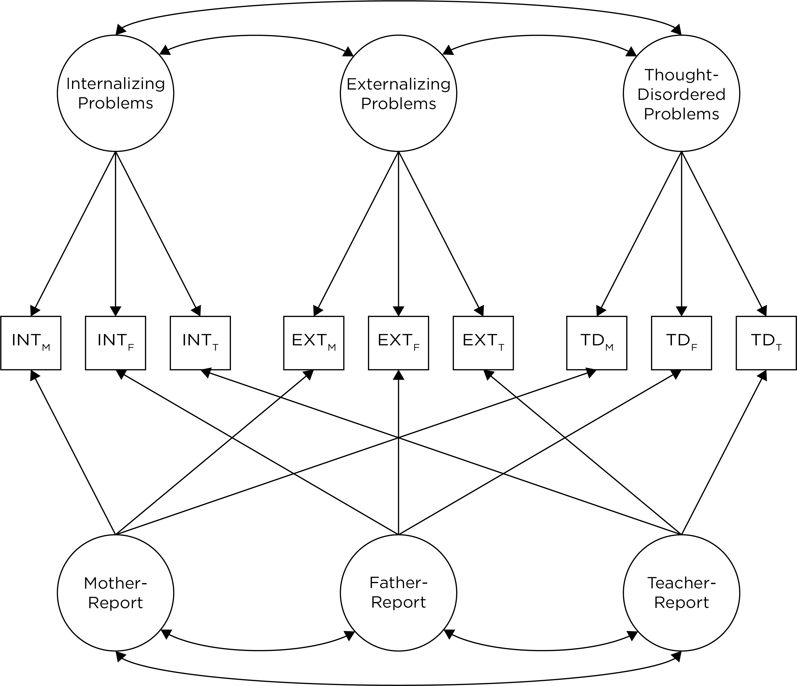
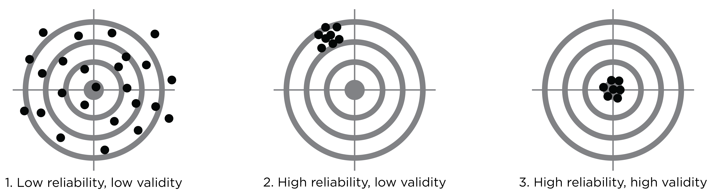
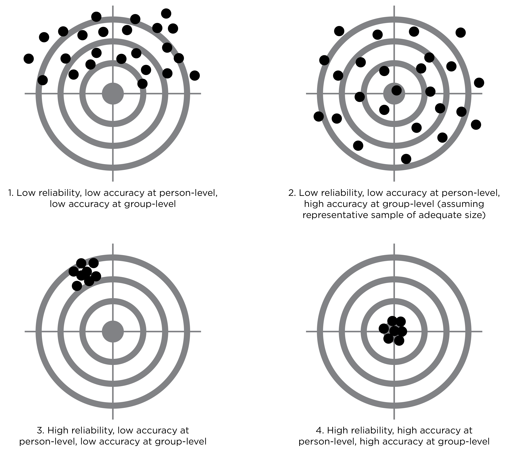

# Validity {#validity}

> "What we know depends on how we know it."

## Overview of Validity

According to the "Standards for Educational and Psychological Testing" [@AERA2014, p. 11], measurement validity is "the degree to which evidence and theory support the interpretations of test scores for proposed uses of tests." I summarized reliability with three words: repeatability, consistency, and precision. My summary of validity in three words is: accuracy, utility, and meaningfulness (of the interpretations of a measure's scores for the the proposed uses). Validity is tied to the *interpretation* of a measure's scores for the *proposed uses*, not to the measure itself. The same set of scores can have different degrees of validity for different purposes. For instance, a measure's scores may have stronger validity for making a diagnostic decision than for making a prediction about future behavior. Thus, as "the Standards" indicate, it is incorrect to use the unqualified phrase "the validity of the measure" or "the measure is (in)valid" because these phrases do not specify which scores were used from the test, what the use is (e.g., predicting whether a person will succeed in a given job), and what interpretation was made of the test scores for this purpose.^[For shorthand, I sometimes refer to the validity of the measure, but in such instances, I am actually referring to the validity of the interpretation of a measure's scores for a given use.]

Below, we prepare the data to provide some validity-related examples throughout the rest of the chapter.

## Getting Started

### Load Libraries

```{r, message = FALSE, warning = FALSE}
library("lavaan")
library("semPlot")
library("rockchalk")
library("semTools")
library("kableExtra")
library("MASS")
library("psych")
library("tidyverse")
library("here")
library("tinytex")
library("rmarkdown")
library("DT")
```

### Prepare Data

#### Load Data

The `MTMM` data file comes from W. Joel Schneider: http://my.ilstu.edu/~wjschne/442/MTMM.csv

```{r, message = FALSE}
MTMM <- read_csv(here("Data", "MTMM.csv")) #read_csv("../Data/MTMM.csv")
```

#### Simulate Data

For reproducibility, I set the seed below. Using the same seed will yield the same answer every time. There is nothing special about this particular seed.

```{r}
sampleSize <- 1000

set.seed(52242)

means <- c(50, 100)
standardDeviations <- c(10, 15)

correlationMatrix <- matrix(.7, nrow = 2, ncol = 2)
diag(correlationMatrix) <- 1
rownames(correlationMatrix) <- colnames(correlationMatrix) <- c("predictor","criterion")

covarianceMatrix <- psych::cor2cov(correlationMatrix, sigma = standardDeviations)

mydataValidity <- as.data.frame(mvrnorm(n = sampleSize, mu = means, Sigma = covarianceMatrix, empirical = TRUE))

errorToAddToPredictor <- 3.20
errorToAddToCriterion <- 6.15

mydataValidity$predictorWithMeasurementErrorT1 <- mydataValidity$predictor + rnorm(n = sampleSize, mean = 0, sd = errorToAddToPredictor)
mydataValidity$predictorWithMeasurementErrorT2 <- mydataValidity$predictor + rnorm(n = sampleSize, mean = 0, sd = errorToAddToPredictor)

mydataValidity$criterionWithMeasurementErrorT1 <- mydataValidity$criterion + rnorm(n = sampleSize, mean = 0, sd = errorToAddToCriterion)
mydataValidity$criterionWithMeasurementErrorT2 <- mydataValidity$criterion + rnorm(n = sampleSize, mean = 0, sd = errorToAddToCriterion)

mydataValidity$oldpredictor <- mydataValidity$criterion + rnorm(n = sampleSize, mean = 0, sd = 7.5)
```

#### Add Missing Data

Adding missing data to dataframes helps make examples more realistic to real-life data, and helps you get in the habit of programming to account for missing data.

```{r}
missingValuesPredictor <- sample(1:sampleSize, size = 50, replace = FALSE)
missingValuesCriterion <- sample(1:sampleSize, size = 50, replace = FALSE)

mydataValidity$predictor[missingValuesPredictor] <- NA
mydataValidity$predictorWithMeasurementErrorT1[missingValuesPredictor] <- NA
mydataValidity$predictorWithMeasurementErrorT2[missingValuesPredictor] <- NA

mydataValidity$criterion[missingValuesCriterion] <- NA
mydataValidity$criterionWithMeasurementErrorT1[missingValuesCriterion] <- NA
mydataValidity$criterionWithMeasurementErrorT2[missingValuesCriterion] <- NA

mydataValidity$oldpredictor[missingValuesPredictor] <- NA
```

## Types of Validity

Like [reliability](#typesOfReliability), validity is not one thing. There are many types of validity. In this book, I discuss the following types of validity:

- [face validity](#faceValidity)
- [content validity](#contentValidity)
- [criterion-related validity](#criterionValidity)
- [concurrent validity](#concurrentValidity)
- [predictive validity](#predictiveValidity)
- [construct validity](#constructValidity)
- [convergent validity](#convergentValidity)
- [discriminant (divergent) validity](#discriminantValidity)
- [incremental validity](#incrementalValidity)
- [treatment utility of assessment](#treatmentUtility)
- [discriminative validity](#discriminativeValidity)
- [elaborative validity](#elaborativeValidity)
- [consequential validity](#consequentialValidity)
- [representational validity](#representationalValidity)
- [factorial (structural) validity](#factorialValidity)
- [ecological validity](#ecologicalValidity)
- [process-focused validity](#processFocusedValidity)
- [internal validity](#internalValidity)
- [external validity](#externalValidity)
- [(statistical) conclusion validity](#conclusionValidity)

I arrange these types of validity into two broader categories: measurement validity and research design validity.

### Measurement Validity

Aspects of *measurement validity* involve the validity of a particular measure, or more specifically, the validity of interpretations of scores from that measure for the proposed uses.

#### Face Validity {#faceValidity}

The interpretation of a measure's scores has *face validity* (for a given construct and use) if a typical person—a non-expert—who looks at the content of each item will believe that the item belongs in the scale for this construct and use. The measure, and each item, looks "on its face" like it assesses the target construct. There are several advantages of a measure having face validity. First, outside groups will be less likely to be critical of the measure because it is intuitive. Second, use of a face valid measure is rarely objected to on ethical and bias charges for selling the measure to the public or clinicians. Third, face validity can be helpful for dissemination because more people may be receptive to it.

However, face validity also has important disadvantages. First, judgments of face validity are not based on theory. Second, face validity is based on subjective judgment, which can be inaccurate. Third, these subjective judgments are made by laypeople whose judgments may be inaccurate because of biases and lack of awareness of scientific knowledge. Fourth, a face valid measure may be too simple because anybody can understand the questions and what questions are intended to assess, so (presumably) respondents can easily fake responses to achieve their goals. Faking of responses may be a more of a concern in situations when there is an incentive for the respondent to achieve a particular outcome (e.g., be deemed competent to stand trial, be judged competent to obtain a job or custody of child, be judged to have a disorder to receive accommodations or disability benefits).

It is disputed whether having face validity is good or bad. Whether face validity is important to a given measure depends on the construct that is intended to be assessed, the context in which the assessment will occur, who will be paying for and/or administering the assessment, whether the respondents have incentives to achieve particular scores, and the goals of the assessment (i.e., how the assessment will be used). There is also controversy about whether face validity is a true form of validity; many researchers have argued that it not a true psychometric form of validity [**insert citation**].

#### Content Validity {#contentValidity}

*Content validity* involves a judgment about whether or not the content (items) of the measure theoretically matches the construct that is intended to be assessed, that is, whether the operationalization accurately reflects the construct. Content validity is developed based on items generated and selected by experts of the construct and based on the subjective determination that the measure adequately assesses and covers the construct of interest. Content validity differs from [face validity](#faceValidity) in that, for face validity, a *lay person* determines whether or not the measure seems to assess the construct of interest. By contrast, for content validity, an *expert* determines whether or not the measure adheres to the construct of interest.

For a measure to have content validity, its items should span the breadth of the construct. For instance, the construct of depression has many facets, such as sleep disturbances, weight/appetite changes, low mood, suicidality, etc., as depicted in Figure \@ref(fig:contentValidity).

```{r contentValidity, out.width = "100%", fig.align = "center", fig.cap = "Content facets of the construct of depression.", echo = FALSE}
knitr::include_graphics("./Images/contentValidity.png")
```

For a measure to have content validity, there should be no *gaps*—facets of the construct that are not assessed by the measure—and there should be no *intrusions*—facets of different constructs that are assessed by the measure. Consider the construct of depression. If theory states the construct includes various facets such as sadness, loss of interest in activities, sleep disturbances, lack of energy, weight/appetite change, and suicidal thoughts, then a content valid measure should assess all of those facets. If the measure does not assess sleep disturbances (a gap), the measure would lack content validity. If the measure assessed facets of other constructs, such as impulsivity (an intrusion), the measure would lack content validity.

With content validity, it is important to consider the population of interest. The same construct may look different in different populations and may require different content to assess it. For instance, it is important to consider the cultural relativity of constructs. The content of a construct may depend on the culture, such as in the case of culture-bound syndromes. Culture-bound syndromes are syndromes that are limited to particular cultures. An example of a culture-bound syndrome among Korean women is *hwa-byung*, which is the feeling of an uncomfortable abdominal mass in response to emotional distress. Another important dimension to consider is development. Constructs can manifest differently at different points in development, known as heterotypic continuity, which is discussed in Section [**insert section**]. When considering the different dimensions of your population, it can be helpful to remember the acronym [*ADDRESSING*](#addressing).

#### Criterion-Related Validity {#criterionValidity}

*Criterion-related validity* examines whether a measure behaves the way it should given your theory of the construct. This is quantified by the correlation between a measure's scores and some (hopefully universally accepted) criterion we select. For instance, a criterion could be a diagnosis, a child's achievement in school, an employee's performance in a job, etc.

Below, I provide an example of criterion-related validity by examining the Pearson correlation between a predictor and a criterion.

```{r}
cor.test(x = mydataValidity$predictor, y = mydataValidity$criterion)
```

There are two types of criterion-related validity: concurrent validity and predictive validity.

##### Concurrent Validity {#concurrentValidity}

*Concurrent validity* considers the *concurrent* association between the chosen measure and the criterion. That is, both the measure and the criterion are assessed at the same point in time. An example of concurrent validity would be examining self-report of court involvement in relation to current court records.

##### Predictive Validity {#predictiveValidity}

*Predictive validity* considers the association between the chosen measure and the criterion at a *later* time point. An example of predictive validity would be examining the association between children's scores on an academic achievement test in first grade predicting their eventual academic outcomes five years later.

##### Empiricism and Theory {#theoryEmpiricism}

Criterion-related validity arose out of a movement known as *radical operationalism*. Radical operationalism was a pushback against psychoanalysis. Psychoanalysis focused on grand theoretical accounts for how constructs relate. The goal on radical operationalism was to clarify concepts from a behavioristic perspective to allow predicting and changing behavior more successfully. "An "operation" in radical operationalism refers to a fully described measurement.

Proponents of radical operationalism argued that all constructs in psychology that could not be operationally defined should be excluded from the field as "non-scientific." They asserted that operations should be well-defined enough to be able to replicate the findings. So, constructs had to be defined precisely, according to this perspective, but how precisely? You could go on forever trying to more precisely describe a behavior in terms of its form, frequency, duration, intensity, situation, antecedents, consequences, biological substrates, etc. So, radical operationalists asserted that we should use theory of the construct to determine what is essential and what is not.

Radical operationalism was also related to *radical behavioralism*, which was espoused by B.F. Skinner. Skinner famously used a box (the "Skinner Box") to more directly control, describe, and assess behaviors. Skinner noted the major role that the environment played in influencing behavior. Skinner proposed a theory of implicit learning about a behavior or stimulus based on its consequences, a theory known as operant conditioning. According to operant conditioning, something that increases the frequency of a given behavior is called a reinforcer (e.g., praise), and something that decreases the frequency of a behavior is called a punisher (e.g., loss of a privilege). Through this work, Skinner came to view every thing an organism does (e.g., action, thought, feeling) as a behavior.

Related to these historical perspectives was a perspective known as *dustbowl empiricism*. Dustbowl empiricism focused on the empirical connections between things—how things were associated using data. It was a completely atheoretical perspective in which interpretation was entirely data-driven. An example of dustbowl empiricism is the approach that was used to develop the first version of the Minnesota Multiphasic Personality Inventory (MMPI). The MMPI was developed using an approach known as empirical-criterion keying, where items were selected for the scale for no reason other than the items demonstrate an association with the criterion. That is, an item was selected if it showed a strong ability to discriminate (differentiate) between clinical and control groups. Using this method and hundreds of items, the MMPI developed 10 clinical scales, which involved operational rules based on previously collected empirical evidence.

But what do you know with this abundance of correlations? You can use data reduction methods to reduce the many variables, based on their inter-correlations, down to a more parsimonious set of factors. But, how do you name each factor, which is composed of many items? The developers originally numbered the MMPI clinical scales from 1 to 10. But numbered scales are not useful for other people, so the factors were eventually given labels (e.g., Paranoia). And if a client received an elevated score on a factor, many people would label the clients as _____ [the name of the factor], such as "paranoid." The MMPI is discussed in further detail in the chapter on [objective personality testing](@objective-personality).

The idea of dustbowl empiricism was to develop a strong empirical base that would provide a strong foundation that would help us build up to a broad understanding that was integrated, coherent, and systematic. This process was unclear when there was only a table of correlations. Radical operationalists were opposed to content validity because it allows intrusion of our flawed thinking because, according to operationalists, there are no experts. According to this perspective, the content does not matter; we just need enough data to bootstrap ourselves to a better understanding of the constructs.

Although the atheoretical approach can perform reasonably well, it can be improved by making better use of theory. An empirical result (e.g., a correlation) might not necessarily have a lot of meaning associated with it. As the maxim goes, correlation does not imply causation. Just because X is associated with Y does not mean that X causes Y. Consider you find an association between variables X and Y, consistent with your hypothesis, as depicted in Figure \@ref(fig:commonCause1).

```{r commonCause1, out.width = "100%", fig.align = "center", fig.cap = "Hypothesized causal effect based on an observed association between X and Y, such that X causes Y.", echo = FALSE}
knitr::include_graphics("./Images/commonCause_1.png")
```

There are three primary reasons that an observed association between X and Y does not necessarily mean that X causes Y. First, the association could reflect the opposite direction of effect, where Y actually causes X, as depicted in Figure \@ref(fig:commonCause2).

```{r commonCause2, out.width = "100%", fig.align = "center", fig.cap = "Reverse (opposite) direction of effect from the hypothesized effect, where Y causes X.", echo = FALSE}
knitr::include_graphics("./Images/commonCause_2.png")
```

Second, the association could reflect the influence of a third variable. If a third variable is a common cause of each and accounts for their association, it is a *confound*. An observed association between X and Y could reflect a confound—i.e., a cause (Z) that influences both X and Y, which explains why X and Y are correlated even though they are not causally related. A third variable confound that is a common cause of both X and Y is depicted in Figure \@ref(fig:commonCause3).

```{r commonCause3, out.width = "100%", fig.align = "center", fig.cap = "Confounded association between X and Y due to a common cause, Z.", echo = FALSE}
knitr::include_graphics("./Images/commonCause_3.png")
```

Third, the association might be spurious. It might just reflect random variation (i.e., chance), and that when tested on an independent sample, what appeared as an association may not hold when testing whether the association generalizes.

However, even if the association between X and Y reflects a causal effect and that X causes Y, it does not necessarily mean that the effect is clinically actionable or useful. An association may reflect a static or unmodifiable predictor that is not practically useful as a treatment target.

As @Silver2012 (p. 9) notes, "The numbers have no way of speaking for themselves. We speak for them. We imbue them with meaning." If we *understand* the variables in the system and how they influence each other, we can predict things more accurately than predicting for the sake of predicting. For instance, we have made great strides in the last decades in making more accurate weather forecasts, including of extreme weather events like hurricanes. These great strides have more to do with a better causal understanding of the weather system and the ability to conduct simulations of the atmosphere than merely because of big data [@Silver2012]. By contrast, other events are still incredibly difficult to predict, including earthquakes, in large part because we do not have a strong understanding of the system [and because we do not have ways of precisely measuring those causes because they occur at a depth below which we are realistically able to drill; @Silver2012]. Statistical models applied to big data (i.e., lots of variables and lots of samples) can *overfit* the data, which means that the statistical model accounts for error variance (an overly specific prediction), which will not generalize to future samples. So, even though an over-fitting statistical model appears to be accurate, it is not actually that accurate—it will predict new data less accurately than how accurately it accounts for the data with which the model was built.

In Figure \@ref(fig:overfittingModel), the blue line represents the true distribution of the data, and the red line is an over-fitting model:

```{r overfittingModel, echo = FALSE, out.width = "100%", fig.height = 8, fig.width = 8, fig.cap = c("Overfitting model")}
sampleSize <- 200
quadraticX <- rnorm(sampleSize)
quadraticY <- quadraticX ^ 2 + rnorm(sampleSize)
quadraticData <- cbind(quadraticX, quadraticY) %>%
  data.frame %>% 
  arrange(quadraticX)

quadraticModel <- lm(quadraticY ~ quadraticX + I(quadraticX ^ 2), data = quadraticData)
quadraticNewData <- data.frame(quadraticX = seq(from = min(quadraticData$quadraticX), to = max(quadraticData$quadraticY), length.out = sampleSize))
quadraticNewData$quadraticY <- predict(quadraticModel, newdata = quadraticNewData)

loessFit <- loess(quadraticY ~ quadraticX, data = quadraticData, span = 0.01, degree = 1)
loessNewData <- data.frame(quadraticX = seq(from = min(quadraticData$quadraticX), to = max(quadraticData$quadraticY), length.out = sampleSize))
quadraticNewData$loessY <- predict(loessFit, newdata = quadraticNewData)

plot(x = quadraticData$quadraticX, y = quadraticData$quadraticY, xlab = "", ylab = "")
lines(quadraticNewData$quadraticY ~ quadraticNewData$quadraticX, lwd = 2, col = "blue")
lines(quadraticNewData$loessY ~ quadraticNewData$quadraticX, lwd = 2, col = "red")
```

An important issue in predictive validity is the criterion problem—finding the right criterion. It is important to avoid *criterion contamination*, which is artificial commonality between the measure and the criterion. The criterion is not always a well-measured clear criterion to predict (like predicting death in the medical field). And you may not have access to a predictive criterion until a long time from now. So, what researchers often do is adopt intermediate assessments, which are not actually what they are interested in, but it is related to the criterion of interest, and it is in a window of time that allows for some meaningful prediction. For instance, intermediate graduate school markers of whether a graduate student will go on to have a successful career could include their grades in graduate school, whether they completed the dissertation, their performance in comprehensive/qualifying exams, etc. However, these intermediate assessments do not always indicate whether or not a student will go on to have a successful career (i.e., they are not always correlated with the real criterion of interest).

So, empiricism is often not enough. It is important to use theory to guide selection of an intermediate criterion that will relate to the real criterion of interest. In psychology, even our long-term criteria are not well defined relative to other sciences. In clinical psychology, for example, we are often predicting to diagnosis, which is not that much more valid compared to our measure/predictor.

At the same time, in psychology, our theories of the causal processes that influence outcomes are not yet very strong. Indeed, I have misgivings calling them theories because they do not meet the traditional scientific standard for a theory. A scientific theory is an explanation of the natural world that is testable and falsifiable, and that has withstood rigorous scientific testing and scrutiny. In psychology, our "theories" are more like conceptual frameworks. And these conceptual frameworks are often vague, do not make specific predictions of effects *and* non-effects, and do not hold up consistently when rigorously tested. As described by @Meehl1978 (pp. 806–807):

> "I consider it unnecessary to persuade you that most so-called 'theories' in the soft areas of psychology (clinical, counseling, social, personality, community, and school psychology) are scientifically unimpressive and technologically worthless...Perhaps the easiest way to convince yourself is by scanning the literature of soft psychology over the last 30 years and noticing what happens to theories. Most of them suffer the fate that General MacArthur ascribed to old generals—They never die, they just slowly fade away. In the developed sciences, theories tend either to become widely accepted and built into the larger edifice of well-tested human knowledge or else they suffer destruction in the face of recalcitrant facts and are abandoned, perhaps regretfully as a 'nice try.' But in fields like personology and social psychology, this seems not to happen. There is a period of enthusiasm about a new theory, a period of attempted application to several fact domains, a period of disillusionment as the negative data come in, a growing bafflement about inconsistent and unreplicable empirical results, multiple resort to ad hoc excuses, and then finally people just sort of lose interest in the thing and pursue other endeavors."

Even if we had strong theoretical understanding of the causal system that influences behavior, we would likely still have difficulty making accurate predictions because the field has largely relied on relatively crude instruments. According to one philosophical perspective known as LaPlace's demon, if we were able to know the exact conditions of everything in the universe, we would be able to know how the conditions would be in the future. This is an example of scientific determinism, where if you know the initial conditions, you also know the future. Other perspectives, such as quantum mechanics and chaos theory, would say that, even if we knew the initial conditions with 100% certainty, there would still be uncertainty in our understanding of the future. But assume, for a moment, that LaPlace's demon is true. The challenge in psychology is that we have a relatively poor understanding of the initial conditions of the universe. Thus, our predictions would necessarily be probabilistic, similar to weather forecasts. Despite having a strong understanding of how weather systems behave, we have imperfect understanding of the initial conditions (e.g., the position and movement of all molecules) [@Silver2012].

###### Psychoanalysis versus Empiricism

If we consider "The Hitchhiker's Guide to the Galaxy" according to psychoanalysts, when they visit the new galaxy and they discover the only thing left is cheesecake, but everything is connected to everything else because of grand theories. Psychoanalysts try to reconstruct the entire universe from a sparse bit of data with supposedly strong theoretical understanding (when, in reality, our theories are not so strong). Their "theories" make grand conceptual claims.

Let us contrast psychoanalysts with empiricists/radical operationalism. Figure \@ref(fig:empiricism) presents a depiction of empiricism. Empiricists evaluate how an observed predictor relates to an observed outcome. The rectangles in the figure represent entities that can be observed. For instance, an empiricism might examine the extent to which a person's blood pressure is related to the the number of words they speak per minute.

```{r empiricism, out.width = "100%", fig.align = "center", fig.cap = "Depiction of empiricism.", echo = FALSE}
knitr::include_graphics("./Images/empiricism.png")
```

Contrast the empirical approach with psychoanalysis, as depicted in Figure \@ref(fig:psychoanalysis).

```{r psychoanalysis, out.width = "100%", fig.align = "center", fig.cap = "Depiction of psychoanalysis.", echo = FALSE}
knitr::include_graphics("./Images/psychoanalysis.png")
```

Circles represent unobserved, latent entities. For instance a psychoanalyst may make a conceptual claim that one observed variable influences another observed variable through a complex chain of intervening processes that are unobservable.

There is a classic and hilarious Monty Python video that is an absurd example akin to radical operationalism taken to the extreme. In the video, the researchers make lots of measurements and predictions. The researchers identify interspecies differences in intelligence where humans show better performance on the English-based intelligence test (who got an IQ score of 100) than the penguins, who got an IQ score of 2. But the penguins did not speak English and were unable to provide answers to the English-based intelligence test. So, the researchers also assessed a group of non-English speaking humans as an attempt to control for language ability. They found that the penguins' scores were equal to the scores of the non-English speaking humans. They argued that, based on their smaller brain and equal IQ when controlling for language ability, that penguins are smarter than humans. However, the researchers clearly made mistakes about confounding variables. And inclusion of a control group of non-English speaking humans does not solve the problem of validity or bias; it just obscures the problem. In summary, radical operationalism provides rich lower-level information, but lacks the broader picture. So, it seems, that we need both theory *and* empiricism. Theory and empiricism can inform each other.

#### Construct validity {#constructValidity}

[**Furr and S. Heuckeroth CITATION**]

*Construct validity* is the extent to which a measure accurately assesses a target construct. Construct validity is not quantified by a single index, but rather consists of a "web of evidence" (the totality of evidence), which reflect the sum of inferences from multiple aspects of validity. Construct validity deals with the association between a measure and an unobservable criterion, i.e., a latent construct. By contrast, criterion-related validity deals with an observable criterion.

Construct validity encompasses all other types of measurement validity (e.g., content and criterion-related validity), in addition to:

- Scores on the measure show homogeneity (scores on measure assess a single construct)
- Scores on the measure show theoretically expected developmental changes
- Scores on the measure show theoretically expected group differences
- Scores on the measure show theoretically expected intervention effects
- Establishing the *nomological network* of a construct

##### Nomological Network {#nomologicalNetwork}

A *nomological network* is [**DEFINE**]. [**Give visual example.**]

With construct validity, we can judge the quality of our measures by how well or how sensibly it fits in nomological network. Latent constructs and observed measures improve each other step-by-step. But there is no established way to evaluate the process.

Historically, construct validity became a way for some researchers to skip out on other types of validity. People found a correlation between a measure's scores and some group membership and argued, therefore, that the measure has construct validity, because there was a theoretically expected correlation between some measure and ______. People started finding a correlation of a measure with other measures, asserting that it provides evidence of construct validity, and saying "that's my nomological network." But, a theoretically expected association is not enough! For example, consider a measure of how quickly someone can count backwards by 7. Performance is impaired in those with schizophrenia, anxiety (due to greater distractibility), and depression (due to slowing and concentration difficulties). Therefore, it is a low-quality claim that counting backwards is part of the phenomenology of these disorders because it lacks differential deficit or discriminant validity [@Campbell1959]. This is related to the "glop problem", which asserts that every bad thing is associated with every other bad thing—there is high comorbidity. Therefore, researchers needed some way to distinguish method variance from trait variance. This led to the development of the multi-trait multi-method matrix.

##### Multi-Trait Multi-Method Matrix (MTMM) {#MTMM}

The *mult-trait multi-method matrix* (MTMM), as proposed by @Campbell1959, is a concrete way to evaluate the validity of a measure. The MTMM allows you to split the variance of measures' scores into variance that is due to the method (i.e., [method variance or method bias](#methodBias)) and variance that is due to the construct (trait) of interest (i.e., construct variance). To create a MTMM, you need at least two methods and at least two constructs. For example, A MTMM could include self-report and observation of depression and introversion. You would then examine the correlations across combinations of construct and method.

For an example of a MTMM, see Figure \@ref(fig:campbellFiske). Several aspects of psychometrics can be evaluated with a MTMM, including [reliability](#reliability), convergent validity, and discriminant validity. The reliability diagonal of a MTMM is the correlation of variable with itself, i.e., the [test-retest reliability](#testRetest-reliability) or monotrait-monomethod correlations. The reliability coefficients should be the highest values in the matrix because each measure should be more correlated with itself than with anything else.

```{r campbellFiske, out.width = "100%", fig.align = "center", fig.cap = "Multi-trait multi-method matrix. Figure reprinted from @Campbell1959, Table 1, p. 82. Campbell, D. T., (ref:ampersand) Fiske, D. W. (1959). Convergent and discriminant validation by the multitrait-multimethod matrix. *Psychological Bulletin*, *56*, 81-105. [https://doi.org/10.1037/h0046016](https://doi.org/10.1037/h0046016)", echo = FALSE}
knitr::include_graphics("./Images/campbellFiske.png")
```

###### Convergent Validity {#convergentValidity}

*Convergent validity* is the extent to which a measure is associated with other measures of the same target construct. In a MTMM, convergent validity evaluates whether measures targeting the same construct, but using different methods, converge upon the the same construct. These are observed in the validity diagonals, also known as the convergent correlations or the monotrait-heteromethod correlations. For strong convergent validity, we would expect the values in the validity diagonals to be significant and high-ish.

###### Discriminant (Divergent) Validity {#discriminantValidity}

You can also evaluate the *discriminant validity*, also called divergent validity, of a measure in the context of a MTMM. Discriminant validity is the extent to which a measure is *not* associated with measures of different constructs that are not theoretically expected to be related. In a MTMM, discriminant validity determine the extent to which a measure does not correlate with measures that share a method but assess different constructs. For strong discriminant validity, we would expect the discriminant correlations (heterotrait monomethod) should be low.

According to @Campbell1959, discriminant validity of measures can be established when three criteria are met:

1. The convergent (monotrait-heteromethod) correlations are stronger than heterotrait-heteromethod correlations. This provides the weakest evidence for discriminant validity. That is, the convergent correlations are higher than the values in the same column or row in the same heteromethod block. This can be evaluated using the heterotrait-monotrait ratio (described below).
2. The convergent (monotrait-heteromethod) correlations are stronger than discriminant correlations (monomethod-heterotrait). This provides stronger evidence of discriminant validity.
3. The patterns of intercorrelations between constructs are the same, regardless of which measurement method is used. That is, the pattern of inter-trait associations is the same in all triangles. For example, if extraversion and anxiety are moderately correlated with each other but uncorrelated with achievement, we would expect this pattern of interrelationships between constructs would hold, regardless of which method was used to assess the construct.

You can estimate a measure's degree of discriminant validity based on the *heterotrait-monotrait ratio* [HTMT; @Henseler2015]. HTMT is the average of the heterotrait-heteromethod correlations (i.e., the correlations of measures from different measurement methods that assess different constructs), relative to the average of the monotrait-heteromethod correlations (i.e., the correlations of measures from different measurement methods that assess the same construct). As described [here (http://www.henseler.com/htmt.html)](http://www.henseler.com/htmt.html) based on evidence from @Voorhees2016, "If the HTMT is clearly smaller than one, discriminant validity can be regarded as established. In many practical situations, a threshold of 0.85 reliably distinguishes between those pairs of latent variables that are discriminant valid and those that are not." HTMT was calculated using the `semTools` package [@R-semTools].

```{r}
modelCFA <- '
  visual  =~ x1 + x2 + x3
  textual =~ x4 + x5 + x6
  speed   =~ x7 + x8 + x9
'

htmt(modelCFA,
     data = HolzingerSwineford1939,
     missing = "ml")
```

Using a MTMM, a researcher can learn a lot about the quality of a measure and build a nomological network. For instance, we can estimate the extent of method variance, or variance that is attributable to the measurement method rather than the construct of interest. Method variance is estimated by the difference between monomethod vs. heteromethod blocks.

A poor example of a MTMM would be having two constructs such as height and depression, and two methods such as Likert and true/false. This would be a poor MTMM for two reasons: 1) there are trivial differences in the methods, which would lead to obvious convergence, and 2) the differences in between constructs are not important—they are obviously discriminant. Using such a MTMM would find strong convergent associations, because the methods are maximally similar, and weak discriminant associations, because the constructs are maximally different. It would be better to use maximally different measurement methods (e.g., self-report and performance-based measures), and to use constructs that are important to distinguish (e.g., depression and anxiey).

The paper by @Campbell1959 that introduced the MTMM is one of the most widely cited papers in psychology of all time. *Psychological Bulletin* published a more recent paper by @Fiske1992, entitled “Citations Do Not Solve Problems.” They noted how their original paper was the most widely cited paper in the history of *Psychological Bulletin*, but they argued that nothing came of their paper. The MTMM matrices published today show little-to-no improvement compared to the ones they published in 1959. In part, this may be because we need better measures (i.e., a higher ratio of construct to method variance).

###### Multi-Trait Multi-Method Correlation Matrix {#mtmmCorrelationMatrix}

A multi-trait multi-method correlation matrix is below.

```{r mtmmCorrelationHTML, fig.cap = "Multi-trait multi-method correlation matrix", eval = knitr::is_html_output(excludes = "epub")}
paged_table(data.frame(round(cor(MTMM), 2)))
```

```{r mtmmCorrelationPDF, fig.cap = "Multi-trait multi-method correlation matrix", eval = knitr::is_latex_output()}
kable(data.frame(round(cor(MTMM), 2)),
      booktabs = TRUE)
```

```{r mtmmCorrelationEPUB, fig.cap = "Multi-trait multi-method correlation matrix", eval = knitr::is_html_output(excludes = c("markdown","html","html4","html5","revealjs","s5","slideous","slidy","gfm"))}
kable(data.frame(round(cor(MTMM), 2)),
      booktabs = TRUE)
```

###### Construct validity beyond Campbell and Fiske

There are a number of other approaches that can be helpful for establishing construct validity in ways that go beyond the approaches proposed by @Campbell1959. One way is known as triangulation. Triangulation is conceptually depicted in Figure \@ref(fig:triangulation). Triangulation involves testing a hypothesis with multiple measures and/or methods to see if the findings are consistent, that is, whether the findings triangulate.

```{r triangulation, out.width = "100%", fig.align = "center", fig.cap = "Using triangulation to arrive a closer estimate of the construct using multiple measures and/or methods.", echo = FALSE}
knitr::include_graphics("./Images/triangulation.png")
```

####### MTMM in Confirmatory Factor Analysis (CFA) {#mtmmCFA-validity}

Using modern modeling approaches, there are even more advanced ways of examining a MTMM. For instance, you can use [structural equation modeling](#sem) or [confirmatory factor analysis](#cfa) to derive a latent variable of a construct from multiple methods to be free from method-related error variance to generate purer assessments of the construct to see how it relates to other constructs. For an example of a MTMM in confirmatory factor analysis, see Figure \@ref(fig:mtmmCFA).

```{r mtmmCFA, out.width = "100%", fig.align = "center", fig.cap = "Multi-trait multi-method model in confirmatory factor analysis with three constructs (internalizing, externalizing, and thought-disordered problems) and three methods (mother-, father-, and teacher-report).", echo = FALSE}

```

This example comes from W. Joel Schneider: http://my.ilstu.edu/~wjschne/442/CFA.html#(15). The confirmatory factor analysis (CFA) model was fit in the `lavaan` package [@R-lavaan]. 

```{r}
modelMTMM <- '
  g =~ Verbal + Spatial + Quant
  Verbal =~ 
    VO1 + VO2 + VO3 + 
    VW1 + VW2 + VW3 + 
    VM1 + VM2 + VM3
  Spatial =~ 
    SO1 + SO2 + SO3 + 
    SW1 + SW2 + SW3 + 
    SM1 + SM2 + SM3
  Quant =~ 
    QO1 + QO2 + QO3 + 
    QW1 + QW2 + QW3 + 
    QM1 + QM2 + QM3
  Oral =~ 
    VO1 + VO2 + VO3 + 
    SO1 + SO2 + SO3 + 
    QO1 + QO2 + QO3
  Written =~ 
    VW1 + VW2 + VW3 + 
    SW1 + SW2 + SW3 + 
    QW1 + QW2 + QW3
  Manipulative =~ 
    VM1 + VM2 + VM3 + 
    SM1 + SM2 + SM3 + 
    QM1 + QM2 + QM3
'
MTMM.fit <- cfa(modelMTMM, 
                data = MTMM, 
                orthogonal = TRUE,
                missing = "ml")

summary(MTMM.fit, 
        fit.measures = TRUE, 
        standardized = TRUE, 
        rsquare = TRUE)
```

Path Diagram:

A path diagram of the model is depicted using the `semPlot` package [@R-semPlot].

```{r, out.width = "100%", fig.height = 12, fig.cap = "Multi-trait multi-method model in confirmatory factor analysis"}
semPaths(MTMM.fit,
         what = "std",
         layout = "tree3",
         optimizeLatRes = FALSE,
         bifactor = c("Verbal","Spatial","Quant","g"),
         exoVar = FALSE)
```

#### Incremental Validity {#incrementalValidity}

Accuracy is not enough for a measure to be useful. Proposed by @Sechrest1963, measures should also be judged by the extent to which they provide an increment in predictive efficiency over the information otherwise easily and cheaply available. *Incremental validity* deals with the incremental value or utility over a measure beyond other sources of information. It must be demonstrated that the addition of a measure will produce better predictions than are made on the basis of information ordinarily available. It is not enough to show that the measure is better than chance, and the measure should not just be capitalizing on shared method variance with criterion or on increased reliability of the measure. That is, the measure should explain truly unique variance—variance that was not explained before. Incremental validity demonstrates added value, unless the other measure is cheaper or less time consuming. Incremental validity is a specific kind of [criterion-related validity](#criterionValidity): significantly increased $R^2$ in hierarchical regression. The incremental validity of a measure can be evaluated by examining whether the measure explains significant unique variance in the criterion when accounting for other information, such as easily accessible information, traditionally available measures, or the current gold-standard measure. The extent of incremental validity of a measure can be quantified with the change in the coefficient of determination ($\Delta R^2$) that compares (a) the model that includes the old predictor(s) to (b) the model that includes includes old predictors and the new predictor (measure).

```{r}
model1 <- lm(criterion ~ oldpredictor, data = na.omit(mydataValidity))
model2 <- lm(criterion ~ oldpredictor + predictor, data = na.omit(mydataValidity))

summary(model1)
summary(model2)

model1Rsquare <- summary(model1)$r.squared
model2Rsquare <- summary(model2)$r.squared

model1RsquareAdj <- summary(model1)$adj.r.squared
model2RsquareAdj <- summary(model2)$adj.r.squared

deltaRsquare <- getDeltaRsquare(model2)[["predictor"]]
deltaRsquareAdj <- model2RsquareAdj - model1RsquareAdj

anova(model1, model2)
getDeltaRsquare(model2)
```

$\Delta R^2$ was calculated using the `rockchalk` package [@R-rockchalk]. The predictor shows significant incremental validity above the old predictor in predicting the criterion. `Model 1` explains `r round(model1Rsquare * 100, 2)`% of the variance ($R^2 = `r round(model1Rsquare, 2)`$), and `Model 2` explains `r round(model2Rsquare * 100, 2)`% of the variance ($R^2 = `r round(model2Rsquare, 2)`$). Thus, the predictor explains only `r round(deltaRsquare * 100, 2)`% additional variance in the criterion above the variance explained by the old predictor ($\Delta R^2$). Based on adjusted $R^2$ ($R^2_{adj}$), the predictor explains only `r round(deltaRsquareAdj * 100, 2)`% additional variance in the criterion above the variance explained by the old predictor ($\Delta R^2_{adj}$).

#### Treatment Utility of Assessment {#treatmentUtility}

@Hayes1987 argued that it is not enough for measures to be reliable and valid. The authors raised another important consideration for the validity of a measure: its treatment utility or usefulness. They asked the question: what goal do assessments accomplish in clinical psychology? In clinical psychology, the goal of assessment is to lead to better treatment outcomes. Therefore, the *treatment utility* of a measure is the extent to which a measure is shown to contribute to beneficial treatment outcomes. That is, if a clinician has the information results from this having administered this measure, do the clients have better outcomes? The treatment utility of assessment is a specific kind of [criterion-related validity](#criterionValidity), with the idea that "all criteria are not created equal." And the criterion that is most important to optimize, from this perspective, when developing and selecting measures is a client's treatment outcomes.

@Hayes1987 described different approaches to evaluating the extent to which a measure shows treatment utility. These are a priori group comparison approaches that examine whether a specific difference in the assessment approach relates to treatment outcome. They distinguished between (a) manipulated assessment and (b) manipulated use.

In *manipulated assessment*, a single group of subjects is randomly divided into two subgroups and either the collection or availability of assessment data is varied systematically. Therapists then design or implement treatment in accord with the data available. As an example, the measure of interest may be administered in one condition, and the standard measure may be administered in the other condition. Then the treatment outcomes would be compared across the two conditions. An advantage of manipulated assessment is that this type of design is more realistic than manipulated use. When making the assessment data available but not assigning a certain treatment based on the assessment outcomes better simulates a realistic clinical environment. Also, because the control group has no access to the data, it might serve as a stronger control. A disadvantage of manipulated assessment is that it depends on whether and how clinicians use the measure, which depends on how positively the measure was received by the clinicians.

In *manipulated use*, the same assessment information is available for all subjects, but the researcher manipulates the way in which the assessment information is used. For example, one group gets a treatment matched to assessment outcomes, and the other group gets a cross-matched treatment that does not not target the problem identified by the assessment. So, in one group, the assessment information is used to match the treatment to the client based on their assessment results, whereas the other group receives a standard treatment regardless of their assessment results. An advantage of this design is that you can be certain that the treatment decisions are explicitly informed by the assessment results because the researcher ensures this, whereas the decision of how the assessment information is used is up to the clinician in manipulated assessment.

#### Discriminative Validity {#discriminativeValidity}

*Discriminative validity* is the degree to which a measure accurately identifies persons placed into groups on the basis of another measure. Discriminative validity is not to be confused with [discriminant (divergent) validity](#discriminantValidity) and discriminant analysis. A measure shows discriminant validity if it does not correlate with things that it would not be theoretically expected to correlated with. A measure shows discriminative validity, by contrast, if the measure is able to accurately differentiate things (e.g., two groups such as men and women). Discriminant analysis is a model that combines predictors to differentiate between multiple groups.

#### Elaborative Validity {#elaborativeValidity}

*Elaborative validity* involves the extent to which a measure increases our theoretical understanding of the target construct or of neighboring constructs. It deals with a measure's meaningfulness. Elaborative validity is a type of incremental theoretical validity. It is a combination of [criterion-related validity](#criterionValidity) and [construct validity](#constructValidity) that examines how much it increases our understanding of a construct's nomological network. However, I am unaware of strong examples of measures that show strong elaborative validity in psychology.

#### Consequential Validity {#consequentialValidity}

Consequential validity is a form of validity that differs from evidential validity, or a test's potential to provide accurate, useful information based on research. Consequential validity takes a more macro view and deals with the community, sociological, and public policy perspective. *Consequential validity* evaluates the consequences of our measures beyond the circumstances of their development, based on their impact. Measures can have positive, negative, or mixed effects on society. An example of consequential validity would be asking what the impacts of aptitude testing are on society—how aptitude testing affects society in the long run. Some would argue that, even in cases where the aptitude tests have some degree of evidential validity (i.e., they accurately assess to some degree what they tend to assess), they are consequentially invalid—that is, they have had a net negative effect on society and, due to their low value to society, are invalid. The tests themselves may be fine in terms of their accuracy, but consequential validity says that their validity depends on what we do with the test, i.e., how the test is used.

Another example of consequential validity is when the validity of a measure changes over time due to changes in people's or society's response, as depicted in Figure \@ref(fig:consequentialValidity). Judgments and predictions can change the way society reacts and the way people behave so that the predictions become either more or less accurate. A prediction that becomes more accurate as a result of people's response to a prediction is a self-fulfilling prediction or prophecy. For instance, if school staff make a prediction that a child will be held back a grade, the teacher may not provide adequate opportunities for the child to learn, which may lead to the child being more likely to be held back.

```{r consequentialValidity, out.width = "100%", fig.align = "center", fig.cap = "Invalidation of a measure due to society's response to the use of the measure.", echo = FALSE}
knitr::include_graphics("./Images/consequentialValidity.png")
```

A prediction that becomes less accurate as a result of people's response to a prediction is a self-canceling prediction. The most effective prediction about a flu outbreak might be one that leads people to safer behavior, therefore, lower flu rates which do not correspond to the initial prediction [@Silver2012]. Society's response to a measure can invalidate the measure. For example, consider that an organization rates cities based on quality-of-life measures. If quality-of-life indices include the percent of solved cases by the city's police (i.e., the clearance rate), cities may try to improve their ratings of "quality-of-life" by increasing their clearance rate either by increasing the number of cases they mark as solved (such as by marking false resolutions) or by decreasing the number of cases (such as by investigating fewer cases). That is, cities may "game" the system based on the quality-of-life indices used by various organizations. In this case, the clearance rate becomes a less accurate measure of a city's quality of life.

Another example of a measure that becomes less valid due to society's response is the use of alumni donations as an indicator of the strength of a university that is used for generating university rankings. Such an indicator could lead schools to admit wealthier students who give the most donations, and students whose parents were alumni and provide lavish donations to the university. Yet another example could be standardized testing, where instructors may "teach to the test" such that better performance might not necessarily reflect better underlying competence.

#### Representational Validity {#representationalValidity}

*Representational validity* examines the extent to which the items or content of a measure "flesh out" and mirror the true nature and mechanisms of the construct. There are many different types of validity, but many of them are overlapping and can be considered types of other forms of validity. For instance, representational validity, is a type of [elaborative validity](#elaborativeValidity) and [content validity](#contentValidity).

#### Factorial (Structural) Validity {#factorialValidity}

Factorial validity is examined in Section \@ref(factorAnalysis) on factor analysis. *Factorial validity* considers whether the factor structure of the measure(s) are consistent with the construct. According to factorial validity, if you claim that the measure is unidimensional with four items, factor analysis should support the unidimensionality. Thus, it involves testing empirically whether the measure has the same structure as would be expected based on theory. It is a type of [construct validity](#constructValidity).

#### Ecological Validity {#ecologicalValidity}

*Ecological validity* examines the extent to which a measure provides scores that are indicative of the behavior of a person in the natural environment.

#### Process-Focused Validity {#processFocusedValidity}

Process-focused validity attempts to get closer to the underlying mechanisms. *Process-focused validity* examines the degree to which respondents can be shown to engage in a predictable set of psychological processes (which are specified a priori) when completing the measure [@Bornstein2011]. These psychological processes include effects of the instrument (e.g., observer versus third-party report versus projective test) as well as effects of the context (e.g., assessment setting, assessment instructions, affect state of the participant, etc.). To determine whether a test is valid in the process-focused technique, one experimentally manipulates variables that moderate the test score-criterion association—to better understand the underlying processes. The ideal outcome is a measure that both (1) has an adequate outcome (correlations where expected) as well as (2) adequate process validity—the psychological processes that one engages in are well hypothesized.

The idea of process-focused validity is that if a measure does not inform us about process or mechanisms, it is not worth doing. Process-focused validity is a type of [elaborative validity](#elaborativeValidity) and [construct validity](#constructValidity). For instance, consider the common finding that low socioeconomic status is associated with poorer outcomes. To make an impact, process-focused validity would argue that we need to know the mechanisms that underlie this association, and it involves how a measure helps us understand process.


### Research Design (Experimental) Validity

Aspects of *research design validity*, also called experimental validity, involve the validity of a research design for making various interpretations. Research design validity includes internal validity, external validity, and conclusion validity.

#### Internal Validity {#internalValidity}

*Internal validity* is the extent to which causal inference is justified from the research design. This encompasses multiple features including:

- temporal precedence—does the cause occur before the effect
- covariation of cause and effect—correlation is necessary (even if insufficient) for causality
- no plausible alternative explanations—such as third variables that could influence both variables and explain their covariation

There are number of potential threats to internal validity, which are important to consider when designing studies and interpreting findings. [**LIST EXAMPLES**]

Research designs differ in the extent to which they show internal versus external validity. An experiment is a research design in which one or more variables (independent variables) are manipulated to observe how the manipulation influences the dependent variable. In an experiment, the researcher has greater control over the variables and attempts to hold everything else constant (e.g., by standardization and random assignment). In correlational designs, however, the researcher has less control over the variables. They may be able to statistically account for potential confounds using covariates or the reverse direction of effect using longitudinal designs. Nevertheless, we can have greater confidence about whether a variable influences another variable in a experiment. Thus, experiments tend to have higher internal validity than correlational designs.

#### External Validity {#externalValidity}

*External validity* is the extent to which the findings can be generalized to the broader population and the real world. External validity is crucial to consider for studies that intend to make inferences to people outside of those who were assessed. For instance, norm-referenced assessments attempt to identify the distribution of scores for a given population from a sample within that population. The validity of the norms of a norm-referenced assessment are important to consider [@Achenbach2001c]. The validity of norms and external validity, more broadly, can depend highly on how representative the sample is of the target population and how appropriate this population is to a given participant. Some measures are known to have poor norms, including the Exner Comprehensive System [**CITATION**] for administering and scoring the Rorschach inkblot test, which has been known to over-pathologize [**CITATION**]. The Rorschach is discussed in greater detail in Chapter \@ref(projective).

As the internal validity of a study's design increases, its external validity tends to decrease. The greater control we have over variables (and, therefore, have greater confidence about causal inferences), the lower the likelihood that the findings reflect what happens in the real world, because it is studying things in a metaphorical vacuum.

##### Tradeoffs of internal validity and external validity

It is important to note that there is a tradeoff between internal and external validity—there is not a single research design cannot have both high internal and high external validity. Some research designs are better suited for making causal inferences, whereas other designs tend to be better suited for making inferences that generalize to the real world. The research design that is best suited to making causal inferences is an experiment, where the researcher manipulates one variable (the independent variable) and holds all other variables constant to see how a change in the independent variable influences the outcome (dependent variable). Thus, experiments tend to have higher internal validity than other research designs. However, by manipulating one variable and holding everything else constant, the research takes place in a very standardized fashion that can become like studying a process in a vacuum. So, even if a process is theoretically causal in a vacuum, it may act very differently in the real world when it interacts with other processes. So, observational designs have greater capacity for external validity than experimental designs because people can be observed in their natural environments to see how variables are related in the real world. However, the greater external validity comes at a cost of lower internal validity. Observational designs are not well-positioned to make causal inferences because they have multiple threats to internal validity, including issues of temporal precedence in cross-sectional observational designs, and they are numerous potential third variables (i.e., confounds) that could act as a common cause of both the predictor and outcome variables. Thus, just because two variables are associated does not necessarily mean that they are causally related.

Because no single research design can have both high internal and high external validity, science needs a combination of many different research designs so we can be more confident in our inferences—experimental designs for making causal inferences and observational designs for making inferences that are more likely to reflect the real world.

Case studies, because they have smaller sample sizes, tend to have lower external validity than both experimental and observational studies. They also tend to have more threats to internal validity because they less potential to control for threats to internal validity, such as potential confounds or temporal precedence, so they also tend to have lower internal validity. Nevertheless, case studies can still be useful for generating hypotheses that can then be tested empirically with a larger sample in experimental or observational studies.

#### (Statistical) Conclusion Validity {#conclusionValidity}

*Conclusion validity*, also called statistical conclusion validity, considers the extent to which conclusions about the association among variables based on the data are reasonable. That is, were the correct statistical analyses performed, and are are the interpretations of the findings from those analyses correct?

### Putting it Altogether: An Organizational Framework

There are many types of measurement validity, but the central psychometric aspect of measurement validity is construct validity. That is, whether the measure accurately assesses the target construct is the most important consideration of measurement validity. As discussed earlier, construct validity includes the nomological network of the construct. Construct validity also subsumes other key types of measurement validity, including:

- [Convergent validity](#convergentValidity)
- [Discriminant (divergent) validity](#discriminantValidity)
- [Criterion-related validity](#criterionValidity)
    - [Concurrent validity](#concurrentValidity)
    - [Predictive validity](#predictiveValidity)
- [Content validity](#contentValidity)

**Show Figure of Organization of Types of Validity**

Moreover, many different types of reliability and validity can be viewed through the lens of construct validity:

- [Internal consistency](#internalConsistency-reliability): can be calculated as the coefficient of internal consistency, where the criterion for criterion-related validity is other items on same measure
- [Test–retest reliability](#testRetest-reliability): can be calculated as the coefficient of stability, where the criterion for criterion-related validity is the same measure at another time point
- [Parallel-forms reliability](#parallelForms-reliability) or [convergent validity](#convergentValidity): can be calculated as the coefficient of equivalence, where the criterion for criterion-related validity is the parallel form

## Validity is a Process, Not an Outcome

Validity (and validation) is a continual process, not an outcome. Validation is never complete. When evaluating the validity of a measure, we must ask validity for what and to what degree? We would not just say that a measure is or is not valid. We would express the strength of validity evidence across the different types of validity for a particular purpose, with a particular population, in a particular context (consistent with [generalizability theory](#gTheoryReliability)).

## Reliability versus Validity {#reliabilityVsValidity}

[Reliability](#reliability) and validity are not the same thing. [**Insert Figure that depicts the difference between reliability and validity with targets; include a separate figure that differentiates accuracy at group-level (no bias) versus accuracy at person-level; Figure 1: a) low reliability, low validity; b) high reliability, low validity; c) high reliability, high validity. Figure 2: a) low reliability, low accuracy at person-level, low accuracy at group-level; b) low reliability, low accuracy at person-level, high accuracy at group-level (assuming representative sample and large enough sample size); c) high reliability, low accuracy at person-level, low accuracy at group-level; d) high reliability, high accuracy at person-level, high accuracy at group-level **] **See figure in Silver 2012 on p. 46.**

Figure \@ref(fig:reliabilityVsValidity2)

```{r reliabilityVsValidity2, out.width = "100%", fig.align = "center", fig.cap = "Traditional depiction of reliability (consistency) versus validity (accuracy).", echo = FALSE}

```

Figure \@ref(fig:reliabilityVsValidity1)

```{r reliabilityVsValidity1, out.width = "100%", fig.align = "center", fig.cap = "Depiction of reliability versus validity, while distinguishing between validity (accuracy) at person- versus group-level.", echo = FALSE}

```

Reliability deals with consistency whereas validity deals with accuracy. A measure can be consistent but not accurate (see Figure [insert]). That is, a measure can be reliable but not valid. However, a measure cannot be accurate if it is inconsistent; that is, a measure cannot be valid and unreliable.

Even though reliability and validity are not the same thing, there is a relation between reliability and validity. Validity depends on reliability. Reliability is necessary but insufficient for validity. However, measurement error (unreliability) can be systematic or random. If measurement error is systematic, it reduces the validity of the measure. If measurement error is random, it reduces the precision of an individual’s score on a measure, but the measure could still be a valid measure of the construct at the group-level. However, random error would make it more difficult to make an accurate prediction at the individual person-level.

Reliability places the upper bound on validity because a measure can be no more valid than it is reliable. In other words, a measure should not correlate more highly with another variable than it correlates with itself. Therefore, the maximum validity coefficient is the square root of the product of the reliability of each measure:

$$
\begin{aligned}
  r_{xy_{\text{max}}} &= \sqrt{r_{xx}r_{yy}} \\
  \text{maximum association between } x \text{ and } y &=  \sqrt{\text{reliability of } x \text{ and } y}
\end{aligned}
(\#eq:maximumAssociation)
$$

So, the maximum validity coefficient is based on the reliability of each measure. To the extent that one of the measures is unreliable, the validity coefficient will be attenuated relative to the true validity (i.e., the true strength of association of the constructs), as I describe below.

## Effect of Measurement Error on Associations {#effectOfMeasurementErrorOnAssociations}

Figure \@ref(fig:validity) depicts the CTT approach to understanding the validity of a measure, i.e., its association with another measure, which is the the validity coefficient ($r_{xy}$).

```{r validity, out.width = "100%", fig.align = "center", fig.cap = "Reliability of a measure across two time points, as depicted in a path diagram.", echo = FALSE}
knitr::include_graphics("./Images/Validity.png")
```

As described above, (random) measurement error weakens (or attenuates) the association between variables [@Goodwin2006]. The greater the random measurement error, the weaker the association. Thus, the correlation between $x$ and $y$ depends on both the true correlation of x and y ($r_{x_{t}y_{t}}$) and the reliabilities of x ($r_{xx}$) and y ($r_{yy}$). So, measurement error in $x$ and $y$ can reduce the observed correlation below the true correlation. This is known as the *attenuation formula*:

$$
\small
\begin{aligned}
  r_{xy} &= r_{x_{t}y_{t}} \sqrt{r_{xx}r_{yy}} \\
  \text{observed association between } x \text{ and } y &= (\text{true association of constructs}) \times \sqrt{\text{reliability of } x \text{ and } y}
\end{aligned}
(\#eq:attenuationFormula)
$$

The lower the reliability, the greater the attenuation of the validity coefficient relative to the true association between the constructs.

All of these $r$ values (excluding the true correlation) are just estimates unless the sample size is infinite—so, the observed association is going to be an imperfect measure. Hence, we need a correction for this attenuation. This correction for the attenuation of an association due to measurement error (unreliability) is known as the disattenuation of a correlation, i.e., correction for the attenuation of an association due to measurement error to get a more accurate estimate of the true association between constructs. Rearranging the terms from the attenuation formula, the formula for disattenuation of a correlation (i.e., the *disattenuation formula*) is as follows:

$$
\begin{aligned}
  r_{x_{t}y_{t}} &= \frac{r_{xy}}{\sqrt{r_{xx}r_{yy}}} \\
  \text{true association of constructs} &= \frac{\text{observed association between } x \text{ and } y}{\sqrt{\text{reliability of } x \text{ and } y}}
\end{aligned}
(\#eq:disattenuationFormula)
$$

All of this is implied in the path diagram (see Figure \@ref(fig:validity)). The attenuation and disattenuation formulas are based on [classical test theory](#ctt), and therefore assume that the all measurement error is random, that errors are uncorrelated, etc. Nevertheless, the attenuation formula can be informative for understanding how imperiled your research is when your measures have low reliability (i.e., when there is instability in the measure). Researchers recommend accounting for measurement reliability, to better estimate the association between constructs, either with the disattenuation formula [@Schmidt1996] or with [structural equation modeling](#sem), as described in the next chapter.

### Test with Simulated Data

#### Reliability of Predictor

```{r}
cor.test(x = mydataValidity$predictorWithMeasurementErrorT1, y = mydataValidity$predictorWithMeasurementErrorT2)
```

#### Reliability of Criterion

```{r}
cor.test(x = mydataValidity$criterionWithMeasurementErrorT1, y = mydataValidity$criterionWithMeasurementErrorT2)
```

#### True Association

```{r}
cor.test(x = mydataValidity$predictor, y = mydataValidity$criterion)
```

#### Observed Association (after adding measurement error)

```{r}
cor.test(x = mydataValidity$predictorWithMeasurementErrorT1, y = mydataValidity$criterionWithMeasurementErrorT1)
```

### Attenuation of True Correlation due to Measurement Error

The attenuation formula is presented in Equation \@ref(eq:attenuationFormula). I extend it to a specific example below:

$$
\begin{aligned}
  r_{xy} &= r_{x_ty_t} \sqrt{r_{xx} r_{yy}} \\
  \text{observed correlation between }x \text{ and } y &= \text{(true association between construct } A \text{ and construct } B) \times \\ & \;\;\; \sqrt{\text{reliability of } x \times \text{reliability of } y}
\end{aligned}
$$

where $x = \text{measure of construct} \ A$; $y = \text{measure of construct} \ B$

Find the observed correlation between the predictor and criterion if the true association between the constructs (i.e., correlation between true scores of constructs) is .7, the reliability of the predictor is .9, and the reliability of the criterion is .85:

```{r}
trueAssociation <- .7
reliabilityOfPredictor <- 0.9
reliabilityOfCriterion <- 0.85

trueAssociation * sqrt(reliabilityOfPredictor * reliabilityOfCriterion)
```

### Disattenuation of Observed Correlation due to Measurement Error

The disattenuation formula is presented in Equation \@ref(eq:disattenuationFormula). I extend it to a specific example below:

$$
\begin{aligned}
  r_{x_ty_t} &= \frac{r_{xy}}{\sqrt{r_{xx} r_{yy}}} \\
  \text{true association between construct } A \text{ and construct } B &= \frac{\text{observed correlation between } x \text{ and } y}{\sqrt{\text{reliability of } x \times \text{reliability of } y}}
\end{aligned}
$$

where $x = \text{measure of construct} \ A$; $y = \text{measure of construct} \ B$

Find the true association between the construct assessed by the predictor and the construct assessed by the criterion given an observed association if the reliability of the predictor is .9, and the reliability of the criterion is .85:

```{r}
reliabilityOfPredictor <- 0.9
reliabilityOfCriterion <- 0.85

as.numeric(cor.test(x = mydataValidity$predictor, y = mydataValidity$criterion)$estimate)/sqrt(reliabilityOfPredictor * reliabilityOfCriterion)
```

## Generalizability Theory {#gTheoryValidity}

Generalizability theory is discussed in greater detail in the chapter on [reliability](#reliability) in Section \@ref(gTheoryReliability). As a brief reminder, G-theory is a measurement theory that, unlike CTT, does not treat all measurement differences across time, rater, or situation as "error" but rather as a phenomenon of interest. G-theory can simultaneously consider multiple aspects of reliability and validity in the same model. For instance, [internal consistency reliability](#internalConsistency-reliability), [test–retest reliability](#testRetest-reliability), [inter-rater reliability](#interrater-reliability), [parallel-forms reliability](#parallelForms-reliability), and [convergent validity](#convergentValidity) [in the @Campbell1959 sense of the same construct assessed by a different method] can all be incorporated into a G-theory model.

For example, a G-theory model could assess each participant across the following facets:

- time: e.g., T1 and T2 ([test–retest reliability](#testRetest-reliability))
- items: e.g., questions within the same instrument ([internal consistency reliability](#internalConsistency-reliability)) and questions across different instruments ([parallel-forms reliability](#parallelForms-reliability))
- rater: e.g., self-report and other-report ([inter-rater reliability](#interrater-reliability))
- method: e.g., questionnaire and observation ([convergent validity](#convergentValidity))

[**Provide Example Data Matrix**]

Using such a G-theory model, we can determine the extent to which scores on a measure generalize to other conditions, measures, etc. In sum, G-theory can be a useful way of estimating the degree of reliability and validity of a measure's scores in the same model.

## Ways to Increase Validity

Here are potential ways to increase the validity of the interpretation of a measure's scores for a particular purpose:

- Make sure the measure's scores are [reliable](#reliability). For potential ways to increase the reliability of measurement, see Section \@ref(increaseReliability). But, do not switch to a less valid measure or to items that are less valid merely because they are more reliable.
- Design the measure with a particular population and purpose in mind. When describing the measure in papers or in public spheres, make it clear to others what the population and intended purposes are, and what they are not.
- Make sure each item's scores are valid, based on theory and/or empiricism, for the particular population and purpose. For instance, the items should show [content validity](#contentValidity)—the items should assess facets of the target construct for the target population as defined by experts, without item intrusions from other constructs. The items' scores should show [convergent validity](#convergentValidity)—the items' scores should be related to other measures of the construct, within the population of interest. The items' scores should show [discriminant validity](#discriminantValidity)—the items' scores be more strongly related to measures that are intended to assess the same construct than they are to measures that are intended to assess other constructs.
- Obtain samples that are as representative of the population as possible, paying attention to including people who are traditionally under-represented in research (if such groups are part of the target population).
- Make sure that people in the population can understand, interpret, and respond to each item in a meaningful and comparable way.
- Make sure the measure and its items are not biased against any subgroup within the population of interest. Test bias is discussed in Chapter \@ref(bias).
- Be careful to administer the measure to the population of interest under the conditions in which it is designed. If the measure must be administered to people from a different population or under different conditions from which it was designed, be careful to (a) note that the measure was not designed to be administered for these other populations or conditions, and (b) note that individuals' scores may not accurately reflect their level on the construct. If interpretations are made based on these scores, make them cautiously and say how the differences in population or condition may have influenced the scores.
- Continue to monitor the validity of the measure's scores for the given population and purpose. The validity of measures' scores can change over time for a number of reasons. Cohort effects can lead items to become obsolete over time. If people or organizations change their behavior in response to a measure, this can invalidate a measure's scores for the intended purpose, as described in Section \@ref(consequentialValidity) when discussing consequential validity.

## Conclusion

Validity is how much accuracy, utility, and meaningfulness the interpretation of a measure's scores have for a particular purpose. Like [reliability](#reliability), validity is not one thing. There are multiple aspects of validity. Validity is also not a characteristic that resides in a test. The validity of a measure's scores reflect an interaction of the properties of the test with the population for whom it is designed, and the sample and context in which it is administered. Thus, when reporting validity in papers, it is important to adequately describe the aspects of validity that have been considered, and the population, sample, and context in which the measure is assessed.

## Exercises

```{r, include = FALSE}
library("MOTE")
```

```{r, include = FALSE}
#MTMM <- read_csv("../Data/MTMM.csv") #data from W. Joel Schneider: http://my.ilstu.edu/~wjschne/442/MTMM.csv
cnlsy <- read_csv(here("Data", "cnlsy.csv")) #read_csv("../Data/cnlsy.csv")
```

```{r, include = FALSE}
# Criterion-Related Validity ----------------------------------------------

cor.test(x = cnlsy$bpi_antisocialT1Sum, y = cnlsy$bpi_hyperactiveSum)
criterionValidity_ex <- as.numeric(cor.test(x = cnlsy$bpi_antisocialT1Sum, y = cnlsy$bpi_hyperactiveSum)$estimate)
```

```{r, include = FALSE}
# Attenuation of True Correlation due to Measurement Error ----------------

#observed correlation between x and y = (true association between construct A and construct B) * sqrt(reliability of x and y), where x = measure of construct A; y = measure of construct B
trueAssociation_ex <- .8 #assume the true association between the constructs (i.e., correlation between true scores of constructs) is .8
reliabilityOfPredictor_ex <- 0.7 #assume the reliability of the predictor is .8
reliabilityOfCriterion_ex <- 0.7090234 #assume the reliability of the predictor is .7

observedAssociation_ex <- trueAssociation_ex * sqrt(reliabilityOfPredictor_ex * reliabilityOfCriterion_ex)
```

```{r, include = FALSE}
# Disattenuation of Observed Correlation due to Measurement Error ---------

#true association between construct A and construct B = (observed correlation between x and y)/sqrt(reliability of x and y), where x = measure of construct A; y = measure of construct B
reliabilityOfPredictor_ex <- 0.7 #assume the reliability of the predictor is .8
reliabilityOfCriterion_ex <- 0.8 #assume the reliability of the predictor is .7

trueAssociation_ex <- as.numeric(cor.test(x = cnlsy$bpi_antisocialT1Sum, y = cnlsy$bpi_hyperactiveSum)$estimate)/sqrt(reliabilityOfPredictor_ex * reliabilityOfCriterion_ex)
```

```{r, include = FALSE}
# Incremental Validity ----------------------------------------------------

model1_ex <- lm(bpi_hyperactiveSum ~ bpi_antisocialT1Sum, data = na.omit(cnlsy))
model2_ex <- lm(bpi_hyperactiveSum ~ bpi_antisocialT1Sum + bpi_anxiousDepressedSum, data = na.omit(cnlsy))

model1F_ex <- model1_ex$fstatistic

incrementalValidity_ex <- anova(model1_ex, model2_ex) #anxiety/depression shows incremental validity above antisocial behavior for predicting hyperactivity

incrementalValidityF_ex <- incrementalValidity_ex$F[2]
incrementalValiditydf_ex <- incrementalValidity_ex$Df[2]

getDeltaRsquare(model2_ex) #anxiety/depression explains 6% additional variance in hyperactivity above variance explained by antisocial behavior
deltaRsquare_ex <- getDeltaRsquare(model2_ex)[[2]]
```

```{r, include = FALSE}
# Multi-Trait Multi-Method Matrix -----------------------------------------

round(cor(MTMM), 2)

round(cor(MTMM[,c("VO1","SO1","QO1",
                  "VW1","SW1","QW1",
                  "VM1","SM1","QM1")]), 2)
```

```{r, include = FALSE}
# Multi-Trait Multi-Method CFA --------------------------------------------

#Example from W. Joel Schneider: http://my.ilstu.edu/~wjschne/442/CFA.html#(15)
modelMTMM <- '
  g =~ Verbal + Spatial + Quant
  Verbal =~ 
    VO1 + VO2 + VO3 + 
    VW1 + VW2 + VW3 + 
    VM1 + VM2 + VM3
  Spatial =~ 
    SO1 + SO2 + SO3 + 
    SW1 + SW2 + SW3 + 
    SM1 + SM2 + SM3
  Quant =~ 
    QO1 + QO2 + QO3 + 
    QW1 + QW2 + QW3 + 
    QM1 + QM2 + QM3
  Oral =~ 
    VO1 + VO2 + VO3 + 
    SO1 + SO2 + SO3 + 
    QO1 + QO2 + QO3
  Written =~ 
    VW1 + VW2 + VW3 + 
    SW1 + SW2 + SW3 + 
    QW1 + QW2 + QW3
  Manipulative =~ 
    VM1 + VM2 + VM3 + 
    SM1 + SM2 + SM3 + 
    QM1 + QM2 + QM3
'
```

```{r, include = FALSE}
MTMM.fit <- cfa(modelMTMM, 
                data = MTMM, 
                orthogonal = TRUE)
```

```{r, include = FALSE}
summary(MTMM.fit, 
        fit.measures = TRUE, 
        standardized = TRUE, 
        rsquare = TRUE)
```

```{r, include = FALSE}
#Path Diagram
semPaths(MTMM.fit,
         what = "Std.all",
         layout = "tree3",
         optimizeLatRes = FALSE,
         bifactor = c("Verbal","Spatial","Quant","g"),
         exoVar = FALSE)
```

```{r, include = FALSE}
# Discriminant Validity ---------------------------------------------------

modelCFA <- '
  Verbal =~ 
    VO1 + 
    VW1 + 
    VM1
  Spatial =~ 
    SO1 + 
    SW1 + 
    SM1
  Quant =~ 
    QO1 + 
    QW1 + 
    QM1
'
```


```{r, include = FALSE}
htmt_ex <- htmt(modelCFA,
     data = MTMM,
     missing = "ml")

htmtVerbSpatial_ex <- htmt_ex[row.names(htmt_ex) == "Spatial", "Verbal"]
```

### Questions

Note: several of the following questions use data from the Children of the National Longitudinal Survey of Youth Survey (CNLSY). The CNLSY is a publicly available longitudinal dataset provided by the Bureau of Labor Statistics (https://www.bls.gov/nls/nlsy79-children.htm#topical-guide). The CNLSY data file for these exercises is located on the course’s page of the Open Science Framework (https://osf.io/3pwza). Children’s behavior problems were rated in 1988 (time 1: T1) and then again in 1990 (time 2: T2) on the Behavior Problems Index (BPI).

1. What is the criterion-related validity of the Antisocial Behavior subscale of the BPI in relation to the Hyperactive subscale of the BPI?
2. Assume the true correlation between two constructs, antisocial behavior and hyperactivity, is $r = .8$. And assume the reliability of the measure of antisocial behavior is $r = .7$, and the reliability of the measure of hyperactivity is $r = .7090234$. According to the attenuation formula (that attenuates the association due to measurement error), what would be the correlation between measures of antisocial behavior and hyperactivity that we would actually observe?
3. Assume the true correlation between two constructs, antisocial behavior and hyperactivity, is $r = .8$, the reliability of the Antisocial Behavior subscale of the BPI is $r = .7$, and the reliability of the measure of Hyperactive subscale of the BPI is $r = .8$. According to the disattenuation formula (to correct for attenuation of the association due to measurement error), what would be the true association between the constructs of antisocial behavior and hyperactivity?
4. You are interested in whether a child’s levels of anxiety/depression can explain unique variance in children’s hyperactivity above and beyond their level of antisocial behavior. Is the child’s level of anxiety/depression (as rated on the Anxiety/Depression subscale of the BPI) significantly associated with the child’s level of hyperactivity (as rated on the Hyperactive subscale of the BPI) above and beyond the variance accounted for by the child’s level of antisocial behavior (as rated on the Antisocial Behavior subscale of the BPI). How much unique variance in hyperactivity is accounted for by their anxiety/depression?
5. The course’s OSF page has a data file titled `MTMM.csv` that includes data on participants’ verbal, spatial, and quantitative abilities, each assessed in three subtests in each of three methods: oral, written, and manipulative.
    a. Provide a multitrait-multimethod matrix of the data from the first subtest of each trait-by-method combination (`VO1`, `SO1`, `QO1`, `VW1`, `SW1`, `QW1`, `VM1`, `SM1`, `QM1`). Assume the reliability of the variables assessed orally is .7, the reliability of the variables assessed using the written method is .8, and the reliability of variables assessed using the manipulative method is .9.
    b. Interpret the multitrait-multimethod matrix you just created.
    c. What is the Heterotrait-Monotrait (HTMT) ratio for the measures of the verbal (`VO1`, `VW1`, `VM1`) and spatial (`SO1`, `SW1`, `SM1`) constructs? What does this indicate?

### Answers

1. The criterion-related validity is $r = `r apa(criterionValidity_ex, decimals = 2, leading = FALSE)`$.
2. The observed correlation would be $r = `r apa(observedAssociation_ex, decimals = 2, leading = FALSE)`$.
3. The true association would be $r = `r apa(trueAssociation_ex, decimals = 2, leading = FALSE)`$.
4. Yes, the child’s level of anxiety/depression is significantly associated with their hyperactivity above and beyond their antisocial behavior ($F[df = `r (incrementalValiditydf_ex)`] = `r apa(incrementalValidityF_ex, decimals = 2)`, p < .001$). The child’s level of anxiety/depression accounted for `r apa(deltaRsquare_ex * 100, decimals = 2)`% unique variance in hyperactivity above and beyond their antisocial behavior.
5.	
    a. The multitrait-multimethod matrix is below:
    
```{r mtmmMatrix, out.width = "100%", fig.align = "center", fig.cap = "Multi-trait multi-method matrix", echo = FALSE}
knitr::include_graphics("./Images/MTMM.png")
```

5.
    b. The convergent correlations (green cells) are statistically significant ($p\text{s} < .05$) and moderate in magnitude ($.45 < r\text{s} < .53$), supporting the convergent validity of the measures. [The reliabilities of these measures are not provided, so we are not able to compare the magnitude of the convergent validities to the magnitude of reliability to see the extent to which the convergent validities may be attenuated due to measurement unreliability]. Evidence of discriminant validity is supported by three findings: First, the convergent correlations (green cells: $r\text{s} =$ .46–.53) are stronger than the heteromethod-heterotrait correlations (pink cells: $r\text{s} =$ .24–.34). Second, the convergent correlations (green cells: $r\text{s} =$ .46–.53) are stronger than the discriminant correlations (orange cells: $r\text{s} =$ .30–.43). Third, the patterns of intercorrelations between traits are the same, regardless of which measurement method is used. Verbal, spatial, and quantitative skills are inter-correlated for every measurement method used.
    c. The HTMT ratio for the measures of the verbal and spatial constructs is `r apa(htmtVerbSpatial_ex, decimals = 3, leading = TRUE)`. The HTMT ratio is the average of the heterotrait-heteromethod correlations, relative to the average of the monotrait-heteromethod correlations. Given that the HTMT ratio is considerably less than 1 (and less than the common cutoff of .85), it indicates that the monotrait-heteromethod correlations are considerably larger than the heterotrait-heteromethod correlations. Thus, the HTMT provides evidence that the measures of verbal and spatial constructs show discriminant validity.
