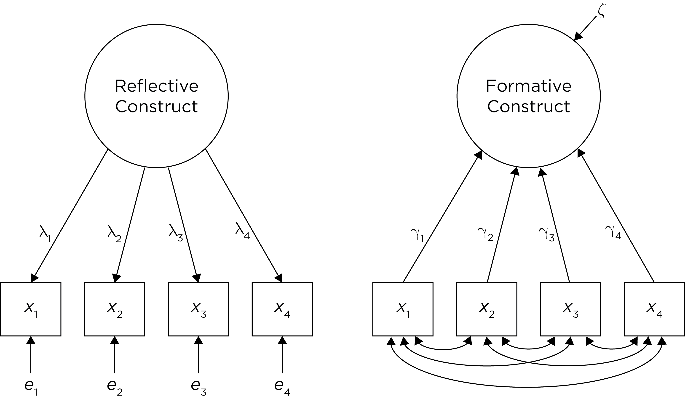
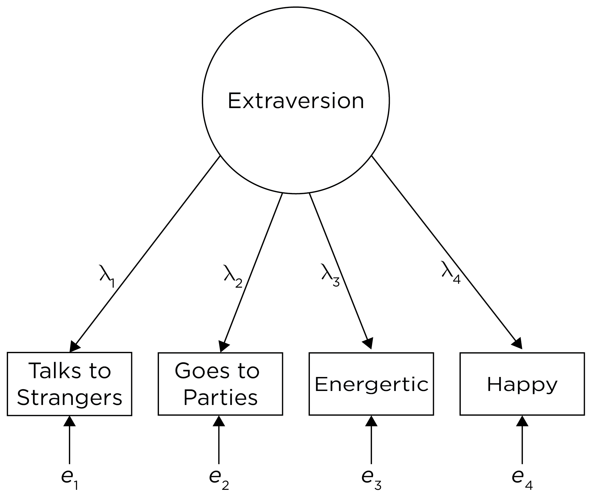
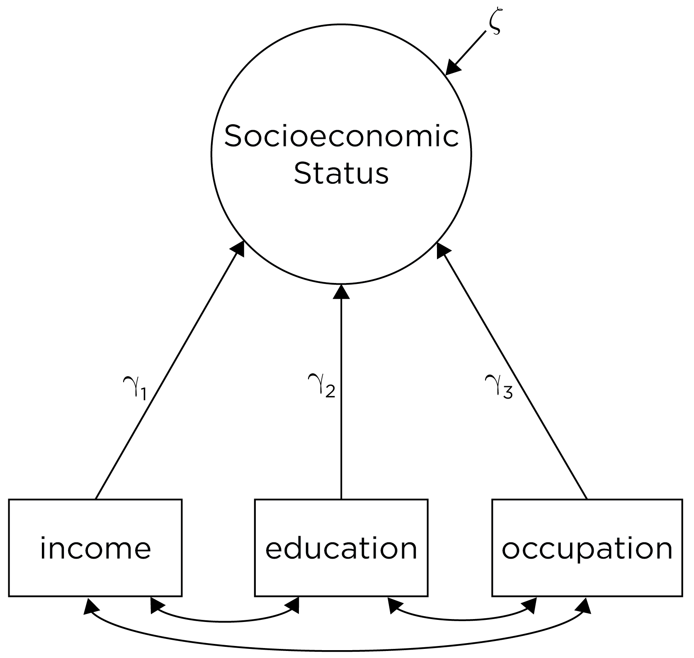

# Constructs {#constructs}

## Types of Constructs {#constructTypes}

A *construct* is a concept.\index{construct}
A construct is generally considered a latent idea or phenomenon that is not directly observable.\index{construct}
For example, depression could be considered a construct because we cannot directly measure someone's level of depression.\index{construct}
Rather, we infer a person's level on the construct of depression by taking measurements of many indirect proxies that we think are *indicators* of the construct.\index{construct}\index{structural equation modeling!indicator}
An indicator is a measurement, and it could be thought of as a behavior or questionnaire item.\index{structural equation modeling!indicator}
Potential indicators of depression could include behaviors/items such as whether the person has low mood, low energy, sleep difficulties, loss of interest in formerly enjoyable activities, changes in weight or appetite, etc.\index{structural equation modeling!indicator}\index{construct}

Because constructs are latent, unobservable phenomena, they are often estimated using [latent variable models](#latentVariableModeling), as described in Section \@ref(latentVariableModeling).\index{construct}\index{latent variable}

There are two main types of constructs: [reflective constructs](#reflectiveConstruct) and [formative constructs](#formativeConstruct).\index{construct}\index{construct!reflective}\index{construct!formative}

### Reflective Construct {#reflectiveConstruct}

With a *reflective construct* (or reflective model), the construct is the cause of the measures, and the construct is reflected by the indicators, see Figure \@ref(fig:formativeReflective) [@Bollen1991].\index{construct!reflective}

```{r formativeReflective, out.width = "100%", fig.align = "center", fig.cap = "Reflective and Formative Constructs in Structural Equation Modeling.", echo = FALSE}

```

An example of a reflective construct is extraversion; see Figure \@ref(fig:extraversion).\index{construct!reflective}
We conceptualize extraversion as a latent concept that, although not directly observable, influences the measurements of indicators of extraversion, such as whether the person enjoys talking to strangers, goes to lots of parties, is energetic, and is happy.\index{construct!reflective}\index{structural equation modeling!indicator}
In a reflective model, the answers that people give on the items are thought to reflect a certain disposition—in this case, extraversion.\index{construct!reflective}
None of these indicators, in isolation, is considered a direct measure of extraversion.\index{construct!reflective}\index{structural equation modeling!indicator}
Nevertheless, we feel that we can get a better estimate of the concept of extraversion by capturing the variance that covaries across these indicators, i.e., the common (systematic) variance among the indicators.\index{construct!reflective}\index{structural equation modeling!indicator}
Thus, the latent factor is estimated to reflect the common variance among the indicators.\index{construct!reflective}\index{structural equation modeling!indicator}
Because a reflective construct influences the indicators, the indicators are called *effect indicators*.\index{construct!reflective}\index{structural equation modeling!indicator}
What we observe, theoretically, are the effects of the underlying construct, which influences scores on each individual measure.\index{construct!reflective}\index{structural equation modeling!indicator}

```{r extraversion, out.width = "70%", fig.align = "center", fig.cap = "Extraversion as a Reflective Construct.", echo = FALSE}

```

With a reflective construct, we would expect that the items would show strong [internal consistency reliability](#internalConsistency-reliability).\index{construct!reflective}\index{structural equation modeling!indicator}
That is, we would expect that the indicators would all be correlated with each other, because all indicators are thought to be a reflection of the underlying construct.\index{construct!reflective}\index{structural equation modeling!indicator}
But in reality, there is often still residual correlation between items even after accounting for the latent factor.\index{construct!reflective}\index{structural equation modeling!indicator}

In a [measurement model](#measurementModel-sem) of a reflective construct (see Figure \@ref(fig:formativeReflective)), the lambda ($\lambda$) values are called *factor loadings* that represent regression coefficients from observable indicators to latent variables.\index{construct!reflective}\index{structural equation modeling!indicator}\index{structural equation modeling!factor loading}\index{structural equation modeling}
A factor loading is the relative weight that the item is given in the estimation of the latent factor, similar to the correlation between the construct and the measure.\index{construct!reflective}\index{structural equation modeling!indicator}\index{structural equation modeling!factor loading}\index{structural equation modeling}
The stronger an item's factor loading on the construct, the more relative weight a given item has in the estimation of the latent factor.\index{construct!reflective}\index{structural equation modeling!indicator}\index{structural equation modeling!factor loading}\index{structural equation modeling}
The epsilon ($\epsilon$) term reflects [measurement error](#measurementError).\index{construct!reflective}\index{structural equation modeling!indicator}\index{measurement error}\index{structural equation modeling}
[Structural equation modeling](#sem) is an application of the same way we think about measurement according to [classical test theory](#ctt), but in a latent variable framework.\index{structural equation modeling}\index{classical test theory}
According to [classical test theory](#ctt), the observed score is thought to be some combination of the true score and [error](#measurementError) ($\text{observed score} = \text{true score} + \text{error}$; $X = T + e$).\index{classical test theory}\index{measurement error}
Or, in a multiple regression framework: $\text{extraversion} = \lambda_1 \cdot \text{strangers} + \lambda_2 \cdot \text{parties} + \lambda_3 \cdot \text{happy} + \text{errors}$.
That is, the true score influences the observed score on each measure.\index{construct!reflective}\index{true score}
If a person's level on the construct (extraversion) changes, their score on each measure/indicator/item is expected to change [@Edwards2000].\index{construct!reflective}

### Formative Construct {#formativeConstruct}

Formative constructs are the other fundamental way to understand the relation between a construct and a measure.\index{construct!formative}
With a *formative construct* (or formative model), the measures cause the construct; see Figure \@ref(fig:formativeReflective) [@Bollen1991].\index{construct!formative}
That is, the construct is created by the measures.\index{construct!formative}
Because the indicators influence the formative construct, the indicators are called *causal indicators*.\index{construct!formative}\index{structural equation modeling!indicator}

Examples of formative constructs include constructs such as socioeconomic status (SES), stress, and risk for cardiovascular disease.\index{construct!formative}
For instance, we may define SES such that it is the linear combination of a person's educational attainment, occupational prestige, and income, as in Figure \@ref(fig:socioeconomicStatus).\index{construct!formative}
With a formative construct, if a person changes in their level on the construct, we might not expect that their scores on all of the measures/indicators/items would change [@Edwards2000].\index{construct!formative}\index{structural equation modeling!indicator}
If a person's SES changes, you would not necessarily expect the person's score on all of these measures/items to change.\index{construct!formative}\index{structural equation modeling!indicator}
For instance, if a person's SES increases from T1 to T2, you would not necessarily expect that their educational attainment increased; it could be instead that their occupational prestige or income increased.\index{construct!formative}\index{structural equation modeling!indicator}

```{r socioeconomicStatus, out.width = "70%", fig.align = "center", fig.cap = "Socioeconomic Status as a Formative Construct.", echo = FALSE}

```

In a [structural equation model](#sem), the gamma ($\gamma$) values are regression coefficients from exogenous variables to endogenous variables.\index{structural equation modeling}
Endogenous variables are variables whose values are determined by the model (i.e., they are influenced by other variables), whereas exogenous variables are variables whose values are not determined by the model (i.e., they are not influenced by other variables).\index{structural equation modeling}
In a [measurement model](#measurementModel-sem) of a formative construct (see Figure \@ref(fig:formativeReflective)), the gamma values reflect the relative weight that the item is given in the estimation of the latent factor, similar to the correlation between the construct and the measure.\index{construct!formative}\index{structural equation modeling}
The stronger an item's factor loading on the construct, the more relative weight a given item has in the estimation of the latent factor.\index{construct!formative}\index{structural equation modeling!factor loading}\index{structural equation modeling}

With a formative construct, the disturbance term, zeta ($\zeta$), represents the part of the construct that is not explained by the measures, i.e., the [measurement error](#measurementError).\index{construct!formative}\index{measurement error}\index{structural equation modeling}
However, the measures are thought (or at least assumed) to be error-free causes of the construct.\index{construct!formative}\index{structural equation modeling!indicator}
The covariances between the indicators are permissive of item correlations, but unlike the reflective model, the formative model does not require that the items are correlated.\index{construct!formative}\index{structural equation modeling!indicator}\index{construct!reflective}
In other words, for a formative model, it is not necessary that the items are correlated, even though the items could be correlated.\index{construct!formative}\index{structural equation modeling!indicator}

A formative construct is determined by the measures, so if you change the measures, you change the construct.\index{construct!formative}\index{structural equation modeling!indicator}
A formative model requires that you include all facets of the construct.\index{construct!formative}\index{construct!facet}
This is not true in a reflective model because all items of a unidimensional reflective construct are interchangeable as long as the construct is unidimensional and the items are equally reliable because the construct influences the measure scores.\index{construct!formative}
With a reflective construct, all you need to do is find the items that reflect the underlying construct, and you could create parallel measures of the construct.\index{construct!reflective}
This is impossible to do in a formative model.\index{construct!formative}

Although formative conceptualizations of constructs may be useful in some cases, formative constructs can be controversial [@Edwards2011; @Hardin2011; @Howell2007; @Markus2018; but see @Bollen1991; @Bollen2011; @Bollen2017; @Diamantopoulos2008].\index{construct!formative}
It is important to think carefully about the construct of interest, as guided by theory, and how best to assess and estimate it.\index{construct}

## Differences in Measurement Expectations {#formativeVsReflectiveMeasurementExpectations}

There are several differences in our measurement expectations based on the type of construct ([formative](#formativeConstruct) or [reflective](#reflectiveConstruct)) or indicator ([causal](#formativeConstruct) or [effect](#reflectiveConstruct)), as described by Bollen and Lennox [-@Bollen1991].\index{construct!reflective}\index{construct!formative}

One difference we would expect between [effect](#reflectiveConstruct) versus [causal](#formativeConstruct) indicators is the actual correlations between the indicators.\index{construct!reflective}\index{construct!formative}\index{structural equation modeling!indicator}
[Causal indicators](#formativeConstruct) may not be correlated whereas [effect indicators](#reflectiveConstruct) must be correlated.\index{construct!reflective}\index{construct!formative}\index{structural equation modeling!indicator}
So, when we are assessing [internal consistency reliability](#internalConsistency-reliability) of a measure, and we assume that higher correlations between items suggests higher [internal consistency reliability](#internalConsistency-reliability), we are assuming that indicators of the construct have an [effects relationship](#reflectiveConstruct).\index{construct!reflective}\index{structural equation modeling!indicator}\index{reliability!internal consistency}
A scale assessing [causal indicators](#formativeConstruct) would likely have very low [internal consistency reliability](#internalConsistency-reliability).\index{construct!formative}\index{structural equation modeling!indicator}\index{reliability!internal consistency}

A second difference we would expect between [effect](#reflectiveConstruct) versus [causal](#formativeConstruct) indicators is whether to use a sample or a census of indicators.\index{construct!reflective}\index{construct!formative}\index{structural equation modeling!indicator}
The suggestions that we sample all facets of a construct when determining indicators is necessary only for [causal indicators](#formativeConstruct), for which a failure to assess a certain formative indicator changes the overall meaning of the construct.\index{construct!formative}\index{structural equation modeling!indicator}
For [effect indicators](#reflectiveConstruct) of a unidimensional construct, equally reliable measures are interchangeable.\index{construct!reflective}\index{structural equation modeling!indicator}

A third difference we would expect between [effect](#reflectiveConstruct) versus [causal](#formativeConstruct) indicators is the optimal correlations between the indicators.\index{construct!reflective}\index{construct!formative}\index{structural equation modeling!indicator}
For [effect indicators](#reflectiveConstruct), high correlations are desirable.\index{construct!reflective}\index{structural equation modeling!indicator}
For [causal](#formativeConstruct) indicators, too high of a correlation between indicators is likely to introduce the problem of multicollinearity, so lower correlations are optimal.\index{construct!formative}\index{structural equation modeling!indicator}\index{multicollinearity}
Multicollinearity is when two or more predictors are correlated such that their regression coefficients with the outcome variable (in this case, the factor loadings on the latent factor, i.e., $\lambda$) are erratic.\index{multicollinearity}

## Practical Issues {#formativeReflectiveIssues}

There are important practical issues to consider with both [reflective](#reflectiveConstruct) and [formative](#formativeConstruct) models.\index{construct!reflective}\index{construct!formative}

As described in Section \@ref(formativeReflective-sem) in the chapter on [structural equation modeling](#sem), it is challenging to use [formative constructs](#formativeConstruct) in a latent variable framework.\index{construct!formative}\index{structural equation modeling}
In a [structural equation modeling](#sem) framework, [formative constructs](#formativeConstruct) must be used in the context of a model that allows some constraints.\index{construct!formative}\index{structural equation modeling}
But one can easily estimate [formative constructs](#formativeConstruct) outside of a [SEM](#sem) context, for example, with an average or weighted average composite, similar to [principal component analysis](#pca).\index{construct!formative}\index{principal component analysis}
However, unlike latent variable approaches, linear composite approaches (e.g., mean or sum scores) do not account for [measurement error](#measurementError).\index{construct!formative}\index{latent variable}\index{linear composite}
That is, linear composite approaches do not include a disturbance/error term.\index{linear composite}
Therefore, a linear composite is not the same as a latent variable.\index{latent variable}\index{linear composite}
If no disturbance term is included in a [structural equation model](#sem), the model is equivalent to a linear composite approach (e.g., sum score, weighted average).\index{structural equation modeling}\index{linear composite}
Linear composite approaches are likely more defensible for [formative constructs](#formativeConstruct) than for [reflective constructs](#reflectiveConstruct).\index{linear composite}\index{construct!reflective}\index{construct!formative}

## How to Estimate {#estimateFormativeReflective}

To estimate a [reflective construct](#reflectiveConstruct), a latent variable modeling approach is necessary, such as [structural equation modeling](#sem), [factor analysis](#factorAnalysis), or [item response theory](#irt).\index{construct!reflective}\index{latent variable}\index{structural equation modeling}\index{factor analysis}\index{item response theory}

To estimate a [formative construct](#formativeConstruct), one may estimate an average or sum score across items (which gives each item equal weight), estimate a weighted average, use [principal component analysis](#pca), or use [structural equation modeling](#sem).\index{construct!formative}\index{linear composite}\index{structural equation modeling}\index{principal component analysis}

Thus, it is important to think about the nature of the construct before deciding how to estimate it.\index{construct}
The nature of a construct is a theoretical question.\index{construct}
Data alone cannot determine whether a construct is [reflective](#reflectiveConstruct) or [formative](#formativeConstruct).\index{construct!reflective}\index{construct!formative}
Just because items are highly correlated does not mean that scientists think of the construct as [reflective](#reflectiveConstruct).
By contrast, if items are not highly correlated, it suggests that a single unidimensional [reflective construct](#reflectiveConstruct) may not adequately capture reality—the variance may be better captured by a [formative](#formativeConstruct) or by multiple [reflective constructs](#reflectiveConstruct) (i.e., a multidimensional model).
In sum, although empiricism is relevant, theory is necessary to inform our understanding of the nature of constructs.\index{theory}\index{empiricism}

## Latent Variable Modeling: IRT, SEM, and CFA {#latentVariableModeling}

[Item response theory](#irt) (IRT), [structural equation modeling](#sem) (SEM), and [confirmatory factor analysis](#cfa) (CFA) are all approaches to latent variable modeling.\index{latent variable}\index{structural equation modeling}\index{factor analysis}\index{factor analysis!confirmatory}\index{item response theory}
[CFA](#cfa) and [IRT](#irt) most commonly estimate [reflective](#reflectiveConstruct) latent variables rather than [formative](#formativeConstruct) latent variables.\index{construct!reflective}\index{construct!formative}\index{latent variable}\index{factor analysis!confirmatory}\index{item response theory}
[SEM](#sem) can estimate both [reflective](#reflectiveConstruct) and [formative](#formativeConstruct) latent variables.\index{construct!reflective}\index{construct!formative}\index{latent variable}\index{structural equation modeling}
[IRT](#irt) is essentially a form of [CFA](#cfa) with [categorical](#nominalData), binary, or [ordinal](#ordinalData) data.\index{latent variable}\index{factor analysis!confirmatory}\index{item response theory}
As we discuss in Chapter \@ref(sem), [SEM](#sem) is [CFA](#cfa) with regression paths that specify hypothesized causal relations between the latent variables (the structural component of the model).\index{latent variable}\index{structural equation modeling}\index{factor analysis!confirmatory}

## Conclusion {#constructs-conclusion}

It is important to think about the nature of a construct before deciding how to estimate it.\index{construct}
For a [formative construct](#formativeConstruct), the indicators influence the construct, and a linear composite such as a weighted mean or sum score is justifiable.\index{construct!formative}\index{linear composite}
For a [reflective construct](#reflectiveConstruct), the construct influences the indicators, and it is more appropriate to estimate it with a reflective latent variable that reflects the common variance among the indicators using [structural equation modeling](#sem), [factor analysis](#factorAnalysis), or [item response theory](#irt).\index{construct!reflective}\index{latent variable}\index{structural equation modeling}\index{factor analysis}\index{factor analysis!confirmatory}\index{item response theory}

## Suggested Readings {#readings-constructs}

@Bollen1991; @Bollen2011; @Bollen2017
