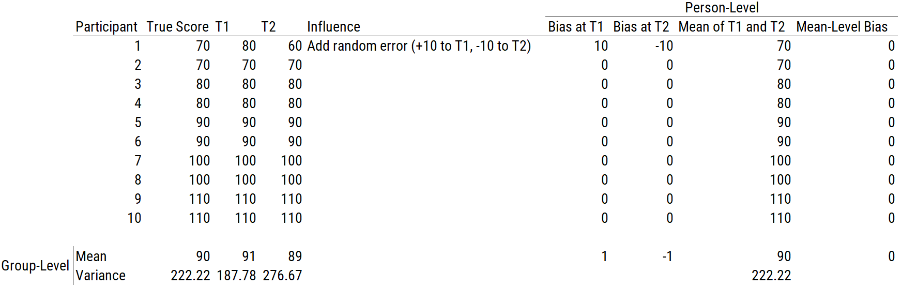
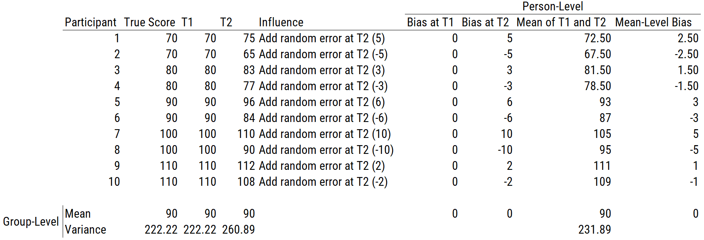

# Reliability {#reliability}

## Classical Test Theory {#ctt}

### Overview {#cttOverview}

To understand the concept of reliability, it is helpful to understand *classical test theory* (CTT), which is also known as "true score theory."\index{classical test theory}\index{true score}
Classical test theory is one of various measurement theories, in addition to [item response theory](#irt) and [generalizability theory](#gTheory).\index{classical test theory}\index{item response theory}\index{generalizability theory}
CTT has been the predominant measurement theory through the history of psychology.\index{classical test theory}
CTT is a theory of how test scores relate to a construct.\index{classical test theory}
A [*construct*](#constructs) is the concept or characteristic that a measure is intended to assess.\index{construct}

Assume you take a measurement of the same object multiple times (i.e., repeated measure).
For example, you assess the mass of the same rock multiple times.
However, you obtain different estimates of the rock's mass each time.
There are multiple possible explanations for this observation.
One possible explanation could be that the rock is changing in its mass, which would be consistent with the idea proposed by the Greek philosopher Heraclitus that nothing is stable and the world is in flux.
An alternative possibility, however, is that the rock is stable in its mass but the measurements are jittery—that is, they include error.\index{measurement error}

Based on the possibility that the rock is stable and that differences in scores across time reflect measurement error, CTT proposes the true score formula in Equation \@ref(eq:ctt):\index{classical test theory}\index{true score}\index{measurement error}\index{true score!formula}

$$
\begin{aligned}
  X &= T + e \\
  \text{observed score} &= \text{true score} + \text{measurement error}
\end{aligned}
(\#eq:ctt)
$$

$X$ is the observed measurement or score, $T$ is the classical (or psychometric) "true score," and $e$ is the measurement error (i.e., error score).\index{classical test theory}\index{observed score}\index{true score}\index{measurement error}

This formula is depicted visually in the form of a path diagram in Figure \@ref(fig:classicalTestTheory).\index{classical test theory}\index{true score!formula}\index{true score!formula!path diagram}\index{path analysis}

```{r classicalTestTheory, out.width = "10%", fig.align = "center", fig.cap = "Classical Test Theory Formula in a Path Diagram.", echo = FALSE}
knitr::include_graphics("./Images/classicalTestTheory.png")
```

It is important to distinguish between the classical true score and the Platonic true score.\index{classical test theory}\index{true score}
The *Platonic true score* is the truth, and it does not depend on measurement.\index{true score}
The Platonic true score is an abstract notion because it is not directly observable and is based on Platonic ideals and theories of the construct and what a person's "true" level is on the construct.\index{true score}
In CTT, we attempt to approximate the Platonic true score with the classical true score, ($T$).\index{classical test theory}\index{true score}
If we took infinite repeated observations (and the measurements had no carryover effect), the average score approaches the classical true score, $T$.\index{classical test theory}\index{true score}
That is, $\overline{X} = T \text{ as number of observations} \rightarrow \infty$.\index{classical test theory}\index{true score}
CTT attempts to partition variance into different sources.\index{classical test theory}
*Variance* is an index of scores' variability, i.e., the degree to which scores differ.\index{variance}
Variance is defined as the average squared deviation from the mean, as in Equation \@ref(eq:variance):\index{variance}

\begin{equation}
\sigma^2_X = E[(X - \mu)^2]
(\#eq:variance)
\end{equation}

According to CTT, any observed measurement includes both true score (construct) variance ($\sigma^2_T$) and error variance ($\sigma^2_e$).\index{classical test theory}\index{observed score}\index{true score}\index{measurement error}
Given the true score formula ($X = T + e$), this means that their variance is as follows (see Equation \@ref(eq:observedScoreVariance)):\index{classical test theory}\index{true score}\index{true score!formula}

$$
\begin{aligned}
  \sigma^2_X &= \sigma^2_T + \sigma^2_e \\
  \text{observed score variance} &= \text{true score variance} + \text{error variance}
\end{aligned}
(\#eq:observedScoreVariance)
$$

Nevertheless, the *classical true score*, $T$, is the expected value and is not necessarily the same thing as the Platonic true score [@Borsboom2003; @Klein1969] because the expected value would need to be entirely valid/accurate (i.e., it would need to be the construct score) for it to be the Platonic true score.\index{classical test theory}\index{true score}
The expected score could also be influenced by [systematic sources of error](#systematicError) such as other constructs, which would not fall into the error portion of the CTT formula because, as described below, CTT assumes that error is [random](#randomError) (not [systematic](#systematicError)).\index{classical test theory}\index{measurement error}\index{measurement error!systematic error}\index{measurement error!random error}
The distinctions between construct score, (classical) true score, and observed score, in addition to [validity](#validity), reliability, [systematic error](#systematicError), and [random error](#randomError) are depicted in Figure \@ref(fig:reliabilityValidityError).\index{classical test theory}\index{measurement error}\index{measurement error!systematic error}\index{measurement error!random error}

```{r reliabilityValidityError, out.width = "100%", fig.align = "center", fig.cap = "Distinctions Between Construct Score, True Score, and Observed Score, in Addition to Reliability, Validity, Systematic Error, and Random Error. (Adapted from  W. Joel Schneider.)", fig.scap = "Distinctions Between Construct Score, True Score, and Observed Score, in Addition to Reliability, Validity, Systematic Error, and Random Error.", echo = FALSE}
knitr::include_graphics("./Images/ReliabilityvsValidity-03.png")
```

The true score formula is theoretically useful, but it is not practically useful because it is an under-identified equation and we do not know the values of $T$ or $e$ based on knowing the observed score ($X$).\index{classical test theory}\index{observed score}\index{true score}\index{measurement error}
For instance, if we obtain an observed score of 10, our formula is $10 = T + e$, and we do not know what the true score or error is.\index{classical test theory}\index{observed score}\index{true score}\index{measurement error}
As a result, CTT makes several simplifying assumptions so we can estimate how stable (reliable) or noisy the measure is and what proportion of the observed score reflects true score versus measurement error.\index{classical test theory}\index{observed score}\index{true score}\index{measurement error}\index{reliability}

1. $E(e) = 0$

    The first assumption of CTT is that the expected value of the error (i.e., error scores) is zero.\index{classical test theory}\index{measurement error}
    Basically, the error component of the observed scores is expected to be random with a mean of zero.\index{classical test theory}\index{observed score}\index{measurement error}
    The likelihood that the observed score is an overestimate of $T$ is assumed to be the same as the likelihood that the observed score is an underestimate of $T$.\index{classical test theory}\index{observed score}\index{measurement error}
    In other words, the distribution of error scores above $T$ is assumed to be the same as the distribution of error scores below $T$.\index{classical test theory}\index{true score}\index{measurement error}
    In reality, this assumption is likely false in many situations.
    For instance, social desirability bias is a [systematic error](#systematicError) where people rate themselves as better than they actually are; thus, social desirability results in biasing scores in a particular direction across respondents, so such an error would not be entirely random.\index{classical test theory}\index{measurement error}\index{measurement error!systematic error}\index{measurement error!random error}
    But using the assumption that the expected value of $e$ is zero also informs that the expected value of the observed score ($X$) equals the expected value of the true score ($T$), as in Equation \@ref(eq:expectedValueObservedScore):\index{classical test theory}\index{observed score}\index{true score}\index{measurement error}
    
$$
\begin{aligned}
  E(X) &= E(T + e) \\
  &= E(T) + E(e) \\
  &= E(T) + 0 \\
  &= E(T)
\end{aligned}
(\#eq:expectedValueObservedScore)
$$

2. $r_{T,e} = 0$

    The second assumption of CTT is that the correlation between $T$ and $e$ is zero—that is, people's true scores are uncorrelated with the error around their measurement (i.e., people's error scores).\index{classical test theory}\index{true score}\index{measurement error}
    However, this assumption is likely false in many situations.
    For instance, one can imagine that, on a paper-and-pencil intelligence test, scores may have greater error for respondents with lower true scores and may have less error for respondents with higher true scores.\index{classical test theory}\index{observed score}\index{true score}\index{measurement error}

3. $r_{e_1, e_2} = 0$

    The third assumption of CTT is that the error is uncorrelated across time—that is, people's error scores at time 1 ($e_1$) are not associated with their error scores at time 2 ($e_2$).\index{classical test theory}\index{measurement error}
    However, this assumption is also likely false in many situations.
    For example, if some people have a high social desirability bias at time 1, they are likely to also have a high social desirability bias at time 2.
    That is, the error around measurements of participants is likely to be related across time.\index{classical test theory}\index{measurement error}

These three assumptions are implicit in the path analytic diagram in Figure \@ref(fig:reliabilityPathDiagram1), which depicts the CTT approach to understanding reliability of a measure across two time points.\index{classical test theory}\index{reliability!path diagram}\index{path analysis}

```{r reliabilityPathDiagram1, out.width = "30%", fig.align = "center", fig.cap = "Reliability of a Measure Across Two Time Points, as Depicted in a Path Diagram.", echo = FALSE}
knitr::include_graphics("./Images/Reliability_1.png")
```

In [path analytic](#pathAnalysis-sem) (and [structural equation modeling](#sem)) language, rectangles represent variables we observe, and circles represent latent (i.e., unobserved) variables.\index{path analysis}\index{structural equation modeling}
The observed scores at time 1 ($X_1$) and time 2 ($X_2$) are entities we observe, so they are represented by rectangles.\index{observed score}
We do not directly observe the true scores ($T_1, T_2$) and error scores ($e_1, e_2$), so they are considered latent entities and are represented by circles.\index{true score}\index{measurement error}
Single-headed arrows indicate regression paths, where conceptually, one variable is thought to influence another variable.
As the model depicts, the observed scores are thought to be influenced both by true scores and by error scores.\index{observed score}
We also expect the true scores at time 1 ($T_1$) and time 2 ($T_2$) to be correlated, so we have a covariance path, as indicated by a double-headed arrow.\index{true score}
A *covariance* is an unstandardized index of the strength of association between two variables.\index{covariance}
Because a covariance is unstandardized, its scale depends on the scale of the variables.\index{covariance}
The covariance between two variables is the average product of their deviations from their respective means, as in Equation \@ref(eq:covariance):\index{covariance}

\begin{equation}
\sigma_{XY} = E[(X - \mu_X)(X - \mu_Y)]
(\#eq:covariance)
\end{equation}

The covariance of a variable with itself is equivalent to its variance, as in Equation \@ref(eq:covarianceVariance):\index{covariance}\index{variance}

$$
\begin{aligned}
  \sigma_{XX} &= E[(X - \mu_X)(X - \mu_X)] \\
  &= E[(X - \mu_X)^2] \\
  &= \sigma^2_X
\end{aligned}
(\#eq:covarianceVariance)
$$

By contrast, a *correlation* is a standardized index of the strength of association between two variables.\index{correlation}
Because a correlation is standardized (fixed between [−1,1]), its scale does not depend on the scales of the variables.\index{correlation}
In this figure, no other parameters (regressions, covariances, or means) are specified, so the following are implicit in the diagram:\index{path analysis}

- $E(e) = 0$
- $r_{T,e} = 0$
- $r_{e_1, e_2} = 0$

The factor loadings reflect the magnitude that the latent factor influences the observed variable.\index{structural equation modeling!factor loading}
In this case, the true scores influence the observed scores with a magnitude of $\sqrt{r_{xx}}$, which is known as the *index of reliability*.\index{classical test theory}\index{true score}\index{observed score}\index{reliability!index of reliability}
The index of reliability is the theoretical estimate of the correlation between the true scores and the observed scores.\index{reliability!index of reliability}\index{true score}\index{observed score}
This is depicted in Figure \@ref(fig:reliabilityPathDiagram2).\index{reliability!path diagram}

```{r reliabilityPathDiagram2, out.width = "30%", fig.align = "center", fig.cap = "Reliability of a Measure Across Two Time Points, as Depicted in a Path Diagram; Includes the Index of Reliability.", echo = FALSE}
knitr::include_graphics("./Images/Reliability_2.png")
```

We can use path tracing rules to estimate the reliability of the measure, where the reliability of the measure, i.e., the *coefficient of reliability* ($r_{xx}$), is estimated as the correlation between the observed score at time 1 ($x_1$) and the observed score at time 2 ($x_2$).\index{path analysis!path tracing rules}\index{reliability!coefficient of reliability}\index{observed score}
According to path tracing rules [@Pearl2013], the correlation between $x_1$ and $x_2$ is equal to the sum of the standardized coefficients of all the routes through which $x_1$ and $x_2$ are connected.\index{path analysis!path tracing rules}
The contribution of a given route to the correlation between $x_1$ and $x_2$ is equal to the product of all standardized coefficients on that route that link $x_1$ and $x_2$ that move in the following directions: (a) forward (e.g., $T_1$ to $x_1$) or (b) backward once and then forward (e.g., $x_1$ to $T_1$ to $T_2$ to $x_2$).\index{path analysis!path tracing rules}
Path tracing does not allow moving forward and then backward—that is, it does not allow retracing (e.g., $e$ to $x_1$ to $T_1$) in the same route.\index{path analysis!path tracing rules}
It also does not allow passing more than one curved arrow (covariance path) or through the same variable twice in the same route.\index{path analysis!path tracing rules}
Once you know the contribution of each route to the correlation, you can calculate the total correlation between the two variables as the sum of the contribution of each route.\index{path analysis!path tracing rules}
Therefore, using one route, we can calculate the association between $x_1$ and $x_2$ as in Equation \@ref(eq:associationBetweenTwoVars):\index{path analysis!path tracing rules}

$$
\begin{aligned}
 r_{x_1,x_2} &= \sqrt{r_{xx}} \times r_{T_1,T_2} \times \sqrt{r_{xx}} \\
 &= r_{T_1,T_2} \times r_{xx} \\
 &= \text{correlation of true scores across time} \times \text{reliability}
\end{aligned}
(\#eq:associationBetweenTwoVars)
$$

When dealing with a stable construct, we would assume that the correlation between true scores across time is 1.0: $r_{T_1,T_2} = 1.0$, as depicted in Figure \@ref(fig:reliabilityPathDiagram3).\index{true score}\index{reliability!path diagram}\index{construct!stability}

```{r reliabilityPathDiagram3, out.width = "30%", fig.align = "center", fig.cap = "Reliability of a Measure of a Stable Construct Across Two Time Points, as Depicted in a Path Diagram.", echo = FALSE}
knitr::include_graphics("./Images/Reliability_3.png")
```

Then, to calculate the association between $x_1$ and $x_2$ of a stable construct, we can use path tracing rules as in Equation \@ref(eq:reliabilityCoefficient):\index{path analysis!path tracing rules}\index{reliability!coefficient of reliability}

$$
\begin{aligned}
 r_{x_1,x_2} &= \sqrt{r_{xx}} \times r_{T_1,T_2} \times \sqrt{r_{xx}} \\
 &= \sqrt{r_{xx}} \times 1 \times \sqrt{r_{xx}} \\
 &= r_{xx} \\
 &= \text{coefficient of reliability}
\end{aligned}
(\#eq:reliabilityCoefficient)
$$

That is, for a stable construct (i.e., whose true scores are perfectly correlated across time; $r_{T_1,T_2} = 1.0$), we estimate reliability as the correlation between the observed scores at time 1 ($x_1$) and the observed scores at time 2 ($x_2$).\index{classical test theory}\index{reliability!coefficient of reliability}\index{observed score}\index{construct!stability}
This is known as [*test–retest reliability*](#testRetest-reliability).\index{reliability!test–retest}
We therefore assume that the extent to which the correlation between $x_1$ and $x_2$ is less than one reflects measurement error (an unstable measure), rather than people's changes in their true score on the construct (an unstable construct).\index{classical test theory}\index{reliability!coefficient of reliability}\index{measurement error}\index{true score}\index{construct!stability}

As described above, the reliability coefficient ($r_{xx}$) is the association between a measure and itself over time or with another measure in the domain.\index{classical test theory}\index{reliability!coefficient of reliability}
By contrast, the *reliability index* ($r_{xT}$) is the correlation between observed scores on a measure and the true scores [@Nunnally1994].\index{classical test theory}\index{reliability!index of reliability}
The reliability index is the square root of the reliability coefficient, as in Equation \@ref(eq:reliabilityIndex).\index{classical test theory}\index{reliability!index of reliability}\index{reliability!coefficient of reliability}

$$
\begin{aligned}
 r_{xT} &= \\
 &= \sqrt{r_{xx}} \\
 &= \text{index of reliability}
\end{aligned}
(\#eq:reliabilityIndex)
$$

### Four CTT Measurement Models {#cttMeasurementModels}

There are four primary measurement models in CTT [@Graham2006a]:\index{classical test theory!measurement models}

1. [parallel](#cttParallel)\index{classical test theory!measurement models!parallel}
1. [tau-equivalent](#cttTauEquivalent)\index{classical test theory!measurement models!tau equivalent}
1. [essentially tau-equivalent](#cttEssentiallyTauEquivalent)\index{classical test theory!measurement models!essentially tau equivalent}
1. [congeneric](#cttCongeneric)\index{classical test theory!measurement models!congeneric}

#### Parallel {#cttParallel}

The parallel measurement model is the most stringent measurement model for use in estimating reliability.\index{classical test theory!measurement models!parallel}
In CTT, a measure is considered parallel if the true scores and error scores are equal across items.\index{classical test theory!measurement models!parallel}
That is, the items must be unidimensional and assess the same construct, on the same scale, with the same degree of precision, and with the same amount of error [@Graham2006a].\index{unidimensional}\index{reliability!precision}\index{measurement error}
Items are expected to have the same strength of association (i.e., factor loading or discrimination) with the construct.\index{structural equation modeling!factor loading}\index{item response theory!item discrimination}

#### Tau-Equivalent {#cttTauEquivalent}

The tau ($\tau$)-equivalent measurement model is the same as the parallel measurement model, except error scores are allowed to differ across items.\index{classical test theory!measurement models!tau equivalent}\index{classical test theory!measurement models!parallel}
That is, a measure is tau-equivalent if the items are unidimensional and assess the same construct, on the same scale, with the same degree of precision, but with possibly different amounts of error [@Graham2006a].\index{classical test theory!measurement models!tau equivalent}\index{unidimensional}\index{reliability!precision}\index{measurement error}
In other words, true scores are equal across items but each item is allowed to have unique error scores.\index{true score}\index{measurement error}
Items are expected to have the same strength of association with the construct.
Variance that is unique to a specific item is assumed to be error variance.\index{measurement error}

#### Essentially Tau-Equivalent {#cttEssentiallyTauEquivalent}

The essentially tau ($\tau$)-equivalent model is the same as the tau-equivalent measurement model, except items are allowed to differ in their precision.\index{classical test theory!measurement models!essentially tau equivalent}\index{classical test theory!measurement models!tau equivalent}
That is, a measure is essentially tau-equivalent if the items are unidimensional and assess the same construct, on the same scale, but with possibly different degrees of precision, and with possibly different amounts of error [@Graham2006a].\index{classical test theory!measurement models!essentially tau equivalent}\index{unidimensional}\index{reliability!precision}\index{measurement error}
The essentially tau-equivalent model allows item true scores to differ by a constant that is unique to each pair of variables.\index{classical test theory!measurement models!essentially tau equivalent}\index{true score}
The magnitude of the constant reflects the degree of imprecision and influences the mean of the item scores but not its variance or covariances with other items.\index{reliability!precision}
Items are expected to have the same strength of association with the construct.

#### Congeneric {#cttCongeneric}

The congeneric measurement model is the least restrictive measurement model.\index{classical test theory!measurement models!congeneric}
The congeneric measurement model is the same as the essentially tau ($\tau$)-equivalent model, except items are allowed to differ in their scale.\index{classical test theory!measurement models!congeneric}\index{classical test theory!measurement models!essentially tau equivalent}
That is, a measure is congeneric if the items are unidimensional and assess the same construct, but possibly on a different scale, with possibly different degrees of precision, and with possibly different amounts of error [@Graham2006a].\index{classical test theory!measurement models!congeneric}\index{scale}\index{reliability!precision}\index{measurement error}
Items are not expected to have the same strength of association with the construct.

## Measurement Error {#measurementError}

Measurement error is the difference between the measured (observed) value and the true value.\index{measurement error}\index{observed score}\index{true score}
All measurements come with uncertainty and measurement error.\index{measurement error}
Even a measure of something as simple as whether someone is dead has error.\index{measurement error}

There are two main types of measurement error: [systematic](#systematicError) (nonrandom) error and [unsystematic](#randomError) (random) error.\index{measurement error}\index{measurement error!systematic error}\index{measurement error!random error}
In addition, measurement error can be [within-person](#withinPersonError), [between-person](#betweenPersonError), or both.\index{measurement error}\index{measurement error!within person}\index{measurement error!between person}

### Systematic (Nonrandom) Error {#systematicError}

An example of *systematic error* is depicted in Figure \@ref(fig:systematicError).\index{measurement error!systematic error}
Systematic error is error that influences consistently for a person or across the sample.\index{measurement error!systematic error}
An error is systematic if the error always occurs, with the same value, when using the measure in the same way and in the same case.\index{measurement error!systematic error}
An example of a systematic error is a measure that consistently assesses constructs other than the construct the measure was designed to assess.\index{measurement error!systematic error}
For instance, if a test written in English to assess math skills is administered in a nonnative English-speaking country, some portion of the scores will reflect variance attributable to English reading skills rather than the construct of interest (math skills).
Other examples of systematic error include response styles or subjective, idiosyncratic judgments by a rater—for instance, if the rater's judgments are systematically harsh or lenient.\index{measurement error!systematic error}
A systematic error affects the average score (i.e., resulting in bias), which makes the group-level estimates less accurate and makes the measurements for an individual less accurate.\index{measurement error!systematic error}

As depicted in Figure \@ref(fig:systematicError), systematic error does not affect the variability of the scores but it does affect the mean of the scores, so the person-level mean and group-level mean are less accurate.\index{measurement error!systematic error}
In other words, a systematic error leads to a biased estimate of the average.\index{measurement error!systematic error}\index{bias}
However, multiple systematic errors may simultaneously coexist and can operate in the same direction (exacerbating the effects of bias) or in opposite directions (hiding the extent of bias).\index{measurement error!systematic error}\index{bias}

```{r systematicError, echo = FALSE, results = "hide", out.width = "100%", fig.align = "center", fig.cap = "Systematic Error."}
library("tidyverse")
library("viridis")

sampleSize <- 1000
set.seed(52242)

rawMeasure <- data.frame(score = rnorm(sampleSize), measure = "rawMeasure")
addSystematicError <- data.frame(score = rawMeasure$score + 1, measure = "addSystematicError")
addRandomError <- data.frame(score = rawMeasure$score + rnorm(sampleSize), measure = "addRandomError")

errorList <- list(rawMeasure, addSystematicError, addRandomError)
errorData <- bind_rows(errorList)

ggplot(errorData %>% filter(measure != "addRandomError"), aes(x = score, fill = measure)) +
  geom_density(alpha = 0.25) +
  scale_fill_viridis_d(name = "",
                       breaks = c("rawMeasure", "addSystematicError"),
                       labels = c("Raw Measure", "Measure with Systematic Error Added")) +
  theme_bw() +
  theme(legend.position = "top")
```

### Unsystematic (Random) Error {#randomError}

An example of *unsystematic (random) error* is depicted in Figure \@ref(fig:unsystematicError).\index{measurement error!random error}
Random error occurs due to chance.\index{measurement error!random error}
For instance, a random error could arise from a participant being fatigued on a particular testing day or from a participant getting lucky in guessing the correct answer.\index{measurement error!random error}
Random error does not have consistent effects for a person or across the sample, and it may vary from one observation to another.\index{measurement error!random error}
Random error does not (systematically) affect the average, i.e., the group-level estimate—random error affects only the variability around the average (noise).\index{measurement error!random error}
However, random error makes measurements for an individual less accurate.\index{measurement error!random error}
A large number of observations of the same construct cancels out random error but does not cancel out systematic error.\index{measurement error!random error}\index{measurement error!systematic error}

As depicted in Figure \@ref(fig:unsystematicError), random error does not affect the mean of the scores, but it does increase the variability of the scores.\index{measurement error!random error}
In other words, the group-level mean is still accurate, but individuals' scores are less precise.\index{measurement error!random error}\index{reliability!precision}

```{r unsystematicError, echo = FALSE, results = "hide", out.width = "100%", fig.align = "center", fig.cap = "Random Error."}
ggplot(errorData %>% filter(measure != "addSystematicError"), aes(x = score, fill = measure)) +
  geom_density(alpha = 0.25) +
  scale_fill_viridis_d(name = "",
                       breaks = c("rawMeasure", "addRandomError"),
                       labels = c("Raw Measure", "Measure with Random Error Added")) +
  theme_bw() +
  theme(legend.position = "top")
```

### Within-Person Error {#withinPersonError}

Consider two data columns, one column for participants' scores at time 1 and another column for participants' scores at time 2.\index{measurement error!within person}
Adding within-person error would mean adding noise ($e$) within the given row (or rows) for the relevant participant(s).\index{measurement error!within person}
Adding between-person error would mean adding noise ($e$) across the rows within the column.\index{measurement error!between person}

Within-person error occurs within a particular person.\index{measurement error!within person}
For instance, you could add within-person error to a data set by adding error to the given row (or rows) for the relevant participant(s).\index{measurement error!within person}

### Between-Person Error {#betweenPersonError}

Between-person error occurs across the sample.\index{measurement error!between person}
You could add between-person random error to a variable by adding error across the rows, within a column.\index{measurement error!between person}

### Types of Measurement Error {#measurementErrorTypes}

There are four nonmutually exclusive types of measurement error: within-person random error, within-person systematic error, between-person random error, and between-person systematic error.\index{measurement error}\index{measurement error!systematic error}\index{measurement error!random error}\index{measurement error!within person}\index{measurement error!between person}
The four types of [measurement error](#measurementError) are depicted in Figure \@ref(fig:measurementErrorTypes), as adapted from @Willett2012.\index{measurement error}\index{measurement error!systematic error}\index{measurement error!random error}\index{measurement error!within person}\index{measurement error!between person}

```{r measurementErrorTypes, out.width = "100%", fig.align = "center", fig.cap = "Types of Measurement Error.", echo = FALSE}
knitr::include_graphics("./Images/MeasurementErrorTypes.png")
```

#### Within-Person Random Error {#withinPersonRandomError}

Adding within-person random error would involve adding random noise ($e$) to the given row (or rows) for the relevant participant(s).\index{measurement error!random error}\index{measurement error!within person}
This could reflect momentary fluctuations in the assessment for a specific person.\index{measurement error!random error}\index{measurement error!within person}
When adding within-person random error, the person's and group's measurements show no bias, i.e., there is no consistent increase or decrease in the scores from time 1 to time 2 (at least with a sample size large enough to cancel out the random error, according to the law of large numbers).\index{measurement error!random error}\index{measurement error!within person}\index{bias}
A person's average approximates their true score if many repeated measurements are taken.\index{measurement error!random error}\index{measurement error!within person}
A group's average approximates the sample mean's true score, especially when averaging the repeated measures across time.\index{measurement error!random error}\index{measurement error!within person}
The influence of within-person random error is depicted in Figure \@ref(fig:withinPersonRandomError).\index{measurement error!random error}\index{measurement error!within person}

```{r withinPersonRandomError, out.width = "100%", fig.align = "center", fig.cap = "Within-Person Random Error.", echo = FALSE}

```

#### Within-Person Systematic Error {#withinPersonSystematicError}

Adding within-person systematic error would involve adding systematic noise ($e$) (the same variance across columns) to the given row (or rows), reflecting the relevant participant(s).\index{measurement error!systematic error}\index{measurement error!within person}
These are within-person effects that are consistent across time.\index{measurement error!systematic error}\index{measurement error!within person}
For example, social desirability bias is high for some people and low for others.\index{measurement error!systematic error}\index{measurement error!within person}\index{bias!social desirability}
Another instance in which within-person systematic error could exist is when one or more people consistently misinterpret a particular question.\index{measurement error!systematic error}\index{measurement error!within person}
Within-person systematic error increases person-level bias because the person's mean shows a greater difference from their true score.\index{measurement error!systematic error}\index{measurement error!within person}\index{bias}\index{individual level}
The influence of within-person systematic error is depicted in Figure \@ref(fig:withinPersonSystematicError).\index{measurement error!systematic error}\index{measurement error!within person}

```{r withinPersonSystematicError, out.width = "100%", fig.align = "center", fig.cap = "Within-Person Systematic Error.", echo = FALSE}
knitr::include_graphics("./Images/Error_Within-PersonSystematic.png")
```

#### Between-Person Random Error {#betweenPersonRandomError}

Adding between-person random error at time 2 would involve adding random noise ($e$) across the rows, within the column.\index{measurement error!random error}\index{measurement error!between person}
Between-person random error would result in less accurate scores at the person level but would not result in bias at the group level.\index{measurement error!random error}\index{measurement error!between person}
At a given timepoint, it results in over-estimates of the person's true score for some people and under-estimates for other people, i.e., there is no consistent pattern across the sample.\index{measurement error!random error}\index{measurement error!between person}
Thus, the group average approximates the sample's mean true score (at least with a sample size large enough to cancel out the random error, according to the law of large numbers).\index{measurement error!random error}\index{measurement error!between person}
In addition, the average of repeated measurements of the person's score would approximate the person's true score.\index{measurement error!random error}\index{measurement error!between person}
However, the group's variance is inflated.\index{measurement error!random error}\index{measurement error!between person}
The influence of between-person random error is depicted in Figure \@ref(fig:betweenPersonRandomError).\index{measurement error!random error}\index{measurement error!between person}

```{r betweenPersonRandomError, out.width = "100%", fig.align = "center", fig.cap = "Between-Person Random Error.", echo = FALSE}

```

#### Between-Person Systematic Error {#betweenPersonSystematicError}

Adding between-person systematic error at time 2 would involve adding systematic noise ($e$) across the rows, within the column.\index{measurement error!systematic error}\index{measurement error!between person}
Between-person systematic error results from within-person error that tends to be negative or positive across participants.\index{measurement error!systematic error}\index{measurement error!between person}
For instance, this could reflect an influence with a shared effect across subjects.\index{measurement error!systematic error}\index{measurement error!between person}
For example, social desirability leads to a positive group-level bias for rating their socially desirable attributes.\index{measurement error!systematic error}\index{measurement error!between person}\index{bias!social desirability}
Another example would be when a research assistant enters values wrong at time 2 (e.g., adding 10 to all participants' scores).\index{measurement error!systematic error}\index{measurement error!between person}
Between-person systematic error increases bias because it results in a greater group mean difference from the group's mean true score.\index{measurement error!systematic error}\index{measurement error!between person}\index{bias}\index{group level}
The influence of between-person systematic error is depicted in Figure \@ref(fig:betweenPersonSystematicError).\index{measurement error!systematic error}\index{measurement error!between person}

```{r betweenPersonSystematicError, out.width = "100%", fig.align = "center", fig.cap = "Between-Person Systematic Error.", echo = FALSE}
knitr::include_graphics("./Images/Error_Between-PersonSystematic.png")
```

### Summary {#measurementErrorSummary}

In sum, all types of measurement error (whether [systematic](#systematicError) or [random](#randomError)) lead to less accurate scores for an individual.\index{measurement error}\index{measurement error!systematic error}\index{measurement error!random error}\index{validity}\index{individual level}
But different kinds of error have different implications.\index{measurement error}
[Systematic](#systematicError) and [random](#randomError) error have different effects on accuracy at the group-level.\index{measurement error!systematic error}\index{measurement error!random error}\index{validity}\index{group level}
[Systematic error](#systematicError) leads to less accurate estimates at the group-level, whereas [random error](#randomError) does not.\index{measurement error!systematic error}\index{measurement error!random error}\index{validity}\index{group level}

CTT assumes that all error is [random](#randomError).\index{classical test theory}\index{measurement error}\index{measurement error!random error}
According to CTT, as the number of measurements approaches infinity, the mean of the measurements gets closer to the true score, because the [random errors](#randomError) cancel each other out.\index{classical test theory}\index{true score}\index{measurement error!random error}
With more measurements, we reduce our uncertainty and increase our precision.\index{classical test theory}\index{reliability!precision}
According to CTT, if we take many measurements and the average of the measurements is 10, we have some confidence that the true score $(T) \approx 10$.\index{classical test theory}\index{true score}
In reality, however, error for a given measure likely includes both [systematic](#systematicError) and [random](#randomError) error.\index{measurement error}\index{measurement error!systematic error}\index{measurement error!random error}

## Overview of Reliability {#overview-reliability}

The "Standards for Educational and Psychological Testing" set the standard for educational and psychological assessment and are jointly published by the American Educational Research Association, American Psychological Association, and National Council on Measurement in Education.\index{Standards for Educational and Psychological Testing}
According to the "Standards" [@AERA2014, p. 33], reliability is the "consistency of the scores across instances of the testing procedure."\index{Standards for Educational and Psychological Testing}\index{reliability!overview}
In this book, we define reliability as how much repeatability, consistency, and precision the scores from a measure have.\index{reliability!overview}\index{reliability!repeatability}\index{reliability!consistency}\index{reliability!precision}

Reliability ($r_{xx}$) has been defined mathematically as the proportion of observed score variance ($\sigma^2_X$) that is attributable to true score variance ($\sigma^2_T$), as in Equation \@ref(eq:reliabilityRatio):\index{reliability!overview}\index{true score}\index{observed score}

$$
\begin{aligned}
 r_{xx} &= \frac{\sigma^2_T}{\sigma^2_T + \sigma^2_e} \\
 &= \frac{\sigma^2_T}{\sigma^2_X} \\
 &= \frac{\text{true score variance}}{\text{observed score variance}} \\
\end{aligned}
(\#eq:reliabilityRatio)
$$

An alternative formulation is that reliability ($r_{xx}$) is the lack of error variance or the degree to which observed scores are correlated with true scores or uncorrelated with error scores.\index{reliability!overview}\index{observed score}\index{measurement error}
In CTT, reliability can be conceptualized in four primary ways, as depicted in Figure \@ref(fig:conceptualizingReliability) [@Furr2017].\index{reliability!overview}\index{classical test theory}

```{r conceptualizingReliability, out.width = "100%", fig.align = "center", fig.cap = "Four Different Ways of Conceptualizing Reliability.", echo = FALSE}
knitr::include_graphics("./Images/conceptualizingReliability.png")
```

However, we cannot *calculate* reliability because we cannot measure the true score component of an observation.\index{reliability!overview}\index{true score}
Therefore, we *estimate* reliability (the coefficient of reliability) based on the relation between two observations of the same measure (for test–retest reliability) or using other various estimates of reliability.\index{reliability!overview}\index{reliability!coefficient of reliability}\index{reliability!test–retest}

The coefficient of reliability can depend on several factors.\index{reliability!overview}\index{reliability!coefficient of reliability}
Reliability is inversely related to the amount of [measurement error](#measurementError).\index{reliability!overview}\index{measurement error}
The coefficient of reliability, like correlation, depends on the degree of spread (variability) of the scores.\index{reliability!coefficient of reliability}\index{correlation}\index{variability}
If the scores at one or both time points show restricted range, the scores will show a weaker association and coefficient of reliability, as shown in Figure \@ref(fig:restrictedRange).\index{reliability!coefficient of reliability}\index{correlation}\index{restricted range}
An ideal way to estimate the reliability of a measure would be to take a person and repeatedly measure them many times to get an estimate of their true score and each measurement's deviation from their true score, and to do this for many people.\index{reliability!overview}\index{true score}
However, this is rarely done in practice.
Instead of taking one person and repeatedly measuring them many times, we typically estimate reliability by taking many people and doing repeated measures twice.\index{reliability!overview}
This is a shortcut to estimate reliability, but even this shorter approach is not often done.\index{reliability!overview}
In short, researchers rarely estimate the [test–retest reliability](#testRetest-reliability) of the measures they use.\index{reliability!test–retest}

Reliability can also be related to the number of items in the measure.\index{reliability!overview}
In general, the greater the number of items, the more reliable the measure (assuming the items assess the same construct) because we are averaging out [random error](#randomError).\index{reliability!overview}\index{reliability!number of items}\index{measurement error!random error}

We never see the true scores or the error scores, so we cannot compute reliability—we can only *estimate* it from the observed scores.\index{reliability!overview}\index{true score}\index{measurement error}\index{observed score}
This estimate of reliability gives a probabilistic answer of the reliability of the measure, rather than an absolute answer.\index{reliability!overview}

### How Reliable Is Reliable Enough? {#reliableEnough}

As described by @Nunnally1994, how reliable a measure should be depends on the proposed uses.\index{reliability}
If it is early in the research process, and the focus is on group-level inferences (e.g., associations or group differences), modest reliability (e.g., .70) may be sufficient and save time and money.\index{reliability}\index{individual level}
Then, the researcher can see what the associations would be when disattenuated for unreliability, as described in Section \@ref(effectOfMeasurementErrorOnAssociations) of the chapter on [validity](#validity).\index{measurement error!disattenuation of association}
If the disattenuated associations are promising, it may be worth increasing the reliability of the measure.\index{reliability}\index{measurement error!disattenuation of association}
Associations are only weakly attenuated above a reliability of .80, so achieving a reliability coefficient of .80 may be an appropriate target for basic research.\index{reliability}

However, when making decisions about individual people from their score on a measure, reliability and precision are more important (than when making group-level inferences) because small differences in scores can lead to different decisions.\index{reliability}\index{reliability!precision}\index{individual level}
@Nunnally1994 recommend that measures have at least a reliability of .90 and—when making important decisions about individual people—that measures preferably have a reliability of .95 or higher.\index{reliability}\index{individual level}
Nevertheless, they also note that one should not switch to a less [valid](#validity) measure merely because it is more reliable.\index{reliability}\index{validity}

### Standard Error of Measurement (SEM) {#standardErrorOfMeasurement}

The estimate of reliability gives a general idea of the degree of uncertainty you have of a person's true score given their observed score.\index{reliability!standard error of measurement}\index{uncertainty}\index{standard error of measurement!zzzzz@\igobble|seealso{reliability}}
From this, we can estimate the standard error of measurement, which estimates the extent to which an observed score deviates from a true score.\index{reliability!standard error of measurement}\index{observed score}\index{true score}
The standard error of measurement indicates the typical distance of the observed score from the true score.\index{reliability!standard error of measurement}\index{observed score}\index{true score}
The formula for the standard error of measurement is in Equation \@ref(eq:standardErrorOfMeasurement):\index{reliability!standard error of measurement}

\begin{equation}
\text{standard error of measurement (SEM)} = \sigma_x \sqrt{1 - r_{xx}}
(\#eq:standardErrorOfMeasurement)
\end{equation}

where $\sigma_x$ represents the standard deviation of scores.
Thus, the standard error of measurement is directly related to the reliability of the measure.\index{reliability!standard error of measurement}\index{reliability}
The higher the reliability, the lower the standard error of measurement.\index{reliability!standard error of measurement}\index{reliability}
The standard error of measurement as a function of reliability of the measure and the standard deviation of scores is depicted in Figure \@ref(fig:standardErrorOfMeasurementPlot).\index{reliability!standard error of measurement}\index{reliability}

```{r standardErrorOfMeasurementPlot, echo = FALSE, results = "hide", out.width = "100%", fig.align = "center", fig.height = 4, fig.cap = "Standard Error of Measurement as a Function of Reliability."}
library("ggplot2")

standardErrorOfMeasurementData <- expand.grid(reliability = seq(0, 1, by = 0.01),
                                              sd = c(1, 3, 5, 10))

standardErrorOfMeasurementData$sem <- standardErrorOfMeasurementData$sd * sqrt(1 - standardErrorOfMeasurementData$reliability)

ggplot(standardErrorOfMeasurementData, aes(reliability, sem, group = as.factor(sd), color = as.factor(sd))) +
  geom_line(linewidth = 1.5) +
  theme_bw() +
  xlab("Reliability") +
  ylab("Standard Error of Measurement") +
  scale_color_viridis_d(name = "Standard Deviation of Scores") +
  theme(legend.justification = c(1,1), legend.position = c(1,1)) +
  theme(legend.background = element_rect(color = "black", fill = "white", linetype = "solid"))
```

The derivation of the SEM (from W. Joel Schneider) is in Equation \@ref(eq:standardErrorOfMeasurementDerivation):\index{reliability!standard error of measurement}

$$
\begin{aligned}
  \text{Remember, based on } X = T + e: && \sigma^2_X &= \sigma^2_T + \sigma^2_e \\
  \text{Solve for }\sigma^2_T: && \sigma^2_T &= \sigma^2_X - \sigma^2_e \\
  \text{Remember:} && r_{xx} &= \frac{\sigma^2_T}{\sigma^2_X} \\
  \text{Substitute for } \sigma^2_T: && &= \frac{\sigma^2_X - \sigma^2_e}{\sigma^2_X} \\
  \text{Multiply by } \sigma^2_X: && \sigma^2_X \cdot r_{xx} &= \sigma^2_X - \sigma^2_e \\
  \text{Solve for } \sigma^2_e: && \sigma^2_e &= \sigma^2_X - \sigma^2_X \cdot r_{xx} \\
  \text{Factor out } \sigma^2_X: && \sigma^2_e &= \sigma^2_X (1 - r_{xx}) \\
  \text{Take the square root:} && \sigma_e &= \sigma_X \sqrt{1 - r_{xx}}
\end{aligned}
(\#eq:standardErrorOfMeasurementDerivation)
$$

The SEM is equivalent to the standard deviation of [measurement error](#measurementError) ($e$) [@Lek2018a], as in Equation \@ref(eq:standardErrorOfMeasurementAlternative):\index{reliability!standard error of measurement}

$$
\begin{aligned}
  \text{standard error of measurement (SEM)} &= \sigma_x \sqrt{1 - r_{xx}} \\
  &= \sqrt{\sigma_x^2} \sqrt{1 - r_{xx}} \\
  &= \sqrt{\sigma_x^2(1 - r_{xx})} \\
  &= \sqrt{\sigma_x^2 - \sigma_x^2 \cdot r_{xx}} \\
  &= \sqrt{\sigma_x^2 - \sigma_x^2 \frac{\sigma^2_T}{\sigma_x^2}} \\
  &= \sqrt{\sigma_x^2 - \sigma^2_T} \\
  &= \sqrt{\sigma^2_e} \\
  &= \sigma_e \\
\end{aligned}
(\#eq:standardErrorOfMeasurementAlternative)
$$

Around 95% of scores would be expected to fall within $\pm 2$ SEMs of the true score (or, more precisely, within $\pm `r qnorm(.975)`$ SEMs of the true score).\index{reliability!standard error of measurement}\index{true score}
In other words, 95% of the time, the true score is expected to fall within $\pm 2$ SEMs of the observed score.\index{reliability!standard error of measurement}\index{true score}\index{observed score}
Given an observed score of $X = 15$ and $\text{SEM} = 2$, the 95% confidence interval of the true score is [11, 19].\index{reliability!standard error of measurement}\index{true score}\index{observed score}
So if a person gets a score of 15 on the measure, 95% of the time, their true score is expected to fall within 11–19.\index{reliability!standard error of measurement}\index{true score}\index{observed score}
We provide an empirical example of estimating the SEM in Section \@ref(sem-reliability).\index{reliability!standard error of measurement}

Based on the preceding discussion, consider the characteristics of measures that make them more useful from a reliability perspective.\index{reliability}
A useful measure would show wide variation across people (individual differences), so we can more accurately estimate its reliability.\index{reliability}\index{variability}
And we would expect a useful measure to show consistency, stability, precision, and reliability of scores.\index{reliability!consistency}\index{reliability!stability}\index{reliability!repeatability}\index{reliability!precision}\index{consistency!zzzzz@\igobble|seealso{reliability}}\index{repeatability!zzzzz@\igobble|seealso{reliability}}\index{precision!zzzzz@\igobble|seealso{reliability}}

## Getting Started {#gettingStarted-reliability}

### Load Libraries {#loadLibraries-reliability}

```{r}
library("petersenlab") #to install: install.packages("remotes"); remotes::install_github("DevPsyLab/petersenlab")
library("psych")
library("blandr")
library("MBESS")
library("lavaan")
library("semTools")
library("psychmeta")
library("irrCAC")
library("irrICC")
library("irrNA")
library("gtheory")
library("performance")
library("MOTE")
library("tidyverse")
library("tinytex")
library("knitr")
library("rmarkdown")
library("bookdown")
```

### Prepare Data {#prepareData-reliability}

#### Simulate Data {#simulateData-reliability}

For reproducibility, we set the seed below.\index{simulate data}
Using the same seed will yield the same answer every time.
There is nothing special about this particular seed.

```{r}
sampleSize <- 100

set.seed(52242)

rater1continuous <- rnorm(n = sampleSize, mean = 50, sd = 10)
rater2continuous <- rater1continuous + 
  rnorm(
    n = sampleSize,
    mean = 0,
    sd = 4)
rater3continuous <- rater2continuous + 
  rnorm(
    n = sampleSize,
    mean = 0,
    sd = 8)

rater1categorical <- sample(
  c(0,1),
  size = sampleSize,
  replace = TRUE)
rater2categorical <- rater1categorical
rater3categorical <- rater1categorical

rater2categorical[
  sample(1:length(rater2categorical),
         size = 10,
         replace = FALSE)] <- 0
rater3categorical[
  sample(1:length(rater3categorical),
         size = 10,
         replace = FALSE)] <- 1

time1 <- rnorm(n = sampleSize, mean = 50, sd = 10)
time2 <- time1 + rnorm(n = sampleSize, mean = 0, sd = 4)
time3 <- time2 + rnorm(n = sampleSize, mean = 0, sd = 8)

item1 <- rnorm(n = sampleSize, mean = 50, sd = 10)
item2 <- item1 + rnorm(n = sampleSize, mean = 0, sd = 4)
item3 <- item2 + rnorm(n = sampleSize, mean = 0, sd = 8)
item4 <- item3 + rnorm(n = sampleSize, mean = 0, sd = 12)

Person <- as.factor(rep(1:6, each = 8))
Occasion <- Rater <- 
  as.factor(rep(1:2, each = 4, times = 6))
Item <- as.factor(rep(1:4, times = 12))
Score <- c(
  9,9,7,4,9,8,5,5,9,8,4,6,
  6,5,3,3,8,8,6,2,8,7,3,2,
  9,8,6,3,9,6,6,2,10,9,8,7,
  8,8,9,7,6,4,5,1,3,2,3,2)
```

#### Add Missing Data {#addMissingData-reliability}

Adding missing data to dataframes helps make examples more realistic to real-life data and helps you get in the habit of programming to account for missing data.

```{r}
rater1continuous[c(5,10)] <- NA
rater2continuous[c(10,15)] <- NA
rater3continuous[c(10)] <- NA

rater1categorical[c(5,10)] <- NA
rater2categorical[c(10,15)] <- NA
rater3categorical[c(10)] <- NA

time1[c(5,10)] <- NA
time2[c(10,15)] <- NA
time3[c(10)] <- NA

item1[c(5,10)] <- NA
item2[c(10,15)] <- NA
item3[c(10)] <- NA
item4[c(10)] <- NA
```

#### Combine Data Into Dataframe {#combineData-reliability}

```{r}
mydata <- data.frame(
  subid = 1:sampleSize,
  rater1continuous, rater2continuous, rater3continuous,
  rater1categorical, rater2categorical, rater3categorical,
  time1, time2, time3,
  item1, item2, item3, item4)

pio_cross_dat <- data.frame(Person, Item, Score, Occasion)
```

## Types of Reliability {#typesOfReliability}

Reliability is not one thing.\index{reliability!types of}
There are several types of reliability.\index{reliability!types of}
In this book, we focus on [test–retest](#testRetest-reliability), [inter-rater](#interrater-reliability), [intra-rater](#intrarater-reliability), [parallel-forms](#parallelForms-reliability), and [internal consistency](#internalConsistency-reliability) reliability.\index{reliability!types of}

### Test–Retest Reliability {#testRetest-reliability}

Test–retest reliability is defined as the consistency of scores across time.
Typically, this is based on a two-week retest interval.\index{reliability!test–retest}\index{test–retest reliability!zzzzz@\igobble|seealso{reliability}}
The intent of a two-week interval between the original testing and the retest is to provide adequate time to pass to reduce any carryover effects from the original testing while not allowing too much time to pass such that the person's level on the construct (i.e., true scores) would change.\index{reliability!test–retest}\index{carryover effect}
A carryover effect is an effect of the experimental condition that affects the participant's behavior at a later time.\index{reliability!test–retest}\index{carryover effect}
Examples of carryover effects resulting from repeated measurement can include fatigue, boredom, learning (practice effects), etc.\index{carryover effect}
Another potential issue is that [measurement error](#measurementError) can be correlated across the two measurements.\index{measurement error}

Test–retest reliability controls for transient error and random response error.\index{reliability!test–retest}
If the construct is not stable across time (i.e., people's true scores change), test–retest reliability is not relevant because the CTT approach to estimating reliability assumes that the true scores are perfectly correlated across time (see Section \@ref(ctt)).\index{reliability!test–retest}\index{construct!stability}

The length of the optimal retest interval depends on the construct of interest.\index{reliability!test–retest}
For a construct in which people's levels change rapidly, a shorter retest interval may be appropriate.\index{reliability!test–retest}
But one should pay attention to ways to reduce potential carryover effects.\index{reliability!test–retest}\index{carryover effect}
By contrast, if the retest interval is too long, people's levels on the construct may change during that span.\index{reliability!test–retest}\index{construct!stability}
If people's levels on the construct change from test to retest, we can no longer assume that the true scores are perfectly correlated across time, which would violate CTT assumptions for estimating test–retest reliability of a measure.\index{reliability!test–retest}\index{construct!stability}\index{true score}\index{classical test theory}
The longer the retest interval, the smaller the observed association between scores across time will tend to be.\index{reliability!test–retest}
For weak associations obtained from a lengthy retest interval, it can be difficult to determine how much of this weak association reflects measurement unreliability versus people's change in their levels on the construct.\index{reliability!test–retest}\index{measurement error}
Thus, when conducting studies to evaluate test–retest reliability, it is important to consider the length of the retest interval and ways to reduce carryover effects.\index{reliability!test–retest}\index{carryover effect}

#### Coefficient of Stability (and Coefficient of Dependability) {#stability}

The coefficient of stability is the most widely used index when reporting the test–retest reliability of a measure.\index{reliability!test–retest}\index{reliability!test–retest!coefficient of stability}
It is estimated using a Pearson correlation of the scores at time 1 with the score at time 2.\index{reliability!test–retest}\index{reliability!test–retest!coefficient of stability}
That is, the coefficient of stability assesses the stability of individual differences (i.e., rank-order stability).\index{reliability!test–retest}\index{reliability!test–retest!coefficient of stability}
The Pearson correlation is called the coefficient of stability when the length of the retest interval (the delay between test and retest) is on the order of days or weeks.\index{reliability!test–retest}\index{reliability!test–retest!coefficient of stability}
If the retest occurs almost at the same time as the original test (e.g., a 45-minute delay), the Pearson correlation is called the *coefficient of dependability* [@Revelle2019].\index{reliability!test–retest}\index{reliability!test–retest!coefficient of dependability}

We estimate the coefficient of stability below:\index{reliability!test–retest}\index{reliability!test–retest!coefficient of stability}

```{r}
cor.test(x = mydata$time1, y = mydata$time2)
cor(mydata[,c("time1","time2","time3")],
    use = "pairwise.complete.obs")
```

```{r, include = FALSE}
corValue <- cor.test(
  x = mydata$time1,
  y = mydata$time2)$estimate
```

The *r* value of $`r apa(corValue, 2, leading = FALSE)`$ indicates a strong positive association.\index{correlation}
Figure \@ref(fig:testRetestScatterplot) depicts a scatterplot of the time 1 scores on the x-axis and time 2 scores on the y-axis.

(ref:testRetestScatterplotCaption) Test–Retest Reliability Scatterplot. The black line is the best-fitting linear line. The red line is a locally estimated scatterplot smoothing (LOESS) line, which uses nonparametric estimation of the best fit.

```{r testRetestScatterplot, out.width = "100%", fig.align = "center", class.source = "fold-hide", fig.cap = "(ref:testRetestScatterplotCaption)", fig.scap = "Test–Retest Reliability Scatterplot."}
plot(mydata$time1, mydata$time2,
     main = substitute(
       paste(italic(r), " = ", x, sep = ""),
       list(x = apa(corValue, 2, leading = FALSE))))
abline(lm(time2 ~ time1, data = mydata), col = "black")
mydataNoMissing <- na.omit(mydata[,c("time1","time2")])
lines(lowess(mydataNoMissing$time1, mydataNoMissing$time2),
      col = "red")
```

##### Considerations About the Correlation Coefficient {#correlationConsiderations}

The correlation coefficient ranges from −1.0 to +1.0.\index{correlation}
The correlation coefficient ($r$) tells you two things: (1) the direction of the association (positive or negative) and (2) the magnitude of the association.\index{correlation}
If the correlation coefficient is positive, the association is positive.\index{correlation}
If the correlation coefficient is negative, the association is negative.\index{correlation}
If the association is positive, as X increases, Y increases (or conversely, as X decreases, Y decreases).\index{correlation}
If the association is negative, as X increases, Y decreases (or conversely, as X decreases, Y increases).\index{correlation}
The smaller the absolute value of the correlation coefficient (i.e., the closer the $r$ value is to zero), the weaker the association and the flatter the slope of the best-fit line in a scatterplot.\index{correlation}
The larger the absolute value of the correlation coefficient (i.e., the closer the absolute value of the $r$ value is to one), the stronger the association and the steeper the slope of the best-fit line in a scatterplot.\index{correlation}
See Figure \@ref(fig:rangeOfCorrelations) for a range of different correlation coefficients and what some example data may look like for each direction and strength of association.\index{correlation}

```{r, include = FALSE}
#Simulate data with specified correlation in relation to an existing variable (https://stats.stackexchange.com/a/313138/20338; archived at https://perma.cc/S26F-QSW3)
complement <- function(y, rho, x){
  if (missing(x)) x <- rnorm(length(y)) # Optional: supply a default if `x` is not given
  y.perp <- residuals(lm(x ~ y, na.action = na.omit))
  rho * sd(y.perp) * y + y.perp * sd(y, na.rm = TRUE) * sqrt(1 - rho^2)
}

correlations <- data.frame(criterion = rnorm(1000))

correlations$v1 <- complement(correlations$criterion, -1)
correlations$v2 <- complement(correlations$criterion, -.9)
correlations$v3 <- complement(correlations$criterion, -.8)
correlations$v4 <- complement(correlations$criterion, -.7)
correlations$v5 <- complement(correlations$criterion, -.6)
correlations$v6 <- complement(correlations$criterion, -.5)
correlations$v7 <- complement(correlations$criterion, -.4)
correlations$v8 <- complement(correlations$criterion, -.3)
correlations$v9 <- complement(correlations$criterion, -.2)
correlations$v10 <-complement(correlations$criterion, -.1)
correlations$v11 <-complement(correlations$criterion, 0)
correlations$v12 <-complement(correlations$criterion, .1)
correlations$v13 <-complement(correlations$criterion, .2)
correlations$v14 <-complement(correlations$criterion, .3)
correlations$v15 <-complement(correlations$criterion, .4)
correlations$v16 <-complement(correlations$criterion, .5)
correlations$v17 <-complement(correlations$criterion, .6)
correlations$v18 <-complement(correlations$criterion, .7)
correlations$v19 <-complement(correlations$criterion, .8)
correlations$v20 <-complement(correlations$criterion, .9)
correlations$v21 <-complement(correlations$criterion, 1)
```

```{r rangeOfCorrelations, echo = FALSE, results = "hide", out.width = "100%", fig.align = "center", fig.height = 12, fig.cap = "Correlation Coefficients."}
par(mfrow = c(7,3), mar = c(1, 0, 1, 0))

# -1.0
plot(correlations$criterion, correlations$v1, xaxt = "n", yaxt = "n", xlab = "" , ylab = "",
     main = substitute(paste(italic(r), " = ", x, sep = ""), list(x = round(cor.test(x = correlations$criterion, y = correlations$v1)$estimate, 2))))
abline(lm(v1 ~ criterion, data = correlations), col = "black")
lines(lowess(correlations$criterion, correlations$v1), col = "red")

# -.9
plot(correlations$criterion, correlations$v2, xaxt = "n", yaxt = "n", xlab = "" , ylab = "",
     main = substitute(paste(italic(r), " = ", x, sep = ""), list(x = round(cor.test(x = correlations$criterion, y = correlations$v2)$estimate, 2))))
abline(lm(v2 ~ criterion, data = correlations), col = "black")
lines(lowess(correlations$criterion, correlations$v2), col = "red")

# -.8
plot(correlations$criterion, correlations$v3, xaxt = "n", yaxt = "n", xlab = "" , ylab = "",
     main = substitute(paste(italic(r), " = ", x, sep = ""), list(x = round(cor.test(x = correlations$criterion, y = correlations$v3)$estimate, 2))))
abline(lm(v3 ~ criterion, data = correlations), col = "black")
lines(lowess(correlations$criterion, correlations$v3), col = "red")

# -.7
plot(correlations$criterion, correlations$v4, xaxt = "n", yaxt = "n", xlab = "" , ylab = "",
     main = substitute(paste(italic(r), " = ", x, sep = ""), list(x = round(cor.test(x = correlations$criterion, y = correlations$v4)$estimate, 2))))
abline(lm(v4 ~ criterion, data = correlations), col = "black")
lines(lowess(correlations$criterion, correlations$v4), col = "red")

# -.6
plot(correlations$criterion, correlations$v5, xaxt = "n", yaxt = "n", xlab = "" , ylab = "",
     main = substitute(paste(italic(r), " = ", x, sep = ""), list(x = round(cor.test(x = correlations$criterion, y = correlations$v5)$estimate, 2))))
abline(lm(v5 ~ criterion, data = correlations), col = "black")
lines(lowess(correlations$criterion, correlations$v5), col = "red")

# -.5
plot(correlations$criterion, correlations$v6, xaxt = "n", yaxt = "n", xlab = "" , ylab = "",
     main = substitute(paste(italic(r), " = ", x, sep = ""), list(x = round(cor.test(x = correlations$criterion, y = correlations$v6)$estimate, 2))))
abline(lm(v6 ~ criterion, data = correlations), col = "black")
lines(lowess(correlations$criterion, correlations$v6), col = "red")

# -.4
plot(correlations$criterion, correlations$v7, xaxt = "n", yaxt = "n", xlab = "" , ylab = "",
     main = substitute(paste(italic(r), " = ", x, sep = ""), list(x = round(cor.test(x = correlations$criterion, y = correlations$v7)$estimate, 2))))
abline(lm(v7 ~ criterion, data = correlations), col = "black")
lines(lowess(correlations$criterion, correlations$v7), col = "red")

# -.3
plot(correlations$criterion, correlations$v8, xaxt = "n", yaxt = "n", xlab = "" , ylab = "",
     main = substitute(paste(italic(r), " = ", x, sep = ""), list(x = round(cor.test(x = correlations$criterion, y = correlations$v8)$estimate, 2))))
abline(lm(v8 ~ criterion, data = correlations), col = "black")
lines(lowess(correlations$criterion, correlations$v8), col = "red")

# -.2
plot(correlations$criterion, correlations$v9, xaxt = "n", yaxt = "n", xlab = "" , ylab = "",
     main = substitute(paste(italic(r), " = ", x, sep = ""), list(x = round(cor.test(x = correlations$criterion, y = correlations$v9)$estimate, 2))))
abline(lm(v9 ~ criterion, data = correlations), col = "black")
lines(lowess(correlations$criterion, correlations$v9), col = "red")

# -.1
plot(correlations$criterion, correlations$v10, xaxt = "n", yaxt = "n", xlab = "" , ylab = "",
     main = substitute(paste(italic(r), " = ", x, sep = ""), list(x = round(cor.test(x = correlations$criterion, y = correlations$v10)$estimate, 2))))
abline(lm(v10 ~ criterion, data = correlations), col = "black")
lines(lowess(correlations$criterion, correlations$v10), col = "red")

# 0.0
plot(correlations$criterion, correlations$v11, xaxt = "n", yaxt = "n", xlab = "" , ylab = "",
     main = substitute(paste(italic(r), " = ", x, sep = ""), list(x = round(cor.test(x = correlations$criterion, y = correlations$v11)$estimate, 2))))
abline(lm(v11 ~ criterion, data = correlations), col = "black")
lines(lowess(correlations$criterion, correlations$v11), col = "red")

# 0.1
plot(correlations$criterion, correlations$v12, xaxt = "n", yaxt = "n", xlab = "" , ylab = "",
     main = substitute(paste(italic(r), " = ", x, sep = ""), list(x = round(cor.test(x = correlations$criterion, y = correlations$v12)$estimate, 2))))
abline(lm(v12 ~ criterion, data = correlations), col = "black")
lines(lowess(correlations$criterion, correlations$v12), col = "red")

# 0.2
plot(correlations$criterion, correlations$v13, xaxt = "n", yaxt = "n", xlab = "" , ylab = "",
     main = substitute(paste(italic(r), " = ", x, sep = ""), list(x = round(cor.test(x = correlations$criterion, y = correlations$v13)$estimate, 2))))
abline(lm(v13 ~ criterion, data = correlations), col = "black")
lines(lowess(correlations$criterion, correlations$v13), col = "red")

# 0.3
plot(correlations$criterion, correlations$v14, xaxt = "n", yaxt = "n", xlab = "" , ylab = "",
     main = substitute(paste(italic(r), " = ", x, sep = ""), list(x = round(cor.test(x = correlations$criterion, y = correlations$v14)$estimate, 2))))
abline(lm(v14 ~ criterion, data = correlations), col = "black")
lines(lowess(correlations$criterion, correlations$v14), col = "red")

# 0.4
plot(correlations$criterion, correlations$v15, xaxt = "n", yaxt = "n", xlab = "" , ylab = "",
     main = substitute(paste(italic(r), " = ", x, sep = ""), list(x = round(cor.test(x = correlations$criterion, y = correlations$v15)$estimate, 2))))
abline(lm(v15 ~ criterion, data = correlations), col = "black")
lines(lowess(correlations$criterion, correlations$v15), col = "red")

# 0.5
plot(correlations$criterion, correlations$v16, xaxt = "n", yaxt = "n", xlab = "" , ylab = "",
     main = substitute(paste(italic(r), " = ", x, sep = ""), list(x = round(cor.test(x = correlations$criterion, y = correlations$v16)$estimate, 2))))
abline(lm(v16 ~ criterion, data = correlations), col = "black")
lines(lowess(correlations$criterion, correlations$v16), col = "red")

# 0.6
plot(correlations$criterion, correlations$v17, xaxt = "n", yaxt = "n", xlab = "" , ylab = "",
     main = substitute(paste(italic(r), " = ", x, sep = ""), list(x = round(cor.test(x = correlations$criterion, y = correlations$v17)$estimate, 2))))
abline(lm(v17 ~ criterion, data = correlations), col = "black")
lines(lowess(correlations$criterion, correlations$v17), col = "red")

# 0.7
plot(correlations$criterion, correlations$v18, xaxt = "n", yaxt = "n", xlab = "" , ylab = "",
     main = substitute(paste(italic(r), " = ", x, sep = ""), list(x = round(cor.test(x = correlations$criterion, y = correlations$v18)$estimate, 2))))
abline(lm(v18 ~ criterion, data = correlations), col = "black")
lines(lowess(correlations$criterion, correlations$v18), col = "red")

# 0.8
plot(correlations$criterion, correlations$v19, xaxt = "n", yaxt = "n", xlab = "" , ylab = "",
     main = substitute(paste(italic(r), " = ", x, sep = ""), list(x = round(cor.test(x = correlations$criterion, y = correlations$v19)$estimate, 2))))
abline(lm(v19 ~ criterion, data = correlations), col = "black")
lines(lowess(correlations$criterion, correlations$v19), col = "red")

# 0.9
plot(correlations$criterion, correlations$v20, xaxt = "n", yaxt = "n", xlab = "" , ylab = "",
     main = substitute(paste(italic(r), " = ", x, sep = ""), list(x = round(cor.test(x = correlations$criterion, y = correlations$v20)$estimate, 2))))
abline(lm(v20 ~ criterion, data = correlations), col = "black")
lines(lowess(correlations$criterion, correlations$v20), col = "red")

# 1.0
plot(correlations$criterion, correlations$v21, xaxt = "n", yaxt = "n", xlab = "" , ylab = "",
     main = substitute(paste(italic(r), " = ", x, sep = ""), list(x = round(cor.test(x = correlations$criterion, y = correlations$v21)$estimate, 2))))
abline(lm(v21 ~ criterion, data = correlations), col = "black")
lines(lowess(correlations$criterion, correlations$v21), col = "red")

dev.off() #par(mfrow = c(1,1))
```

Keep in mind that the Pearson correlation examines the strength of the *linear* association between two variables.\index{correlation}
If the association between two variables is nonlinear, the Pearson correlation provides the strength of the linear trend and may not provide a meaningful index of the strength of the association between the variables.\index{correlation}
For instance, Anscombe's quartet includes four sets of data that have nearly identical basic descriptive statistics (see Tables \@ref(tab:anscombe) and \@ref(tab:anscombeStats)), including the same bivariate correlation, yet have very different distributions and whose association takes very different forms (see Figure \@ref(fig:anscombeQuartet)).\index{correlation}

Table: (\#tab:anscombe) Anscombe's Quartet.

| x1 | y1    | x2 | y2   | x3 | y3    | x4 | y4   |
|----|-------|----|------|----|-------|----|------|
| 10 | 8.04  | 10 | 9.14 | 10 | 7.46  | 8  | 6.58 |
| 8  | 6.95  | 8  | 8.14 | 8  | 6.77  | 8  | 5.76 |
| 13 | 7.58  | 13 | 8.74 | 13 | 12.74 | 8  | 7.71 |
| 9  | 8.81  | 9  | 8.77 | 9  | 7.11  | 8  | 8.84 |
| 11 | 8.33  | 11 | 9.26 | 11 | 7.81  | 8  | 8.47 |
| 14 | 9.96  | 14 | 8.1  | 14 | 8.84  | 8  | 7.04 |
| 6  | 7.24  | 6  | 6.13 | 6  | 6.08  | 8  | 5.25 |
| 4  | 4.26  | 4  | 3.1  | 4  | 5.39  | 19 | 12.5 |
| 12 | 10.84 | 12 | 9.13 | 12 | 8.15  | 8  | 5.56 |
| 7  | 4.82  | 7  | 7.26 | 7  | 6.42  | 8  | 7.91 |
| 5  | 5.68  | 5  | 4.74 | 5  | 5.73  | 8  | 6.89 |

Table: (\#tab:anscombeStats) Descriptive Statistics of Anscombe's Quartet.

| Property                     | Value        |
|------------------------------|--------------|
| Sample size                  | 11           |
| Mean of X                    | 9.0          |
| Mean of Y                    | ~7.5         |
| Variance of X                | 11.0         |
| Variance of Y                | ~4.1         |
| Equation of regression line  | Y = 3 + 0.5X |
| Standard error of slope      | 0.118        |
| One-sample t-statistic       | 4.24         |
| Sum of squares of X          | 110.0        |
| Regression sum of squares    | 27.50        |
| Residual sum of squares of Y | 13.75        |
| Correlation coefficient      | .816         |
| Coefficient of determination | .67          |

```{r anscombeQuartet, echo = FALSE, results = "hide", out.width = "100%", fig.align = "center", fig.height = 6, fig.width = 6, fig.cap = "Anscombe's Quartet."}
anscombe

par(mfrow = c(2,2))

plot(anscombe$x1, anscombe$y1, xlab = "x", ylab = "y", xlim = c(0,20), ylim = c(0,15),
     main = substitute(paste(italic(r), " = ", x, sep = ""), list(x = round(cor.test(x = anscombe$x1, y = anscombe$y1)$estimate, 2))))
abline(lm(y1 ~ x1, data = anscombe), col = "black", lty = 2)
#lines(lowess(anscombe$x1, anscombe$y1), col = "red")

plot(anscombe$x2, anscombe$y2, xlab = "x", ylab = "y", xlim = c(0,20), ylim = c(0,15),
     main = substitute(paste(italic(r), " = ", x, sep = ""), list(x = round(cor.test(x = anscombe$x2, y = anscombe$y2)$estimate, 2))))
abline(lm(y2 ~ x2, data = anscombe), col = "black", lty = 2)
#lines(lowess(anscombe$x2, anscombe$y2), col = "red")

plot(anscombe$x3, anscombe$y3, xlab = "x", ylab = "y", xlim = c(0,20), ylim = c(0,15),
     main = substitute(paste(italic(r), " = ", x, sep = ""), list(x = round(cor.test(x = anscombe$x3, y = anscombe$y3)$estimate, 2))))
abline(lm(y3 ~ x3, data = anscombe), col = "black", lty = 2)
#lines(lowess(anscombe$x3, anscombe$y3), col = "red")

plot(anscombe$x4, anscombe$y4, xlab = "x", ylab = "y", xlim = c(0,20), ylim = c(0,15),
     main = substitute(paste(italic(r), " = ", x, sep = ""), list(x = round(cor.test(x = anscombe$x4, y = anscombe$y4)$estimate, 2))))
abline(lm(y4 ~ x4, data = anscombe), col = "black", lty = 2)
#lines(lowess(anscombe$x4, anscombe$y4), col = "red")
```

As an index of correlation, the coefficient of stability (and dependability) has important weaknesses.\index{reliability!test–retest}\index{reliability!test–retest!coefficient of stability}\index{reliability!test–retest!coefficient of dependability}\index{correlation}
It is a form of *relative* reliability rather than *absolute* reliability: It examines the consistency of scores across time relative to variation across people.\index{reliability!test–retest}\index{reliability!relative}\index{reliability!absolute}\index{correlation}
Higher stability coefficients reflect greater stability of individual differences—not greater stability in people's absolute level on the measure.\index{reliability!test–retest}\index{reliability!test–retest!coefficient of stability}\index{reliability!test–retest!coefficient of dependability}\index{correlation}
This is a major limitation.
Figure \@ref(fig:relativeReliability) depicts two example data sets that show strong relative reliability (a strong coefficient of stability) but poor absolute reliability based on inconsistency in people's absolute level across time.\index{reliability!test–retest}\index{reliability!relative}\index{reliability!absolute}\index{reliability!test–retest!coefficient of stability}\index{reliability!test–retest!coefficient of dependability}\index{correlation}

(ref:relativeReliabilityCaption) Hypothetical Data Demonstrating Good Relative Reliability Despite Poor Absolute Reliability. The figure depicts two fictional data sets (black and red circles), which both exhibit a similar linear association. The line of best fit is the solid line in the graph and is the same for both data sets, but the black circles sit much closer to the line than the red circles, leading to a much higher coefficient of stability ($r = .99$ and $.84$, respectively). However, neither sets of circles are on the line of complete agreement represented by the dashed line in the graph. If the circles fall on the line of complete agreement, it indicates that the measure's scores show consistency in absolute scores across time. Thus, although the measures show strong relative reliability, they show poor absolute reliability. (Figure reprinted from @Vaz2013, Figure 1, p. 3. Vaz, S., Falkmer, T., Passmore, A. E., Parsons, R., & Andreou, P. (2013). The case for using the repeatability coefficient when calculating test–retest reliability. *PLoS ONE*, *8*(9), e73990. [https://doi.org/10.1371/journal.pone.0073990](https://doi.org/10.1371/journal.pone.0073990))

```{r relativeReliability, out.width = "80%", fig.align = "center", fig.cap = "(ref:relativeReliabilityCaption)", fig.scap = "Hypothetical Data Demonstrating Good Relative Reliability Despite Poor Absolute Reliability.", echo = FALSE}

```

Another limitation of the coefficient of stability (and dependability) is that it is sensitive to outliers.\index{reliability!test–retest}\index{reliability!test–retest!coefficient of stability}\index{reliability!test–retest!coefficient of dependability}\index{correlation}
Additionally, if there are little or no individual differences in scores on a given measure, the coefficient of stability will be low relative to the true reliability because correlation coefficients tend to be attenuated in the presence of a restricted range, and it may not be a useful index of reliability depending on the purpose.\index{reliability!test–retest}\index{reliability!test–retest!coefficient of stability}\index{reliability!test–retest!coefficient of dependability}\index{restricted range}\index{correlation}
For more information see Section \@ref(reliabilityParadox) on the reliability paradox in the chapter on [cognitive](#cognition) assessment.\index{reliability!paradox}
See Figure \@ref(fig:restrictedRange) for an example of how a correlation coefficient tends to be attenuated when the range of one or both of the variables has restriction of range.\index{restricted range}\index{correlation}

Here is the correlation with and without restriction of range on $x$ (i.e., $x$ is restricted to values between 55 and 65):\index{restricted range}\index{correlation}

```{r restrictedRange, fig.cap = "Example of Correlation With (Right Panel) and Without (Left Panel) Range Restriction. Filled black points represent the points in common across the two scatterplots.", fig.scap = "Example of Correlation With and Without Range Restriction.", out.width = "100%", fig.align = "center", fig.width = 10, fig.height = 5, echo = FALSE}
par(mfrow = c(1,2))
par(mar = c(4, 0, 3, 0),
    oma = c(0, 4, 0, 0))

#Plot with no restricted range
plot(
  mydata$time1, mydata$time3,
  main = substitute(
    paste("No range restriction: ", italic(r), " = ", x, sep = ""),
    list(x = apa(cor.test(x = mydata$time1,
                          y = mydata$time3)$estimate, 2, leading = FALSE))),
  xlab = "time1",
  ylab = "time3",
  xlim = c(25,85),
  ylim = c(25,85))
points(
  mydata$time1[which(mydata$time1 > 55 & mydata$time1 < 65)],
  mydata$time3[which(mydata$time1 > 55 & mydata$time1 < 65)],
  pch = 19)
abline(lm(time3 ~ time1, data = mydata), col = "black")
mydataNoMissing <- na.omit(mydata[,c("time1","time3")])
lines(lowess(mydataNoMissing$time1, mydataNoMissing$time3),
      col = "red")

#Plot with restricted range
plot(
  mydata$time1[which(mydata$time1 > 55 & mydata$time1 < 65)],
  mydata$time3[which(mydata$time1 > 55 & mydata$time1 < 65)],
  main = substitute(
    paste("Restricted range for time1 (55-65): ",
          italic(r), " = ", x, sep = ""),
    list(x = apa(cor.test(
      x = mydata$time1[which(mydata$time1 > 55 & 
                               mydata$time1 < 65)],
      y = mydata$time3[which(mydata$time1 > 55 & 
                               mydata$time1 < 65)])$estimate,
      2, leading = FALSE))),
  xlab = "time1",
  ylab = "time3",
  xlim = c(25,85),
  ylim = c(25,85),
  yaxt = "n",
  pch = 19)
abline(lm(time3 ~ time1,
          data = mydata[which(mydata$time1 > 55 & 
                                mydata$time1 < 65),]),
       col = "black")
mydataNoMissing <- na.omit(mydata[,c("time1","time3")])
lines(lowess(
  mydataNoMissing$time1[which(mydataNoMissing$time1 > 55 & 
                                mydataNoMissing$time1 < 65)],
  mydataNoMissing$time3[which(mydataNoMissing$time1 > 55 & 
                                mydataNoMissing$time1 < 65)]),
  col = "red")

mtext("time3",
      side = 2,
      outer = TRUE,
      line = 2.7,
      adj = 0.6)
```

The observed correlation became much weaker due to restriction of range.\index{restricted range}\index{correlation}\index{observed association}
Thus, when developing measures, it is important to ensure there is adequate variability of scores (i.e., individual differences) and that scores are not truncated due to ceiling or floor effects.\index{variability}\index{ceiling effect}\index{floor effect}
Moreover, when interpreting associations with truncated variability, it is important to keep in mind that the true association is likely to be even stronger than what was observed if the measures did not have restricted range.\index{restricted range}\index{variability}\index{true association}\index{observed association}

To address these limitations of the coefficient of stability, it is important to consider additional indices of test–retest reliability, such as the [coefficient of repeatability](#repeatability) and [bias](#blandAltmanBias) that are depicted in [Bland-Altman plots](#blandAltmanPlot), as described later.\index{reliability!test–retest}\index{reliability!test–retest!coefficient of stability}\index{reliability!test–retest!coefficient of repeatability}\index{reliability!test–retest!bias}\index{reliability!test–retest!Bland-Altman plot}

#### Coefficient of Agreement {#agreement}

The intraclass correlation (ICC) can be used to evaluate the extent of absolute agreement of scores within a person across time.\index{reliability!test–retest}\index{reliability!test–retest!coefficient of agreement}\index{reliability!absolute}
ICC ranges from 0–1, with higher scores indicating greater agreement.\index{reliability!test–retest}\index{reliability!test–retest!coefficient of agreement}
ICC was estimated using the `psych` package [@R-psych].\index{reliability!test–retest}\index{reliability!test–retest!coefficient of agreement}

```{r}
ICC(mydata[,c("time1","time2")], missing = FALSE)
```

There are various kinds of ICC coefficients.
To read more about the various types of ICC coefficients, type the following command:

```{r, eval = FALSE}
?ICC
```

#### Coefficient of Repeatability {#repeatability}

The coefficient of repeatability ($CR$), also known as the "smallest real difference," is a form of *absolute* reliability.\index{reliability!test–retest}\index{reliability!test–retest!coefficient of repeatability}\index{reliability!absolute}
That is, it reflects the consistency of scores across time within a person.\index{reliability!test–retest}\index{reliability!test–retest!coefficient of repeatability}
It is calculated as ~1.96 times the standard deviation of the mean differences between the two measurements ($d_1$ and $d_2$), as in Equation \@ref(eq:coefficientOfRepeatability): [https://www.medcalc.org/manual/bland-altman-plot.php](https://www.medcalc.org/manual/bland-altman-plot.php) (archived at https://perma.cc/MEH3-3TGN) [@Bland1986; @Bland1999].\index{reliability!test–retest}\index{reliability!test–retest!coefficient of repeatability}
The $CR$ is used for determining the lower and upper limits of agreement because it defines the range within which 95% of differences between the two measurement methods are expected to be.\index{reliability!test–retest}\index{reliability!test–retest!coefficient of repeatability}
The precise value is $`r qnorm(.975)`$ (not 1.96) times the standard deviation of the within-subject differences between the two measurements.\index{reliability!test–retest}\index{reliability!test–retest!coefficient of repeatability}
This precise value is based on the fact that 95% of the area under a standard normal distribution lies within $\pm `r qnorm(.975)`$ standard deviations of the mean.\index{reliability!test–retest}\index{reliability!test–retest!coefficient of repeatability}
This is based on the quantile of the 2.5th ($`r qnorm(.025)`$) and 97.5th ($`r qnorm(.975)`$) percentile of the standard normal distribution (the 95% confidence interval spans the 92.5th percentile to the 97.5th percentile).\index{reliability!test–retest}\index{reliability!test–retest!coefficient of repeatability}
However, some researchers have rounded $`r qnorm(.975)`$ to 1.96 or to 2 for simplicity.

The minimum possible coefficient of repeatability is zero, but there is no theoretical limit on the maximum possible coefficient of repeatability.\index{reliability!test–retest}\index{reliability!test–retest!coefficient of repeatability}
The smaller the coefficient of repeatability (i.e., the closer to zero), the more consistent the scores are across time within a person.\index{reliability!test–retest}\index{reliability!test–retest!coefficient of repeatability}
The coefficient of repeatability is tied to the units of the measure, so how small is considered "good" absolute reliability depends on the measure.
In general, however, given the same units of measurement, a smaller coefficient of repeatability indicates stronger absolute test–retest reliability.\index{reliability!test–retest}\index{reliability!test–retest!coefficient of repeatability}\index{reliability!absolute}

\begin{equation}
CR = `r qnorm(.975)` \times \sqrt{\frac{\sum(d_1 - d_2)^2}{n}}
(\#eq:coefficientOfRepeatability)
\end{equation}

```{r, class.source = "fold-hide"}
coefficientOfRepeatability <- function(measure1, measure2){
  value <- qnorm(.975) * sd((measure1 - measure2), na.rm = TRUE)
  
  return(value)
}
```

```{r}
coefficientOfRepeatability(
  measure1 = mydata$time1,
  measure2 = mydata$time2)
```

The [`petersenlab`](https://github.com/DevPsyLab/petersenlab) package [@R-petersenlab] contains the `repeatability()` function that estimates the repeatability of a measure's scores and generates a [Bland-Altman plot](#blandAltmanPlot) in Figure \@ref(fig:repeatability).\index{reliability!test–retest}\index{reliability!test–retest!coefficient of repeatability}\index{reliability!test–retest!Bland-Altman plot}\index{petersenlab package}
The coefficient of repeatability is labeled `cr` in the output.\index{reliability!test–retest!coefficient of repeatability}

```{r, eval = FALSE, class.source = "fold-hide"}
repeatability <- function(measure1, measure2){
  cr <- qnorm(.975) * sd((measure1 - measure2), na.rm = TRUE)
  bias <- mean((measure2 - measure1), na.rm = TRUE)
  lowerLOA <- bias - cr
  upperLOA <- bias + cr

  means <- rowMeans(cbind(measure1, measure2), na.rm = TRUE)
  differences <- measure2 - measure1

  output <- data.frame(
    cr = cr,
    bias = bias,
    lowerLOA = lowerLOA,
    upperLOA = upperLOA
  )

  plot(means, differences,
       xlab = "Mean of measurements (measure2 and measure1)",
       ylab = "Difference of measurements (measure2 − measure1)")
  abline(h = 0)
  abline(h = bias, lty = 2, col = "red")
  abline(h = lowerLOA, lty = 2, col = "blue")
  abline(h = upperLOA, lty = 2, col = "blue")

  return(output)
}
```

```{r repeatability, out.width = "100%", fig.align = "center", fig.cap = "Bland-Altman Plot."}
repeatability(
  measure1 = mydata$time1,
  measure2 = mydata$time2)
```

##### Bland-Altman Plot {#blandAltmanPlot}

The Bland-Altman plot can be useful for visualizing the degree of (in)consistency of people's absolute scores on a measure across two time points [@Bland1986; @Bland1999].\index{reliability!test–retest}\index{reliability!test–retest!coefficient of repeatability}\index{reliability!test–retest!Bland-Altman plot}\index{reliability!absolute}

(ref:blandAltmanCaption) Example of a Bland-Altman Plot. (Figure reprinted from @Vaz2013, Figure 2, p. 4. Vaz, S., Falkmer, T., Passmore, A. E., Parsons, R., & Andreou, P. (2013). The case for using the repeatability coefficient when calculating test–retest reliability. *PLoS ONE*, *8*(9), e73990. [https://doi.org/10.1371/journal.pone.0073990](https://doi.org/10.1371/journal.pone.0073990))

```{r blandAltman, out.width = "100%", fig.align = "center", fig.cap = "(ref:blandAltmanCaption)", fig.scap = "Example Bland-Altman Plot.", echo = FALSE}
knitr::include_graphics("./Images/blandAltman.png")
```

In a Bland-Altman plot, the x-axis represents the mean of a person's score across the two time points, and the y-axis represents the within-subject differences across time points.\index{reliability!test–retest}\index{reliability!test–retest!Bland-Altman plot}
The horizontal line at $y = 0$ is called the line of identity.\index{reliability!test–retest}\index{reliability!test–retest!Bland-Altman plot}
Points would fall on the line of identity if people's scores showed perfect consistency in their absolute level across time points (i.e., not relative level as in a cross-time correlation).\index{reliability!test–retest}\index{reliability!test–retest!Bland-Altman plot}\index{reliability!absolute}
Another line reflects the bias estimate (i.e., mean difference from the measure across the two points).\index{reliability!test–retest}\index{reliability!test–retest!Bland-Altman plot}\index{reliability!test–retest!bias}
The bias plus or minus the coefficient of repeatability is the upper or lower limit of agreement (LOA), respectively, as in Equations \@ref(eq:lowerLimitOfAgreement) and \@ref(eq:upperLimitOfAgreement).\index{reliability!test–retest}\index{reliability!test–retest!coefficient of repeatability}\index{reliability!test–retest!Bland-Altman plot}\index{reliability!test–retest!bias}\index{reliability!test–retest!limits of agreement}
The top dashed line reflects the upper LOA.\index{reliability!test–retest}\index{reliability!test–retest!Bland-Altman plot}\index{reliability!test–retest!limits of agreement}
The bottom dashed line reflects the lower LOA.\index{reliability!test–retest}\index{reliability!test–retest!Bland-Altman plot}\index{reliability!test–retest!limits of agreement}
The Bland-Altman plot was created using the `blandr` package [@R-blandr].\index{reliability!test–retest}\index{reliability!test–retest!coefficient of repeatability}\index{reliability!test–retest!Bland-Altman plot}\index{reliability!test–retest!bias}\index{reliability!test–retest!limits of agreement}

```{r}
BAstats <- blandr.statistics(
  method1 = mydata$time1,
  method2 = mydata$time2)
BAplotlimits <- blandr.plot.limits(BAstats)
```

```{r, out.width = "100%", fig.align = "center", fig.cap = "Bland-Altman Plot."}
blandr.plot.rplot(
  BAstats,
  plot.limits = BAplotlimits,
  annotate = TRUE,
  method1name = "T1",
  method2name = "T2",
  ciDisplay = FALSE)
```

##### Bias {#blandAltmanBias}

Bias is the degree of [systematic measurement error](#systematicError).\index{measurement error!systematic error}\index{reliability!test–retest!limits of agreement}
Bias is also called "mean error" in the context of assessing accuracy against a criterion (see Section \@ref(meanError)).\index{bias}\index{mean error}
In a Bland-Altman plot, (test–retest) bias is estimated as the average of the within-subject differences between the two measurements.\index{reliability!test–retest}\index{reliability!test–retest!Bland-Altman plot}\index{reliability!test–retest!bias}
Estimated (test–retest) bias values that are closer to zero reflect stronger absolute test–retest reliability at the group-level.\index{reliability!test–retest}\index{reliability!test–retest!Bland-Altman plot}\index{reliability!test–retest!bias}
However, (estimated) bias values can still be close to zero while individuals show large differences because large positive and negative differences could cancel each other out.\index{reliability!test–retest}\index{reliability!test–retest!Bland-Altman plot}\index{reliability!test–retest!bias}
As a result, it is also important to examine other indices of test–retest reliability, including the coefficient of stability and the coefficient of repeatability.\index{reliability!test–retest}\index{reliability!test–retest!Bland-Altman plot}\index{reliability!test–retest!bias}\index{reliability!test–retest!coefficient of stability}\index{reliability!test–retest!coefficient of repeatability}

```{r, class.source = "fold-hide"}
bias <- function(measure1, measure2){
  value <- mean((measure2 - measure1), na.rm = TRUE)
  
  return(value)
}
```

```{r}
bias(
  measure1 = mydata$time1,
  measure2 = mydata$time2)
```

```{r, include = FALSE}
biasValue <- bias(
  measure1 = mydata$time1,
  measure2 = mydata$time2)
```

The bias of `r apa(biasValue, 2)` indicates that the scores at time 2 are somewhat larger, on average, than the scores at time 1.\index{reliability!test–retest}\index{reliability!test–retest!Bland-Altman plot}\index{reliability!test–retest!bias}

##### 95% Limits of Agreement {#loa}

\begin{equation}
\text{Lower Limit of Agreement} = \text{Bias} - \text{Coefficient of Repeatability}
(\#eq:lowerLimitOfAgreement)
\end{equation}

\begin{equation}
\text{Upper Limit of Agreement} = \text{Bias} + \text{Coefficient of Repeatability}
(\#eq:upperLimitOfAgreement)
\end{equation}

It is expected that the 95% limits of agreement (LOA) include 95% of differences between the two measurement methods (assuming the scores are normally distributed), based on how the coefficient of repeatability is calculated.\index{reliability!test–retest}\index{reliability!test–retest!coefficient of repeatability}\index{reliability!test–retest!bias}\index{reliability!test–retest!limits of agreement}

```{r, class.source = "fold-hide"}
lowerLOA <- function(measure1, measure2){
  value <- bias(measure1, measure2) - coefficientOfRepeatability(measure1, measure2)
  
  return(value)
}

upperLOA <- function(measure1, measure2){
  value <- bias(measure1, measure2) + coefficientOfRepeatability(measure1, measure2)
  
  return(value)
}
```

```{r}
lowerLOA(
  measure1 = mydata$time1,
  measure2 = mydata$time2)
upperLOA(
  measure1 = mydata$time1,
  measure2 = mydata$time2)
```

```{r, include = FALSE}
lowerLOAvalue <- lowerLOA(measure1 = mydata$time1, measure2 = mydata$time2)
upperLOAvalue <- upperLOA(measure1 = mydata$time1, measure2 = mydata$time2)
```

The limits of agreement indicate that 95% of scores at time 2 are expected to fall within $[`r apa(lowerLOAvalue, 2)`, `r apa(upperLOAvalue, 2)`]$ of scores at time 1.

##### Regression Slope {#repeatabilitySlope}

```{r}
BAstats$regression.fixed.slope
```

##### Bland-Altman Statistics {#blandAltmanStats}

```{r}
BAstats
```

### Inter-Rater Reliability {#interrater-reliability}

Inter-rater reliability is the consistency of scores across raters.\index{reliability!inter-rater}\index{inter-rater reliability!zzzzz@\igobble|seealso{reliability}}
For instance, two different raters may make a diagnostic decision for the same client, two different people may provide observational ratings of the same participant, or two different researchers may process psychophysiological data (e.g., electroencephalography, electrocardiography) from the same person.\index{reliability!inter-rater}
Consistency of scores can also be assessed within the same rater, which is known as *intra*-rater reliability and is described in Section \@ref(intrarater-reliability).\index{reliability!intra-rater}
For assessing inter-rater reliability, intraclass correlation (ICC) is recommended for continuous data, such as ratings of a participant's mood.\index{reliability!inter-rater}\index{reliability!inter-rater!intraclass correlation}
By contrast, Cohen's kappa ($\kappa$) is recommended for categorical variables, such as making a diagnostic decision whether to give someone a diagnosis of depression or not.\index{reliability!inter-rater}\index{reliability!inter-rater!kappa}

#### Continuous Data {#interraterReliability-continuous}

Use intraclass correlation (ICC) for estimating inter-rater reliability of continuous data.\index{reliability!inter-rater}\index{reliability!inter-rater!intraclass correlation}
ICC ranges from 0–1, with higher scores indicating greater agreement.\index{reliability!inter-rater}\index{reliability!inter-rater!intraclass correlation}
Below, ICC was estimated using the `psych` package [@R-psych].\index{reliability!inter-rater}\index{reliability!inter-rater!intraclass correlation}

```{r}
ICC(mydata[,c(
  "rater1continuous","rater2continuous","rater3continuous")],
  missing = FALSE)
```

Below, ICC was estimated using the `irrNA` package:

```{r}
iccNA(mydata[,c(
  "rater1continuous","rater2continuous","rater3continuous")])
```

Below, ICC was estimated using the `irrICC` package:

```{r}
icc1a.fn(mydata[,c("subid",
  "rater1continuous","rater2continuous","rater3continuous")])
icc1b.fn(dropRowsWithAllNA(mydata[,c("subid",
  "rater1continuous","rater2continuous","rater3continuous")], ignore = "subid"))
icc2.inter.fn(dropRowsWithAllNA(mydata[,c("subid",
  "rater1continuous","rater2continuous","rater3continuous")], ignore = "subid"))
icc2.nointer.fn(dropRowsWithAllNA(mydata[,c("subid",
  "rater1continuous","rater2continuous","rater3continuous")], ignore = "subid"))
icc3.inter.fn(dropRowsWithAllNA(mydata[,c("subid",
  "rater1continuous","rater2continuous","rater3continuous")], ignore = "subid"))
icc3.nointer.fn(dropRowsWithAllNA(mydata[,c("subid",
  "rater1continuous","rater2continuous","rater3continuous")], ignore = "subid"))
```

There are various kinds of ICC coefficients.\index{reliability!intra-rater}\index{reliability!inter-rater!intraclass correlation}
To read more about the various types of ICC coefficients, type the following commands:\index{reliability!inter-rater}\index{reliability!inter-rater!intraclass correlation}

```{r, eval = FALSE}
?ICC
?iccNA
```

#### Categorical Data {#interraterReliability-categorical}

For estimating the inter-rater reliability of categorical data, use Cohen's kappa [@Bakeman2020], Fleiss's kappa, the S index [@Falotico2010], or Gwet's AC1 statistic [@Gwet2008; @Gwet2021a; @Gwet2021b].\index{reliability!inter-rater}\index{reliability!inter-rater!kappa}\index{reliability!inter-rater!S index}\index{reliability!inter-rater!AC1 statistic}
Cohen's kappa was estimated using the `psych` package [@R-psych].
Fleiss's kappa and Gwet's AC1 statistic were estimated using the `irrCAC` package.
These estimates of inter-rater reliability range from −1 to +1, with −1 indicating perfect disagreement, 0 indicating chance agreement, and 1 indicating perfect agreement.
Larger, more positive scores indicate greater agreement.

```{r}
cohen.kappa(mydata[,c(
  "rater1categorical","rater2categorical","rater3categorical")])
fleiss.kappa.raw(na.omit(mydata[,c(
  "rater1categorical","rater2categorical","rater3categorical")]))
gwet.ac1.raw(na.omit(mydata[,c(
  "rater1categorical","rater2categorical","rater3categorical")]))
```

### Intra-Rater Reliability {#intrarater-reliability}

Principles of intra-rater reliability are similar to principles of inter-rater reliability (described in Section \@ref(interrater-reliability)), except the *same* rater provides ratings on two occasions, rather than using multiple raters.\index{reliability!intra-rater}\index{reliability!inter-rater}\index{intra-rater reliability!zzzzz@\igobble|seealso{reliability}}

### Parallel- (or Alternate-) Forms Reliability {#parallelForms-reliability}

Parallel-forms reliability (also known as alternate-forms reliability) is the consistency of scores across two parallel forms.\index{reliability!parallel forms}\index{parallel forms reliability!zzzzz@\igobble|seealso{reliability}}\index{alternate forms reliability!zzzzz@\igobble|seealso{reliability}}
Parallel forms are two equivalent measures of the same construct that differ in content or format.\index{reliability!parallel forms}
The two measures can be administered in the same occasion, known as *immediate parallel-forms reliability*, or they can be administered separated by a delay, known as *delayed parallel-forms reliability*.\index{reliability!parallel forms}
Similar considerations of length of delay duration and ways to reduce carryover effects are relevant to parallel-forms reliability as they are to test–retest reliability.\index{reliability!parallel forms}\index{reliability!test–retest}

Parallel-forms reliability is often estimated with the Pearson correlation, which is known as the *coefficient of equivalence*.\index{reliability!parallel forms}\index{reliability!parallel forms!coefficient of equivalence}
The coefficient of equivalence is the consistency of scores across two parallel forms relative to variation across people.\index{reliability!parallel forms}\index{reliability!parallel forms!coefficient of equivalence}
It is interpreted as the ratio of true score variance to observed score variance, consistent with the formal definition of reliability.\index{reliability!parallel forms}\index{reliability!parallel forms!coefficient of equivalence}\index{true score}\index{observed score}\index{reliability}

An example of parallel-forms reliability would be if we want to assess a participant twice with different measures of the same construct to avoid practice effects.\index{reliability!parallel forms}
This approach is often conducted in academic achievement testing, and it could involve retesting that is immediate or delayed.\index{reliability!parallel forms}
For instance, we could administer item set A at time 1 and item set B at time 2 for the same participant, to get rid of any possibility that the person's score differed across time because of improved performance that resulted merely from prior exposure to the same items.\index{reliability!parallel forms}
Many standardized academic achievement and aptitude tests have developed parallel forms, including the SAT, ACT, and GRE.\index{reliability!parallel forms}

Parallel-forms reliability controls for specific error, i.e., error that is particular to a specific measure.\index{reliability!parallel forms}
However, parallel-forms reliability has the limitation that it assumes that the parallel forms are equivalent, such that it makes no difference which test you use.\index{reliability!parallel forms}
Two forms are considered equivalent when they assess the same construct, have the same mean and variance of scores, and have the same inter-correlations with external criteria.\index{reliability!parallel forms}
Technically, two instruments are only truly equivalent if they have the same true scores and variability of error scores, though this is difficult to establish empirically.\index{reliability!parallel forms}\index{reliability!true scores}\index{reliability!measurement error}
Given these constraints, it can be difficult to assume that different forms are equivalent.\index{reliability!parallel forms}
Nevertheless, integrative data analysis and measurement harmonization may help make the assumption more tenable [@Hussong2020; @Hussong2013].\index{reliability!parallel forms}
In general, parallel forms can be difficult to create and they can more than double the time it takes to develop a single measure, often with limited benefit, depending on the intended use.\index{reliability!parallel forms}

### Internal Consistency Reliability {#internalConsistency-reliability}

Internal consistency reliability is the consistency of scores across items, that is, their interrelatedness.\index{reliability!internal consistency}\index{internal consistency reliability!zzzzz@\igobble|seealso{reliability}}
Internal consistency is necessary, but insufficient, for establishing the homogeneity or unidimensionality of the measure, i.e., that the items on the measure assess the same construct.\index{reliability!internal consistency}

There are many examples of internal consistency estimates, including [Cronbach's coefficient alpha](#cronbachAlpha) ($\alpha$), Kuder-Richardson Formula 20 (which is a special case of [Cronbach's alpha](#cronbachAlpha) with dichotomous items), [omega coefficients](#coefficientOmega), [average variance extracted](#averageVarianceExtracted), greatest lower bound, coefficient H, [split-half reliability](#splitHalf-reliability), [average inter-item correlation](#interItemCorrelation-reliability), and [average item–total correlation](#itemTotalCorrelation-reliability).\index{reliability!internal consistency}\index{reliability!internal consistency!Cronbach's alpha}\index{reliability!internal consistency!Kuder-Richardson Formula 20}\index{reliability!internal consistency!omega}\index{reliability!internal consistency!average variance extracted}\index{reliability!internal consistency!greatest lower bound}\index{reliability!internal consistency!coefficient H}\index{reliability!internal consistency!split-half}\index{reliability!internal consistency!average inter-item correlation}\index{reliability!internal consistency!average item–total correlation}
In general, internal consistency ranges from 0–1, with higher scores indicating greater consistency.\index{reliability!internal consistency}
There is no magic cutoff for determining adequate internal consistency; however, values below .70 suggest that the items may not assess the same construct.\index{reliability!internal consistency}

Internal consistency can be affected by many factors, such as\index{reliability!internal consistency}

- wording of the item\index{reliability!internal consistency}
- a participant's comprehension of the item, which could be impacted if using items with dated language or double negatives\index{reliability!internal consistency}
- interpretation\index{reliability!internal consistency}
- attention of the participant\index{reliability!internal consistency}
- compliance of the participant\index{reliability!internal consistency}

Although establishing internal consistency can help ensure that items in the measure are interrelated, you do not want to select items just based on internal consistency.\index{reliability!internal consistency}
If you did, you would end up with items that are too similar.\index{reliability!internal consistency}
For example, you could end up only with items that have similar item stems and are coded in the same direction.\index{reliability!internal consistency}
Therefore, selecting items solely based on internal consistency would likely not assess the breadth of the construct and would reflect strong method variance of the wording of the particular items.\index{reliability!internal consistency}
In other words, internal consistency can be *too* high.\index{reliability!internal consistency}
Internal consistency is helpful to a point, but you do not want items to be too homogeneous or redundant.\index{reliability!internal consistency}

#### Average Inter-Item Correlation {#interItemCorrelation-reliability}

One estimate of internal consistency is the average (mean or median) inter-item correlation.\index{reliability!internal consistency}\index{reliability!internal consistency!average inter-item correlation}

```{r}
interItemCorrelations <- cor(
  mydata[,c("item1","item2","item3","item4")],
  use = "pairwise.complete.obs")
diag(interItemCorrelations) <- NA

interItemCorrelations_nodiag <- interItemCorrelations
interItemCorrelations_nodiag[
  upper.tri(interItemCorrelations_nodiag)] <- NA
```

Here is the mean inter-item correlation for each item:\index{reliability!internal consistency!average inter-item correlation}

```{r}
meanInterItemCorrelations <- colMeans(
  interItemCorrelations, na.rm = TRUE)
meanInterItemCorrelations
```

Here is the mean inter-item correlation across all items:\index{reliability!internal consistency!average inter-item correlation}

```{r}
mean(meanInterItemCorrelations)
mean(interItemCorrelations_nodiag, na.rm = TRUE)

psych::alpha(
  mydata[,c("item1","item2","item3","item4")])$total$average_r
```

Figure \@ref(fig:histogramITCs) is a histogram of the inter-item correlations.\index{reliability!internal consistency!average inter-item correlation}

(ref:histogramITCsCaption) Histogram of Inter-Item Correlations. The vertical black line reflects the mean inter-item correlation.

```{r histogramITCs, out.width = "100%", fig.align = "center", class.source = "fold-hide", fig.cap = "(ref:histogramITCsCaption)"}
hist(meanInterItemCorrelations,
     xlab = "Inter-Item Correlations",
     main = "Histogram of Inter-Item Correlations")
abline(v = mean(meanInterItemCorrelations), lwd = 2)
```

Here is the median inter-item correlation for each item:\index{reliability!internal consistency!average inter-item correlation}

```{r}
medianInterItemCorrelations <- apply(
  interItemCorrelations, 2,
  function(x) median(x, na.rm = TRUE))
medianInterItemCorrelations
```

Here is the median inter-item correlation across all items:\index{reliability!internal consistency!average inter-item correlation}

```{r}
median(interItemCorrelations[lower.tri(interItemCorrelations)])

psych::alpha(mydata[,c(
  "item1","item2","item3","item4")])$total$median_r
```

#### Average Item–Total Correlation {#itemTotalCorrelation-reliability}

Another estimate of internal consistency is the average item–total correlation.\index{reliability!internal consistency!average item–total correlation}

```{r}
itemTotalCorrelations <- psych::alpha(
  mydata[,c("item1","item2","item3","item4")])$item.stats["raw.r"]

mean(itemTotalCorrelations$raw.r)
```

When examining the item–total correlation for a given item, it is preferable to exclude the item of interest from the total score, so that the item is associated with the total score that is calculated from the remaining items.\index{reliability!internal consistency!average item–total correlation}
This reduces the extent to which the association reflects that the item is associated with itself.\index{reliability!internal consistency!average item–total correlation}

```{r}
itemTotalCorrelationsDrop <- psych::alpha(
  mydata[,c("item1","item2","item3","item4")])$item.stats["r.drop"]

mean(itemTotalCorrelationsDrop$r.drop)
```

#### Average Variance Extracted {#averageVarianceExtracted}

The equivalent of the average item–total (squared) correlation when dealing with a [reflective](#reflectiveConstruct) latent construct is the average variance extracted (AVE).\index{reliability!internal consistency}\index{reliability!internal consistency!average variance extracted}\index{construct!reflective}
AVE is estimated as the mean of the squared loadings of the indicators of a latent factor (i.e., the sum of the squared loadings divided by the number of indicators).\index{reliability!internal consistency}\index{reliability!internal consistency!average variance extracted}
When using unstandardized estimates, AVE is the item-variance weighted average of item reliabilities [@Ronkko2020].\index{reliability!internal consistency!average variance extracted}
When using standardized estimates, AVE is the average indicator reliability [@Ronkko2020].\index{reliability!internal consistency!average variance extracted}
AVE is equivalent to the communality of a latent factor.\index{reliability!internal consistency}\index{reliability!internal consistency!average variance extracted}\index{communality}
AVE was estimated using a [confirmatory factor analysis](#cfa) model using the `lavaan` [@R-lavaan] and `semTools` [@R-semTools] packages.\index{reliability!internal consistency}\index{reliability!internal consistency!average variance extracted}

```{r}
latentFactorModel_syntax <- '
 #Factor loadings
 latentFactor =~ item1 + item2 + item3 + item4
'

latentFactorModel_fit <- cfa(
  latentFactorModel_syntax,
  data = mydata,
  missing = "ML",
  estimator = "MLR",
  std.lv = TRUE)

summary(
  latentFactorModel_fit,
  fit.measures = TRUE,
  standardized = TRUE,
  rsquare = TRUE)

AVE(latentFactorModel_fit)
```

#### Split-Half Reliability {#splitHalf-reliability}

When estimating split-half reliability, we randomly take half of the items on the measure and relate scores on these items to the score on the other half of items.\index{reliability!internal consistency}\index{reliability!internal consistency!split-half}\index{split-half reliability!zzzzz@\igobble|seealso{reliability}}
One challenge to split-half reliability is that, according to classical test theory, shorter tests tend to be less reliable than longer tests, so this would be an underestimate of the test's reliability.\index{reliability!internal consistency}\index{reliability!internal consistency!split-half}\index{classical test theory}
In general, the greater the number of items, the more reliable the test.\index{classical test theory}\index{reliability}
To overcome this, the Spearman-Brown prediction (or prophecy) formula predicts the reliability of a test after changing the test length.\index{Spearman-Brown prediction formula}\index{classical test theory}\index{reliability}
Thus, the Spearman-Brown prediction formula accounts for the shorter test in predicting what the reliability of the full-length test would be when estimating split-half reliability.\index{Spearman-Brown prediction formula}\index{classical test theory}\index{reliability}\index{reliability!internal consistency!split-half}

The Spearman-Brown prediction formula is in Equation \@ref(eq:spearmanBrown):\index{Spearman-Brown prediction formula}\index{classical test theory}\index{reliability}\index{reliability!internal consistency!split-half}

\begin{equation}
\text{predicted test reliability, } r_{xx} = \frac{n \cdot r_{xx'}}{1+(n-1)r_{xx'}}
(\#eq:spearmanBrown)
\end{equation}

where $n =$ the number of tests combined (i.e., the ratio of the number of new items to the number of old items) and $r_{xx'} =$ the reliability of the original test.\index{Spearman-Brown prediction formula}\index{classical test theory}\index{reliability}\index{reliability!internal consistency!split-half}

So, according to Equation \@ref(eq:spearmanBrownDoubleLength), doubling the length of a test whose reliability is .80 would be estimated to have a reliability of\index{Spearman-Brown prediction formula}\index{classical test theory}\index{reliability}\index{reliability!internal consistency!split-half}

$$
\begin{aligned}
  \text{predicted test reliability, } r_{xx} &= \frac{2 \cdot .80}{1+(2-1).80} \\
  &= .89
\end{aligned}
(\#eq:spearmanBrownDoubleLength)
$$

Another challenge to split-half reliability is that the reliability differs depending on which items go into which half.\index{reliability!internal consistency}\index{reliability!internal consistency!split-half}

One option is to calculate the split-half reliability of odd and even trials, while correcting for test length, as is performed with the `item_split_half()` function of the `performance` package [@R-performance]:

```{r}
item_split_half(mydata[,c(
  "item1","item2","item3","item4")])
```

Modern computational software allows for estimating the mean reliability estimate of all possible split-halves [@Revelle2019], while correcting for test length, as seen below.\index{reliability!internal consistency}\index{reliability!internal consistency!split-half}
Split-half reliability was estimated using the `psych` package [@R-psych].\index{reliability!internal consistency}\index{reliability!internal consistency!split-half}

```{r}
splitHalf(mydata[,c(
  "item1","item2","item3","item4")],
  brute = TRUE)
```

#### Cronbach's Alpha (Coefficient Alpha) {#cronbachAlpha}

Cronbach's alpha ($\alpha$), also known as coefficient alpha, is approximately equal to the mean reliability estimate of all split-halves, assuming that item standard deviations are equal.\index{reliability!internal consistency}\index{reliability!internal consistency!Cronbach's alpha}\index{reliability!internal consistency!split-half}
Alpha considers the interrelatedness of a total set of items—giving us information about the extent to which each item in a set of items correlates with all other items.\index{reliability!internal consistency}\index{reliability!internal consistency!Cronbach's alpha}
Alpha is the most commonly used estimate for internal consistency reliability, but it has many problems.\index{reliability!internal consistency}\index{reliability!internal consistency!Cronbach's alpha}

Cronbach's alpha assumes that the items are\index{reliability!internal consistency}\index{reliability!internal consistency!Cronbach's alpha}

- unidimensional: that there is one predominant dimension that explains the variance among the items\index{reliability!internal consistency}\index{reliability!internal consistency!Cronbach's alpha}\index{unidimensional}
- [essentially tau ($\tau$) equivalent](#cttEssentiallyTauEquivalent): that the items are equally related to the construct\index{reliability!internal consistency}\index{reliability!internal consistency!Cronbach's alpha}\index{classical test theory!measurement models!essentially tau equivalent}

Cronbach's alpha is affected by the\index{reliability!internal consistency}\index{reliability!internal consistency!Cronbach's alpha}

- number of items: The more items, the more inflated alpha is, even if correlations among the items are low.\index{reliability!internal consistency}\index{reliability!internal consistency!Cronbach's alpha}
- variance of the item scores: If the variances of item scores are low (e.g., dichotomous scores), alphas tend to be an underestimate of internal consistency reliability.\index{reliability!internal consistency}\index{reliability!internal consistency!Cronbach's alpha}
- violations of assumptions:\index{reliability!internal consistency}\index{reliability!internal consistency!Cronbach's alpha}
     - Cronbach's alpha assumes items are [essentially tau equivalent](#cttEssentiallyTauEquivalent)—that the items are equally related to the construct.\index{reliability!internal consistency}\index{reliability!internal consistency!Cronbach's alpha}\index{classical test theory!measurement models!essentially tau equivalent}
However, this is an unrealistic assumption.\index{reliability!internal consistency}\index{reliability!internal consistency!Cronbach's alpha}
    - Cronbach's alpha depends on the dimensionality of the scale: Alpha is only valid when the scale is unidimensional.\index{reliability!internal consistency}\index{reliability!internal consistency!Cronbach's alpha}\index{unidimensional}
If you use it with multidimensional scales, you know the extent to which items correlate with another but nothing about whether they are actually measuring the same constructs.\index{reliability!internal consistency}\index{reliability!internal consistency!Cronbach's alpha}

Cronbach's alpha is appropriate only in situations where a scale is unidimensional, where the items equally contribute to the scale, and you would like to determine whether its items are interrelated.\index{reliability!internal consistency}\index{reliability!internal consistency!Cronbach's alpha}\index{classical test theory!measurement models!tau equivalent}\index{unidimensional}
However, Cronbach's alpha does not assess the dimensionality of the scale or any type of [construct validity](#constructValidity)—it can only tell us how strongly the items hang together.\index{reliability!internal consistency}\index{reliability!internal consistency!Cronbach's alpha}\index{dimensionality}\index{validity!construct}

Cronbach's alpha ($\alpha$) was estimated using the `psych` package [@R-psych].\index{reliability!internal consistency}\index{reliability!internal consistency!Cronbach's alpha}

```{r}
psych::alpha(mydata[,c(
  "item1","item2","item3","item4")])$total$raw_alpha
```

Below is an estimate of standardized alpha (if the items are standardized before computing the scale score).

```{r}
psych::alpha(mydata[,c(
  "item1","item2","item3","item4")])$total$std.alpha
```

Below are item statistics:

```{r}
psych::alpha(mydata[,c(
  "item1","item2","item3","item4")])
```

However, because of the many weaknesses of Cronbach's alpha [@Cortina1993; @Dunn2014; @Flora2020; @Green2015; @Hayes2020; @Kelley2016; @McNeish2018; @Peters2014a; @Raykov2001; @Revelle2019; @Sijtsma2008; but see @Raykov2019], current recommendations are to use coefficient omega ($\omega$) instead, as described next.\index{reliability!internal consistency}\index{reliability!internal consistency!Cronbach's alpha}\index{reliability!internal consistency!omega}

#### Coefficient Omega ($\omega$) {#coefficientOmega}

Current recommendations are to use McDonald's coefficient omega ($\omega$) instead of Cronbach's alpha ($\alpha$) for internal consistency reliability.\index{reliability!internal consistency}\index{reliability!internal consistency!Cronbach's alpha}\index{reliability!internal consistency!omega}
Specifically, it is recommended to use omega total ($\omega_t$) for continuous items that are unidimensional, omega hierarchical ($\omega_h$) for continuous items that are multidimensional, and omega categorical ($\omega_C$) for categorical items (i.e., items with fewer than five ordinal categories), with confidence intervals calculated from a bias-corrected bootstrap [@Flora2020; @Kelley2016].\index{reliability!internal consistency}\index{reliability!internal consistency!omega}

##### Omega Total ($\omega_t$)

Omega total ($\omega_t$) (or simply omega) is the proportion of the total variance that is accounted for by the common factor [@Flora2020].\index{reliability!internal consistency}\index{reliability!internal consistency!omega}
Omega total, like Cronbach's alpha, assumes that the items are unidimensional.\index{reliability!internal consistency}\index{reliability!internal consistency!omega}\index{unidimensional}
Omega total ($\omega_t$) was calculated using the `MBESS` package [@R-MBESS].\index{reliability!internal consistency}\index{reliability!internal consistency!omega}
This code quickly calculates a point estimate for omega total:\index{reliability!internal consistency}\index{reliability!internal consistency!omega}

```{r}
ci.reliability(
  mydata[,c("item1","item2","item3","item4")],
  type = "omega",
  interval.type = "none")$est
```

If you want to calculate a confidence interval for omega, you will need to specify an `interval.type` and specify how many bootstrap replications.\index{reliability!internal consistency}\index{reliability!internal consistency!omega}

```{r omegaIterations, cache = TRUE, cache.comments = FALSE}
bootstrapReplications <- 1000
```

The following code calculates a confidence interval from a bias-corrected bootstrap.\index{reliability!internal consistency}\index{reliability!internal consistency!omega}
For reproducibility, we set the seed below.\index{reliability!internal consistency}\index{reliability!internal consistency!omega}
Using the same seed will yield the same answer every time.\index{reliability!internal consistency}\index{reliability!internal consistency!omega}
There is nothing special about this particular seed.\index{reliability!internal consistency}\index{reliability!internal consistency!omega}
**Warning**: This code takes a while to run based on $`r bootstrapReplications`$ bootstrap replications.\index{reliability!internal consistency}\index{reliability!internal consistency!omega}
You can reduce the number of replications to be faster.\index{reliability!internal consistency}\index{reliability!internal consistency!omega}
However, the number of bootstrap replications must be larger than the number of rows in the data.\index{reliability!internal consistency}\index{reliability!internal consistency!omega}

```{r omegaTotal, cache = TRUE, cache.extra = list(getRversion(), packageVersion("MBESS"), mydata), cache.comments = FALSE, dependson = "omegaIterations"}
set.seed(52242)
ci.reliability(
  mydata[,c("item1","item2","item3","item4")],
  type = "omega",
  interval.type = "bca",
  B = bootstrapReplications)
```

##### Omega Hierarchical ($\omega_h$)

If the items are multidimensional and follow a bifactor structure, omega hierarchical ($\omega_h$) is preferred over omega total.\index{reliability!internal consistency}\index{reliability!internal consistency!omega}
Omega hierarchical is the proportion of the total variance that is accounted for by the general factor in a set of multidimensional items [@Flora2020].\index{reliability!internal consistency}\index{reliability!internal consistency!omega}
Use omega hierarchical for estimating internal consistency of continuous items that are multidimensional and that follow a bifactor structure.\index{reliability!internal consistency}\index{reliability!internal consistency!omega}
If the multidimensional items follow a higher-order structure, use omega higher-order [$\omega_{ho}$; @Flora2020].\index{reliability!internal consistency}\index{reliability!internal consistency!omega}

Omega hierarchical was calculated using the `MBESS` package [@R-MBESS].\index{reliability!internal consistency}\index{reliability!internal consistency!omega}

```{r}
ci.reliability(
  mydata[,c("item1","item2","item3","item4")],
  type = "hierarchical",
  interval.type = "none")$est
```

The following code calculates a confidence interval from a bias-corrected bootstrap.\index{reliability!internal consistency}\index{reliability!internal consistency!omega}
For reproducibility, we set the seed below.\index{reliability!internal consistency}\index{reliability!internal consistency!omega}
Using the same seed will yield the same answer every time.\index{reliability!internal consistency}\index{reliability!internal consistency!omega}
There is nothing special about this particular seed.\index{reliability!internal consistency}\index{reliability!internal consistency!omega}
**Warning**: This code takes a while to run based on $`r bootstrapReplications`$ bootstrap replications.\index{reliability!internal consistency}\index{reliability!internal consistency!omega}
You can reduce the number of replications to be faster.\index{reliability!internal consistency}\index{reliability!internal consistency!omega}
However, the number of bootstrap replications must be larger than the number of rows in the data.\index{reliability!internal consistency}\index{reliability!internal consistency!omega}

```{r omegaHierarchical, cache = TRUE, cache.extra = list(getRversion(), packageVersion("MBESS"), mydata), cache.comments = FALSE, dependson = "omegaIterations"}
set.seed(52242)
ci.reliability(
  mydata[,c("item1","item2","item3","item4")],
  type = "hierarchical",
  interval.type = "bca",
  B = bootstrapReplications)
```

##### Omega Categorical ($\omega_C$)

Use omega categorical ($\omega_C$) for categorical items that are unidimensional.\index{reliability!internal consistency}\index{reliability!internal consistency!omega}
To handle categorical data, omega categorical is calculated using a polychoric correlation matrix instead of a Pearson correlation matrix.\index{reliability!internal consistency}\index{reliability!internal consistency!omega}
If the categorical items are multidimensional items and they follow a bifactor structure, use omega hierarchical categorical [$\omega_{h\text{-cat}}$; @Flora2020].\index{reliability!internal consistency}\index{reliability!internal consistency!omega}
If the categorical items are multidimensional and they follow a higher-order structure, use omega higher-order categorical [$\omega_{ho\text{-cat}}$; @Flora2020].\index{reliability!internal consistency}\index{reliability!internal consistency!omega}

Omega categorical was calculated using the `MBESS` package [@R-MBESS].\index{reliability!internal consistency}\index{reliability!internal consistency!omega}

```{r}
ci.reliability(
  mydata[,c("rater1categorical","rater2categorical","rater3categorical")],
  type = "categorical",
  interval.type = "none")$est
```

The following code calculates a confidence interval from a bias-corrected bootstrap.\index{reliability!internal consistency}\index{reliability!internal consistency!omega}
For reproducibility, we set the seed below.\index{reliability!internal consistency}\index{reliability!internal consistency!omega}
Using the same seed will yield the same answer every time.\index{reliability!internal consistency}\index{reliability!internal consistency!omega}
There is nothing special about this particular seed.\index{reliability!internal consistency}\index{reliability!internal consistency!omega}
**Warning**: This code takes a while to run based on $`r bootstrapReplications`$ bootstrap replications.\index{reliability!internal consistency}\index{reliability!internal consistency!omega}
You can reduce the number of replications to be faster.\index{reliability!internal consistency}\index{reliability!internal consistency!omega}
However, the number of bootstrap replications must be larger than the number of rows in the data.\index{reliability!internal consistency}\index{reliability!internal consistency!omega}

```{r omegaCategorical, results = "hide", cache = TRUE, cache.extra = list(getRversion(), packageVersion("MBESS"), mydata), cache.comments = FALSE, dependson = "omegaIterations"}
set.seed(52242)
ci.reliability(
  mydata[,c("rater1categorical","rater2categorical","rater3categorical")],
  type = "categorical",
  interval.type = "bca",
  B = bootstrapReplications)
```

### Comparison {#comparison-reliability}

Even though the types of reliability described in Section \@ref(typesOfReliability) are all called "reliability," they are very different from each other.\index{reliability!types of}
[Test–retest reliability](#testRetest-reliability) and [inter-rater reliability](#interrater-reliability) tend to be lower than immediate [parallel-forms reliability](#parallelForms-reliability) and [internal consistency reliability](#internalConsistency-reliability) because they involve administering measures at different times or with different raters.\index{reliability!test–retest}\index{reliability!inter-rater}\index{reliability!parallel forms}\index{reliability!internal consistency}
However, delayed [parallel-forms reliability](#parallelForms-reliability) tends to be lower than [test–retest reliability](#testRetest-reliability) because it involves assessing the construct at a different time point *and* with different items.\index{reliability!test–retest}\index{reliability!parallel forms}
Thus, if we put the different types of reliability in order from low to high, they tend to be (but not always) arranged like this (Equation \@ref(eq:reliabilityOrder)):\index{reliability!test–retest}\index{reliability!inter-rater}\index{reliability!parallel forms}\index{reliability!internal consistency}

$$
\begin{aligned}
  \text{delayed parallel-forms} &< \\
  \text{test–retest}, \text{inter-rater} &< \\
  \text{immediate parallel-forms}, \text{internal consistency}, \text{intra-rater}
\end{aligned}
(\#eq:reliabilityOrder)
$$

### Reliability of a Linear Composite Score {#linearComposite-reliability}

A linear composite score is a linear combination of variables, each of which has a given weight in the linear composite.\index{reliability!linear composite}
Unit weights (i.e., weights of 1) would reflect an unweighted composite.\index{reliability!linear composite}

<!---
As we noted in Equation \@ref(eq:reliabilityRatio), reliability is the ratio of true score variance to observed score variance.
-->

We first specify the variables used to generate the correlation matrix, and the reliability, standard deviation, and weight of each variable.\index{reliability!linear composite}
We specify items 2 and 3 to have twice the weight as item 1 in the composite, and item 4 to have 1.5 times the weight as item 1 in the composite.\index{reliability!linear composite}

```{r}
rxx <- c(0.70, 0.75, 0.80, 0.85) #reliability coefficients
rho <- cor(mydata[,c("item1","item2","item3","item4")],
           use = "pairwise.complete.obs")
sigma <- apply(
  mydata[,c("item1","item2","item3","item4")],
  2,
  function(x) sd(x, na.rm = TRUE)) #standard deviations
weights <- c(1, 2, 2, 1.5) #weights of each variable in the linear combination
```

Here is the reliability of an unweighted composite:\index{reliability!linear composite}

```{r}
composite_rel_matrix(rel_vec = rxx,
                     r_mat = rho,
                     sd_vec = sigma)
```

Here is the reliability of a weighted composite:\index{reliability!linear composite}

```{r}
composite_rel_matrix(rel_vec = rxx,
                     r_mat = rho,
                     sd_vec = sigma,
                     wt_vec = weights)
```

### Reliability of a Difference Score {#differenceScore-reliability}

Difference scores tend to be lower in reliability than the individual indices that compose the difference score.\index{reliability!difference score}\index{difference score!reliability}
This is especially the case when the two indices are correlated.\index{reliability!difference score}\index{difference score!reliability}
If the correlation between the indices is equal to the reliability of the indices, the reliability of the difference score will be zero [@Revelle2019].\index{reliability!difference score}\index{difference score!reliability}
If the correlation between the two indices is large, it requires a very high reliability for the difference score to show a strong reliability [@Trafimow2015].\index{reliability!difference score}\index{difference score!reliability}
To the extent that the two indices have unequal variances (e.g., if one index has a standard deviation that is four times the standard deviation of the second index), the reliabilities do not need to be quite as high for the difference score to be reliable [@Trafimow2015].\index{reliability!difference score}\index{difference score!reliability}

The reliability of a difference score can be estimated using Equation \@ref(eq:reliabilityOfDifferenceScore) [@Trafimow2015]:\index{reliability!difference score}\index{difference score!reliability}

\begin{equation}
r_{x-y, x-y} = \frac{\sigma^2_x r_{xx} + \sigma^2_y r_{yy} - 2r_{xy} \sigma_{x}\sigma_{y}}{\sigma^2_x + \sigma^2_y - 2r_{xy} \sigma_{x}\sigma_{y}}
(\#eq:reliabilityOfDifferenceScore)
\end{equation}

The [`petersenlab`](https://github.com/DevPsyLab/petersenlab) package [@R-petersenlab] contains the `reliabilityOfDifferenceScore()` function to estimate the reliability of a difference score:\index{reliability!difference score}\index{difference score!reliability}\index{petersenlab package}

```{r, eval = FALSE, class.source = "fold-hide"}
reliabilityOfDifferenceScore <- function(x, y, reliabilityX, reliabilityY){
  rxy <- as.numeric(cor.test(x = x, y = y)$estimate)
  sigmaX <- sd(x, na.rm = TRUE)
  sigmaY <- sd(y, na.rm = TRUE)
  
  reliability <- (sigmaX^2 * reliabilityX + sigmaY^2 * reliabilityY - (2 * rxy * sigmaX * sigmaY)) / (sigmaX^2 + sigmaY^2 - (2 * rxy * sigmaX * sigmaY))
  
  return(reliability)
}
```

```{r}
reliabilityOfDifferenceScore(
  x = mydata$item1,
  y = mydata$item2,
  reliabilityX = .95,
  reliabilityY = .95)
```

For instance, in this case, the reliability of the difference score is .26, even though the reliability of both indices is .95.\index{reliability!difference score}\index{difference score!reliability}

In Figures \@ref(fig:reliabilityOfDifferenceScore) and \@ref(fig:reliabilityOfDifferenceScore2), the reliability of a difference score is depicted as a function of (a) the reliability of the indices that compose the difference score and (b) the correlation between them, assuming that both indices have equal variances.\index{reliability!difference score}\index{difference score!reliability}

```{r reliabilityOfDifferenceScore, echo = FALSE, results = "hide", out.width = "100%", fig.align = "center", fig.height = 4, fig.cap = "Reliability of Difference Score as a Function of Reliability of Indices and the Correlation Between Them."}
reliabilityOfDifferenceScoreEqualVariances <- function(x, y, reliabilityX, reliabilityY){
  rxy <- as.numeric(cor.test(x = x, y = y)$estimate)
  reliability <- (reliabilityX + reliabilityY - (2 * rxy)) / (2 * (1 - rxy))
  
  return(reliability)
}

reliabilityOfDifferenceScoreEqualVariancesValues <- function(correlation, reliabilityX, reliabilityY){
  reliability <- (reliabilityX + reliabilityY - (2 * correlation)) / (2 * (1 - correlation))
  
  return(reliability)
}

newDataDifferenceScore <- expand.grid(reliability = seq(0, 1, by = 0.01),
                                      correlation = c(0, .1, .3, .5, .7, .9))

newDataDifferenceScore$reliabilityOfDifferenceScore <- reliabilityOfDifferenceScoreEqualVariancesValues(correlation = newDataDifferenceScore$correlation, reliabilityX = newDataDifferenceScore$reliability, reliabilityY = newDataDifferenceScore$reliability)

ggplot(newDataDifferenceScore, aes(reliability, reliabilityOfDifferenceScore, group = as.factor(correlation), color = as.factor(correlation))) +
  geom_line(linewidth = 1.5) +
  theme_bw() +
  scale_x_continuous(name = "Reliability of Indices", breaks = seq(from = 0, to = 1, by = .1), labels = seq(from = 0, to = 1, by = .1)) +
  scale_y_continuous(name = "Reliability of Difference Score", breaks = seq(from = 0, to = 1, by = .1), labels = seq(from = 0, to = 1, by = .1), limits = c(0,1)) +
  scale_color_viridis_d(name = "Correlation between Indices") +
  theme(legend.justification = c(0,1), legend.position = c(0,1)) +
  theme(legend.background = element_rect(color = "black", fill = "white", linetype = "solid"))
```

```{r reliabilityOfDifferenceScore2, echo = FALSE, results = "hide", out.width = "100%", fig.align = "center", fig.height = 4, fig.cap = "Reliability of Difference Score as a Function of Correlation Between Indices and Reliability of Indices."}
newDataDifferenceScore2 <- expand.grid(reliability = c(0, .1, .3, .5, .7, .9),
                                       correlation = seq(0, 1, by = 0.01))

newDataDifferenceScore2$reliabilityOfDifferenceScore <- reliabilityOfDifferenceScoreEqualVariancesValues(correlation = newDataDifferenceScore2$correlation, reliabilityX = newDataDifferenceScore2$reliability, reliabilityY = newDataDifferenceScore2$reliability)

ggplot(newDataDifferenceScore2, aes(correlation, reliabilityOfDifferenceScore, group = as.factor(reliability), color = as.factor(reliability))) +
  geom_line(linewidth = 1.5) +
  theme_bw() +
  scale_x_continuous(name = "Correlation between Indices", breaks = seq(from = 0, to = 1, by = .1), labels = seq(from = 0, to = 1, by = .1)) +
  scale_y_continuous(name = "Reliability of Difference Score", breaks = seq(from = 0, to = 1, by = .1), labels = seq(from = 0, to = 1, by = .1), limits = c(0,1)) +
  scale_color_viridis_d(name = "Reliability of Indices") +
  theme(legend.justification = c(1,1), legend.position = c(1,1)) +
  theme(legend.background = element_rect(color = "black", fill = "white", linetype = "solid"))
```

## Applied Examples {#appliedExamples-reliability}

Although reliability is an important consideration for measures, stronger reliability is not always better.\index{reliability}
Reliability is not one thing; it is not monolithic.\index{reliability}
There are multiple aspects of reliability, and which aspect(s) of reliability are most important depend on the construct of interest.\index{reliability}
That is, we want different kinds of reliability for measures of different constructs.\index{reliability}
In general, we want our measures to show strong [inter-rater](#interrater-reliability), [intra-rater](#intrarater-reliability), immediate [parallel-forms](#parallelForms-reliability), and [internal consistency](#internalConsistency-reliability) reliability.\index{reliability!inter-rater}\index{reliability!intra-rater}\index{reliability!internal consistency}
However, we do not want [internal consistency reliability](#internalConsistency-reliability) to be too high so as to have redundant items that are correlated for reasons of shared [method biases](#methodBias).\index{reliability!internal consistency}\index{method bias}
Moreover, for some constructs (i.e., [formative constructs](#formativeConstruct) such as stressful life events), we would not expect [internal consistency reliability](#internalConsistency-reliability).\index{construct!formative}\index{reliability!internal consistency}
And the extent to which our measures should show [test–retest](#testRetest-reliability) and delayed [parallel-forms](#parallelForms-reliability) reliability depends on the stability of the construct and the time lag.\index{reliability!test–retest}\index{reliability!parallel forms}\index{construct!stability}

Consider the construct of reactive dysphoria.
Assume that we assess people's reactive dysphoria with observations and several questionnaires today and one month from now.
However, [test–retest reliability](#testRetest-reliability) is not meaningful because the phenomenon is not meant to be stable across time—it is supposed to be reactive to the situation, not a trait.\index{reliability!test–retest}\index{construct!stability}
Instead, we would expect that a strong measure of reactive dysphoria has high [internal consistency reliability](#internalConsistency-reliability), a high coefficient of equivalence from immediate [parallel-forms reliability](#parallelForms-reliability), and high [inter-](#interrater-reliability)/[intra-](#intrarater-reliability)rater reliability.\index{reliability!internal consistency}\index{reliability!inter-rater}\index{reliability!intra-rater}\index{reliability!parallel forms}\index{reliability!parallel forms!coefficient of equivalence}

Consider the example of personality and intelligence.
Personality is defined such that personality "traits" are thought to be stable across time and situation.\index{construct!stability}
Likewise, individual differences in intelligence are thought to be relatively stable in terms of individual differences across time (not in absolute level).\index{construct!stability}\index{reliability!relative}
Thus, strong measures of personality and intelligence should show high [test–retest reliability](#testRetest-reliability), [parallel-forms reliability](#parallelForms-reliability), [internal consistency reliability](#internalConsistency-reliability), and [inter-](#interrater-reliability)/[intra-](#intrarater-reliability)rater reliability.\index{reliability!test–retest}\index{reliability!internal consistency}\index{reliability!inter-rater}\index{reliability!intra-rater}\index{reliability!parallel forms}

Just because one aspect of reliability is strong does not necessarily mean that other aspects of reliability will be strong.\index{reliability}
Measures of some constructs (e.g., depression) could be expected to show low [test–retest reliability](#testRetest-reliability) but high [internal consistency reliability](#internalConsistency-reliability).\index{reliability!test–retest}\index{reliability!internal consistency}
You can also have measures that have low [internal consistency reliability](#internalConsistency-reliability) but that have high [test–retest reliability](#testRetest-reliability) (e.g., if our nonsensical measure averaged together $z$-scores of height and blood type).\index{reliability!test–retest}\index{reliability!internal consistency}

Consider a questionnaire assessing people's extraversion.
We would expect high stability of construct, and therefore a high coefficient of [stability](#stability), but test and retest scores might not be equal.\index{construct!stability}\index{reliability!test–retest}\index{reliability!test–retest!coefficient of stability}
That is, the measures may show a somewhat lower [repeatability](#repeatability) coefficient because of [random error](#randomError)—on a given day, the participant may be sick, stressed, or tired; they may have recently gotten into an argument; or they may be impacted by the season, the weather, or differences in the context (e.g., lab or online), just to name a few potential sources of [random error](#randomError).\index{reliability!test–retest}\index{reliability!test–retest!coefficient of repeatability}\index{measurement error!random error}

## Standard Error of Measurement {#sem-reliability}

We presented and discussed the formula for estimating the standard error of measurement earlier in Equation \@ref(eq:standardErrorOfMeasurement).\index{reliability!standard error of measurement}
It is also below:\index{reliability!standard error of measurement}

$$
\text{standard error of measurement (SEM)} = \sigma_x \sqrt{1 - r_{xx}}
$$

where $\sigma_x = \text{standard deviation of scores on measure } x$ and $r_{xx} = \text{reliability of measure } x$\index{reliability!standard error of measurement}

The reliability of the measure was estimated here based on the test–retest reliability of the measure at T1 with the measure at T2.\index{reliability!standard error of measurement}\index{reliability!test–retest}

```{r}
reliabilityOfMeasure <- as.numeric(
  cor.test(
    x = mydata$time1,
    y = mydata$time2)$estimate)
sem <- sd(mydata$time1, na.rm = TRUE) * sqrt(1 - reliabilityOfMeasure)
sem
```

We can use the standard error of measurement to estimate the confidence interval around a person's score.\index{reliability!standard error of measurement}\index{confidence interval}
A confidence interval indicates a range within which, with some degree of confidence (e.g., 95%), the person's true score is expected to be.\index{reliability!standard error of measurement}\index{confidence interval}
For a 95% confidence interval, the true score is expected to fall within $\pm `r qnorm(.975)` \ \text{SEMs}$ of the observed score 95% of the time.\index{reliability!standard error of measurement}\index{confidence interval}\index{true score}\index{observed score}

```{r}
lower95CI <- mean(mydata$time1, na.rm = TRUE) - qnorm(.975)*sem
upper95CI <- mean(mydata$time1, na.rm = TRUE) + qnorm(.975)*sem

lower95CI
upper95CI
```

The 95% CI is $[`r round(lower95CI, 2)`, `r round(upper95CI, 2)`]$.\index{reliability!standard error of measurement}\index{confidence interval}

## Influences of Measurement Error on Test–Retest Reliability {#measurementErrorEffects-testRetestReliability}

This section describes the influence of [measurement error](#measurementError) on reliability, specifically [test–retest reliability](#testRetest-reliability).\index{measurement error}\index{reliability!test–retest}
There are different types of [measurement error](#measurementError), and each can have different impacts on reliability and, ultimately, your findings.
As discussed in Section \@ref(measurementError), a given error can be either [systematic](#systematicError) or [random](#randomError).
In addition, error can be [within-person](#withinPersonError), [between-person](#betweenPersonError), or both.\index{measurement error}\index{measurement error!systematic error}\index{measurement error!random error}\index{measurement error!within person}\index{measurement error!between person}
However, error scores can include multiple errors simultaneously.\index{measurement error}

### No Error {#noError}

This section provides the coefficients of [stability](#stability), [repeatability](#repeatability), and [bias](#blandAltmanBias) that are used as a comparison when [measurement error](#measurementError) is added.\index{measurement error}\index{reliability!test–retest!coefficient of stability}\index{reliability!test–retest!coefficient of repeatability}\index{reliability!test–retest!bias}
For reproducibility, we set the seed below.
Using the same seed will yield the same answer every time.
There is nothing special about this particular seed.

```{r, class.source = "fold-hide"}
# Simulate Data
set.seed(52242)

time1 <- rnorm(n = sampleSize, mean = 50, sd = 10)
time2 <- time1 + rnorm(
  n = sampleSize,
  mean = 0,
  sd = 4)
time3 <- time2 + rnorm(
  n = sampleSize,
  mean = 0,
  sd = 8)

# Add Missing Data
time1[c(5,10)] <- NA
time2[c(10,15)] <- NA
time3[c(10)] <- NA

# Combine data into data frame
mydata <- data.frame(
  rater1continuous, rater2continuous, rater3continuous,
  rater1categorical, rater2categorical, rater3categorical,
  time1, time2, time3,
  item1, item2, item3, item4)
```

#### Coefficient of stability {#noError-stability}

```{r}
cor.test(x = mydata$time1, y = mydata$time2)
```

#### Coefficient of repeatability {#noError-repeatability}

```{r}
qnorm(.975) * sd(
  blandr.statistics(
    method1 = mydata$time1,
    method2 = mydata$time2)$differences, na.rm = TRUE)
```

#### Bias {#noError-bias}

```{r}
blandr.statistics(
  method1 = mydata$time1,
  method2 = mydata$time2)$bias
```

### Add within-person random error {#withinPersonRandomError-example}

In the example below, we added [within-person random error](#withinPersonRandomError).\index{measurement error!random error}\index{measurement error!within person}
Specifically, we added error that is randomly distributed around a mean of 0 and a standard deviation of 3 to all participants' scores at all time points.\index{measurement error!random error}\index{measurement error!within person}

For reproducibility, we set the seed below.
Using the same seed will yield the same answer every time.
There is nothing special about this particular seed.

```{r, class.source = "fold-hide"}
# Simulate Data
set.seed(52242)

time1 <- rnorm(n = sampleSize, mean = 50, sd = 10)
time2 <- time1 + rnorm(n = sampleSize, mean = 0, sd = 4)
time3 <- time2 + rnorm(n = sampleSize, mean = 0, sd = 8)

# Add Missing Data
time1[c(5,10)] <- NA
time2[c(10,15)] <- NA
time3[c(10)] <- NA

# Combine data into data frame
mydata <- data.frame(
  rater1continuous, rater2continuous, rater3continuous,
  rater1categorical, rater2categorical, rater3categorical,
  time1, time2, time3,
  item1, item2, item3, item4)

# Add error
set.seed(12345)
for(i in 1:nrow(mydata)){
  mydata[i, c("time1","time2","time3")] <- mydata[i, c(
    "time1","time2","time3")] + 
    rnorm(3, mean = 0, sd = 3)
}
```

#### Coefficient of stability {#withinPersonRandomError-stability}

```{r}
cor.test(x = mydata$time1, y = mydata$time2)
```

#### Coefficient of repeatability {#withinPersonRandomError-repeatability}

```{r}
qnorm(.975) * sd(
  blandr.statistics(
    method1 = mydata$time1,
    method2 = mydata$time2)$differences,
  na.rm = TRUE)
```

#### Bias {#withinPersonRandomError-bias}

```{r}
blandr.statistics(
  method1 = mydata$time1,
  method2 = mydata$time2)$bias
```

#### Findings {#withinPersonRandomError-findings}

Adding [within-person random error](#withinPersonRandomError) led to\index{measurement error!random error}\index{measurement error!within person}

- a weaker (lower) [stability](#stability) coefficient\index{reliability!test–retest!coefficient of stability}\index{measurement error!random error}\index{measurement error!within person}
- a weaker (higher) [repeatability](#repeatability) coefficient\index{reliability!test–retest!coefficient of repeatability}\index{measurement error!random error}\index{measurement error!within person}

### Add within-person systematic error {#witinPersonSystematicError-example}

In the example below, we added [within-person systematic error](#withinPersonSystematicError).\index{measurement error!systematic error}\index{measurement error!within person}
Specifically, to all participants, we added error that is consistent across time for a given participant: pulled from a distribution with a mean of 5 and a standard deviation of 3.\index{measurement error!systematic error}\index{measurement error!within person}

For reproducibility, we set the seed below.
Using the same seed will yield the same answer every time.
There is nothing special about this particular seed.

```{r, class.source = "fold-hide"}
# Simulate Data
set.seed(52242)

time1 <- rnorm(n = sampleSize, mean = 50, sd = 10)
time2 <- time1 + rnorm(n = sampleSize, mean = 0, sd = 4)
time3 <- time2 + rnorm(n = sampleSize, mean = 0, sd = 8)

# Add Missing Data
time1[c(5,10)] <- NA
time2[c(10,15)] <- NA
time3[c(10)] <- NA

# Combine data into data frame
mydata <- data.frame(
  rater1continuous, rater2continuous, rater3continuous,
  rater1categorical, rater2categorical, rater3categorical,
  time1, time2, time3,
  item1, item2, item3, item4)

# Add error
set.seed(12345)
for(i in 1:nrow(mydata)){
  mydata[i, c("time1","time2","time3")] <- mydata[i, c(
    "time1","time2","time3")] + 
    rnorm(1, mean = 5, sd = 3)
}
```

#### Coefficient of stability {#withinPersonSystematicError-stability}

```{r}
cor.test(x = mydata$time1, y = mydata$time2)
```

#### Coefficient of repeatability {#withinPersonSystematicError-repeatability}

```{r}
qnorm(.975) * sd(
  blandr.statistics(
    method1 = mydata$time1,
    method2 = mydata$time2)$differences,
  na.rm = TRUE)
```

#### Bias {#withinPersonSystematicError-bias}

```{r}
blandr.statistics(
  method1 = mydata$time1,
  method2 = mydata$time2)$bias
```

#### Findings {#withinPersonSystematicError-findings}

Adding [within-person systematic error](#withinPersonSystematicError) led to\index{measurement error!systematic error}\index{measurement error!within person}

- an artificially stronger (higher) [stability](#stability) coefficient\index{reliability!test–retest!coefficient of stability}\index{measurement error!systematic error}\index{measurement error!within person}
- no effect on the [repeatability](#repeatability) coefficient\index{reliability!test–retest!coefficient of repeatability}\index{measurement error!systematic error}\index{measurement error!within person}
- [bias](#blandAltmanBias) at the person level, but this [bias](#blandAltmanBias) would go undetected by the estimate of group-level [bias](#blandAltmanBias) in the [Bland-Altman plot](#blandAltmanPlot)\index{reliability!test–retest!bias}\index{reliability!test–retest!Bland-Altman plot}\index{measurement error!systematic error}\index{measurement error!within person}

### Add between-person random error at T2 {#betweenPersonRandomError-example}

In the example below, we added [between-person random error](#betweenPersonRandomError).\index{measurement error!random error}\index{measurement error!between person}
Specifically, we added error that is randomly distributed around a mean of 0 and a standard deviation of 3 to all participants' scores at time 2 (see below).\index{measurement error!random error}\index{measurement error!between person}

For reproducibility, we set the seed below.
Using the same seed will yield the same answer every time.
There is nothing special about this particular seed.

```{r, class.source = "fold-hide"}
# Simulate Data
set.seed(52242)

time1 <- rnorm(n = sampleSize, mean = 50, sd = 10)
time2 <- time1 + rnorm(n = sampleSize, mean = 0, sd = 4)
time3 <- time2 + rnorm(n = sampleSize, mean = 0, sd = 8)

# Add Missing Data
time1[c(5,10)] <- NA
time2[c(10,15)] <- NA
time3[c(10)] <- NA

# Combine data into data frame
mydata <- data.frame(
  rater1continuous, rater2continuous, rater3continuous,
  rater1categorical, rater2categorical, rater3categorical,
  time1, time2, time3,
  item1, item2, item3, item4)

# Add error
set.seed(12345)
mydata$time2 <- mydata$time2 + 
  rnorm(sampleSize, mean = 0, sd = 3)
```

#### Coefficient of stability {#betweenPersonRandomError-stability}

```{r}
cor.test(x = mydata$time1, y = mydata$time2)
```

#### Coefficient of repeatability {#betweenPersonRandomError-repeatability}

```{r}
qnorm(.975) * sd(
  blandr.statistics(
    method1 = mydata$time1,
    method2 = mydata$time2)$differences,
  na.rm = TRUE)
```

#### Bias {#betweenPersonRandomError-bias}

```{r}
blandr.statistics(
  method1 = mydata$time1,
  method2 = mydata$time2)$bias
```

#### Findings {#betweenPersonRandomError-findings}

Adding [between-person random error](#betweenPersonRandomError) led to\index{measurement error!random error}\index{measurement error!between person}

- a weaker (lower) [stability](#stability) coefficient\index{reliability!test–retest!coefficient of stability}\index{measurement error!random error}\index{measurement error!between person}
- a weaker (higher) [repeatability](#repeatability) coefficient\index{reliability!test–retest!coefficient of repeatability}\index{measurement error!random error}\index{measurement error!between person}

### Add between-person systematic error at T2 {#betweenPersonSystematicError-example}

In the example below, we added [between-person systematic error](#betweenPersonSystematicError).\index{measurement error!systematic error}\index{measurement error!between person}
Specifically, we added constant variance of 10 to all participants' scores at T2.\index{measurement error!systematic error}\index{measurement error!between person}

For reproducibility, we set the seed below.
Using the same seed will yield the same answer every time.
There is nothing special about this particular seed.

```{r, class.source = "fold-hide"}
# Simulate Data
set.seed(52242)

time1 <- rnorm(n = sampleSize, mean = 50, sd = 10)
time2 <- time1 + rnorm(n = sampleSize, mean = 0, sd = 4)
time3 <- time2 + rnorm(n = sampleSize, mean = 0, sd = 8)

# Add Missing Data
time1[c(5,10)] <- NA
time2[c(10,15)] <- NA
time3[c(10)] <- NA

# Combine data into data frame
mydata <- data.frame(
  rater1continuous, rater2continuous, rater3continuous,
  rater1categorical, rater2categorical, rater3categorical,
  time1, time2, time3,
  item1, item2, item3, item4)

# Add error
mydata$time2 <- mydata$time2 + 10
```

#### Coefficient of stability {#betweenPersonSystematicError-stability}

```{r}
cor.test(
  x = mydata$time1,
  y = mydata$time2)
```

#### Coefficient of repeatability {#betweenPersonSystematicError-repeatability}

```{r}
qnorm(.975) * sd(
  blandr.statistics(
    method1 = mydata$time1,
    method2 = mydata$time2)$differences,
  na.rm = TRUE)
```

#### Bias {#betweenPersonSystematicError-bias}

```{r}
blandr.statistics(
  method1 = mydata$time1,
  method2 = mydata$time2)$bias
```

#### Findings {#betweenPersonSystematicError-findings}

Adding [between-person systematic error](#betweenPersonSystematicError) led to\index{measurement error!systematic error}\index{measurement error!between person}

- no effect on the [stability](#stability) coefficient\index{reliability!test–retest!coefficient of stability}\index{measurement error!systematic error}\index{measurement error!between person}
- no effect on the [repeatability](#repeatability) coefficient\index{reliability!test–retest!coefficient of repeatability}\index{measurement error!systematic error}\index{measurement error!between person}
- [bias](#blandAltmanBias) at the person level and at the group level (detected by group-level estimate of [bias](#blandAltmanBias) in [Bland-Altman plot](#blandAltmanPlot))\index{reliability!test–retest!bias}\index{reliability!test–retest!Bland-Altman plot}\index{measurement error!systematic error}\index{measurement error!between person}

### Add constant variance of 10 to all participants at all time points {#constantVariance-example}

In the example below, we added constant variance to all participants' scores at all time points.\index{measurement error}
Specifically, we added 10 to all participants' scores at all time points.\index{measurement error}

For reproducibility, we set the seed below.
Using the same seed will yield the same answer every time.
There is nothing special about this particular seed.

```{r, class.source = "fold-hide"}
# Simulate Data
set.seed(52242)

time1 <- rnorm(n = sampleSize, mean = 50, sd = 10)
time2 <- time1 + rnorm(n = sampleSize, mean = 0, sd = 4)
time3 <- time2 + rnorm(n = sampleSize, mean = 0, sd = 8)

# Add Missing Data
time1[c(5,10)] <- NA
time2[c(10,15)] <- NA
time3[c(10)] <- NA

# Combine data into data frame
mydata <- data.frame(
  rater1continuous, rater2continuous, rater3continuous,
  rater1categorical, rater2categorical, rater3categorical,
  time1, time2, time3,
  item1, item2, item3, item4)

# Add error
mydata$time1 <- mydata$time1 + 10
mydata$time2 <- mydata$time2 + 10
mydata$time3 <- mydata$time3 + 10
```

#### Coefficient of stability {#constantVariance-stability}

```{r}
cor.test(x = mydata$time1,
         y = mydata$time2)
```

#### Coefficient of repeatability {#constantVariance-repeatability}

```{r}
qnorm(.975) * sd(
  blandr.statistics(
    method1 = mydata$time1,
    method2 = mydata$time2)$differences, na.rm = TRUE)
```

#### Bias {#constantVariance-bias}

```{r}
blandr.statistics(
  method1 = mydata$time1,
  method2 = mydata$time2)$bias
```

#### Findings {#constantVariance-findings}

Adding constant variance to all participants' scores at all time points led to\index{measurement error}

- no effect on the [stability](#stability) coefficient\index{reliability!test–retest!coefficient of stability}\index{measurement error}
- no effect on the [repeatability](#repeatability) coefficient\index{reliability!test–retest!coefficient of repeatability}
- [bias](#blandAltmanBias) at the person level and at the group level, but this [bias](#blandAltmanBias) would go undetected by the estimate of group-level [bias](#blandAltmanBias) in the [Bland-Altman plot](#blandAltmanPlot)\index{reliability!test–retest!bias}\index{reliability!test–retest!Bland-Altman plot}

### Summary {#measurementErrorEffects-testRetestReliability-summary}

To summarize the effects of [measurement error](#measurementError), [random error](#randomError) (both [within](#withinPersonError)- and [between](#betweenPersonError)-person) results in (a) a worse (lower) [stability](#stability) coefficient because a smaller proportion of the observed score variance is attributable to true score variance, and (b) a worse (higher) [repeatability](#repeatability) coefficient because the standard deviation of the difference between the two measurements is greater.\index{measurement error}\index{measurement error!random error}\index{reliability!test–retest!coefficient of stability}\index{reliability!test–retest!coefficient of repeatability}\index{observed score}\index{true score}
Neither type of [random error](#randomError) leads to [bias](#blandAltmanBias) at the person or group level.\index{measurement error}\index{measurement error!random error}\index{reliability!test–retest!coefficient of stability}\index{reliability!test–retest!coefficient of repeatability}\index{reliability!test–retest!bias}

In terms of [systematic error](#systematicError), all types of [systematic error](#systematicError) lead to increased [bias](#blandAltmanBias), i.e., reduced accuracy for the person-level average and/or group-level average.\index{measurement error!systematic error}\index{reliability!test–retest!bias}\index{individual level}\index{group level}
Though multiple biases can coexist and can work in opposite directions, which can obscure [bias](#blandAltmanBias) even though it exists.\index{bias}\index{reliability!test–retest!bias}
In terms of [within-person systematic error](#withinPersonSystematicError), it (a) artificially increases the [stability](#stability) coefficient, even though the measure is not actually more reliable, (b) has no effect on the [repeatability](#repeatability) coefficient because it is not changing the difference between the two measurements for a person, and (c) results in [bias](#blandAltmanBias) at the person level because the person's mean systematically differs from their true score.\index{measurement error!systematic error}\index{measurement error!within person}\index{reliability!test–retest!coefficient of stability}\index{reliability!test–retest!coefficient of repeatability}\index{reliability!test–retest!bias}\index{individual level}

In terms of [between-person systematic error](#betweenPersonSystematicError) at time 2 (an example of adding constant variance to all participants), it (a) had no effect on the [stability](#stability) coefficient because the rank order of individual differences stays the same, (b) had no effect on the [repeatability](#repeatability) coefficient because the standard deviation of the difference between the two measurements is not changed, (c) resulted in [bias](#blandAltmanBias) at the person level and at the group level that would be detected in a [Bland-Altman plot](#blandAltmanPlot) because the group-level average deviates from the group's average true score.\index{measurement error!systematic error}\index{measurement error!between person}\index{reliability!test–retest!coefficient of stability}\index{reliability!test–retest!coefficient of repeatability}\index{reliability!test–retest!bias}\index{reliability!test–retest!Bland-Altman plot}\index{group level}

In sum, just because a measure has high estimates of [test–retest reliability](#testRetest-reliability) does not mean that the measure is actually reliable because [systematic error](#systematicError) does not reduce the [stability](#stability) and [repeatability](#repeatability) coefficients.\index{reliability!test–retest}\index{reliability!test–retest!coefficient of stability}\index{reliability!test–retest!coefficient of repeatability}\index{measurement error!systematic error}
Indeed, [within-person systematic error](#withinPersonSystematicError) actually (and artificially) *increases* the coefficient of [stability](#stability).\index{measurement error!systematic error}\index{measurement error!within person}\index{reliability!test–retest!coefficient of stability}
The coefficient of [stability](#stability) index of [test–retest reliability](#testRetest-reliability) is affected by the measure *and* variance across people, and it can be thrown off by outliers or by range restriction because the Pearson correlation strongly depends on these, as discussed in Section \@ref(correlationConsiderations).\index{reliability!test–retest!coefficient of stability}\index{restricted range}\index{correlation}
And sample variation also has a strong influence, so it is important to cross-validate estimates of reliability in independent samples.\index{reliability}\index{cross-validation}

## Effect of Measurement Error on Associations {#measurementErrorEffects-associations}

As we describe in greater detail in the chapter on [validity](#validity) in Section \@ref(effectOfMeasurementErrorOnAssociations), ([random](#randomError)) [measurement error](#measurementError) weakens (or attenuates) the association between variables.\index{measurement error!random error}\index{measurement error!attenuation of association}
The greater the [random measurement error](#randomError), the weaker the association.\index{measurement error!random error}\index{measurement error!attenuation of association}

### Attenuation of True Test–Retest Reliability Due to Measurement Error {#measurementErrorEffects-attenuationTestRetestReliability}

In the context of examining the association between test and retest (i.e., [test–retest reliability](#testRetest-reliability)), the estimate of the stability of the construct (i.e., true test–retest association) is attenuated to the extent that the measure is unreliable, as described in Equation \@ref(eq:attenuationRetestReliability):\index{reliability!test–retest}\index{measurement error!attenuation of association}

$$
\small
\begin{aligned}
  r_{x_1x_2} &= r_{x_{1_t}x_{2_t}} \sqrt{r_{xx} r_{xx}} \\
  &= r_{x_{1_t}x_{2_t}} \sqrt{{r_{xx}}^2} \\
  &= r_{x_{1_t}x_{2_t}} {r_{xx}} \\
  \text{test–retest correlation of measure} &= \text{(true correlation of construct across two time points)} \times \\
  & \;\;\;\;\; \text{(reliability of measure)}
\end{aligned}
(\#eq:attenuationRetestReliability)
$$

Find the observed test–retest association if the true test–retest association (i.e., the stability of the construct) is .7 and the reliability of the measure is .9:\index{reliability!test–retest}\index{measurement error!attenuation of association}\index{observed association}\index{true association}

```{r}
trueAssociation <- 0.7
reliabilityOfMeasure <- 0.9

trueAssociation * reliabilityOfMeasure
```

The [`petersenlab`](https://github.com/DevPsyLab/petersenlab) package [@R-petersenlab] contains the `attenuationCorrelation()` function that estimates the observed association given the true association and the reliability of the predictor and criterion.\index{reliability!test–retest}\index{measurement error!attenuation of association}\index{observed association}\index{true association}\index{petersenlab package}
When dealing with test–retest reliability, the predictor and criterion are the same, so we use the same reliability estimate for each:\index{reliability!test–retest}\index{measurement error!attenuation of association}\index{observed association}\index{true association}

```{r}
attenuationCorrelation(
  trueAssociation = 0.7, 
  reliabilityOfPredictor = 0.9,
  reliabilityOfCriterion = 0.9)
```

### Disattenuation of Observed Test–Retest Reliability Due to Measurement Error {#measurementErrorEffects-disattenuationTestRetestReliability}

Then, to disattenuate the observed [test–retest reliability](#testRetest-reliability) due to [random measurement error](#randomError), we can rearrange the terms in the formula above to estimate what the true stability of the construct is, according to Equation \@ref(eq:disattenuationRetestReliability):\index{reliability!test–retest}\index{measurement error!disattenuation of association}\index{measurement error!random error}

$$
\small
\begin{aligned}
  r_{x_{1_t}x_{2_t}} &= \frac{r_{x_1x_2}}{r_{xx}} \\
  \text{true correlation of construct across two time points} &= \frac{\text{test–retest correlation of measure}}{\text{reliability of measure}}
\end{aligned}
(\#eq:disattenuationRetestReliability)
$$

Find the true correlation of the construct across two time points given an observed correlation if the observed reliability of the measure is .9:\index{reliability!test–retest}\index{measurement error!disattenuation of association}\index{observed association}\index{true association}

```{r}
reliabilityOfMeasure <- 0.9

observedAssociation <- as.numeric(cor.test(
  x = mydata$time2,
  y = mydata$time3)$estimate)

observedAssociation / reliabilityOfMeasure
```

The [`petersenlab`](https://github.com/DevPsyLab/petersenlab) package [@R-petersenlab] contains the `disattenuationCorrelation()` function that estimates the observed association given the true association and the reliability of the predictor and criterion.\index{reliability!test–retest}\index{measurement error!disattenuation of association}\index{observed association}\index{true association}\index{petersenlab package}
When dealing with test–retest reliability, the predictor and criterion are the same, so we use the same reliability estimate for each:\index{reliability!test–retest}\index{measurement error!disattenuation of association}\index{observed association}\index{true association}

```{r}
disattenuationCorrelation(
  observedAssociation = observedAssociation, 
  reliabilityOfPredictor = 0.9,
  reliabilityOfCriterion = 0.9)
```

The next section discusses [method biases](#methodBias), including what they are, why they are important, and how to account for them.\index{method bias}

## Method Bias {#methodBias}

### What Method Biases Are and Why They Are Important {#methodBias-whyImportant}

*Method bias* is the influence of measurement on a person's score that is not due to the person's level on the construct.\index{method bias}
Method bias is a form of [systematic, nonrandom measurement error](#systematicError) because it involves errors/biases that are shared/common to/correlated for two measures.\index{method bias}\index{measurement error!systematic error}

Method bias is problematic because it can bias estimates of a measure's reliability and [validity](#validity), and its association with other measures/constructs.\index{method bias}\index{reliability}\index{validity}\index{association}
There is a biasing effect of assessing two or more constructs with the same method on estimates of the association between them—that is, some of the observed covariance may be due to the fact that they share the same method of measurement.\index{method bias}\index{association}

Although estimates vary widely from study to study, construct to construct, and measure to measure, estimates of method bias tend to be substantial.\index{method bias}
Meta-analyses suggest that around 20–40% of a given measure's variance reflects method variance [for a review, see @Podsakoff2012].\index{method variance}\index{method bias}
According to @Podsakoff2012, response styles inflate the magnitude of observed correlations by 54% if there is a positive correlation between the constructs and a positive correlation between the response styles.\index{method bias}
Response styles inflate the magnitude of observed correlations by even more (67%) if there is a negative correlation between the constructs and a negative correlation between the response styles.\index{method bias}
Moreover, the method biases can also weaken the association between measures.\index{method bias}\index{association}
If the direction of correlation between the constructs (e.g., positive) is incongruent with the direction of the correlation between the response styles (e.g., negative), the association between the measures is attenuated.\index{method bias}\index{association}

### Types of Method Biases {#methodBias-types}

There are many different types of method biases, including the effects of\index{method bias}\index{method bias!types of}

- same source: Whether ratings or information comes from the same source can lead to systematic method variance.\index{method bias}\index{method bias!types of}
- response styles (response biases): Response styles are systematic ways of responding to items or questions that are not due to the construct of interest.
Different types of response styles can lead to systematic method variance across constructs.\index{response style}\index{method bias}\index{method bias!types of}
Examples of response styles include
    - acquiescence: the tendency to agree with items (both positively and negatively worded), regardless of content\index{response style!acquiescence}\index{method bias}\index{method bias!types of}
    - disacquiescence: the tendency to disagree with items (both positively and negatively worded), regardless of content\index{response style!disacquiescence}\index{method bias}\index{method bias!types of}
    - extreme: the tendency to endorse items on the extremes (positive or negative) of the response scale, regardless of content\index{response style!extreme}\index{method bias}\index{method bias!types of}
    - midpoint/central tendency: the tendency to endorse items on the middle scale category, regardless of content\index{response style!midpoint}\index{method bias}\index{method bias!types of}
    - noncontingent: the tendency to respond to items carelessly, randomly, or nonpurposefully\index{response style!noncontingent}\index{method bias}\index{method bias!types of}
    - social desirability: the tendency to respond to items in a way that others will believe the respondent is better than they actually are.\index{response style!social desirability}\index{method bias}\index{method bias!types of}
Social desirability includes multiple components, including self-deception and impression management.\index{response style!social desirability}\index{method bias}\index{method bias!types of}
Impression management is the conscious effort to control the way people view oneself or the way one presents oneself.\index{response style!social desirability}\index{method bias}\index{method bias!types of}
- proximity: Items (of unrelated constructs) that are in closer proximity to one another in a measure are more likely to be correlated than items that are further apart.\index{method bias}\index{method bias!types of}
The associations of items assessing unrelated constructs are weakest when the pair of items are six or more items apart from each other.\index{method bias}
There is an exception for reversed items.\index{method bias}\index{method bias!types of}
For reversed items (e.g., reverse scored), the further apart the reversed item is placed from another item, the higher the negative correlation.\index{method bias}\index{method bias!types of}
- item wording: Whether items are positively or negatively worded can influence the association between items (i.e., like-worded items go with like).\index{method bias}\index{method bias!types of}
- item context: Manipulating the context of a measure can have an effect on the perceived association.\index{method bias}\index{method bias!types of}
You can observe a different association between constructs when you put the measure in a negative context versus in a positive context.\index{method bias}\index{method bias!types of}
- item ambiguity: When respondents are less certain of how to accurately answer a question, it increases the likelihood that they will rely on response styles or succumb to the effect of context when responding, which biases scores.\index{method bias}\index{method bias!types of}
- motivational factors: Researchers need to motivate participants to put in the cognitive effort to answer questions correctly, to decrease the likelihood that they will succumb to responding based on response style only.\index{method bias}\index{method bias!types of}
Also, researchers should decrease pressures for "optimal responding" on respondents.\index{method bias}\index{method bias!types of}
That is, researchers should attempt to reduce social desirability effects.\index{method bias}\index{method bias!types of}
- the ability of the respondent: Respondents with low cognitive abilities, less education, more fatigue (after lots of questionnaires), less experience with the topic being assessed, and more uncertainty about how to respond are more likely to succumb to biasing factors.\index{method bias}\index{method bias!types of}

### Potential Remedies {#methodBias-remedies}

There are numerous potential remedies to help reduce the effects of method bias, including\index{method bias!ways to address}

- obtain measures of the predictor and criterion from multiple or different sources\index{method bias!ways to address}
- create temporal, physical, and/or psychological separation between the predictor and criterion\index{method bias!ways to address}
- eliminate common scale properties; vary the scale types and anchor labels
- remove ambiguity in items—keep questions simple, (behaviorally) specific, and concise\index{method bias!ways to address}
- reduce social desirability in item wording\index{method bias!ways to address}\index{response style!social desirability}
- provide anonymity to respondents\index{method bias!ways to address}
- for estimating the prevalence of a sensitive behavior, use the [randomized response model](#randomizedResponseModel) [@Clark1998], as described below\index{method bias!ways to address}
- provide incentives (e.g., compensation) to respondents\index{method bias!ways to address}
- reverse score some items to balance positively and negatively worded (i.e., reverse-scored) items\index{method bias!ways to address}
- separate items on the questionnaire to eliminate proximity effects\index{method bias!ways to address}
- maximize respondent motivation to give an accurate response\index{method bias!ways to address}
- develop a good cover story and clear instructions, with reminders as necessary\index{method bias!ways to address}
- match the measure difficulty to the respondent's ability; minimize frustration\index{method bias!ways to address}
- use [confirmatory factor analysis](#cfa) or [structural equation modeling](#sem), as described in Section \@ref(semMethodBias)\index{method bias!ways to address}\index{factor analysis!confirmatory}
- use [mixed models](#mixedModels), as described below\index{method bias!ways to address}\index{mixed model}

#### Randomized Response Model {#randomizedResponseModel}

The randomized response model [@Clark1998] is a technique to increase people's honesty in responding, especially around sensitive topics.\index{randomized response model}
The randomized response model sought to answer the question of how much information people withhold on surveys.\index{randomized response model}
It is no surprise that people lie on surveys, especially if the survey asks questions about sensitive topics, such as suicidality, criminal behavior (e.g., drug use), and child abuse or neglect.\index{randomized response model}
The randomized response model is based on the premise that respondents would give more honest answers if they could be certain that their survey answers would not reveal any sensitive information about themselves, and it is designed to reduce evasive-answer bias by guaranteeing privacy.\index{randomized response model}

The randomized response model works by exploiting statistical probabilities.\index{randomized response model}
Consider a survey that asks respondents whether they have used various illegal drugs (e.g., "Have you used heroin?" or "Have you used cocaine?").\index{randomized response model}
Each participant is given a coin.\index{randomized response model}
They are told to flip the coin before they answer each question.\index{randomized response model}
If the coin flip is "heads," they answer the question truthfully.\index{randomized response model}
If the coin flip is "tails," they answer the questions with a "yes" (i.e., the more sensitive answer) no matter what.\index{randomized response model}
That way, a yes could be due to the coin flip or could be the truth—so respondents feel as if they are divulging less.\index{randomized response model}

Then, researchers can estimate the actual "no" rate by doubling the observed "no" rate for the sample.\index{randomized response model}
For instance, if 20% of people say they have never gambled and 80% say they have gambled, the actual "no" rate of gambling is 40%.\index{randomized response model}
That is, the actual gambling rate is 60%.\index{randomized response model}

Findings using the randomized response model indicate that there are a lot of things that people are not sharing.\index{randomized response model}
The randomized response model is useful for estimating the true prevalence rate of sensitive behaviors.\index{randomized response model}
However, it is not great for individual differences research because you do not know whether any given individual truly engages in a behavior (because a "yes" response may have occurred merely because the coin flip was "heads").\index{randomized response model}
Thus, the randomized response model is only helpful for knowing "true" overall rate of a given behavior in the sample.\index{randomized response model}

#### Mixed Models {#mixedModels}

One approach to handle method biases is in mixed models, which are also called mixed-effects models, multilevel models, and hierarchical linear models (HLMs).\index{mixed model}
Mixed models are similar to multiple regression in that they allow fitting a model that examines multiple predictor variables in relation to one outcome variable.\index{mixed model}\index{multiple regression}
One of the assumptions of multiple regression is that the data observations are independent from each other, as evidenced by the residuals being uncorrelated with each other.\index{multiple regression}
Mixed models are designed to handle nonindependent observations, that is, data that were collected from nonindependent units.\index{mixed model}
Thus, mixed models can be fit to data that do not meet the nonindependence assumption of multiple regression.\index{mixed model}\index{multiple regression}

Examples of data from nonindependent units include nested data, multiple membership data, and cross-classified data.\index{mixed model}\index{nonindependent data}

One example of nonindependent data is if your data are *nested*.\index{nonindependent data}\index{nonindependent data!nested data}
When data are collected from multiple lower-level units (e.g., people) in an upper-level unit (e.g., married couple, family, classroom, school, neighborhood), the data from the lower-level units are considered nested within the upper-level unit.\index{nonindependent data}\index{nonindependent data!nested data}
For example, multiple participants in your sample may come from the same classroom.\index{nonindependent data}\index{nonindependent data!nested data}
Data from multiple people can be nested within the same family, classroom, school, etc.\index{nonindependent data}\index{nonindependent data!nested data}
Longitudinal data can also be considered nested data, in which time points are nested within the participant (i.e., the same participant provides an observation across multiple time points).\index{nonindependent data}\index{nonindependent data!nested data}
And if you have multiple informants of a child's behavior (e.g., parent-, teacher-, friend-, and self-report), the ratings could also be nested within the participant (i.e., there are ratings from multiple informants of the same child).\index{nonindependent data}\index{nonindependent data!nested data}

Another form of nonindependent data is when data involve *multiple membership*.\index{nonindependent data}\index{nonindependent data!multiple membership}
Data involve multiple membership when the lower-level units belong to more than one upper-level unit simultaneously.\index{nonindependent data}\index{nonindependent data!multiple membership}
As an example of multiple membership, children may have more than one teacher, and therefore, in a modeling sense, children "belong" to more than one teacher cluster.\index{nonindependent data}\index{nonindependent data!multiple membership}

Another form of nonindependent data is when data are *cross-classified* (also called crossed).\index{nonindependent data}\index{nonindependent data!cross-classified}
Data are cross-classified when the lower-level units are classified by two or more upper-level units, but the upper-level units are not hierarchical or nested within one another.\index{nonindependent data}\index{nonindependent data!cross-classified}
For instance, children may be nested within the crossing of schools and neighborhoods.\index{nonindependent data}\index{nonindependent data!cross-classified}
That is, children are nested within schools, and children are also nested within neighborhoods; however, children attending the same school may not necessarily be from the same neighborhood.\index{nonindependent data}\index{nonindependent data!cross-classified}
The data would still have a two-level hierarchy, but the data would be nested in specific school-neighborhood combinations.\index{nonindependent data}\index{nonindependent data!cross-classified}
That is, children are nested within the cross-classification of schools and neighborhoods.\index{nonindependent data}\index{nonindependent data!cross-classified}

The general form of multiple regression is (see Equation \@ref(eq:multipleRegression)):\index{multiple regression}

\begin{equation}
y = b_0 + b_1x + e
(\#eq:multipleRegression)
\end{equation}

where $b_0$ is the intercept, $e$ is the error term, and $b_1$ is the slope of the predictor, $x$, that states the relation between the predictor ($x$) and the outcome ($y$).\index{multiple regression}
However, the slope can exist at multiple levels when data are nested within groups or when time points are nested within people.\index{mixed model}\index{nonindependent data}
For example, you can observe different associations of a predictor with an outcome at the between-individual level compared to the within-individual level.\index{mixed model}\index{nonindependent data}\index{individual level}\index{group level}
That is, the association between the predictor and outcome can differ when comparing across individuals versus when looking at the association between the predictor and outcome based on fluctuations within the individual.\index{mixed model}\index{nonindependent data}\index{individual level}\index{group level}
When the associations differ at multiple levels, this is known as *Simpson's paradox*.\index{mixed model}\index{nonindependent data}\index{individual level}\index{group level}\index{Simpson's paradox}
For an example of Simpson's paradox, see Figure \@ref(fig:simpsonParadox) [@Kievit2013].\index{mixed model}\index{nonindependent data}\index{individual level}\index{group level}\index{Simpson's paradox}
Thus, it is important to consider that the association between variables may differ at different levels (person level, group level, population level, etc.).\index{mixed model}\index{nonindependent data}\index{individual level}\index{group level}\index{Simpson's paradox}

(ref:simpsonParadoxCaption) Example of Simpson's paradox, where the association between the predictor and outcome differs at different levels. In this case, the association between dosage and recovery probability is positive at the population-level (upper-level unit), but the association is negative among men and women separately (lower-level unit). (Figure reprinted from @Kievit2013, Figure 1, p. 2. Kievit, R., Frankenhuis, W., Waldorp, L., & Borsboom, D. (2013). Simpson's paradox in psychological science: a practical guide. *Frontiers in Psychology*, *4*(513). [https://doi.org/10.3389/fpsyg.2013.00513](https://doi.org/10.3389/fpsyg.2013.00513))

```{r simpsonParadox, out.width = "100%", fig.align = "center", fig.cap = "(ref:simpsonParadoxCaption)", fig.scap = "Example of Simpson's Paradox.", echo = FALSE}

```

To account for method biases in a mixed model, you could use scores from multiple measures and methods as the outcome variable.\index{method bias}\index{mixed model}\index{nonindependent data}\index{methods!multiple}
For instance, your mixed model could examine the association between income and optimism, where optimism is assessed by self-report, parent-report, and a performance-based measure.\index{method bias}\index{mixed model}\index{nonindependent data}
In the model, you could include, as a *fixed effect*, a factor that indicates the method of the measure, in addition to its interaction with income, to account for systematic ways in which the measurement method influences scores on the measures across the participants as a whole.\index{method bias}\index{mixed model}\index{nonindependent data}
You could also include a *random effect* of measurement method if you wanted to allow the effect of measurement method on the scores to differ from person to person.\index{method bias}\index{mixed model}\index{nonindependent data}

[*INCLUDE EXAMPLE*]

## Generalizability Theory (G-Theory) {#gTheoryReliability}

Up to this point, we have discussed reliability from the perspective of CTT.\index{classical test theory}\index{reliability}
However, as we discussed, CTT makes several assumptions that are unrealistic (e.g., that all error is [random](#randomError)).\index{classical test theory}\index{reliability}\index{measurement error!random error}
There are other measurement theories that conceptualize reliability differently than the way that CTT conceptualizes reliability.\index{classical test theory}\index{reliability}
One such measurement theory is [generalizability theory](#gTheory) [@Brennan1992], also known as G-theory and domain sampling theory.\index{generalizability theory}
G-theory is described in detail in Chapter \@ref(gTheory) on generalizability theory and is also discussed in the chapters on validity (Chapter \@ref(validity), Section \@ref(gTheoryValidity)), and structural equation modeling (Chapter \@ref(sem), Section \@ref(generalizability-SEM)).\index{generalizability theory}

## Item Response Theory {#irt-reliability}

In addition to CTT and [G-theory](#gTheory), [item response theory](#irt) (IRT) is another measurement theory.\index{classical test theory}\index{item response theory}
IRT also estimates reliability in a different way compared to CTT, as described in Section \@ref(irtReliability).\index{item response theory}\index{reliability}\index{classical test theory}
We discuss IRT in Chapter \@ref(irt).\index{item response theory}\index{reliability}\index{classical test theory}

## The Problem of Low Reliability {#lowReliabilityProblem}

Using measures that have low reliability can lead to several problems, including\index{reliability!problems of low reliability}

- over- or under-estimation of the effects of interest.\index{reliability!problems of low reliability}
When sample sizes are large, [measurement error](#measurementError) tends to weaken effect sizes.\index{reliability!problems of low reliability}\index{measurement error}\index{measurement error!attenuation of association}
However, when sample sizes are small to modest, [measurement error](#measurementError) can actually lead to over-estimation of effect sizes as well as inaccurate estimates of the sign of the effect (positive or negative), due to the statistical significance filter [@Loken2017], as described in Section \@ref(assessmentReplicationCrisis).\index{reliability!problems of low reliability}\index{statistical significance!filter}
- reduced statistical power to detect the effects of interest\index{reliability!problems of low reliability}\index{statistical power!low}
- failure to replicate findings\index{replication!failure to replicate}
- [invalid](#validity) measurement for the proposed uses.\index{reliability!problems of low reliability}\index{validity!invalid}
As we described in the chapter on [validity](#validity) in Section \@ref(reliabilityVsValidity), reliability constrains [validity](#validity).\index{reliability!problems of low reliability}\index{validity!invalid}

These concerns are especially important for individual differences research (e.g., correlational designs) or when making decisions about individual people based on their scores on measure.\index{reliability!problems of low reliability}\index{individual level}
However, these concerns are also relevant for experimental designs.\index{research design!experimental}

## Ways to Increase Reliability {#increaseReliability}

Here are several potential ways to increase reliability of measurement:\index{reliability!ways to increase}

1. Improve the clarity and homogeneity of items.\index{reliability!ways to increase}
2. Use a structured response set and scoring system rather than unstructured ones.\index{reliability!ways to increase}\index{structured!responses}\index{structured!scoring}
3. Make sure participants know how to complete the task or items.\index{reliability!ways to increase}
For example, make sure they have appropriate instructions that are easily understood.\index{reliability!ways to increase}
4. Adhere closely to the standardized procedures for administering and scoring a measure.\index{reliability!ways to increase}\index{structured!administration}\index{structured!scoring}
5. Make scoring rules as explicit as possible.\index{reliability!ways to increase}
6. Train raters to some criterion of [inter-rater reliability](#interrater-reliability).\index{reliability!ways to increase}\index{reliability!inter-rater}
Continue to monitor [inter-rater reliability](#interrater-reliability) over time to reduce coder drift.\index{reliability!ways to increase}\index{reliability!inter-rater}\index{behavioral coding!coder drift}
7. Use a more precise response scale.\index{reliability!ways to increase}\index{response scale!precision of}
The smaller the number of response options, the greater the [attenuation of a correlation due to measurement error](#effectOfMeasurementErrorOnAssociations) [@Rigdon2010].\index{reliability!ways to increase}\index{response scale!precision of}\index{measurement error!attenuation of association}
8. Have a sample with a full range of variation in the items and measure.\index{reliability!ways to increase}\index{restricted range}
9. If possible, do not use a difference score.\index{reliability!ways to increase}\index{difference score}
This is discussed in greater detail in Section \@ref(differenceScore-reliability) and in Chapter \@ref(cognition) (Section \@ref(differenceScores)) on cognitive assessment.\index{reliability!ways to increase}\index{difference score}
10. Remove items that reduce reliability.\index{reliability!ways to increase}
This may include items that have low variability because they are too easy or too difficult (i.e., items that show ceiling or floor effects), in addition to items that have a low [item–total correlation](#itemTotalCorrelation-reliability).\index{reliability!ways to increase}\index{ceiling effect}\index{floor effect}
11. Collect more information across people and time.\index{reliability!ways to increase}
12. Aggregate: Add items, measures, observers, raters, and time points.\index{reliability!ways to increase}\index{aggregation}
    a. Having more items that assess the same construct in the measure tends to increase reliability unless the additional items cause fatigue because the instrument is too long.\index{reliability!ways to increase}\index{aggregation}\index{reliability!number of items}
    Aggregation of like things reduces [measurement error](#measurementError), because averaging together more items helps cancel out [random error](#randomError).\index{reliability!ways to increase}\index{aggregation}\index{measurement error!random error}
    b. Having multiple measures that assess the same construct can be beneficial, especially measures from different methods that do not share the same [systematic errors](#systematicError) (e.g., observation in addition to parent report).\index{reliability!ways to increase}\index{measurement error!systematic error}\index{methods!multiple}
    c. Items that aggregate a large amount of information tend to have strong [predictive validity](#predictiveValidity).\index{reliability!ways to increase}\index{aggregation}
    For example, when hot dog sales are high, there are more wins at Yankees games.\index{reliability!ways to increase}\index{aggregation}
    Hot dog sales have no theoretical influence on the Yankees, but it predicts well.\index{reliability!ways to increase}\index{aggregation}
    In general, for predictive accuracy, it is often better to assess more things less well than to assess one thing extraordinarily well.\index{reliability!ways to increase}\index{aggregation}
    Aggregation is a double-edged sword: It is your friend as a researcher, because of increased [predictive utility](#predictiveValidity), but it is your enemy as an interpreter because it is hard to interpret the theoretical meaning of predictive associations based on an aggregated variable because the measure is more general and nonspecific.\index{reliability!ways to increase}\index{aggregation}
    If aggregation increases [error](#measurementError), [test–retest reliability](#testRetest-reliability) will decrease.\index{reliability!ways to increase}\index{aggregation}\index{measurement error}\index{reliability!test–retest}
    If [error](#measurementError) stays the same when aggregating, [test–retest reliability](#testRetest-reliability) will increase.\index{reliability!ways to increase}\index{aggregation}\index{measurement error}\index{reliability!test–retest}
13. Use a latent variable approach to aggregate the multiple items, measures, observers, raters, or time points.\index{reliability!ways to increase}
Latent variable approaches include [structural equation modeling](#sem) and [item response theory](#irt).\index{reliability!ways to increase}\index{latent variable}\index{structural equation modeling}\index{item response theory}
Estimating a latent variable allows identifying the variance that is common to all of the measures (i.e., a better approximate of true score variance), and it discards variance that is not shared by all measures (i.e., error variance).\index{reliability!ways to increase}\index{latent variable}\index{measurement error}
Thus, latent variables have the potential to get purer estimates of the constructs by reducing [measurement error](#measurementError).\index{reliability!ways to increase}\index{latent variable}\index{measurement error}

## Conclusion {#reliability-conclusion}

Reliability is how much repeatability, consistency, and precision a measure's scores have.\index{reliability}\index{reliability!repeatability}\index{reliability!consistency}\index{reliability!precision}
Reliability is not one thing.\index{reliability}
There are multiple aspects of reliability, and the extent to which a given aspect of reliability is important depends on the construct of interest.\index{reliability}
In general, we want our measures to show strong [inter-rater](#interrater-reliability), [intra-rater](#intrarater-reliability), immediate [parallel-forms](#parallelForms-reliability), and [internal consistency](#internalConsistency-reliability) reliability.\index{reliability!inter-rater}\index{reliability!intra-rater}\index{reliability!parallel forms}\index{reliability!internal consistency}
However, the extent to which our measures should show [test–retest](#testRetest-reliability) and delayed [parallel-forms](#parallelForms-reliability) reliability depends on the stability of the construct and the time lag.\index{reliability!test–retest}\index{reliability!parallel forms}\index{construct!stability}
Moreover, although we want our measures to show strong [internal consistency reliability](#internalConsistency-reliability), the [internal consistency reliability](#internalConsistency-reliability) of a measure can be *too* high, and for some constructs (i.e., [formative constructs](#formativeConstruct)), internal consistency would not be expected.\index{reliability!internal consistency}\index{construct!formative}
In addition, reliability is not a characteristic that resides in a test.\index{reliability}
The reliability of a measure's scores reflects an interaction of the properties of the test with the population for whom it is designed and the sample, situation, and context in which it is administered.\index{reliability}
Thus, when reporting reliability in papers, it is important to adequately describe the aspects of reliability that have been considered and the population, sample, and context in which the measure is assessed.\index{reliability}\index{reliability!reporting}\index{reporting}
However, it is not enough for measures to be consistent or reliable; our interpretation of the measures' scores should also be accurate, meaningful, and useful for the intended uses.\index{reliability}\index{validity}
In other words, our interpretation of the measures' scores should be [valid](#validity) for the intended uses.\index{validity}
In the next chapter (Chapter \@ref(validity)), we discuss [validity](#validity) of measurement.\index{validity}

## Suggested Readings {#readings-reliability}

For more information on [inter-rater reliability](#interrater-reliability), we suggest reading @Gwet2021a and @Gwet2021b, for categorical and continuous ratings, respectively.\index{reliability!inter-rater}

## Exercises {#exercises-reliability}

```{r, include = FALSE}
library("tidyverse")
library("here")
library("MOTE")
```

```{r, include = FALSE}
cnlsy <- read_csv(here("Data", "cnlsy.csv"))
```

```{r, include = FALSE}
mydata_ex <- data.frame(matrix(data = NA, ncol = 2, nrow = nrow(cnlsy)))
names(mydata_ex) <- c("time1","time2")

mydata_ex$time1 <- cnlsy$bpi_antisocialT1Sum
mydata_ex$time2 <- cnlsy$bpi_antisocialT2Sum
```

```{r, include = FALSE}
#Add constant variance of 3 to all participants at only T2
mydata_ex$time1 <- cnlsy$bpi_antisocialT1Sum
mydata_ex$time2 <- cnlsy$bpi_antisocialT2Sum

mydata_ex$time2 <- mydata_ex$time2 + 3

stability1_ex <- as.numeric(cor.test(x = mydata_ex$time1, y = mydata_ex$time2)$estimate)
cr1_ex <- qnorm(.975) * sd(blandr.statistics(mydata_ex$time1, method2 = mydata_ex$time2)$differences, na.rm = TRUE)
bias1_ex <- blandr.statistics(mydata_ex$time1, method2 = mydata_ex$time2)$bias
```

```{r, include = FALSE}
#Add constant variance of 3 to all participants at all time points
mydata_ex$time1 <- cnlsy$bpi_antisocialT1Sum
mydata_ex$time2 <- cnlsy$bpi_antisocialT2Sum

mydata_ex$time1 <- mydata_ex$time1 + 3
mydata_ex$time2 <- mydata_ex$time2 + 3

stability2_ex <- as.numeric(cor.test(x = mydata_ex$time1, y = mydata_ex$time2)$estimate)
cr2_ex <- qnorm(.975) * sd(blandr.statistics(mydata_ex$time1, method2 = mydata_ex$time2)$differences, na.rm = TRUE)
bias2_ex <- blandr.statistics(mydata_ex$time1, method2 = mydata_ex$time2)$bias
```

```{r, include = FALSE}
#Add constant variance of 3 to first 500 participants at only T2
mydata_ex$time1 <- cnlsy$bpi_antisocialT1Sum
mydata_ex$time2 <- cnlsy$bpi_antisocialT2Sum

mydata_ex$time2[1:500] <- mydata_ex$time2[1:500] + 3

stability3_ex <- as.numeric(cor.test(x = mydata_ex$time1, y = mydata_ex$time2)$estimate)
cr3_ex <- qnorm(.975) * sd(blandr.statistics(mydata_ex$time1, method2 = mydata_ex$time2)$differences, na.rm = TRUE)
bias3_ex <- blandr.statistics(mydata_ex$time1, method2 = mydata_ex$time2)$bias
```

```{r, include = FALSE}
#Add constant variance of 3 to first 500 participants at all time points
mydata_ex$time1 <- cnlsy$bpi_antisocialT1Sum
mydata_ex$time2 <- cnlsy$bpi_antisocialT2Sum

mydata_ex$time1[1:500] <- mydata_ex$time1[1:500] + 3
mydata_ex$time2[1:500] <- mydata_ex$time2[1:500] + 3

stability4_ex <- as.numeric(cor.test(x = mydata_ex$time1, y = mydata_ex$time2)$estimate)
cr4_ex <- qnorm(.975) * sd(blandr.statistics(mydata_ex$time1, method2 = mydata_ex$time2)$differences, na.rm = TRUE)
bias4_ex <- blandr.statistics(mydata_ex$time1, method2 = mydata_ex$time2)$bias
```

```{r, include = FALSE}
# Test–Retest Reliability -------------------------------------------------

#Coefficient of stability
stability_ex <- as.numeric(cor.test(x = cnlsy$bpi_antisocialT1Sum, y = cnlsy$bpi_antisocialT2Sum)$estimate)
cor(cnlsy[,c("bpi_antisocialT1Sum","bpi_antisocialT2Sum")], use = "pairwise.complete.obs")
```

```{r, include = FALSE}
# Repeatability -----------------------------------------------------------

# Bland-Altman Plot
BAstats_ex <- blandr.statistics(method1 = cnlsy$bpi_antisocialT1Sum, method2 = cnlsy$bpi_antisocialT2Sum)
BAplotlimits_ex <- blandr.plot.limits(BAstats_ex)

blandr.plot.rplot(BAstats_ex, plot.limits = BAplotlimits_ex, annotate = TRUE, method1name = "BPI_T1", method2name = "BPI_T2")

#Repeatability coefficient
#-Coefficient of repeatability (CR) = 2 times the standard deviation of the differences between the two measurements (d2 and d1): https://www.medcalc.org/manual/bland-altman-plot.php (archived at https://perma.cc/MEH3-3TGN)
CR_ex <- qnorm(.975) * sd(BAstats_ex$differences, na.rm = TRUE)

#Bias
bias_ex <- BAstats_ex$bias

#Lower and Upper Limits of Agreement (LOA)
loaLower_ex <- BAstats_ex$lowerLOA #or bias - CR
loaUpper_ex <- BAstats_ex$upperLOA #or bias + CR

lowerLimit_ex <- 6 + loaLower_ex
upperLimit_ex <- 6 + loaUpper_ex

#Regression Slope
regressionSlope_ex <- BAstats_ex$regression.fixed.slope

#Bland-Altman statistics
BAstats_ex
```

```{r, include = FALSE}
# Inter-Rater Reliability -------------------------------------------------

#For categorical data: use Cohen's Kappa
kappa_ex <- cohen.kappa(cbind(c(1,0,1,0,0), c(1,0,0,1,0)))
kappaVal_ex <- kappa_ex$kappa

#For ordinal/continuous data: use Intraclass Correlation (ICC)
icc_ex <- ICC(cbind(c(5,3,4,2,1), c(4,2,3,2,2)), missing = FALSE)
iccSingleRandom_ex <- icc_ex$results[icc_ex$results$type == "ICC2", "ICC"]
iccAverageRandom_ex <- icc_ex$results[icc_ex$results$type == "ICC2k", "ICC"]
```

```{r, include = FALSE}
# Internal Consistency ----------------------------------------------------

#Cronbach's alpha
alpha_ex <- psych::alpha(cnlsy[,c("bpi_antisocialT1_1","bpi_antisocialT1_2","bpi_antisocialT1_3","bpi_antisocialT1_4","bpi_antisocialT1_5","bpi_antisocialT1_6","bpi_antisocialT1_7")])
alphaVal_ex <- alpha_ex$total$raw_alpha
```

```{r, include = FALSE}
#Split-half reliability
splitHalf_ex <- splitHalf(cnlsy[,c("bpi_antisocialT1_1","bpi_antisocialT1_2","bpi_antisocialT1_3","bpi_antisocialT1_4","bpi_antisocialT1_5","bpi_antisocialT1_6","bpi_antisocialT1_7")], brute = TRUE)
splitHalfValue_ex <- splitHalf_ex$meanr
```

```{r, include = FALSE}
#Other estimates of internal consistency (Omega total, Omega hierarchical, Revelle's omega total, Greatest Lower Bound, Coefficient H)
#internalConsistency_ex <- scaleStructure(cnlsy[,c("bpi_antisocialT1_1","bpi_antisocialT1_2","bpi_antisocialT1_3","bpi_antisocialT1_4","bpi_antisocialT1_5","bpi_antisocialT1_6","bpi_antisocialT1_7")])
```

```{r omegaTotalExercise, include = FALSE}
#Omega Total
set.seed(52242)
omegaTotal_ex <- ci.reliability(cnlsy[,c("bpi_antisocialT1_1","bpi_antisocialT1_2","bpi_antisocialT1_3","bpi_antisocialT1_4","bpi_antisocialT1_5","bpi_antisocialT1_6","bpi_antisocialT1_7")], type = "omega", interval.type = "none")
omegaTotalVal_ex <- omegaTotal_ex$est
```

```{r omegaHierarchicalExercise, include = FALSE}
#Calculate omega hierarchical (best for continuous items) using a bias-corrected bootstrap (can change the number of iterations to be faster)
set.seed(52242)
omegaHierarchical_ex <- ci.reliability(cnlsy[,c("bpi_antisocialT1_1","bpi_antisocialT1_2","bpi_antisocialT1_3","bpi_antisocialT1_4","bpi_antisocialT1_5","bpi_antisocialT1_6","bpi_antisocialT1_7")], type = "hierarchical", interval.type = "none")
omegaHierarchicalVal_ex <- omegaHierarchical_ex$est
```

```{r omegaCategoricalExercise, include = FALSE, cache = TRUE, cache.extra = list(getRversion(), packageVersion("MBESS"), cnlsy), cache.comments = FALSE}
#Calculate omega categorical (best for categorical items) using a bias-corrected bootstrap (can change the number of iterations to be faster)
set.seed(52242)
omegaCategorical_ex <- ci.reliability(cnlsy[,c("bpi_antisocialT1_1","bpi_antisocialT1_2","bpi_antisocialT1_3","bpi_antisocialT1_4","bpi_antisocialT1_5","bpi_antisocialT1_6","bpi_antisocialT1_7")], type = "categorical", interval.type = "none")
```

```{r, include = FALSE}
# Standard Error of Measurement (SEM) -------------------------------------

#SEM = s*sqrt(1-r)
reliabilityOfMeasure_ex <- as.numeric(cor.test(x = cnlsy$bpi_antisocialT1Sum, y = cnlsy$bpi_antisocialT2Sum)$estimate) #reliability of measure is estimated here based on the test–retest reliability of measure at T1 with measure at T2
sem_ex <- sd(cnlsy$bpi_antisocialT1Sum, na.rm = TRUE) * sqrt(1 - reliabilityOfMeasure_ex)

#95% of the time, the true score is expected to fall within +/- 2 SEMs of the observed score
lower95PercentCI_ex <- 6 - qnorm(.975)*sem_ex
upper95PercentCI_ex <- 6 + qnorm(.975)*sem_ex
```

```{r, include = FALSE}
# Attenuation of True Test–Retest Reliability due to Measurement Error --------

#test–retest correlation of measure = (true test–retest reliability of construct) * (reliability of measure)
trueAssociation_ex <- 0.9 #assume the true association between the constructs (i.e., correlation between true scores of constructs) is .9
reliabilityOfMeasure_ex <- 0.8 #assume the reliability of the measure is .9

observedAssociation_ex <- trueAssociation_ex * reliabilityOfMeasure_ex

# Disattenuation of Observed Test–Retest Reliability due to Measurement Error --------

#true test–retest reliability of construct = (test–retest correlation of measure)/(reliability of measure)
reliabilityOfMeasure_ex <- 0.6299494 #assume the reliability of the measure is .9

trueAssociation_ex <- as.numeric(cor.test(x = cnlsy$bpi_antisocialT1Sum, y = cnlsy$bpi_antisocialT2Sum)$estimate)/reliabilityOfMeasure_ex
```

```{r, include = FALSE}
# Generalizability Theory -------------------------------------------------
participant_ex <- rep(c(1,2,3), times = 6)
occasion_ex <- rep(rep(c(1,2), each = 3), times = 3)
rater_ex <- rep(c(1,2,3), each = 6)
score_ex <- c(7,2,0,10,5,1,8,3,1,11,6,1,6,2,4,12,6,5)

por_data_ex <- data.frame(participant_ex, occasion_ex, rater_ex, score_ex)

universeScores_ex <- por_data_ex %>%
  group_by(participant_ex) %>%
  summarise(universeScore = mean(score_ex, na.rm = TRUE), .groups = "drop") #universe score for each participant

person1_ex <- universeScores_ex$universeScore[which(universeScores_ex$participant_ex == 1)]
person2_ex <- universeScores_ex$universeScore[which(universeScores_ex$participant_ex == 2)]
person3_ex <- universeScores_ex$universeScore[which(universeScores_ex$participant_ex == 3)]

PxOxR_ex <- gstudy(data = por_data_ex,
                score_ex ~ (1|participant_ex) + (1|occasion_ex) + (1|rater_ex) +
                  (1|participant_ex:occasion_ex) + (1|participant_ex:rater_ex) + (1|rater_ex:occasion_ex))

varParticipant_ex <- PxOxR_ex$components$percent[which(PxOxR_ex$components$source == "participant_ex")]
varRater_ex <- PxOxR_ex$components$percent[which(PxOxR_ex$components$source == "rater_ex")]
varOccasion_ex <- PxOxR_ex$components$percent[which(PxOxR_ex$components$source == "occasion_ex")]
varRaterXOccasion_ex <- PxOxR_ex$components$percent[which(PxOxR_ex$components$source == "rater_ex:occasion_ex")]

#Calculate generalizability coefficients
decisionStudy_ex <- dstudy(PxOxR_ex, colname.objects = "participant_ex", data = por_data_ex, colname.scores = "score_ex")
decisionStudy_ex

generalizabilityCoefficient_ex <- decisionStudy_ex$generalizability #analogous to reliability coefficient in classical test theory; uses relative error variance: relevant when relative (norm-referenced) decisions are made (e.g., percentiles)
dependabilityCoefficient_ex <- decisionStudy_ex$dependability #analogous to reliability coefficient in classical test theory; uses absolute error variance: relevant when absolute decisions are made
```

### Questions {#exercisesQuestions-reliability}

Note: Several of the following questions use data from the Children of the National Longitudinal Survey of Youth Survey (CNLSY).
The CNLSY is a publicly available longitudinal data set provided by the Bureau of Labor Statistics (https://www.bls.gov/nls/nlsy79-children.htm#topical-guide; archived at https://perma.cc/EH38-HDRN).
The CNLSY data file for these exercises is located on the book's page of the Open Science Framework (https://osf.io/3pwza).
Children's behavior problems were rated in 1988 (time 1: T1) and then again in 1990 (time 2: T2) on the Behavior Problems Index (BPI).

1. What is the test–retest reliability of the Antisocial Behavior subscale of the BPI?
Provide the coefficient of stability and coefficient of repeatability, and interpret what they indicate about the Antisocial Behavior subscale of the BPI.
2. What was the estimate of bias of the Antisocial Behavior subscale of the BPI comparing the measurements at T1 and T2, and what does this indicate about the Antisocial Behavior subscale of the BPI and the construct?
3. If a person had a score of 6 on the Antisocial Behavior subscale of the BPI at T1, within what range would we expect their score to be at T2?
4. What interval is often considered the “standard” for evaluating test–retest reliability of measures in psychology?
What is a potential downside of having shorter intervals?
What is a potential downside of having longer intervals?
How would you expect the test–retest reliability and bias to differ had the BPI been re-assessed at that ("standard") interval?
5. For each of the following, what would the coefficient of stability, coefficient of repeatability, and bias be if the following measurement error were added?
Also summarize the effects of measurement error in each case:
    a. 3 points to all scores at only T2
    b. 3 points to all scores at both T1 and T2
    c. 3 points to the scores for the first 500 participants at only T1
    d. 3 points to the scores for the first 500 participants at both T1 and T2
6. You and a colleague both conduct diagnostic interviews on the same five clients.
The data are in Table \@ref(tab:evaluatingDiagnosticIRRTable) below.
What is your inter-rater reliability with your colleague?

```{r, include = FALSE}
diagnosticTable_ex <- data.frame("Client" = 1:5,
                                 "yourDx" = c("Yes","No","Yes","No","No"),
                                 "colleagueDx" = c("Yes","No","No","Yes","No"))
```

```{r evaluatingDiagnosticIRRTable, echo = FALSE}
kable(diagnosticTable_ex,
      col.names = c("Client","Your Diagnosis of the Client","Your Colleague's Diagnosis of the Client"),
      caption = "Exercise 12: Table of Diagnostic Decisions for Assessing Inter-Rater Reliability.",
      booktabs = TRUE)
```

7. You and a colleague both rate the same five clients in the extent to which they are likely to be suicidal, where $1 =$ very low likelihood and $5 =$ very high likelihood.
The data are in Table \@ref(tab:evaluatingRatingsIRRTable) below.
What is your inter-rater reliability with your colleague?

```{r, include = FALSE}
ratingTable_ex <- data.frame("Client" = 1:5,
                             "yourRating" = c(5,3,4,2,1),
                             "colleagueRating" = c(4,2,3,2,2))
```

```{r evaluatingRatingsIRRTable, echo = FALSE}
kable(ratingTable_ex,
      col.names = c("Client","Your Rating of the Client","Your Colleague's Rating of the Client"),
      caption = "Exercise 12: Table of Ratings for Assessing Inter-Rater Reliability.",
      booktabs = TRUE)
```

8. What was the internal consistency of the items on the Antisocial Behavior subscale of the BPI at T1?
Provide Cronbach's alpha ($\alpha$), omega total ($\omega_t$), omega hierarchical ($\omega_h$), and the average of all possible split-half reliabilities.
What do the estimates of internal consistency indicate about the BPI subscale?
9. What is the standard error of measurement of the Antisocial Behavior subscale of the BPI?
If a child's observed score is 6, within what range would we expect their true score to be?
How confident are we about a child's true score on the construct (antisocial behavior) if we know their observed score on the measure (Antisocial Behavior subscale of the BPI)?
10. For many ways of estimating test–retest reliability, we assume that the true association between the construct at T1 and the construct at T2 is 1.0 (that is, the association of the true scores is 1.0).
According to the attenuation formula (that attenuates the association due to measurement error), if the true association between the construct at T1 and the construct at T2 was 1.0 and the reliability of the measure was .8, the observed test–retest correlation would be $r = .80$.
According to the attenuation formula, what would the observed test–retest correlation be if the true association was .9 and the reliability of the measure was .8?
11.	According to the disattenuation formula (to correct for attenuation of the association due to measurement error), what would be the true test–retest association of the construct of antisocial behavior if the reliability of the Antisocial Behavior subscale was $r = .6299494$?

### Answers {#exercisesAnswers-reliability}

1. The coefficient of stability ($r = `r apa(stability_ex, decimals = 2, leading = FALSE)`$) indicates that the Antisocial subscale of the BPI shows moderate rank-order stability over a two-year interval at these ages in this sample.
The coefficient of repeatability ($`r apa(CR_ex, decimals = 2)`$) indicates that 95% of repeated assessments on the BPI over a two-year interval would be expected to fall within $`r apa(CR_ex, decimals = 2)`$ points of the score at the first measurement occasion (after accounting for any bias).
Given that the total score ranges from 0–14, a repeatability coefficient of $`r apa(CR_ex, decimals = 2)`$ indicates that individual children showed considerable differences from T1 to T2.
2. The estimate of bias was $`r apa(bias_ex, decimals = 2)`$, indicating that children's scores were slightly ($`r apa(bias_ex, decimals = 2)`$ points) higher, on average, at T1 compared to T2.
This may indicate developmental change such that children tend to decrease in antisocial behavior as they get older.
3. Their score at T2 is expected to be within the range of $[`r apa(lowerLimit_ex, decimals = 2)`, `r apa(upperLimit_ex, decimals = 2)`]$.
4. A two-week interval is typically considered standard for evaluating test–retest reliability.
Shorter intervals have the potential problem that there may be carryover effects from the original testing due to the participant's memory of their answers from the first testing (thus artificially increasing the estimate of test–retest reliability).
Longer intervals have the potential problem that real developmental change could occur in between the measurement occasions, thus artificially decreasing the estimate of test–retest reliability.
The BPI was assessed at a two-year interval.
Had it been assessed at a two-week interval, we would expect test–retest reliability to be higher (higher coefficient of stability and lower coefficient of repeatability) and bias to be lower.
5. The estimates are as follows:
    a. stability coefficient: $r = `r apa(stability1_ex, decimals = 2, leading = FALSE)`$; repeatability coefficient $= `r apa(cr1_ex, decimals = 2)`$; $\text{bias} = `r apa(bias1_ex, decimals = 2)`$
        i. increased bias (greater absolute value); no detectable effect on stability or repeatability coefficient
    b. stability coefficient: $r = `r apa(stability2_ex, decimals = 2, leading = FALSE)`$; repeatability coefficient $= `r apa(cr2_ex, decimals = 2)`$; $\text{bias} = `r apa(bias2_ex, decimals = 2)`$
        i. no detectable effect on stability coefficient, repeatability coefficient, or bias
    c. stability coefficient: $r = `r apa(stability3_ex, decimals = 2, leading = FALSE)`$; repeatability coefficient $= `r apa(cr3_ex, decimals = 2)`$; $\text{bias} = `r apa(bias3_ex, decimals = 2)`$
        i. lower/worse stability coefficient; higher/worse repeatability coefficient; contributed bias (but in the opposite direction of the bias before the score adjustment)
    d. stability coefficient: $r = `r apa(stability4_ex, decimals = 2, leading = FALSE)`$; repeatability coefficient $= `r apa(cr4_ex, decimals = 2)`$; $\text{bias} = `r apa(bias4_ex, decimals = 2)`$
        i. artificially higher/stronger stability coefficient; no detectable effect on repeatability coefficient or bias
6. Your inter-rater reliability was very poor (Cohen's kappa [$\kappa] = `r apa(kappaVal_ex, decimals = 2, leading = FALSE)`$).
7. Your inter-rater reliability was good.
If you used only one judge's ratings in analysis, the scores would have an intra-class correlation of $\text{ICC}(2,1) = `r apa(iccSingleRandom_ex, decimals = 2, leading = FALSE)`$.
If, however, you used the average of the judge's ratings in analysis, the scores would have an intra-class correlation of $\text{ICC}(2,k) = `r apa(iccAverageRandom_ex, decimals = 2, leading = FALSE)`$.
8. The estimates of internal consistency (Cronbach's alpha $[\alpha] = `r apa(alphaVal_ex, decimals = 2, leading = FALSE)`$, omega total $[\omega_t] = `r apa(omegaTotalVal_ex, decimals = 2, leading = FALSE)`$, omega hierarchical $[\omega_h] = `r apa(omegaHierarchicalVal_ex, decimals = 2, leading = FALSE)`$, average split-half reliability $= `r apa(splitHalfValue_ex, decimals = 2, leading = FALSE)`$) indicate that the ratings show moderate consistency across items on the Antisocial subscale (and that the items are somewhat similar to one another), but that the items on the Antisocial subscale are also somewhat distinct from one another.
9. The standard error of measurement is estimated based on the reliability of the measure.
Reliability can be evaluated in different ways, and there is no single index of reliability.
If we were to take infinite observations of a child's score and average them, that average would approximate the child's true score.
Then, the test–retest reliability of the measure would help tell us about how (im)precise our estimate was at any given occasion compared to the true score.
For the Antisocial Behavior subscale of the BPI, the test–retest reliability was $`r apa(stability_ex, decimals = 2, leading = FALSE)`$ as indexed by the coefficient of stability.
If we used this as our estimate of the measure's reliability (though the stability coefficient would likely be higher if we used a retest interval of two weeks instead of two years), the standard error of measurement would be $`r apa(sem_ex, decimals = 2)`$.
Using this as our estimate of the standard error of measurement, we would expect the child's true score to fall within the range of $[`r apa(lower95PercentCI_ex, decimals = 2)`, `r apa(upper95PercentCI_ex, decimals = 2)`]$.
That's a pretty wide range of uncertainty for a scale that ranges from 0–14.
So, we are not very confident of a child's true score on the construct from their observed score on this measure.
10. The observed test–retest correlation (coefficient of stability) would be $r = `r apa(observedAssociation_ex, decimals = 2, leading = FALSE)`$.
11. The true test–retest association would be $r = `r apa(trueAssociation_ex, decimals = 2, leading = FALSE)`$.
