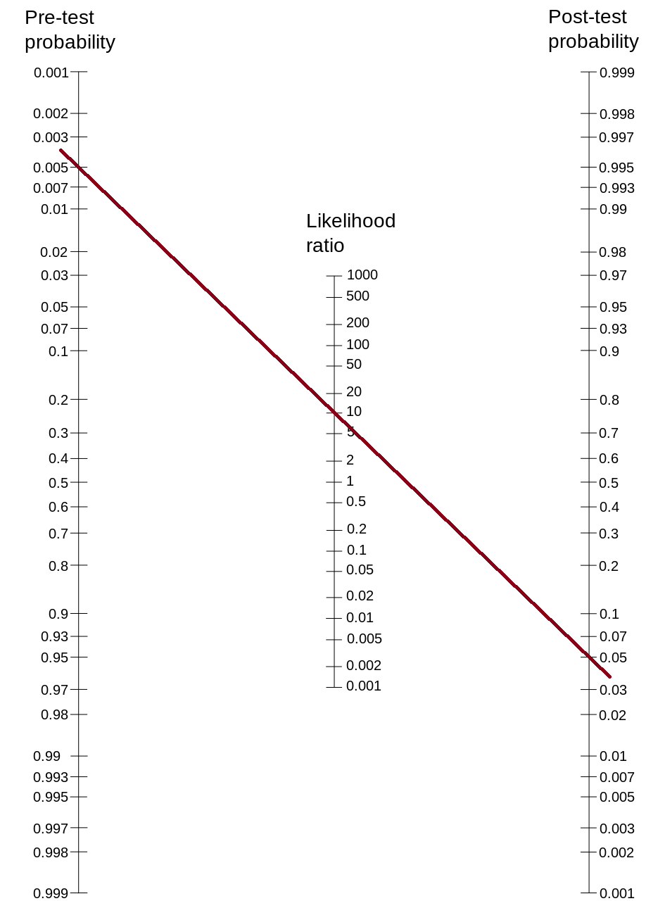

# Evidence-Based Assessment {#evidence-based}

[**Ursenbach et al, 2019 citation**]

As presented in Equation \@ref(eq:bayes5), the posttest (or posterior) odds are equal to the [pretest odds](#pretestOdds) multiplied by the [likelihood ratio](#positiveLikelihoodRatio). Bayes' theorem is discussed in Section \@ref(bayesTheorem). Using this formula, and converting odds to probabilities, we can use a Fagan probability nomogram to determine the [posttest probability](#posttestProbability) following a test result. The calculation of posttest probability is described in Section \@ref(posttestProbability). A *probability nomogram* is a way of visually applying [Bayes' theorem](#bayesTheorem) to determine the posttest probability of having a condition based on the pretest (or prior) probability and likelihood ratio. To use a probability nomogram, connect the dots from the starting probability (left line) with the likelihood ratio (middle line) to see the updated probability. The updated (posttest) probability is where the connecting line crosses the third, right line.

```{r probabilityNomogram, out.width = "100%", fig.align = "center", fig.cap = "Probability Nomogram. Figure retrieved from [https://upload.wikimedia.org/wikipedia/commons/thumb/6/66/Fagan_nomogram.svg/945px-Fagan_nomogram.svg.png](https://upload.wikimedia.org/wikipedia/commons/thumb/6/66/Fagan_nomogram.svg/945px-Fagan_nomogram.svg.png)", echo = FALSE}
knitr::include_graphics("./Images/probabilityNomogram.png")
```

For instance, if the starting probability is .5% and the likelihood ratio is 10 (e.g., sensitivity = .90, specificity = .91: $\text{likelihood ratio} = \frac{\text{sensitivity}}{1 - \text{specificity}} = \frac{.9}{1-.91} = 10$), the updated probability is less than 5%. The formula and function for computing posttest probability are provided in Section \@ref(posttestProbability).

```{r}
posttestProbability(pretestProb = .005, likelihoodRatio = 10)
```

```{r probabilityNomogramLine, out.width = "100%", fig.align = "center", fig.cap = "Probability Nomogram Example. Figure adapted from [https://upload.wikimedia.org/wikipedia/commons/thumb/6/66/Fagan_nomogram.svg/945px-Fagan_nomogram.svg.png](https://upload.wikimedia.org/wikipedia/commons/thumb/6/66/Fagan_nomogram.svg/945px-Fagan_nomogram.svg.png)", echo = FALSE}

```

## Conclusion
