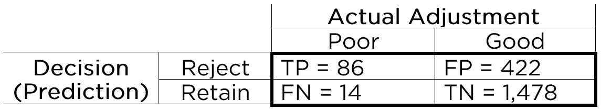
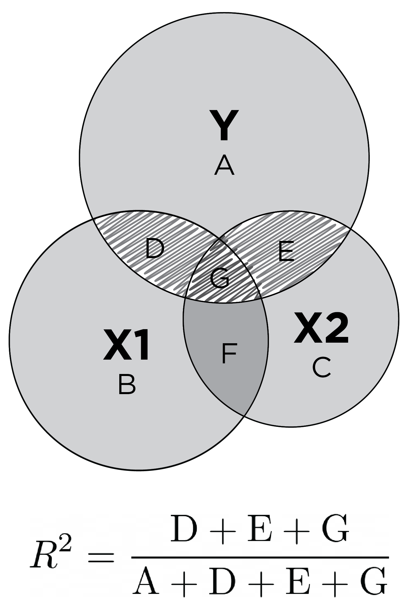
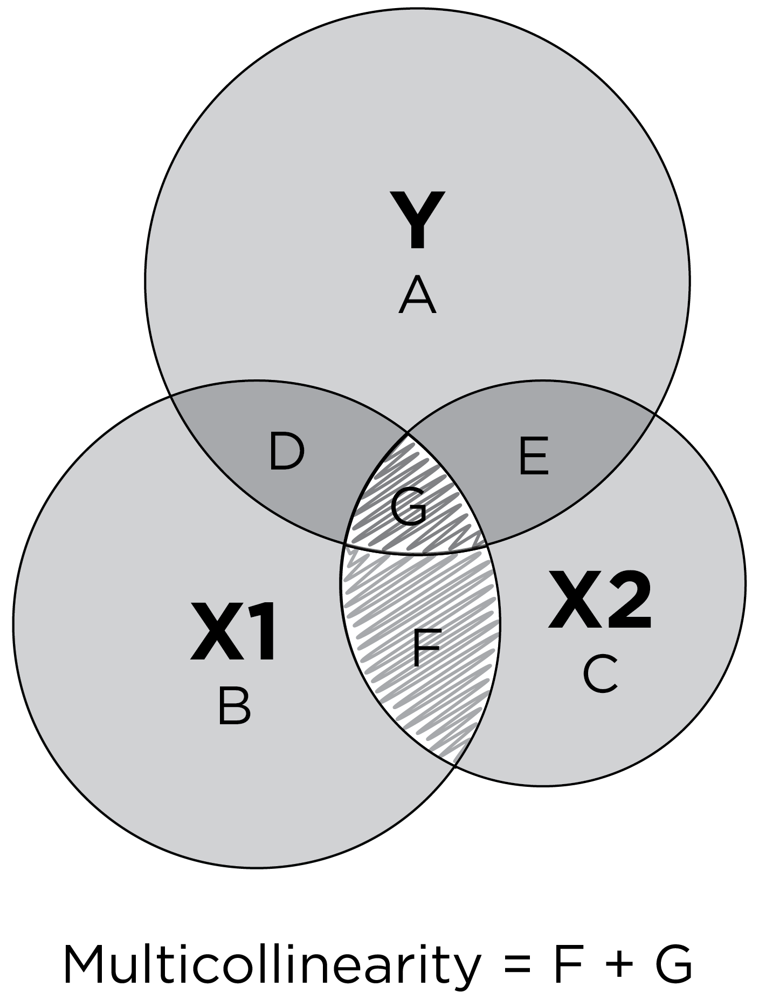

# Prediction {#prediction}

> "It is very difficult to predict—especially the future."
>
> --- Neils Bohr

## Overview of Prediction

In psychology, we are often interested in predicting behavior.
Behavior is complex.
The same behavior can occur for different reasons.
Behavior is probabilistically influenced by many processes, including processes internal to the person in addition to external processes.
Moreover, people's behavior occurs in the context of a dynamic system with nonlinear, probabilistic, and cascading influences that change across time.
The ever-changing system makes behavior challenging to predict.
And, similar to chaos theory, one small change in the system can lead to large differences later on.

Predictions can come in different types.
Some predictions involve categorical data, whereas other predictions involve continuous data.
When dealing with categorical data, we can evaluate predictions a 2x2 table known as a confusion matrix (see Figure \@ref(fig:twoByTwoMatrix1)), or with logistic regression models.
When dealing with continuous data, we can evaluate predictions using multiple regression or similar variants such as [structural equation modeling](#sem) and [mixed models](#mixedModels).

Let's consider a prediction example, assuming the following probabilities:

- The probability of contracting HIV is .3%
- The probability of a positive test for HIV is 1%
- The probability of a positive test if you have HIV is 95%

What is the probability of HIV if you have a positive test?

As we will see, the probability is: $\frac{95\% \times .3\%}{1\%} = 28.5\%$.
So based on the above probabilities, if you have a positive test, the probability that you HIV is 28.5%.
Most people tend to vastly over-estimate the likelihood that the person has HIV in this example.
Why?
Because they do not pay enough attention to the base rate.

### Issues Around Probability

#### Types of Probabilities

It is important to distinguish between different types of probabilities: marginal probabilities, joint probabilities, and conditional probabilities.

##### Base Rate (Marginal Probability) {#baseRate}

A *base rate* is the probability of an event.
Base rates are marginal probabilities.
A *marginal probability* is the probability of an event irrespective of the outcome of another variable.
For instance, we can consider the following marginal probabilities:

$P(C_i)$ is the probability (i.e., base rate) of a classification, $C$, independent of other things.
In our example above, $P(C_i)$ is the base rate (i.e., prevalence) of HIV in the population: $P(\text{HIV}) = .3\%$.
$P(R_i)$ is the probability (base rate) of a response, $R$, independent of other things.
In the example above, $P(R_i)$ is the base rate of a positive test for HIV: $P(\text{positive test}) = 1\%$.
The base rate of a positive test is known as the positivity rate.
A base rate is often used as the "prior probability" in a Bayesian model.

##### Joint Probability {#jointProbability}

A *joint probability* is the probability of two (or more) events occurring simultaneously.
For instance, the probability of events $A$ and $B$ both occurring together is $P(A, B)$.
A joint probability can be calculated using the [marginal probability](#baseRate) of each event:

$$
P(A, B) = P(A) \cdot P(B)
(\#eq:jointProbability)
$$

Conversely (and rearranging the terms for the calculation of [conditional probability](#conditionalProbability)), a [joint probability](#jointProbability) can also be calculated using the [conditional probability](#conditionalProbability) and [marginal probability](#baseRate):

$$
P(A, B) = P(A | B) \cdot P(B)
(\#eq:jointProbability2)
$$

##### Conditional Probability {#conditionalProbability}

A *conditional probability* is the probability of one event occurring given the occurrence of another event.
Conditional probabilities are written as: $P(A | B)$.
This is read as the probability that event $A$ occurs given that event $B$ occurred.
For instance, we can consider the following conditional probabilities:

$P(C | R)$ is the probability of a classification, $C$, given a response, $R$.
In other words, $P(C | R)$ is the probability of having HIV given a positive test: $P(\text{HIV} | \text{positive test})$.
$P(R | C)$ is the probability of a response, $R$, given a classification, $C$.
In the example above, $P(R | C)$ is the probability of having a positive test given that a person has HIV: $P(\text{positive test} | \text{HIV}) = 95\%$.

A conditional probability can be calculated using the [joint probability](#jointProbability) and [marginal probability](#baseRate) (base rate):

$$
P(A | B) = \frac{P(A, B)}{P(B)}
(\#eq:conditionalProbability)
$$

#### Confusion of the Inverse {#inverseFallacy}

A [conditional probability](#conditionalProbability) is not the same thing as its reverse (or inverse) [conditional probability](#conditionalProbability).
Unless the [base rate](#baseRate) of the two events ($C$ and $R$) are the same, $P(C | R) \neq P(R | C)$.
However, people frequently make the mistake of thinking that two inverse [conditional probabilities](#conditionalProbability) are the same.
This mistake is know as the "confusion of the inverse", or the "inverse fallacy", or the "conditional probability fallacy".
The confusion of inverse probabilities is the logical error of representative thinking that leads people to assume that the probability of $C$ given $R$ is the same as the probability of $R$ given C, even though this is not true.
As a few examples to demonstrate the logical fallacy, if 93% of breast cancers occur in high-risk women, this does not mean that 93% of high-risk women will eventually get breast cancer.
As an another example, if 77% of car accidents take place within 15 miles of a driver's home, this does not mean that you will get in an accident 77% of times you drive within 15 miles of your home.

Which car is the most frequently stolen?
It is often the Honda Accord or Honda Civic—probably because they are among the most popular/commonly available cars.
The probability that the car is a Honda Accord given that a car was stolen ($p(\text{Honda Accord } | \text{ Stolen})$) is what the media reports and what the police care about.
However, that is not what buyers and car insurance companies should care about.
Instead, they care about the probability that the car will be stolen given that it is a Honda Accord ($p(\text{Stolen } | \text{ Honda Accord})$).

#### Bayes' Theorem {#bayesTheorem}

An alternative way of calculating a [conditional probability](#conditionalProbability) is using the inverse [conditional probability](#conditionalProbability) (instead of the [joint probability](#jointProbability)).
This is known as Bayes' theorem.
Bayes' theorem can help us calculate a [conditional probability](#conditionalProbability) of some classification, $C$, given some response, $R$, if we know the inverse [conditional probability](#conditionalProbability) and the [base rate](#baseRate) (marginal probability) of each.
Bayes' theorem is as follows:

$$
\begin{aligned}
  P(C | R) &= \frac{P(R | C) \cdot P(C_i)}{P(R_i)} \\
  \text{posterior probability} &= \frac{\text{likelihood} \times \text{prior probability}}{\text{evidence}}
\end{aligned}
(\#eq:bayes1)
$$

Or, equivalently (rearranging the terms):

$$
\frac{P(C | R)}{P(R | C)} = \frac{P(C_i)}{P(R_i)}
(\#eq:bayes2)
$$

Or, equivalently (rearranging the terms):

$$
\frac{P(C | R)}{P(C_i)} = \frac{P(R | C)}{P(R_i)}
(\#eq:bayes3)
$$

In the HIV example above, we can calculate the [conditional probability](#conditionalProbability) of HIV given a positive test using three terms: the [conditional probability](#conditionalProbability) of a positive test given HIV (i.e., the sensitivity of the test), the [base rate](#baseRate) of HIV, and the [base rate](#baseRate) of a positive test for HIV.
The [conditional probability](#conditionalProbability) of HIV given a positive test is:

$$
\begin{aligned}
  P(C | R) &= \frac{P(R | C) \cdot P(C_i)}{P(R_i)} \\
  P(\text{HIV} | \text{positive test}) &= \frac{P(\text{positive test} | \text{HIV}) \cdot P(\text{HIV})}{P(\text{positive test})} \\
  &= \frac{\text{sensitivity of test} \times \text{base rate of HIV}}{\text{base rate of positive test}} \\
  &= \frac{95\% \times .3\%}{1\%} = \frac{.95 \times .003}{.01}\\
  &= 28.5\%
\end{aligned}
$$

```{r}
pAgivenB <- function(pBgivenA, pA, pB){
  value <- pBgivenA * pA / pB
  
  value
}

pAgivenB(pBgivenA = .95, pA = .003, pB = .01)
```

Thus, assuming the probabilities in the example above, the [conditional probability](#conditionalProbability) of having HIV if a person has a positive test is 28.5%.
Given a positive test, chances are higher than not that the person does not have HIV.

Bayes' theorem can be depicted visually [@BallesterosPerez2018].
If we have 100,000 people in our population, we would be able to fill out a 2-by-2 confusion matrix, as depicted in Figure \@ref(fig:bayesTheorem2x2).

```{r bayesTheorem2x2, out.width = "100%", fig.align = "center", fig.cap = "Confusion matrix: 2x2 prediction matrix.", echo = FALSE}
knitr::include_graphics("./Images/bayesTheorem2x2.png")
```

We know that .3% of the population contracts HIV, so 300 people in the population of 100,000 would contract HIV.
Therefore, we put 300 in the marginal sum of those with HIV ($.003 \times 100,000 = 300$), i.e., the [base rate](#baseRate) of HIV.
That means 99,700 people do not contract HIV ($100,000 - 300 = 99,700$.
We know that 1% of the population tests positive for HIV, so we put 1,000 in the marginal sum of those who test positive $.01 \times 100,000 = 1,000$, i.e., the [base rate](#baseRate) of a positive test (the [selection ratio](#selectionRatio)).
That means 99,000 people test negative for HIV ($100,000 - 1,000 = 99,000$).
We also know that 95% of those who have HIV test positive for HIV.
Three hundred people have HIV, so 95% of them (i.e., 285 people; $.95 \times 300 = 285$) tested positive for HIV ([true positives](#truePositive)).
Because we know that 300 people have HIV and that 285 of those with HIV tested positive, that means that 15 people with HIV tested negative ($300 - 15 = 285$; [false negatives](#falseNegative)).
We know that 1,000 people tested positive for HIV, and 285 with HIV tested positive, so that means that 715 people without HIV tested positive ($1,000 - 285 = 715$; [false positives](#falsePositive)).
We know that 99,000 people tested negative for HIV, and 15 with HIV tested negative, so that means that 98,985 people without HIV tested negative ($99,000 - 15 = 98,985$; [true negatives](#trueNegative)).
So, to answer the question of what is the probability of having HIV if you have a positive test, we divide the number of people with HIV who had a positive test (285) by the total number of people who had a positive test (1000), which leads to a probability of 28.5%.

This can be depicted visually in Figures \@ref(fig:bayesTheorem1) and \@ref(fig:bayesTheorem2).^[Please note that the areas in the figure are not drawn to scale.
Otherwise, some regions would be too small to include text.]

```{r bayesTheorem1, out.width = "100%", fig.align = "center", fig.cap = "Bayes' theorem (and confusion matrix) depicted visually, where the marginal probability is the base rate (BR). The four boxes represent the number of true positives (TP), true negatives (TN), false positives (FP), and false negatives (FN). Note: boxes are not drawn to scale. Otherwise, some regions would be too small to include text.", echo = FALSE}
knitr::include_graphics("./Images/bayesTheorem1.png")
```

```{r bayesTheorem2, out.width = "100%", fig.align = "center", fig.cap = "Bayes' theorem (and confusion matrix) depicted visually, where the marginal probability is the selection ratio (SR). The four boxes represent the number of true positives (TP), true negatives (TN), false positives (FP), and false negatives (FN). Note: boxes are not drawn to scale. Otherwise, some regions would be too small to include text.", echo = FALSE}
knitr::include_graphics("./Images/bayesTheorem2.png")
```

Now let's see what happens if the person tests positive a second time.
We would revise our "[prior probability](#baseRate)" for HIV from the general prevalence in the population (0.3%) to be the "posterior probability" of HIV given a first positive test (28.5%).
This is known as [*Bayesian updating*](#bayesianUpdating).
We would also update the "evidence" to be the [marginal probability](#baseRate) of getting a second positive test.

If we do not know a [marginal probability](#baseRate) (i.e., base rate) of an event (e.g., getting a second positive test), we can calculate a [marginal probability](#baseRate) with the *law of total probability* using [conditional probabilities](#conditionalProbability) and the [marginal probability](#baseRate) of another event (e.g., having HIV).
According to the law of total probability, the probability of getting a positive test is the probability that a person with HIV gets a positive test (i.e., [sensitivity](#sensitivity)) times the base rate of HIV plus the probability that a person without HIV gets a positive test (i.e., [false positive rate](#falsePositiveRate)) times the [base rate](#baseRate) of not having HIV:

$$
\begin{aligned}
 P(\text{not } C_i) &= 1 - P(C_i) \\
  P(R_i) &= P(R | C) \cdot P(C_i) + P(R | \text{not } C) \cdot P(\text{not } C_i) \\
  1\% &= 95\% \times .3\% + P(R | \text{not } C) \times 99.7\% \\
\end{aligned}
(\#eq:lawOfTotalProbability)
$$

In this case, we know the [marginal probability](#baseRate) ($P(R_i)$), and we can use that to solve for the unknown [conditional probability](#conditionalProbability) that reflects the [false positive rate](#falsePositiveRate) ($P(R | \text{not } C)$):

$$
\scriptsize
\begin{aligned}
  P(R_i) &= P(R | C) \cdot P(C_i) + P(R | \text{not } C) \cdot P(\text{not } C_i) && \\
  P(R_i) - [P(R | \text{not } C) \cdot P(\text{not } C_i)] &= P(R | C) \cdot P(C_i) && \text{Move } P(R | \text{not } C) \text{ to the left side} \\
  - [P(R | \text{not } C) \cdot P(\text{not } C_i)] &= P(R | C) \cdot P(C_i) - P(R_i) && \text{Move } P(R_i) \text{ to the right side} \\
  P(R | \text{not } C) \cdot P(\text{not } C_i) &= P(R_i) - [P(R | C) \cdot P(C_i)] && \text{Multiply by } -1 \\
  P(R | \text{not } C) &= \frac{P(R_i) - [P(R | C) \cdot P(C_i)]}{P(\text{not } C_i)} && \text{Divide by } P(R | \text{not } C) \\
  &= \frac{1\% - [95\% \times .3\%]}{99.7\%} = \frac{.01 - [.95 \times .003]}{.997}\\
  &= .7171515\% \\
\end{aligned}
(\#eq:conditionalProbabilityRevised)
$$

```{r}
pBgivenNotA <- function(pBgivenA, pA, pB){
  value <- (pB - (pBgivenA * pA)) / (1 - pA)
  
  value
}

pBgivenNotA(pBgivenA = .95, pA = .003, pB = .01)
```

With this [conditional probability](#conditionalProbability) ($P(R | \text{not } C)$), the updated [marginal probability](#baseRate) of having HIV ($P(C_i)$), and the updated marginal probability of not having HIV ($P(\text{not } C_i)$), we can now calculate an updated estimate of the [marginal probability](#baseRate) of getting a second positive test.
The probability of getting a second positive test is the probability that a person with HIV gets a second positive test (i.e., [sensitivity](#sensitivity)) times the updated probability of HIV plus the probability that a person without HIV gets a second positive test (i.e., [false positive rate](#falsePositiveRate)) times the updated probability of not having HIV:

$$
\begin{aligned}
  P(R_{i}) &= P(R | C) \cdot P(C_i) + P(R | \text{not } C) \cdot P(\text{not } C_i) \\
  &= 95\% \times 28.5\% + .7171515\% \times 71.5\% = .95 \times .285 + .007171515 \times .715 \\
  &= 27.58776\%
\end{aligned}
(\#eq:baseRateUpdated)
$$

```{r}
pB <- function(pBgivenA, pA, pBgivenNotA){
  value <- (pBgivenA * pA) + pBgivenNotA * (1 - pA)
  
  value
}

pB(pBgivenA = .95, pA = .285, pBgivenNotA = .007171515)
pB(pBgivenA = .95, pA = pAgivenB(pBgivenA = .95, pA = .003, pB = .01), pBgivenNotA = pBgivenNotA(pBgivenA = .95, pA = .003, pB = .01))
```

We then substitute the updated [marginal probability](#baseRate) of HIV ($P(C_i)$) and the updated [marginal probability](#baseRate) of getting a second positive test ($P(R_i)$) into Bayes' theorem to get the probability that the person has HIV if they have a second positive test (assuming the errors of each test are independent, i.e., uncorrelated):

$$
\begin{aligned}
  P(C | R) &= \frac{P(R | C) \cdot P(C_i)}{P(R_i)} \\
  P(\text{HIV} | \text{a second positive test}) &= \frac{P(\text{a second positive test} | \text{HIV}) \cdot P(\text{HIV})}{P(\text{a second positive test})} \\
  &= \frac{\text{sensitivity of test} \times \text{updated base rate of HIV}}{\text{updated base rate of positive test}} \\
  &= \frac{95\% \times 28.5\%}{27.58776\%} \\
  &= 98.14\%
\end{aligned}
$$

```{r}
pAgivenB(pBgivenA = .95, pA = .285, pB = .2758776)
pAgivenB(pBgivenA = .95,
         pA = pAgivenB(pBgivenA = .95, pA = .003, pB = .01),
         pB = pB(pBgivenA = .95,
                 pA = pAgivenB(pBgivenA = .95, pA = .003, pB = .01),
                 pBgivenNotA = pBgivenNotA(pBgivenA = .95, pA = .003, pB = .01)))
```

Thus, a second positive test greatly increases the posterior probability that the person has HIV from 28.5% to over 98%.

As seen in the rearranged formula in Equation \@ref(eq:bayes2), the ratio of the [conditional probabilities](#conditionalProbability) is equal to the ratio of the [base rates](#baseRate).
Thus, it is important to consider [base rates](#baseRate).
People have a strong tendency to ignore (or give insufficient weight to) [base rates](#baseRate) when making predictions.
The failure to consider the [base rate](#baseRate) when making predictions when given specific information about a case, is a cognitive bias known as the [base-rate](#baseRate) fallacy or as [base rate](#baseRate) neglect.
For example, people tend to say that the probability of a rare event is more likely than it actually is given specific information.

As seen in the rearranged formula in Equation \@ref(eq:bayes3), the inverse [conditional probabilities](#conditionalProbability) ($P(C | R)$ and $P(R | C)$) are not equal unless the [base rates](#baseRate) of $C$ and $R$ are the same.
If the [base rates](#baseRate) are not equal, we are making at least some prediction errors.
If $P(C_i) > P(R_i)$, our predictions must include some [false negatives](#falseNegative).
If $P(R_i) > P(C_i)$, our predictions must include some [false positives](#falsePositive).

Using the law of total probability, we can substitute the calculation of the [marginal probability](#baseRate) ($P(R_i)$) into Bayes' theorem to get an alternative formulation of Bayes' theorem:

$$
\begin{aligned}
  P(C | R) &= \frac{P(R | C) \cdot P(C_i)}{P(R_i)} \\
  &= \frac{P(R | C) \cdot P(C_i)}{P(R | C) \cdot P(C_i) + P(R | \text{not } C) \cdot P(\text{not } C_i)} \\
  &= \frac{P(R | C) \cdot P(C_i)}{P(R | C) \cdot P(C_i) + P(R | \text{not } C) \cdot [1 - P(C_i)]}
\end{aligned}
(\#eq:bayes4)
$$

Instead of using [marginal probability](#baseRate) ([base rate](#baseRate)) of $R$, as in the original formulation of Bayes' theorem, it uses the [conditional probability](#conditionalProbability), $P(R|\text{not } C)$.
Thus, it uses three terms: two [conditional probabilities](#conditionalProbability)—$P(R|C)$ and $P(R|\text{not } C)$—and one [marginal probability](#baseRate), $P(C_i)$.
This alternative formulation of Bayes' theorem can be used to calculate [positive predictive value](#ppv), based on [sensitivity](#sensitivity), [specificity](#specificity), and the [base rate](#baseRate), as presented in Equation \@ref(eq:positivePredictiveValue).

Let us see how the alternative formulation of Bayes' theorem applies to the HIV example above.
We can calculate the probability of HIV given a positive test using three terms: the [conditional probability](#conditionalProbability) that a person with HIV gets a positive test (i.e., [sensitivity](#sensitivity)), the [conditional probability](#conditionalProbability) that a person without HIV gets a positive test (i.e., [false positive rate](#falsePositiveRate)), and the [base rate](#baseRate) of HIV.
Using the $P(R|\text{not } C)$ calculated in Equation \@ref(eq:conditionalProbabilityRevised), the [conditional probability](#conditionalProbability) of HIV given a single positive test is:

$$
\small
\begin{aligned}
  P(C | R) &= \frac{P(R | C) \cdot P(C_i)}{P(R | C) \cdot P(C_i) + P(R | \text{not } C) \cdot [1 - P(C_i)]} \\
  &= \frac{\text{sensitivity of test} \times \text{base rate of HIV}}{\text{sensitivity of test} \times \text{base rate of HIV} + \text{false positive rate of test} \times (1 - \text{base rate of HIV})} \\
  &= \frac{95\% \times .3\%}{95\% \times .3\% + .7171515\% \times (1 - .3\%)} = \frac{.95 \times .003}{.95 \times .003 + .007171515 \times (1 - .003)}\\
  &= 28.5\%
\end{aligned}
$$

```{r}
pAgivenBalternative <- function(pBgivenA, pA, pBgivenNotA){
  value <- (pBgivenA * pA) /((pBgivenA * pA) + (pBgivenNotA * (1 - pA)))
  
  value
}

pAgivenBalternative(pBgivenA = .95, pA = .003, pBgivenNotA = .007171515)
pAgivenBalternative(pBgivenA = .95, pA = .003, pBgivenNotA = pBgivenNotA(pBgivenA = .95, pA = .003, pB = .01))
```

To calculate the [conditional probability](#conditionalProbability) of HIV given a second positive test, we update our priors because the person has now tested positive for HIV.
We update the [prior probability](#baseRate) of HIV ($P(C_i)$) based on the posterior probability of HIV after a positive test ($P(C | R)$) that we calculated above.
We can calculate the [conditional probability](#conditionalProbability) of HIV given a second positive test using three terms: the [conditional probability](#conditionalProbability) that a person with HIV gets a positive test (i.e., [sensitivity](#sensitivity); which stays the same), the [conditional probability](#conditionalProbability) that a person without HIV gets a positive test (i.e., [false positive rate](#falsePositiveRate); which stays the same), and the updated [marginal probability](#baseRate) of HIV.
The [conditional probability](#conditionalProbability) of HIV given a second positive test is:

$$
\scriptsize
\begin{aligned}
  P(C | R) &= \frac{P(R | C) \cdot P(C_i)}{P(R | C) \cdot P(C_i) + P(R | \text{not } C) \cdot [1 - P(C_i)]} \\
  &= \frac{\text{sensitivity of test} \times \text{updated base rate of HIV}}{\text{sensitivity of test} \times \text{updated base rate of HIV} + \text{false positive rate of test} \times (1 - \text{updated base rate of HIV})} \\
  &= \frac{95\% \times 28.5\%}{95\% \times 28.5\% + .7171515\% \times (1 - 28.5\%)} = \frac{.95 \times .285}{.95 \times .285 + .007171515 \times (1 - .285)}\\
  &= 98.14\%
\end{aligned}
$$

```{r}
pAgivenBalternative(pBgivenA = .95, pA = .285, pBgivenNotA = .007171515)
pAgivenBalternative(pBgivenA = .95, pA = .285, pBgivenNotA = pBgivenNotA(pBgivenA = .95, pA = .003, pB = .01))
```

If we want to compare the relative probability of two outcomes, we can use the odds form of Bayes' theorem:

$$
\begin{aligned}
  P(C | R) &= \frac{P(R | C) \cdot P(C_i)}{P(R_i)} \\
  P(\text{not } C | R) &= \frac{P(R | \text{not } C) \cdot P(\text{not } C_i)}{P(R_i)} \\
  \frac{P(C | R)}{P(\text{not } C | R)} &= \frac{\frac{P(R | C) \cdot P(C_i)}{P(R_i)}}{\frac{P(R | \text{not } C) \cdot P(\text{not } C_i)}{P(R_i)}} \\
  &= \frac{P(R | C) \cdot P(C_i)}{P(R | \text{not } C) \cdot P(\text{not } C_i)} \\
  &= \frac{P(C_i)}{P(\text{not } C_i)} \times \frac{P(R | C)}{P(R | \text{not } C)} \\
  \text{posterior odds} &= \text{prior odds} \times \text{likelihood ratio}
\end{aligned}
(\#eq:bayes5)
$$

In sum, the [marginal probability](#baseRate), including the [prior probability](#baseRate) or [base rate](#baseRate), should be weighed heavily in predictions unless there are sufficient data to indicate otherwise, i.e., to update the posterior probability based on new evidence.
Bayes' theorem provides a powerful tool to anchor predictions to the [base rate](#baseRate) unless sufficient evidence changes the posterior probability (by updating the evidence and [prior probability](#baseRate)).

### Prediction Accuracy

#### Decision Outcomes

To consider how we can evaluate the accuracy of predictions, consider an example adapted from @Meehl1955.
The military conducts a test of its prospective members to screen out applicants who would likely fail basic training.
To evaluate the accuracy of our predictions using the test, we can examine a [confusion matrix](#confusionMatrix).
A [confusion matrix](#confusionMatrix) is a matrix that presents the predicted outcome on one dimension and the actual outcome (truth) on the other dimension.
If the predictions and outcomes are dichotomous, the [confusion matrix](#confusionMatrix) is a 2x2 matrix with two rows and two columns that represent four possible predicted-actual combinations (decision outcomes): [true positives](#truePositive) (TP), [true negatives](#trueNegative) (TN), [false positives](#falsePositive) (FP), and [false negatives](#falseNegative) (FN).

When discussing the four decision outcomes, "true" means an accurate judgment, whereas "false" means an inaccurate judgment.
"Positive" means that the judgment was that the person has the characteristic of interest, whereas "negative" means that the judgment was that the person does not have the characteristic of interest.
A *true positive* is a correct judgment (or prediction) where the judgment was that the person has (or will have) the characteristic of interest, and, in truth, they actually have (or will have) the characteristic.
A *true negative* is a correct judgment (or prediction) where the judgment was that the person does not have (or will not have) the characteristic of interest, and, in truth, they actually do not have (or will not have) the characteristic.
A *false positive* is an incorrect judgment (or prediction) where the judgment was that the person has (or will have) the characteristic of interest, and, in truth, they actually do not have (or will not have) the characteristic.
A *false negative* is an incorrect judgment (or prediction) where the judgment was that the person does not have (or will not have) the characteristic of interest, and, in truth, they actually do have (or will have) the characteristic.

An example of a [confusion matrix](#confusionMatrix) is in Figure \@ref(fig:twoByTwoMatrix1).

```{r twoByTwoMatrix1, out.width = "100%", fig.align = "center", fig.cap = "Confusion matrix: 2x2 prediction matrix.", echo = FALSE}

```

With the information in the [confusion matrix](#confusionMatrix), we can calculate the marginal sums, and the proportion of people in each cell (in parentheses), as depicted in Figure \@ref(fig:twoByTwoMatrix2).

```{r twoByTwoMatrix2, out.width = "100%", fig.align = "center", fig.cap = "Confusion matrix: 2x2 prediction matrix with marginal sums.", echo = FALSE}
knitr::include_graphics("./Images/2x2-Matrix_2b.png")
```

That is, we can sum across the rows and columns to identify how many people actually showed poor adjustment ($n = 100$) versus good adjustment ($n = 1,900$), and how many people were selected to reject ($n = 508$) versus retain ($n = 1,492$).
If we sum the column of predicted marginal sums ($508 + 1,492$) or the row of actual marginal sums ($100 + 1,900$), we get the total number of people ($N = 2,000$).

Based on the marginal sums, we can compute the [marginal probabilities](#baseRate), as depicted in Figure \@ref(fig:twoByTwoMatrix3).

```{r twoByTwoMatrix3, out.width = "100%", fig.align = "center", fig.cap = "Confusion matrix: 2x2 prediction matrix with marginal sums and marginal probabilities.", echo = FALSE}
knitr::include_graphics("./Images/2x2-Matrix_2c.png")
```

The [marginal probability](#baseRate) of the person having the characteristic of interest (i.e., showing poor adjustment) is called the [*base rate*](#baseRate) (BR).
That is, the [*base rate*](#baseRate) is the proportion of people that have the characteristic.
It is calculated by dividing the number of people with poor adjustment ($n = 100$) by the total number of people ($N = 2,000$): $BR = \frac{FN + TP}{N}$.
Here, the [*base rate*](#baseRate) reflects the prevalence of poor adjustment.
In this case, the [*base rate*](#baseRate) is .05, so there is a 5% chance that an applicant will be poorly adjusted.
The [marginal probability](#baseRate) of good adjustment is equal to 1 minus the [*base rate*](#baseRate) of poor adjustment.

The [marginal probability](#baseRate) of predicting that a person has the characteristic (i.e., rejecting a person) is called the [*selection ratio*](#selectionRatio) (SR).
The [selection ratio](#selectionRatio) is the proportion of people who will be selected (in this case, rejected rather than retained); i.e., the proportion of people who are identified as having the characteristic.
The [selection ratio](#selectionRatio) is calculated by dividing the number of people selected to reject ($n = 508$) by the total number of people ($N = 2,000$): $SR = \frac{TP + FP}{N}$.
In this case, the [selection ratio](#selectionRatio) is .25, so 25% of people are rejected.
The [marginal probability](#baseRate) of not selecting someone to reject (i.e., the [marginal probability](#baseRate) of retaining) is equal to 1 minus the [selection ratio](#selectionRatio).

The [selection ratio](#selectionRatio) might be something that the test dictates according to its cutoff score.
Or, the [selection ratio](#selectionRatio) might be imposed by external factors that place limits on how many people you can assign a positive test value.
For instance, when deciding whether to treat a client, the [selection ratio](#selectionRatio) may depend on how many therapists are available and how many cases can be treated.

#### Percent Accuracy

Based on the [confusion matrix](#confusionMatrix), we can calculate the prediction accuracy based on the [percent accuracy](#percentAccuracy) of the predictions.
The [percent accuracy](#percentAccuracy) is the number of correct predictions divided by the total number of predictions, and multiplied by 100.
In the context of a confusion matrix, this is calculated as: $100\% \times \frac{\text{TP} + \text{TN}}{N}$.
In this case, our [percent accuracy](#percentAccuracy) was 78%—that is, 78% of our predictions were accurate, and 22% of our predictions were inaccurate.

#### Percent Accuracy by Chance {#accuracyByChance}

78% sounds pretty accurate.
And it is much higher than 50%, so we are doing a pretty good job, right?
Well, it is important to compare our accuracy to what accuracy we would expect to get by chance alone, if predictions were made by a random process rather than using a test's scores.
Our [selection ratio](#selectionRatio) was 25.4%.
How accurate would we be if we randomly selected 25.4% of people to reject?
To determine what accuracy we could get by chance alone given the [selection ratio](#selectionRatio) and the base rate, we can calculate the chance probability of [true positives](#truePositive) and the chance probability of [true negatives](#trueNegative).
The probability of a given cell in the [confusion matrix](#confusionMatrix) is a [joint probability](#jointProbability)—the probability of two events occurring simultaneously.
To calculate a [joint probability](#jointProbability), we multiply the probability of each event.

So, to get the chance expectancies of [true positives](#truePositive), we would multiply the respective [marginal probabilities](#baseRate):

$$
\begin{aligned}
  P(TP) &= P(\text{Poor adjustment}) \times P(\text{Reject})\\
   &= BR \times SR \\
  &= .05 \times .254 \\
  &= .0127
\end{aligned}
$$

To get the chance expectancies of [true negatives](#trueNegative), we would multiply the respective [marginal probabilities](#baseRate):

$$
\begin{aligned}
  P(TN) &= P(\text{Good adjustment}) \times P(\text{Retain})\\
   &= (1 - BR) \times (1 - SR) \\
  &= .95 \times .746 \\
  &= .7087
\end{aligned}
$$

To get the [percent accuracy by chance](#percentAccuracyByChance), we sum the chance expectancies for the correct predictions ([TP](#truePositive) and [TN](#trueNegative)): $.0127 + .7087 = .7214$.
Thus, the [percent accuracy you can get by chance alone](#percentAccuracyByChance) is 72%.
This is because most of our predictions are to retain people, and the [base rate](#baseRate) of poor adjustment is quite low (.05).
Our measure with 78% [accuracy](#percentAccuracy) provides only a 6% increment in correct predictions.
Thus, you cannot judge how good your judgment or prediction is until you know how you would do by random chance.

The chance expectancies for each cell of the [confusion matrix](#confusionMatrix) are in Figure \@ref(fig:twoByTwoMatrix4).

```{r twoByTwoMatrix4, out.width = "100%", fig.align = "center", fig.cap = "Chance expectancies in 2x2 prediction matrix.", echo = FALSE}
knitr::include_graphics("./Images/2x2-Matrix_2d.png")
```

#### Predicting from the Base Rate {#predictingFromBaseRate}

Now, let us consider how well you would do if you were to predict from the [base rate](#baseRate).
Predicting from the [base rate](#baseRate) is also called "betting from the [base rate](#baseRate)", and it involves setting the [selection ratio](#selectioNRatio) by taking advantage of the [base rate](#baseRate) so that you go with the most likely outcome in every prediction.
Because the [base rate](#baseRate) is quite low (.05), we could predict from the [base rate](#baseRate) by selecting no one to reject (i.e., setting the [selection ratio](#selectionRatio) at zero).
our [percent accuracy by chance](#percentAccuracyByChance) if we predict from the [base rate](#baseRate) would be calculated by multiplying the [marginal probabilities](#baseRate), as we did above, but with a new [selection ratio](#selectionRatio):

$$
\begin{aligned}
  P(TP) &= P(\text{Poor adjustment}) \times P(\text{Reject})\\
   &= BR \times SR \\
  &= .05 \times 0 \\
  &= 0 \\ \\
  P(TN) &= P(\text{Good adjustment}) \times P(\text{Retain})\\
   &= (1 - BR) \times (1 - SR) \\
  &= .95 \times 1 \\
  &= .95
\end{aligned}
$$

We sum the chance expectancies for the correct predictions ([TP](#truePositive) and [TN](#trueNegative)): $0 + .95 = .95$.
Thus, our [percent accuracy](#percentAccuracy) by predicting from the [base rate](#baseRate) is 95%.
This is damning to our measure because it is a much higher accruacy than the accuracy of our measure.
That is, we can be much more accurate than our measure simply by predicting from the [base rate](#baseRate) and selecting no one to reject.

Going with the most likely outcome in every prediction (predicting from the [base rate](#baseRate)) can be highly accurate as noted by @Meehl1955, especially when the [base rate](#baseRate) is very low or very high.
This should serve as an important reminder that we need to compare the accuracy of our measures to the accuracy by (1) random chance and (2) predicting from the [base rate](#baseRate).
There are several important implications of the impact of [base rates](#baseRate) on prediction accuracy.
One implication is that using the same test in different settings with different [base rates](#baseRate) will markedly change the accuracy of the test.
Oftentimes, using a test will actually *decrease* the predictive accuracy when the [base rate](#baseRate) deviates greatly from .50.
But, [percent accuracy](#percentAccuracy) is not everything.
[Percent accuracy](#percentAccuracy) treats different kinds of errors as if they are equally important.
However, the value we place on different kinds of errors may be different, as described next.

#### Different Kinds of Errors Have Different Costs {#differentErrorsDifferentCosts}

Some errors have a high cost and some errors have a low cost.
Among the four decision outcomes, there were two types of errors: [false positives](#falsePositive) and [false negatives](#falseNegative).
The extent to which [false positives](#falsePositive) and [false negatives](#falseNegative) are costly depends on the prediction problem.
So, even though you can often be most accurate by going with the [base rate](#baseRate), it may be advantageous to using a screening instrument despite lower [overall accuracy](#percentAccuracy) because of the huge difference in costs of [false positives](#falsePositive) versus [false negatives](#falseNegative) in some cases.

Consider the example of a screening instrument for HIV.
[False positives](#falsePositive) would be cases where we said that someone is at high risk of HIV when they are not, whereas [false negatives](#falseNegative) are cases where we said that someone is not at high risk when they actually are.
The costs of [false positives](#falsePositive) include a shortage of blood, some follow-up testing, and potentially some anxiety, but that is about it.
The costs of [false negatives](#falseNegative) may be people getting HIV.
In this case, the costs of [false negatives](#falseNegative) greatly outweigh the costs of [false positives](#falsePositive), so we use a screening instrument to try to identify the cases at high risk for HIV because of the important consequences of failing to do so, even though using the screening instrument will lower our overall accuracy level.

Another example is when the Central Intelligence Agency (CIA) used a screen for protective typists during wartime to try to detect spies.
[False positives](#falsePositive) would be cases where the CIA believes that a person is a spy when they are not, and the CIA does not hire them.
[False negatives](#falseNegative) would be cases where the CIA believes that a person is not a spy when they actually are, and the CIA hires them.
In this case, a [false positive](#falsePositive) would be fine, but a [false negative](#falseNegative) would be really bad.

How you weigh the costs of different errors depends considerably on the domain and context.
Possible costs of [false positives](#falsePositive) to society include: unnecessary and costly treatment with side effects and sending an innocent person to jail (despite our presumption of innocence in the United States criminal justice system that a person is innocent until proven guilty).
Possible costs of [Ffalse negatives](#falseNegative) to society include: setting a guilty person free, failing to detect a bomb or tumor, and preventing someone from getting treatment who needs it.

The differential costs of different errors also depends on how much flexibility you have in the [selection ratio](#selectionRatio) in being able to set a stringent versus loose [selection ratio](#selectionRatio).
Consider if there is a high cost of getting rid of people during the selection process.
For example, if you must hire 100 poeple and only 100 people apply for the position, you cannot lose people, so you need to hire even high-risk people.
However, if you do not need to hire many people, then you can hire more conservatively.

Any time the [selection ratio](#selectionRatio) differs from the [base rate](#baseRate), you will make errors.
For example, if you reject 25% of applicants, and the [base rate](#baseRate) of poor adjustment is 5%, then you are marking errors of over-rejecting ([false positives](#falsePositive)).
By contrast, if you reject 1% of applicants and the [base rate](#baseRate) of poor adjustment is 5%, then you are making errors of under-rejecting or over-accepting ([false negatives](#falseNegative)).

A low [base rate](#baseRate) makes it harder to make predictions, and tends to lead to less accurate predictions.
For instance, it is very challenging to predict low [base rate](#baseRate) behaviors, including suicide [@Kessler2020].
The difficulty in predicting events with a low [base rate](#baseRate) is apparent with the true score formula from classical test theory: $X = T + e$.
As described in Equation \@ref(eq:reliabilityRatio), [reliability](#reliability) is the ratio of true score variance to observed score variance.
As true score variance increases, [reliability](#reliability) increases.
If the [base rate](#baseRate) is .05, then the max variance of the true scores is .05.
The lower true score variance makes the measure less [reliable](#reliability) and hard to make accurate predictions.

#### Sensitivity, Specificity, PPV, and NPV

As described earlier, [percent accuracy](#percentAccuracy) is not the only important aspect of accuracy.
[Percent accuracy](#percentAccuracy) can be misleading because it is highly influenced by [base rates](#baseRate).
You can have a high [percent accuracy](#percentAccuracy) by [predicting from the base rate](#predictingFromBaseRate) and saying that no one has the condition (if the [base rate](#baseRate) is low) or that everyone has the condition (if the [base rate](#baseRate) is high).
Thus, it is also important to consider other aspects of accuracy, including [sensitivity](#sensitivity) (SN), [specificity](#specificity) (SP), [positive predictive value](#ppv) (PPV), and [negative predictive value](#npv) (NPV).
We want our predictions to be [sensitive](#sensitity) to be able to detect the chararacteristic but also to be [specific](#specificity) so that we classify only the characteristic as having the characteristic.

Let us return to the [confusion matrix](#confusionMatrix) in Figure \@ref(fig:twoByTwoMatrix5).
If we know the frequency of each of the four predicted-actual combinations of the [confusion matrix](#confusionMatrix) ([TP](#truePositive), [TN](#trueNegative), [FP](#falsePositive), [FN](#falseNegative)), we can calculate [sensitivity](#sensitivity), [specificity](#specificity), [PPV](#ppv), and [NPV](#npv).

```{r twoByTwoMatrix5, out.width = "100%", fig.align = "center", fig.cap = "Confusion matrix: 2x2 prediction matrix.", echo = FALSE}
knitr::include_graphics("./Images/2x2-Matrix_2e.png")
```

[Sensitivity](#sensitivity) is the proportion of those with the characteristic ($\text{TP} + \text{FN}$) that we identified with our measure ($\text{TP}$): $\frac{\text{TP}}{\text{TP} + \text{FN}} = \frac{86}{86 + 14} = .86$.
[Specificity](#specificity) is the proportion of those who do not have the characteristic ($\text{TN} + \text{FP}$) that we correctly classify as not having the characteristic ($\text{TN}$): $\frac{\text{TN}}{\text{TN} + \text{FP}} = \frac{1,478}{1,478 + 422} = .78$.
[PPV](#ppv) is the proportion of those who we classify as having the characteristic ($\text{TP} + \text{FP}$) who actually have the characteristic ($\text{TP}$): $\frac{\text{TP}}{\text{TP} + \text{FP}} = \frac{86}{86 + 422} = .17$.
[NPV](#npv) is the proportion of those we classify as not having the characteristic ($\text{TN} + \text{FN}$) who actually do not have the characteristic ($\text{TN}$): $\frac{\text{TN}}{\text{TN} + \text{FN}} = \frac{1,478}{1,478 + 14} = .99$.

[Sensitivity](#sensitivity), [specificity](#specificity), [PPV](#ppv), and [NPV](#npv) are proportions, and their values therefore range from 0 to 1, where higher values reflect greater accuracy.
With [sensitivity](#sensitivity), [specificity](#specificity), [PPV](#ppv), and [NPV](#npv), we have a good snapshot of how accurate the measure is at a given cutoff.
In our case, our measure is good at finding who to reject (high [sensitivity](#sensitivity)), but it is rejecting too many people who do not need to be rejected (lower [PPV](#ppv) due to many [FPs](#falsePositive)).
Most people who we classify as having the characteristic do not actually have the characteristic.
However, the fact that we are over-rejecting could be okay depending on our goals, for instance, if we do not care about over-dropping (i.e., the [PPV](#ppv) being low).

##### Some Accuracy Estimates Depend on the Cutoff {#accuracyCutoff}

[Sensitivity](#sensitivity), [specificity](#specificity), [PPV](#ppv), and [NPV](#npv) differ based on the cutoff (i.e., threshold) for classification.
Consider the following example.
Aliens visit the earth and they develop a test to determine whether a berry is edible or inedible.

```{r, include = FALSE}
library("tidyverse")
library("magrittr")
library("viridis")

sampleSize <- 1000

edibleScores <- rnorm(sampleSize, 50, 15)
inedibleScores <- rnorm(sampleSize, 100, 15)

edibleData <- data.frame(score = c(edibleScores, inedibleScores), type = c(rep("edible", sampleSize), rep("inedible", sampleSize)))

cutoff <- 75

hist_edible <- density(edibleScores, from = 0, to = 150) %$%
  data.frame(x = x, y = y) %>%
  mutate(area = x >= cutoff)

hist_edible$type[hist_edible$area == TRUE] <- "edible_FP"
hist_edible$type[hist_edible$area == FALSE] <- "edible_TN"

hist_inedible <- density(inedibleScores, from = 0, to = 150) %$%
  data.frame(x = x, y = y) %>%
  mutate(area = x < cutoff)

hist_inedible$type[hist_inedible$area == TRUE] <- "inedible_FN"
hist_inedible$type[hist_inedible$area == FALSE] <- "inedible_TP"

density_data <- bind_rows(hist_edible, hist_inedible)

density_data$type <- factor(density_data$type, levels = c("edible_TN","inedible_TP","edible_FP","inedible_FN"))
```

Figure \@ref(fig:classificationDistributions) depicts the distributions of scores by berry type.
Note how there are clearly two distinct distributions.
However, the distributions overlap to some degree.
Thus, any cutoff will have at least some inaccurate classifications.

```{r classificationDistributions, echo = FALSE, results = "hide", out.width = "100%", fig.cap = "Distribution of test scores by berry type."}
#No Cutoff
ggplot(data = edibleData, aes(x = score, ymin = 0, fill = type)) +
  geom_density(alpha = .5) +
  scale_fill_manual(name = "Berry Type", values = c(viridis(2)[1], viridis(2)[2])) +
  scale_y_continuous(name = "Frequency") +
  theme_bw() +
  theme(axis.text.y = element_blank(),
        axis.ticks.y = element_blank())
```

Figure \@ref(fig:classificationStandardCutoff) depicts the distributions of scores by berry type with a cutoff.
The red line indicates the cutoff—the level above which berries are classified by the test as inedible.
There are errors on each side of the cutoff.
Below the cutoff, there are some [false negatives](#falseNegative) (blue): inedible berries that are inaccurately classified as edible.
Above the cutoff, there are some [false positives](#falsePositive) (green): edible berries that are inaccurately classified as inedible.
Costs of [false negatives](#falseNegative) could include sickness or death from eating the inedible berries.
Costs of [false positives](#falsePositive) could include taking longer to find food, finding insufficient food, and starvation.

```{r classificationStandardCutoff, echo = FALSE, results = "hide", out.width = "100%", fig.cap = "Classifications based on a cutoff. Note that some true negatives and true positives are hidden behind the false positives and false negatives."}
#Standard Cutoff
ggplot(data = density_data, aes(x = x, ymin = 0, ymax = y, fill = type)) +
  geom_ribbon(alpha = 1) +
  scale_fill_manual(name = "Berry Type",
                    values = c(viridis(4)[4], viridis(4)[1], viridis(4)[3], viridis(4)[2]),
                    breaks = c("edible_TN","inedible_TP","edible_FP","inedible_FN"),
                    labels = c("Edible: TN","Inedible: TP","Edible: FP","Inedible: FN")) +
  geom_line(aes(y = y)) +
  geom_vline(xintercept = cutoff, color = "red", size = 2) +
  scale_x_continuous(name = "score") +
  scale_y_continuous(name = "Frequency") +
  theme_bw() +
  theme(axis.text.y = element_blank(),
        axis.ticks.y = element_blank())
```

Based on our assessment goals, we might use a different [selection ratio](#selectionRatio) by changing the cutoff.
Figure \@ref(fig:classificationRaiseCutoff) depicts the distributions of scores by berry type when we raise the cutoff.
There are now more [false negatives](#falseNegative) (blue) and fewer [false positives](#falsePositive) (green).
If we raise the cutoff (to be more conservative), the number of [false negatives](#falseNegative) increases and the number of [false positives](#falsePositive) decreases.
Consequently, as the cutoff increases, [sensitivity](#sensitivity) and [NPV](#npv) decrease (because we have more [false negatives](#falseNegative)), whereas [specificity](#specificity) and [PPV](#ppv) increase (because we have fewer [false positives](#falsePositive)).
A higher cutoff could be optimal if the costs of [false positives](#falsePositive) are considered greater than the costs of [false negatives](#falseNegative).
For instance, if the aliens cannot risk eating the inedible berries because the berries are fatal and there are sufficient edible berries that can be found to feed the alien colony.

```{r classificationRaiseCutoff, echo = FALSE, results = "hide", out.width = "100%", fig.cap = "Classifications based on raising the cutoff. Note that some true negatives and true positives are hidden behind the false positives and false negatives."}
#Raise the cutoff
cutoff <- 85

hist_edible <- density(edibleScores, from = 0, to = 150) %$%
  data.frame(x = x, y = y) %>%
  mutate(area = x >= cutoff)

hist_edible$type[hist_edible$area == TRUE] <- "edible_FP"
hist_edible$type[hist_edible$area == FALSE] <- "edible_TN"

hist_inedible <- density(inedibleScores, from = 0, to = 150) %$%
  data.frame(x = x, y = y) %>%
  mutate(area = x < cutoff)

hist_inedible$type[hist_inedible$area == TRUE] <- "inedible_FN"
hist_inedible$type[hist_inedible$area == FALSE] <- "inedible_TP"

density_data <- bind_rows(hist_edible, hist_inedible)

density_data$type <- factor(density_data$type, levels = c("edible_TN","inedible_TP","edible_FP","inedible_FN"))

ggplot(data = density_data, aes(x = x, ymin = 0, ymax = y, fill = type)) +
  geom_ribbon(alpha = 1) +
  scale_fill_manual(name = "Berry Type",
                    values = c(viridis(4)[4], viridis(4)[1], viridis(4)[3], viridis(4)[2]),
                    breaks = c("edible_TN","inedible_TP","edible_FP","inedible_FN"),
                    labels = c("Edible: TN","Inedible: TP","Edible: FP","Inedible: FN")) +
  geom_line(aes(y = y)) +
  geom_vline(xintercept = cutoff, color = "red", size = 2) +
  scale_x_continuous(name = "score") +
  scale_y_continuous(name = "Frequency") +
  theme_bw() +
  theme(axis.text.y = element_blank(),
        axis.ticks.y = element_blank())
```

Figure \@ref(fig:classificationLowerCutoff) depicts the distributions of scores by berry type when we lower the cutoff.
There are now fewer [false negatives](#falseNegative) (blue) and more [false positives](#falsePositive) (green).
If we lower the cutoff (to be more liberal), the number of [false negatives](#falseNegative) decreases and the number of [false positives](#falsePositive) increases.
Consequently, as the cutoff decreases, [sensitivity](#sensitivity) and [NPV](#npv) increase (because we have fewer [false negatives](#falseNegative)), whereas [specificity](#specificity) and [PPV](#ppv) decrease (because we have more [false positives](#falsePositive)).
A lower cutoff could be optimal if the costs of [false negatives](#falseNegative) are considered greater than the costs of [false positives](#falsePositive).
For instance, if the aliens cannot risk missing edible berries because they are in short supply relative to the size of alien colony, and eating the inedible berries would, at worst, lead to minor, temporary discomfort.

```{r classificationLowerCutoff, echo = FALSE, results = "hide", out.width = "100%", fig.cap = "Classifications based on lowering the cutoff. Note that some true negatives and true positives are hidden behind the false positives and false negatives."}
#Lower the cutoff
cutoff <- 65

hist_edible <- density(edibleScores, from = 0, to = 150) %$%
  data.frame(x = x, y = y) %>%
  mutate(area = x >= cutoff)

hist_edible$type[hist_edible$area == TRUE] <- "edible_FP"
hist_edible$type[hist_edible$area == FALSE] <- "edible_TN"

hist_inedible <- density(inedibleScores, from = 0, to = 150) %$%
  data.frame(x = x, y = y) %>%
  mutate(area = x < cutoff)

hist_inedible$type[hist_inedible$area == TRUE] <- "inedible_FN"
hist_inedible$type[hist_inedible$area == FALSE] <- "inedible_TP"

density_data <- bind_rows(hist_edible, hist_inedible)

density_data$type <- factor(density_data$type, levels = c("edible_TN","inedible_TP","edible_FP","inedible_FN"))

ggplot(data = density_data, aes(x = x, ymin = 0, ymax = y, fill = type)) +
  geom_ribbon(alpha = 1) +
  scale_fill_manual(name = "Berry Type",
                    values = c(viridis(4)[4], viridis(4)[1], viridis(4)[3], viridis(4)[2]),
                    breaks = c("edible_TN","inedible_TP","edible_FP","inedible_FN"),
                    labels = c("Edible: TN","Inedible: TP","Edible: FP","Inedible: FN")) +
  geom_line(aes(y = y)) +
  geom_vline(xintercept = cutoff, color = "red", size = 2) +
  scale_x_continuous(name = "score") +
  scale_y_continuous(name = "Frequency") +
  theme_bw() +
  theme(axis.text.y = element_blank(),
        axis.ticks.y = element_blank())
```

In sum, [sensitivity](#sensitivity) and [specificity](#specificty) differ based on the cutoff for classification.
if we raise the cutoff, [sensitivity](#sensitivity) and [PPV](#ppv) increase (due to fewer [false positives](#falsePositive)), whereas and [sensitivity](#sensitivity) and [NPV](#npv) decrease (due to more [false negatives](#falseNegatives)).
If we lower the cutoff, [sensitivity](#sensitivity) and [NPV](#npv) increase (due to fewer [false negatives](#falseNegatives)), whereas [specificity](#specificty) and [PPV](#ppv) decrease (due to more [false positives](#falsePositive)).
Thus, the optimal cutoff depends on how costly each type of error is: [false negatives](#falseNegatives) and [false positives](#falsePositive).
If false negatives are more costly than [false positives](#falsePositive), we would set a low cutoff.
If [false positives](#falsePositive) are more costly than [false negatives](#falseNegatives), we would set a high cutoff.

#### Signal Detection Theory {#sdt}

Signal detection theory (SDT) is a probability-based theory for the detection of a given stimulus (signal) from a stimulus set that includes non-target stimuli (noise).
SDT was developed research on radar (*RA*dio *D*etection *A*nd *R*anging) and sonar (*SO*und *N*avigation *A*nd *R*anging) in World War II based on research on sensory-perception research.
The military wanted to be able to determine which objects on radar/sonar were enemy aircraft/submarines, and which were noise (e.g., different object in the environment or even just the weather itself).
SDT allowed determining how many errors operators made (how accurate they were) and decomposing errors into different kinds of errors.
SDT distinguishes between sensitivity and bias.
In SDT, *sensitivity* (or [discriminability](#discrimination)) is how well an assessment distinguishes between a target stimulus and non-target stimuli (i.e., how well the assessment detects the target stimulus amid non-target stimuli).
*Bias* is the extent to which the probability of a selection decision from the assessment is higher or lower than the true rate of the target stimulus.

Some radar/sonar operators were not as sensitive to the differences between signal and noise, due to factors such as age, ability to distinguish gradations of a signal, etc.
People who showed low sensitivity (i.e., who were not as successful at distinguishing between signal and noise) were screened out because the military perceived sensitivity as a skill that was not easily taught.
By contrast, other operators could distinguish signal from noise, but their threshold was too low or high—they could take in information, but their decisions tended to be wrong due to systematic bias or poor calibration.
That is, they systematically over-rejected or under-rejected stimuli.
Over-rejecting leads to many [false negatives](#falseNegative) (i.e., saying that a stimulus is safe when it is not).
Under-rejecting leads to many [false positives](#falsePositive) (i.e., saying that a stimulus is harmful when it is not).
A person who showed good sensitivity but systematic bias was considered more teach-able than a person who showed low sensitivity.
Thus, radar and sonar operators were selected based on their sensitivity to distinguish signal from noise, and then were trained to improve the calibration so they reduce their systematic bias and do not systematically over- or under-reject.

Although SDT was originally developed for use in World War II, it now plays an important role in many areas of science and medicine.
A medical application of SDT is tumor detection in radiology.
SDT also plays an important role in psychology, especially cognitive psychology.
For instance, research on social perception of sexual interest has shown that men tend to show lack of sensitivity to differences in women's affect—i.e., they have relative difficulties discriminating between friendliness and sexual interest [@Farris2008].
Men also tend to show systematic bias (poor calibration) such that they tend to over-estimate women's sexual interest in them—i.e., men tend to have too low of a threshold for determining that a women is showing sexual interest in them [@Farris2006].

SDT metrics of sensitivity include [$d'$](#dPrimeSDT), [$A$](#aSDT) (or $A'$), and the [area under the receiver operating characteristic (ROC) curve](#auc).
SDT metrics of bias include [$\beta$](#betaSDT), [$c$](#cSDT), and [$b$](#bSDT).

##### Receiver Operating Characteristic (ROC) Curve {#roc}

The x-axis of the ROC curve is the [false alarm rate](#falsePositiveRate) or [false positive rate](#falsePositiveRate) ($1 -$ [specificity](#specificity)).
The y-axis is the [hit rate](#sensitivity) or [true positive rate](#sensitivity) ([sensitivity](#sensitivity)).
We can trace the ROC curve as the combination between [sensitivity](#sensitivity) and [specificity](#specificity) at every possible cutoff.
At a cutoff of zero (top right of ROC curve), we calculate [sensitivity](#sensitivity) (1.0) and [specificity](#specificity) (0) and plot it.
At a cutoff of zero, the assessment tell us to make an action for every stimulus (i.e., it is the most liberal).
We then gradually increase the cutoff, and plot [sensitivity](#sensitivity) and [specificity](#specificity) As the cutoff increases, [sensitivity](#sensitivity) decreases and [specificity](#specificity) increases.
We end at the highest possible cutoff, where the [sensitivity](#sensitivity) is 0 and the specificity is 1.0 (i.e., we never make an action; i.e., it is the most conservative).
Each point on the ROC curve corresponds to a pair of [hit](#truePositiveRate) and [false alarm](#falsePositiveRate) rates ([sensitivity](#sensitivity) and [specificity](#specificity)) resulting from a specific cutoff value.
Then, we can draw a lines or a curve that connects the points.

Figure \@ref(fig:empiricalROC) depicts an empirical ROC plot where lines are drawn to connect the [hit](#truePositiveRate) and [false alarm](#falsePositiveRate) rates.

```{r empiricalROC, echo = FALSE, results = "hide", fig.width = 8, fig.height = 8, fig.cap = "Empirical receiver operating characteristic curve. AUC = Area under the receiver operating characteristic curve."}
library("pROC")

plot(roc(aSAH$outcome, aSAH$s100b), legacy.axes = TRUE, print.auc = TRUE)
```

Figure \@ref(fig:smoothROC) depicts an ROC curve where a smoothed and fitted curve is drawn to connect the [hit](#truePositiveRate) and [false alarm](#falsePositiveRate) rates.

```{r smoothROC, echo = FALSE, results = "hide", fig.width = 8, fig.height = 8, fig.cap = "Smooth receiver operating characteristic curve. AUC = Area under the receiver operating characteristic curve."}
plot(roc(aSAH$outcome, aSAH$s100b, smooth = TRUE), legacy.axes = TRUE, print.auc = TRUE)
```

###### Area Under the ROC Curve {#auc}

[ROC](#roc) methods can be used to compare and compute the [discriminative](#discrimination) power of measurement devices free from the influence of [selection ratios](#selectionRatio), [base rates](#baseRate), and costs and benefits.
A ROC analysis yields a quantitative index of how well an index predicts a signal of interest or can discriminate between different signals.
ROC analysis can help tell us how often our assessment would be correct.
If we randomly pick two observations, and we were right once and wrong once, we were 50% accurate.
But this would be a useless measure because it reflects chance responding.

The geometrical area under the ROC curve reflects the [discriminative accuracy](#discrimination) of the measure.
The index is called the area Under the [ROC](#roc) (AUC).
AUC quantifies the [discriminative power](#discrimination) of an assessment.
AUC is the probability that a randomly selected target and a randomly selected non-target is ranked correctly by the assessment method.
AUC values range from 0.0 to 1.0, where chance accuracy is 0.5 as indicated by diagonal line in the ROC curve.
That is, a measure can be useful to the extent that its ROC curve is above the diagonal line (i.e., its [discriminative accuracy](#discrimination) is above chance).

```{r auc, echo = FALSE, results = "hide", fig.width = 8, fig.height = 8, fig.cap = "Area under the receiver operating characteristic curve (AUC)."}
plot(roc(aSAH$outcome, aSAH$s100b, smooth = TRUE), legacy.axes = TRUE, print.auc = TRUE, auc.polygon = TRUE)
```

```{r aucRange, echo = FALSE, results = "hide", fig.width = 8, fig.height = 8, fig.cap = "Receiver operating characteristic curves (ROCs) for various levels of area under the ROC curve (AUC) for various measures."}

#From here: https://stats.stackexchange.com/questions/422926/generate-synthetic-data-given-auc/424213
simulateDataFromAUC <- function(auc, n){
  t <- sqrt(log(1/(1-auc)**2))
  z <- t-((2.515517 + 0.802853*t + 0.0103328*t**2) / (1 + 1.432788*t + 0.189269*t**2 + 0.001308*t**3))
  d <- z*sqrt(2)
  
  x <- c(rnorm(n/2, mean = 0), rnorm(n/2, mean = d))
  y <- c(rep(0, n/2), rep(1, n/2))
  
  data <- data.frame(x = x, y = y)

return(data)
}

set.seed(52242)

auc60 <- simulateDataFromAUC(.60, 50000)
auc70 <- simulateDataFromAUC(.70, 50000)
auc80 <- simulateDataFromAUC(.80, 50000)
auc90 <- simulateDataFromAUC(.90, 50000)
auc95 <- simulateDataFromAUC(.95, 50000)
auc99 <- simulateDataFromAUC(.99, 50000)

plot(roc(y ~ x, auc60, smooth = TRUE), legacy.axes = TRUE, print.auc = TRUE, print.auc.x = .52, print.auc.y = .61, print.auc.pattern = "%.2f")
plot(roc(y ~ x, auc70, smooth = TRUE), legacy.axes = TRUE, print.auc = TRUE, print.auc.x = .6, print.auc.y = .67, print.auc.pattern = "%.2f", add = TRUE)
plot(roc(y ~ x, auc80, smooth = TRUE), legacy.axes = TRUE, print.auc = TRUE, print.auc.x = .695, print.auc.y = .735, print.auc.pattern = "%.2f", add = TRUE)
plot(roc(y ~ x, auc90, smooth = TRUE), legacy.axes = TRUE, print.auc = TRUE, print.auc.x = .805, print.auc.y = .815, print.auc.pattern = "%.2f", add = TRUE)
plot(roc(y ~ x, auc95, smooth = TRUE), legacy.axes = TRUE, print.auc = TRUE, print.auc.x = .875, print.auc.y = .865, print.auc.pattern = "%.2f", add = TRUE)
plot(roc(y ~ x, auc99, smooth = TRUE), legacy.axes = TRUE, print.auc = TRUE, print.auc.x = .94, print.auc.y = .94, print.auc.pattern = "%.2f", add = TRUE)
```

As an example, given an AUC of .75, this says that the overall score of an individual who has the characteristic in question will be higher 75% of the time than the overall score of an individual who does not have the characteristic.
In lay terms, if we were to randomly pick one good and one bad outcome, what is the probability that we will classify correctly based on our instrument?
AUC is better than [percent accuracy](#percentAccuracy), because you can have high [percent accuracy](#percentAccuracy) just by going with the [base rate](#baseRate).
AUC tells us how much better than chance a measure is at discriminating outcomes.
AUC is useful as a measure of general [discriminative accuracy](#discrimination), and tells us how accurate a measure is at all possible cutoffs Knowing the accuracy of a measure at all possible cutoffs can be helpful for selecting the optimal cutoff, given the goals of the assessment.
In reality, however, we may not be interested in all cutoffs because not all errors are equal in their costs.

If we lower the [base rate](#baseRate), we would need larger sample to get enough people to classify into each group.
[SDT](#sdt)/[ROC](#roc) methods are traditionally about dichotomous decisions (yes/no), not graded judgments.
[SDT](#sdt)/[ROC](#roc) methods can get messy with ordinal data that are more graded because you would have a a curve for each ordinal grouping.

## Getting Started

### Load Libraries

```{r}
library("pROC")
library("ROCR")
library("rms")
library("ResourceSelection")
library("PredictABEL")
library("uroc") #to install: install.packages("remotes"); remotes::install_github("evwalz/uroc")
library("rms")
library("gridExtra")
library("grid")
library("ggpubr")
library("msir")
library("viridis")
library("tidyverse")
library("here")
library("tinytex")
library("rmarkdown")
```

### Prepare Data

#### Load Data

```{r}
data(aSAH)
mydataSDT <- aSAH
```

#### Simulate Data

For reproducibility, I set the seed below.
Using the same seed will yield the same answer every time.
There is nothing special about this particular seed.

```{r}
set.seed(52242)

mydataSDT$testScore <- mydataSDT$s100b
mydataSDT <- mydataSDT %>%
  mutate(testScoreSimple = ntile(testScore, 10))

mydataSDT$predictedProbability <- (mydataSDT$s100b - min(mydataSDT$s100b, na.rm = TRUE)) / (max(mydataSDT$s100b, na.rm = TRUE) - min(mydataSDT$s100b, na.rm = TRUE))
mydataSDT$continuousOutcome <- mydataSDT$testScore + rnorm(nrow(mydataSDT), mean = 0.20, sd = 0.20)
mydataSDT$disorder <- NA
mydataSDT$disorder[mydataSDT$outcome == "Good"] <- 0
mydataSDT$disorder[mydataSDT$outcome == "Poor"] <- 1
```

#### Add Missing Data

Adding missing data to dataframes helps make examples more realistic to real-life data, and helps you get in the habit of programming to account for missing data.

```{r}
mydataSDT$testScore[c(5,10)] <- NA
mydataSDT$disorder[c(10,15)] <- NA
```

## Receiver Operating Characteristic (ROC) Curve

The [receiver operating characteristic (ROC) curve](#roc) shows the combination of [hit rate](#sensitivity) ([sensitivity](#sensitivity)) and [false alarm rate](#falsePositiveRate) ($1 - \text{specificity}$) at every possible cutoff.
It depicts that, as the cutoff increases (i.e., becomes more conservative), [sensitivity](#sensitivity) decreases and [specificity](#specificity) increases.
It also depicts that, as the cutoff decreases (i.e., becomes more liberal), [sensitivity](#sensitivity) increases and [specificity](#specificity) decreases.

[Receiver operating characteristic (ROC) curves](#roc) were generated using the `pROC` package [@R-pROC].

### Empirical ROC Curve

```{r}
rocCurve <- roc(data = mydataSDT, response = disorder, predictor = testScore, smooth = FALSE)
```

```{r, fig.width = 8, fig.height = 8, fig.cap = "Empirical receiver operating characteristic curve. AUC = Area under the receiver operating characteristic curve."}
plot(rocCurve, legacy.axes = TRUE, print.auc = TRUE)
```

```{r fig.cap = "Empirical receiver operating characteristic curve with cutoffs overlaid."}
pred <- prediction(na.omit(mydataSDT[,c("testScoreSimple","disorder")])$testScoreSimple, na.omit(mydataSDT[,c("testScoreSimple","disorder")])$disorder)
perf <- performance(pred, "tpr", "fpr")
plot(perf, print.cutoffs.at = 1:11, text.adj = c(1, -1), ylim = c(0, 1.05))
abline(coef = c(0,1))
```

### Smooth ROC Curve

```{r}
rocCurveSmooth <- roc(data = mydataSDT, response = disorder, predictor = testScore, smooth = TRUE)
```

```{r, fig.width = 8, fig.height = 8, fig.cap = "Smooth receiver operating characteristic curve. AUC = Area under the receiver operating characteristic curve."}
plot(rocCurveSmooth, legacy.axes = TRUE, print.auc = TRUE)
```

### Youden's J Statistic

The threshold at the Youden's J statistic is the threshold where the test has the maximum combination (i.e., sum) of [sensitivity](#sensitivity) and [specificity](#specificity): $\text{max}(\text{sensitivity} + \text{specificity} - 1)$

```{r}
youdenJ <- coords(rocCurve, x = "best", best.method = "youden")
youdenJthreshold <- youdenJ$threshold
youdenJspecificity <- youdenJ$specificity
youdenJsensitivity <- youdenJ$sensitivity

youdenJ
```

For this test, the Youden's J Statistic is at a threshold of `r youdenJthreshold`, where sensitivity is `r youdenJsensitivity` and specificity is `r youdenJspecificity`.

### The point closest to the top-left part of the ROC curve with perfect sensitivity and specificity

The point closest to the top-left part of the ROC plot with perfect [sensitivity](#sensitivity) and [specificity](#specificity): $\text{min}[(1 - \text{sensitivity})^2 + (1 - \text{specificity})^2]$

```{r}
closestTopLeft <- coords(rocCurve, x = "best", best.method = "closest.topleft")
closestTopLeftthreshold <- closestTopLeft$threshold
closestTopLeftspecificity <- closestTopLeft$specificity
closestTopLeftsensitivity <- closestTopLeft$sensitivity

closestTopLeft
```

For this test, the combination of [sensitivity](#sensitivity) and [specificity](#specificity) is closest to the top left of the [ROC plot](#roc) at a threshold of `r closestTopLeftthreshold`, where [sensitivity](#sensitivity) is `r closestTopLeftsensitivity` and [specificity](#specificity) is `r closestTopLeftspecificity`.

## Prediction Accuracy Across Cutoffs {#predictionAccuracy}

There are two primary dimensions of accuracy: (1) [discrimination](#discrimination) (e.g., [sensitivity](#sensitivity), [specificity](#specificity), [area under the ROC curve](#auc)) and (2) [calibration](#calibration).
Some general indexes of accuracy combine [discrimination](#discrimination) and [calibration](#calibration), as described in Section \@ref(generalPredictionAccuracy).
This section (\@ref(predictionAccuracy)) describes indexes of accuracy that span all possible cutoffs.
That is, each index of accuracy described in this section provides a single numerical index of accuracy that aggregates the accuracy across all possible cutoffs.
Aspects of accuracy at a particular cutoff are described in Section \@ref(cutoffAccuracy).

### General Prediction Accuracy {#generalPredictionAccuracy}

There are many metrics of general prediction accuracy.
When thinking about which metric(s) may be best for a given problem, it is important to consider the purpose of the assessment.

#### Scale-Dependent Accuracy Estimates

The estimates of prediction accuracy described in this section are scale-dependent.
These accuracy estimates depend on the unit of measurement and therefore cannot be compared across measures with different scales or across data sets.

##### Mean Error {#meanError}

Here, "error" ($e$) is the difference between the predicted and observed value.
Mean error (also known as bias, see Section \@ref(blandAltmanBias)) is the mean difference between the predicted and observed values across individuals ($i$), that is, the mean of the errors across individuals ($e_i$).
Values closer to zero reflect greater accuracy.
If mean error is above zero, it indicates that predicted values are, on average, greater than observed values (i.e., over-estimating errors).
If mean error is below zero, it indicates that predicted values are, on average, less than observed values (i.e., under-estimating errors).
If both over-estimating and under-estimating errors are present, however, they can cancel each other out.
As a result, even with a mean error of zero, there can still be considerable error present.
Thus, although mean error can be helpful for examining whether predictions systematically under- or over-estimate the actual scores, other forms of accuracy are necessary to examine to examine the *extent* of error.

$$
\begin{aligned}
  \text{mean error} &= \frac{\sum\limits_{i = 1}^n(\text{predicted}_i - \text{observed}_i)}{n} \\
  &= \text{mean}(e_i)
\end{aligned}
(\#eq:meanError)
$$

```{r}
meanError <- function(predicted, actual){
  value <- mean(predicted - actual, na.rm = TRUE)
  return(value)
}

meanErrorValue <- meanError(mydataSDT$testScore, mydataSDT$disorder)
meanErrorValue
```

##### Mean Absolute Error (MAE) {#meanAbsoluteError}

Mean absolute error (MAE) is the mean of the absolute value of differences between the predicted and observed values across individuals, that is, the mean of the absolute value of errors.
Smaller values (closer to zero) reflect greater accuracy.

$$
\begin{aligned}
  \text{mean absolute error (MAE)} &= \frac{\sum\limits_{i = 1}^n|\text{predicted}_i - \text{observed}_i|}{n} \\
  &= \text{mean}(|e_i|)
\end{aligned}
(\#eq:meanAbsoluteError)
$$

```{r}
meanAbsoluteError <- function(predicted, actual){
  value <- mean(abs(predicted - actual), na.rm = TRUE)
  return(value)
}

meanAbsoluteErrorValue <- meanAbsoluteError(mydataSDT$testScore, mydataSDT$disorder)
meanAbsoluteErrorValue
```

##### Mean Squared Error (MSE) {#meanSquaredError}

Smaller values (closer to zero) reflect greater accuracy.

$$
\begin{aligned}
  \text{mean squared error (MSE)} &= \frac{\sum\limits_{i = 1}^n(\text{predicted}_i - \text{observed}_i)^2}{n} \\
  &= \text{mean}(e_i^2)
\end{aligned}
(\#eq:meanSquaredError)
$$

```{r}
meanSquaredError = function(predicted, actual){
  value <- mean((predicted - actual)^2, na.rm = TRUE)
  return(value)
}

meanSquaredErrorValue <- meanSquaredError(mydataSDT$testScore, mydataSDT$disorder)
meanSquaredErrorValue
```

##### Root Mean Squared Error (RMSE) {#rootMeanSquaredError}

Smaller values (closer to zero) reflect greater accuracy.
RMSE penalizes larger errors more so than MAE does.

$$
\begin{aligned}
  \text{root mean squared error (RMSE)} &= \sqrt{\frac{\sum\limits_{i = 1}^n(\text{predicted}_i - \text{observed}_i)^2}{n}} \\
  &= \sqrt{\text{mean}(e_i^2)}
\end{aligned}
(\#eq:rootMeanSquaredError)
$$

```{r}
rootMeanSquaredError = function(predicted, actual){
  value <- sqrt(mean((predicted - actual)^2, na.rm = TRUE))
  return(value)
}

rootMeanSquaredErrorValue <- rootMeanSquaredError(mydataSDT$testScore, mydataSDT$disorder)
rootMeanSquaredErrorValue
```

#### Scale-Independent Accuracy Estimates

The estimates of prediction accuracy described in this section are intended to be scale-*independent* (unit-free) so the accuracy estimates can be compared across measures with different scales or across data sets [@Hyndman2018].

##### Mean Percentage Error (MPE)

Values closer to zero reflect greater accuracy.

$$
\begin{aligned}
  \text{percentage error }(p_i) = \frac{100\% \times (\text{observed}_i - \text{predicted}_i)}{\text{observed}_i}
\end{aligned}
(\#eq:percentageError)
$$

$$
\begin{aligned}
  \text{mean percentage error (MPE)} &= \frac{100\%}{n} \sum\limits_{i = 1}^n \frac{\text{observed}_i - \text{predicted}_i}{\text{observed}_i} \\
  &= \text{mean(percentage error)} \\
  &= \text{mean}(p_i)
\end{aligned}
(\#eq:meanPercentageError)
$$

Note: mean percentage error is undefined when one or more of the observed values equals zero, due to division by zero.
I provide the option in the function to drop undefined values so you can still generate an estimate of accuracy despite undefined values, but use this option at your own risk.

```{r}
meanPercentageError = function(predicted, actual, dropUndefined = FALSE){
  percentageError <- 100 * (actual - predicted) / actual
  
  if(dropUndefined == TRUE){
    percentageError[!is.finite(percentageError)] <- NA
  }
  
  value <- mean(percentageError, na.rm = TRUE)
  return(value)
}

meanPercentageError(mydataSDT$testScore, mydataSDT$disorder)
```

```{r}
meanPercentageErrorValue <- meanPercentageError(mydataSDT$testScore, mydataSDT$disorder, dropUndefined = TRUE)
meanPercentageErrorValue
```

##### Mean Absolute Percentage Error (MAPE)

Smaller Values (closer to zero) reflect greater accuracy.

$$
\begin{aligned}
  \text{mean absolute percentage error (MAPE)} &= \frac{100\%}{n} \sum\limits_{i = 1}^n \Bigg|\frac{\text{observed}_i - \text{predicted}_i}{\text{observed}_i}\Bigg| \\
  &= \text{mean(|percentage error|)} \\
  &= \text{mean}(|p_i|)
\end{aligned}
(\#eq:meanAbsolutePercentageError)
$$

Note: mean absolute percentage error is undefined when one or more of the observed values equals zero, due to division by zero.
I provide the option in the function to drop undefined values so you can still generate an estimate of accuracy despite undefined values, but use this option at your own risk.

```{r}
meanAbsolutePercentageError = function(predicted, actual, dropUndefined = FALSE){
  percentageError <- 100 * (actual - predicted) / actual
  
  if(dropUndefined == TRUE){
    percentageError[!is.finite(percentageError)] <- NA
  }
  
  value <- mean(abs(percentageError), na.rm = TRUE)
  return(value)
}

meanAbsolutePercentageError(mydataSDT$testScore, mydataSDT$disorder)
```

```{r}
meanAbsolutePercentageErrorValue <- meanAbsolutePercentageError(mydataSDT$testScore, mydataSDT$disorder, dropUndefined = TRUE)
meanAbsolutePercentageErrorValue
```

##### Symmetric Mean Absolute Percentage Error (sMAPE)

Smaller values (closer to zero) reflect greater accuracy.

$$
\small
\begin{aligned}
  \text{symmetric mean absolute percentage error (sMAPE)} = \frac{100\%}{n} \sum\limits_{i = 1}^n \frac{|\text{predicted}_i - \text{observed}_i|}{|\text{predicted}_i| + |\text{observed}_i|}
\end{aligned}
(\#eq:symmetricMeanAbsolutePercentageError)
$$

Note: symmetric mean absolute percentage error is undefined when one or more of the individuals has a prediction–observed combination such that the sum of the absolute value of the predicted value and the absolute value of the observed value equals zero ($|\text{predicted}_i| + |\text{observed}_i|$), due to division by zero.
I provide the option in the function to drop undefined values so you can still generate an estimate of accuracy despite undefined values, but use this option at your own risk.

```{r}
symmetricMeanAbsolutePercentageError = function(predicted, actual, dropUndefined = FALSE){
  relativeError <- abs(predicted - actual)/(abs(predicted) + abs(actual))
  
  if(dropUndefined == TRUE){
    relativeError[!is.finite(relativeError)] <- NA
  }
  
  value <- 100 * mean(abs(relativeError), na.rm = TRUE)
  return(value)
}

symmetricMeanAbsolutePercentageErrorValue <- symmetricMeanAbsolutePercentageError(mydataSDT$testScore, mydataSDT$disorder)
symmetricMeanAbsolutePercentageErrorValue
```

##### Mean Absolute Scaled Error (MASE)

Mean absolute scaled error (MASE) is described by [@Hyndman2018].
Values closer to zero reflect greater accuracy.

The adapted formula for MASE with non-time series data is described [here (https://stats.stackexchange.com/a/108963/20338)](https://stats.stackexchange.com/a/108963/20338), and is below:

$$
\begin{aligned}
  \text{scaled error}(q_i) &= \frac{\text{observed}_i - \text{predicted}_i}{\text{scaling factor}} \\
  &= \frac{\text{observed}_i - \text{predicted}_i}{\frac{1}{n} \sum\limits_{i = 1}^n |\text{observed}_i - \overline{\text{observed}}|}
\end{aligned}
(\#eq:scaledError)
$$

$$
\begin{aligned}
  \text{mean absolute scaled error (MASE)} &= \frac{1}{n} \sum\limits_{i = 1}^n |q_i| \\
  &= \text{mean(|scaled error|)} \\
  &= \text{mean}(|q_i|)
\end{aligned}
(\#eq:meanAbsoluteScaledError)
$$

Note: mean absolute scaled error is undefined when the scaling factor is zero, due to division by zero.
With non-time series data, the scaling factor is the average of the absolute value of individuals' observed scores minus the average observed score ($\frac{1}{n} \sum\limits_{i = 1}^n |\text{observed}_i - \overline{\text{observed}}|$).

```{r}
meanAbsoluteScaledError <- function(predicted, actual){
  mydata <- data.frame(na.omit(cbind(predicted, actual)))
  
  errors <- mydata$actual - mydata$predicted
  scalingFactor <- mean(abs(mydata$actual - mean(mydata$actual)))
  scaledErrors <- errors/scalingFactor
  
  value <- mean(abs(scaledErrors))
  return(value)
}

meanAbsoluteScaledErrorValue <- meanAbsoluteScaledError(mydataSDT$testScore, mydataSDT$disorder)
meanAbsoluteScaledErrorValue
```

##### Root Mean Squared Log of the Accuracy Ratio

The squared log of the accuracy ratio is described by [@Tofallis2015].
Squaring the log values keeps the values positive, such that smaller values (values closer to zero) reflect greater accuracy.
Here, I take the mean of the squared log values, which keeps the values positive, and I calculate the square root of the mean squared log values to put them back on the (pre-squared) log metric.

$$
\begin{aligned}
  \text{accuracy ratio} &= \frac{\text{predicted}_i}{\text{observed}_i}
\end{aligned}
(\#eq:accuracyRatio)
$$

$$
\begin{aligned}
  \text{root mean squared log of the accuracy ratio} &= \sqrt{\sum\limits_{i = 1}^n log\bigg(\frac{\text{predicted}_i}{\text{observed}_i}\bigg)^2} \\
  &= \sqrt{\text{mean}\Bigg[log\bigg(\frac{\text{predicted}_i}{\text{observed}_i}\bigg)^2\Bigg]} \\
  &= \sqrt{\text{mean}\big[log(\text{accuracy ratio})^2\big]}
\end{aligned}
(\#eq:rootMeanSquaredLogAccuracyRatio)
$$

There are other variations of prediction accuracy metrics that use the log of the accuracy ratio.
One variation makes it similar to median symmetric percentage error [@Morley2018].

Note: the log of the accuracy ratio is undefined when one or more predicted values or actual values equals zero.
When predicted values are zero, there is a zero in the numerator of the accuracy ratio, which leads to $log(0)$, which is undefined.
When actual values are zero, there is division by zero in the accuracy ratio.
I provide the option in the function to drop undefined values so you can still generate an estimate of accuracy despite undefined values, but use this option at your own risk.

```{r}
rootMeanSquaredLogAccuracyRatio <- function(predicted, actual, dropUndefined = FALSE){
  logAccuracyRatio <- log(predicted / actual)
  
  if(dropUndefined == TRUE){
    logAccuracyRatio[!is.finite(logAccuracyRatio)] <- NA
  }
  
  value <- sqrt(mean(logAccuracyRatio^2, na.rm = TRUE))
  
  return(value)
}

rootMeanSquaredLogAccuracyRatio(mydataSDT$testScore, mydataSDT$disorder)
```

```{r}
rootMeanSquaredLogAccuracyRatioValue <- rootMeanSquaredLogAccuracyRatio(mydataSDT$testScore, mydataSDT$disorder, dropUndefined = TRUE)
rootMeanSquaredLogAccuracyRatioValue
```

##### Coefficient of Determination ($R^2$)

The coefficient of determination ($R^2$) is a general index of accuracy that combines both [discrimination](#discrimination) and [calibration](#calibration).
It reflects the proportion of variance in the outcome (dependent) variable that is explained by the model predictions:  $R^2 = \frac{\text{variance explained in }Y}{\text{total variance in }Y}$.

$R^2$ is commonly estimated in multiple regression, in which multiple predictors are allowed to predict one outcome.
Multiple regression can be conceptualized with overlapping circles in what is called a [Ballantine graph](https://www.andrewheiss.com/blog/2021/08/21/r2-euler).
$R^2$ in multiple regression is depicted conceptually with a Ballantine graph in Figure \@ref(fig:multipleRegressionRSquared).

```{r multipleRegressionRSquared, out.width = "50%", fig.align = "center", fig.cap = "Conceptual depiction of proportion of variance explained ($R^2$) in an outcome variable ($Y$) by multiple predictors ($X1$ and $X2$) in multiple regression. The size of each circle represents the variable's variance. The proportion of variance in $Y$ that is explained by the predictors is depicted by the areas in orange. The dark orange space ($G$) is where multiple predictors explain overlapping variance in the outcome. Overlapping variance that is explained in the outcome ($G$) will not be recovered in the regression coefficients when both predictors are included in the regression model.", echo = FALSE}

```

$R^2$:

```{r}
rSquaredValue <- summary(lm(disorder ~ testScore, data = mydataSDT))$r.squared
rSquaredValue
```

The predictor (`testScore`) explains `r round(rSquaredValue * 100, 2)`% of the variance ($R^2 = `r round(rSquaredValue, 2)`$) in the outcome (`disorder` status).

###### Adjusted $R^2$ ($R^2_{adj}$)

$$
R^2_{adj} = 1 - (1 - R^2) \frac{n - 1}{n - p - 1}
(\#eq:adjustedRSquared)
$$
where $p$ is the number of predictors in the model, and $n$ is the sample size.

```{r}
rSquaredAdjValue <- summary(lm(disorder ~ testScore, data = mydataSDT))$adj.r.squared
rSquaredAdjValue
```

###### Predictive $R^2$

Predictive $R^2$ is described here: https://tomhopper.me/2014/05/16/can-we-do-better-than-r-squared/.

```{r}
#predictive residual sum of squares (PRESS)
PRESS <- function(linear.model) {
  #calculate the predictive residuals
  pr <- residuals(linear.model)/(1-lm.influence(linear.model)$hat)
  #calculate the PRESS
  PRESS <- sum(pr^2)
  
  return(PRESS)
}

predictiveRSquared <- function(predicted, actual){
  #fit linear model
  linear.model <- lm(actual ~ predicted)
  
  #use anova() to get the sum of squares for the linear model
  lm.anova <- anova(linear.model)
  
  #calculate the total sum of squares
  tss <- sum(lm.anova$'Sum Sq')
  
  #calculate the predictive R^2
  value <- 1 - PRESS(linear.model)/(tss)
  
  return(value)
}

predictiveRSquaredValue <- predictiveRSquared(mydataSDT$testScore, mydataSDT$disorder)
predictiveRSquaredValue
```

### Discrimination {#discrimination}

When dealing with a categorical outcome, discrimination is the ability to separate events from non-events.
When dealing with a continuous outcome, discrimination is the strength of the association between the predictor and the outcome.
Aspects of [discrimination](#discrimination) at a particular cutoff (e.g., [sensitivity](#sensitivity), [specificity](#specificity)) are described in Section \@ref(cutoffAccuracy).

#### Area under the ROC curve (AUC)

The [area under the ROC curve (AUC)](#auc) is a general index of discrimination accuracy for a categorical outcome.
It is also called the concordance ($c$) statistic.
Larger values reflect greater [discrimination accuracy](#discrimination).
[AUC](#auc) was estimated using the `pROC` package [@R-pROC].

```{r}
aucValue <- rocCurve$auc
aucValue
```

#### Coefficient of Predictive Ability (CPA)

The coefficient of predictive ability (CPA) is a generalization of [AUC](#auc) to handle non-binary outcomes including ordinal and continuous outcomes [@Gneiting2020].
It was calculated using the `uroc` package [@Gneiting2020].

```{r}
cpaNoMissing <- na.omit(mydataSDT[,c("testScore","continuousOutcome")])
cpa(response = cpaNoMissing$continuousOutcome, predictor = cpaNoMissing$testScore)
```

#### Spearman's Rho ($\rho$) Rank Correlation

When the coefficient of predictive ability is applied to an ordinal or continuous outcome, it is linearly related to Spearman's rho ($\rho$) rank correlation [@Gneiting2020].
Spearman's rho was estimated in the `rms` package [@R-rms].

```{r}
cor(x = mydataSDT$testScore, y = mydataSDT$continuousOutcome, use = "pairwise.complete.obs", method = "spearman")

orm(continuousOutcome ~ testScore, data = mydataSDT)$stats["rho"]
```

#### Somers' $D_{xy}$ Rank Correlation
 
Somers $D_{xy}$ is an index of [discrimination](#discrimination) for an ordinal outcome [@Harrell2015].
Somers' $D_{xy}$ was estimated in the `rms` package [@R-rms].

```{r}
lrm(continuousOutcome ~ testScore, data = mydataSDT)$stats["Dxy"]

rms::validate(lrm(continuousOutcome ~ testScore, data = mydataSDT, x = TRUE, y = TRUE), group = mydataSDT$continuousOutcome)["Dxy","index.corrected"]
```

#### Kendall's Tau-a ($\tau_A$) Rank Correlation

Kendall's tau-a ($\tau_A$) is an index of the [discrimination](#discrimination) for an ordinal outcome [@Harrell2015].
Kendall's tau-a was estimated in the `rms` package [@R-rms].

```{r}
cor(x = mydataSDT$testScore, y = mydataSDT$continuousOutcome, use = "pairwise.complete.obs", method = "kendall")

lrm(continuousOutcome ~ testScore, data = mydataSDT)$stats["Tau-a"]
```

#### $c$ Index

The $c$ index, also called the concordance probability, is a generalization of the area under the [ROC curve](#roc) that applies to a continuous outcome [@Harrell2015].
The $c$ index is the proportion of all pairs of predicted-actual values whose actual value can be ordered such that the pair with the higher predicted value is the one who had the higher actual value.
The Brown–Hollander–Korwar nonparametric test of association was estimated in the `rms` package [@R-rms].

```{r}
lrm(continuousOutcome ~ testScore, data = mydataSDT)$stats["C"]
```

#### Effect Size ($\beta$) of Regression {#standardizedRegressionCoefficient}

The effect size of a predictor, i.e., the standardized regression coefficient called beta ($\beta$), is a general index of [discrimination accuracy](#discrimination) for a continuous outcome.
We can obtain standardized regression coefficients by standardizing the predictors and outcome using the `scale()` function in R.

$\beta$:

```{r}
regressionBeta <- lm(scale(continuousOutcome) ~ scale(testScore), data = mydataSDT)$coef["scale(testScore)"]

regressionBeta
```

### Calibration {#calibration}

When dealing with a categorical outcome, calibration is the degree to which a probabilistic estimate of an event reflects the true underlying probability of the event.
When dealing with a continuous outcome, calibration is the degree to which the predicted values are close in value to the outcome values.
The importance of examining calibration (in addition to discrimination) is described by @Lindhiem2020.

Calibration came to be considered a central aspect of weather forecast accuracy.
For instance, on the days that the meteorologist says there is a 60% chance of rain, it should rain about 60% of the time.
Through improvements in scientific understanding of weather systems, rain forecasts have become more accurate.
For instance, rain forecasts from the National Weather Service are well calibrated [see Figure \@ref(fig:calibrationNWS), @Charba1980].
However, forecasts of rain may be exaggerated by local TV meteoreologists to boost ratings [@Silver2012].
Interestingly, rain forecasts from The Weather Channel are somewhat miscalibrated under certain conditions.
For instance, on days in which they forecast a 20% chance of rain, the actual chance of rain is around 5% [see Figure \@ref(fig:calibrationWeatherChannel), @Bickel2008].
However, this miscalibration is deliberate.
People tend to be more angry when the meteorologist says it will not rain when it actually does ([false negative](#falseNegative)) compared to when the meteorologist says it will rain when it actually does not ([false positive](#falsePositive)).
As @Silver2012 notes, "If it rains when it isn't supposed to, [people] curse the weatherman for ruining their picnic, whereas an unexpectedly sunny day is taken as a serendipitous bonus.
It isn't good science, but as Dr.
Rose at the Weather Channel acknowledged to [Mr.
Silver]: 'If the forecast was objective, if it has zero [bias](#sdt) in precipitation, we'd probably be in trouble.' " (p.
135).

```{r calibrationWeatherChannel, out.width = "100%", fig.align = "center", fig.cap = "Calibration plot of same-day probability of precipitation (PoP) forecasts from The Weather Channel. Figure reprinted from @Bickel2008, Figure 2, p. 4872. Bickel, J. E., (ref:ampersand) Kim, S. D. (2008). Verification of the weather channel probability of precipitation forecasts. *Monthly Weather Review*, *136*(12), 4867–4881. doi: [https://doi.org/10.1175/2008MWR2547.1](https://doi.org/10.1175/2008MWR2547.1) Copyright (c) American Meteorological Society. Used with permission.", echo = FALSE}
knitr::include_graphics("./Images/calibrationTWC.png")
```

```{r calibrationNWS, out.width = "100%", fig.align = "center", fig.cap = "Calibration plot of local probability of precipitation (PoP) forecasts for 87 stations from the United States National Weather Service. Numbers next to the plotted points are the sample sizes. Figure reprinted from @Charba1980, Figure 6, p. 1550. Charba, J. P., (ref:ampersand) Klein, W. H. (1980). Skill in precipitation forecasting in the National Weather Service. *Bulletin of the American Meteorological Society*, *61*(12), 1546-1555. [https://doi.org/10.1175/1520-0477(1980)061<1546:SIPFIT>2.0.CO;2](https://doi.org/10.1175/1520-0477(1980)061<1546:SIPFIT>2.0.CO;2). Copyright (c) American Meteorological Society. Used with permission.", echo = FALSE}
knitr::include_graphics("./Images/calibrationNWS.png")
```

Calibration is not just important for weather forecasts.
It is also important for psychological assessment.
Calibration can be examined in several ways, including [Brier Scores](#brierScores) (see Section \@ref(brierScores)), the [Hosler-Lemeshow test](#hoslerLemeshow) (see Section \@ref(hoslerLemeshow)), [Spiegelhalter's $z$](#spiegelhalterZ) (see Section \@ref(spiegelhalterZ)), and the [mean difference between predicted and observed values](#miscalibration) at different binned thresholds as depicted graphically with a [calibration plot](#calibrationPlot) (see Figure \@ref(fig:calibrationPlot1)).

#### Calibration Plot {#calibrationPlot}

Calibration plots can be helpful for identifying miscalibration.
A calibration plot depicts the predicted probability of an event on the x-axis, and the actual (observed) probability of the event on the y-axis.
The predictions are binned into a certain number of groups (commonly 10).
The diagonal line reflects predictions that are perfectly calibrated.
To the extent that predictions deviate from the diagonal line, the predictions are miscalibrated.
There are four general patterns of miscalibration: overextremity, underextremity, overprediction, and underprediction (see Figure \@ref(fig:miscalibrationPlots)).
Overextremity exists when the predicted probabilites are too close to the extremes (zero or one).
Underextremity exists when the predicted probabilities are too far away from the extremes.
Overprediction exists when the predicted probabilities are consistently greater than the observed probabilities.
Underprediction exists when the predicted probabilities are consistently less than the observed probabilities.
For a more thorough description of these types of miscalibration, see @Lindhiem2020.

```{r, include = FALSE}
# Specify Data ------------------------------------------------------------

examplePredictions <- seq(from = 0, to = 1, by = .1)
exampleOutcomes <- c(0, .15, .3, .4, .45, .5, .55, .6, .7, .85, 1)

overPrediction <- c(0, .02, .05, .1, .15, .2, .3, .4, .5, .7, 1)
underPrediction <- c(0, .3, .5, .6, .7, .8, .85, .9, .95, .98, 1)
overExtremity <- c(0, .3, .38, .42, .47, .5, .53, .58, .62, .7, 1)
underExtremity <- c(0, .05, .08, .11, .2, .5, .8, .89, .92, .95, 1)
```

```{r miscalibrationPlots, echo = FALSE, fig.height = 8, fig.width = 8, fig.cap = c("Types of miscalibration.")}
par(mfrow  =  c(2,2), mar  =  c(5,4,1,1)+0.1) #margins: bottom, left, top, right
plot(examplePredictions, overExtremity, xlim = c(0,1), ylim = c(0,1), main = "Overextremity", xlab = "Predicted Probabilty", ylab = "Observed Proportion", bty = "l", cex = 1.5, col = "#e41a1c", type = "o")
lines(c(0,1), c(0,1), lwd = 2, col = "#377eb8")
plot(examplePredictions, underExtremity, xlim = c(0,1), ylim = c(0,1), main = "Underextremity", xlab = "Predicted Probabilty", ylab = "Observed Proportion", bty = "l", cex = 1.5, col = "#e41a1c", type = "o")
lines(c(0,1), c(0,1), lwd = 2, col = "#377eb8")
plot(examplePredictions, overPrediction, xlim = c(0,1), ylim = c(0,1), main = "Overprediction", xlab = "Predicted Probabilty", ylab = "Observed Proportion", bty = "l", cex = 1.5, col = "#e41a1c", type = "o")
lines(c(0,1), c(0,1), lwd = 2, col = "#377eb8")
plot(examplePredictions, underPrediction, xlim = c(0,1), ylim = c(0,1), main = "Underprediction", xlab = "Predicted Probabilty", ylab = "Observed Proportion", bty = "l", cex = 1.5, col = "#e41a1c", type = "o")
lines(c(0,1), c(0,1), lwd = 2, col = "#377eb8")
```

This calibration plot was generated using the `PredictABEL` package [@R-PredictABEL].

```{r}
colNumberOutcome <- which(names(mydataSDT) == "disorder")
myDataNoMissing <- na.omit(mydataSDT)
```

```{r calibrationPlot1, fig.height = 8, fig.width = 8, fig.cap = c("Calibration plot 1.")}
plotCalibration(data = na.omit(myDataNoMissing), cOutcome = colNumberOutcome, predRisk = myDataNoMissing$predictedProbability, groups = 10)
```

This calibration plot (and ROC curve) was generated using the `rms` package [@R-rms].

```{r calibrationPlot2, fig.height = 8, fig.width = 8, fig.cap = c("Calibration plot 2.")}
val.prob(mydataSDT$predictedProbability, mydataSDT$disorder)
```

This calibration plot was adapted from Darren Dahly's example here: https://darrendahly.github.io/post/homr/

```{r}
g1 <- mutate(mydataSDT, bin = cut_number(predictedProbability, 10)) %>%
  # Bin prediction into 10ths
  group_by(bin) %>%
  mutate(n = length(na.omit(predictedProbability)), # Get ests and CIs
         bin_pred = mean(predictedProbability, na.rm = TRUE), 
         bin_prob = mean(disorder, na.rm = TRUE),
         se = sd(disorder, na.rm = TRUE) / sqrt(n),
         ul = bin_prob + qnorm(.975) * se,
         ll = bin_prob - qnorm(.975) * se) %>%
  ungroup() %>%
  ggplot(aes(x = bin_pred, y = bin_prob, ymin = ll, ymax = ul)) +
  geom_pointrange(size = 0.5, color = "black") +
  scale_y_continuous(limits = c(0, 1), breaks = seq(0, 1, by = 0.1)) +
  scale_x_continuous(limits = c(0, 1), breaks = seq(0, 1, by = 0.1)) +
  geom_abline() + # 45 degree line indicating perfect calibration
  geom_smooth(method = "lm", se = FALSE, linetype = "dashed",
              color = "black", formula = y~-1 + x) +
  # straight line fit through estimates
  geom_smooth(aes(x = predictedProbability, y = disorder),
              color = "red", se = FALSE, method = "loess") +
  # loess fit through estimates
  xlab("") +
  ylab("Observed Probability") +
  theme_minimal()+
  xlab("Predicted Probability")

g2 <- ggplot(mydataSDT, aes(x = predictedProbability)) +
  geom_histogram(fill = "black", bins = 200) +
  scale_x_continuous(limits = c(0, 1), breaks = seq(0, 1, by = 0.1)) +
  xlab("Histogram of Predicted Probability") +
  ylab("") +
  theme_minimal() +
  theme(panel.grid.minor = element_blank())

g <- arrangeGrob(g1, g2, respect = TRUE, heights = c(1, 0.25), ncol = 1)
```

```{r calibrationPlot3, fig.height = 8, fig.width = 8, fig.cap = "Calibration plot 3."}
grid.arrange(g)
```

#### Brier Scores {#brierScores}

Brier scores were calculated using the `rms` package [@R-rms].
Smaller values reflect greater [calibration accuracy](#calibration).

```{r}
brierValue <- val.prob(mydataSDT$predictedProbability, mydataSDT$disorder, pl = FALSE)["Brier"]
brierValue
```

#### Hosler-Lemeshow Test {#hoslerLemeshow}

The Hosler-Lemeshow Goodness of Fit (GOF) test requires specifying how many groups/bins ($g$) to use to calculate quantiles.
Smaller $\chi^2$ values reflect greater [calibration accuracy](#calibration).
The Hosler-Lemeshow GOF test was calculated using the `ResourceSelection` package [@R-ResourceSelection].
The table of predicted versus expected frequencies was generated using the `PredictABEL` package [@R-PredictABEL].

$g = 2$

```{r, fig.show = "hide"}
gValue <- 2

hoslem.test(mydataSDT$disorder, mydataSDT$predictedProbability, g = gValue)
plotCalibration(data = na.omit(myDataNoMissing), cOutcome = colNumberOutcome, predRisk = myDataNoMissing$predictedProbability, groups = gValue)$Table_HLtest
```

$g = 4$

```{r, fig.show = "hide"}
gValue <- 4

hoslem.test(mydataSDT$disorder, mydataSDT$predictedProbability, g = gValue)
plotCalibration(data = na.omit(myDataNoMissing), cOutcome = colNumberOutcome, predRisk = myDataNoMissing$predictedProbability, groups = gValue)$Table_HLtest
```

$g = 6$

```{r, fig.show = "hide"}
gValue <- 6

hoslem.test(mydataSDT$disorder, mydataSDT$predictedProbability, g = gValue)
plotCalibration(data = na.omit(myDataNoMissing), cOutcome = colNumberOutcome, predRisk = myDataNoMissing$predictedProbability, groups = gValue)$Table_HLtest
```

$g = 8$

```{r, fig.show = "hide"}
gValue <- 8

hoslem.test(mydataSDT$disorder, mydataSDT$predictedProbability, g = gValue)
plotCalibration(data = na.omit(myDataNoMissing), cOutcome = colNumberOutcome, predRisk = myDataNoMissing$predictedProbability, groups = gValue)$Table_HLtest
```

$g = 10$

```{r, fig.show = "hide"}
gValue <- 10

hoslem.test(mydataSDT$disorder, mydataSDT$predictedProbability, g = gValue)
plotCalibration(data = na.omit(myDataNoMissing), cOutcome = colNumberOutcome, predRisk = myDataNoMissing$predictedProbability, groups = gValue)$Table_HLtest
```

#### Spiegelhalter's z {#spiegelhalterZ}

Spiegelhalter's $z$ was calculated using the `rms` package [@R-rms].
Smaller $z$ values (and larger associated $p$-values) reflect greater [calibration accuracy](#calibration).

```{r}
val.prob(mydataSDT$predictedProbability, mydataSDT$disorder, pl = FALSE)["S:z"]; val.prob(mydataSDT$predictedProbability, mydataSDT$disorder, pl = FALSE)["S:p"]
```

#### Calibration for predicting a continuous outcome

When predicting a continuous outcome, [calibration](#calibration) of the predicted values in relation to the outcome values can be examined in multiple ways including:

- in a [calibration plot](#calibration), the extent to which the intercept is near zero and the slope is near one
- in a [calibration plot](#calibration), the extent to which the 95% confidence interval of the observed value, across all values of the predicted values, includes the diagonal reference line with an intercept of zero and a slope of one.
- [mean error](#meanError)
- [mean absolute error](#meanAbsoluteError)
- [mean squared error](#meanSquaredError)
- [root mean squared error](#rootMeanSquaredError)

With a plot of the predictions on the x-axis, and the outcomes on the y-axis (i.e., a [calibration plot](#calibrationPlot)), [calibration](#calibration) can be examined graphically as the extent to which the best-fit regression line has an intercept (alpha) close to zero and a slope (beta) close to one [@Steyerberg2014; @Stevens2020].
The intercept is also called "calibration-in-the-large", whereas "calibration-in-the-small" refers to the extent to which the predicted values match the observed values at a specific predicted value (e.g., when the weather forecaster says that there is a 10% chance of rain, does it actually rain 10% of the time?).
For predictions to be well [calibrated](#calibration), the intercept should be close to zero and the slope should be close to one.
If the slope is close to one but the intercept is not close to zero (or the intercept is close to zero but the slope is not close to one), the predictions would not be considered well [calibrated](#calibration).
Likewise, if the intercept is close to zero but the slope is not closer to zero, the predictions would not be well [calibrated](#calibration).
The 95% confidence interval of the observed value, across all values of the predicted values, should include the diagonal reference line whose intercept is zero and whose slope is one.

For instance, based on the intercept and slope of the [calibration plot](#calibrationPlot) in Figure \@ref(fig:calibrationContinuousOutcome), the predictions are not well calibrated, despite having a slope near one, because the 95% confidence interval of the intercept does not include zero.
The best-fit line is the yellow line.
The intercept from the best-fit line is positive, as shown in the regression equation.
This is a case of underprediction, where the predicted values are consistently less than the observed values.
The confidence interval of the observed value (i.e., the purple band) is the interval within which we have 95% confidence that the true observed value would lie for a given predicted value, based on the model.
The 95% prediction interval of the observed value (i.e., the dashed red lines) is the interval within which we would expect that 95% of future observations would lie for a given predicted value.
The black diagonal line indicates the reference line with an intercept of zero and a slope of one.
The predictions would be significantly [miscalibrated](#calibration) at a given level of the predicted values if the 95% confidence interval of the observed value does not include the reference line at that level of the predicted value.
In this case, the 95% confidence interval of the observed value does not include the reference line (i.e., the actual observed value) at any level of the predicted values, so the predictions are [miscalibrated](#calibration) at every level of the predicted values.

```{r calibrationContinuousOutcome, fig.height = 8, fig.width = 8, fig.cap = c("Calibration plot for predictions of a continuous outcome. The black diagonal line indicates the reference line with an intercept of zero and a slope of one. The yellow line is the best-fit line. The purple band is the 95% confidence interval of the observed value. The dashed red lines are the 95% prediction interval of the observed value. The predictions are not well calibrated because the 95% confidence interval of the intercept does not include zero (even though the 95% confidence interval of the slope includes one). The intercept from the best-fit line is positive, as shown in the regression equation. This is a case of underprediction, where the predicted values are consistently less than the observed values. The 95% confidence interval of the observed value does not include the reference line (i.e., the actual observed value) at any level of the predicted values, so the predictions are miscalibrated at every level of the predicted values.")}
#95 prediction interval based on linear model
calibrationModel <- lm(continuousOutcome ~ testScore, data = mydataSDT)
calibrationModelPredictionInterval <- expand.grid(testScore = seq(from = min(mydataSDT$testScore, na.rm = TRUE), to = max(mydataSDT$testScore, na.rm = TRUE), length.out = 1000))
calibrationModelPredictionInterval <- cbind(calibrationModelPredictionInterval, data.frame(predict(calibrationModel, newdata = calibrationModelPredictionInterval, interval = "predict", level = 0.95)))

ggplot(mydataSDT, aes(x = testScore, y = continuousOutcome)) +
  geom_point() +
  geom_line(data = calibrationModelPredictionInterval, aes(y = lwr), color = "red", linetype = "dashed") + #Lower estimate of 95% prediction interval of linear model
  geom_line(data = calibrationModelPredictionInterval, aes(y = upr), color = "red", linetype = "dashed") + #Upper estimate of 95% prediction interval of linear model
  #geom_ribbon(data = calibrationModelPredictionInterval, aes(y = fit, ymin = lwr, ymax = upr), fill = viridis(3)[1], alpha = 0.7) + #95% prediction interval of linear model
  geom_smooth(method = "lm", color = viridis(3)[3], fill = viridis(3)[1], alpha = 0.7) + #95% confidence interval of linear model
  geom_abline(slope = 1, intercept = 0) +
  xlim(0,2.4) +
  ylim(0,2.4) +
  xlab("Predicted Value") +
  ylab("Observed Value") +
  stat_cor(label.y = 2.2, aes(label = paste(..rr.label..))) +
  stat_regline_equation(label.y = 2.0) +
  theme_bw()
```

Gold-standard recommendations include examining the predicted values in relation to the observed values using a LOESS smoother [@Austin2014], such as in Figure \@ref(fig:calibrationContinuousOutcomeLOESS).
We can examine whether the LOESS-based 95% confidence interval of the observed value at every level of the predicted values includes the diagonal reference line (i.e., the actual observed value).
In this case, the 95% confidence interval of the observed value does not include the reference line at any level of the predicted values, so the predictions are [miscalibrated](#calibration)  at every level of the predicted values.

```{r calibrationContinuousOutcomeLOESS, fig.height = 8, fig.width = 8, fig.cap = c("Calibration plot for predictions of a continuous outcome. The yellow line is the best-fit line based on a LOESS smoother. The purple band is the 95% confidence interval of the observed value. The dashed red lines are the 95% prediction interval of the observed value. The 95% confidence interval of the observed value does not include the reference line (i.e., the actual observed value) at lower levels of the predicted values, so the predictions are miscalibrated at lower levels of the predicted values.")}
#95 prediction interval based on LOESS model
calibrationLoessModel <- loess.sd(x = mydataSDT$testScore, y = mydataSDT$continuousOutcome, nsigma = qnorm(.975), na.action = "na.exclude")
calibrationLoessPredictionInterval <- data.frame(x = calibrationLoessModel$x, y = calibrationLoessModel$y, lower = calibrationLoessModel$lower, upper = calibrationLoessModel$upper)

ggplot(mydataSDT, aes(x = testScore, y = continuousOutcome)) +
  geom_point() +
  geom_line(data = calibrationLoessPredictionInterval, aes(x = x, y = lower), color = "red", linetype = "dashed") + #Lower estimate of 95% prediction interval of linear model
  geom_line(data = calibrationLoessPredictionInterval, aes(x = x, y = upper), color = "red", linetype = "dashed") + #Upper estimate of 95% prediction interval of linear model
  #geom_ribbon(data = calibrationLoessPredictionInterval, aes(x = x, y = y, ymin = lower, ymax = upper), fill = viridis(3)[1], alpha = 0.7) + #95% prediction interval of linear model
  geom_smooth(method = "loess", color = viridis(3)[3], fill = viridis(3)[1], alpha = 0.7) + #95% confidence interval of LOESS model
  geom_abline(slope = 1, intercept = 0) +
  xlim(0,2.4) +
  ylim(0,2.4) +
  xlab("Predicted Value") +
  ylab("Observed Value") +
  theme_bw()
```

## Prediction Accuracy at a Given Cutoff {#cutoffAccuracy}

### Set a Cutoff

Here, I set a cutoff at the Youden's J Statistic to calculate the accuracy statistics at that cutoff:

```{r}
cutoff <- 0.205

mydataSDT$diagnosis <- NA
mydataSDT$diagnosis[mydataSDT$testScore < cutoff] <- 0
mydataSDT$diagnosis[mydataSDT$testScore >= cutoff] <- 1

mydataSDT$diagnosisFactor <- factor(mydataSDT$diagnosis, levels = c(1, 0), labels = c("Decision: Diagnosis", "Decision: No Diagnosis"))
mydataSDT$disorderFactor <- factor(mydataSDT$disorder, levels = c(1, 0), labels = c("Truth: Disorder", "Truth: No Disorder"))
```

### Confusion Matrix aka 2x2 Accuracy Table aka Cross-Tabulation aka Contingency Table {#confusionMatrix}

#### Number

```{r}
table(mydataSDT$diagnosisFactor, mydataSDT$disorderFactor)
```

#### Number with margins added

```{r}
addmargins(table(mydataSDT$diagnosisFactor, mydataSDT$disorderFactor))
```

#### Proportions

```{r}
prop.table(table(mydataSDT$diagnosisFactor, mydataSDT$disorderFactor))
```

#### Proportions with margins added

```{r}
addmargins(prop.table(table(mydataSDT$diagnosisFactor, mydataSDT$disorderFactor)))
```

### True Positives (TP) {#truePositive}

True positives (TPs) are instances in which a positive classification (e.g., a disorder present) is correct—that is, the test says that a classification is present, and the classification is present.
True positives are also called valid positives (VPs) or hits.
Higher values reflect greater accuracy.

$$
\begin{aligned}
  \text{TP} &= \text{BR} \times \text{SR} \times N
\end{aligned}
(\#eq:truePositive)
$$

```{r}
TPvalue <- length(which(mydataSDT$diagnosis == 1 & mydataSDT$disorder == 1))
TPvalue
```

### True Negatives (TN) {#trueNegative}

True negatives (TNs) are instances in which a negative classification (e.g., absence of a disorder) is correct—that is, the test says that a classification is not present, and the classification is not present.
True negatives are also called valid negatives (VNs) or correct rejections.
Higher values reflect greater accuracy.

$$
\begin{aligned}
  \text{TN} &= (1 - \text{BR}) \times (1 - \text{SR}) \times N
\end{aligned}
(\#eq:trueNegative)
$$

```{r}
TNvalue <- length(which(mydataSDT$diagnosis == 0 & mydataSDT$disorder == 0))
TNvalue
```

### False Positives (FP) {#falsePositive}

False positives (FPs) are instances in which a positive classification (e.g., a disorder present) is incorrect—that is, the test says that a classification is present, and the classification is not present.
False positives are also called false alarms (FAs).
Lower values reflect greater accuracy.

$$
\begin{aligned}
  \text{FP} &= (1 - \text{BR}) \times \text{SR} \times N
\end{aligned}
(\#eq:falsePositive)
$$

```{r}
FPvalue <- length(which(mydataSDT$diagnosis == 1 & mydataSDT$disorder == 0))
FPvalue
```

### False Negatives (FN) {#falseNegative}

False negatives (FNs) are instances in which a negative classification (e.g., absence of a disorder) is incorrect—that is, the test says that a classification is not present, and the classification is present.
False negatives are also called misses.
Lower values reflect greater accuracy.

$$
\begin{aligned}
  \text{FN} &= \text{BR} \times (1 - \text{SR}) \times N
\end{aligned}
(\#eq:truePositive)
$$

```{r}
FNvalue <- length(which(mydataSDT$diagnosis == 0 & mydataSDT$disorder == 1))
FNvalue
```

### Sample Size (*N*)

```{r}
sampleSize <- function(TP, TN, FP, FN){
  value <- TP + TN + FP + FN
  
  return(value)
}

sampleSizeValue <- sampleSize(TP = TPvalue, TN = TNvalue, FP = FPvalue, FN = FNvalue)
sampleSizeValue
```

### Selection Ratio (SR) {#selectionRatio}

The selection ratio is the marginal probability of selection, independent of other things: $P(R_i)$.
In clinical psychology, the selection ratio is the proportion of people who test positive for the disorder.

$$
\begin{aligned}
  \text{SR} &= P(R_i) \\
  &= \frac{\text{TP} + \text{FP}}{N}
\end{aligned}
(\#eq:selectionRatio)
$$

```{r}
selectionRatio <- function(TP, TN, FP, FN){
  N <- TP + TN + FP + FN
  value <- (TP + FP)/N
  
  return(value)
}

selectionRatioValue <- selectionRatio(TP = TPvalue, TN = TNvalue, FP = FPvalue, FN = FNvalue)
selectionRatioValue
```

### Base Rate (BR) {#pretestProbability}

The [base rate](#baseRate) of a classification is its [marginal probability](#baseRate), independent of other things: $P(C_i)$.
In clinical psychology, the base rate of a disorder is its prevalence in the population.
Without additional information, the [base rate](#baseRate) is used as the initial *pretest probability*.

$$
\begin{aligned}
  \text{BR} &= P(C_i) \\
  &= \frac{\text{TP} + \text{FN}}{N}
\end{aligned}
(\#eq:baseRate)
$$

```{r}
baseRate <- function(TP, TN, FP, FN){
  N <- TP + TN + FP + FN
  value <- (TP + FN)/N
  
  return(value)
}

baseRateValue <- baseRate(TP = TPvalue, TN = TNvalue, FP = FPvalue, FN = FNvalue)
baseRateValue
```

### Pretest Odds {#pretestOdds}

The pretest odds of a classification can be calculated using the pretest probability (i.e., [base rate](#baseRate)).
To convert a probability to odds, divide the probability by one minus that probability.

$$
\begin{aligned}
  \text{pretest odds} &= \frac{\text{pretest probability}}{1 - \text{pretest probability}} \\
\end{aligned}
(\#eq:pretestOdds)
$$

```{r}
pretestOdds <- function(TP, TN, FP, FN, pretestProb = NULL){
  if(!is.null(pretestProb)){
    pretestProbability <- pretestProb
  } else {
    N <- TP + TN + FP + FN
    pretestProbability <- (TP + FN)/N
  }
  
  value <- pretestProbability / (1 - pretestProbability)
  
  return(value)
}

pretestOddsValue <- pretestOdds(TP = TPvalue, TN = TNvalue, FP = FPvalue, FN = FNvalue)
pretestOddsValue

pretestOdds(pretestProb = baseRate(TP = TPvalue, TN = TNvalue, FP = FPvalue, FN = FNvalue))
```

### Percent Accuracy {#percentAccuracy}

Percent Accuracy is also called overall accuracy.
Higher values reflect greater accuracy.
Percent accuracy has several problems.
First, it treats all errors ([FP](#falsePositive) and [FN](#falseNegative)) as equally important.
However, in practice, it is rarely the case that [false positives](#falsePositive) and [false negatives](#falseNegative) are equally important.
Second, percent accuracy can be misleading because it is highly influenced by [base rates](#baseRate).
You can have a high percent accuracy by predicting from the [base rates](#baseRate) and saying that no one has the characteristic (if the [base rates](#baseRate) is low) or that everyone has the characteristic (if the [base rates](#baseRate) is high).
Thus, it is also important to consider other aspects of accuracy.

$$
\text{Percent Accuracy} = 100\% \times \frac{\text{TP} + \text{TN}}{N}
(\#eq:percentAccuracy)
$$

```{r}
percentAccuracy <- function(TP, TN, FP, FN){
  N <- TP + TN + FP + FN
  value <- 100 * ((TP + TN)/N)
  
  return(value)
}

percentAccuracyValue <- percentAccuracy(TP = TPvalue, TN = TNvalue, FP = FPvalue, FN = FNvalue)
percentAccuracyValue
```

### Percent Accuracy by Chance {#percentAccuracyByChance}

$$
\begin{aligned}
  \text{Percent Accuracy by Chance} &= 100\% \times [P(\text{TP}) + P(\text{TN})] \\
  &= 100\% \times \{(\text{BR} \times {\text{SR}}) + [(1 - \text{BR}) \times (1 - \text{SR})]\}
\end{aligned}
(\#eq:PercentAccuracyByChance)
$$

```{r}
percentAccuracyByChance <- function(TP, TN, FP, FN){
  N <- TP + TN + FP + FN
  BR <- (TP + FN)/N
  SR <- (TP + FP)/N
  value <- 100 * ((BR * SR) + ((1 - BR) * (1 - SR)))
  
  return(value)
}

percentAccuracyByChanceValue <- percentAccuracyByChance(TP = TPvalue, TN = TNvalue, FP = FPvalue, FN = FNvalue)
percentAccuracyByChanceValue
```

### Percent Accuracy Predicting from the Base Rate

[*Predicting from the base rate*](#predictingFromBaseRate) is going with the most likely outcome in every prediction.
It is also called "betting from the base rate."
If the [base rate](#baseRate) is less than .50, it would involve predicting that the condition is absent for every case.
If the [base rate](#baseRate) is .50 or above, it would involve predicting that the condition is present for every case.
[Predicting from the base rate](#predictingFromBaseRate) is a special case of [percent accuracy by chance](#percentAccuracyByChance) when the [selection ratio](#selectionRatio) is set to either one (if the [base rate](#baseRate) $\geq$ .5) or zero (if the [base rate](#baseRate) < .5).

```{r}
percentAccuracyPredictingFromBaseRate <- function(TP, TN, FP, FN){
  N <- TP + TN + FP + FN
  BR <- (TP + FN)/N
  
  ifelse(BR >= .5, SR <- 1, NA)
  ifelse(BR < .5, SR <- 0, NA)

  value <- 100 * ((BR * SR) + ((1 - BR) * (1 - SR)))
  
  return(value)
}

percentAccuracyPredictingFromBaseRateValue <- percentAccuracyPredictingFromBaseRate(TP = TPvalue, TN = TNvalue, FP = FPvalue, FN = FNvalue)
percentAccuracyPredictingFromBaseRateValue
```

### Relative Improvement Over Chance (RIOC)

Relative improvement over chance (RIOC) is a prediction's improvement over chance as a proportion of the maximum possible improvement over chance, as described by [@Farrington1989].
Higher values reflect greater accuracy.

$$
\begin{aligned}
  \text{relative improvement over chance (RIOC)} &= \frac{\text{total correct} - \text{chance correct}}{\text{maximum correct} - \text{chance correct}} \\
\end{aligned}
(\#eq:relativeImprovementOverChance)
$$

```{r}
relativeImprovementOverChance <- function(TP, TN, FP, FN){
  N <- TP + TN + FP + FN
  actualYes <- TP + FN
  predictedYes <- TP + FP
  value <- ((N * (TP + TN)) - (actualYes * predictedYes + (N - predictedYes) * (N - actualYes))) / ((N * (actualYes + N - predictedYes)) - (actualYes * predictedYes + (N - predictedYes) * (N - actualYes)))
  
  return(value)
}

relativeImprovementOverChanceValue <- relativeImprovementOverChance(TP = TPvalue, TN = TNvalue, FP = FPvalue, FN = FNvalue)
relativeImprovementOverChanceValue
```

### Relative Improvement Over Predicting from the Base Rate

Relative improvement over [predicting from the base rate](#predictingFromBaseRate) is a prediction's improvement over [predicting from the base rate](#predictingFromBaseRate) as a proportion of the maximum possible improvement over [predicting from the base rate](#predictingFromBaseRate).
Higher values reflect greater accuracy.

$$
\scriptsize
\begin{aligned}
  \text{relative improvement over predicting from base rate} &= \frac{\text{total correct} - \text{correct by predicting from base rate}}{\text{maximum correct} - \text{correct by predicting from base rate}} \\
\end{aligned}
(\#eq:relativeImprovementOverPredictingFromBaseRate)
$$

```{r}
relativeImprovementOverPredictingFromBaseRate <- function(TP, TN, FP, FN){
  N <- TP + TN + FP + FN
  BR <- (TP + FN)/N

  ifelse(BR >= .5, SR <- 1, NA)
  ifelse(BR < .5, SR <- 0, NA)
  
  actualYes <- TP + FN
  predictedYes <- SR * N
  value <- ((N * (TP + TN)) - (actualYes * predictedYes + (N - predictedYes) * (N - actualYes))) / ((N * (actualYes + N - predictedYes)) - (actualYes * predictedYes + (N - predictedYes) * (N - actualYes)))
  
  return(value)
}

relativeImprovementOverPredictingFromBaseRateValue <- relativeImprovementOverPredictingFromBaseRate(TP = TPvalue, TN = TNvalue, FP = FPvalue, FN = FNvalue)
relativeImprovementOverPredictingFromBaseRateValue
```

### Sensitivity (SN) {#sensitivity}

Sensitivity (SN) is also called true positive rate (TPR), hit rate (HR), or recall.
Sensitivity is the [conditional probability](#conditionalProbability) of a positive test given that the person has the condition: $P(R|C)$.
Higher values reflect greater accuracy.
As described in Section \@ref(accuracyCutoff) and as depicted in Figure \@ref(fig:sensitivitySpecificity), as the cutoff increases (becomes more conservative), sensitivity decreases.
As the cutoff decreases, sensitivity increases.

$$
\begin{aligned}
  \text{sensitivity (SN)} &= P(R|C) \\
  &= \frac{\text{TP}}{\text{TP} + \text{FN}} = \frac{\text{TP}}{N \times \text{BR}} = 1 - \text{FNR}
\end{aligned}
(\#eq:sensitivity)
$$

```{r}
sensitivity <- function(TP, TN, FP, FN){
  value <- TP/(TP + FN)
  
  return(value)
}

sensitivityValue <- sensitivity(TP = TPvalue, FN = FNvalue)
sensitivityValue
```

Below I compute sensitivity and [specificity](#specificity) at every possible cutoff.

```{r}
possibleCutoffs <- unique(na.omit(mydataSDT$testScore))
possibleCutoffs <- possibleCutoffs[order(possibleCutoffs)]
possibleCutoffs <- c(possibleCutoffs, max(possibleCutoffs, na.rm = TRUE) + 0.01)

specificity <- function(TP, TN, FP, FN){
  value <- TN/(TN + FP)
  
  return(value)
}

accuracyVariables <- c("cutoff", "TP", "TN", "FP", "FN")

accuracyStats <- data.frame(matrix(nrow = length(possibleCutoffs), ncol = length(accuracyVariables)))
names(accuracyStats) <- accuracyVariables

for(i in 1:length(possibleCutoffs)){
  newCutoff <- possibleCutoffs[i]
  
  mydataSDT$diagnosis <- NA
  mydataSDT$diagnosis[mydataSDT$testScore < newCutoff] <- 0
  mydataSDT$diagnosis[mydataSDT$testScore >= newCutoff] <- 1
  
  accuracyStats[i, "cutoff"] <- newCutoff
  accuracyStats[i, "TP"] <- length(which(mydataSDT$diagnosis == 1 & mydataSDT$disorder == 1))
  accuracyStats[i, "TN"] <- length(which(mydataSDT$diagnosis == 0 & mydataSDT$disorder == 0))
  accuracyStats[i, "FP"] <- length(which(mydataSDT$diagnosis == 1 & mydataSDT$disorder == 0))
  accuracyStats[i, "FN"] <- length(which(mydataSDT$diagnosis == 0 & mydataSDT$disorder == 1))
}

accuracyStats$sensitivity <- accuracyStats$TPrate <- sensitivity(TP = accuracyStats$TP, TN = accuracyStats$TN, FP = accuracyStats$FP, FN = accuracyStats$FN)
accuracyStats$specificity <- accuracyStats$TNrate <- specificity(TP = accuracyStats$TP, TN = accuracyStats$TN, FP = accuracyStats$FP, FN = accuracyStats$FN)

sensitivitySpecificityData <- pivot_longer(accuracyStats, cols = all_of(c("sensitivity","specificity")))
```

```{r sensitivitySpecificity, echo = FALSE, results = "hide", out.width = "100%", fig.cap = "Sensitivity and specificity as a function of the cutoff."}
ggplot(sensitivitySpecificityData, aes(x = cutoff, y = value, color = name)) +
  geom_line(size = 2) +
  scale_x_continuous(name = "cutoff (liberal to conservative)") +
  scale_color_viridis_d(name = "") +
  theme_bw()
```

### Specificity (SP) {#specificity}

Specificity is also called true negative rate (TNR) or selectivity.
Specificity is the [conditional probability](#conditionalProbability) of a negative test given that the person does not have the condition: $P(\text{not } R|\text{not } C)$.
Higher values reflect greater accuracy.
As described in Section \@ref(accuracyCutoff) and as depicted in Figure \@ref(fig:sensitivitySpecificity), as the cutoff increases (becomes more conservative), specificity increases.
As the cutoff decreases, specificity decreases.

$$
\begin{aligned}
  \text{specificity (SP)} &= P(\text{not } R|\text{not } C) \\
  &= \frac{\text{TN}}{\text{TN} + \text{FP}} = \frac{\text{TN}}{N (1 - \text{BR})} = 1 - \text{FPR}
\end{aligned}
(\#eq:specificity)
$$

```{r}
specificity <- function(TP, TN, FP, FN){
  value <- TN/(TN + FP)
  
  return(value)
}

specificityValue <- specificity(TN = TNvalue, FP = FPvalue)
specificityValue
```

### False Negative Rate (FNR) {#falseNegativeRate}

The false negative rate (FNR) is also called the miss rate.
The false negative rate is the [conditional probability](#conditionalProbability) of a negative test given that the person has the condition: $P(\text{not } R|C)$.
Lower values reflect greater accuracy.

$$
\begin{aligned}
  \text{false negative rate (FNR)} &= P(\text{not } R|C) \\
  &= \frac{\text{FN}}{\text{FN} + \text{TP}} = \frac{\text{FN}}{N \times \text{BR}} = 1 - \text{TPR}
\end{aligned}
(\#eq:falseNegativeRate)
$$

```{r}
falseNegativeRate <- function(TP, TN, FP, FN){
  value <- FN/(FN + TP)
  
  return(value)
}

falseNegativeRateValue <- falseNegativeRate(TP = TPvalue, FN = FNvalue)
falseNegativeRateValue
```

### False Positive Rate (FPR) {#falsePositiveRate}

The false positive rate (FPR) is also called the false alarm rate (FAR) or fall-out.
The false positive rate is the [conditional probability](#conditionalProbability) of a positive test given that the person does not have the condition: $P(R|\text{not } C)$.
Lower values reflect greater accuracy.

$$
\begin{aligned}
  \text{false positive rate (FPR)} &= P(R|\text{not } C) \\
  &= \frac{\text{FP}}{\text{FP} + \text{TN}} = \frac{\text{FP}}{N (1 - \text{BR})} = 1 - \text{TNR}
\end{aligned}
(\#eq:falsePositiveRate)
$$

```{r}
falsePositiveRate <- function(TP, TN, FP, FN){
  value <- FP/(FP + TN)
  
  return(value)
}

falsePositiveRateValue <- falsePositiveRate(TN = TNvalue, FP = FPvalue)
falsePositiveRateValue
```

### Positive Predictive Value (PPV) {#ppv}

The positive predictive value (PPV) is also called the positive predictive power (PPP) or precision.
Many people confuse [sensitivity](#sensitivity) ($P(R|C)$) with its inverse [conditional probability](#conditionalProbability), PPV ($P(C|R)$).
PPV is the [conditional probability](#conditionalProbability) of having the condition given a positive test: $P(C|R)$.
Higher values reflect greater accuracy.
PPV can be low even when [sensitivity](#sensitivity) is high because it depends not only on [sensitivity](#sensitivity), but also on [specificity](#specificity) and the [base rate](#baseRate).
Because PPV depends on the [base rate](#baseRate), PPV is not an intrinsic property of a measure.
The same measure will have a different PPV in different contexts with different [base rates](#baseRate) [@Treat2012].
As described in Section \@ref(accuracyCutoff) and as depicted in Figure \@ref(fig:ppvNPVbaseRate), as the [base rate](#baseRate) increases, PPV increases.
As the [base rate](#baseRate) decreases, PPV decreases.
PPV also differs as a function of the cutoff.
As described in Section \@ref(accuracyCutoff) and as depicted in Figure \@ref(fig:ppvNPVcutoff), as the cutoff increases (becomes more conservative), PPV increases.
As the cutoff decreases (becomes more liberal), PPV decreases.

$$
\small
\begin{aligned}
  \text{positive predictive value (PPV)} &= P(C|R) \\
  &= \frac{\text{TP}}{\text{TP} + \text{FP}} = \frac{\text{TP}}{N \times \text{SR}}\\
  &= \frac{\text{sensitivity} \times {\text{BR}}}{\text{sensitivity} \times {\text{BR}} + [(1 - \text{specificity}) \times (1 - \text{BR})]}
\end{aligned}
(\#eq:positivePredictiveValue)
$$

```{r}
positivePredictiveValue <- function(TP, TN, FP, FN, BR = NULL, SN, SP){
  if(is.null(BR)){
    value <- TP/(TP + FP)
  } else{
    value <- (SN * BR)/(SN * BR + (1 - SP) * (1 - BR))
  }
  
  return(value)
}

positivePredictivevalueValue <- positivePredictiveValue(TP = TPvalue, FP = FPvalue)
positivePredictivevalueValue

positivePredictiveValue(BR = baseRateValue, SN = sensitivityValue, SP = specificityValue)
```

Below I compute PPV and NPV at every possible base rate given the [sensitivity](#sensitivity) and [specificity](#specificity) at the current cutoff.

```{r}
negativePredictiveValue <- function(TP, TN, FP, FN, BR = NULL, SN, SP){
  if(is.null(BR)){
    value <- TN/(TN + FN)
  } else{
    value <- (SP * (1 - BR))/(SP * (1 - BR) + (1 - SN) * BR)
  }
  
  return(value)
}

ppvNPVbaseRateData <- data.frame(BR = seq(from = 0, to = 1, by = .01),
                                 SN = sensitivityValue,
                                 SP = specificityValue)

ppvNPVbaseRateData$positivePredictiveValue <- positivePredictiveValue(BR = ppvNPVbaseRateData$BR, SN = ppvNPVbaseRateData$SN, SP = ppvNPVbaseRateData$SP)
ppvNPVbaseRateData$negativePredictiveValue <- negativePredictiveValue(BR = ppvNPVbaseRateData$BR, SN = ppvNPVbaseRateData$SN, SP = ppvNPVbaseRateData$SP)

ppvNPVbaseRateData_long <- pivot_longer(ppvNPVbaseRateData, cols = all_of(c("positivePredictiveValue","negativePredictiveValue")))
```

```{r ppvNPVbaseRate, echo = FALSE, results = "hide", out.width = "100%", fig.cap = "Positive predictive value and negative predictive value as a function of the base rate."}
ggplot(ppvNPVbaseRateData_long, aes(x = BR, y = value, color = name)) +
  geom_line(size = 2) +
  scale_x_continuous(name = "base rate") +
  scale_y_continuous(name = "predictive value") +
  scale_color_viridis_d(name = "", breaks = c("negativePredictiveValue","positivePredictiveValue"), labels = c("Negative Predictive Value","Positive Predictive Value")) +
  theme_bw()
```

Below I compute PPV and [NPV](#npv) at every possible cutoff.

```{r}
accuracyStats$positivePredictiveValue <- positivePredictiveValue(TP = accuracyStats$TP, TN = accuracyStats$TN, FP = accuracyStats$FP, FN = accuracyStats$FN)
accuracyStats$negativePredictiveValue <- negativePredictiveValue(TP = accuracyStats$TP, TN = accuracyStats$TN, FP = accuracyStats$FP, FN = accuracyStats$FN)

ppvNPVcutoffData <- pivot_longer(accuracyStats, cols = all_of(c("positivePredictiveValue","negativePredictiveValue")))
```

```{r ppvNPVcutoff, echo = FALSE, results = "hide", out.width = "100%", fig.cap = "Positive predictive value and negative predictive value as a function of the cutoff."}
ggplot(ppvNPVcutoffData, aes(x = cutoff, y = value, color = name)) +
  geom_line(size = 2) +
  scale_x_continuous(name = "cutoff (liberal to conservative)", limits = c(0.05,2.09)) +
  scale_y_continuous(name = "predictive value") +
  scale_color_viridis_d(name = "", breaks = c("negativePredictiveValue","positivePredictiveValue"), labels = c("Negative Predictive Value","Positive Predictive Value")) +
  theme_bw()
```

### Negative Predictive Value (NPV)

The negative predictive value (NPV) is also called the negative predictive power (NPP).
Many people confuse [specificity](#specificity) ($P(\text{not } R|\text{not } C)$) with its inverse [conditional probability](#conditionalProbability), NPV ($P(\text{not } C| \text{not } R)$).
NPV is the [conditional probability](#conditionalProbability) of not having the condition given a negative test: $P(\text{not } C| \text{not } R)$.
Higher values reflect greater accuracy.
NPV can be low even when [specificity](#specificity) is high because it depends not only on [specificity](#specificity), but also on [sensitivity](#sensitivity) and the [base rate](#baseRate).
Because NPV depends on the [base rate](#baseRate), NPV is not an intrinsic property of a measure.
The same measure will have a different NPV in different contexts with different [base rates](#baseRate) [@Treat2012].
As described in Section \@ref(accuracyCutoff) and as depicted in Figure \@ref(fig:ppvNPVbaseRate), as the [base rate](#baseRate) increases, NPV decreases.
As the [base rate](#baseRate) decreases, NPV increases.
NPV also differs as a function of the cutoff.
As described in Section \@ref(accuracyCutoff) and as depicted in Figure \@ref(fig:ppvNPVcutoff), as the cutoff increases (becomes more conservative), NPV decreases.
As the cutoff decreases (becomes more liberal), NPV decreases.

$$
\small
\begin{aligned}
  \text{negative predictive value (NPV)} &= P(\text{not } C|\text{not } R) \\
  &= \frac{\text{TN}}{\text{TN} + \text{FN}} = \frac{\text{TN}}{N(\text{1 - SR})}\\
  &= \frac{\text{specificity} \times (1-{\text{BR}})}{\text{specificity} \times (1-{\text{BR}}) + [(1 - \text{sensitivity}) \times \text{BR})]}
\end{aligned}
(\#eq:negativePredictiveValue)
$$

```{r}
negativePredictiveValue <- function(TP, TN, FP, FN, BR = NULL, SN, SP){
  if(is.null(BR)){
    value <- TN/(TN + FN)
  } else{
    value <- (SP * (1 - BR))/(SP * (1 - BR) + (1 - SN) * BR)
  }
  
  return(value)
}

negativePredictiveValueValue <- negativePredictiveValue(TN = TNvalue, FN = FNvalue)
negativePredictiveValueValue

negativePredictiveValue(BR = baseRateValue, SN = sensitivityValue, SP = specificityValue)
```

### False Discovery Rate (FDR)

Many people confuse the false positive rate ($P(R|\text{not } C)$) with its inverse [conditional probability](#conditionalProbability), the false discovery rate ($P(\text{not } C| R)$).
The false discovery rate is the [conditional probability](#conditionalProbability) of not having the condition given a positive test: $P(\text{not } C| R)$.
Lower values reflect greater accuracy.

$$
\begin{aligned}
  \text{false discovery rate (FDR)} &= P(\text{not } C|R) \\
  &= \frac{\text{FP}}{\text{FP} + \text{TP}} = 1 - \text{PPV}
\end{aligned}
(\#eq:falseDiscoveryRate)
$$

```{r}
falseDiscoveryRate <- function(TP, TN, FP, FN){
  value <- FP/(FP + TP)
  
  return(value)
}

falseDiscoveryRateValue <- falseDiscoveryRate(TP = TPvalue, FP = FPvalue)
falseDiscoveryRateValue
```

### False Omission Rate (FOR)

Many people confuse the false negative rate ($P(\text{not } R|C)$) with its inverse [conditional probability](#conditionalProbability), the false omission rate ($P(C|\text{not } R)$).
The false omission rate is the conditional probability of having the condition given a negative test: $P(C|\text{not } R)$.
Lower values reflect greater accuracy.

$$
\begin{aligned}
  \text{false omission rate (FOR)} &= P(C|\text{not } R) \\
  &= \frac{\text{FN}}{\text{FN} + \text{TN}} = 1 - \text{NPV}
\end{aligned}
(\#eq:falseOmissionRate)
$$

```{r}
falseOmissionRate <- function(TP, TN, FP, FN){
  value <- FN/(FN + TN)
  
  return(value)
}

falseOmissionRateValue <- falseOmissionRate(TN = TNvalue, FN = FNvalue)
falseOmissionRateValue
```

### Youden's J Statistic

Youden's J statistic is also called Youden's Index or informedness.
Youden's J statistic is the sum of [sensitivity](#sensitivity) and [specificity](#specificity) (and subtracting one).
Higher values reflect greater accuracy.

$$
\begin{aligned}
  \text{Youden's J statistic} &= \text{sensitivity} + \text{specificity} - 1
\end{aligned}
(\#eq:youdenIndex)
$$

```{r}
youdenJ <- function(TP, TN, FP, FN){
  SN <- TP/(TP + FN)
  SP <- TN/(TN + FP)
  value <- SN + SP - 1
  
  return(value)
}

youdenJValue <- youdenJ(TP = TPvalue, TN = TNvalue, FP = FPvalue, FN = FNvalue)
youdenJValue
```

### Balanced Accuracy

Balanced accuracy is the average of [sensitivity](#sensitivity) and [specificity](#specificity).
Higher values reflect greater accuracy.

$$
\begin{aligned}
  \text{balanced accuracy} &= \frac{\text{sensitivity} + \text{specificity}}{2}
\end{aligned}
(\#eq:balancedAccuracy)
$$

```{r}
balancedAccuracy <- function(TP, TN, FP, FN){
  SN <- TP/(TP + FN)
  SP <- TN/(TN + FP)
  value <- (SN + SP) / 2
  
  return(value)
}

balancedAccuracyValue <- balancedAccuracy(TP = TPvalue, TN = TNvalue, FP = FPvalue, FN = FNvalue)
balancedAccuracyValue
```

### F-Score

The F-score combines [precision](#ppv) ([positive predictive value](#ppv)) and [recall](#sensitivity) ([sensitivity](#sensitivity)), where $\beta$ indicates how many times more important [sensitivity](#sensitivity) is than the [positive predictive value](#ppv).
If [sensitivity](#sensitivity) and the [positive predictive value](#ppv) are equally important, $\beta = 1$, and the F-score is called the $F_1$ score.
Higher values reflect greater accuracy.

$$
\begin{aligned}
  F_\beta &= (1 + \beta^2) \cdot \frac{\text{positive predictive value} \cdot \text{sensitivity}}{(\beta^2 \cdot \text{positive predictive value}) + \text{sensitivity}} \\
  &= \frac{(1 + \beta^2) \cdot \text{TP}}{(1 + \beta^2) \cdot \text{TP} + \beta^2 \cdot \text{FN} + \text{FP}}
\end{aligned}
(\#eq:FScore)
$$

```{r}
fScore <- function(TP, TN, FP, FN, beta = 1){
  value <- ((1 + beta^2) * TP) / ((1 + beta^2) * TP + beta^2 * FN + FP)
  
  return(value)
}

f1ScoreValue <- fScore(TP = TPvalue, FP = FPvalue, FN = FNvalue)
f1ScoreValue

fScore(TP = TPvalue, FP = FPvalue, FN = FNvalue, beta = 2)
fScore(TP = TPvalue, FP = FPvalue, FN = FNvalue, beta = 0.5)
```

### Matthews Correlation Coefficient (MCC)

The Matthews correlation coefficient (MCC) is also called the phi coefficient.
It is a correlation coefficient between predicted and observed values from a binary classification.
Higher values reflect greater accuracy.

$$
\begin{aligned}
  \text{MCC} &= \frac{\text{TP} \times \text{TN} - \text{FP} \times \text{FN}}{\sqrt{(\text{TP} + \text{FP})(\text{TP} + \text{FN})(\text{TN} + \text{FP})(\text{TN} + \text{FN})}}
\end{aligned}
(\#eq:matthewsCorrelationCoefficient)
$$

```{r}
mcc <- function(TP, TN, FP, FN){
  TP <- as.double(TP)
  TN <- as.double(TN)
  FP <- as.double(FP)
  FN <- as.double(FN)
  value <- ((TP * TN) - (FP * FN)) / sqrt((TP + FP) * (TP + FN) * (TN + FP) * (TN + FN))
  
  return(value)
}

mccValue <- mcc(TP = TPvalue, TN = TNvalue, FP = FPvalue, FN = FNvalue)
mccValue
```

### Diagnostic Odds Ratio

The diagnostic odds ratio is the odds of a positive test in those with the condition relative to the odds of a positive test in those without the condition.
Higher values reflect greater accuracy.
If the predictor is bad, the diagnostic odds ratio could be less than one, and values can go up from there.
If the diagnostic odds ratio is greater than 2, we take the odds ratio seriously because we are twice as likely to predict accurately than inaccurately.
However, the diagnostic odds ratio ignores/hides [base rates](#baseRate).
When interpreting the diagnostic odds ratio, it is important to keep in mind the clinical significance, because otherwise it is not very meaningful.
Consider a risk factor that has a diagnostic odds ratio of 3 for tuberculosis, i.e., it puts you at 3 times as likely to develop tuberculosis.
The prevalence of tuberculosis is relatively low.
Assuming the prevalence of tuberculosis is less than 1/10th of 1%, your risk of developing tuberculosis is still very low even if the risk factor (with a diagnostic odds ratio of 3) is present.

$$
\begin{aligned}
  \text{diagnostic odds ratio} &= \frac{\text{TP} \times \text{TN}}{\text{FP} \times \text{FN}} \\
  &= \frac{\text{sensitivity} \times \text{specificity}}{(1 - \text{sensitivity}) \times (1 - \text{specificity})} \\
  &= \frac{\text{PPV} \times \text{NPV}}{(1 - \text{PPV}) \times (1 - \text{NPV})} \\
  &= \frac{\text{LR+}}{\text{LR}-}
\end{aligned}
(\#eq:diagnosticOddsRatio)
$$

```{r}
diagnosticOddsRatio <- function(TP, TN, FP, FN){
  value <- (TP * TN) / (FP * FN)
  
  return(value)
}

diagnosticOddsRatioValue <- diagnosticOddsRatio(TP = TPvalue, TN = TNvalue, FP = FPvalue, FN = FNvalue)
diagnosticOddsRatioValue
```

### Diagnostic Likelihood Ratio {#diagnosticLikelihoodRatio}

A likelihood ratio is the ratio of two probabilities.
It can be used to compare the likelihood of two possibilities.
The diagnostic likelihood ratio is an index of the predictive validity of an instrument: it is the ratio of the probability that a test result is correct to the probability that the test result is incorrect.
The diagnostic likelihood ratio is also called the risk ratio.
There are two types of diagnostic likelihood ratios: the [positive likelihood ratio](#positiveLikelihoodRatio) and the [negative likelihood ratio](#negativeLikelihoodRatio).

#### Positive Likelihood Ratio {#positiveLikelihoodRatio}

The positive likelihood ratio compares the [true positive rate](#sensitivity) to the [false positive rate](#falsePositiveRate).
Higher values reflect greater accuracy because it indicates the degree to which a [true positive](#truePositive) is more likely than a [false positive](#falsePositive).

$$
\begin{aligned}
  \text{positive likelihood ratio (LR+)} &= \frac{\text{TPR}}{\text{FPR}} \\
  &= \frac{P(R|C)}{P(R|\text{not } C)} \\
  &= \frac{P(R|C)}{1 - P(\text{not } R|\text{not } C)} \\
  &= \frac{\text{sensitivity}}{1 - \text{specificity}}
\end{aligned}
(\#eq:positiveLikelihoodRatio)
$$

```{r}
positiveLikelihoodRatio <- function(TP, TN, FP, FN){
  SN <- TP/(TP + FN)
  SP <- TN/(TN + FP)
  
  value <- SN/(1 - SP)
  
  return(value)
}

positiveLikelihoodRatioValue <- positiveLikelihoodRatio(TP = TPvalue, TN = TNvalue, FP = FPvalue, FN = FNvalue)
positiveLikelihoodRatioValue
```

#### Negative Likelihood Ratio {#negativeLikelihoodRatio}

The negative likelihood ratio compares the [false negative rate](#falseNegativeRate) to the [true negative rate](#specificity).
Smaller values reflect greater accuracy because it indicates that a [false negative](#falseNegative) is less likely than a [true negative](#trueNegative).

$$
\begin{aligned}
  \text{negative likelihood ratio } (\text{LR}-) &= \frac{\text{FNR}}{\text{TNR}} \\
  &= \frac{P(\text{not } R|C)}{P(\text{not } R|\text{not } C)} \\
  &= \frac{1 - P(R|C)}{P(\text{not } R|\text{not } C)} \\
  &= \frac{1 - \text{sensitivity}}{\text{specificity}}
\end{aligned}
(\#eq:negativeLikelihoodRatio)
$$

```{r}
negativeLikelihoodRatio <- function(TP, TN, FP, FN){
  SN <- TP/(TP + FN)
  SP <- TN/(TN + FP)
  
  value <- (1 - SN)/SP
  
  return(value)
}

negativeLikelihoodRatioValue <- negativeLikelihoodRatio(TP = TPvalue, TN = TNvalue, FP = FPvalue, FN = FNvalue)
negativeLikelihoodRatioValue
```

### Posttest Odds {#posttestOdds}

As presented in Equation \@ref(eq:bayes5), the posttest (or posterior) odds are equal to the [pretest odds](#pretestOdds) multiplied by the likelihood ratio.
The posttest odds and [posttest probability](#posttestProbability) can be useful to calculate when the [pretest probability](#baseRate) is different from the [pretest probability](#baseRate) (or prevalence) of the classification.
For instance, you might use a different [pretest probability](#baseRate) if a test result is already known and you want to know the updated [posttest probability](#posttestProbability) after conducting a second test.

$$
\begin{aligned}
  \text{posttest odds} &= \text{pretest odds} \times \text{likelihood ratio} \\
\end{aligned}
(\#eq:posttestOdds)
$$

For calculating the posttest odds of a [true positive](#truePositive) compared to a [false positive](#falsePositive), we use the [positive likelihood ratio](#positiveLikelihoodRatio) below.
We would use the [negative likelihood ratio](#negativeLikelihoodRatio) if we wanted to calculate the posttest odds of a [false negative](#falseNegative) compared to a [true negative](#trueNegative).

```{r}
posttestOdds <- function(TP, TN, FP, FN, pretestProb = NULL, SN = NULL, SP = NULL, likelihoodRatio = NULL){
  if(!is.null(pretestProb) & !is.null(SN) & !is.null(SP)){
    pretestProbability <- pretestProb
    pretestOdds <- pretestProbability / (1 - pretestProbability)
    
    likelihoodRatio <- SN/(1 - SP)
  } else if(!is.null(pretestProb) & !is.null(likelihoodRatio)){
    pretestProbability <- pretestProb
    pretestOdds <- pretestProbability / (1 - pretestProbability)
    
    likelihoodRatio <- likelihoodRatio
  } else {
    N <- TP + TN + FP + FN
    pretestProbability <- (TP + FN)/N
    pretestOdds <- pretestProbability / (1 - pretestProbability)
    
    SN <- TP/(TP + FN)
    SP <- TN/(TN + FP)
    likelihoodRatio <- SN/(1 - SP)
  }
  
  value <- pretestOdds * likelihoodRatio
  
  return(value)
}

posttestOddsValue <- posttestOdds(TP = TPvalue, TN = TNvalue, FP = FPvalue, FN = FNvalue)
posttestOddsValue

posttestOdds(pretestProb = baseRate(TP = TPvalue, TN = TNvalue, FP = FPvalue, FN = FNvalue),
             SN = sensitivity(TP = TPvalue, FN = FNvalue),
             SP = specificity(TN = TNvalue, FP = FPvalue))

posttestOdds(pretestProb = baseRate(TP = TPvalue, TN = TNvalue, FP = FPvalue, FN = FNvalue),
             likelihoodRatio = positiveLikelihoodRatio(TP = TPvalue, TN = TNvalue, FP = FPvalue, FN = FNvalue))
```

### Posttest Probability {#posttestProbability}

The posttest probability is the probability of having the disorder given a test result.
When the [base rate](#baseRate) is used as the [pretest probability](#baseRate), the posttest probability given a positive test is equal to [positive predictive value](#ppv).
To convert odds to a probability, divide the odds by one plus the odds.

$$
\begin{aligned}
  \text{posttest probability} &= \frac{\text{posttest odds}}{1 + \text{posttest odds}}
\end{aligned}
(\#eq:posttestProbability)
$$

```{r}
posttestProbability <- function(TP, TN, FP, FN, pretestProb = NULL, SN = NULL, SP = NULL, likelihoodRatio = NULL){
  if(!is.null(pretestProb) & !is.null(SN) & !is.null(SP)){
    pretestProbability <- pretestProb
    pretestOdds <- pretestProbability / (1 - pretestProbability)
    
    likelihoodRatio <- SN/(1 - SP)
  }  else if(!is.null(pretestProb) & !is.null(likelihoodRatio)){
    pretestProbability <- pretestProb
    pretestOdds <- pretestProbability / (1 - pretestProbability)
    
    likelihoodRatio <- likelihoodRatio
  } else {
    N <- TP + TN + FP + FN
    pretestProbability <- (TP + FN)/N
    pretestOdds <- pretestProbability / (1 - pretestProbability)
    
    SN <- TP/(TP + FN)
    SP <- TN/(TN + FP)
    likelihoodRatio <- SN/(1 - SP)
  }
  
  posttestOdds <- pretestOdds * likelihoodRatio
  value <- posttestOdds / (1 + posttestOdds)
  
  return(value)
}

posttestProbabilityValue <- posttestProbability(TP = TPvalue, TN = TNvalue, FP = FPvalue, FN = FNvalue)
posttestProbabilityValue

posttestProbability(pretestProb = baseRate(TP = TPvalue, TN = TNvalue, FP = FPvalue, FN = FNvalue),
                    SN = sensitivity(TP = TPvalue, FN = FNvalue),
                    SP = specificity(TN = TNvalue, FP = FPvalue))

posttestProbability(pretestProb = baseRate(TP = TPvalue, TN = TNvalue, FP = FPvalue, FN = FNvalue),
                    likelihoodRatio = positiveLikelihoodRatio(TP = TPvalue, TN = TNvalue, FP = FPvalue, FN = FNvalue))
```

Consider the following example: Assume the [base rate](#baseRate) of the condition is .03%.
We have two tests.
Test A has a [sensitivity](#sensitivity) of .95 and a [specificity](#specificity) of .80.
Test B has a [sensitivity](#sensitivity) of .70 and a [specificity](#specificity) of .90.
What is the probability of having the condition if a person has a positive test on Test A?
Assuming the errors of the two tests are independent, what is the probability of having the condition if the person has a positive test on Test B after having a positive test on Test A?

```{r}
probGivenTestA <- posttestProbability(pretestProb = .003, SN = .95, SP = .80)
probGivenTestAthenB <- posttestProbability(pretestProb = probGivenTestA, SN = .70, SP = .90)

probGivenTestA
probGivenTestAthenB
```

The probability of having the condition if a person has a positive test on Test A is `r apa(probGivenTestA * 100, decimals = 1)`%.
The probability of having the condition if the person has a positive test on Test B after having a positive test on Test A is `r apa(probGivenTestAthenB * 100, decimals = 1)`%.

### $d'$ Sensitivity from Signal Detection Theory {#dPrimeSDT}

$d'$ ($d$ prime) is an index of sensitivity from [signal detection theory](#sdt), as described by [@Stanislaw1999].
Higher values reflect greater accuracy.

$$
d' = z(\text{hit rate}) − z(\text{false alarm rate})
(\#eq:dPrimeSDT)
$$

```{r}
dPrimeSDT <- function(TP, TN, FP, FN){
  HR <- TP/(TP + FN)
  FAR <- FP/(FP + TN)
  value <- qnorm(HR) - qnorm(FAR)
  
  return(value)
}
  
dPrimeValue <- dPrimeSDT(TP = TPvalue, TN = TNvalue, FP = FPvalue, FN = FNvalue)
dPrimeValue
```

### $A$ (Non-Parametric) Sensitivity from Signal Detection Theory {#aSDT}

$A$ is a non-parametric index of sensitivity from [signal detection theory](#sdt), as described by [@Zhang2005].
Higher values reflect greater accuracy.

https://sites.google.com/a/mtu.edu/whynotaprime/

$$
A = 
\begin{cases}
 \frac{3}{4} + \frac{H - F}{4} - F(1 - H) & \text{if } F \leq 0.5 \leq H ; \\
 \frac{3}{4} + \frac{H - F}{4} - \frac{F}{4H} & \text{if } F \leq H \leq 0.5 ;\\
 \frac{3}{4} + \frac{H - F}{4} - \frac{1 - H}{4(1 - F)} & \text{if } 0.5 \leq F \leq H .
\end{cases}
(\#eq:aSDT)
$$

```{r}
aSDT <- function(TP, TN, FP, FN){
  HR <- TP/(TP + FN)
  FAR <- FP/(FP + TN)
  
  ifelse(FAR <= .5 & HR >= .5, value <- (3/4) + ((HR - FAR)/4) - (FAR * (1 - HR)), NA)
  ifelse(FAR <= HR & HR <= .5, value <- (3/4) + ((HR - FAR)/4) - (FAR/(4 * HR)), NA)
  ifelse(FAR >= .5 & FAR <= HR, value <- (3/4) + ((HR - FAR)/4) - ((1 - HR)/(4 * (1 - FAR))), NA)
  
  return(value)
}

Avalue <- aSDT(TP = TPvalue, TN = TNvalue, FP = FPvalue, FN = FNvalue)
Avalue
```

### $\beta$ Bias from Signal Detection Theory {#betaSDT}

$\beta$ is an index of bias from [signal detection theory](#sdt), as described by [@Stanislaw1999].
Smaller values reflect greater accuracy.

$$
\beta =
(\#eq:betaSDT)
$$

```{r}
betaSDT <- function(TP, TN, FP, FN){
  HR <- TP/(TP + FN)
  FAR <- FP/(FP + TN)
  value <- exp(qnorm(FAR)^2/2 - qnorm(HR)^2/2)
  
  return(value)
}

betaValue <- betaSDT(TP = TPvalue, TN = TNvalue, FP = FPvalue, FN = FNvalue)
betaValue
```

### $c$ Bias from Signal Detection Theory {#cSDT}

$c$ is an index of bias from [signal detection theory](#sdt), as described by [@Stanislaw1999].
Smaller values reflect greater accuracy.

$$
c =
(\#eq:cSDT)
$$

```{r}
cSDT <- function(TP, TN, FP, FN){
  HR <- TP/(TP + FN)
  FAR <- FP/(FP + TN)
  value <- -(qnorm(HR) + qnorm(FAR))/2
  
  return(value)
}

cValue <- cSDT(TP = TPvalue, TN = TNvalue, FP = FPvalue, FN = FNvalue)
cValue
```

### $b$ (Non-Parametric) Bias from Signal Detection Theory {#bSDT}

$b$ is a non-parametric index of bias from [signal detection theory](#sdt), as described by [@Zhang2005].
Smaller values reflect greater accuracy.

$$
b = 
\begin{cases}
 \frac{5 - 4H}{1 + 4F} & \text{if } F \leq 0.5 \leq H ; \\
 \frac{H^2 + H}{H^2 + F} & \text{if } F \leq H \leq 0.5 ;\\
 \frac{(1 - F)^2 + (1 - H)}{(1 - F)^2 + (1 - F)} & \text{if } 0.5 \leq F \leq H .
\end{cases}
(\#eq:bSDT)
$$

```{r}
bSDT <- function(TP, TN, FP, FN){
  HR <- TP/(TP + FN)
  FAR <- FP/(FP + TN)
  
  ifelse(FAR <= .5 & HR >= .5, value <-(5 - (4 * HR))/(1 + (4 * FAR)), NA)
  ifelse(FAR <= HR & HR <= .5, value <- (HR^2 + HR)/(HR^2 + FAR), NA)
  ifelse(FAR >= .5 & FAR <= HR, value <- ((1 - FAR)^2 + (1 - HR))/((1 - FAR)^2 + (1 - FAR)), NA)
  
  return(value)
}

bValue <- bSDT(TP = TPvalue, TN = TNvalue, FP = FPvalue, FN = FNvalue)
bValue
```

### Mean Difference between Predicted versus Observed Values (Miscalibration) {#miscalibration}

The mean difference between predicted values versus expected values at a given cutoff is an index of [miscalibration](#calibration) of predictions at that cutoff.
It is called "calibration-in-the-small" (as opposed to calibration-in-the-large, which spans all cutoffs).
Values closer to zero reflect greater accuracy.
Values above zero indicate that the predicted values are, on average, greater than the observed values.
Values below zero indicate that the observed values are, on average, greater than predicted values.

```{r, fig.show = "hide"}
miscalibration <- function(predicted, actual, cutoff, bins = 10){
  data <- data.frame(na.omit(cbind(predicted, actual)))
  
  calibrationTable <- mutate(data, bin = cut_number(predicted, n = 10)) %>%
    group_by(bin) %>%
    summarise(n = length(predicted),
              meanPredicted = mean(predicted, na.rm = TRUE),
              meanObserved = mean(actual, na.rm = TRUE),
              .groups = "drop")
  
  calibrationTable$cutoffMin <- as.numeric(str_replace_all(str_split(calibrationTable$bin, pattern = ",", simplify = TRUE)[,1], "[^[:alnum:]\\-\\.]", ""))
  calibrationTable$cutoffMax <- as.numeric(str_replace_all(str_split(calibrationTable$bin, pattern = ",", simplify = TRUE)[,2], "[^[:alnum:]\\-\\.]", ""))

  calibrationTable$inRange <- with(calibrationTable, cutoff >= cutoffMin & cutoff <= cutoffMax)
  
  if(length(which(calibrationTable$inRange == TRUE)) > 0){
    nearestCutoff <- calibrationTable$bin[min(which(calibrationTable$inRange == TRUE))]
    calibrationAtNearestCutoff <- calibrationTable[which(calibrationTable$bin == nearestCutoff),]
    calibrationAtNearestCutoff <- as.data.frame(calibrationTable[max(which(calibrationTable$inRange == TRUE)),])
    
    meanPredicted <- calibrationAtNearestCutoff[, "meanPredicted"]
    meanObserved <- calibrationAtNearestCutoff[, "meanObserved"]
    differenceBetweenPredictedAndObserved <- meanPredicted - meanObserved
  } else{
    differenceBetweenPredictedAndObserved <- NA
  }
  
  return(differenceBetweenPredictedAndObserved)
}

miscalibration(predicted = mydataSDT$predictedProbability, actual = mydataSDT$disorder, cutoff = cutoff)
```

## Optimal Cutoff Specification {#optimalCutoff}

There are two ways to improve diagnostic performance [@Swets2000].
One way is to increase the diagnostic accuracy of the assessment.
The second way is to increase the utility of the diagnostic decisions that are made, based on where we set the cutoff.
The optimal cutoff depends on the differential costs of [false positives](#falsePositive) versus [false negatives](#falseNegative), as applied in [decision theory](#decisionTheory).

### Decision Theory {#decisionTheory}

According to the decision theory approach to picking the optimal cutoff, the optimal cutoff depends on the value/importance placed on each of the four decision outcomes [([true positives](#truePositive), [true negatives](#trueNegative), [false positives](#falsePositive), [false negatives](#falseNegative)); @Treat2012].
Utility is the relative value placed on a specific decision-making outcome (i.e., user-perceived benefit or cost): utilities typically range between zero and one, where a value of zero represents the least desired outcome and a value of one indicates the most desired outcome.
According to the decision theory approach, the optimal cutoff is the cutoff with the highest overall utility.

#### Overall utility of a specific cutoff value

The overall utility of a specific cutoff value is a utilities-weighted sum of the probabilities of the four decision-making outcomes ([hits](#truePositive), [misses](#falseNegative), [correct rejections](#trueNegative), [false alarms](#falsePositive)).
That is, overall utility is the sum of the product of the probability of a particular outcome (e.g., $\text{BR} \times \text{TP rate}$) and the utility of that outcome (e.g., how much we value [TPs](#truePositive) relative to other outcomes).
Higher values reflect greater utility, so you would pick the cutoff with the highest overall utility.

$$
\begin{aligned}
  U_\text{overall} = \ & (\text{BR})(\text{HR})(U_\text{H}) \\
  &+ (\text{BR})(1 - \text{HR})(U_\text{M}) \\
  &+ (1 - \text{BR})(\text{FAR})(U_\text{FA}) \\
  &+ (1 - \text{BR})(1 - \text{FAR})(U_\text{CR})
\end{aligned}
(\#eq:overallUtility)
$$

where $\text{BR} = \text{base rate}$, $\text{HR} = \text{hit rate (true positive rate)}$, $\text{FAR} = \text{false alarm rate (false positive rate)}$, $U_\text{H} = \text{utility of hits (true positives)}$, $U_\text{M} = \text{utility of misses (false negatives)}$, $U_\text{FA} = \text{utility of false alarms (false positives)}$, $U_\text{CR} = \text{utility of correct rejections (true negatives)}$

```{r}
Uoverall <- function(BR, HR, FAR, UH, UM, UCR, UFA){
  (BR*HR*UH) + (BR*(1 - HR)*UM) + ((1 - BR)*FAR*UFA) + ((1 - BR)*(1 - FAR)*(UCR))
}
```

```{r}
Uoverall(BR = baseRateValue, HR = sensitivityValue, FAR = falsePositiveRateValue, UH = 1, UM = 0, UCR = 0.75, UFA = 0.25)
Uoverall(BR = baseRateValue, HR = sensitivityValue, FAR = falsePositiveRateValue, UH = 1, UM = 0, UCR = 1, UFA = 0)
Uoverall(BR = baseRateValue, HR = sensitivityValue, FAR = falsePositiveRateValue, UH = 0.75, UM = 0.25, UCR = 1, UFA = 0)
```

#### Utility ratio

The utility ratio is the user-perceived relative importance of decisions about negative versus positive cases.
If the utility ratio value is one, it indicates that identifying negative cases and positive cases are equally important.
Values above one indicate greater relative importance of identifying negative cases than positive cases.
Values below one indicate greater relative importance of identifying positive cases than negative cases.
Values of one indicate that you are maximizing percent accuracy.

$$
\text{Utility Ratio} = \frac{U_\text{CR} - U_\text{FA}}{U_\text{H} - U_\text{M}}
(\#eq:utilityRatio)
$$

where $U_\text{H} = \text{utility of hits (true positives)}$, $U_\text{M} = \text{utility of misses (false negatives)}$, $U_\text{FA} = \text{utility of false alarms (false positives)}$, $U_\text{CR} = \text{utility of correct rejections (true negatives)}$

```{r}
utilityRatio <- function(UH, UM, UCR, UFA){
  (UCR - UFA) / (UH - UM)
}
```

```{r}
utilityRatio(UH = 1, UM = 0, UCR = 0.75, UFA = 0.25)
utilityRatio(UH = 1, UM = 0, UCR = 1, UFA = 0)
utilityRatio(UH = 0.75, UM = 0.25, UCR = 1, UFA = 0)
```

[Decision theory](#decisionTheory) has key advantages, because it identifies the cutoff that would help you best achieve the goals/purpose of the assessment.
However, it can be challenging to specify the relative costs of errors.
If you cannot decide values for outcomes (relative importance between [FP](#falsePositive) and [FN](#falseNegative)), you can use [information theory](#informationTheory) to identify the optimal cutoff.

### Information Theory {#informationTheory}

When the user does not differentially weigh the value/importance of the four decision making outcomes ([hits](#truePositive), [misses](#falseNegative), [correct rejections](#trueNegative), [false alarms](#falsePositive)), the information theory approach can be useful for specifying the optimal cutoff.
According to the information theory approach, the optimal cutoff is the cutoff that provides the greatest information gain [@Treat2012].

#### Information gain

Information gain ($I_\text{gain}$) is the reduction of uncertainty about the true classification of a case that results from administering an assessment or prediction measure [@Treat2012].
Greater values reflect greater reduction of uncertainty, so the optimal cutoff can be specified as the cutoff with the highest information gain.

##### Formula from @Treat2012

$$
\begin{aligned}
  I_\text{gain} = \ & (\text{BR})(\text{HR})\bigg[\log_2\bigg(\frac{\text{HR}}{G}\bigg)\bigg] \\
  &+ (\text{BR})(1 - \text{HR})\bigg[\log_2\bigg(\frac{1 - \text{HR}}{1 - G}\bigg)\bigg] \\
  &+ (1 - \text{BR})(\text{FAR})\bigg[\log_2\bigg(\frac{\text{FAR}}{G}\bigg)\bigg] \\
  &+ (1 - \text{BR})(1 - FAR)\bigg[\log_2\bigg(\frac{1 - \text{FAR}}{1 - G}\bigg)\bigg]
\end{aligned}
(\#eq:informationGain1)
$$

where $\text{BR} =$ [base rate](#baseRate), $\text{HR} =$ [hit rate](#sensitivity) ([true positive rate](#sensitivity)), $\text{FAR} =$ [false alarm rate](#falsePositiveRate) ([false positive rate](#falsePositiveRate)), $G =$ [selection ratio](#selectionRation) $= \text{BR} (\text{HR}) + (1 - \text{BR}) (\text{FAR})$, as reported in @Somoza1989 [; see below].

```{r}
Igain <- function(BR, HR, FAR){
  G <- BR*(HR) + (1 - BR)*(FAR)
  
  (BR*HR*log2(HR/G)) + 
    (BR*(1 - HR)*(log2((1 - HR)/(1 - G)))) + 
    ((1 - BR)*FAR*(log2(FAR/G))) + 
    ((1 - BR)*(1 - FAR)*(log2((1 - FAR)/(1 - G))))
}
```

```{r}
Igain(BR = baseRateValue, HR = sensitivityValue, FAR = falsePositiveRateValue)
```

##### Alternative formula from @Metz1973

$$
\begin{aligned}
  I_\text{gain} = \ & p(S|s) \cdot p(s) \cdot log_2\Bigg\{\frac{p(S|s)}{p(S|s) \cdot p(s) + p(S|n)[1 - p(s)]}\Bigg\} \\
  &+ p(S|n)[1 - p(s)] \times log_2\Bigg\{\frac{p(S|n)}{p(S|s) \cdot p(s) + p(S|n)[1 - p(s)]}\Bigg\} \\
  &+ [1 - p(S|s)] \cdot p(s) \times log_2\Bigg\{\frac{1 - p(S|s)}{1 - p(S|s) \cdot p(s) - p(S|n)[1 - p(s)]}\Bigg\} \\
  &+ [1 - p(S|n)][1 - p(s)] \times log_2\Bigg\{\frac{1 - p(S|n)}{1 - p(S|s) \cdot p(s) - p(S|n)[1 - p(s)]}\Bigg\}
\end{aligned}
(\#eq:informationGain2)
$$

where $p(S|s) =$ [sensitivity](#sensitivity) ([hit rate](#sensitivity) or [true positive rate](#sensitivity)); i.e., the [conditional probability](#conditionalProbability) of deciding a signal is present ($S$) when the signal is in fact present($s$), $p(S|n) =$ [false positive rate](#falsePositiveRate) ([false alarm rate](#falsePositiveRate)); i.e., the [conditional probability](#conditionalProbability) of deciding a signal is present ($S$) when the signal is in fact absent ($n$), $p(s) =$ [base rate](#baseRate), i.e., the probability that the signal is in fact present ($s$).

```{r}
Igain2 <- function(BR, HR, FAR){
  HR * BR * log2(HR / ((HR * BR) + (FAR * (1 - BR)))) +
    FAR * (1 - BR) * log2(FAR / ((HR * BR) + (FAR * (1 - BR)))) +
    (1 - HR) * BR * log2((1 - HR) / (1 - (HR * BR) - (FAR * (1 - BR)))) +
    (1 - FAR) * (1 - BR) * log2((1 - FAR) / (1 - (HR * BR) - (FAR * (1 - BR))))
}

```

```{r}
Igain2(BR = baseRateValue, HR = sensitivityValue, FAR = falsePositiveRateValue)
```

##### Alternative formula from @Somoza1989

$$
\begin{aligned}
  I_\text{gain} = \ & [(\text{TPR})(\text{Pr})] \times \log_2(\text{TPR}/G) \\
  &+ [(\text{FPR})(1 - \text{Pr})] \times \log_2(\text{FPR}/G) \\
  &+ [(1 - \text{TPR})(\text{Pr})] \times \log_2\bigg(\frac{1 - \text{TPR}}{1 - G}\bigg) \\
  &+ [(1 - FPR)(1 - \text{Pr})] \times \log_2\bigg(\frac{1 - \text{FPR}}{1 - G}\bigg)
\end{aligned}
(\#eq:informationGain3)
$$

where $\text{TP} =$ [true positive rate](#sensitivity) ([hit rate](#sensitivity)), $\text{Pr} =$ [prevalence](#baseRate) ([base rate](#baseRate)), $\text{FP} =$ [false positive rate](#falsePositiveRate) ([false alarm rate](#falsePositiveRate)), $G = \text{Pr} (\text{TP}) + (1 - \text{Pr}) (\text{FP}) =$ [selection ratio](#selectionRatio)

```{r}
Igain3 <- function(BR, HR, FAR){
  G <- BR*(HR) + (1 - BR)*(FAR)
  
  ((HR)*(BR))*log2((HR/G)) + 
    ((FAR)*(1-BR))*log2((FAR/G)) + 
    ((1-HR)*(BR))*log2((1-HR)/(1-G)) + 
    ((1-FAR)*(1-BR))*log2((1-FAR)/(1-G))
}
```

```{r}
Igain3(BR = baseRateValue, HR = sensitivityValue, FAR = falsePositiveRateValue)
```

##### Examples

Case A from Exhibit 37.2 [@Treat2012]:

```{r}
Igain(HR = (911/1899), FAR = (509/4757), BR = (1899/6656))
```

Case B from Exhibit 37.2 [@Treat2012]:

```{r}
Igain(HR = (1597/3328), FAR = (356/3328), BR = (3328/6656))
```

Case C from Exhibit 37.2 [@Treat2012]:

```{r}
Igain(HR = (2040/3328), FAR = (654/3328), BR = (3328/6656))
```

Case B from Exhibit 37.3 [@Treat2012]:

```{r}
Igain(HR = (1164/1899), FAR = (935/4757), BR = (1899/6656))
```

##### Effect of Base Rate

Information gain depends on the [base rate](#baseRate) [@Treat2012], as depicted in Figure \@ref(fig:informationGainBaseRate).
The maximum reduction of uncertainty (i.e., greatest information) occurs when the [base rate](#baseRate) is 0.5.
A [base rate](#baseRate) tells us little a priori about the condition if the probability of the condition is 50/50, so the measure can provide more benefit.
If the [base rate](#baseRate) is 0.3 or 0.7, we can do better than [going with the base rate](#predictingFromBaseRate).
If the [base rate](#baseRate) is 0.9 or 0.1, it is difficult for our measure to do better than [going with the base rate](#predictingFromBaseRate).
If the [base rate](#baseRate) is 0.05 of 0.95 (or more extreme), it is likely that our measure will do almost nothing in terms of information gain.

```{r informationGainBaseRate, echo = FALSE, results = "hide", out.width = "100%", fig.height = 4, fig.cap = "Information gain as a function of the base rate."}
possibleCutoffs <- unique(na.omit(mydataSDT$testScore))
possibleCutoffs <- possibleCutoffs[order(possibleCutoffs)]
possibleCutoffs <- c(possibleCutoffs, max(possibleCutoffs, na.rm = TRUE) + 0.01)

baseRates <- c(.05, .1, .3, .5, .7, .9, .95)

possibleCutoffsBaseRates <- expand_grid(baseRate = baseRates, cutoff = possibleCutoffs)

informationGainVars <- c("cutoff","TP","TN","FP","FN")

informationGainStats <- data.frame(matrix(nrow = length(possibleCutoffs), ncol = length(informationGainVars)))
names(informationGainStats) <- informationGainVars

for(i in 1:length(possibleCutoffs)){
  cutoff <- possibleCutoffs[i]
  
  mydataSDT$diagnosis <- NA
  mydataSDT$diagnosis[mydataSDT$testScore < cutoff] <- 0
  mydataSDT$diagnosis[mydataSDT$testScore >= cutoff] <- 1
  
  informationGainStats[i, "cutoff"] <- cutoff
  informationGainStats[i, "TP"] <- length(which(mydataSDT$diagnosis == 1 & mydataSDT$disorder == 1))
  informationGainStats[i, "TN"] <- length(which(mydataSDT$diagnosis == 0 & mydataSDT$disorder == 0))
  informationGainStats[i, "FP"] <- length(which(mydataSDT$diagnosis == 1 & mydataSDT$disorder == 0))
  informationGainStats[i, "FN"] <- length(which(mydataSDT$diagnosis == 0 & mydataSDT$disorder == 1))
}

informationGainStats <- full_join(possibleCutoffsBaseRates, informationGainStats, by = "cutoff")

informationGainStats$TPrate <- sensitivity(TP = informationGainStats$TP, TN = informationGainStats$TN, FP = informationGainStats$FP, FN = informationGainStats$FN)
informationGainStats$FPrate <- falsePositiveRate(TP = informationGainStats$TP, TN = informationGainStats$TN, FP = informationGainStats$FP, FN = informationGainStats$FN)

informationGainStats$informationGain <- Igain(BR = informationGainStats$baseRate, HR = informationGainStats$TPrate, FAR = informationGainStats$FPrate)
informationGainStats <- na.omit(informationGainStats)

ggplot(informationGainStats, aes(x = cutoff, y = informationGain, group = as.factor(baseRate), color = as.factor(baseRate))) +
  geom_line(size = 2) +
  scale_x_continuous(name = "Cutoff") +
  scale_y_continuous(name = "Information Gain") +
  scale_color_viridis(name = "Base Rate", discrete = TRUE, option = "H") +
  theme_bw()
```

## Accuracy at Every Possible Cutoff

### Specify utility of each outcome

```{r}
utilityHits <- 1
utilityMisses <- 0
utilityCorrectRejections <- 0.75
utilityFalseAlarms <- 0.25
```

### Calculate Accuracy

```{r}
possibleCutoffs <- unique(na.omit(mydataSDT$testScore))
possibleCutoffs <- possibleCutoffs[order(possibleCutoffs)]
possibleCutoffs <- c(possibleCutoffs, max(possibleCutoffs, na.rm = TRUE) + 0.01)

accuracyVariables <- c("cutoff", "TP", "TN", "FP", "FN", "differenceBetweenPredictedAndObserved")

accuracyStats <- data.frame(matrix(nrow = length(possibleCutoffs), ncol = length(accuracyVariables)))
names(accuracyStats) <- accuracyVariables

for(i in 1:length(possibleCutoffs)){
  cutoff <- possibleCutoffs[i]
  
  mydataSDT$diagnosis <- NA
  mydataSDT$diagnosis[mydataSDT$testScore < cutoff] <- 0
  mydataSDT$diagnosis[mydataSDT$testScore >= cutoff] <- 1
  
  accuracyStats[i, "cutoff"] <- cutoff
  accuracyStats[i, "TP"] <- length(which(mydataSDT$diagnosis == 1 & mydataSDT$disorder == 1))
  accuracyStats[i, "TN"] <- length(which(mydataSDT$diagnosis == 0 & mydataSDT$disorder == 0))
  accuracyStats[i, "FP"] <- length(which(mydataSDT$diagnosis == 1 & mydataSDT$disorder == 0))
  accuracyStats[i, "FN"] <- length(which(mydataSDT$diagnosis == 0 & mydataSDT$disorder == 1))
  
  accuracyStats[i, "differenceBetweenPredictedAndObserved"] <- miscalibration(predicted = mydataSDT$testScore, actual = mydataSDT$disorder, cutoff = cutoff)
}

accuracyStats$N <- sampleSize(TP = accuracyStats$TP, TN = accuracyStats$TN, FP = accuracyStats$FP, FN = accuracyStats$FN)

accuracyStats$selectionRatio <- selectionRatio(TP = accuracyStats$TP, TN = accuracyStats$TN, FP = accuracyStats$FP, FN = accuracyStats$FN)
accuracyStats$baseRate <- baseRate(TP = accuracyStats$TP, TN = accuracyStats$TN, FP = accuracyStats$FP, FN = accuracyStats$FN)

accuracyStats$percentAccuracy <- percentAccuracy(TP = accuracyStats$TP, TN = accuracyStats$TN, FP = accuracyStats$FP, FN = accuracyStats$FN)
accuracyStats$percentAccuracyByChance <- percentAccuracyByChance(TP = accuracyStats$TP, TN = accuracyStats$TN, FP = accuracyStats$FP, FN = accuracyStats$FN)
accuracyStats$relativeImprovementOverChance <- relativeImprovementOverChance(TP = accuracyStats$TP, TN = accuracyStats$TN, FP = accuracyStats$FP, FN = accuracyStats$FN)
accuracyStats$relativeImprovementOverPredictingFromBaseRate <- relativeImprovementOverPredictingFromBaseRate(TP = accuracyStats$TP, TN = accuracyStats$TN, FP = accuracyStats$FP, FN = accuracyStats$FN)

accuracyStats$sensitivity <- accuracyStats$TPrate <- sensitivity(TP = accuracyStats$TP, TN = accuracyStats$TN, FP = accuracyStats$FP, FN = accuracyStats$FN)
accuracyStats$specificity <- accuracyStats$TNrate <- specificity(TP = accuracyStats$TP, TN = accuracyStats$TN, FP = accuracyStats$FP, FN = accuracyStats$FN)
accuracyStats$FNrate <- falseNegativeRate(TP = accuracyStats$TP, TN = accuracyStats$TN, FP = accuracyStats$FP, FN = accuracyStats$FN)
accuracyStats$FPrate <- falsePositiveRate(TP = accuracyStats$TP, TN = accuracyStats$TN, FP = accuracyStats$FP, FN = accuracyStats$FN)

accuracyStats$youdenJ <- youdenJ(TP = accuracyStats$TP, TN = accuracyStats$TN, FP = accuracyStats$FP, FN = accuracyStats$FN)

accuracyStats$positivePredictiveValue <- positivePredictiveValue(TP = accuracyStats$TP, TN = accuracyStats$TN, FP = accuracyStats$FP, FN = accuracyStats$FN)
accuracyStats$negativePredictiveValue <- negativePredictiveValue(TP = accuracyStats$TP, TN = accuracyStats$TN, FP = accuracyStats$FP, FN = accuracyStats$FN)
accuracyStats$falseDiscoveryRate <- falseDiscoveryRate(TP = accuracyStats$TP, TN = accuracyStats$TN, FP = accuracyStats$FP, FN = accuracyStats$FN)
accuracyStats$falseOmissionRate <- falseOmissionRate(TP = accuracyStats$TP, TN = accuracyStats$TN, FP = accuracyStats$FP, FN = accuracyStats$FN)

accuracyStats$balancedAccuracy <- balancedAccuracy(TP = accuracyStats$TP, TN = accuracyStats$TN, FP = accuracyStats$FP, FN = accuracyStats$FN)
accuracyStats$f1Score <- fScore(TP = accuracyStats$TP, TN = accuracyStats$TN, FP = accuracyStats$FP, FN = accuracyStats$FN)
accuracyStats$mcc <- mcc(TP = accuracyStats$TP, TN = accuracyStats$TN, FP = accuracyStats$FP, FN = accuracyStats$FN)

accuracyStats$diagnosticOddsRatio <- diagnosticOddsRatio(TP = accuracyStats$TP, TN = accuracyStats$TN, FP = accuracyStats$FP, FN = accuracyStats$FN)
accuracyStats$positiveLikelihoodRatio <- positiveLikelihoodRatio(TP = accuracyStats$TP, TN = accuracyStats$TN, FP = accuracyStats$FP, FN = accuracyStats$FN)
accuracyStats$negativeLikelihoodRatio <- negativeLikelihoodRatio(TP = accuracyStats$TP, TN = accuracyStats$TN, FP = accuracyStats$FP, FN = accuracyStats$FN)

accuracyStats$dPrimeSDT <- dPrimeSDT(TP = accuracyStats$TP, TN = accuracyStats$TN, FP = accuracyStats$FP, FN = accuracyStats$FN)
accuracyStats$betaSDT <- betaSDT(TP = accuracyStats$TP, TN = accuracyStats$TN, FP = accuracyStats$FP, FN = accuracyStats$FN)
accuracyStats$cSDT <- cSDT(TP = accuracyStats$TP, TN = accuracyStats$TN, FP = accuracyStats$FP, FN = accuracyStats$FN)
accuracyStats$ASDT <- aSDT(TP = accuracyStats$TP, TN = accuracyStats$TN, FP = accuracyStats$FP, FN = accuracyStats$FN)
accuracyStats$bSDT <- bSDT(TP = accuracyStats$TP, TN = accuracyStats$TN, FP = accuracyStats$FP, FN = accuracyStats$FN)

accuracyStats$overallUtility <- Uoverall(BR = accuracyStats$baseRate, HR = accuracyStats$TPrate, FAR = accuracyStats$FPrate, UH = utilityHits, UM = utilityMisses, UCR = utilityCorrectRejections, UFA = utilityFalseAlarms)
accuracyStats$utilityRatio <- utilityRatio(UH = utilityHits, UM = utilityMisses, UCR = utilityCorrectRejections, UFA = utilityFalseAlarms)
accuracyStats$informationGain <- Igain(BR = accuracyStats$baseRate, HR = accuracyStats$TPrate, FAR = accuracyStats$FPrate)

#Replace NaN and INF values with NA
is.nan.data.frame <- function(x)
  do.call(cbind, lapply(x, is.nan))

accuracyStats[is.nan.data.frame(accuracyStats)] <- NA
accuracyStats <- do.call(data.frame, lapply(accuracyStats, function(x) replace(x, is.infinite(x), NA)))
```

### All Accuracy Statistics

```{r, eval = knitr::is_html_output(excludes = "epub")}
#Need to add separate check for epub -> kable()
paged_table(accuracyStats)
```

```{r, eval = knitr::is_latex_output()}
kable(accuracyStats,
      booktabs = TRUE)
```

```{r eval = knitr::is_html_output(excludes = c("markdown","html","html4","html5","revealjs","s5","slideous","slidy","gfm"))}
kable(accuracyStats,
      booktabs = TRUE)
```

### Youden's J Statistic

#### Threshold

Threshold at maximum combination of [sensitivity](#sensitivity) and [specificity](#specificity):

$\text{max}(\text{sensitivity} + \text{specificity})$

```{r}
youdenIndex <- coords(roc(data = mydataSDT, response = disorder, predictor = testScore, smooth = FALSE), x = "best", best.method = "youden")[[1]]

youdenIndex
```

#### Accuracy statistics at cutoff of Youden's J Statistic

```{r}
accuracyStats[head(which(accuracyStats$cutoff >= youdenIndex), 1),]
accuracyStats[which(accuracyStats$youdenJ == max(accuracyStats$youdenJ, na.rm = TRUE)),]
```

### Closest to the Top Left of the ROC Curve

#### Threshold

Threshold where the ROC plot is closest to the Top Left:

```{r}
closestToTheTopLeft <- coords(roc(data = mydataSDT, response = disorder, predictor = testScore, smooth = FALSE), x = "best", best.method = "closest.topleft")[[1]]
```

#### Accuracy stats at cutoff where the ROC plot is closest to the Top Left

```{r}
accuracyStats[head(which(accuracyStats$cutoff >= closestToTheTopLeft), 1),]
```

### Cutoff that optimizes each of the following criteria:

#### Percent Accuracy

```{r}
accuracyStats$cutoff[which(accuracyStats$percentAccuracy == max(accuracyStats$percentAccuracy, na.rm = TRUE))]
```

#### Percent Accuracy by Chance

```{r}
accuracyStats$cutoff[which(accuracyStats$percentAccuracyByChance == max(accuracyStats$percentAccuracyByChance, na.rm = TRUE))]
```

#### Relative Improvement Over Chance (ROIC)

```{r}
accuracyStats$cutoff[which(accuracyStats$relativeImprovementOverChance == max(accuracyStats$relativeImprovementOverChance, na.rm = TRUE))]
```

### Relative Improvement Over Predicting from the Base Rate

```{r}
accuracyStats$cutoff[which(accuracyStats$relativeImprovementOverPredictingFromBaseRate == max(accuracyStats$relativeImprovementOverPredictingFromBaseRate, na.rm = TRUE))]
```

#### Sensitivity

```{r}
accuracyStats$cutoff[which(accuracyStats$sensitivity == max(accuracyStats$sensitivity, na.rm = TRUE))]
```

#### Specificity

```{r}
accuracyStats$cutoff[which(accuracyStats$specificity == max(accuracyStats$specificity, na.rm = TRUE))]
```

#### Positive Predictive Value

```{r}
accuracyStats$cutoff[which(accuracyStats$positivePredictiveValue == max(accuracyStats$positivePredictiveValue, na.rm = TRUE))]
```

#### Negative Predictive Value

```{r}
accuracyStats$cutoff[which(accuracyStats$negativePredictiveValue == max(accuracyStats$negativePredictiveValue, na.rm = TRUE))]
```

#### Youden's J Statistic

```{r}
accuracyStats$cutoff[which(accuracyStats$youdenJ == max(accuracyStats$youdenJ, na.rm = TRUE))]
```

#### Balanced Accuracy

```{r}
accuracyStats$cutoff[which(accuracyStats$balancedAccuracy == max(accuracyStats$balancedAccuracy, na.rm = TRUE))]
```

#### F1 Score

```{r}
accuracyStats$cutoff[which(accuracyStats$f1Score == max(accuracyStats$f1Score, na.rm = TRUE))]
```

#### Matthews Correlation Coefficient

```{r}
accuracyStats$cutoff[which(accuracyStats$mcc == max(accuracyStats$mcc, na.rm = TRUE))]
```

#### Diagnostic Odds Ratio

```{r}
accuracyStats$cutoff[which(accuracyStats$diagnosticOddsRatio == max(accuracyStats$diagnosticOddsRatio, na.rm = TRUE))]
```

#### Positive Likelihood Ratio

```{r}
accuracyStats$cutoff[which(accuracyStats$positiveLikelihoodRatio == max(accuracyStats$positiveLikelihoodRatio, na.rm = TRUE))]
```

#### Negative Likelihood Ratio

```{r}
accuracyStats$cutoff[which(accuracyStats$negativeLikelihoodRatio == min(accuracyStats$negativeLikelihoodRatio, na.rm = TRUE))]
```

#### $d'$ Sensitivity

```{r}
accuracyStats$cutoff[which(accuracyStats$dPrimeSDT == max(accuracyStats$dPrimeSDT, na.rm = TRUE))]
```

#### $A$ (Non-Parametric) Sensitivity

```{r}
accuracyStats$cutoff[which(accuracyStats$ASDT == max(accuracyStats$ASDT, na.rm = TRUE))]
```

#### $\beta$ Bias

```{r}
accuracyStats$cutoff[which(abs(accuracyStats$betaSDT) == min(abs(accuracyStats$betaSDT), na.rm = TRUE))]
```

#### $c$ Bias

```{r}
accuracyStats$cutoff[which(abs(accuracyStats$cSDT) == min(abs(accuracyStats$cSDT), na.rm = TRUE))]
```

#### $b$ (Non-Parametric) Bias

```{r}
accuracyStats$cutoff[which(abs(accuracyStats$bSDT) == min(abs(accuracyStats$bSDT), na.rm = TRUE))]
```

#### Mean difference between predicted and observed values (Miscalibration)

```{r}
accuracyStats$cutoff[which(abs(accuracyStats$differenceBetweenPredictedAndObserved) == min(abs(accuracyStats$differenceBetweenPredictedAndObserved), na.rm = TRUE))]
```

#### Overall Utility

```{r}
accuracyStats$cutoff[which(accuracyStats$overallUtility == max(accuracyStats$overallUtility, na.rm = TRUE))]
```

#### Information Gain

```{r}
accuracyStats$cutoff[which(accuracyStats$informationGain == max(accuracyStats$informationGain, na.rm = TRUE))]
```

## Regression for Prediction of Continuous Outcomes

When predicting a continuous outcome, regression is particularly relevant (or multiple regression, when dealing with multiple predictors).
Regression takes the following form:

$$
y = b_0 + b_1 \cdot x_1 + e
(\#eq:regression)
$$

where $y$ is the outcome, $b_0$ is the intercept, $b_1$ is the slope of the association between the predictor ($x_1$) and outcome, and $e$ is the error term.

```{r, echo = FALSE}
regression1 <- data.frame("y" = c(7, 13, 29, 10),
                          "x1" = c(1, 2, 7, 2))

regression2 <- data.frame("y" = c(7, 13, 29, 10),
                          "x1" = c(1, 2, 7, 2),
                          "x2" = c(3, 5, 1, 2))

regression1_model <- lm(y ~ x1, data = regression1)
regression1_intercept <- regression1_model$coefficients[[1]]
regression1_slope <- regression1_model$coefficients[[2]]
regression1_rsquare <- summary(regression1_model)$r.squared

regression2_model <- lm(y ~ x1 + x2, data = regression2)
regression2_intercept <- regression2_model$coefficients[[1]]
regression2_slope1 <- regression2_model$coefficients[[2]]
regression2_slope2 <- regression2_model$coefficients[[3]]
regression2_rsquare <- summary(regression2_model)$r.squared
```

### Pseudo-Prediction {#pseudoPrediction}

Consider the following example where you have one predictor and one outcome, as shown in Table \@ref(tab:regression1).

```{r regression1, echo = FALSE}
kable(regression1,
      col.names = c("y","x1"),
      caption = "Example data of predictor (x1) and outcome (y) used for regression model.",
      booktabs = TRUE)
```

Using the data, the best fitting regression model is: $y = `r apa(regression1_intercept, decimals = 2)` + `r apa(regression1_slope, decimals = 2)` \cdot x_1$.
In this example, the $R^2$ is `r apa(regression1_rsquare, decimals = 2)`.
The equation is not a perfect prediction, but with a single predictor, it captures the majority of the variance in the outcome.

Now consider the following example where you add a second predictor to the data above, as shown in Table \@ref(tab:regression2).

```{r regression2, echo = FALSE}
kable(regression2,
      col.names = c("y","x1","x2"),
      caption = "Example data of predictors (x1 and x2) and outcome (y) used for regression model.",
      booktabs = TRUE)
```

With the second predictor, the best fitting regression model is: $y = `r apa(regression2_intercept, decimals = 2)` + `r apa(regression2_slope1, decimals = 2)` \cdot x_1 + `r apa(regression2_slope2, decimals = 2)` \cdot x_2$.
In this example, the $R^2$ is `r apa(regression2_rsquare, decimals = 2)`.
The equation with the second predictor provides a perfect prediction of the outcome.

Providing perfect prediction with the right set of predictors is the dream of multiple regression.
So, in psychology, we often add predictors to incrementally improve prediction.
Knowing how much variance would be accounted for by random chance follows Equation \@ref(eq:predictionByChance):

$$
E(R^2) = \frac{K}{n-1}
(\#eq:predictionByChance)
$$

where $E(R^2)$ is the expected value of $R^2$ (the proportion of variance explained), $K$ is the number of predictors, and $n$ is the sample size.
The formula demonstrates that the more predictors in the regression model, the more variance will be accounted for by chance.
With many predictors and a small sample, you can account for a large share of the variance merely by chance—this would be an example of pseudo-prediction.

As an example, consider that we have 13 predictors to predict children's behavior problems for 43 children.
Assume that, with 13 predictors, we explain 38% of the variance ($R^2 = .38; r = .62$).
Explaining more than 20–30% of the variance can be a big deal in psychology.
We explained a lot of the variance in the outcome, but it is important to consider how much variance could have been explained by random chance: $E(R^2) = \frac{K}{n-1} = \frac{13}{43 - 1} = .31$.
We expect to explain 31% of the variance, by chance, in the outcome.
So, 82% of the variance explained was likely spurious.
As the sample size increases, the spuriousness decreases.
Adjusted $R^2$ accounts for the number of predictors in the model, based on how much would be expected to be accounted for by chance.
But, adjusted $R^2$ also has its problems.

### Multi-Collinearity {#multiCollinearity}

*Multi-collinearity* occurs when two or more predictors in a regression model are highly correlated.
The problem is that it makes it challenging to estimate the regression coefficients accurately.

Multi-collinearity in multiple regression is depicted conceptually in Figure \@ref(fig:multipleRegressionMulticollinearity).

```{r multipleRegressionMulticollinearity, out.width = "50%", fig.align = "center", fig.cap = "Conceptual depiction of multicollinearity in multiple regression.", echo = FALSE}

```

Consider the following example where you have two predictors and one outcome, as shown in Table \@ref(tab:regression3).

```{r, echo = FALSE}
regression3 <- data.frame("y" = c(9, 11, 17, 3, 21, 13),
                          "x1" = c(2, 3, 4, 1, 5, 3.5),
                          "x2" = c(4, 6, 8, 2, 10, 7))
```

```{r regression3, echo = FALSE}
kable(regression3,
      col.names = c("y","x1","x2"),
      caption = "Example data of predictors (x1 and x2) and outcome (y) used for regression model.",
      booktabs = TRUE)
```

The second measure is not very good—it is exactly twice the value of the first measure.
This means that there are different prediction equation possibilities that are equally good:

$$
\begin{aligned}
  2x_2 &= y \\
  0x_1 + 2x_2 &= y \\
  4x_1 &= y \\
  4x_1 + 0x_2 &= y \\
  2x_1 + 1x_2 &= y \\
  5x_1 - 0.5x_2 &= y \\
  ...
&= y
\end{aligned}
$$

Then, what are the regression coefficients?
We do not know, and we could come up with arbitrary estimates with enormous standard error around each estimate.
Any predictors that have a correlation above ~ $r = .30$ with each other could have an impact on the confidence interval of the regression coefficient.
As the correlations among the predictors increase, the chance of getting an arbitrary answer increases.
So, it is important to examine a correlation matrix of the predictors before putting them in the same regression model.
You can also examine indices such as variance inflation factor (VIF).
To address multi-collinearity, you can drop the a redundant predictor or you can also use [principal component analysis](#pca) or [factor analysis](#factorAnalysis) of the predictors to reduce the predictors down to a smaller number of meaningful predictors.
For a meaningful answer in a regression framework that is precise and confident, you need a low level of intercorrelation among predictors.

## Ways to Improve Prediction Accuracy

On the whole, experts' predictions are inaccurate.
Experts' predictions from many different domains tend to be inaccurate, including political scientists [@Tetlock2017], physicians [@Koehler2002], clinical psychologists [@Oskamp1965], stock market traders and corporate financial officers [@Skala2008], seismologists' predictions of earthquakes [@Hough2016], economists' predictions about the economy [@Makridakis2009], lawyers [@Koehler2002], and business managers [@Russo1992].
The most common pattern of experts' predictions is that they show overextremity, that is, their predictions have probability judgments that tend to be too extreme, as described in Section \@ref(calibration).
Overextremity of experts' predictions likely reflects overconfidence.
The degree of confidence of a person's predictions is often not a good indicator of the accuracy of their predictions [and confidence and prediction accuracy are sometimes inversely associated; @Silver2012].
Cognitive biases including the anchoring bias [@Tversky1974], the confirmation bias [@Hoch1985; @Koriat1980], and [base rate](#baseRate) neglect [@Eddy1982; @Koehler2002] could contribute to overconfidence of predictions.
[Poorly calibrated](#calibration) predictions are especially likely when the [base rate](#baseRate) is very low (e.g., suicide), as is often the case in clinical psychology, or when the [base rate](#baseRate) is very high [@Koehler2002].

Nevertheless, there are some domains that have shown greater predictive accuracy, from which we may learn what practices may lead to greater accuracy.
For instance, experts have shown stronger predictive accuracy in weather forecasting [@Murphy1984], horse race betting [@Johnson2001], and playing the card game of bridge [@Keren1987], but see @Koehler2002 for exceptions.

Here are some potential ways to improve the accuracy (and honesty) of predictions and judgments:

- Provide appropriate anchoring of your predictions to the [base rate](#baseRate) of the phenomenon you are predicting.
To the extent that the [base rate](#baseRate) of the event you are predicting is low, more extreme evidence should be necessary to consistently and accurately predict that the event will occur.
Applying [Bayes' theorem](#bayesTheorem) and Bayesian approaches can help you appropriately weigh [base rate](#baseRate) and evidence.
- Include multiple predictors, ideally from different measures and measurement methods.
Include the predictors with the strongest validity based on theory of the causal process and based on [criterion-related validity](#criterionValidity).
- When possible, aggregate multiple perspectives of predictions, especially predictions made independently (from different people/methods/etc.).
The "wisdom of the crowd" is often more accurate than individuals' predictions, including predictions by so-called "experts" [@Silver2012].
- A goal of prediction is to capture as much signal as possible and as little noise (error) as possible [@Silver2012].
Parsimony (i.e., not having too many predictors) can help reduce the amount of error variance captured by the prediction model.
However, to accurately model complex systems like human behavior, the brain, etc., complex models may be necessary.
However, strong theory of the causal processes and dynamics may be necessary to develop accurate complex models.
- Although incorporating theory can be helpful, provide more weight to empiricism than to theory, until our theories and measures are stronger.
Ideally, we would use theory to design a model that mirrors the causal system, with accurate measures of each process in the system, so we could make accurate predictions.
However, as described in Section \@ref(theoryEmpiricism), our psychological theories of the causal processes that influence outcomes are not yet very strong.
Until we have stronger theories that specify the causal process for a given outcome, and until we have accurate measures of those causal processes, actuarial approaches are likely to be most accurate, as discussed in Chapter \@ref(actuarial).
At the same time, keep in mind that measures in psychology, and their resulting data, are often noisy.
As a result, theoretically (conceptually) informed empirical approaches may lead to more accuracy than empiricism alone.
- Use an empirically validated and cross-validated [statistical algorithm](#actuarial) to combine information from the predictors in a formalized way.
Give each predictor appropriate weight in the statistical algorithm, according to its strength of association with the outcome.
Use measures with strong [reliability](#reliability) and [validity](#validity) for assessing these processes to be used in the algorithm.
Cross-validation will help reduce the likelihood that your model is fitting to noise and will maximize the likelihood that the model predicts accurately when applied to new data (i.e., the model's predictions accurately generalize).
- When presenting your predictions, acknowledge what you do not know.
- Express your predictions in terms of probabilistic estimates and present the uncertainty in your predictions with confidence intervals [even though bolder, more extreme predictions tend to receive stronger television ratings; @Silver2012].
- Qualify your predictions by identifying and noting counter-examples that would not be well fit by your prediction model, such as extreme cases, edge cases, and "broken leg" [@Meehl1957] cases.
- Provide clear, consistent, and timely feedback on the outcomes of the predictions to the people making the predictions [@Bolger2004].
- Be self-critical about your predictions.
Update your judgments based on their accuracy, rather than trying to confirm your beliefs [@Atanasov2020].
- In addition to considering the accuracy of the prediction, consider the quality of the prediction *process*, especially when random chance is involved to a degree (such as in poker) [@Silver2012].
- Work to identify and mitigate potential blindspots; be aware of cognitive biases, such as confirmation bias and [base rate](#baseRate) neglect.

## Conclusion

Human behavior is challenging to predict.
People commonly make cognitive pseudo-prediction errors, such as the [confusion of inverse probabilities](#inverseFallacy).
People also tend to ignore [base rates](#baseRate) when making predictions.
When the [base rate](#baseRate) of a behavior is very low or very high, you can be highly accurate in predicting the behavior by [predicting from the base rate](#predictingFromBaseRate).
Thus, you cannot judge how accurate your prediction is until you know how you accurate your predictions would be by [random chance](#accuracyByChance).
Moreover, maximizing [percent accuracy](#percentAccuracy) may not be the ultimate goal because [different errors have different costs](#differentErrorsDifferentCosts).
Though there are many types of accuracy, there are two broad types: [discrimination](#discrimination) and [calibration](#calibration)—and they are orthogonal.
[Discrimination](#discrimination) accuracy is frequently evaluated with the [area under the receiver operating characteristic curve](#auc), or with [sensitivity](#sensitivity) and [specificity](#specificity), [standardized regression coefficients](#standardizedRegressionCoefficient).
[Calibration](#calibration) accuracy is frequently evaluated graphically and with various indices.
[Sensitivity](#sensitivity) and [specificity](#specificity) [depend on the cutoff](#accuracyCutoff).
Therefore, the [optimal cutoff](#optimalCutoff) depends on the purposes of the assessment and how much one weights the various costs of the different types of errors: [false negatives](#falseNegative) and [false positives](#falsePositive).
It is important to evaluate both [discrimination](#discrimination) and [calibration](#calibration) when evaluating prediction accuracy.

## Suggested Readings

@Steyerberg2010; @Meehl1955; @Treat2012; @Wiggins1973

## Exercises

```{r, include = FALSE}
library("MOTE")
```

```{r, include = FALSE}
# Load Data ---------------------------------------------------------------

titanic <- read_csv(here("Data", "titanic.csv"))
```

```{r, include = FALSE}
# ROC Curve ---------------------------------------------------------------

rocCurve_ex <- roc(data = titanic, response = survived, predictor = prediction, smooth = FALSE)
plot(rocCurve_ex, legacy.axes = TRUE)
coords(rocCurve_ex, x = "best", best.method = "youden") #Youden's index (max combination of sensitivity and specificity) is at threshold of 0.205, where sensitivity is 0.65 and specificity is 0.80
coords(rocCurve_ex, x = "best", best.method = "closest.topleft") #The point closest to the top-left part of the ROC plot with perfect sensitivity or specificity: min((1 - sensitivity)^2 + (1 - specificity)^2)

rocCurveSmooth_ex <- roc(data = titanic, response = survived, predictor = prediction, smooth = TRUE)
plot(rocCurveSmooth_ex, legacy.axes = TRUE)
```

```{r, include = FALSE}
# Overall Prediction Accuracy ---------------------------------------------

meanError_ex <- meanError(predicted = titanic$prediction, actual = titanic$survived)
meanAbsoluteError_ex <- meanAbsoluteError(predicted = titanic$prediction, actual = titanic$survived)
meanSquaredError_ex <- meanSquaredError(predicted = titanic$prediction, actual = titanic$survived)
rootMeanSquaredError_ex <- rootMeanSquaredError(predicted = titanic$prediction, actual = titanic$survived)
meanPercentageError_ex <- meanPercentageError(predicted = titanic$prediction, actual = titanic$survived, dropUndefined = TRUE)
meanAbsolutePercentageError_ex <- meanAbsolutePercentageError(predicted = titanic$prediction, actual = titanic$survived, dropUndefined = TRUE)
symmetricMeanAbsolutePercentageError_ex <- symmetricMeanAbsolutePercentageError(predicted = titanic$prediction, actual = titanic$survived)
meanAbsoluteScaledError_ex <- meanAbsoluteScaledError(predicted = titanic$prediction, actual = titanic$survived)
rootMeanSquaredLogAccuracyRatio_ex <- rootMeanSquaredLogAccuracyRatio(predicted = titanic$prediction, actual = titanic$survived, dropUndefined = TRUE)

summary(lm(survived ~ prediction, data = titanic))
rsquared_ex <- summary(lm(survived ~ prediction, data = titanic))$r.squared
rsquaredAdj_ex <- summary(lm(survived ~ prediction, data = titanic))$adj.r.squared
predictiveRsquaredValue_ex <- predictiveRSquared(predicted = titanic$prediction, actual = titanic$survived)
```

```{r, include = FALSE}
#Discrimination: Area under the ROC curve (AUC)
rocCurve_ex$auc

auc_ex <- rocCurve_ex$auc
```

```{r, include = FALSE}
#Calibration Plot (see here: https://darrendahly.github.io/post/homr/)
val.prob(titanic$prediction, titanic$survived)
```

```{r, include = FALSE}
g1_ex <- mutate(titanic, bin = cut_number(prediction, 10)) %>%
  # Bin prediction into 10ths
  group_by(bin) %>%
  mutate(n = length(na.omit(prediction)), # Get ests and CIs
         bin_pred = mean(prediction, na.rm = TRUE),
         bin_prob = mean(survived, na.rm = TRUE),
         se = sd(survived, na.rm = TRUE) / sqrt(n),
         ul = bin_prob + qnorm(.975) * se,
         ll = bin_prob - qnorm(.975) * se) %>%
  ungroup() %>%
  ggplot(aes(x = bin_pred, y = bin_prob, ymin = ll, ymax = ul)) +
  geom_pointrange(size = 0.5, color = "black") +
  scale_y_continuous(limits = c(0, 1), breaks = seq(0, 1, by = 0.1)) +
  scale_x_continuous(limits = c(0, 1), breaks = seq(0, 1, by = 0.1)) +
  geom_abline() + # 45 degree line indicating perfect calibration
  geom_smooth(method = "lm", se = FALSE, linetype = "dashed",
              color = "black", formula = y~-1 + x) +
  # straight line fit through estimates
  geom_smooth(aes(x = prediction, y = survived),
              color = "red", se = FALSE, method = "loess") +
  # loess fit through estimates
  xlab("") +
  ylab("Observed Probability") +
  theme_minimal()+
  xlab("Predicted Probability")

g2_ex <- ggplot(titanic, aes(x = prediction)) +
  geom_histogram(fill = "black", bins = 200) +
  scale_x_continuous(limits = c(0, 1), breaks = seq(0, 1, by = 0.1)) +
  xlab("Histogram of Predicted Probability") +
  ylab("") +
  theme_minimal() +
  theme(panel.grid.minor = element_blank())

g_ex <- arrangeGrob(g1_ex, g2_ex, respect = TRUE, heights = c(1, 0.25), ncol = 1)
grid.arrange(g_ex)
```

```{r, include = FALSE}
#Calibration: Brier Scores
val.prob(titanic$prediction, titanic$survived, pl = FALSE)["Brier"]

#Calibration: Hosler-Lemeshow Test
hoslem.test(titanic$survived, titanic$prediction, g = 2)
hoslem.test(titanic$survived, titanic$prediction, g = 4)
hoslem.test(titanic$survived, titanic$prediction, g = 6)
hoslem.test(titanic$survived, titanic$prediction, g = 8)
hoslem.test(titanic$survived, titanic$prediction, g = 10)

#Calibration: Spiegelhalter's z
val.prob(titanic$prediction, titanic$survived, pl = FALSE)["S:z"]; val.prob(titanic$prediction, titanic$survived, pl = FALSE)["S:p"]

calibrationZ_ex <- val.prob(titanic$prediction, titanic$survived, pl = FALSE)["S:z"]
calibrationP_ex <- val.prob(titanic$prediction, titanic$survived, pl = FALSE)["S:p"]
```

```{r, include = FALSE}
# Set a Cutoff ------------------------------------------------------------

cutoff_ex <- 0.5

titanic$diagnosis <- NA
titanic$diagnosis[titanic$prediction < cutoff_ex] <- 0
titanic$diagnosis[titanic$prediction >= cutoff_ex] <- 1
```

```{r, include = FALSE}
# Prediction Accuracy at the Cutoff ---------------------------------------

table(titanic$diagnosis, titanic$survived)

TPvalue_ex <- length(which(titanic$diagnosis == 1 & titanic$survived == 1))
TNvalue_ex <- length(which(titanic$diagnosis == 0 & titanic$survived == 0))
FPvalue_ex <- length(which(titanic$diagnosis == 1 & titanic$survived == 0))
FNvalue_ex <- length(which(titanic$diagnosis == 0 & titanic$survived == 1))

Nvalue_ex <- sampleSize(TP = TPvalue_ex, TN = TNvalue_ex, FP = FPvalue_ex, FN = FNvalue_ex)

selectionRatioValue_ex <- selectionRatio(TP = TPvalue_ex, TN = TNvalue_ex, FP = FPvalue_ex, FN = FNvalue_ex)
baseRateValue_ex <- baseRate(TP = TPvalue_ex, TN = TNvalue_ex, FP = FPvalue_ex, FN = FNvalue_ex)

percentAccuracyValue_ex <- percentAccuracy(TP = TPvalue_ex, TN = TNvalue_ex, FP = FPvalue_ex, FN = FNvalue_ex)
percentAccuracyByChanceValue_ex <- percentAccuracyByChance(TP = TPvalue_ex, TN = TNvalue_ex, FP = FPvalue_ex, FN = FNvalue_ex)
percentAccuracyPredictingFromBaseRateValue_ex <- percentAccuracyPredictingFromBaseRate(TP = TPvalue_ex, TN = TNvalue_ex, FP = FPvalue_ex, FN = FNvalue_ex)
relativeImprovementOverChanceValue_ex <- relativeImprovementOverChance(TP = TPvalue_ex, TN = TNvalue_ex, FP = FPvalue_ex, FN = FNvalue_ex)
relativeImprovementOverPredictingFromBaseRateValue_ex <- relativeImprovementOverPredictingFromBaseRate(TP = TPvalue_ex, TN = TNvalue_ex, FP = FPvalue_ex, FN = FNvalue_ex)

sensitivityValue_ex <- TPrate_ex <- sensitivity(TP = TPvalue_ex, TN = TNvalue_ex, FP = FPvalue_ex, FN = FNvalue_ex)
specificityValue_ex <- TNrate_ex <- specificity(TP = TPvalue_ex, TN = TNvalue_ex, FP = FPvalue_ex, FN = FNvalue_ex)

FNrateValue_ex <- falseNegativeRate(TP = TPvalue_ex, TN = TNvalue_ex, FP = FPvalue_ex, FN = FNvalue_ex)
FPrateValue_ex <- falsePositiveRate(TP = TPvalue_ex, TN = TNvalue_ex, FP = FPvalue_ex, FN = FNvalue_ex)

positivePredictiveValueValue_ex <- positivePredictiveValue(TP = TPvalue_ex, TN = TNvalue_ex, FP = FPvalue_ex, FN = FNvalue_ex)
negativePredictiveValueValue_ex <- negativePredictiveValue(TP = TPvalue_ex, TN = TNvalue_ex, FP = FPvalue_ex, FN = FNvalue_ex)

falseDiscoveryRateValue_ex <- falseDiscoveryRate(TP = TPvalue_ex, TN = TNvalue_ex, FP = FPvalue_ex, FN = FNvalue_ex)
falseOmissionRateValue_ex <- falseOmissionRate(TP = TPvalue_ex, TN = TNvalue_ex, FP = FPvalue_ex, FN = FNvalue_ex)

diagnosticOddsRatioValue_ex <- diagnosticOddsRatio(TP = TPvalue_ex, TN = TNvalue_ex, FP = FPvalue_ex, FN = FNvalue_ex)
positiveLikelihoodRatioValue_ex <- positiveLikelihoodRatio(TP = TPvalue_ex, TN = TNvalue_ex, FP = FPvalue_ex, FN = FNvalue_ex)
negativeLikelihoodRatioValue_ex <- negativeLikelihoodRatio(TP = TPvalue_ex, TN = TNvalue_ex, FP = FPvalue_ex, FN = FNvalue_ex)

youdenJValue_ex <- youdenJ(TP = TPvalue_ex, TN = TNvalue_ex, FP = FPvalue_ex, FN = FNvalue_ex)
balancedAccuracyValue_ex <- balancedAccuracy(TP = TPvalue_ex, TN = TNvalue_ex, FP = FPvalue_ex, FN = FNvalue_ex)
f1ScoreValue_ex <- fScore(TP = TPvalue_ex, TN = TNvalue_ex, FP = FPvalue_ex, FN = FNvalue_ex)
mccValue_ex <- mcc(TP = TPvalue_ex, TN = TNvalue_ex, FP = FPvalue_ex, FN = FNvalue_ex)

dPrimeValue_ex <- dPrimeSDT(TP = TPvalue_ex, TN = TNvalue_ex, FP = FPvalue_ex, FN = FNvalue_ex)
betaValue_ex <- betaSDT(TP = TPvalue_ex, TN = TNvalue_ex, FP = FPvalue_ex, FN = FNvalue_ex)
cValue_ex <- cSDT(TP = TPvalue_ex, TN = TNvalue_ex, FP = FPvalue_ex, FN = FNvalue_ex)
AValue_ex <- aSDT(TP = TPvalue_ex, TN = TNvalue_ex, FP = FPvalue_ex, FN = FNvalue_ex)
bValue_ex <- bSDT(TP = TPvalue_ex, TN = TNvalue_ex, FP = FPvalue_ex, FN = FNvalue_ex)

predictingFromTheBaseRateValue_ex <- max(baseRateValue_ex, 1 - baseRateValue_ex) * 100
increasedAccuracyValue_ex <- percentAccuracyValue_ex - predictingFromTheBaseRateValue_ex

differenceBetweenPredictedAndObserved_ex <- miscalibration(predicted = titanic$prediction, actual = titanic$survived, cutoff = cutoff_ex)
```

```{r, include = FALSE}
# Decision Theory Approach to Cutoff Specification ------------------------

#Overall utility of a specific cutoff value: utilities-weighted sum of the probabilities of the four decision-making outcomes

Uoverall(BR = baseRateValue_ex, HR = TPrate_ex, FAR = FPrateValue_ex, UH = 1, UM = 0, UCR = 0.75, UFA = 0.25)
Uoverall(BR = baseRateValue_ex, HR = TPrate_ex, FAR = FPrateValue_ex, UH = 1, UM = 0, UCR = 1, UFA = 0)
Uoverall(BR = baseRateValue_ex, HR = TPrate_ex, FAR = FPrateValue_ex, UH = 0.75, UM = 0.25, UCR = 1, UFA = 0)

Uoverall(BR = baseRateValue_ex, HR = TPrate_ex, FAR = FPrateValue_ex, UH = 1, UM = 0, UCR = 0.25, UFA = 0)

Uoverall_ex <- Uoverall(BR = baseRateValue_ex, HR = TPrate_ex, FAR = FPrateValue_ex, UH = 1, UM = 0, UCR = 0.25, UFA = 0)
```

```{r, include = FALSE}
#Utility ratio: user-perceived relative importance of decisions about negative versus positive cases

utilityRatio(UH = 1, UM = 0, UCR = (1/2), UFA = (1/2))
utilityRatio(UH = 1, UM = 0, UCR = (2/3), UFA = (1/3))
utilityRatio(UH = 1, UM = 0, UCR = 0.75, UFA = 0.25)

utilityRatio(UH = 1, UM = 0, UCR = 1, UFA = 0)

utilityRatio(UH = 0.75, UM = 0.25, UCR = 1, UFA = 0)
utilityRatio(UH = (2/3), UM = (1/3), UCR = 1, UFA = 0)
utilityRatio(UH = (1/2), UM = (1/2), UCR = 1, UFA = 0)

utilityRatio(UH = 1, UM = 0, UCR = (1/3), UFA = 0)
utilityRatio(UH = 1, UM = 0, UCR = 0.25, UFA = 0)

utilityRatio_ex <- utilityRatio(UH = 1, UM = 0, UCR = 0.25, UFA = 0)
```

```{r, include = FALSE}
# Information Theory Approach to Cutoff Specification ---------------------

Igain(BR = baseRateValue_ex, HR = TPrate_ex, FAR = FPrateValue_ex)
Igain_ex <- Igain(BR = baseRateValue_ex, HR = TPrate_ex, FAR = FPrateValue_ex)
```

```{r, include = FALSE}
# Accuracy at Every Possible Cutoff ---------------------------------------

#Specify utility of each outcome
utilityHits_ex <- 1
utilityMisses_ex <- 0
utilityCorrectRejections_ex <- 0.25
utilityFalseAlarms_ex <- 0

possibleCutoffs_ex <- unique(na.omit(titanic$prediction))
possibleCutoffs_ex <- possibleCutoffs_ex[order(possibleCutoffs_ex)]
possibleCutoffs_ex <- c(possibleCutoffs_ex, max(possibleCutoffs_ex, na.rm = TRUE) + 0.01)

accuracyVariables_ex <- c("cutoff", "TP", "TN", "FP", "FN", "differenceBetweenPredictedAndObserved")

accuracyStats_ex <- data.frame(matrix(nrow = length(possibleCutoffs_ex), ncol = length(accuracyVariables_ex)))
names(accuracyStats_ex) <- accuracyVariables_ex

for(i in 1:length(possibleCutoffs_ex)){
  cutoff <- possibleCutoffs_ex[i]
  
  titanic$diagnosis <- NA
  titanic$diagnosis[titanic$prediction < cutoff] <- 0
  titanic$diagnosis[titanic$prediction >= cutoff] <- 1
  
  accuracyStats_ex[i, "cutoff"] <- cutoff
  accuracyStats_ex[i, "TP"] <- length(which(titanic$diagnosis == 1 & titanic$survived == 1))
  accuracyStats_ex[i, "TN"] <- length(which(titanic$diagnosis == 0 & titanic$survived == 0))
  accuracyStats_ex[i, "FP"] <- length(which(titanic$diagnosis == 1 & titanic$survived == 0))
  accuracyStats_ex[i, "FN"] <- length(which(titanic$diagnosis == 0 & titanic$survived == 1))
  
  accuracyStats_ex[i, "differenceBetweenPredictedAndObserved"] <- miscalibration(predicted = titanic$prediction, actual = titanic$survived, cutoff = cutoff)
}

accuracyStats_ex$N <- sampleSize(TP = accuracyStats_ex$TP, TN = accuracyStats_ex$TN, FP = accuracyStats_ex$FP, FN = accuracyStats_ex$FN)

accuracyStats_ex$selectionRatio <- selectionRatio(TP = accuracyStats_ex$TP, TN = accuracyStats_ex$TN, FP = accuracyStats_ex$FP, FN = accuracyStats_ex$FN)
accuracyStats_ex$baseRate <- baseRate(TP = accuracyStats_ex$TP, TN = accuracyStats_ex$TN, FP = accuracyStats_ex$FP, FN = accuracyStats_ex$FN)

accuracyStats_ex$percentAccuracy <- percentAccuracy(TP = accuracyStats_ex$TP, TN = accuracyStats_ex$TN, FP = accuracyStats_ex$FP, FN = accuracyStats_ex$FN)
accuracyStats_ex$percentAccuracyByChance <- percentAccuracyByChance(TP = accuracyStats_ex$TP, TN = accuracyStats_ex$TN, FP = accuracyStats_ex$FP, FN = accuracyStats_ex$FN)
accuracyStats_ex$relativeImprovementOverChance <- relativeImprovementOverChance(TP = accuracyStats_ex$TP, TN = accuracyStats_ex$TN, FP = accuracyStats_ex$FP, FN = accuracyStats_ex$FN)
accuracyStats_ex$relativeImprovementOverPredictingFromBaseRate <- relativeImprovementOverPredictingFromBaseRate(TP = accuracyStats_ex$TP, TN = accuracyStats_ex$TN, FP = accuracyStats_ex$FP, FN = accuracyStats_ex$FN)

accuracyStats_ex$sensitivity <- accuracyStats_ex$TPrate <- sensitivity(TP = accuracyStats_ex$TP, TN = accuracyStats_ex$TN, FP = accuracyStats_ex$FP, FN = accuracyStats_ex$FN)
accuracyStats_ex$specificity <- accuracyStats_ex$TNrate <- specificity(TP = accuracyStats_ex$TP, TN = accuracyStats_ex$TN, FP = accuracyStats_ex$FP, FN = accuracyStats_ex$FN)
accuracyStats_ex$FNrate <- falseNegativeRate(TP = accuracyStats_ex$TP, TN = accuracyStats_ex$TN, FP = accuracyStats_ex$FP, FN = accuracyStats_ex$FN)
accuracyStats_ex$FPrate <- falsePositiveRate(TP = accuracyStats_ex$TP, TN = accuracyStats_ex$TN, FP = accuracyStats_ex$FP, FN = accuracyStats_ex$FN)

accuracyStats_ex$positivePredictiveValue <- positivePredictiveValue(TP = accuracyStats_ex$TP, TN = accuracyStats_ex$TN, FP = accuracyStats_ex$FP, FN = accuracyStats_ex$FN)
accuracyStats_ex$negativePredictiveValue <- negativePredictiveValue(TP = accuracyStats_ex$TP, TN = accuracyStats_ex$TN, FP = accuracyStats_ex$FP, FN = accuracyStats_ex$FN)
accuracyStats_ex$falseDiscoveryRate <- falseDiscoveryRate(TP = accuracyStats_ex$TP, TN = accuracyStats_ex$TN, FP = accuracyStats_ex$FP, FN = accuracyStats_ex$FN)
accuracyStats_ex$falseOmissionRate <- falseOmissionRate(TP = accuracyStats_ex$TP, TN = accuracyStats_ex$TN, FP = accuracyStats_ex$FP, FN = accuracyStats_ex$FN)

accuracyStats_ex$diagnosticOddsRatio <- diagnosticOddsRatio(TP = accuracyStats_ex$TP, TN = accuracyStats_ex$TN, FP = accuracyStats_ex$FP, FN = accuracyStats_ex$FN)
accuracyStats_ex$positiveLikelihoodRatio <- positiveLikelihoodRatio(TP = accuracyStats_ex$TP, TN = accuracyStats_ex$TN, FP = accuracyStats_ex$FP, FN = accuracyStats_ex$FN)
accuracyStats_ex$negativeLikelihoodRatio <- negativeLikelihoodRatio(TP = accuracyStats_ex$TP, TN = accuracyStats_ex$TN, FP = accuracyStats_ex$FP, FN = accuracyStats_ex$FN)

accuracyStats_ex$youdenJ <- youdenJ(TP = accuracyStats_ex$TP, TN = accuracyStats_ex$TN, FP = accuracyStats_ex$FP, FN = accuracyStats_ex$FN)
accuracyStats_ex$balancedAccuracy <- balancedAccuracy(TP = accuracyStats_ex$TP, TN = accuracyStats_ex$TN, FP = accuracyStats_ex$FP, FN = accuracyStats_ex$FN)
accuracyStats_ex$f1Score <- fScore(TP = accuracyStats_ex$TP, TN = accuracyStats_ex$TN, FP = accuracyStats_ex$FP, FN = accuracyStats_ex$FN)
accuracyStats_ex$mcc <- mcc(TP = accuracyStats_ex$TP, TN = accuracyStats_ex$TN, FP = accuracyStats_ex$FP, FN = accuracyStats_ex$FN)

accuracyStats_ex$dPrimeSDT <- dPrimeSDT(TP = accuracyStats_ex$TP, TN = accuracyStats_ex$TN, FP = accuracyStats_ex$FP, FN = accuracyStats_ex$FN)
accuracyStats_ex$betaSDT <- betaSDT(TP = accuracyStats_ex$TP, TN = accuracyStats_ex$TN, FP = accuracyStats_ex$FP, FN = accuracyStats_ex$FN)
accuracyStats_ex$cSDT <- cSDT(TP = accuracyStats_ex$TP, TN = accuracyStats_ex$TN, FP = accuracyStats_ex$FP, FN = accuracyStats_ex$FN)
accuracyStats_ex$ASDT <- aSDT(TP = accuracyStats_ex$TP, TN = accuracyStats_ex$TN, FP = accuracyStats_ex$FP, FN = accuracyStats_ex$FN)
accuracyStats_ex$bSDT <- bSDT(TP = accuracyStats_ex$TP, TN = accuracyStats_ex$TN, FP = accuracyStats_ex$FP, FN = accuracyStats_ex$FN)

accuracyStats_ex$overallUtility <- Uoverall(BR = accuracyStats_ex$baseRate, HR = accuracyStats_ex$TPrate, FAR = accuracyStats_ex$FPrate, UH = utilityHits_ex, UM = utilityMisses_ex, UCR = utilityCorrectRejections_ex, UFA = utilityFalseAlarms_ex)
accuracyStats_ex$utilityRatio <- utilityRatio(UH = utilityHits_ex, UM = utilityMisses_ex, UCR = utilityCorrectRejections_ex, UFA = utilityFalseAlarms_ex)
accuracyStats_ex$informationGain <- Igain(BR = accuracyStats_ex$baseRate, HR = accuracyStats_ex$TPrate, FAR = accuracyStats_ex$FPrate)

#Replace NaN and INF values with NA
is.nan.data.frame <- function(x)
  do.call(cbind, lapply(x, is.nan))

accuracyStats_ex[is.nan.data.frame(accuracyStats_ex)] <- NA
accuracyStats_ex <- do.call(data.frame, lapply(accuracyStats_ex, function(x) replace(x, is.infinite(x), NA)))

#All accuracy stats
accuracyStats_ex
```

```{r, include = FALSE}
#Youden Index (maximum combination of sensitivity and specificity)
youdenIndex_ex <- coords(roc(data = titanic, response = survived, predictor = prediction, smooth = FALSE), x = "best", best.method = "youden")[[1]]
closestToTheTopLeft_ex <- coords(roc(data = titanic, response = survived, predictor = prediction, smooth = FALSE), x = "best", best.method = "closest.topleft")[[1]]

#Accuracy stats at cutoff of Youden Index
accuracyStats_ex[head(which(accuracyStats_ex$cutoff >= youdenIndex_ex), 1),]
accuracyStats_ex[which(accuracyStats_ex$youdenJ == max(accuracyStats_ex$youdenJ, na.rm = TRUE)),]
```

```{r, include = FALSE}
#Accuracy stats at cutoff where the ROC plot is closest to the Top Left
accuracyStats_ex[head(which(accuracyStats_ex$cutoff >= closestToTheTopLeft_ex), 1),]
```

```{r, include = FALSE}
#Cutoff that optimizes:
percentAccuracyCutoff_ex <- accuracyStats_ex$cutoff[which(accuracyStats_ex$percentAccuracy == max(accuracyStats_ex$percentAccuracy, na.rm = TRUE))]
percentAccuracyByChanceCutoff_ex <- accuracyStats_ex$cutoff[which(accuracyStats_ex$percentAccuracyByChance == max(accuracyStats_ex$percentAccuracyByChance, na.rm = TRUE))]
relativeImprovementOverChanceCutoff_ex <- accuracyStats_ex$cutoff[which(accuracyStats_ex$relativeImprovementOverChance == max(accuracyStats_ex$relativeImprovementOverChance, na.rm = TRUE))]
relativeImprovementOverPredictingFromBaseRateCutoff_ex <- accuracyStats_ex$cutoff[which(accuracyStats_ex$relativeImprovementOverPredictingFromBaseRate == max(accuracyStats_ex$relativeImprovementOverPredictingFromBaseRate, na.rm = TRUE))]
sensitivityCutoff_ex <- accuracyStats_ex$cutoff[which(accuracyStats_ex$sensitivity == max(accuracyStats_ex$sensitivity, na.rm = TRUE))]
specificityCutoff_ex <- accuracyStats_ex$cutoff[which(accuracyStats_ex$specificity == max(accuracyStats_ex$specificity, na.rm = TRUE))]
positivePredictiveValueCutoff_ex <- accuracyStats_ex$cutoff[which(accuracyStats_ex$positivePredictiveValue == max(accuracyStats_ex$positivePredictiveValue, na.rm = TRUE))]
negativePredictiveValueCutoff_ex <- accuracyStats_ex$cutoff[which(accuracyStats_ex$negativePredictiveValue == max(accuracyStats_ex$negativePredictiveValue, na.rm = TRUE))]
diagnosticOddsRatioCutoff_ex <- accuracyStats_ex$cutoff[which(accuracyStats_ex$diagnosticOddsRatio == max(accuracyStats_ex$diagnosticOddsRatio, na.rm = TRUE))]
positiveLikelihoodRatioCutoff_ex <- accuracyStats_ex$cutoff[which(accuracyStats_ex$positiveLikelihoodRatio == max(accuracyStats_ex$positiveLikelihoodRatio, na.rm = TRUE))]
negativeLikelihoodRatioCutoff_ex <- accuracyStats_ex$cutoff[which(accuracyStats_ex$negativeLikelihoodRatio == min(accuracyStats_ex$negativeLikelihoodRatio, na.rm = TRUE))]
youdenJCutoff_ex <- accuracyStats_ex$cutoff[which(accuracyStats_ex$youdenJ == max(accuracyStats_ex$youdenJ, na.rm = TRUE))]
balancedAccuracyCutoff_ex <- accuracyStats_ex$cutoff[which(accuracyStats_ex$balancedAccuracy == max(accuracyStats_ex$balancedAccuracy, na.rm = TRUE))]
f1ScoreCutoff_ex <- accuracyStats_ex$cutoff[which(accuracyStats_ex$f1Score == max(accuracyStats_ex$f1Score, na.rm = TRUE))]
mccCutoff_ex <- accuracyStats_ex$cutoff[which(accuracyStats_ex$mcc == max(accuracyStats_ex$mcc, na.rm = TRUE))]
dPrimeSDTCutoff_ex <- accuracyStats_ex$cutoff[which(accuracyStats_ex$dPrimeSDT == max(accuracyStats_ex$dPrimeSDT, na.rm = TRUE))]
betaSDTCutoff_ex <- accuracyStats_ex$cutoff[which(abs(accuracyStats_ex$betaSDT) == min(abs(accuracyStats_ex$betaSDT), na.rm = TRUE))]
cSDTCutoff_ex <- accuracyStats_ex$cutoff[which(abs(accuracyStats_ex$cSDT) == min(abs(accuracyStats_ex$cSDT), na.rm = TRUE))]
ASDTCutoff_ex <- accuracyStats_ex$cutoff[which(accuracyStats_ex$ASDT == max(accuracyStats_ex$ASDT, na.rm = TRUE))]
bSDTCutoff_ex <- accuracyStats_ex$cutoff[which(abs(accuracyStats_ex$bSDT) == min(abs(accuracyStats_ex$bSDT), na.rm = TRUE))]
differenceBetweenPredictedAndObservedCutoff_ex <- accuracyStats_ex$cutoff[which(abs(accuracyStats_ex$differenceBetweenPredictedAndObserved) == min(abs(accuracyStats_ex$differenceBetweenPredictedAndObserved), na.rm = TRUE))]
overallUtilityCutoff_ex <- accuracyStats_ex$cutoff[which(accuracyStats_ex$overallUtility == max(accuracyStats_ex$overallUtility, na.rm = TRUE))]
informationGainCutoff_ex <- accuracyStats_ex$cutoff[which(accuracyStats_ex$informationGain == max(accuracyStats_ex$informationGain, na.rm = TRUE))]
```

```{r, include = FALSE}
# Positive and Negative Predictive Value ----------------------------------

sensitivity <- .9
specificity <- .95
baseRate <- .05
positivePredictiveValue <- (sensitivity*baseRate)/(sensitivity*baseRate+(1-specificity)*(1-baseRate))
negativePredictiveValue <- (specificity*(1-baseRate))/(specificity*(1-baseRate)+(1-sensitivity)*baseRate)

prYouHadCovid <- 1 - negativePredictiveValue
prFriendHadCovid <- positivePredictiveValue
```

```{r, include = FALSE}
# Bayes' Theorem ----------------------------------------------------------

#p(C|R)=(p(R|C)∙p(C))/(p(R))

#p(disease|positiveTest) = (p(positiveTest|disease)∙p(disease))/(p(positiveTest))

pDisease <- .005
pPositiveTest <- .02
pPositiveTestGivenDisease <- .99

pDiseaseGivenPositiveTest <- (pPositiveTestGivenDisease * pDisease)/pPositiveTest * 100

# Posttest Probability
probGivenTestA_ex <- posttestProbability(pretestProb = .005, SN = .95, SP = .90)
probGivenTestAthenB_ex <- posttestProbability(pretestProb = probGivenTestA_ex, SN = .80, SP = .95)

pctGivenTestA_ex <- probGivenTestA_ex * 100
pctGivenTestAthenB_ex <- probGivenTestAthenB_ex * 100
```

### Questions

Note: several of the following questions use data from the survivorship of the Titanic accident.
The data are publicly available (http://biostat.mc.vanderbilt.edu/wiki/Main/DataSets).
The Titanic data file for these exercises is located on the book's page of the Open Science Framework (https://osf.io/3pwza).
Every record in the data set represents a passenger—including the passenger's age, sex, passenger class, number of siblings/spouses aboard (`sibsp`), number of parents/children aboard (`parch`) and, whether the passenger survived the accident.
I used these variables to create a prediction model (based on a logistic regression model using Leave-10-out cross-validation) for whether the passenger survived the accident.
The model's prediction for the passenger's likelihood of survival are in the variable called "prediction".

1. What are the two main types of prediction accuracy?
Define each.
How can you quantify each?
What is an example of an index that combines both main types of prediction accuracy?
2. Provide the following indexes of overall prediction accuracy for the prediction model in predicting whether a passenger survived the Titanic:
    a. Mean error (bias)
    b. Mean absolute error (MAE)
    c. Mean squared error (MSE)
    d. Root mean squared error (RMSE)
    e. Mean percentage error (MPE)
    f. Mean absolute percentage error (MAPE)
    g. Symmetric mean absolute percentage error (sMAPE)
    h. Mean absolute scaled error (MASE)
    i. Root mean squared log of the accuracy ratio
    j. Coefficient of determination ($R^2$)
    k. Adjusted $R^2$ ($R^2_{adj}$)
    l. Predictive $R^2$
3. Based on the mean error for the prediction model you found in `2a`, what does this indicate?
4. Create two receiver operating characteristic (ROC) curves for the prediction model in predicting whether a passenger survived the Titanic: one empirical ROC curve and one smooth ROC curve.
5. What is the area under the ROC curve (AUC) for the prediction model in predicting whether a passenger survived the Titanic?
What does this indicate?
6. Create a calibration plot.
Are the predictions well-calibrated?
Provide empirical evidence and support your inferences with interpretation of the calibration plot.
If the predictions are miscalibrated, describe the type of miscalibration present.
7. You predict that a passenger survived the Titanic if their predicted probability of survival is .50 or greater.
Create a confusion matrix (2x2 matrix of prediction accuracy) for Titanic survival using this threshold.
Make sure to include the marginal cells.
Label each cell.
Enter the number and proportion in each cell.
8. Using the 2x2 prediction matrix, identify or calculate the following:
    a. Selection ratio
    b. Base rate
    c. Percent accuracy
    d. Percent accuracy by chance
    e. Percent accuracy predicting from the base rate
    f. Relative improvement over chance (ROIC)
    g. Relative improvement over predicting from the base rate
    h. Sensitivity (true positive rate [TPR])
    i. Specificity (true negative rate [TNR])
    j. False negative rate (FNR)
    k. False positive rate (FPR)
    l. Positive predictive value (PPV)
    m. Negative predictive value (NPV)
    n. False discovery rate (FDR)
    o. False omission rate (FOR)
    p. Diagnostic odds ratio
    q. Youden's J statistic
    r. Balanced accuracy
    s. $F_1$ score
    t. Matthews correlation coefficient (MCC)
    u. Positive likelihood ratio
    v. Negative likelihood ratio
    w. $d'$ sensitivity
    x. $A$ (non-parametric) sensitivity 
    y. $\beta$ bias
    z. $c$ bias  
    aa. $b$ (non-parametric) bias  
    ab. Miscalibration (mean difference between predicted and observed values; based on 10 groups)  
    ac. Information gain
9. In terms of percent accuracy, how much more accurate are the predictions compared to predicting from the base rate?
What would happen to sensitivity and specificity if you raise the selection ratio?
What would happen if you lower the selection ratio?
10. For your assessment goals, it is 4 times more important to identify survivors than to identify non-survivors.
Consistent with these assessment goals, you specify the following utility for each of the four outcomes: hits: 1; misses: 0; correct rejections: 0.25; false alarms: 0.
What is the utility ratio?
What is the overall utility ($U_\text{overall}$) of the current cutoff?
What cutoff has the highest overall utility?
11. Find the optimal cutoff threshold that optimizes each of the following criteria:
    a. Youden's J statistic
    b. Closest to the top left of the ROC curve
    c. Percent accuracy
    d. Percent accuracy by chance
    e. Relative improvement over chance (ROIC)
    f. Relative improvement over predicting from the base rate
    g. Sensitivity (true positive rate [TPR])
    h. Specificity (true negative rate [TNR])
    i. Positive predictive value (PPV)
    j. Negative predictive value (NPV)
    k. Diagnostic odds ratio
    l. Balanced accuracy
    m. $F_1$ score
    n. Matthews correlation coefficient (MCC)
    o. Positive likelihood ratio
    p. Negative likelihood ratio
    q. $d'$ sensitivity
    r. $A$ (non-parametric) sensitivity
    s. $\beta$ bias
    t. $c$ bias
    u. $b$ (non-parametric) bias
    v. Miscalibration (mean difference between predicted and observed values; based on 10 groups)
    w. Overall utility
    x. Information gain
12.	A company develops a test that seeks to determine whether someone has been previously infected with a novel coronavirus (COVID-75) based on the presence of antibodies in their blood.
You take the test and your test result is negative (i.e., the test says that you have not been infected).
Your friend takes the test and their test result is positive for coronavirus (i.e., the test says that your friend has been infected).
Assume the prevalence of the coronavirus is 5%, the sensitivity of the test is .90, and the specificity of the test is .95.
    a. What is the probability that you actually had the coronavirus?
    b. What is the probability that your friend actually had the coronavirus?
    c. Your friend thinks that, given their positive test, that they have the antibodies (and thus may have immunity).
	What is the problem with your friend's logic?
    d. What logical fallacy is your friend demonstrating?
    e. Why is it challenging to interpret a positive test in this situation?
13.	You just took a screening test for a genetic disease.
Your test result is positive (i.e., the tests says that you have the disease).
Assume the probability of having the disease is 0.5%, the probability of a positive test is 2%, and the probability of a positive test if you have the disease is 99%.
What is the probability that you have the genetic disease?
14. You just took a screening test (Test A) for a virus.
Your test result is positive.
Assume the base rate of the virus is .05%.
Test A has a sensitivity of .95 and a specificity of .90.
    a. What is your probability of having the virus after testing positive on Test A?
    b. After getting the results back from Test A, the physician wants greater confidence regarding whether you have the virus given its low base rate, so the physician orders a second test, Test B.
You test positive on Test B.
Test B has a sensitivity of .80 and a specificity of .95.
Assuming the errors of the Tests A and B are independent, what is your updated probability of having the virus?

### Answers

1. The two main types of prediction accuracy are discrimination and calibration.
Discrimination refers to the ability of a prediction model to separate/differentiate data into classes (e.g., survived versus died).
Calibration for a prediction model refers to how well the predicted probability of an event (e.g., survival) matches the true probability of an event.
You can quantify discrimination with AUC; you can quantify various aspects of discrimination with sensitivity, specificity, positive predictive value, and negative predictive value).
You can quantify degree of (poor) calibration with Spiegelhalter's $z$, though other metrics also exist (e.g., Brier scores and the Hosmer-Lemeshow goodness-of-fit statistic).
$R^2$ is an overall index of accuracy that combines both discrimination and calibration.
2.
    a. Mean error (bias): `r format(round(meanError_ex, 4), scientific = FALSE)`
    b. Mean absolute error (MAE): `r apa(meanAbsoluteError_ex, decimals = 2)`
    c. Mean squared error (MSE): `r apa(meanSquaredError_ex, decimals = 2)`
    d. Root mean squared error (RMSE): `r apa(rootMeanSquaredError_ex, decimals = 2)`
    e. Mean percentage error (MPE): undefined, but when dropping undefined values: `r apa(meanPercentageError_ex, decimals = 2)`%
    f. Mean absolute percentage error (MAPE): undefined, but when dropping undefined values: `r apa(meanAbsolutePercentageError_ex, decimals = 2)`%
    g. Symmetric mean absolute percentage error (sMAPE): `r apa(symmetricMeanAbsolutePercentageError_ex, decimals = 2)`%
    h. Mean absolute scaled error (MASE): `r apa(meanAbsoluteScaledError_ex, decimals = 2)`
    i. Root mean squared log of the accuracy ratio: undefined, but when dropping undefined values: `r apa(rootMeanSquaredLogAccuracyRatio_ex, decimals = 2)`
    j. Coefficient of determination ($R^2$): `r apa(rsquared_ex, decimals = 2, leading = FALSE)`
    k. Adjusted $R^2$ ($R^2_{adj}$): `r apa(rsquaredAdj_ex, decimals = 2, leading = FALSE)`
    l. Predictive $R^2$: `r apa(predictiveRsquaredValue_ex, decimals = 2, leading = FALSE)`
3.
The small mean error/bias (`r format(round(meanError_ex, 4), scientific = FALSE)`) indicates that predictions did not consistently under- or over-estimate the actual values to a considerable degree.
4. Empirical ROC curve:

```{r, echo = FALSE, fig.width = 8, fig.height = 8, fig.cap = c("Exercise 4: Empirical receiver operating characteristic curve.")}
plot(rocCurve_ex, legacy.axes = TRUE, asp = NA)
```

Smooth ROC curve:

```{r, echo = FALSE, fig.width = 8, fig.height = 8, fig.cap = c("Exercise 4: Smooth receiver operating characteristic curve.")}
plot(rocCurveSmooth_ex, legacy.axes = TRUE, asp = NA)
```

5. The AUC is `r apa(auc_ex, decimals = 2, leading = FALSE)`.
AUC indicates the probability that a randomly selected case has a higher test result than a randomly selected control.
Thus, the probability is `r apa(auc_ex * 100, decimals = 0)`% that a randomly selected passenger who survived had a higher predicted probability of survival (based on the prediction model) than a randomly selected passenger who died.
The AUC of `r apa(auc_ex, decimals = 2, leading = FALSE)` indicates that the prediction model was moderately accurate in terms of discrimination.
6. Calibration plot:

```{r, echo = FALSE, fig.width = 8, fig.height = 8, fig.cap = c("Exercise 5: Calibration plot of predicted probability versus observed probability.")}
grid.arrange(g_ex)
```

6. In general, the predictions are well-calibrated.
There is not significant miscalibration according to Spiegehalter's $z$ ($`r apa(calibrationZ_ex, decimals = 2)`, p = `r apa(calibrationP_ex, decimals = 2, leading = FALSE)`$).
This is verified graphically in the calibration plot, in which the predicted probabilities fall mostly near the actual/observed probabilities.
However, based on the calibration plot, there does appear to be some miscalibration.
When the predicted probability of survival was ~60%, the actual probability of survival was lower (~40%).
This pattern of miscalibration is known as overprediction, as depicted in Figure 1 of @Lindhiem2020.

7. The 2x2 prediction matrix is below:

```{r twoByTwoMatrix, out.width = "100%", fig.align = "center", fig.cap = "Exercise 6: 2x2 prediction matrix.", echo = FALSE}
knitr::include_graphics("./Images/2x2-Matrix.png")
```

8.
    a. Selection ratio: `r apa(selectionRatioValue_ex, decimals = 2, leading = FALSE)`
    b. Base rate: `r apa(baseRateValue_ex, decimals = 2, leading = FALSE)`
    c. Percent accuracy: `r apa(percentAccuracyValue_ex, decimals = 0, leading = FALSE)`%
    d. Percent accuracy by chance: `r apa(percentAccuracyByChanceValue_ex, decimals = 0, leading = FALSE)`%
    e. Percent accuracy predicting from the base rate: `r apa(percentAccuracyPredictingFromBaseRateValue_ex, decimals = 0, leading = FALSE)`%
    f. Relative improvement over chance (ROIC): `r apa(relativeImprovementOverChanceValue_ex, decimals = 2, leading = FALSE)`
    g. Relative improvement over predicting from the base rate: `r apa(relativeImprovementOverPredictingFromBaseRateValue_ex, decimals = 2, leading = FALSE)`
    h. Sensitivity (true positive rate [TPR]): `r apa(sensitivityValue_ex, decimals = 2, leading = FALSE)`
    i. Specificity (true negative rate [TNR]): `r apa(specificityValue_ex, decimals = 2, leading = FALSE)`
    j. False negative rate (FNR): `r apa(FNrateValue_ex, decimals = 2, leading = FALSE)`
    k. False positive rate (FPR): `r apa(FPrateValue_ex, decimals = 2, leading = FALSE)`
    l. Positive predictive value (PPV): `r apa(positivePredictiveValueValue_ex, decimals = 2, leading = FALSE)`
    m. Negative predictive value (NPV): `r apa(negativePredictiveValueValue_ex, decimals = 2, leading = FALSE)`
    n. False discovery rate (FDR): `r apa(falseDiscoveryRateValue_ex, decimals = 2, leading = FALSE)`
    o. False omission rate (FOR): `r apa(falseOmissionRateValue_ex, decimals = 2, leading = FALSE)`
    p. Diagnostic odds ratio: `r apa(diagnosticOddsRatioValue_ex, decimals = 2, leading = TRUE)`
    q. Youden's J statistic: `r apa(youdenJValue_ex, decimals = 2, leading = FALSE)`
    r. Balanced accuracy: `r apa(balancedAccuracyValue_ex, decimals = 2, leading = FALSE)`
    s. $F_1$ score: `r apa(f1ScoreValue_ex, decimals = 2, leading = TRUE)`
    t. Matthews correlation coefficient (MCC): `r apa(mccValue_ex, decimals = 2, leading = FALSE)`
    u. Positive likelihood ratio: `r apa(positiveLikelihoodRatioValue_ex, decimals = 2, leading = TRUE)`
    v. Negative likelihood ratio: `r apa(negativeLikelihoodRatioValue_ex, decimals = 2, leading = TRUE)`
    w. $d'$ sensitivity: `r apa(dPrimeValue_ex, decimals = 2)`
    x. $A$ (non-parametric) sensitivity: `r apa(AValue_ex, decimals = 2)`
    y. $\beta$ bias: `r apa(betaValue_ex, decimals = 2)`
    z. $c$ bias: `r apa(cValue_ex, decimals = 2)`  
    aa. $b$ (non-parametric) bias: `r apa(bValue_ex, decimals = 2)`  
    ab. Miscalibration (mean difference between predicted and observed values): `r apa(differenceBetweenPredictedAndObserved_ex, decimals = 2, leading = TRUE)`  
    ac. Information gain: `r apa(Igain_ex, decimals = 2, leading = TRUE)`

9. Predicting from the base rate would have a percent accuracy of `r apa(predictingFromTheBaseRateValue_ex, decimals = 0)`%.
So, the predictions increase the percent accuracy by `r apa(increasedAccuracyValue_ex, decimals = 0)`%.
If you raise the selection ratio (i.e., predict more people survived) sensitivity will increase whereas specificity will decrease.
If you lower the selection ratio, specificity will increase and sensitivity will decrease.

10. The utility ratio is `r apa(utilityRatio_ex, decimals = 2)`.
The overall utility ($U_\text{overall}$) of the cutoff is `r apa(Uoverall_ex, decimals = 2)`.
The cutoff with the highest overall utility is `r apa(overallUtilityCutoff_ex, decimals = 3)`.

11. The cutoff that optimizes each of the following criteria:
    a. Youden's J statistic: `r apa(youdenIndex_ex, decimals = 3)`
    b. Closest to the top left of the ROC curve: `r apa(closestToTheTopLeft_ex, decimals = 3)`
    c. Percent accuracy: `r apa(percentAccuracyCutoff_ex, decimals = 3)`
    d. Percent accuracy by chance: 1 (i.e., predicting from the base rate—that nobody will survive)
    e. Relative improvement over chance (ROIC): `r apa(relativeImprovementOverChanceCutoff_ex, decimals = 3, leading = FALSE)`
    f. Relative improvement over predicting from the base rate: `r apa(relativeImprovementOverPredictingFromBaseRateCutoff_ex, decimals = 3, leading = FALSE)`
    g. Sensitivity (true positive rate [TPR]): 0 (i.e., predicting that everyone will survive will minimize false negatives)
    h. Specificity: 1 (i.e., predicting that nobody will survive will minimize false positives)
    i. Positive predictive value (PPP): `r apa(positivePredictiveValueCutoff_ex, decimals = 3)`
    j. Negative predictive value (NPV): `r apa(negativePredictiveValueCutoff_ex, decimals = 3)`
    k. Diagnostic odds ratio: `r apa(diagnosticOddsRatioCutoff_ex, decimals = 3)`
    l. Balanced accuracy: `r apa(balancedAccuracyCutoff_ex, decimals = 3)`
    m. $F_1$ score: `r apa(f1ScoreCutoff_ex, decimals = 3)`
    n. Matthews correlation coefficient (MCC): `r apa(mccCutoff_ex, decimals = 3)`
    o. Positive likelihood ratio: `r apa(positiveLikelihoodRatioCutoff_ex, decimals = 3)`
    p. Negative likelihood ratio: `r apa(negativeLikelihoodRatioCutoff_ex, decimals = 3)`
    q. Miscalibration (mean difference between predicted and observed values): `r apa(min(differenceBetweenPredictedAndObservedCutoff_ex), decimals = 3)`–`r apa(max(differenceBetweenPredictedAndObservedCutoff_ex), decimals = 3)`
    r. $d'$ sensitivity: `r apa(dPrimeSDTCutoff_ex, decimals = 3)`
    s. $A$ (non-parametric) sensitivity `r apa(ASDTCutoff_ex, decimals = 3)`
    t. $\beta$ bias `r apa(betaSDTCutoff_ex, decimals = 3)`
    u. $c$ bias `r apa(cSDTCutoff_ex, decimals = 3)`
    v. $b$ (non-parametric) bias `r apa(bSDTCutoff_ex, decimals = 3)`
    w. Overall utility: `r apa(overallUtilityCutoff_ex, decimals = 3)`
    x. Information gain: `r apa(informationGainCutoff_ex, decimals = 3)`
    
12.
    a. Based on negative predictive value (i.e., the probability of no disease given a negative test), the probability that you actually had the coronavirus is less than 1 in 100 (`r apa(prYouHadCovid, decimals = 3, leading = FALSE)`).
    b. Based on positive predictive value (i.e., the probability of disease given a positive test), the probability that your friend actually had the coronavirus is less than 50% (`r apa(prFriendHadCovid, decimals = 2, leading = FALSE)`).
    c. The problem with your friend's logic is that your friend is assuming they have the antibodies when chances are more likely that they do not.
    d. Your friend is likely demonstrating the fallacy of base rate neglect.
    e. A positive test on a screening device is hard to interpret in this situation because of the low base rate.
	"Even with a very accurate test, the fewer people in a population who have a condition, the more likely it is that an individual's positive result is wrong."
	For more info, see here: https://www.scientificamerican.com/article/coronavirus-antibody-tests-have-a-mathematical-pitfall/
13. According to Bayes' theorem, the probability that you have the disease is `r apa(pDiseaseGivenPositiveTest, decimals = 2)`%.
For more info, see here: https://www.scientificamerican.com/article/what-is-bayess-theorem-an/
14.
    a. According to Bayes' theorem, the probability that you have the virus after testing positive on Test A is `r apa(pctGivenTestA_ex, decimals = 1)`%.
    b. According to Bayes' theorem, the updated probability that you have the virus after testing positive on both Tests A and B is `r apa(pctGivenTestAthenB_ex, decimals = 1)`%.
