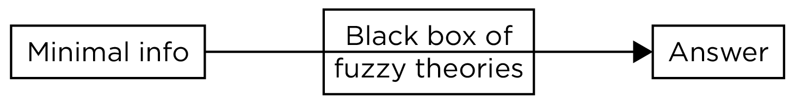

# Clinical Judgment Versus Algorithmic Prediction {#actuarial}

## Approaches to Prediction {#apporachesToPrediction}

There are two primary approaches to [prediction](#prediction): human (i.e., clinical) judgment and the actuarial (i.e., statistical) method.\index{clinical judgment}\index{actuarial}

### Human/Clinical Judgment {#humanJudgment}

Using the clinical judgment method of [prediction](#prediction), all gathered information is collected and formulated into a diagnosis or [prediction](#prediction) in the clinician's mind.\index{clinical judgment}
The clinician selects, measures, and combines risk factors and produces risk estimate solely according to clinical experience and judgment.\index{clinical judgment}

### Actuarial/Statistical Method {#actuarialPrediction}

In the actuarial or statistical method of [prediction](#prediction) (i.e., statistical [prediction](#prediction) rules), information is gathered and combined systematically in an evidence-based statistical [prediction](#prediction) formula, and established cutoffs are used.\index{actuarial}
The method is based on equations and data, so both are needed.\index{actuarial}

An example of a statistical method of [prediction](#prediction) is the Violence Risk Appraisal Guide [@Rice2013].\index{actuarial}
The Violence Risk Appraisal Guide is used in an attempt to predict violence and is used for parole decisions.\index{actuarial}
For instance, the equation might be something like Equation \@ref(eq:actuarialFormulaExample):\index{actuarial}

$$
\scriptsize
\begin{equation}
\text{Violence risk} = \beta \cdot \text{conduct disorder} + \beta \cdot \text{substance use} + \beta \cdot \text{suspended from school} + \beta \cdot \text{childhood aggression} + ...
(\#eq:actuarialFormulaExample)
\end{equation}
$$

Then, based on their score and the established cutoffs, a person is given a "low risk," "medium risk," or "high risk" designation.\index{actuarial}

### Combining Human Judgment and Statistical Algorithms {#combiningHumanJudgmentActuarialPrediction}

There are numerous ways in which humans and statistical algorithms could be involved.\index{clinical judgment}\index{actuarial}
On one extreme, humans make all judgments (consistent with the clinical judgment approach).\index{clinical judgment}
On the other extreme, although humans may be involved in data collection, a statistical formula makes all decisions based on the input data, consistent with an actuarial approach.\index{clinical judgment}\index{actuarial}
However, the clinical judgment and actuarial approaches can be combined in a hybrid way [@Dana2006].\index{clinical judgment}\index{actuarial}
For example, to save time and money, a clinician might use an actuarial approach in all cases, but might only use a clinical approach when the actuarial approach gives a "positive" test.\index{clinical judgment}\index{actuarial}
Or, the clinician might use both human judgment and an actuarial approach independently to see whether they agree.\index{clinical judgment}\index{actuarial}
That is, the clinician may make a [prediction](#prediction) based on their judgment and might also generate a [prediction](#prediction) from an actuarial approach.\index{clinical judgment}\index{actuarial}

The challenge is what to do when the human and the algorithm disagree.\index{clinical judgment}\index{actuarial}
Hypothetically, humans reviewing and adjusting the results from the statistical algorithm could lead to more accurate [predictions](#prediction).\index{clinical judgment}\index{actuarial}
However, human input also could lead to the possibility or exacerbation of [biased](#bias) [predictions](#prediction).\index{clinical judgment}\index{bias}
In general, with very few exceptions, actuarial approaches are as accurate or more accurate than clinical judgment [@Dawes1989; @Aegisdottir2006; @Baird2000; @Grove1996; @Grove2000].\index{clinical judgment}\index{actuarial}
Moreover, the superiority of actuarial approaches to clinical judgment tends to hold even when the clinician is given more information than the actuarial approach [@Dawes1989].\index{clinical judgment}\index{actuarial}
Allowing clinicians to override actuarial [predictions](#prediction) consistently leads to lower predictive accuracy [@Garb2019].\index{clinical judgment}\index{actuarial}

In general, [validity](#validity) tends to increase with greater structure (e.g., [structured](#structuredInterview) or [semi-structured](#semiStructuredInterview) [interviews](#interview) as opposed to free-flowing, [unstructured interviews](#unstructuredInterview)), in terms of administration, responses, scoring, interpretation, etc.\index{clinical judgment}\index{actuarial}\index{validity}\index{interview!structured}\index{interview!semi-structured}\index{interview!unstructured}\index{structured!administration}\index{structured!responses}\index{structured!scoring}
[Unstructured interviews](#unstructuredInterview) are susceptible to confirmatory [bias](#bias), such as exploring only the diagnoses that confirm the clinician's hypotheses rather than attempting to explore diagnoses that disconfirm the clinician's hypotheses, which leads to fewer diagnoses.\index{clinical judgment}\index{interview!unstructured}\index{bias!confirmatory}
[Unstructured interviews](#unstructuredInterview) are also susceptible to [bias](#bias) relating to race, gender, class, etc. [@Garb1997; @Garb2005].\index{clinical judgment}\index{interview!unstructured}

There is sometimes a misconception that formulas cannot account for qualitative information.\index{actuarial}
However, that is not true.\index{actuarial}
Qualitative information can be scored or coded to be quantified so that it can be included in statistical formulas.\index{actuarial}
That said, the quality of [predictions](#prediction) rests on the quality and relevance of the assessment information for the particular [prediction](#prediction)/judgment decision.\index{clinical judgment}\index{actuarial}
If the assessment data are lousy, it is unlikely that a statistical algorithm (or a human for that matter) will make an accurate [prediction](#prediction).\index{clinical judgment}\index{actuarial}
"Garbage in, garbage out."\index{actuarial}
A statistical formula cannot rescue inaccurate assessment data.\index{actuarial}

## Errors in Clinical Judgment {#errorsInClinicalJudgment}

Clinical judgment is naturally subject to errors.\index{clinical judgment}
Below, I describe a few errors to which clinical judgment seems particularly prone.\index{clinical judgment}

When operating freely, clinicians tend to over-estimate exceptions to the established rules (i.e., the broken leg syndrome).\index{clinical judgment}\index{broken leg}
@Meehl1957 acknowledged that there may be some situations where it is glaringly obvious that the statistical formula would be incorrect because it fails to account for an important factor.\index{clinical judgment}\index{broken leg}
He called these special cases "broken leg" cases, in which the human should deviate from the formula (i.e., broken leg countervailing).\index{clinical judgment}\index{broken leg}
The example goes like this:\index{clinical judgment}\index{broken leg}

> "If a sociologist were predicting whether Professor X would go to the movies on a certain night, he might have an equation involving age, academic specialty, and introversion score.\index{clinical judgment}\index{broken leg}\index{actuarial}
> The equation might yield a probability of .90 that Professor X goes to the movie tonight.\index{clinical judgment}\index{broken leg}\index{actuarial}
> But if the family doctor announced that Professor X had just broken his leg, no sensible sociologist would stick with the equation.\index{clinical judgment}\index{broken leg}\index{actuarial}
> Why didn't the factor of 'broken leg' appear in the formula?\index{clinical judgment}\index{broken leg}\index{actuarial}
> Because broken legs are very rare, and in the sociologist's entire sample of 500 criterion cases plus 250 cross-validating cases, he did not come upon a single instance of it.\index{clinical judgment}\index{broken leg}\index{actuarial}
> He uses the broken leg datum confidently, because 'broken leg' is a subclass of a larger class we may crudely denote as 'relatively immobilizing illness or injury,' and movie-attending is a subclass of a larger class of "actions requiring moderate mobility."\index{clinical judgment}\index{broken leg}
> [@Meehl1957]\index{clinical judgment}\index{broken leg}

However, people too often think that cases where they disagree with the statistical algorithm are broken leg cases.\index{clinical judgment}\index{broken leg}\index{actuarial}
People too often think their case is an exception to the rule.\index{clinical judgment}\index{broken leg}
As a result, they too often change the result of the statistical algorithm and are more likely to be wrong than right in doing so.\index{clinical judgment}\index{broken leg}\index{actuarial}
Because actuarial methods are based on actual population levels (i.e., [base rates](#baseRate)), unique exceptions are not over-estimated.\index{clinical judgment}\index{broken leg}\index{actuarial}\index{base rate}

Actuarial [predictions](#prediction) are perfectly [reliable](#reliability)—they will always return the same conclusion given an identical set of data.\index{actuarial}\index{reliability}
The human judge is likely to both disagree with others and with themself given the same set of symptoms.\index{clinical judgment}\index{reliability}

A clinician's decision is likely to be influenced by past experiences, and given the sample of humanity that the clinician is exposed to, the clinician is likely (based on prior experience) to over-estimate the likelihood of occurrence of infrequent phenomena.\index{clinical judgment}\index{base rate!neglect}
Actuarial methods are based on objective algorithms, and past personal experience and personal [biases](#bias) do not factor into any decisions.\index{actuarial}
Clinicians give weight to less relevant information, and often give too much weight to singular variables (e.g., Graduate Record Examination scores).\index{clinical judgment}
Actuarial formulas do a better job of focusing on relevant variables.\index{actuarial}
Computers are good at factoring in [base rates](#baseRate), [inverse conditional probabilities](#inverseFallacy), etc.\index{actuarial}\index{base rate}\index{probability!conditional}\index{probability!inverse conditional}
Humans ignore [base rates](#baseRate) ([base rate](#baseRate) neglect), and tend to show [confusion of the inverse](#inverseFallacy).\index{clinical judgment}\index{base rate!neglect}\index{confusion of the inverse}

Computers are better at accurately weighing risk factors and calculating [unbiased](#bias) risk estimates.\index{actuarial}\index{bias}
In an actuarial formula, the relevant risk factors are weighted according to their predictive power.\index{actuarial}
This stands in contrast to the [Diagnostic and Statistical Manual of Mental Disorders (DSM)](#dsm), in which each symptom is equally weighted.\index{Diagnostic and Statistical Manual of Mental Disorders}

Humans are typically given no feedback on their judgments.\index{clinical judgment}
To improve accuracy of judgments, it is important for feedback to be clear, consistent, and timely.\index{clinical judgment}
It is especially unlikely for feedback in clinical psychology to be timely because we will have to wait a long time to see the outcomes of [predictions](#prediction).\index{clinical judgment}

Clinicians are susceptible to representative schema [biases](#bias) [@Dawes1986].\index{clinical judgment}\index{bias}
Clinicians are exposed to a skewed sample of humanity, and make judgments based on a prototype from their ([biased](#bias)) experiences.\index{clinical judgment}\index{bias}
This is known as the representativeness heuristic.\index{clinical judgment}\index{bias}
Different clinicians may have different prototypes, leading to lower [inter-rater reliability](#interrater-reliability).\index{clinical judgment}\index{bias}\index{reliability!inter-rater}

## Humans Versus Computers {#humansVsComputers}

### Advantages of Computers {#advantagesOfComputers}

Here are some advantages of computers over humans:\index{actuarial}

- Computers can process lots of information simultaneously.\index{actuarial}
So can humans.\index{clinical judgment}
But computers can to an even greater degree.\index{actuarial}\index{clinical judgment}
- Computers are faster at making calculations.\index{actuarial}\index{clinical judgment}
- Computations by computers are error free (as long as the computations are programmed correctly).\index{actuarial}\index{clinical judgment}
- Computers' judgments will not be [biased](#bias) by fatigue or emotional responses.\index{actuarial}\index{clinical judgment}\index{bias}
- Computers' judgments will tend not to be [biased](#bias) in the way that humans' cognitive [biases](#bias) are, such as with anchoring [bias](#bias), representativeness [bias](#bias), confirmation [bias](#bias), or recency [bias](#bias).\index{actuarial}\index{clinical judgment}\index{bias}
Computers are less likely to be over-confident in their judgments.\index{actuarial}\index{clinical judgment}\index{overconfidence}
- Computers can more accurately weight the set of predictors based on large data sets.\index{actuarial}
Humans tend to give too much weight to singular predictors.\index{clinical judgment}

### Advantages of Humans {#advantagesOfHumans}

Computers are bad at some things too.\index{actuarial}
Here are some advantages of humans over computers (as of now):\index{clinical judgment}

- Humans can be better at identifying patterns in data (but also can mistakenly identify patterns where there are none).\index{clinical judgment}\index{actuarial}
- Humans can be flexible and take a different approach if a given approach is not working.\index{clinical judgment}\index{actuarial}
- Humans are better at tasks requiring creativity and imagination, such as developing theories that explain phenomena.\index{clinical judgment}\index{actuarial}
- Humans have the ability to reason, which is especially important when dealing with complex, abstract, or open-ended problems, or problems that have not been faced before (or for which we have insufficient data).\index{clinical judgment}\index{actuarial}
- Humans are better able to learn.\index{clinical judgment}\index{actuarial}
- Humans are better at holistic, gestalt processing, including facial and linguistic processing.\index{clinical judgment}\index{actuarial}

There *may* be situations in which a clinical judgment would do better than an actuarial judgment.\index{clinical judgment}\index{actuarial}
One situation when clinical judgment would be important is when no actuarial method exists for the judgment or [prediction](#prediction).\index{clinical judgment}\index{actuarial}
For instance, when no actuarial method exists for the diagnosis or disorder (e.g., suicide), it is up to the clinical judge.\index{clinical judgment}\index{actuarial}
However, we could collect data on the outcomes or on clinicians' judgments to develop an actuarial method that will be more reliable than the clinicians' judgments.\index{clinical judgment}\index{actuarial}
That is, an actuarial method developed based on clinicians' judgments will be more [accurate](#validity) than clinicians' judgments.\index{clinical judgment}\index{actuarial}
In other words, we do not necessarily need clients' outcome data to develop an actuarial method.\index{clinical judgment}\index{actuarial}
We could use the client's data as [predictors](#prediction) of the clinicians' judgments to develop a structured approach to [prediction](#prediction) that weighs factors similarly to clinicians, but with more [reliable](#reliability) [predictions](#prediction).\index{clinical judgment}\index{actuarial}\index{reliability}

Another situation in which clinical judgment could outperform a statistical algorithm is in true "broken leg" cases, e.g., important and rare events (edge cases) that are not yet accounted for by the algorithm.\index{clinical judgment}\index{actuarial}\index{broken leg}

Another situation in which clinical judgment could be preferable is if advanced, complex theories exist.\index{clinical judgment}\index{actuarial}\index{theory}
Computers have a difficult time adhering to complex theories, so clinicians may be better suited.\index{clinical judgment}\index{actuarial}\index{theory}
However, we do not have any of these complex theories in psychology that are accurate.\index{clinical judgment}\index{actuarial}\index{theory}
We would need strong theory informed by data regarding causal influences, and [accurate](#validity) measures to assess them.\index{theory}
If theories alone were true and could explain everything, the psychoanalytic tradition would give us all the answers, as depicted in Figure \@ref(fig:psychoanalyticTradition).\index{theory}\index{psychoanalysis}
However, no theories in psychology are that good.\index{theory}
Nevertheless, [predictive accuracy](#predictiveValidity) can be improved when considering theory [@Silver2012; @Garb2019].\index{theory}\index{prediction!improving accuracy of}

```{r psychoanalyticTradition, out.width = "100%", fig.align = "center", fig.cap = "Conceptual Depiction of the Psychoanalytic Tradition.", echo = FALSE}

```

If the diagnosis/[prediction](#prediction) requires complex configural relations that a computer will have a difficult time replicating, a clinician's judgment may be preferred.\index{clinical judgment}\index{actuarial}
Although the likelihood that the clinician can accurately work through these complex relations is theoretically possible, it is highly unlikely.\index{clinical judgment}\index{actuarial}
Holistic pattern recognition (such as language and faces) tends to be better by humans than computers.\index{clinical judgment}\index{actuarial}
But computers are getting better with holistic pattern recognition through machine learning.\index{actuarial}\index{machine learning}
An example of a simple decision (as opposed to a complex decision) would be whether to provide treatment A (e.g., cognitive behavior therapy) or treatment B (e.g., medication) for someone who shows melancholy.\index{clinical judgment}\index{actuarial}

In sum, the clinician seeks to integrate all information to make a decision, but is [biased](#bias).\index{clinical judgment}\index{bias}

### Comparison of Evidence {#evidenceOnHumanJudgmentVsActuarialPrediction}

Hundreds of studies have examined clinical versus actuarial [prediction](#prediction) methods across many disciplines.\index{clinical judgment}\index{actuarial}
Findings consistently show that actuarial methods are as [accurate](#validity) or more [accurate](#validity) than clinical [prediction](#prediction) methods.\index{clinical judgment}\index{actuarial}
"There is no controversy in social science that shows such a large body of qualitatively diverse studies coming out so uniformly...as this one" [@Meehl1986, pp. 373–374].\index{clinical judgment}\index{actuarial}

Actuarial methods are particularly valuable for criterion-referenced assessment tasks, in which the aim is to [predict](#prediction) specific events or outcomes [@Garb2019].\index{actuarial}
For instance, actuarial methods have shown promise in [predicting](#prediction) violence, criminal recidivism, psychosis onset, course of mental disorders, treatment selection, treatment failure, suicide attempts, and suicide [@Garb2019].\index{actuarial}
Psychometric methods of scale construction such as [factor analysis](#factorAnalysis) may be preferred to statistical [prediction](#prediction) rules for [norm-referenced](#norm) assessment tasks such as describing personality and psychopathology [@Garb2019].\index{factor analysis}\index{norm-referenced}

Moreover, actuarial methods are explicit; they can be transparent and lead to informed scientific criticism to improve them.\index{actuarial}
By contrast, clinical judgment methods are not typically transparent; clinical judgment relies on mental processes that are often difficult to specify.\index{clinical judgment}

## Accuracy of Different Statistical Models {#modelAccuracy-actuarial}

It is important to evaluate the [accuracy](#validity) of different types of statistical models to provide guidance on which types of models may be most [accurate](#validity) for a given [prediction](#prediction) problem.
Simpler statistical formulas are more likely to generalize to new samples than complex statistical models due to model *over-fitting*.\index{over-fitting}\index{parsimony}
As described in Section \@ref(overfitting), [over-fitting](#overfitting) occurs when the statistical model accounts for error variance (an overly specific [prediction](#prediction)), which will not generalize to future samples.\index{over-fitting}

@Youngstrom2018 discussed the benefits of the probability nomogram.\index{probability!nomogram}
The [probability nomogram](#bayesianUpdating) combines the risk ratio with the base rate (according to [Bayes theorem](#bayesTheorem)) to generate a [prediction](#prediction).\index{probability!nomogram}\index{Bayesian!Bayes' theorem}\index{diagnostic likelihood ratio}\index{base rate}
The [risk ratio](#diagnosticLikelihoodRatio) ([diagnostic likelihood ratio](#diagnosticLikelihoodRatio)) is an index of the [predictive validity](#predictiveValidity) of an instrument: it is the ratio of the probability that a test result is correct to the probability that the test result is incorrect.\index{diagnostic likelihood ratio}\index{base rate}\index{validity!predictive}
There are two types of diagnostic likelihood ratios: the [positive likelihood ratio](#positiveLikelihoodRatio) and the [negative likelihood ratio](#negativeLikelihoodRatio).\index{diagnostic likelihood ratio}\index{positive likelihood ratio}\index{negative likelihood ratio}
As described in Equation \@ref(eq:positiveLikelihoodRatio), the [positive likelihood ratio](#positiveLikelihoodRatio) is the probability that a person with the disease tested positive for the disease ([true positive rate](#sensitivity)) divided by the probability that a person without the disease tested positive for the disease ([false positive rate](#falsePositiveRate)).\index{positive likelihood ratio}\index{sensitivity}\index{false positive!rate}
As described in Equation \@ref(eq:negativeLikelihoodRatio), the [negative likelihood ratio](#negativeLikelihoodRatio) is the probability that a person with the disease tested negative for the disease ([false negative rate](#falseNegativeRate)) divided by the probability that a person without the disease tested negative for the disease ([true negative rate](#specificity)).\index{negative likelihood ratio}\index{specificity}\index{false negative!rate}
Using a [probability nomogram](#bayesianUpdating), you start with the [base rate](#baseRate), then plot the [diagnostic likelihood ratio](#diagnosticLikelihoodRatio) corresponding to a second source of information (e.g., positive test); then connect the [base rate](#baseRate) ([pretest probability](#pretestProbability)) to the [posttest probability](#posttestProbability) through the [likelihood ratio](#diagnosticLikelihoodRatio).\index{probability!nomogram}\index{diagnostic likelihood ratio}\index{base rate}\index{Bayesian!updating}\index{probability!pretest}\index{probability!posttest}
These approaches are described in greater detail in Section \@ref(bayesianUpdating).

@Youngstrom2018 ordered actuarial approaches to diagnostic classification from less to more complex:\index{actuarial}

- [Predicting from the base rate](#predictingFromBaseRate)\index{base rate!predicting from}
- Take the best
- The [probability nomogram](#bayesianUpdating)\index{probability!nomogram}
- Naïve Bayesian algorithms\index{Naïve Bayesian}
- Logistic regression with one predictor\index{logistic regression}\index{multiple regression}
- Logistic regression with multiple predictors\index{logistic regression}\index{multiple regression}
- Least absolute shrinkage and selection option (LASSO)\index{least absolute shrinkage and selection option}

As described in Section \@ref(predictingFromBaseRate), [predicting from the base rate](#predictingFromBaseRate) is selecting the most likely outcome in every case.\index{base rate!predicting from}
"Take the best" refers to focusing on the single variable with the largest [validity](#validity) coefficient, and making a decision based on it (based on some threshold).
The [probability nomogram](#bayesianUpdating) combines the [base rate](#baseRate) ([prior probability](#pretestProbability)) with the information offered by an assessment finding to revise the probability.\index{probability!nomogram}\index{base rate}\index{probability!pretest}
Naïve Bayesian algorithms use the [probability nomogram](#bayesianUpdating) with multiple assessment findings.\index{Naïve Bayesian}\index{probability!nomogram}
Basically, you continue to calculate a new [posttest probability](#posttestProbability) based on each assessment finding, revising the [pretest probability](#pretestProbability) for the next assessment finding based on the [posttest probability](#posttestProbability) of the last assessment finding.\index{probability!posttest}\index{probability!pretest}
However, this approach assumes that all [predictors](#prediction) are uncorrelated, which is probably not true in practice.

Logistic regression is useful for classification problems because it deals with a dichotomous dependent variable, but one could extrapolate it to a continuous dependent variable with multiple regression.\index{logistic regression}\index{multiple regression}
The effect size from logistic regression is equivalent to [receiver operating characteristic (ROC) curve](#roc) analysis.\index{logistic regression}\index{effect size}\index{receiver operating characteristic curve!area under the curve}
Logistic regression with multiple predictors combines multiple [predictors](#prediction) into one regression model.\index{logistic regression}\index{multiple regression}
Including multiple [predictors](#prediction) in the same model optimizes the weights of multiple [predictors](#prediction), but it is important for [predictors](#prediction) not to be [collinear](#multiCollinearity).\index{logistic regression}\index{multiple regression}\index{multicollinearity}

LASSO is a form of regression that can handle multiple [predictors](#prediction) (like multiple regression).\index{least absolute shrinkage and selection option}\index{multiple regression}
However, it can handle more [predictors](#prediction) than multiple regression.\index{least absolute shrinkage and selection option}\index{multiple regression}
For instance, LASSO can accommodate situations where there are more [predictors](#prediction) than there are participants.\index{least absolute shrinkage and selection option}
Moreover, unlike multiple regression, it can handle [collinear](#multiCollinearity) predictors.\index{multicollinearity}\index{least absolute shrinkage and selection option}
LASSO	uses internal cross-validation to avoid over-fitting.\index{least absolute shrinkage and selection option}\index{cross validation}\index{over-fitting}

@Youngstrom2018 found that model complexity improves [accuracy](#validity) but only to a point; some of the simpler models (Naïve Bayesian and Logistic regression) did just as well and in some cases better than LASSO models in classifying bipolar disorder.\index{parsimony}\index{Naïve Bayesian}\index{logistic regression}\index{multiple regression}
Although LASSO models showed the highest [discrimination accuracy](#discrimination) in the internal sample, it showed the largest shrinkage in the external sample.\index{least absolute shrinkage and selection option}\index{discrimination}\index{shrinkage}
Moreover, the LASSO models showed poor [calibration](#calibration) in the internal sample; they over-diagnosed bipolar disorder.\index{least absolute shrinkage and selection option}\index{calibration}
By contrast, simpler models showed better [calibration](#calibration) in the internal sample.\index{parsimony}\index{calibration}
The [probability nomogram](#bayesianUpdating) with one or multiple assessment findings showed better [calibration](#calibration) than LASSO models because they accounted for the original [base rate](#baseRate), so they did not over-diagnose bipolar disorder.\index{probability!nomogram}\index{Naïve Bayesian}\index{calibration}\index{base rate}\index{least absolute shrinkage and selection option}

In summary, the best models are those that are relatively simple (parsimonious), that can account for one or several of the most important [predictors](#prediction) and their optimal weightings; and that account for the [base rate](#baseRate) of the phenomenon.\index{parsimony}\index{base rate}
Even unit-weighted formulas (formulas whose [predictors](#prediction) are equally weighted with a weight of one) can sometimes generalize better to other samples than complex weightings [@Garb2019].
Differential weightings sometimes capture random variance and [over-fit](#overfitting) the model, thus leading to [predictive accuracy](#predictiveValidity) shrinkage in cross-validation samples [@Garb2019], as described below.\index{shrinkage}\index{over-fitting}\index{validity!predictive}
The choice of [predictive](#prediction) variables often matters more than their weighting.

In general, there is often shrinkage of estimates from training data set to a test data set.\index{shrinkage}
*Shrinkage* is when variables with stronger predictive power in the original data set tend to show somewhat smaller predictive power (smaller validity coefficients) when applied to new groups.\index{shrinkage}\index{validity!coefficient of}
Shrinkage reflects a model [over-fitting](#overfitting) (i.e., fitting to error by capitalizing on chance).\index{shrinkage}\index{over-fitting}
Shrinkage is especially likely when the original sample is small and/or unrepresentative and the number of variables considered for inclusion is large.\index{shrinkage}
Cross-validation with large, representative samples can help evaluate the amount of shrinkage of estimates, particularly for more complex models such as machine learning models [@Ursenbach2019].\index{shrinkage}\index{machine learning}\index{cross validation}
Ideally, cross-validation would be conducted with a separate sample (external cross-validation) to see the generalizability of estimates.\index{cross validation}
However, you can also do internal cross-validation.\index{cross validation}
For example, you can perform *k*-fold cross-validation, where you:\index{cross validation}\index{cross validation!$k$-fold}

- split the data set into *k* groups\index{cross validation!$k$-fold}
- for each unique group:\index{cross validation!$k$-fold}
  - take the group as a hold out data set (also called a test data set)\index{cross validation!$k$-fold}
  - take the remaining groups as a training data set\index{cross validation!$k$-fold}
  - fit a model on the training data set and evaluate it on the test data set
  - after all k-folds have been used as the test data set, and all models have been fit, you average the estimates across the models, which presumably yields more robust, generalizable estimates\index{cross validation!$k$-fold}

An emerging technique that hold promise for increasing predictive accuracy of actuarial methods is machine learning [@Garb2019].\index{actuarial}\index{machine learning}
However, one challenge of some machine learning techniques is that they are like a "black box" and are not transparent, which raises [ethical](#ethics) issues [@Garb2019].\index{actuarial}\index{machine learning}\index{ethics}
Machine learning may be most valuable when the data available are complex and there are many [predictive](#prediction) variables [@Garb2019].\index{actuarial}\index{machine learning}

## Getting Started {#gettingStarted-actuarial}

### Load Libraries {#loadLibraries-actuarial}

```{r}
library("petersenlab")
library("pROC")
library("caret")
library("MASS")
library("randomForest")
library("e1071")
library("ranger")
library("ordinalForest")
library("elasticnet")
library("LiblineaR")
library("glmnet")
library("viridis")
library("MOTE")
library("tidyverse")
library("here")
library("tinytex")
library("rmarkdown")
```

### Prepare Data {#prepareData-actuarial}

#### Load Data {#loadData-actuarial}

`aSAH` is a data set from the `pROC` package [@R-pROC] that contains test scores (`s100b`) and clinical outcomes (`outcome`) for patients.

```{r}
data(aSAH)
mydataActuarial <- aSAH

mydataActuarial$disorder <- NA
mydataActuarial$disorder[which(
  mydataActuarial$outcome == "Poor")] <- 1
mydataActuarial$disorder[which(
  mydataActuarial$outcome == "Good")] <- 0
```

#### Simulate Data {#simulateData-actuarial}

For reproducibility, I set the seed below.\index{simulate data}
Using the same seed will yield the same answer every time.
There is nothing special about this particular seed.

```{r}
set.seed(52242)

mydataActuarial$ordinal <- sample(
  0:2,
  nrow(mydataActuarial),
  replace = TRUE)

mydataActuarial$ordinalFactor <- 
  factor(mydataActuarial$ordinal, ordered = TRUE)
```

## Fitting the Statistical Models {#fittingModels-actuarial}

### Regression with One Predictor {#regressionOnePredictor}

Dichotomous Outcome:\index{data!dichotomous}\index{multiple regression}

```{r}
summary(
  glm(disorder ~ s100b,
  data = mydataActuarial))
```

Ordinal Outcome:

```{r}
summary(
  polr(ordinalFactor ~ s100b,
  data = mydataActuarial))

lrm(
  ordinal ~ s100b,
  data = mydataActuarial,
  x = TRUE,
  y = TRUE)

ordinalModel <- train(
  ordinalFactor ~ s100b,
  data = mydataActuarial,
  method = "polr")

print(ordinalModel)
```

Continuous Outcome:

```{r}
summary(
  lm(s100b ~ ndka,
  data = mydataActuarial))
```

### Regression with Multiple Predictors {#regressionMultiplePredictors}

Dichotomous Outcome:\index{data!dichotomous}\index{multiple regression}

```{r}
summary(
  glm(disorder ~ s100b + ndka + gender + age + wfns,
  data = mydataActuarial))
```

Ordinal Outcome:\index{data!ordinal}\index{multiple regression}

```{r}
summary(
  polr(ordinalFactor ~ s100b + ndka + gender + age + wfns,
  data = mydataActuarial))

lrm(
  ordinal ~ s100b + ndka + gender + age + wfns,
  data = mydataActuarial,
  x = TRUE,
  y = TRUE)

ordinalModelPredictors <- train(
  ordinalFactor ~ s100b + ndka + gender + age + wfns,
  data = mydataActuarial,
  method = "polr")

print(ordinalModelPredictors)
```

Continuous Outcome:\index{data!continuous}\index{multiple regression}

```{r}
summary(
  lm(s100b ~ ndka + gender + age + wfns,
  data = mydataActuarial))
```

### Least Absolute Shrinkage and Selection Option (LASSO) {#lasso}

The least absolute shrinkage and selection option (LASSO) models were fit in the `caret` package [@R-caret].\index{least absolute shrinkage and selection option}

Dichotomous Outcome:\index{least absolute shrinkage and selection option}\index{data!dichotomous}

```{r}
lassoModelDichotomous <- train(
  outcome ~ s100b + ndka + gender + age + wfns,
  data = mydataActuarial,
  method = "glmnet")

print(lassoModelDichotomous)
```

Continuous Outcome:\index{least absolute shrinkage and selection option}\index{data!continuous}

```{r}
lassoModelContinuous <- train(
  s100b ~ ndka + gender + age + wfns,
  data = mydataActuarial,
  method = "lasso")

print(lassoModelContinuous)
```

### Ridge Regression {#ridgeRegression}

The ridge regression models were fit in the `caret` package [@R-caret].\index{ridge regression}\index{multiple regression}

Dichotomous Outcome:\index{ridge regression}\index{multiple regression}\index{data!dichotomous}

```{r}
ridgeModelDichotomous <- train(
  outcome ~ s100b + ndka + gender + age + wfns,
  data = mydataActuarial,
  method = "regLogistic")

print(ridgeModelDichotomous)
```

Continuous Outcome:\index{ridge regression}\index{multiple regression}\index{data!continuous}

```{r}
ridgeModelContinuous <- train(
  s100b ~ ndka + gender + age + wfns,
  data = mydataActuarial,
  method = "ridge")

print(ridgeModelContinuous)
```

### Random Forest Machine Learning {#randomForest}

The random forest models were fit in the `caret` package [@R-caret].\index{machine learning}\index{random forest}

Dichotomous Outcome:\index{machine learning}\index{random forest}\index{data!dichotomous}

```{r}
rfModelDichotomous <- train(
  outcome ~ s100b + ndka + gender + age + wfns,
  data = mydataActuarial,
  method = "rf")

print(rfModelDichotomous)
```

Ordinal Outcome:\index{machine learning}\index{random forest}\index{data!ordinal}

```{r}
rfModelOrdinal <- train(
  ordinalFactor ~ s100b + ndka + gender + age + wfns,
  data = mydataActuarial,
  method = "ordinalRF")

print(rfModelOrdinal)
```

Continuous Outcome:\index{machine learning}\index{random forest}\index{data!continuous}

```{r}
rfModelContinuous <- train(
  s100b ~ ndka + gender + age + wfns,
  data = mydataActuarial,
  method = "rf")

print(rfModelContinuous)
```

### *k*-Fold Cross-Validation {#kfoldCV}

The *k*-fold cross-validation models were fit in the `caret` package [@R-caret].\index{cross validation!$k$-fold}

```{r}
kFolds <- 10

train.control <- trainControl(
  method = "cv",
  number = kFolds)
```

Dichotomous Outcome:\index{cross validation!$k$-fold}\index{data!dichotomous}

```{r}
cvModelDichotomous <- train(
  outcome ~ s100b + ndka + gender + age + wfns,
  data = mydataActuarial,
  method = "glm",
  trControl = train.control)

print(cvModelDichotomous)
```

Continuous Outcome:\index{cross validation!$k$-fold}\index{data!continuous}

```{r}
cvModelContinuous <- train(
  s100b ~ ndka + gender + age + wfns,
  data = mydataActuarial,
  method = "lm",
  trControl = train.control)

print(cvModelContinuous)
```

### Leave-One-Out (LOO) Cross-Validation {#looCV}

The leave-one-out (LOO) cross-validation models were fit in the `caret` package [@R-caret].\index{cross validation!leave one out}

```{r}
train.control <- trainControl(
  method = "LOOCV")
```

Dichotomous Outcome:\index{cross validation!leave one out}\index{data!dichotomous}

```{r}
loocvModelDichotomous <- train(
  outcome ~ s100b + ndka + gender + age + wfns,
  data = mydataActuarial,
  method = "glm",
  trControl = train.control)

print(loocvModelDichotomous)
```

Continuous Outcome:\index{cross validation!leave one out}\index{data!continuous}

```{r}
loocvModelContinuous <- train(
  s100b ~ ndka + gender + age + wfns,
  data = mydataActuarial,
  method = "lm",
  trControl = train.control)

print(loocvModelContinuous)
```

## Why Clinical Judgment is More Widely Used Than Statistical Formulas {#whyHumanJudgmentIsMoreWidelyUsed}

Despite actuarial methods being generally more accurate than clinical judgment, clinical judgment is much more widely used.\index{clinical judgment}\index{actuarial}
There are several reasons why actuarial methods have not caught on.\index{actuarial}
One reason why actuarial methods have not caught on is because of professional traditions.\index{clinical judgment}\index{actuarial}
Experts in any field do not like to think that a computer could outperform them.\index{clinical judgment}\index{actuarial}
Some practitioners argue that judgment/[prediction](#prediction) is an "art form" and that using a statistical formula is treating people like a number.\index{clinical judgment}\index{actuarial}
However, using an approach (i.e., clinical judgment) that systematically leads to less [accurate](#validity) decisions and [predictions](#prediction) is an [ethical](#ethics) problem.\index{clinical judgment}\index{actuarial}\index{ethics}

Some clinicians do not think that group means apply to an individual client.\index{clinical judgment}\index{actuarial}
This invokes the distinction between nomothetic (group-level) inferences and idiographic (individual-level) inferences.\index{clinical judgment}\index{actuarial}\index{nomothetic}\index{idiographic}
However, the scientific evidence and probability theory strongly favor the nomothetic approach to clinical [prediction](#prediction)—it is better to generalize from group-level evidence than throwing out all the evidence and taking the approach of "anything goes."\index{clinical judgment}\index{actuarial}\index{nomothetic}\index{idiographic}
Clinicians frequently believe the broken leg fallacy, i.e., thinking that your client is an exception to the algorithmic [prediction](#prediction).\index{clinical judgment}\index{actuarial}\index{broken leg}
In most cases, deviating from the statistical formula will result in less [accurate](#validity) [predictions](#prediction).\index{clinical judgment}\index{actuarial}
People tend to over-estimate the probability of low [base rate](#baseRate) conditions and events.\index{clinical judgment}\index{base rate!neglect}

Another reason why actuarial methods have not caught on is the belief that receiving a treatment is the only thing that matters.\index{actuarial}
But it is an empirical question which treatment is most effective for whom.\index{clinical judgment}\index{actuarial}
What if we could do better?\index{clinical judgment}\index{actuarial}
For example, we could potentially use a formula to identify the most effective treatment for a client.\index{clinical judgment}\index{actuarial}
Some treatments are no better than placebo; other treatments are actually harmful [@Lilienfeld2007; @Williams2021].\index{clinical judgment}\index{actuarial}

Another reason why clinical methods are more widely used than actuarial methods is the over-confidence in clinicians' [predictions](#prediction)—clinicians think they are more accurate than they are.\index{clinical judgment}\index{actuarial}\index{overconfidence}
We see this when examining their [calibration](#calibration); their [predictions](#prediction) tend to be [mis-calibrated](#calibration).\index{clinical judgment}\index{calibration}
For example, things they report with 80% confidence occur less than 80% of the time.\index{clinical judgment}\index{calibration}
Clinicians will sometimes be correct by chance, and they tend to mis-attribute that to their assessment; clinicians tend to remember the successes and forget the failures.\index{clinical judgment}\index{calibration}
Note, however, that it is not just clinicians who are over-confident; humans in general tend to be over-confident in their [predictions](#prediction).\index{clinical judgment}\index{overconfidence}

Another argument against using actuarial methods is that "no methods exist."\index{clinical judgment}\index{actuarial}
In some cases, that is true—actuarial methods do not yet exist for some [prediction](#prediction) problems.\index{actuarial}
However, one can always create an algorithm of the clinicians' judgments, even if one does not have access to the clients' outcome information.\index{clinical judgment}\index{actuarial}
A model of clinicians' responses tends to be more [accurate](#validity) than clinicians' judgments themselves because the model gives the same outcome with the same input data—i.e., it is perfectly [reliable](#reliability).\index{clinical judgment}\index{actuarial}\index{reliability}

Another argument from some clinicians is that "My job is to understand, not to predict."\index{clinical judgment}
But what kind of understanding does not involve [predictions](#prediction)?\index{clinical judgment}
[Accurate predictions](#predictiveValidity) help in understanding.\index{clinical judgment}\index{actuarial}
Knowing how people would perform in different conditions is the same thing as good understanding.\index{clinical judgment}\index{actuarial}

## Conclusion {#conclusion-actuarial}

In general, it is better to develop and use structured, actuarial approaches than informal approaches that rely on human or clinical judgment.\index{clinical judgment}\index{actuarial}\index{structured!administration}\index{structured!responses}\index{structured!scoring}
Actuarial approaches to prediction tend to be as accurate or more accurate than clinical judgment.\index{clinical judgment}\index{actuarial}
Nevertheless, clinical judgment tends to be much more widely used than actuarial approaches, which is a major [ethical](#ethics) problem.\index{clinical judgment}\index{actuarial}\index{ethics}

## Suggested Readings {#readings-actuarial}

@Dawes1989; @Garb2019; @Grove2000
