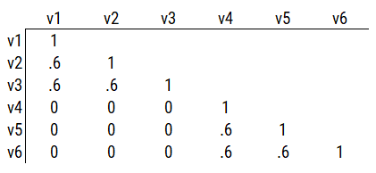

# Factor Analysis and Principal Component Analysis {#factor-analysis-PCA}

[**Wright et al, 2019 citation in psych assessment**; **Bensch et al, 2019 citation** ;**Tackett et al, 2019 citation on MTMM**; **Simms et al. 2019 citation**; **Clark & Watson, 2019 citation**; **Sellbom & Tellegen, 2019**; **Wright & Zimmerman, 2019 citation**; **Burchett et al, 2019 citation**; **Chandler et al, 2020 citation**]

[**Costa et al, 2019 citation**]

[**Markon, 2019 article on bifactor models**]

Figure \@ref(fig:correlationMatrix1).

```{r correlationMatrix1, out.width = "100%", fig.align = "center", fig.cap = "Example correlation matrix.", echo = FALSE}
knitr::include_graphics("./Images/correlationMatrix1.png")
```

Figure \@ref(fig:correlationMatrix2).

```{r correlationMatrix2, out.width = "100%", fig.align = "center", fig.cap = "Example correlation matrix.", echo = FALSE}
knitr::include_graphics("./Images/correlationMatrix2.png")
```

Figure \@ref(fig:correlationMatrix3).

```{r correlationMatrix3, out.width = "100%", fig.align = "center", fig.cap = "Example correlation matrix.", echo = FALSE}

```

Figure \@ref(fig:correlationMatrix4).

```{r correlationMatrix4, out.width = "100%", fig.align = "center", fig.cap = "Example correlation matrix.", echo = FALSE}
knitr::include_graphics("./Images/correlationMatrix4.png")
```

## Getting Started

### Load Libraries

```{r, message = FALSE, warning = FALSE}
library("lavaan")
library("psych")
library("corrplot")
library("nFactors")
library("semPlot")
library("lavaan")
library("semTools")
library("dagitty")
library("tidyverse")
library("here")
library("tinytex")
library("knitr")
library("rmarkdown")
```

### Load Data

The `MTMM` data file comes from W. Joel Schneider: http://my.ilstu.edu/~wjschne/442/MTMM.csv

```{r, message = FALSE}
MTMM <- read_csv(here("Data", "MTMM.csv")) #read_csv("../Data/MTMM.csv")
```

### Prepare Data

#### Add Missing Data

Adding missing data to dataframes helps make examples more realistic to real-life data, and helps you get in the habit of programming to account for missing data. For reproducibility, I set the seed below. Using the same seed will yield the same answer every time. There is nothing special about this particular seed.

```{r}
set.seed(52242)

varNames <- names(HolzingerSwineford1939)
dimensionsDf <- dim(HolzingerSwineford1939)
unlistedDf <- unlist(HolzingerSwineford1939)
unlistedDf[sample(1:length(unlistedDf), size = .15 * length(unlistedDf))] <- NA
HolzingerSwineford1939 <- as.data.frame(matrix(unlistedDf, ncol = dimensionsDf[2]))
names(HolzingerSwineford1939) <- varNames
```

## Descriptive Statistics and Correlations

### Descriptive Statistics

```{r, eval = knitr::is_html_output(excludes = "epub")}
paged_table(psych::describe(HolzingerSwineford1939[,c("x1","x2","x3","x4","x5","x6","x7","x8","x9")]))
```

```{r, eval = knitr::is_latex_output()}
kable(psych::describe(HolzingerSwineford1939[,c("x1","x2","x3","x4","x5","x6","x7","x8","x9")]),
      booktabs = TRUE)
```

```{r eval = knitr::is_html_output(excludes = c("markdown","html","html4","html5","revealjs","s5","slideous","slidy","gfm"))}
kable(psych::describe(HolzingerSwineford1939[,c("x1","x2","x3","x4","x5","x6","x7","x8","x9")]),
      booktabs = TRUE)
```

### Correlations

Pairs panel plots were generated using the `psych` package [@R-psych]. Correlation plots were generated using the `corrplot` package [@R-corrplot].

```{r}
cor(HolzingerSwineford1939[,c("x1","x2","x3","x4","x5","x6","x7","x8","x9")], use = "pairwise.complete.obs")
```

```{r, out.width = "100%", fig.cap = "Pairs panel plot"}
pairs.panels(HolzingerSwineford1939[,c("x1","x2","x3","x4","x5","x6","x7","x8","x9")])
```

```{r, out.width = "100%", fig.cap = "Correlation plot"}
corrplot(cor(HolzingerSwineford1939[,c("x1","x2","x3","x4","x5","x6","x7","x8","x9")], use = "pairwise.complete.obs"))
```

## Factor Analysis {#factorAnalysis}

## Exploratory Factor Analysis (EFA) {#efa}

### Determine number of factors

Determine the number of factors to retain using the Scree plot and Very Simple Structure plot.

#### Scree Plot

Scree plots were generated using the `psych` [@R-psych] and `nFactors` [@R-nFactors] packages.

```{r, out.width = "100%", fig.cap = "Scree plots in exploratory factor analysis"}
fa.parallel(x = HolzingerSwineford1939[,c("x1","x2","x3","x4","x5","x6","x7","x8","x9")], fm = "ml", fa = "fa")
plot(nScree(x = cor(HolzingerSwineford1939[,c("x1","x2","x3","x4","x5","x6","x7","x8","x9")], use = "pairwise.complete.obs"), model = "factors"))
```

#### Very Simple Structure (VSS) Plot

Very simple structure (VSS) plots were generated using the `psych` package [@R-psych].

##### Orthogonal (Varimax) rotation

```{r, out.width = "100%", fig.cap = "Very simple structure plot with orthogonal rotation in exploratory factor analysis"}
vss(HolzingerSwineford1939[,c("x1","x2","x3","x4","x5","x6","x7","x8","x9")], rotate = "varimax", fm = "ml")
nfactors(HolzingerSwineford1939[,c("x1","x2","x3","x4","x5","x6","x7","x8","x9")], rotate = "varimax", fm = "ml")
```

##### Oblique (Oblimin) rotation

```{r, out.width = "100%", fig.cap = "Very simple structure plot with oblique rotation in exploratory factor analysis"}
vss(HolzingerSwineford1939[,c("x1","x2","x3","x4","x5","x6","x7","x8","x9")], rotate = "oblimin", fm = "ml")
nfactors(HolzingerSwineford1939[,c("x1","x2","x3","x4","x5","x6","x7","x8","x9")], rotate = "oblimin", fm = "ml")
```

##### No rotation

```{r, out.width = "100%", fig.cap = "Very simple structure plot with no rotation in exploratory factor analysis"}
vss(HolzingerSwineford1939[,c("x1","x2","x3","x4","x5","x6","x7","x8","x9")], rotate = "none", fm = "ml")
nfactors(HolzingerSwineford1939[,c("x1","x2","x3","x4","x5","x6","x7","x8","x9")], rotate = "none", fm = "ml")
```

### Run factor analysis

Exploratory factor analysis (EFA) models were fit using the `psych` package [@R-psych].

#### Orthogonal (Varimax) rotation

Fit a different model with each number of possible factors:

```{r}
efa1factorOrthogonal <- fa(r = HolzingerSwineford1939[,c("x1","x2","x3","x4","x5","x6","x7","x8","x9")], nfactors = 1, rotate = "varimax", fm = "ml")
efa2factorOrthogonal <- fa(r = HolzingerSwineford1939[,c("x1","x2","x3","x4","x5","x6","x7","x8","x9")], nfactors = 2, rotate = "varimax", fm = "ml")
efa3factorOrthogonal <- fa(r = HolzingerSwineford1939[,c("x1","x2","x3","x4","x5","x6","x7","x8","x9")], nfactors = 3, rotate = "varimax", fm = "ml")
efa4factorOrthogonal <- fa(r = HolzingerSwineford1939[,c("x1","x2","x3","x4","x5","x6","x7","x8","x9")], nfactors = 4, rotate = "varimax", fm = "ml")
efa5factorOrthogonal <- fa(r = HolzingerSwineford1939[,c("x1","x2","x3","x4","x5","x6","x7","x8","x9")], nfactors = 5, rotate = "varimax", fm = "ml")
efa6factorOrthogonal <- fa(r = HolzingerSwineford1939[,c("x1","x2","x3","x4","x5","x6","x7","x8","x9")], nfactors = 6, rotate = "varimax", fm = "ml")
efa7factorOrthogonal <- fa(r = HolzingerSwineford1939[,c("x1","x2","x3","x4","x5","x6","x7","x8","x9")], nfactors = 7, rotate = "varimax", fm = "ml")
efa8factorOrthogonal <- fa(r = HolzingerSwineford1939[,c("x1","x2","x3","x4","x5","x6","x7","x8","x9")], nfactors = 8, rotate = "varimax", fm = "ml")
efa9factorOrthogonal <- fa(r = HolzingerSwineford1939[,c("x1","x2","x3","x4","x5","x6","x7","x8","x9")], nfactors = 9, rotate = "varimax", fm = "ml")
```

#### Oblique (Oblimin) rotation

Fit a different model with each number of possible factors:

```{r}
efa1factorOblique <- fa(r = HolzingerSwineford1939[,c("x1","x2","x3","x4","x5","x6","x7","x8","x9")], nfactors = 1, rotate = "oblimin", fm = "ml")
efa2factorOblique <- fa(r = HolzingerSwineford1939[,c("x1","x2","x3","x4","x5","x6","x7","x8","x9")], nfactors = 2, rotate = "oblimin", fm = "ml")
efa3factorOblique <- fa(r = HolzingerSwineford1939[,c("x1","x2","x3","x4","x5","x6","x7","x8","x9")], nfactors = 3, rotate = "oblimin", fm = "ml")
efa4factorOblique <- fa(r = HolzingerSwineford1939[,c("x1","x2","x3","x4","x5","x6","x7","x8","x9")], nfactors = 4, rotate = "oblimin", fm = "ml")
efa5factorOblique <- fa(r = HolzingerSwineford1939[,c("x1","x2","x3","x4","x5","x6","x7","x8","x9")], nfactors = 5, rotate = "oblimin", fm = "ml")
efa6factorOblique <- fa(r = HolzingerSwineford1939[,c("x1","x2","x3","x4","x5","x6","x7","x8","x9")], nfactors = 6, rotate = "oblimin", fm = "ml")
efa7factorOblique <- fa(r = HolzingerSwineford1939[,c("x1","x2","x3","x4","x5","x6","x7","x8","x9")], nfactors = 7, rotate = "oblimin", fm = "ml")
efa8factorOblique <- fa(r = HolzingerSwineford1939[,c("x1","x2","x3","x4","x5","x6","x7","x8","x9")], nfactors = 8, rotate = "oblimin", fm = "ml") #no convergence
efa9factorOblique <- fa(r = HolzingerSwineford1939[,c("x1","x2","x3","x4","x5","x6","x7","x8","x9")], nfactors = 9, rotate = "oblimin", fm = "ml")
```

### Factor scores

#### Orthogonal (Varimax) rotation

```{r}
fa3Orthogonal <- efa3factorOrthogonal$scores
```

#### Oblique (Oblimin) rotation

```{r}
fa3Oblique <- efa3factorOblique$scores
```

### Plots

Pairs panel plots were generated using the `psych` package [@R-psych]. Correlation plots were generated using the `corrplot` package [@R-corrplot].

#### Orthogonal (Varimax) rotation

```{r, out.width = "100%", fig.cap = "Factor plot with orthogonal rotation in exploratory factor analysis"}
factor.plot(efa3factorOrthogonal, cut = 0.5)
```

```{r, out.width = "100%", fig.cap = "Factor diagram with orthogonal rotation in exploratory factor analysis"}
fa.diagram(efa3factorOrthogonal, digits = 2)
```

```{r, out.width = "100%", fig.cap = "Pairs panel plot with orthogonal rotation in exploratory factor analysis"}
pairs.panels(fa3Orthogonal)
```

```{r, out.width = "100%", fig.cap = "Correlation plot with orthogonal rotation in exploratory factor analysis"}
corrplot(cor(fa3Orthogonal, use = "pairwise.complete.obs")) 
```

#### Oblique (Oblimin) rotation

```{r, out.width = "100%", fig.cap = "Factor plot with oblique rotation in exploratory factor analysis"}
factor.plot(efa3factorOblique, cut = 0.5)
```

```{r, out.width = "100%", fig.cap = "Factor diagram with oblique rotation in exploratory factor analysis"}
fa.diagram(efa3factorOblique, digits = 2)
```

```{r, out.width = "100%", fig.cap = "Pairs panel plot with oblique rotation in exploratory factor analysis"}
pairs.panels(fa3Oblique)
```

```{r, out.width = "100%", fig.cap = "Correlation plot with oblique rotation in exploratory factor analysis"}
corrplot(cor(fa3Oblique, use = "pairwise.complete.obs"))
```

## Confirmatory Factor Analysis (CFA) {#cfa}

I introduced confirmatory factor analysis (CFA) models in Section \@ref(cfa-sem) in the chapter on [structural equation models](#sem).

The CFA models were fit in the `lavaan` package [@R-lavaan]. The examples were adapted from the `lavaan` documentation: http://lavaan.ugent.be/tutorial/cfa.html

### Specify the model

```{r}
cfaModel_syntax <- '
 #Factor loadings
 visual  =~ x1 + x2 + x3
 textual =~ x4 + x5 + x6
 speed   =~ x7 + x8 + x9
'

cfaModel_fullSyntax <- '
 #Factor loadings (free the factor loading of the first indicator)
 visual  =~ NA*x1 + x2 + x3
 textual =~ NA*x4 + x5 + x6
 speed   =~ NA*x7 + x8 + x9
 
 #Fix latent means to zero
 visual ~ 0
 textual ~ 0
 speed ~ 0
 
 #Fix latent variances to one
 visual ~~ 1*visual
 textual ~~ 1*textual
 speed ~~ 1*speed
 
 #Estimate covariances among latent variables
 visual ~~ textual
 visual ~~ speed
 textual ~~ speed
 
 #Estimate residual variances of manifest variables
 x1 ~~ x1
 x2 ~~ x2
 x3 ~~ x3
 x4 ~~ x4
 x5 ~~ x5
 x6 ~~ x6
 x7 ~~ x7
 x8 ~~ x8
 x9 ~~ x9
 
 #Free intercepts of manifest variables
 x1 ~ int1*1
 x2 ~ int2*1
 x3 ~ int3*1
 x4 ~ int4*1
 x5 ~ int5*1
 x6 ~ int6*1
 x7 ~ int7*1
 x8 ~ int8*1
 x9 ~ int9*1
'
```

#### Model syntax in table form:

```{r}
lavaanify(cfaModel_syntax)
lavaanify(cfaModel_fullSyntax)
```

### Fit the model

```{r}
cfaModelFit <- cfa(cfaModel_syntax,
                   data = HolzingerSwineford1939,
                   missing = "ML",
                   estimator = "MLR",
                   std.lv = TRUE)

cfaModelFit_full <- lavaan(cfaModel_fullSyntax,
                           data = HolzingerSwineford1939,
                           missing = "ML",
                           estimator = "MLR")
```

### Display summary output

```{r}
summary(cfaModelFit,
        fit.measures = TRUE,
        standardized = TRUE,
        rsquare = TRUE)

summary(cfaModelFit_full,
        fit.measures = TRUE,
        standardized = TRUE,
        rsquare = TRUE)
```

### Estimates of model fit

```{r}
fitMeasures(cfaModelFit, fit.measures = c("chisq", "df", "pvalue",
                                          "chisq.scaled", "df.scaled", "pvalue.scaled",
                                          "chisq.scaling.factor",
                                          "rmsea", "cfi", "tli", "srmr",
                                          "rmsea.robust", "cfi.robust", "tli.robust"))
```

### Residuals

```{r}
residuals(cfaModelFit, type = "cor")
```

### Modification indices

```{r}
modificationindices(cfaModelFit)
```

### Factor scores

```{r}
cfaFactorScores <- predict(cfaModelFit)
as_tibble(cfaFactorScores)
```

#### Compare CFA factor scores to EFA factor scores

```{r}
cor.test(x = cfaFactorScores[,"visual"], y = fa3Orthogonal[,"ML3"])
cor.test(x = cfaFactorScores[,"textual"], y = fa3Orthogonal[,"ML1"])
cor.test(x = cfaFactorScores[,"speed"], y = fa3Orthogonal[,"ML2"])
```

### Reliability

Reliability of factor scores for the latent factors, as quantified by Cronbach's alpha ($\alpha$) and omega ($\omega$), was estimated using the `semTools` package [@R-semTools].

```{r}
semTools::reliability(cfaModelFit)
```

### Path diagram

Below is a path diagram of the model generated using the `semPlot` package [@R-semPlot].

```{r, out.width = "100%", fig.height = 12, fig.cap = "Confirmatory factor analysis model diagram"}
semPaths(cfaModelFit,
         what = "std",
         layout = "tree2",
         optimizeLatRes = FALSE,
         exoVar = FALSE,
         edge.label.cex = 1.3)
```

### Class Examples

```{r}
standardDeviations <- rep(1, 6)
sampleSize <- 300
```

#### Model 1

##### Create the covariance matrix

```{r}
correlationMatrixModel1 <- matrix(.6, nrow = 6, ncol = 6)
diag(correlationMatrixModel1) <- 1
rownames(correlationMatrixModel1) <- colnames(correlationMatrixModel1) <- paste("V", 1:6, sep = "")

covarianceMatrixModel1 <- psych::cor2cov(correlationMatrixModel1, sigma = standardDeviations)
covarianceMatrixModel1
```

##### Specify the model

```{r}
cfaModel1 <- '
 #Factor loadings
 f1 =~ V1 + V2 + V3 + V4 + V5 + V6
'
```

##### Model syntax in table form:

```{r}
lavaanify(cfaModel1)
```

##### Fit the model

```{r}
cfaModel1Fit <- cfa(cfaModel1,
                    sample.cov = covarianceMatrixModel1,
                    sample.nobs = sampleSize,
                    estimator = "ML",
                    std.lv = TRUE)
```

##### Display summary output

```{r}
summary(cfaModel1Fit,
        fit.measures = TRUE,
        standardized = TRUE,
        rsquare = TRUE)
```

##### Estimates of model fit

```{r}
fitMeasures(cfaModel1Fit, fit.measures = c("chisq", "df", "pvalue", "rmsea", "cfi", "tli", "srmr"))
```

##### Residuals

```{r}
residuals(cfaModel1Fit, type = "cor")
```

##### Modification indices

```{r}
modificationindices(cfaModel1Fit)
```

##### Reliability

Reliability of factor scores for the latent factors, as quantified by Cronbach's alpha ($\alpha$) and omega ($\omega$), was estimated using the `semTools` package [@R-semTools].

```{r}
semTools::reliability(cfaModel1Fit)
```

##### Path diagram

Below is a path diagram of the model generated using the `semPlot` package [@R-semPlot].

```{r, out.width = "100%", fig.height = 12, fig.cap = "Confirmatory factor analysis model 1 diagram"}
semPaths(cfaModel1Fit,
         what = "std",
         layout = "tree2",
         optimizeLatRes = FALSE,
         exoVar = FALSE,
         edge.label.cex = 1.5)
```

#### Model 2

##### Create the covariance matrix

```{r}
correlationMatrixModel2 <- matrix(0, nrow = 6, ncol = 6)
diag(correlationMatrixModel2) <- 1
rownames(correlationMatrixModel2) <- colnames(correlationMatrixModel2) <- paste("V", 1:6, sep = "")

covarianceMatrixModel2 <- psych::cor2cov(correlationMatrixModel2, sigma = standardDeviations)
covarianceMatrixModel2
```

##### Specify the model

```{r}
cfaModel2 <- '
 #Factor loadings
 f1 =~ V1 + V2 + V3 + V4 + V5 + V6
'
```

##### Model syntax in table form:

```{r}
lavaanify(cfaModel2)
```

##### Fit the model

```{r}
cfaModel2Fit <- cfa(cfaModel2,
                    sample.cov = covarianceMatrixModel2,
                    sample.nobs = sampleSize,
                    estimator = "ML",
                    std.lv = TRUE)
```

##### Display summary output

```{r}
summary(cfaModel2Fit,
        fit.measures = TRUE,
        standardized = TRUE,
        rsquare = TRUE)
```

##### Estimates of model fit

```{r}
fitMeasures(cfaModel2Fit, fit.measures = c("chisq", "df", "pvalue", "rmsea", "cfi", "tli", "srmr"))
```

##### Residuals

```{r}
residuals(cfaModel2Fit, type = "cor")
```

##### Modification indices

```{r}
modificationindices(cfaModel1Fit)
```

##### Reliability

Reliability of factor scores for the latent factors, as quantified by Cronbach's alpha ($\alpha$) and omega ($\omega$), was estimated using the `semTools` package [@R-semTools].

```{r}
semTools::reliability(cfaModel2Fit)
```

##### Path diagram

Below is a path diagram of the model generated using the `semPlot` package [@R-semPlot].

```{r, out.width = "100%", fig.height = 12, fig.cap = "Confirmatory factor analysis model 2 diagram"}
semPaths(cfaModel2Fit,
         what = "std",
         layout = "tree2",
         optimizeLatRes = FALSE,
         exoVar = FALSE,
         edge.label.cex = 1.5)
```

#### Model 3

##### Create the covariance matrix

```{r}
correlationMatrixModel3 <- matrix(c(1,.6,.6,0,0,0,
                                    .6,1,.6,0,0,0,
                                    0,0,1,0,0,0,
                                    0,0,0,1,.6,.6,
                                    0,0,0,.6,1,.6,
                                    0,0,0,.6,.6,1), nrow = 6, ncol = 6)
rownames(correlationMatrixModel3) <- colnames(correlationMatrixModel3) <- paste("V", 1:6, sep = "")

covarianceMatrixModel3 <- psych::cor2cov(correlationMatrixModel3, sigma = standardDeviations)
covarianceMatrixModel3
```

##### Specify the model

```{r}
cfaModel3A <- '
 #Factor loadings
 f1 =~ V1 + V2 + V3 + V4 + V5 + V6
'

cfaModel3B <- '
 #Factor loadings
 f1 =~ V1 + V2 + V3
 f2 =~ V4 + V5 + V6
'
```

##### Model syntax in table form:

```{r}
lavaanify(cfaModel3A)
lavaanify(cfaModel3B)
```

##### Fit the model

```{r}
cfaModel3AFit <- cfa(cfaModel3A,
                     sample.cov = covarianceMatrixModel3,
                     sample.nobs = sampleSize,
                     estimator = "ML",
                     std.lv = TRUE)

cfaModel3BFit <- cfa(cfaModel3B,
                     sample.cov = covarianceMatrixModel3,
                     sample.nobs = sampleSize,
                     estimator = "ML",
                     std.lv = TRUE)
```

##### Display summary output

```{r}
summary(cfaModel3AFit,
        fit.measures = TRUE,
        standardized = TRUE,
        rsquare = TRUE)

summary(cfaModel3BFit,
        fit.measures = TRUE,
        standardized = TRUE,
        rsquare = TRUE)
```

##### Estimates of model fit

```{r}
fitMeasures(cfaModel3AFit, fit.measures = c("chisq", "df", "pvalue", "rmsea", "cfi", "tli", "srmr"))
fitMeasures(cfaModel3BFit, fit.measures = c("chisq", "df", "pvalue", "rmsea", "cfi", "tli", "srmr"))
```

##### Compare model fit

Test of whether two-factor model fits better than one-factor model. Significant chi-square difference test indicates that two-factor model fits significantly better than one-factor model.

```{r}
anova(cfaModel3BFit, cfaModel3AFit)
```

##### Residuals

```{r}
residuals(cfaModel3AFit, type = "cor")
residuals(cfaModel3BFit, type = "cor")
```

##### Modification indices

```{r}
modificationindices(cfaModel3AFit)
modificationindices(cfaModel3BFit)
```

##### Reliability

Reliability of factor scores for the latent factors, as quantified by Cronbach's alpha ($\alpha$) and omega ($\omega$), was estimated using the `semTools` package [@R-semTools].

```{r}
semTools::reliability(cfaModel3AFit)
semTools::reliability(cfaModel3BFit)
```

##### Path diagram

Below are path diagrams of the models generated using the `semPlot` package [@R-semPlot].

```{r, out.width = "100%", fig.height = 12, fig.cap = "Confirmatory factor analysis model 3A diagram"}
semPaths(cfaModel3AFit,
         what = "std",
         layout = "tree2",
         optimizeLatRes = FALSE,
         exoVar = FALSE,
         edge.label.cex = 1.5)
```

```{r, out.width = "100%", fig.height = 12, fig.cap = "Confirmatory factor analysis model 3B diagram"}
semPaths(cfaModel3BFit,
         what = "std",
         layout = "tree2",
         optimizeLatRes = FALSE,
         exoVar = FALSE,
         edge.label.cex = 1.5)
```

#### Model 4

##### Create the covariance matrix

```{r}
correlationMatrixModel4 <- matrix(c(1,.6,.6,.3,.3,.3,
                                    .6,1,.6,.3,.3,.3,
                                    .3,.3,1,.3,.3,.3,
                                    .3,.3,.3,1,.6,.6,
                                    .3,.3,.3,.6,1,.6,
                                    .3,.3,.3,.6,.6,1), nrow = 6, ncol = 6)
rownames(correlationMatrixModel4) <- colnames(correlationMatrixModel4) <- paste("V", 1:6, sep = "")

covarianceMatrixModel4 <- psych::cor2cov(correlationMatrixModel4, sigma = standardDeviations)
covarianceMatrixModel4
```

##### Specify the model

```{r}
cfaModel4A <- '
 #Factor loadings
 f1 =~ V1 + V2 + V3
 f2 =~ V4 + V5 + V6
'

cfaModel4B <- '
 #Factor loadings
 f1 =~ V1 + V2 + V3
 f2 =~ V4 + V5 + V6
 
 #Regression path
 f2 ~ f1
'

cfaModel4C <- '
 #Factor loadings
 f1 =~ V1 + V2 + V3
 f2 =~ V4 + V5 + V6
 
 #Higher-order factor
 A1 = ~ fixloading*f1 + fixloading*f2
'

cfaModel4D <- '
 #Factor loadings
 f1 =~ V1 + V2 + V3 + V4 + V5 + V6
 
 #Correlated residuals/errors
 V1 ~~ fixcor*V2
 V2 ~~ fixcor*V3
 V1 ~~ fixcor*V3
 V4 ~~ fixcor*V5
 V5 ~~ fixcor*V6
 V4 ~~ fixcor*V6
'
```

##### Model syntax in table form:

```{r}
lavaanify(cfaModel4A)
lavaanify(cfaModel4B)
lavaanify(cfaModel4C)
lavaanify(cfaModel4D)
```

##### Fit the model

```{r}
cfaModel4AFit <- cfa(cfaModel4A,
                     sample.cov = covarianceMatrixModel4,
                     sample.nobs = sampleSize,
                     estimator = "ML",
                     std.lv = TRUE)

cfaModel4BFit <- cfa(cfaModel4B,
                     sample.cov = covarianceMatrixModel4,
                     sample.nobs = sampleSize,
                     estimator = "ML",
                     std.lv = TRUE)

cfaModel4CFit <- cfa(cfaModel4C,
                     sample.cov = covarianceMatrixModel4,
                     sample.nobs = sampleSize,
                     estimator = "ML",
                     std.lv = TRUE)

cfaModel4DFit <- cfa(cfaModel4D,
                     sample.cov = covarianceMatrixModel4,
                     sample.nobs = sampleSize,
                     estimator = "ML",
                     std.lv = TRUE)
```

##### Display summary output

```{r}
summary(cfaModel4AFit,
        fit.measures = TRUE,
        standardized = TRUE,
        rsquare = TRUE)

summary(cfaModel4BFit,
        fit.measures = TRUE,
        standardized = TRUE,
        rsquare = TRUE)

summary(cfaModel4CFit,
        fit.measures = TRUE,
        standardized = TRUE,
        rsquare = TRUE)

summary(cfaModel4DFit,
        fit.measures = TRUE,
        standardized = TRUE,
        rsquare = TRUE)
```

##### Estimates of model fit

```{r}
fitMeasures(cfaModel4AFit, fit.measures = c("chisq", "df", "pvalue", "rmsea", "cfi", "tli", "srmr"))
fitMeasures(cfaModel4BFit, fit.measures = c("chisq", "df", "pvalue", "rmsea", "cfi", "tli", "srmr"))
fitMeasures(cfaModel4CFit, fit.measures = c("chisq", "df", "pvalue", "rmsea", "cfi", "tli", "srmr"))
fitMeasures(cfaModel4DFit, fit.measures = c("chisq", "df", "pvalue", "rmsea", "cfi", "tli", "srmr"))
```

##### Residuals

```{r}
residuals(cfaModel4AFit, type = "cor")
residuals(cfaModel4BFit, type = "cor")
residuals(cfaModel4CFit, type = "cor")
residuals(cfaModel4DFit, type = "cor")
```

##### Modification indices

```{r}
modificationindices(cfaModel4AFit)
modificationindices(cfaModel4BFit)
modificationindices(cfaModel4CFit)
modificationindices(cfaModel4DFit)
```

##### Reliability

Reliability of factor scores for the latent factors, as quantified by Cronbach's alpha ($\alpha$) and omega ($\omega$), was estimated using the `semTools` package [@R-semTools].

```{r}
semTools::reliability(cfaModel4AFit)
semTools::reliability(cfaModel4BFit)
semTools::reliability(cfaModel4CFit)
semTools::reliabilityL2(cfaModel4CFit, "A1")
semTools::reliability(cfaModel4DFit)
```

##### Path diagram

Below are path diagrams of the models generated using the `semPlot` package [@R-semPlot].

```{r, out.width = "100%", fig.height = 12, fig.cap = "Confirmatory factor analysis model 4A diagram"}
semPaths(cfaModel4AFit,
         what = "std",
         layout = "tree2",
         optimizeLatRes = FALSE,
         exoVar = FALSE,
         edge.label.cex = 1.3)
```

```{r, out.width = "100%", fig.height = 12, fig.cap = "Confirmatory factor analysis model 4B diagram"}
semPaths(cfaModel4BFit,
         what = "std",
         layout = "tree2",
         optimizeLatRes = FALSE,
         exoVar = FALSE,
         edge.label.cex = 1.3)
```

```{r, out.width = "100%", fig.height = 12, fig.cap = "Confirmatory factor analysis model 4C diagram"}
semPaths(cfaModel4CFit,
         what = "std",
         layout = "tree2",
         optimizeLatRes = FALSE,
         exoVar = FALSE,
         edge.label.cex = 1.3)
```

```{r, out.width = "100%", fig.height = 12, fig.cap = "Confirmatory factor analysis model 4D diagram"}
semPaths(cfaModel4DFit,
         what = "std",
         layout = "tree2",
         optimizeLatRes = FALSE,
         exoVar = FALSE,
         edge.label.cex = 1.3)
```

##### Equivalently fitting models

Markov equivalent directed acyclic graphs (DAGs) were depicted using the `dagitty` package [@R-dagitty].

```{r, message = FALSE}
dagModel <- lavaanToGraph(cfaModel4AFit)

par(mfrow = c(4, 4))
```

```{r, out.width = "100%", fig.height = 12, fig.cap = "Equivalently fitting models to confirmatory factor analysis model 4"}
lapply(equivalentDAGs(dagModel, n = 16), plot)
```

### Bifactor Model

#### Specify the model

```{r}
cfaModelBifactor_syntax <- '
  Verbal =~ 
    VO1 + VO2 + VO3 + 
    VW1 + VW2 + VW3 + 
    VM1 + VM2 + VM3
  Spatial =~ 
    SO1 + SO2 + SO3 + 
    SW1 + SW2 + SW3 + 
    SM1 + SM2 + SM3
  Quant =~ 
    QO1 + QO2 + QO3 + 
    QW1 + QW2 + QW3 + 
    QM1 + QM2 + QM3
  g =~ 
    VO1 + VO2 + VO3 + 
    VW1 + VW2 + VW3 + 
    VM1 + VM2 + VM3 +
    SO1 + SO2 + SO3 + 
    SW1 + SW2 + SW3 + 
    SM1 + SM2 + SM3 +
    QO1 + QO2 + QO3 + 
    QW1 + QW2 + QW3 + 
    QM1 + QM2 + QM3
'

cfaModelBifactor_fullSyntax <- '
  #Factor loadings (free the factor loading of the first indicator)
  Verbal =~ 
    NA*VO1 + VO2 + VO3 + 
    VW1 + VW2 + VW3 + 
    VM1 + VM2 + VM3
  Spatial =~ 
    NA*SO1 + SO2 + SO3 + 
    SW1 + SW2 + SW3 + 
    SM1 + SM2 + SM3
  Quant =~ 
    NA*QO1 + QO2 + QO3 + 
    QW1 + QW2 + QW3 + 
    QM1 + QM2 + QM3
  g =~ 
    NA*VO1 + VO2 + VO3 + 
    VW1 + VW2 + VW3 + 
    VM1 + VM2 + VM3 +
    SO1 + SO2 + SO3 + 
    SW1 + SW2 + SW3 + 
    SM1 + SM2 + SM3 +
    QO1 + QO2 + QO3 + 
    QW1 + QW2 + QW3 + 
    QM1 + QM2 + QM3
    
  #Fix latent means to zero
  Verbal ~ 0
  Spatial ~ 0
  Quant ~ 0
  g ~ 0
  
  #Fix latent variances to one
  Verbal ~~ 1*Verbal
  Spatial ~~ 1*Spatial
  Quant ~~ 1*Quant
  g ~~ 1*g
  
  #Fix covariances among latent variables at zero
  Verbal ~~ 0*Spatial
  Verbal ~~ 0*Quant
  Spatial ~~ 0*Quant
  g ~~ 0*Verbal
  g ~~ 0*Spatial
  g ~~ 0*Quant
  
  #Estimate residual variances of manifest variables
  VO1 ~~ VO1
  VO2 ~~ VO2
  VO3 ~~ VO3
  VW1 ~~ VW1
  VW2 ~~ VW2
  VW3 ~~ VW3
  VM1 ~~ VM1
  VM2 ~~ VM2
  VM3 ~~ VM3
  SO1 ~~ SO1
  SO2 ~~ SO2
  SO3 ~~ SO3
  SW1 ~~ SW1
  SW2 ~~ SW2
  SW3 ~~ SW3
  SM1 ~~ SM1
  SM2 ~~ SM2
  SM3 ~~ SM3
  QO1 ~~ QO1
  QO2 ~~ QO2
  QO3 ~~ QO3
  QW1 ~~ QW1
  QW2 ~~ QW2
  QW3 ~~ QW3
  QM1 ~~ QM1
  QM2 ~~ QM2
  QM3 ~~ QM3
  
  #Free intercepts of manifest variables
  VO1 ~ intVO1*1
  VO2 ~ intVO2*1
  VO3 ~ intVO3*1
  VW1 ~ intVW1*1
  VW2 ~ intVW2*1
  VW3 ~ intVW3*1
  VM1 ~ intVM1*1
  VM2 ~ intVM2*1
  VM3 ~ intVM3*1
  SO1 ~ intSO1*1
  SO2 ~ intSO2*1
  SO3 ~ intSO3*1
  SW1 ~ intSW1*1
  SW2 ~ intSW2*1
  SW3 ~ intSW3*1
  SM1 ~ intSM1*1
  SM2 ~ intSM2*1
  SM3 ~ intSM3*1
  QO1 ~ intQO1*1
  QO2 ~ intQO2*1
  QO3 ~ intQO3*1
  QW1 ~ intQW1*1
  QW2 ~ intQW2*1
  QW3 ~ intQW3*1
  QM1 ~ intQM1*1
  QM2 ~ intQM2*1
  QM3 ~ intQM3*1
'
```

#### Model syntax in table form:

```{r}
lavaanify(cfaModelBifactor_syntax)
lavaanify(cfaModelBifactor_fullSyntax)
```

#### Fit the model

```{r}
cfaModelBifactorFit <- cfa(cfaModelBifactor_syntax, 
                        data = MTMM, 
                        orthogonal = TRUE,
                        std.lv = TRUE,
                        missing = "ML",
                        estimator = "MLR")

cfaModelBifactorFit_full <- lavaan(cfaModelBifactor_fullSyntax,
                                   data = MTMM,
                                   missing = "ML",
                                   estimator = "MLR")
```

#### Display summary output

```{r}
summary(cfaModelBifactorFit,
        fit.measures = TRUE,
        standardized = TRUE,
        rsquare = TRUE)

summary(cfaModelBifactorFit_full,
        fit.measures = TRUE,
        standardized = TRUE,
        rsquare = TRUE)
```

#### Estimates of model fit

```{r}
fitMeasures(cfaModelBifactorFit, fit.measures = c("chisq", "df", "pvalue",
                                                  "chisq.scaled", "df.scaled", "pvalue.scaled",
                                                  "chisq.scaling.factor",
                                                  "rmsea", "cfi", "tli", "srmr",
                                                  "rmsea.robust", "cfi.robust", "tli.robust"))
```

#### Residuals

```{r}
residuals(cfaModelBifactorFit, type = "cor")
```

#### Modification indices

```{r}
modificationindices(cfaModelBifactorFit)
```

#### Reliability

Reliability of factor scores for the latent factors, as quantified by Cronbach's alpha ($\alpha$) and omega ($\omega$), was estimated using the `semTools` package [@R-semTools].

```{r}
semTools::reliability(cfaModelBifactorFit)
```

#### Path diagram

Below is a path diagram of the model generated using the `semPlot` package [@R-semPlot].

```{r, out.width = "100%", fig.height = 12, fig.cap = "Bifactor model"}
semPaths(cfaModelBifactorFit,
         what = "std",
         layout = "tree3",
         optimizeLatRes = FALSE,
         bifactor = c("g"),
         exoVar = FALSE,
         edge.label.cex = 1.3)
```

#### Equivalently fitting models

Markov equivalent directed acyclic graphs (DAGs) were depicted using the `dagitty` package [@R-dagitty].

```{r, message = FALSE}
dagModelBifactor <- lavaanToGraph(cfaModelBifactorFit)

par(mfrow = c(2, 2))
```

```{r, out.width = "100%", fig.height = 12, fig.cap = "Equivalently fitting models to a bifactor model"}
lapply(equivalentDAGs(dagModelBifactor, n = 4), plot)
```

### Multi-Trait Multi-Method Model (MTMM) {#mtmmCFA}

#### Specify the model

```{r}
cfaModelMTMM_syntax <- '
  g =~ Verbal + Spatial + Quant
  Verbal =~ 
    VO1 + VO2 + VO3 + 
    VW1 + VW2 + VW3 + 
    VM1 + VM2 + VM3
  Spatial =~ 
    SO1 + SO2 + SO3 + 
    SW1 + SW2 + SW3 + 
    SM1 + SM2 + SM3
  Quant =~ 
    QO1 + QO2 + QO3 + 
    QW1 + QW2 + QW3 + 
    QM1 + QM2 + QM3
  Oral =~ 
    VO1 + VO2 + VO3 + 
    SO1 + SO2 + SO3 + 
    QO1 + QO2 + QO3
  Written =~ 
    VW1 + VW2 + VW3 + 
    SW1 + SW2 + SW3 + 
    QW1 + QW2 + QW3
  Manipulative =~ 
    VM1 + VM2 + VM3 + 
    SM1 + SM2 + SM3 + 
    QM1 + QM2 + QM3
'

cfaModelMTMM_fullSyntax <- '
  #Factor loadings (free the factor loading of the first indicator)
  g =~ NA*Verbal + Spatial + Quant
  Verbal =~ 
    NA*VO1 + VO2 + VO3 + 
    VW1 + VW2 + VW3 + 
    VM1 + VM2 + VM3
  Spatial =~ 
    NA*SO1 + SO2 + SO3 + 
    SW1 + SW2 + SW3 + 
    SM1 + SM2 + SM3
  Quant =~ 
    NA*QO1 + QO2 + QO3 + 
    QW1 + QW2 + QW3 + 
    QM1 + QM2 + QM3
  Oral =~ 
    NA*VO1 + VO2 + VO3 + 
    SO1 + SO2 + SO3 + 
    QO1 + QO2 + QO3
  Written =~ 
    NA*VW1 + VW2 + VW3 + 
    SW1 + SW2 + SW3 + 
    QW1 + QW2 + QW3
  Manipulative =~ 
    NA*VM1 + VM2 + VM3 + 
    SM1 + SM2 + SM3 + 
    QM1 + QM2 + QM3
    
  #Fix latent means to zero
  Verbal ~ 0
  Spatial ~ 0
  Quant ~ 0
  Oral ~ 0
  Written ~ 0
  Manipulative ~ 0
  g ~ 0
  
  #Fix latent variances to one
  Verbal ~~ 1*Verbal
  Spatial ~~ 1*Spatial
  Quant ~~ 1*Quant
  Oral ~~ 1*Oral
  Written ~~ 1*Written
  Manipulative ~~ 1*Manipulative
  g ~~ 1*g
  
  #Fix covariances among latent variables at zero
  Verbal ~~ 0*Spatial
  Verbal ~~ 0*Quant
  Verbal ~~ 0*Oral
  Verbal ~~ 0*Written
  Verbal ~~ 0*Manipulative
  Spatial ~~ 0*Quant
  Spatial ~~ 0*Oral
  Spatial ~~ 0*Written
  Spatial ~~ 0*Manipulative
  Quant ~~ 0*Oral
  Quant ~~ 0*Written
  Quant ~~ 0*Manipulative
  Oral ~~ 0*Written
  Oral ~~ 0*Manipulative
  Written ~~ 0*Manipulative
  g ~~ 0*Verbal
  g ~~ 0*Spatial
  g ~~ 0*Quant
  g ~~ 0*Oral
  g ~~ 0*Written
  g ~~ 0*Manipulative
  
  #Estimate residual variances of manifest variables
  VO1 ~~ VO1
  VO2 ~~ VO2
  VO3 ~~ VO3
  VW1 ~~ VW1
  VW2 ~~ VW2
  VW3 ~~ VW3
  VM1 ~~ VM1
  VM2 ~~ VM2
  VM3 ~~ VM3
  SO1 ~~ SO1
  SO2 ~~ SO2
  SO3 ~~ SO3
  SW1 ~~ SW1
  SW2 ~~ SW2
  SW3 ~~ SW3
  SM1 ~~ SM1
  SM2 ~~ SM2
  SM3 ~~ SM3
  QO1 ~~ QO1
  QO2 ~~ QO2
  QO3 ~~ QO3
  QW1 ~~ QW1
  QW2 ~~ QW2
  QW3 ~~ QW3
  QM1 ~~ QM1
  QM2 ~~ QM2
  QM3 ~~ QM3
  
  #Free intercepts of manifest variables
  VO1 ~ intVO1*1
  VO2 ~ intVO2*1
  VO3 ~ intVO3*1
  VW1 ~ intVW1*1
  VW2 ~ intVW2*1
  VW3 ~ intVW3*1
  VM1 ~ intVM1*1
  VM2 ~ intVM2*1
  VM3 ~ intVM3*1
  SO1 ~ intSO1*1
  SO2 ~ intSO2*1
  SO3 ~ intSO3*1
  SW1 ~ intSW1*1
  SW2 ~ intSW2*1
  SW3 ~ intSW3*1
  SM1 ~ intSM1*1
  SM2 ~ intSM2*1
  SM3 ~ intSM3*1
  QO1 ~ intQO1*1
  QO2 ~ intQO2*1
  QO3 ~ intQO3*1
  QW1 ~ intQW1*1
  QW2 ~ intQW2*1
  QW3 ~ intQW3*1
  QM1 ~ intQM1*1
  QM2 ~ intQM2*1
  QM3 ~ intQM3*1
'
```

#### Model syntax in table form:

```{r}
lavaanify(cfaModelMTMM_syntax)
lavaanify(cfaModelMTMM_fullSyntax)
```

#### Fit the model

```{r}
cfaModelMTMMFit <- cfa(cfaModelMTMM_syntax, 
                        data = MTMM, 
                        orthogonal = TRUE,
                        std.lv = TRUE,
                        missing = "ML",
                        estimator = "MLR")

cfaModelMTMMFit_full <- lavaan(cfaModelMTMM_fullSyntax,
                               data = MTMM,
                               missing = "ML",
                               estimator = "MLR")
```

#### Display summary output

```{r}
summary(cfaModelMTMMFit,
        fit.measures = TRUE,
        standardized = TRUE,
        rsquare = TRUE)

summary(cfaModelMTMMFit_full,
        fit.measures = TRUE,
        standardized = TRUE,
        rsquare = TRUE)
```

#### Estimates of model fit

```{r}
fitMeasures(cfaModelMTMMFit, fit.measures = c("chisq", "df", "pvalue",
                                              "chisq.scaled", "df.scaled", "pvalue.scaled",
                                              "chisq.scaling.factor",
                                              "rmsea", "cfi", "tli", "srmr",
                                              "rmsea.robust", "cfi.robust", "tli.robust"))
```

#### Residuals

```{r}
residuals(cfaModelMTMMFit, type = "cor")
```

#### Modification indices

```{r}
modificationindices(cfaModelMTMMFit)
```

#### Reliability

Reliability of factor scores for the latent factors, as quantified by Cronbach's alpha ($\alpha$) and omega ($\omega$), was estimated using the `semTools` package [@R-semTools].

```{r}
semTools::reliability(cfaModelMTMMFit)
semTools::reliabilityL2(cfaModelMTMMFit, "g")
```

#### Path diagram

Below is a path diagram of the model generated using the `semPlot` package [@R-semPlot].

```{r, out.width = "100%", fig.height = 12, fig.cap = "Multi-trait multi-method model in confirmatory factor analysis"}
semPaths(cfaModelMTMMFit,
         what = "std",
         layout = "tree3",
         optimizeLatRes = FALSE,
         bifactor = c("Verbal","Spatial","Quant","g"),
         exoVar = FALSE,
         edge.label.cex = 1.3)
```

#### Equivalently fitting models

Markov equivalent directed acyclic graphs (DAGs) were depicted using the `dagitty` package [@R-dagitty].

```{r, message = FALSE}
dagModelMTMM <- lavaanToGraph(cfaModelMTMMFit)

par(mfrow = c(2, 2))
```

```{r, out.width = "100%", fig.height = 12, fig.cap = "Equivalently fitting models to a multi-trait multi-method model in confirmatory factor analysis"}
lapply(equivalentDAGs(dagModelMTMM, n = 4), plot)
```

## Principal Component Analysis (PCA) {#pca}

Principal component analysis (PCA) is a technique for data reduction. PCA seeks to identify the principal components of the data, so that data can be reduced to that smaller set of components. Although PCA is sometimes referred to as factor analysis, PCA is not factor analysis [@Lilienfeld2015]. PCA uses the total variance of all variables whereas factor analysis uses the common variance among the variables.

### Determine number of components

Determine the number of components to retain using the Scree plot and Very Simple Structure (VSS) plot.

#### Scree Plot

Scree plots were generated using the **psych** [@R-psych] and **nFactors** [@R-nFactors] packages.

```{r, out.width = "100%", fig.cap = "Scree plots in principal component analysis"}
fa.parallel(x = HolzingerSwineford1939[,c("x1","x2","x3","x4","x5","x6","x7","x8","x9")], fm = "ml", fa = "pc")
plot(nScree(x = cor(HolzingerSwineford1939[,c("x1","x2","x3","x4","x5","x6","x7","x8","x9")], use = "pairwise.complete.obs"), model = "components"))
```

#### Very Simple Structure (VSS) Plot

Very simple structure (VSS) plots were generated using the `psych` package [@R-psych].

##### Orthogonal (Varimax) rotation

```{r, out.width = "100%", fig.cap = "Very simple structure plot in principal component analysis"}
vss(HolzingerSwineford1939[,c("x1","x2","x3","x4","x5","x6","x7","x8","x9")], rotate = "varimax", fm = "pc")
```

##### Oblique (Oblimin) rotation

```{r, out.width = "100%", fig.cap = "Very simple structure plot in principal component analysis"}
vss(HolzingerSwineford1939[,c("x1","x2","x3","x4","x5","x6","x7","x8","x9")], rotate = "oblimin", fm = "pc")
```

##### No rotation

```{r, out.width = "100%", fig.cap = "Very simple structure plot in principal component analysis"}
vss(HolzingerSwineford1939[,c("x1","x2","x3","x4","x5","x6","x7","x8","x9")], rotate = "none", fm = "pc")
```

### Run the Principal Component Analysis

Principal component analysis (PCA) models were fit using the `psych` package [@R-psych].

#### Orthogonal (Varimax) rotation

```{r}
pca1factorOrthogonal <- principal(HolzingerSwineford1939[,c("x1","x2","x3","x4","x5","x6","x7","x8","x9")], nfactors = 1, rotate = "varimax")
pca2factorOrthogonal <- principal(HolzingerSwineford1939[,c("x1","x2","x3","x4","x5","x6","x7","x8","x9")], nfactors = 2, rotate = "varimax")
pca3factorOrthogonal <- principal(HolzingerSwineford1939[,c("x1","x2","x3","x4","x5","x6","x7","x8","x9")], nfactors = 3, rotate = "varimax")
pca4factorOrthogonal <- principal(HolzingerSwineford1939[,c("x1","x2","x3","x4","x5","x6","x7","x8","x9")], nfactors = 4, rotate = "varimax")
pca5factorOrthogonal <- principal(HolzingerSwineford1939[,c("x1","x2","x3","x4","x5","x6","x7","x8","x9")], nfactors = 5, rotate = "varimax")
pca6factorOrthogonal <- principal(HolzingerSwineford1939[,c("x1","x2","x3","x4","x5","x6","x7","x8","x9")], nfactors = 6, rotate = "varimax")
pca7factorOrthogonal <- principal(HolzingerSwineford1939[,c("x1","x2","x3","x4","x5","x6","x7","x8","x9")], nfactors = 7, rotate = "varimax")
pca8factorOrthogonal <- principal(HolzingerSwineford1939[,c("x1","x2","x3","x4","x5","x6","x7","x8","x9")], nfactors = 8, rotate = "varimax")
pca9factorOrthogonal <- principal(HolzingerSwineford1939[,c("x1","x2","x3","x4","x5","x6","x7","x8","x9")], nfactors = 9, rotate = "varimax")
```

#### Oblique (Oblimin) rotation

```{r}
pca1factorOblique <- principal(HolzingerSwineford1939[,c("x1","x2","x3","x4","x5","x6","x7","x8","x9")], nfactors = 1, rotate = "oblimin")
pca2factorOblique <- principal(HolzingerSwineford1939[,c("x1","x2","x3","x4","x5","x6","x7","x8","x9")], nfactors = 2, rotate = "oblimin")
pca3factorOblique <- principal(HolzingerSwineford1939[,c("x1","x2","x3","x4","x5","x6","x7","x8","x9")], nfactors = 3, rotate = "oblimin")
pca4factorOblique <- principal(HolzingerSwineford1939[,c("x1","x2","x3","x4","x5","x6","x7","x8","x9")], nfactors = 4, rotate = "oblimin")
pca5factorOblique <- principal(HolzingerSwineford1939[,c("x1","x2","x3","x4","x5","x6","x7","x8","x9")], nfactors = 5, rotate = "oblimin")
pca6factorOblique <- principal(HolzingerSwineford1939[,c("x1","x2","x3","x4","x5","x6","x7","x8","x9")], nfactors = 6, rotate = "oblimin")
pca7factorOblique <- principal(HolzingerSwineford1939[,c("x1","x2","x3","x4","x5","x6","x7","x8","x9")], nfactors = 7, rotate = "oblimin")
pca8factorOblique <- principal(HolzingerSwineford1939[,c("x1","x2","x3","x4","x5","x6","x7","x8","x9")], nfactors = 8, rotate = "oblimin")
pca9factorOblique <- principal(HolzingerSwineford1939[,c("x1","x2","x3","x4","x5","x6","x7","x8","x9")], nfactors = 9, rotate = "oblimin")
```

### Component scores

#### Orthogonal (Varimax) rotation

```{r}
pca3Orthogonal <- pca3factorOrthogonal$scores
```

#### Oblique (Oblimin) rotation

```{r}
pca3Oblique <- pca3factorOblique$scores
```

### Plots

Pairs panel plots were generated using the `psych` package [@R-psych]. Correlation plots were generated using the `corrplot` package [@R-corrplot].

#### Orthogonal (Varimax) rotation

```{r, out.width = "100%", fig.cap = "Pairs panel plot using orthogonal rotation in principal component analysis"}
pairs.panels(pca3Orthogonal)
```

```{r, out.width = "100%", fig.cap = "Correlation plot using orthogonal rotation in principal component analysis"}
corrplot(cor(pca3Orthogonal, use = "pairwise.complete.obs")) 
```

#### Oblique (Oblimin) rotation

```{r, out.width = "100%", fig.cap = "Pairs panel plot using oblique rotation in principal component analysis"}
pairs.panels(pca3Oblique)
```

```{r, out.width = "100%", fig.cap = "Correlation plot using oblique rotation in principal component analysis"}
corrplot(cor(pca3Oblique, use = "pairwise.complete.obs"))
```

## Conclusion

## Exercises

```{r, include = FALSE}
library("MOTE")
```

```{r, include = FALSE}
# Load data

cnlsy <- read_csv(here("Data", "cnlsy.csv")) #read_csv(file.path(path, "/GitHub/AssessmentCourse/Data/cnlsy.csv"))

# Prepare Data

# Descriptive Statistics and Correlations

## Descriptive Statistics
describe(cnlsy[,c("bpi_antisocialT1_1","bpi_antisocialT1_2","bpi_antisocialT1_3","bpi_antisocialT1_4","bpi_antisocialT1_5","bpi_antisocialT1_6","bpi_antisocialT1_7")])

## Correlations
pairs.panels(cnlsy[,c("bpi_antisocialT1_1","bpi_antisocialT1_2","bpi_antisocialT1_3","bpi_antisocialT1_4","bpi_antisocialT1_5","bpi_antisocialT1_6","bpi_antisocialT1_7")], stars = TRUE)
cor(cnlsy[,c("bpi_antisocialT1_1","bpi_antisocialT1_2","bpi_antisocialT1_3","bpi_antisocialT1_4","bpi_antisocialT1_5","bpi_antisocialT1_6","bpi_antisocialT1_7")], use = "pairwise.complete.obs")
corrplot(cor(cnlsy[,c("bpi_antisocialT1_1","bpi_antisocialT1_2","bpi_antisocialT1_3","bpi_antisocialT1_4","bpi_antisocialT1_5","bpi_antisocialT1_6","bpi_antisocialT1_7")], use = "pairwise.complete.obs"))

# Exploratory Factor Analysis (EFA)

## Determine number of factors

### Scree Plot
fa.parallel(x = cnlsy[,c("bpi_antisocialT1_1","bpi_antisocialT1_2","bpi_antisocialT1_3","bpi_antisocialT1_4","bpi_antisocialT1_5","bpi_antisocialT1_6","bpi_antisocialT1_7")], fm = "ml", fa = "fa")
plot(nScree(x = cor(cnlsy[,c("bpi_antisocialT1_1","bpi_antisocialT1_2","bpi_antisocialT1_3","bpi_antisocialT1_4","bpi_antisocialT1_5","bpi_antisocialT1_6","bpi_antisocialT1_7")], use = "pairwise.complete.obs"), model = "factors"))
plot(nScree(x = na.omit(as.data.frame(cnlsy[,c("bpi_antisocialT1_1","bpi_antisocialT1_2","bpi_antisocialT1_3","bpi_antisocialT1_4","bpi_antisocialT1_5","bpi_antisocialT1_6","bpi_antisocialT1_7")])), model = "factors"))

### Very Simple Structure (VSS) Plot

#### Orthogonal (Varimax) rotation
vss(cnlsy[,c("bpi_antisocialT1_1","bpi_antisocialT1_2","bpi_antisocialT1_3","bpi_antisocialT1_4","bpi_antisocialT1_5","bpi_antisocialT1_6","bpi_antisocialT1_7")], rotate = "varimax", fm = "ml")
nfactors(cnlsy[,c("bpi_antisocialT1_1","bpi_antisocialT1_2","bpi_antisocialT1_3","bpi_antisocialT1_4","bpi_antisocialT1_5","bpi_antisocialT1_6","bpi_antisocialT1_7")], rotate = "varimax", fm = "ml")


#### Oblique (Oblimin) rotation
vss(cnlsy[,c("bpi_antisocialT1_1","bpi_antisocialT1_2","bpi_antisocialT1_3","bpi_antisocialT1_4","bpi_antisocialT1_5","bpi_antisocialT1_6","bpi_antisocialT1_7")], rotate = "oblimin", fm = "ml")
nfactors(cnlsy[,c("bpi_antisocialT1_1","bpi_antisocialT1_2","bpi_antisocialT1_3","bpi_antisocialT1_4","bpi_antisocialT1_5","bpi_antisocialT1_6","bpi_antisocialT1_7")], rotate = "oblimin", fm = "ml")


#### No rotation
vss(cnlsy[,c("bpi_antisocialT1_1","bpi_antisocialT1_2","bpi_antisocialT1_3","bpi_antisocialT1_4","bpi_antisocialT1_5","bpi_antisocialT1_6","bpi_antisocialT1_7")], rotate = "none", fm = "ml")
nfactors(cnlsy[,c("bpi_antisocialT1_1","bpi_antisocialT1_2","bpi_antisocialT1_3","bpi_antisocialT1_4","bpi_antisocialT1_5","bpi_antisocialT1_6","bpi_antisocialT1_7")], rotate = "none", fm = "ml")


## Run factor analysis

### Orthogonal (Varimax) rotation

efa1factorOrthogonal_ex <- fa(r = cnlsy[,c("bpi_antisocialT1_1","bpi_antisocialT1_2","bpi_antisocialT1_3","bpi_antisocialT1_4","bpi_antisocialT1_5","bpi_antisocialT1_6","bpi_antisocialT1_7")], nfactors = 1, rotate = "varimax", fm = "ml")
efa2factorOrthogonal_ex <- fa(r = cnlsy[,c("bpi_antisocialT1_1","bpi_antisocialT1_2","bpi_antisocialT1_3","bpi_antisocialT1_4","bpi_antisocialT1_5","bpi_antisocialT1_6","bpi_antisocialT1_7")], nfactors = 2, rotate = "varimax", fm = "ml")

### Oblique (Oblimin) rotation

efa1factorOblique_ex <- fa(r = cnlsy[,c("bpi_antisocialT1_1","bpi_antisocialT1_2","bpi_antisocialT1_3","bpi_antisocialT1_4","bpi_antisocialT1_5","bpi_antisocialT1_6","bpi_antisocialT1_7")], nfactors = 1, rotate = "oblimin", fm = "ml")
efa2factorOblique_ex <- fa(r = cnlsy[,c("bpi_antisocialT1_1","bpi_antisocialT1_2","bpi_antisocialT1_3","bpi_antisocialT1_4","bpi_antisocialT1_5","bpi_antisocialT1_6","bpi_antisocialT1_7")], nfactors = 2, rotate = "oblimin", fm = "ml")

## Factor scores

### Orthogonal (Varimax) rotation
fa2Orthogonal_ex <- efa2factorOrthogonal_ex$scores
as_tibble(fa2Orthogonal_ex)

### Oblique (Oblimin) rotation
fa2Oblique_ex <- efa2factorOblique_ex$scores
as_tibble(fa2Oblique_ex)

## Plots

### Orthogonal (Varimax) rotation
factor.plot(efa2factorOrthogonal_ex, cut = 0.5)
fa.diagram(efa2factorOrthogonal_ex, digits = 2)
pairs.panels(fa2Orthogonal_ex)
corrplot(cor(fa2Orthogonal_ex, use = "pairwise.complete.obs")) 

### Oblique (Oblimin) rotation
factor.plot(efa2factorOblique_ex, cut = 0.5)
fa.diagram(efa2factorOblique_ex, digits = 2)
pairs.panels(fa2Oblique_ex)
corrplot(cor(fa2Oblique_ex, use = "pairwise.complete.obs"))


# CFA ---------------------------------------------------------------------

## Specify the model
measurementModelCorrelatedErrorsT1 <- '
 #Factor loadings
 antisocialT1 =~ bpi_antisocialT1_1 + bpi_antisocialT1_2 + bpi_antisocialT1_3 + bpi_antisocialT1_4 + bpi_antisocialT1_5 + bpi_antisocialT1_6 + bpi_antisocialT1_7
 
 #Correlated errors
 bpi_antisocialT1_5 ~~ bpi_antisocialT1_6
'

## Fit the model
measurementModelCorrelatedErrors1Fit <- cfa(measurementModelCorrelatedErrorsT1,
                                            data = cnlsy,
                                            missing = "ML",
                                            estimator = "MLR",
                                            std.lv = TRUE)

## Display summary output
summary(measurementModelCorrelatedErrors1Fit,
        fit.measures = TRUE,
        standardized = TRUE,
        rsquare = TRUE)

## Modification indices
modificationindices(measurementModelCorrelatedErrors1Fit)

## Factor scores
as_tibble(predict(measurementModelCorrelatedErrors1Fit))

## Equivalently fitting models (DAGs)
dagModel <- lavaanToGraph(measurementModelCorrelatedErrors1Fit)

par(mfrow = c(3, 3))
lapply(equivalentDAGs(dagModel, n = 9), plot)

# Principal Component Analysis (PCA)

## Determine number of components

### Scree Plot

fa.parallel(x = cnlsy[,c("bpi_antisocialT1_1","bpi_antisocialT1_2","bpi_antisocialT1_3","bpi_antisocialT1_4","bpi_antisocialT1_5","bpi_antisocialT1_6","bpi_antisocialT1_7")], fm = "ml", fa = "pc")
plot(nScree(x = cor(cnlsy[,c("bpi_antisocialT1_1","bpi_antisocialT1_2","bpi_antisocialT1_3","bpi_antisocialT1_4","bpi_antisocialT1_5","bpi_antisocialT1_6","bpi_antisocialT1_7")], use = "pairwise.complete.obs"), model = "components"))

plot(nScree(x = na.omit(as.data.frame(cnlsy[,c("bpi_antisocialT1_1","bpi_antisocialT1_2","bpi_antisocialT1_3","bpi_antisocialT1_4","bpi_antisocialT1_5","bpi_antisocialT1_6","bpi_antisocialT1_7")])), model = "components"))

### Very Simple Structure (VSS) Plot

#### Orthogonal (Varimax) rotation

vss(cnlsy[,c("bpi_antisocialT1_1","bpi_antisocialT1_2","bpi_antisocialT1_3","bpi_antisocialT1_4","bpi_antisocialT1_5","bpi_antisocialT1_6","bpi_antisocialT1_7")], rotate = "varimax", fm = "pc")

#### Oblique (Oblimin) rotation

vss(cnlsy[,c("bpi_antisocialT1_1","bpi_antisocialT1_2","bpi_antisocialT1_3","bpi_antisocialT1_4","bpi_antisocialT1_5","bpi_antisocialT1_6","bpi_antisocialT1_7")], rotate = "oblimin", fm = "pc")

#### No rotation

vss(cnlsy[,c("bpi_antisocialT1_1","bpi_antisocialT1_2","bpi_antisocialT1_3","bpi_antisocialT1_4","bpi_antisocialT1_5","bpi_antisocialT1_6","bpi_antisocialT1_7")], rotate = "none", fm = "pc")

## Run the Principal Component Analysis

### Orthogonal (Varimax) rotation

pca1factorOrthogonal_ex <- principal(cnlsy[,c("bpi_antisocialT1_1","bpi_antisocialT1_2","bpi_antisocialT1_3","bpi_antisocialT1_4","bpi_antisocialT1_5","bpi_antisocialT1_6","bpi_antisocialT1_7")], nfactors = 1, rotate = "varimax")
pca2factorOrthogonal_ex <- principal(cnlsy[,c("bpi_antisocialT1_1","bpi_antisocialT1_2","bpi_antisocialT1_3","bpi_antisocialT1_4","bpi_antisocialT1_5","bpi_antisocialT1_6","bpi_antisocialT1_7")], nfactors = 2, rotate = "varimax")
pca3factorOrthogonal_ex <- principal(cnlsy[,c("bpi_antisocialT1_1","bpi_antisocialT1_2","bpi_antisocialT1_3","bpi_antisocialT1_4","bpi_antisocialT1_5","bpi_antisocialT1_6","bpi_antisocialT1_7")], nfactors = 3, rotate = "varimax")
pca4factorOrthogonal_ex <- principal(cnlsy[,c("bpi_antisocialT1_1","bpi_antisocialT1_2","bpi_antisocialT1_3","bpi_antisocialT1_4","bpi_antisocialT1_5","bpi_antisocialT1_6","bpi_antisocialT1_7")], nfactors = 4, rotate = "varimax")
pca5factorOrthogonal_ex <- principal(cnlsy[,c("bpi_antisocialT1_1","bpi_antisocialT1_2","bpi_antisocialT1_3","bpi_antisocialT1_4","bpi_antisocialT1_5","bpi_antisocialT1_6","bpi_antisocialT1_7")], nfactors = 5, rotate = "varimax")
pca6factorOrthogonal_ex <- principal(cnlsy[,c("bpi_antisocialT1_1","bpi_antisocialT1_2","bpi_antisocialT1_3","bpi_antisocialT1_4","bpi_antisocialT1_5","bpi_antisocialT1_6","bpi_antisocialT1_7")], nfactors = 6, rotate = "varimax")
pca7factorOrthogonal_ex <- principal(cnlsy[,c("bpi_antisocialT1_1","bpi_antisocialT1_2","bpi_antisocialT1_3","bpi_antisocialT1_4","bpi_antisocialT1_5","bpi_antisocialT1_6","bpi_antisocialT1_7")], nfactors = 7, rotate = "varimax")

### Oblique (Oblimin) rotation

pca1factorOblique_ex <- principal(cnlsy[,c("bpi_antisocialT1_1","bpi_antisocialT1_2","bpi_antisocialT1_3","bpi_antisocialT1_4","bpi_antisocialT1_5","bpi_antisocialT1_6","bpi_antisocialT1_7")], nfactors = 1, rotate = "oblimin")
pca2factorOblique_ex <- principal(cnlsy[,c("bpi_antisocialT1_1","bpi_antisocialT1_2","bpi_antisocialT1_3","bpi_antisocialT1_4","bpi_antisocialT1_5","bpi_antisocialT1_6","bpi_antisocialT1_7")], nfactors = 2, rotate = "oblimin")
pca3factorOblique_ex <- principal(cnlsy[,c("bpi_antisocialT1_1","bpi_antisocialT1_2","bpi_antisocialT1_3","bpi_antisocialT1_4","bpi_antisocialT1_5","bpi_antisocialT1_6","bpi_antisocialT1_7")], nfactors = 3, rotate = "oblimin")
pca4factorOblique_ex <- principal(cnlsy[,c("bpi_antisocialT1_1","bpi_antisocialT1_2","bpi_antisocialT1_3","bpi_antisocialT1_4","bpi_antisocialT1_5","bpi_antisocialT1_6","bpi_antisocialT1_7")], nfactors = 4, rotate = "oblimin")
pca5factorOblique_ex <- principal(cnlsy[,c("bpi_antisocialT1_1","bpi_antisocialT1_2","bpi_antisocialT1_3","bpi_antisocialT1_4","bpi_antisocialT1_5","bpi_antisocialT1_6","bpi_antisocialT1_7")], nfactors = 5, rotate = "oblimin")
pca6factorOblique_ex <- principal(cnlsy[,c("bpi_antisocialT1_1","bpi_antisocialT1_2","bpi_antisocialT1_3","bpi_antisocialT1_4","bpi_antisocialT1_5","bpi_antisocialT1_6","bpi_antisocialT1_7")], nfactors = 6, rotate = "oblimin")
pca7factorOblique_ex <- principal(cnlsy[,c("bpi_antisocialT1_1","bpi_antisocialT1_2","bpi_antisocialT1_3","bpi_antisocialT1_4","bpi_antisocialT1_5","bpi_antisocialT1_6","bpi_antisocialT1_7")], nfactors = 7, rotate = "oblimin")

## Component scores

### Orthogonal (Varimax) rotation

pca3Orthogonal_ex <- pca3factorOrthogonal_ex$scores
as_tibble(pca3Orthogonal_ex)

### Oblique (Oblimin) rotation

pca3Oblique_ex <- pca3factorOblique_ex$scores
as_tibble(pca3Oblique_ex)

## Plots

### Orthogonal (Varimax) rotation

pairs.panels(pca3Orthogonal_ex)
corrplot(cor(pca3Orthogonal_ex, use = "pairwise.complete.obs")) 

### Oblique (Oblimin) rotation

pairs.panels(pca3Oblique_ex)
corrplot(cor(pca3Oblique_ex, use = "pairwise.complete.obs"))

# Factor scores -----------------------------------------------------------

efa1factorOblique_ex$scores

as_tibble(predict(measurementModelCorrelatedErrors1Fit))

pca1factorOblique_ex$scores

cor(cbind(efa1factorOblique_ex$scores, as_tibble(predict(measurementModelCorrelatedErrors1Fit)), pca1factorOblique_ex$scores), use = "pairwise.complete.obs")
```

### Questions

Note: several of the following questions use data from the Children of the National Longitudinal Survey of Youth Survey (CNLSY). The CNLSY is a publicly available longitudinal dataset provided by the Bureau of Labor Statistics (https://www.bls.gov/nls/nlsy79-children.htm#topical-guide). The CNLSY data file for these exercises is located on the courses page of the Open Science Framework (https://osf.io/3pwza). Childrens behavior problems were rated in 1988 (time 1: T1) and then again in 1990 (time 2: T2) on the Behavior Problems Index (BPI). Below are the items corresponding to the Antisocial subscale of the BPI:
1) cheats or tells lies
2) bullies or is cruel/mean to others
3) does not seem to feel sorry after misbehaving
4) breaks things deliberately
5) is disobedient at school
6) has trouble getting along with teachers
7) has sudden changes in mood or feeling

1. Fit an exploratory factor analysis (EFA) model using maximum likelihood to the seven items of the Antisocial subscale of the Behavior Problems Index at T1.
    a. Create a scree plot using the raw data (not the correlation or covariance matrix).
    b. How many factors should be retained according to the KaiserGuttman rule? How many factors should be retained according to a Parallel Test? Based on the available information, how many factors would you retain?
    c. Extract two factors with an oblique (oblimin) rotation. Which items load most strongly on Factor 1? Which items load most strongly on Factor 2? Why do you think these items load onto Factor 2? Which item has the highest cross-loading (on both Factors 1 and 2)?
    d. What is the association between Factors 1 and 2 when using an oblique rotation? What does this indicate about whether you should use an orthogonal or oblique rotation?
2. [For exercises about confirmatory factor analysis, see the exercises on Structural Equation Modeling.] -- **INCLUDE CROSS-REFERENCE**
3. Fit a principal component analysis (PCA) model to the seven items of the Antisocial subscale of the Behavior Problems Index at T1. How many components should be kept?
4. Fit a one-factor confirmatory factor analysis (CFA) model to the seven items of the Antisocial subscale of the Behavior Problems Index at T1. Set the scale of the latent factor by standardizing the latent factorset the mean of the factor to one and the variance of the factor to zero. Freely estimate the factor loadings of all indicators. Allow the residuals of indicators 5 and 6 to be correlated. Use full information maximum likelihood (FIML) to account for missing data. Use robust standard errors to account for non-normally distributed data.
    a. How strongly are the factor scores from the one-factor CFA model associated with the factors from a one-factor EFA model and a one-component PCA model?
5. If your model fits well, why is it important to consider alternative models? What are some possible alternative models?

### Answers

1.	
    a. [**INSERT FIGURE**]
    b. The Kaiser-Guttman rule states that all factors should be retained whose eigenvalues are greater than one. According to the Kaiser-Guttman rule, one factor should be retained in this case. According to the Parallel Test, factors should be retained that explain more variance than randomly generated data. According to the Parallel Test, two factors should be retained. However, it is not conceptually elegant to include factors that explain less than one variables worth of variance (i.e., one eigenvalue), so in this case, it would probably make sense to retain one factor.
    c. Items 1 (loading = .52), 2 (loading = .66), 3 (loading = .48), 4 (loading = .52), and 7 (loading = .39) load most strongly on Factor 1. Items 5 (disobedient at school; loading = 1.00) and 6 (trouble getting along with teachers; loading = .42) load most strongly on Factor 2. It is likely that these two items load onto a separate factor from the other antisocial items because they reflect school-related antisocial behavior. Item 6 has the highest cross-loadingin addition to loading onto Factor 2 (.42), it has a non-trivial loading on Factor 1 (.22).
    d. The association between Factors 1 and 2 is .48. This indicates that the factors are moderately correlated and that using an orthogonal rotation would likely be improper. An oblique rotation would be important to capture the association between the two factors. However, this could come at the expense of having simple structure and, therefore, straightforward interpretation of the factors.
2. [See the exercises on Structural Equation Modeling.] [**INSERT CROSS-REFERENCE**]
3. According to the Kaiser-Guttman rule and the Parallel Test, one component should be retained.
4. The factor scores from the CFA model are correlated r = .97 and r = .98 with the factor scores of the EFA model and the component scores of the PCA model, respectively. The factor scores of the EFA model are correlated r = .997 with the component scores of the PCA model.
5. Even if a given model fits well, there are many other models that fit just as well. Any given data matrix can produce an infinite number of factor models that accurately represent the data structure (indeterminacy). For any model, there always exist an infinite number of models that fit exactly the same. There is no way to distinguish which factor model is correct from the data matrix. Although the fit of the structural model may be consistent with the hypothesized model, fit does not demonstrate that a given model is uniquely valid. Thus, it is important to consider alternative models that may better capture the causal processes, even if their fit is mathematically equivalent. For instance, you could consider models with multiple factors, correlated factors, correlated residuals, cross-loading indicators, regression paths, hierarchical (higher-order) factors, bifactors, etc. Remember, an important part of science is specifying and testing plausible alternative explanations!
Below are some alternative, equivalently fitting models:

[**INSERT FIGURE**]
	