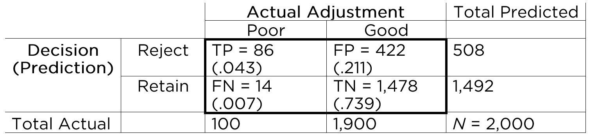
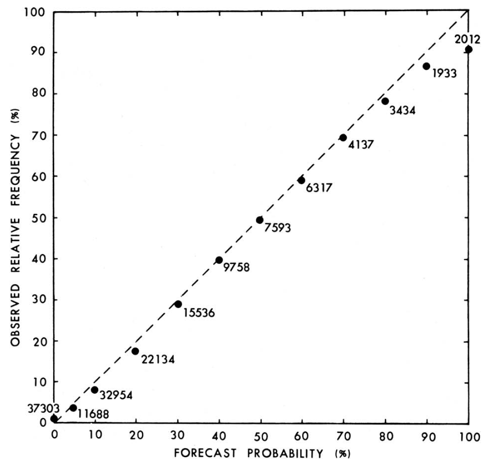
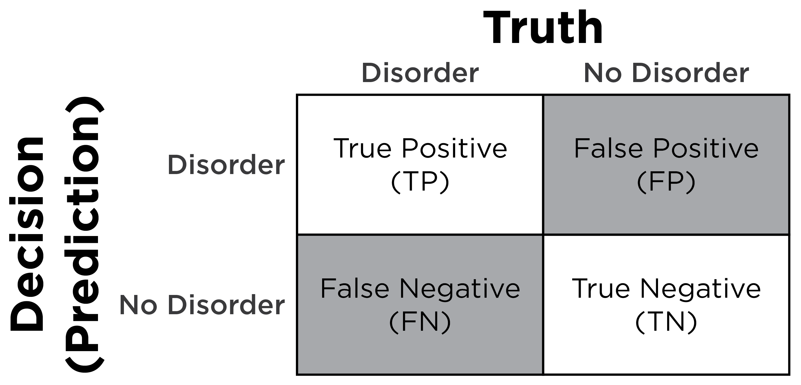

# Prediction {#prediction}

> It is very difficult to predict—especially the future.
>
> --- Neils Bohr

## Overview {#overview-prediction}

In psychology, we are often interested in predicting behavior.\index{prediction}
Behavior is complex.
The same behavior can occur for different reasons.
Behavior is probabilistically influenced by many processes, including processes internal to the person in addition to external processes.
Moreover, people's behavior occurs in the context of a dynamic system with nonlinear, probabilistic, and cascading influences that change across time.
The ever-changing system makes behavior challenging to predict.\index{prediction}
And, similar to chaos theory, one small change in the system can lead to large differences later on.

Predictions can come in different types.\index{prediction}
Some predictions involve categorical data, whereas other predictions involve continuous data.\index{prediction}
When dealing with categorical data, we can evaluate predictions using a 2-by-2 table known as a [confusion matrix](#confusionMatrix) (see Figure \@ref(fig:twoByTwoMatrix1)), or with logistic regression models.\index{confusion matrix}
When dealing with continuous data, we can evaluate predictions using multiple regression or similar variants such as [structural equation modeling](#sem) and [mixed models](#mixedModels).\index{multiple regression}\index{structural equation modeling}\index{mixed model}

Let's consider a prediction example, assuming the following probabilities:\index{prediction}

- The probability of contracting HIV is .3%
- The probability of a positive test for HIV is 1%
- The probability of a positive test if you have HIV is 95%

What is the probability of HIV if you have a positive test?\index{prediction}

As we will see, the probability is: $\frac{95\% \times .3\%}{1\%} = 28.5\%$.\index{prediction}
So based on the above probabilities, if you have a positive test, the probability that you have HIV is 28.5%.\index{prediction}
Most people tend to vastly overestimate the likelihood that the person has HIV in this example.
Why?
Because they do not pay enough attention to the [base rate](#baseRate) (in this example, the [base rate](#baseRate) of HIV is .3%).\index{base rate!neglect}

### Issues Around Probability {#probability}

#### Types of Probabilities {#probabilityTypes}

It is important to distinguish between different types of probabilities: marginal probabilities, joint probabilities, and conditional probabilities.\index{probability!types of}\index{probability!marginal}

##### Base rate (marginal probability) {#baseRate}

A *base rate* is the probability of an event.\index{base rate}
Base rates are marginal probabilities.\index{base rate}\index{probability!marginal}
A *marginal probability* is the probability of an event irrespective of the outcome of another variable.\index{probability!marginal}
For instance, we can consider the following marginal probabilities:\index{probability!marginal}

$P(C_i)$ is the probability (i.e., base rate) of a classification, $C$, independent of other things.\index{probability!marginal}
A base rate is often used as the "*prior probability*" in a Bayesian model.\index{base rate}
In our example above, $P(C_i)$ is the base rate (i.e., prevalence) of HIV in the population: $P(\text{HIV}) = .3\%$.\index{base rate}
$P(R_i)$ is the probability (base rate) of a response, $R$, independent of other things.\index{base rate}
In the example above, $P(R_i)$ is the base rate of a positive test for HIV: $P(\text{positive test}) = 1\%$.\index{base rate}
The base rate of a positive test is known as the *positivity rate* or [*selection ratio*](#selectionRatio).\index{base rate}\index{selection ratio}\index{positivity rate!zzzzz@\igobble|seealso{selection ratio}}

##### Joint probability {#jointProbability}

A *joint probability* is the probability of two (or more) events occurring simultaneously.\index{probability!joint}
For instance, the probability of events $A$ and $B$ both occurring together is $P(A, B)$.\index{probability!joint}
A joint probability can be calculated using the [marginal probability](#baseRate) of each event, as in Equation \@ref(eq:jointProbability):\index{probability!joint}\index{base rate}\index{probability!marginal}

\begin{equation}
P(A, B) = P(A) \cdot P(B)
(\#eq:jointProbability)
\end{equation}

Conversely (and rearranging the terms for the calculation of [conditional probability](#conditionalProbability)), a [joint probability](#jointProbability) can also be calculated using the [conditional probability](#conditionalProbability) and [marginal probability](#baseRate), as in Equation \@ref(eq:jointProbability2):\index{probability!joint}\index{base rate}\index{probability!marginal}\index{probability!conditional}

\begin{equation}
P(A, B) = P(A | B) \cdot P(B)
(\#eq:jointProbability2)
\end{equation}

##### Conditional probability {#conditionalProbability}

A *conditional probability* is the probability of one event occurring given the occurrence of another event.\index{probability!conditional}
Conditional probabilities are written as: $P(A | B)$.\index{probability!conditional}
This is read as the probability that event $A$ occurs given that event $B$ occurred.\index{probability!conditional}
For instance, we can consider the following conditional probabilities:\index{probability!conditional}

$P(C | R)$ is the probability of a classification, $C$, given a response, $R$.
In other words, $P(C | R)$ is the probability of having HIV given a positive test: $P(\text{HIV} | \text{positive test})$.\index{probability!conditional}
$P(R | C)$ is the probability of a response, $R$, given a classification, $C$.
In the example above, $P(R | C)$ is the probability of having a positive test given that a person has HIV: $P(\text{positive test} | \text{HIV}) = 95\%$.\index{probability!conditional}

A conditional probability can be calculated using the [joint probability](#jointProbability) and [marginal probability](#baseRate) (base rate), as in Equation \@ref(eq:conditionalProbability):\index{probability!joint}\index{base rate}\index{probability!marginal}\index{probability!conditional}

\begin{equation}
P(A | B) = \frac{P(A, B)}{P(B)}
(\#eq:conditionalProbability)
\end{equation}

#### Confusion of the Inverse {#inverseFallacy}

A [conditional probability](#conditionalProbability) is not the same thing as its reverse (or inverse) [conditional probability](#conditionalProbability).\index{probability!conditional}\index{confusion of the inverse}\index{probability!inverse conditional}
Unless the [base rate](#baseRate) of the two events ($C$ and $R$) are the same, $P(C | R) \neq P(R | C)$.\index{base rate}\index{probability!conditional}\index{confusion of the inverse}\index{probability!inverse conditional}
However, people frequently make the mistake of thinking that two inverse [conditional probabilities](#conditionalProbability) are the same.\index{probability!conditional}\index{confusion of the inverse}\index{probability!inverse conditional}
This mistake is known as the "confusion of the inverse", or the "inverse fallacy", or the "conditional probability fallacy".\index{probability!conditional}\index{confusion of the inverse}
The confusion of inverse probabilities is the logical error of representative thinking that leads people to assume that the probability of $C$ given $R$ is the same as the probability of $R$ given C, even though this is not true.\index{probability!conditional}\index{confusion of the inverse}\index{probability!inverse conditional}
As a few examples to demonstrate the logical fallacy, if 93% of breast cancers occur in high-risk women, this does not mean that 93% of high-risk women will eventually get breast cancer.\index{confusion of the inverse}\index{probability!inverse conditional}
As another example, if 77% of car accidents take place within 15 miles of a driver's home, this does not mean that you will get in an accident 77% of times you drive within 15 miles of your home.\index{confusion of the inverse}\index{probability!inverse conditional}

Which car is the most frequently stolen?\index{confusion of the inverse}
It is often the Honda Accord or Honda Civic—probably because they are among the most popular/commonly available cars.\index{confusion of the inverse}
The probability that the car is a Honda Accord given that a car was stolen ($p(\text{Honda Accord } | \text{ Stolen})$) is what the media reports and what the police care about.\index{confusion of the inverse}\index{probability!inverse conditional}
However, that is not what buyers and car insurance companies should care about.
Instead, they care about the probability that the car will be stolen given that it is a Honda Accord ($p(\text{Stolen } | \text{ Honda Accord})$).\index{confusion of the inverse}\index{probability!inverse conditional}

#### Bayes' Theorem {#bayesTheorem}

An alternative way of calculating a [conditional probability](#conditionalProbability) is using the inverse [conditional probability](#conditionalProbability) (instead of the [joint probability](#jointProbability)).\index{probability!conditional}\index{Bayesian!Bayes' theorem}
This is known as Bayes' theorem.\index{Bayesian!Bayes' theorem}
Bayes' theorem can help us calculate a [conditional probability](#conditionalProbability) of some classification, $C$, given some response, $R$, if we know the inverse [conditional probability](#conditionalProbability) and the [base rate](#baseRate) (marginal probability) of each.\index{Bayesian!Bayes' theorem}\index{probability!conditional}\index{probability!marginal}\index{base rate}
Bayes' theorem is in Equation \@ref(eq:bayes1):\index{Bayesian!Bayes' theorem}\index{probability!inverse conditional}

\begin{equation}
\begin{split}
  P(C | R) &= \frac{P(R | C) \cdot P(C_i)}{P(R_i)}
\end{split}
(\#eq:bayes1)
\end{equation}

Or, equivalently (rearranging the terms):\index{Bayesian!Bayes' theorem}

\begin{equation}
\frac{P(C | R)}{P(R | C)} = \frac{P(C_i)}{P(R_i)}
(\#eq:bayes2)
\end{equation}

Or, equivalently (rearranging the terms):\index{Bayesian!Bayes' theorem}

\begin{equation}
\frac{P(C | R)}{P(C_i)} = \frac{P(R | C)}{P(R_i)}
(\#eq:bayes3)
\end{equation}

More generally, Bayes' theorem has been described as:

\begin{equation}
\begin{split}
  P(H | E) &= \frac{P(E | H) \cdot P(H)}{P(E)} \\
  \text{posterior probability} &= \frac{\text{likelihood} \times \text{prior probability}}{\text{model evidence}} \\
\end{split}
(\#eq:bayes6)
\end{equation}

where $H$ is the hypothesis, and $E$ is the evidence—the new information that was not used in computing the prior probability.\index{Bayesian!Bayes' theorem}\index{probability!prior}

In Bayesian terms, the *posterior probability* is the conditional probability of one event occurring given another event—it is the updated probability after the evidence is considered.\index{Bayesian!Bayes' theorem}\index{probability!conditional}\index{probability!posterior}
In this case, the posterior probability is the probability of the classification occurring ($C$) given the response ($R$).\index{Bayesian!Bayes' theorem}\index{probability!conditional}\index{probability!posterior}
The *likelihood* is the inverse conditional probability—the probability of the response ($R$) occurring given the classification ($C$).\index{Bayesian!Bayes' theorem}\index{probability!conditional}\index{Bayesian!likelihood}
The *prior probability* is the marginal probability of the event (i.e., the classification) occurring, before we take into account any new information.\index{Bayesian!Bayes' theorem}\index{probability!prior}\index{probability!marginal}
The *model evidence* is the marginal probability of the other event occurring—i.e., the marginal probability of seeing the evidence.\index{Bayesian!Bayes' theorem}\index{Bayesian!Bayes' theorem}\index{probability!marginal}

In the HIV example above, we can calculate the [conditional probability](#conditionalProbability) of HIV given a positive test using three terms: the [conditional probability](#conditionalProbability) of a positive test given HIV (i.e., the sensitivity of the test), the [base rate](#baseRate) of HIV, and the [base rate](#baseRate) of a positive test for HIV.\index{Bayesian!Bayes' theorem}\index{probability!conditional}\index{probability!marginal}\index{base rate}\index{sensitivity}
The [conditional probability](#conditionalProbability) of HIV given a positive test is shown in Equation \@ref(eq:hivExample1):\index{Bayesian!Bayes' theorem}\index{probability!conditional}

\begin{equation}
\begin{split}
  P(C | R) &= \frac{P(R | C) \cdot P(C_i)}{P(R_i)} \\
  P(\text{HIV} | \text{positive test}) &= \frac{P(\text{positive test} | \text{HIV}) \cdot P(\text{HIV})}{P(\text{positive test})} \\
  &= \frac{\text{sensitivity of test} \times \text{base rate of HIV}}{\text{base rate of positive test}} \\
  &= \frac{95\% \times .3\%}{1\%} = \frac{.95 \times .003}{.01}\\
  &= 28.5\%
\end{split}
(\#eq:hivExample1)
\end{equation}

The `petersenlab` package [@R-petersenlab] contains the `pAgivenB()` function that estimates the probability of one event, $A$, given another event, $B$.\index{petersenlab package}\index{Bayesian!Bayes' theorem}

```{r}
pAgivenB(pBgivenA = .95, pA = .003, pB = .01)
```

Thus, assuming the probabilities in the example above, the [conditional probability](#conditionalProbability) of having HIV if a person has a positive test is 28.5%.\index{Bayesian!Bayes' theorem}\index{probability!conditional}
Given a positive test, chances are higher than not that the person does not have HIV.\index{Bayesian!Bayes' theorem}

Bayes' theorem can be depicted visually [@BallesterosPerez2018].\index{Bayesian!Bayes' theorem}
If we have 100,000 people in our population, we would be able to fill out a 2-by-2 [confusion matrix](#confusionMatrix), as depicted in Figure \@ref(fig:bayesTheorem2x2).\index{Bayesian!Bayes' theorem}\index{confusion matrix}

(ref:bayesTheorem2x2) [Confusion Matrix](#confusionMatrix): 2-by-2 Prediction Matrix. TP = true positives; TN = true negatives; FP = false positives; FN = false negatives; BR = base rate; SR = selection ratio.

```{r bayesTheorem2x2, out.width = "100%", fig.align = "center", fig.cap = "(ref:bayesTheorem2x2)", fig.scap = "Confusion Matrix: 2-by-2 Prediction Matrix.", echo = FALSE}
knitr::include_graphics("./Images/bayesTheorem2x2.png")
```

We know that .3% of the population contracts HIV, so 300 people in the population of 100,000 would contract HIV.\index{Bayesian!Bayes' theorem}
Therefore, we put 300 in the marginal sum of those with HIV ($.003 \times 100,000 = 300$), i.e., the [base rate](#baseRate) of HIV.\index{Bayesian!Bayes' theorem}\index{probability!conditional}\index{probability!marginal}\index{base rate}
That means 99,700 people do not contract HIV ($100,000 - 300 = 99,700$).\index{Bayesian!Bayes' theorem}\index{probability!conditional}\index{probability!marginal}\index{base rate}
We know that 1% of the population tests positive for HIV, so we put 1,000 in the marginal sum of those who test positive $.01 \times 100,000 = 1,000$, i.e., the [marginal probability](#baseRate) of a positive test (the [selection ratio](#selectionRatio)).\index{Bayesian!Bayes' theorem}\index{probability!conditional}\index{probability!marginal}\index{base rate}\index{selection ratio}
That means 99,000 people test negative for HIV ($100,000 - 1,000 = 99,000$).\index{Bayesian!Bayes' theorem}\index{probability!conditional}\index{probability!marginal}\index{base rate}
We also know that 95% of those who have HIV test positive for HIV.\index{Bayesian!Bayes' theorem}\index{probability!conditional}\index{probability!marginal}\index{base rate}
Three hundred people have HIV, so 95% of them (i.e., 285 people; $.95 \times 300 = 285$) tested positive for HIV ([true positives](#truePositive)).\index{Bayesian!Bayes' theorem}\index{probability!conditional}\index{probability!marginal}\index{base rate}\index{true positive}
Because we know that 300 people have HIV and that 285 of those with HIV tested positive, that means that 15 people with HIV tested negative ($300 - 15 = 285$; [false negatives](#falseNegative)).\index{Bayesian!Bayes' theorem}\index{probability!conditional}\index{probability!marginal}\index{base rate}\index{false negative}
We know that 1,000 people tested positive for HIV, and 285 with HIV tested positive, so that means that 715 people without HIV tested positive ($1,000 - 285 = 715$; [false positives](#falsePositive)).\index{Bayesian!Bayes' theorem}\index{probability!conditional}\index{probability!marginal}\index{base rate}\index{false positive}
We know that 99,000 people tested negative for HIV, and 15 with HIV tested negative, so that means that 98,985 people without HIV tested negative ($99,000 - 15 = 98,985$; [true negatives](#trueNegative)).\index{Bayesian!Bayes' theorem}\index{probability!conditional}\index{probability!marginal}\index{base rate}\index{true negative}
So, to answer the question of what is the probability of having HIV if you have a positive test, we divide the number of people with HIV who had a positive test (285) by the total number of people who had a positive test (1000), which leads to a probability of 28.5%.\index{Bayesian!Bayes' theorem}\index{probability!conditional}\index{probability!marginal}\index{base rate}

This can be depicted visually in Figures \@ref(fig:bayesTheorem1) and \@ref(fig:bayesTheorem2).^[Please note that the areas in the figure are not drawn to scale; otherwise, some regions would be too small to include text.]

(ref:bayesTheorem1) Bayes' Theorem (and [Confusion Matrix](#confusionMatrix)) Depicted Visually, where the Marginal Probability is the [Base Rate](#baseRate) (BR). The four boxes represent the number of [true positives](#truePositive) (TP), [true negatives](#trueNegative) (TN), [false positives](#falsePositive) (FP), and [false negatives](#falseNegative) (FN). Note: Boxes are not drawn to scale; otherwise, some regions would be too small to include text.

```{r bayesTheorem1, out.width = "100%", fig.align = "center", fig.cap = "(ref:bayesTheorem1)", fig.scap = "Bayes' Theorem (and Confusion Matrix) Depicted Visually, Where the Marginal Probability is the Base Rate.", echo = FALSE}
knitr::include_graphics("./Images/bayesTheorem1.png")
```

(ref:bayesTheorem2) Bayes' Theorem (and [Confusion Matrix](#confusionMatrix)) Depicted Visually, where the Marginal Probability is the [Selection Ratio](#selectionRatio) (SR). The four boxes represent the number of [true positives](#truePositive) (TP), [true negatives](#trueNegative) (TN), [false positives](#falsePositive) (FP), and [false negatives](#falseNegative) (FN). Note: Boxes are not drawn to scale; otherwise, some regions would be too small to include text.

```{r bayesTheorem2, out.width = "100%", fig.align = "center", fig.cap = "(ref:bayesTheorem2)", fig.scap = "Bayes' Theorem (and Confusion Matrix) Depicted Visually, where the Marginal Probability is the Selection Ratio.", echo = FALSE}
knitr::include_graphics("./Images/bayesTheorem2.png")
```

Now let's see what happens if the person tests positive a second time.
We would revise our "[prior probability](#baseRate)" for HIV from the general prevalence in the population (0.3%) to be the "posterior probability" of HIV given a first positive test (28.5%).\index{Bayesian!Bayes' theorem}\index{probability!conditional}\index{probability!marginal}\index{base rate}\index{probability!prior}\index{probability!posterior}\index{Bayesian!updating}
This is known as [*Bayesian updating*](#bayesianUpdating).\index{Bayesian!updating}
We would also update the "evidence" to be the [marginal probability](#baseRate) of getting a second positive test.\index{Bayesian!Bayes' theorem}\index{probability!conditional}\index{probability!marginal}\index{base rate}

If we do not know a [marginal probability](#baseRate) (i.e., base rate) of an event (e.g., getting a second positive test), we can calculate a [marginal probability](#baseRate) with the *law of total probability* using [conditional probabilities](#conditionalProbability) and the [marginal probability](#baseRate) of another event (e.g., having HIV).\index{Bayesian!Bayes' theorem}\index{probability!conditional}\index{probability!marginal}\index{base rate}\index{law of total probability}
According to the law of total probability, the probability of getting a positive test is the probability that a person with HIV gets a positive test (i.e., [sensitivity](#sensitivity)) times the base rate of HIV plus the probability that a person without HIV gets a positive test (i.e., [false positive rate](#falsePositiveRate)) times the [base rate](#baseRate) of not having HIV, as in Equation \@ref(eq:lawOfTotalProbability):\index{Bayesian!Bayes' theorem}\index{probability!conditional}\index{probability!marginal}\index{base rate}\index{law of total probability}\index{sensitivity}\index{false positive!rate}

\begin{equation}
\begin{split}
 P(\text{not } C_i) &= 1 - P(C_i) \\
  P(R_i) &= P(R | C) \cdot P(C_i) + P(R | \text{not } C) \cdot P(\text{not } C_i) \\
  1\% &= 95\% \times .3\% + P(R | \text{not } C) \times 99.7\%
\end{split}
(\#eq:lawOfTotalProbability)
\end{equation}

In this case, we know the [marginal probability](#baseRate) ($P(R_i)$), and we can use that to solve for the unknown [conditional probability](#conditionalProbability) that reflects the [false positive rate](#falsePositiveRate) ($P(R | \text{not } C)$), as in Equation \@ref(eq:conditionalProbabilityRevised):\index{Bayesian!Bayes' theorem}\index{probability!conditional}\index{probability!marginal}\index{base rate}\index{false positive!rate}

\tiny
\begin{align}
  P(R_i) &= P(R | C) \cdot P(C_i) + P(R | \text{not } C) \cdot P(\text{not } C_i) && \notag \\
  P(R_i) - [P(R | \text{not } C) \cdot P(\text{not } C_i)] &= P(R | C) \cdot P(C_i) && \text{Move } P(R | \text{not } C) \text{ to the left side} \notag \\
  - [P(R | \text{not } C) \cdot P(\text{not } C_i)] &= P(R | C) \cdot P(C_i) - P(R_i) && \text{Move } P(R_i) \text{ to the right side} \notag \\
  P(R | \text{not } C) \cdot P(\text{not } C_i) &= P(R_i) - [P(R | C) \cdot P(C_i)] && \text{Multiply by } -1 \notag \\
  P(R | \text{not } C) &= \frac{P(R_i) - [P(R | C) \cdot P(C_i)]}{P(\text{not } C_i)} && \text{Divide by } P(R | \text{not } C) (\#eq:conditionalProbabilityRevised) \\
  &= \frac{1\% - [95\% \times .3\%]}{99.7\%} = \frac{.01 - [.95 \times .003]}{.997}  \notag \\
  &= .7171515\%  \notag
\end{align}
\normalsize

The `petersenlab` package [@R-petersenlab] contains the `pBgivenNotA()` function that estimates the probability of one event, $B$, given that another event, $A$, did not occur.\index{petersenlab package}\index{Bayesian!Bayes' theorem}

```{r}
pBgivenNotA(pBgivenA = .95, pA = .003, pB = .01)
```

With this [conditional probability](#conditionalProbability) ($P(R | \text{not } C)$), the updated [marginal probability](#baseRate) of having HIV ($P(C_i)$), and the updated marginal probability of not having HIV ($P(\text{not } C_i)$), we can now calculate an updated estimate of the [marginal probability](#baseRate) of getting a second positive test.\index{Bayesian!Bayes' theorem}\index{probability!conditional}\index{probability!marginal}\index{base rate}\index{false positive!rate}
The probability of getting a second positive test is the probability that a person with HIV gets a second positive test (i.e., [sensitivity](#sensitivity)) times the updated probability of HIV plus the probability that a person without HIV gets a second positive test (i.e., [false positive rate](#falsePositiveRate)) times the updated probability of not having HIV, as in Equation \@ref(eq:baseRateUpdated):\index{Bayesian!Bayes' theorem}\index{probability!conditional}\index{probability!marginal}\index{base rate}\index{sensitivity}\index{false positive!rate}

\begin{equation}
\begin{split}
  P(R_{i}) &= P(R | C) \cdot P(C_i) + P(R | \text{not } C) \cdot P(\text{not } C_i) \\
  &= 95\% \times 28.5\% + .7171515\% \times 71.5\% = .95 \times .285 + .007171515 \times .715 \\
  &= 27.58776\%
\end{split}
(\#eq:baseRateUpdated)
\end{equation}

The `petersenlab` package [@R-petersenlab] contains the `pB()` function that estimates the marginal probability of one event, $B$.\index{petersenlab package}\index{Bayesian!Bayes' theorem}

```{r}
pB(pBgivenA = .95, pA = .285, pBgivenNotA = .007171515)

pB(
  pBgivenA = .95,
  pA = pAgivenB(
    pBgivenA = .95,
    pA = .003,
    pB = .01),
  pBgivenNotA = pBgivenNotA(
    pBgivenA = .95,
    pA = .003,
    pB = .01))
```

We then substitute the updated [marginal probability](#baseRate) of HIV ($P(C_i)$) and the updated [marginal probability](#baseRate) of getting a second positive test ($P(R_i)$) into Bayes' theorem to get the probability that the person has HIV if they have a second positive test (assuming the [errors](#measurementError) of each test are independent, i.e., uncorrelated), as in Equation \@ref(eq:baseRateUpdated2):\index{Bayesian!Bayes' theorem}\index{probability!conditional}\index{probability!marginal}\index{base rate}

\begin{equation}
\begin{split}
  P(C | R) &= \frac{P(R | C) \cdot P(C_i)}{P(R_i)} \\
  P(\text{HIV} | \text{a second positive test}) &= \frac{P(\text{a second positive test} | \text{HIV}) \cdot P(\text{HIV})}{P(\text{a second positive test})} \\
  &= \frac{\text{sensitivity of test} \times \text{updated base rate of HIV}}{\text{updated base rate of positive test}} \\
  &= \frac{95\% \times 28.5\%}{27.58776\%} \\
  &= 98.14\%
\end{split}
(\#eq:baseRateUpdated2)
\end{equation}

```{r}
pAgivenB(pBgivenA = .95, pA = .285, pB = .2758776)

pAgivenB(
  pBgivenA = .95,
  pA = pAgivenB(
    pBgivenA = .95,
    pA = .003,
    pB = .01),
  pB = pB(
    pBgivenA = .95,
    pA = pAgivenB(
      pBgivenA = .95,
      pA = .003,
      pB = .01),
    pBgivenNotA = pBgivenNotA(
      pBgivenA = .95,
      pA = .003,
      pB = .01)))
```

Thus, a second positive test greatly increases the posterior probability that the person has HIV from 28.5% to over 98%.\index{Bayesian!Bayes' theorem}\index{probability!conditional}\index{probability!marginal}\index{base rate}\index{probability!posterior}

As seen in the rearranged formula in Equation \@ref(eq:bayes2), the ratio of the [conditional probabilities](#conditionalProbability) is equal to the ratio of the [base rates](#baseRate).\index{Bayesian!Bayes' theorem}\index{probability!conditional}\index{probability!marginal}\index{base rate}
Thus, it is important to consider [base rates](#baseRate).\index{Bayesian!Bayes' theorem}\index{probability!conditional}\index{probability!marginal}\index{base rate}
People have a strong tendency to ignore (or give insufficient weight to) [base rates](#baseRate) when making predictions.\index{base rate!neglect}
The failure to consider the [base rate](#baseRate) when making predictions when given specific information about a case is a cognitive bias known as the [base-rate](#baseRate) fallacy or as [base rate](#baseRate) neglect.\index{base rate!neglect}
For example, people tend to say that the probability of a rare event is more likely than it actually is given specific information.\index{base rate!neglect}

As seen in the rearranged formula in Equation \@ref(eq:bayes3), the inverse [conditional probabilities](#conditionalProbability) ($P(C | R)$ and $P(R | C)$) are not equal unless the [base rates](#baseRate) of $C$ and $R$ are the same.\index{Bayesian!Bayes' theorem}\index{probability!conditional}\index{probability!marginal}\index{base rate}\index{probability!inverse conditional}
If the [base rates](#baseRate) are not equal, we are making at least some prediction errors.\index{base rate}\index{prediction!prediction error}
If $P(C_i) > P(R_i)$, our predictions must include some [false negatives](#falseNegative).\index{base rate}\index{false negative}
If $P(R_i) > P(C_i)$, our predictions must include some [false positives](#falsePositive).\index{base rate}\index{false positive}

Using the law of total probability, we can substitute the calculation of the [marginal probability](#baseRate) ($P(R_i)$) into Bayes' theorem to get an alternative formulation of Bayes' theorem, as in Equation \@ref(eq:baseRateUpdated3):\index{Bayesian!Bayes' theorem}\index{probability!conditional}\index{probability!marginal}\index{base rate}\index{law of total probability}

\begin{equation}
\begin{split}
  P(C | R) &= \frac{P(R | C) \cdot P(C_i)}{P(R_i)} \\
  &= \frac{P(R | C) \cdot P(C_i)}{P(R | C) \cdot P(C_i) + P(R | \text{not } C) \cdot P(\text{not } C_i)} \\
  &= \frac{P(R | C) \cdot P(C_i)}{P(R | C) \cdot P(C_i) + P(R | \text{not } C) \cdot [1 - P(C_i)]}
\end{split}
(\#eq:baseRateUpdated3)
\end{equation}

Instead of using [marginal probability](#baseRate) ([base rate](#baseRate)) of $R$, as in the original formulation of Bayes' theorem, it uses the [conditional probability](#conditionalProbability), $P(R|\text{not } C)$.\index{Bayesian!Bayes' theorem}\index{probability!conditional}\index{probability!marginal}\index{base rate}
Thus, it uses three terms: two [conditional probabilities](#conditionalProbability)—$P(R|C)$ and $P(R|\text{not } C)$—and one [marginal probability](#baseRate), $P(C_i)$.\index{Bayesian!Bayes' theorem}\index{probability!conditional}\index{probability!marginal}\index{base rate}
This alternative formulation of Bayes' theorem can be used to calculate [positive predictive value](#ppv), based on [sensitivity](#sensitivity), [specificity](#specificity), and the [base rate](#baseRate), as presented in Equation \@ref(eq:positivePredictiveValue).\index{Bayesian!Bayes' theorem}\index{positive predictive value}\index{sensitivity}\index{base rate}

Let us see how the alternative formulation of Bayes' theorem applies to the HIV example above.\index{Bayesian!Bayes' theorem}
We can calculate the probability of HIV given a positive test using three terms: the [conditional probability](#conditionalProbability) that a person with HIV gets a positive test (i.e., [sensitivity](#sensitivity)), the [conditional probability](#conditionalProbability) that a person without HIV gets a positive test (i.e., [false positive rate](#falsePositiveRate)), and the [base rate](#baseRate) of HIV.\index{Bayesian!Bayes' theorem}\index{probability!conditional}\index{probability!marginal}\index{base rate}\index{sensitivity}\index{false positive!rate}
Using the $P(R|\text{not } C)$ calculated in Equation \@ref(eq:conditionalProbabilityRevised), the [conditional probability](#conditionalProbability) of HIV given a single positive test is shown in Equation \@ref(eq:bayes4):\index{Bayesian!Bayes' theorem}\index{probability!conditional}

\tiny
\begin{equation}
\begin{split}
  P(C | R) &= \frac{P(R | C) \cdot P(C_i)}{P(R | C) \cdot P(C_i) + P(R | \text{not } C) \cdot [1 - P(C_i)]} \\
  &= \frac{\text{sensitivity of test} \times \text{base rate of HIV}}{\text{sensitivity of test} \times \text{base rate of HIV} + \text{false positive rate of test} \times (1 - \text{base rate of HIV})} \\
  &= \frac{95\% \times .3\%}{95\% \times .3\% + .7171515\% \times (1 - .3\%)} = \frac{.95 \times .003}{.95 \times .003 + .007171515 \times (1 - .003)}\\
  &= 28.5\%
\end{split}
(\#eq:bayes4)
\end{equation}
\normalsize

```{r}
pAgivenB(pBgivenA = .95, pA = .003, pBgivenNotA = .007171515)
pAgivenB(
  pBgivenA = .95,
  pA = .003,
  pBgivenNotA = pBgivenNotA(
    pBgivenA = .95,
    pA = .003,
    pB = .01))
```

To calculate the [conditional probability](#conditionalProbability) of HIV given a second positive test, we update our priors because the person has now tested positive for HIV.\index{Bayesian!Bayes' theorem}\index{probability!conditional}\index{probability!prior}
We update the [prior probability](#baseRate) of HIV ($P(C_i)$) based on the posterior probability of HIV after a positive test ($P(C | R)$) that we calculated above.\index{Bayesian!Bayes' theorem}\index{probability!conditional}\index{probability!prior}\index{probability!posterior}
We can calculate the [conditional probability](#conditionalProbability) of HIV given a second positive test using three terms: the [conditional probability](#conditionalProbability) that a person with HIV gets a positive test (i.e., [sensitivity](#sensitivity); which stays the same), the [conditional probability](#conditionalProbability) that a person without HIV gets a positive test (i.e., [false positive rate](#falsePositiveRate); which stays the same), and the updated [marginal probability](#baseRate) of HIV.\index{Bayesian!Bayes' theorem}\index{probability!conditional}\index{probability!marginal}\index{base rate}\index{sensitivity}\index{false positive!rate}
The [conditional probability](#conditionalProbability) of HIV given a second positive test is shown in Equation \@ref(eq:baseRateUpdated4):\index{Bayesian!Bayes' theorem}\index{probability!conditional}

\tiny
\begin{equation}
\begin{split}
  P(C | R) &= \frac{P(R | C) \cdot P(C_i)}{P(R | C) \cdot P(C_i) + P(R | \text{not } C) \cdot [1 - P(C_i)]} \\
  &= \frac{\text{sensitivity of test} \times \text{updated base rate of HIV}}{\text{sensitivity of test} \times \text{updated base rate of HIV} + \text{false positive rate of test} \times (1 - \text{updated base rate of HIV})} \\
  &= \frac{95\% \times 28.5\%}{95\% \times 28.5\% + .7171515\% \times (1 - 28.5\%)} = \frac{.95 \times .285}{.95 \times .285 + .007171515 \times (1 - .285)}\\
  &= 98.14\%
\end{split}
(\#eq:baseRateUpdated4)
\end{equation}
\normalsize

```{r}
pAgivenB(
  pBgivenA = .95,
  pA = .285,
  pBgivenNotA = .007171515)

pAgivenB(
  pBgivenA = .95,
  pA = .285,
  pBgivenNotA = pBgivenNotA(
    pBgivenA = .95,
    pA = .003,
    pB = .01))
```

If we want to compare the relative probability of two outcomes, we can use the odds form of Bayes' theorem, as in Equation \@ref(eq:bayes5):\index{Bayesian!Bayes' theorem}

\begin{equation}
\begin{split}
  P(C | R) &= \frac{P(R | C) \cdot P(C_i)}{P(R_i)} \\
  P(\text{not } C | R) &= \frac{P(R | \text{not } C) \cdot P(\text{not } C_i)}{P(R_i)} \\
  \frac{P(C | R)}{P(\text{not } C | R)} &= \frac{\frac{P(R | C) \cdot P(C_i)}{P(R_i)}}{\frac{P(R | \text{not } C) \cdot P(\text{not } C_i)}{P(R_i)}} \\
  &= \frac{P(R | C) \cdot P(C_i)}{P(R | \text{not } C) \cdot P(\text{not } C_i)} \\
  &= \frac{P(C_i)}{P(\text{not } C_i)} \times \frac{P(R | C)}{P(R | \text{not } C)} \\
  \text{posterior odds} &= \text{prior odds} \times \text{likelihood ratio}
\end{split}
(\#eq:bayes5)
\end{equation}

In sum, the [marginal probability](#baseRate), including the [prior probability](#baseRate) or [base rate](#baseRate), should be weighed heavily in predictions unless there are sufficient data to indicate otherwise, i.e., to update the posterior probability based on new evidence.\index{Bayesian!Bayes' theorem}\index{probability!conditional}\index{probability!marginal}\index{base rate}\index{probability!prior}\index{probability!posterior}
Bayes' theorem provides a powerful tool to anchor predictions to the [base rate](#baseRate) unless sufficient evidence changes the posterior probability (by updating the evidence and [prior probability](#baseRate)).\index{Bayesian!Bayes' theorem}\index{probability!conditional}\index{probability!marginal}\index{base rate}\index{probability!prior}\index{probability!posterior}

### Prediction Accuracy {#predictionAccuracy-overview}

#### Decision Outcomes {#decisionOutcomes-overview}

To consider how we can evaluate the accuracy of predictions, consider an example adapted from @Meehl1955.
The military conducts a test of its prospective members to screen out applicants who would likely fail basic training.
To evaluate the accuracy of our predictions using the test, we can examine a [confusion matrix](#confusionMatrix).\index{confusion matrix}
A [confusion matrix](#confusionMatrix) is a matrix that presents the predicted outcome on one dimension and the actual outcome (truth) on the other dimension.\index{confusion matrix}
If the predictions and outcomes are dichotomous, the [confusion matrix](#confusionMatrix) is a 2-by-2 matrix with two rows and two columns that represent four possible predicted-actual combinations (decision outcomes): [true positives](#truePositive) (TP), [true negatives](#trueNegative) (TN), [false positives](#falsePositive) (FP), and [false negatives](#falseNegative) (FN).\index{confusion matrix}\index{true positive}\index{true negative}\index{false positive}\index{false negative}

When discussing the four decision outcomes, "true" means an accurate judgment, whereas "false" means an inaccurate judgment.\index{confusion matrix}\index{true positive}\index{true negative}\index{false positive}\index{false negative}
"Positive" means that the judgment was that the person has the characteristic of interest, whereas "negative" means that the judgment was that the person does not have the characteristic of interest.\index{confusion matrix}\index{true positive}\index{true negative}\index{false positive}\index{false negative}
A *true positive* is a correct judgment (or prediction) where the judgment was that the person has (or will have) the characteristic of interest, and, in truth, they actually have (or will have) the characteristic.\index{confusion matrix}\index{true positive}
A *true negative* is a correct judgment (or prediction) where the judgment was that the person does not have (or will not have) the characteristic of interest, and, in truth, they actually do not have (or will not have) the characteristic.\index{confusion matrix}\index{true negative}
A *false positive* is an incorrect judgment (or prediction) where the judgment was that the person has (or will have) the characteristic of interest, and, in truth, they actually do not have (or will not have) the characteristic.\index{confusion matrix}\index{false positive}
A *false negative* is an incorrect judgment (or prediction) where the judgment was that the person does not have (or will not have) the characteristic of interest, and, in truth, they actually do have (or will have) the characteristic.\index{confusion matrix}\index{false negative}

An example of a [confusion matrix](#confusionMatrix) is shown in Figure \@ref(fig:twoByTwoMatrix1).\index{confusion matrix}

(ref:twoByTwoMatrix1) [Confusion Matrix](#confusionMatrix): 2-by-2 Prediction Matrix. TP = true positives; TN = true negatives; FP = false positives; FN = false negatives.

```{r twoByTwoMatrix1, out.width = "80%", fig.align = "center", fig.cap = "(ref:twoByTwoMatrix1)", fig.scap = "Confusion Matrix: 2-by-2 Prediction Matrix.", echo = FALSE}
knitr::include_graphics("./Images/2x2-Matrix_2a.png")
```

With the information in the [confusion matrix](#confusionMatrix), we can calculate the marginal sums and the proportion of people in each cell (in parentheses), as depicted in Figure \@ref(fig:twoByTwoMatrix2).\index{confusion matrix}

(ref:twoByTwoMatrix2) [Confusion Matrix](#confusionMatrix): 2-by-2 Prediction Matrix with Marginal Sums. TP = true positives; TN = true negatives; FP = false positives; FN = false negatives.

```{r twoByTwoMatrix2, out.width = "100%", fig.align = "center", fig.cap = "(ref:twoByTwoMatrix2)", fig.scap = "Confusion Matrix: 2-by-2 Prediction Matrix with Marginal Sums.", echo = FALSE}

```

That is, we can sum across the rows and columns to identify how many people actually showed poor adjustment ($n = 100$) versus good adjustment ($n = 1,900$), and how many people were selected to reject ($n = 508$) versus retain ($n = 1,492$).\index{confusion matrix}
If we sum the column of predicted marginal sums ($508 + 1,492$) or the row of actual marginal sums ($100 + 1,900$), we get the total number of people ($N = 2,000$).\index{confusion matrix}

Based on the marginal sums, we can compute the [marginal probabilities](#baseRate), as depicted in Figure \@ref(fig:twoByTwoMatrix3).\index{confusion matrix}\index{probability!marginal}\index{base rate}

(ref:twoByTwoMatrix3) [Confusion Matrix](#confusionMatrix): 2-by-2 Prediction Matrix with Marginal Sums and Marginal Probabilities. TP = true positives; TN = true negatives; FP = false positives; FN = false negatives; BR = base rate; SR = selection ratio.

```{r twoByTwoMatrix3, out.width = "100%", fig.align = "center", fig.cap = "(ref:twoByTwoMatrix3)", fig.scap = "Confusion Matrix: 2-by-2 Prediction Matrix with Marginal Sums and Marginal Probabilities.", echo = FALSE}
knitr::include_graphics("./Images/2x2-Matrix_2c.png")
```

The [marginal probability](#baseRate) of the person having the characteristic of interest (i.e., showing poor adjustment) is called the [*base rate*](#baseRate) (BR).\index{confusion matrix}\index{probability!marginal}\index{base rate}
That is, the [base rate](#baseRate) is the proportion of people who have the characteristic.\index{base rate}
It is calculated by dividing the number of people with poor adjustment ($n = 100$) by the total number of people ($N = 2,000$): $BR = \frac{FN + TP}{N}$.\index{confusion matrix}\index{probability!marginal}\index{base rate}
Here, the [base rate](#baseRate) reflects the prevalence of poor adjustment.
In this case, the [base rate](#baseRate) is .05, so there is a 5% chance that an applicant will be poorly adjusted.\index{confusion matrix}\index{probability!marginal}\index{base rate}
The [marginal probability](#baseRate) of good adjustment is equal to 1 minus the [base rate](#baseRate) of poor adjustment.\index{confusion matrix}\index{probability!marginal}\index{base rate}

The [marginal probability](#baseRate) of predicting that a person has the characteristic (i.e., rejecting a person) is called the [*selection ratio*](#selectionRatio) (SR).\index{confusion matrix}\index{probability!marginal}\index{selection ratio}
The [selection ratio](#selectionRatio) is the proportion of people who will be selected (in this case, rejected rather than retained); i.e., the proportion of people who are identified as having the characteristic.\index{confusion matrix}\index{probability!marginal}\index{selection ratio}
The [selection ratio](#selectionRatio) is calculated by dividing the number of people selected to reject ($n = 508$) by the total number of people ($N = 2,000$): $SR = \frac{TP + FP}{N}$.\index{confusion matrix}\index{probability!marginal}\index{selection ratio}
In this case, the [selection ratio](#selectionRatio) is .25, so 25% of people are rejected.\index{confusion matrix}\index{probability!marginal}\index{selection ratio}
The [marginal probability](#baseRate) of not selecting someone to reject (i.e., the [marginal probability](#baseRate) of retaining) is equal to 1 minus the [selection ratio](#selectionRatio).\index{confusion matrix}\index{probability!marginal}\index{selection ratio}

The [selection ratio](#selectionRatio) might be something that the test dictates according to its cutoff score.\index{confusion matrix}\index{probability!marginal}\index{selection ratio}
Or, the [selection ratio](#selectionRatio) might be imposed by external factors that place limits on how many people you can assign a positive test value.\index{confusion matrix}\index{probability!marginal}\index{selection ratio}
For instance, when deciding whether to treat a client, the [selection ratio](#selectionRatio) may depend on how many therapists are available and how many cases can be treated.\index{confusion matrix}\index{probability!marginal}\index{selection ratio}

#### Percent Accuracy {#percentAccuracy-overview}

Based on the [confusion matrix](#confusionMatrix), we can calculate the prediction accuracy based on the [percent accuracy](#percentAccuracy) of the predictions.\index{confusion matrix}\index{percent accuracy}
The [percent accuracy](#percentAccuracy) is the number of correct predictions divided by the total number of predictions, and multiplied by 100.\index{confusion matrix}\index{percent accuracy}
In the context of a [confusion matrix](#confusionMatrix), this is calculated as: $100\% \times \frac{\text{TP} + \text{TN}}{N}$.\index{confusion matrix}\index{percent accuracy}
In this case, our [percent accuracy](#percentAccuracy) was 78%—that is, 78% of our predictions were accurate, and 22% of our predictions were inaccurate.\index{confusion matrix}\index{percent accuracy}

#### Percent Accuracy by Chance {#accuracyByChance}

Seventy-eight percent sounds pretty accurate.\index{confusion matrix}\index{percent accuracy}\index{percent accuracy!by chance}
And it is much higher than 50%, so we are doing a pretty good job, right?\index{confusion matrix}\index{percent accuracy}\index{percent accuracy!by chance}
Well, it is important to compare our accuracy to what accuracy we would expect to get by chance alone, if predictions were made by a random process rather than using a test's scores.\index{confusion matrix}\index{percent accuracy}\index{percent accuracy!by chance}
Our [selection ratio](#selectionRatio) was 25.4%.\index{confusion matrix}\index{percent accuracy}\index{percent accuracy!by chance}\index{selection ratio}
How accurate would we be if we randomly selected 25.4% of people to reject?\index{confusion matrix}\index{percent accuracy}\index{percent accuracy!by chance}
To determine what accuracy we could get by chance alone given the [selection ratio](#selectionRatio) and the base rate, we can calculate the chance probability of [true positives](#truePositive) and the chance probability of [true negatives](#trueNegative).\index{confusion matrix}\index{percent accuracy}\index{percent accuracy!by chance}\index{selection ratio}\index{true positive}\index{true negative}
The probability of a given cell in the [confusion matrix](#confusionMatrix) is a [joint probability](#jointProbability)—the probability of two events occurring simultaneously.\index{confusion matrix}\index{probability!joint}\index{percent accuracy!by chance}
To calculate a [joint probability](#jointProbability), we multiply the probability of each event.\index{confusion matrix}\index{probability!joint}\index{percent accuracy!by chance}

So, to get the chance expectancies of [true positives](#truePositive), we would multiply the respective [marginal probabilities](#baseRate), as in Equation \@ref(eq:truePositivesByChanceExample):\index{confusion matrix}\index{probability!joint}\index{probability!marginal}\index{true positive}\index{percent accuracy!by chance}

\begin{equation}
\begin{split}
  P(TP) &= P(\text{Poor adjustment}) \times P(\text{Reject})\\
   &= BR \times SR \\
  &= .05 \times .254 \\
  &= .0127
\end{split}
(\#eq:truePositivesByChanceExample)
\end{equation}

To get the chance expectancies of [true negatives](#trueNegative), we would multiply the respective [marginal probabilities](#baseRate), as in Equation \@ref(eq:trueNegativesByChanceExample):\index{confusion matrix}\index{probability!joint}\index{probability!marginal}\index{true negative}\index{percent accuracy!by chance}

\begin{equation}
\begin{split}
  P(TN) &= P(\text{Good adjustment}) \times P(\text{Retain})\\
   &= (1 - BR) \times (1 - SR) \\
  &= .95 \times .746 \\
  &= .7087
\end{split}
(\#eq:trueNegativesByChanceExample)
\end{equation}

To get the [percent accuracy by chance](#percentAccuracyByChance), we sum the chance expectancies for the correct predictions ([TP](#truePositive) and [TN](#trueNegative)): $.0127 + .7087 = .7214$.\index{confusion matrix}\index{probability!joint}\index{probability!marginal}\index{true positive}\index{true negative}\index{percent accuracy!by chance}
Thus, the [percent accuracy you can get by chance alone](#percentAccuracyByChance) is 72%.\index{confusion matrix}\index{percent accuracy!by chance}
This is because most of our predictions are to retain people, and the [base rate](#baseRate) of poor adjustment is quite low (.05).\index{confusion matrix}\index{percent accuracy!by chance}\index{base rate}
Our measure with 78% [accuracy](#percentAccuracy) provides only a 6% increment in correct predictions.\index{confusion matrix}\index{percent accuracy}\index{percent accuracy!by chance}
Thus, you cannot judge how good your judgment or prediction is until you know how you would do by random chance.\index{confusion matrix}\index{percent accuracy!by chance}

The chance expectancies for each cell of the [confusion matrix](#confusionMatrix) are shown in Figure \@ref(fig:twoByTwoMatrix4).\index{confusion matrix}\index{percent accuracy!by chance}

```{r twoByTwoMatrix4, out.width = "80%", fig.align = "center", fig.cap = "Chance Expectancies in 2-by-2 Prediction Matrix. TP = true positives; TN = true negatives; FP = false positives; FN = false negatives; BR = base rate; SR = selection ratio.", fig.scap = "Chance Expectancies in 2-by-2 Prediction Matrix.", echo = FALSE}
knitr::include_graphics("./Images/2x2-Matrix_2d.png")
```

#### Predicting from the Base Rate {#predictingFromBaseRate}

Now, let us consider how well you would do if you were to predict from the [base rate](#baseRate).\index{base rate}\index{base rate!predicting from}
Predicting from the [base rate](#baseRate) is also called "betting from the [base rate](#baseRate)", and it involves setting the [selection ratio](#selectioNRatio) by taking advantage of the [base rate](#baseRate) so that you go with the most likely outcome in every prediction.\index{base rate}\index{base rate!predicting from}\index{selection ratio}
Because the [base rate](#baseRate) is quite low (.05), we could predict from the [base rate](#baseRate) by selecting no one to reject (i.e., setting the [selection ratio](#selectionRatio) at zero).\index{base rate}\index{base rate!predicting from}\index{selection ratio}
Our [percent accuracy by chance](#percentAccuracyByChance) if we predict from the [base rate](#baseRate) would be calculated by multiplying the [marginal probabilities](#baseRate), as we did above, but with a new [selection ratio](#selectionRatio), as in Equation \@ref(eq:predictingFromBaseRateExample):\index{confusion matrix}\index{base rate}\index{base rate!predicting from}\index{selection ratio}\index{percent accuracy!by chance}

\begin{equation}
\begin{split}
  P(TP) &= P(\text{Poor adjustment}) \times P(\text{Reject})\\
   &= BR \times SR \\
  &= .05 \times 0 \\
  &= 0 \\ \\
  P(TN) &= P(\text{Good adjustment}) \times P(\text{Retain})\\
   &= (1 - BR) \times (1 - SR) \\
  &= .95 \times 1 \\
  &= .95
\end{split}
(\#eq:predictingFromBaseRateExample)
\end{equation}

We sum the chance expectancies for the correct predictions ([TP](#truePositive) and [TN](#trueNegative)): $0 + .95 = .95$.\index{confusion matrix}\index{base rate}\index{base rate!predicting from}\index{selection ratio}\index{percent accuracy!by chance}\index{true positive}\index{true negative}
Thus, our [percent accuracy](#percentAccuracy) by predicting from the [base rate](#baseRate) is 95%.\index{confusion matrix}\index{base rate}\index{base rate!predicting from}\index{selection ratio}\index{percent accuracy!by chance}
This is damning to our measure because it is a much higher accuracy than the accuracy of our measure.\index{confusion matrix}\index{base rate}\index{base rate!predicting from}\index{percent accuracy}
That is, we can be much more accurate than our measure simply by predicting from the [base rate](#baseRate) and selecting no one to reject.\index{confusion matrix}\index{base rate}\index{base rate!predicting from}\index{percent accuracy}\index{selection ratio}

Going with the most likely outcome in every prediction (predicting from the [base rate](#baseRate)) can be highly accurate (in terms of percent accuracy) as noted by @Meehl1955, especially when the [base rate](#baseRate) is very low or very high.\index{confusion matrix}\index{base rate}\index{base rate!predicting from}\index{percent accuracy}\index{selection ratio}
This should serve as an important reminder that we need to compare the accuracy of our measures to the accuracy by (1) random chance and (2) predicting from the [base rate](#baseRate).\index{confusion matrix}\index{base rate}\index{base rate!predicting from}\index{percent accuracy}\index{percent accuracy!by chance}\index{selection ratio}
There are several important implications of the impact of [base rates](#baseRate) on prediction accuracy.\index{base rate}
One implication is that using the same test in different settings with different [base rates](#baseRate) will markedly change the accuracy of the test.\index{base rate}\index{base rate!challenges}
Oftentimes, using a test will actually *decrease* the predictive accuracy when the [base rate](#baseRate) deviates greatly from .50.\index{base rate}\index{base rate!challenges}
But [percent accuracy](#percentAccuracy) is not everything.\index{percent accuracy}
[Percent accuracy](#percentAccuracy) treats different kinds of errors as if they are equally important.\index{percent accuracy}
However, the value we place on different kinds of errors may be different, as described next.\index{prediction!prediction error!costs of}

#### Different Kinds of Errors Have Different Costs {#differentErrorsDifferentCosts}

Some errors have a high cost, and some errors have a low cost.\index{prediction!prediction error!costs of}
Among the four decision outcomes, there are two types of errors: [false positives](#falsePositive) and [false negatives](#falseNegative).\index{prediction!prediction error!costs of}\index{false positive}\index{false negative}
The extent to which [false positives](#falsePositive) and [false negatives](#falseNegative) are costly depends on the prediction problem.\index{prediction!prediction error!costs of}\index{false positive}\index{false negative}
So, even though you can often be most accurate by going with the [base rate](#baseRate), it may be advantageous to use a screening instrument despite lower [overall accuracy](#percentAccuracy) because of the huge difference in costs of [false positives](#falsePositive) versus [false negatives](#falseNegative) in some cases.\index{prediction!prediction error!costs of}\index{false positive}\index{false negative}\index{base rate}\index{percent accuracy}

Consider the example of a screening instrument for HIV.\index{prediction!prediction error!costs of}
[False positives](#falsePositive) would be cases where we said that someone is at high risk of HIV when they are not, whereas [false negatives](#falseNegative) are cases where we said that someone is not at high risk when they actually are.\index{prediction!prediction error!costs of}\index{false positive}\index{false negative}
The costs of [false positives](#falsePositive) include a shortage of blood, some follow-up testing, and potentially some anxiety, but that is about it.\index{prediction!prediction error!costs of}\index{false positive}
The costs of [false negatives](#falseNegative) may be people getting HIV.\index{prediction!prediction error!costs of}\index{false negative}
In this case, the costs of [false negatives](#falseNegative) greatly outweigh the costs of [false positives](#falsePositive), so we use a screening instrument to try to identify the cases at high risk for HIV because of the important consequences of failing to do so, even though using the screening instrument will lower our overall accuracy level.\index{prediction!prediction error!costs of}\index{false positive}\index{false negative}

Another example is when the Central Intelligence Agency (CIA) used a screen for protective typists during wartime to try to detect spies.\index{prediction!prediction error!costs of}
[False positives](#falsePositive) would be cases where the CIA believes that a person is a spy when they are not, and the CIA does not hire them.\index{prediction!prediction error!costs of}\index{false positive}
[False negatives](#falseNegative) would be cases where the CIA believes that a person is not a spy when they actually are, and the CIA hires them.\index{prediction!prediction error!costs of}\index{false negative}
In this case, a [false positive](#falsePositive) would be fine, but a [false negative](#falseNegative) would be really bad.\index{prediction!prediction error!costs of}\index{false positive}\index{false negative}

How you weigh the costs of different errors depends considerably on the domain and context.\index{prediction!prediction error!costs of}
Possible costs of [false positives](#falsePositive) to society include: unnecessary and costly treatment with side effects and sending an innocent person to jail (despite our presumption of innocence in the United States criminal justice system that a person is innocent until proven guilty).\index{prediction!prediction error!costs of}\index{false positive}
Possible costs of [false negatives](#falseNegative) to society include: setting a guilty person free, failing to detect a bomb or tumor, and preventing someone from getting treatment who needs it.\index{prediction!prediction error!costs of}\index{false negative}

The differential costs of different errors also depend on how much flexibility you have in the [selection ratio](#selectionRatio) in being able to set a stringent versus loose [selection ratio](#selectionRatio).\index{prediction!prediction error!costs of}\index{selection ratio}
Consider if there is a high cost of getting rid of people during the selection process.\index{prediction!prediction error!costs of}\index{selection ratio}
For example, if you must hire 100 people and only 100 people apply for the position, you cannot lose people, so you need to hire even high-risk people.\index{prediction!prediction error!costs of}\index{selection ratio}
However, if you do not need to hire many people, then you can hire more conservatively.\index{prediction!prediction error!costs of}\index{selection ratio}

Any time the [selection ratio](#selectionRatio) differs from the [base rate](#baseRate), you will make errors.\index{base rate}\index{selection ratio}
For example, if you reject 25% of applicants, and the [base rate](#baseRate) of poor adjustment is 5%, then you are making errors of over-rejecting ([false positives](#falsePositive)).\index{base rate}\index{selection ratio}\index{false positive}
By contrast, if you reject 1% of applicants and the [base rate](#baseRate) of poor adjustment is 5%, then you are making errors of under-rejecting or over-accepting ([false negatives](#falseNegative)).\index{base rate}\index{selection ratio}\index{false negative}

A low [base rate](#baseRate) makes it harder to make predictions, and tends to lead to less accurate predictions.\index{base rate!challenges}
For instance, it is very challenging to predict low [base rate](#baseRate) behaviors, including suicide [@Kessler2020].\index{base rate!challenges}
The difficulty in predicting events with a low [base rate](#baseRate) is apparent with the true score formula from classical test theory: $X = T + e$.\index{base rate!challenges}
As described in Equation \@ref(eq:reliabilityRatio), [reliability](#reliability) is the ratio of true score variance to observed score variance.\index{reliability}\index{observed score}\index{true score}
As true score variance increases, [reliability](#reliability) increases.\index{reliability}\index{true score}
If the [base rate](#baseRate) is .05, the maximum variance of the true scores is .05.\index{base rate!challenges}
The lower true score variance makes the measure less [reliable](#reliability) and hard to make accurate predictions.\index{base rate!challenges}\index{reliability}\index{true score}

#### Sensitivity, Specificity, PPV, and NPV {#sensitivitySpecificityPPVnpv}

As described earlier, [percent accuracy](#percentAccuracy) is not the only important aspect of accuracy.\index{percent accuracy}
[Percent accuracy](#percentAccuracy) can be misleading because it is highly influenced by [base rates](#baseRate).\index{percent accuracy}\index{base rate}
You can have a high [percent accuracy](#percentAccuracy) by [predicting from the base rate](#predictingFromBaseRate) and saying that no one has the condition (if the [base rate](#baseRate) is low) or that everyone has the condition (if the [base rate](#baseRate) is high).\index{percent accuracy}\index{base rate!predicting from}\index{selection ratio}
Thus, it is also important to consider other aspects of accuracy, including [sensitivity](#sensitivity) (SN), [specificity](#specificity) (SP), [positive predictive value](#ppv) (PPV), and [negative predictive value](#npv) (NPV).\index{sensitivity}\index{specificity}\index{positive predictive value}\index{negative predictive value}
We want our predictions to be [sensitive](#sensitity) to be able to detect the characteristic but also to be [specific](#specificity) so that we classify only people actually with the characteristic as having the characteristic.\index{sensitivity}\index{specificity}

Let us return to the [confusion matrix](#confusionMatrix) in Figure \@ref(fig:twoByTwoMatrix5).\index{confusion matrix}
If we know the frequency of each of the four predicted-actual combinations of the [confusion matrix](#confusionMatrix) ([TP](#truePositive), [TN](#trueNegative), [FP](#falsePositive), [FN](#falseNegative)), we can calculate [sensitivity](#sensitivity), [specificity](#specificity), [PPV](#ppv), and [NPV](#npv).\index{confusion matrix}\index{true positive}\index{false positive}\index{true negative}\index{false negative}\index{sensitivity}\index{specificity}\index{positive predictive value}\index{negative predictive value}

(ref:twoByTwoMatrix5) [Confusion Matrix](#confusionMatrix): 2-by-2 Prediction Matrix. TP = true positives; TN = true negatives; FP = false positives; FN = false negatives.

```{r twoByTwoMatrix5, out.width = "80%", fig.align = "center", fig.cap = "(ref:twoByTwoMatrix5)", fig.scap = "Confusion Matrix: 2-by-2 Prediction Matrix.", echo = FALSE}
knitr::include_graphics("./Images/2x2-Matrix_2e.png")
```

[Sensitivity](#sensitivity) is the proportion of those with the characteristic ($\text{TP} + \text{FN}$) that we identified with our measure ($\text{TP}$): $\frac{\text{TP}}{\text{TP} + \text{FN}} = \frac{86}{86 + 14} = .86$.\index{sensitivity}
[Specificity](#specificity) is the proportion of those who do not have the characteristic ($\text{TN} + \text{FP}$) that we correctly classify as not having the characteristic ($\text{TN}$): $\frac{\text{TN}}{\text{TN} + \text{FP}} = \frac{1,478}{1,478 + 422} = .78$.\index{specificity}
[PPV](#ppv) is the proportion of those who we classify as having the characteristic ($\text{TP} + \text{FP}$) who actually have the characteristic ($\text{TP}$): $\frac{\text{TP}}{\text{TP} + \text{FP}} = \frac{86}{86 + 422} = .17$.\index{positive predictive value}
[NPV](#npv) is the proportion of those we classify as not having the characteristic ($\text{TN} + \text{FN}$) who actually do not have the characteristic ($\text{TN}$): $\frac{\text{TN}}{\text{TN} + \text{FN}} = \frac{1,478}{1,478 + 14} = .99$.\index{negative predictive value}

[Sensitivity](#sensitivity), [specificity](#specificity), [PPV](#ppv), and [NPV](#npv) are proportions, and their values therefore range from 0 to 1, where higher values reflect greater accuracy.\index{sensitivity}\index{specificity}\index{positive predictive value}\index{negative predictive value}
With [sensitivity](#sensitivity), [specificity](#specificity), [PPV](#ppv), and [NPV](#npv), we have a good snapshot of how accurate the measure is at a given cutoff.\index{sensitivity}\index{specificity}\index{positive predictive value}\index{negative predictive value}
In our case, our measure is good at finding whom to reject (high [sensitivity](#sensitivity)), but it is rejecting too many people who do not need to be rejected (lower [PPV](#ppv) due to many [FPs](#falsePositive)).\index{sensitivity}\index{positive predictive value}\index{false positive}
Most people whom we classify as having the characteristic do not actually have the characteristic.\index{positive predictive value}
However, the fact that we are over-rejecting could be okay depending on our goals, for instance, if we do not care about over-dropping (i.e., the [PPV](#ppv) being low).\index{positive predictive value}

##### Some accuracy estimates depend on the cutoff {#accuracyCutoff}

[Sensitivity](#sensitivity), [specificity](#specificity), [PPV](#ppv), and [NPV](#npv) differ based on the cutoff (i.e., threshold) for classification.\index{sensitivity}\index{specificity}\index{positive predictive value}\index{negative predictive value}\index{cutoff}
Consider the following example.
Aliens visit Earth, and they develop a test to determine whether a berry is edible or inedible.

```{r, include = FALSE}
library("tidyverse")
library("magrittr")
library("viridis")

sampleSize <- 1000

edibleScores <- rnorm(sampleSize, 50, 15)
inedibleScores <- rnorm(sampleSize, 100, 15)

edibleData <- data.frame(score = c(edibleScores, inedibleScores), type = c(rep("edible", sampleSize), rep("inedible", sampleSize)))

cutoff <- 75

hist_edible <- density(edibleScores, from = 0, to = 150) %$%
  data.frame(x = x, y = y) %>%
  mutate(area = x >= cutoff)

hist_edible$type[hist_edible$area == TRUE] <- "edible_FP"
hist_edible$type[hist_edible$area == FALSE] <- "edible_TN"

hist_inedible <- density(inedibleScores, from = 0, to = 150) %$%
  data.frame(x = x, y = y) %>%
  mutate(area = x < cutoff)

hist_inedible$type[hist_inedible$area == TRUE] <- "inedible_FN"
hist_inedible$type[hist_inedible$area == FALSE] <- "inedible_TP"

density_data <- bind_rows(hist_edible, hist_inedible)

density_data$type <- factor(density_data$type, levels = c("edible_TN","inedible_TP","edible_FP","inedible_FN"))
```

Figure \@ref(fig:classificationDistributions) depicts the distributions of scores by berry type.
Note how there are clearly two distinct distributions.
However, the distributions overlap to some degree.
Thus, any cutoff will have at least some inaccurate classifications.\index{cutoff}
The extent of overlap of the distributions reflects the amount of [measurement error](#measurementError) of the measure with respect to the characteristic of interest.\index{measurement error}

```{r classificationDistributions, echo = FALSE, results = "hide", out.width = "100%", fig.align = "center", fig.cap = "Distribution of Test Scores by Berry Type."}
#No Cutoff
ggplot(
  data = edibleData,
  aes(
    x = score,
    ymin = 0,
    fill = type)) +
  geom_density(alpha = .5) +
  scale_fill_grey(name = "Berry Type") +
  scale_y_continuous(name = "Frequency") +
  theme_bw() +
  theme(axis.text.y = element_blank(),
        axis.ticks.y = element_blank())
```

Figure \@ref(fig:classificationStandardCutoff) depicts the distributions of scores by berry type with a cutoff.\index{cutoff}
The black line indicates the cutoff—the level above which berries are classified by the test as inedible.\index{cutoff}
There are errors on each side of the cutoff.\index{cutoff}
Below the cutoff, there are some [false negatives](#falseNegative): inedible berries that are inaccurately classified as edible.\index{cutoff}\index{false negative}
Above the cutoff, there are some [false positives](#falsePositive): edible berries that are inaccurately classified as inedible.\index{cutoff}\index{false positive}
Costs of [false negatives](#falseNegative) could include sickness or death from eating the inedible berries.\index{cutoff}\index{false negative}
Costs of [false positives](#falsePositive) could include taking longer to find food, finding insufficient food, and starvation.\index{cutoff}\index{false positive}

```{r classificationStandardCutoff, echo = FALSE, results = "hide", out.width = "100%", fig.align = "center", fig.cap = "Classifications Based on a Cutoff. Note that some true negatives and true positives are hidden behind the false positives and false negatives.", fig.scap = "Classifications Based on a Cutoff."}
#Standard Cutoff
ggplot(
  data = density_data,
  aes(
    x = x,
    ymin = 0,
    ymax = y,
    fill = type)) +
  geom_ribbon(alpha = 1) +
  scale_fill_grey(
    name = "Berry Type",
    breaks = c("edible_TN","inedible_TP","edible_FP","inedible_FN"),
    labels = c("Edible: TN","Inedible: TP","Edible: FP","Inedible: FN")) +
  annotate("text", x = 50, y = .01, label = "TN", size = 5) + 
  annotate("text", x = 68, y = .001, label = "FN", size = 5) + 
  annotate("text", x = 82, y = .001, label = "FP", size = 5) + 
  annotate("text", x = 100, y = .01, label = "TP", size = 5) + 
  geom_line(aes(y = y)) +
  geom_vline(
    xintercept = cutoff,
    color = "black",
    linewidth = 2) +
  scale_x_continuous(name = "score") +
  scale_y_continuous(name = "Frequency") +
  theme_bw() +
  theme(axis.text.y = element_blank(),
        axis.ticks.y = element_blank())
```

Based on our assessment goals, we might use a different [selection ratio](#selectionRatio) by changing the cutoff.\index{cutoff}\index{selection ratio}
Figure \@ref(fig:classificationRaiseCutoff) depicts the distributions of scores by berry type when we raise the cutoff.\index{cutoff}
There are now more [false negatives](#falseNegative) and fewer [false positives](#falsePositive).\index{false negative}\index{false positive}
If we raise the cutoff (to be more conservative), the number of [false negatives](#falseNegative) increases and the number of [false positives](#falsePositive) decreases.\index{cutoff}\index{false negative}\index{false positive}
Consequently, as the cutoff increases, [sensitivity](#sensitivity) and [NPV](#npv) decrease (because we have more [false negatives](#falseNegative)), whereas [specificity](#specificity) and [PPV](#ppv) increase (because we have fewer [false positives](#falsePositive)).\index{cutoff}\index{false negative}\index{false positive}\index{sensitivity}\index{negative predictive value}\index{specificity}\index{positive predictive value}
A higher cutoff could be optimal if the costs of [false positives](#falsePositive) are considered greater than the costs of [false negatives](#falseNegative).\index{cutoff}\index{false negative}\index{false positive}
For instance, if the aliens cannot risk eating the inedible berries because the berries are fatal, and there are sufficient edible berries that can be found to feed the alien colony.

```{r classificationRaiseCutoff, echo = FALSE, results = "hide", out.width = "100%", fig.align = "center", fig.cap = "Classifications Based on Raising the Cutoff. Note that some true negatives and true positives are hidden behind the false positives and false negatives.", fig.scap = "Classifications Based on Raising the Cutoff."}
#Raise the cutoff
cutoff <- 85

hist_edible <- density(edibleScores, from = 0, to = 150) %$%
  data.frame(x = x, y = y) %>%
  mutate(area = x >= cutoff)

hist_edible$type[hist_edible$area == TRUE] <- "edible_FP"
hist_edible$type[hist_edible$area == FALSE] <- "edible_TN"

hist_inedible <- density(inedibleScores, from = 0, to = 150) %$%
  data.frame(x = x, y = y) %>%
  mutate(area = x < cutoff)

hist_inedible$type[hist_inedible$area == TRUE] <- "inedible_FN"
hist_inedible$type[hist_inedible$area == FALSE] <- "inedible_TP"

density_data <- bind_rows(hist_edible, hist_inedible)

density_data$type <- factor(density_data$type, levels = c("edible_TN","inedible_TP","edible_FP","inedible_FN"))

ggplot(
  data = density_data,
  aes(
    x = x,
    ymin = 0,
    ymax = y,
    fill = type)) +
  geom_ribbon(alpha = 1) +
  scale_fill_grey(
    name = "Berry Type",
    breaks = c("edible_TN","inedible_TP","edible_FP","inedible_FN"),
    labels = c("Edible: TN","Inedible: TP","Edible: FP","Inedible: FN")) +
  annotate("text", x = 50, y = .01, label = "TN", size = 5) + 
  annotate("text", x = 75, y = .0005, label = "FN", size = 5) + 
  annotate("text", x = 88.1, y = .0005, label = "FP", size = 5) + 
  annotate("text", x = 100, y = .01, label = "TP", size = 5) +
  geom_line(aes(y = y)) +
  geom_vline(xintercept = cutoff, color = "black", linewidth = 2) +
  scale_x_continuous(name = "score") +
  scale_y_continuous(name = "Frequency") +
  theme_bw() +
  theme(axis.text.y = element_blank(),
        axis.ticks.y = element_blank())
```

Figure \@ref(fig:classificationLowerCutoff) depicts the distributions of scores by berry type when we lower the cutoff.\index{cutoff}
There are now fewer [false negatives](#falseNegative) and more [false positives](#falsePositive).\index{cutoff}\index{false negative}\index{false positive}
If we lower the cutoff (to be more liberal), the number of [false negatives](#falseNegative) decreases and the number of [false positives](#falsePositive) increases.\index{cutoff}\index{false negative}\index{false positive}
Consequently, as the cutoff decreases, [sensitivity](#sensitivity) and [NPV](#npv) increase (because we have fewer [false negatives](#falseNegative)), whereas [specificity](#specificity) and [PPV](#ppv) decrease (because we have more [false positives](#falsePositive)).\index{cutoff}\index{false negative}\index{false positive}\index{sensitivity}\index{negative predictive value}\index{specificity}\index{positive predictive value}
A lower cutoff could be optimal if the costs of [false negatives](#falseNegative) are considered greater than the costs of [false positives](#falsePositive).\index{cutoff}\index{false negative}\index{false positive}
For instance, if the aliens cannot risk missing edible berries because they are in short supply relative to the size of the alien colony, and eating the inedible berries would, at worst, lead to minor, temporary discomfort.

```{r classificationLowerCutoff, echo = FALSE, results = "hide", out.width = "100%", fig.align = "center", fig.cap = "Classifications Based on Lowering the Cutoff. Note that some true negatives and true positives are hidden behind the false positives and false negatives.", fig.scap = "Classifications Based on Lowering the Cutoff."}
#Lower the cutoff
cutoff <- 65

hist_edible <- density(edibleScores, from = 0, to = 150) %$%
  data.frame(x = x, y = y) %>%
  mutate(area = x >= cutoff)

hist_edible$type[hist_edible$area == TRUE] <- "edible_FP"
hist_edible$type[hist_edible$area == FALSE] <- "edible_TN"

hist_inedible <- density(inedibleScores, from = 0, to = 150) %$%
  data.frame(x = x, y = y) %>%
  mutate(area = x < cutoff)

hist_inedible$type[hist_inedible$area == TRUE] <- "inedible_FN"
hist_inedible$type[hist_inedible$area == FALSE] <- "inedible_TP"

density_data <- bind_rows(hist_edible, hist_inedible)

density_data$type <- factor(density_data$type, levels = c("edible_TN","inedible_TP","edible_FP","inedible_FN"))

ggplot(
  data = density_data,
  aes(
    x = x,
    ymin = 0,
    ymax = y,
    fill = type)) +
  geom_ribbon(alpha = 1) +
  scale_fill_grey(
    name = "Berry Type",
    breaks = c("edible_TN","inedible_TP","edible_FP","inedible_FN"),
    labels = c("Edible: TN","Inedible: TP","Edible: FP","Inedible: FN")) +
  annotate("text", x = 50, y = .01, label = "TN", size = 5) + 
  annotate("text", x = 61.8, y = .0005, label = "FN", size = 5) + 
  annotate("text", x = 77, y = .0005, label = "FP", size = 5) + 
  annotate("text", x = 100, y = .01, label = "TP", size = 5) +
  geom_line(aes(y = y)) +
  geom_vline(xintercept = cutoff, color = "black", linewidth = 2) +
  scale_x_continuous(name = "score") +
  scale_y_continuous(name = "Frequency") +
  theme_bw() +
  theme(axis.text.y = element_blank(),
        axis.ticks.y = element_blank())
```

In sum, [sensitivity](#sensitivity) and [specificity](#specificty) differ based on the cutoff for classification.\index{cutoff}\index{sensitivity}\index{specificity}
if we raise the cutoff, [sensitivity](#sensitivity) and [PPV](#ppv) increase (due to fewer [false positives](#falsePositive)), whereas and [sensitivity](#sensitivity) and [NPV](#npv) decrease (due to more [false negatives](#falseNegatives)).\index{cutoff}\index{false negative}\index{false positive}\index{sensitivity}\index{negative predictive value}\index{specificity}\index{positive predictive value}
If we lower the cutoff, [sensitivity](#sensitivity) and [NPV](#npv) increase (due to fewer [false negatives](#falseNegatives)), whereas [specificity](#specificty) and [PPV](#ppv) decrease (due to more [false positives](#falsePositive)).\index{cutoff}\index{false negative}\index{false positive}\index{sensitivity}\index{negative predictive value}\index{specificity}\index{positive predictive value}
Thus, the optimal cutoff depends on how costly each type of error is: [false negatives](#falseNegatives) and [false positives](#falsePositive).
If false negatives are more costly than [false positives](#falsePositive), we would set a low cutoff.\index{cutoff}\index{false negative}\index{false positive}\index{cutoff!optimal}
If [false positives](#falsePositive) are more costly than [false negatives](#falseNegatives), we would set a high cutoff.\index{cutoff}\index{false negative}\index{false positive}\index{cutoff!optimal}

#### Signal Detection Theory {#sdt}

Signal detection theory (SDT) is a probability-based theory for the detection of a given stimulus (signal) from a stimulus set that includes non-target stimuli (noise).\index{signal detection theory}
SDT arose through the development of radar (**RA**dio **D**etection **A**nd **R**anging) and sonar (**SO**und **N**avigation **A**nd **R**anging) in World War II based on research on sensory-perception research.\index{signal detection theory}
The military wanted to determine which objects on radar/sonar were enemy aircraft/submarines, and which were noise (e.g., different object in the environment or even just the weather itself).\index{signal detection theory}
SDT allowed determining how many errors operators made (how accurate they were) and decomposing errors into different kinds of errors.\index{signal detection theory}
SDT distinguishes between sensitivity and bias.\index{signal detection theory}\index{signal detection theory!sensitivity}\index{signal detection theory!bias}
In SDT, *sensitivity* (or [discriminability](#discrimination)) is how well an assessment distinguishes between a target stimulus and non-target stimuli (i.e., how well the assessment detects the target stimulus amid non-target stimuli).\index{signal detection theory}\index{signal detection theory!sensitivity}\index{discrimination}
*Bias* is the extent to which the probability of a selection decision from the assessment is higher or lower than the true rate of the target stimulus.\index{signal detection theory}\index{signal detection theory!bias}

Some radar/sonar operators were not as sensitive to the differences between signal and noise, due to factors such as age, ability to distinguish gradations of a signal, etc.\index{signal detection theory}\index{signal detection theory!sensitivity}\index{discrimination}
People who showed low sensitivity (i.e., who were not as successful at distinguishing between signal and noise) were screened out because the military perceived sensitivity as a skill that was not easily taught.\index{signal detection theory}\index{signal detection theory!sensitivity}\index{discrimination}
By contrast, other operators could distinguish signal from noise, but their threshold was too low or high—they could take in information, but their decisions tended to be wrong due to systematic bias or poor [calibration](#calibration).\index{signal detection theory}\index{signal detection theory!bias}\index{calibration}\index{discrimination}
That is, they systematically over-rejected or under-rejected stimuli.\index{signal detection theory}\index{signal detection theory!bias}
Over-rejecting leads to many [false negatives](#falseNegative) (i.e., saying that a stimulus is safe when it is not).\index{signal detection theory}\index{false negative}
Under-rejecting leads to many [false positives](#falsePositive) (i.e., saying that a stimulus is harmful when it is not).\index{signal detection theory}\index{false negative}
A person who showed good sensitivity but systematic bias was considered more teach-able than a person who showed low sensitivity.\index{signal detection theory}\index{signal detection theory!sensitivity}\index{signal detection theory!bias}\index{discrimination}
Thus, radar and sonar operators were selected based on their sensitivity to distinguish signal from noise, and then were trained to improve the [calibration](#calibration) so they reduce their systematic bias and do not systematically over- or under-reject.\index{signal detection theory}\index{signal detection theory!sensitivity}\index{signal detection theory!bias}\index{calibration}\index{discrimination}

Although SDT was originally developed for use in World War II, it now plays an important role in many areas of science and medicine.\index{signal detection theory}
A medical application of SDT is tumor detection in radiology.\index{signal detection theory}
SDT also plays an important role in psychology, especially cognitive psychology.\index{signal detection theory}
For instance, research on social perception of sexual interest has shown that men tend to show lack of sensitivity to differences in women's affect—i.e., they have relative difficulties discriminating between friendliness and sexual interest [@Farris2008].\index{signal detection theory}\index{signal detection theory!sensitivity}
Men also tend to show systematic bias (poor [calibration](#calibration)) such that they tend to overestimate women's sexual interest in them—i.e., men tend to have too low of a threshold for determining that a women is showing sexual interest in them [@Farris2006].\index{signal detection theory}\index{signal detection theory!bias}

SDT metrics of sensitivity include [$d'$](#dPrimeSDT) ("$d$-prime"), [$A$](#aSDT) (or $A'$), and the [area under the receiver operating characteristic (ROC) curve](#auc).\index{signal detection theory}\index{signal detection theory!$d'$}\index{signal detection theory!$A$}\index{signal detection theory!$A'$}\index{receiver operating characteristic curve}\index{receiver operating characteristic curve!area under the curve}
SDT metrics of bias include [$\beta$](#betaSDT) (beta), [$c$](#cSDT), and [$b$](#bSDT).\index{signal detection theory}\index{signal detection theory!$\beta$}\index{signal detection theory!$c$}\index{signal detection theory!$b$}

##### Receiver operating characteristic curve {#roc}

The x-axis of the receiver operating characteristic (ROC) curve is the [false alarm rate](#falsePositiveRate) or [false positive rate](#falsePositiveRate) ($1 -$ [specificity](#specificity)).
The y-axis is the [hit rate](#sensitivity) or [true positive rate](#sensitivity) ([sensitivity](#sensitivity)).\index{false positive!rate}\index{sensitivity}\index{true positive rate!zzzzz@\igobble|seealso{sensitivity}}\index{hit rate!zzzzz@\igobble|seealso{sensitivity}}\index{false alarm rate!zzzzz@\igobble|seealso{false positive rate}}\index{receiver operating characteristic curve}
We can trace the ROC curve as the combination between [sensitivity](#sensitivity) and [specificity](#specificity) at every possible cutoff.\index{receiver operating characteristic curve}\index{sensitivity}\index{specificity}\index{cutoff}
At a cutoff of zero (top right of ROC curve), we calculate [sensitivity](#sensitivity) (1.0) and [specificity](#specificity) (0) and plot it.\index{receiver operating characteristic curve}\index{sensitivity}\index{specificity}\index{cutoff}
At a cutoff of zero, the assessment tells us to make an action for every stimulus (i.e., it is the most liberal).\index{receiver operating characteristic curve}\index{sensitivity}\index{specificity}\index{cutoff}
We then gradually increase the cutoff, and plot [sensitivity](#sensitivity) and [specificity](#specificity) at each cutoff.\index{receiver operating characteristic curve}\index{sensitivity}\index{specificity}\index{cutoff}
As the cutoff increases, [sensitivity](#sensitivity) decreases and [specificity](#specificity) increases.\index{receiver operating characteristic curve}\index{sensitivity}\index{specificity}\index{cutoff}
We end at the highest possible cutoff, where the [sensitivity](#sensitivity) is 0 and the specificity is 1.0 (i.e., we never make an action; i.e., it is the most conservative).\index{receiver operating characteristic curve}\index{sensitivity}\index{specificity}\index{cutoff}
Each point on the ROC curve corresponds to a pair of [hit](#truePositiveRate) and [false alarm](#falsePositiveRate) rates ([sensitivity](#sensitivity) and [specificity](#specificity)) resulting from a specific cutoff value.\index{receiver operating characteristic curve}\index{sensitivity}\index{specificity}\index{cutoff}
Then, we can draw lines or a curve to connect the points.\index{receiver operating characteristic curve}\index{sensitivity}\index{specificity}\index{cutoff}

Figure \@ref(fig:empiricalROC) depicts an empirical ROC plot where lines are drawn to connect the [hit](#truePositiveRate) and [false alarm](#falsePositiveRate) rates.\index{receiver operating characteristic curve}\index{sensitivity}\index{specificity}\index{cutoff}

```{r empiricalROC, echo = FALSE, results = "hide", fig.width = 8, fig.height = 8, fig.align = "center", fig.cap = "Empirical Receiver Operating Characteristic Curve. AUC = Area under the receiver operating characteristic curve.", fig.scap = "Empirical Receiver Operating Characteristic Curve."}
library("pROC")

plot(roc(aSAH$outcome, aSAH$s100b), legacy.axes = TRUE, print.auc = TRUE)
```

Figure \@ref(fig:smoothROC) depicts an ROC curve where a smoothed and fitted curve is drawn to connect the [hit](#truePositiveRate) and [false alarm](#falsePositiveRate) rates.\index{receiver operating characteristic curve}\index{sensitivity}\index{specificity}\index{cutoff}

```{r smoothROC, echo = FALSE, results = "hide", fig.width = 8, fig.height = 8, fig.align = "center", fig.cap = "Smooth Receiver Operating Characteristic Curve. AUC = Area under the receiver operating characteristic curve.", fig.scap = "Smooth Receiver Operating Characteristic Curve."}
plot(roc(aSAH$outcome, aSAH$s100b, smooth = TRUE), legacy.axes = TRUE, print.auc = TRUE)
```

###### Area under the ROC curve {#auc}

[ROC](#roc) methods can be used to compare and compute the [discriminative](#discrimination) power of measurement devices free from the influence of [selection ratios](#selectionRatio), [base rates](#baseRate), and costs and benefits.\index{receiver operating characteristic curve!area under the curve}\index{discrimination}\index{base rate}\index{selection ratio}
An [ROC](#roc) analysis yields a quantitative index of how well an index predicts a signal of interest or can discriminate between different signals.\index{receiver operating characteristic curve!area under the curve}\index{discrimination}
[ROC](#roc) analysis can help tell us how often our assessment would be correct.\index{receiver operating characteristic curve!area under the curve}\index{discrimination}
If we randomly pick two observations, and we were right once and wrong once, we were 50% accurate.\index{receiver operating characteristic curve!area under the curve}
But this would be a useless measure because it reflects chance responding.\index{receiver operating characteristic curve!area under the curve}

The geometrical area under the [ROC curve](#roc) reflects the [discriminative accuracy](#discrimination) of the measure.\index{receiver operating characteristic curve!area under the curve}\index{discrimination}
The index is called the **a**rea **u**nder the **c**urve (AUC) of an [ROC curve](#roc).\index{receiver operating characteristic curve!area under the curve}\index{discrimination}
AUC quantifies the [discriminative power](#discrimination) of an assessment.\index{receiver operating characteristic curve!area under the curve}\index{discrimination}
AUC is the probability that a randomly selected target and a randomly selected non-target is ranked correctly by the assessment method.\index{receiver operating characteristic curve!area under the curve}\index{discrimination}
AUC values range from 0.0 to 1.0, where chance accuracy is 0.5 as indicated by diagonal line in the ROC curve.\index{receiver operating characteristic curve!area under the curve}\index{discrimination}
That is, a measure can be useful to the extent that its ROC curve is above the diagonal line (i.e., its [discriminative accuracy](#discrimination) is above chance).\index{receiver operating characteristic curve!area under the curve}\index{discrimination}

```{r auc, echo = FALSE, results = "hide", fig.width = 8, fig.height = 8, fig.align = "center", fig.cap = "Area under the Receiver Operating Characteristic Curve (AUC)."}
plot(roc(aSAH$outcome, aSAH$s100b, smooth = TRUE), legacy.axes = TRUE, print.auc = TRUE, auc.polygon = TRUE)
```

```{r aucRange, echo = FALSE, results = "hide", fig.width = 8, fig.height = 8, fig.align = "center", fig.cap = "Receiver Operating Characteristic (ROC) Curves for Various Levels of Area under the ROC Curve (AUC) for Various Measures."}

#From here: https://stats.stackexchange.com/questions/422926/generate-synthetic-data-given-auc/424213; archived at https://perma.cc/F6F9-VG2K
simulateDataFromAUC <- function(auc, n){
  t <- sqrt(log(1/(1-auc)**2))
  z <- t-((2.515517 + 0.802853*t + 0.0103328*t**2) / (1 + 1.432788*t + 0.189269*t**2 + 0.001308*t**3))
  d <- z*sqrt(2)
  
  x <- c(rnorm(n/2, mean = 0), rnorm(n/2, mean = d))
  y <- c(rep(0, n/2), rep(1, n/2))
  
  data <- data.frame(x = x, y = y)

return(data)
}

set.seed(52242)

auc60 <- simulateDataFromAUC(.60, 50000)
auc70 <- simulateDataFromAUC(.70, 50000)
auc80 <- simulateDataFromAUC(.80, 50000)
auc90 <- simulateDataFromAUC(.90, 50000)
auc95 <- simulateDataFromAUC(.95, 50000)
auc99 <- simulateDataFromAUC(.99, 50000)

plot(roc(y ~ x, auc60, smooth = TRUE), legacy.axes = TRUE, print.auc = TRUE, print.auc.x = .52, print.auc.y = .61, print.auc.pattern = "%.2f")
plot(roc(y ~ x, auc70, smooth = TRUE), legacy.axes = TRUE, print.auc = TRUE, print.auc.x = .6, print.auc.y = .67, print.auc.pattern = "%.2f", add = TRUE)
plot(roc(y ~ x, auc80, smooth = TRUE), legacy.axes = TRUE, print.auc = TRUE, print.auc.x = .695, print.auc.y = .735, print.auc.pattern = "%.2f", add = TRUE)
plot(roc(y ~ x, auc90, smooth = TRUE), legacy.axes = TRUE, print.auc = TRUE, print.auc.x = .805, print.auc.y = .815, print.auc.pattern = "%.2f", add = TRUE)
plot(roc(y ~ x, auc95, smooth = TRUE), legacy.axes = TRUE, print.auc = TRUE, print.auc.x = .875, print.auc.y = .865, print.auc.pattern = "%.2f", add = TRUE)
plot(roc(y ~ x, auc99, smooth = TRUE), legacy.axes = TRUE, print.auc = TRUE, print.auc.x = .94, print.auc.y = .94, print.auc.pattern = "%.2f", add = TRUE)
```

As an example, given an AUC of .75, this says that the overall score of an individual who has the characteristic in question will be higher 75% of the time than the overall score of an individual who does not have the characteristic.\index{receiver operating characteristic curve!area under the curve}\index{discrimination}
In lay terms, AUC provides the probability that we will classify correctly based on our instrument if we were to randomly pick one good and one bad outcome.\index{receiver operating characteristic curve!area under the curve}\index{discrimination}
AUC is a stronger index of accuracy than [percent accuracy](#percentAccuracy), because you can have high [percent accuracy](#percentAccuracy) just by going with the [base rate](#baseRate).\index{receiver operating characteristic curve!area under the curve}\index{discrimination}\index{percent accuracy}\index{base rate!predicting from}
AUC tells us how much better than chance a measure is at discriminating outcomes.\index{receiver operating characteristic curve!area under the curve}\index{discrimination}
AUC is useful as a measure of general [discriminative accuracy](#discrimination), and it tells us how accurate a measure is at all possible cutoffs.\index{receiver operating characteristic curve!area under the curve}\index{discrimination}\index{cutoff}
Knowing the accuracy of a measure at all possible cutoffs can be helpful for selecting the optimal cutoff, given the goals of the assessment.\index{receiver operating characteristic curve!area under the curve}\index{discrimination}\index{cutoff!optimal}
In reality, however, we may not be interested in all cutoffs because not all errors are equal in their costs.\index{receiver operating characteristic curve!area under the curve}\index{discrimination}\index{cutoff}

If we lower the [base rate](#baseRate), we would need a larger sample to get enough people to classify into each group.\index{base rate}
[SDT](#sdt)/[ROC](#roc) methods are traditionally about dichotomous decisions (yes/no), not graded judgments.\index{signal detection theory}\index{receiver operating characteristic curve}
[SDT](#sdt)/[ROC](#roc) methods can get messy with ordinal data that are more graded because you would have an AUC curve for each ordinal grouping.\index{signal detection theory}\index{receiver operating characteristic curve}

## Getting Started {#gettingStarted-prediction}

### Load Libraries {#loadLibraries-prediction}

```{r}
library("petersenlab")
library("pROC")
library("ROCR")
library("rms")
library("ResourceSelection")
library("PredictABEL")
library("uroc")
library("rms")
library("gridExtra")
library("grid")
library("ggpubr")
library("msir")
library("car")
library("viridis")
library("ggrepel")
library("MOTE")
library("here")
library("tidyverse")
library("tinytex")
library("knitr")
library("kableExtra")
library("rmarkdown")
library("bookdown")
```

### Prepare Data {#prepareData-prediction}

#### Load Data {#loadData-prediction}

`aSAH` is a data set from the `pROC` package [@R-pROC] that contains test scores (`s100b`) and clinical outcomes (`outcome`) for patients.

```{r}
data(aSAH)
mydataSDT <- aSAH
```

#### Simulate Data {#simulateData-prediction}

\index{simulate data}

```{r}
set.seed(52242)

mydataSDT$testScore <- mydataSDT$s100b
mydataSDT <- mydataSDT %>%
  mutate(testScoreSimple = ntile(testScore, 10))

mydataSDT$predictedProbability <- 
  (mydataSDT$s100b - min(mydataSDT$s100b, na.rm = TRUE)) / 
  (max(mydataSDT$s100b, na.rm = TRUE) - 
     min(mydataSDT$s100b, na.rm = TRUE))
mydataSDT$continuousOutcome <- mydataSDT$testScore + 
  rnorm(nrow(mydataSDT), mean = 0.20, sd = 0.20)
mydataSDT$disorder <- NA
mydataSDT$disorder[mydataSDT$outcome == "Good"] <- 0
mydataSDT$disorder[mydataSDT$outcome == "Poor"] <- 1
```

#### Add Missing Data {#addMissingData-prediction}

Adding missing data to dataframes helps make examples more realistic to real-life data and helps you get in the habit of programming to account for missing data.

```{r}
mydataSDT$testScore[c(5,10)] <- NA
mydataSDT$disorder[c(10,15)] <- NA
```

## Receiver Operating Characteristic Curve {#rocCurve}

The [receiver operating characteristic (ROC) curve](#roc) shows the combination of [hit rate](#sensitivity) ([sensitivity](#sensitivity)) and [false alarm rate](#falsePositiveRate) ($1 - \text{specificity}$) at every possible cutoff.\index{receiver operating characteristic curve}\index{sensitivity}\index{specificity}\index{false positive!rate}\index{cutoff}
It depicts that, as the cutoff increases (i.e., becomes more conservative), [sensitivity](#sensitivity) decreases and [specificity](#specificity) increases.\index{receiver operating characteristic curve}\index{sensitivity}\index{specificity}\index{false positive!rate}\index{cutoff}
It also depicts that, as the cutoff decreases (i.e., becomes more liberal), [sensitivity](#sensitivity) increases and [specificity](#specificity) decreases.\index{receiver operating characteristic curve}\index{sensitivity}\index{specificity}\index{false positive!rate}\index{cutoff}

[Receiver operating characteristic (ROC) curves](#roc) were generated using the `pROC` package [@R-pROC].
The examples depict ROC curves that demonstrate that the measure is moderately accurate—the measure is more accurate than chance but there remains considerable room for improvement in predictive accuracy.\index{receiver operating characteristic curve}

### Empirical ROC Curve {#empiricalROC}

The syntax used to generate an empirical ROC plot is below, and the plot is shown in Figure \@ref(fig:empiricalROC).\index{receiver operating characteristic curve}

```{r}
rocCurve <- roc(
  data = mydataSDT,
  response = disorder,
  predictor = testScore,
  smooth = FALSE)
```

```{r, eval = FALSE}
plot(rocCurve, legacy.axes = TRUE, print.auc = TRUE)
```

An empirical ROC plot with cutoffs overlaid is shown in Figure \@ref(fig:empiricalROCcutoffs).\index{receiver operating characteristic curve}

```{r empiricalROCcutoffs, out.width = "100%", fig.align = "center", fig.cap = "Empirical Receiver Operating Characteristic Curve with Cutoffs Overlaid."}
pred <- prediction(na.omit(mydataSDT[,c(
  "testScoreSimple","disorder")])$testScoreSimple,
  na.omit(mydataSDT[,c("testScoreSimple","disorder")])$disorder)
perf <- performance(pred, "tpr", "fpr")
plot(
  perf,
  print.cutoffs.at = 1:11,
  text.adj = c(1, -1),
  ylim = c(0, 1.05))
abline(coef = c(0,1))
```

### Smooth ROC Curve {#smoothROC}

The syntax used to generate a smooth ROC plot is below, and the plot is shown in Figure \@ref(fig:smoothROC).\index{receiver operating characteristic curve}

```{r}
rocCurveSmooth <- roc(
  data = mydataSDT,
  response = disorder,
  predictor = testScore,
  smooth = TRUE)
```

```{r, eval = FALSE}
plot(rocCurveSmooth, legacy.axes = TRUE, print.auc = TRUE)
```

### Youden's J Statistic {#youdenJ}

The threshold at the Youden's J statistic is the threshold where the test has the maximum combination (i.e., sum) of [sensitivity](#sensitivity) and [specificity](#specificity): $\text{max}(\text{sensitivity} + \text{specificity} - 1)$\index{Youden's J statistic}\index{sensitivity}\index{specificity}

```{r}
youdenJ <- coords(
  rocCurve,
  x = "best",
  best.method = "youden")

youdenJ
```

```{r, include = FALSE}
youdenJthreshold <- youdenJ$threshold
youdenJspecificity <- youdenJ$specificity
youdenJsensitivity <- youdenJ$sensitivity
```

For this test, the Youden's J Statistic is at a threshold of $`r youdenJthreshold`$, where sensitivity is $`r youdenJsensitivity`$ and specificity is $`r youdenJspecificity`$.

### The Point Closest to the Top Left of the ROC Curve {#topLeftROC}

The point closest to the top-left part of the ROC plot with perfect [sensitivity](#sensitivity) and [specificity](#specificity): $\text{min}[(1 - \text{sensitivity})^2 + (1 - \text{specificity})^2]$\index{sensitivity}\index{specificity}

```{r}
closestTopLeft <- coords(
  rocCurve,
  x = "best",
  best.method = "closest.topleft")

closestTopLeft
```

```{r, include = FALSE}
closestTopLeftthreshold <- closestTopLeft$threshold
closestTopLeftspecificity <- closestTopLeft$specificity
closestTopLeftsensitivity <- closestTopLeft$sensitivity
```

For this test, the combination of [sensitivity](#sensitivity) and [specificity](#specificity) is closest to the top left of the [ROC plot](#roc) at a threshold of $`r closestTopLeftthreshold`$, where [sensitivity](#sensitivity) is $`r closestTopLeftsensitivity`$ and [specificity](#specificity) is $`r closestTopLeftspecificity`$.

## Prediction Accuracy Across Cutoffs {#predictionAccuracy}

There are two primary dimensions of accuracy: (1) [discrimination](#discrimination) (e.g., [sensitivity](#sensitivity), [specificity](#specificity), [area under the ROC curve](#auc)) and (2) [calibration](#calibration).\index{discrimination}\index{calibration}\index{sensitivity}\index{specificity}\index{receiver operating characteristic curve!area under the curve}
Some general indexes of accuracy combine [discrimination](#discrimination) and [calibration](#calibration), as described in Section \@ref(generalPredictionAccuracy).\index{discrimination}\index{calibration}
This section (\@ref(predictionAccuracy)) describes indexes of accuracy that span all possible cutoffs.\index{cutoff}
That is, each index of accuracy described in this section provides a single numerical index of accuracy that aggregates the accuracy across all possible cutoffs.\index{cutoff}
Aspects of accuracy at a particular cutoff are described in Section \@ref(cutoffAccuracy).\index{cutoff}

The `petersenlab` package [@R-petersenlab] contains the `accuracyOverall()` function that estimates the prediction accuracy across cutoffs.\index{petersenlab package}\index{cutoff}
Estimates of prediction accuracy across cutoffs are presented in Table \@ref(tab:accuracyAcrossCutoffs).\index{cutoff}

```{r}
accuracyEstimates <- accuracyOverall(
  predicted = mydataSDT$testScore, 
  actual = mydataSDT$disorder,
  dropUndefined = TRUE)
```

```{r, include = FALSE}
numColumns <- ncol(accuracyEstimates)

digits <- rep(2, length.out = numColumns)
for (j in seq_len(numColumns)) {
  if (is.numeric(accuracyEstimates[, j])) accuracyEstimates[, j] <- sprintf(sprintf('$%%.%sf$', digits[j]), accuracyEstimates[, j])
}
```

```{r accuracyAcrossCutoffs, echo = FALSE}
accuracyEstimates  %>%
  t %>%
  kable(.,
  caption = "Estimates of Prediction Accuracy Across Cutoffs.",
  format = "latex",
  booktabs = TRUE,
  linesep = "",
  align = c("r","r"),
  escape = FALSE)
```

### General Prediction Accuracy {#generalPredictionAccuracy}

There are many metrics of general prediction accuracy.
When thinking about which metric(s) may be best for a given problem, it is important to consider the purpose of the assessment.
The estimates of general prediction accuracy are separated below into [scale-dependent](#scaleDependentAccuracy) and [scale-independent](#scaleIndependentAccuracy) accuracy estimates.\index{scale-dependent}\index{scale-independent}

#### Scale-Dependent Accuracy Estimates {#scaleDependentAccuracy}

The estimates of prediction accuracy described in this section are scale-dependent.\index{scale-dependent}
These accuracy estimates depend on the unit of measurement and therefore cannot be compared across measures with different scales or across data sets.\index{scale-dependent}

##### Mean error {#meanError}

Here, "error" ($e$) is the difference between the predicted and observed value for a given individual ($i$).\index{mean error}
Mean error (ME; also known as bias, see Section \@ref(blandAltmanBias)) is the mean difference between the predicted and observed values across individuals ($i$), that is, the mean of the errors across individuals ($e_i$).\index{mean error}\index{bias}
Values closer to zero reflect greater accuracy.\index{mean error}
If mean error is above zero, it indicates that predicted values are, on average, greater than observed values (i.e., overestimating errors).\index{mean error}
If mean error is below zero, it indicates that predicted values are, on average, less than observed values (i.e., underestimating errors).\index{mean error}
If both overestimating and underestimating errors are present, however, they can cancel each other out.\index{mean error}
As a result, even with a mean error of zero, there can still be considerable error present.\index{mean error}\index{measurement error}
Thus, although mean error can be helpful for examining whether predictions systematically under- or overestimate the actual scores, other forms of accuracy are necessary to examine to examine the *extent* of error.\index{mean error}\index{measurement error}
The formula for mean error is shown in Equation \@ref(eq:meanError):\index{mean error}

\begin{equation}
\begin{split}
  \text{mean error} &= \frac{\sum\limits_{i = 1}^n(\text{predicted}_i - \text{observed}_i)}{n} \\
  &= \text{mean}(e_i)
\end{split}
(\#eq:meanError)
\end{equation}

```{r, include = FALSE}
meanError <- function(predicted, actual){
  value <- mean(predicted - actual, na.rm = TRUE)
  return(value)
}
```

##### Mean absolute error {#meanAbsoluteError}

Mean absolute error (MAE) is the mean of the absolute value of differences between the predicted and observed values across individuals, that is, the mean of the absolute value of errors.\index{mean absolute error}
Smaller MAE values (closer to zero) reflect greater accuracy.\index{mean absolute error}
MAE is preferred over [root mean squared error](#rootMeanSquaredError) (RMSE) when you want to give equal weight to all errors and when the outliers have considerable impact.\index{mean absolute error}\index{root mean absolute error}
The formula for MAE is shown in Equation \@ref(eq:meanAbsoluteError):\index{mean absolute error}

\begin{equation}
\begin{split}
  \text{mean absolute error (MAE)} &= \frac{\sum\limits_{i = 1}^n|\text{predicted}_i - \text{observed}_i|}{n} \\
  &= \text{mean}(|e_i|)
\end{split}
(\#eq:meanAbsoluteError)
\end{equation}

```{r, include = FALSE}
meanAbsoluteError <- function(predicted, actual){
  value <- mean(abs(predicted - actual), na.rm = TRUE)
  return(value)
}
```

##### Mean squared error {#meanSquaredError}

Mean squared error (MSE) is the mean of the square of the differences between the predicted and observed values across individuals, that is, the mean of the squared value of errors.\index{mean squared error}
Smaller MSE values (closer to zero) reflect greater accuracy.\index{mean squared error}
MSE penalizes larger errors more heavily than smaller errors (unlike [MAE](#meanAbsoluteError)).\index{mean squared error}\index{mean average error}
However, MSE is sensitive to outliers and can be impacted if the errors are skewed.\index{mean squared error}
The formula for MSE is shown in Equation \@ref(eq:meanSquaredError):\index{mean squared error}

\begin{equation}
\begin{split}
  \text{mean squared error (MSE)} &= \frac{\sum\limits_{i = 1}^n(\text{predicted}_i - \text{observed}_i)^2}{n} \\
  &= \text{mean}(e_i^2)
\end{split}
(\#eq:meanSquaredError)
\end{equation}

```{r, include = FALSE}
meanSquaredError = function(predicted, actual){
  value <- mean((predicted - actual)^2, na.rm = TRUE)
  return(value)
}
```

##### Root mean squared error {#rootMeanSquaredError}

Root mean squared error (RMSE) is the square root of the mean of the square of the differences between the predicted and observed values across individuals, that is, the root mean squared value of errors.\index{root mean squared error}
Smaller RMSE values (closer to zero) reflect greater accuracy.\index{root mean squared error}
RMSE penalizes larger errors more heavily than smaller errors (unlike [MAE](#meanAbsoluteError)).\index{root mean squared error}\index{mean average error}
However, RMSE is sensitive to outliers and can be impacted if the errors are skewed.\index{root mean squared error}
The formula for RMSE is shown in Equation \@ref(eq:rootMeanSquaredError):\index{root mean squared error}

\begin{equation}
\begin{split}
  \text{root mean squared error (RMSE)} &= \sqrt{\frac{\sum\limits_{i = 1}^n(\text{predicted}_i - \text{observed}_i)^2}{n}} \\
  &= \sqrt{\text{mean}(e_i^2)}
\end{split}
(\#eq:rootMeanSquaredError)
\end{equation}

```{r, include = FALSE}
rootMeanSquaredError = function(predicted, actual){
  value <- sqrt(mean((predicted - actual)^2, na.rm = TRUE))
  return(value)
}
```

#### Scale-Independent Accuracy Estimates {#scaleIndependentAccuracy}

The estimates of prediction accuracy described in this section are intended to be scale-*independent* (unit-free) so the accuracy estimates can be compared across measures with different scales or across data sets [@Hyndman2018].\index{scale-independent}

##### Mean percentage error {#meanPercentageError}

Mean percentage error (MPE) values closer to zero reflect greater accuracy.\index{mean percentage error}
The formula for percentage error is shown in Equation \@ref(eq:percentageError):\index{mean percentage error}

\begin{equation}
\begin{split}
  \text{percentage error }(p_i) = \frac{100\% \times (\text{observed}_i - \text{predicted}_i)}{\text{observed}_i}
\end{split}
(\#eq:percentageError)
\end{equation}

We then take the mean of the percentage errors to get MPE.\index{mean percentage error}
The formula for MPE is in Equation \@ref(eq:meanPercentageError):\index{mean percentage error}

\begin{equation}
\begin{split}
  \text{mean percentage error (MPE)} &= \frac{100\%}{n} \sum\limits_{i = 1}^n \frac{\text{observed}_i - \text{predicted}_i}{\text{observed}_i} \\
  &= \text{mean(percentage error)} \\
  &= \text{mean}(p_i)
\end{split}
(\#eq:meanPercentageError)
\end{equation}

```{r, include = FALSE}
meanPercentageError = function(predicted, actual, dropUndefined = FALSE){
  percentageError <- 100 * (actual - predicted) / actual
  
  if(dropUndefined == TRUE){
    percentageError[!is.finite(percentageError)] <- NA
  }
  
  value <- mean(percentageError, na.rm = TRUE)
  return(value)
}
```

##### Mean absolute percentage error {#meanAbsolutePercentageError}

Smaller mean absolute percentage error (MAPE) Values (closer to zero) reflect greater accuracy.\index{mean absolute percentage error}
The formula for MAPE is shown in Equation \@ref(eq:meanAbsolutePercentageError):\index{mean absolute percentage error}
MAPE is asymmetric because it overweights underestimates and underweights overestimates.\index{mean absolute percentage error}
MAPE can be preferable to [symmetric mean absolute percentage error](#symmetricMeanAbsolutePercentageError) (sMAPE) if there are no observed values of zero and if you want to emphasize the importance of underestimates (relative to overestimates).\index{mean absolute percentage error}\index{symmetric mean absolute percentage error}

\tiny
\begin{equation}
\begin{split}
  \text{mean absolute percentage error (MAPE)} &= \frac{100\%}{n} \sum\limits_{i = 1}^n \Bigg|\frac{\text{observed}_i - \text{predicted}_i}{\text{observed}_i}\Bigg| \\
  &= \text{mean(|percentage error|)} \\
  &= \text{mean}(|p_i|)
\end{split}
(\#eq:meanAbsolutePercentageError)
\end{equation}
\normalsize

```{r, include = FALSE}
meanAbsolutePercentageError = function(predicted, actual, dropUndefined = FALSE){
  percentageError <- 100 * (actual - predicted) / actual
  
  if(dropUndefined == TRUE){
    percentageError[!is.finite(percentageError)] <- NA
  }
  
  value <- mean(abs(percentageError), na.rm = TRUE)
  return(value)
}
```

##### Symmetric mean absolute percentage error {#symmetricMeanAbsolutePercentageError}

Unlike MAPE, symmetric mean absolute percentage error (sMAPE) is symmetric because it equally weights underestimates and overestimates.\index{symmetric mean absolute percentage error}
Smaller sMAPE values (closer to zero) reflect greater accuracy.\index{symmetric mean absolute percentage error}
The formula for sMAPE is shown in Equation \@ref(eq:symmetricMeanAbsolutePercentageError):\index{symmetric mean absolute percentage error}

\begin{equation}
\begin{split}
\small
  \text{symmetric mean absolute percentage error (sMAPE)} = \frac{100\%}{n} \sum\limits_{i = 1}^n \frac{|\text{predicted}_i - \text{observed}_i|}{|\text{predicted}_i| + |\text{observed}_i|}
\end{split}
(\#eq:symmetricMeanAbsolutePercentageError)
\end{equation}

```{r, include = FALSE}
symmetricMeanAbsolutePercentageError = function(predicted, actual, dropUndefined = FALSE){
  relativeError <- abs(predicted - actual)/(abs(predicted) + abs(actual))
  
  if(dropUndefined == TRUE){
    relativeError[!is.finite(relativeError)] <- NA
  }
  
  value <- 100 * mean(abs(relativeError), na.rm = TRUE)
  return(value)
}
```

##### Mean absolute scaled error {#meanAbsoluteScaledErrro}

Mean absolute scaled error (MASE) is described by [@Hyndman2018].
Values closer to zero reflect greater accuracy.\index{mean absolute scaled error}

The adapted formula for MASE with non-time series data is described here: https://stats.stackexchange.com/a/108963/20338 (archived at https://perma.cc/G469-8NAJ).\index{mean absolute scaled error}
Scaled errors are calculated using Equation \@ref(eq:scaledError):\index{mean absolute scaled error}

\begin{equation}
\begin{split}
  \text{scaled error}(q_i) &= \frac{\text{observed}_i - \text{predicted}_i}{\text{scaling factor}} \\
  &= \frac{\text{observed}_i - \text{predicted}_i}{\frac{1}{n} \sum\limits_{i = 1}^n |\text{observed}_i - \overline{\text{observed}}|}
\end{split}
(\#eq:scaledError)
\end{equation}

Then, we calculate the mean of the absolute value of the scaled errors to get MASE, as in Equation \@ref(eq:meanAbsoluteScaledError):\index{mean absolute scaled error}

\begin{equation}
\begin{split}
  \text{mean absolute scaled error (MASE)} &= \frac{1}{n} \sum\limits_{i = 1}^n |q_i| \\
  &= \text{mean(|scaled error|)} \\
  &= \text{mean}(|q_i|)
\end{split}
(\#eq:meanAbsoluteScaledError)
\end{equation}

```{r, include = FALSE}
meanAbsoluteScaledError <- function(predicted, actual){
  mydata <- data.frame(na.omit(cbind(predicted, actual)))
  
  errors <- mydata$actual - mydata$predicted
  scalingFactor <- mean(abs(mydata$actual - mean(mydata$actual)))
  scaledErrors <- errors/scalingFactor
  
  value <- mean(abs(scaledErrors))
  return(value)
}
```

##### Root mean squared log error {#accuracyRatio}

The squared log of the accuracy ratio is described by @Tofallis2015.\index{root mean squared log error}
The accuracy ratio is shown in Equation \@ref(eq:accuracyRatio1):\index{root mean squared log error}

\begin{equation}
\begin{split}
  \text{accuracy ratio} &= \frac{\text{predicted}_i}{\text{observed}_i}
\end{split}
(\#eq:accuracyRatio1)
\end{equation}

However, the accuracy ratio is undefined with observed or predicted values of zero, so it is common to modify it by adding 1 to the predictor and denominator, as in Equation \@ref(eq:accuracyRatio2):

\begin{equation}
\begin{split}
  \text{accuracy ratio} &= \frac{\text{predicted}_i + 1}{\text{observed}_i + 1}
\end{split}
(\#eq:accuracyRatio2)
\end{equation}

Squaring the log values keeps the values positive, such that smaller values (values closer to zero) reflect greater accuracy.\index{root mean squared log error}
Then we take the mean of the squared log values, which keeps the values positive, and calculate the square root of the mean squared log values to put them back on the (pre-squared) log metric.\index{root mean squared log error}
This is known as the root mean squared log error (RMSLE).\index{root mean squared log error}
Division inside the log is equal to subtraction outside the log.\index{root mean squared log error}
So, the formula can be reformulated with the subtraction of two logs, as in Equation \@ref(eq:rootMeanSquaredLogError):\index{root mean squared log error}

\tiny
\begin{equation}
\begin{split}
  \text{root mean squared log error (RMSLE)} &= \sqrt{\sum\limits_{i = 1}^n log\bigg(\frac{\text{predicted}_i + 1}{\text{observed}_i + 1}\bigg)^2} \\
  &= \sqrt{\text{mean}\Bigg[log\bigg(\frac{\text{predicted}_i + 1}{\text{observed}_i + 1}\bigg)^2\Bigg]} \\
  &= \sqrt{\text{mean}\big[log(\text{accuracy ratio})^2\big]} = \sqrt{\text{mean}\Big\{\big[log(\text{predicted}_i + 1) - log(\text{actual}_i + 1)\big]^2\Big\}}
\end{split}
(\#eq:rootMeanSquaredLogError)
\end{equation}
\normalsize

```{r, include = FALSE}
rootMeanSquaredLogError <- function(predicted, actual, dropUndefined = FALSE){
  logError <- log(predicted + 1) - log(actual + 1)
  
  if(dropUndefined == TRUE){
    logError[!is.finite(logError)] <- NA
  }
  
  value <- sqrt(mean(logError^2, na.rm = TRUE))
  
  return(value)
}
```

RMSLE can be preferable when the scores have a wide range of values and are skewed.\index{root mean squared log error}
RMSLE can help to reduce the impact of outliers.\index{root mean squared log error}
RMSLE gives more weight to smaller errors in the prediction of small observed values, while also penalizing larger errors in the prediction of larger observed values.
It overweights underestimates and underweights overestimates.\index{root mean squared log error}

There are other variations of prediction accuracy metrics that use the log of the accuracy ratio.\index{root mean squared log error}
One variation makes it similar to median symmetric percentage error [@Morley2018].\index{root mean squared log error}

##### Coefficient of Determination ($R^2$) {#coefficientOfDetermination}

The coefficient of determination ($R^2$) is a general index of accuracy that combines both [discrimination](#discrimination) and [calibration](#calibration).\index{coefficient of determination}\index{discrimination}\index{calibration}
It reflects the proportion of variance in the outcome (dependent) variable that is explained by the model predictions: $R^2 = \frac{\text{variance explained in }Y}{\text{total variance in }Y}$.\index{coefficient of determination}
Larger values indicate greater accuracy.\index{coefficient of determination}

$R^2$ is commonly estimated in multiple regression, in which multiple predictors are allowed to predict one outcome.\index{coefficient of determination}\index{multiple regression}
Multiple regression can be conceptualized with overlapping circles in what is called a [Ballantine graph](https://www.andrewheiss.com/blog/2021/08/21/r2-euler) (archived at https://perma.cc/C7CU-KFVG).\index{multiple regression}
$R^2$ in multiple regression is depicted conceptually with a Ballantine graph in Figure \@ref(fig:multipleRegressionRSquared).\index{coefficient of determination}\index{multiple regression}

```{r multipleRegressionRSquared, out.width = "50%", fig.align = "center", fig.cap = "Conceptual Depiction of Proportion of Variance Explained ($R^2$) in an Outcome Variable ($Y$) by Multiple Predictors ($X1$ and $X2$) in Multiple Regression. The size of each circle represents the variable's variance. The proportion of variance in $Y$ that is explained by the predictors is depicted by the areas covered in scribbled lines. The space with the dark scribbled lines ($G$) is where multiple predictors explain overlapping variance in the outcome. Overlapping variance that is explained in the outcome ($G$) will not be recovered in the regression coefficients when both predictors are included in the regression model.", fig.scap = "Conceptual Depiction of Proportion of Variance Explained ($R^2$) in an Outcome Variable by Multiple Predictors in Multiple Regression.", echo = FALSE}
knitr::include_graphics("./Images/multipleRegressionRSquared.png")
```

$R^2$:

```{r}
summary(lm(
  disorder ~ testScore,
  data = mydataSDT))$r.squared
```

```{r, include = FALSE}
rSquaredValue <- summary(lm(disorder ~ testScore, data = mydataSDT))$r.squared
```

The predictor (`testScore`) explains $`r apa(rSquaredValue * 100, 2)`$% of the variance $(R^2 = `r apa(rSquaredValue, 4, leading = FALSE)`)$ in the outcome (`disorder` status).

###### Adjusted $R^2$ ($R^2_{adj}$) {#adjustedRsquared}

Adjusted $R^2$ is similar to the [coefficient of determination](#coefficientOfDetermination), but it accounts for the number of predictors included in the regression model to penalize [overfitting](#overfitting).\index{adjusted $R^2$}\index{multiple regression}\index{over-fitting}
Adjusted $R^2$ reflects the proportion of variance in the outcome (dependent) variable that is explained by the model predictions over and above what would be expected to be accounted for by chance, given the number of predictors in the model.\index{adjusted $R^2$}
Larger values indicate greater accuracy.\index{adjusted $R^2$}
The formula for adjusted $R^2$ is shown in Equation \@ref(eq:adjustedRSquared):\index{adjusted $R^2$}

\begin{equation}
R^2_{adj} = 1 - (1 - R^2) \frac{n - 1}{n - p - 1}
(\#eq:adjustedRSquared)
\end{equation}

where $p$ is the number of predictors in the model, and $n$ is the sample size.\index{adjusted $R^2$}

```{r}
summary(lm(
  disorder ~ testScore,
  data = mydataSDT))$adj.r.squared
```

```{r, include = FALSE}
rSquaredAdjValue <- summary(lm(disorder ~ testScore, data = mydataSDT))$adj.r.squared
```

Adjusted $R^2$ is described further in Section \@ref(pseudoPrediction).

###### Predictive $R^2$ {#predictiveRsquared}

Predictive $R^2$ is described here:\index{predictive $R^2$} https://tomhopper.me/2014/05/16/can-we-do-better-than-r-squared/ (archived at https://perma.cc/BK8J-HFUK).
Predictive $R^2$ penalizes [overfitting](#overfitting), unlike traditional $R^2$.\index{predictive $R^2$}\index{coefficient of determination}\index{over-fitting}
Larger values indicate greater accuracy.\index{predictive $R^2$}

Predictive $R^2$ can be estimated using the `accuracyOverall()` function of the `petersenlab` package [@R-petersenlab].\index{petersenlab package}

```{r, include = FALSE}
#predictive residual sum of squares (PRESS)
PRESS <- function(linear.model) {
  #calculate the predictive residuals
  pr <- residuals(linear.model)/(1-lm.influence(linear.model)$hat)
  #calculate the PRESS
  PRESS <- sum(pr^2)
  
  return(PRESS)
}

predictiveRSquared <- function(predicted, actual){
  #fit linear model
  linear.model <- lm(actual ~ predicted)
  
  #use anova() to get the sum of squares for the linear model
  lm.anova <- anova(linear.model)
  
  #calculate the total sum of squares
  tss <- sum(lm.anova$'Sum Sq')
  
  #calculate the predictive R^2
  value <- 1 - PRESS(linear.model)/(tss)
  
  return(value)
}
```

```{r, include = FALSE}
predictiveRSquaredValue <- predictiveRSquared(mydataSDT$testScore, mydataSDT$disorder)
```

### Discrimination {#discrimination}

When dealing with a categorical outcome, discrimination is the ability to separate events from non-events.\index{discrimination}
When dealing with a continuous outcome, discrimination is the strength of the association between the predictor and the outcome.\index{discrimination}
Aspects of discrimination at a particular cutoff (e.g., [sensitivity](#sensitivity), [specificity](#specificity)) are described in Section \@ref(cutoffAccuracy).\index{discrimination}\index{cutoff}\index{sensitivity}\index{specificity}

#### Area Under the ROC Curve {#aucROC}

The [area under the ROC curve (AUC)](#auc) is a general index of discrimination accuracy for a categorical outcome.\index{receiver operating characteristic curve!area under the curve}
It is also called the concordance ($c$) statistic.\index{receiver operating characteristic curve!area under the curve}
Larger values reflect greater [discrimination accuracy](#discrimination).\index{receiver operating characteristic curve!area under the curve}\index{discrimination}
[AUC](#auc) was estimated using the `pROC` package [@R-pROC].\index{receiver operating characteristic curve!area under the curve}

```{r}
rocCurve$auc
```

```{r, include = FALSE}
aucValue <- rocCurve$auc
```

#### Coefficient of Predictive Ability {#CPA}

The coefficient of predictive ability (CPA) is a generalization of [AUC](#auc) to handle non-binary outcomes including ordinal and continuous outcomes [@Gneiting2020].\index{receiver operating characteristic curve!area under the curve}\index{coefficient of predictive ability}
Larger values reflect greater accuracy.\index{coefficient of predictive ability}
It was calculated using the `uroc` package [@Gneiting2020].\index{coefficient of predictive ability}

```{r}
cpaNoMissing <- na.omit(
  mydataSDT[,c("testScore","continuousOutcome")])

cpa(
  response = cpaNoMissing$continuousOutcome,
  predictor = cpaNoMissing$testScore)
```

#### Spearman's Rho ($\rho$) Rank Correlation {#spearmanRho}

When the coefficient of predictive ability is applied to an ordinal or continuous outcome, it is linearly related to Spearman's rho ($\rho$) rank correlation [@Gneiting2020].\index{Spearman's rho rank correlation}
Larger values reflect greater accuracy.\index{Spearman's rho rank correlation}

```{r}
cor(
  x = mydataSDT$testScore,
  y = mydataSDT$continuousOutcome,
  use = "pairwise.complete.obs",
  method = "spearman")
```

#### Somers' $D_{xy}$ Rank Correlation {#somersD}
 
Somers $D_{xy}$ is an index of [discrimination](#discrimination) for an ordinal outcome [@Harrell2015].\index{Somers' $D_{xy}$ rank correlation}\index{discrimination}
Larger values reflect greater accuracy.\index{Somers' $D_{xy}$ rank correlation}
Somers' $D_{xy}$ was estimated in the `rms` package [@R-rms].\index{Somers' $D_{xy}$ rank correlation}

```{r}
lrm(
  continuousOutcome ~ testScore,
  data = mydataSDT)$stats["Dxy"]
```

#### Kendall's Tau-a ($\tau_A$) Rank Correlation {#kendallTau}

Kendall's tau-a ($\tau_A$) is an index of the [discrimination](#discrimination) for an ordinal outcome [@Harrell2015].\index{Kendall's $\tau_A$ rank correlation}\index{discrimination}
Larger values reflect greater accuracy.\index{Kendall's $\tau_A$ rank correlation}
Kendall's tau-a was estimated in the `rms` package [@R-rms].\index{Kendall's $\tau_A$ rank correlation}

```{r}
lrm(continuousOutcome ~ testScore,
    data = mydataSDT)$stats["Tau-a"]
```

#### $c$ Index {#concordanceProbability}

The $c$ index, also called the concordance probability, is a generalization of the area under the [ROC curve](#roc) that applies to a continuous outcome [@Harrell2015].\index{receiver operating characteristic curve!area under the curve}\index{receiver operating characteristic curve!$c$ index}
The $c$ index is the proportion of all pairs of predicted-actual values whose actual value can be ordered such that the pair with the higher predicted value is the one who had the higher actual value.\index{receiver operating characteristic curve!$c$ index}
Larger values reflect greater accuracy.\index{receiver operating characteristic curve!$c$ index}
The Brown–Hollander–Korwar non-parametric test of association was estimated in the `rms` package [@R-rms].\index{receiver operating characteristic curve!$c$ index}

```{r}
lrm(
  continuousOutcome ~ testScore,
  data = mydataSDT)$stats["C"]
```

#### Effect Size ($\beta$) of Regression {#standardizedRegressionCoefficient}

The effect size of a predictor, i.e., the standardized regression coefficient is called a beta ($\beta$) coefficient, is a general index of [discrimination accuracy](#discrimination) for a continuous outcome.\index{multiple regression}\index{effect size}\index{standardized regression coefficient}\index{beta!zzzzz@\igobble|seealso{standardized regression coefficient}}
Larger values reflect greater accuracy.\index{standardized regression coefficient}
We can obtain standardized regression coefficients by standardizing the predictors and outcome using the `scale()` function in R.\index{standardized regression coefficient}

$\beta$:

```{r}
lm(
  scale(continuousOutcome) ~ scale(testScore),
  data = mydataSDT)$coef["scale(testScore)"]
```

```{r, include = FALSE}
regressionBeta <- lm(scale(continuousOutcome) ~ scale(testScore), data = mydataSDT)$coef["scale(testScore)"]
```

### Calibration {#calibration}

When dealing with a categorical outcome, calibration is the degree to which a probabilistic estimate of an event reflects the true underlying probability of the event.\index{calibration}
When dealing with a continuous outcome, calibration is the degree to which the predicted values are close in value to the outcome values.\index{calibration}
The importance of examining calibration (in addition to [discrimination](#discrimination)) is described by @Lindhiem2020.\index{calibration}\index{discrimination}

Calibration came to be considered a central aspect of weather forecast accuracy.\index{calibration}
For instance, on the days that the meteorologist says there is a 60% chance of rain, it should rain about 60% of the time.\index{calibration}
Through improvements in scientific understanding of weather systems, rain forecasts have become more accurate.\index{calibration}
For instance, rain forecasts from the National Weather Service are well calibrated [see Figure \@ref(fig:calibrationNWS), reprinted from @Charba1980].\index{calibration}
However, forecasts of rain may be exaggerated by local TV meteorologists to boost ratings [@Silver2012].\index{calibration}
Interestingly, rain forecasts from The Weather Channel are somewhat miscalibrated under certain conditions.\index{calibration}
For instance, on days when they forecast a 20% chance of rain, the actual chance of rain is around 5% [see Figure \@ref(fig:calibrationWeatherChannel), @Bickel2008].\index{calibration}
However, this miscalibration is deliberate.\index{calibration}
People tend to be more angry when the meteorologist says it will not rain when it actually does ([false negative](#falseNegative)) compared to when the meteorologist says it will rain when it actually does not ([false positive](#falsePositive)).\index{calibration}\index{false negative}\index{false positive}
As @Silver2012 notes, "If it rains when it isn't supposed to, [people] curse the weatherman for ruining their picnic, whereas an unexpectedly sunny day is taken as a serendipitous bonus.\index{calibration}
It isn't good science, but as Dr. Rose at The Weather Channel acknowledged to [Mr. Silver]: 'If the forecast was objective, if it has zero [bias](#sdt) in precipitation, we'd probably be in trouble.' " (p. 135).\index{calibration}\index{bias}

(ref:calibrationWeatherChannelCaption) Calibration Plot of Same-Day Probability of Precipitation (PoP) Forecasts from The Weather Channel. The plot depicts that the rain forecasts are generally well calibrated, but shows some miscalibration. For instance, the forecasted probability of rain is lower than the actual probability of rain when the forecasted probability of rain is 20%. (Figure reprinted from @Bickel2008, figure 2, p. 4872. Bickel, J. E., \& Kim, S. D. (2008). Verification of the weather channel probability of precipitation forecasts. *Monthly Weather Review*, *136*(12), 4867–4881. doi: [https://doi.org/10.1175/2008MWR2547.1](https://doi.org/10.1175/2008MWR2547.1) Copyright \copyright American Meteorological Society. Used with permission.)

```{r calibrationWeatherChannel, out.width = "100%", fig.align = "center", fig.cap = "(ref:calibrationWeatherChannelCaption)", fig.scap = "Calibration Plot Of Same-Day Probability Of Precipitation Forecasts From The Weather Channel.", echo = FALSE}
knitr::include_graphics("./Images/calibrationTWC.png")
```

(ref:calibrationNWSCaption) Calibration Plot of Local Probability of Precipitation (PoP) Forecasts for 87 Stations from the United States National Weather Service. Numbers next to the plotted points are the sample sizes. (Figure reprinted from @Charba1980, figure 6, p. 1550. Charba, J. P., \& Klein, W. H. (1980). Skill in precipitation forecasting in the National Weather Service. *Bulletin of the American Meteorological Society*, *61*(12), 1546–1555. [https://doi.org/10.1175/1520-0477(1980)061<1546:SIPFIT>2.0.CO;2](https://doi.org/10.1175/1520-0477(1980)061<1546:SIPFIT>2.0.CO;2). Copyright \copyright American Meteorological Society. Used with permission.)

```{r calibrationNWS, out.width = "100%", fig.align = "center", fig.cap = "(ref:calibrationNWSCaption)", fig.scap = "Calibration Plot of Local Probability of Precipitation Forecasts for 87 Stations from the United States National Weather Service.", echo = FALSE}

```

Calibration is not just important for weather forecasts.\index{calibration}
It is also important for psychological assessment.\index{calibration}
Calibration can be examined in several ways, including [Brier Scores](#brierScores) (see Section \@ref(brierScores)), the [Hosler-Lemeshow test](#hoslerLemeshow) (see Section \@ref(hoslerLemeshow)), [Spiegelhalter's $z$](#spiegelhalterZ) (see Section \@ref(spiegelhalterZ)), and the [mean difference between predicted and observed values](#miscalibration) at different binned thresholds as depicted graphically with a [calibration plot](#calibrationPlot) (see Figure \@ref(fig:calibrationPlot1)).\index{calibration}\index{Brier scores}\index{Hosler-Lemeshow test}\index{Spiegelhalter's $z$}\index{calibration!plot}

#### Calibration Plot {#calibrationPlot}

Calibration plots can be helpful for identifying miscalibration.\index{calibration}\index{calibration!plot}
A calibration plot depicts the predicted probability of an event on the x-axis, and the actual (observed) probability of the event on the y-axis.\index{calibration}\index{calibration!plot}
The predictions are binned into a certain number of groups (commonly 10).\index{calibration}\index{calibration!plot}
The diagonal line reflects predictions that are perfectly calibrated.\index{calibration}\index{calibration!plot}
To the extent that predictions deviate from the diagonal line, the predictions are miscalibrated.\index{calibration}\index{calibration!plot}
There are four general patterns of miscalibration: overextremity, underextremity, overprediction, and underprediction (see Figure \@ref(fig:miscalibrationPlots)).\index{calibration}\index{calibration!plot}
*Overextremity* exists when the predicted probabilites are too close to the extremes (zero or one).\index{calibration}\index{calibration!plot}
*Underextremity* exists when the predicted probabilities are too far away from the extremes.\index{calibration}\index{calibration!plot}
*Overprediction* exists when the predicted probabilities are consistently greater than the observed probabilities.\index{calibration}\index{calibration!plot}
*Underprediction* exists when the predicted probabilities are consistently less than the observed probabilities.\index{calibration}\index{calibration!plot}
For a more thorough description of these types of miscalibration, see @Lindhiem2020.\index{calibration}

```{r, include = FALSE}
# Specify Data ------------------------------------------------------------

examplePredictions <- seq(from = 0, to = 1, by = .1)
exampleOutcomes <- c(0, .15, .3, .4, .45, .5, .55, .6, .7, .85, 1)

overPrediction <- c(0, .02, .05, .1, .15, .2, .3, .4, .5, .7, 1)
underPrediction <- c(0, .3, .5, .6, .7, .8, .85, .9, .95, .98, 1)
overExtremity <- c(0, .3, .38, .42, .47, .5, .53, .58, .62, .7, 1)
underExtremity <- c(0, .05, .08, .11, .2, .5, .8, .89, .92, .95, 1)
```

```{r miscalibrationPlots, echo = FALSE, fig.height = 8, fig.width = 8, fig.align = "center", fig.cap = c("Types of Miscalibration.")}
par(mfrow = c(2,2), mar = c(5,4,1,1)+0.1) #margins: bottom, left, top, right
plot(examplePredictions, overExtremity, xlim = c(0,1), ylim = c(0,1), main = "Overextremity", xlab = "Predicted Probabilty", ylab = "Observed Proportion", bty = "l", cex = 1.5, col = "black", type = "o")
lines(c(0,1), c(0,1), lwd = 2, col = "gray")
plot(examplePredictions, underExtremity, xlim = c(0,1), ylim = c(0,1), main = "Underextremity", xlab = "Predicted Probabilty", ylab = "Observed Proportion", bty = "l", cex = 1.5, col = "black", type = "o")
lines(c(0,1), c(0,1), lwd = 2, col = "gray")
plot(examplePredictions, overPrediction, xlim = c(0,1), ylim = c(0,1), main = "Overprediction", xlab = "Predicted Probabilty", ylab = "Observed Proportion", bty = "l", cex = 1.5, col = "black", type = "o")
lines(c(0,1), c(0,1), lwd = 2, col = "gray")
plot(examplePredictions, underPrediction, xlim = c(0,1), ylim = c(0,1), main = "Underprediction", xlab = "Predicted Probabilty", ylab = "Observed Proportion", bty = "l", cex = 1.5, col = "black", type = "o")
lines(c(0,1), c(0,1), lwd = 2, col = "gray")
```

A calibration plot was generated using the `PredictABEL` package [@R-PredictABEL], and is depicted in Figure \@ref(fig:calibrationPlot1).

```{r}
colNumberOutcome <- which(names(mydataSDT) == "disorder")
myDataNoMissing <- na.omit(mydataSDT)
```

```{r, eval = FALSE}
plotCalibration(
  data = na.omit(myDataNoMissing),
  cOutcome = colNumberOutcome,
  predRisk = myDataNoMissing$predictedProbability,
  groups = 10)
```

```{r calibrationPlot1, fig.height = 8, fig.width = 8, fig.align = "center", fig.cap = c("Example Calibration Plot."), echo = FALSE}
plotCalibration(
  data = na.omit(myDataNoMissing),
  cOutcome = colNumberOutcome,
  predRisk = myDataNoMissing$predictedProbability,
  groups = 10,
  plottitle = "")
```

#### Brier Scores {#brierScores}

Brier scores were calculated using the `rms` package [@R-rms].\index{Brier scores}
Smaller values reflect greater [calibration accuracy](#calibration).\index{Brier scores}\index{calibration}

```{r}
val.prob(
  mydataSDT$predictedProbability,
  mydataSDT$disorder, pl = FALSE)["Brier"]
```

```{r, include = FALSE}
brierValue <- val.prob(mydataSDT$predictedProbability, mydataSDT$disorder, pl = FALSE)["Brier"]
```

#### Hosler-Lemeshow Test {#hoslerLemeshow}

The Hosler-Lemeshow goodness of fit (GOF) test evaluates the null hypothesis that there is no difference between the predicted versus observed frequencies of an event.\index{Hosler-Lemeshow test}
The test requires specifying how many groups/bins ($g$) to use to calculate quantiles.\index{Hosler-Lemeshow test}
Smaller $\chi^2$ values (and larger *p*-values) reflect greater [calibration accuracy](#calibration).\index{Hosler-Lemeshow test}\index{calibration}
A statistically significant $\chi^2$ (*p* < .05) indicates a significant degree of miscalibration.\index{Hosler-Lemeshow test}\index{calibration}
The Hosler-Lemeshow GOF test was calculated using the `ResourceSelection` package [@R-ResourceSelection].\index{Hosler-Lemeshow test}
The table of predicted versus observed frequencies was generated using the `PredictABEL` package [@R-PredictABEL].\index{Hosler-Lemeshow test}

For the number of bins ($g=10$) specified below, the predictions show statistically significant miscalibration.\index{Hosler-Lemeshow test}

```{r}
gValue <- 10

hoslem.test(
  mydataSDT$disorder,
  mydataSDT$predictedProbability,
  g = gValue)
```

#### Spiegelhalter's z {#spiegelhalterZ}

Spiegelhalter's $z$ was calculated using the `rms` package [@R-rms].
Smaller $z$ values (and larger associated $p$-values) reflect greater [calibration accuracy](#calibration).\index{Spiegelhalter's $z$}\index{calibration}
A statistically significant Spiegelhalter's $z$ (*p* < .05) indicates a significant degree of miscalibration.\index{Spiegelhalter's $z$}\index{calibration}

In this case, the predictions show statistically significant miscalibration.\index{Spiegelhalter's $z$}

```{r}
val.prob(
  mydataSDT$predictedProbability,
  mydataSDT$disorder,
  pl = FALSE)["S:z"]

val.prob(
  mydataSDT$predictedProbability,
  mydataSDT$disorder,
  pl = FALSE)["S:p"]
```

#### Calibration for Predicting a Continuous Outcome {#calibrationContinuous}

When predicting a continuous outcome, [calibration](#calibration) of the predicted values in relation to the outcome values can be examined in multiple ways including:\index{calibration}

- in a [calibration plot](#calibration), the extent to which the intercept is near zero and the slope is near one\index{calibration!plot}
- in a [calibration plot](#calibration), the extent to which the 95% confidence interval of the observed value, across all values of the predicted values, includes the diagonal reference line with an intercept of zero and a slope of one.\index{calibration!plot}
- [mean error](#meanError)\index{mean error}
- [mean absolute error](#meanAbsoluteError)\index{mean absolute error}
- [mean squared error](#meanSquaredError)\index{mean squared error}
- [root mean squared error](#rootMeanSquaredError)\index{root mean squared error}

With a plot of the predictions on the x-axis, and the outcomes on the y-axis (i.e., a [calibration plot](#calibrationPlot)), [calibration](#calibration) can be examined graphically as the extent to which the best-fit regression line has an intercept (alpha) close to zero and a slope (beta) close to one [@Steyerberg2014; @Stevens2020].\index{calibration!plot}
The intercept is also called "calibration-in-the-large", whereas "calibration-in-the-small" refers to the extent to which the predicted values match the observed values at a specific predicted value (e.g., when the weather forecaster says that there is a 10% chance of rain, does it actually rain 10% of the time?).\index{calibration!plot}\index{calibration!in the small}\index{calibration!in the large}
For predictions to be well [calibrated](#calibration), the intercept should be close to zero and the slope should be close to one.\index{calibration!plot}
If the slope is close to one but the intercept is not close to zero (or the intercept is close to zero but the slope is not close to one), the predictions would not be considered well [calibrated](#calibration).\index{calibration!plot}
The 95% confidence interval of the observed value, across all values of the predicted values, should include the diagonal reference line whose intercept is zero and whose slope is one.\index{calibration!plot}

For instance, based on the intercept and slope of the [calibration plot](#calibrationPlot) in Figure \@ref(fig:calibrationContinuousOutcome), the predictions are not well calibrated, despite having a slope near one, because the 95% confidence interval of the intercept does not include zero.\index{calibration!plot}
The best-fit line is the white line.\index{calibration!plot}
The intercept from the best-fit line is positive, as shown in the regression equation.\index{calibration!plot}
This is a case of underprediction, where the predicted values are consistently less than the observed values.\index{calibration!plot}
The confidence interval of the observed value (i.e., the gray band) is the interval within which we have 95% confidence that the true observed value would lie for a given predicted value, based on the model.\index{calibration!plot}
The 95% prediction interval of the observed value (i.e., the dashed lines) is the interval within which we would expect that 95% of future observations would lie for a given predicted value.\index{calibration!plot}
The black diagonal line indicates the reference line with an intercept of zero and a slope of one.\index{calibration!plot}
The predictions would be significantly [miscalibrated](#calibration) at a given level of the predicted values if the 95% confidence interval of the observed value does not include the reference line at that level of the predicted value.\index{calibration!plot}
In this case, the 95% confidence interval of the observed value does not include the reference line (i.e., the actual observed value) at lower levels of the predicted values, so the predictions are [miscalibrated](#calibration) lower levels of the predicted values.\index{calibration!plot}

(ref:calibrationContinuousOutcomeCaption) Calibration Plot for Predictions of a Continuous Outcome, with Best-Fit Line. The black diagonal line indicates the reference line with an intercept of zero and a slope of one. The white line is the best-fit line. The gray band is the 95% confidence interval of the observed value. The dashed black lines are the 95% prediction interval of the observed value. The predictions are not well calibrated because the 95% confidence interval of the intercept does not include zero (even though the 95% confidence interval of the slope includes one). The intercept from the best-fit line is positive, as shown in the regression equation. This is a case of underprediction, where the predicted values are consistently less than the observed values. The 95% confidence interval of the observed value does not include the reference line (i.e., the actual observed value) at lower levels of the predicted values, so the predictions are miscalibrated at lower levels of the predicted values.

```{r calibrationContinuousOutcome, fig.height = 8, fig.width = 8, fig.align = "center", echo = FALSE, fig.cap = "(ref:calibrationContinuousOutcomeCaption)", fig.scap = "Calibration Plot for Predictions of a Continuous Outcome, with Best-Fit Line."}
#95 prediction interval based on linear model
calibrationModel <- lm(
  continuousOutcome ~ testScore,
  data = mydataSDT)
calibrationModelPredictionInterval <- expand.grid(
  testScore = seq(from = min(mydataSDT$testScore, na.rm = TRUE),
                  to = max(mydataSDT$testScore, na.rm = TRUE),
                  length.out = 1000))
calibrationModelPredictionInterval <- cbind(
  calibrationModelPredictionInterval,
  data.frame(predict(
    calibrationModel,
    newdata = calibrationModelPredictionInterval,
    interval = "predict",
    level = 0.95)))

ggplot(
  mydataSDT,
  aes(
    x = testScore,
    y = continuousOutcome)) +
  geom_point() +
  geom_line(
    data = calibrationModelPredictionInterval,
    aes(y = lwr),
    color = "gray",
    linetype = "dashed") + #Lower estimate of 95% prediction interval of linear model
  geom_line(
    data = calibrationModelPredictionInterval,
    aes(y = upr),
    color = "gray",
    linetype = "dashed") + #Upper estimate of 95% prediction interval of linear model
  geom_smooth(
    method = "lm",
    color = "white", fill = "gray",
    alpha = 0.7) + #95% confidence interval of linear model
  geom_abline(
    slope = 1,
    intercept = 0) +
  xlim(0,2.4) +
  ylim(0,2.4) +
  xlab("Predicted Value") +
  ylab("Observed Value") +
  stat_cor(
    label.y = 2.2,
    aes(label = paste(..rr.label..))) +
  stat_regline_equation(label.y = 2.0) +
  theme_bw()
```

Gold-standard recommendations include examining the predicted values in relation to the observed values using locally estimated scatterplot smoothing (LOESS) [@Austin2014], such as in Figure \@ref(fig:calibrationContinuousOutcomeLOESS).\index{calibration!plot}\index{locally estimated scatterplot smoothing}
We can examine whether the LOESS-based 95% confidence interval of the observed value at every level of the predicted values includes the diagonal reference line (i.e., the actual observed value).\index{calibration!plot}\index{locally estimated scatterplot smoothing}
In this case, the 95% confidence interval of the observed value does not include the reference line at lower levels of the predicted values, so the predictions are [miscalibrated](#calibration) at lower levels of the predicted values.\index{calibration!plot}\index{locally estimated scatterplot smoothing}

(ref:calibrationContinuousOutcomeLOESSCaption) Calibration Plot for Predictions of a Continuous Outcome, with LOESS Best-Fit Line. The white line is the best-fit line based on LOESS. The gray band is the 95% confidence interval of the observed value. The dashed black lines are the 95% prediction interval of the observed value. The 95% confidence interval of the observed value does not include the reference line (i.e., the actual observed value) at lower levels of the predicted values, so the predictions are miscalibrated at lower levels of the predicted values.

```{r calibrationContinuousOutcomeLOESS, fig.height = 8, fig.width = 8, fig.align = "center", echo = FALSE, fig.cap = "(ref:calibrationContinuousOutcomeLOESSCaption)", fig.scap = "Calibration Plot for Predictions of a Continuous Outcome, with LOESS Best-Fit Line."}
#95 prediction interval based on LOESS model
calibrationLoessModel <- loess.sd(
  x = mydataSDT$testScore,
  y = mydataSDT$continuousOutcome,
  nsigma = qnorm(.975),
  na.action = "na.exclude")
calibrationLoessPredictionInterval <- data.frame(
  x = calibrationLoessModel$x,
  y = calibrationLoessModel$y,
  lower = calibrationLoessModel$lower,
  upper = calibrationLoessModel$upper)

ggplot(
  mydataSDT,
  aes(
    x = testScore,
    y = continuousOutcome)) +
  geom_point() +
    geom_line(
    data = calibrationLoessPredictionInterval,
    aes(x = x, y = lower),
    color = "black",
    linetype = "dashed") + #Lower estimate of 95% prediction interval of linear model
  geom_line(
    data = calibrationLoessPredictionInterval,
    aes(x = x, y = upper),
    color = "black",
    linetype = "dashed") + #Upper estimate of 95% prediction interval of linear model
  geom_smooth(
    method = "loess",
    color = "white", fill = "gray",
    alpha = 0.7) + #95% confidence interval of LOESS model
  geom_abline(
    slope = 1,
    intercept = 0) +
  xlim(0,2.4) +
  ylim(0,2.4) +
  xlab("Predicted Value") +
  ylab("Observed Value") +
  theme_bw()
```

## Prediction Accuracy at a Given Cutoff {#cutoffAccuracy}

### Set a Cutoff {#setCutoff}

Here, we set a cutoff at the Youden's J Statistic to calculate the accuracy statistics at that cutoff:\index{cutoff}

```{r}
cutoff <- 0.205

mydataSDT$diagnosis <- NA
mydataSDT$diagnosis[mydataSDT$testScore < cutoff] <- 0
mydataSDT$diagnosis[mydataSDT$testScore >= cutoff] <- 1

mydataSDT$diagnosisFactor <- factor(
  mydataSDT$diagnosis,
  levels = c(1, 0),
  labels = c("Decision: Diagnosis", "Decision: No Diagnosis"))

mydataSDT$disorderFactor <- factor(
  mydataSDT$disorder,
  levels = c(1, 0),
  labels = c("Truth: Disorder", "Truth: No Disorder"))
```

### Accuracy at a Given Cutoff {#accuracyAtCutoff}

The `petersenlab` package [@R-petersenlab] contains the `accuracyAtCutoff()` function that estimates the prediction accuracy at a given cutoff.\index{petersenlab package}
Estimates of prediction accuracy at a given cutoff are in Table \@ref(tab:accuracyAtGivenCutoff).\index{cutoff}

```{r}
accuracyEstimatesAtCutoff <- accuracyAtCutoff(
  predicted = mydataSDT$testScore,
  actual = mydataSDT$disorder,
  cutoff = cutoff)
```

```{r accuracyAtGivenCutoff, echo = FALSE}
accuracyEstimatesAtCutoffTable <- accuracyEstimatesAtCutoff %>% 
  t() %>% 
  data.frame

numColumns <- ncol(accuracyEstimatesAtCutoffTable)

digits <- rep(2, length.out = numColumns)
for (j in seq_len(numColumns)) {
  if (is.numeric(accuracyEstimatesAtCutoffTable[, j])) accuracyEstimatesAtCutoffTable[, j] <- sprintf(sprintf('$%%.%sf$', digits[j]), accuracyEstimatesAtCutoffTable[, j])
}

accuracyEstimatesAtCutoffTable$label <- row.names(accuracyEstimatesAtCutoffTable)
accuracyEstimatesAtCutoffTable$label[which(accuracyEstimatesAtCutoffTable$label == "TP")] <- "True Positives"
accuracyEstimatesAtCutoffTable$label[which(accuracyEstimatesAtCutoffTable$label == "TN")] <- "True Negatives"
accuracyEstimatesAtCutoffTable$label[which(accuracyEstimatesAtCutoffTable$label == "FP")] <- "False Positives"
accuracyEstimatesAtCutoffTable$label[which(accuracyEstimatesAtCutoffTable$label == "FN")] <- "False Negatives"
accuracyEstimatesAtCutoffTable$label[which(accuracyEstimatesAtCutoffTable$label == "SR")] <- "Selection Rate"
accuracyEstimatesAtCutoffTable$label[which(accuracyEstimatesAtCutoffTable$label == "BR")] <- "Base Rate"
accuracyEstimatesAtCutoffTable$label[which(accuracyEstimatesAtCutoffTable$label == "percentAccuracy")] <- "Percent Accuracy"
accuracyEstimatesAtCutoffTable$label[which(accuracyEstimatesAtCutoffTable$label == "percentAccuracyByChance")] <- "Percent Accuracy by Chance"
accuracyEstimatesAtCutoffTable$label[which(accuracyEstimatesAtCutoffTable$label == "percentAccuracyPredictingFromBaseRate")] <- "Percent Accuracy Predicting from the Base Rate"
accuracyEstimatesAtCutoffTable$label[which(accuracyEstimatesAtCutoffTable$label == "RIOC")] <- "Relative Improvement over Chance"
accuracyEstimatesAtCutoffTable$label[which(accuracyEstimatesAtCutoffTable$label == "relativeImprovementOverPredictingFromBaseRate")] <- "Relative Improvement over Predicting from the Base Rate"
accuracyEstimatesAtCutoffTable$label[which(accuracyEstimatesAtCutoffTable$label == "SN")] <- "Sensitivity"
accuracyEstimatesAtCutoffTable$label[which(accuracyEstimatesAtCutoffTable$label == "SP")] <- "Specificity"
accuracyEstimatesAtCutoffTable$label[which(accuracyEstimatesAtCutoffTable$label == "TPrate")] <- "True Positive Rate"
accuracyEstimatesAtCutoffTable$label[which(accuracyEstimatesAtCutoffTable$label == "TNrate")] <- "True Negative Rate"
accuracyEstimatesAtCutoffTable$label[which(accuracyEstimatesAtCutoffTable$label == "FNrate")] <- "False Negative Rate"
accuracyEstimatesAtCutoffTable$label[which(accuracyEstimatesAtCutoffTable$label == "FPrate")] <- "False Positive Rate"
accuracyEstimatesAtCutoffTable$label[which(accuracyEstimatesAtCutoffTable$label == "HR")] <- "Hit Rate"
accuracyEstimatesAtCutoffTable$label[which(accuracyEstimatesAtCutoffTable$label == "FAR")] <- "False Alarm Rate"
accuracyEstimatesAtCutoffTable$label[which(accuracyEstimatesAtCutoffTable$label == "PPV")] <- "Positive Predictive Value"
accuracyEstimatesAtCutoffTable$label[which(accuracyEstimatesAtCutoffTable$label == "NPV")] <- "Negative Predictive Rate"
accuracyEstimatesAtCutoffTable$label[which(accuracyEstimatesAtCutoffTable$label == "FDR")] <- "False Discovery Rate"
accuracyEstimatesAtCutoffTable$label[which(accuracyEstimatesAtCutoffTable$label == "FOR")] <- "False Omission Rate"
accuracyEstimatesAtCutoffTable$label[which(accuracyEstimatesAtCutoffTable$label == "youdenJ")] <- "Youden's J index"
accuracyEstimatesAtCutoffTable$label[which(accuracyEstimatesAtCutoffTable$label == "balancedAccuracy")] <- "Balanced Accuracy"
accuracyEstimatesAtCutoffTable$label[which(accuracyEstimatesAtCutoffTable$label == "f1Score")] <- "F-1 score"
accuracyEstimatesAtCutoffTable$label[which(accuracyEstimatesAtCutoffTable$label == "mcc")] <- "Matthews Correlation Coefficient"
accuracyEstimatesAtCutoffTable$label[which(accuracyEstimatesAtCutoffTable$label == "diagnosticOddsRatio")] <- "Diagnostic Odds Ratio"
accuracyEstimatesAtCutoffTable$label[which(accuracyEstimatesAtCutoffTable$label == "positiveLikelihoodRatio")] <- "Positive Likelihood Ratio"
accuracyEstimatesAtCutoffTable$label[which(accuracyEstimatesAtCutoffTable$label == "negativeLikelihoodRatio")] <- "Negative Likelihood Ratio"
accuracyEstimatesAtCutoffTable$label[which(accuracyEstimatesAtCutoffTable$label == "dPrimeSDT")] <- "d-Prime from SDT"
accuracyEstimatesAtCutoffTable$label[which(accuracyEstimatesAtCutoffTable$label == "betaSDT")] <- "Beta from SDT"
accuracyEstimatesAtCutoffTable$label[which(accuracyEstimatesAtCutoffTable$label == "cSDT")] <- "c from SDT"
accuracyEstimatesAtCutoffTable$label[which(accuracyEstimatesAtCutoffTable$label == "aSDT")] <- "a from SDT"
accuracyEstimatesAtCutoffTable$label[which(accuracyEstimatesAtCutoffTable$label == "bSDT")] <- "b from SDT"
accuracyEstimatesAtCutoffTable$label[which(accuracyEstimatesAtCutoffTable$label == "differenceBetweenPredictedAndObserved")] <- "Difference Between Predicted and Observed Value"
accuracyEstimatesAtCutoffTable$label[which(accuracyEstimatesAtCutoffTable$label == "informationGain")] <- "Information Gain"

row.names(accuracyEstimatesAtCutoffTable) <- NULL
names(accuracyEstimatesAtCutoffTable) <- c("value","index")
accuracyEstimatesAtCutoffTable <- accuracyEstimatesAtCutoffTable %>% 
  dplyr::select(index, value)

accuracyEstimatesAtCutoffTable %>%
  kable(.,
  caption = "Estimates of Prediction Accuracy at a Given Cutoff.",
  col.names = c("Index","Value"),
  format = "latex",
  booktabs = TRUE,
  linesep = "",
  align = c("l","r"),
  escape = FALSE)
```

### Confusion Matrix {#confusionMatrix}

A [confusion matrix](#confusionMatrix) (aka 2-by-2 accuracy table, cross-tabulation table, or contingency table) is a matrix for categorical data that presents the predicted outcome on one dimension and the actual outcome (truth) on the other dimension.\index{confusion matrix}
If the predictions and outcomes are dichotomous, the [confusion matrix](#confusionMatrix) is a 2-by-2 matrix with two rows and two columns that represent four possible predicted-actual combinations ([decision outcomes](#decisionOutcomes-overview)).\index{confusion matrix}
In such a case, the confusion matrix provides a tabular count of each type of accurate cases ([true positives](#truePositive) and [true negatives](#trueNegative)) versus the number of each type of error ([false positives](#falsePositive) and [false negatives](#falseNegatives)), as shown in Figure \@ref(fig:confusionMatrix).\index{confusion matrix}\index{true positive}\index{true negative}\index{false positive}\index{false negative}
An example of a [confusion matrix](#confusionMatrix) is given in Figure \@ref(fig:twoByTwoMatrix1).\index{confusion matrix}

(ref:confusionMatrix) [Confusion Matrix](#confusionMatrix).

```{r confusionMatrix, out.width = "80%", fig.align = "center", fig.cap = "(ref:confusionMatrix)", echo = FALSE}

```

#### Number {#confusionMatrix-number}

```{r}
table(mydataSDT$diagnosisFactor, mydataSDT$disorderFactor)
```

#### Number with Margins Added {#confusionMatrix-numberMargins}

```{r}
addmargins(table(mydataSDT$diagnosisFactor, mydataSDT$disorderFactor))
```

#### Proportions {#confusionMatrix-numberMarginsProportions}

```{r}
prop.table(table(mydataSDT$diagnosisFactor, mydataSDT$disorderFactor))
```

#### Proportions with Margins Added {#confusionMatrix-numberMarginsProportionsMargins}

```{r}
addmargins(prop.table(table(
  mydataSDT$diagnosisFactor,
  mydataSDT$disorderFactor)))
```

### True Positives {#truePositive}

True positives (TPs) are instances in which a positive classification (e.g., a disorder present) is correct—that is, the test says that a classification is present, and the classification is present.\index{true positive}
True positives are also called valid positives (VPs) or hits.\index{true positive}
Higher values (relative to the same sample size) reflect greater accuracy.\index{true positive}
The formula for true positives is shown in Equation \@ref(eq:truePositive):\index{true positive}

\begin{equation}
\begin{split}
  \text{TP} &= \text{BR} \times \text{SR} \times N
\end{split}
(\#eq:truePositive)
\end{equation}

```{r}
TPvalue <- length(which(
  mydataSDT$diagnosis == 1 & mydataSDT$disorder == 1))

TPvalue
```

### True Negatives {#trueNegative}

True negatives (TNs) are instances in which a negative classification (e.g., absence of a disorder) is correct—that is, the test says that a classification is not present, and the classification is actually not present.\index{true negative}
True negatives are also called valid negatives (VNs) or correct rejections.\index{true negative}
Higher values (relative to the same sample size) reflect greater accuracy.\index{true negative}
The formula for true negatives is given in Equation \@ref(eq:trueNegative):\index{true negative}

\begin{equation}
\begin{split}
  \text{TN} &= (1 - \text{BR}) \times (1 - \text{SR}) \times N
\end{split}
(\#eq:trueNegative)
\end{equation}

```{r}
TNvalue <- length(which(
  mydataSDT$diagnosis == 0 & mydataSDT$disorder == 0))

TNvalue
```

### False Positives {#falsePositive}

False positives (FPs) are instances in which a positive classification (e.g., a disorder present) is incorrect—that is, the test says that a classification is present, and the classification is not present.\index{false positive}
False positives are also called false alarms (FAs).\index{false positive}
Lower values (relative to the same sample size) reflect greater accuracy.\index{false positive}
The formula for false positives is given in Equation \@ref(eq:falsePositive):\index{false positive}

\begin{equation}
\begin{split}
  \text{FP} &= (1 - \text{BR}) \times \text{SR} \times N
\end{split}
(\#eq:falsePositive)
\end{equation}

```{r}
FPvalue <- length(which(
  mydataSDT$diagnosis == 1 & mydataSDT$disorder == 0))

FPvalue
```

### False Negatives {#falseNegative}

False negatives (FNs) are instances in which a negative classification (e.g., absence of a disorder) is incorrect—that is, the test says that a classification is not present, and the classification is present.\index{false negative}
False negatives are also called misses.\index{false negative}
Lower values (relative to the same sample size) reflect greater accuracy.\index{false negative}
The formula for false negatives is shown in Equation \@ref(eq:falseNegative):\index{false negative}

\begin{equation}
\begin{split}
  \text{FN} &= \text{BR} \times (1 - \text{SR}) \times N
\end{split}
(\#eq:falseNegative)
\end{equation}

```{r}
FNvalue <- length(which(
  mydataSDT$diagnosis == 0 & mydataSDT$disorder == 1))

FNvalue
```

### Sample Size (*N*) {#sampleSize-prediction}

\begin{equation}
\begin{split}
  N &= \text{TP} + \text{TN} + \text{FP} + \text{FN}
\end{split}
(\#eq:sampleSize)
\end{equation}

```{r, include = FALSE}
sampleSize <- function(TP, TN, FP, FN){
  value <- TP + TN + FP + FN
  
  return(value)
}
```

### Selection Ratio {#selectionRatio}

The selection ratio (SR) is the marginal probability of selection, independent of other things: $P(R_i)$.\index{selection ratio}\index{probability!marginal}
In clinical psychology, the selection ratio is the proportion of people who test positive for the disorder, as in Equation \@ref(eq:selectionRatio):\index{selection ratio}

\begin{equation}
\begin{split}
  \text{SR} &= P(R_i) \\
  &= \frac{\text{TP} + \text{FP}}{N}
\end{split}
(\#eq:selectionRatio)
\end{equation}

```{r, include = FALSE}
selectionRatio <- function(TP, TN, FP, FN){
  N <- TP + TN + FP + FN
  value <- (TP + FP)/N
  
  return(value)
}
```

### Base Rate {#pretestProbability}

The [base rate](#baseRate) (BR) of a classification is its [marginal probability](#baseRate), independent of other things: $P(C_i)$.\index{base rate}\index{probability!marginal}
In clinical psychology, the base rate of a disorder is its prevalence in the population, as in Equation \@ref(eq:baseRate).\index{base rate}\index{probability!marginal}
Without additional information, the [base rate](#baseRate) is used as the initial *pretest probability*.\index{base rate}\index{probability!marginal}\index{probability!pretest}

\begin{equation}
\begin{split}
  \text{BR} &= P(C_i) \\
  &= \frac{\text{TP} + \text{FN}}{N}
\end{split}
(\#eq:baseRate)
\end{equation}

```{r, include = FALSE}
baseRate <- function(TP, TN, FP, FN){
  N <- TP + TN + FP + FN
  value <- (TP + FN)/N
  
  return(value)
}
```

```{r, include = FALSE}
baseRateValue <- baseRate(TP = TPvalue, TN = TNvalue, FP = FPvalue, FN = FNvalue)
```

### Pretest Odds {#pretestOdds}

The pretest odds of a classification can be estimated using the pretest probability (i.e., [base rate](#baseRate)).\index{odds!pretest}\index{probability!pretest}
To convert a probability to odds, divide the probability by one minus that probability, as in Equation \@ref(eq:pretestOdds).\index{probability}\index{odds}

\begin{equation}
\begin{split}
  \text{pretest odds} &= \frac{\text{pretest probability}}{1 - \text{pretest probability}}
\end{split}
(\#eq:pretestOdds)
\end{equation}

```{r, include = FALSE}
pretestOdds <- function(TP, TN, FP, FN, pretestProb = NULL){
  if(!is.null(pretestProb)){
    pretestProbability <- pretestProb
  } else {
    N <- TP + TN + FP + FN
    pretestProbability <- (TP + FN)/N
  }
  
  value <- pretestProbability / (1 - pretestProbability)
  
  return(value)
}
```

### Percent Accuracy {#percentAccuracy}

Percent Accuracy is also called overall accuracy.\index{percent accuracy}
Higher values reflect greater accuracy.\index{percent accuracy}
The formula for percent accuracy is given in Equation \@ref(eq:percentAccuracy).\index{percent accuracy}
Percent accuracy has several problems.\index{percent accuracy}
First, it treats all errors ([FP](#falsePositive) and [FN](#falseNegative)) as equally important.\index{percent accuracy}\index{false positive}\index{false negative}
However, in practice, it is rarely the case that [false positives](#falsePositive) and [false negatives](#falseNegative) are equally important.\index{percent accuracy}\index{false positive}\index{false negative}
Second, percent accuracy can be misleading because it is highly influenced by [base rates](#baseRate).\index{percent accuracy}\index{base rate}
You can have a high percent accuracy by predicting from the [base rate](#baseRate) and saying that no one has the characteristic (if the [base rate](#baseRate) is low) or that everyone has the characteristic (if the [base rate](#baseRate) is high).\index{percent accuracy}\index{base rate}\index{base rate!predicting from}\index{selection ratio}
Thus, it is also important to consider other aspects of accuracy.

\begin{equation}
\text{Percent Accuracy} = 100\% \times \frac{\text{TP} + \text{TN}}{N}
(\#eq:percentAccuracy)
\end{equation}

```{r, include = FALSE}
percentAccuracy <- function(TP, TN, FP, FN){
  N <- TP + TN + FP + FN
  value <- 100 * ((TP + TN)/N)
  
  return(value)
}
```

### Percent Accuracy by Chance {#percentAccuracyByChance}

The formula for calculating percent accuracy by chance is given in Equation \@ref(eq:PercentAccuracyByChance).\index{percent accuracy!by chance}

\begin{equation}
\begin{split}
  \text{Percent Accuracy by Chance} &= 100\% \times [P(\text{TP}) + P(\text{TN})] \\
  &= 100\% \times \{(\text{BR} \times {\text{SR}}) + [(1 - \text{BR}) \times (1 - \text{SR})]\}
\end{split}
(\#eq:PercentAccuracyByChance)
\end{equation}

```{r, include = FALSE}
percentAccuracyByChance <- function(TP, TN, FP, FN){
  N <- TP + TN + FP + FN
  BR <- (TP + FN)/N
  SR <- (TP + FP)/N
  value <- 100 * ((BR * SR) + ((1 - BR) * (1 - SR)))
  
  return(value)
}
```

### Percent Accuracy Predicting from the Base Rate {#percentAccuracyPredictingFromBaseRate}

[*Predicting from the base rate*](#predictingFromBaseRate) is going with the most likely outcome in every prediction.\index{base rate!predicting from}
It is also called "betting from the base rate".\index{base rate!predicting from}
If the [base rate](#baseRate) is less than .50, it would involve predicting that the condition is absent for every case.\index{base rate!predicting from}\index{selection ratio}
If the [base rate](#baseRate) is .50 or above, it would involve predicting that the condition is present for every case.\index{base rate!predicting from}\index{selection ratio}
[Predicting from the base rate](#predictingFromBaseRate) is a special case of [percent accuracy by chance](#percentAccuracyByChance) when the [selection ratio](#selectionRatio) is set to either one (if the [base rate](#baseRate) $\geq$ .5) or zero (if the [base rate](#baseRate) < .5).\index{base rate!predicting from}\index{selection ratio}\index{percent accuracy!by chance}\index{base rate}

```{r, include = FALSE}
percentAccuracyPredictingFromBaseRate <- function(TP, TN, FP, FN){
  N <- TP + TN + FP + FN
  BR <- (TP + FN)/N
  
  ifelse(BR >= .5, SR <- 1, NA)
  ifelse(BR < .5, SR <- 0, NA)

  value <- 100 * ((BR * SR) + ((1 - BR) * (1 - SR)))
  
  return(value)
}
```

### Relative Improvement Over Chance {#relativeImprovementOverChance}

Relative improvement over chance (RIOC) is a prediction's improvement over chance as a proportion of the maximum possible improvement over chance, as described by [@Farrington1989].\index{relative improvement!over chance}
Higher values reflect greater accuracy.\index{relative improvement!over chance}
The formula for calculating RIOC is given in Equation \@ref(eq:relativeImprovementOverChance).\index{relative improvement!over chance}

\begin{multline}
  \text{relative improvement over chance (RIOC)} \\ = \frac{\text{total correct} - \text{chance correct}}{\text{maximum correct} - \text{chance correct}}
  (\#eq:relativeImprovementOverChance)
\end{multline}

```{r, include = FALSE}
relativeImprovementOverChance <- function(TP, TN, FP, FN){
  N <- TP + TN + FP + FN
  actualYes <- TP + FN
  predictedYes <- TP + FP
  value <- ((N * (TP + TN)) - (actualYes * predictedYes + (N - predictedYes) * (N - actualYes))) / ((N * (actualYes + N - predictedYes)) - (actualYes * predictedYes + (N - predictedYes) * (N - actualYes)))
  
  return(value)
}
```

### Relative Improvement Over Predicting from the Base Rate {#relativeImprovementOverPredictingFromBaseRate}

Relative improvement over [predicting from the base rate](#predictingFromBaseRate) is a prediction's improvement over [predicting from the base rate](#predictingFromBaseRate) as a proportion of the maximum possible improvement over [predicting from the base rate](#predictingFromBaseRate).\index{relative improvement!over predicting from the base rate}
Higher values reflect greater accuracy.\index{relative improvement!over predicting from the base rate}
The formula for calculating relative improvement over predicting from the base rate is in Equation \@ref(eq:relativeImprovementOverPredictingFromBaseRate).\index{relative improvement!over predicting from the base rate}

\tiny
\begin{equation}
\begin{split}
  \text{relative improvement over predicting from base rate} &= \frac{\text{total correct} - \text{correct by predicting from base rate}}{\text{maximum correct} - \text{correct by predicting from base rate}}
\end{split}
(\#eq:relativeImprovementOverPredictingFromBaseRate)
\end{equation}
\normalsize

```{r, include = FALSE}
relativeImprovementOverPredictingFromBaseRate <- function(TP, TN, FP, FN){
  N <- TP + TN + FP + FN
  BR <- (TP + FN)/N

  ifelse(BR >= .5, SR <- 1, NA)
  ifelse(BR < .5, SR <- 0, NA)
  
  actualYes <- TP + FN
  predictedYes <- SR * N
  value <- ((N * (TP + TN)) - (actualYes * predictedYes + (N - predictedYes) * (N - actualYes))) / ((N * (actualYes + N - predictedYes)) - (actualYes * predictedYes + (N - predictedYes) * (N - actualYes)))
  
  return(value)
}
```

### Sensitivity {#sensitivity}

Sensitivity (SN) is also called true positive rate (TPR), hit rate (HR), or recall.\index{sensitivity}\index{recall!zzzzz@\igobble|seealso{sensitivity}}
Sensitivity is the [conditional probability](#conditionalProbability) of a positive test given that the person has the condition: $P(R|C)$.\index{sensitivity}\index{probability!conditional}
Higher values reflect greater accuracy.\index{sensitivity}
The formula for calculating sensitivity is given in Equation \@ref(eq:sensitivity).\index{sensitivity}
As described in Section \@ref(accuracyCutoff) and as depicted in Figure \@ref(fig:sensitivitySpecificity), as the cutoff increases (becomes more conservative), sensitivity decreases.\index{sensitivity}\index{cutoff}
As the cutoff decreases, sensitivity increases.\index{sensitivity}\index{cutoff}

\begin{equation}
\begin{split}
  \text{sensitivity (SN)} &= P(R|C) \\
  &= \frac{\text{TP}}{\text{TP} + \text{FN}} = \frac{\text{TP}}{N \times \text{BR}} = 1 - \text{FNR}
\end{split}
(\#eq:sensitivity)
\end{equation}

```{r, include = FALSE}
sensitivity <- function(TP, TN, FP, FN){
  value <- TP/(TP + FN)
  
  return(value)
}
```

```{r, include = FALSE}
sensitivityValue <- sensitivity(TP = TPvalue, FN = FNvalue)
```

Below, we present [sensitivity](#sensitivity) and [specificity](#specificity) at every possible cutoff.\index{sensitivity}\index{specificity}\index{cutoff}

```{r, include = FALSE}
possibleCutoffs <- unique(na.omit(mydataSDT$testScore))
possibleCutoffs <- possibleCutoffs[order(possibleCutoffs)]
possibleCutoffs <- c(
  possibleCutoffs,
  max(possibleCutoffs, na.rm = TRUE) + 0.01)

specificity <- function(TP, TN, FP, FN){
  value <- TN/(TN + FP)
  
  return(value)
}

accuracyVariables <- c("cutoff", "TP", "TN", "FP", "FN")

accuracyStats <- data.frame(matrix(
  nrow = length(possibleCutoffs),
  ncol = length(accuracyVariables)))

names(accuracyStats) <- accuracyVariables

for(i in 1:length(possibleCutoffs)){
  newCutoff <- possibleCutoffs[i]
  
  mydataSDT$diagnosis <- NA
  mydataSDT$diagnosis[mydataSDT$testScore < newCutoff] <- 0
  mydataSDT$diagnosis[mydataSDT$testScore >= newCutoff] <- 1
  
  accuracyStats[i, "cutoff"] <- newCutoff
  accuracyStats[i, "TP"] <- length(which(
    mydataSDT$diagnosis == 1 & mydataSDT$disorder == 1))
  accuracyStats[i, "TN"] <- length(which(
    mydataSDT$diagnosis == 0 & mydataSDT$disorder == 0))
  accuracyStats[i, "FP"] <- length(which(
    mydataSDT$diagnosis == 1 & mydataSDT$disorder == 0))
  accuracyStats[i, "FN"] <- length(which(
    mydataSDT$diagnosis == 0 & mydataSDT$disorder == 1))
}

accuracyStats$sensitivity <- accuracyStats$TPrate <- sensitivity(
  TP = accuracyStats$TP,
  TN = accuracyStats$TN,
  FP = accuracyStats$FP,
  FN = accuracyStats$FN)

accuracyStats$specificity <- accuracyStats$TNrate <- specificity(
  TP = accuracyStats$TP,
  TN = accuracyStats$TN,
  FP = accuracyStats$FP,
  FN = accuracyStats$FN)

sensitivitySpecificityData <- pivot_longer(
  accuracyStats,
  cols = all_of(c("sensitivity","specificity")))
```

```{r sensitivitySpecificity, echo = FALSE, results = "hide", out.width = "100%", fig.align = "center", fig.cap = "Sensitivity and Specificity as a Function of the Cutoff."}
ggplot(
  sensitivitySpecificityData,
  aes(
    x = cutoff,
    y = value,
    color = name)) +
  geom_line(linewidth = 2) +
  scale_x_continuous(name = "cutoff (liberal to conservative)") +
  scale_color_grey(name = "") +
  theme_bw()
```

### Specificity {#specificity}

Specificity is also called true negative rate (TNR) or selectivity.\index{specificity}\index{true negative rate!zzzzz@\igobble|seealso{specificity}}\index{selectivity!zzzzz@\igobble|seealso{specificity}}
Specificity is the [conditional probability](#conditionalProbability) of a negative test given that the person does not have the condition: $P(\text{not } R|\text{not } C)$.\index{specificity}\index{probability!conditional}
Higher values reflect greater accuracy.\index{specificity}
The formula for calculating specificity is given in Equation \@ref(eq:specificity).
As described in Section \@ref(accuracyCutoff) and as depicted in Figure \@ref(fig:sensitivitySpecificity), as the cutoff increases (becomes more conservative), specificity increases.\index{specificity}\index{cutoff}
As the cutoff decreases, specificity decreases.\index{specificity}\index{cutoff}

\begin{equation}
\begin{split}
  \text{specificity (SP)} &= P(\text{not } R|\text{not } C) \\
  &= \frac{\text{TN}}{\text{TN} + \text{FP}} = \frac{\text{TN}}{N (1 - \text{BR})} = 1 - \text{FPR}
\end{split}
(\#eq:specificity)
\end{equation}

```{r, include = FALSE}
specificity <- function(TP, TN, FP, FN){
  value <- TN/(TN + FP)
  
  return(value)
}
```

```{r, include = FALSE}
specificityValue <- specificity(
  TN = TNvalue,
  FP = FPvalue)
```

### False Negative Rate {#falseNegativeRate}

The false negative rate (FNR) is also called the miss rate.\index{false negative!rate}\index{miss rate!zzzzz@\igobble|seealso{false negative rate}}
The false negative rate is the [conditional probability](#conditionalProbability) of a negative test given that the person has the condition: $P(\text{not } R|C)$.\index{false negative!rate}\index{probability!conditional}
Lower values reflect greater accuracy.\index{false negative!rate}
The formula for calculating false negative rate is given in Equation \@ref(eq:falseNegativeRate).\index{false negative!rate}

\begin{equation}
\begin{split}
  \text{false negative rate (FNR)} &= P(\text{not } R|C) \\
  &= \frac{\text{FN}}{\text{FN} + \text{TP}} = \frac{\text{FN}}{N \times \text{BR}} = 1 - \text{TPR}
\end{split}
(\#eq:falseNegativeRate)
\end{equation}

```{r, include = FALSE}
falseNegativeRate <- function(TP, TN, FP, FN){
  value <- FN/(FN + TP)
  
  return(value)
}
```

```{r, include = FALSE}
falseNegativeRateValue <- falseNegativeRate(TP = TPvalue, FN = FNvalue)
```

### False Positive Rate {#falsePositiveRate}

The false positive rate (FPR) is also called the false alarm rate (FAR) or fall-out.\index{false positive!rate}\index{fall-out!zzzzz@\igobble|seealso{false positive rate}}
The false positive rate is the [conditional probability](#conditionalProbability) of a positive test given that the person does not have the condition: $P(R|\text{not } C)$.\index{false positive!rate}\index{probability!conditional}
Lower values reflect greater accuracy.\index{false positive!rate}
The formula for calculating false positive rate is given in Equation \@ref(eq:falsePositiveRate).\index{false positive!rate}

\begin{equation}
\begin{split}
  \text{false positive rate (FPR)} &= P(R|\text{not } C) \\
  &= \frac{\text{FP}}{\text{FP} + \text{TN}} = \frac{\text{FP}}{N (1 - \text{BR})} = 1 - \text{TNR}
\end{split}
(\#eq:falsePositiveRate)
\end{equation}

```{r, include = FALSE}
falsePositiveRate <- function(TP, TN, FP, FN){
  value <- FP/(FP + TN)
  
  return(value)
}
```

```{r, include = FALSE}
falsePositiveRateValue <- falsePositiveRate(TN = TNvalue, FP = FPvalue)
```

### Positive Predictive Value {#ppv}

The positive predictive value (PPV) is also called the positive predictive power (PPP) or precision.\index{positive predictive value}
Many people confuse [sensitivity](#sensitivity) ($P(R|C)$) with its inverse [conditional probability](#conditionalProbability), PPV ($P(C|R)$).\index{positive predictive value}\index{sensitivity}\index{probability!conditional}\index{confusion of the inverse}\index{probability!inverse conditional}
PPV is the [conditional probability](#conditionalProbability) of having the condition given a positive test: $P(C|R)$.\index{positive predictive value}\index{probability!conditional}
Higher values reflect greater accuracy.\index{positive predictive value}
The formula for calculating positive predictive value is given in Equation \@ref(eq:positivePredictiveValue).\index{positive predictive value}

PPV can be low even when [sensitivity](#sensitivity) is high because it depends not only on [sensitivity](#sensitivity), but also on [specificity](#specificity) and the [base rate](#baseRate).\index{positive predictive value}\index{sensitivity}\index{specificity}\index{base rate}
Because PPV depends on the [base rate](#baseRate), PPV is not an intrinsic property of a measure.\index{positive predictive value}\index{base rate}
The same measure will have a different PPV in different contexts with different [base rates](#baseRate) [@Treat2023].\index{positive predictive value}\index{base rate}
As described in Section \@ref(accuracyCutoff) and as depicted in Figure \@ref(fig:ppvNPVbaseRate), as the [base rate](#baseRate) increases, PPV increases.\index{positive predictive value}\index{base rate}
As the [base rate](#baseRate) decreases, PPV decreases.\index{positive predictive value}\index{base rate}
PPV also differs as a function of the cutoff.\index{positive predictive value}\index{cutoff}
As described in Section \@ref(accuracyCutoff) and as depicted in Figure \@ref(fig:ppvNPVcutoff), as the cutoff increases (becomes more conservative), PPV increases.\index{positive predictive value}\index{cutoff}
As the cutoff decreases (becomes more liberal), PPV decreases.\index{positive predictive value}\index{cutoff}

\begin{equation}
\begin{split}
\small
  \text{positive predictive value (PPV)} &= P(C|R) \\
  &= \frac{\text{TP}}{\text{TP} + \text{FP}} = \frac{\text{TP}}{N \times \text{SR}}\\
  &= \frac{\text{sensitivity} \times {\text{BR}}}{\text{sensitivity} \times {\text{BR}} + [(1 - \text{specificity}) \times (1 - \text{BR})]}
\end{split}
(\#eq:positivePredictiveValue)
\end{equation}

```{r, include = FALSE}
positivePredictiveValue <- function(TP, TN, FP, FN, BR = NULL, SN, SP){
  if(is.null(BR)){
    value <- TP/(TP + FP)
  } else{
    value <- (SN * BR)/(SN * BR + (1 - SP) * (1 - BR))
  }
  
  return(value)
}
```

```{r, include = FALSE}
positivePredictivevalueValue <- positivePredictiveValue(TP = TPvalue, FP = FPvalue)
```

Below, we present PPV and [NPV](#npv) at every possible [base rate](#baseRate) given the [sensitivity](#sensitivity) and [specificity](#specificity) at the current cutoff.\index{positive predictive value}\index{negative predictive value}\index{sensitivity}\index{specificity}\index{cutoff}

```{r, include = FALSE}
negativePredictiveValue <- function(TP, TN, FP, FN, BR = NULL, SN, SP){
  if(is.null(BR)){
    value <- TN/(TN + FN)
  } else{
    value <- (SP * (1 - BR))/(SP * (1 - BR) + (1 - SN) * BR)
  }
  
  return(value)
}

ppvNPVbaseRateData <- data.frame(
  BR = seq(from = 0, to = 1, by = .01),
  SN = sensitivity(
    TP = TPvalue,
    FN = FNvalue),
  SP = specificity(
    TN = TNvalue,
    FP = FPvalue))

ppvNPVbaseRateData$positivePredictiveValue <- positivePredictiveValue(
  BR = ppvNPVbaseRateData$BR,
  SN = ppvNPVbaseRateData$SN,
  SP = ppvNPVbaseRateData$SP)

ppvNPVbaseRateData$negativePredictiveValue <- negativePredictiveValue(
  BR = ppvNPVbaseRateData$BR,
  SN = ppvNPVbaseRateData$SN,
  SP = ppvNPVbaseRateData$SP)

ppvNPVbaseRateData_long <- pivot_longer(
  ppvNPVbaseRateData,
  cols = all_of(c(
    "positivePredictiveValue","negativePredictiveValue")))
```

```{r ppvNPVbaseRate, echo = FALSE, results = "hide", out.width = "100%", fig.align = "center", fig.cap = "Positive Predictive Value and Negative Predictive Value as a Function of the Base Rate."}
ggplot(ppvNPVbaseRateData_long, aes(x = BR, y = value, color = name)) +
  geom_line(linewidth = 2) +
  scale_x_continuous(name = "base rate") +
  scale_y_continuous(name = "predictive value") +
  scale_color_grey(name = "",
                        breaks = c("negativePredictiveValue","positivePredictiveValue"),
                        labels = c("Negative Predictive Value","Positive Predictive Value")) +
  theme_bw()
```

In the section below, we present [PPV](#ppv) and [NPV](#npv) at every possible cutoff.\index{positive predictive value}\index{negative predictive value}\index{cutoff}

```{r, include = FALSE}
accuracyStats$positivePredictiveValue <- positivePredictiveValue(
  TP = accuracyStats$TP,
  TN = accuracyStats$TN,
  FP = accuracyStats$FP,
  FN = accuracyStats$FN)

accuracyStats$negativePredictiveValue <- negativePredictiveValue(
  TP = accuracyStats$TP,
  TN = accuracyStats$TN,
  FP = accuracyStats$FP,
  FN = accuracyStats$FN)

ppvNPVcutoffData <- pivot_longer(
  accuracyStats,
  cols = all_of(c(
    "positivePredictiveValue","negativePredictiveValue")))
```

```{r ppvNPVcutoff, echo = FALSE, results = "hide", out.width = "100%", fig.align = "center", fig.cap = "Positive Predictive Value and Negative Predictive Value as a Function of the Cutoff."}
ggplot(ppvNPVcutoffData, aes(x = cutoff, y = value, color = name)) +
  geom_line(linewidth = 2) +
  scale_x_continuous(name = "cutoff (liberal to conservative)", limits = c(0.05,2.09)) +
  scale_y_continuous(name = "predictive value") +
  scale_color_grey(name = "", breaks = c("negativePredictiveValue","positivePredictiveValue"), labels = c("Negative Predictive Value","Positive Predictive Value")) +
  theme_bw()
```

### Negative Predictive Value {#npv}

The negative predictive value (NPV) is also called the negative predictive power (NPP).\index{negative predictive value}
Many people confuse [specificity](#specificity) ($P(\text{not } R|\text{not } C)$) with its inverse [conditional probability](#conditionalProbability), NPV ($P(\text{not } C| \text{not } R)$).\index{negative predictive value}\index{specificity}\index{probability!conditional}\index{confusion of the inverse}\index{probability!inverse conditional}
NPV is the [conditional probability](#conditionalProbability) of not having the condition given a negative test: $P(\text{not } C| \text{not } R)$.\index{negative predictive value}\index{probability!conditional}
Higher values reflect greater accuracy.\index{negative predictive value}
The formula for calculating negative predictive value is given in Equation \@ref(eq:negativePredictiveValue).\index{negative predictive value}

NPV can be low even when [specificity](#specificity) is high because it depends not only on [specificity](#specificity), but also on [sensitivity](#sensitivity) and the [base rate](#baseRate).\index{negative predictive value}\index{specificity}\index{sensitivity}\index{base rate}
Because NPV depends on the [base rate](#baseRate), NPV is not an intrinsic property of a measure.\index{negative predictive value}\index{base rate}
The same measure will have a different NPV in different contexts with different [base rates](#baseRate) [@Treat2023].\index{negative predictive value}\index{base rate}
As described in Section \@ref(accuracyCutoff) and as depicted in Figure \@ref(fig:ppvNPVbaseRate), as the [base rate](#baseRate) increases, NPV decreases.\index{negative predictive value}\index{base rate}
As the [base rate](#baseRate) decreases, NPV increases.\index{negative predictive value}\index{base rate}
NPV also differs as a function of the cutoff.\index{negative predictive value}\index{cutoff}
As described in Section \@ref(accuracyCutoff) and as depicted in Figure \@ref(fig:ppvNPVcutoff), as the cutoff increases (becomes more conservative), NPV decreases.\index{negative predictive value}\index{cutoff}
As the cutoff decreases (becomes more liberal), NPV decreases.\index{negative predictive value}\index{cutoff}

\begin{equation}
\begin{split}
\small
  \text{negative predictive value (NPV)} &= P(\text{not } C|\text{not } R) \\
  &= \frac{\text{TN}}{\text{TN} + \text{FN}} = \frac{\text{TN}}{N(\text{1 - SR})}\\
  &= \frac{\text{specificity} \times (1-{\text{BR}})}{\text{specificity} \times (1-{\text{BR}}) + [(1 - \text{sensitivity}) \times \text{BR}]}
\end{split}
(\#eq:negativePredictiveValue)
\end{equation}

```{r, include = FALSE}
negativePredictiveValue <- function(TP, TN, FP, FN, BR = NULL, SN, SP){
  if(is.null(BR)){
    value <- TN/(TN + FN)
  } else{
    value <- (SP * (1 - BR))/(SP * (1 - BR) + (1 - SN) * BR)
  }
  
  return(value)
}
```

```{r, include = FALSE}
negativePredictiveValueValue <- negativePredictiveValue(TN = TNvalue,
                                                        FN = FNvalue)
```

### False Discovery Rate {#falseDiscoveryRate}

Many people confuse the false positive rate ($P(R|\text{not } C)$) with its inverse [conditional probability](#conditionalProbability), the false discovery rate (FDR) ($P(\text{not } C| R)$).\index{false discovery rate}\index{false positive!rate}\index{probability!conditional}\index{confusion of the inverse}\index{probability!inverse conditional}
The false discovery rate is the [conditional probability](#conditionalProbability) of not having the condition given a positive test: $P(\text{not } C| R)$.\index{false discovery rate}\index{probability!conditional}
Lower values reflect greater accuracy.\index{false discovery rate}
The formula for calculating false discovery rate is given in Equation \@ref(eq:falseDiscoveryRate).\index{false discovery rate}

\begin{equation}
\begin{split}
  \text{false discovery rate (FDR)} &= P(\text{not } C|R) \\
  &= \frac{\text{FP}}{\text{FP} + \text{TP}} = 1 - \text{PPV}
\end{split}
(\#eq:falseDiscoveryRate)
\end{equation}

```{r, include = FALSE}
falseDiscoveryRate <- function(TP, TN, FP, FN){
  value <- FP/(FP + TP)
  
  return(value)
}
```

### False Omission Rate (FOR) {#falseOmissionRate}

Many people confuse the false negative rate ($P(\text{not } R|C)$) with its inverse [conditional probability](#conditionalProbability), the false omission rate (FOR) ($P(C|\text{not } R)$).\index{false omission rate}\index{false negative!rate}\index{probability!conditional}\index{confusion of the inverse}\index{probability!inverse conditional}
The false omission rate is the conditional probability of having the condition given a negative test: $P(C|\text{not } R)$.\index{false omission rate}\index{probability!conditional}
Lower values reflect greater accuracy.\index{false omission rate}
The formula for calculating false omission rate is given in Equation \@ref(eq:falseOmissionRate).\index{false omission rate}

\begin{equation}
\begin{split}
  \text{false omission rate (FOR)} &= P(C|\text{not } R) \\
  &= \frac{\text{FN}}{\text{FN} + \text{TN}} = 1 - \text{NPV}
\end{split}
(\#eq:falseOmissionRate)
\end{equation}

```{r, include = FALSE}
falseOmissionRate <- function(TP, TN, FP, FN){
  value <- FN/(FN + TN)
  
  return(value)
}
```

### Youden's J Statistic {#youdenJ-example}

Youden's J statistic is also called Youden's Index or informedness.
Youden's J statistic is the sum of [sensitivity](#sensitivity) and [specificity](#specificity) (and subtracting one).\index{Youden's J statistic}\index{sensitivity}\index{specificity}
Higher values reflect greater accuracy.\index{Youden's J statistic}
The formula for calculating Youden's J statistic is given in Equation \@ref(eq:youdenIndex).\index{Youden's J statistic}

\begin{equation}
\begin{split}
  \text{Youden's J statistic} &= \text{sensitivity} + \text{specificity} - 1
\end{split}
(\#eq:youdenIndex)
\end{equation}

```{r, include = FALSE}
youdenJ <- function(TP, TN, FP, FN){
  SN <- TP/(TP + FN)
  SP <- TN/(TN + FP)
  value <- SN + SP - 1
  
  return(value)
}
```

```{r, include = FALSE}
youdenJValue <- youdenJ(TP = TPvalue, TN = TNvalue, FP = FPvalue, FN = FNvalue)
```

### Balanced Accuracy {#balancedAccuracy}

Balanced accuracy is the average of [sensitivity](#sensitivity) and [specificity](#specificity).\index{balanced accuracy}
Higher values reflect greater accuracy.\index{balanced accuracy}
The formula for calculating balanced accuracy is given in Equation \@ref(eq:balancedAccuracy).\index{balanced accuracy}

\begin{equation}
\begin{split}
  \text{balanced accuracy} &= \frac{\text{sensitivity} + \text{specificity}}{2}
\end{split}
(\#eq:balancedAccuracy)
\end{equation}

```{r, include = FALSE}
balancedAccuracy <- function(TP, TN, FP, FN){
  SN <- TP/(TP + FN)
  SP <- TN/(TN + FP)
  value <- (SN + SP) / 2
  
  return(value)
}
```

```{r, include = FALSE}
balancedAccuracyValue <- balancedAccuracy(TP = TPvalue,
                                          TN = TNvalue,
                                          FP = FPvalue,
                                          FN = FNvalue)
```

### F-Score {#fScore}

The F-score combines [precision](#ppv) ([positive predictive value](#ppv)) and [recall](#sensitivity) ([sensitivity](#sensitivity)), where $\beta$ indicates how many times more important [sensitivity](#sensitivity) is than the [positive predictive value](#ppv).\index{F-score}\index{positive predictive value}\index{sensitivity}
If [sensitivity](#sensitivity) and the [positive predictive value](#ppv) are equally important, $\beta = 1$, and the F-score is called the $F_1$ score.\index{F-score}\index{positive predictive value}\index{sensitivity}
Higher values reflect greater accuracy.\index{F-score}
The formula for calculating the F-score is given in Equation \@ref(eq:FScore).\index{F-score}

\begin{equation}
\begin{split}
  F_\beta &= (1 + \beta^2) \cdot \frac{\text{positive predictive value} \cdot \text{sensitivity}}{(\beta^2 \cdot \text{positive predictive value}) + \text{sensitivity}} \\
  &= \frac{(1 + \beta^2) \cdot \text{TP}}{(1 + \beta^2) \cdot \text{TP} + \beta^2 \cdot \text{FN} + \text{FP}}
\end{split}
(\#eq:FScore)
\end{equation}

The formula for calculating the $F_1$ score is given in Equation \@ref(eq:F1Score).\index{F-score}

\begin{equation}
\begin{split}
  F_1 &= \frac{2 \cdot \text{positive predictive value} \cdot \text{sensitivity}}{(\text{positive predictive value}) + \text{sensitivity}} \\
  &= \frac{2 \cdot \text{TP}}{2 \cdot \text{TP} + \text{FN} + \text{FP}}
\end{split}
(\#eq:F1Score)
\end{equation}

```{r, include = FALSE}
fScore <- function(TP, TN, FP, FN, beta = 1){
  value <- ((1 + beta^2) * TP) / ((1 + beta^2) * TP + beta^2 * FN + FP)
  
  return(value)
}
```

```{r, include = FALSE}
f1ScoreValue <- fScore(TP = TPvalue, FP = FPvalue, FN = FNvalue)
```

### Matthews Correlation Coefficient (MCC) {#matthewsCorrelationCoefficient}

The Matthews correlation coefficient (MCC) is also called the phi coefficient.\index{Matthews correlation coefficient}
It is a correlation coefficient between predicted and observed values from a binary classification.\index{Matthews correlation coefficient}
Higher values reflect greater accuracy.\index{Matthews correlation coefficient}
The formula for calculating the MCC is given in Equation \@ref(eq:matthewsCorrelationCoefficient).\index{Matthews correlation coefficient}

\begin{equation}
\begin{split}
  \text{MCC} &= \frac{\text{TP} \times \text{TN} - \text{FP} \times \text{FN}}{\sqrt{(\text{TP} + \text{FP})(\text{TP} + \text{FN})(\text{TN} + \text{FP})(\text{TN} + \text{FN})}}
\end{split}
(\#eq:matthewsCorrelationCoefficient)
\end{equation}

```{r, include = FALSE}
mcc <- function(TP, TN, FP, FN){
  TP <- as.double(TP)
  TN <- as.double(TN)
  FP <- as.double(FP)
  FN <- as.double(FN)
  value <- ((TP * TN) - (FP * FN)) / sqrt((TP + FP) * (TP + FN) * (TN + FP) * (TN + FN))
  
  return(value)
}
```

```{r, include = FALSE}
mccValue <- mcc(TP = TPvalue,
                TN = TNvalue,
                FP = FPvalue,
                FN = FNvalue)
```

### Diagnostic Odds Ratio {#diagnosticOddsRatio}

The diagnostic odds ratio is the odds of a positive test among people with the condition relative to the odds of a positive test among people without the condition.\index{diagnostic odds ratio}
Higher values reflect greater accuracy.\index{diagnostic odds ratio}
The formula for calculating the diagnostic odds ratio is given in Equation \@ref(eq:diagnosticOddsRatio).\index{diagnostic odds ratio}
If the predictor is bad, the diagnostic odds ratio could be less than one, and values can go up from there.\index{diagnostic odds ratio}
If the diagnostic odds ratio is greater than 2, we take the odds ratio seriously because we are twice as likely to predict accurately than inaccurately.\index{diagnostic odds ratio}
However, the diagnostic odds ratio ignores/hides [base rates](#baseRate).\index{diagnostic odds ratio}\index{base rate}
When interpreting the diagnostic odds ratio, it is important to keep in mind the clinical significance, because otherwise it is not very meaningful.\index{diagnostic odds ratio}
Consider a risk factor that has a diagnostic odds ratio of 3 for tuberculosis, i.e., it puts you at 3 times as likely to develop tuberculosis.\index{diagnostic odds ratio}
The prevalence of tuberculosis is relatively low.\index{diagnostic odds ratio}
Assuming the prevalence of tuberculosis is less than 1/10th of 1%, your risk of developing tuberculosis is still very low even if the risk factor (with a diagnostic odds ratio of 3) is present.\index{diagnostic odds ratio}

\begin{equation}
\begin{split}
  \text{diagnostic odds ratio} &= \frac{\text{TP} \times \text{TN}}{\text{FP} \times \text{FN}} \\
  &= \frac{\text{sensitivity} \times \text{specificity}}{(1 - \text{sensitivity}) \times (1 - \text{specificity})} \\
  &= \frac{\text{PPV} \times \text{NPV}}{(1 - \text{PPV}) \times (1 - \text{NPV})} \\
  &= \frac{\text{LR+}}{\text{LR}-}
\end{split}
(\#eq:diagnosticOddsRatio)
\end{equation}

```{r, include = FALSE}
diagnosticOddsRatio <- function(TP, TN, FP, FN){
  value <- (TP * TN) / (FP * FN)
  
  return(value)
}
```

```{r, include = FALSE}
diagnosticOddsRatioValue <- diagnosticOddsRatio(TP = TPvalue,
                                                TN = TNvalue,
                                                FP = FPvalue,
                                                FN = FNvalue)
```

### Diagnostic Likelihood Ratio {#diagnosticLikelihoodRatio}

A likelihood ratio is the ratio of two probabilities.\index{diagnostic likelihood ratio}
It can be used to compare the likelihood of two possibilities.\index{diagnostic likelihood ratio}
The diagnostic likelihood ratio is an index of the predictive validity of an instrument: it is the ratio of the probability that a test result is correct to the probability that the test result is incorrect.\index{diagnostic likelihood ratio}
The diagnostic likelihood ratio is also called the risk ratio.\index{diagnostic likelihood ratio}
There are two types of diagnostic likelihood ratios: the [positive likelihood ratio](#positiveLikelihoodRatio) and the [negative likelihood ratio](#negativeLikelihoodRatio).\index{diagnostic likelihood ratio}\index{positive likelihood ratio}\index{negative likelihood ratio}

#### Positive Likelihood Ratio {#positiveLikelihoodRatio}

The positive likelihood ratio (LR+) compares the [true positive rate](#sensitivity) to the [false positive rate](#falsePositiveRate).\index{positive likelihood ratio}\index{sensitivity}\index{false positive!rate}
Higher values reflect greater accuracy, because it indicates the degree to which a [true positive](#truePositive) is more likely than a [false positive](#falsePositive).\index{positive likelihood ratio}\index{true positive}\index{false positive}
The formula for calculating the positive likelihood ratio is given in Equation \@ref(eq:positiveLikelihoodRatio).\index{positive likelihood ratio}

\begin{equation}
\begin{split}
  \text{positive likelihood ratio (LR+)} &= \frac{\text{TPR}}{\text{FPR}} \\
  &= \frac{P(R|C)}{P(R|\text{not } C)} \\
  &= \frac{P(R|C)}{1 - P(\text{not } R|\text{not } C)} \\
  &= \frac{\text{sensitivity}}{1 - \text{specificity}}
\end{split}
(\#eq:positiveLikelihoodRatio)
\end{equation}

```{r, include = FALSE}
positiveLikelihoodRatio <- function(TP, TN, FP, FN){
  SN <- TP/(TP + FN)
  SP <- TN/(TN + FP)
  
  value <- SN/(1 - SP)
  
  return(value)
}
```

```{r, include = FALSE}
positiveLikelihoodRatioValue <- positiveLikelihoodRatio(TP = TPvalue,
                                                        TN = TNvalue,
                                                        FP = FPvalue,
                                                        FN = FNvalue)
```

#### Negative Likelihood Ratio {#negativeLikelihoodRatio}

The negative likelihood ratio (LR−) compares the [false negative rate](#falseNegativeRate) to the [true negative rate](#specificity).\index{negative likelihood ratio}\index{false negative!rate}\index{specificity}
Smaller values reflect greater accuracy, because it indicates that a [false negative](#falseNegative) is less likely than a [true negative](#trueNegative).\index{negative likelihood ratio}\index{false negative}\index{true negative}
The formula for calculating the negative likelihood ratio is given in Equation \@ref(eq:negativeLikelihoodRatio).\index{negative likelihood ratio}

\begin{equation}
\begin{split}
  \text{negative likelihood ratio } (\text{LR}-) &= \frac{\text{FNR}}{\text{TNR}} \\
  &= \frac{P(\text{not } R|C)}{P(\text{not } R|\text{not } C)} \\
  &= \frac{1 - P(R|C)}{P(\text{not } R|\text{not } C)} \\
  &= \frac{1 - \text{sensitivity}}{\text{specificity}}
\end{split}
(\#eq:negativeLikelihoodRatio)
\end{equation}

```{r, include = FALSE}
negativeLikelihoodRatio <- function(TP, TN, FP, FN){
  SN <- TP/(TP + FN)
  SP <- TN/(TN + FP)
  
  value <- (1 - SN)/SP
  
  return(value)
}
```

```{r, include = FALSE}
negativeLikelihoodRatioValue <- negativeLikelihoodRatio(TP = TPvalue,
                                                        TN = TNvalue,
                                                        FP = FPvalue,
                                                        FN = FNvalue)
```

### Posttest Odds {#posttestOdds}

As presented in Equation \@ref(eq:bayes5), the posttest (or posterior) odds are equal to the [pretest odds](#pretestOdds) multiplied by the [likelihood ratio](#diagnosticLikelihoodRatio).\index{odds!posttest}\index{diagnostic likelihood ratio}
The posttest odds and [posttest probability](#posttestProbability) can be useful to calculate when the [pretest probability](#baseRate) is different from the [pretest probability](#baseRate) (or prevalence) of the classification.\index{odds!posttest}\index{probability!posttest}\index{probability!pretest}\index{base rate}
For instance, you might use a different [pretest probability](#baseRate) if a test result is already known and you want to know the updated [posttest probability](#posttestProbability) after conducting a second test.\index{odds!posttest}\index{probability!posttest}\index{probability!pretest}
The formula for calculating posttest odds is given in Equation \@ref(eq:posttestOdds).\index{odds!posttest}

\begin{equation}
\begin{split}
  \text{posttest odds} &= \text{pretest odds} \times \text{likelihood ratio}
\end{split}
(\#eq:posttestOdds)
\end{equation}

For calculating the posttest odds of a [true positive](#truePositive) compared to a [false positive](#falsePositive), we use the [positive likelihood ratio](#positiveLikelihoodRatio), described later.\index{odds!posttest}\index{positive likelihood ratio}\index{true positive}\index{false positive}
We would use the [negative likelihood ratio](#negativeLikelihoodRatio) if we wanted to calculate the posttest odds of a [false negative](#falseNegative) compared to a [true negative](#trueNegative).\index{odds!posttest}\index{positive likelihood ratio}\index{false negative}\index{true negative}

```{r, include = FALSE}
posttestOdds <- function(TP, TN, FP, FN, pretestProb = NULL, SN = NULL, SP = NULL, likelihoodRatio = NULL){
  if(!is.null(pretestProb) & !is.null(SN) & !is.null(SP)){
    pretestProbability <- pretestProb
    pretestOdds <- pretestProbability / (1 - pretestProbability)
    
    likelihoodRatio <- SN/(1 - SP)
  } else if(!is.null(pretestProb) & !is.null(likelihoodRatio)){
    pretestProbability <- pretestProb
    pretestOdds <- pretestProbability / (1 - pretestProbability)
    
    likelihoodRatio <- likelihoodRatio
  } else {
    N <- TP + TN + FP + FN
    pretestProbability <- (TP + FN)/N
    pretestOdds <- pretestProbability / (1 - pretestProbability)
    
    SN <- TP/(TP + FN)
    SP <- TN/(TN + FP)
    likelihoodRatio <- SN/(1 - SP)
  }
  
  value <- pretestOdds * likelihoodRatio
  
  return(value)
}
```

```{r, include = FALSE}
posttestOddsValue <- posttestOdds(TP = TPvalue,
                                  TN = TNvalue,
                                  FP = FPvalue,
                                  FN = FNvalue)
```

### Posttest Probability {#posttestProbability}

The posttest probability is the probability of having the disorder given a test result.\index{probability!posttest}
When the [base rate](#baseRate) is used as the [pretest probability](#baseRate), the posttest probability given a positive test is equal to [positive predictive value](#ppv).\index{probability!posttest}\index{base rate}\index{probability!pretest}\index{positive predictive value}
To convert odds to a probability, divide the odds by one plus the odds, as is shown in Equation \@ref(eq:posttestProbability).\index{probability!posttest}

\begin{equation}
\begin{split}
  \text{posttest probability} &= \frac{\text{posttest odds}}{1 + \text{posttest odds}}
\end{split}
(\#eq:posttestProbability)
\end{equation}

```{r}
posttestProbability <- function(
    TP, TN, FP, FN, pretestProb = NULL, SN = NULL, SP = NULL,
    likelihoodRatio = NULL){
  if(!is.null(pretestProb) & !is.null(SN) & !is.null(SP)){
    pretestProbability <- pretestProb
    pretestOdds <- pretestProbability / (1 - pretestProbability)
    
    likelihoodRatio <- SN/(1 - SP)
  }  else if(!is.null(pretestProb) & !is.null(likelihoodRatio)){
    pretestProbability <- pretestProb
    pretestOdds <- pretestProbability / (1 - pretestProbability)
    
    likelihoodRatio <- likelihoodRatio
  } else {
    N <- TP + TN + FP + FN
    pretestProbability <- (TP + FN)/N
    pretestOdds <- pretestProbability / (1 - pretestProbability)
    
    SN <- TP/(TP + FN)
    SP <- TN/(TN + FP)
    likelihoodRatio <- SN/(1 - SP)
  }
  
  posttestOdds <- pretestOdds * likelihoodRatio
  value <- posttestOdds / (1 + posttestOdds)
  
  return(value)
}
```

```{r, include = FALSE}
posttestProbabilityValue <- posttestProbability(
  TP = TPvalue,
  TN = TNvalue,
  FP = FPvalue,
  FN = FNvalue)
```

Consider the following example: Assume the [base rate](#baseRate) of the condition is .03%.\index{probability!posttest}\index{base rate}
We have two tests.\index{probability!posttest}
Test A has a [sensitivity](#sensitivity) of .95 and a [specificity](#specificity) of .80.\index{probability!posttest}\index{sensitivity}\index{specificity}
Test B has a [sensitivity](#sensitivity) of .70 and a [specificity](#specificity) of .90.\index{probability!posttest}\index{sensitivity}\index{specificity}
What is the probability of having the condition if a person has a positive test on Test A?\index{probability!posttest}
Assuming the errors of the two tests are independent, what is the probability of having the condition if the person has a positive test on Test B after having a positive test on Test A?\index{probability!posttest}

```{r}
probGivenTestA <- posttestProbability(
  pretestProb = .003,
  SN = .95,
  SP = .80)

probGivenTestAthenB <- posttestProbability(
  pretestProb = probGivenTestA,
  SN = .70,
  SP = .90)

probGivenTestA
probGivenTestAthenB
```

The probability of having the condition if a person has a positive test on Test A is $`r apa(probGivenTestA * 100, decimals = 1)`$%.\index{probability!posttest}
The probability of having the condition if the person has a positive test on Test B after having a positive test on Test A is $`r apa(probGivenTestAthenB * 100, decimals = 1)`$%.\index{probability!posttest}

### $d'$ Sensitivity from Signal Detection Theory {#dPrimeSDT}

$d'$ ($d$ prime) is an index of sensitivity from [signal detection theory](#sdt), as described by [@Stanislaw1999].\index{signal detection theory!$d'$}\index{signal detection theory!sensitivity}
Higher values reflect greater accuracy.\index{signal detection theory!$d'$}
The formula for calculating $d'$ is given in Equation \@ref(eq:dPrimeSDT).\index{signal detection theory!$d'$}

\begin{equation}
d' = z(\text{hit rate}) - z(\text{false alarm rate})
(\#eq:dPrimeSDT)
\end{equation}

```{r, include = FALSE}
dPrimeSDT <- function(TP, TN, FP, FN){
  HR <- TP/(TP + FN)
  FAR <- FP/(FP + TN)
  value <- qnorm(HR) - qnorm(FAR)
  
  return(value)
}
```

```{r, include = FALSE}
dPrimeValue <- dPrimeSDT(TP = TPvalue,
                         TN = TNvalue,
                         FP = FPvalue,
                         FN = FNvalue)
```

### $A$ (Non-Parametric) Sensitivity from Signal Detection Theory {#aSDT}

$A$ is a non-parametric index of sensitivity from [signal detection theory](#sdt), as described by @Zhang2005.\index{signal detection theory!$A$}\index{signal detection theory!sensitivity}
Higher values reflect greater accuracy.\index{signal detection theory!$A$}
The formula for calculating $A$ is given in Equation \@ref(eq:aSDT).\index{signal detection theory!$A$}

\begin{equation}
A = 
\begin{cases}
 \frac{3}{4} + \frac{H - F}{4} - F(1 - H) & \text{if } F \leq 0.5 \leq H ; \\
 \frac{3}{4} + \frac{H - F}{4} - \frac{F}{4H} & \text{if } F \leq H \leq 0.5 ;\\
 \frac{3}{4} + \frac{H - F}{4} - \frac{1 - H}{4(1 - F)} & \text{if } 0.5 \leq F \leq H .
\end{cases}
(\#eq:aSDT)
\end{equation}

where $H$ is the hit rate and $F$ is the false alarm rate.\index{signal detection theory!$A$}\index{sensitivity}\index{false positive!rate}

```{r, include = FALSE}
aSDT <- function(TP, TN, FP, FN){
  HR <- TP/(TP + FN)
  FAR <- FP/(FP + TN)
  
  ifelse(FAR <= .5 & HR >= .5, value <- (3/4) + ((HR - FAR)/4) - (FAR * (1 - HR)), NA)
  ifelse(FAR <= HR & HR <= .5, value <- (3/4) + ((HR - FAR)/4) - (FAR/(4 * HR)), NA)
  ifelse(FAR >= .5 & FAR <= HR, value <- (3/4) + ((HR - FAR)/4) - ((1 - HR)/(4 * (1 - FAR))), NA)
  
  return(value)
}
```

```{r, include = FALSE}
Avalue <- aSDT(TP = TPvalue,
               TN = TNvalue,
               FP = FPvalue,
               FN = FNvalue)
```

### $\beta$ Bias from Signal Detection Theory {#betaSDT}

$\beta$ is an index of bias from [signal detection theory](#sdt), as described by @Stanislaw1999.\index{signal detection theory!$\beta$}\index{signal detection theory!bias}
Smaller values reflect greater accuracy.\index{signal detection theory!$\beta$}
The formula for calculating $\beta$ is given in Equation \@ref(eq:betaSDT).\index{signal detection theory!$\beta$}

\begin{equation}
\beta = e^{\bigg\{\frac{\big[\phi^{-1}(F)\big]^2 - \big[\phi^{-1}(H)\big]}{2}\bigg\}^2} 
(\#eq:betaSDT)
\end{equation}

where $H$ is the hit rate, $F$ is the false alarm rate, and $\phi$ (phi) is a mathematical function that converts a *z* score to a probability by determining the portion of the normal distribution that lies to the left of the *z* score.\index{signal detection theory!$\beta$}\index{sensitivity}\index{false positive!rate}

```{r, include = FALSE}
betaSDT <- function(TP, TN, FP, FN){
  HR <- TP/(TP + FN)
  FAR <- FP/(FP + TN)
  value <- exp(qnorm(FAR)^2/2 - qnorm(HR)^2/2)
  
  return(value)
}
```

```{r, include = FALSE}
betaValue <- betaSDT(TP = TPvalue,
                     TN = TNvalue,
                     FP = FPvalue,
                     FN = FNvalue)
```

### $c$ Bias from Signal Detection Theory {#cSDT}

$c$ is an index of bias from [signal detection theory](#sdt), as described by @Stanislaw1999.\index{signal detection theory!$c$}\index{signal detection theory!bias}
Smaller values reflect greater accuracy.\index{signal detection theory!$c$}
The formula for calculating $c$ is given in Equation \@ref(eq:cSDT).\index{signal detection theory!$c$}

\begin{equation}
c = - \frac{\phi^{-1}(H) + \phi^{-1}(F)}{2}
(\#eq:cSDT)
\end{equation}

where $H$ is the hit rate, $F$ is the false alarm rate, and $\phi$ (phi) is a mathematical function that converts a *z* score to a probability by determining the portion of the normal distribution that lies to the left of the *z* score.\index{signal detection theory!$c$}\index{sensitivity}\index{false positive!rate}

```{r, include = FALSE}
cSDT <- function(TP, TN, FP, FN){
  HR <- TP/(TP + FN)
  FAR <- FP/(FP + TN)
  value <- -(qnorm(HR) + qnorm(FAR))/2
  
  return(value)
}
```

```{r, include = FALSE}
cValue <- cSDT(TP = TPvalue,
               TN = TNvalue,
               FP = FPvalue,
               FN = FNvalue)
```

### $b$ (Non-Parametric) Bias from Signal Detection Theory {#bSDT}

$b$ is a non-parametric index of bias from [signal detection theory](#sdt), as described by @Zhang2005.\index{signal detection theory!$b$}\index{signal detection theory!bias}
Smaller values reflect greater accuracy.\index{signal detection theory!$b$}
The formula for calculating $b$ is given in Equation \@ref(eq:bSDT).\index{signal detection theory!$b$}

\begin{equation}
b = 
\begin{cases}
 \frac{5 - 4H}{1 + 4F} & \text{if } F \leq 0.5 \leq H ; \\
 \frac{H^2 + H}{H^2 + F} & \text{if } F \leq H \leq 0.5 ;\\
 \frac{(1 - F)^2 + (1 - H)}{(1 - F)^2 + (1 - F)} & \text{if } 0.5 \leq F \leq H .
\end{cases}
(\#eq:bSDT)
\end{equation}

```{r, include = FALSE}
bSDT <- function(TP, TN, FP, FN){
  HR <- TP/(TP + FN)
  FAR <- FP/(FP + TN)
  
  ifelse(FAR <= .5 & HR >= .5, value <-(5 - (4 * HR))/(1 + (4 * FAR)), NA)
  ifelse(FAR <= HR & HR <= .5, value <- (HR^2 + HR)/(HR^2 + FAR), NA)
  ifelse(FAR >= .5 & FAR <= HR, value <- ((1 - FAR)^2 + (1 - HR))/((1 - FAR)^2 + (1 - FAR)), NA)
  
  return(value)
}
```

```{r, include = FALSE}
bValue <- bSDT(TP = TPvalue,
               TN = TNvalue,
               FP = FPvalue,
               FN = FNvalue)
```

### Mean Difference between Predicted versus Observed Values {#miscalibration}

The mean difference between predicted values versus observed values at a given cutoff is an index of [miscalibration](#calibration) of predictions at that cutoff.\index{calibration}
It is called "calibration-in-the-small" (as opposed to calibration-in-the-large, which spans all cutoffs).\index{calibration}\index{calibration!in the small}\index{calibration!in the large}
Values closer to zero reflect greater accuracy.\index{calibration}
Values above zero indicate that the predicted values are, on average, greater than the observed values.\index{calibration}
Values below zero indicate that the observed values are, on average, greater than the predicted values.\index{calibration}

## Optimal Cutoff Specification {#optimalCutoff}

There are two ways to improve diagnostic performance [@Swets2000].\index{cutoff!optimal}
One way is to increase the diagnostic accuracy of the assessment.\index{cutoff!optimal}\index{discrimination}
The second way is to increase the utility of the diagnostic decisions that are made, based on where we set the cutoff.\index{cutoff!optimal}
The optimal cutoff depends on the differential costs of [false positives](#falsePositive) versus [false negatives](#falseNegative), as applied in [decision theory](#decisionTheory).\index{cutoff!optimal}\index{decision theory}\index{false positive}\index{false negative}\index{prediction!prediction error!costs of}
When differential costs of [false positives](#falsePositive) versus [false negatives](#falseNegative) cannot be specified, an alternative approach to specifying the optimal cutoff is to use [information theory](#informationTheory).\index{cutoff!optimal}\index{information!theory}

### Decision Theory {#decisionTheory}

According to the decision theory approach to picking the optimal cutoff, the optimal cutoff depends on the value/importance placed on each of the four decision outcomes [([true positives](#truePositive), [true negatives](#trueNegative), [false positives](#falsePositive), [false negatives](#falseNegative)); @Treat2023].\index{cutoff!optimal}\index{decision theory}
Utility is the relative value placed on a specific decision-making outcome (i.e., user-perceived benefit or cost): utilities typically range between zero and one, where a value of zero represents the least desired outcome, and a value of one indicates the most desired outcome.\index{cutoff!optimal}\index{decision theory}\index{true positive}\index{true negative}\index{false positive}\index{false negative}
According to the decision theory approach, the optimal cutoff is the cutoff with the highest overall utility.\index{cutoff!optimal}\index{decision theory}\index{overall utility}

#### Overall Utility of a Specific Cutoff Value {#overallUtilityCutoff}

The overall utility of a specific cutoff value is a utilities-weighted sum of the probabilities of the four decision-making outcomes ([hits](#truePositive), [misses](#falseNegative), [correct rejections](#trueNegative), [false alarms](#falsePositive)).\index{cutoff!optimal}\index{decision theory}\index{true positive}\index{true negative}\index{false positive}\index{false negative}\index{overall utility}
That is, overall utility is the sum of the product of the probability of a particular outcome (e.g., $\text{BR} \times \text{TP rate}$) and the utility of that outcome (e.g., how much we value [TPs](#truePositive) relative to other outcomes).\index{cutoff!optimal}\index{decision theory}\index{true positive}\index{true negative}\index{false positive}\index{false negative}\index{overall utility}
Higher values reflect greater utility, so you would pick the cutoff with the highest overall utility.\index{cutoff!optimal}\index{decision theory}\index{overall utility}
The formula for calculating overall utility is in Equation \@ref(eq:overallUtility):\index{cutoff!optimal}\index{decision theory}\index{overall utility}

\begin{equation}
\begin{split}
  U_\text{overall} = \ & (\text{BR})(\text{HR})(U_\text{H}) \\
  &+ (\text{BR})(1 - \text{HR})(U_\text{M}) \\
  &+ (1 - \text{BR})(\text{FAR})(U_\text{FA}) \\
  &+ (1 - \text{BR})(1 - \text{FAR})(U_\text{CR})
\end{split}
(\#eq:overallUtility)
\end{equation}

where $\text{BR} = \text{base rate}$, $\text{HR} = \text{hit rate (true positive rate)}$, $\text{FAR} = \text{false alarm rate (false positive rate)}$, $U_\text{H} = \text{utility of hits (true positives)}$, $U_\text{M} = \text{utility of misses (false negatives)}$, $U_\text{FA} = \text{utility of false alarms (false positives)}$, $U_\text{CR} = \text{utility of correct rejections (true negatives)}$\index{cutoff!optimal}\index{decision theory}\index{true positive}\index{true negative}\index{false positive}\index{false negative}\index{base rate}\index{sensitivity}\index{false positive!rate}\index{overall utility}

```{r, include = FALSE}
Uoverall <- function(BR, HR, FAR, UH, UM, UCR, UFA){
  (BR*HR*UH) + (BR*(1 - HR)*UM) + ((1 - BR)*FAR*UFA) + ((1 - BR)*(1 - FAR)*(UCR))
}
```

#### Utility Ratio {#utilityRatio}

The utility ratio is the user-perceived relative importance of decisions about negative versus positive cases.\index{cutoff!optimal}\index{decision theory}\index{true positive}\index{true negative}\index{false positive}\index{false negative}
If the utility ratio value is one, it indicates that identifying negative cases and positive cases is equally important.\index{cutoff!optimal}\index{decision theory}\index{true positive}\index{true negative}\index{false positive}\index{false negative}
Values above one indicate greater relative importance of identifying negative cases than positive cases.\index{cutoff!optimal}\index{decision theory}\index{true positive}\index{true negative}\index{false positive}\index{false negative}
Values below one indicate greater relative importance of identifying positive cases than negative cases.\index{cutoff!optimal}\index{decision theory}\index{true positive}\index{true negative}\index{false positive}\index{false negative}
Values of one indicate that you are maximizing percent accuracy.\index{cutoff!optimal}\index{decision theory}\index{percent accuracy}
The formula for calculating the utility ratio is given in Equation \@ref(eq:utilityRatio):\index{cutoff!optimal}\index{decision theory}\index{true positive}\index{true negative}\index{false positive}\index{false negative}

\begin{equation}
\text{Utility Ratio} = \frac{U_\text{CR} - U_\text{FA}}{U_\text{H} - U_\text{M}}
(\#eq:utilityRatio)
\end{equation}

where $U_\text{H} = \text{utility of hits (true positives)}$, $U_\text{M} = \text{utility of misses (false negatives)}$, $U_\text{FA} = \text{utility of false alarms (false positives)}$, $U_\text{CR} = \text{utility of correct rejections (true negatives)}$.\index{cutoff!optimal}\index{decision theory}\index{true positive}\index{true negative}\index{false positive}\index{false negative}

```{r, include = FALSE}
utilityRatio <- function(UH, UM, UCR, UFA){
  (UCR - UFA) / (UH - UM)
}
```

[Decision theory](#decisionTheory) has key advantages, because it identifies the cutoff that would help you best achieve the goals/purpose of the assessment.\index{cutoff!optimal}\index{decision theory}
However, it can be challenging to specify the relative costs of errors.\index{cutoff!optimal}\index{decision theory}\index{false positive}\index{false negative}\index{prediction!prediction error!costs of}
If you cannot decide values for outcomes (relative importance between [FP](#falsePositive) and [FN](#falseNegative)), you can use [information theory](#informationTheory) to identify the optimal cutoff.\index{cutoff!optimal}\index{decision theory}\index{false positive}\index{false negative}\index{prediction!prediction error!costs of}\index{information!theory}

### Information Theory {#informationTheory}

When the user does not differentially weigh the value/importance of the four decision-making outcomes ([hits](#truePositive), [misses](#falseNegative), [correct rejections](#trueNegative), [false alarms](#falsePositive)), the information theory approach can be useful for specifying the optimal cutoff.\index{cutoff!optimal}\index{information!theory}\index{false positive}\index{false negative}\index{true positive}\index{true negative}\index{prediction!prediction error!costs of}
According to the information theory approach, the optimal cutoff is the cutoff that provides the greatest information gain [@Treat2023].\index{cutoff!optimal}\index{information!theory}\index{information!gain}

#### Information Gain {#informationGain}

Information gain ($I_\text{gain}$) is the reduction of uncertainty about the true classification of a case that results from administering an assessment or prediction measure [@Treat2023].\index{cutoff!optimal}\index{information!theory}\index{information!gain}
Greater values reflect greater reduction of uncertainty, so the optimal cutoff can be specified as the cutoff with the highest information gain.\index{cutoff!optimal}\index{information!theory}\index{information!gain}

The formula from @Treat2023 for calculating information gain is given in Equation \@ref(eq:informationGain1):\index{cutoff!optimal}\index{information!theory}\index{information!gain}

\begin{equation}
\begin{split}
  I_\text{gain} = \ & (\text{BR})(\text{HR})\bigg[\log_2\bigg(\frac{\text{HR}}{G}\bigg)\bigg] \\
  &+ (\text{BR})(1 - \text{HR})\bigg[\log_2\bigg(\frac{1 - \text{HR}}{1 - G}\bigg)\bigg] \\
  &+ (1 - \text{BR})(\text{FAR})\bigg[\log_2\bigg(\frac{\text{FAR}}{G}\bigg)\bigg] \\
  &+ (1 - \text{BR})(1 - FAR)\bigg[\log_2\bigg(\frac{1 - \text{FAR}}{1 - G}\bigg)\bigg]
\end{split}
(\#eq:informationGain1)
\end{equation}

where $\text{BR} =$ [base rate](#baseRate), $\text{HR} =$ [hit rate](#sensitivity) ([true positive rate](#sensitivity)), $\text{FAR} =$ [false alarm rate](#falsePositiveRate) ([false positive rate](#falsePositiveRate)), $G =$ [selection ratio](#selectionRation) $= \text{BR} (\text{HR}) + (1 - \text{BR}) (\text{FAR})$, as reported in @Somoza1989 (see below).\index{cutoff!optimal}\index{information!theory}\index{base rate}\index{sensitivity}\index{false positive!rate}\index{selection ratio}\index{information!gain}

```{r, include = FALSE}
Igain <- function(BR, HR, FAR){
  G <- BR*(HR) + (1 - BR)*(FAR)
  
  (BR*HR*log2(HR/G)) + 
    (BR*(1 - HR)*(log2((1 - HR)/(1 - G)))) + 
    ((1 - BR)*FAR*(log2(FAR/G))) + 
    ((1 - BR)*(1 - FAR)*(log2((1 - FAR)/(1 - G))))
}
```

##### Effect of base rate {#baseRateEffectsIgain}

Information gain depends on the [base rate](#baseRate) [@Treat2023], as depicted in Figure \@ref(fig:informationGainBaseRate).\index{cutoff!optimal}\index{information!theory}\index{base rate}\index{information!gain}
The maximum reduction of uncertainty (i.e., greatest information) occurs when the [base rate](#baseRate) is 0.5.\index{cutoff!optimal}\index{information!theory}\index{base rate}\index{information!gain}
A [base rate](#baseRate) tells us little a priori about the condition if the probability of the condition is 50/50, so the measure can provide more benefit.\index{cutoff!optimal}\index{information!theory}\index{base rate}\index{information!gain}
If the [base rate](#baseRate) is 0.3 or 0.7, we can do better than [going with the base rate](#predictingFromBaseRate).\index{cutoff!optimal}\index{information!theory}\index{base rate}\index{base rate!predicting from}\index{information!gain}
If the [base rate](#baseRate) is 0.9 or 0.1, it is difficult for our measure to do better than [going with the base rate](#predictingFromBaseRate).\index{cutoff!optimal}\index{information!theory}\index{base rate}\index{base rate!predicting from}\index{information!gain}
If the [base rate](#baseRate) is 0.05 of 0.95 (or more extreme), it is likely that our measure will do almost nothing in terms of information gain.\index{cutoff!optimal}\index{information!theory}\index{base rate}\index{information!gain}

```{r informationGainBaseRate, echo = FALSE, results = "hide", fig.height = 4, out.width = "100%", fig.align = "center", fig.cap = "Information Gain as a Function of the Base Rate (BR)."}
possibleCutoffs <- unique(na.omit(mydataSDT$testScore))
possibleCutoffs <- possibleCutoffs[order(possibleCutoffs)]
possibleCutoffs <- c(possibleCutoffs, max(possibleCutoffs, na.rm = TRUE) + 0.01)

baseRates <- c(.05, .1, .3, .5, .7, .9, .95)

possibleCutoffsBaseRates <- expand_grid(baseRate = baseRates, cutoff = possibleCutoffs)

informationGainVars <- c("cutoff","TP","TN","FP","FN")

informationGainStats <- data.frame(matrix(nrow = length(possibleCutoffs), ncol = length(informationGainVars)))
names(informationGainStats) <- informationGainVars

for(i in 1:length(possibleCutoffs)){
  cutoff <- possibleCutoffs[i]
  
  mydataSDT$diagnosis <- NA
  mydataSDT$diagnosis[mydataSDT$testScore < cutoff] <- 0
  mydataSDT$diagnosis[mydataSDT$testScore >= cutoff] <- 1
  
  informationGainStats[i, "cutoff"] <- cutoff
  informationGainStats[i, "TP"] <- length(which(mydataSDT$diagnosis == 1 & mydataSDT$disorder == 1))
  informationGainStats[i, "TN"] <- length(which(mydataSDT$diagnosis == 0 & mydataSDT$disorder == 0))
  informationGainStats[i, "FP"] <- length(which(mydataSDT$diagnosis == 1 & mydataSDT$disorder == 0))
  informationGainStats[i, "FN"] <- length(which(mydataSDT$diagnosis == 0 & mydataSDT$disorder == 1))
}

informationGainStats <- full_join(possibleCutoffsBaseRates, informationGainStats, by = "cutoff")

informationGainStats$TPrate <- sensitivity(TP = informationGainStats$TP, TN = informationGainStats$TN, FP = informationGainStats$FP, FN = informationGainStats$FN)
informationGainStats$FPrate <- falsePositiveRate(TP = informationGainStats$TP, TN = informationGainStats$TN, FP = informationGainStats$FP, FN = informationGainStats$FN)

informationGainStats$informationGain <- Igain(BR = informationGainStats$baseRate, HR = informationGainStats$TPrate, FAR = informationGainStats$FPrate)
informationGainStats <- na.omit(informationGainStats)

ggplot(
  informationGainStats,
  aes(
    x = cutoff,
    y = informationGain,
    group = as.factor(baseRate),
    color = as.factor(baseRate))) +
  geom_line(linewidth = 2) +
  scale_x_continuous(name = "Cutoff") +
  scale_y_continuous(name = "Information Gain") +
  scale_color_grey(name = "Base Rate") +
  geom_label_repel(
    data = informationGainStats %>% 
      filter(cutoff == 0.5), 
    aes(label = paste("BR = ", baseRate, sep = "")),
    nudge_x = 0.10,
    na.rm = TRUE) +
  theme_bw() +
  theme(legend.position = "none")
```

## Accuracy at Every Possible Cutoff {#accuracyAtEveryPossibleCutoff}

### Specify Utility of Each Outcome {#specifyUtility}

```{r}
utilityHits <- 1
utilityMisses <- 0
utilityCorrectRejections <- 0.75
utilityFalseAlarms <- 0.25
```

### Calculate Accuracy {#calculateAccuracyAtEveryPossibleCutoff}

The `petersenlab` package [@R-petersenlab] contains an R function that estimates the prediction accuracy at every possible cutoff.\index{petersenlab package}\index{cutoff}

```{r, eval = FALSE}
accuracyAtEachCutoff(
  predicted = mydataSDT$testScore,
  actual = mydataSDT$disorder,
  UH = utilityHits,
  UM = utilityMisses,
  UCR = utilityCorrectRejections,
  UFA = utilityFalseAlarms)
```

### Cutoff That Optimizes Each of Various Accuracy Estimates {#allAccuracyStatistics-cutoff}

The `petersenlab` package [@R-petersenlab] contains an R function that identifies the cutoff that optimizes each of various accuracy estimates.\index{petersenlab package}

```{r, eval = FALSE}
optimalCutoff(
  predicted = mydataSDT$testScore,
  actual = mydataSDT$disorder,
  UH = utilityHits,
  UM = utilityMisses,
  UCR = utilityCorrectRejections,
  UFA = utilityFalseAlarms)
```

## Regression for Prediction of Continuous Outcomes {#regression-prediction}

When predicting a continuous outcome, regression is particularly relevant (or multiple regression, when dealing with multiple predictors).\index{multiple regression}
Regression takes the general form in Equation \@ref(eq:regression):\index{multiple regression}

\begin{equation}
y = b_0 + b_1 \cdot x_1 + e
(\#eq:regression)
\end{equation}

where $y$ is the outcome, $b_0$ is the intercept, $b_1$ is the slope of the association between the predictor ($x_1$) and outcome, and $e$ is the error term.\index{multiple regression}

```{r, echo = FALSE}
regression1 <- data.frame(
  "y" = c(7, 13, 29, 10),
  "x1" = c(1, 2, 7, 2))

regression2 <- data.frame(
  "y" = c(7, 13, 29, 10),
  "x1" = c(1, 2, 7, 2),
  "x2" = c(3, 5, 1, 2))

regression1_model <- lm(
  y ~ x1,
  data = regression1)

regression1_intercept <- regression1_model$coefficients[[1]]
regression1_slope <- regression1_model$coefficients[[2]]
regression1_rsquare <- summary(regression1_model)$r.squared

regression2_model <- lm(y ~ x1 + x2, data = regression2)
regression2_intercept <- regression2_model$coefficients[[1]]
regression2_slope1 <- regression2_model$coefficients[[2]]
regression2_slope2 <- regression2_model$coefficients[[3]]
regression2_rsquare <- summary(regression2_model)$r.squared
```

## Pseudo-Prediction {#pseudoPrediction}

Consider the following example where you have one predictor and one outcome, as shown in Table \@ref(tab:regression1).\index{multiple regression}

```{r regression1, echo = FALSE}
kable(regression1,
      col.names = c("y","x1"),
      caption = "Example Data of Predictor (x1) and Outcome (y) Used for Regression Model.",
      booktabs = TRUE,
      linesep = "")
```

Using the data, the best fitting regression model is: $y = `r apa(regression1_intercept, decimals = 2)` + `r apa(regression1_slope, decimals = 2)` \cdot x_1$.\index{multiple regression}
In this example, the $R^2$ is $`r apa(regression1_rsquare, decimals = 2)`$.\index{multiple regression}\index{coefficient of determination}\index{R^2@$R^2$!zzzzz@\igobble|seealso{coefficient of determination}}
The equation is not a perfect prediction, but with a single predictor, it captures the majority of the variance in the outcome.\index{multiple regression}\index{coefficient of determination}

Now consider the following example where you add a second predictor to the data above, as shown in Table \@ref(tab:regression2).\index{multiple regression}

```{r regression2, echo = FALSE}
kable(regression2,
      col.names = c("y","x1","x2"),
      caption = "Example Data of Predictors (x1 and x2) and Outcome (y) Used for Regression Model.",
      booktabs = TRUE,
      linesep = "")
```

With the second predictor, the best fitting regression model is: $y = `r apa(regression2_intercept, decimals = 2)` + `r apa(regression2_slope1, decimals = 2)` \cdot x_1 + `r apa(regression2_slope2, decimals = 2)` \cdot x_2$.\index{multiple regression}
In this example, the $R^2$ is $`r apa(regression2_rsquare, decimals = 2)`$.
The equation with the second predictor provides a perfect prediction of the outcome.\index{multiple regression}\index{coefficient of determination}

Providing perfect prediction with the right set of predictors is the dream of multiple regression.\index{multiple regression}
So, in psychology, we often add predictors to incrementally improve prediction.\index{multiple regression}
Knowing how much variance would be accounted for by random chance follows Equation \@ref(eq:predictionByChance):\index{multiple regression}

\begin{equation}
E(R^2) = \frac{K}{n-1}
(\#eq:predictionByChance)
\end{equation}

where $E(R^2)$ is the expected value of $R^2$ (the proportion of variance explained), $K$ is the number of predictors, and $n$ is the sample size.\index{multiple regression}\index{coefficient of determination}
The formula demonstrates that the more predictors in the regression model, the more variance will be accounted for by chance.\index{multiple regression}\index{coefficient of determination}
With many predictors and a small sample, you can account for a large share of the variance merely by chance—this would be an example of pseudo-prediction.\index{multiple regression}\index{coefficient of determination}\index{prediction!pseudo}

As an example, consider that we have 13 predictors to predict behavior problems for 43 children.\index{multiple regression}\index{coefficient of determination}\index{prediction!pseudo}
Assume that, with 13 predictors, we explain 38% of the variance ($R^2 = .38; r = .62$).\index{multiple regression}\index{coefficient of determination}\index{prediction!pseudo}
Explaining more than 20–30% of the variance can be a big deal in psychology.\index{multiple regression}\index{coefficient of determination}\index{prediction!pseudo}
We explained a lot of the variance in the outcome, but it is important to consider how much variance could have been explained by random chance: $E(R^2) = \frac{K}{n-1} = \frac{13}{43 - 1} = .31$.\index{multiple regression}\index{coefficient of determination}\index{spurious}\index{prediction!pseudo}
We expect to explain 31% of the variance, by chance, in the outcome.\index{multiple regression}\index{coefficient of determination}\index{prediction!pseudo}
So, 82% of the variance explained was likely spurious.\index{multiple regression}\index{coefficient of determination}\index{spurious}\index{prediction!pseudo}
As the sample size increases, the spuriousness decreases.\index{multiple regression}\index{coefficient of determination}\index{spurious}
Adjusted $R^2$ accounts for the number of predictors in the model, based on how much would be expected to be accounted for by chance.\index{multiple regression}\index{adjusted $R^2$}
But adjusted $R^2$ also has its problems.\index{multiple regression}\index{adjusted $R^2$}

### Multicollinearity {#multiCollinearity}

*Multicollinearity* occurs when two or more predictors in a regression model are highly correlated.\index{multicollinearity}\index{multiple regression}
The problem is that it makes it challenging to estimate the regression coefficients accurately.\index{multicollinearity}\index{multiple regression}

Multicollinearity in multiple regression is depicted conceptually in Figure \@ref(fig:multipleRegressionMulticollinearity).\index{multicollinearity}\index{multiple regression}

```{r multipleRegressionMulticollinearity, out.width = "50%", fig.align = "center", fig.cap = "Conceptual Depiction of Multicollinearity in Multiple Regression.", echo = FALSE}
knitr::include_graphics("./Images/multipleRegressionMulticollinearity.png")
```

Consider the following example where you have two predictors and one outcome, as shown in Table \@ref(tab:regression3).\index{multicollinearity}\index{multiple regression}

```{r, echo = FALSE}
regression3 <- data.frame(
  "y" = c(9, 11, 17, 3, 21, 13),
  "x1" = c(2, 3, 4, 1, 5, 3.5),
  "x2" = c(4, 6, 8, 2, 10, 7))
```

```{r regression3, echo = FALSE}
kable(regression3,
      col.names = c("y","x1","x2"),
      caption = "Example Data of Predictors (x1 and x2) and Outcome (y) Used for Regression Model.",
      booktabs = TRUE,
      linesep = "")
```

The second measure is not very good—it is exactly twice the value of the first measure.\index{multicollinearity}\index{multiple regression}
This means that there are different prediction equation possibilities that are equally good—see Equations in \@ref(eq:multicollinearity):\index{multicollinearity}\index{multiple regression}

\begin{equation}
\begin{split}
  2x_2 &= y \\
  0x_1 + 2x_2 &= y \\
  4x_1 &= y \\
  4x_1 + 0x_2 &= y \\
  2x_1 + 1x_2 &= y \\
  5x_1 - 0.5x_2 &= y \\
  ...
&= y
\end{split}
(\#eq:multicollinearity)
\end{equation}

Then, what are the regression coefficients?\index{multicollinearity}\index{multiple regression}
We do not know, and we could come up with arbitrary estimates with an enormous standard error around each estimate.\index{multicollinearity}\index{multiple regression}
Any predictors that have a correlation above ~ $r = .30$ with each other could have an impact on the confidence interval of the regression coefficient.\index{multicollinearity}\index{multiple regression}
As the correlations among the predictors increase, the chance of getting an arbitrary answer increases, sometimes called "bouncing betas."\index{multicollinearity}\index{multiple regression}
So, it is important to examine a correlation matrix of the predictors before putting them in the same regression model.\index{multicollinearity}\index{multiple regression}
You can also examine indices such as variance inflation factor (VIF).\index{multicollinearity}\index{multiple regression}

Generalized VIF (GVIF) values are estimated below using the `car` package [@R-car] and are shown in Table \@ref(tab:vif).\index{multicollinearity}


```{r}
set.seed(52242)
mydataSDT$collinearPredictor <- mydataSDT$ndka + 
rnorm(nrow(mydataSDT), sd = 20)

collinearRegression_model <- lm(
  s100b ~ ndka + gender + age + wfns + collinearPredictor,
  data = mydataSDT)
```

```{r, eval = FALSE}
vif(collinearRegression_model)
```

```{r vif, echo = FALSE}
vif(collinearRegression_model) %>%
  kable(.,
  caption = "Generalized VIF (GVIF) Estimates.",
  format = "latex",
  booktabs = TRUE,
  linesep = "")
```

To address multicollinearity, you can drop a redundant predictor or you can also use [principal component analysis](#pca) or [factor analysis](#factorAnalysis) of the predictors to reduce the predictors down to a smaller number of meaningful predictors.\index{multicollinearity}\index{factor analysis}\index{principal component analysis}
For a meaningful answer in a regression framework that is precise and confident, you need a low level of intercorrelation among predictors, unless you have a very large sample size.\index{multicollinearity}\index{multiple regression}

However, multicollinearity does not bias parameter estimates (i.e., multicollinearity does not lead to [mean error](#meanError)).\index{multicollinearity}\index{multiple regression}\index{bias}\index{mean error}
Instead, multicollinearity increases the uncertainty (i.e., standard errors) around the parameter estimates^[https://janhove.github.io/analysis/2019/09/11/collinearity archived at https://perma.cc/DJ7L-TCUK], which makes it more challenging to detect an effect as statistically significant.\index{multicollinearity}\index{multiple regression}\index{uncertainty}
Some forms of multicollinearity are ignorable^[https://statisticalhorizons.com/multicollinearity/ archived at https://perma.cc/2JV5-2QEZ], including when the multicollinearity is among (a) the control variables rather than the variables of interest, (b) the powers (e.g., quadratic term) or products (e.g., interaction term) of other variables, or (c) dummy-coded categories.\index{multicollinearity}\index{multiple regression}
Ultimately, it is important to examine the question of interest, even if that means inclusion of predictors that are inter-correlated in a regression model.\index{multicollinearity}\index{multiple regression}
However, it would not make sense to include two predictors that are perfectly correlated, because they are redundant.\index{multicollinearity}\index{multiple regression}

## Ways to Improve Prediction Accuracy {#waysToImprovePredictionAccuracy}

On the whole, experts' predictions are inaccurate.
Experts' predictions from many different domains tend to be inaccurate, including political scientists [@Tetlock2017], physicians [@Koehler2002], clinical psychologists [@Oskamp1965], stock market traders and corporate financial officers [@Skala2008], seismologists' predictions of earthquakes [@Hough2016], economists' predictions about the economy [@Makridakis2009], lawyers [@Koehler2002], and business managers [@Russo1992].\index{prediction!improving accuracy of}
The most common pattern of experts' predictions is that they show overextremity, that is, their predictions have probability judgments that tend to be too extreme, as described in Section \@ref(calibration).\index{calibration}
Overextremity of experts' predictions likely reflects over-confidence.\index{calibration}\index{over-confidence}
The degree of confidence of a person's predictions is often not a good indicator of the accuracy of their predictions [and confidence and prediction accuracy are sometimes inversely associated; @Silver2012].\index{over-confidence}
Cognitive biases including the anchoring bias [@Tversky1974], the confirmation bias [@Hoch1985; @Koriat1980], and [base rate](#baseRate) neglect [@Eddy1982; @Koehler2002] could contribute to over-confidence of predictions.\index{bias!cognitive}\index{base rate!neglect}\index{bias!confirmatory}
[Poorly calibrated](#calibration) predictions are especially likely when the [base rate](#baseRate) is very low (e.g., suicide), as is often the case in clinical psychology, or when the [base rate](#baseRate) is very high [@Koehler2002].\index{calibration}\index{base rate}

Nevertheless, there are some domains that have shown greater predictive accuracy, from which we may learn what practices may lead to greater accuracy.\index{prediction!improving accuracy of}
For instance, experts have shown stronger predictive accuracy in weather forecasting [@Murphy1984], horse race betting [@Johnson2001], and playing the card game of bridge [@Keren1987], but see @Koehler2002 for exceptions.\index{prediction!improving accuracy of}

Here are some potential ways to improve the accuracy (and honesty) of predictions and judgments:\index{prediction!improving accuracy of}

- Provide appropriate anchoring of your predictions to the [base rate](#baseRate) of the phenomenon you are predicting.\index{prediction!improving accuracy of}\index{base rate}
To the extent that the [base rate](#baseRate) of the event you are predicting is low, more extreme evidence should be necessary to consistently and accurately predict that the event will occur.\index{prediction!improving accuracy of}\index{base rate}
Applying [Bayes' theorem](#bayesTheorem) and Bayesian approaches can help you appropriately weigh [base rate](#baseRate) and evidence.\index{prediction!improving accuracy of}\index{base rate}\index{Bayesian!Bayes' theorem}
- Include multiple predictors, ideally from different measures and measurement methods.\index{prediction!improving accuracy of}\index{methods!multiple}
Include the predictors with the strongest validity based on theory of the causal process and based on [criterion-related validity](#criterionValidity).\index{prediction!improving accuracy of}\index{validity!criterion}
- When possible, aggregate multiple perspectives of predictions, especially predictions made independently (from different people/methods/etc.).\index{prediction!improving accuracy of}\index{aggregation}\index{methods!multiple}
The "wisdom of the crowd" is often more accurate than individuals' predictions, including predictions by so-called "experts" [@Silver2012].\index{prediction!improving accuracy of}
- A goal of prediction is to capture as much signal as possible and as little noise (error) as possible [@Silver2012].\index{prediction!improving accuracy of}
Parsimony (i.e., not having too many predictors) can help reduce the amount of error variance captured by the prediction model.\index{prediction!improving accuracy of}\index{parsimony}
However, to accurately model complex systems like human behavior, the brain, etc., complex models may be necessary.\index{prediction!improving accuracy of}
Nevertheless, strong theory of the causal processes and dynamics may be necessary to develop accurate complex models.\index{prediction!improving accuracy of}
- Although incorporating theory can be helpful, provide more weight to empiricism than to theory, until our theories and measures are stronger.\index{prediction!improving accuracy of}\index{theory}\index{empiricism}
Ideally, we would use theory to design a model that mirrors the causal system, with accurate measures of each process in the system, so we could make accurate predictions.\index{prediction!improving accuracy of}\index{theory}
However, as described in Section \@ref(theoryEmpiricism), our psychological theories of the causal processes that influence outcomes are not yet very strong.\index{prediction!improving accuracy of}\index{theory}
Until we have stronger theories that specify the causal process for a given outcome, and until we have accurate measures of those causal processes, [actuarial](#actuarialPrediction) approaches are likely to be most accurate, as discussed in Chapter \@ref(actuarial).\index{prediction!improving accuracy of}\index{theory}\index{empiricism}\index{actuarial}
At the same time, keep in mind that measures in psychology, and their resulting data, are often noisy.\index{prediction!improving accuracy of}
As a result, theoretically (conceptually) informed empirical approaches may lead to more accuracy than empiricism alone.\index{prediction!improving accuracy of}\index{theory}\index{empiricism}
- Use an empirically validated and cross-validated [statistical algorithm](#actuarial) to combine information from the predictors in a formalized way.
Give each predictor appropriate weight in the statistical algorithm, according to its strength of association with the outcome.\index{prediction!improving accuracy of}\index{theory}\index{empiricism}\index{actuarial}\index{validity!criterion}
Use measures with strong [reliability](#reliability) and [validity](#validity) for assessing these processes to be used in the algorithm.\index{prediction!improving accuracy of}\index{reliability}\index{validity}
Cross-validation will help reduce the likelihood that your model is fitting to noise and will maximize the likelihood that the model predicts accurately when applied to new data (i.e., the model's predictions accurately generalize), as described in Section \@ref(modelAccuracy-actuarial).\index{prediction!improving accuracy of}\index{cross validation}
- When presenting your predictions, acknowledge what you do not know.\index{prediction!improving accuracy of}\index{uncertainty}
- Express your predictions in terms of probabilistic estimates and present the uncertainty in your predictions with confidence intervals [even though bolder, more extreme predictions tend to receive stronger television ratings; @Silver2012].\index{prediction!improving accuracy of}\index{uncertainty}\index{confidence interval}
- Qualify your predictions by identifying and noting counter-examples that would not be well fit by your prediction model, such as extreme cases, edge cases, and "broken leg" [@Meehl1957] cases.\index{prediction!improving accuracy of}\index{broken leg}
- Provide clear, consistent, and timely feedback on the outcomes of the predictions to the people making the predictions [@Bolger2004].\index{prediction!improving accuracy of}
- Be self-critical about your predictions.\index{prediction!improving accuracy of}
Update your judgments based on their accuracy, rather than trying to confirm your beliefs [@Atanasov2020].\index{prediction!improving accuracy of}
- In addition to considering the accuracy of the prediction, consider the quality of the prediction *process*, especially when random chance is involved to a degree (such as in poker) [@Silver2012].\index{prediction!improving accuracy of}
- Work to identify and mitigate potential blindspots; be aware of cognitive biases, such as confirmation bias and [base rate](#baseRate) neglect.\index{prediction!improving accuracy of}\index{bias!cognitive}\index{base rate!neglect}\index{bias!confirmatory}

## Conclusion {#conclusion-prediction}

Human behavior is challenging to predict.
People commonly make cognitive pseudo-prediction errors, such as the [confusion of inverse probabilities](#inverseFallacy).\index{prediction!pseudo}\index{confusion of the inverse}\index{probability!inverse conditional}
People also tend to ignore [base rates](#baseRate) when making predictions.\index{base rate!neglect}
When the [base rate](#baseRate) of a behavior is very low or very high, you can be highly accurate in predicting the behavior by [predicting from the base rate](#predictingFromBaseRate).\index{base rate}\index{base rate!predicting from}
Thus, you cannot judge how accurate your prediction is until you know how you accurate your predictions would be by [random chance](#accuracyByChance).\index{percent accuracy!by chance}
Moreover, maximizing [percent accuracy](#percentAccuracy) may not be the ultimate goal because [different errors have different costs](#differentErrorsDifferentCosts).\index{percent accuracy}\index{prediction!prediction error!costs of}
Though there are many types of accuracy, there are two broad types: [discrimination](#discrimination) and [calibration](#calibration)—and they are orthogonal.\index{discrimination}\index{calibration}
[Discrimination](#discrimination) accuracy is frequently evaluated with the [area under the receiver operating characteristic curve](#auc), or with [sensitivity](#sensitivity) and [specificity](#specificity), or [standardized regression coefficients](#standardizedRegressionCoefficient).\index{discrimination}\index{receiver operating characteristic curve!area under the curve}\index{sensitivity}\index{specificity}\index{standardized regression coefficient}
[Calibration](#calibration) accuracy is frequently evaluated graphically and with various indices.\index{calibration}
[Sensitivity](#sensitivity) and [specificity](#specificity) [depend on the cutoff](#accuracyCutoff).\index{sensitivity}\index{specificity}\index{cutoff}
Therefore, the [optimal cutoff](#optimalCutoff) depends on the purposes of the assessment and how much one weights the various costs of the different types of errors: [false negatives](#falseNegative) and [false positives](#falsePositive).\index{cutoff!optimal}\index{prediction!prediction error!costs of}\index{false negative}\index{false positive}
It is important to evaluate both [discrimination](#discrimination) and [calibration](#calibration) when evaluating prediction accuracy.\index{discrimination}\index{calibration}

## Suggested Readings {#readings-prediction}

@Steyerberg2010; @Meehl1955; @Treat2023; @Wiggins1973
