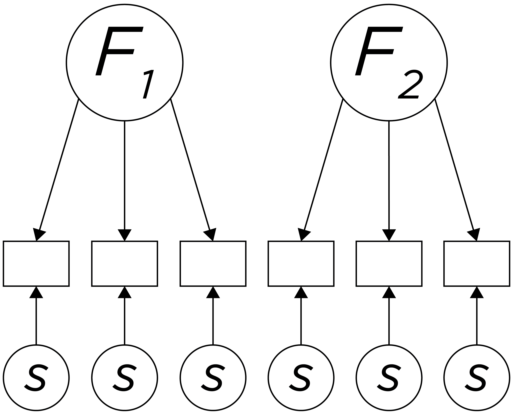
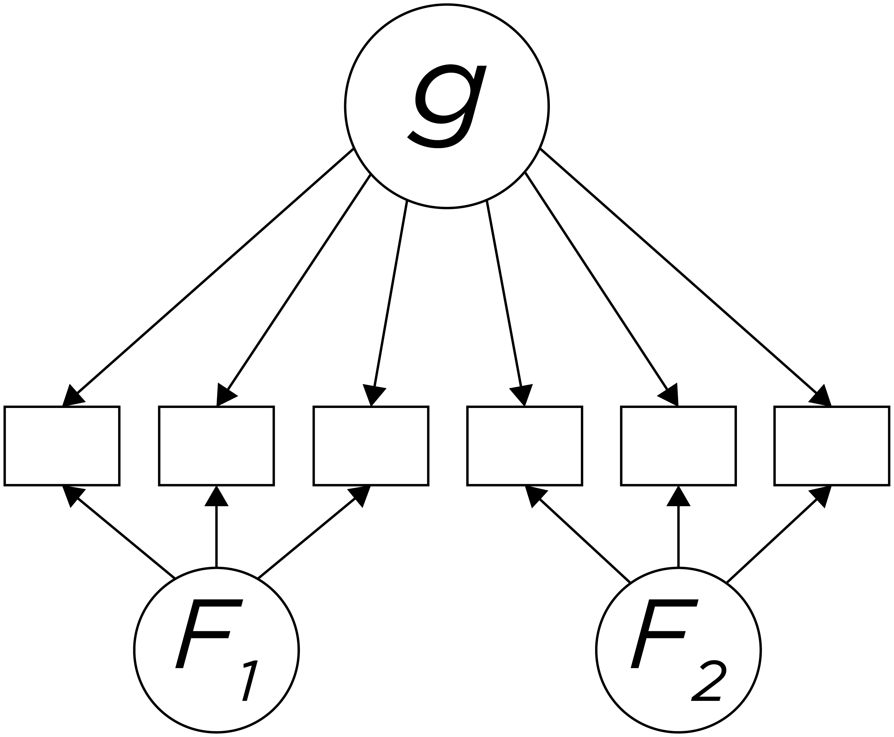

# (PART) Part II {-}

# Intellectual Assessment {#intellectual}

## Defining Intelligence

## History of Intelligence Research

## Purposes of Intelligence Tests

## Intelligence vs. Achievement vs. Aptitude

## Theory Influences Intepretation of Scores

## Time-Related Influences

## Concerns with Intelligence Tests

[**Dombrowksi et al, 2019 citation**]

Figure \@ref(fig:intelligence1)

```{r intelligence1, out.width = "100%", fig.align = "center", fig.cap = "Depiction of Spearman's two factor theory of intelligence.", echo = FALSE}
knitr::include_graphics("./Images/Intelligence-01.png")
```

Figure \@ref(fig:intelligence2)

```{r intelligence2, out.width = "100%", fig.align = "center", fig.cap = "Depiction of Thurstone's theory of intelligence (with only two factors depicted for simplicity).", echo = FALSE}

```

Figure \@ref(fig:intelligence3)

```{r intelligence3, out.width = "100%", fig.align = "center", fig.cap = "Depiction of Cattell's Gf-Gc theory of intelligence. Gf = fluid intelligence; Gc = crystallized intelligence", echo = FALSE}
knitr::include_graphics("./Images/Intelligence-03.png")
```

Figure \@ref(fig:intelligence4)

```{r intelligence4, out.width = "100%", fig.align = "center", fig.cap = "Depiction of the Cattell-Horn-Carroll hierarhical theory of intelligence.", echo = FALSE}
knitr::include_graphics("./Images/Intelligence-04.png")
```

Figure \@ref(fig:intelligence5)

```{r intelligence5, out.width = "100%", fig.align = "center", fig.cap = "Depiction of bifactor model of intelligence.", echo = FALSE}

```

## Conclusion
