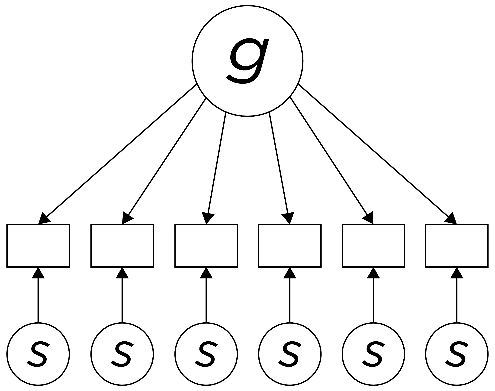
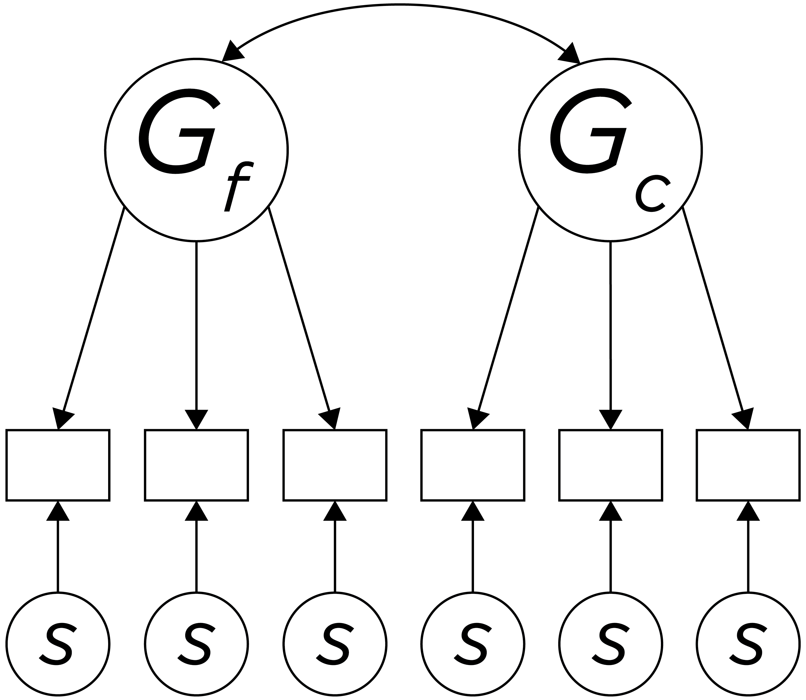
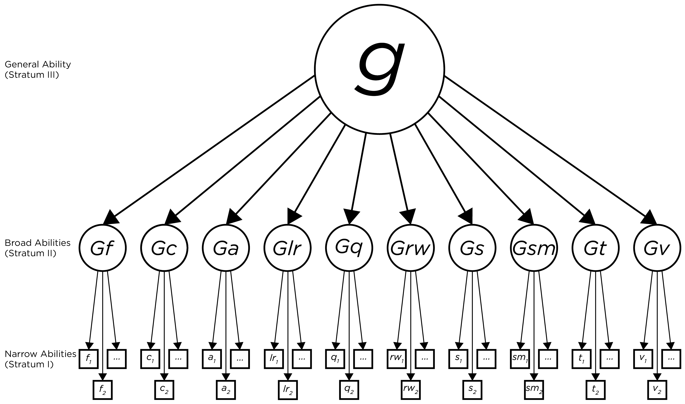

# (PART) Part II {-}

# Intellectual Assessment {#intellectual}

## Defining Intelligence

Definitions for intelligence are many. Some define intelligence as problem solving abilities and the capacity for learning, where general intelligence is called "g" and reflects the ability to use this capacity. We can also consider emotional aspects of intelligence. For instance, social cognition reflects adaptive functioning. We can consider intelligence to be what that reflects adaptive functioning. We can also consider whatever we value to be intelligence. For example, you might hear about a player's basketball I.Q. Some conceptualizations of intelligence emphasize it as a brain thing that involves speed of processing, processing capacity, and connectedness. From this perspective, intelligence includes components such as working memory, processing speed, visual and auditory perception, etc. We could also consider the products of these skills and components in interaction with the world. This is the goal of behavioral measures that are thought to reflect the underlying neural mechanism of general intelligence ("g").

## History of Intelligence Research

A history of intelligence research is described in @Sechrest1998. The assessment of intelligence is considered one of the key successes in psychology. Intelligence is one of the most widely assessed constructs in research and practice. Information from intelligence tests has important uses. Many people have contributed in important ways to the assessment of intelligence. Here, I outline just a few key figures.

### Sir Francis Galton (1822–1911)

Sir Francis Galton was known for his work on lots of topics, including correlation, regression, twin studies, heredity, individual differences, the fax machine, and the telegraph. His work discovered the importance of reaction time, and conceptualized it as a reflecting an underlying construct. He examined individual differences in many domains: vision, hearing, reaction time, other sensorimotor functions, and physical characteristics. Many of these individual differences would fall into the construct of "intelligence" now.

### James Cattell (1860–1944)

James Cattell was Wihelm Wundt's first American student. Cattell measured sensory acuity and psychophysical characteristics. Cattell's work followed Galton's, and he examined whether reaction time might shed light on consciousness. Cattell used factor analysis to formally approach Galton’s questions about why scores correlated—why people who tended to be good at one thing also tended to be good at lots of other things. He was credited with initiating the individual differences movement and with the first published reference to a mental test in the psychological literature.

### Alfred Binet (1857–1911)

Alfred Binet was a French psychology, and his work was more applied than the work by Galton and Cattell. He tried to apply principles of psychology to ameliorate mental problems. In France, he was forward thinking at the time: he sought to identify children with an intellectual disability so that they could receive training and live a productive life. He and his colleague, Théodore Simon, asked who is trainable and when. And with their work, so begins clinical assessment.

In 1905, Binet and Simon developed the Binet–Simon Intelligence Scale for children. It was developed from a government commission to study the education of children with an intellectual disability (called mentally retarded or "arriéré" at the time). Items on the scales were administered from easiest to hardest, until the participant couldn’t do three-quarters of the items. This approach is similar to modern-day item response theory approaches to adaptive testing. Items were selected for inclusion in the scales if they showed criterion-related validity in relation to two criteria:

- age—discriminative validity (i.e., age differentiation); items were identified for which older children performed better than younger children, and
- performance in school; items were selected that differentiated children who showed success versus failure in school.

This approach of using ceiling criteria to establish stop points in testing is still widely used today. The Binet–Simon Intelligence Scale included subtests that are still widely used today involving:

- naming objects in pictures (similar to the Peabody Picture Vocabulary Test): phone, squash, etc.
- digit span and reverse digit span: having a respondent repeat numbers of a progressively longer and longer length, then having respondents repeat numbers in the reverse number; examines how much information a person can store in working memory and their underlying capacity.
- a vocabulary test: asking children to define words to show they know the meaning of words; a concrete measure reflective of ability to learn words
- similarities: examines abstraction and understanding
- block design: having the respondent manipulate blocks to make different designs; examines visuospatial reasoning
- comprehension questions: how much the person has learned information about life and culture because of their capacity

Binet and Simon assessed performance of typically developing children and children with intellectual disability. They quantified children's performance on the tests with what they called "mental age" (as opposed to chronological age). The child's mental age was estimated by corrected for the expected (median) score at that age. For instance, if a child has a mental age of a 7-year-old, that means that the child's performance is the same as the average (50th percentile) 7-year-old.

The Binet–Simon Intelligence Scale was validated with the opinions of teachers of children's academic functioning. Teachers' reports used to show stronger criterion-related validity compared to intelligence tests. Now, intelligence tests are the gold standard; they show stronger criterion-related validity compared to teacher reports.

### Lewis Terman (1877–1956)

Lewis Terman at Stanford University revised the Binet–Simon Intelligence Scale, and the revised test became known as the Stanford–Binet Intelligence Scales. After the release of the Stanford–Binet, academics became excited about intelligence testing.

### William Stern (1871–1938)

A key challenge that intelligence researchers had was how to quantify children's performance on the tests. Binet had introduced the concept of the mental age—the typical age for participants with that score. Mental age had a a generalizable notion that was informative. It provided meaning compared to saying that someone received score of 8 on the measure. Mental age conceptualizes intelligence as a measure of current functioning to inform how to improve their functioning to efficiently use resources.

However, performance does not increase across all domains with age through adulthood. [That is, the same level of performance could have multiple mental ages.] Therefore, William Stern changed to the scoring to a trait measure by developing the Intelligence Quotient (IQ) that Terman used in the Stanford–Binet.

$$
\text{Intelligence Quotient (IQ)} = \frac{\text{mental age}}{\text{chronological age}} \times 100
(\#eq:intelligenceQuotient)
$$

This helped keep IQ to be a more stable as a characteristic of the person. IQ was more trait-like and stable than mental age, and it doesn’t change as much with age because it accounts for age.

Today, this index is known as the known as “Ratio IQ." It involves taking a ratio of two numbers, but it is not a ratio measure because it does not have a meaningful zero, and the gaps between the scores might not be equidistant.

Stern was a German psychologist who moved to America and promoted Binet’s ideas. Compared to England where you became what your parents were, in America, your future was thought to be determined by your underlying ability. This was based on the idea that "everyone who is able could become successful." Therefore, intelligence took hold with the idea that individual abilities determine success. Intelligence took hold, then World War I occurred.

### Robert Yerkes (1876–1956)

World War I involved using lots of technology. In 1917, under the lead of Robert Yerkes and others, the United States Army developed the Army Alpha and Beta Test, a precursor to the eventual Armed Services Vocational Aptitude Battery (ASVAB). The U.S. Army sought to improve the army by classifying people in rank and tasks according to their capabilities—it is important to have the best army possible or you will lose the war.

The content was similar to the Binet scales, but it was changed from a clinical test to a multiple choice paper and pencil test that a clerk could give to large groups. The Alpha test included words and letters for literate recruits. The Beta test was a picture-based intelligence test without words for illiterate recruits or recent immigrants. For instance, the Beta test involved having recruits code digits with symbols, which is still part of the Wechsler Adult Intelligence Scales today.

The Army Alpha and Beta tests are among the first examples of affirmative action because anybody could get picked based on their test performance compared to only doing what one's parents did. However, the Army Alpha and Beta tests turned out to be biased against rural, nonwhites because they were less experienced with standardized setting. The Army Alpha and Beta tests were the precursors to much of the modern psychometric movement in psychology, and to the development of more advanced intelligence tests.

### Charles Spearman (1863–1945)

Charles Spearman found that performance on many tasks was highly correlated. 	Using factor analysis, he proposed that an underlying "force" ("g") drove performance on all tests. However, he found that "g" could not explain all variance in tasks. He proposed a two factor-theory. According to Spearman two-factor theory, the variation between people on all cognitive tasks is a function of two factors: general intelligence ("g") and test-specific variance ("s"), as depicted in Figure \@ref(fig:intelligence1).

```{r intelligence1, out.width = "100%", fig.align = "center", fig.cap = "Depiction of Spearman's two factor theory of intelligence.", echo = FALSE}

```

### Louis Leon Thurstone (1887–1955)

Louis Leon Thurstone had restricted range in his samples and observed lower correlations among the skills than Spearman observed. Thurstone hypothesized that the tests tapped specific abilities or faculties, not just a general factor. He argued that independent, lower-order processes, such as memory, verbal skills, and spatial skills, with a clearer psychological meaning than "g" or test-specific skills, and that they might better explain the pattern of correlations among cognitive tests than a general factor. Examples of independent abilities are depicted in Figure \@ref(fig:intelligence2).

```{r intelligence2, out.width = "100%", fig.align = "center", fig.cap = "Depiction of Thurstone's theory of intelligence (with only two factors depicted for simplicity).", echo = FALSE}
knitr::include_graphics("./Images/Intelligence-02.png")
```

### Raymond Cattell (1905–1998)

Raymond Cattell proposed splitting "g" into two factors: fluid intelligence (G~f) and crystallized intelligence (G~c), as depicted in Figure \@ref(fig:intelligence3). Fluid intelligence (G~f) was considered to be the capacity to respond adaptively in novel situations. It was thought to be based on neural integrity (versus noise), neural connectedness, processing speed, memory size, spatial processing, abstract reasoning, and one's capacity for novel learning. Crystallized intelligence (G~c) was considered to be preserved with age and was based on life experience (e.g., quality of schools, number of words spoken to child, etc.), history, learned skills, cultural knowledge, verbal skills, and vocabulary. Crystallized intelligence could be further subdivided into historical G~c and current G~c. Historical G~c was considered what a person had learned prior to receiving specialized training or practice. Current G~c was considered the domains of expert knowledge and skills. Most assessment tests assess historical G~c rather than current G~c. Tests include both G~f and G~c, but we do not know how much.

```{r intelligence3, out.width = "100%", fig.align = "center", fig.cap = "Depiction of Cattell's Gf-Gc theory of intelligence. Gf = fluid intelligence; Gc = crystallized intelligence", echo = FALSE}

```

Fluid intelligence was hypothesized by Cattell to be one's inborn and physiologically based cognitive processing capacity which develops rapidly in childhood and is then invested in developing crystallized skills. Fluid intelligence was thought to be necessary for acquiring knowledge that becomes crystallized intelligence. Fluid intelligence increases with age from childhood to adulthood, peaks in the early 20s, and decreases in middle and older age. Fluid intelligence is more likely to be impaired (compared to crystallized intelligence) following brain trauma.

Crystallized intelligence is theoretically expected to continue expanding with age, but historical G~c does seem to peak around late 30s. Given extensive age-related changes, performance needs to be compared to same-aged peers.

### John Horn (1926–2006)

John Horn extended Cattell's Gf-Gc model to include 10 broad abilities, including:

- G~f: fluid reasoning (fluid intelligence)
- G~c: comprehension-knowledge (crystallized intelligence)
- G~a: auditory processing
- G~lr: long-term storage and retrieval
- G~q: quantitative knowledge
- G~rw: reading and writing ability
- G~s: processing speed
- G~sm: short-term memory
- G~t: reaction time/decision speed
- G~v: visual processing

### John Carroll (1916–2003)

John Carroll proposed a three-stratum hierarchical model that included narrow abilities (stratum 1), broad abilities (stratum 2), and general abilities (stratum 3), as depicted in Figure \@ref(fig:intelligence4).

```{r intelligence4, out.width = "100%", fig.align = "center", fig.cap = "Depiction of the Cattell-Horn-Carroll hierarhical theory of intelligence.", echo = FALSE}

```

This model of intelligence Became known as the Cattell-Horn-Carroll (CHC) model, which is now the most prominent contemporary theory of intelligence.

### David Wechsler (1896–1981)

David Wechsler developed the Wechlser Adult Intelligence Scale (WAIS) and Wechlser Intelligence Scale for Children (WISC), which are among the most widely used intelligence tests. These tests subdivide intelligence into verbal IQ and performance IQ, along with more narrowly defined abilities.

## Alternative Conceptualizations of Intelligence

As noted earlier, the CHC model (Figure \@ref(fig:intelligence4)) is the most prominent contemporary theory of intelligence. However, there are alternative conceptualizations of intelligence. One alternative conceptualization of intelligence is the bifactor model, which is depicted in Figure \@ref(fig:intelligence5). In a bifactor model, "g" is modeled in a non-hierarchical fashion where it is extracted first, and the primary factors are extracted separately from the remaining common variance among the tests. In this model, the resulting factors are independent of variance due to "g". Variation in performance on subtests can be due to g and/or to primary factors, which are independent.

```{r intelligence5, out.width = "100%", fig.align = "center", fig.cap = "Depiction of bifactor model of intelligence.", echo = FALSE}
knitr::include_graphics("./Images/Intelligence-05.png")
```

## Purposes of Intelligence Tests

Intelligence tests have multiple purposes, though these uses are limited. Scores on intelligence tests have been shown to predict future academic achievement. They can also be helpful for characterize functional impairment. For instance, they can be helpful for academic planning—i.e., whether a person is gifted or in need of remediation. Intelligence tests can also be helpful for identifying change in functioning over time, for example that may be related to dementia or brain injury.

Scores on intelligence tests can also influence approaches to clinical assessment. Many assessment strategies assume average intelligence for question comprehension. A cliniician might use assessments with more basic instructions or nonverbal assessments for those with poorer intelligence. Moreover, intelligence scores can influence the approaches to treatment, including the vocabulary used by the clinician, the extent of use of written material, and the clinician's expectations that the client engages in abstract reasoning. For example, a clinician might not focus on cognitive side of therapy in cognitive-behavior theraypy; intead, they might focus more on behavioral side of cognitive-behavior therapy: exposure therapy for anxiety and behavioral activation for depression.

## Intelligence vs. Achievement vs. Aptitude

In theory, intelligence is what you "have" (in terms of ability), whereas achievement is "what you do with it." Aptitude is what you will be able to do with maximum training and opportunity.

Tests that are intended to assess intelligence include the Wechsler Adult Intelligence Scale (WAIS), Wechsler Intelligence Scale for Children (WISC), Wechsler Abbreviated Scale of Intelligence (WASI), Wechsler Preschool and Primary Scale of Intelligence (WPPSI), and Woodcock-Johnson Tests of Cognitive Abilities, Stanford–Binet Intelligence Scale, and Differential Ability Scales (DAS), and Kaufman Brief Intelligence Test (KBIT).

Tests that are intended to assess achievement include the Wechsler Individual Achievement Test (WIAT) and Woodcock-Johnson Tests of Achievement.

Tests that are intended to assess aptitude include the Graduate Record Examination (GRE), Scholastic Aptitude Test (SAT), ACT, Graduate Management Admission Test (GMAT), and Law School Admission Test (LSAT).

Achievement presumably depends on both intelligence and aptitude, as well as motivation and effort. In reality, these constructs are difficult to differentiate at a measurement level. Assessment instruments that are intended to assess one of these likely assess elements of all of these.

## Theory Influences Intepretation of Scores

Despite the considerable research on intelligence it is still difficult to define intelligence. What is intelligence? According to the 1994 academic workgroup, “Mainstream Science on Intelligence”, intelligence “involves the ability to reason, plan, solve problems, think abstractly, comprehend complex ideas, learn quickly, and learn from experience” [**CITATION**]. Some of the most widely used assessments of intelligence lack a clear theoretical foundation. They are more based on psychometrics than theory. Thus, it has been argued that "intelligence is what intelligence tests measure" (Edwin Boring, 1923).

Theory plays an important role in interpretation of scores from tests. With the Iowa Tests of Basic Skills (ITBS) and other tests, they have divergent goals from traditional intelligence tests: evaluating schools as opposed to evaluating children. For example, some stakeholders may be more interested in how much learning occurs in particular schools rather than merely a person's level of ability. Thus, the content that comprises "intelligence" differs depending on the purpose of assessment. You would also prioritize different predictive criteria depending on the goal, with items and subtests selected accordingly. For example, predictive criteria could focus on school performance versus job performance versus life skills.

## Time-Related Influences

Individual differences in intelligence scores tend to be relatively stable as people age, despite changes in absolute performance. Nevertheless, there are time-related influences on intelligence scores. One time-related influence on intelligence scores is called the Flynn effect. The Flynn effect is the phenomenon that there are age cohort differences in IQ scores such that IQ scores rise around 3 points every decade; younger generations perform better on intelligence tests than older generations, when they were at the same age. So your children's generation is likely to be more intelligent than your generation, at least as assessed with the currently available instruments.

## Concerns with Intelligence Tests

Despite the utility of intelligence tests, there are numerous concerns with intelligence tests. For instance, there are Concerns about the content validity of intelligence tests. That is, there are concerns that intelligence tests do not assess all important aspects of the construct of intelligence. Intelligence tests typically do not assess creativity, emotional intelligence, empathy, etc.

Another concern is that intelligence tests encourage participants to put forth maximum mental effort. However, the *typical* mental effort needed to solve problems may be more important for many assessment questions than what someone can answer with maximum mental effort. Fluid intelligence is most likely to be affected by effort and attention.

Another concern is that scores can be influenced by factors other than intelligence. For instance, IQ scores may be affected, at least indirectly, by socioeconomic status and educational background. IQ scores are moderately associated with socioeconomic status and level of education. IQ scores might also be influenced by cultural background (due to the potential for intelligence tests to have cultural biases), motivation, intimidation or anxiety, and the physical testing conditions.

There are also concerns about the predictive utility of intelligence tests. Scores from intelligence tests have been shown to predict some aspects of functioning, but only in limited ways. For instance, IQ scores have been shown to predict grades in K–12 school, number of school years completed, academic performance through freshman year of college, and whether someone obtains a job. However, there are limits to what IQ scores can predict and the (weak) magnitude in which they predict these phenomena. Moreover, IQ scores do not appear to predict how successfully one performs in their job, the quality of their interpersonal relationships, or their happiness.

## Aptitude Testing

The primary origin of considerations of the predictive utility of aptitude testing was World War I. Thorndike developed a test to assess aptitude for becoming a pilot. The tests examined individual differences in keeping track of all things to predict who will be a good pilot—including skills involving stress, vision, attention, reaction time, working memory, navigation, being upside down, etc. Intelligence and aptitude testing took off from there.

McClelland examined the data on aptitude predicting outcomes. He examined the question of whether grades and intelligence tests predict life and occupation success. He says no—or at least, intelligence does not influence life and occupation success, but rather intelligence opens up access to education, which serves as an important credential for access to good jobs. That is, McClelland argued that there is criterion contamination in the evaluation of criterion-related validity of intelligence tests.

He argued that intelligence and aptitude tests are culturally and socioeconomically biased. That is, the associations between intelligence test scores and job scores that have been observed in prior research may be an artifact given that socioeconomic status (SES) influences both. Others argue that IQ scores do predict later life and occupation success, and have shown validity across groups and SES levels—i.e., that the association is not an artifact of SES. Moreover, others have argued that the observed associations are weaker than true associations because of restriction of range. For example, students with lowest SAT/GRE scores are typically not admitted, so one cannot examine their outcomes in association with the full range of SAT/GRE scores because we do not have have access to outcomes for the people who are not admitted.

McClelland argues that, instead of performing aptitude tests, we should look at life characteristics and job-related competencies. To understand McClelland's position, it can be helpful to distinguish between signs and samples. Signs are instances where human behavior is viewed as a sign of some underlying characteristic. For instance, the Rorschach inkblot test is all sign and no sample. Psychodynamic theorists view responses as signs of underlying personality dynamics. By contrast, samples focus on operations (behaviors). Samples come from a behavioral perspective in which behaviors are just what they are; no underlying causes are inferred—i.e., there is less inference for samples than for signs. Examples of a sample for an occupation as a pilot could involve evaluating how well the person flies an airplane. A sample from a driving test would be to literally sample driving behavior. These are examples of *criterion sampling*. Criterion sampling involves sampling of the behavior in the area of interest to use as the criterion. For example, criterion sampling could involve assessing a sample of abilities relevant for a position (i.e., competency testing) based on a job analysis of the duties and responsibilities of a particular job and the skills and abilities necessary to perform the job well. McClelland's goal is to use the criterion sample to reduce bias for minorities. However, using a criterion sample actually increased bias.

McClelland was interested in shifting the field from using signs to using samples. McClelland argued that use of intelligence tests for job selection involves too much inference about an underlying ability—i.e., the test is used as a sign rather than as a sample. McClelland would argue that, instead, employers should do competency testing for competencies such as communication skills, goal setting, ego development, patience. However, he does nto say how to assess these skills. He would argue that it is important to sample multiple aspects of the construct of interest; a wider array of talents—not just academic performance. For a relevant criterion sample of competencies for a particular job or position, you need strong theory. However, criterion sampling is very difficult.

Consider tests for selection of firefighters. Evaluative tests for selecting firefighters include fitness tests, among other tests. Fitness tests may include activities like running with heavy objects, climbing ladders, and willingness to go into burning buildings—skills which translate to the activities that many firefighters perform on the job. However, these fitness tests have been shown to be lead to adverse impact toward women—i.e., they result in lower selection rates of women than men. The fitness tests are also biased in favor of people who had practiced, and who had previous training. Criterion sampling without pretraining makes things worse. You could lead bootcamps of pretraining to level the playing field for job applicants and then conduct testing. However, pretraining takes time and money, and many organizations may not be willing to do that.
	But takes time and money, and many organizations may not be willing to do that.

[**Dombrowksi et al, 2019 citation**]

## Conclusion
