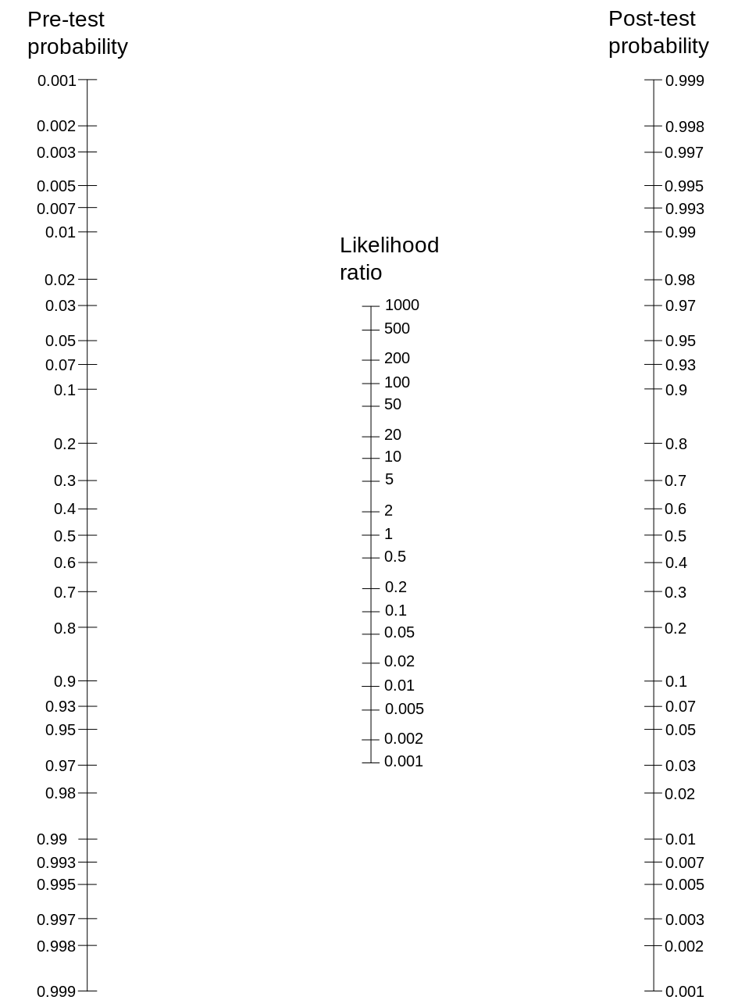
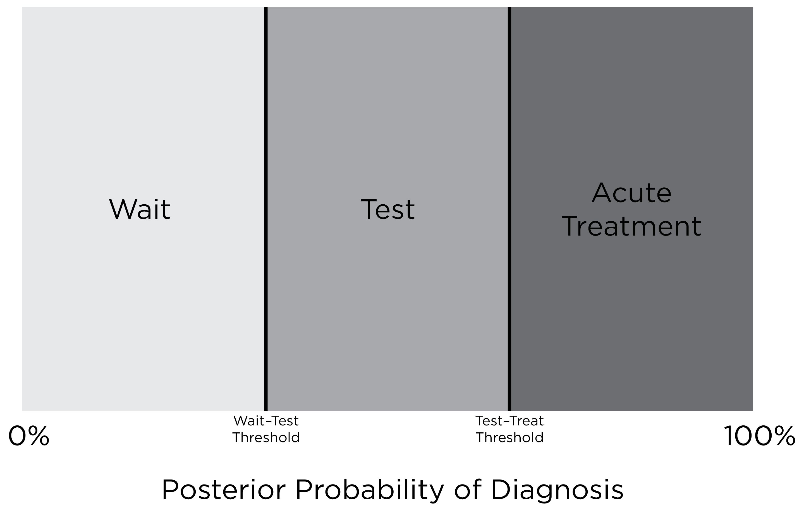

# Evidence-Based Assessment {#evidence-based}

This whole book is about doing assessment in the strongest, most scientifically supported (i.e., evidence-based) ways.
This chapter summarizes many of the important considerations in ensuring our assessments are strong for their intended uses, especially in clinical psychology, and to discuss the value of some cutting-edge (and some not-so-cutting-edge) techniques to maximize the [validity](#validity) of inferences.\index{evidence-based assessment}
A case study in evidence-based assessment is provided by @Antony2005.\index{evidence-based assessment}

## Considerations {#considerations-evidence-based}

In general, we need to use assessment devices that are:\index{evidence-based assessment}

- clinically relevant (if used in a clinical domain): they inform decision-making processes\index{evidence-based assessment}
- culturally sensitive: they are relevant to individuals from various backgrounds, especially the backgrounds in the population of interest\index{evidence-based assessment}\index{validity!cultural}
- scientifically sound: strong psychometrics ([reliability](#reliability) and [validity](#validity))\index{evidence-based assessment}\index{reliability}\index{validity}

## Clinically Relevant {#clinicallyRelevant}

Effective treatment depends on accurate assessment.
Thus, it is important to consider the [treatment utility of assessment](#treatmentUtility) to determine whether the assessment has value.\index{validity!treatment utility of assessment}
Several study methods were designed to examine the [treatment utility of assessment](#treatmentUtility), including manipulated assessment (compares assessment versus no assessment) and manipulated use (compares use versus no use of data from the assessment for treatment matching).\index{validity!treatment utility of assessment}\index{validity!treatment utility of assessment!manipulated assessment}\index{validity!treatment utility of assessment!manipulated use}

It is also important to consider the ease of dissemination of an assessment: is it time- and money-efficient, especially in terms of its cost–benefit ratio?\index{cost–benefit}
Brief assessments, [computerized testing](#computerAssessment), and [adaptive testing](#adaptiveTesting) can help assessments be clinically practical.\index{brief assessment}\index{adaptive testing}\index{computerized assessment}
It should be straightforward to score and interpret.
And it should provide [incremental validity](#incrementalValidity), i.e., additional useful information above and beyond what is gained by other assessment devices.\index{validity!incremental}

We have already discussed how assessments can yield more effective outcomes indirectly through matching the right treatment approach to the client.
It is also worth noting, however, that assessments can also lead *directly* to improved treatment outcomes.\index{assessment!as an intervention}
Conducting an assessment is an intervention—it can have carryover effects, and can result in self-reflection, self-awareness, and reactivity, i.e., change due to observing it.\index{assessment!as an intervention}

Assessment is also an important component of measurement-based care.\index{measurement-based care}
Measurement-based care is the approach of treatment monitoring and modifying treatment accordingly [@Lutz2022].\index{measurement-based care}
Assessment does not stop at the beginning of the treatment—it is continuous and ongoing.\index{measurement-based care}
So, ongoing measurement is recommended throughout treatment so that the clinician can modify the treatment in response to measurements.\index{measurement-based care}
Assessment of treatment progress needs to be sensitive to change, i.e., the assessment needs to show treatment sensitivity, and it needs to be actionable, i.e., it needs to have utility.\index{measurement-based care}\index{validity!utility}\index{change!sensitivity to}

In clinical psychological assessment, it is important for assessments to:

- consider co-occurrence of multiple issues (comorbidity) and differential diagnosis.\index{differential!differential diagnosis}
- accurately assess conditions that frequently co-occur or co-vary (e.g., depression and anxiety), and to
- differentiate between multiple possibilities for what may explain the client's difficulties

In addition, it is valuable to:

- pose alternative or competing hypotheses and test them to rule out other potential explanations
- look for disconfirming evidence, not just evidence that confirms one's suspicions
- consider assessments from multiple informants (e.g., parents, teachers, peers) and multiple levels of analysis, including biological, psychological, and social-contextual factors
- consider functional impairment and not just diagnostic status.\index{functional impairment}
- consider the context of the client's difficulties, including the onset, duration, and course of the problem, the client's treatment history, family history, familial and cultural context, and medical conditions.

## Culturally Sensitive {#culturallySensitive}

It is important to mitigate cultural [bias](#bias) of instruments.\index{bias}
It is also important for the measure to be useful across the population of interest.
To accomplish this, one may have to modify an assessment approach to account for clinically significant moderating variables.
We discuss culturally sensitive assessment more in Chapter \@ref(diversity), and we discuss [test bias](#bias) in Chapter \@ref(bias).

## Scientifically Sound {#scientificallySound}

The development and selection of measures should be based on scientifically supported theories in psychopathology and basic psychological science.
Measures should be standardized, with similar procedures across participants, clients, and examiners.\index{standardization}

[Reliability](#reliability) and [validity](#validity) of measures' scores are specific to a particular use of the test, and are specific for a given population and context.\index{reliability}\index{validity}
So, it is important to clearly specify the purpose of the assessment.
As just a few examples, the purpose of the assessment could be screening for early identification of risk, for diagnosis, for treatment monitoring, for treatment evaluation, or for measuring a phenomenon of interest in research.\index{early identification}\index{diagnosis}\index{treatment!monitoring}\index{treatment!evaluation}
In general, the purposes of an assessment can be summarized into the 3 Ps [@Youngstrom2017]: [predict](#prediction), prescribe, and process.
The purpose of an assessment is to [predict](#prediction) if the purpose is to relate an assessment to a criterion at a later point in time.
An assessment is used to prescribe if it informs decision-making about the participant or client—for example, a decision about which treatment to give, identifying moderators of treatment effectiveness, or specifying potential confounds or alternative explanations that would warrant a different treatment.
An assessment is used to understand process if it informs understanding of the participant or client—for example, identifying mediators of treatment effectiveness or tracking treatment progress.

Whichever the purpose of the assessment, it is important to test and evaluate the psychometrics of the assessment device for that particular purpose.
Only use the assessment device in a test battery if it advances that purpose.
@Youngstrom2017 describe the different core psychometric features that are especially relevant for each purpose.
For instance, [predictive](#predictiveValidity) and [discriminative](#discriminativeValidity) [validity](#validity) are crucial for [prediction](#prediction), whereas [inter-rater reliability](#interrater-reliability) is crucial for prescription, and treatment sensitivity—a form of [criterion-related validity](#criterionValidity)—is crucial for understanding process.\index{validity!predictive}\index{validity!discriminative}\index{reliability!inter-rater}\index{validity!criterion}

### Standard for Excellent Tests {#excellentTests}

Additionally, when making norm-referenced judgments, it is important that the assessment has appropriate [norms](#norm) and evidence of [accuracy](#validity) for any cut-scores (e.g., diagnostic thresholds).\index{norm-referenced}\index{norm}
Per @Youngstrom2017, below are the norms and psychometric standards for excellent tests:

- If the assessment has [norms](#norm), the [norms](#norm) provide a mean and standard deviation for the total score (and any subscores) that were determined from multiple, large samples that are representative of the populations to which it is intended for the test to be administered.\index{norm}
- [Internal consistency](#internalConsistency-reliability): Greater than .90 based on [Cronbach's alpha](#cronbachAlpha) or (better yet) [omega](#coefficientOmega).\index{reliability!internal consistency}\index{reliability!internal consistency!Cronbach's alpha}\index{reliability!internal consistency!omega}
- [Inter-rater reliability](#interrater-reliability): Cohen's kappa $\ge$ .85; intraclass correlation $\ge$ .90.\index{reliability!inter-rater}\index{reliability!inter-rater!kappa}\index{reliability!inter-rater!intraclass correlation}
- [Test–retest reliability](#testRetest-reliability): If the construct is [stable](#stability), the measure shows [stability of individual differences](#stability) and [repeatability](#repeatability).\index{reliability!test–retest}\index{reliability!test–retest!coefficient of stability}\index{reliability!test–retest!coefficient of repeatability}
However, note that not all constructs are expected to be [stable](#stability).\index{reliability!stability}
For [stable](#stability) constructs, the measure should show [stability of individual differences](#stability) (i.e., relative or [rank-order stability](#stability)): $r\text{s} \ge .70$ over a year or longer.\index{reliability!stability}\index{reliability!test–retest}\index{reliability!test–retest!coefficient of stability}
For [stable](#stability) constructs, the measure should also show [repeatability](#repeatability), i.e., [absolute stability](#repeatability) in level: A Bland–Altman plot and corresponding regression shows no significant [bias](#blandAltmanBias) or trends, and the [repeatability coefficient](#repeatability) (also known as Smallest Real Difference, SRD, or limits of agreement, LOA) is small.\index{reliability!stability}\index{reliability!test–retest}\index{reliability!test–retest!coefficient of repeatability}\index{reliability!test–retest!bias}\index{reliability!test–retest!Bland-Altman plot}
- [Content validity](#contentValidity): The test developers clearly defined the domain and ensured representation of the entire set of facets.\index{validity!content}
All elements of the assessment are evaluated by quantitative ratings by multiple groups of judges.\index{validity!content}
- [Construct validity](#constructValidity): The assessment has evidence in support of [construct validity](#constructValidity), including [concurrent](#concurrentValidity), [predictive](#preditiveValidity), [convergent](#convergentValidity), and [discriminant](#discriminantValidty) [validity](#validity), that has been replicated by independent researchers.\index{validity!construct}\index{validity!concurrent}\index{validity!predictive}\index{validity!convergent}\index{validity!discriminant}
- [Incremental validity](#incrementalValidity): The assessment shows incremental utility above other measures.\index{validity!incremental}
- [Discriminative validity](#discriminativeValidity): For diagnostic assessment, the measure should have an [area under the receiver operating characteristic curve (AUC)](#auc) of .75 to .90 under clinically realistic conditions.
[AUC](#auc) is the single best index of [discrimination accuracy](#discrimativeValidty), but it is also helpful to know the [sensitivity](#sensitivity), [specificity](#specificity), [positive predictive value](#ppv), and [negative predictive value](#npv) at particular cutoffs of interest to determine whether the assessment is aligned with its purpose.\index{validity!discriminative}\index{receiver operating characteristic curve!area under the curve}\index{sensitivity}\index{specificity}\index{positive predictive value}\index{negative predictive value}
- Prescriptive validity: An assessment that has strong prescriptive validity regarding which diagnosis to give would have good [inter-rater reliability](#interrater-reliability) (kappa) for diagnosis in more than one sample.\index{reliability!inter-rater}\index{reliability!inter-rater!kappa}
An assessment that has strong prescriptive validity regarding which treatment to give would have a moderate effect size (or larger) for treatment moderation—i.e., there is evidence for treatment matching based on the characteristic.
- [Validity](#validity) generalization: The bulk of the evidence supports use of the assessment with more than one demographic group (if it is to be used with more than one group) and in multiple settings.
- Sensitivity to change and treatment sensitivity: Replications from independent researchers show evidence that the assessment detects (i.e., is sensitive to) change over time, change over the course of treatment, and differences as a function of different types of treatment.\index{change!sensitivity to}
- [Clinical utility](#treatmentUtility): After practical considerations, including costs, respondent burden, ease of administration and scoring, replication from independent researchers shows that the assessment data are likely to be clinically actionable and confer clinical benefits, such as better outcomes, lower attrition, and greater satisfaction in areas that are important to the stakeholders.\index{validity!utility}

The whole assessment process should be empirically evaluated, including the selection, administration, scoring, and interpretation of an instrument, the integration of multiple sources of assessment data, and the decision-making process.
When possible, it is valuable to evaluate the [accuracy](#validity) of the decision-making, ideally against some gold standard, for quality control improvement.

In general, it is better to include a wide range of assessment tools than a single strong measure.
For instance, assessment tools could include self- and informant-report [questionnaires](#objective-personality), [interviews](#interview), [self-monitoring diaries](#selfMonitoring), [behavioral observation](#behavioral), [performance-based techniques](#performanceBased), and [psychophysiological techniques](#psychophysiological).\index{questionnaire}\index{interview}\index{observation}\index{performance-based assessment}\index{psychophysiological assessment}
Then, each measure can be weighted according to its [diagnostic likelihood ratio](#diagnosticLikelihoodRatio)—i.e., its [concurrent](#concurrentValidity)/[predictive](#predictiveValidity) [validity](#validity) in the form of the [positive likelihood ratio](#positiveLikelihoodRatio).\index{diagnostic likelihood ratio}\index{validity!concurrent}\index{validity!predictive}\index{positive likelihood ratio}

One challenge is how to handle a situation where different instruments yield different answers.
For instance, if the results from parent report versus teacher report conflict with each other.
To address potential discrepancies, one can weight the different instruments or informant sources according to their [predictive accuracy](#predictiveValidity).\index{validity!predictive}
For instance, you might give more weight to youths' self-report for assessing anxiety but might give more weight to parent report for assessing ADHD.
One way to handle informant discrepancies when there is not a clear primary informant who is best-positioned to rate the person most accurately is to count a symptom as present if it is endorsed by any of the informants [@Hinshaw1999].

## Bayesian Updating {#bayesianUpdating}

As presented in Equation \@ref(eq:bayes5), the posttest (or posterior) odds are equal to the [pretest odds](#pretestOdds) multiplied by the [likelihood ratio](#positiveLikelihoodRatio).\index{Bayesian!updating}\index{odds!posttest}\index{odds!pretest}\index{diagnostic likelihood ratio}
Bayes' theorem is discussed in Section \@ref(bayesTheorem).\index{Bayesian!updating}\index{Bayesian!Bayes' theorem}
Using this formula, and converting odds to probabilities, we can use a Fagan probability nomogram to determine the [posttest probability](#posttestProbability) following a test result.\index{Bayesian!updating}\index{probability!nomogram}
The calculation of posttest probability is described in Section \@ref(posttestProbability).\index{Bayesian!updating}\index{probability!posttest}
A *probability nomogram* is a way of visually applying [Bayes' theorem](#bayesTheorem) to determine the [posttest probability](#posttestProbability) of having a condition based on the [pretest (or prior) probability](#pretestProbability) and [likelihood ratio](#diagnosticLikelihoodRatio), as depicted in Figure \@ref(fig:probabilityNomogram).\index{Bayesian!updating}\index{probability!nomogram}\index{Bayesian!Bayes' theorem}\index{probability!posttest}\index{probability!pretest}\index{diagnostic likelihood ratio}
To use a probability nomogram, connect the dots from the starting probability (left line) with the [likelihood ratio](#diagnosticLikelihoodRatio) (middle line) to see the updated probability.\index{Bayesian!updating}\index{probability!nomogram}\index{Bayesian!Bayes' theorem}\index{probability!posttest}\index{probability!pretest}\index{diagnostic likelihood ratio}
The [updated (posttest) probability](#posttestProbability) is where the connecting line crosses the third, right line.\index{Bayesian!updating}\index{probability!nomogram}\index{Bayesian!Bayes' theorem}\index{probability!posttest}\index{probability!pretest}\index{diagnostic likelihood ratio}

(ref:probabilityNomogramCaption) Probability Nomogram. (Figure retrieved from [https://upload.wikimedia.org/wikipedia/commons/thumb/6/66/Fagan_nomogram.svg/945px-Fagan_nomogram.svg.png](https://upload.wikimedia.org/wikipedia/commons/thumb/6/66/Fagan_nomogram.svg/945px-Fagan_nomogram.svg.png)).

```{r probabilityNomogram, out.width = "50%", fig.align = "center", fig.cap = "(ref:probabilityNomogramCaption)", fig.scap = "Probability Nomogram.", echo = FALSE}

```

For instance, if the [starting probability](#pretestProbability) is .5% and the [likelihood ratio](#diagnosticLikelihoodRatio) is 10 (e.g., [sensitivity](#sensitivity) = .90, [specificity](#specificity) = .91: $\text{likelihood ratio} = \frac{\text{sensitivity}}{1 - \text{specificity}} = \frac{.9}{1-.91} = 10$), the [updated probability](#posttestProbability) is less than 5%, as depicted in Figure \@ref(fig:probabilityNomogramLine).\index{Bayesian!updating}\index{probability!nomogram}\index{Bayesian!Bayes' theorem}\index{probability!posttest}\index{probability!pretest}\index{diagnostic likelihood ratio}\index{sensitivity}\index{specificity}
The formula and function for computing [posttest probability](#posttestProbability) are provided in Section \@ref(posttestProbability).\index{Bayesian!updating}\index{probability!posttest}

```{r}
posttestProbability(
  pretestProb = .005,
  likelihoodRatio = 10)
```

(ref:probabilityNomogramLineCaption) Probability Nomogram Example. (Figure adapted from [https://upload.wikimedia.org/wikipedia/commons/thumb/6/66/Fagan_nomogram.svg/945px-Fagan_nomogram.svg.png](https://upload.wikimedia.org/wikipedia/commons/thumb/6/66/Fagan_nomogram.svg/945px-Fagan_nomogram.svg.png))

```{r probabilityNomogramLine, out.width = "50%", fig.align = "center", fig.cap = "(ref:probabilityNomogramLineCaption)", fig.scap = "Probability Nomogram Example.", echo = FALSE}
knitr::include_graphics("./Images/probabilityNomogramLine.png")
```

A probability nomogram calculator can be found at the following link:\index{Bayesian!updating}\index{probability!nomogram} [http://araw.mede.uic.edu/cgi-bin/testcalc.pl](http://araw.mede.uic.edu/cgi-bin/testcalc.pl) (archived at https://perma.cc/X8TF-7YBX).

## Dimensional Approaches to Psychopathology {#dimensionalPsychopathology}

The [Diagnostic and Statistical Manual of Mental Disorders (DSM)](#dsm) takes primarily a categorical approach to psychopathology—it classifies mental disorders as discrete categories.\index{Diagnostic and Statistical Manual of Mental Disorders}\index{categorical!categorical approach}
That is, anxiety is classified as a distinct disorder from depression in the [DSM](#dsm), despite their strong covariation and co-occurrence.\index{Diagnostic and Statistical Manual of Mental Disorders}\index{categorical!categorical approach}
Moreover, disorders are generally classified in the DSM in a binary fashion—according to the [DSM](#dsm), you either "have" the disorder or "do not have" the disorder—there is no middle ground, and there is not a finer differentiation among those who are given the disorder.\index{Diagnostic and Statistical Manual of Mental Disorders}\index{categorical!categorical approach}

Despite the categorical approach of the [DSM](#dsm), most disorders seem to be more accurately conceptualized as dimensional than categorical [@Markon2011].\index{Diagnostic and Statistical Manual of Mental Disorders}\index{categorical!categorical approach}\index{dimensional!dimensional approach}
As described in Section \@ref(dsmConcerns), DSM disorders are fictive categories.\index{Diagnostic and Statistical Manual of Mental Disorders}
They do not carve nature at its joints.\index{Diagnostic and Statistical Manual of Mental Disorders}
Many disorders show high comorbidity with other disorders.\index{Diagnostic and Statistical Manual of Mental Disorders}
Transdiagnostic dimensions can better account for the heterogeneity within and across disorders—and more parsimoniously—than [DSM](#dsm) categories.\index{Diagnostic and Statistical Manual of Mental Disorders}\index{transdiagnostic}\index{dimensional!dimensional approach}
For instance, depression and anxiety may share an underlying construct of negative emotionality.\index{Diagnostic and Statistical Manual of Mental Disorders}\index{dimensional!dimensional approach}\index{transdiagnostic}
A dimensional approach considers a person's level on each dimension, even if the person is sub-threshold.\index{Diagnostic and Statistical Manual of Mental Disorders}\index{dimensional!dimensional approach}
Moreover a transdiagnostic approach may afford greater flexibility in treatment across disorders by focusing on dimensions of difficulties that may cut across traditional diagnostic boundaries.\index{Diagnostic and Statistical Manual of Mental Disorders}\index{transdiagnostic}\index{dimensional!dimensional approach}
For instance, the Unified Protocol is a form of psychotherapy designed to address a range of emotional disorders, not just depression or anxiety [@Ellard2010].\index{transdiagnostic}

### Multi-Stage Approach to Assessment {#multiStageAssessment}

Another way in which a dimensional approach to psychopathology can provide greater treatment flexibility than a categorical approach is in applying a multi-stage approach to assessment.\index{assessment!multi-stage approach}
@Youngstrom2016 described a multi-stage approach to assessment in which the treatment provider calculates the [posterior probability](#posttestProbability) of disorder based on an instrument score, the extent of risk factors present, and the [base rate](#baseRate) of the disorder.\index{assessment!multi-stage approach}\index{probability!posttest}\index{base rate}
Based on the posterior probability of disorder, the treatment provider places the client into one of three graded strata: the Green zone, Yellow zone, or Red zone (depicted with the left, middle, and right sections, respectively, of Figure \@ref(fig:multistageTesting)).\index{assessment!multi-stage approach}\index{probability!posttest}

```{r multistageTesting, out.width = "100%", fig.align = "center", fig.cap = "Multi-Stage Approach to Assessment.", echo = FALSE}

```

The Green zone is the "Low Probability/Wait Zone".\index{assessment!multi-stage approach}
If the client is in the Green zone, the course of action would be to either do nothing or to engage the client in primary prevention techniques that are safe and inexpensive.\index{assessment!multi-stage approach}
The threshold between the Green zone and Yellow zone is the "wait–test" threshold.\index{assessment!multi-stage approach}
If the client exceeds the wait–test threshold, they move to the Yellow zone.\index{assessment!multi-stage approach}

The Yellow zone is the "Moderate Probability/Assessment Zone".\index{assessment!multi-stage approach}
If the client is in the Yellow zone, secondary intervention would be indicated, including targeted intervention efforts, or nonspecific and low-risk treatment, such as skills-oriented psychotherapies.\index{assessment!multi-stage approach}
More assessment would be indicated until the [posterior probability](#posttestProbability) rises into the treatment zone (Red zone) or falls into the wait zone (Green zone).\index{assessment!multi-stage approach}\index{probability!posttest}
The threshold between the Yellow zone and Red zone is the "test–treat" threshold.\index{assessment!multi-stage approach}
If the client exceeds the test–treat threshold, they move to the Red zone.\index{assessment!multi-stage approach}

The Red zone is the "High Probability/Acute Treatment Zone".\index{assessment!multi-stage approach}
If the client is in the Red zone, tertiary intervention would be indicated.\index{assessment!multi-stage approach}
The locations of the wait–test threshold and the test–treat threshold depend on the risks and benefits and the client's preferences.\index{assessment!multi-stage approach}

To conduct a multi-stage approach to assessment, @Youngstrom2016 recommend starting with an instrument with high [sensitivity](#sensitivity), such as tests with broad content coverage.\index{assessment!multi-stage approach}\index{sensitivity}
Low scores on a measure with high [sensitivity](#sensitivity) rule out diagnosis (i.e., the client is in the Green zone), but high scores are ambiguous (i.e., the client is in the Yellow zone) because the measure does not have high [specificity](#specificity).\index{assessment!multi-stage approach}\index{sensitivity}\index{specificity}
The mnemonic device that can be helpful for remembering the utility of [sensitivity](#sensitivity) and [specificity](#specificity) is "SNout" and "SPin".\index{assessment!multi-stage approach}\index{sensitivity}\index{specificity}
Low (i.e., negative) scores on a test with high [sensitivity](#sensitivity) rule OUT a diagnosis, whereas high (i.e., positive) scores on a test with high [specificity](#specificity) rule IN a diagnosis.\index{assessment!multi-stage approach}\index{sensitivity}\index{specificity}
If a person scores high on the test with high [sensitivity](#sensitivity) and goes to the Yellow zone, follow up with tests that have higher [specificity](#specificity), including more focused tests, to reduce the number of [false positives](#falsePositive).\index{assessment!multi-stage approach}\index{sensitivity}\index{specificity}\index{false positive}
Ideally, use multiple tests that have [incremental validity](#incrementalValidity) and do not have high inter-correlation ($r < .3$) so that they are not redundant (e.g., not all self-report) and so they meaningfully update the [posterior probability](#posttestProbability).\index{assessment!multi-stage approach}\index{validity!incremental}\index{probability!posttest}
To avoid redundancy with rating scales, you can "take the best"—i.e., include only the most valid rating scale from each informant to test each hypothesis to avoid high inter-correlations and [multicollinearity](#multiCollinearity).\index{assessment!multi-stage approach}\index{multicollinearity}

To integrate the results of multiple assessments, use a [probability nomogram](#bayesianUpdating) or a diagnostic test calculator (http://araw.mede.uic.edu/cgi-bin/testcalc.pl; archived at https://perma.cc/X8TF-7YBX) to update the [posterior probability](#posttestProbability) after each assessment.\index{assessment!multi-stage approach}\index{probability!nomogram}
The locations of the wait–test threshold and test–treat threshold are based on the risks and benefits of diagnosis and treatment, and they can also be influenced by the client's preference for various approaches.\index{assessment!multi-stage approach}

## Reporting Guidelines for Publications{#reportingGuidelines}

When publishing papers, it is important to report effect sizes, including the AUC, diagnostic likelihood ratios, and correlations between test scores and the criterion.\index{reporting}\index{effect size}\index{receiver operating characteristic curve!area under the curve}\index{diagnostic likelihood ratio}\index{correlation}
Do not just rely on statistical significance.\index{reporting}\index{statistical significance}
The effect size is important for determining the practical or clinical significance of the effects.\index{reporting}\index{effect size}
Guidelines for reporting about and evaluating assessments in research reports are provided by @Kazdin1995.\index{reporting}

It is also important to report aspects of [reliability](#reliability) and [validity](#validity), both in the current sample and from prior studies.\index{reporting}\index{validity!reporting}\index{reliability!reporting}\index{reporting}
Describe the current sample in adequate detail to understand the population to whom the findings from the study may best generalize.
Describe how many items were included in the assessment, the item content (or a description of the content, if proprietary), how the assessment was scored, how scores were aggregated (e.g., sum or mean), the range of possible values, the mean and standard deviation of scores, and what higher values represent.\index{reporting}

## Many Measures Are Available {#manyMeasures}

Assessment in psychology is similar to the Wild West.
There are many different measures available.
Many measures in psychology do not have evidence of strong psychometrics ([reliability](#reliability)/[validity](#validity)) and are not based on research in basic psychological science including cognitive psychology, social psychology, etc.\index{reliability}\index{validity}
Measures in clinical psychology often focus on complex syndromes and conditions rather than basic states or processes, unlike most tests in medicine.

Because there are so many measures, it can be challenging to know which ones to use.
To learn about good tests or the strengths and weaknesses of assessment devices in psychology, there are resources that provide reviews of measures, including the Buros Mental Measurements Yearbook [@Buros2021], which is published by the Buros Center for Testing, and the Handbook of Psychiatric Measures [@Rush2009], which is published by the American Psychiatric Association.\index{Buros Mental Measurements Yearbook}

## Conclusion {#conclusion-evidence-based}

Evidence-based assessment involves using assessment devices that are [clinically relevant](#clinicallyRelevant), [culturally sensitive](#culturallySensitive), and [scientifically sound](#scientificallySound).\index{validity!cultural}\index{reliability}\index{validity}
Standards are available for [excellent tests](#excellentTests).
[Bayesian updating](#bayesianUpdating) is a key technique for evidence-based assessment.\index{Bayesian!updating}
For assessing psychopathology, evidence-based techniques include [dimensional](#dimensionalPsychopathology) and [multi-stage](#multiStageAssessment) assessment approaches.\index{assessment!multi-stage approach}\index{dimensional!dimensional approach}
There are many measures available for assessment; the Buros *Mental Measurements Yearbook* [@Buros2021] and the *Handbook of Psychiatric Measures* [@Rush2009] provide reviews of measures.\index{Buros Mental Measurements Yearbook}

## Suggested Readings {#readings-evidence-based}

@Hunsley2007; @Youngstrom2017
