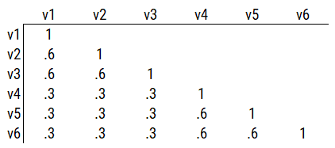
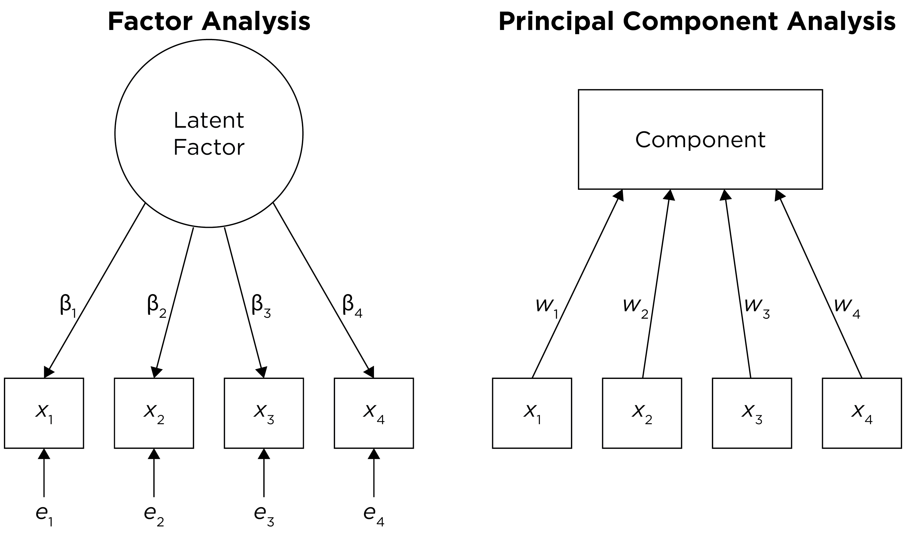
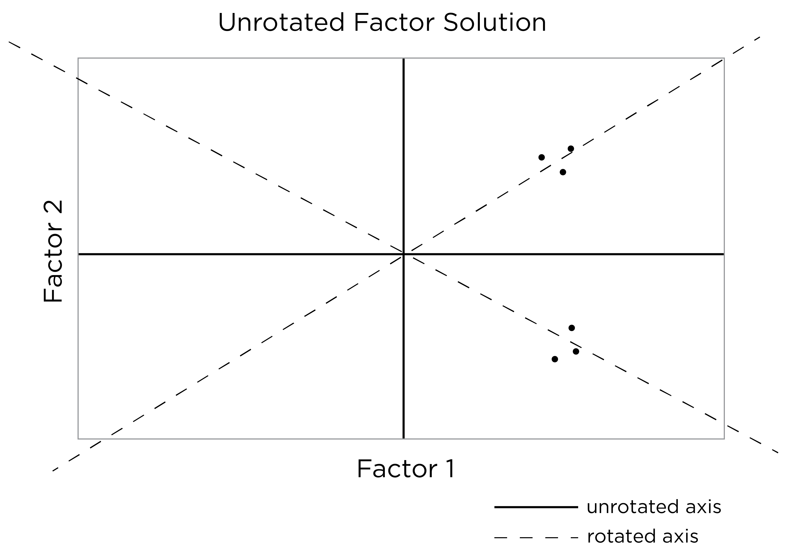
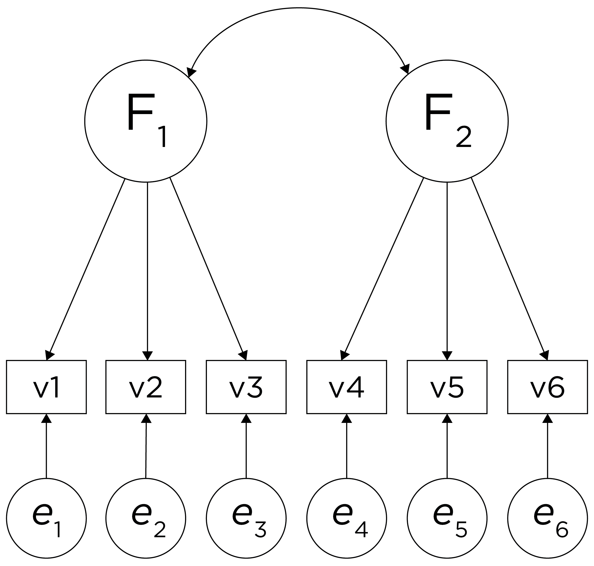

# Factor Analysis and Principal Component Analysis {#factor-analysis-PCA}

## Overview of Factor Analysis {#factorAnalysisOverview}

[Factor analysis](#factorAnalysis) is a class of latent variable models that is designated to identify the structure of a measure or set of measures, and ideally, a construct or set of constructs.\index{factor analysis}
It aims to identify the optimal latent structure for a group of variables.\index{factor analysis}
[Factor analysis](#factorAnalysis) encompasses two general types: [confirmatory factor analysis](#cfa) and [exploratory factor analysis](#efa).\index{factor analysis}\index{factor analysis!confirmatory}\index{factor analysis!exploratory}
[*Exploratory factor analysis*](#efa) (EFA) is a latent variable modeling approach that is used when the researcher has no a priori hypotheses about how a set of variables are structured.\index{factor analysis!exploratory}
[EFA](#efa) seeks to identify the empirically optimal-fitting model in ways that balance accuracy (i.e., variance accounted for) and parsimony (i.e., simplicity).\index{parsimony}\index{factor analysis!exploratory}\index{latent variable}
[*Confirmatory factor analysis*](#cfa) (CFA) is a latent variable modeling approach that is used when a researcher wants to evaluate how well a hypothesized model fits, and the model can be examined in comparison to alternative models.\index{factor analysis!confirmatory}\index{latent variable}
Using a [CFA](#cfa) approach, the researcher can pit models representing two theoretical frameworks against each other to see which better accounts for the observed data.\index{factor analysis!confirmatory}

[Factor analysis](#factorAnalysis) is considered to be a "pure" data-driven method for identifying the structure of the data, but the "truth" that we get depends heavily on the decisions we make regarding the parameters of our [factor analysis](#factorAnalysis).\index{factor analysis!confirmatory}
The goal of [factor analysis](#factorAnalysis) is to identify simple, parsimonious factors that underlie the "junk" (i.e., scores filled with measurement error) that we observe.\index{parsimony}\index{factor analysis!confirmatory}

It used to take a long time to calculate a [factor analysis](#factorAnalysis) because it was computed by hand.\index{factor analysis!confirmatory}
Now, it is fast to compute [factor analysis](#factorAnalysis) with computers (e.g., oftentimes less than 30 ms).\index{factor analysis!confirmatory}
In the 1920s, Spearman developed [factor analysis](#factorAnalysis) to understand the factor structure of intelligence.\index{factor analysis!confirmatory}\index{intellectual assessment}
It was a long process—it took Spearman around one year to calculate the first [factor analysis](#factorAnalysis)!\index{factor analysis!confirmatory}
[Factor analysis](#factorAnalysis) takes a large dimension data set and simplifies into smaller constructs.\index{parsimony}\index{factor analysis!confirmatory}
If you believe that nature is simple underneath, [factor analysis](#factorAnalysis) gives nature a chance to display the simplicity that lives beneath the complexity on the surface.\index{parsimony}\index{factor analysis!confirmatory}
Spearman identified a single factor, *g*, that accounted for most of the covariation between the measures of intelligence.\index{factor analysis!confirmatory}\index{intelligence!\textit{g}}

[Factor analysis](#factorAnalysis) involves observed (manifest) variables and unobserved (latent) factors.\index{factor analysis}\index{latent variable}
In a [reflective model](#reflectiveConstruct), it is assumed that the latent factor influences the manifest variables, and the latent factor therefore reflects the common variance among the variables.\index{factor analysis}\index{latent variable}\index{latent variable}\index{construct!reflective}
A factor model potentially includes factor loadings, residuals (errors or disturbances), intercepts, covariances, and regression paths.\index{factor analysis}
A regression path indicates a hypothesis that one variable (or factor) influences another.\index{factor analysis}
The standardized regression coefficient represents the strength of association between the variables or factors.\index{factor analysis}\index{standardized regression coefficient}
A factor loading is a regression path from a latent factor to an observed (manifest) variable.\index{factor analysis}\index{structural equation modeling!factor loading}\index{latent variable}
The standardized factor loading represents the strength of association between the variable and the latent factor.\index{factor analysis}\index{structural equation modeling!factor loading}\index{latent variable}\index{standardized regression coefficient}
A residual is variance in a variable (or factor) that is unexplained by other variables or factors.\index{factor analysis}\index{structural equation modeling!residual}
An intercept is the expected value of a variable if the mean of the factor is equal to zero.\index{factor analysis}\index{structural equation modeling!intercept}
Covariances are the associations between variables (or factors).\index{factor analysis}\index{structural equation modeling!covariance}

In factor analysis, the relation between an indicator (`X`) and its underlying latent factor(s) (`F`) can be represented with a regression formula as in Equation \@ref(eq:indicatorLatentAssociation):\index{factor analysis}\index{structural equation modeling!factor loading}\index{structural equation modeling!intercept}

$$
\text{X} = \lambda \cdot \text{F} + \text{Item Intercept} + \text{Error Term}
(\#eq:indicatorLatentAssociation)
$$

where:

- `X` is the observed value of the indicator
- $\lambda$ is the factor loading, indicating the strength of the association between the indicator and the latent factor(s)
- `F` is the person's value on the latent factor(s)
- `Item Intercept` represents the constant term that accounts for the expected value of the indicator when the latent factor(s) are zero
- `Error Term` is the residual, indicating the extent of variance in the indicator that is not explained by the latent factor(s)

Another class of [factor analysis](#factorAnalysis) models are [higher-order](#higherOrderModel) (or hierarchical) factor models and [bifactor models](#bifactorModel).\index{factor analysis}\index{factor analysis!higher-order}\index{factor analysis!bifactor}
Guidelines in using [higher-order factor](#higherOrderModel) and [bifactor](#bifactorModel) models are discussed by @Markon2019.\index{factor analysis}\index{factor analysis!higher-order}\index{factor analysis!bifactor}

[Factor analysis](#factorAnalysis) is a powerful technique to help identify the factor structure that underlies a measure or construct.\index{factor analysis}
As discussed in Section \@ref(factorAnalysisDecisions), however, there are many decisions to make in [factor analysis](#factorAnalysis), in addition to questions about which variables to use, how to scale the variables, etc.\index{factor analysis}
If the variables going into a [factor analysis](#factorAnalysis) are not well assessed, [factor analysis](#factorAnalysis) will not rescue the factor structure.\index{factor analysis}
In such situations, there is likely to be the problem of garbage in, garbage out.\index{factor analysis}
Factor analysis depends on the covariation among variables.\index{factor analysis}
Given the extensive [method variance](#methodBias) that measures have, [factor analysis](#factorAnalysis) (and [principal component analysis](#pca)) tends to extract method factors.\index{factor analysis}\index{principal component analysis}\index{method bias}\index{factor analysis!method factor}
Method factors are factors that are related to the methods being assessed rather than the construct of interest.\index{factor analysis}\index{method bias}\index{factor analysis!method factor}
However, [multitrait-multimethod](#MTMM) approaches to [factor analysis](#factorAnalysis) (such as in Section \@ref(mtmmCFA)) help better partition the variance in variables that reflects method variance versus construct variance, to get more accurate estimates of constructs.\index{factor analysis}\index{multitrait-multimethod matrix}

@Floyd1995 provide an overview of [factor analysis](#factorAnalysis) for the development of clinical assessments.\index{factor analysis}

### Example Factor Models from Correlation Matrices {#exampleFactorModelsFromCorrelationMatrices}

Below, I provide some example factor models from various correlation matrices.\index{factor analysis}
Analytical examples of [factor analysis](#factorAnalysis) are presented in Section \@ref(factorAnalysisExamples).\index{factor analysis}

Consider the example correlation matrix in Figure \@ref(fig:correlationMatrix1).\index{factor analysis}
Because all of the correlations are the same ($r = .60$), we expect there is approximately one factor for this pattern of data.\index{factor analysis}

```{r correlationMatrix1, out.width = "100%", fig.align = "center", fig.cap = "Example Correlation Matrix 1.", echo = FALSE}
knitr::include_graphics("./Images/correlationMatrix1.png")
```

In a single-factor model fit to these data, the factor loadings are .77 and the residual error terms are .40, as depicted in Figure \@ref(fig:factorAnalysis1).\index{factor analysis}
The amount of common variance ($R^2$) that is accounted for by an indicator is estimated as the square of the standardized loading: $.60 = .77 \times .77$.\index{factor analysis}\index{structural equation modeling!factor loading}
The amount of error for an indicator is estimated as: $\text{error} = 1 - \text{common variance}$, so in this case, the amount of error is: $.40 = 1 - .60$.\index{factor analysis}\index{structural equation modeling!residual}
The proportion of the total variance in indicators that is accounted for by the latent factor is the sum of the square of the standardized loading divided by the number of indicators.\index{factor analysis}
That is, to calculate the proportion of the total variance in the variables that is accounted for by the latent factor, you would square the loadings, sum them up, and divide by the number of variables: $\frac{.77^2 + .77^2 + .77^2 + .77^2 + .77^2 + .77^2}{6} = \frac{.60 + .60 + .60 + .60 + .60 + .60}{6} = .60$.\index{factor analysis}
Thus, the latent factor accounts for 60% of the variance in the indicators.\index{factor analysis}
In this model, the latent factor explains the covariance among the variables.\index{factor analysis}
If the answer is simple, a small and parsimonious model should be able to obtain the answer.\index{parsimony}.\index{factor analysis}

```{r factorAnalysis1, out.width = "100%", fig.align = "center", fig.cap = "Example Confirmatory Factor Analysis Model: Unidimensional Model.", echo = FALSE}
knitr::include_graphics("./Images/FactorAnalysis-01.png")
```

Consider a different correlation matrix in Figure \@ref(fig:correlationMatrix2).\index{factor analysis}
There is no common variance (correlations between the variables are zero), so there is no reason to believe there is a common factor that influences all of the variables.\index{factor analysis}
Variables that are not correlated cannot be related by a third variable, such as a common factor, so a common factor is not the right model.\index{factor analysis}

```{r correlationMatrix2, out.width = "100%", fig.align = "center", fig.cap = "Example Correlation Matrix 2.", echo = FALSE}
knitr::include_graphics("./Images/correlationMatrix2.png")
```

Consider another correlation matrix in Figure \@ref(fig:correlationMatrix3).\index{factor analysis}

```{r correlationMatrix3, out.width = "100%", fig.align = "center", fig.cap = "Example Correlation Matrix 3.", echo = FALSE}
knitr::include_graphics("./Images/correlationMatrix3.png")
```

If you try to fit a single factor to this correlation matrix, it generates a factor model depicted in Figure \@ref(fig:factorAnalysis2).\index{factor analysis}
In this model, the first three variables have a factor loading of .77, but the remaining three variables have a factor loading of zero.\index{factor analysis}
This indicates that three remaining factors likely do not share a common factor with the first three variables.\index{factor analysis}

```{r factorAnalysis2, out.width = "100%", fig.align = "center", fig.cap = "Example Confirmatory Factor Analysis Model: Multidimensional Model.", echo = FALSE}
knitr::include_graphics("./Images/FactorAnalysis-02.png")
```

Therefore, a one-factor model is probably not correct; instead, the structure of the data is probably best represented by a two-factor model, as depicted in Figure \@ref(fig:factorAnalysis3).\index{factor analysis}
In the model, Factor 1 explains why measures 1, 2, and 3 are correlated, whereas Factor 2 explains why measures 4, 5, and 6 are correlated.\index{factor analysis}
A two-factor model thus explains why measures 1, 2, and 3 are not correlated with measures 4, 5, and 6.\index{factor analysis}

```{r factorAnalysis3, out.width = "100%", fig.align = "center", fig.cap = "Example Confirmatory Factor Analysis Model: Two-Factor Model With Uncorrelated Factors.", echo = FALSE}
knitr::include_graphics("./Images/FactorAnalysis-03.png")
```

Consider another correlation matrix in Figure \@ref(fig:correlationMatrix4).\index{factor analysis}

```{r correlationMatrix4, out.width = "100%", fig.align = "center", fig.cap = "Example Correlation Matrix 4.", echo = FALSE}

```

One way to model these data is depicted in Figure \@ref(fig:factorAnalysis4).\index{factor analysis}
In this model, the factor loadings are .77, the residual error terms are .40, and there is a covariance path of .50 for the association between Factor 1 and Factor 2.\index{factor analysis}
Going from the model to the correlation matrix is deterministic.\index{factor analysis}
If you know the model, you can calculate the correlation matrix.\index{factor analysis}
For instance, using path tracing rules (described in Section \@ref(ctt)), the correlation of measures within a factor in this model is calculated as: $0.60 = .77 \times .77$.\index{factor analysis}\index{path analysis!path tracing rules}
Using path tracing rules, the correlation of measures across factors in this model is calculated as: $.30 = .77 \times .50 \times .77$.\index{factor analysis}\index{path analysis!path tracing rules}

```{r factorAnalysis4, out.width = "100%", fig.align = "center", fig.cap = "Example Confirmatory Factor Analysis Model: Two-Factor Model With Correlated Factors.", echo = FALSE}
knitr::include_graphics("./Images/FactorAnalysis-04.png")
```

Although going from the model to the correlation matrix is deterministic, going from the correlation matrix to the model is not deterministic.\index{factor analysis}
If you know the correlation matrix, there may be many possible models.\index{factor analysis}
For instance, the model could also be the one depicted in Figure \@ref(fig:factorAnalysis5), with factor loadings of .77, residual error terms of .40, and a regression path of .50.\index{factor analysis}
This model has the exact same same fit as the previous model, but it has different implications.\index{factor analysis}
Unlike the previous model, in this model, there is a "causal" pathway from Factor 1 to Factor 2.\index{factor analysis}
However, the causal effect of Factor 1 does not account for all of the variance in Factor 2 because the correlation is only .50.\index{factor analysis}

```{r factorAnalysis5, out.width = "100%", fig.align = "center", fig.cap = "Example Confirmatory Factor Analysis Model: Two-Factor Model With Regression Path.", echo = FALSE}
knitr::include_graphics("./Images/FactorAnalysis-05.png")
```

Alternatively, something else (e.g., another factor) could be explaining the data that we have not considered, as depicted in Figure \@ref(fig:factorAnalysis6).\index{factor analysis}
This is a [higher-order factor model](#higherOrderModel), in which there is a higher-order factor ($A_1$) that influences both lower-order factors, Factor 1 ($F_1$) and Factor 2 ($F_2$).\index{factor analysis}\index{factor analysis!higher-order}
This model has the exact same same fit as the previous models.\index{factor analysis}
The factor loadings from the lower order factors to the manifest variables are .77, the factor loading from the higher-order factor to the lower-order factors is .71, and the residual error terms are .40.\index{factor analysis}
The proportion of variance in Factor 2 that is explained by Factor 1 is calculated as: $.25 = .50 \times .50)$.\index{factor analysis}
The disturbance term is calculated as $.75 = 1 - (.50 \times .50) = 1 - .25$.\index{factor analysis}
Using path tracing rules, the correlation of measures across factors in this model is calculated as: $.30 = .77 \times .71 \times .71 \times .77$.\index{factor analysis}\index{path analysis!path tracing rules}

```{r factorAnalysis6, out.width = "100%", fig.align = "center", fig.cap = "Example Confirmatory Factor Analysis Model: Higher-Order Factor Model.", echo = FALSE}
knitr::include_graphics("./Images/FactorAnalysis-06.png")
```

Alternatively, there could be a single factor that ties measures 1, 2, and 3 together and measures 4, 5, and 6 together, as depicted in Figure \@ref(fig:factorAnalysis7).\index{factor analysis}
In this model, the measures no longer have random error: measures 1, 2, and 3 have correlated residuals—that is, they share error variance; likewise, measures 4, 5, and 6 have correlated residuals.\index{structural equation modeling!residual!correlated}\index{factor analysis}
The proportion of variance in Factor 2 that is explained by the higher-order factor is calculated as: $.50 = .71 \times .71)$.\index{factor analysis}
The disturbance term is calculated as $.50 = 1 - (.71 \times .71) = 1 - .50$.
This model has the exact same same fit as the previous models.\index{factor analysis}
Using path tracing rules, the correlation of measures within a factor in this model is calculated as: $.60 = (.55 \times .55) + (.70 \times .43 \times .70) + (.70 \times .43 \times .43 \times .70)$.\index{factor analysis}\index{path analysis!path tracing rules}
Using path tracing rules, the correlation of measures across factors in this model is calculated as: $.30 = .55 \times .55$.\index{factor analysis}\index{path analysis!path tracing rules}
In this model, the latent factor accounts for 30% of the variance in the indicators: $\frac{.55^2 + .55^2 + .55^2 + .55^2 + .55^2 + .55^2}{6} = \frac{.30 + .30 + .30 + .30 + .30 + .30}{6} = .30$.\index{factor analysis}

```{r factorAnalysis7, out.width = "100%", fig.align = "center", fig.cap = "Example Confirmatory Factor Analysis Model: Unidimensional Model With Correlated Residuals.", echo = FALSE}
knitr::include_graphics("./Images/FactorAnalysis-07.png")
```

### Indeterminacy {#indeterminacy}

There could be many more models that have the same fit to the data.\index{factor analysis!indeterminacy}
Thus, [factor analysis](#factorAnalysis) has *indeterminancy* because all of these models can explain these same data equally well, with all having different theoretical meaning.\index{factor analysis!indeterminacy}
The goal of [factor analysis](#factorAnalysis) is for the model to look at the data and induce the model.\index{factor analysis}
However, most data matrices in real life are very complicated—much more complicated than in these examples.\index{factor analysis}

This is why we do not calculate our own [factor analysis](#factorAnalysis) by hand; use a stats program!\index{factor analysis}
It is important to think about the possibility of other models to determine how confident you can be in your data model.\index{factor analysis}
For every fully specified factor model—i.e., where the relevant paths are all defined, there is one and only one predictive data matrix (correlation matrix).\index{factor analysis}
However, each data matrix can produce many different factor models.\index{factor analysis!indeterminacy}
There is no way to distinguish which of these factor models is correct from the data matrix alone.\index{factor analysis!indeterminacy}
Any given data matrix can predict an infinite number of factor models that accurately represent the data structure—so we make decisions that determine what type of factor solution our data will yield.\index{factor analysis!indeterminacy}

Many models could explain your data, and there are many more models that do not explain the data.\index{factor analysis!indeterminacy}
For equally good-fitting models, decide based on interpretability.\index{factor analysis}
If you have strong theory, decide based on theory and things outside of [factor analysis](#factorAnalysis)!\index{factor analysis}\index{theory}

### Practical Considerations {#practicalConsiderations-factorAnalysis}

There are important considerations for doing [factor analysis](#factorAnalysis) in real life with complex data.\index{factor analysis!practical considerations}
Traditionally, researchers had to consider what kind of data they have, and often assumed interval-level data even though data in psychology are often not interval data.\index{factor analysis!practical considerations}\index{data!interval}
In the past, [factor analysis](#factorAnalysis) was not good with categorical, dichotomous (e.g., True/False) data because the variance then is largely determined by the mean.\index{factor analysis!practical considerations}\index{data!nominal}\index{data!dichotomous}
So, we need something more complicated for dichotomous data.\index{factor analysis!practical considerations}\index{data!nominal}\index{data!dichotomous}
More solutions are available now for [factor analysis](#factorAnalysis) with ordinal and dichotomous data, but it is generally best to have at least four ordered categories to perform [factor analysis](#factorAnalysis).\index{factor analysis!practical considerations}\index{data!nominal}\index{data!dichotomous}\index{data!ordinal}\index{data!polytomous}

The necessary sample size depends on the complexity of the true factor structure.\index{factor analysis!practical considerations}
If there is a strong single factor for 30 items, then $N = 50$ is plenty.\index{factor analysis!practical considerations}
But if there are five factors and some correlated errors, then the sample size will need to be closer to ~5,000.\index{structural equation modeling!residual!correlated}\index{factor analysis!practical considerations}
[Factor analysis](#factorAnalysis) can recover the truth when the world is simple.\index{parsimony}\index{factor analysis}
However, nature is often not simple, and it may end in the distortion of nature instead of nature itself.\index{factor analysis}

Recommendations for [factor analysis](#factorAnalysis) are described by @Sellbom2019a.\index{factor analysis}

### Decisions to Make in Factor Analysis {#factorAnalysisDecisions}

There are many decisions to make in [factor analysis](#factorAnalysis).\index{factor analysis!decisions}
These decisions can have important impacts on the resulting solution.\index{factor analysis!decisions}
Decisions include things such as:\index{factor analysis!decisions}

1. What variables to include in the model and how to scale them\index{factor analysis!decisions}
1. Method of factor extraction: [factor analysis](#factorAnalysis) or [PCA](#pca)\index{factor analysis!decisions}\index{factor analysis}\index{principal component analysis}
1. If [factor analysis](#factorAnalysis), the kind of [factor analysis](#factorAnalysis): [EFA](#efa) or [CFA](#cfa)\index{factor analysis!decisions}\index{factor analysis!confirmatory}\index{factor analysis!exploratory}
1. How many factors to retain\index{factor analysis}
1. If [EFA](#efa) or [PCA](#pca), whether and how to rotate factors (factor rotation)\index{factor analysis!decisions}\index{factor analysis!exploratory}\index{principal component analysis}
1. Model selection and interpretation\index{factor analysis!decisions}

#### 1. Variables to Include and their Scaling {#variablesToInclude-factorAnalysis}

The first decision when conducting a [factor analysis](#factorAnalysis) is which variables to include and the scaling of those variables.\index{factor analysis!decisions}
What factors (or components) you extract can differ widely depending on what variables you include in the analysis.\index{factor analysis!decisions}
For example, if you include many variables from the same source (e.g., self-report), it is possible that you will extract a factor that represents the common variance among the variables from that source (i.e., the self-reported variables).\index{factor analysis!decisions}\index{factor analysis!method factor}
This would be considered a method factor, which works against the goal of estimating latent factors that represent the constructs of interest (as opposed to the measurement methods used to estimate those constructs).\index{factor analysis!decisions}\index{factor analysis!method factor}
An additional consideration is the scaling of the variables—whether to use the raw scaling or whether to standardize them to be on a more common metric (e.g., z-score metric with a mean of zero and standard deviation of one).\index{factor analysis!decisions}

#### 2. Method of Factor Extraction {#methodOfFactorExtraction}

The second decision is to select the method of factor extraction.\index{factor analysis!decisions}
This is the algorithm that is going to try to identify factors.\index{factor analysis!decisions}
There are two main families of factor or component extraction: analytic or principal components.\index{factor analysis!decisions}\index{principal component analysis}
The principal components approach is called [principal component analysis](#pca) (PCA).\index{factor analysis!decisions}\index{principal component analysis}
[PCA](#pca) is not really a form [factor analysis](#factorAnalysis); rather, it is useful for data reduction [@Lilienfeld2015].\index{factor analysis!decisions}\index{principal component analysis}\index{data!reduction}
The analytic family includes [factor analysis](#factorAnalysis) approaches such as principal axis factoring and maximum likelihood [factor analysis](#factorAnalysis).\index{factor analysis!decisions}\index{factor analysis}
The distinction between [factor analysis](#factorAnalysis) and [PCA](#pca) is depicted in Figure \@ref(fig:factorAnalysisPCA).\index{factor analysis!decisions}\index{factor analysis}\index{principal component analysis}

```{r factorAnalysisPCA, out.width = "100%", fig.align = "center", fig.cap = "Distinction Between Factor Analysis and Principal Component Analysis.", echo = FALSE}

```

##### Principal Component Analysis {#pca}

Principal component analysis (PCA) is used if you want to reduce your data matrix.\index{factor analysis!decisions}\index{principal component analysis}
PCA composites represent the variances of an observed measure in as economical a fashion as possible, with no latent underlying variables.\index{factor analysis!decisions}\index{principal component analysis}
The goal of PCA is to identify a smaller number of components that explain as much variance in a set of variables as possible.\index{factor analysis!decisions}\index{principal component analysis}\index{data!reduction}
It is an atheoretical way to decompose a matrix.\index{factor analysis!decisions}\index{principal component analysis}
PCA involves decomposition of a data matrix into a set of eigenvectors, which are transformations of the old variables.\index{factor analysis!decisions}\index{principal component analysis}\index{eigenvector}

The eigenvectors attempt to simplify the data in the matrix.\index{parsimony}\index{factor analysis!decisions}\index{principal component analysis}\index{eigenvector}
PCA takes the data matrix and identifies the weighted sum of all variables that does the best job at explaining variance: these are the principal components, also called eigenvectors.\index{factor analysis!decisions}\index{principal component analysis}\index{eigenvector}
Principal components reflect optimally weighted sums.\index{factor analysis!decisions}\index{principal component analysis}
In this way, PCA is a [formative model](#formativeConstruct) (by contrast, [factor analysis](#factorAnalysis) applies a [reflective model](#reflectiveConstruct)).\index{factor analysis!decisions}\index{principal component analysis}\index{construct!formative}\index{factor analysis}\index{construct!reflective}

PCA decomposes the data matrix into any number of components—as many as the number of variables, which will always account for all variance.\index{factor analysis!decisions}\index{principal component analysis}
After the model is fit, you can look at the results and discard the components which likely reflect error variance.\index{factor analysis!decisions}\index{principal component analysis}
Judgments about which factors to retain are based on empirical criteria in conjunction with theory to select a parsimonious number of components that account for the majority of variance.\index{factor analysis!decisions}\index{principal component analysis}

The eigenvalue reflects the amount of variance explained by the component (eigenvector).\index{factor analysis!decisions}\index{principal component analysis}\index{eigenvalue}
When using a varimax (orthogonal) rotation, an eigenvalue for a component is calculated as the sum of squared component loadings on that component.\index{factor analysis!decisions}\index{principal component analysis}\index{orthogonal rotation}\index{eigenvalue}
When using oblique rotation, however, the items explain more variance than is attributable to their factor loadings because the factors are correlated.\index{factor analysis!decisions}\index{principal component analysis}\index{oblique rotation}

PCA pulls the first principal component out (i.e., the eigenvector that explains the most variance) and makes a new data matrix: i.e., new correlation matrix.\index{factor analysis!decisions}\index{principal component analysis}\index{eigenvector}
Then the PCA pulls out the component that explains the next most variance—i.e., the eigenvector with the next largest eigenvalue, and it does this for all components, equal to the same number of variables.\index{factor analysis!decisions}\index{principal component analysis}\index{eigenvector}\index{eigenvalue}
For instance, if there are six variables, it will iteratively extract an additional component up to six components.\index{factor analysis!decisions}\index{principal component analysis}
You can extract as many eigenvectors as there are variables.\index{factor analysis!decisions}\index{principal component analysis}\index{eigenvector}
If you extract all six components, the data matrix left over will be the same as the correlation matrix in Figure \@ref(fig:correlationMatrix2).\index{factor analysis!decisions}\index{principal component analysis}
That is, the remaining variables will be entirely uncorrelated with the remaining variables, because six components explain 100% of the variance from six variables.\index{factor analysis!decisions}\index{principal component analysis}
In other words, you can can explain (6) variables with (6) new things!\index{factor analysis!decisions}\index{principal component analysis}

However, it does no good if you have to use all (6) components because there is no data reduction from the original number of variables, but hopefully the first few components will explain most of the variance.\index{factor analysis!decisions}\index{principal component analysis}\index{data!reduction}

The sum of all eigenvalues is equal to the number of variables in the analysis.\index{factor analysis!decisions}\index{principal component analysis}\index{eigenvalue}
PCA does not have same assumptions as [factor analysis](#factorAnalysis), which assumes that measures are partly from common variance and error.\index{factor analysis!decisions}\index{principal component analysis}\index{factor analysis}\index{measurement error}\index{structural equation modeling!common variance}
But if you estimate (6) eigenvectors and only keep (2), the model is a two-component model and whatever left becomes error.\index{factor analysis!decisions}\index{principal component analysis}\index{measurement error}\index{eigenvector}
Therefore, PCA does not have the same assumptions as [factor analysis](#factorAnalysis), but it often ends up in the same place.\index{factor analysis!decisions}\index{principal component analysis}\index{factor analysis}

Most people who want to conduct a [factor analysis](#factorAnalysis) use PCA, but PCA is not really [factor analysis](#factorAnalysis) [@Lilienfeld2015].\index{factor analysis!decisions}\index{principal component analysis}\index{factor analysis}
PCA is what SPSS can do quickly.\index{factor analysis!decisions}\index{principal component analysis}
But computers are so fast now—just do a real [factor analysis](#factorAnalysis)!\index{factor analysis!decisions}\index{factor analysis}
[Factor analysis](#factorAnalysis) better handles error than PCA—[factor analysis](#factorAnalysis) assumes that what is in the variable is the combination of common construct variance and error.\index{factor analysis!decisions}\index{principal component analysis}\index{factor analysis}
By contrast, PCA assumes that the measures have no measurement error.\index{factor analysis!decisions}\index{principal component analysis}\index{measurement error}

##### Factor Analysis {#factorAnalysis}

Factor analysis is an analytic approach to factor extraction.\index{factor analysis!decisions}\index{factor analysis}
Factor analysis is a special case of [structural equation modeling](#sem) (SEM).\index{factor analysis!decisions}\index{factor analysis}\index{structural equation modeling}
Factor analysis is an analytic technique that is interested in the factor structure of a measure or set of measures.\index{factor analysis!decisions}\index{factor analysis}
Factor analysis is a theoretical approach that considers that there are latent theoretical constructs that influence the scores on particular variables.\index{factor analysis!decisions}\index{factor analysis}\index{latent variable}
It assumes that part of the explanation for each variable is shared between variables, and that part of it is unique variance.\index{factor analysis!decisions}\index{factor analysis}\index{measurement error}\index{structural equation modeling!common variance}
The unique variance is considered error.\index{factor analysis!decisions}\index{factor analysis}\index{measurement error}
The common variance is called the communality, which is the factor variance.\index{factor analysis!decisions}\index{factor analysis}\index{structural equation modeling!common variance}\index{communality}
Communality of a factor is estimated using the [average variance extracted](#averageVarianceExtracted) (AVE).\index{factor analysis!decisions}\index{factor analysis}\index{structural equation modeling!common variance}\index{communality}\index{reliability!internal consistency!average variance extracted}
The amount of variance due to error is: $1 - \text{communality}$.\index{factor analysis!decisions}\index{factor analysis}\index{measurement error}\index{structural equation modeling!common variance}\index{communality}
There are several types of factor analysis, including principal axis factoring and maximum likelihood factor analysis.\index{factor analysis!decisions}\index{factor analysis}

Factor analysis can be used to test [measurement/factorial invariance](#measurementInvariance) and for [multitrait-multimethod](#MTMM) designs.\index{factor analysis!decisions}\index{factor analysis}\index{multitrait-multimethod matrix}
One example of a [MTMM](#MTMM) model in factor analysis is the correlated traits correlated methods model [@Tackett2019b].\index{factor analysis!decisions}\index{factor analysis}\index{multitrait-multimethod matrix}

There are several differences between (real) factor analysis versus [PCA](#pca).\index{factor analysis!decisions}\index{factor analysis}\index{principal component analysis}
Factor analysis has greater sophistication than [PCA](#pca), but greater sophistication often results in greater assumptions.\index{factor analysis!decisions}\index{factor analysis}\index{principal component analysis}
Factor analysis does not always work; the data may not always fit to a factor analysis model; therefore, use [PCA](#pca) as a second/last option.\index{factor analysis!decisions}\index{factor analysis}\index{principal component analysis}
[PCA](#pca) can decompose any data matrix; it always works.\index{factor analysis!decisions}\index{principal component analysis}
[PCA](#pca) is okay if you are not interested in the factor structure.\index{factor analysis!decisions}\index{principal component analysis}
[PCA](#pca) uses all variance of variables and assumes variables have no error, so it does not account for measurement error.\index{factor analysis!decisions}\index{principal component analysis}\index{measurement error}
[PCA](#pca) is good if you just want to form a linear composite and if the causal structure is [formative](#formativeConstruct) (rather than [reflective](#reflectiveConstruct)).\index{factor analysis!decisions}\index{principal component analysis}\index{linear composite}\index{construct!formative}\index{construct!reflective}
However, if you are interested in the factor structure, use factor analysis, which estimates a latent variable that accounts for the common variance and discards error variance.\index{factor analysis!decisions}\index{factor analysis}
Factor analysis is useful for the identification of latent constructs—i.e., underlying dimensions or factors that explain (cause) scores on items.\index{factor analysis!decisions}\index{factor analysis}

#### 3. EFA or CFA {#efa-cfa}

A third decision is the kind of [factor analysis](#factorAnalysis) to use: [exploratory factor analysis](#efa) (EFA) or [confirmatory factor analysis](#cfa) (CFA).\index{factor analysis!decisions}\index{factor analysis!exploratory}\index{factor analysis!confirmatory}

##### Exploratory Factor Analysis (EFA) {#efa}

EFA is used if you have no a priori hypotheses about the factor structure of the model, but you would like to understand the latent variables represented by your items.\index{factor analysis!decisions}\index{factor analysis!exploratory}

EFA is partly induced from the data.\index{factor analysis!decisions}\index{factor analysis!exploratory}
You feed in the data and let the program build the factor model.\index{factor analysis!decisions}\index{factor analysis!exploratory}
You can set some parameters going in, including how to extract or rotate the factors.\index{factor analysis!decisions}\index{factor analysis!exploratory}
The factors are extracted from the data without specifying the number and pattern of loadings between the items and the latent factors [@Bollen2002].\index{factor analysis!decisions}\index{factor analysis!exploratory}
All cross loadings are freely estimated.\index{cross loading}\index{factor analysis!decisions}\index{factor analysis!exploratory}

##### Confirmatory Factor Analysis (CFA) {#cfa}

CFA is used to confirm a priori hypotheses about the factor structure of the model.\index{factor analysis!decisions}\index{factor analysis!confirmatory}
CFA is a test of the hypothesis.\index{factor analysis!decisions}\index{factor analysis!confirmatory}
In CFA, you specify the model and ask how well this model represents the data.\index{factor analysis!decisions}\index{factor analysis!confirmatory}
The researcher specifies the number, meaning, associations, and pattern of free parameters in the factor loading matrix [@Bollen2002].\index{factor analysis!decisions}\index{factor analysis!confirmatory}
A key advantage of CFA is the ability to directly compare alternative models, which is valuable for theory testing [@Strauss2009].\index{factor analysis!decisions}\index{factor analysis!confirmatory}
In CFA, cross loadings are not estimated unless the researcher specifies them.\index{cross loading}\index{factor analysis!decisions}\index{factor analysis!confirmatory}

##### Exploratory Structural Equation Modeling (ESEM) {#efa-cfa-esem}

In real life, there is not a clear distinction between [EFA](#efa) and [CFA](#cfa).\index{factor analysis!decisions}\index{factor analysis!exploratory}\index{factor analysis!confirmatory}
In [CFA](#cfa), researchers often set only half of the constraints, and let the data fill in the rest.\index{factor analysis!decisions}\index{factor analysis!exploratory}\index{factor analysis!confirmatory}
In [EFA](#efa), researchers often set constraints and assumptions.
Thus, the line between [EFA](#efa) and [CFA](#cfa) is often blurred.\index{factor analysis!decisions}\index{factor analysis!exploratory}\index{factor analysis!confirmatory}

[EFA](#efa) and [CFA](#cfa) can be considered special cases of exploratory structural equation modeling (ESEM), which combines features of [EFA](#efa), [CFA](#cfa), and [SEM](#sem) [@Marsh2014].\index{factor analysis!decisions}\index{factor analysis!exploratory}\index{factor analysis!confirmatory}\index{structural equation modeling!exploratory}
ESEM can include any combination of exploratory (i.e., [EFA](#efa)) and confirmatory ([CFA](#cfa)) factors.\index{factor analysis!decisions}\index{factor analysis!exploratory}\index{factor analysis!confirmatory}\index{structural equation modeling!exploratory}
ESEM, unlike traditional [CFA](#cfa) models, typically estimates all cross loadings—at least for the exploratory factors.\index{cross loading}\index{factor analysis!decisions}\index{factor analysis!exploratory}\index{factor analysis!confirmatory}\index{structural equation modeling!exploratory}
If a [CFA](#cfa) model without cross loadings and correlated residuals fits as well as an ESEM model with all cross loadings, the [CFA](#cfa) model should be retained for its simplicity.\index{cross loading}\index{structural equation modeling!residual!correlated}\index{parsimony}\index{factor analysis!decisions}\index{factor analysis!exploratory}\index{factor analysis!confirmatory}\index{structural equation modeling!exploratory}
However, ESEM models often fit better than [CFA](#cfa) models because requiring no cross loadings is an unrealistic expectation of items from many psychological instruments [@Marsh2014].\index{cross loading}\index{factor analysis!decisions}\index{factor analysis!exploratory}\index{factor analysis!confirmatory}\index{structural equation modeling!exploratory}
The correlations between factors tend to be positively biased when fitting [CFA](#cfa) models without cross loadings, which leads to challenges in using [CFA](#cfa) to establish [discriminant validity](#discriminantValidity) [@Marsh2014].\index{cross loading}\index{factor analysis!decisions}\index{factor analysis!exploratory}\index{factor analysis!confirmatory}\index{structural equation modeling!exploratory}\index{validity!discriminant}
Thus, compared to [CFA](#cfa), ESEM has the potential to more accurately estimate factor correlations and establish [discriminant validity](#discriminantValidity) [@Marsh2014].\index{factor analysis!decisions}\index{factor analysis!exploratory}\index{factor analysis!confirmatory}\index{structural equation modeling!exploratory}\index{validity!discriminant}
Moreover, ESEM can be useful in a [multitrait-multimethod](#MTMM) framework.\index{factor analysis!decisions}\index{structural equation modeling!exploratory}\index{multitrait-multimethod matrix}
We provide examples of ESEM in Section \@ref(esemModel).\index{factor analysis!decisions}\index{structural equation modeling!exploratory}

#### 4. How Many Factors to Retain {#factorsToRetain}

A goal of [factor analysis](#factorAnalysis) and [PCA](#pca) is simplification or parsimony, while still explaining as much variance as possible.\index{parsimony}\index{factor analysis!decisions}\index{factor analysis}\index{principal component analysis}
The hope is that you can have fewer factors that explain the associations between the variables than the number of observed variables.\index{factor analysis!decisions}\index{factor analysis}\index{principal component analysis}
But how do you decide on the number of factors (in [factor analysis](#factorAnalysis)) or components (in [PCA](#pca))?\index{factor analysis!decisions}\index{factor analysis}\index{principal component analysis}

There are a number of criteria that one can use to help determine how many factors/components to keep:\index{factor analysis!decisions}\index{factor analysis}\index{principal component analysis}

- Kaiser-Guttman criterion: in [PCA](#pca), components with eigenvalues greater than one\index{factor analysis!decisions}\index{principal component analysis}\index{eigenvalue}
    - or, for [factor analysis](#factorAnalysis), factors with eigenvalues greater than zero\index{factor analysis!decisions}\index{factor analysis}\index{eigenvalue}
- Cattell's scree test: the "elbow" in a scree plot minus one; sometimes operationalized with optimal coordinates (OC) or the acceleration factor (AF)\index{factor analysis!decisions}\index{factor analysis}\index{principal component analysis}\index{scree plot}
- Parallel analysis: factors that explain more variance than randomly simulated data\index{factor analysis!decisions}\index{factor analysis}\index{principal component analysis}\index{parallel analysis}
- [Very simple structure (VSS)](#vssPlot) criterion: larger is better\index{factor analysis!decisions}\index{factor analysis}\index{principal component analysis}
- Velicer minimum average partial (MAP) test: smaller is better\index{factor analysis!decisions}\index{factor analysis}\index{principal component analysis}
- Aikake information criterion (AIC): smaller is better\index{factor analysis!decisions}\index{factor analysis}\index{principal component analysis}
- Bayesian information criterion (BIC): smaller is better\index{factor analysis!decisions}\index{factor analysis}\index{principal component analysis}
- sample size-adjusted BIC (SABIC): smaller is better\index{factor analysis!decisions}\index{factor analysis}\index{principal component analysis}
- root mean square error of approximation (RMSEA): smaller is better\index{factor analysis!decisions}\index{factor analysis}
- chi-square difference test: smaller is better; a significant test indicates that the more complex model is significantly better fitting than the less complex model\index{factor analysis!decisions}\index{factor analysis}
- standardized root mean square residual (SRMR): smaller is better\index{factor analysis!decisions}\index{factor analysis}
- Comparative Fit Index (CFI): larger is better\index{factor analysis!decisions}\index{factor analysis}
- Tucker Lewis Index (TLI): larger is better\index{factor analysis!decisions}\index{factor analysis}

There is not necessarily a "correct" criterion to use in determining how many factors to keep, so it is generally recommended that researchers use multiple criteria in combination with theory and interpretability.\index{factor analysis!decisions}\index{factor analysis}\index{principal component analysis}

A scree plot from a [factor analysis](#factorAnalysis) or [PCA](#pca) provides lots of information.\index{factor analysis!decisions}\index{factor analysis}\index{principal component analysis}\index{scree plot}
A scree plot has the factor number on the x-axis and the eigenvalue on the y-axis.\index{factor analysis!decisions}\index{factor analysis}\index{principal component analysis}\index{scree plot}\index{eigenvalue}
The eigenvalue is the variance accounted for by a factor; when using a varimax (orthogonal) rotation, an eigenvalue (or factor variance) is calculated as the sum of squared factor (or component) loadings on that factor.\index{factor analysis!decisions}\index{factor analysis}\index{principal component analysis}\index{scree plot}\index{eigenvalue}
An example of a scree plot is in Figure \@ref(fig:screePlot).\index{factor analysis!decisions}\index{factor analysis}\index{principal component analysis}\index{scree plot}

```{r screePlot, out.width = "100%", fig.align = "center", fig.cap = "Example of a Scree Plot.", echo = FALSE}
knitr::include_graphics("./Images/screePlot.png")
```

The total variance is equal to the number of variables you have, so one eigenvalue is approximately one variable's worth of variance.\index{eigenvalue}\index{factor analysis!decisions}\index{factor analysis}\index{principal component analysis}
In a [factor analysis](#factorAnalysis) and [PCA](#pca), the first factor (or component) accounts for the most variance, the second factor accounts for the second-most variance, and so on.\index{factor analysis!decisions}\index{factor analysis}\index{principal component analysis}
The more factors you add, the less variance is explained by the additional factor.\index{factor analysis!decisions}\index{factor analysis}\index{principal component analysis}

One criterion for how many factors to keep is the Kaiser-Guttman criterion.
According to the Kaiser-Guttman criterion, you should keep any factors whose eigenvalue is greater than one.\index{factor analysis!decisions}\index{factor analysis}\index{principal component analysis}
That is, for the sake of simplicity, parsimony, and data reduction, you should take any factors that explain more than a single variable would explain.\index{parsimony}\index{data!reduction}\index{factor analysis!decisions}\index{factor analysis}\index{principal component analysis}
According to the Kaiser-Guttman criterion, we would keep three factors from Figure \@ref(fig:screePlot) that have eigenvalues greater than one.\index{factor analysis!decisions}\index{factor analysis}\index{principal component analysis}\index{eigenvalue}
The default in SPSS is to retain factors with eigenvalues greater than 1.\index{factor analysis!decisions}\index{factor analysis}\index{principal component analysis}\index{eigenvalue}
However, keeping factors whose eigenvalue is greater than one is not the most correct rule.\index{factor analysis!decisions}\index{factor analysis}\index{principal component analysis}\index{eigenvalue}
If you let SPSS do this, you may get many factors with eigenvalues around 1 (e.g., factors with an eigenvalue ~ 1.0001) that are not adding so much that it is worth the added complexity.\index{factor analysis!decisions}\index{factor analysis}\index{principal component analysis}\index{eigenvalue}
The Kaiser-Guttman criterion usually results in keeping too many factors.\index{factor analysis!decisions}\index{factor analysis}\index{principal component analysis}
Factors with small eigenvalues around 1 could reflect error shared across variables.\index{factor analysis!decisions}\index{factor analysis}\index{principal component analysis}\index{eigenvalue}
For instance, factors with small eigenvalues could reflect method variance (i.e., method factor), such as a self-report factor that turns up as a factor in [factor analysis](#factorAnalysis), but that may be useless to you as a conceptual factor of a construct of interest.\index{factor analysis!method factor}\index{factor analysis!decisions}\index{factor analysis}\index{principal component analysis}\index{eigenvalue}

Another criterion is Cattell's scree test, which involves selecting the number of factors from looking at the scree plot.\index{factor analysis!decisions}\index{factor analysis}\index{principal component analysis}\index{scree plot}
"Scree" refers to the rubble of stones at the bottom of a mountain.\index{factor analysis!decisions}\index{factor analysis}\index{principal component analysis}\index{scree plot}
According to Cattell's scree test, you should keep the factors before the last steep drop in eigenvalues—i.e., the factors before the rubble, where the slope approaches zero.\index{factor analysis!decisions}\index{factor analysis}\index{principal component analysis}\index{eigenvalue}\index{scree plot}
The beginning of the scree (or rubble), where the slope approaches zero, is called the "elbow" of a scree plot.\index{factor analysis!decisions}\index{factor analysis}\index{principal component analysis}\index{scree plot}
Using Cattell's scree test, you retain the number of factors that explain the most variance prior to the explained variance drop off, because, ultimately, you want to include only as many factors in which you gain substantially more by the inclusion of these factors.\index{factor analysis!decisions}\index{factor analysis}\index{principal component analysis}\index{scree plot}
That is, you would keep the number of factors at the elbow of the scree plot minus one.\index{factor analysis!decisions}\index{factor analysis}\index{principal component analysis}\index{scree plot}
If the last steep drop occurs from Factor 4 to Factor 5 and the elbow is at Factor 5, we would keep four factors.\index{factor analysis!decisions}\index{factor analysis}\index{principal component analysis}\index{scree plot}
In Figure \@ref(fig:screePlot), the last steep drop in eigenvalues occurs from Factor 3 to Factor 4; the elbow of the scree plot occurs at Factor 4.\index{factor analysis!decisions}\index{factor analysis}\index{principal component analysis}\index{scree plot}
We would keep the number of factors at the elbow minus one.\index{factor analysis!decisions}\index{factor analysis}\index{principal component analysis}\index{scree plot}
Thus, using Cattell's scree test, we would keep three factors based on Figure \@ref(fig:screePlot).\index{factor analysis!decisions}\index{factor analysis}\index{principal component analysis}\index{scree plot}

There are more sophisticated ways of using scree plot, but they usually end up at a similar decision.\index{factor analysis!decisions}\index{factor analysis}\index{principal component analysis}\index{scree plot}
Examples of more sophisticated tests include parallel analysis and [very simple structure (VSS) plots](#vssPlot).\index{factor analysis!decisions}\index{factor analysis}\index{principal component analysis}\index{very simple structure plot}\index{parallel analysis}
In a parallel analysis, you examine where the eigenvalues from observed data and random data converge, so you do not retain a factor that explains less variance than would be expected by random chance.\index{factor analysis!decisions}\index{factor analysis}\index{principal component analysis}\index{parallel analysis}\index{eigenvalue}
A parallel analysis can be helpful when you have many variables and one factor accounts for the majority of the variance such that the elbow is at Factor 2 (which would result in keeping one factor), but you have theoretical reasons to select more than one factor.\index{factor analysis!decisions}\index{factor analysis}\index{principal component analysis}\index{parallel analysis}
An example in which parallel analysis may be helpful is with neurophysiological data.\index{factor analysis!decisions}\index{factor analysis}\index{principal component analysis}\index{parallel analysis}\index{neurophysiological assessment}
For instance, parallel analysis can be helpful when conducting temporo-spatial [PCA](#pca) of event-related potential (ERP) data in which you want to separate multiple time windows and multiple spatial locations despite a predominant signal during a given time window and spatial location [@Dien2012].\index{factor analysis!decisions}\index{principal component analysis}\index{parallel analysis}\index{neurophysiological assessment}

In general, my recommendation is to use Cattell's scree test, and then test the factor solutions with plus or minus one factor.\index{factor analysis!decisions}\index{factor analysis}\index{principal component analysis}\index{scree plot}
You should never accept [PCA](#pca) components with eigenvalues less than one (or factors with eigenvalues less than zero), because they are likely to be error.\index{factor analysis!decisions}\index{factor analysis}\index{principal component analysis}\index{eigenvalue}
If you are using maximum likelihood [factor analysis](#factorAnalysis), you can compare the fit of various models with model fit criteria to see which model fits best for its parsimony.\index{parsimony}\index{factor analysis!decisions}\index{factor analysis}
A model will always fit better when you add additional parameters or factors, so you examine if there is *significant* improvement in model fit when adding the additional factor—that is, we keep adding complexity until additional complexity does not buy us much.\index{parsimony}\index{factor analysis!decisions}\index{factor analysis}
Always try a factor solution that is one less and one more than suggested by Cattell's scree test to buffer your final solution because the purpose of [factor analysis](#factorAnalysis) is to explain things and to have interpretability.\index{factor analysis!decisions}\index{factor analysis}\index{principal component analysis}\index{scree plot}
Even if all rules or indicators suggest to keep X number of factors, maybe $\pm$ one factor helps clarifies things.\index{factor analysis!decisions}\index{factor analysis}\index{principal component analysis}
Even though [factor analysis](#factorAnalysis) is empirical, theory and interpretatability should also inform decisions.\index{factor analysis!decisions}\index{factor analysis}\index{principal component analysis}

#### 5. Factor Rotation {#factorRotation}

The next step if using [EFA](#efa) or [PCA](#pca) is, possibly, to rotate the factors to make them more interpretable and simple, which is the whole goal.\index{factor analysis!decisions}\index{factor analysis}\index{principal component analysis}\index{rotation}
To interpret the results of a [factor analysis](#factorAnalysis), we examine the factor matrix.\index{factor analysis!decisions}\index{factor analysis}\index{principal component analysis}\index{rotation}
The columns refer to the different factors, the columns refer to the different observed variables.\index{factor analysis!decisions}\index{factor analysis}\index{principal component analysis}\index{rotation}
The cells in the table are the factor loadings—they are basically the correlation between the variable and the factor.\index{factor analysis!decisions}\index{factor analysis}\index{principal component analysis}\index{rotation}\index{structural equation modeling!factor loading}
Our goal is to achieve a model with simple structure because it is easily interpretable.\index{factor analysis!decisions}\index{factor analysis}\index{principal component analysis}\index{simple structure}
*simple structure* means that every variable loads perfectly on one and only one factor, as operationalized by a matrix of factor loadings with values of one and zero and nothing else.\index{factor analysis!decisions}\index{factor analysis}\index{principal component analysis}\index{simple structure}
An example of a factor matrix that follows simple structure is depicted in Figure \@ref(fig:simpleStructure).\index{factor analysis!decisions}\index{factor analysis}\index{principal component analysis}\index{simple structure}

```{r simpleStructure, out.width = "100%", fig.align = "center", fig.cap = "Example of a Factor Matrix That Follows Simple Structure.", echo = FALSE}
knitr::include_graphics("./Images/simpleStructure.png")
```

An example of a measurement model that follows simple structure is depicted in Figure \@ref(fig:factorSolutionSimpleStructure).\index{factor analysis!decisions}\index{factor analysis}\index{principal component analysis}\index{simple structure}
Each variable loads onto one and only one factor, which makes it easy to interpret the meaning of each factor, because a given factor represents the common variance among the items that load onto it.\index{factor analysis!decisions}\index{factor analysis}\index{principal component analysis}

```{r factorSolutionSimpleStructure, out.width = "100%", fig.align = "center", fig.cap = "Example of a Measurement Model That Follows Simple Structure. 'INT' = internalizing problems; 'EXT' = externalizing problems; 'TD' = thought-disordered problems.", echo = FALSE}
knitr::include_graphics("./Images/factorSolutionSimpleStructure.png")
```

However, pure simple structure only occurs in simulations, not in real-life data.\index{factor analysis!decisions}\index{factor analysis}\index{principal component analysis}\index{simple structure}
In reality, our measurement model in an unrotated [factor analysis](#factorAnalysis) model might look like the model in Figure \@ref(fig:factorSolutionUnrotatedExample).\index{factor analysis!decisions}\index{factor analysis}\index{principal component analysis}
In this example, the measurement model does not show simple structure because the items have cross loadings—that is, the items load onto more than one factor.\index{factor analysis!decisions}\index{factor analysis}\index{principal component analysis}\index{cross loading}\index{simple structure}\index{structural equation modeling!measurement model}
The cross loadings make it difficult to interpret the factors, because all of the items load onto on the all of the factors, so the factors are not very distinct from each other, which makes it difficult to interpret what the factors mean.\index{cross loading}\index{factor analysis!decisions}\index{factor analysis}\index{principal component analysis}\index{cross loading}\index{simple structure}\index{structural equation modeling!measurement model}

```{r factorSolutionUnrotatedExample, out.width = "100%", fig.align = "center", fig.cap = "Example of a Measurement Model That Does Not Follow Simple Structure. 'INT' = internalizing problems; 'EXT' = externalizing problems; 'TD' = thought-disordered problems.", echo = FALSE}
knitr::include_graphics("./Images/factorSolutionUnrotatedExample.png")
```

As a result of the challenges of intepretability caused by cross loadings, factor rotations are often performed.\index{cross loading}\index{factor analysis!decisions}\index{factor analysis}\index{principal component analysis}\index{rotation}
An example of an unrotated factor matrix is in Figure \@ref(fig:factorMatrix).\index{factor analysis!decisions}\index{factor analysis}\index{principal component analysis}\index{rotation}

```{r factorMatrix, out.width = "100%", fig.align = "center", fig.cap = "Example of a Factor Matrix.", echo = FALSE}
knitr::include_graphics("./Images/factorMatrix.png")
```

In the example factor matrix in Figure \@ref(fig:factorMatrix), the [factor analysis](#factorAnalysis) is not very helpful—it tells us very little because it did not distinguish between the two factors.\index{factor analysis!decisions}\index{factor analysis}\index{principal component analysis}\index{rotation}
The variables have similar loadings on Factor 1 and Factor 2.\index{factor analysis!decisions}\index{factor analysis}\index{principal component analysis}\index{rotation}
An example of a unrotated factor solution is in Figure \@ref(fig:factorSolutionUnrotated).\index{factor analysis!decisions}\index{factor analysis}\index{principal component analysis}\index{rotation}
In the figure, all of the variables are in the midst of the quadrants—they are not on the factors' axes.\index{factor analysis!decisions}\index{factor analysis}\index{principal component analysis}\index{rotation}
Thus, the factors are not very informative.\index{factor analysis!decisions}\index{factor analysis}\index{principal component analysis}\index{rotation}

```{r factorSolutionUnrotated, out.width = "100%", fig.align = "center", fig.cap = "Example of an Unrotated Factor Solution.", echo = FALSE}

```

As a result, to improve the interpretability of the [factor analysis](#factorAnalysis), we can do what is called rotation.\index{factor analysis!decisions}\index{factor analysis}\index{principal component analysis}\index{rotation}
*Rotation* involves changing the orientation of the factors by changing the axes so that variables end up with very high (close to one or negative one) or very low (close to zero) loadings, so that it is clear which factors include which variables.\index{factor analysis!decisions}\index{factor analysis}\index{principal component analysis}\index{rotation}
That is, it tries to identify the ideal solution (factor) for each variable.\index{factor analysis!decisions}\index{factor analysis}\index{principal component analysis}\index{rotation}
It searches for simple structure and keeps searching until it finds a minimum.\index{factor analysis!decisions}\index{factor analysis}\index{principal component analysis}\index{rotation}\index{simple structure}
After rotation, if the rotation was successful for imposing simple structure, each factor will have loadings close to one (or negative one) for some variables and close to zero for other variables.\index{factor analysis!decisions}\index{factor analysis}\index{principal component analysis}\index{rotation}\index{simple structure}
The goal of factor rotation is to achieve simple structure, to help make it easier to interpret the meaning of the factors.\index{factor analysis!decisions}\index{factor analysis}\index{principal component analysis}\index{rotation}\index{simple structure}
To perform factor rotation, orthogonal rotations are often used.\index{factor analysis!decisions}\index{factor analysis}\index{principal component analysis}\index{rotation}\index{simple structure}\index{orthogonal rotation}
Orthogonal rotations makes the rotated factors uncorrelated.\index{factor analysis!decisions}\index{factor analysis}\index{principal component analysis}\index{rotation}\index{simple structure}\index{orthogonal rotation}
An example of a commonly used orthogonal rotation is varimax rotation.\index{factor analysis!decisions}\index{factor analysis}\index{principal component analysis}\index{rotation}\index{simple structure}\index{orthogonal rotation}

An example of a factor matrix following an orthogonal rotation is depicted in Figure \@ref(fig:factorMatrixRotated).\index{factor analysis!decisions}\index{factor analysis}\index{principal component analysis}\index{rotation}\index{simple structure}\index{orthogonal rotation}
An example of a factor solution following an orthogonal rotation is depicted in Figure \@ref(fig:factorSolutionRotated).\index{factor analysis!decisions}\index{factor analysis}\index{principal component analysis}\index{rotation}\index{simple structure}\index{orthogonal rotation}

```{r factorMatrixRotated, out.width = "100%", fig.align = "center", fig.cap = "Example of a Rotated Factor Matrix.", echo = FALSE}
knitr::include_graphics("./Images/factorMatrixRotated.png")
```

```{r factorSolutionRotated, out.width = "100%", fig.align = "center", fig.cap = "Example of a Rotated Factor Solution.", echo = FALSE}
knitr::include_graphics("./Images/factorSolutionRotated.png")
```

An example of a factor matrix from SPSS following an orthogonal rotation is depicted in Figure \@ref(fig:rotatedFactorMatrix).\index{factor analysis!decisions}\index{factor analysis}\index{principal component analysis}\index{rotation}\index{simple structure}\index{orthogonal rotation}

```{r rotatedFactorMatrix, out.width = "100%", fig.align = "center", fig.cap = "Example of a Rotated Factor Matrix From SPSS.", echo = FALSE}
knitr::include_graphics("./Images/rotatedFactorMatrix.png")
```

An example of a factor structure from an orthogonal rotation is in Figure \@ref(fig:orthogonalRotation).\index{factor analysis!decisions}\index{factor analysis}\index{principal component analysis}\index{rotation}\index{simple structure}\index{orthogonal rotation}

```{r orthogonalRotation, out.width = "100%", fig.align = "center", fig.cap = "Example of a Factor Structure From an Orthogonal Rotation.", echo = FALSE}
knitr::include_graphics("./Images/FactorAnalysis-08.png")
```

Sometimes, however, the two factors and their constituent variables may be correlated.\index{factor analysis!decisions}\index{factor analysis}\index{principal component analysis}\index{rotation}\index{orthogonal rotation}\index{oblique rotation}
Examples of two correlated factors may be depression and anxiety.\index{factor analysis!decisions}\index{factor analysis}\index{principal component analysis}\index{rotation}\index{orthogonal rotation}\index{oblique rotation}
When the two factors are correlated in reality, if we make them uncorrelated, this would result in an inaccurate model.\index{factor analysis!decisions}\index{factor analysis}\index{principal component analysis}\index{rotation}\index{orthogonal rotation}\index{oblique rotation}
Oblique rotation allows for factors to be correlated, but if the factors have low correlation (e.g., .2 or less), you can likely continue with orthogonal rotation.\index{factor analysis!decisions}\index{factor analysis}\index{principal component analysis}\index{rotation}\index{oblique rotation}
An example of a factor structure from an oblique rotation is in Figure \@ref(fig:obliqueRotation).\index{factor analysis!decisions}\index{factor analysis}\index{principal component analysis}\index{rotation}\index{oblique rotation}
Results from an oblique rotation are more complicated than orthogonal rotation—they provide lots of output and are more complicated to interpret.\index{factor analysis!decisions}\index{factor analysis}\index{principal component analysis}\index{rotation}\index{oblique rotation}
In addition, oblique rotation might not yield a smooth answer if you have a relatively small sample size.\index{factor analysis!decisions}\index{factor analysis}\index{principal component analysis}\index{rotation}\index{oblique rotation}

```{r obliqueRotation, out.width = "100%", fig.align = "center", fig.cap = "Example of a Factor Structure From an Oblique Rotation.", echo = FALSE}

```

As an example of rotation based on interpretability, consider the Five-Factor Model of Personality (the Big Five), which goes by the acryonym, OCEAN: **O**penness, **C**onscientiousness, **E**xtraversion, **A**greeableness, and **N**euroticism.\index{factor analysis!decisions}\index{factor analysis}\index{principal component analysis}\index{rotation}\index{oblique rotation}
Although the five factors of personality are somewhat correlated, we can use rotation to ensure they are maximally independent.\index{factor analysis!decisions}\index{factor analysis}\index{principal component analysis}\index{rotation}
Upon rotation, extraversion and neuroticism are essentially uncorrelated, as depicted in Figure \@ref(fig:factorRotation).\index{factor analysis!decisions}\index{factor analysis}\index{principal component analysis}\index{rotation}
The other pole of extraversion is intraversion and the other pole of neuroticism might be emotional stability or calmness.

```{r factorRotation, out.width = "100%", fig.align = "center", fig.cap = "Example of a Factor Rotation of Neuroticism and Extraversion.", echo = FALSE}
knitr::include_graphics("./Images/factorRotation.png")
```

Simple structure is achieved when each variable loads highly onto as few factors as possible (i.e., each item has only one significant or primary loading).\index{simple structure}
Oftentimes this is not the case, so we choose our rotation method in order to decide if the factors can be correlated (an oblique rotation) or if the factors will be uncorrelated (an orthogonal rotation).\index{factor analysis!decisions}\index{factor analysis}\index{principal component analysis}\index{rotation}\index{orthogonal rotation}\index{oblique rotation}
If the factors are not correlated with each other, use an orthogonal rotation.\index{factor analysis!decisions}\index{factor analysis}\index{principal component analysis}\index{rotation}\index{orthogonal rotation}
The correlation between an item and a factor is a factor loading, which is simply a way to ask how much a variable is correlated with the underlying factor.\index{factor analysis!decisions}\index{factor analysis}\index{principal component analysis}\index{structural equation modeling!factor loading}
However, its interpretation is more complicated if there are correlated factors!\index{factor analysis!decisions}\index{factor analysis}\index{principal component analysis}\index{rotation}\index{oblique rotation}

An orthogonal rotation (e.g., varimax) can help with simplicity of interpretation because it seeks to yield simple structure without cross loadings.\index{simple structure}\index{cross loading}\index{factor analysis!decisions}\index{factor analysis}\index{principal component analysis}\index{rotation}\index{orthogonal rotation}
Cross loadings are instances where a variable loads onto multiple factors.\index{cross loading}
My recommendation would always be to use an orthogonal rotation if you have reason to believe that finding simple structure in your data is possible; otherwise the factors are extremely difficult to interpret—what exactly does a cross loading even mean?\index{cross loading}\index{factor analysis!decisions}\index{factor analysis}\index{principal component analysis}\index{rotation}\index{orthogonal rotation}
However, you should always try an oblique rotation, too, to see how strongly the factors are correlated.\index{factor analysis!decisions}\index{factor analysis}\index{principal component analysis}\index{rotation}\index{oblique rotation}
Examples of oblique rotations include oblimin and promax.\index{factor analysis!decisions}\index{factor analysis}\index{principal component analysis}\index{rotation}\index{oblique rotation}

#### 6. Model Selection and Interpretation {#modelSelectionInterpretation}

The next step of [factor analysis](#factorAnalysis) is selecting and interpreting the model.\index{factor analysis!decisions}\index{factor analysis}\index{principal component analysis}
One data matrix can lead to many different (correct) models—you must choose one based on the factor structure and theory.\index{factor analysis!decisions}\index{factor analysis}\index{principal component analysis}
Use theory to interpret the model and label the factors.\index{factor analysis!decisions}\index{factor analysis}\index{principal component analysis}
When interpreting others' findings, do not rely just on the factor labels—look at the actual items to determine what they assess.\index{factor analysis!decisions}\index{factor analysis}\index{principal component analysis}
What they are called matters much less that what the actual items are!\index{factor analysis!decisions}\index{factor analysis}\index{principal component analysis}

### The Downfall of Factor Analysis {#downfallOfFactorAnalysis}

The downfall of [factor analysis](#factorAnalysis) is cross-validation.\index{factor analysis!decisions}\index{factor analysis}\index{principal component analysis}\index{cross validation}
Cross-validating a factor structure would mean getting the same factor structure with a new sample.\index{factor analysis!decisions}\index{factor analysis}\index{principal component analysis}\index{cross validation}
We want factor structures to show good replicability across samples.\index{factor analysis!decisions}\index{factor analysis}\index{principal component analysis}\index{cross validation}\index{replication}
However, cross-validation often falls apart.\index{factor analysis!decisions}\index{factor analysis}\index{principal component analysis}\index{cross validation}
The way to attempt to replicate a factor structure in an independent sample is to use [CFA](#cfa) to set everything up and test the hypothesized factor structure in the independent sample.\index{factor analysis!decisions}\index{factor analysis}\index{principal component analysis}\index{cross validation}\index{replication}\index{factor analysis!confirmatory}

### What to Do with Factors {#whatToDoWithFactors}

What can you do with factors once you have them?\index{factor analysis!decisions}\index{factor analysis}\index{principal component analysis}
In [SEM](#sem), factors have meaning.\index{structural equation modeling}\index{latent variable}
You can use them as predictors, mediators, moderators, or outcomes.\index{structural equation modeling}\index{latent variable}
People often want to use factors outside of [SEM](#sem), but there is confusion here: When researchers find that three variables load onto Factor A, the researchers often combine those three using a sum or average—but this is not accurate.\index{structural equation modeling}\index{latent variable}\index{factor analysis!decisions}\index{factor analysis}\index{principal component analysis}
If you just add or average them, this ignores the factor loadings and the error.\index{structural equation modeling!factor loading}\index{measurement error}\index{factor analysis!decisions}\index{factor analysis}\index{principal component analysis}
Another solution is to form a linear composite by adding and weighting the variables by the factor loadings, which retains the differences in correlations (i.e., a weighted sum), but this still ignores the estimated error, so it still may not be generalizable and meaningful.\index{factor analysis!decisions}\index{factor analysis}\index{principal component analysis}\index{linear composite}\index{measurement error}
At the same time, weighted sums may be less generalizable than unit-weighted composites where each variable is given equal weight because some variability in factor loadings likely reflects sampling error.\index{factor analysis!decisions}\index{factor analysis}\index{principal component analysis}\index{linear composite}\index{structural equation modeling!factor loading}

### Missing Data Handling {#missingDataHandling-factorAnalysis}

The [PCA](#pca) default in SPSS is listwise deletion of missing data: if a participant is missing data on any variable, the subject gets excluded from the analysis, so you might end up with too few participants.\index{factor analysis!decisions}\index{principal component analysis}
Instead, use a correlation matrix with pairwise deletion for [PCA](#pca) with missing data.\index{factor analysis!decisions}\index{principal component analysis}
Maximum likelihood [factor analysis](#factorAnalysis) can make use of all available data points for a participant, even if they are missing some data points.\index{factor analysis!decisions}\index{factor analysis}
Mplus, which is often used for [SEM](#sem) and [factor analysis](#factorAnalysis), will notify you if you are removing many participants in [CFA](#cfa)/[EFA](#efa).\index{factor analysis!decisions}\index{factor analysis}\index{structural equation modeling}\index{factor analysis!confirmatory}\index{factor analysis!exploratory}
The `lavaan` package [@R-lavaan] in `R` also notifies you if you removing participants in [CFA](#efa-cfa)/[SEM](#sem) models.\index{factor analysis!decisions}\index{factor analysis}\index{structural equation modeling}\index{factor analysis!exploratory}

## Getting Started {#gettingStarted-factorAnalysis}

### Load Libraries {#loadLibraries-factorAnalysis}

```{r}
library("petersenlab") #to install: install.packages("remotes"); remotes::install_github("DevPsyLab/petersenlab")
library("lavaan")
library("psych")
library("corrplot")
library("nFactors")
library("semPlot")
library("lavaan")
library("semTools")
library("dagitty")
library("kableExtra")
library("MOTE")
library("tidyverse")
library("here")
library("tinytex")
library("knitr")
library("rmarkdown")
```

### Load Data {#loadData-factorAnalysis}

### Prepare Data {#prepareData-factorAnalysis}

#### Add Missing Data {#addMissingData-factorAnalysis}

Adding missing data to dataframes helps make examples more realistic to real-life data and helps you get in the habit of programming to account for missing data.
For reproducibility, I set the seed below.
Using the same seed will yield the same answer every time.
There is nothing special about this particular seed.

`HolzingerSwineford1939` is a data set from the `lavaan` package [@R-lavaan] that contains mental ability test scores (`x1`–`x9`) for seventh- and eighth-grade children.

```{r}
set.seed(52242)

varNames <- names(HolzingerSwineford1939)
dimensionsDf <- dim(HolzingerSwineford1939)
unlistedDf <- unlist(HolzingerSwineford1939)
unlistedDf[sample(
  1:length(unlistedDf),
  size = .15 * length(unlistedDf))] <- NA
HolzingerSwineford1939 <- as.data.frame(matrix(
  unlistedDf,
  ncol = dimensionsDf[2]))
names(HolzingerSwineford1939) <- varNames
vars <- c("x1","x2","x3","x4","x5","x6","x7","x8","x9")
```

## Descriptive Statistics and Correlations {#descriptiveStatsCorrelations-factorAnalysis}

Before conducting a [factor analysis](#factorAnalysis), it is important examine descriptive statistics and correlations among variables.\index{correlation}\index{descriptive statistics}

### Descriptive Statistics {#descriptiveStats-factorAnalysis}

Descriptive statistics are presented in Table \@ref(tab:descriptiveStats).\index{descriptive statistics}

```{r, eval = knitr::is_html_output(excludes = "epub"), echo = knitr::is_html_output(excludes = "epub")}
paged_table(psych::describe(HolzingerSwineford1939[,vars]))
```

```{r, eval = knitr::is_latex_output(), echo = knitr::is_latex_output()}
kable(psych::describe(HolzingerSwineford1939[,vars]),
      format = "latex",
      booktabs = TRUE) %>%
  kable_styling(latex_options = "scale_down")
```

```{r, eval = knitr::is_html_output(excludes = c("markdown","html","html4","html5","revealjs","s5","slideous","slidy","gfm")), echo = knitr::is_html_output(excludes = c("markdown","html","html4","html5","revealjs","s5","slideous","slidy","gfm"))}
kable(psych::describe(HolzingerSwineford1939[,vars]),
      booktabs = TRUE)
```

```{r descriptiveStats}
summaryTable <- HolzingerSwineford1939 %>% 
  dplyr::select(all_of(vars)) %>% 
  summarise(across(
    everything(),
    .fns = list(
      n = ~ length(na.omit(.)),
      missingness = ~ mean(is.na(.)) * 100,
      M = ~ mean(., na.rm = TRUE),
      SD = ~ sd(., na.rm = TRUE),
      min = ~ min(., na.rm = TRUE),
      max = ~ max(., na.rm = TRUE),
      skewness = ~ psych::skew(., na.rm = TRUE),
      kurtosis = ~ kurtosi(., na.rm = TRUE)),
    .names = "{.col}.{.fn}")) %>%  
  pivot_longer(
    cols = everything(),
    names_to = c("variable","index"),
    names_sep = "\\.") %>% 
  pivot_wider(
    names_from = index,
    values_from = value)

summaryTableTransposed <- summaryTable[-1] %>% 
  t() %>% 
  as.data.frame() %>% 
  setNames(summaryTable$variable) %>% 
  round(., digits = 2)

summaryTableTransposed
```

### Correlations {#correlations-factorAnalysis}

```{r}
cor(
  HolzingerSwineford1939[,vars],
  use = "pairwise.complete.obs")
```

Correlation matrices of various types using the `cor.table()` function from the [`petersenlab`](https://github.com/DevPsyLab/petersenlab) package [@R-petersenlab] are in Tables \@ref(tab:corTable1), \@ref(tab:corTable2), and \@ref(tab:corTable3).\index{petersenlab package}\index{correlation}

```{r, eval = FALSE}
cor.table(
  HolzingerSwineford1939[,vars],
  dig = 2)

cor.table(
  HolzingerSwineford1939[,vars],
  type = "manuscript",
  dig = 2)

cor.table(
  HolzingerSwineford1939[,vars],
  type = "manuscriptBig",
  dig = 2)
```

```{r, include = FALSE}
corTable1 <- cor.table(
  HolzingerSwineford1939[,vars],
  dig = 2)

corTable2 <- cor.table(
  HolzingerSwineford1939[,vars],
  type = "manuscript",
  dig = 2)

corTable3 <- cor.table(
  HolzingerSwineford1939[,vars],
  type = "manuscriptBig",
  dig = 2)
```

```{r corTable1, echo = FALSE}
corTable1 %>% 
  kable(.,
  caption = "Correlation Matrix with *r*, *n*, and *p*-values.",
  booktabs = TRUE,
  linesep = c("", "", "\\addlinespace"),
  escape = FALSE)
```

```{r corTable2, echo = FALSE}
corTable2 %>% 
  kable(.,
  caption = "Correlation Matrix with Asterisks for Significant Associations.",
  booktabs = TRUE,
  linesep = "",
  escape = FALSE)
```

```{r corTable3, echo = FALSE}
corTable3 %>% 
  kable(.,
  caption = "Correlation Matrix.",
  booktabs = TRUE,
  linesep = "")

Pairs panel plots were generated using the `psych` package [@R-psych].\index{correlation}
Correlation plots were generated using the `corrplot` package [@R-corrplot].\index{correlation}

A pairs panel plot is in Figure \@ref(fig:pairsPanel).\index{correlation}

```{r pairsPanel, out.width = "100%", fig.align = "center", fig.cap = "Pairs Panel Plot."}
pairs.panels(HolzingerSwineford1939[,vars])
```

A correlation plot is in Figure \@ref(fig:correlationPlot).\index{correlation}

```{r correlationPlot, out.width = "100%", fig.align = "center", fig.cap = "Correlation Plot."}
corrplot(cor(
  HolzingerSwineford1939[,vars],
  use = "pairwise.complete.obs"))
```

## Factor Analysis {#factorAnalysisExamples}

### Exploratory Factor Analysis (EFA) {#efaExamples}

I introduced [exploratory factor analysis](#efa) (EFA) models in Section \@ref(efa).\index{factor analysis!exploratory}

#### Determine number of factors {#determineNumberOfFactors-efaExamples}

Determine the number of factors to retain using the [Scree plot](#screePlot) and [Very Simple Structure plot](#vssPlot).\index{scree plot}\index{very simple structure plot}

##### Scree Plot {#screePlot}

Scree plots were generated using the `psych` [@R-psych] and `nFactors` [@R-nFactors] packages.\index{scree plot}
The optimal coordinates and the acceleration factor attempt to operationalize the Cattell scree test: i.e., the "elbow" of the scree plot [@Ruscio2012].\index{scree plot}
The optimal coordinators factor is quantified using a series of linear equations to determine whether observed eigenvalues exceed the predicted values.\index{scree plot}
The acceleration factor is quantified using the acceleration of the curve, that is, the second derivative.\index{scree plot}
The Kaiser-Guttman rule states to keep principal components whose eigenvalues are greater than one.\index{scree plot}\index{eigenvalue}
However, for [exploratory factor analysis](#efa) (as opposed to [PCA](#pca)), the criterion is to keep the factors whose eigenvalues are greater than zero (i.e., not the factors whose eigenvalues are greater than one) [@Dinno2014].\index{scree plot}\index{factor analysis!exploratory}\index{principal component analysis}\index{eigenvalue}

The number of factors to keep would depend on which criteria one uses.\index{scree plot}
Based on the rule to keep factors whose eigenvalues are greater than zero and based on the parallel test, we would keep three factors.\index{scree plot}\index{eigenvalue}
However, based on the Cattell scree test (as operationalized by the optimal coordinates and acceleration factor), we would keep one factor.\index{scree plot}
Therefore, interpretability of the factors would be important for deciding between whether to keep one, two, or three factors.\index{scree plot}

A scree plot from a parallel analysis is in Figure \@ref(fig:screePlotEFAparallel).\index{scree plot}\index{factor analysis!exploratory}

```{r screePlotEFAparallel, out.width = "100%", fig.align = "center", fig.cap = "Scree Plot from Parallel Analysis in Exploratory Factor Analysis."}
fa.parallel(
  x = HolzingerSwineford1939[,vars],
  fm = "ml",
  fa = "fa")
```

A scree plot from EFA is in Figure \@ref(fig:screePlotEFA).\index{scree plot}\index{factor analysis!exploratory}

```{r screePlotEFA, out.width = "100%", fig.align = "center", fig.cap = "Scree Plot in Exploratory Factor Analysis."}
plot(
  nScree(x = cor(
    HolzingerSwineford1939[,vars],
    use = "pairwise.complete.obs"),
    model = "factors"))
```

##### Very Simple Structure (VSS) Plot {#vssPlot}

The very simple structure (VSS) is another criterion that can be used to determine the optimal number of factors or components to retain.\index{very simple structure plot}
Using the VSS criterion, the optimal number of factors to retain is the number of factors that maximizes the VSS criterion [@Revelle1979].\index{very simple structure plot}
The VSS criterion is evaluated with models in which factor loadings for a given item that are less than the maximum factor loading for that item are suppressed to zero, thus forcing simple structure (i.e., no cross loadings).\index{cross loading}\index{very simple structure plot}
The goal is finding a factor structure with interpretability so that factors are clearly distinguishable.\index{very simple structure plot}
Thus, the we want to identify the number of factors with the highest VSS criterion (i.e., the highest line).\index{very simple structure plot}
Very simple structure (VSS) plots were generated using the `psych` package [@R-psych].\index{very simple structure plot}

The output also provides additional criteria by which to determine the optimal number of factors, each for which lower values are better, including the Velicer minimum average partial (MAP) test, the Bayesian information criterion (BIC), the sample size-adjusted BIC (SABIC), and the root mean square error of approximation (RMSEA).\index{very simple structure plot}

###### Orthogonal (Varimax) rotation {#orthogonal-vss}

In the example with orthogonal rotation below, the VSS criterion is highest with 3 or 4 factors.\index{very simple structure plot}\index{orthogonal rotation}
A three-factor solution is supported by the lowest BIC, whereas a four-factor solution is supported by the lowest SABIC.\index{very simple structure plot}\index{orthogonal rotation}

A VSS plot is in Figure \@ref(fig:vssOrthogonal).\index{very simple structure plot}\index{orthogonal rotation}

```{r vssOrthogonal, out.width = "100%", fig.align = "center", fig.cap = "Very Simple Structure Plot With Orthogonal Rotation in Exploratory Factor Analysis."}
vss(
  HolzingerSwineford1939[,vars],
  rotate = "varimax",
  fm = "ml")
```

Multiple VSS-related fit indices are in Figure \@ref(fig:vssComplexOrthogonal).\index{very simple structure plot}\index{orthogonal rotation}

```{r vssComplexOrthogonal, out.width = "100%", fig.align = "center", fig.cap = "Very Simple Structure-Related Indices With Orthogonal Rotation in Exploratory Factor Analysis."}
nfactors(
  HolzingerSwineford1939[,vars],
  rotate = "varimax",
  fm = "ml")
```

###### Oblique (Oblimin) rotation {#oblique-vss}

In the example with oblique rotation below, the VSS criterion is highest with 3 factors.\index{very simple structure plot}\index{oblique rotation}
A three-factor solution is supported by the lowest BIC.\index{very simple structure plot}\index{oblique rotation}

A VSS plot is in Figure \@ref(fig:vssOblique).\index{very simple structure plot}\index{oblique rotation}

```{r vssOblique, out.width = "100%", fig.align = "center", fig.cap = "Very Simple Structure Plot With Oblique Rotation in Exploratory Factor Analysis."}
vss(
  HolzingerSwineford1939[,vars],
  rotate = "oblimin",
  fm = "ml")
```

Multiple VSS-related fit indices are in Figure \@ref(fig:vssComplexOblique).\index{very simple structure plot}\index{oblique rotation}

```{r vssComplexOblique, out.width = "100%", fig.align = "center", fig.cap = "Very Simple Structure-Related Indices With Oblique Rotation in Exploratory Factor Analysis."}
nfactors(
  HolzingerSwineford1939[,vars],
  rotate = "oblimin",
  fm = "ml")
```

###### No rotation {#noRotation-vss}

In the example with no rotation below, the VSS criterion is highest with 3 or 4 factors.\index{very simple structure plot}
A three-factor solution is supported by the lowest BIC, whereas a four-factor solution is supported by the lowest SABIC.\index{very simple structure plot}

A VSS plot is in Figure \@ref(fig:vssUnrotated).\index{very simple structure plot}

```{r vssUnrotated, out.width = "100%", fig.align = "center", fig.cap = "Very Simple Structure Plot With no Rotation in Exploratory Factor Analysis."}
nfactors(
  HolzingerSwineford1939[,vars],
  rotate = "none",
  fm = "ml")
```

Multiple VSS-related fit indices are in Figure \@ref(fig:vssComplexUnrotated).\index{very simple structure plot}

```{r vssComplexUnrotated, out.width = "100%", fig.align = "center", fig.cap = "Very Simple Structure-Related Indices With no Rotation in Exploratory Factor Analysis."}
nfactors(
  HolzingerSwineford1939[,vars],
  rotate = "none",
  fm = "ml")
```

#### Run factor analysis {#runFactorAnalysis-efa}

[Exploratory factor analysis](#efa) (EFA) models were fit using the `fa()` function of the `psych` package [@R-psych] and the `sem()` and `efa()` functions of the `lavaan` package [@R-lavaan].\index{factor analysis!exploratory}

##### Orthogonal (Varimax) rotation {#orthogonal-efa}

###### `psych` {#orthogonalPsych-efa}

Fit a different model with each number of possible factors:\index{factor analysis!exploratory}\index{orthogonal rotation}

```{r}
efa1factorOrthogonal <- fa(
  r = HolzingerSwineford1939[,vars],
  nfactors = 1,
  rotate = "varimax",
  fm = "ml")

efa2factorOrthogonal <- fa(
  r = HolzingerSwineford1939[,vars],
  nfactors = 2,
  rotate = "varimax",
  fm = "ml")

efa3factorOrthogonal <- fa(
  r = HolzingerSwineford1939[,vars],
  nfactors = 3,
  rotate = "varimax",
  fm = "ml")

efa4factorOrthogonal <- fa(
  r = HolzingerSwineford1939[,vars],
  nfactors = 4,
  rotate = "varimax",
  fm = "ml")

efa5factorOrthogonal <- fa(
  r = HolzingerSwineford1939[,vars],
  nfactors = 5,
  rotate = "varimax",
  fm = "ml")

efa6factorOrthogonal <- fa(
  r = HolzingerSwineford1939[,vars],
  nfactors = 6,
  rotate = "varimax",
  fm = "ml")

efa7factorOrthogonal <- fa(
  r = HolzingerSwineford1939[,vars],
  nfactors = 7,
  rotate = "varimax",
  fm = "ml")

efa8factorOrthogonal <- fa(
  r = HolzingerSwineford1939[,vars],
  nfactors = 8,
  rotate = "varimax",
  fm = "ml")

efa9factorOrthogonal <- fa(
  r = HolzingerSwineford1939[,vars],
  nfactors = 9,
  rotate = "varimax",
  fm = "ml")
```

###### `lavaan` {#orthogonalLavaan-efa}

Model syntax is specified below:\index{factor analysis!exploratory}\index{orthogonal rotation}

```{r}
efa1factorLavaan_syntax <- '
 # EFA Factor Loadings
 efa("efa1")*f1 =~ x1 + x2 + x3 + x4 + x5 + x6 + x7 + x8 + x9
'

efa2factorLavaan_syntax <- '
 # EFA Factor Loadings
 efa("efa1")*f1 + 
 efa("efa1")*f2 =~ x1 + x2 + x3 + x4 + x5 + x6 + x7 + x8 + x9
'

efa3factorLavaan_syntax <- '
 # EFA Factor Loadings
 efa("efa1")*f1 + 
 efa("efa1")*f2 + 
 efa("efa1")*f3 =~ x1 + x2 + x3 + x4 + x5 + x6 + x7 + x8 + x9
'

efa4factorLavaan_syntax <- '
 # EFA Factor Loadings
 efa("efa1")*f1 + 
 efa("efa1")*f2 + 
 efa("efa1")*f3 + 
 efa("efa1")*f4 =~ x1 + x2 + x3 + x4 + x5 + x6 + x7 + x8 + x9
'

efa5factorLavaan_syntax <- '
 # EFA Factor Loadings
 efa("efa1")*f1 + 
 efa("efa1")*f2 + 
 efa("efa1")*f3 + 
 efa("efa1")*f4 + 
 efa("efa1")*f5 =~ x1 + x2 + x3 + x4 + x5 + x6 + x7 + x8 + x9
'

efa6factorLavaan_syntax <- '
 # EFA Factor Loadings
 efa("efa1")*f1 + 
 efa("efa1")*f2 + 
 efa("efa1")*f3 + 
 efa("efa1")*f4 + 
 efa("efa1")*f5 + 
 efa("efa1")*f6 =~ x1 + x2 + x3 + x4 + x5 + x6 + x7 + x8 + x9
'

efa7factorLavaan_syntax <- '
 # EFA Factor Loadings
 efa("efa1")*f1 + 
 efa("efa1")*f2 + 
 efa("efa1")*f3 + 
 efa("efa1")*f4 + 
 efa("efa1")*f5 + 
 efa("efa1")*f6 + 
 efa("efa1")*f7 =~ x1 + x2 + x3 + x4 + x5 + x6 + x7 + x8 + x9
'

efa8factorLavaan_syntax <- '
 # EFA Factor Loadings
 efa("efa1")*f1 + 
 efa("efa1")*f2 + 
 efa("efa1")*f3 + 
 efa("efa1")*f4 + 
 efa("efa1")*f5 + 
 efa("efa1")*f6 + 
 efa("efa1")*f7 + 
 efa("efa1")*f8 =~ x1 + x2 + x3 + x4 + x5 + x6 + x7 + x8 + x9
'

efa9factorLavaan_syntax <- '
 # EFA Factor Loadings
 efa("efa1")*f1 + 
 efa("efa1")*f2 + 
 efa("efa1")*f3 + 
 efa("efa1")*f4 + 
 efa("efa1")*f5 + 
 efa("efa1")*f6 + 
 efa("efa1")*f7 + 
 efa("efa1")*f8 + 
 efa("efa1")*f9 =~ x1 + x2 + x3 + x4 + x5 + x6 + x7 + x8 + x9
'
```

The models are fitted below:\index{factor analysis!exploratory}\index{orthogonal rotation}

```{r}
efa1factorOrthogonalLavaan_fit <- sem(
  efa1factorLavaan_syntax,
  data = HolzingerSwineford1939,
  information = "observed",
  missing = "ML",
  estimator = "MLR",
  rotation = "varimax",
  meanstructure = TRUE,
  rotation.args = list(orthogonal = TRUE))

efa2factorOrthogonalLavaan_fit <- sem(
  efa2factorLavaan_syntax,
  data = HolzingerSwineford1939,
  information = "observed",
  missing = "ML",
  estimator = "MLR",
  rotation = "varimax",
  meanstructure = TRUE,
  rotation.args = list(orthogonal = TRUE))

efa3factorOrthogonalLavaan_fit <- sem(
  efa3factorLavaan_syntax,
  data = HolzingerSwineford1939,
  information = "observed",
  missing = "ML",
  estimator = "MLR",
  rotation = "varimax",
  meanstructure = TRUE,
  rotation.args = list(orthogonal = TRUE))

efa4factorOrthogonalLavaan_fit <- sem(
  efa4factorLavaan_syntax,
  data = HolzingerSwineford1939,
  information = "observed",
  missing = "ML",
  estimator = "MLR",
  rotation = "varimax",
  meanstructure = TRUE,
  rotation.args = list(orthogonal = TRUE))

efa5factorOrthogonalLavaan_fit <- sem(
  efa5factorLavaan_syntax,
  data = HolzingerSwineford1939,
  information = "observed",
  missing = "ML",
  estimator = "MLR",
  rotation = "varimax",
  meanstructure = TRUE,
  rotation.args = list(orthogonal = TRUE))

efa6factorOrthogonalLavaan_fit <- sem(
  efa6factorLavaan_syntax,
  data = HolzingerSwineford1939,
  information = "observed",
  missing = "ML",
  estimator = "MLR",
  rotation = "varimax",
  meanstructure = TRUE,
  rotation.args = list(orthogonal = TRUE))

efa7factorOrthogonalLavaan_fit <- sem(
  efa7factorLavaan_syntax,
  data = HolzingerSwineford1939,
  information = "observed",
  missing = "ML",
  estimator = "MLR",
  rotation = "varimax",
  meanstructure = TRUE,
  rotation.args = list(orthogonal = TRUE))

efa8factorOrthogonalLavaan_fit <- sem(
  efa8factorLavaan_syntax,
  data = HolzingerSwineford1939,
  information = "observed",
  missing = "ML",
  estimator = "MLR",
  rotation = "varimax",
  meanstructure = TRUE,
  rotation.args = list(orthogonal = TRUE))

efa9factorOrthogonalLavaan_fit <- sem(
  efa9factorLavaan_syntax,
  data = HolzingerSwineford1939,
  information = "observed",
  missing = "ML",
  estimator = "MLR",
  rotation = "varimax",
  meanstructure = TRUE,
  rotation.args = list(orthogonal = TRUE))
```

The `efa()` wrapper can fit multiple [EFA](#efa) models models in one function call:\index{factor analysis!exploratory}\index{orthogonal rotation}

```{r}
efaOrthogonalLavaan_fit <- efa(
  data = HolzingerSwineford1939,
  ov.names = vars,
  nfactors = 1:5,
  rotation = "varimax",
  missing = "ML",
  estimator = "MLR",
  meanstructure = TRUE,
  rotation.args = list(orthogonal = TRUE)
)
```

The `efa()` wrapper can also fit individual EFA models (with `output = "lavaan"`):\index{factor analysis!exploratory}\index{orthogonal rotation}

```{r}
efaFactor1OrthogonalLavaan_fit <- efa(
  data = HolzingerSwineford1939,
  ov.names = vars,
  nfactors = 1,
  rotation = "varimax",
  missing = "ML",
  estimator = "MLR",
  meanstructure = TRUE,
  rotation.args = list(orthogonal = TRUE),
  output = "lavaan"
)

efaFactor2OrthogonalLavaan_fit <- efa(
  data = HolzingerSwineford1939,
  ov.names = vars,
  nfactors = 2,
  rotation = "varimax",
  missing = "ML",
  estimator = "MLR",
  meanstructure = TRUE,
  rotation.args = list(orthogonal = TRUE),
  output = "lavaan"
)

efaFactor3OrthogonalLavaan_fit <- efa(
  data = HolzingerSwineford1939,
  ov.names = vars,
  nfactors = 3,
  rotation = "varimax",
  missing = "ML",
  estimator = "MLR",
  meanstructure = TRUE,
  rotation.args = list(orthogonal = TRUE),
  output = "lavaan"
)

efaFactor4OrthogonalLavaan_fit <- efa(
  data = HolzingerSwineford1939,
  ov.names = vars,
  nfactors = 4,
  rotation = "varimax",
  missing = "ML",
  estimator = "MLR",
  meanstructure = TRUE,
  rotation.args = list(orthogonal = TRUE),
  output = "lavaan"
)

efaFactor5OrthogonalLavaan_fit <- efa(
  data = HolzingerSwineford1939,
  ov.names = vars,
  nfactors = 5,
  rotation = "varimax",
  missing = "ML",
  estimator = "MLR",
  meanstructure = TRUE,
  rotation.args = list(orthogonal = TRUE),
  output = "lavaan"
)
```

##### Oblique (Oblimin) rotation {#oblique-efa}

###### `psych` {#obliquePsych-efa}

Fit a different model with each number of possible factors:\index{factor analysis!exploratory}\index{oblique rotation}

```{r}
efa1factorOblique <- fa(
  r = HolzingerSwineford1939[,vars],
  nfactors = 1,
  rotate = "oblimin",
  fm = "ml")

efa2factorOblique <- fa(
  r = HolzingerSwineford1939[,vars],
  nfactors = 2,
  rotate = "oblimin",
  fm = "ml")

efa3factorOblique <- fa(
  r = HolzingerSwineford1939[,vars],
  nfactors = 3,
  rotate = "oblimin",
  fm = "ml")

efa4factorOblique <- fa(
  r = HolzingerSwineford1939[,vars],
  nfactors = 4,
  rotate = "oblimin",
  fm = "ml")

efa5factorOblique <- fa(
  r = HolzingerSwineford1939[,vars],
  nfactors = 5,
  rotate = "oblimin",
  fm = "ml")

efa6factorOblique <- fa(
  r = HolzingerSwineford1939[,vars],
  nfactors = 6,
  rotate = "oblimin",
  fm = "ml")

efa7factorOblique <- fa(
  r = HolzingerSwineford1939[,vars],
  nfactors = 7,
  rotate = "oblimin",
  fm = "ml")

efa8factorOblique <- fa(
  r = HolzingerSwineford1939[,vars],
  nfactors = 8,
  rotate = "oblimin",
  fm = "ml") #no convergence

efa9factorOblique <- fa(
  r = HolzingerSwineford1939[,vars],
  nfactors = 9,
  rotate = "oblimin",
  fm = "ml")
```

###### `lavaan` {#obliqueLavaan-efa}

The models are fitted below:\index{factor analysis!exploratory}\index{oblique rotation}

```{r}
# settings to mimic Mplus
mplusRotationArgs <- 
  list(
    rstarts = 30,
    row.weights = "none",
    algorithm = "gpa",
    orthogonal = FALSE,
    jac.init.rot = TRUE,
    std.ov = TRUE, # row standard = correlation
    geomin.epsilon = 0.0001)

efa1factorObliqueLavaan_fit <- sem(
  efa1factorLavaan_syntax,
  data = HolzingerSwineford1939,
  information = "observed",
  missing = "ML",
  estimator = "MLR",
  rotation = "geomin",
  meanstructure = TRUE,
  rotation.args = mplusRotationArgs)

efa2factorObliqueLavaan_fit <- sem(
  efa2factorLavaan_syntax,
  data = HolzingerSwineford1939,
  information = "observed",
  missing = "ML",
  estimator = "MLR",
  rotation = "geomin",
  meanstructure = TRUE,
  rotation.args = mplusRotationArgs)

efa3factorObliqueLavaan_fit <- sem(
  efa3factorLavaan_syntax,
  data = HolzingerSwineford1939,
  information = "observed",
  missing = "ML",
  estimator = "MLR",
  rotation = "geomin",
  meanstructure = TRUE,
  rotation.args = mplusRotationArgs)

efa4factorObliqueLavaan_fit <- sem(
  efa4factorLavaan_syntax,
  data = HolzingerSwineford1939,
  information = "observed",
  missing = "ML",
  estimator = "MLR",
  rotation = "geomin",
  meanstructure = TRUE,
  rotation.args = mplusRotationArgs)

efa5factorObliqueLavaan_fit <- sem(
  efa5factorLavaan_syntax,
  data = HolzingerSwineford1939,
  information = "observed",
  missing = "ML",
  estimator = "MLR",
  rotation = "geomin",
  meanstructure = TRUE,
  rotation.args = mplusRotationArgs)

efa6factorObliqueLavaan_fit <- sem(
  efa6factorLavaan_syntax,
  data = HolzingerSwineford1939,
  information = "observed",
  missing = "ML",
  estimator = "MLR",
  rotation = "geomin",
  meanstructure = TRUE,
  rotation.args = mplusRotationArgs)

efa7factorObliqueLavaan_fit <- sem(
  efa7factorLavaan_syntax,
  data = HolzingerSwineford1939,
  information = "observed",
  missing = "ML",
  estimator = "MLR",
  rotation = "geomin",
  meanstructure = TRUE,
  rotation.args = mplusRotationArgs)

efa8factorObliqueLavaan_fit <- sem(
  efa8factorLavaan_syntax,
  data = HolzingerSwineford1939,
  information = "observed",
  missing = "ML",
  estimator = "MLR",
  rotation = "geomin",
  meanstructure = TRUE,
  rotation.args = mplusRotationArgs)

efa9factorObliqueLavaan_fit <- sem(
  efa9factorLavaan_syntax,
  data = HolzingerSwineford1939,
  information = "observed",
  missing = "ML",
  estimator = "MLR",
  rotation = "geomin",
  meanstructure = TRUE,
  rotation.args = mplusRotationArgs)
```

The `efa()` wrapper can fit multiple [EFA](#efa) models models in one function call:\index{factor analysis!exploratory}\index{oblique rotation}

```{r}
efaObliqueLavaan_fit <- efa(
  data = HolzingerSwineford1939,
  ov.names = vars,
  nfactors = 1:5,
  rotation = "geomin",
  missing = "ML",
  estimator = "MLR",
  meanstructure = TRUE,
  rotation.args = mplusRotationArgs
)
```

The `efa()` wrapper can also fit individual EFA models (with `output = "lavaan"`):\index{factor analysis!exploratory}\index{oblique rotation}

```{r}
efaFactor1ObliqueLavaan_fit <- efa(
  data = HolzingerSwineford1939,
  ov.names = vars,
  nfactors = 1,
  rotation = "geomin",
  missing = "ML",
  estimator = "MLR",
  meanstructure = TRUE,
  rotation.args = mplusRotationArgs,
  output = "lavaan"
)

efaFactor2ObliqueLavaan_fit <- efa(
  data = HolzingerSwineford1939,
  ov.names = vars,
  nfactors = 2,
  rotation = "geomin",
  missing = "ML",
  estimator = "MLR",
  meanstructure = TRUE,
  rotation.args = mplusRotationArgs,
  output = "lavaan"
)

efaFactor3ObliqueLavaan_fit <- efa(
  data = HolzingerSwineford1939,
  ov.names = vars,
  nfactors = 3,
  rotation = "geomin",
  missing = "ML",
  estimator = "MLR",
  meanstructure = TRUE,
  rotation.args = mplusRotationArgs,
  output = "lavaan"
)

efaFactor4ObliqueLavaan_fit <- efa(
  data = HolzingerSwineford1939,
  ov.names = vars,
  nfactors = 4,
  rotation = "geomin",
  missing = "ML",
  estimator = "MLR",
  meanstructure = TRUE,
  rotation.args = mplusRotationArgs,
  output = "lavaan"
)

efaFactor5ObliqueLavaan_fit <- efa(
  data = HolzingerSwineford1939,
  ov.names = vars,
  nfactors = 5,
  rotation = "geomin",
  missing = "ML",
  estimator = "MLR",
  meanstructure = TRUE,
  rotation.args = mplusRotationArgs,
  output = "lavaan"
)
```

#### Factor Loadings {#factorLoadings-efa}

##### Orthogonal (Varimax) rotation {#orthogonalFactorLoadings-efa}

###### `psych` {#orthogonalFactorLoadingsPsych-efa}

The factor loadings and summaries of the model results are below:\index{factor analysis!exploratory}\index{orthogonal rotation}

```{r}
efa1factorOrthogonal
efa2factorOrthogonal
efa3factorOrthogonal
efa4factorOrthogonal
efa5factorOrthogonal
efa6factorOrthogonal
efa7factorOrthogonal
efa8factorOrthogonal
efa9factorOrthogonal
```

###### `lavaan` {#orthogonalFactorLoadingsLavaan-efa}

The factor loadings and summaries of the model results are below:\index{factor analysis!exploratory}\index{orthogonal rotation}

```{r}
summary(
  efaOrthogonalLavaan_fit)

summary(
  efa1factorOrthogonalLavaan_fit,
  fit.measures = TRUE,
  standardized = TRUE,
  rsquare = TRUE)

summary(
  efa2factorOrthogonalLavaan_fit,
  fit.measures = TRUE,
  standardized = TRUE,
  rsquare = TRUE)

summary(
  efa3factorOrthogonalLavaan_fit,
  fit.measures = TRUE,
  standardized = TRUE,
  rsquare = TRUE)

summary(
  efa4factorOrthogonalLavaan_fit,
  fit.measures = TRUE,
  standardized = TRUE,
  rsquare = TRUE)

summary(
  efa5factorOrthogonalLavaan_fit,
  fit.measures = TRUE,
  standardized = TRUE,
  rsquare = TRUE)

summary(
  efa6factorOrthogonalLavaan_fit,
  fit.measures = TRUE,
  standardized = TRUE,
  rsquare = TRUE)

summary(
  efa7factorOrthogonalLavaan_fit,
  fit.measures = TRUE,
  standardized = TRUE,
  rsquare = TRUE)

summary(
  efa8factorOrthogonalLavaan_fit,
  fit.measures = TRUE,
  standardized = TRUE,
  rsquare = TRUE)

summary(
  efa9factorOrthogonalLavaan_fit,
  fit.measures = TRUE,
  standardized = TRUE,
  rsquare = TRUE)
```

##### Oblique (Oblimin) rotation {#obliqueFactorLoadings-efa}

###### `psych` {#obliqueFactorLoadingsPsych-efa}

The factor loadings and summaries of the model results are below:\index{factor analysis!exploratory}\index{oblique rotation}

```{r}
efa1factorOblique
efa2factorOblique
efa3factorOblique
efa4factorOblique
efa5factorOblique
efa6factorOblique
efa7factorOblique
efa8factorOblique
efa9factorOblique
```

###### `lavaan` {#obliqueFactorLoadingsLavaan-efa}

The factor loadings and summaries of the model results are below:\index{factor analysis!exploratory}\index{oblique rotation}

```{r}
summary(
  efaObliqueLavaan_fit)

summary(
  efa1factorObliqueLavaan_fit,
  fit.measures = TRUE,
  standardized = TRUE,
  rsquare = TRUE)

summary(
  efa2factorObliqueLavaan_fit,
  fit.measures = TRUE,
  standardized = TRUE,
  rsquare = TRUE)

summary(
  efa3factorObliqueLavaan_fit,
  fit.measures = TRUE,
  standardized = TRUE,
  rsquare = TRUE)

summary(
  efa4factorObliqueLavaan_fit,
  fit.measures = TRUE,
  standardized = TRUE,
  rsquare = TRUE)

summary(
  efa5factorObliqueLavaan_fit,
  fit.measures = TRUE,
  standardized = TRUE,
  rsquare = TRUE)

summary(
  efa6factorObliqueLavaan_fit,
  fit.measures = TRUE,
  standardized = TRUE,
  rsquare = TRUE)

summary(
  efa7factorObliqueLavaan_fit,
  fit.measures = TRUE,
  standardized = TRUE,
  rsquare = TRUE)

summary(
  efa8factorObliqueLavaan_fit,
  fit.measures = TRUE,
  standardized = TRUE,
  rsquare = TRUE)

summary(
  efa9factorObliqueLavaan_fit,
  fit.measures = TRUE,
  standardized = TRUE,
  rsquare = TRUE)
```

#### Estimates of Model Fit {#fitEstimates-efa}

##### Orthogonal (Varimax) rotation {#fitEstimatesOrthogonal-efa}

Fit indices are generated using the syntax below.\index{factor analysis!exploratory}\index{orthogonal rotation}

```{r efaOrthogonal_fitIndices}
fitMeasures(
  efaOrthogonalLavaan_fit,
  fit.measures = c(
    "chisq", "df", "pvalue",
    "chisq.scaled", "df.scaled", "pvalue.scaled",
    "chisq.scaling.factor",
    "baseline.chisq","baseline.df","baseline.pvalue",
    "rmsea", "cfi", "tli", "srmr",
    "rmsea.robust", "cfi.robust", "tli.robust"))
```

##### Oblique (Oblimin) rotation {#fitEstimatesOblique-efa}

\index{factor analysis!exploratory}\index{oblique rotation}

```{r}
fitMeasures(
  efaObliqueLavaan_fit,
  fit.measures = c(
    "chisq", "df", "pvalue",
    "chisq.scaled", "df.scaled", "pvalue.scaled",
    "chisq.scaling.factor",
    "baseline.chisq","baseline.df","baseline.pvalue",
    "rmsea", "cfi", "tli", "srmr",
    "rmsea.robust", "cfi.robust", "tli.robust"))
```

#### Factor Scores {#factorScores-efa}

##### Orthogonal (Varimax) rotation {#factorScoresOrthogonal-efa}

###### `psych` {#factorScoresOrthogonalPsych-efa}

\index{factor analysis!exploratory}\index{orthogonal rotation}

```{r}
fa3Orthogonal <- efa3factorOrthogonal$scores
```

###### `lavaan` {#factorScoresOrthogonalLavaan-efa}

\index{factor analysis!exploratory}\index{orthogonal rotation}

```{r}
fa3Orthogonal_lavaan <- lavPredict(efa3factorOrthogonalLavaan_fit)
```

##### Oblique (Oblimin) rotation {#factorScoresOblique-efa}

###### `psych` {#factorScoresObliquePsych-efa}

\index{factor analysis!exploratory}\index{oblique rotation}

```{r}
fa3Oblique <- efa3factorOblique$scores
```

###### `lavaan` {#factorScoresObliqueLavaan-efa}

\index{factor analysis!exploratory}\index{oblique rotation}

```{r}
fa3Oblique_lavaan <- lavPredict(efa3factorObliqueLavaan_fit)
```

#### Plots {#factorScoresPlots-efa}

Biplots were generated using the `psych` package [@R-psych].\index{correlation}
Pairs panel plots were generated using the `psych` package [@R-psych].\index{correlation}
Correlation plots were generated using the `corrplot` package [@R-corrplot].\index{correlation}

##### Orthogonal (Varimax) rotation {#factorScoresPlotsOrthogonal-efa}

A scree plot from a model with orthogonal rotation is in Figure \@ref(fig:screePlotPsychOrthogonal).\index{factor analysis!exploratory}\index{orthogonal rotation}\index{scree plot}

```{r screePlotPsychOrthogonal, out.width = "100%", fig.align = "center", fig.cap = "Scree Plot With Orthogonal Rotation in Exploratory Factor Analysis: psych."}
plot(
  efa9factorOrthogonal$e.values,
  xlab = "Factor",
  ylab = "Eigevalue")
```

A scree plot based on factor loadings from `lavaan` is in Figure \@ref(fig:screePlotLavaanOrthogonal).\index{factor analysis!exploratory}\index{orthogonal rotation}\index{scree plot}
When the factors are uncorrelated (orthogonal rotation), the eigenvalue for a factor is calculated as the sum of squared factor loadings across all items, as described in Section \@ref(pca).\index{factor analysis!exploratory}\index{orthogonal rotation}\index{scree plot}\index{eigenvalue}

```{r screePlotLavaanOrthogonal, out.width = "100%", fig.align = "center", class.source = "fold-hide", fig.cap = "Scree Plot With Orthogonal Rotation in Exploratory Factor Analysis: lavaan."}
param1Factor <- parameterEstimates(
  efa1factorOrthogonalLavaan_fit,
  standardized = TRUE)

param2Factor <- parameterEstimates(
  efa2factorOrthogonalLavaan_fit,
  standardized = TRUE)

param3Factor <- parameterEstimates(
  efa3factorOrthogonalLavaan_fit,
  standardized = TRUE)

param4Factor <- parameterEstimates(
  efa4factorOrthogonalLavaan_fit,
  standardized = TRUE)

param5Factor <- parameterEstimates(
  efa5factorOrthogonalLavaan_fit,
  standardized = TRUE)

param6Factor <- parameterEstimates(
  efa6factorOrthogonalLavaan_fit,
  standardized = TRUE)

param7Factor <- parameterEstimates(
  efa7factorOrthogonalLavaan_fit,
  standardized = TRUE)

param8Factor <- parameterEstimates(
  efa8factorOrthogonalLavaan_fit,
  standardized = TRUE)

param9Factor <- parameterEstimates(
  efa9factorOrthogonalLavaan_fit,
  standardized = TRUE)

factorNames <- c("f1","f2","f3","f4","f5","f6","f7","f8","f9")

loadings1Factor <- param1Factor[which(
  param1Factor$lhs %in% factorNames &
    param1Factor$rhs %in% vars),
  c("lhs","std.all")]

loadings2Factor <- param2Factor[which(
  param2Factor$lhs %in% factorNames &
    param2Factor$rhs %in% vars),
  c("lhs","std.all")]

loadings3Factor <- param3Factor[which(
  param3Factor$lhs %in% factorNames &
    param3Factor$rhs %in% vars),
  c("lhs","std.all")]

loadings4Factor <- param4Factor[which(
  param4Factor$lhs %in% factorNames &
    param4Factor$rhs %in% vars),
  c("lhs","std.all")]

loadings5Factor <- param5Factor[which(
  param5Factor$lhs %in% factorNames &
    param5Factor$rhs %in% vars),
  c("lhs","std.all")]

loadings6Factor <- param6Factor[which(
  param6Factor$lhs %in% factorNames &
    param6Factor$rhs %in% vars),
  c("lhs","std.all")]

loadings7Factor <- param7Factor[which(
  param7Factor$lhs %in% factorNames &
    param7Factor$rhs %in% vars),
  c("lhs","std.all")]

loadings8Factor <- param8Factor[which(
  param8Factor$lhs %in% factorNames &
    param8Factor$rhs %in% vars),
  c("lhs","std.all")]

loadings9Factor <- param9Factor[which(
  param9Factor$lhs %in% factorNames &
    param9Factor$rhs %in% vars),
  c("lhs","std.all")]

eigenData <- data.frame(
  Factor = 1:9,
  Eigenvalue = NA)

eigenData$Eigenvalue[which(
  eigenData$Factor == 1)] <- sum(loadings1Factor$std.all^2)

eigenData$Eigenvalue[which(eigenData$Factor == 2)] <- 
  loadings2Factor %>% 
  group_by(lhs) %>% 
  summarise(
    Eigenvalue = sum(std.all^2),
    .groups = "drop") %>% 
  summarise(min(Eigenvalue))

eigenData$Eigenvalue[which(eigenData$Factor == 3)] <- 
  loadings3Factor %>% 
  group_by(lhs) %>% 
  summarise(
    Eigenvalue = sum(std.all^2),
    .groups = "drop") %>% 
  summarise(min(Eigenvalue))

eigenData$Eigenvalue[which(eigenData$Factor == 4)] <- 
  loadings4Factor %>% 
  group_by(lhs) %>% 
  summarise(
    Eigenvalue = sum(std.all^2),
    .groups = "drop") %>% 
  summarise(min(Eigenvalue))

eigenData$Eigenvalue[which(eigenData$Factor == 5)] <- 
  loadings5Factor %>% 
  group_by(lhs) %>% 
  summarise(
    Eigenvalue = sum(std.all^2),
    .groups = "drop") %>% 
  summarise(min(Eigenvalue))

eigenData$Eigenvalue[which(eigenData$Factor == 6)] <- 
  loadings6Factor %>% 
  group_by(lhs) %>% 
  summarise(
    Eigenvalue = sum(std.all^2),
    .groups = "drop") %>% 
  summarise(min(Eigenvalue))

eigenData$Eigenvalue[which(eigenData$Factor == 7)] <- 
  loadings7Factor %>% 
  group_by(lhs) %>% 
  summarise(
    Eigenvalue = sum(std.all^2),
    .groups = "drop") %>% 
  summarise(min(Eigenvalue))

eigenData$Eigenvalue[which(eigenData$Factor == 8)] <- 
  loadings8Factor %>% 
  group_by(lhs) %>% 
  summarise(
    Eigenvalue = sum(std.all^2),
    .groups = "drop") %>% 
  summarise(min(Eigenvalue))

eigenData$Eigenvalue[which(eigenData$Factor == 9)] <- 
  loadings9Factor %>% 
  group_by(lhs) %>% 
  summarise(
    Eigenvalue = sum(std.all^2),
    .groups = "drop") %>% 
  summarise(min(Eigenvalue))

plot(
  eigenData$Factor,
  eigenData$Eigenvalue,
  xlab = "Factor",
  ylab = "Eigevalue")
```

A biplot is in Figure \@ref(fig:biplotOrthogonal).\index{factor analysis!exploratory}\index{orthogonal rotation}\index{correlation}

```{r biplotOrthogonal, out.width = "100%", fig.align = "center", fig.cap = "Biplot Using Orthogonal Rotation in Exploratory Factor Analysis."}
biplot(efa2factorOrthogonal)
abline(h = 0, v = 0, lty = 2)
```

A factor plot is in Figure \@ref(fig:factorPlotOrthogonal).\index{factor analysis!exploratory}\index{orthogonal rotation}

```{r factorPlotOrthogonal, out.width = "100%", fig.align = "center", fig.cap = "Factor Plot With Orthogonal Rotation in Exploratory Factor Analysis."}
factor.plot(efa3factorOrthogonal, cut = 0.5)
```

A factor diagram is in Figure \@ref(fig:factorDiagramOrthogonal).\index{factor analysis!exploratory}\index{orthogonal rotation}

```{r factorDiagramOrthogonal, out.width = "100%", fig.align = "center", fig.cap = "Factor Diagram With Orthogonal Rotation in Exploratory Factor Analysis."}
fa.diagram(efa3factorOrthogonal, digits = 2)
```

A pairs panel plot is in Figure \@ref(fig:pairsPlotOrthogonal).\index{factor analysis!exploratory}\index{orthogonal rotation}\index{correlation}

```{r pairsPlotOrthogonal, out.width = "100%", fig.align = "center", fig.cap = "Pairs Panel Plot With Orthogonal Rotation in Exploratory Factor Analysis."}
pairs.panels(fa3Orthogonal)
```

A correlation plot is in Figure \@ref(fig:correlationPlotOrthogonal).\index{factor analysis!exploratory}\index{orthogonal rotation}\index{correlation}

```{r correlationPlotOrthogonal, out.width = "100%", fig.align = "center", fig.cap = "Correlation Plot With Orthogonal Rotation in Exploratory Factor Analysis."}
corrplot(cor(
  fa3Orthogonal,
  use = "pairwise.complete.obs"))
```

##### Oblique (Oblimin) rotation {#factorScoresPlotsOblique-efa}

A biplot is in Figure \@ref(fig:biplotOblique).\index{factor analysis!exploratory}\index{oblique rotation}\index{correlation}

```{r biplotOblique, out.width = "100%", fig.align = "center", fig.cap = "Biplot Using Oblique Rotation in Exploratory Factor Analysis."}
biplot(efa2factorOblique)
```

A factor plot is in Figure \@ref(fig:factorPlotOblique).\index{factor analysis!exploratory}\index{oblique rotation}

```{r factorPlotOblique, out.width = "100%", fig.align = "center", fig.cap = "Factor Plot With Oblique Rotation in Exploratory Factor Analysis."}
factor.plot(efa3factorOblique, cut = 0.5)
```

A factor diagram is in Figure \@ref(fig:factorDiagramOblique).\index{factor analysis!exploratory}\index{oblique rotation}

```{r factorDiagramOblique, out.width = "100%", fig.align = "center", fig.cap = "Factor Diagram With Oblique Rotation in Exploratory Factor Analysis."}
fa.diagram(efa3factorOblique, digits = 2)
```

A pairs panel plot is in Figure \@ref(fig:pairsPlotOblique).\index{factor analysis!exploratory}\index{oblique rotation}\index{correlation}

```{r pairsPlotOblique, out.width = "100%", fig.align = "center", fig.cap = "Pairs Panel Plot With Oblique Rotation in Exploratory Factor Analysis."}
pairs.panels(fa3Oblique)
```

A correlation plot is in Figure \@ref(fig:correlationPlotOblique).\index{factor analysis!exploratory}\index{oblique rotation}\index{correlation}

```{r correlationPlotOblique, out.width = "100%", fig.align = "center", fig.cap = "Correlation Plot With Oblique Rotation in Exploratory Factor Analysis."}
corrplot(cor(
  fa3Oblique,
  use = "pairwise.complete.obs"))
```

### Confirmatory Factor Analysis (CFA) {#cfaExamples}

I introduced [confirmatory factor analysis](#cfa) (CFA) models in Section \@ref(cfa-sem) in the chapter on [structural equation models](#sem).\index{factor analysis!confirmatory}

The [CFA](#cfa) models were fit in the `lavaan` package [@R-lavaan].\index{factor analysis!confirmatory}
The examples were adapted from the `lavaan` documentation:\index{factor analysis!confirmatory} https://lavaan.ugent.be/tutorial/cfa.html (archived at https://perma.cc/GKY3-9YE4)

#### Specify the model {#syntax-cfa}

```{r}
cfaModel_syntax <- '
 #Factor loadings
 visual  =~ x1 + x2 + x3
 textual =~ x4 + x5 + x6
 speed   =~ x7 + x8 + x9
'

cfaModel_fullSyntax <- '
 #Factor loadings (free the factor loading of the first indicator)
 visual  =~ NA*x1 + x2 + x3
 textual =~ NA*x4 + x5 + x6
 speed   =~ NA*x7 + x8 + x9
 
 #Fix latent means to zero
 visual ~ 0
 textual ~ 0
 speed ~ 0
 
 #Fix latent variances to one
 visual ~~ 1*visual
 textual ~~ 1*textual
 speed ~~ 1*speed
 
 #Estimate covariances among latent variables
 visual ~~ textual
 visual ~~ speed
 textual ~~ speed
 
 #Estimate residual variances of manifest variables
 x1 ~~ x1
 x2 ~~ x2
 x3 ~~ x3
 x4 ~~ x4
 x5 ~~ x5
 x6 ~~ x6
 x7 ~~ x7
 x8 ~~ x8
 x9 ~~ x9
 
 #Free intercepts of manifest variables
 x1 ~ int1*1
 x2 ~ int2*1
 x3 ~ int3*1
 x4 ~ int4*1
 x5 ~ int5*1
 x6 ~ int6*1
 x7 ~ int7*1
 x8 ~ int8*1
 x9 ~ int9*1
'
```

##### Model syntax in table form: {#tabular-cfa}

```{r}
lavaanify(cfaModel_syntax)
lavaanify(cfaModel_fullSyntax)
```

#### Fit the model {#fit-cfa}

```{r}
cfaModelFit <- cfa(
  cfaModel_syntax,
  data = HolzingerSwineford1939,
  missing = "ML",
  estimator = "MLR",
  std.lv = TRUE)

cfaModelFit_full <- lavaan(
  cfaModel_fullSyntax,
  data = HolzingerSwineford1939,
  missing = "ML",
  estimator = "MLR")
```

#### Display summary output {#output-cfa}

```{r}
summary(
  cfaModelFit,
  fit.measures = TRUE,
  standardized = TRUE,
  rsquare = TRUE)

summary(
  cfaModelFit_full,
  fit.measures = TRUE,
  standardized = TRUE,
  rsquare = TRUE)
```

#### Estimates of model fit {#fitCriteria-cfa}

```{r}
fitMeasures(
  cfaModelFit,
  fit.measures = c(
    "chisq", "df", "pvalue",
    "chisq.scaled", "df.scaled", "pvalue.scaled",
    "chisq.scaling.factor",
    "baseline.chisq","baseline.df","baseline.pvalue",
    "rmsea", "cfi", "tli", "srmr",
    "rmsea.robust", "cfi.robust", "tli.robust"))
```

#### Residuals {#residuals-cfa}

```{r}
residuals(cfaModelFit, type = "cor")
```

#### Modification indices {#modIndices-cfa}

Modification indices are generated using the syntax below.\index{structural equation modeling!modification indices}

```{r modIndicesCFA}
modificationindices(cfaModelFit, sort. = TRUE)
```

#### Factor scores {#factorScores-cfa}

```{r}
cfaFactorScores <- lavPredict(cfaModelFit)
```

##### Compare CFA factor scores to EFA factor scores {#syntax-cfaEFA}

As would be expected, the factor scores from the [CFA](#cfa) model are highly correlated with the factor scores from the [EFA](#efa) model.\index{factor analysis!confirmatory}\index{factor analysis!exploratory}

```{r}
cor.test(
  x = cfaFactorScores[,"visual"],
  y = fa3Orthogonal[,"ML3"])
cor.test(
  x = cfaFactorScores[,"textual"],
  y = fa3Orthogonal[,"ML1"])
cor.test(
  x = cfaFactorScores[,"speed"],
  y = fa3Orthogonal[,"ML2"])
```

#### Internal Consistency Reliability {#reliability-cfa}

[Internal consistency reliability](#internalConsistency-reliability) of items composing the latent factors, as quantified by [omega ($\omega$)](#coefficientOmega) and [average variance extracted](#averageVarianceExtracted) (AVE), was estimated using the `semTools` package [@R-semTools].\index{factor analysis!confirmatory}\index{reliability!internal consistency}\index{reliability!internal consistency!omega}\index{reliability!internal consistency!average variance extracted}

```{r}
compRelSEM(cfaModelFit)
AVE(cfaModelFit)
```

#### Path diagram {#pathDiagram-cfa}

A path diagram of the model generated using the `semPlot` package [@R-semPlot] is in Figure \@ref(fig:cfaPathDiagram).\index{factor analysis!confirmatory}

```{r cfaPathDiagram, out.width = "100%", fig.align = "center", fig.cap = "Confirmatory Factor Analysis Model Diagram."}
semPaths(
  cfaModelFit,
  what = "std",
  layout = "tree2",
  edge.label.cex = 1.3)
```

#### Class Examples {#classExamples-cfa}

```{r}
standardDeviations <- rep(1, 6)
sampleSize <- 300
```

##### Model 1 {#classExamplesModel1-cfa}

###### Create the covariance matrix {#classExamplesModel1covarianceMatrix-cfa}

```{r}
correlationMatrixModel1 <- matrix(.6, nrow = 6, ncol = 6)
diag(correlationMatrixModel1) <- 1
rownames(correlationMatrixModel1) <- colnames(correlationMatrixModel1) <- 
  paste("V", 1:6, sep = "")

covarianceMatrixModel1 <- psych::cor2cov(
  correlationMatrixModel1,
  sigma = standardDeviations)
covarianceMatrixModel1
```

###### Specify the model {#classExamplesModel1syntax-cfa}

```{r}
cfaModel1 <- '
 #Factor loadings
 f1 =~ V1 + V2 + V3 + V4 + V5 + V6
'
```

###### Model syntax in table form: {#classExamplesModel1tabular-cfa}

```{r}
lavaanify(cfaModel1)
```

###### Fit the model {#classExamplesModel1fit-cfa}

```{r}
cfaModel1Fit <- cfa(
  cfaModel1,
  sample.cov = covarianceMatrixModel1,
  sample.nobs = sampleSize,
  estimator = "ML",
  std.lv = TRUE)
```

###### Display summary output {#classExamplesModel1output-cfa}

```{r}
summary(
  cfaModel1Fit,
  fit.measures = TRUE,
  standardized = TRUE,
  rsquare = TRUE)
```

###### Estimates of model fit {#classExamplesModel1fitCriteria-cfa}

```{r}
fitMeasures(
  cfaModel1Fit,
  fit.measures = c(
    "chisq", "df", "pvalue",
    "rmsea", "cfi", "tli", "srmr"))
```

###### Residuals {#classExamplesModel1residuals-cfa}

```{r}
residuals(cfaModel1Fit, type = "cor")
```

###### Modification indices {#classExamplesModel1modIndices-cfa}

```{r}
modificationindices(cfaModel1Fit, sort. = TRUE)
```

###### Internal Consistency Reliability {#classExamplesModel1reliability-cfa}

[Internal consistency reliability](#internalConsistency-reliability) of items composing the latent factors, as quantified by [omega ($\omega$)](#coefficientOmega) and [average variance extracted](#averageVarianceExtracted) (AVE), was estimated using the `semTools` package [@R-semTools].\index{factor analysis!confirmatory}\index{reliability!internal consistency}\index{reliability!internal consistency!omega}\index{reliability!internal consistency!average variance extracted}

```{r}
compRelSEM(cfaModel1Fit)
AVE(cfaModel1Fit)
```

###### Path diagram {#classExamplesModel1pathDiagram-cfa}

A path diagram of the model generated using the `semPlot` package [@R-semPlot] is in Figure \@ref(fig:cfaPathDiagramClass1).\index{factor analysis!confirmatory}

```{r cfaPathDiagramClass1, out.width = "100%", fig.align = "center", fig.cap = "Confirmatory Factor Analysis Model 1 Diagram."}
semPaths(
  cfaModel1Fit,
  what = "std",
  layout = "tree2",
  edge.label.cex = 1.5)
```

##### Model 2 {#classExamplesModel2-cfa}

###### Create the covariance matrix {#classExamplesModel2covarianceMatrix-cfa}

```{r}
correlationMatrixModel2 <- matrix(0, nrow = 6, ncol = 6)
diag(correlationMatrixModel2) <- 1
rownames(correlationMatrixModel2) <- colnames(correlationMatrixModel2) <- 
  paste("V", 1:6, sep = "")

covarianceMatrixModel2 <- psych::cor2cov(
  correlationMatrixModel2,
  sigma = standardDeviations)
covarianceMatrixModel2
```

###### Specify the model {#classExamplesModel2syntax-cfa}

```{r}
cfaModel2 <- '
 #Factor loadings
 f1 =~ V1 + V2 + V3 + V4 + V5 + V6
'
```

###### Model syntax in table form: {#classExamplesModel2tabular-cfa}

```{r}
lavaanify(cfaModel2)
```

###### Fit the model {#classExamplesModel2fit-cfa}

```{r}
cfaModel2Fit <- cfa(
  cfaModel2,
  sample.cov = covarianceMatrixModel2,
  sample.nobs = sampleSize,
  estimator = "ML",
  std.lv = TRUE)
```

###### Display summary output {#classExamplesModel2output-cfa}

```{r}
summary(
  cfaModel2Fit,
  fit.measures = TRUE,
  standardized = TRUE,
  rsquare = TRUE)
```

###### Estimates of model fit {#classExamplesModel2fitCriteria-cfa}

```{r}
fitMeasures(
  cfaModel2Fit,
  fit.measures = c(
    "chisq", "df", "pvalue",
    "rmsea", "cfi", "tli", "srmr"))
```

###### Residuals {#classExamplesModel2residuals-cfa}

```{r}
residuals(cfaModel2Fit, type = "cor")
```

###### Modification indices {#classExamplesModel2modIndices-cfa}

```{r}
modificationindices(cfaModel1Fit, sort. = TRUE)
```

###### Internal Consistency Reliability {#classExamplesModel2reliability-cfa}

[Internal consistency reliability](#internalConsistency-reliability) of items composing the latent factors, as quantified by [omega ($\omega$)](#coefficientOmega) and [average variance extracted](#averageVarianceExtracted) (AVE), was estimated using the `semTools` package [@R-semTools].\index{factor analysis!confirmatory}\index{reliability!internal consistency}\index{reliability!internal consistency!omega}\index{reliability!internal consistency!average variance extracted}

```{r}
compRelSEM(cfaModel2Fit)
AVE(cfaModel2Fit)
```

###### Path diagram {#classExamplesModel2pathDiagram-cfa}

A path diagram of the model generated using the `semPlot` package [@R-semPlot] is in Figure \@ref(fig:cfaPathDiagramClass2).\index{factor analysis!confirmatory}

```{r cfaPathDiagramClass2, out.width = "100%", fig.align = "center", fig.cap = "Confirmatory Factor Analysis Model 2 Diagram."}
semPaths(
  cfaModel2Fit,
  what = "std",
  layout = "tree2",
  edge.label.cex = 1.5)
```

##### Model 3 {#classExamplesModel3-cfa}

###### Create the covariance matrix {#classExamplesModel3covarianceMatrix-cfa}

```{r}
correlationMatrixModel3 <- matrix(c(
  1,.6,.6,0,0,0,
  .6,1,.6,0,0,0,
  0,0,1,0,0,0,
  0,0,0,1,.6,.6,
  0,0,0,.6,1,.6,
  0,0,0,.6,.6,1),
  nrow = 6,
  ncol = 6)
rownames(correlationMatrixModel3) <- colnames(correlationMatrixModel3) <- 
  paste("V", 1:6, sep = "")

covarianceMatrixModel3 <- psych::cor2cov(
  correlationMatrixModel3,
  sigma = standardDeviations)
covarianceMatrixModel3
```

###### Specify the model {#classExamplesModel3syntax-cfa}

```{r}
cfaModel3A <- '
 #Factor loadings
 f1 =~ V1 + V2 + V3 + V4 + V5 + V6
'

cfaModel3B <- '
 #Factor loadings
 f1 =~ V1 + V2 + V3
 f2 =~ V4 + V5 + V6
'
```

###### Model syntax in table form: {#classExamplesModel3tabular-cfa}

```{r}
lavaanify(cfaModel3A)
lavaanify(cfaModel3B)
```

###### Fit the model {#classExamplesModel3fit-cfa}

```{r}
cfaModel3AFit <- cfa(
  cfaModel3A,
  sample.cov = covarianceMatrixModel3,
  sample.nobs = sampleSize,
  estimator = "ML",
  std.lv = TRUE)

cfaModel3BFit <- cfa(
  cfaModel3B,
  sample.cov = covarianceMatrixModel3,
  sample.nobs = sampleSize,
  estimator = "ML",
  std.lv = TRUE)
```

###### Display summary output {#classExamplesModel3output-cfa}

```{r}
summary(
  cfaModel3AFit,
  fit.measures = TRUE,
  standardized = TRUE,
  rsquare = TRUE)

summary(
  cfaModel3BFit,
  fit.measures = TRUE,
  standardized = TRUE,
  rsquare = TRUE)
```

###### Estimates of model fit {#classExamplesModel3fitCriteria-cfa}

```{r}
fitMeasures(
  cfaModel3AFit,
  fit.measures = c(
    "chisq", "df", "pvalue",
    "rmsea", "cfi", "tli", "srmr"))

fitMeasures(
  cfaModel3BFit,
  fit.measures = c(
    "chisq", "df", "pvalue",
    "rmsea", "cfi", "tli", "srmr"))
```

###### Compare model fit {#classExamplesModel3nestedModelComparison-cfa}

Test of whether two-factor model fits better than one-factor model.\index{factor analysis!confirmatory}
Significant chi-square difference test indicates that two-factor model fits significantly better than one-factor model.\index{factor analysis!confirmatory}\index{chi-square!difference test}

```{r}
anova(cfaModel3BFit, cfaModel3AFit)
```

###### Residuals {#classExamplesModel3residuals-cfa}

```{r}
residuals(cfaModel3AFit, type = "cor")
residuals(cfaModel3BFit, type = "cor")
```

###### Modification indices {#classExamplesModel3modIndices-cfa}

```{r}
modificationindices(cfaModel3AFit, sort. = TRUE)
modificationindices(cfaModel3BFit, sort. = TRUE)
```

###### Internal Consistency Reliability {#classExamplesModel3reliability-cfa}

[Internal consistency reliability](#internalConsistency-reliability) of items composing the latent factors, as quantified by [omega ($\omega$)](#coefficientOmega) and [average variance extracted](#averageVarianceExtracted) (AVE), was estimated using the `semTools` package [@R-semTools].\index{factor analysis!confirmatory}\index{reliability!internal consistency}\index{reliability!internal consistency!omega}\index{reliability!internal consistency!average variance extracted}

```{r}
compRelSEM(cfaModel3AFit)
compRelSEM(cfaModel3BFit)

AVE(cfaModel3AFit)
AVE(cfaModel3BFit)
```

###### Path diagram {#classExamplesModel3pathDiagram-cfa}

Path diagrams of the models generated using the `semPlot` package [@R-semPlot] are in Figures \@ref(fig:cfaPathDiagramClass3A) and \@ref(fig:cfaPathDiagramClass3B).\index{factor analysis!confirmatory}

```{r cfaPathDiagramClass3A, out.width = "100%", fig.align = "center", fig.align = "center", fig.cap = "Confirmatory Factor Analysis Model 3a Diagram."}
semPaths(cfaModel3AFit,
         what = "std",
         layout = "tree2",
         edge.label.cex = 1.5)
```

```{r cfaPathDiagramClass3B, out.width = "100%", fig.cap = "Confirmatory Factor Analysis Model 3b Diagram."}
semPaths(cfaModel3BFit,
         what = "std",
         layout = "tree2",
         edge.label.cex = 1.5)
```

##### Model 4 {#model4Examples}

##### Create the covariance matrix {#classExamplesModel4-cfa}

```{r}
correlationMatrixModel4 <- matrix(c(
  1,.6,.6,.3,.3,.3,
  .6,1,.6,.3,.3,.3,
  .3,.3,1,.3,.3,.3,
  .3,.3,.3,1,.6,.6,
  .3,.3,.3,.6,1,.6,
  .3,.3,.3,.6,.6,1),
  nrow = 6,
  ncol = 6)
rownames(correlationMatrixModel4) <- colnames(correlationMatrixModel4) <- 
  paste("V", 1:6, sep = "")

covarianceMatrixModel4 <- psych::cor2cov(
  correlationMatrixModel4,
  sigma = standardDeviations)
covarianceMatrixModel4
```

###### Specify the model {#classExamplesModel4syntax-cfa}

```{r}
cfaModel4A <- '
 #Factor loadings
 f1 =~ V1 + V2 + V3
 f2 =~ V4 + V5 + V6
'

cfaModel4B <- '
 #Factor loadings
 f1 =~ V1 + V2 + V3
 f2 =~ V4 + V5 + V6
 
 #Regression path
 f2 ~ f1
'

cfaModel4C <- '
 #Factor loadings
 f1 =~ V1 + V2 + V3
 f2 =~ V4 + V5 + V6
 
 #Higher-order factor
 A1 = ~ fixloading*f1 + fixloading*f2
'

cfaModel4D <- '
 #Factor loadings
 f1 =~ V1 + V2 + V3 + V4 + V5 + V6
 
 #Correlated residuals/errors
 V1 ~~ fixcor*V2
 V2 ~~ fixcor*V3
 V1 ~~ fixcor*V3
 V4 ~~ fixcor*V5
 V5 ~~ fixcor*V6
 V4 ~~ fixcor*V6
'
```

###### Model syntax in table form: {#classExamplesModel4tabular-cfa}

```{r}
lavaanify(cfaModel4A)
lavaanify(cfaModel4B)
lavaanify(cfaModel4C)
lavaanify(cfaModel4D)
```

###### Fit the model {#classExamplesModel4fit-cfa}

```{r}
cfaModel4AFit <- cfa(
  cfaModel4A,
  sample.cov = covarianceMatrixModel4,
  sample.nobs = sampleSize,
  estimator = "ML",
  std.lv = TRUE)

cfaModel4BFit <- cfa(
  cfaModel4B,
  sample.cov = covarianceMatrixModel4,
  sample.nobs = sampleSize,
  estimator = "ML",
  std.lv = TRUE)

cfaModel4CFit <- cfa(
  cfaModel4C,
  sample.cov = covarianceMatrixModel4,
  sample.nobs = sampleSize,
  estimator = "ML",
  std.lv = TRUE)

cfaModel4DFit <- cfa(
  cfaModel4D,
  sample.cov = covarianceMatrixModel4,
  sample.nobs = sampleSize,
  estimator = "ML",
  std.lv = TRUE)
```

###### Display summary output {#classExamplesModel4output-cfa}

```{r}
summary(
  cfaModel4AFit,
  fit.measures = TRUE,
  standardized = TRUE,
  rsquare = TRUE)

summary(
  cfaModel4BFit,
  fit.measures = TRUE,
  standardized = TRUE,
  rsquare = TRUE)

summary(
  cfaModel4CFit,
  fit.measures = TRUE,
  standardized = TRUE,
  rsquare = TRUE)

summary(
  cfaModel4DFit,
  fit.measures = TRUE,
  standardized = TRUE,
  rsquare = TRUE)
```

###### Estimates of model fit {#classExamplesModel4fitCriteria-cfa}

```{r}
fitMeasures(
  cfaModel4AFit,
  fit.measures = c(
    "chisq", "df", "pvalue",
    "rmsea", "cfi", "tli", "srmr"))

fitMeasures(
  cfaModel4BFit,
  fit.measures = c(
    "chisq", "df", "pvalue",
    "rmsea", "cfi", "tli", "srmr"))

fitMeasures(
  cfaModel4CFit,
  fit.measures = c(
    "chisq", "df", "pvalue",
    "rmsea", "cfi", "tli", "srmr"))

fitMeasures(
  cfaModel4DFit,
  fit.measures = c(
    "chisq", "df", "pvalue",
    "rmsea", "cfi", "tli", "srmr"))
```

###### Residuals {#classExamplesModel4residuals-cfa}

```{r}
residuals(cfaModel4AFit, type = "cor")
residuals(cfaModel4BFit, type = "cor")
residuals(cfaModel4CFit, type = "cor")
residuals(cfaModel4DFit, type = "cor")
```

###### Modification indices {#classExamplesModel4modIndices-cfa}

```{r}
modificationindices(cfaModel4AFit, sort. = TRUE)
modificationindices(cfaModel4BFit, sort. = TRUE)
modificationindices(cfaModel4CFit, sort. = TRUE)
modificationindices(cfaModel4DFit, sort. = TRUE)
```

###### Internal Consistency Reliability {#classExamplesModel4reliability-cfa}

[Internal consistency reliability](#internalConsistency-reliability) of items composing the latent factors, as quantified by [omega ($\omega$)](#coefficientOmega) and [average variance extracted](#averageVarianceExtracted) (AVE), was estimated using the `semTools` package [@R-semTools].\index{factor analysis!confirmatory}\index{reliability!internal consistency}\index{reliability!internal consistency!omega}\index{reliability!internal consistency!average variance extracted}

```{r}
compRelSEM(cfaModel4AFit)
compRelSEM(cfaModel4BFit)
compRelSEM(cfaModel4CFit)
compRelSEM(cfaModel4CFit, higher = "A1")
compRelSEM(cfaModel4DFit)

AVE(cfaModel4AFit)
AVE(cfaModel4BFit)
AVE(cfaModel4CFit)
AVE(cfaModel4DFit)
```

###### Path diagram {#classExamplesModel4pathDiagram-cfa}

Path diagrams of the models generated using the `semPlot` package [@R-semPlot] are in Figures \@ref(fig:cfaModel4AFit), \@ref(fig:cfaModel4BFit), \@ref(fig:cfaModel4CFit), and \@ref(fig:cfaModel4DFit).\index{factor analysis!confirmatory}

```{r cfaModel4AFit, out.width = "100%", fig.align = "center", fig.cap = "Confirmatory Factor Analysis Model 4a Diagram."}
semPaths(
  cfaModel4AFit,
  what = "std",
  layout = "tree2",
  edge.label.cex = 1.3)
```

```{r cfaModel4BFit, out.width = "100%", fig.align = "center", fig.cap = "Confirmatory Factor Analysis Model 4b Diagram."}
semPaths(
  cfaModel4BFit,
  what = "std",
  layout = "tree2",
  edge.label.cex = 1.3)
```

```{r cfaModel4CFit, out.width = "100%", fig.align = "center", fig.cap = "Confirmatory Factor Analysis Model 4c Diagram."}
semPaths(
  cfaModel4CFit,
  what = "std",
  layout = "tree2",
  edge.label.cex = 1.3)
```

```{r cfaModel4DFit, fig.height = 6, out.width = "100%", fig.align = "center", fig.cap = "Confirmatory Factor Analysis Model 4d Diagram."}
semPaths(
  cfaModel4DFit,
  what = "std",
  layout = "tree2",
  edge.label.cex = 1.3)
```

###### Equivalently fitting models {#classExamplesModel4equivalent-cfa}

Markov equivalent directed acyclic graphs (DAGs) were depicted using the `dagitty` package [@R-dagitty].\index{factor analysis!confirmatory}
Path diagrams of equivalent models are below.\index{factor analysis!confirmatory}

```{r}
dagModel <- lavaanToGraph(cfaModel4AFit)

par(mfrow = c(4, 4))
```

```{r cfaModel4equivalent, out.width = "100%", fig.align = "center", fig.cap = "Equivalently Fitting Models to Confirmatory Factor Analysis Model 4."}
lapply(equivalentDAGs(dagModel, n = 16), plot)
```

#### Higher-Order Factor Model {#higherOrderModel}

A higher-order (or hierarchical) factor model is a model in which a higher-order latent factor is thought to influence lower-order latent factors.\index{factor analysis!higher-order}
Higher-order factor models are depicted in Figures \@ref(fig:factorAnalysis6) and \@ref(fig:cfaModel4CFit).\index{factor analysis!higher-order}
An analysis example of a higher-order factor model is provided in Section \@ref(model4Examples).\index{factor analysis!higher-order}

#### Bifactor Model {#bifactorModel}

A bifactor model is a model in which both a general latent factor and specific latent factors are extracted from items [@Markon2019].\index{factor analysis!bifactor}
The general factor represents the common variance among all items, whereas the specific factor represents the common variance among the specific items that load on the specific factor, after extracting the general factor variance.\index{factor analysis!bifactor}
As estimated below, the general factor is orthogonal to the specific factors.\index{factor analysis!bifactor}
Some modified versions of the bifactor allow the specific factors to inter-correlate (in addition to estimating the general factor).\index{factor analysis!bifactor}

##### Specify the model {#bifactorModelSyntax}

```{r}
cfaModelBifactor_syntax <- '
 Verbal =~ 
   VO1 + VO2 + VO3 + 
   VW1 + VW2 + VW3 + 
   VM1 + VM2 + VM3
 Spatial =~ 
   SO1 + SO2 + SO3 + 
   SW1 + SW2 + SW3 + 
   SM1 + SM2 + SM3
 Quant =~ 
   QO1 + QO2 + QO3 + 
   QW1 + QW2 + QW3 + 
   QM1 + QM2 + QM3
 g =~ 
   VO1 + VO2 + VO3 + 
   VW1 + VW2 + VW3 + 
   VM1 + VM2 + VM3 +
   SO1 + SO2 + SO3 + 
   SW1 + SW2 + SW3 + 
   SM1 + SM2 + SM3 +
   QO1 + QO2 + QO3 + 
   QW1 + QW2 + QW3 + 
   QM1 + QM2 + QM3
'

cfaModelBifactor_fullSyntax <- '
 #Factor loadings (free the factor loading of the first indicator)
 Verbal =~ 
   NA*VO1 + VO2 + VO3 + 
   VW1 + VW2 + VW3 + 
   VM1 + VM2 + VM3
 Spatial =~ 
   NA*SO1 + SO2 + SO3 + 
   SW1 + SW2 + SW3 + 
   SM1 + SM2 + SM3
 Quant =~ 
   NA*QO1 + QO2 + QO3 + 
   QW1 + QW2 + QW3 + 
   QM1 + QM2 + QM3
 g =~ 
   NA*VO1 + VO2 + VO3 + 
   VW1 + VW2 + VW3 + 
   VM1 + VM2 + VM3 +
   SO1 + SO2 + SO3 + 
   SW1 + SW2 + SW3 + 
   SM1 + SM2 + SM3 +
   QO1 + QO2 + QO3 + 
   QW1 + QW2 + QW3 + 
   QM1 + QM2 + QM3
   
 #Fix latent means to zero
 Verbal ~ 0
 Spatial ~ 0
 Quant ~ 0
 g ~ 0
 
 #Fix latent variances to one
 Verbal ~~ 1*Verbal
 Spatial ~~ 1*Spatial
 Quant ~~ 1*Quant
 g ~~ 1*g
 
 #Fix covariances among latent variables at zero
 Verbal ~~ 0*Spatial
 Verbal ~~ 0*Quant
 Spatial ~~ 0*Quant
 g ~~ 0*Verbal
 g ~~ 0*Spatial
 g ~~ 0*Quant
 
 #Estimate residual variances of manifest variables
 VO1 ~~ VO1
 VO2 ~~ VO2
 VO3 ~~ VO3
 VW1 ~~ VW1
 VW2 ~~ VW2
 VW3 ~~ VW3
 VM1 ~~ VM1
 VM2 ~~ VM2
 VM3 ~~ VM3
 SO1 ~~ SO1
 SO2 ~~ SO2
 SO3 ~~ SO3
 SW1 ~~ SW1
 SW2 ~~ SW2
 SW3 ~~ SW3
 SM1 ~~ SM1
 SM2 ~~ SM2
 SM3 ~~ SM3
 QO1 ~~ QO1
 QO2 ~~ QO2
 QO3 ~~ QO3
 QW1 ~~ QW1
 QW2 ~~ QW2
 QW3 ~~ QW3
 QM1 ~~ QM1
 QM2 ~~ QM2
 QM3 ~~ QM3
 
 #Free intercepts of manifest variables
 VO1 ~ intVO1*1
 VO2 ~ intVO2*1
 VO3 ~ intVO3*1
 VW1 ~ intVW1*1
 VW2 ~ intVW2*1
 VW3 ~ intVW3*1
 VM1 ~ intVM1*1
 VM2 ~ intVM2*1
 VM3 ~ intVM3*1
 SO1 ~ intSO1*1
 SO2 ~ intSO2*1
 SO3 ~ intSO3*1
 SW1 ~ intSW1*1
 SW2 ~ intSW2*1
 SW3 ~ intSW3*1
 SM1 ~ intSM1*1
 SM2 ~ intSM2*1
 SM3 ~ intSM3*1
 QO1 ~ intQO1*1
 QO2 ~ intQO2*1
 QO3 ~ intQO3*1
 QW1 ~ intQW1*1
 QW2 ~ intQW2*1
 QW3 ~ intQW3*1
 QM1 ~ intQM1*1
 QM2 ~ intQM2*1
 QM3 ~ intQM3*1
'
```

##### Model syntax in table form: {#bifactorModelTabular}

```{r}
lavaanify(cfaModelBifactor_syntax)
lavaanify(cfaModelBifactor_fullSyntax)
```

##### Fit the model {#bifactorModelFit}

```{r}
cfaModelBifactorFit <- cfa(
  cfaModelBifactor_syntax,
  data = MTMM_data,
  orthogonal = TRUE,
  std.lv = TRUE,
  missing = "ML",
  estimator = "MLR")

cfaModelBifactorFit_full <- lavaan(
  cfaModelBifactor_fullSyntax,
  data = MTMM_data,
  missing = "ML",
  estimator = "MLR")
```

##### Display summary output

```{r}
summary(
  cfaModelBifactorFit,
  fit.measures = TRUE,
  standardized = TRUE,
  rsquare = TRUE)

summary(
  cfaModelBifactorFit_full,
  fit.measures = TRUE,
  standardized = TRUE,
  rsquare = TRUE)
```

##### Estimates of model fit {#bifactorModelFitCriteria}

```{r}
fitMeasures(
  cfaModelBifactorFit,
  fit.measures = c(
    "chisq", "df", "pvalue",
    "chisq.scaled", "df.scaled", "pvalue.scaled",
    "chisq.scaling.factor",
    "baseline.chisq","baseline.df","baseline.pvalue",
    "rmsea", "cfi", "tli", "srmr",
    "rmsea.robust", "cfi.robust", "tli.robust"))
```

##### Residuals {#bifactorModelResiduals}

```{r}
residuals(cfaModelBifactorFit, type = "cor")
```

##### Modification indices {#bifactorModelModIndices}

```{r}
modificationindices(cfaModelBifactorFit, sort. = TRUE)
```

##### Internal Consistency Reliability {#bifactorModelReliability}

[Internal consistency reliability](#internalConsistency-reliability) of items composing the latent factors, as quantified by [omega ($\omega$)](#coefficientOmega) and [average variance extracted](#averageVarianceExtracted) (AVE), was estimated using the `semTools` package [@R-semTools].\index{factor analysis!bifactor}\index{reliability!internal consistency}\index{reliability!internal consistency!omega}\index{reliability!internal consistency!average variance extracted}

```{r}
compRelSEM(cfaModelBifactorFit)
AVE(cfaModelBifactorFit)
```

##### Path diagram {#bifactorModelPathDiagram}

A path diagram of the model generated using the `semPlot` package [@R-semPlot] is in Figure \@ref(fig:bifactorModelPathDiagram).\index{factor analysis!bifactor}

```{r bifactorModelPathDiagram, out.width = "100%", fig.align = "center", fig.cap = "Bifactor Model."}
semPaths(
  cfaModelBifactorFit,
  what = "std",
  layout = "tree3",
  bifactor = c("g"),
  edge.label.cex = 1.3)
```

##### Equivalently fitting models {#bifactorModelEquivalent}

Markov equivalent directed acyclic graphs (DAGs) were depicted using the `dagitty` package [@R-dagitty].\index{factor analysis!bifactor}
Path diagrams of equivalent models are below.\index{factor analysis!bifactor}

```{r}
dagModelBifactor <- lavaanToGraph(cfaModelBifactorFit)

par(mfrow = c(2, 2))
```

```{r bifactorModelEquivalent, out.width = "100%", fig.align = "center", fig.cap = "Equivalently Fitting Models to a Bifactor Model."}
lapply(equivalentDAGs(dagModelBifactor, n = 4), plot)
```

#### Multitrait-Multimethod Model (MTMM) {#mtmmCFA}

##### Simulate the data {#mtmmSimulate}

We simulated the data for the [multitrait multimethod](#mtmm) model (MTMM) in Section \@ref(mtmmCorrelationMatrix).\index{simulate data}\index{multitrait-multimethod matrix}\index{factor analysis!confirmatory}

##### Specify the model {#mtmmCFAsyntax}

This example is courtesy of W. Joel Schneider.\index{multitrait-multimethod matrix}\index{factor analysis!confirmatory}

```{r}
cfaModelMTMM_syntax <- '
 g =~ Verbal + Spatial + Quant
 Verbal =~ 
   VO1 + VO2 + VO3 + 
   VW1 + VW2 + VW3 + 
   VM1 + VM2 + VM3
 Spatial =~ 
   SO1 + SO2 + SO3 + 
   SW1 + SW2 + SW3 + 
   SM1 + SM2 + SM3
 Quant =~ 
   QO1 + QO2 + QO3 + 
   QW1 + QW2 + QW3 + 
   QM1 + QM2 + QM3
 Oral =~ 
   VO1 + VO2 + VO3 + 
   SO1 + SO2 + SO3 + 
   QO1 + QO2 + QO3
 Written =~ 
   VW1 + VW2 + VW3 + 
   SW1 + SW2 + SW3 + 
   QW1 + QW2 + QW3
 Manipulative =~ 
   VM1 + VM2 + VM3 + 
   SM1 + SM2 + SM3 + 
   QM1 + QM2 + QM3
'

cfaModelMTMM_fullSyntax <- '
 #Factor loadings (free the factor loading of the first indicator)
 g =~ NA*Verbal + Spatial + Quant
 Verbal =~ 
  NA*VO1 + VO2 + VO3 + 
  VW1 + VW2 + VW3 + 
  VM1 + VM2 + VM3
 Spatial =~ 
  NA*SO1 + SO2 + SO3 + 
  SW1 + SW2 + SW3 + 
  SM1 + SM2 + SM3
 Quant =~ 
  NA*QO1 + QO2 + QO3 + 
  QW1 + QW2 + QW3 + 
  QM1 + QM2 + QM3
 Oral =~ 
  NA*VO1 + VO2 + VO3 + 
  SO1 + SO2 + SO3 + 
  QO1 + QO2 + QO3
 Written =~ 
  NA*VW1 + VW2 + VW3 + 
  SW1 + SW2 + SW3 + 
  QW1 + QW2 + QW3
 Manipulative =~ 
  NA*VM1 + VM2 + VM3 + 
  SM1 + SM2 + SM3 + 
  QM1 + QM2 + QM3
  
 #Fix latent means to zero
 Verbal ~ 0
 Spatial ~ 0
 Quant ~ 0
 Oral ~ 0
 Written ~ 0
 Manipulative ~ 0
 g ~ 0
 
 #Fix latent variances to one
 Verbal ~~ 1*Verbal
 Spatial ~~ 1*Spatial
 Quant ~~ 1*Quant
 Oral ~~ 1*Oral
 Written ~~ 1*Written
 Manipulative ~~ 1*Manipulative
 g ~~ 1*g
 
 #Fix covariances among latent variables at zero
 Verbal ~~ 0*Spatial
 Verbal ~~ 0*Quant
 Verbal ~~ 0*Oral
 Verbal ~~ 0*Written
 Verbal ~~ 0*Manipulative
 Spatial ~~ 0*Quant
 Spatial ~~ 0*Oral
 Spatial ~~ 0*Written
 Spatial ~~ 0*Manipulative
 Quant ~~ 0*Oral
 Quant ~~ 0*Written
 Quant ~~ 0*Manipulative
 Oral ~~ 0*Written
 Oral ~~ 0*Manipulative
 Written ~~ 0*Manipulative
 g ~~ 0*Verbal
 g ~~ 0*Spatial
 g ~~ 0*Quant
 g ~~ 0*Oral
 g ~~ 0*Written
 g ~~ 0*Manipulative
 
 #Estimate residual variances of manifest variables
 VO1 ~~ VO1
 VO2 ~~ VO2
 VO3 ~~ VO3
 VW1 ~~ VW1
 VW2 ~~ VW2
 VW3 ~~ VW3
 VM1 ~~ VM1
 VM2 ~~ VM2
 VM3 ~~ VM3
 SO1 ~~ SO1
 SO2 ~~ SO2
 SO3 ~~ SO3
 SW1 ~~ SW1
 SW2 ~~ SW2
 SW3 ~~ SW3
 SM1 ~~ SM1
 SM2 ~~ SM2
 SM3 ~~ SM3
 QO1 ~~ QO1
 QO2 ~~ QO2
 QO3 ~~ QO3
 QW1 ~~ QW1
 QW2 ~~ QW2
 QW3 ~~ QW3
 QM1 ~~ QM1
 QM2 ~~ QM2
 QM3 ~~ QM3
 
 #Free intercepts of manifest variables
 VO1 ~ intVO1*1
 VO2 ~ intVO2*1
 VO3 ~ intVO3*1
 VW1 ~ intVW1*1
 VW2 ~ intVW2*1
 VW3 ~ intVW3*1
 VM1 ~ intVM1*1
 VM2 ~ intVM2*1
 VM3 ~ intVM3*1
 SO1 ~ intSO1*1
 SO2 ~ intSO2*1
 SO3 ~ intSO3*1
 SW1 ~ intSW1*1
 SW2 ~ intSW2*1
 SW3 ~ intSW3*1
 SM1 ~ intSM1*1
 SM2 ~ intSM2*1
 SM3 ~ intSM3*1
 QO1 ~ intQO1*1
 QO2 ~ intQO2*1
 QO3 ~ intQO3*1
 QW1 ~ intQW1*1
 QW2 ~ intQW2*1
 QW3 ~ intQW3*1
 QM1 ~ intQM1*1
 QM2 ~ intQM2*1
 QM3 ~ intQM3*1
'
```

##### Model syntax in table form: {#mtmmCFAtabular}

```{r}
lavaanify(cfaModelMTMM_syntax)
lavaanify(cfaModelMTMM_fullSyntax)
```

##### Fit the model {#mtmmCFAfit}

```{r}
cfaModelMTMMFit <- cfa(
  cfaModelMTMM_syntax,
  data = MTMM_data,
  orthogonal = TRUE,
  std.lv = TRUE,
  missing = "ML",
  estimator = "MLR")

cfaModelMTMMFit_full <- lavaan(
  cfaModelMTMM_fullSyntax,
  data = MTMM_data,
  missing = "ML",
  estimator = "MLR")
```

##### Display summary output {#mtmmCFAoutput}

```{r}
summary(
  cfaModelMTMMFit,
  fit.measures = TRUE,
  standardized = TRUE,
  rsquare = TRUE)

summary(
  cfaModelMTMMFit_full,
  fit.measures = TRUE,
  standardized = TRUE,
  rsquare = TRUE)
```

##### Estimates of model fit {#mtmmCFAfitCriteria}

```{r}
fitMeasures(
  cfaModelMTMMFit,
  fit.measures = c(
    "chisq", "df", "pvalue",
    "chisq.scaled", "df.scaled", "pvalue.scaled",
    "chisq.scaling.factor",
    "baseline.chisq","baseline.df","baseline.pvalue",
    "rmsea", "cfi", "tli", "srmr",
    "rmsea.robust", "cfi.robust", "tli.robust"))
```

##### Residuals {#mtmmCFAresiduals}

```{r}
residuals(cfaModelMTMMFit, type = "cor")
```

##### Modification indices {#mtmmCFAmodIndices}

```{r}
modificationindices(cfaModelMTMMFit, sort. = TRUE)
```

##### Internal Consistency Reliability {#mtmmCFAreliability}

[Internal consistency reliability](#internalConsistency-reliability) of items composing the latent factors, as quantified by [omega ($\omega$)](#coefficientOmega) and [average variance extracted](#averageVarianceExtracted) (AVE), was estimated using the `semTools` package [@R-semTools].\index{multitrait-multimethod matrix}\index{factor analysis!confirmatory}\index{reliability!internal consistency}\index{reliability!internal consistency!omega}\index{reliability!internal consistency!average variance extracted}

```{r}
compRelSEM(cfaModelMTMMFit)
compRelSEM(cfaModelMTMMFit, higher = "g")

AVE(cfaModelMTMMFit)
```

##### Path diagram {#mtmmCFApathDiagram}

A path diagram of the model generated using the `semPlot` package [@R-semPlot] is in Figure \@ref(fig:mtmmCFApathDiagram).\index{multitrait-multimethod matrix}\index{factor analysis!confirmatory}

```{r mtmmCFApathDiagram, out.width = "100%", fig.align = "center", fig.cap = "Multitrait-Multimethod Model in Confirmatory Factor Analysis."}
semPaths(
  cfaModelMTMMFit,
  what = "std",
  layout = "tree3",
  bifactor = c("Verbal","Spatial","Quant","g"),
  edge.label.cex = 1.3)
```

##### Equivalently fitting models {#mtmmCFAequivalent}

Markov equivalent directed acyclic graphs (DAGs) were depicted using the `dagitty` package [@R-dagitty].\index{multitrait-multimethod matrix}\index{factor analysis!confirmatory}
Path diagrams of equivalently fitting models are below.\index{multitrait-multimethod matrix}\index{factor analysis!confirmatory}

```{r}
dagModelMTMM <- lavaanToGraph(cfaModelMTMMFit)

par(mfrow = c(2, 2))
```

```{r mtmmCFAequivalent, out.width = "100%", fig.align = "center", fig.cap = "Equivalently Fitting Models to a Multitrait-Multimethod Model in Confirmatory Factor Analysis."}
lapply(equivalentDAGs(
  dagModelMTMM,
  n = 4),
  plot)
```

### Exploratory Structural Equation Model (ESEM) {#esemModel}

#### Example 1 {#esemModelExample1}

##### Specify the model {#esemModelSyntax}

To specify an [ESEM](#efa-cfa-esem) model, you use the factor loadings from an [EFA](#efa) model as the starting values in a [structural equation model](#sem).\index{structural equation modeling!exploratory}\index{factor analysis!exploratory}
In this example, I use the factor loadings from the three-factor [EFA](#efa) model, as specified in Section \@ref(obliqueLavaan-efa).\index{structural equation modeling!exploratory}
The factor loadings are in Table \@ref(tab:esemLoadings).

```{r esemLoadings}
esem_loadings <- parameterEstimates(
  efa3factorObliqueLavaan_fit,
  standardized = TRUE
) %>% 
  dplyr::filter(efa == "efa1") %>% 
  dplyr::select(lhs, rhs, est) %>% 
  dplyr::rename(item = rhs, latent = lhs, loading = est)

esem_loadings
```

In [ESEM](#efa-cfa-esem), you specify one anchor item for each latent factor.\index{structural equation modeling!exploratory}
You want the anchor item to be an item that has a strong loading on one latent factor and to have weak loadings on every other latent factor.\index{structural equation modeling!exploratory}
The cross loadings for the anchor item are fixed to the respective loadings from the original [EFA](#efa) model.\index{cross loading}\index{structural equation modeling!exploratory}\index{factor analysis!exploratory}
I specify an anchor item for each latent factor below:\index{structural equation modeling!exploratory}

```{r}
anchors <- c(f1 = "x3", f2 = "x5", f3 = "x7")
```

The [`petersenlab`](https://github.com/DevPsyLab/petersenlab) package [@R-petersenlab] includes the `make_esem_model()` function that creates `lavaan` syntax for an [ESEM](#efa-cfa-esem) model from the factor loadings of an [EFA](#efa) model, as adapted from Mateus Silvestrin:\index{petersenlab package}\index{structural equation modeling!exploratory}\index{factor analysis!exploratory} https://msilvestrin.me/post/esem (archived at https://perma.cc/FA8D-4NB9)

```{r}
esemModel_syntax <- make_esem_model(
  esem_loadings,
  anchors)

writeLines(esemModel_syntax)
```

##### Model syntax in table form: {#esemModelTabular}

```{r}
lavaanify(esemModel_syntax)
```

##### Fit the model {#esemModelFit}

```{r}
esemModelFit <- sem(
  esemModel_syntax,
  data = HolzingerSwineford1939,
  missing = "ML",
  estimator = "MLR")
```

##### Display summary output {#esemOutput}

```{r}
summary(
  esemModelFit,
  fit.measures = TRUE,
  standardized = TRUE,
  rsquare = TRUE)
```

##### Estimates of model fit {#esemModelFitCriteria}

```{r}
fitMeasures(
  esemModelFit,
  fit.measures = c(
    "chisq", "df", "pvalue",
    "chisq.scaled", "df.scaled", "pvalue.scaled",
    "chisq.scaling.factor",
    "baseline.chisq","baseline.df","baseline.pvalue",
    "rmsea", "cfi", "tli", "srmr",
    "rmsea.robust", "cfi.robust", "tli.robust"))
```

##### Nested model comparison {#esemModelFitComparison}

A nested model comparison indicates that the [ESEM](#efa-cfa-esem) model fits significantly better than the [CFA](#cfa) model.\index{structural equation modeling!exploratory}\index{factor analysis!confirmatory}

```{r}
anova(cfaModelFit, esemModelFit)
```

##### Residuals {#esemModelResiduals}

```{r}
residuals(esemModelFit, type = "cor")
```

##### Modification indices {#esemModelModIndices}

```{r}
modificationindices(esemModelFit, sort. = TRUE)
```

##### Internal Consistency Reliability {#esemModelReliability}

[Internal consistency reliability](#internalConsistency-reliability) of items composing the latent factors, as quantified by [omega ($\omega$)](#coefficientOmega) and [average variance extracted](#averageVarianceExtracted) (AVE), was estimated using the `semTools` package [@R-semTools].\index{structural equation modeling!exploratory}\index{reliability!internal consistency}\index{reliability!internal consistency!omega}\index{reliability!internal consistency!average variance extracted}

```{r}
compRelSEM(esemModelFit)
AVE(esemModelFit)
```

##### Path diagram {#esemModelPathDiagram}

A path diagram of the model generated using the `semPlot` package [@R-semPlot] is in Figure \@ref(fig:esemModelPathDiagram).\index{structural equation modeling!exploratory}

```{r esemModelPathDiagram, out.width = "100%", fig.align = "center", fig.cap = "Exploratory Structural Equation Model With All Cross Loadings."}
semPaths(
  esemModelFit,
  what = "std",
  layout = "tree3",
  edge.label.cex = 1.3)
```

##### Equivalently fitting models {#esemModelEquivalent}

Markov equivalent directed acyclic graphs (DAGs) were depicted using the `dagitty` package [@R-dagitty].\index{structural equation modeling!exploratory}
Path diagrams of equivalent models are below.\index{structural equation modeling!exploratory}

```{r}
dagModelESEM <- lavaanToGraph(esemModelFit)

par(mfrow = c(2, 2))
```

```{r esemModelEquivalent, out.width = "100%", fig.align = "center", fig.cap = "Equivalently Fitting Models to an Exploratory Structural Equation Model."}
lapply(equivalentDAGs(
  dagModelESEM,
  n = 4),
  plot)
```

#### Example 2 {#esemModelExample2}

##### Specify the model {#esemModelSyntax2}

Another way to fit a [ESEM](#efa-cfa-esem) model in `lavaan` is to fit exploratory factors, confirmatory factors, and structural components in the same model.\index{structural equation modeling!exploratory}\index{factor analysis!exploratory}\index{factor analysis!confirmatory}
For instance, below is the syntax for a model with exploratory factors, confirmatory factors, and structural components:\index{structural equation modeling!exploratory}\index{factor analysis!exploratory}\index{factor analysis!confirmatory}

```{r}
esem_syntax <- '
 # exploratory factors: EFA Block 1
 efa("efa1")*f1 + 
 efa("efa1")*f2 =~ x1 + x2 + x3 + x4 + x5 + x6
 
 # confirmatory factors
 speed =~ x7 + x8 + x9
 
 # regression paths
 speed ~ f1 + f2
'
```

##### Model syntax in table form: {#esemModelTabular2}

```{r}
lavaanify(esem_syntax)
```

##### Fit the model {#esemModelFit2}

```{r}
esem_fit <- sem(
  esem_syntax,
  data = HolzingerSwineford1939,
  rotation = "geomin",
  missing = "ML",
  estimator = "MLR")
```

##### Display summary output {#esemOutput2}

```{r}
summary(
  esem_fit,
  fit.measures = TRUE,
  standardized = TRUE,
  rsquare = TRUE)
```

##### Estimates of model fit {#esemModelFitCriteria2}

```{r}
fitMeasures(
  esem_fit,
  fit.measures = c(
    "chisq", "df", "pvalue",
    "chisq.scaled", "df.scaled", "pvalue.scaled",
    "chisq.scaling.factor",
    "baseline.chisq","baseline.df","baseline.pvalue",
    "rmsea", "cfi", "tli", "srmr",
    "rmsea.robust", "cfi.robust", "tli.robust"))
```

##### Residuals {#esemModelResiduals2}

```{r}
residuals(esem_fit, type = "cor")
```

##### Modification indices {#esemModelModIndices2}

```{r}
modificationindices(esem_fit, sort. = TRUE)
```

##### Internal Consistency Reliability {#esemModelReliability2}

[Internal consistency reliability](#internalConsistency-reliability) of items composing the latent factors, as quantified by [omega ($\omega$)](#coefficientOmega) and [average variance extracted](#averageVarianceExtracted) (AVE), was estimated using the `semTools` package [@R-semTools].\index{structural equation modeling!exploratory}\index{reliability!internal consistency}\index{reliability!internal consistency!omega}\index{reliability!internal consistency!average variance extracted}

```{r}
compRelSEM(esem_fit)
AVE(esem_fit)
```

##### Path diagram {#esemModelPathDiagram2}

A path diagram of the model generated using the `semPlot` package [@R-semPlot] is in Figure \@ref(fig:esemModelPathDiagram2).\index{structural equation modeling!exploratory}

```{r esemModelPathDiagram2, out.width = "100%", fig.align = "center", fig.cap = "Exploratory Structural Equation Model With Exploratory Factors, Confirmatory Factors, and Regression Paths."}
semPaths(
  esem_fit,
  what = "std",
  layout = "tree3",
  edge.label.cex = 1.3)
```

##### Equivalently fitting models {#esemModelEquivalent2}

Markov equivalent directed acyclic graphs (DAGs) were depicted using the `dagitty` package [@R-dagitty].\index{structural equation modeling!exploratory}
Path diagrams of equivalent models are below.\index{structural equation modeling!exploratory}

```{r}
dagModelESEM2 <- lavaanToGraph(esem_fit)

par(mfrow = c(2, 2))
```

```{r esemModelEquivalent2, out.width = "100%", fig.align = "center", fig.cap = "Equivalently Fitting Models to an Exploratory Structural Equation Model."}
lapply(equivalentDAGs(
  dagModelESEM2,
  n = 4),
  plot)
```

## Principal Component Analysis (PCA) {#pcaAnalysis}

[Principal component analysis](#pca) (PCA) is a technique for data reduction.
[PCA](#pca) seeks to identify the principal components of the data, so that data can be reduced to that smaller set of components.\index{principal component analysis}
That is, [PCA](#pca) seeks to identify the smalles set of components that explain the most variance in the variables.\index{principal component analysis}
Although [PCA](#pca) is sometimes referred to as [factor analysis](#factorAnalysis), [PCA](#pca) is not [factor analysis](#factorAnalysis) [@Lilienfeld2015].\index{principal component analysis}\index{factor analysis}
[PCA](#pca) uses the *total* variance of all variables whereas [factor analysis](#factorAnalysis) uses the *common* variance among the variables.\index{principal component analysis}\index{factor analysis}

### Determine number of components {#pcaAnalysisDetermineNumberOfComponents}

Determine the number of components to retain using the Scree plot and Very Simple Structure (VSS) plot.\index{scree plot}\index{very simple structure plot}

#### Scree Plot {#pcaAnalysisScreePlot}

Scree plots were generated using the **psych** [@R-psych] and **nFactors** [@R-nFactors] packages.\index{scree plot}
Note that eigenvalues of factors in [PCA](#pca) models are higher than factors from [EFA](#efa) models, because [PCA](#pca) components include *common* variance among the indicators in addition to *error* variance, whereas [EFA](#efa) factors include only the common variance among the indicators.\index{scree plot}\index{principal component analysis}\index{factor analysis!exploratory}\index{eigenvalue}\index{measurement error}
A scree plot based on parallel analysis is in Figure \@ref(fig:screePlotPCAParallel).\index{scree plot}\index{parallel analysis}

The number of components to keep would depend on which criteria one uses.\index{scree plot}
Based on the rule to keep components whose eigenvalues are greater than one and based on the parallel test, we would keep three factors.\index{scree plot}\index{eigenvalue}
However, based on the Cattell scree test (as operationalized by the optimal coordinates and acceleration factor), we would keep one or three factors.\index{scree plot}
Therefore, interpretability of the factors would be important for deciding between whether to keep one, two, or three factors.\index{scree plot}

```{r screePlotPCAParallel, out.width = "100%", fig.align = "center", fig.cap = "Scree Plot Based on Parallel Analysis in Principal Component Analysis."}
fa.parallel(
  x = HolzingerSwineford1939[,vars],
  fm = "ml",
  fa = "pc")
```

A scree plot is in Figure \@ref(fig:screePlotPCA).\index{scree plot}\index{principal component analysis}

```{r screePlotPCA, out.width = "100%", fig.align = "center", fig.cap = "Scree Plot in Principal Component Analysis."}
plot(nScree(
  x = cor(
    HolzingerSwineford1939[,vars],
    use = "pairwise.complete.obs"),
  model = "components"))
```

#### Very Simple Structure (VSS) Plot {#pcaAnalysisVSSplot}

Very simple structure (VSS) plots were generated using the `psych` package [@R-psych].\index{very simple structure plot}

##### Orthogonal (Varimax) rotation {#pcaAnalysisVSSplotOrthogonal}

In the example with orthogonal rotation below, the VSS criterion is highest with 3 or 4 components.\index{very simple structure plot}\index{orthogonal rotation}\index{principal component analysis}

A VSS plot of PCA with orthogonal rotation is in Figure \@ref(fig:vssOrthogonalPCA).\index{very simple structure plot}\index{orthogonal rotation}\index{principal component analysis}

```{r vssOrthogonalPCA, out.width = "100%", fig.align = "center", fig.cap = "Very Simple Structure Plot With Orthogonal Rotation in Principal Component Analysis."}
vss(
  HolzingerSwineford1939[,vars],
  rotate = "varimax",
  fm = "pc")
```

##### Oblique (Oblimin) rotation {#pcaAnalysisVSSplotOblique}

In the example with orthogonal rotation below, the VSS criterion is highest with 2 components.\index{very simple structure plot}\index{oblique rotation}\index{principal component analysis}

A VSS plot of PCA with oblique rotation is in Figure \@ref(fig:vssObliquePCA).\index{very simple structure plot}\index{oblique rotation}\index{principal component analysis}

```{r vssObliquePCA, out.width = "100%", fig.align = "center", fig.cap = "Very Simple Structure Plot With Oblique Rotation in Principal Component Analysis."}
vss(
  HolzingerSwineford1939[,vars],
  rotate = "oblimin",
  fm = "pc")
```

##### No rotation {#pcaAnalysisVSSplotNoRotation}

In the example with no rotation below, the VSS criterion is highest with 3 or 4 components.\index{very simple structure plot}\index{principal component analysis}

A VSS plot of PCA with no rotation is in Figure \@ref(fig:vssUnrotatedPCA).\index{very simple structure plot}\index{principal component analysis}

```{r vssUnrotatedPCA, out.width = "100%", fig.align = "center", fig.cap = "Very Simple Structure Plot With No Rotation in Principal Component Analysis."}
vss(
  HolzingerSwineford1939[,vars],
  rotate = "none",
  fm = "pc")
```

### Run the Principal Component Analysis {#pcaAnalysisFit}

[Principal component analysis](#pca) (PCA) models were fit using the `psych` package [@R-psych].\index{principal component analysis}

#### Orthogonal (Varimax) rotation {#pcaAnalysisFitOrthogonal}

```{r}
pca1factorOrthogonal <- principal(
  HolzingerSwineford1939[,vars],
  nfactors = 1,
  rotate = "varimax")

pca2factorOrthogonal <- principal(
  HolzingerSwineford1939[,vars],
  nfactors = 2,
  rotate = "varimax")

pca3factorOrthogonal <- principal(
  HolzingerSwineford1939[,vars],
  nfactors = 3,
  rotate = "varimax")

pca4factorOrthogonal <- principal(
  HolzingerSwineford1939[,vars],
  nfactors = 4,
  rotate = "varimax")

pca5factorOrthogonal <- principal(
  HolzingerSwineford1939[,vars],
  nfactors = 5,
  rotate = "varimax")

pca6factorOrthogonal <- principal(
  HolzingerSwineford1939[,vars],
  nfactors = 6,
  rotate = "varimax")

pca7factorOrthogonal <- principal(
  HolzingerSwineford1939[,vars],
  nfactors = 7,
  rotate = "varimax")

pca8factorOrthogonal <- principal(
  HolzingerSwineford1939[,vars],
  nfactors = 8,
  rotate = "varimax")

pca9factorOrthogonal <- principal(
  HolzingerSwineford1939[,vars],
  nfactors = 9,
  rotate = "varimax")
```

#### Oblique (Oblimin) rotation {#pcaAnalysisFitOblique}

```{r}
pca1factorOblique <- principal(
  HolzingerSwineford1939[,vars],
  nfactors = 1,
  rotate = "oblimin")

pca2factorOblique <- principal(
  HolzingerSwineford1939[,vars],
  nfactors = 2,
  rotate = "oblimin")

pca3factorOblique <- principal(
  HolzingerSwineford1939[,vars],
  nfactors = 3,
  rotate = "oblimin")

pca4factorOblique <- principal(
  HolzingerSwineford1939[,vars],
  nfactors = 4,
  rotate = "oblimin")

pca5factorOblique <- principal(
  HolzingerSwineford1939[,vars],
  nfactors = 5,
  rotate = "oblimin")

pca6factorOblique <- principal(
  HolzingerSwineford1939[,vars],
  nfactors = 6,
  rotate = "oblimin")

pca7factorOblique <- principal(
  HolzingerSwineford1939[,vars],
  nfactors = 7,
  rotate = "oblimin")

pca8factorOblique <- principal(
  HolzingerSwineford1939[,vars],
  nfactors = 8,
  rotate = "oblimin")

pca9factorOblique <- principal(
  HolzingerSwineford1939[,vars],
  nfactors = 9,
  rotate = "oblimin")
```

### Component Loadings {#pcaLoadings}

#### Orthogonal (Varimax) rotation {#pcaAnalysisLoadingsOrthogonal}

```{r}
pca1factorOrthogonal
pca2factorOrthogonal
pca3factorOrthogonal
pca4factorOrthogonal
pca5factorOrthogonal
pca6factorOrthogonal
pca7factorOrthogonal
pca8factorOrthogonal
pca9factorOrthogonal
```

#### Oblique (Oblimin) rotation {#pcaAnalysisLoadingsOblique}

```{r}
pca1factorOblique
pca2factorOblique
pca3factorOblique
pca4factorOblique
pca5factorOblique
pca6factorOblique
pca7factorOblique
pca8factorOblique
pca9factorOblique
```

### Component Scores {#pcaAnalysisComponentScores}

#### Orthogonal (Varimax) rotation {#pcaAnalysisComponentScoresOrthogonal}

```{r}
pca3Orthogonal <- pca3factorOrthogonal$scores
```

#### Oblique (Oblimin) rotation {#pcaAnalysisComponentScoresOblique}

```{r}
pca3Oblique <- pca3factorOblique$scores
```

### Plots {#pcaAnalysisPlots}

Biplots were generated using the `psych` package [@R-psych].\index{principal component analysis}\index{correlation}
Pairs panel plots were generated using the `psych` package [@R-psych].\index{principal component analysis}\index{correlation}
Correlation plots were generated using the `corrplot` package [@R-corrplot].\index{principal component analysis}\index{correlation}

#### Biplot {#pcaBiplot}

A biplot is in Figure \@ref(fig:pcaBiplot).\index{principal component analysis}\index{correlation}\index{orthogonal rotation}

```{r pcaBiplot, out.width = "100%", fig.align = "center", fig.cap = "Biplot Using Orthogonal Rotation in Principal Component Analysis."}
biplot(pca2factorOrthogonal)
abline(h = 0, v = 0, lty = 2)
```

#### Orthogonal (Varimax) rotation {#pcaAnalysisPlotsOrthogonal}

A pairs panel plot is in Figure \@ref(fig:pairsPlotOrthogonalPCA).\index{principal component analysis}\index{correlation}\index{orthogonal rotation}

```{r pairsPlotOrthogonalPCA, out.width = "100%", fig.align = "center", fig.cap = "Pairs Panel Plot Using Orthogonal Rotation in Principal Component Analysis."}
pairs.panels(pca3Orthogonal)
```

A correlation plot is in Figure \@ref(fig:correlationPlotOrthogonalPCA).\index{principal component analysis}\index{correlation}\index{orthogonal rotation}

```{r correlationPlotOrthogonalPCA, out.width = "100%", fig.align = "center", fig.cap = "Correlation Plot Using Orthogonal Rotation in Principal Component Analysis."}
corrplot(cor(
  pca3Orthogonal,
  use = "pairwise.complete.obs"))
```

#### Oblique (Oblimin) rotation {#pcaAnalysisPlotsOblique}

A pairs panel plot is in Figure \@ref(fig:pairsPlotObliquePCA).\index{principal component analysis}\index{correlation}\index{oblique rotation}

```{r pairsPlotObliquePCA, out.width = "100%", fig.align = "center", fig.cap = "Pairs Panel Plot Using Oblique Rotation in Principal Component Analysis."}
pairs.panels(pca3Oblique)
```

A correlation plot is in Figure \@ref(fig:correlationPlotObliquePCA).\index{principal component analysis}\index{correlation}\index{oblique rotation}

```{r correlationPlotObliquePCA, out.width = "100%", fig.align = "center", fig.cap = "Correlation Plot Using Oblique Rotation in Principal Component Analysis."}
corrplot(cor(
  pca3Oblique,
  use = "pairwise.complete.obs"))
```

## Conclusion {#conclusion-factorAnalysis}

[PCA](#pca) is not [factor analysis](#factorAnalysis).\index{principal component analysis}\index{factor analysis}
[PCA](#pca) is a technique for data reduction, whereas [factor analysis](#factorAnalysis) uses latent variables and can be used to identify the structure of measures/constructs or for data reduction.\index{principal component analysis}\index{factor analysis}\index{data!reduction}
Many people use [PCA](#pca) when they should use [factor analysis](#factorAnalysis) instead, such as when they are assessing latent constructs.\index{principal component analysis}\index{factor analysis}\index{latent variable}
Nevertheless, [factor analysis](#factorAnalysis) has weaknesses including [indeterminacy](#indeterminacy)—i.e., a given data matrix can produce many different factor models, and you cannot determine which one is correct based on the data matrix alone.\index{factor analysis}\index{factor analysis!indeterminacy}
There are many [decisions to make in factor analysis](#factorAnalysisDecisions).\index{factor analysis}\index{factor analysis!decisions}\index{principal component analysis}\index{factor analysis}
These decisions can have important impacts on the resulting solution.\index{factor analysis}\index{factor analysis!decisions}\index{principal component analysis}\index{factor analysis}
Thus, it can be helpful for theory and interpretability to help guide decision making when conducting [factor analysis](#factorAnalysis).\index{factor analysis}\index{factor analysis!decisions}\index{principal component analysis}\index{factor analysis}

## Suggested Readings {#readings-factorAnalysis}

@Floyd1995

## Exercises {#exercises-factorAnalysis}

```{r, include = FALSE}
library("MOTE")
```

```{r, include = FALSE}
# Load data

cnlsy <- read_csv(here("Data", "cnlsy.csv"))

# Prepare Data

# Descriptive Statistics and Correlations

## Descriptive Statistics
describe(cnlsy[,c("bpi_antisocialT1_1","bpi_antisocialT1_2","bpi_antisocialT1_3","bpi_antisocialT1_4","bpi_antisocialT1_5","bpi_antisocialT1_6","bpi_antisocialT1_7")])

## Correlations
pairs.panels(cnlsy[,c("bpi_antisocialT1_1","bpi_antisocialT1_2","bpi_antisocialT1_3","bpi_antisocialT1_4","bpi_antisocialT1_5","bpi_antisocialT1_6","bpi_antisocialT1_7")], stars = TRUE)
cor(cnlsy[,c("bpi_antisocialT1_1","bpi_antisocialT1_2","bpi_antisocialT1_3","bpi_antisocialT1_4","bpi_antisocialT1_5","bpi_antisocialT1_6","bpi_antisocialT1_7")], use = "pairwise.complete.obs")
corrplot(cor(cnlsy[,c("bpi_antisocialT1_1","bpi_antisocialT1_2","bpi_antisocialT1_3","bpi_antisocialT1_4","bpi_antisocialT1_5","bpi_antisocialT1_6","bpi_antisocialT1_7")], use = "pairwise.complete.obs"))

# Exploratory Factor Analysis (EFA)

## Determine number of factors

### Scree Plot
fa.parallel(x = cnlsy[,c("bpi_antisocialT1_1","bpi_antisocialT1_2","bpi_antisocialT1_3","bpi_antisocialT1_4","bpi_antisocialT1_5","bpi_antisocialT1_6","bpi_antisocialT1_7")], fm = "ml", fa = "fa")
plot(nScree(x = cor(cnlsy[,c("bpi_antisocialT1_1","bpi_antisocialT1_2","bpi_antisocialT1_3","bpi_antisocialT1_4","bpi_antisocialT1_5","bpi_antisocialT1_6","bpi_antisocialT1_7")], use = "pairwise.complete.obs"), model = "factors"))
plot(nScree(x = na.omit(as.data.frame(cnlsy[,c("bpi_antisocialT1_1","bpi_antisocialT1_2","bpi_antisocialT1_3","bpi_antisocialT1_4","bpi_antisocialT1_5","bpi_antisocialT1_6","bpi_antisocialT1_7")])), model = "factors"))

### Very Simple Structure (VSS) Plot

#### Orthogonal (Varimax) rotation
vss(cnlsy[,c("bpi_antisocialT1_1","bpi_antisocialT1_2","bpi_antisocialT1_3","bpi_antisocialT1_4","bpi_antisocialT1_5","bpi_antisocialT1_6","bpi_antisocialT1_7")], rotate = "varimax", fm = "ml")
nfactors(cnlsy[,c("bpi_antisocialT1_1","bpi_antisocialT1_2","bpi_antisocialT1_3","bpi_antisocialT1_4","bpi_antisocialT1_5","bpi_antisocialT1_6","bpi_antisocialT1_7")], rotate = "varimax", fm = "ml")


#### Oblique (Oblimin) rotation
vss(cnlsy[,c("bpi_antisocialT1_1","bpi_antisocialT1_2","bpi_antisocialT1_3","bpi_antisocialT1_4","bpi_antisocialT1_5","bpi_antisocialT1_6","bpi_antisocialT1_7")], rotate = "oblimin", fm = "ml")
nfactors(cnlsy[,c("bpi_antisocialT1_1","bpi_antisocialT1_2","bpi_antisocialT1_3","bpi_antisocialT1_4","bpi_antisocialT1_5","bpi_antisocialT1_6","bpi_antisocialT1_7")], rotate = "oblimin", fm = "ml")


#### No rotation
vss(cnlsy[,c("bpi_antisocialT1_1","bpi_antisocialT1_2","bpi_antisocialT1_3","bpi_antisocialT1_4","bpi_antisocialT1_5","bpi_antisocialT1_6","bpi_antisocialT1_7")], rotate = "none", fm = "ml")
nfactors(cnlsy[,c("bpi_antisocialT1_1","bpi_antisocialT1_2","bpi_antisocialT1_3","bpi_antisocialT1_4","bpi_antisocialT1_5","bpi_antisocialT1_6","bpi_antisocialT1_7")], rotate = "none", fm = "ml")


## Run factor analysis

### Orthogonal (Varimax) rotation

efa1factorOrthogonal_ex <- fa(r = cnlsy[,c("bpi_antisocialT1_1","bpi_antisocialT1_2","bpi_antisocialT1_3","bpi_antisocialT1_4","bpi_antisocialT1_5","bpi_antisocialT1_6","bpi_antisocialT1_7")], nfactors = 1, rotate = "varimax", fm = "ml")
efa2factorOrthogonal_ex <- fa(r = cnlsy[,c("bpi_antisocialT1_1","bpi_antisocialT1_2","bpi_antisocialT1_3","bpi_antisocialT1_4","bpi_antisocialT1_5","bpi_antisocialT1_6","bpi_antisocialT1_7")], nfactors = 2, rotate = "varimax", fm = "ml")

### Oblique (Oblimin) rotation

efa1factorOblique_ex <- fa(r = cnlsy[,c("bpi_antisocialT1_1","bpi_antisocialT1_2","bpi_antisocialT1_3","bpi_antisocialT1_4","bpi_antisocialT1_5","bpi_antisocialT1_6","bpi_antisocialT1_7")], nfactors = 1, rotate = "oblimin", fm = "ml")
efa2factorOblique_ex <- fa(r = cnlsy[,c("bpi_antisocialT1_1","bpi_antisocialT1_2","bpi_antisocialT1_3","bpi_antisocialT1_4","bpi_antisocialT1_5","bpi_antisocialT1_6","bpi_antisocialT1_7")], nfactors = 2, rotate = "oblimin", fm = "ml")

## Factor scores

### Orthogonal (Varimax) rotation
fa2Orthogonal_ex <- efa2factorOrthogonal_ex$scores

### Oblique (Oblimin) rotation
fa2Oblique_ex <- efa2factorOblique_ex$scores

## Plots

### Orthogonal (Varimax) rotation
factor.plot(efa2factorOrthogonal_ex, cut = 0.5)
fa.diagram(efa2factorOrthogonal_ex, digits = 2)
pairs.panels(fa2Orthogonal_ex)
corrplot(cor(fa2Orthogonal_ex, use = "pairwise.complete.obs"))

### Oblique (Oblimin) rotation
factor.plot(efa2factorOblique_ex, cut = 0.5)
fa.diagram(efa2factorOblique_ex, digits = 2)
pairs.panels(fa2Oblique_ex)
corrplot(cor(fa2Oblique_ex, use = "pairwise.complete.obs"))

# CFA ---------------------------------------------------------------------

## Specify the model
measurementModelCorrelatedErrorsT1 <- '
 #Factor loadings
 antisocialT1 =~ bpi_antisocialT1_1 + bpi_antisocialT1_2 + bpi_antisocialT1_3 + bpi_antisocialT1_4 + bpi_antisocialT1_5 + bpi_antisocialT1_6 + bpi_antisocialT1_7
 
 #Correlated errors
 bpi_antisocialT1_5 ~~ bpi_antisocialT1_6
'

## Fit the model
measurementModelCorrelatedErrors1Fit <- cfa(measurementModelCorrelatedErrorsT1,
                                            data = cnlsy,
                                            missing = "ML",
                                            estimator = "MLR",
                                            std.lv = TRUE)

## Display summary output
summary(measurementModelCorrelatedErrors1Fit,
        fit.measures = TRUE,
        standardized = TRUE,
        rsquare = TRUE)

## Modification indices
modificationindices(measurementModelCorrelatedErrors1Fit, sort. = TRUE)

## Factor scores
measurementModelCorrelatedErrors1Fit_factorScores <- lavPredict(measurementModelCorrelatedErrors1Fit)

## Equivalently fitting models (DAGs)
dagModel <- lavaanToGraph(measurementModelCorrelatedErrors1Fit)

par(mfrow = c(3, 3))
lapply(equivalentDAGs(dagModel, n = 9), plot)

# Principal Component Analysis (PCA)

## Determine number of components

### Scree Plot

fa.parallel(x = cnlsy[,c("bpi_antisocialT1_1","bpi_antisocialT1_2","bpi_antisocialT1_3","bpi_antisocialT1_4","bpi_antisocialT1_5","bpi_antisocialT1_6","bpi_antisocialT1_7")], fm = "ml", fa = "pc")
plot(nScree(x = cor(cnlsy[,c("bpi_antisocialT1_1","bpi_antisocialT1_2","bpi_antisocialT1_3","bpi_antisocialT1_4","bpi_antisocialT1_5","bpi_antisocialT1_6","bpi_antisocialT1_7")], use = "pairwise.complete.obs"), model = "components"))

plot(nScree(x = na.omit(as.data.frame(cnlsy[,c("bpi_antisocialT1_1","bpi_antisocialT1_2","bpi_antisocialT1_3","bpi_antisocialT1_4","bpi_antisocialT1_5","bpi_antisocialT1_6","bpi_antisocialT1_7")])), model = "components"))

### Very Simple Structure (VSS) Plot

#### Orthogonal (Varimax) rotation

vss(cnlsy[,c("bpi_antisocialT1_1","bpi_antisocialT1_2","bpi_antisocialT1_3","bpi_antisocialT1_4","bpi_antisocialT1_5","bpi_antisocialT1_6","bpi_antisocialT1_7")], rotate = "varimax", fm = "pc")

#### Oblique (Oblimin) rotation

vss(cnlsy[,c("bpi_antisocialT1_1","bpi_antisocialT1_2","bpi_antisocialT1_3","bpi_antisocialT1_4","bpi_antisocialT1_5","bpi_antisocialT1_6","bpi_antisocialT1_7")], rotate = "oblimin", fm = "pc")

#### No rotation

vss(cnlsy[,c("bpi_antisocialT1_1","bpi_antisocialT1_2","bpi_antisocialT1_3","bpi_antisocialT1_4","bpi_antisocialT1_5","bpi_antisocialT1_6","bpi_antisocialT1_7")], rotate = "none", fm = "pc")

## Run the Principal Component Analysis

### Orthogonal (Varimax) rotation

pca1factorOrthogonal_ex <- principal(cnlsy[,c("bpi_antisocialT1_1","bpi_antisocialT1_2","bpi_antisocialT1_3","bpi_antisocialT1_4","bpi_antisocialT1_5","bpi_antisocialT1_6","bpi_antisocialT1_7")], nfactors = 1, rotate = "varimax")
pca2factorOrthogonal_ex <- principal(cnlsy[,c("bpi_antisocialT1_1","bpi_antisocialT1_2","bpi_antisocialT1_3","bpi_antisocialT1_4","bpi_antisocialT1_5","bpi_antisocialT1_6","bpi_antisocialT1_7")], nfactors = 2, rotate = "varimax")
pca3factorOrthogonal_ex <- principal(cnlsy[,c("bpi_antisocialT1_1","bpi_antisocialT1_2","bpi_antisocialT1_3","bpi_antisocialT1_4","bpi_antisocialT1_5","bpi_antisocialT1_6","bpi_antisocialT1_7")], nfactors = 3, rotate = "varimax")
pca4factorOrthogonal_ex <- principal(cnlsy[,c("bpi_antisocialT1_1","bpi_antisocialT1_2","bpi_antisocialT1_3","bpi_antisocialT1_4","bpi_antisocialT1_5","bpi_antisocialT1_6","bpi_antisocialT1_7")], nfactors = 4, rotate = "varimax")
pca5factorOrthogonal_ex <- principal(cnlsy[,c("bpi_antisocialT1_1","bpi_antisocialT1_2","bpi_antisocialT1_3","bpi_antisocialT1_4","bpi_antisocialT1_5","bpi_antisocialT1_6","bpi_antisocialT1_7")], nfactors = 5, rotate = "varimax")
pca6factorOrthogonal_ex <- principal(cnlsy[,c("bpi_antisocialT1_1","bpi_antisocialT1_2","bpi_antisocialT1_3","bpi_antisocialT1_4","bpi_antisocialT1_5","bpi_antisocialT1_6","bpi_antisocialT1_7")], nfactors = 6, rotate = "varimax")
pca7factorOrthogonal_ex <- principal(cnlsy[,c("bpi_antisocialT1_1","bpi_antisocialT1_2","bpi_antisocialT1_3","bpi_antisocialT1_4","bpi_antisocialT1_5","bpi_antisocialT1_6","bpi_antisocialT1_7")], nfactors = 7, rotate = "varimax")

### Oblique (Oblimin) rotation

pca1factorOblique_ex <- principal(cnlsy[,c("bpi_antisocialT1_1","bpi_antisocialT1_2","bpi_antisocialT1_3","bpi_antisocialT1_4","bpi_antisocialT1_5","bpi_antisocialT1_6","bpi_antisocialT1_7")], nfactors = 1, rotate = "oblimin")
pca2factorOblique_ex <- principal(cnlsy[,c("bpi_antisocialT1_1","bpi_antisocialT1_2","bpi_antisocialT1_3","bpi_antisocialT1_4","bpi_antisocialT1_5","bpi_antisocialT1_6","bpi_antisocialT1_7")], nfactors = 2, rotate = "oblimin")
pca3factorOblique_ex <- principal(cnlsy[,c("bpi_antisocialT1_1","bpi_antisocialT1_2","bpi_antisocialT1_3","bpi_antisocialT1_4","bpi_antisocialT1_5","bpi_antisocialT1_6","bpi_antisocialT1_7")], nfactors = 3, rotate = "oblimin")
pca4factorOblique_ex <- principal(cnlsy[,c("bpi_antisocialT1_1","bpi_antisocialT1_2","bpi_antisocialT1_3","bpi_antisocialT1_4","bpi_antisocialT1_5","bpi_antisocialT1_6","bpi_antisocialT1_7")], nfactors = 4, rotate = "oblimin")
pca5factorOblique_ex <- principal(cnlsy[,c("bpi_antisocialT1_1","bpi_antisocialT1_2","bpi_antisocialT1_3","bpi_antisocialT1_4","bpi_antisocialT1_5","bpi_antisocialT1_6","bpi_antisocialT1_7")], nfactors = 5, rotate = "oblimin")
pca6factorOblique_ex <- principal(cnlsy[,c("bpi_antisocialT1_1","bpi_antisocialT1_2","bpi_antisocialT1_3","bpi_antisocialT1_4","bpi_antisocialT1_5","bpi_antisocialT1_6","bpi_antisocialT1_7")], nfactors = 6, rotate = "oblimin")
pca7factorOblique_ex <- principal(cnlsy[,c("bpi_antisocialT1_1","bpi_antisocialT1_2","bpi_antisocialT1_3","bpi_antisocialT1_4","bpi_antisocialT1_5","bpi_antisocialT1_6","bpi_antisocialT1_7")], nfactors = 7, rotate = "oblimin")

## Component scores

### Orthogonal (Varimax) rotation

pca3Orthogonal_ex <- pca3factorOrthogonal_ex$scores
as_tibble(pca3Orthogonal_ex)

### Oblique (Oblimin) rotation

pca3Oblique_ex <- pca3factorOblique_ex$scores
as_tibble(pca3Oblique_ex)

## Plots

### Orthogonal (Varimax) rotation

pairs.panels(pca3Orthogonal_ex)
corrplot(cor(pca3Orthogonal_ex, use = "pairwise.complete.obs"))

### Oblique (Oblimin) rotation

pairs.panels(pca3Oblique_ex)
corrplot(cor(pca3Oblique_ex, use = "pairwise.complete.obs"))

# Factor scores -----------------------------------------------------------

efa1factorOblique_ex_factorScores <- efa1factorOblique_ex$scores

measurementModelCorrelatedErrors1Fit_factorScores <- lavPredict(measurementModelCorrelatedErrors1Fit)

pca1factorOblique_ex_factorScores <- pca1factorOblique_ex$scores

cor(cbind(efa1factorOblique_ex_factorScores, as_tibble(measurementModelCorrelatedErrors1Fit_factorScores), pca1factorOblique_ex_factorScores), use = "pairwise.complete.obs")
```

### Questions {#exercisesQuestions-factorAnalysis}

Note: Several of the following questions use data from the Children of the National Longitudinal Survey of Youth Survey (CNLSY).
The CNLSY is a publicly available longitudinal data set provided by the Bureau of Labor Statistics (https://www.bls.gov/nls/nlsy79-children.htm#topical-guide; archived at https://perma.cc/EH38-HDRN).
The CNLSY data file for these exercises is located on the book's page of the Open Science Framework (https://osf.io/3pwza).
Children's behavior problems were rated in 1988 (time 1: T1) and then again in 1990 (time 2: T2) on the Behavior Problems Index (BPI).
Below are the items corresponding to the Antisocial subscale of the BPI:

1) cheats or tells lies
2) bullies or is cruel/mean to others
3) does not seem to feel sorry after misbehaving
4) breaks things deliberately
5) is disobedient at school
6) has trouble getting along with teachers
7) has sudden changes in mood or feeling

1. Fit an [exploratory factor analysis](#efa) (EFA) model using maximum likelihood to the seven items of the Antisocial subscale of the Behavior Problems Index at T1.
    a. Create a [scree plot](#screePlot) using the raw data (not the correlation or covariance matrix).
    b. How many factors should be retained according to the Kaiser–Guttman rule?
How many factors should be retained according to a Parallel Test?
Based on the available information, how many factors would you retain?
    c. Extract two factors with an oblique (oblimin) rotation.
Which items load most strongly on Factor 1?
Which items load most strongly on Factor 2?
Why do you think these items load onto Factor 2?
Which item has the highest cross loading (on both Factors 1 and 2)?
    d. What is the association between Factors 1 and 2 when using an oblique rotation?
What does this indicate about whether you should use an orthogonal or oblique rotation?
2. For exercises about [confirmatory factor analysis](#cfa), see the exercises in Section \#ref(semExercises) of the chapter on [Structural Equation Modeling](#sem).
3. Fit a [principal component analysis](#pca) (PCA) model to the seven items of the Antisocial subscale of the Behavior Problems Index at T1.
How many components should be kept?
4. Fit a one-factor [confirmatory factor analysis](#cfa) (CFA) model to the seven items of the Antisocial subscale of the Behavior Problems Index at T1.
Set the scale of the latent factor by standardizing the latent factor—set the mean of the factor to one and the variance of the factor to zero.
Freely estimate the factor loadings of all indicators.
Allow the residuals of indicators 5 and 6 to be correlated.
Use full information maximum likelihood (FIML) to account for missing data.
Use robust standard errors to account for non-normally distributed data.
    a. How strongly are the factor scores from the one-factor [CFA](#cfa) model associated with the factors from a one-factor [EFA](#efa) model and a one-component [PCA](#pca) model?
5. If your model fits well, why is it important to consider alternative models?
What are some possible alternative models?

### Answers {#exercisesAnswers-factorAnalysis}

1.
    a. A scree plot is in Figure \@ref(fig:screePlot-ex).

```{r screePlot-ex, echo = FALSE, results = "hide", message = FALSE, out.width = "100%", fig.align = "center", fig.cap = "Scree Plot From Exploratory Factor Analysis."}
fa.parallel(x = cnlsy[,c("bpi_antisocialT1_1","bpi_antisocialT1_2","bpi_antisocialT1_3","bpi_antisocialT1_4","bpi_antisocialT1_5","bpi_antisocialT1_6","bpi_antisocialT1_7")], fm = "ml", fa = "fa")
```

1.
    b. The Kaiser-Guttman rule states that all factors should be retained whose eigenvalues are greater than one, because it is not conceptually elegant to include factors that explain less than one variable's worth of variance (i.e., one eigenvalue).
According to the Kaiser-Guttman rule, one factor should be retained in this case.
However, for factor analysis (rather than PCA), we modify the guidelines to retain factors whose eigenvalues are greater than zero, so we would keep two factors.
According to the Parallel Test, factors should be retained that explain more variance than randomly generated data.
According to the Parallel Test, two factors should be retained.
    c. Items 1 (loading = .52), 2 (loading = .66), 3 (loading = .48), 4 (loading = .52), and 7 (loading = .39) load most strongly on Factor 1.
Items 5 (“disobedient at school”; loading = 1.00) and 6 (“trouble getting along with teachers”; loading = .42) load most strongly on Factor 2.
It is likely that these two items load onto a separate factor from the other antisocial items because they reflect school-related antisocial behavior.
Item 6 has the highest cross loading—in addition to loading onto Factor 2 (.42), it has a non-trivial loading on Factor 1 (.22).
    d. The association between Factors 1 and 2 is .48.
This indicates that the factors are moderately correlated and that using an orthogonal rotation would likely be improper.
An oblique rotation would be important to capture the association between the two factors.
However, this could come at the expense of having simple structure and, therefore, straightforward interpretation of the factors.
2. See the exercises on "Structural Equation Modeling" in Section \@ref(semExercises).
3. According to the Kaiser-Guttman rule and the Parallel Test, one component should be retained.
4. 
    a. The factor scores from the CFA model are correlated $r = .97$ and $r = .98$ with the factor scores of the EFA model and the component scores of the PCA model, respectively.
The factor scores of the EFA model are correlated $r = .997$ with the component scores of the PCA model.
5. Even if a given model fits well, there are many other models that fit just as well.
Any given data matrix can produce an infinite number of factor models that accurately represent the data structure (indeterminacy).
For any model, there always exist an infinite number of models that fit exactly the same.
There is no way to distinguish which factor model is correct from the data matrix.
Although the fit of the structural model may be consistent with the hypothesized model, fit does not demonstrate that a given model is uniquely valid.
Thus, it is important to consider alternative models that may better capture the causal processes, even if their fit is mathematically equivalent.
For instance, you could consider models with multiple factors, correlated factors, correlated residuals, cross-loading indicators, regression paths, hierarchical (higher-order) factors, bifactors, etc.
Remember, an important part of science is specifying and testing plausible alternative explanations!
Some alternative, equivalently fitting models are in Figure \@ref(fig:equivalentModels-ex).

```{r equivalentModels-ex, echo = FALSE, results = "hide", message = FALSE, out.width = "100%", fig.align = "center", fig.cap = "Equivalently Fitting Models in Confirmatory Factor Analysis."}
par(mfrow = c(3, 3))
lapply(equivalentDAGs(dagModel, n = 9), plot)
```
