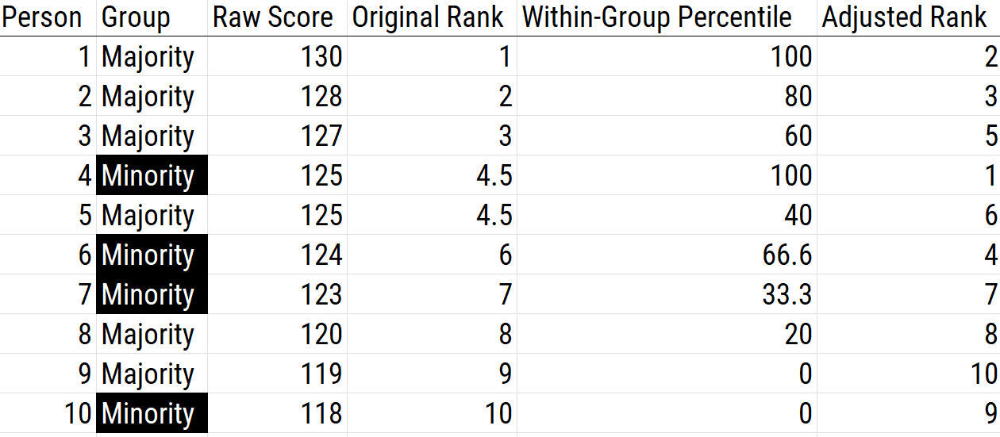
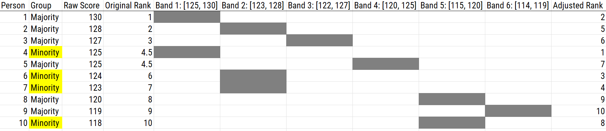

# Test Bias {#bias}

## Overview of Bias {#overview-bias}

There are multiple definitions of the term "bias" depending on the context.
In general, bias is a [systematic error](#systematicError) [@Reynolds2012].\index{bias}\index{bias!types of}
[Mean error](#meanError) is an example of [systematic error](#systematicError), and is sometimes called bias.\index{bias}\index{measurement error!systematic error}\index{bias!types of}
Cognitive biases are systematic errors in thinking, including confirmation bias and hindsight bias.\index{bias!cognitive}\index{bias!confirmatory}\index{bias!types of}
[Method biases](#methodBias) are a form of [systematic error](#systematicError) that involve the influence of measurement on a person's score that is not due to the person's level on the construct.\index{method bias}\index{bias}\index{measurement error!systematic error}\index{bias!types of}
[Method biases](#methodBias) include response biases or response styles, including acquiescence and social desirability bias.\index{method bias}\index{bias}\index{measurement error!systematic error}\index{response style}\index{bias!social desirability}\index{bias!types of}
Attentional bias refers to the tendency to process some types of stimuli more than others.\index{bias!attentional}\index{bias!types of}

Sometimes bias is used to refer in particular to [systematic error](#systematicError) (in measurement, prediction, etc.) as a function of group membership, where test bias refers to the same score having different meaning for different groups.\index{bias}\index{bias!types of}
Under this meaning, a test is unbiased if a given test score has the same meaning regardless of group membership.\index{bias}\index{bias!types of}
For example, a test is biased if there is differential [validity](#validity) of test scores for groups (e.g., age, education, culture, race, sex).\index{culture}\index{bias}\index{validity}\index{bias!types of}
Test bias would exist, for instance, if a test is a less [valid](#validity) predictor for racial minorities or linguistic minorities.\index{bias}\index{validity}\index{bias!types of}
Test bias would also exist if scores on the Scholastic Aptitude Test (SAT) under-estimate women's grades in college, for instance.\index{bias}\index{measurement error!systematic error}\index{bias!types of}

There are some known instances of test bias, as described in Section \@ref(biasExamples).\index{bias}
Research has not produced much empirical evidence of test bias [@Brown1999; @Hall1999; @Jensen1980; @Kuncel2010a; @Reynolds2012; @Reynolds2021; @Sackett1994; @Sackett2008], though some item-level bias is not uncommon.\index{bias}
Moreover, where test bias has been observed, it is often small, unclear, and does not always generalize [@Cole1981].\index{bias}
However, just because there is not much empirical evidence of test bias does not mean that test bias does not exist.\index{bias}
Moreover, just because a test does not show bias does not mean that it should be used.\index{bias}

It is also worth pointing out that group differences in scores do not necessarily indicate bias.\index{bias}
Group differences in scores could reflect true group differences in the construct.\index{bias}
For instance, women have better verbal abilities, on average, compared to men.\index{bias}
So, if women's scores on a verbal ability test are higher on average than men's scores, this would not be sufficient evidence for bias.\index{bias}

There are two broad categories of test bias:\index{bias!types of}

1. [predictive bias](#preditiveBias)\index{bias}\index{bias!types of}\index{bias!predictive}
1. [test structure bias](#testStructureBias)\index{bias}\index{bias!types of}\index{bias!test structure}

[Predictive bias](#preditiveBias) refers to differences between groups in the relation between the test and criterion.\index{bias}\index{bias!types of}\index{bias!predictive}\index{validity!criterion}
As with all [criterion-related validity](#criterionValidity) tests, the findings depend on the strength and quality of the criterion.\index{validity!criterion}
[Test structure bias](#testStructureBias) refers to differences in the internal test characteristics across groups.\index{bias}\index{bias!types of}\index{bias!test structure}

## Ways to Investigate/Detect Test Bias {#detectBias}

### Predictive Bias {#predictiveBias}

Predictive bias exists when differences emerge between groups in terms of [predictive validity](#predictiveValidity) to a criterion.\index{bias!predictive}
It is assessed by using a regression line looking at the association between test score and job performance.\index{bias!predictive}
For instance, consider a [2x2 confusion matrix](#confusionMatrix) used for the standard prediction problem.\index{confusion matrix}
A [confusion matrix](#confusionMatrix) for who to select for a job is depicted in Figure \@ref(fig:jobSelection).\index{confusion matrix}

```{r jobSelection, out.width = "100%", fig.align = "center", fig.cap = "2x2 Confusion Matrix for Job Selection. TP = true positive; TN = true negative; FP = false positive; FN = false negative.", fig.scap = "2x2 Confusion Matrix for Job Selection.", echo = FALSE}

```

We can also visualize the [confusion matrix](#confusionMatrix) in terms of a scatterplot of the test scores (i.e., predicted job performance) and the "truth" scores (i.e., actual job performance), as depicted in Figure \@ref(fig:jobSelection2).\index{confusion matrix}\index{bias!predictive}
The predictor (test score) is on the x-axis.\index{bias!predictive}
The criterion (job performance) is on the y-axis.\index{bias!predictive}
The quadrants reflect the cutoffs (i.e., thresholds) imposed from the 2x2 confusion matrix.\index{confusion matrix}\index{bias!predictive}
The vertical line reflects the cutoff for selecting someone for a job.\index{bias!predictive}
The horizontal line reflects the cutoff for good job performance (i.e., people who should have been selected for the job).\index{bias!predictive}

```{r jobSelection2, fig.height = 8, fig.align = "center", fig.cap = "2x2 Confusion Matrix for Job Selection in the Form of a Graph With Predicted Performance on the x-Axis and Actual Job Performance on the y-Axis. TP = true positive; TN = true negative; FP = false positive; FN = false negative.", fig.scap = "2x2 Confusion Matrix for Job Selection in the Form of a Graph.", echo = FALSE}
plot.new()
plot.window(xlim = c(-5,5), ylim = c(-5,5))
axis(side = 1, labels = c("Bad", "Good"), at = c(-5, 5), pos = 0)
axis(side = 2, labels = c("Bad", "Good"), at = c(-5, 5), pos = 0, las = 1)
text(x = 2.5, y = -0.4, "Test Score", cex = 1.5)
text(x = -0.3, y = 2.5, "Job Performance", cex = 1.5, srt = 90)
text(x = 5, y = 5, "TP")
text(x = -5, y = -5, "TN")
text(x = 5, y = -5, "FP")
text(x = -5, y = 5, "FN")
```

The data points in the top right quadrant are [true positives](#truePositive): people who the test predicted would do a good job and who did a good job.\index{bias!predictive}\index{true positive}
The data points in the bottom left quadrant are [true negatives](#trueNegative): people who the test predicted would do a poor job and who would have done a poor job.\index{bias!predictive}\index{true negative}
The data points in the bottom right quadrant are [false positives](#falsePositive): people who the test predicted would do a good job and who did a poor job.\index{bias!predictive}\index{false positive}
The data points in the top left quadrant are [false negatives](#falseNegative): people who the test predicted would do a poor job and who would have done a good job.\index{bias!predictive}\index{false negative}

```{r, echo = FALSE}
set.seed(52242)
predictor <- runif(100, min = -4, max = 4)
outcomeGoodPredictor <- 0 + 1*predictor + rnorm(100)
outcomeBadPredictor <- 0 + 0.1*predictor + rnorm(100)
```

Figure \@ref(fig:jobSelection3) depicts a strong predictor.\index{bias!predictive}
The best-fit regression line has a steep slope where there are lots of data points that are [true positives](#truePositive) and [true negatives](#trueNegative), with relatively few [false positives](#falsePositive) and [false negatives](#falseNegative).\index{bias!predictive}\index{true positive}\index{true negative}\index{false positive}\index{false negative}

```{r jobSelection3, fig.height = 8, fig.align = "center", fig.cap = "Example of a Strong Predictor. TP = true positive; TN = true negative; FP = false positive; FN = false negative.", fig.scap = "Example of a Strong Predictor.", echo = FALSE}
plot.new()
plot.window(xlim = c(-5,5), ylim = c(-5,5))
points(x = predictor, y = outcomeGoodPredictor)
abline(lm(outcomeGoodPredictor ~ predictor))
axis(side = 1, labels = c("Bad", "Good"), at = c(-5, 5), pos = 0)
axis(side = 2, labels = c("Bad", "Good"), at = c(-5, 5), pos = 0, las = 1)
text(x = 2.5, y = -0.4, "Test Score", cex = 1.5)
text(x = -0.3, y = 2.5, "Job Performance", cex = 1.5, srt = 90)
text(x = 5, y = 5, "TP")
text(x = -5, y = -5, "TN")
text(x = 5, y = -5, "FP")
text(x = -5, y = 5, "FN")
```

Figure \@ref(fig:jobSelection4) depicts a poor predictor.\index{bias!predictive}
The best-fit regression line has a shallow slope where there are just as many data points that are in the false cells ([false positives](#falsePositive) and [false negatives](#falseNegative)) as there are in the true cells ([true positives](#truePositive) and [true negatives](#trueNegative)).\index{bias!predictive}\index{true positive}\index{true negative}\index{false positive}\index{false negative}
In general, the steeper the slope, the better the predictor.\index{bias!predictive}

```{r jobSelection4, fig.height = 8, fig.align = "center", fig.cap = "Example of a Poor Predictor. TP = true positive; TN = true negative; FP = false positive; FN = false negative.", fig.scap = "Example of a Poor Predictor.", echo = FALSE}
plot.new()
plot.window(xlim = c(-5,5), ylim = c(-5,5))
points(x = predictor, y = outcomeBadPredictor)
abline(lm(outcomeBadPredictor ~ predictor))
axis(side = 1, labels = c("Bad", "Good"), at = c(-5, 5), pos = 0)
axis(side = 2, labels = c("Bad", "Good"), at = c(-5, 5), pos = 0, las = 1)
text(x = 2.5, y = -0.4, "Test Score", cex = 1.5)
text(x = -0.3, y = 2.5, "Job Performance", cex = 1.5, srt = 90)
text(x = 5, y = 5, "TP")
text(x = -5, y = -5, "TN")
text(x = 5, y = -5, "FP")
text(x = -5, y = 5, "FN")
```

We can evaluate predictive bias using a best-fit regression line between the predictor and criterion for each group.\index{bias!predictive}

#### Types of Predictive Bias {#typesPredictiveBias}

There are three types of predictive bias:\index{bias!predictive}

1. [Different slopes](#differentSlopes)\index{bias!predictive!different slopes}
1. [Different intercepts](#differentIntercepts)\index{bias!predictive!different intercepts}
1. [Different intercepts and slopes](#differentInterceptsAndSlopes)\index{bias!predictive!different intercepts and slopes}

The slope of the regression line is the steepness of the line.\index{bias!predictive}
The intercept of the regression line is the y-value of the point where the line crosses the y-axis (i.e., when $x = 0$).\index{bias!predictive}
If a measure shows predictive test bias, when looking at the regression line for each group, the groups' regression lines differ in either slopes and/or intercepts.\index{bias!predictive}

##### Different Slopes {#differentSlopes}

Predictive bias in terms of different slopes exists when there are differences in the slope of the regression line between minority and majority groups.\index{bias!predictive!different slopes}
The slope describes the *direction* and *steepness* of the regression line.\index{bias!predictive!different slopes}
The slope of a regression line is the amount of change in $y$ for every unit change in $x$ (i.e., rise over run).\index{bias!predictive!different slopes}
Differing slopes indicate differential [predictive validity](#predictiveValidity), in which the test is a more effective predictor of performance in one group over the other.\index{bias!predictive!different slopes}\index{validity!predictive}
Different slopes predictive bias is depicted in Figure \@ref(fig:testBias1).\index{bias!predictive!different slopes}
In the figure, the predictor performs well in the majority group.\index{bias!predictive!different slopes}
However, the slope is close to zero in the minority group, indicating that there is no association between the predictor and the criterion for the minority group.\index{bias!predictive!different slopes}

```{r testBias1, out.width = "100%", fig.align = "center", fig.cap = "Test Bias: Different Slopes. TP = true positive; TN = true negative; FP = false positive; FN = false negative.", fig.scap = "Test Bias: Different Slopes.", echo = FALSE}
knitr::include_graphics("./Images/testBias-01.png")
```

Different slopes can especially occur if we develop our measure and criterion based on the normative majority group.\index{bias!predictive!different slopes}
Not much evidence has found empirical evidence of different slopes across groups.\index{bias!predictive!different slopes}
However, samples often do not have the power to detect differing slopes [@Aguinis2010a].\index{bias!predictive!different slopes}
Theoretically, to fix biases related to different slopes, you should find another measure that is more predictive for the minority group.\index{bias!predictive!different slopes}
If the predictor is a strong predictor in both groups but shows slight differences in the slope, [within-group norming](#withinGroupNorming) could be used.\index{bias!predictive!different slopes}

##### Different Intercepts {#differentIntercepts}

Predictive bias in terms of different intercepts exists when there are differences in the intercept of the regression line between minority and majority groups.\index{bias!predictive!different intercepts}
The $y$-intercept describes the point on the $y$-axis that the line intersects with the $y$-axis (when $x = 0$).\index{bias!predictive!different intercepts}
When the distributions have similar slopes, intercept differences suggest that the measure systematically under- or over-estimates group performance relative to the person's ability.\index{bias!predictive!different intercepts}
The same test score leads to systematically different predictions for the majority and minority groups.\index{bias!predictive!different intercepts}
In other words, minority group members get different tests scores than majority group members with the same ability.\index{bias!predictive!different intercepts}
Different intercepts predictive bias is depicted in Figure \@ref(fig:testBias2).\index{bias!predictive!different intercepts}

```{r testBias2, out.width = "100%", fig.align = "center", fig.cap = "Test Bias: Different Intercepts. TP = true positive; TN = true negative; FP = false positive; FN = false negative.", fig.scap = "Test Bias: Different Intercepts.", echo = FALSE}
knitr::include_graphics("./Images/testBias-02.png")
```

A higher intercept (relative to zero) indicates that the measure *under*-estimates a person's ability (at that test score)—i.e., the person's job performance is better than what the test score would suggest.\index{bias!predictive!different intercepts}
A lower intercept (relative to zero) indicates that the measure *over*-estimates a person's ability (at that test score)—i.e., the person's job performance is worse than what the test score would suggest.\index{bias!predictive!different intercepts}
Figure \@ref(fig:testBias2) indicates that the measure systematically under-estimates the job performance of the minority group.\index{bias!predictive!different intercepts}

Performance among members of a minority group could be under- or over-estimated.\index{bias!predictive!different intercepts}
For example, historically, women's grades in math and engineering classes tended to be under-estimated by the Scholastic Aptitude Test [SAT; @Clark1984].\index{bias!predictive!different intercepts}
However, where intercept differences have been observed, measures often show small *over*-estimation of school and job performance among minority groups [@Reynolds2012].\index{bias!predictive!different intercepts}
For example, women's physical strength and endurance is over-estimated based on physical ability tests [@Sackett1994].\index{bias!predictive!different intercepts}
In addition, over-estimation of African Americans' and Hispanics' school and job performance has been observed based on cognitive ability tests [@Cole1981; @Reynolds2012; @Sackett1994; @Sackett2008].\index{bias!predictive!different intercepts}
At the same time, the Black–White difference in job performance is less than the Black–White difference in test performance.\index{bias!predictive!different intercepts}

The over-prediction of lower-scoring groups is likely mostly an artifact of [measurement error](#measurementError) [@Gottfredson1994].\index{bias!predictive!different intercepts}
The over-estimation of African Americans' and Hispanics' school and job performance may be due to [measurement error](#measurementeError) in the tests.\index{bias!predictive!different intercepts}
Moreover, test scores explain only a portion of the variation in job performance.\index{bias!predictive!different intercepts}
Black people are far less disadvantaged on the noncognitive determinants of job performance than on the cognitive ones.\index{bias!predictive!different intercepts}
Nevertheless, the over-estimation that has been often observed is *on average*—the performance is not over-estimated for all individuals of the groups even if there is an average over-estimation effect.\index{bias!predictive!different intercepts}
In addition, simulation findings indicate that lower intercepts (i.e., over-estimation) among minority groups compared to majority groups could be observed if there are different slopes but not different intercepts in the population, because different slopes are likely to go undetected due to low power [@Aguinis2010a].\index{bias!predictive!different intercepts}
That is, if a test shows weaker [validity](#validity) for a minority group than the majority group, it could appear as different intercepts that favor the minority group when, in fact, it reflects shallower slopes of the minority group that go undetected.\index{bias!predictive!different intercepts}\index{bias!predictive!different slopes}\index{validity}

Predictive biases in intercepts could especially occur if we develop tests that are based on the majority group and the items assess constructs other than the construct of interest which are systematically biased in favor of the majority group or against the minority group.\index{bias!predictive!different intercepts}
Arguments about reduced power to detect differences are less relevant for intercepts and means than for slopes.\index{bias!predictive!different intercepts}

To correct for a bias in intercepts, we could add [bonus points](#bonusPoints) to the scores for the minority group to correct for the amount of the [systematic error](#systematicError), and to result in the same regression line.\index{bias!predictive!different intercepts}\index{measurement error!systematic error}
But if the minority group is over-predicted (as has often been the case where intercept differences have been observed), we would not want to use [score adjustment](#scoreAdjustment) to lower the minority group's scores.\index{bias!predictive!different intercepts}

##### Different Intercepts and Slopes {#differentInterceptsAndSlopes}

Predictive bias in terms of different intercepts and slopes exists when there are differences in the intercept and slope of the regression line between minority and majority groups.\index{bias!predictive!different intercepts and slopes}
In cases of different intercepts and slopes, there is both differential [validity](#validity) (because the regression lines have different slopes), as well as varying under- and over-estimation of groups' performance at particular scores.\index{bias!predictive!different intercepts and slopes}\index{validity}
Different intercepts and slopes predictive bias is depicted in Figure \@ref(fig:testBias3).\index{bias!predictive!different intercepts and slopes}

```{r testBias3, out.width = "100%", fig.align = "center", fig.cap = "Test Bias: Different Intercepts and Slopes. TP = true positive; TN = true negative; FP = false positive; FN = false negative.", fig.scap = "Test Bias: Different Intercepts and Slopes.", echo = FALSE}
knitr::include_graphics("./Images/testBias-03.png")
```

In instances of different intercepts and slopes predictive bias, a measure can simultaneously over-estimate and under-estimate a person's ability at different test scores.\index{bias!predictive!different intercepts and slopes}
For instance, a measure can under-estimate a person's ability at higher test scores and can over-estimate a person's ability at lower test scores.\index{bias!predictive!different intercepts and slopes}

Different intercepts and slopes across groups is possibly more realistic than just different intercepts or just different slopes.\index{bias!predictive!different intercepts and slopes}
However, different intercepts and slopes predictive bias is more complicated to study, represent, and resolve.\index{bias!predictive!different intercepts and slopes}
It is difficult to examine because of complexity, and it is not easy to fix.\index{bias!predictive!different intercepts and slopes}
Currently, we have nothing to address different intercepts and slopes predictive bias.\index{bias!predictive!different intercepts and slopes}
We would need to use a different measure or measures for each group.\index{bias!predictive!different intercepts and slopes}

### Test Structure Bias {#testStructureBias}

In addition to predictive bias, another type of test bias is test structure bias.\index{bias!test structure}
Test structure bias involves differences in internal test characteristics across groups.\index{bias!test structure}
Examining test structure bias is different from examining the total score, as is used when examining predictive bias.\index{bias!test structure}
Test structure bias can be identified empirically or based on theory/judgment.\index{bias!test structure}\index{empiricism}\index{theory}\index{judgment}\index{clinical judgment}

Empirically, test structure bias can be examined in multiple ways.\index{bias!test structure}\index{empiricism}

#### Empirical Approaches to Identification {#testStructureBiasEmpirical}

##### Item $\times$ Group tests (ANOVA) {#itemXgroupTests-bias}

Item $\times$ Group tests in analysis of variance (ANOVA) examine whether the difference between groups on the overall score match comparisons among smaller items sets between groups.\index{bias!test structure}
Item $\times$ Group tests are used to rule out that items are operating in different ways in different groups.\index{bias!test structure}
If the items operate in different ways in different groups, they do not have the same meaning across groups.\index{bias!test structure}
For example, if we are going to use a measure for multiple groups, we would expect its items to operate similarly across groups.\index{bias!test structure}
So, if women show higher scores on a depression measure compared to men, would also expect them to show similar elevations on each item (e.g., sleep loss).\index{bias!test structure}

##### Item Response Theory {#irt-bias}

Using [item response theory](#irt), we can examine [differential item functioning](#dif) (DIF).\index{bias!test structure}\index{item response theory}\index{item response theory!differential item functioning}
Evidence of [DIF](#dif), indicates that there are differences between group in terms of [discrimination](#itemDiscrimination) and/or [difficulty/severity](#itemDifficulty) of items.\index{bias!test structure}\index{item response theory!differential item functioning}\index{item response theory!item discrimination}\index{item response theory!item difficulty}
Differences between groups in terms of the [item characteristic curve](#icc) (which combines the item's [discrimination](#itemDiscrimination) and [severity](#itemDifficulty)) would be evidence against [construct validity](#constructValidity) invariance between the groups and would provide evidence of bias.\index{bias!test structure}\index{item response theory!differential item functioning}\index{item response theory!item discrimination}\index{item response theory!item difficulty}\index{item response theory!item characteristic curve}\index{validity!construct}
[DIF](#dif) examines stretching and compression of different groups.\index{bias!test structure}\index{item response theory!differential item functioning}
As an example, consider the item "bites others" in relation to externalizing problems.\index{bias!test structure}\index{item response theory!differential item functioning}
The item would be expected to show a weaker [discrimination](#itemDiscrimination) and higher [severity](#itemDifficulty) in adults compared to children.\index{bias!test structure}\index{item response theory!differential item functioning}\index{item response theory!item discrimination}\index{item response theory!item difficulty}
[DIF](#dif) is discussed in Section \@ref(dif).\index{bias!test structure}\index{item response theory!differential item functioning}

##### Confirmatory Factor Analysis {#cfa-bias}

[Confirmatory factor analysis](#cfa-sem) allows tests of [measurement invariance](#measurementInvariance) (also called factorial invariance).\index{bias!test structure}\index{structural equation modeling!measurement invariance}\index{factor analysis!confirmatory}
[Measurement invariance](#measurementInvariance) examines whether the factor structure of the underlying latent variables in the test is consistent across groups.\index{bias!test structure}\index{structural equation modeling!measurement invariance}\index{latent variable}
It also examines whether the manifestation of the construct differs between groups.\index{bias!test structure}\index{structural equation modeling!measurement invariance}
[Measurement invariance](#measurementInvariance) is discussed in Section \@ref(measurementInvariance).\index{bias!test structure}\index{structural equation modeling!measurement invariance}

Even if you find the same slope and intercepts across groups in a prediction model, the measure would still be assessing different constructs across groups if the measure has a different factor structure between the groups.\index{bias!test structure}\index{structural equation modeling!measurement invariance}
A different factor structure across groups is depicted in Figure \@ref(fig:testBias4).\index{bias!test structure}\index{structural equation modeling!measurement invariance}

```{r testBias4, out.width = "100%", fig.align = "center", fig.cap = "Different Factor Structure Across Groups.", echo = FALSE}
knitr::include_graphics("./Images/testBias-04.png")
```

An example of a different factor structure across groups is the differentiation of executive functions from two factors to three factors (inhibition, working memory, cognitive flexibility) across childhood [@Lee2013].\index{bias!test structure}\index{structural equation modeling!measurement invariance}

There are different degrees of measurement invariance [for a review, see @Putnick2016]:\index{bias!test structure}\index{structural equation modeling!measurement invariance}

- Configural invariance: same number of factors in each group, and which indicators load on which factors are the same in each group (i.e., the same pattern of significant loadings in each group)\index{bias!test structure}\index{structural equation modeling!measurement invariance}
- Metric ("weak factorial") invariance: items have the same factor loadings ([discrimination](#itemDiscrimination)) in each group\index{bias!test structure}\index{structural equation modeling!measurement invariance}\index{structural equation modeling!factor loading}\index{item response theory!item discrimination}
- Scalar ("strong factorial") invariance: items have the same intercepts ([difficulty/severity](#itemDifficulty)) in each group\index{bias!test structure}\index{structural equation modeling!measurement invariance}\index{structural equation modeling!intercept}\index{item response theory!item difficulty}
- Residual ("strict factorial") invariance: items have the same residual/unique variances in each group\index{bias!test structure}\index{structural equation modeling!measurement invariance}

##### Structural Equation Modeling {#sem-bias}

[Structural equation modeling](#sem) is a [confirmatory factor analysis](#cfa) (CFA) model that incorporates prediction.\index{factor analysis!confirmatory}\index{structural equation modeling}
Structural equation modeling allows examining differences in the underlying structure with differences in prediction in the same model.\index{factor analysis!confirmatory}\index{structural equation modeling}\index{bias!test structure}\index{bias!predictive}

##### Signal Detection Theory {#sdt-bias}

[Signal detection theory](#sdt) is a dynamic measure of bias.\index{bias}\index{signal detection theory}
It allows examining the overall bias in selection systems, including both accuracy and errors at various cutoffs ([sensitivity](#sensitivity), [specificity](#specificity), [positive predictive value](#ppv), and [negative predictive value](#npv)), as well as accuracy across all possible cutoffs (the [area under the receiver operating characteristic curve](#auc)).\index{bias}\index{signal detection theory}\index{sensitivity}\index{specificity}\index{positive predictive value}\index{negative predictive value}\index{receiver operating characteristic curve!area under the curve}
While there may be similar [predictive validity](#predictiveValidity) between groups, the type of errors we are making across groups might differ.\index{bias!predictive}\index{validity!predictive}
It is important to decide which types of error to emphasize depending on the fairness goals and examining [sensitivity](#sensitivity)/[specificity](#specificity) to adjust cutoffs.\index{bias!predictive}\index{signal detection theory}\index{sensitivity}\index{specificity}

##### Empirical Evidence of Test Structure Bias {#evidenceTestStructureBias}

It is not uncommon to find items that show differences across groups in [severity](#itemDifficulty) (intercepts) and/or [discrimination](#itemDiscrimination) (factor loadings).\index{bias!test structure}\index{structural equation modeling!measurement invariance}\index{structural equation modeling!intercept}\index{structural equation modeling!factor loading}\index{item response theory!differential item functioning}\index{item response theory!item discrimination}\index{item response theory!item difficulty}
However, cross-group differences in item functioning tend to be small and not consistent across studies, suggesting that some of the differences may reflect Type I errors that result from sampling error and multiple testing.\index{bias!test structure}\index{structural equation modeling!measurement invariance}\index{item response theory!differential item functioning}
That said, some instances of cross-group differences in item parameters could reflect test structure bias that is real and important to address.\index{bias!test structure}

#### Theoretical/Judgmental Approaches to Identification {#testStructureBiasTheoretical}

##### Facial Validity Bias {#facialValidityBias}

[Facial validity](#faceValidity) bias considers the extent to which an average person thinks that an item is biased—i.e., the item has differing [validity](#validity) between minority and majority groups.\index{bias!test structure}\index{validity!face}
If so, the item should be reconsidered.\index{bias!test structure}
Does an item disfavor certain groups?\index{bias!test structure}
Is the language specific to a particular group?\index{bias!test structure}
Is it offensive to some people?\index{bias!test structure}
This type of judgment moves into the realm of whether or not an item should be used.\index{bias!test structure}

##### Content Validity Bias {#contentValidityBias}

[Content validity](#contentValidity) bias is determined by judgments of construct experts who look for items that do not do an adequate job assessing the construct between groups.\index{bias!test structure}\index{validity!content}
A construct may include some content facets in one group, but may include different content facets in another group, as depicted in Figure \@ref(fig:testBias5).\index{bias!test structure}\index{validity!content}

```{r testBias5, out.width = "100%", fig.align = "center", fig.cap = "Different Content Facets in a Given Construct for Two Groups.", echo = FALSE}
knitr::include_graphics("./Images/testBias-05.png")
```

Examples include information questions and vocabulary question on the Wechsler Adult Intelligence Scale.\index{bias!test structure}\index{validity!content}
If an item is linguistically complicated, grammatically complex or convoluted, or a double negative, it may be less [valid](#validity) or predictive for rural populations and those with less education.\index{bias!test structure}\index{validity!content}\index{validity}

Also, stereotype threat may contribute to [content validity](#contentValidity) bias.\index{bias!test structure}\index{validity!content}\index{stereotype threat}reviews        
Stereotype threat occurs when people are or feel at risk of conforming themselves to stereotypes about their social group, thus leading them to show poorer performance in ways that are consistent with the stereotype.\index{bias!test structure}\index{validity!content}\index{stereotype threat}
Stereotype threat may partially explain why some women may perform more poorly on some math items than some men.\index{bias!test structure}\index{validity!content}\index{stereotype threat}

Another example of [content validity](#contentValidity) bias is when the same measure is used to assess a construct across ages even though the construct shows heterotypic continuity.\index{bias!test structure}\index{validity!content}\index{heterotypic continuity}
Heterotypic continuity occurs when a construct changes in its behavioral manifestation with development [@Petersen2020].\index{bias!test structure}\index{validity!content}\index{heterotypic continuity}
That is, the same construct may look different at different points in development.\index{bias!test structure}\index{validity!content}\index{heterotypic continuity}
An example of a construct that shows heterotypic continuity is externalizing problems.\index{bias!test structure}\index{validity!content}\index{heterotypic continuity}
In early childhood, externalizing problems often manifest in overt forms, including physical aggression (e.g., biting) and temper tantrums.\index{bias!test structure}\index{validity!content}\index{heterotypic continuity}
By contrast, in adolescence and adulthood, externalizing problems more often manifest in covert ways, including relational aggression and substance use.\index{bias!test structure}\index{validity!content}\index{heterotypic continuity}
[Content validity](#contentValidity) and [facial validity](#faceValidity) bias judgments are often related, but not always.\index{bias!test structure}\index{validity!content}\index{validity!face}\index{heterotypic continuity}

## Examples of Bias {#biasExamples}

As described in the overview on Section \@ref(overview-bias), there is not much empirical evidence of test bias [@Brown1999; @Hall1999; @Jensen1980; @Kuncel2010a; @Reynolds2012; @Reynolds2021; @Sackett1994; @Sackett2008].\index{bias!examples}
That said, some item-level bias is not uncommon.\index{bias!examples}
One instance of test bias is that, historically, women's grades in math and engineering classes tended to be under-estimated by the Scholastic Aptitude Test [SAT; @Clark1984].\index{bias!examples}
@Fernandez2018 review the evidence on other instances of test and item bias.\index{bias!examples}
For instance, test bias can occur if a subgroup is less familiar with the language, the stimulus material, or the response procedures, or if they have different [response styles](#methodBias-types).\index{bias!examples}\index{response style}
In addition to test bias, there are known patterns of [bias in clinical judgment](#biasClinicalJudgment), as described in Section \@ref(biasClinicalJudgment).

## Test Fairness {#fairness}

There is interest in examining more than the just the accuracy of measures.\index{fairness}
It is also important to examine the *errors* being made and differentiate the weight or value of different kinds of errors (and correct decisions).\index{fairness}\index{prediction!prediction error}
Consider an example of an unbiased test, as depicted in Figure \@ref(fig:testBias6), adapted from @Gottfredson1994.\index{fairness}
Although the example is of a White group and a Black group, we could substitute any two groups into the example (e.g., males versus females).\index{fairness}

(ref:testUnfairness) Potential Unfairness in Testing. The ovals represent the distributions of individuals' performance both on a test and a job performance criterion. TP = true positive; TN = true negative; FP = false positive; FN = false negative. Adapted from @Gottfredson1994, Figure 1, p. 958. Gottfredson, L. S. (1994). The science and politics of race-norming. *American Psychologist*, *49*(11), 955–963. https://doi.org/10.1037/0003-066X.49.11.955 

```{r testBias6, out.width = "100%", fig.align = "center", fig.cap = "(ref:testUnfairness)", fig.scap = "Potential Unfairness in Testing.", echo = FALSE}
knitr::include_graphics("./Images/testBias-06.png")
```

The example is of an unbiased test between White and Black job applicants.\index{fairness}
There are no differences between the two groups in terms of slope.\index{fairness}
If we drew a regression line, the line would go through the centroid of both ovals.\index{fairness}
Thus, the measure is equally predictive in both groups even though that the Black group failed the test at a higher rate than the White group.\index{fairness}
Moreover, there is no difference between the groups in terms of intercept.\index{fairness}
Thus, the performance of one group is not over-estimated relative to the performance of the other group.\index{fairness}
To demonstrate what a different intercept would look like, Group X shows a different intercept.\index{fairness}\index{bias!predictive!different intercepts}
In sum, there is no [predictive validity](#predictiveValditiy) bias between the two groups.\index{fairness}\index{bias!predictive}
But just because the test predicts just as well in both groups does not mean that the selection procedures are *fair*.\index{fairness}

Although the test is unbiased, there are differences in the *quality* of prediction: there are more [false negatives](#falseNegative) in the Black group compared to the White group.\index{fairness}\index{false negative}
This gives the White group an advantage and the Black group additional disadvantages.\index{fairness}
If the measure showed the same quality of prediction, we would say the test is fair.\index{fairness}
The point of the example is that just because a test is unbiased does not mean that the test is fair.\index{fairness}

There are two kinds of errors: [false negatives](#falseNegative) and [false positives](#falsePositive).\index{fairness}\index{false negative}\index{false positive}
Each error type has very different implications.\index{fairness}\index{false negative}\index{false positive}
[False negatives](#falseNegative) would be when the test predicts that an applicant would perform poorly and we do not give them the job even though they would have performed well.\index{fairness}\index{false negative}
[False negatives](#falseNegative) have a negative effect on the applicant.\index{fairness}\index{false negative}
And, in this example, there are more [false negatives](#falseNegative) in the Black group.\index{fairness}\index{false negative}
By contrast, [false positives](#falsePositive) would be when we predict that an applicant would do well, and we give them the job but they perform poorly.\index{fairness}\index{false positive}
[False positives](#falsePositive) are a benefit to the applicant but have a negative effect on the employer.\index{fairness}\index{false positive}
In this example, there are more [false positives](#falsePositive) in the White group, which is an undeserved benefit based on the [selection ratio](#selectionRatio), therefore the White group benefits.\index{fairness}\index{false positive}\index{selection ratio}

In sum, equal accuracy of prediction (i.e., equal total number of errors) does not necessarily mean the test is fair; we must examine the types of errors.\index{fairness}\index{bias!predictive}
Merely ensuring accuracy does not ensure fairness!\index{fairness}\index{bias!predictive}

### Adverse Impact {#adverseImpact}

Adverse impact is defined as rejecting members of one group at a higher rate than another group.\index{adverse impact}
Adverse impact is different from test [validity](#validity).\index{adverse impact}\index{validity}
According to federal guidelines, adverse impact is present if the [selection rate](#selectionRatio) of one group is less than four-fifths (80%) the [selection rate](#selectionRatio) of the group with the highest [selection rate](#selectionRatio).\index{adverse impact}\index{selection ratio}

There is much more evidence of adverse impact than test bias.\index{adverse impact}\index{bias}
Indeed, disparate impact of tests on personnel selection across groups is the norm rather than the exception, even when using [valid](#validity) tests that are unbiased, which in part reflect group-related differences in job-related skills [@Gottfredson1994].\index{adverse impact}\index{validity}
Examples of adverse impact include:\index{adverse impact}

- physical ability tests, which produce substantial adverse impact against women (despite over-estimation of women's performance)\index{adverse impact}
- cognitive ability tests, which produce substantial impact against some ethnic minority groups, especially Black and Hispanic people (despite over-estimation of Black and Hispanic people's performance), even though cognitive ability tests tend to be among the strongest predictors of job performance [@Sackett2008; @Schmidt1981]\index{adverse impact}
- personality tests, which produce higher estimates of dominance among men than women; it is unclear whether this has [predictive bias](#predictiveBias)\index{adverse impact}\index{bias!predictive}

### Bias Versus Fairness {#biasVsFairness}

Whether a measure is accurate or shows test bias is a scientific question.
By contrast, whether a test is fair and thus should be used for a given purpose is not just a scientific question; it is also an [ethical](#ethics) question.\index{bias}\index{fairness}\index{ethics}
It involves the consideration of the potential consequences of testing in terms of social values and [consequential validity](#consequentialValidity).\index{fairness}

### Operationalizing Fairness {#operationalizingFairness}

There are many perspectives to what should be considered when evaluating test fairness [@AERA2014; @Camilli2013; @Dorans2017; @GeneralAptitudeTestBattery1989; @Fletcher2021; @Gipps2009; @Helms2006; @Jonson2022; @Melikyan2019; @Sackett2008; @Thorndike1971; @Zieky2006; @Zieky2013].\index{fairness!operationalizing}
As described in @Fletcher2021, there are three primary ways of operationalizing fairness:\index{fairness!operationalizing}

1. equal outcomes: the [selection rate](#selectionRatio) is the same across groups\index{fairness!operationalizing}\index{selection ratio}
1. equal opportunity: the [sensitivity](#sensitivity) ([true positive rate](#sensitivity); 1 $-$ [false negative rate](#falseNegativeRate)) is the same across groups\index{fairness!operationalizing}\index{sensitivity}\index{false negative!rate}
1. equal odds: the [sensitivity](#sensitivity) is the same across groups and the [specificity](#specificity) ([true negative rate](#specificity); 1 $-$ [false positive rate](#falsePositiveRate)) is the same across groups\index{fairness!operationalizing}\index{sensitivity}\index{specificity}\index{false positive!rate}

For example, the job selection procedure shows *equal outcomes* if the proportion of men selected is equal to the proportion of women selected.\index{fairness!operationalizing}
The job selection procedure shows *equal opportunity* if, among those who show strong job performance, the proportion of classification errors ([false negatives](#falseNegative)) is the same for men and women.\index{fairness!operationalizing}
[Receiver operating characteristic (ROC) curves](#roc) are depicted for two groups in Figure \@ref(fig:testBias-ROC).\index{fairness!operationalizing}\index{receiver operating characteristic curve}
A cutoff that represents equal opportunity is depicted with a horizontal line (i.e., the same [sensitivity](#sensitivity)) in Figure \@ref(fig:testBias-ROC).
The job selection procedure shows *equal odds* if (a), among those who show strong job performance, the proportion of classification errors ([false negatives](#falseNegative)) is the same for men and women, and (b), among those who show poor job performance, the proportion of classification errors ([false positives](#falsePositive)) is the same for men and women.\index{fairness!operationalizing}\index{sensitivity}\index{false negative!rate}\index{false positive!rate}
A cutoff that represents equal odds is depicted where the [ROC curve](#roc) for Group A intersects with the [ROC curve](#roc) from Group B in Figure \@ref(fig:testBias-ROC).\index{fairness!operationalizing}
The equal odds approach to fairness is consistent with a National Academy of Sciences committee on fairness [@GeneralAptitudeTestBattery1989; @Gottfredson1994].\index{fairness!operationalizing}
Approaches to operationalizing fairness in the context of prediction models are described by @Paulus2020.\index{fairness!operationalizing}

(ref:testBias-ROCCaption) Receiver Operating Characteristic (ROC) Curves for Two Groups. (Figure reprinted from @Fletcher2021, Figure 2, p. 3. Fletcher, R. R., Nakeshimana, A., & Olubeko, O. (2021). Addressing fairness, bias, and appropriate use of artificial intelligence and machine learning in global health. *Frontiers in Artificial Intelligence*, *3*(116). [https://doi.org/10.3389/frai.2020.561802](https://doi.org/10.3389/frai.2020.561802))

```{r testBias-ROC, out.width = "100%", fig.align = "center", fig.cap = "(ref:testBias-ROCCaption)", fig.scap = "Receiver Operating Characteristic Curves for Two Groups.", echo = FALSE}
knitr::include_graphics("./Images/testBias-ROC.png")
```

It is not possible to meet all three types of fairness simultaneously (i.e., equal [selection rates](#SelectionRatio), [sensitivity](#sensitivity), and [specificity](#specificity) across groups) unless the [base rates](#baseRate) are the same across groups or the selection is perfectly accurate [@Fletcher2021].\index{fairness!operationalizing}\index{selection ratio}\index{sensitivity}\index{specificity}\index{base rate}
In the medical context, equal odds is the most common approach to fairness.\index{fairness!operationalizing}
However, using the cutoff associated with equal odds typically reduces overall classification accuracy.\index{fairness!operationalizing}
And, changing the cutoff for specific groups can lead to negative consequences.\index{fairness!operationalizing}
In the case that equal odds results in a classification accuracy that is too low, it may be worth considering using separate assessment procedures/tests for each group.\index{fairness!operationalizing}
In general, it is best to follow one of these approaches to fairness.\index{fairness!operationalizing}
It is difficult to get right, so try to minimize negative impact.\index{fairness!operationalizing}
Many fairness supporters argue for simpler rules.\index{fairness!operationalizing}
In the 1991 Civil Rights Act, [score adjustments](#scoreAdjustment) based on race, gender, and ethnicity (e.g., within-race [norming](#norm) or race-conscious score adjustments) were made illegal in personnel selection [@Gottfredson1994].\index{fairness!operationalizing}

Another perspective to fairness is that selection procedures should predict job performance and if they are correlated with any group membership (e.g., race, socioeconomic status, or gender), the test should not be used [@Helms2006].\index{fairness!operationalizing}
That is, according to Helms, we should not use any test that assesses anything other than the construct of interest (job performance).\index{fairness!operationalizing}
Unfortunately, however, no measures like this exist.\index{fairness!operationalizing}
Every measure assesses multiple things, and factors such as poverty can have long-lasting impacts across many domains.\index{fairness!operationalizing}

Another perspective to fairness is to make the selection procedures equal the number of successes within each group [@Thorndike1971].\index{fairness!operationalizing}
According to this perspective, if you want to do selection, you should hire all people, then look at job performance.\index{fairness!operationalizing}
If among successful employees, 60% are White and 40% are Black, then set this selection rate for each group (i.e., hiring 80% White individuals and 20% Black individuals is not okay).\index{fairness!operationalizing}
According to this perspective, a selection system is only fair if the majority–minority differences on the selection device used are equal in magnitude to majority–minority differences in job performance.\index{fairness!operationalizing}
Selection criteria should be made based on prior distributions of success rates.\index{fairness!operationalizing}
However, you likely will not ever really know the true [base rate](#baseRate) in these situations.\index{fairness!operationalizing}\index{base rate}
No one uses this approach because you would have a period where you have to accept everyone to find the percent that works.\index{fairness!operationalizing}
Also, this would only work in a narrow window of time because the selection pool changes over time.\index{fairness!operationalizing}

There are lots of groups and subgroups.\index{fairness!operationalizing}
Ensuring fairness is very complex, and there is no way to accomplish the goal of being equally fair to all people.\index{fairness!operationalizing}
Therefore, do the best you can and try to minimize negative impact.\index{fairness!operationalizing}

## Correcting For Bias {#correctForBias}

### What to Do When Detecting Bias {#whenDetectingBias}

When examining item bias (using [differential item functioning](#dif)/DIF or [measurement non-invariance](#measurementNoninvariance)) with many items (or measures) across many groups, there can be many tests, which will make it likely that [DIF](#dif)/[non-invariance](#measurementNoninvariance) will be detected, especially with a large sample.\index{item response theory!differential item functioning}\index{structural equation modeling!measurement invariance}
Some detected [DIF](#dif) may be artificial or trivial, but other [DIF](#dif) may be real and important to address.\index{item response theory!differential item functioning}\index{structural equation modeling!measurement invariance}
It is important to consider how you will proceed when detecting [DIF](#dif)/[non-invariance](#measurementNoninvariance).\index{item response theory!differential item functioning}\index{structural equation modeling!measurement invariance}
Considerations of effect size and theory can be important for evaluating the [DIF](#dif)/[non-invariance](#measurementNoninvariance) and whether it is negligible or important to address.\index{item response theory!differential item functioning}\index{structural equation modeling!measurement invariance}

When detecting bias, there are several steps to take.\index{bias!correcting for}
First, consider what the bias indicates.\index{bias!correcting for}
Does the bias present [adverse impact](#adverseImpact) for a minority group?\index{bias!correcting for}\index{adverse impact}
What reasons might the bias exist?\index{bias!correcting for}
Second, examine the effect size of the bias.\index{bias!correcting for}
If the effects are small, if the bias does not present [adverse impact](#adverseImpact) for a minority group, and if there is no compelling theoretical reason for the bias, the bias might not be sufficient to scrap the instrument for the population.\index{bias!correcting for}
Some detected bias may be artificial, but other bias may be real.\index{bias!correcting for}
Gender and cultural differences have shown a number of statistically significant effects for a number of different assessment purposes, but many of the observed effects are quite small and likely trivial, and do not present compelling reasons to change the assessment [@Youngstrom2016].\index{bias!correcting for}

However, if you find bias, correct for it!\index{bias!correcting for}
There are a number of [score adjustment](#scoreAdjustment) and [non-score adjustment](#otherBiasCorrections) approaches to correct for bias, as described in Sections \@ref(scoreAdjustment) and \@ref(otherBiasCorrections).\index{bias!correcting for}
If the bias occurs at the item level (e.g., [test structure bias](#testStructureBias)), it is generally recommended to [remove](#removeBiasedItems) or [resolve](#resolveBiasedItems) items that show non-negligible bias.\index{bias!correcting for}\index{bias!test structure}
There are three primary options: (1) drop the item for both groups, (2) drop the item for one group but keep it for the other group, or (3) freely estimate the parameters for the item across groups.\index{bias!correcting for}
Addressing items that show larger bias can also reduce artificial bias in other items [@Hagquist2017].\index{bias!correcting for}
Thus, researchers are encouraged to handle item bias sequentially from high to low in magnitude.\index{bias!correcting for}
If the bias occurs at the test score level (e.g., [predictive bias](#predictiveBias)), [score adjustments](#scoreAdjustment) may be considered.\index{bias!correcting for}\index{bias!test structure}\index{bias!correcting for!score adjustment}

If you do not correct for bias, consider the impact of the test, procedure, and selection procedure when interpreting scores.\index{bias!correcting for}
Interpret scores with caution and provide necessary caveats in resulting papers or reports regarding the interpretations in question.\index{bias!correcting for}
In sum, it is important to examine the possibility of bias—it is important to consider how much "erroneous junk" you are introducing into your research.\index{bias!correcting for}

### Score Adjustment to Correct for Bias {#scoreAdjustment}

Score adjustment involves adjusting scores for a particular group or groups.\index{bias!correcting for}\index{bias!correcting for!score adjustment}

#### Why Adjust Scores? {#whyAdjustScores}

There may be several reasons to adjust scores for various groups in a given situation.\index{bias!correcting for}\index{bias!correcting for!score adjustment}
First, there may be social goals to adjust scores.\index{bias!correcting for}\index{bias!correcting for!score adjustment}
For example, we may want our selection device to yield personnel that better represent the nation or region, including diversity of genders, races, majors, social classes, etc.\index{bias!correcting for}\index{bias!correcting for!score adjustment}
Score adjustments are typically discussed with respect to racial minority differences due to historical and systemic inequities.\index{bias!correcting for}\index{bias!correcting for!score adjustment}
Our society aims to provide equal opportunity, including the opportunity to gain a fair share (i.e., proportional representation) of jobs.\index{bias!correcting for}\index{bias!correcting for!score adjustment}
A diversity of perspectives in a job is a strength; a diversity of perspectives can lead to greater creativity and improved problem solving.\index{bias!correcting for}\index{bias!correcting for!score adjustment}
A second potential reason that we may want to apply score adjustment is to correct for bias.\index{bias!correcting for}\index{bias!correcting for!score adjustment}
A third potential reason that we may want to apply score adjustment is to improve the [fairness](#fairness) of a test.\index{bias!correcting for}\index{bias!correcting for!score adjustment}\index{fairness}

#### Types of Score Adjustment {#typesOfScoreAdjustment}

There are a number of potential techniques that have been used in attempts to correct for bias, i.e., to reduce negative impact of the test on an under-represented group.\index{bias!correcting for}\index{bias!correcting for!score adjustment}
What is considered an under-represented group may depend on the context.\index{bias!correcting for}\index{bias!correcting for!score adjustment}
For instance, men are under-represented compared to women as nurses, preschool teachers, and college students.\index{bias!correcting for}\index{bias!correcting for!score adjustment}
However, men may not face the same systemic challenges compared to women, so even though men may show under-representation in some domains, it is arguable whether scores should be adjusted to increase their representation.\index{bias!correcting for}\index{bias!correcting for!score adjustment}
Techniques for score adjustment include:\index{bias!correcting for}\index{bias!correcting for!score adjustment}

- [Bonus points](#bonusPoints)\index{bias!correcting for}\index{bias!correcting for!score adjustment}\index{bias!correcting for!bonus points}
- [Within-group norming](#withinGroupNorming)\index{bias!correcting for}\index{bias!correcting for!score adjustment}\index{bias!correcting for!within-group norming}
- [Separate cutoffs](#separateCutoffs)\index{bias!correcting for}\index{bias!correcting for!score adjustment}\index{bias!correcting for!separate cutoffs}
- [Top down selection from different lists](#topDownSelection)\index{bias!correcting for}\index{bias!correcting for!score adjustment}\index{bias!correcting for!top down selection from different lists}
- [Banding](#banding)\index{bias!correcting for}\index{bias!correcting for!score adjustment}\index{bias!correcting for!banding}
- [Banding with bonus points](#bandingBonusPoints)\index{bias!correcting for}\index{bias!correcting for!score adjustment}\index{bias!correcting for!banding with bonus points}
- [Sliding band](#slidingBand)\index{bias!correcting for}\index{bias!correcting for!score adjustment}\index{bias!correcting for!sliding band}
- [Separate tests](#separateTests)\index{bias!correcting for}\index{bias!correcting for!score adjustment}\index{bias!correcting for!separate tests}
- [Item elimination based on group differences](#itemElimination)\index{bias!correcting for}\index{bias!correcting for!score adjustment}\index{bias!correcting for!item elimination based on group differences}

##### Bonus Points {#bonusPoints}

Providing bonus points involves adding a constant number of points to the scores of all individuals who are members of a particular group with the goal of eliminating or reducing group differences.\index{bias!correcting for}\index{bias!correcting for!score adjustment}\index{bias!correcting for!bonus points}
Bonus points is used to correct for [predictive bias](#predictiveBias) [differences in intercepts](#differentIntercepts) between groups.\index{bias!correcting for}\index{bias!correcting for!score adjustment}\index{bias!correcting for!bonus points}\index{bias!predictive!different intercepts}
An example of bonus points is military veterans in placement for civil service jobs—points are added to the initial score for all veterans (e.g., add 5 points to test scores of all veterans).\index{bias!correcting for}\index{bias!correcting for!score adjustment}\index{bias!correcting for!bonus points}
An example of using bonus points as a score adjustment is depicted in Figure \@ref(fig:bonusPoints).\index{bias!correcting for}\index{bias!correcting for!score adjustment}\index{bias!correcting for!bonus points}

```{r bonusPoints, out.width = "100%", fig.align = "center", fig.cap = "Using Bonus Points as a Scoring Adjustment.", echo = FALSE}
knitr::include_graphics("./Images/adjustment_bonusPoints.png")
```

There are several pros of bonus points.\index{bias!correcting for}\index{bias!correcting for!score adjustment}\index{bias!correcting for!bonus points}
If the distribution of each group is the same, this will effectively reduce group differences.\index{bias!correcting for}\index{bias!correcting for!score adjustment}\index{bias!correcting for!bonus points}
Moreover, it is a simple way of impacting test selection and procedure without changing the test, which is therefore a great advantage.\index{bias!correcting for}\index{bias!correcting for!score adjustment}\index{bias!correcting for!bonus points}
There are several cons of bonus points.\index{bias!correcting for}\index{bias!correcting for!score adjustment}\index{bias!correcting for!bonus points}
If there are differences in group standard deviations, adding bonus points may not actually correct for bias.\index{bias!correcting for}\index{bias!correcting for!score adjustment}\index{bias!correcting for!bonus points}
The use of bonus points also obscures what is actually being done to scores, so other methods like using [separate cutoffs](#separateCutoffs) may be more explicit.\index{bias!correcting for}\index{bias!correcting for!score adjustment}\index{bias!correcting for!bonus points}\index{bias!correcting for!separate cutoffs}
In addition, the simplicity of bonus points is also a great disadvantage because it is easily understood and often not viewed as "fair" because some people are getting extra points that others do not.\index{bias!correcting for}\index{bias!correcting for!score adjustment}\index{bias!correcting for!bonus points}\index{fairness}

##### Within-Group Norming {#withinGroupNorming}

A [norm](#norm) is the standard of performance that a person's performance can be compared to.\index{bias!correcting for}\index{bias!correcting for!score adjustment}\index{bias!correcting for!within-group norming}\index{norm}
Within-group norming treats the person's group in the sample as the [norm](#norm).\index{bias!correcting for}\index{bias!correcting for!score adjustment}\index{bias!correcting for!within-group norming}
Within-group norming converts an individual's score to [standardized scores](#standardizedScores) (e.g., T scores) or percentiles within one's own group.\index{bias!correcting for}\index{bias!correcting for!score adjustment}\index{bias!correcting for!within-group norming}\index{data!standardized}
Then, the people are selected based on the highest standard scores across groups.
Withing-group norming is used to correct for [predictive bias](#predictiveBias) [differences in slopes](#differentSlopes) between groups.\index{bias!correcting for}\index{bias!correcting for!score adjustment}\index{bias!correcting for!within-group norming}\index{bias!predictive!different slopes}
An example of using within-group norming as a score adjustment is depicted in Figure \@ref(fig:withinGroupNorming).\index{bias!correcting for}\index{bias!correcting for!score adjustment}\index{bias!correcting for!within-group norming}

```{r withinGroupNorming, out.width = "100%", fig.align = "center", fig.cap = "Using Within-Group Norming as a Scoring Adjustment.", echo = FALSE}

```

There are several pros of within-group norming.\index{bias!correcting for}\index{bias!correcting for!score adjustment}\index{bias!correcting for!within-group norming}
First, it accounts for differences in group standard deviations and means, so it does not have the same problem as [bonus points](#bonusPoints) and is generally more effective at eliminating [adverse impact](#adverseImpact) compared to [bonus points](#bonusPoints).\index{bias!correcting for}\index{bias!correcting for!score adjustment}\index{bias!correcting for!within-group norming}\index{bias!correcting for!bonus points}\index{adverse impact}
Second, some general (non group-specific) [norms](#norm) are clearly irrelevant for characterizing a person's functioning.\index{bias!correcting for}\index{bias!correcting for!score adjustment}\index{bias!correcting for!within-group norming}
Group-specific [norms](#norm) aim to describe a person's performance relative to people with a similar background, thus potentially reducing cultural [bias](#bias).\index{bias!correcting for}\index{bias!correcting for!score adjustment}\index{bias!correcting for!within-group norming}
Third, group-specific [norms](#norm) may better reflect cultural, educational, socioeconomic, and other factors that may influence a person's score [@Burlew2019].\index{bias!correcting for}\index{bias!correcting for!score adjustment}\index{bias!correcting for!within-group norming}
Fourth, group-specific [norms](#norm) may increase [specificity](#specificity), and reduce over-pathologizing by preventing giving a diagnosis to people who might not show a condition [@Manly2007].\index{bias!correcting for}\index{bias!correcting for!score adjustment}\index{bias!correcting for!within-group norming}\index{specificity}

There are several cons of within-group norming.\index{bias!correcting for}\index{bias!correcting for!score adjustment}\index{bias!correcting for!within-group norming}
First, group differences could be maintained if one decides to norm based on a reference sample or, when scores are skewed, a local sample, especially when when using standardized scores.\index{bias!correcting for}\index{bias!correcting for!score adjustment}\index{bias!correcting for!within-group norming}
However, percentile scores will consistently eliminate [adverse impact](#adverseImpact).\index{bias!correcting for}\index{bias!correcting for!score adjustment}\index{bias!correcting for!within-group norming}\index{data!percentile rank}\index{adverse impact}
Second, using group-specific [norms](#norm) may obscure background variables that explain underlying reasons for group-related differences in test performance [@Manly2005; @Manly2007].\index{bias!correcting for}\index{bias!correcting for!score adjustment}\index{bias!correcting for!within-group norming}
Third, group-specific [norms](#norm) do not address the problem if the measure shows test [bias](#bias) [@Burlew2019].\index{bias!correcting for}\index{bias!correcting for!score adjustment}\index{bias!correcting for!within-group norming}
Fourth, group-specific [norms](#norm) may reduce [sensitivity](#sensitivity) to detect conditions [@Manly2007].\index{bias!correcting for}\index{bias!correcting for!score adjustment}\index{bias!correcting for!within-group norming}\index{sensitivity}
For instance, they may prevent people from getting treatment who would benefit.\index{bias!correcting for}\index{bias!correcting for!score adjustment}\index{bias!correcting for!within-group norming}
It is worth noting that within-group norming on the basis of sex, gender, and ethnicity is illegal for the basis of personnel selection according to the 1991 Civil Rights Act.\index{bias!correcting for}\index{bias!correcting for!score adjustment}\index{bias!correcting for!within-group norming}

As an example of within-group norming, the National Football League used to use race-norming for identification of concussions.\index{bias!correcting for}\index{bias!correcting for!score adjustment}\index{bias!correcting for!within-group norming}\index{norm-referenced!race}
The effect of race-norming, however, was that it lowered Black players' concussion risk scores, which prevented many Black players from being identified as having sustained a concussion and from receiving needed treatment.\index{bias!correcting for}\index{bias!correcting for!score adjustment}\index{bias!correcting for!within-group norming}\index{norm-referenced!race}
Race-norming compared the Black football players cognitive test scores to group-specific [norms](#norm): the cognitive test scores of Black people in the general population (not to common [norms](#norm)).\index{bias!correcting for}\index{bias!correcting for!score adjustment}\index{bias!correcting for!within-group norming}\index{norm-referenced!race}
Using Black-specific [norms](#norm) assumed that Black football players showed lower cognitive ability than other groups, so a low cognitive ability score for a Black player was less likely to be flagged as concerning.\index{bias!correcting for}\index{bias!correcting for!score adjustment}\index{bias!correcting for!within-group norming}\index{norm-referenced!race}
Thus, the race-specific [norms](#norm) led to lower identified rates of concussions among Black football players compared to White football players.\index{bias!correcting for}\index{bias!correcting for!score adjustment}\index{bias!correcting for!within-group norming}\index{norm-referenced!race}
Due to the [adverse impact](#adverseImpact), Black players sued the National Football League, and the league stopped the controversial practice of race-norming for identification of concussion\index{bias!correcting for}\index{bias!correcting for!score adjustment}\index{bias!correcting for!within-group norming}\index{adverse impact} (https://www.washingtonpost.com/sports/2021/06/03/nfl-concussion-settlement-race-norming/; archived at https://perma.cc/KN3L-5Z7R).\index{norm-referenced!race}

A common question is whether to use group-specific [norms](#norm) or common [norms](#norm).\index{bias!correcting for}\index{bias!correcting for!score adjustment}\index{bias!correcting for!within-group norming}
Group-specific [norms](#norm) are a controversial practice, and the answer depends.\index{bias!correcting for}\index{bias!correcting for!score adjustment}\index{bias!correcting for!within-group norming}
If you are interested in a person's absolute functioning (e.g., for determining whether someone is concussed or whether they are suitable to drive), recommendations are to use common [norms](#norm), not group-specific [norms](#norm) [@Barrash2010; @Silverberg2009].\index{bias!correcting for}\index{bias!correcting for!score adjustment}\index{bias!correcting for!within-group norming}
If, by contrast, you are interested in a person's *relative* functioning compared to a specific group, within-group norming could make sense if there is an appropriate reference group.\index{bias!correcting for}\index{bias!correcting for!score adjustment}\index{bias!correcting for!within-group norming}
The question about which [norms](#norm) to use are complex, and psychologists should evaluate the cost and benefit of each [norm](#norm), and use the [norm](#norm) with the greatest benefit and the least cost for the client [@Manly2007].\index{bias!correcting for}\index{bias!correcting for!score adjustment}\index{bias!correcting for!within-group norming}

##### Separate Cutoffs {#separateCutoffs}

Using separate cutoffs involves using a separate cutoff score per group and selecting the top number from each group.\index{bias!correcting for}\index{bias!correcting for!score adjustment}\index{bias!correcting for!separate cutoffs}
That is, using separate cutoffs involves using different criteria for each group.
Using separate cutoffs functions the same as adding [bonus points](#bonusPoints), but it has greater transparency—i.e., you are lowering the standard for one group compared to another group.\index{bias!correcting for}\index{bias!correcting for!score adjustment}\index{bias!correcting for!separate cutoffs}\index{bias!correcting for!bonus points}
An example of using separate cutoffs as a score adjustment is depicted in Figure \@ref(fig:separateCutoffs).\index{bias!correcting for}\index{bias!correcting for!score adjustment}\index{bias!correcting for!separate cutoffs}

```{r separateCutoffs, out.width = "100%", fig.align = "center", fig.cap = "Using Separate Cutoffs as a Scoring Adjustment. In this example, the cutoff for the majority group is 128; the cutoff for the minority group is 123.", fig.scap = "Using Separate Cutoffs as a Scoring Adjustment.", echo = FALSE}

```

##### Top-Down Selection from Different Lists {#topDownSelection}

Top-down selection from different lists involves taking the best from two different lists according to a preset rule as to how many to select from each group.\index{bias!correcting for}\index{bias!correcting for!score adjustment}\index{bias!correcting for!top down selection from different lists}
Top-down selection from different lists functions the same as [within-group norming](#withinGroupNorming).\index{bias!correcting for}\index{bias!correcting for!score adjustment}\index{bias!correcting for!top down selection from different lists}\index{bias!correcting for!within-group norming}
An example of using top-down selection from different lists as a score adjustment is depicted in Figure \@ref(fig:topDownSelectionDifferentLists).\index{bias!correcting for}\index{bias!correcting for!score adjustment}\index{bias!correcting for!top down selection from different lists}

```{r topDownSelectionDifferentLists, out.width = "100%", fig.align = "center", fig.cap = "Using Top-Down Selection From Different Lists as a Scoring Adjustment. In this example, the top three candidates are selected from each group.", fig.scap = "Using Top-Down Selection From Different Lists as a Scoring Adjustment.", echo = FALSE}
knitr::include_graphics("./Images/adjustment_separateLists.png")
```

##### Banding {#banding}

Banding uses a tier system that is based on the assumption that individuals within a specific score range are regarded as having equivalent scores.\index{bias!correcting for}\index{bias!correcting for!score adjustment}\index{bias!correcting for!banding}
So that we do not over-estimate small score differences, scores within the same band are seen as equivalent—and the order of selection within the band can be modified depending on selection goals.\index{bias!correcting for}\index{bias!correcting for!score adjustment}\index{bias!correcting for!banding}
The [standard error of measurement (SEM)](#standardErrorofMeasurement) is used to estimate the precision ([reliability](#reliability)) of the test scores, and is used as the width of the band.\index{bias!correcting for}\index{bias!correcting for!score adjustment}\index{bias!correcting for!banding}\index{reliability!standard error of measurement}\index{reliability!precision}

Consider an example: if a person received a score with confidence interval of 18–22, then scores between 18 to 22 are not necessarily different due to random fluctuation ([measurement error](#measurementError)).\index{bias!correcting for}\index{bias!correcting for!score adjustment}\index{bias!correcting for!banding}\index{measurement error}
Therefore, scores in that range are considered the same, and we take a band of scores.\index{bias!correcting for}\index{bias!correcting for!score adjustment}\index{bias!correcting for!banding}
However, banding by itself may not result in increased selection of lower scoring groups.\index{bias!correcting for}\index{bias!correcting for!score adjustment}\index{bias!correcting for!banding}
The band provides a subsample of applicants so that we can use other criteria (other than the test) to select a candidate.\index{bias!correcting for}\index{bias!correcting for!score adjustment}\index{bias!correcting for!banding}
Giving "minority preference" involves selecting members of minority group in a given band before selecting members of the majority group.\index{bias!correcting for}\index{bias!correcting for!score adjustment}\index{bias!correcting for!banding}
An example of using banding as a score adjustment is depicted in Figure \@ref(fig:banding).\index{bias!correcting for}\index{bias!correcting for!score adjustment}\index{bias!correcting for!banding}

```{r banding, out.width = "100%", fig.align = "center", fig.cap = "Using Banding as a Scoring Adjustment.", echo = FALSE}
knitr::include_graphics("./Images/adjustment_banding.png")
```

The problem with banding is that bands are set by the [standard error of measurement](#standardErrorofMeasurement): you can select the first group from the first band, but then who do you select after the first band?\index{bias!correcting for}\index{bias!correcting for!score adjustment}\index{bias!correcting for!banding}\index{reliability!standard error of measurement}
There is no rationale where to "stop" the band because there are indistinguishable scores on the edges of each band to the next band.\index{bias!correcting for}\index{bias!correcting for!score adjustment}\index{bias!correcting for!banding}
That is, 17 is indistinguishable from 18 (in terms of its confidence interval), 16 is indistinguishable from 17, and so on.\index{bias!correcting for}\index{bias!correcting for!score adjustment}\index{bias!correcting for!banding}
Therefore, banding works okay for the top scores, but if you are going to hire a lot of candidates, it is a problem.\index{bias!correcting for}\index{bias!correcting for!score adjustment}\index{bias!correcting for!banding}
A solution to this problem with banding is to use a [sliding band](#slidingBand), as described later.\index{bias!correcting for}\index{bias!correcting for!score adjustment}\index{bias!correcting for!banding}\index{bias!correcting for!sliding band}

##### Banding with Bonus Points {#bandingBonusPoints}

[Banding](#banding) is often used with [bonus points](#bonusPoints) to reduce negative impact for minority groups.\index{bias!correcting for}\index{bias!correcting for!score adjustment}\index{bias!correcting for!banding with bonus points}\index{bias!correcting for!banding}\index{bias!correcting for!bonus points}
An example of using [banding](#banding) with [bonus points](#bonusPoints) as a score adjustment is depicted in Figure \@ref(fig:bandingBonusPoints).\index{bias!correcting for}\index{bias!correcting for!score adjustment}\index{bias!correcting for!banding with bonus points}\index{bias!correcting for!banding}\index{bias!correcting for!bonus points}

```{r bandingBonusPoints, out.width = "100%", fig.align = "center", fig.cap = "Using Banding With Bonus Points as a Scoring Adjustment.", echo = FALSE}
knitr::include_graphics("./Images/adjustment_bandingBonusPoints.png")
```

##### Sliding Band {#slidingBand}

Using a sliding band is a solution to the problem of which bands to use when using [banding](#banding).\index{bias!correcting for}\index{bias!correcting for!score adjustment}\index{bias!correcting for!sliding band}\index{bias!correcting for!banding}
Using a sliding band can help increase the number of minorities selected.\index{bias!correcting for}\index{bias!correcting for!score adjustment}\index{bias!correcting for!sliding band}
Using the top band, you select all members of a minority group in the top band, then select members of the majority group with the top score of the band, then slide the band down (based on [SEM](#standardErrorofMeasurement)), and repeat.\index{bias!correcting for}\index{bias!correcting for!score adjustment}\index{bias!correcting for!sliding band}
You work your way down with bands though groups that are indistinguishable based on [SEM](#standardErrorofMeasurement), until getting a cell needed to select a relevant candidate.\index{bias!correcting for}\index{bias!correcting for!score adjustment}\index{bias!correcting for!sliding band}\index{reliability!standard error of measurement}

For instance, if the top score is 22 and the [SEM](#standardErrorofMeasurement) is 4 points, the first band would be: [18, 22].\index{bias!correcting for}\index{bias!correcting for!score adjustment}\index{bias!correcting for!sliding band}\index{reliability!standard error of measurement}
Here is how you would proceed:\index{bias!correcting for}\index{bias!correcting for!score adjustment}\index{bias!correcting for!sliding band}

1. Select the minority group members who have a score between 18 to 22.\index{bias!correcting for}\index{bias!correcting for!score adjustment}\index{bias!correcting for!sliding band}
1. Select the majority group members who have a score of 22.\index{bias!correcting for}\index{bias!correcting for!score adjustment}\index{bias!correcting for!sliding band}
1. Slide the band down based on the SEM to the next highest score: [17, 21].\index{bias!correcting for}\index{bias!correcting for!score adjustment}\index{bias!correcting for!sliding band}
1. Select the minority group members who have a score between 17 to 21.\index{bias!correcting for}\index{bias!correcting for!score adjustment}\index{bias!correcting for!sliding band}
1. Select the majority group members who have a score of 21.\index{bias!correcting for}\index{bias!correcting for!score adjustment}\index{bias!correcting for!sliding band}
1. Slide the band down based on the SEM to the next highest score: [16, 20].\index{bias!correcting for}\index{bias!correcting for!score adjustment}\index{bias!correcting for!sliding band}
1. ...\index{bias!correcting for}\index{bias!correcting for!score adjustment}\index{bias!correcting for!sliding band}
1. And so on\index{bias!correcting for}\index{bias!correcting for!score adjustment}\index{bias!correcting for!sliding band}

An example of using a sliding band as a score adjustment is depicted in Figure \@ref(fig:slidingBand).\index{bias!correcting for}\index{bias!correcting for!score adjustment}\index{bias!correcting for!sliding band}

```{r slidingBand, out.width = "100%", fig.align = "center", fig.cap = "Using a Sliding Band as a Scoring Adjustment.", echo = FALSE}

```

In sum, using a sliding band, scores that are not significantly lower than the highest remaining score should not be treated as different.\index{bias!correcting for}\index{bias!correcting for!score adjustment}\index{bias!correcting for!sliding band}
Using a sliding band has the same effects on decisions as [bonus points](#bonusPoints) that are the width of the band.\index{bias!correcting for}\index{bias!correcting for!score adjustment}\index{bias!correcting for!sliding band}\index{bias!correcting for!bonus points}
For example, if the [SEM](#standardErrorofMeasurement) is 3, it has the same decisions as [bonus points](#bonusPoints) of 3; therefore, any score within 3 of the highest score are now considered equal.\index{bias!correcting for}\index{bias!correcting for!score adjustment}\index{bias!correcting for!sliding band}\index{reliability!standard error of measurement}

A sliding band is popular because of its scientific and statistical rationale.\index{bias!correcting for}\index{bias!correcting for!score adjustment}\index{bias!correcting for!sliding band}
Also, it is more confusing and, therefore, preferred by some because it may be less likely to be sued.\index{bias!correcting for}\index{bias!correcting for!score adjustment}\index{bias!correcting for!sliding band}
However, a sliding band may not always eliminate [adverse impact](#adverseImpact).\index{bias!correcting for}\index{bias!correcting for!score adjustment}\index{bias!correcting for!sliding band}\index{adverse impact}
A sliding band has never been overturned in court (or at least, not yet).\index{bias!correcting for}\index{bias!correcting for!score adjustment}\index{bias!correcting for!sliding band}

##### Separate Tests {#separateTests}

Using separate tests for each group is another option to reduce bias.\index{bias!correcting for}\index{bias!correcting for!score adjustment}\index{bias!correcting for!separate tests}
For instance, you might use one test for the majority group and a different test for the minority group, making sure that each test is [valid](#validity) for the relevant group.\index{bias!correcting for}\index{bias!correcting for!score adjustment}\index{bias!correcting for!separate tests}\index{validity}
Using separate tests is an extreme version of [top down selection](#topDownSelection) and [within-group norming](#withinGroupNorming).\index{bias!correcting for}\index{bias!correcting for!score adjustment}\index{bias!correcting for!separate tests}\index{bias!correcting for!top down selection from different lists}\index{bias!correcting for!separate tests}\index{bias!correcting for!within-group norming}
Using separate tests would be an option if a measure shows [different slopes](#differentSlopes) [predictive bias](#predictiveBias).\index{bias!correcting for}\index{bias!correcting for!score adjustment}\index{bias!correcting for!separate tests}\index{bias!predictive!different slopes}

One way of developing separate tests is to use empirical keying by group: different items for each group are selected based on each item's association with the criterion in each group.\index{bias!correcting for}\index{bias!correcting for!score adjustment}\index{bias!correcting for!separate tests}
Empirical keying is an example of [dustbowl empiricism](#theoryEmpiricism) (i.e., relying on empiricism rather than theory).\index{bias!correcting for}\index{bias!correcting for!score adjustment}\index{bias!correcting for!separate tests}\index{radical operationalism}\index{empiricism}
However, theory can also inform the item selection.\index{bias!correcting for}\index{bias!correcting for!score adjustment}\index{bias!correcting for!separate tests}\index{theory}

##### Item Elimination based on Group Differences {#itemElimination}

Items that show large group differences in scores can be eliminated from the test.\index{bias!correcting for}\index{bias!correcting for!score adjustment}\index{bias!correcting for!item elimination based on group differences}
If you remove enough items showing differences between groups, you can get similar scores between groups and can get equal group selection.\index{bias!correcting for}\index{bias!correcting for!score adjustment}\index{bias!correcting for!item elimination based on group differences}
A problem of item elimination based on group differences is that if you get rid of predictive items, then two goals, equal selection and predictive power, are not met.\index{bias!correcting for}\index{bias!correcting for!score adjustment}\index{bias!correcting for!item elimination based on group differences}
If you use this method, you often have to be willing for the measure to show decreases in predictive power.\index{bias!correcting for}\index{bias!correcting for!score adjustment}\index{bias!correcting for!item elimination based on group differences}

#### Use of Score Adjustment {#useOfScoreAdjustment}

Score adjustment can be used in a number of different domains, including tests of aptitude and intelligence.\index{bias!correcting for}\index{bias!correcting for!score adjustment}
Score adjustment also comes up in other areas.\index{bias!correcting for}\index{bias!correcting for!score adjustment}
For example, the number of drinks to be considered binge drinking differs between men (five) and women (four).\index{bias!correcting for}\index{bias!correcting for!score adjustment}
Although the list of score adjustment options is long, they all really reduce to two ways:\index{bias!correcting for}\index{bias!correcting for!score adjustment}

1. [Bonus points](#bonusPoints)\index{bias!correcting for}\index{bias!correcting for!score adjustment}\index{bias!correcting for!bonus points}
1. [Within-group norming](#withinGroupNorming)\index{bias!correcting for}\index{bias!correcting for!score adjustment}\index{bias!correcting for!within-group norming}

[Bonus points](#bonusPoints) and [within-group norming](#withinGroupNorming) are the techniques that are most often used in the real world.\index{bias!correcting for}\index{bias!correcting for!score adjustment}\index{bias!correcting for!bonus points}\index{bias!correcting for!within-group norming}
These techniques differ in their degree of obscurity—i.e., confusion that is caused not for scientific reasons, but for social, political, and dissemination and implementation reasons.\index{bias!correcting for}\index{bias!correcting for!score adjustment}\index{bias!correcting for!bonus points}\index{bias!correcting for!within-group norming}
Often procedures that are hard to understand are preferred because it is hard to argue against, critique, or game the system.\index{bias!correcting for}\index{bias!correcting for!score adjustment}
Basically, you have two options for score adjustment.\index{bias!correcting for}\index{bias!correcting for!score adjustment}\index{bias!correcting for!bonus points}\index{bias!correcting for!within-group norming}
One option is to adjust scores by raising scores in one group or lowering the criterion in one group.\index{bias!correcting for}\index{bias!correcting for!score adjustment}\index{bias!correcting for!bonus points}\index{bias!correcting for!separate cutoffs}
The second primary option is to renorm or change the scores.\index{bias!correcting for}\index{bias!correcting for!score adjustment}\index{bias!correcting for!within-group norming}
In sum, you can change the scores, or you can change the decisions you make based on the scores.\index{bias!correcting for}\index{bias!correcting for!score adjustment}\index{bias!correcting for!bonus points}\index{bias!correcting for!within-group norming}

### Other Ways to Correct for Bias {#otherBiasCorrections}

Because score adjustment is controversial, it is also important to consider other potential ways to correct for bias that do not involve score adjustment.\index{bias!correcting for}\index{bias!correcting for!score adjustment}
Strategies other than score adjustment to correct for bias are described by @Sackett2001.\index{bias!correcting for}

#### Use Multiple Predictors {#useMultiplePredictors}

In general, high-stakes decisions should not be made based on the results from one test.\index{bias!correcting for}\index{bias!correcting for!use multiple predictors}
So, for instance, do not make hiring decisions based just on aptitude assessments.\index{bias!correcting for}\index{bias!correcting for!use multiple predictors}
For example, college admissions decisions are not made just based on SAT scores, but also one's grades, personal statement, extracurricular activities, letters of recommendation, etc.\index{bias!correcting for}\index{bias!correcting for!use multiple predictors}
Using multiple predictors works best when the predictors are not correlated with the assessment that has [adverse impact](#adverseImpact), which is difficult to achieve.\index{bias!correcting for}\index{bias!correcting for!use multiple predictors}\index{adverse impact}

There are larger majority–minority subgroup differences in verbal and cognitive ability tests than in noncognitive skills (e.g., motivation, personality, and interpersonal skills).\index{bias!correcting for}\index{bias!correcting for!use multiple predictors}
So, it is important to include assessment of relevant noncognitive skills.\index{bias!correcting for}\index{bias!correcting for!use multiple predictors}
Include as many relevant aspects of the construct as possible for [content validity](#contentValidity).\index{bias!correcting for}\index{bias!correcting for!use multiple predictors}\index{validity!content}
For a job, consider as many factors as possible that are relevant for success, e.g., cognitive and noncognitive abilities.\index{bias!correcting for}\index{bias!correcting for!use multiple predictors}

#### Change the Criterion {#changeCriterion}

Another option is to change the criterion so that the [predictive validity](#predictiveValidity) of tests are less skewed.\index{bias!correcting for}\index{bias!correcting for!change the criterion}\index{validity!predictive}
It may be that the selection instrument is not biased but the way in which we are thinking about selection procedures is biased.\index{bias!correcting for}\index{bias!correcting for!change the criterion}
For example, for judging the quality of universities, there are many different criteria we could use.\index{bias!correcting for}\index{bias!correcting for!change the criterion}
It could be valuable to examine the various criteria, and you might find what is driving adverse effects.\index{bias!correcting for}\index{bias!correcting for!change the criterion}

#### Remove Biased Items {#removeBiasedItems}

Using [item response theory](#irt) or [confirmatory factor analysis](#cfa), you can identify items that function differently across groups (i.e., [differential item functioning](#dif)/[DIF](#dif) or [measurement non-invariance](#measurementInvariance)).\index{bias!correcting for}\index{bias!correcting for!remove biased items}\index{item response theory}\index{item response theory!differential item functioning}\index{structural equation modeling!measurement invariance}
For instance, you can identify items that show different [discrimination](#itemDiscrimination)/factor loadings or [difficulty](#itemDifficulty)/intercepts by group.\index{bias!correcting for}\index{bias!correcting for!remove biased items}\index{item response theory!differential item functioning}\index{item response theory!item difficulty}\index{item response theory!item discrimination}\index{structural equation modeling!measurement invariance}\index{structural equation modeling!factor loading}\index{structural equation modeling!intercept}
You do not just want to remove items that show mean-level differences in scores (or different rates of endorsement) for one group than another, because there may be true group differences in their level on particular items.\index{bias!correcting for}\index{bias!correcting for!remove biased items}\index{item response theory!differential item functioning}\index{item response theory!item difficulty}
If an item is clearly [invalid](#validity) in one group but [valid](#validity) in another group, another option is to keep the item in one group, and to remove it in another group.\index{item response theory!differential item functioning}\index{bias!correcting for!remove biased items}\index{validity}

Be careful when removing items because removing items can lead to poorer [content validity](#contentValidity)—i.e., items may no longer be a representative set of the content of the construct.\index{bias!correcting for}\index{bias!correcting for!remove biased items}\index{validity!content}
Removing items also reduces a measure's [reliability](#reliability) and ability to detect individual differences [@Hagquist2017; @Hagquist2019].\index{bias!correcting for}\index{bias!correcting for!remove biased items}\index{reliability}
[DIF](#dif) effects tend to be small and inconsistent; removing items showing [DIF](#dif) may not have big impact.\index{bias!correcting for}\index{bias!correcting for!remove biased items}\index{item response theory!differential item functioning}

#### Resolve Biased Items {#resolveBiasedItems}

Another option, for items identified that show [differential item functioning](#dif) using [IRT](#irt) or [measurement non-invariance](#measurementInvariance) using [CFA](#CFA), is to resolve instead of [remove](#removeBiasedItems) items.\index{bias!correcting for}\index{bias!correcting for!resolve biased items}\index{item response theory}\index{item response theory!differential item functioning}\index{structural equation modeling!measurement invariance}
Resolving items involves allowing an item to have a different [discrimination](#itemDiscrimination)/factor loading and/or [difficulty](#itemDifficulty)/intercept parameter for each group.\index{bias!correcting for}\index{bias!correcting for!resolve biased items}\index{item response theory!differential item functioning}\index{item response theory!item difficulty}\index{item response theory!item discrimination}\index{structural equation modeling!measurement invariance}\index{structural equation modeling!factor loading}\index{structural equation modeling!intercept}
Allowing item parameters to differ across groups has a very small effect on [reliability](#reliability) and person separation, so it can be preferable to [removing items](#removeBiasedItems) [@Hagquist2017; @Hagquist2019].\index{bias!correcting for}\index{bias!correcting for!resolve biased items}\index{reliability}

#### Use Alternative Modes of Testing {#alternativeTestingModes}

Another option is to use alternative modes of testing.\index{bias!correcting for}\index{bias!correcting for!alternative modes of testing}
For example, you could use audio or video to present test items, rather than requiring a person to read the items, or write answers.\index{bias!correcting for}\index{bias!correcting for!alternative modes of testing}
Typical testing and computerized exams are oriented toward the upper-middle class, which is therefore a procedure problem!\index{bias!correcting for}\index{bias!correcting for!alternative modes of testing}
McClelland's [-@McClelland1973] argument is that we need more real-life testing.\index{bias!correcting for}\index{bias!correcting for!alternative modes of testing}
Real-life testing could help address stereotype threat and the effects of learning disabilities.\index{bias!correcting for}\index{bias!correcting for!alternative modes of testing}
However, testing in different modalities could change the construct(s) being assessed.\index{bias!correcting for}\index{bias!correcting for!alternative modes of testing}

#### Use Work Records {#workRecords}

Using work records is based on McClelland's [-@McClelland1973] argument to use more realistic and authentic assessments of job-relevant abilities.\index{bias!correcting for}\index{bias!correcting for!work records}
Evidence on the value of work records for personnel selection is mixed.\index{bias!correcting for}\index{bias!correcting for!work records}
In some cases, use of work records can actually increase [adverse impact](#adverseImpact) on under-represented groups because the primary group typically already has an idea of how to get into the relevant job or is already in the relevant job; therefore they have a leg up.\index{bias!correcting for}\index{bias!correcting for!work records}\index{adverse impact}
It would be acceptable to use work records if you trained people first and then tested, but no one spends the time to do this.\index{bias!correcting for}\index{bias!correcting for!work records}

#### Increase Time Limit {#increaseTimeLimit}

Another option is to allot people more testing time, as long as doing so does not change the construct.\index{bias!correcting for}\index{bias!correcting for!increase time limit}
Time limits often lead to greater [measurement error](#measurementError) because scores conflate pace and quality of work.\index{bias!correcting for}\index{bias!correcting for!increase time limit}
Increasing time limits requires convincing stakeholders that job performance is typically not "how fast you do things" but "how well you do it"—i.e., that time does not correlate with outcome of interest.\index{bias!correcting for}\index{bias!correcting for!increase time limit}
The utility of increasing time limits depends on the domain.\index{bias!correcting for}\index{bias!correcting for!increase time limit}
In some domains, efficiency is crucial (e.g., medicine, pilot).\index{bias!correcting for}\index{bias!correcting for!increase time limit}
Increasing time limits is not that effective in reducing group differences, and it may actually increase group differences.\index{bias!correcting for}\index{bias!correcting for!increase time limit}

#### Use Motivation Sets {#motivationSets}

Using motivation sets involves finding ways to increase testing motivation for minority groups.\index{bias!correcting for}\index{bias!correcting for!motivation sets}
It is probably an error to think that a test assesses just aptitude; therefore, we should also consider an individual's motivation to test.\index{bias!correcting for}\index{bias!correcting for!motivation sets}
Thus, part of the score has to do with ability and some of the score has to do with motivation.\index{bias!correcting for}\index{bias!correcting for!motivation sets}
You should try to maximize each examinee's motivation, so that the person's score on the measure better captures their true ability score.\index{bias!correcting for}\index{bias!correcting for!motivation sets}
Motivation sets could include, for example, using more realistic test stimuli that are clearly applicable to the school or job requirements (i.e., that have [face validity](#faceValidity)) to motivate all test takers.\index{bias!correcting for}\index{bias!correcting for!motivation sets}\index{validity!face}

#### Use Instructional Sets {#instructionalSets}

Using instructional sets involve coaching and training.\index{bias!correcting for}\index{bias!correcting for!instructional sets}
For instance, you could inform examinees about the test content, provide study materials, and recommend test-taking strategies.\index{bias!correcting for}\index{bias!correcting for!instructional sets}
This could narrow the gap between groups because there is an implicit assumption that the primary group already has "light" training.\index{bias!correcting for}\index{bias!correcting for!instructional sets}
Using instructional sets aims to reduce error variance due to test anxiety, unfamiliar test format, and poor test-taking skills.\index{bias!correcting for}\index{bias!correcting for!instructional sets}

Giving minority groups better access to test preparation is based on the assumption that group differences emerge because of different access to test preparation materials.\index{bias!correcting for}\index{bias!correcting for!instructional sets}
This could theoretically help to systematically reduce test score differences across groups.\index{bias!correcting for}\index{bias!correcting for!instructional sets}
Standardized tests like the SAT/GRE/LSAT/GMAT/MCAT etc., embrace coaching/training.
For instance, the organization ETS gives training materials for free.\index{bias!correcting for}\index{bias!correcting for!instructional sets}
After training, scores on standardized tests show some but minimal improvement.\index{bias!correcting for}\index{bias!correcting for!instructional sets}
In general, training yields some improvement on quantitative subscales but minimal change on verbal subscales.\index{bias!correcting for}\index{bias!correcting for!instructional sets}
However, the improvements tend to apply across groups, and they do not seem to lessen group differences in scores.\index{bias!correcting for}\index{bias!correcting for!instructional sets}

## Getting Started {#gettingStarted-bias}

### Load Libraries {#loadLibraries-bias}

```{r}
library("petersenlab") #to install: install.packages("remotes"); remotes::install_github("DevPsyLab/petersenlab")
library("lavaan")
library("semTools")
library("semPlot")
library("mirt")
library("dmacs") #to install: install.packages("remotes"); remotes::install_github("ddueber/dmacs")
library("strucchange")
library("MOTE")
library("tidyverse")
library("here")
library("tinytex")
```

### Prepare Data {#prepareData-bias}

#### Load Data {#loadData-bias}

`cnlsy` is a subset of a data set from the Children of the National Longitudinal Survey of Youth Survey (CNLSY).
The CNLSY is a publicly available longitudinal data set provided by the Bureau of Labor Statistics (https://perma.cc/EH38-HDRN).
The CNLSY data file for these examples is located on the book's page of the Open Science Framework (https://osf.io/3pwza).

```{r}
cnlsy <- read_csv(here("Data", "cnlsy.csv"))
```

#### Simulate Data {#simulateData-bias}

For reproducibility, I set the seed below.\index{simulate data}
Using the same seed will yield the same answer every time.
There is nothing special about this particular seed.

```{r}
sampleSize <- 4000

set.seed(52242)

mydataBias <- data.frame(
  ID = 1:sampleSize,
  group = factor(c("male","female"),
                 levels = c("male","female")),
  unbiasedPredictor1 = NA,
  unbiasedPredictor2 = NA,
  unbiasedPredictor3 = NA,
  unbiasedCriterion1 = NA,
  unbiasedCriterion2 = NA,
  unbiasedCriterion3 = NA,
  predictor = rnorm(sampleSize, mean = 100, sd = 15),
  criterion1 = NA,
  criterion2 = NA,
  criterion3 = NA,
  criterion4 = NA,
  criterion5 = NA)

mydataBias$unbiasedPredictor1 <- rnorm(sampleSize, mean = 100, sd = 15)
mydataBias$unbiasedPredictor2[which(mydataBias$group == "male")] <- 
  rnorm(length(which(mydataBias$group == "male")), mean = 70, sd = 15)
mydataBias$unbiasedPredictor2[which(mydataBias$group == "female")] <- 
  rnorm(length(which(mydataBias$group == "female")), mean = 130, sd = 15)
mydataBias$unbiasedPredictor3[which(mydataBias$group == "male")] <- 
  rnorm(length(which(mydataBias$group == "male")), mean = 130, sd = 15)
mydataBias$unbiasedPredictor3[which(mydataBias$group == "female")] <- 
  rnorm(length(which(mydataBias$group == "female")), mean = 70, sd = 15)

mydataBias$unbiasedCriterion1 <- 1 * mydataBias$unbiasedPredictor1 + 
  rnorm(sampleSize, mean = 0, sd = 15)
mydataBias$unbiasedCriterion2 <- 1 * mydataBias$unbiasedPredictor2 + 
  rnorm(sampleSize, mean = 0, sd = 15)
mydataBias$unbiasedCriterion3 <- 1 * mydataBias$unbiasedPredictor3 + 
  rnorm(sampleSize, mean = 0, sd = 15)

mydataBias$criterion1[which(mydataBias$group == "male")] <- 
  .7 * mydataBias$predictor[which(mydataBias$group == "male")] + 
  rnorm(length(which(mydataBias$group == "male")), mean = 0, sd = 5)
mydataBias$criterion1[which(mydataBias$group == "female")] <- 
  .7 * mydataBias$predictor[which(mydataBias$group == "female")] + 
  rnorm(length(which(mydataBias$group == "female")), mean = 0, sd = 5)
mydataBias$criterion2[which(mydataBias$group == "male")] <- 
  .7 * mydataBias$predictor[which(mydataBias$group == "male")] + 
  rnorm(length(which(mydataBias$group == "male")), mean = 10, sd = 5)
mydataBias$criterion2[which(mydataBias$group == "female")] <- 
  .7 * mydataBias$predictor[which(mydataBias$group == "female")] + 
  rnorm(length(which(mydataBias$group == "female")), mean = 0, sd = 5)
mydataBias$criterion3[which(mydataBias$group == "male")] <- 
  .7 * mydataBias$predictor[which(mydataBias$group == "male")] + 
  rnorm(length(which(mydataBias$group == "male")), mean = 0, sd = 5)
mydataBias$criterion3[which(mydataBias$group == "female")] <- 
  .3 * mydataBias$predictor[which(mydataBias$group == "female")] + 
  rnorm(length(which(mydataBias$group == "female")), mean = 0, sd = 5)
mydataBias$criterion4[which(mydataBias$group == "male")] <- 
  .7 * mydataBias$predictor[which(mydataBias$group == "male")] + 
  rnorm(length(which(mydataBias$group == "male")), mean = 0, sd = 5)
mydataBias$criterion4[which(mydataBias$group == "female")] <- 
  .3 * mydataBias$predictor[which(mydataBias$group == "female")] + 
  rnorm(length(which(mydataBias$group == "female")), mean = 30, sd = 5)
mydataBias$criterion5[which(mydataBias$group == "male")] <- 
  .7 * mydataBias$predictor[which(mydataBias$group == "male")] + 
  rnorm(length(which(mydataBias$group == "male")), mean = 0, sd = 30)
mydataBias$criterion5[which(mydataBias$group == "female")] <- 
  .7 * mydataBias$predictor[which(mydataBias$group == "female")] + 
  rnorm(length(which(mydataBias$group == "female")), mean = 0, sd = 5)
```

#### Add Missing Data {#addMissingData-bias}

Adding missing data to dataframes helps make examples more realistic to real-life data and helps you get in the habit of programming to account for missing data.

`HolzingerSwineford1939` is a data set from the `lavaan` package [@R-lavaan] that contains mental ability test scores (`x1`–`x9`) for seventh- and eighth-grade children.

```{r}
varNames <- names(mydataBias)
dimensionsDf <- dim(mydataBias[,-c(1,2)])
unlistedDf <- unlist(mydataBias[,-c(1,2)])
unlistedDf[sample(
  1:length(unlistedDf),
  size = .01 * length(unlistedDf))] <- NA
mydataBias <- cbind(
  mydataBias[,c("ID","group")],
  as.data.frame(
    matrix(
      unlistedDf,
      ncol = dimensionsDf[2])))
names(mydataBias) <- varNames

varNames <- names(HolzingerSwineford1939)
dimensionsDf <- dim(HolzingerSwineford1939[,paste("x", 1:9, sep = "")])
unlistedDf <- unlist(HolzingerSwineford1939[,paste("x", 1:9, sep = "")])
unlistedDf[sample(
  1:length(unlistedDf),
  size = .01 * length(unlistedDf))] <- NA
HolzingerSwineford1939 <- cbind(
  HolzingerSwineford1939[,1:6],
  as.data.frame(matrix(
    unlistedDf,
    ncol = dimensionsDf[2])))
names(HolzingerSwineford1939) <- varNames
```

## Examples of Unbiased Tests (in terms of predictive bias) {#examplesUnbiasedTests}

### Unbiased test where males and females have equal means on predictor and criterion {#unbiasedTestsEqualMeans}

Figure \@ref(fig:unbiasedEqualMeans) depicts an example of an unbiased test where males and females have equal means on the predictor and criterion.\index{bias!predictive!unbiased}
The test is unbiased because there are no significant differences in the regression lines (of `predictor` predicting `criterion`) between males and females.\index{bias!predictive!unbiased}
 
```{r}
summary(lm(
  unbiasedCriterion1 ~ unbiasedPredictor1 + group + unbiasedPredictor1:group,
  data = mydataBias))
```

```{r unbiasedEqualMeans, out.width = "100%", fig.align = "center", class.source = "fold-hide", fig.cap = "Unbiased Test Where Males and Females Have Equal Means on Predictor and Criterion."}
plot(
  unbiasedCriterion1 ~ unbiasedPredictor1,
  data = mydataBias,
  xlim = c(
    0, 
    max(c(
      mydataBias$unbiasedCriterion1,
      mydataBias$unbiasedPredictor1),
      na.rm = TRUE)),
  ylim = c(
    0, 
    max(c(
      mydataBias$criterion1,
      mydataBias$predictor),
      na.rm = TRUE)),
  type = "n",
  xlab = "predictor",
  ylab = "criterion")
points(
  mydataBias$unbiasedPredictor1[which(mydataBias$group == "male")],
  mydataBias$unbiasedCriterion1[which(mydataBias$group == "male")],
  pch = 20,
  col = "blue")
points(mydataBias$unbiasedPredictor1[which(mydataBias$group == "female")],
       mydataBias$unbiasedCriterion1[which(mydataBias$group == "female")],
       pch = 1,
       col = "red")
abline(lm(
  unbiasedCriterion1 ~ unbiasedPredictor1,
  data = mydataBias[which(mydataBias$group == "male"),]),
  lty = 1,
  col = "blue")
abline(lm(
  unbiasedCriterion1 ~ unbiasedPredictor1,
  data = mydataBias[which(mydataBias$group == "female"),]),
  lty = 2,
  col = "red")
legend(
  "bottomright",
  c("Male","Female"),
  lty = c(1,2),
  pch = c(20,1),
  col = c("blue","red"))
```

### Unbiased test where females have higher means than males on predictor and criterion {#unbiasedTestsFemalesHigherMeans}

Figure \@ref(fig:unbiasedFemaleHigher) depicts an example of an unbiased test where females have higher means than males on the predictor and criterion.\index{bias!predictive!unbiased}
The test is unbiased because there are no differences in the regression lines (of `predictor` predicting `criterion`) between males and females.\index{bias!predictive!unbiased}

```{r}
summary(lm(
  unbiasedCriterion2 ~ unbiasedPredictor2 + group + unbiasedPredictor2:group,
  data = mydataBias))
```

```{r unbiasedFemaleHigher, out.width = "100%", fig.align = "center", class.source = "fold-hide", fig.cap = "Unbiased Test Where Females Have Higher Means Than Males on Predictor and Criterion."}
plot(
  unbiasedCriterion2 ~ unbiasedPredictor2,
  data = mydataBias,
  xlim = c(
    0, 
    max(c(
      mydataBias$unbiasedCriterion2,
      mydataBias$unbiasedPredictor2),
      na.rm = TRUE)),
  ylim = c(
    0, 
    max(c(
      mydataBias$criterion1,
      mydataBias$predictor),
      na.rm = TRUE)),
  type = "n",
  xlab = "predictor",
  ylab = "criterion")
points(
  mydataBias$unbiasedPredictor2[which(mydataBias$group == "male")],
  mydataBias$unbiasedCriterion2[which(mydataBias$group == "male")],
  pch = 20,
  col = "blue")
points(
  mydataBias$unbiasedPredictor2[which(mydataBias$group == "female")],
  mydataBias$unbiasedCriterion2[which(mydataBias$group == "female")],
  pch = 1,
  col = "red")
abline(lm(
  unbiasedCriterion2 ~ unbiasedPredictor2,
  data = mydataBias[which(mydataBias$group == "male"),]),
  lty = 1,
  col = "blue")
abline(lm(
  unbiasedCriterion2 ~ unbiasedPredictor2,
  data = mydataBias[which(mydataBias$group == "female"),]),
  lty = 2,
  col = "red")
legend(
  "bottomright",
  c("Male","Female"),
  lty = c(1,2),
  pch = c(20,1),
  col = c("blue","red"))
```

### Unbiased test where males have higher means than females on predictor and criterion {#unbiasedTestsMalesHigherMeans}

Figure \@ref(fig:unbiasedMaleHigher) depicts an example of an unbiased test where males have higher means than females on the predictor and criterion.\index{bias!predictive!unbiased}
The test is unbiased because there are no differences in the regression lines (of `predictor` predicting `criterion`) between males and females.\index{bias!predictive!unbiased}

```{r}
summary(lm(
  unbiasedCriterion3 ~ unbiasedPredictor3 + group + unbiasedPredictor3:group,
  data = mydataBias))
```

```{r unbiasedMaleHigher, out.width = "100%", fig.align = "center", class.source = "fold-hide", fig.cap = "Unbiased Test Where Males Have Higher Means Than Females on Predictor and Criterion."}
plot(
  unbiasedCriterion3 ~ unbiasedPredictor3,
  data = mydataBias,
  xlim = c(
    0,
    max(c(
      mydataBias$unbiasedCriterion3,
      mydataBias$unbiasedPredictor3),
      na.rm = TRUE)),
  ylim = c(0, max(c(
    mydataBias$criterion1,
    mydataBias$predictor),
    na.rm = TRUE)),
  type = "n",
  xlab = "predictor",
  ylab = "criterion")
points(
  mydataBias$unbiasedPredictor3[which(mydataBias$group == "male")],
  mydataBias$unbiasedCriterion3[which(mydataBias$group == "male")],
  pch = 20,
  col = "blue")
points(
  mydataBias$unbiasedPredictor3[which(mydataBias$group == "female")],
  mydataBias$unbiasedCriterion3[which(mydataBias$group == "female")],
  pch = 1,
  col = "red")
abline(lm(
  unbiasedCriterion3 ~ unbiasedPredictor3,
  data = mydataBias[which(mydataBias$group == "male"),]),
  lty = 1,
  col = "blue")
abline(lm(
  unbiasedCriterion3 ~ unbiasedPredictor3,
  data = mydataBias[which(mydataBias$group == "female"),]),
  lty = 2,
  col = "red")
legend(
  "bottomright",
  c("Male","Female"),
  lty = c(1,2),
  pch = c(20,1),
  col = c("blue","red"))
```

## Predictive Bias: Different Regression Lines {#predictiveBiasExamples}

### Example of unbiased prediction (no differences in intercepts or slopes) {#unbiasedPrediction}

Figure \@ref(fig:unbiased2) depicts an example of an unbiased test where males and females have equal means on the predictor and criterion.\index{bias!predictive!unbiased}
The test is unbiased because there are no differences in the regression lines (of `predictor` predicting `criterion1`) between males and females.\index{bias!predictive!unbiased}

```{r}
summary(lm(
  criterion1 ~ predictor + group + predictor:group,
  data = mydataBias))
```

```{r unbiased2, out.width = "100%", fig.align = "center", class.source = "fold-hide", fig.cap = "Example of Unbiased Prediction (No Differences in Intercepts or Slopes Between Males and Females)."}
plot(
  criterion1 ~ predictor,
  data = mydataBias,
  xlim = c(
    0,
    max(c(
      mydataBias$criterion1,
      mydataBias$predictor),
      na.rm = TRUE)),
  ylim = c(
    0, 
    max(c(
      mydataBias$criterion1,
      mydataBias$predictor),
      na.rm = TRUE)),
  type = "n",
  xlab = "predictor",
  ylab = "criterion")
points(
  mydataBias$predictor[which(mydataBias$group == "male")],
  mydataBias$criterion1[which(mydataBias$group == "male")],
  pch = 20,
  col = "blue")
points(
  mydataBias$predictor[which(mydataBias$group == "female")],
  mydataBias$criterion1[which(mydataBias$group == "female")],
  pch = 1,
  col = "red")
abline(lm(
  criterion1 ~ predictor,
  data = mydataBias[which(mydataBias$group == "male"),]),
  lty = 1,
  col = "blue")
abline(lm(
  criterion1 ~ predictor,
  data = mydataBias[which(mydataBias$group == "female"),]),
  lty = 2,
  col = "red")
legend(
  "bottomright",
  c("Male","Female"),
  lty = c(1,2),
  pch = c(20,1),
  col = c("blue","red"))
```

### Example of intercept bias {#interceptBias}

Figure \@ref(fig:interceptBias) depicts an example of a biased test due to intercept bias.\index{bias!predictive!different intercepts}
There are differences in the intercepts of the regression lines (of `predictor` predicting `criterion2`) between males and females: males have a higher intercept than females.\index{bias!predictive!different intercepts}
That is, the same score on the predictor results in higher predictions for males than females.\index{bias!predictive!different intercepts}

```{r}
summary(lm(
  criterion2 ~ predictor + group + predictor:group,
  data = mydataBias))
```

```{r interceptBias, out.width = "100%", fig.align = "center", class.source = "fold-hide", fig.cap = "Example of Intercept Bias in Prediction (Different Intercepts Between Males and Females)."}
plot(
  criterion2 ~ predictor,
  data = mydataBias,
  xlim = c(
    0,
    max(c(
      mydataBias$criterion2,
      mydataBias$predictor), na.rm = TRUE)),
  ylim = c(
    0,
    max(c(
      mydataBias$criterion2,
      mydataBias$predictor),
      na.rm = TRUE)),
  type = "n",
  xlab = "predictor",
  ylab = "criterion")
points(
  mydataBias$predictor[which(mydataBias$group == "male")],
  mydataBias$criterion2[which(mydataBias$group == "male")],
  pch = 20,
  col = "blue")
points(
  mydataBias$predictor[which(mydataBias$group == "female")],
  mydataBias$criterion2[which(mydataBias$group == "female")],
  pch = 1,
  col = "red")
abline(lm(
  criterion2 ~ predictor,
  data = mydataBias[which(mydataBias$group == "male"),]),
  lty = 1,
  col = "blue")
abline(lm(
  criterion2 ~ predictor,
  data = mydataBias[which(mydataBias$group == "female"),]),
  lty = 2,
  col = "red")
legend(
  "bottomright",
  c("Male","Female"),
  lty = c(1,2),
  pch = c(20,1),
  col = c("blue","red"))
```

### Example of slope bias {#slopeBias}

Figure \@ref(fig:slopeBias) depicts an example of a biased test due to slope bias.\index{bias!predictive!different slopes}
There are differences in the slopes of the regression lines (of `predictor` predicting `criterion3`) between males and females: males have a higher slope than females.\index{bias!predictive!different slopes}
That is, scores have stronger [predictive validity](#predictiveValidity) for males than females.\index{bias!predictive!different slopes}\index{validity!predictive}

```{r}
summary(lm(
  criterion3 ~ predictor + group + predictor:group,
  data = mydataBias))
```

```{r slopeBias, out.width = "100%", fig.align = "center", class.source = "fold-hide", fig.cap = "Example of Slope Bias in Prediction (Different Slopes Between Males And Females)."}
plot(
  criterion3 ~ predictor,
  data = mydataBias,
  xlim = c(
    0,
    max(c(
      mydataBias$criterion3,
      mydataBias$predictor),
      na.rm = TRUE)),
  ylim = c(
    0,
    max(c(
      mydataBias$criterion3,
      mydataBias$predictor),
      na.rm = TRUE)),
  type = "n",
  xlab = "predictor",
  ylab = "criterion")
points(
  mydataBias$predictor[which(mydataBias$group == "male")],
  mydataBias$criterion3[which(mydataBias$group == "male")],
  pch = 20,
  col = "blue")
points(
  mydataBias$predictor[which(mydataBias$group == "female")],
  mydataBias$criterion3[which(mydataBias$group == "female")],
  pch = 1,
  col = "red")
abline(lm(
  criterion3 ~ predictor,
  data = mydataBias[which(mydataBias$group == "male"),]),
  lty = 1,
  col = "blue")
abline(lm(
  criterion3 ~ predictor,
  data = mydataBias[which(mydataBias$group == "female"),]),
  lty = 2,
  col = "red")
legend(
  "bottomright",
  c("Male","Female"),
  lty = c(1,2),
  pch = c(20,1),
  col = c("blue","red"))
```

### Example of intercept and slope bias {#interceptSlopeBias}

Figure \@ref(fig:interceptSlopeBias) depicts an example of a biased test due to intercept and slope bias.\index{bias!predictive!different intercepts and slopes}
There are differences in the intercepts and slopes of the regression lines (of `predictor` predicting `criterion4`) between males and females: males have a higher slope than females.\index{bias!predictive!different intercepts and slopes}
That is, scores have stronger [predictive validity](#predictiveValidity) for males than females.\index{bias!predictive!different intercepts and slopes}
Females have a higher intercept than males.\index{bias!predictive!different intercepts and slopes}
That is, at lower scores, the same score on the predictor results in higher predictions for females than males; at higher scores on the predictor, the same score results in higher predictions for males than females.\index{bias!predictive!different intercepts and slopes}

```{r}
summary(lm(
  criterion4 ~ predictor + group + predictor:group,
  data = mydataBias))
```

```{r interceptSlopeBias, out.width = "100%", fig.align = "center", class.source = "fold-hide", fig.cap = "Example of Intercept And Slope Bias in Prediction (Different Intercepts and Slopes Between Males and Females)."}
plot(
  criterion4 ~ predictor,
  data = mydataBias,
  xlim = c(
    0,
    max(c(
      mydataBias$criterion4,
      mydataBias$predictor),
      na.rm = TRUE)),
  ylim = c(
    0,
    max(c(
      mydataBias$criterion4,
      mydataBias$predictor),
      na.rm = TRUE)),
  type = "n",
  xlab = "predictor",
  ylab = "criterion")
points(
  mydataBias$predictor[which(mydataBias$group == "male")],
  mydataBias$criterion4[which(mydataBias$group == "male")],
  pch = 20,
  col = "blue")
points(
  mydataBias$predictor[which(mydataBias$group == "female")],
  mydataBias$criterion4[which(mydataBias$group == "female")],
  pch = 1,
  col = "red")
abline(lm(
  criterion4 ~ predictor,
  data = mydataBias[which(mydataBias$group == "male"),]),
  lty = 1,
  col = "blue")
abline(lm(
  criterion4 ~ predictor,
  data = mydataBias[which(mydataBias$group == "female"),]),
  lty = 2,
  col = "red")
legend(
  "bottomright",
  c("Male","Female"),
  lty = c(1,2),
  pch = c(20,1),
  col = c("blue","red"))
```

### Example of different measurement reliability/error across groups {#differentialReliability}

In the example depicted in Figure \@ref(fig:differentMeasurementError), there are differences in the measurement [reliability](#reliability)/[error](#measurementError) on the criterion between males and females: males' scores have a lower [reliability](#reliability) (higher [measurement error](#measurementError)) on the criterion than females' scores.\index{bias!predictive!different measurement error}\index{measurement error}\index{reliability}
That is, we are more confident about a female's level on the criterion given a particular score on the predictor than we are about a male's level on the criterion given a particular score on the predictor.\index{bias!predictive!different measurement error}

```{r}
summary(lm(
  criterion5 ~ predictor + group + predictor:group,
  data = mydataBias))
```

```{r differentMeasurementError, out.width = "100%", fig.align = "center", class.source = "fold-hide", fig.cap = "Example of Different Measurement Reliability/Error Across Groups."}
plot(
  criterion5 ~ predictor,
  data = mydataBias,
  xlim = c(
    0,
    max(c(mydataBias$criterion5,
          mydataBias$predictor),
        na.rm = TRUE)),
  ylim = c(
    0, 
    max(c(
      mydataBias$criterion5,
      mydataBias$predictor),
      na.rm = TRUE)),
  type = "n",
  xlab = "predictor",
  ylab = "criterion")
points(
  mydataBias$predictor[which(mydataBias$group == "male")],
  mydataBias$criterion5[which(mydataBias$group == "male")],
  pch = 20,
  col = "blue")
points(mydataBias$predictor[which(mydataBias$group == "female")],
       mydataBias$criterion5[which(mydataBias$group == "female")],
       pch = 1,
       col = "red")
abline(lm(criterion5 ~ predictor,
          data = mydataBias[which(mydataBias$group == "male"),]),
       lty = 1,
       col = "blue")
abline(lm(criterion5 ~ predictor,
          data = mydataBias[which(mydataBias$group == "female"),]),
       lty = 2,
       col = "red")
legend(
  "bottomright",
  c("Male","Female"),
  lty = c(1,2),
  pch = c(20,1),
  col = c("blue","red"))
```

## Differential Item Functioning (DIF) {#dif}

Differential item functioning (DIF) indicates that one or more items functions differently across groups.\index{item response theory!differential item functioning}
That is, one or more of the item parameters for an item differs across groups.\index{item response theory!differential item functioning}
For instance, the [severity](#itemDifficulty) or [discrimination](#itemDiscrimination) of an item could be higher in one group compared to another group.\index{item response theory!differential item functioning}\index{item response theory!item difficulty}\index{item response theory!item discrimination}
If an item functions differently across groups, it can lead to biased scores for particular groups.\index{item response theory!differential item functioning}\index{bias!test structure}
Thus, when observing group differences in level on the measure or group differences in the measure's association with other measures, it is unclear whether the observed group differences reflect true group differences or differences in the functioning of the measure across groups.\index{item response theory!differential item functioning}

For instance, consider an item such as "disobedience to authority", which is thought to reflect externalizing behavior in childhood.\index{item response theory!differential item functioning}
However, in adulthood, disobedience to authority could reflect prosocial functions, such as protesting against societally unjust actions, and may show weaker [construct validity](#constructValidity) with respect to externalizing problems, as operationalized by a weaker [discrimination](#itemDiscrimination) coefficient in adulthood than in childhood.\index{item response theory!differential item functioning}\index{validity!construct}\index{item response theory!item discrimination}
Tests of differential item functioning are equivalent to tests of [measurement invariance](#measurementInvariance).\index{item response theory!differential item functioning}\index{structural equation modeling!measurement invariance}

Approaches to addressing DIF are described in Section \@ref(#whenDetectingBias).\index{item response theory!differential item functioning}
If we identify that an item shows non-negligible DIF, we have three primary options (described above): (1) drop the item for both groups, (2) drop the item for one group but keep it for the other group, or (3) freely estimate the parameters ([discrimination](#itemDiscrimination) and [difficulty](#itemDifficulty)) for the item across groups.\index{item response theory!differential item functioning}\index{item response theory!item difficulty}\index{item response theory!item discrimination}

Tests of DIF were conducted using the `mirt` package [@R-mirt].\index{item response theory!differential item functioning}

### Item Descriptive Statistics {#descriptiveStats-bias}

```{r}
itemstats(
  data = cnlsy[,c(
    "bpi_antisocialT1_1","bpi_antisocialT1_2","bpi_antisocialT1_3",
    "bpi_antisocialT1_4","bpi_antisocialT1_5","bpi_antisocialT1_6",
    "bpi_antisocialT1_7")],
  group = cnlsy$sex,
  ts.tables = TRUE)
```

### Unconstrained Model {#difUnconstrained}

#### Fit Model {#difUnconstrainedFit}

```{r, results = "hide"}
unconstrainedModel <- multipleGroup(
  data = cnlsy[,c(
    "bpi_antisocialT1_1","bpi_antisocialT1_2","bpi_antisocialT1_3",
    "bpi_antisocialT1_4","bpi_antisocialT1_5","bpi_antisocialT1_6",
    "bpi_antisocialT1_7")],
  model = 1,
  group = cnlsy$sex,
  SE = TRUE)
```

#### Model Summary {#difUnconstrainedSummary}

Items that appear to differ:\index{item response theory!differential item functioning}

- items 5 and 6 are more discriminating ($a$ parameter) among females than males\index{item response theory!differential item functioning}\index{item response theory!item discrimination}
- item 4 has higher [difficulty/severity](#itemDifficulty) ($b_1$ and $b_2$ parameters) among males than females\index{item response theory!differential item functioning}\index{item response theory!item difficulty}

```{r}
summary(unconstrainedModel)
coef(unconstrainedModel,
     simplify = TRUE,
     IRTpars = TRUE)
```

### Constrained Model {#difConstrained}

Constrain item parameters to be equal across groups (to use as baseline model for identifying [DIF](#dif)).\index{item response theory!differential item functioning}

#### Fit Model {#difConstrainedFit}

```{r, results = "hide"}
constrainedModel <- multipleGroup(
  data = cnlsy[,c(
    "bpi_antisocialT1_1","bpi_antisocialT1_2","bpi_antisocialT1_3",
    "bpi_antisocialT1_4","bpi_antisocialT1_5","bpi_antisocialT1_6",
    "bpi_antisocialT1_7")],
  model = 1,
  group = cnlsy$sex,
  invariance = c(c(
    "bpi_antisocialT1_1","bpi_antisocialT1_2","bpi_antisocialT1_3",
    "bpi_antisocialT1_4","bpi_antisocialT1_5","bpi_antisocialT1_6",
    "bpi_antisocialT1_7"),
    "free_means", "free_var"),
  SE = TRUE)
```

#### Model Summary {#difConstrainedSummary}

```{r}
summary(constrainedModel)
coef(
  constrainedModel,
  simplify = TRUE,
  IRTpars = TRUE)
```

### Compare model fit of constrained model to unconstrained model {#difCompareConstrainedUnconstrained}

The constrained model and the unconstrained model are considered "nested" models.\index{item response theory!differential item functioning}\index{nested model}
The constrained model is nested within the unconstrained model because the unconstrained model includes all of the terms of the constrained model along with additional terms.\index{item response theory!differential item functioning}\index{nested model}
Model fit of nested models can be compared with a chi-square difference test.\index{item response theory!differential item functioning}\index{nested model}\index{chi-square!difference test}

```{r}
anova(constrainedModel, unconstrainedModel)
```

The constrained model fits significantly worse than the unconstrained model, which suggests that item parameters differ between males and females.\index{item response theory!differential item functioning}

### Identify DIF by iteratively removing constraints from fully constrained model {#difRemoveConstraints}

One way to identify DIF is it interatively remove constraints from a model in which all parameters are constrained to be the same across groups.\index{item response theory!differential item functioning}
Removing constraints allows individual items to have different item parameters across groups, to identify which items yield a significant improvement in model fit when allowing their [discrimination](#itemDiscrimination) and/or [severity](#itemDifficulty) to differ across groups.\index{item response theory!differential item functioning}
Items 1, 3, 4, 5, 6, and 7 showed [DIF](#dif) in [discrimination](#itemDiscrimination) and/or [severity](#itemDifficulty), based on a significant chi-square difference test.\index{item response theory!differential item functioning}\index{item response theory!item discrimination}\index{item response theory!item difficulty}\index{chi-square!difference test}

#### Items that differ in discrimination and/or severity {#difRemoveConstraintsDiscrimationSeverity}

\index{item response theory!differential item functioning}\index{item response theory!item discrimination}\index{item response theory!item difficulty}

```{r}
difDropItems <- DIF(
  constrainedModel,
  c("a1","d1","d2"),
  scheme = "drop",
  simplify = TRUE)

difDropItems
```

#### Items that differ in discrimination {#difRemoveConstraintsDiscrimination}

Items 1, 3, 4, and 5 showed [DIF](#dif) in [discrimination](#itemDiscrimination), based on a significant chi-square difference test.\index{item response theory!differential item functioning}\index{item response theory!item discrimination}\index{chi-square!difference test}

```{r}
difDropItemsDiscrimination <- DIF(
  constrainedModel,
  c("a1"),
  scheme = "drop",
  simplify = TRUE)

difDropItemsDiscrimination
```

#### Items that differ in severity {#difRemoveConstraintsSeverity}

Items 1, 3, 4, 5, and 7 showed [DIF](#dif) in [difficulty/severity](#itemDifficulty), based on a significant chi-square difference test.\index{item response theory!differential item functioning}\index{item response theory!item difficulty}\index{chi-square!difference test}

```{r}
difDropItemsSeverity <- DIF(
  constrainedModel,
  c("d1","d2"),
  scheme = "drop",
  simplify = TRUE)

difDropItemsSeverity
```

### Identify DIF by iteratively adding constraints to unconstrained model {#difAddConstraints}

#### Items that differ in discrimination and/or severity {#difAddConstraintsDiscriminationSeverity}

Another way to identify DIF is it interatively add constraints to a model in which all parameters are allowed to differ across groups.\index{item response theory!differential item functioning}
Adding constraints forces individual items to have the same item parameters across groups, to identify which items yield a significant worsening in model fit when constraining their [discrimination](#itemDiscrimination) and/or [severity](#itemDifficulty) to be the same across groups.\index{item response theory!differential item functioning}
Items 1, 2, 3, 4, 5, and 6 showed [DIF](#dif) in [discrimination](#itemDiscrimination) and/or [severity](#itemDifficulty), based on a significant chi-square difference test.\index{item response theory!differential item functioning}\index{item response theory!item discrimination}\index{item response theory!item difficulty}\index{chi-square!difference test}
The [DIF](#dif) in [discrimination](#itemDiscrimination) and/or [severity](#itemDifficulty) is depicted in Figure \@ref(fig:difAddDiscriminationSeverity).\index{item response theory!differential item functioning}\index{item response theory!item discrimination}\index{item response theory!item difficulty}

```{r difAddDiscriminationSeverity, out.width = "100%", fig.align = "center", fig.cap = "Item Probability Functions for Examining Differential Item Functioning in Terms of Discrimination and/or Severity."}
difAddItems <- DIF(
  unconstrainedModel,
  c("a1","d1","d2"),
  scheme = "add",
  simplify = TRUE,
  plotdif = TRUE)

difAddItems
```

#### Items that differ in discrimination {#difAddConstraintsDiscrimination}

Items 6 and 7 showed [DIF](#dif) in [discrimination](#itemDiscrimination), based on a significant chi-square difference test.\index{item response theory!differential item functioning}\index{item response theory!item discrimination}\index{chi-square!difference test}
The [DIF](#dif) in [discrimination](#itemDiscrimination) is depicted in Figure \@ref(fig:difAddDiscrimination).\index{item response theory!differential item functioning}\index{item response theory!item discrimination}

```{r difAddDiscrimination, out.width = "100%", fig.align = "center", fig.cap = "Item Probability Functions for Examining Differential Item Functioning in Terms of Discrimination."}
difAddItemsDiscrimination <- DIF(
  unconstrainedModel,
  c("a1"),
  scheme = "add",
  simplify = TRUE,
  plotdif = TRUE)

difAddItemsDiscrimination
```

#### Items that differ in severity {#difAddConstraintsSeverity}

Items 1, 2, 3, 4, 5, and 6 showed [DIF](#dif) in [difficulty/severity](#itemDifficulty), based on a significant chi-square difference test.\index{item response theory!differential item functioning}\index{item response theory!item difficulty}\index{chi-square!difference test}
The [DIF](#dif) in [difficulty/severity](#itemDifficulty) is depicted in Figure \@ref(fig:difAddSeverity)\index{item response theory!differential item functioning}\index{item response theory!item difficulty}

```{r difAddSeverity, out.width = "100%", fig.align = "center", fig.cap = "Item Probability Functions for Examining Differential Item Functioning in Terms of Severity."}
difAddItemsSeverity <- DIF(
  unconstrainedModel,
  c("d1","d2"),
  scheme = "add",
  simplify = TRUE,
  plotdif = TRUE)

difAddItemsSeverity
```

### Compute effect size of DIF {#difEffectSize}

Effect size measures of [DIF](#dif) were computed based on expected scores [@Meade2010] using the `mirt` package [@R-mirt].\index{item response theory!differential item functioning}\index{effect size}
Some researchers recommend using a simulation-based procedure to examine the impact of [DIF](#dif) on screening accuracy [@Gonzalez2021].\index{item response theory!differential item functioning}\index{effect size}

#### Test-level DIF {#difTestLevel}

In addition to consideration of [differential test functioning](#dif), we can also consider whether the test as a whole (i.e., the collection of items) differs in its functioning by group—called differential test functioning.
Differential test functioning is depicted in Figure \@ref(fig:dtf).\index{item response theory!differential item functioning}\index{effect size}
Estimates of differential test functioning are in Table \@ref(tab:testLevelDIF).\index{item response theory!differential item functioning}

```{r testLevelDIF}
empirical_ES(
  unconstrainedModel,
  DIF = FALSE)
```

In general, the measure showed greater [difficulty](#itemDifficulty) for females than for males.\index{item response theory!differential item functioning}\index{effect size}\index{item response theory!item difficulty}
That is, at a given construct level, males were more likely than females to endorse the items.\index{item response theory!differential item functioning}\index{effect size}\index{item response theory!item difficulty}
Otherwise said, it takes a higher construct level for females to obtain the same score on the measure as males.\index{item response theory!differential item functioning}\index{effect size}\index{item response theory!item difficulty}

```{r dtf, out.width = "100%", fig.align = "center", fig.align = "center", fig.cap = "Differential Test Functioning by Sex."}
empirical_ES(
  unconstrainedModel,
  DIF = FALSE,
  plot = TRUE)
```

#### Item-level DIF {#difItemLevel}

[Differential item functioning](#dif) is depicted in Figure \@ref(fig:dif).\index{item response theory!differential item functioning}\index{effect size}
Estimates of [differential item functioning](#dif) are in Table \@ref(tab:itemLevelDIF).\index{item response theory!differential item functioning}

```{r itemLevelDIF}
empirical_ES(
  unconstrainedModel,
  DIF = TRUE) %>% 
  round(., 2)
```

The measure-level differences in functioning appear to be largely driven by greater [difficulty](#itemDifficulty) of items 4 and 5 for females than males.\index{item response theory!differential item functioning}\index{effect size}\index{item response theory!item difficulty}
That is, at a given construct level, males were more likely than females to endorse items 4 and 5, in particular.\index{item response theory!differential item functioning}\index{effect size}\index{item response theory!item difficulty}
Otherwise said, it takes a higher construct level for females than males to endorse items 4 and 5.\index{item response theory!differential item functioning}\index{effect size}\index{item response theory!item difficulty}

```{r dif, out.width = "100%", fig.align = "center", fig.cap = "Differential Item Functioning by Sex."}
empirical_ES(
  unconstrainedModel,
  DIF = TRUE,
  plot = TRUE)
```

### Item plots {#difItemPlots}

Plots of item response category characteristic curves by sex are in Figures \@ref(fig:ircSex1)–\@ref(fig:ircSex7) below.\index{item response theory!differential item functioning}\index{item response theory!item response category characteristic curve}

```{r ircSex1, out.width = "100%", fig.align = "center", fig.cap = "Item Response Category Characteristic Curves by Sex: Item 1."}
itemplot(
  unconstrainedModel,
  "bpi_antisocialT1_1",
  type = "trace",
  par.settings = standard.theme("pdf", color = FALSE))
```

```{r ircSex2, out.width = "100%", fig.align = "center", fig.cap = "Item Response Category Characteristic Curves by Sex: Item 2."}
itemplot(
  unconstrainedModel,
  "bpi_antisocialT1_2",
  type = "trace",
  par.settings = standard.theme("pdf", color = FALSE))
```

```{r ircSex3, out.width = "100%", fig.align = "center", fig.cap = "Item Response Category Characteristic Curves by Sex: Item 3."}
itemplot(
  unconstrainedModel,
  "bpi_antisocialT1_3",
  type = "trace",
  par.settings = standard.theme("pdf", color = FALSE))
```

```{r ircSex4, out.width = "100%", fig.align = "center", fig.cap = "Item Response Category Characteristic Curves by Sex: Item 4."}
itemplot(
  unconstrainedModel,
  "bpi_antisocialT1_4",
  type = "trace",
  par.settings = standard.theme("pdf", color = FALSE))
```

```{r ircSex5, out.width = "100%", fig.align = "center", fig.cap = "Item Response Category Characteristic Curves by Sex: Item 5."}
itemplot(
  unconstrainedModel,
  "bpi_antisocialT1_5",
  type = "trace",
  par.settings = standard.theme("pdf", color = FALSE))
```

```{r ircSex6, out.width = "100%", fig.align = "center", fig.cap = "Item Response Category Characteristic Curves by Sex: Item 6."}
itemplot(
  unconstrainedModel,
  "bpi_antisocialT1_6",
  type = "trace",
  par.settings = standard.theme("pdf", color = FALSE))
```

```{r ircSex7, out.width = "100%", fig.align = "center", fig.cap = "Item Response Category Characteristic Curves by Sex: Item 7."}
itemplot(
  unconstrainedModel,
  "bpi_antisocialT1_7",
  type = "trace",
  par.settings = standard.theme("pdf", color = FALSE))
```

Plots of item [information](#irtReliability) functions by sex are in Figures \@ref(fig:itemInfo1)–\@ref(fig:itemInfo7) below.\index{item response theory!differential item functioning}\index{item response theory!item information curve}
Items 1, 5, and 6 showed greater [information](#irtReliability) for females than for males.\index{item response theory!differential item functioning}\index{item response theory!item information curve}
Items 2, 4, and 7 showed greater [information](#irtReliability) for females than for males.\index{item response theory!differential item functioning}\index{item response theory!item information curve}

```{r itemInfo1, out.width = "100%", fig.align = "center", fig.cap = "Item Information Curves by Sex: Item 1."}
itemplot(
  unconstrainedModel,
  "bpi_antisocialT1_1",
  type = "info",
  par.settings = standard.theme("pdf", color = FALSE))
```

```{r itemInfo2, out.width = "100%", fig.align = "center", fig.cap = "Item Information Curves by Sex: Item 2."}
itemplot(
  unconstrainedModel,
  "bpi_antisocialT1_2",
  type = "info",
  par.settings = standard.theme("pdf", color = FALSE))
```

```{r itemInfo3, out.width = "100%", fig.align = "center", fig.cap = "Item Information Curves by Sex: Item 3."}
itemplot(
  unconstrainedModel,
  "bpi_antisocialT1_3",
  type = "info",
  par.settings = standard.theme("pdf", color = FALSE))
```

```{r itemInfo4, out.width = "100%", fig.align = "center", fig.cap = "Item Information Curves by Sex: Item 4."}
itemplot(
  unconstrainedModel,
  "bpi_antisocialT1_4",
  type = "info",
  par.settings = standard.theme("pdf", color = FALSE))
```

```{r itemInfo5, out.width = "100%", fig.align = "center", fig.cap = "Item Information Curves by Sex: Item 5."}
itemplot(
  unconstrainedModel,
  "bpi_antisocialT1_5",
  type = "info",
  par.settings = standard.theme("pdf", color = FALSE))
```

```{r itemInfo6, out.width = "100%", fig.align = "center", fig.cap = "Item Information Curves by Sex: Item 6."}
itemplot(
  unconstrainedModel,
  "bpi_antisocialT1_6",
  type = "info",
  par.settings = standard.theme("pdf", color = FALSE))
```

```{r itemInfo7, out.width = "100%", fig.align = "center", fig.cap = "Item Information Curves by Sex: Item 7."}
itemplot(
  unconstrainedModel,
  "bpi_antisocialT1_7",
  type = "info",
  par.settings = standard.theme("pdf", color = FALSE))
```

Plots of expected item scores by sex are are in Figures \@ref(fig:itemScore1)–\@ref(fig:itemScore7) below.\index{item response theory!differential item functioning}

```{r itemScore1, out.width = "100%", fig.align = "center", fig.cap = "Expected Item Score by Sex: Item 1."}
itemplot(
  unconstrainedModel,
  "bpi_antisocialT1_1",
  type = "score",
  par.settings = standard.theme("pdf", color = FALSE))
```

```{r itemScore2, out.width = "100%", fig.align = "center", fig.cap = "Expected Item Score by Sex: Item 2."}
itemplot(
  unconstrainedModel,
  "bpi_antisocialT1_2",
  type = "score",
  par.settings = standard.theme("pdf", color = FALSE))
```

```{r itemScore3, out.width = "100%", fig.align = "center", fig.cap = "Expected Item Score by Sex: Item 3."}
itemplot(
  unconstrainedModel,
  "bpi_antisocialT1_3",
  type = "score",
  par.settings = standard.theme("pdf", color = FALSE))
```

```{r itemScore4, out.width = "100%", fig.align = "center", fig.cap = "Expected Item Score by Sex: Item 4."}
itemplot(
  unconstrainedModel,
  "bpi_antisocialT1_4",
  type = "score",
  par.settings = standard.theme("pdf", color = FALSE))
```

```{r itemScore5, out.width = "100%", fig.align = "center", fig.cap = "Expected Item Score by Sex: Item 5."}
itemplot(
  unconstrainedModel,
  "bpi_antisocialT1_5",
  type = "score",
  par.settings = standard.theme("pdf", color = FALSE))
```

```{r itemScore6, out.width = "100%", fig.align = "center", fig.cap = "Expected Item Score by Sex: Item 6."}
itemplot(
  unconstrainedModel,
  "bpi_antisocialT1_6",
  type = "score",
  par.settings = standard.theme("pdf", color = FALSE))
```

```{r itemScore7, out.width = "100%", fig.align = "center", fig.cap = "Expected Item Score by Sex: Item 7."}
itemplot(
  unconstrainedModel,
  "bpi_antisocialT1_7",
  type = "score",
  par.settings = standard.theme("pdf", color = FALSE))
```

### Addressing DIF {#addressingDIF}

Based on the analyses above, item 5 shows the largest magnitude of [DIF](#dif).
Specifically, item 5 has a stronger [discrimination](#itemDiscrimination) parameter for women than men.\index{item response theory!differential item functioning}\index{item response theory!item discrimination}
So, we should handle item 5 first.\index{item response theory!differential item functioning}
If we deem the [DIF](#dif) for item 5 to be non-negligible, we have three primary options: (1) drop item 5 for both men and women, (2) drop item 5 for men but keep it for women, or (3) freely estimate the parameters ([discrimination](#itemDiscrimination) and [difficulty](#itemDifficulty)) for item 5 across groups.\index{item response theory!differential item functioning}\index{item response theory!item discrimination}\index{bias!correcting for!resolve biased items}\index{bias!correcting for!remove biased items}

#### Drop item for both groups {#dropItemForBothGroups}

The first option is to drop item 5 for both groups.\index{item response theory!differential item functioning}\index{bias!correcting for!remove biased items}
You might do this if you want to use a measure that has only those items that function equivalently across groups.\index{item response theory!differential item functioning}\index{bias!correcting for!remove biased items}
However, this can lead to lower [reliability](#reliability) and weaker ability to detect individual differences.\index{item response theory!differential item functioning}\index{bias!correcting for!remove biased items}\index{reliability}

```{r, results = "hide"}
constrainedModelDropItem5 <- multipleGroup(
  data = cnlsy[,c(
    "bpi_antisocialT1_1","bpi_antisocialT1_2","bpi_antisocialT1_3",
    "bpi_antisocialT1_4","bpi_antisocialT1_6","bpi_antisocialT1_7")],
  model = 1,
  group = cnlsy$sex,
  invariance = c(c(
    "bpi_antisocialT1_1","bpi_antisocialT1_2","bpi_antisocialT1_3",
    "bpi_antisocialT1_4","bpi_antisocialT1_6","bpi_antisocialT1_7"),
    "free_means", "free_var"),
  SE = TRUE)

coef(constrainedModelDropItem5, simplify = TRUE)
```

#### Drop item for one group but not another group {#dropItemForOneGroup}

A second option is to drop item 5 for men but to keep it for women.\index{item response theory!differential item functioning}\index{bias!correcting for!remove biased items}
You might do this if the item is [invalid](#validity) for men, but still [valid](#validity) for women.\index{item response theory!differential item functioning}\index{bias!correcting for!remove biased items}\index{validity}
The coefficients show an item parameter for item 5 for men, but it was constrained to be equal to the parameter for women, and data were removed from the estimation of item 5 for men.\index{item response theory!differential item functioning}\index{bias!correcting for!remove biased items}

```{r, results = "hide"}
dropItem5ForMen <- cnlsy
dropItem5ForMen[which(
  dropItem5ForMen$sex == "male"),
  "bpi_antisocialT1_5"] <- NA

constrainedModelDropItem5ForMen <- multipleGroup(
  data = dropItem5ForMen[,c(
    "bpi_antisocialT1_1","bpi_antisocialT1_2","bpi_antisocialT1_3",
    "bpi_antisocialT1_4","bpi_antisocialT1_5","bpi_antisocialT1_6",
    "bpi_antisocialT1_7")],
  model = 1,
  group = dropItem5ForMen$sex,
  invariance = c(c(
    "bpi_antisocialT1_1","bpi_antisocialT1_2","bpi_antisocialT1_3",
    "bpi_antisocialT1_4","bpi_antisocialT1_5","bpi_antisocialT1_6",
    "bpi_antisocialT1_7"),
    "free_means", "free_var"),
  SE = TRUE)

coef(constrainedModelDropItem5ForMen, simplify = TRUE)
```

#### Freely estimate item to have different parameters across groups {#resolveItemAcrossGroups}

Alternatively, we can resolve [DIF](#dif) by allowing the item to have different parameters ([discrimination](#itemDiscrimination) and [difficulty](#itemDifficulty)) across both groups.\index{item response theory!differential item functioning}\index{bias!correcting for!resolve biased items}\index{item response theory!item difficulty}\index{item response theory!item discrimination}
You might do this if the item is [valid](#validity) for both men and women, and it has importantly different item parameters nonetheless.\index{item response theory!differential item functioning}\index{bias!correcting for!resolve biased items}\index{validity}

```{r, results = "hide"}
constrainedModelResolveItem5 <- multipleGroup(
  data = cnlsy[,c(
    "bpi_antisocialT1_1","bpi_antisocialT1_2","bpi_antisocialT1_3",
    "bpi_antisocialT1_4","bpi_antisocialT1_5","bpi_antisocialT1_6",
    "bpi_antisocialT1_7")],
  model = 1,
  group = cnlsy$sex,
  invariance = c(c(
    "bpi_antisocialT1_1","bpi_antisocialT1_2","bpi_antisocialT1_3",
    "bpi_antisocialT1_4","bpi_antisocialT1_6","bpi_antisocialT1_7"),
    "free_means", "free_var"),
  SE = TRUE)

coef(constrainedModelResolveItem5, simplify = TRUE)
```

#### Compare model fit {#difResolveItemsCompareModels}

We can compare the model fit against the fully constrained model.\index{item response theory!differential item functioning}\index{bias!correcting for!resolve biased items}\index{bias!correcting for!remove biased items}\index{nested model}\index{chi-square!difference test}
In this case, all three of these approaches for handling [DIF](#dif) resulted in improvement in model fit based on AIC and, for the two nested models, the chi-square difference test.\index{item response theory!differential item functioning}\index{bias!correcting for!resolve biased items}\index{bias!correcting for!remove biased items}\index{nested model}\index{chi-square!difference test}

```{r}
anova(constrainedModel, constrainedModelDropItem5)
anova(constrainedModel, constrainedModelDropItem5ForMen)
anova(constrainedModel, constrainedModelResolveItem5)
```

#### Next steps {#difNextSteps}

Whichever of these approaches we select, we would then identify and handle the remaining non-negligent [DIF](#dif) sequentially by magnitude.\index{item response theory!differential item functioning}\index{bias!correcting for!resolve biased items}\index{bias!correcting for!remove biased items}
For instance, if we chose to resolve [DIF](#dif) in item 5 by allowing the item to have different parameters across both groups, we would then iteratively drop constraints to see which items continue to show non-negligble [DIF](#dif).\index{item response theory!differential item functioning}\index{bias!correcting for!resolve biased items}

```{r}
difDropItemsNew <- DIF(
  constrainedModelResolveItem5,
  c("a1","d1","d2"),
  scheme = "drop",
  simplify = TRUE)
```

```{r, echo = FALSE}
difDropItemsNew %>% 
  kable(.,
  caption = "Differential Item Functioning After Resolving DIF in Item 5.",
  booktabs = TRUE,
  linesep = "")
```

Of the remaining [DIF](#dif), item 4 appears to have the largest [DIF](#dif).\index{item response theory!differential item functioning}\index{bias!correcting for!resolve biased items}\index{bias!correcting for!remove biased items}
If we deem item 4 to show non-negligible [DIF](#dif), we would address it using one of the three approaches above and then see which items continue to show the largest [DIF](#dif), address it if necessary, then identify the remaining [DIF](#dif), etc.\index{item response theory!differential item functioning}\index{bias!correcting for!resolve biased items}\index{bias!correcting for!remove biased items}

## Measurement/Factorial Invariance {#measurementInvariance}

Before making comparisons across groups in terms of associations between constructs or their level on the construct, it is important to establish *measurement invariance* (also called *factorial invariance*) across the groups [@Millsap2011].\index{structural equation modeling!measurement invariance}\index{factorial invariance!zzzzz@\igobble|seealso{structural equation modeling}}\index{measurement invariance!zzzzz@\igobble|seealso{structural equation modeling}}
Tests of measurement invariance are equivalent to tests of [differential item functioning](#dif).\index{structural equation modeling!measurement invariance}\index{item response theory!differential item functioning}
Measurement invariance can help provide greater confidence that the measure functions equivalently across groups, that is, the items have the same strength of association with the latent factor, and the latent factor is on the same metric (i.e., the items have the same level when accounting for the latent factor).\index{structural equation modeling!measurement invariance}
For instance, If you observe differences between groups in level of depression without establishing measurement invariance across the groups, you do not know whether the differences observed reflect true group-related differences in depression or differences in the functioning of the measure across the groups.\index{structural equation modeling!measurement invariance}

Measurement invariance can be tested using many methods, including [confirmatory factor analysis](#cfa) and [IRT](#irt).\index{structural equation modeling!measurement invariance}\index{factor analysis!confirmatory}\index{item response theory}
[CFA](#cfa) approaches to testing measurement invariance include multi-group [CFA](#cfa) (MGCFA), multiple-indicator, multiple-causes (MIMIC) models, moderated nonlinear factor analysis (MNLFA), score-based tests [@Wang2014a], and the alignment method [@Lai2021].\index{structural equation modeling!measurement invariance}\index{factor analysis!confirmatory}
The [IRT](#irt) approach to testing measurement (non-)invariance is to examine whether items show [differential item functioning](#dif).\index{structural equation modeling!measurement invariance}\index{item response theory}\index{item response theory!differential item functioning}

The tests of measurement invariance in [confirmatory factor analysis](#cfa) (CFA) models were fit in the `lavaan` package [@R-lavaan].\index{structural equation modeling!measurement invariance}\index{factor analysis!confirmatory}
The examples were adapted from `lavaan` documentation:\index{structural equation modeling!measurement invariance}\index{factor analysis!confirmatory} http://lavaan.ugent.be/tutorial/groups.html (archived at https://perma.cc/2FBK-RSAH).
Procedures for testing measurement invariance are outlined in @Putnick2016.
In addition to nested chi-square difference tests ($\chi^2_{\text{diff}}$), I also demonstrate permutation procedures for testing measurement invariance, as described by @Jorgensen2018.\index{structural equation modeling!measurement invariance}\index{factor analysis!confirmatory}
Also, you are encouraged to read about MIMIC models [@Cheng2016; @Wang2009b], score-based tests [@Wang2014a], and MNLFA that allows for testing measurement invariance across continuous moderators [@Bauer2020; @Curran2014; @Gottfredson2019].\index{structural equation modeling!measurement invariance}\index{factor analysis!confirmatory}
MNLFA is implemented in the `mnlfa` package [@R-mnlfa].\index{structural equation modeling!measurement invariance}\index{factor analysis!confirmatory}
You can also generate syntax for conducting MNLFA in Mplus software [@Muthen2019] using the `aMNLFA` package [@R-aMNLFA].\index{structural equation modeling!measurement invariance}\index{factor analysis!confirmatory}
The alignment method allows many groups to be compared [@Han2019].\index{structural equation modeling!measurement invariance}\index{factor analysis!confirmatory}

Model fit of nested models can be compared with a chi-square difference test, as a way of testing measurement invariance.\index{structural equation modeling!measurement invariance}\index{nested model}\index{chi-square!difference test}
In this approach to testing measurement invariance, first model fit is evaluated in a configural invariance model, in which the same number of factors is specified in each group, and which indicators load on which factors are the same in each group.\index{structural equation modeling!measurement invariance}\index{nested model}\index{chi-square!difference test}\index{structural equation modeling!measurement invariance!configural}
Then, successive constraints are made across groups, including constraining factor loadings, intercepts, and residuals across groups.\index{structural equation modeling!measurement invariance}\index{nested model}\index{chi-square!difference test}\index{structural equation modeling!factor loading}\index{structural equation modeling!intercept}\index{structural equation modeling!residual}
The metric ("weak factorial") invariance model is similar to the configural invariance model, but it constrains the factor loadings to be the same across groups.\index{structural equation modeling!measurement invariance}\index{nested model}\index{chi-square!difference test}\index{structural equation modeling!measurement invariance!metric}\index{structural equation modeling!factor loading}
The scalar ("strong factorial") invariance model keeps the constraints of the metric invariance model, but it also constrains the intercepts to be the same across groups.\index{structural equation modeling!measurement invariance}\index{nested model}\index{chi-square!difference test}\index{structural equation modeling!measurement invariance!scalar}\index{structural equation modeling!intercept}
The residual ("strict factorial") invariance model keeps the constraints of the scalar invariance model, but it also constrains the residuals to be the same across groups.\index{structural equation modeling!measurement invariance}\index{nested model}\index{chi-square!difference test}\index{structural equation modeling!measurement invariance!residual}\index{structural equation modeling!residual}
The fit of each constrained model is compared to the previous model without such constraints.\index{structural equation modeling!measurement invariance}\index{nested model}\index{chi-square!difference test}
That is, the fit of the metric invariance model is compared to the fit of the configural invariance model, the fit of the scalar invariance model is compared to the fit of the metric invariance model, and the fit of the residual invariance model is compared to the fit of the scalar invariance model.\index{structural equation modeling!measurement invariance}\index{nested model}\index{chi-square!difference test}\index{structural equation modeling!measurement invariance!configural}\index{structural equation modeling!measurement invariance!metric}\index{structural equation modeling!measurement invariance!scalar}\index{chi-square!difference test}\index{structural equation modeling!measurement invariance!residual}

The chi-square difference test is sensitive to sample size, and trivial differences in fit can be detected with large samples [@Cheung2002].\index{structural equation modeling!measurement invariance}\index{nested model}\index{chi-square!difference test}
As a result, researchers also recommend examining change in additional criteria, including CFI, RMSEA, and SRMR [@Chen2007a].\index{structural equation modeling!measurement invariance}\index{structural equation modeling!fit index}
@Cheung2002 recommend a cutoff of $\Delta \text{CFI} \geq -.01$ for identifying measurement non-invariance.\index{structural equation modeling!measurement invariance}\index{structural equation modeling!fit index}
@Chen2007a recommends the following cutoffs for identifying measurement non-invariance:\index{structural equation modeling!measurement invariance}\index{structural equation modeling!fit index}

- with a small sample size (total $N \leq 300$):\index{structural equation modeling!measurement invariance}\index{structural equation modeling!fit index}
    - testing invariance of factor loadings:\index{structural equation modeling!measurement invariance}\index{structural equation modeling!fit index}\index{structural equation modeling!factor loading}\index{structural equation modeling!measurement invariance!metric}
        - $\Delta \text{CFI} \geq -.005$\index{structural equation modeling!measurement invariance}\index{structural equation modeling!fit index}
        - supplemented by $\Delta \text{RMSEA} \geq .010$ or $\Delta \text{SRMR} \geq .025$\index{structural equation modeling!measurement invariance}\index{structural equation modeling!fit index}
    - testing invariance of intercepts or residuals:\index{structural equation modeling!measurement invariance}\index{structural equation modeling!fit index}\index{structural equation modeling!intercept}\index{structural equation modeling!residual}\index{structural equation modeling!measurement invariance!scalar}\index{structural equation modeling!measurement invariance!residual}
        - $\Delta \text{CFI} \geq -.005$\index{structural equation modeling!measurement invariance}\index{structural equation modeling!fit index}
        - supplemented by $\Delta \text{RMSEA} \geq .010$ or $\Delta \text{SRMR} \geq .005$\index{structural equation modeling!measurement invariance}\index{structural equation modeling!fit index}
- with an adequate sample size (total $N > 300$):\index{structural equation modeling!measurement invariance}\index{structural equation modeling!fit index}
    - testing invariance of factor loadings:\index{structural equation modeling!measurement invariance}\index{structural equation modeling!fit index}\index{structural equation modeling!factor loading}\index{structural equation modeling!measurement invariance!metric}
        - $\Delta \text{CFI} \geq -.010$\index{structural equation modeling!measurement invariance}\index{structural equation modeling!fit index}
        - supplemented by $\Delta \text{RMSEA} \geq .015$ or $\Delta \text{SRMR} \geq .030$\index{structural equation modeling!measurement invariance}\index{structural equation modeling!fit index}
    - testing invariance of intercepts or residuals:\index{structural equation modeling!measurement invariance}\index{structural equation modeling!fit index}\index{structural equation modeling!intercept}\index{structural equation modeling!residual}\index{structural equation modeling!measurement invariance!scalar}\index{structural equation modeling!measurement invariance!residual}
        - $\Delta \text{CFI} \geq -.005$\index{structural equation modeling!measurement invariance}\index{structural equation modeling!fit index}
        - supplemented by $\Delta \text{RMSEA} \geq .015$ or $\Delta \text{SRMR} \geq .010$\index{structural equation modeling!measurement invariance}\index{structural equation modeling!fit index}

@Little2007 suggested that researchers establish at least partial invariance of factor loadings (metric invariance) to compare covariances across groups, and at least partial invariance of intercepts (scalar invariance) to compare mean levels across groups.\index{structural equation modeling!measurement invariance}\index{structural equation modeling!measurement invariance!partial}\index{structural equation modeling!measurement invariance!metric}\index{structural equation modeling!measurement invariance!scalar}\index{structural equation modeling!factor loading}\index{structural equation modeling!intercept}
Partial invariance refers to invariance with some but not all indicators.\index{structural equation modeling!measurement invariance}\index{structural equation modeling!measurement invariance!partial}
So, to examine associations with other variables, invariance of at least some factor loadings would be preferable.\index{structural equation modeling!measurement invariance}\index{structural equation modeling!measurement invariance!partial}\index{structural equation modeling!measurement invariance!metric}\index{structural equation modeling!factor loading}
To examine differences in level or growth, invariance of at least some factor loadings and intercepts would be preferable.\index{structural equation modeling!measurement invariance}\index{structural equation modeling!measurement invariance!partial}\index{structural equation modeling!measurement invariance!metric}\index{structural equation modeling!measurement invariance!scalar}\index{structural equation modeling!factor loading}\index{structural equation modeling!intercept}
Residual invariance is considered overly restrictive, and it is not generally expected that one establish residual invariance [@Little2013].\index{structural equation modeling!measurement invariance}\index{structural equation modeling!measurement invariance!residual}\index{structural equation modeling!residual}

Although measurement invariance is important to test, it is also worth noting that tests of measurement invariance and [DIF](#dif) rest on various fundamentally untestable assumptions related to scale setting [@Raykovinpress].\index{structural equation modeling!measurement invariance}\index{item response theory!differential item functioning}
For instance, to give the latent factor units, oftentimes researchers set one item's factor loading to be equal across time (i.e., the marker variable).\index{structural equation modeling!measurement invariance}\index{structural equation modeling!factor loading}
Results of factorial invariance tests can depend highly on which item is used as the anchor item for setting the scale of the latent factor [@Belzak2020].\index{structural equation modeling!measurement invariance}
And subsequent tests of measurement invariance then rest on the fundamentally untestable assumption that changes in the level of the latent factor precipitates the same amount of change in the item across groups.\index{structural equation modeling!measurement invariance}
If this scaling is not proper, however, it could lead to improper conclusions.\index{structural equation modeling!measurement invariance}
Researchers are, therefore, not conclusively able to establish measurement invariance.\index{structural equation modeling!measurement invariance}

Several possible approaches may help address this.\index{structural equation modeling!measurement invariance}
First, it can be helpful to place greater focus on *degree* of measurement invariance and confidence (rather than presence versus absence of measurement invariance).\index{structural equation modeling!measurement invariance}\index{effect size}
To the extent that non-invariance is trivial in effect size, it provides the researcher with greater confidence that they can use the measure to assess a construct in a comparable way over time.\index{structural equation modeling!measurement invariance}\index{effect size}
A number of studies describe how to test the effect size of measurement invariance [e.g., @Liu2017a; @Gunn2020] or differential item functioning [e.g., @Meade2010; @Gonzalez2021].\index{structural equation modeling!measurement invariance}\index{effect size}\index{item response theory!differential item functioning}
Second, there may be important robustness checks.\index{structural equation modeling!measurement invariance}
I describe each in greater detail below.
One important sensitivity analysis could be to see if measurement invariance holds when using different marker variables.\index{structural equation modeling!measurement invariance}
This would provide greater evidence that their apparent measurement invariance was not specific to one marker variable (i.e., one particular set of assumptions).\index{structural equation modeling!measurement invariance}
A second robustness check would be to use effects coding, in which the average of items' factor loadings is equal to 1, so the metric of the latent variable is on the metric of all of the items rather than just one item [@Little2006a].\index{structural equation modeling!measurement invariance}\index{structural equation modeling!factor loading}
A third robustness check would be to use regularization, which is an alternative method to select the anchor items and to identify differential item functioning based on a machine learning technique that applies penalization to remove parameters that have little impact on model fit [@Bauer2020; @Belzak2020].\index{structural equation modeling!measurement invariance}

Another issue with measurement invariance is that the null hypothesis that adding constraints across groups will not worsen fit is likely always false, because there are often at least slight differences across groups in factor loadings, intercepts, or residuals that reflect sampling variability.\index{structural equation modeling!measurement invariance}\index{structural equation modeling!factor loading}\index{structural equation modeling!intercept}\index{structural equation modeling!residual}
However, we are not interested in trivial differences across groups that reflect sampling variability.\index{structural equation modeling!measurement invariance}
Instead, we are interested in the extent to which there are substantive, meaningful differences across the groups of large enough magnitude to be practically meaningful.\index{structural equation modeling!measurement invariance}
Thus, it can also be helpful to consider whether the measures show *approximate measurement invariance* [@VanDeSchoot2015].\index{structural equation modeling!measurement invariance}\index{structural equation modeling!measurement invariance!approximate}
For details on how to test approximate measurement invariance, see @VanDeSchoot2013.\index{structural equation modeling!measurement invariance}\index{structural equation modeling!measurement invariance!approximate}

When detecting measurement non-invariance in a given parameter (e.g., factor loadings, intercepts, or residuals), one can identify the specific items that show measurement non-invariance in one of two primary ways: (1) starting with a model that allows the given parameter to differ across groups, a researcher can iteratively add constraints to identify the item(s) for which measurement invariance fails, or (2) starting with a model that constrains the given parameter to be the same across groups, a researcher can iteratively remove constraints to identify the item(s) for which measurement invariance becomes established (and by process of elimination, the items for which measurement invariance does not become established).\index{structural equation modeling!measurement invariance}\index{structural equation modeling!factor loading}\index{structural equation modeling!intercept}\index{structural equation modeling!residual}

Approaches to addressing measurement non-invariance are described in Section \@ref(#whenDetectingBias).
If we identify that an item shows non-negligible non-invariance, we have three primary options (described above): (1) drop the item for both groups, (2) drop the item for one group but keep it for the other group, or (3) freely estimate the parameters (factor loadings and/or intercepts) for the item across groups.\index{structural equation modeling!measurement invariance}\index{structural equation modeling!factor loading}\index{structural equation modeling!intercept}

Using the traditional chi-square difference test, tests of measurement invariance compare the model fit to a model with perfect fit.\index{structural equation modeling!measurement invariance}\index{chi-square!difference test}
As the sample size grows larger, smaller differences in model fit will be detected as significant, thus rejecting measurement invariance even if the model fits well.\index{structural equation modeling!measurement invariance}\index{chi-square!difference test}
So, it can also be useful to compare the model fit to a null hypothesis that the fit is poor, instead of the null hypothesis that the model is a perfect fit.\index{structural equation modeling!measurement invariance}\index{chi-square!difference test}
*Chi-square equivalence tests* use the poor model fit as the null hypothesis.\index{structural equation modeling!measurement invariance}\index{chi-square!equivalence test}
Thus, a significant chi-square equivalence test suggests that the equality constraints are plausible, providing support for the alternative hypothesis that the model fit is acceptable [@Counsell2020].\index{structural equation modeling!measurement invariance}\index{chi-square!equivalence test}

### Specify Models {#measurementInvarianceModels}

#### Null Model {#measurementInvarianceNullModelSyntax}

Fix residual variances and intercepts of manifest variables to be equal across groups.\index{structural equation modeling!measurement invariance}

```{r nullModel, cache = TRUE}
nullModel <- '
#Fix residual variances of manifest variables to be equal across groups
x1 ~~ c(psi1, psi1)*x1
x2 ~~ c(psi2, psi2)*x2
x3 ~~ c(psi3, psi3)*x3
x4 ~~ c(psi4, psi4)*x4
x5 ~~ c(psi5, psi5)*x5
x6 ~~ c(psi6, psi6)*x6
x7 ~~ c(psi7, psi7)*x7
x8 ~~ c(psi8, psi8)*x8
x9 ~~ c(psi9, psi9)*x9

#Fix intercepts of manifest variables to be equal across groups
x1 ~ c(tau1, tau1)*1
x2 ~ c(tau2, tau2)*1
x3 ~ c(tau3, tau3)*1
x4 ~ c(tau4, tau4)*1
x5 ~ c(tau5, tau5)*1
x6 ~ c(tau6, tau6)*1
x7 ~ c(tau7, tau7)*1
x8 ~ c(tau8, tau8)*1
x9 ~ c(tau9, tau9)*1
'
```

#### CFA Model {#measurementInvarianceCFAsyntax}

```{r cfaModelChunk, cache = TRUE}
cfaModel <- '
 #Factor loadings
 visual  =~ x1 + x2 + x3
 textual =~ x4 + x5 + x6
 speed   =~ x7 + x8 + x9
'
```

#### Configural Invariance {#measurementInvarianceConfiguralSyntax}

Specify the same number of factors in each group, and which indicators load on which factors are the same in each group.\index{structural equation modeling!measurement invariance!configural}

```{r configuralInvarianceModel, cache = TRUE}
cfaModel_configuralInvariance <- '
 #Factor loadings (free the factor loading of the first indicator)
 visual  =~ NA*x1 + x2 + x3
 textual =~ NA*x4 + x5 + x6
 speed   =~ NA*x7 + x8 + x9
 
 #Fix latent means to zero
 visual ~ 0
 textual ~ 0
 speed ~ 0
 
 #Fix latent variances to one
 visual ~~ 1*visual
 textual ~~ 1*textual
 speed ~~ 1*speed
 
 #Estimate covariances among latent variables
 visual ~~ textual
 visual ~~ speed
 textual ~~ speed
 
 #Estimate residual variances of manifest variables
 x1 ~~ x1
 x2 ~~ x2
 x3 ~~ x3
 x4 ~~ x4
 x5 ~~ x5
 x6 ~~ x6
 x7 ~~ x7
 x8 ~~ x8
 x9 ~~ x9
 
 #Free intercepts of manifest variables
 x1 ~ NA*1
 x2 ~ NA*1
 x3 ~ NA*1
 x4 ~ NA*1
 x5 ~ NA*1
 x6 ~ NA*1
 x7 ~ NA*1
 x8 ~ NA*1
 x9 ~ NA*1
'
```

#### Metric ("Weak Factorial") Invariance {#measurementInvarianceMetricSyntax}

Specify invariance of factor loadings across groups.\index{structural equation modeling!measurement invariance!metric}\index{structural equation modeling!factor loading}

```{r metricInvarianceModel, cache = TRUE}
cfaModel_metricInvariance <- '
 #Fix factor loadings to be the same across groups
 visual  =~ c(lambdax1,lambdax1)*x1 + c(lambdax2,lambdax2)*x2 + c(lambdax3,lambdax3)*x3
 textual =~ c(lambdax4,lambdax4)*x4 + c(lambdax5,lambdax5)*x5 + c(lambdax6,lambdax6)*x6
 speed   =~ c(lambdax7,lambdax7)*x7 + c(lambdax8,lambdax8)*x8 + c(lambdax9,lambdax9)*x9
 
 #Fix latent means to zero
 visual ~ 0
 textual ~ 0
 speed ~ 0
 
 #Fix latent variances to one in group 1; free latent variances in group 2
 visual ~~ c(1, NA)*visual
 textual ~~ c(1, NA)*textual
 speed ~~ c(1, NA)*speed
 
 #Estimate covariances among latent variables
 visual ~~ textual
 visual ~~ speed
 textual ~~ speed
 
 #Estimate residual variances of manifest variables
 x1 ~~ x1
 x2 ~~ x2
 x3 ~~ x3
 x4 ~~ x4
 x5 ~~ x5
 x6 ~~ x6
 x7 ~~ x7
 x8 ~~ x8
 x9 ~~ x9
 
 #Free intercepts of manifest variables
 x1 ~ NA*1
 x2 ~ NA*1
 x3 ~ NA*1
 x4 ~ NA*1
 x5 ~ NA*1
 x6 ~ NA*1
 x7 ~ NA*1
 x8 ~ NA*1
 x9 ~ NA*1
'
```

#### Scalar ("Strong Factorial") Invariance {#measurementInvarianceScalarSyntax}

Specify invariance of factor loadings and intercepts across groups.\index{structural equation modeling!measurement invariance!scalar}\index{structural equation modeling!factor loading}\index{structural equation modeling!intercept}

```{r scalarInvarianceModel, cache = TRUE}
cfaModel_scalarInvariance <- '
 #Fix factor loadings to be the same across groups
 visual  =~ c(lambdax1,lambdax1)*x1 + c(lambdax2,lambdax2)*x2 + c(lambdax3,lambdax3)*x3
 textual =~ c(lambdax4,lambdax4)*x4 + c(lambdax5,lambdax5)*x5 + c(lambdax6,lambdax6)*x6
 speed   =~ c(lambdax7,lambdax7)*x7 + c(lambdax8,lambdax8)*x8 + c(lambdax9,lambdax9)*x9
 
 #Fix latent means to zero in group 1; free latent means in group 2
 visual ~ c(0, NA)*1
 textual ~ c(0, NA)*1
 speed ~ c(0, NA)*1
 
 #Fix latent variances to one in group 1; free latent variances in group 2
 visual ~~ c(1, NA)*visual
 textual ~~ c(1, NA)*textual
 speed ~~ c(1, NA)*speed
 
 #Estimate covariances among latent variables
 visual ~~ textual
 visual ~~ speed
 textual ~~ speed
 
 #Estimate residual variances of manifest variables
 x1 ~~ x1
 x2 ~~ x2
 x3 ~~ x3
 x4 ~~ x4
 x5 ~~ x5
 x6 ~~ x6
 x7 ~~ x7
 x8 ~~ x8
 x9 ~~ x9
 
 #Fix intercepts of manifest variables across groups
 x1 ~ c(intx1, intx1)*1
 x2 ~ c(intx2, intx2)*1
 x3 ~ c(intx3, intx3)*1
 x4 ~ c(intx4, intx4)*1
 x5 ~ c(intx5, intx5)*1
 x6 ~ c(intx6, intx6)*1
 x7 ~ c(intx7, intx7)*1
 x8 ~ c(intx8, intx8)*1
 x9 ~ c(intx9, intx9)*1
'
```

#### Residual ("Strict Factorial") Invariance {#measurementInvarianceResidualSyntax}

Specify invariance of factor loadings, intercepts, and residuals across groups.\index{structural equation modeling!measurement invariance!residual}\index{structural equation modeling!factor loading}\index{structural equation modeling!intercept}\index{structural equation modeling!residual}

```{r residualInvarianceModel, cache = TRUE}
cfaModel_residualInvariance <- '
 #Fix factor loadings to be the same across groups
 visual  =~ c(lambdax1,lambdax1)*x1 + c(lambdax2,lambdax2)*x2 + c(lambdax3,lambdax3)*x3
 textual =~ c(lambdax4,lambdax4)*x4 + c(lambdax5,lambdax5)*x5 + c(lambdax6,lambdax6)*x6
 speed   =~ c(lambdax7,lambdax7)*x7 + c(lambdax8,lambdax8)*x8 + c(lambdax9,lambdax9)*x9
 
 #Fix latent means to zero
 visual ~ c(0, NA)*1
 textual ~ c(0, NA)*1
 speed ~ c(0, NA)*1
 
 #Fix latent variances to one in group 1; free latent variances in group 2
 visual ~~ c(1, NA)*visual
 textual ~~ c(1, NA)*textual
 speed ~~ c(1, NA)*speed
 
 #Estimate covariances among latent variables
 visual ~~ textual
 visual ~~ speed
 textual ~~ speed
 
 #Fix residual variances of manifest variables across groups
 x1 ~~ c(residx1, residx1)*x1
 x2 ~~ c(residx2, residx2)*x2
 x3 ~~ c(residx3, residx3)*x3
 x4 ~~ c(residx4, residx4)*x4
 x5 ~~ c(residx5, residx5)*x5
 x6 ~~ c(residx6, residx6)*x6
 x7 ~~ c(residx7, residx7)*x7
 x8 ~~ c(residx8, residx8)*x8
 x9 ~~ c(residx9, residx9)*x9
 
 #Fix intercepts of manifest variables across groups
 x1 ~ c(intx1, intx1)*1
 x2 ~ c(intx2, intx2)*1
 x3 ~ c(intx3, intx3)*1
 x4 ~ c(intx4, intx4)*1
 x5 ~ c(intx5, intx5)*1
 x6 ~ c(intx6, intx6)*1
 x7 ~ c(intx7, intx7)*1
 x8 ~ c(intx8, intx8)*1
 x9 ~ c(intx9, intx9)*1
'
```

### Specify the Fit Indices of Interest {#measurementInvarianceFitIndices}

```{r fitIndices, cache = TRUE, cache.comments = FALSE}
myAFIs <- c("chisq", "chisq.scaled",
            "rmsea", "cfi", "tli", "srmr",
            "rmsea.robust", "cfi.robust", "tli.robust")
moreAFIs <- NULL # c("gammaHat","gammaHat.scaled")
```

### Null Model {#measurementInvarianceNullModel}

#### Fit the Model {#measurementInvarianceNullModelFit}

```{r nullFit, cache = TRUE, cache.comments = FALSE}
nullModelFit <- lavaan(
  nullModel,
  data = HolzingerSwineford1939,
  group = "school",
  missing = "ML",
  estimator = "MLR")
```

#### Model Summary {#measurementInvarianceNullModelSummary}

```{r}
summary(
  nullModelFit,
  fit.measures = TRUE,
  standardized = TRUE,
  rsquare = TRUE)
```

### Configural Invariance {#measurementInvarianceConfigural}

Specify the same number of factors in each group, and which indicators load on which factors are the same in each group.\index{structural equation modeling!measurement invariance!configural}

#### Model Syntax {#measurementInvarianceConfiguralModelSyntax}

```{r configuralInvarianceModelSyntax1, cache = TRUE, cache.extra = list(getRversion(), packageVersion("lavaan"), packageVersion("semTools"), HolzingerSwineford1939), cache.comments = FALSE, dependson = "cfaModelChunk"}
configuralInvarianceModel <- measEq.syntax(
  configural.model = cfaModel,
  data = HolzingerSwineford1939,
  ID.fac = "std.lv",
  group = "school")
```

```{r}
cat(as.character(configuralInvarianceModel))
```

```{r configuralInvarianceModelSyntax2, cache = TRUE, cache.comments = FALSE, dependson = "configuralInvarianceModelSyntax1"}
configuralInvarianceSyntax <- as.character(configuralInvarianceModel)
```

##### Summary of Model Features {#measurementInvarianceConfiguralModelFeatures}

```{r}
summary(configuralInvarianceModel)
```

##### Model Syntax in Table Form {#measurementInvarianceConfiguralModelTabular}

```{r}
lavaanify(cfaModel, ngroups = 2)
```

#### Fit the Model {#measurementInvarianceConfiguralModelFit}

```{r configuralInvarianceModelFit, cache = TRUE, cache.extra = list(getRversion(), packageVersion("lavaan"), packageVersion("semTools"), HolzingerSwineford1939), cache.comments = FALSE, dependson = "configuralInvarianceModelSyntax2"}
configuralInvarianceModel_fit <- cfa(
  configuralInvarianceSyntax,
  data = HolzingerSwineford1939,
  group = "school",
  missing = "ML",
  estimator = "MLR")
```

```{r configuralInvarianceModelFitFull, cache = TRUE, cache.extra = list(getRversion(), packageVersion("lavaan"), packageVersion("semTools"), HolzingerSwineford1939), cache.comments = FALSE, dependson = "configuralInvarianceModel"}
configuralInvarianceModelFullSyntax_fit <- lavaan(
  cfaModel_configuralInvariance,
  data = HolzingerSwineford1939,
  group = "school",
  missing = "ML",
  estimator = "MLR")
```

#### Model Summary {#measurementInvarianceConfiguralModelSummary}

```{r}
summary(
  configuralInvarianceModel_fit,
  fit.measures = TRUE,
  standardized = TRUE,
  rsquare = TRUE)
```

```{r}
summary(
  configuralInvarianceModelFullSyntax_fit,
  fit.measures = TRUE,
  standardized = TRUE,
  rsquare = TRUE)
```

#### Model Fit {#measurementInvarianceConfiguralModelFitCriteria}

You can specify the null model as the baseline model using: `baseline.model = nullModelFit`\index{structural equation modeling!measurement invariance!configural}

```{r}
fitMeasures(configuralInvarianceModel_fit)

configuralInvarianceModelFitIndices <- fitMeasures(
  configuralInvarianceModel_fit)[c(
    "cfi.robust", "rmsea.robust", "srmr")]

configuralInvarianceModel_chisquare <- fitMeasures(
  configuralInvarianceModel_fit)[c("chisq.scaled")]

configuralInvarianceModel_chisquareScaling <- fitMeasures(
  configuralInvarianceModel_fit)[c("chisq.scaling.factor")]

configuralInvarianceModel_df <- fitMeasures(
  configuralInvarianceModel_fit)[c("df.scaled")]

configuralInvarianceModel_N <- lavInspect(
  configuralInvarianceModel_fit,
  what = "ntotal")
```

#### Effect size of non-invariance {#measurementInvarianceEffectSize}

##### dMACS {#dmacs}

The effect size of measurement non-invariance, as described by @Nye2019, was calculated using the `dmacs` package [@R-dmacs].\index{structural equation modeling!measurement invariance!configural}\index{effect size}

```{r}
lavaan_dmacs(configuralInvarianceModel_fit)
```

#### Equivalence Test {#measurementInvarianceConfiguralModelEquivalenceTest}

The [`petersenlab`](https://github.com/DevPsyLab/petersenlab) package [@R-petersenlab] contains the `equiv_chi()` function from @Counsell2020 that performs an equivalence test:\index{petersenlab package}\index{structural equation modeling!measurement invariance!configural}\index{chi-square!equivalence test} https://osf.io/cqu8v.
An equivalence test evaluates the null hypothesis that a model is equivalent to another model.\index{structural equation modeling!measurement invariance!configural}\index{chi-square!equivalence test}
In this case, the equivalence test evaluates the null hypothesis that a model is equivalent to another model in terms of (poor) fit.\index{structural equation modeling!measurement invariance!configural}\index{chi-square!equivalence test}
Here, we operationalize a mediocre-fitting model as a model whose RMSEA is .08 or greater.\index{structural equation modeling!measurement invariance!configural}\index{chi-square!equivalence test}
So, the equivalence test evaluates whether our invariance model fits significantly better than a mediocre-fitting model.\index{structural equation modeling!measurement invariance!configural}\index{chi-square!equivalence test}
Thus, a statistically significant *p*-value indicates that our invariance model fits significantly better than the mediocre-fitting model (i.e., that invariance is established), whereas a non-significant *p*-value indicates that our invariance model does not fit significantly better than the mediocre-fitting model (i.e., that invariance is failed).\index{structural equation modeling!measurement invariance!configural}\index{chi-square!equivalence test}

The chi-square equivalence test is non-significant, suggesting that the model fit of the configural invariance model is not acceptable (i.e., it is not better than the mediocre-fitting model).\index{structural equation modeling!measurement invariance!configural}\index{chi-square!equivalence test}
In other words, configural invariance failed.\index{structural equation modeling!measurement invariance!configural}\index{chi-square!equivalence test}

```{r}
equiv_chi(
  alpha = .05,
  chi = configuralInvarianceModel_chisquare,
  df = configuralInvarianceModel_df,
  m = 2,
  N_sample = configuralInvarianceModel_N,
  popRMSEA = .08)
```

#### Permutation Test {#measurementInvarianceConfiguralModelPermutationTest}

Permutation procedures for testing measurement invariance are described in [@Jorgensen2018].\index{structural equation modeling!measurement invariance!configural}
The permutation test evaluates the null hypothesis that the model fit is not worse than the best-possible fitting model.\index{structural equation modeling!measurement invariance!configural}
A significant *p*-value indicates that the model fits significanlty worse than the best-possible fitting model.\index{structural equation modeling!measurement invariance!configural}
A non-significant *p*-value indicates that the model does not fit signficantly worse than the best-possible fitting model.\index{structural equation modeling!measurement invariance!configural}

```{r numPermutations, cache = TRUE, cache.comments = FALSE}
numPermutations <- 100
```

For reproducibility, I set the seed below.
Using the same seed will yield the same answer every time.
There is nothing special about this particular seed.
You can specify the null model as the baseline model using: `baseline.model = nullModelFit`.
**Warning**: this code takes a while to run based on $`r numPermutations`$ iterations.
You can reduce the number of iterations to be faster.

```{r configuralInvarianceModelPermutation, results = "hide", cache = TRUE, cache.extra = list(getRversion(), packageVersion("lavaan"), packageVersion("semTools"), HolzingerSwineford1939), cache.comments = FALSE, dependson = c("numPermutations","configuralInvarianceModelFit","fitIndices")}
set.seed(52242)
configuralInvarianceTest <- permuteMeasEq(
  nPermute = numPermutations,
  modelType = "mgcfa",
  con = configuralInvarianceModel_fit,
  uncon = NULL,
  AFIs = myAFIs,
  moreAFIs = moreAFIs,
  parallelType = "multicore", #only 'snow' works on Windows, but right now, it is throwing an error
  iseed = 52242)
```

```{r}
RNGkind("default", "default", "default")
set.seed(52242)

configuralInvarianceTest
```

The *p*-values are non-significant, indicating that the model does not fit signficantly worse than the best-possible fitting model.\index{structural equation modeling!measurement invariance!configural}
In other words, configural invariance held.\index{structural equation modeling!measurement invariance!configural}

#### Internal Consistency Reliability {#measurementInvarianceReliability}

[Internal consistency reliability](#internalConsistency-reliability) of items composing the latent factors, as quantified by [omega ($\omega$)](#coefficientOmega) and [average variance extracted](#averageVarianceExtracted) (AVE), was estimated using the `semTools` package [@R-semTools].\index{reliability!internal consistency!omega}\index{reliability!internal consistency!average variance extracted}

```{r}
compRelSEM(configuralInvarianceModel_fit)
AVE(configuralInvarianceModel_fit)
```

#### Path Diagram {#measurementInvariancePathDiagram}

A path diagram of the model generated using the `semPlot` package [@R-semPlot] is in the figures below ("1" = group 1; "2" = group 2).

```{r measurementInvariancePathDiagram, out.width = "100%", fig.align = "center", fig.cap = "Configural Invariance Model in Confirmatory Factor Analysis (1 = Group 1; 2 = Group 2)."}
semPaths(
  configuralInvarianceModel_fit,
  what = "est",
  layout = "tree2",
  ask = FALSE,
  edge.label.cex = 1.2)
```

### Metric ("Weak Factorial") Invariance Model {#measurementInvarianceMetricModel}

Specify invariance of factor loadings across groups.\index{structural equation modeling!measurement invariance!metric}\index{structural equation modeling!factor loading}

#### Model Syntax {#measurementInvarianceMetricModelSyntax}

```{r metricInvarianceModelSyntax1, cache = TRUE, cache.extra = list(getRversion(), packageVersion("lavaan"), packageVersion("semTools"), HolzingerSwineford1939), cache.comments = FALSE, dependson = "cfaModelChunk"}
metricInvarianceModel <- measEq.syntax(
  configural.model = cfaModel,
  data = HolzingerSwineford1939,
  ID.fac = "std.lv",
  group = "school",
  group.equal = "loadings")
```

```{r}
cat(as.character(metricInvarianceModel))
```

```{r metricInvarianceModelSyntax2, cache = TRUE, cache.comments = FALSE, dependson = "metricInvarianceModelSyntax1"}
metricInvarianceSyntax <- as.character(metricInvarianceModel)
```

##### Summary of Model Features {#measurementInvarianceMetricModelFeatures}

```{r}
summary(metricInvarianceModel)
```

#### Model Syntax in Table Form {#measurementInvarianceMetricModelTabular}

```{r}
lavaanify(metricInvarianceModel, ngroups = 2)
lavaanify(cfaModel_metricInvariance, ngroups = 2)
```

#### Fit the Model {#measurementInvarianceMetricModelFit}

```{r metricInvarianceModelFit, cache = TRUE, cache.extra = list(getRversion(), packageVersion("lavaan"), packageVersion("semTools"), HolzingerSwineford1939), cache.comments = FALSE, dependson = "metricInvarianceModelSyntax2"}
metricInvarianceModel_fit <- cfa(
  metricInvarianceSyntax,
  data = HolzingerSwineford1939,
  group = "school",
  missing = "ML",
  estimator = "MLR")
```

```{r metricInvarianceModelFitFull, cache = TRUE, cache.extra = list(getRversion(), packageVersion("lavaan"), packageVersion("semTools"), HolzingerSwineford1939), cache.comments = FALSE, dependson = "metricInvarianceModel"}
metricInvarianceModelFullSyntax_fit <- lavaan(
  cfaModel_metricInvariance,
  data = HolzingerSwineford1939,
  group = "school",
  missing = "ML",
  estimator = "MLR")
```

#### Model Summary {#measurementInvarianceMetricModelOutput}

```{r}
summary(
  metricInvarianceModel_fit,
  fit.measures = TRUE,
  standardized = TRUE,
  rsquare = TRUE)
```

```{r}
summary(
  metricInvarianceModelFullSyntax_fit,
  fit.measures = TRUE,
  standardized = TRUE,
  rsquare = TRUE)
```

#### Model Fit {#measurementInvarianceMetricModelFitCriteria}

You can specify the null model as the baseline model using: `baseline.model = nullModelFit`\index{structural equation modeling!measurement invariance!metric}

```{r}
fitMeasures(metricInvarianceModel_fit)

metricInvarianceModelFitIndices <- fitMeasures(
  metricInvarianceModel_fit)[c(
    "cfi.robust", "rmsea.robust", "srmr")]

metricInvarianceModel_chisquare <- fitMeasures(
  metricInvarianceModel_fit)[c("chisq.scaled")]

metricInvarianceModel_chisquareScaling <- fitMeasures(
  metricInvarianceModel_fit)[c("chisq.scaling.factor")]

metricInvarianceModel_df <- fitMeasures(
  metricInvarianceModel_fit)[c("df.scaled")]

metricInvarianceModel_N <- lavInspect(
  metricInvarianceModel_fit, what = "ntotal")
```

#### Compare Model Fit {#measurementInvarianceMetricModelCompare}

##### Nested Model ($\chi^2$) Difference Test {#measurementInvarianceMetricModelNestedModelComparison}

The configural invariance model and the metric ("weak factorial") invariance model are considered "nested" models.\index{structural equation modeling!measurement invariance!metric}\index{nested model}\index{chi-square!difference test}\index{structural equation modeling!measurement invariance!configural}
The metric invariance model is nested within the configural invariance model because the configural invariance model includes all of the terms of the metric invariance model along with additional terms.\index{structural equation modeling!measurement invariance!metric}\index{nested model}\index{chi-square!difference test}\index{structural equation modeling!measurement invariance!configural}
Model fit of nested models can be compared with a chi-square difference test, also known as a likelihood ratio test or deviance test.\index{structural equation modeling!measurement invariance!metric}\index{nested model}\index{chi-square!difference test}\index{structural equation modeling!measurement invariance!configural}
A significant chi-square difference test would indicate that the simplified model with additional constraints (the metric invariance model) is significantly worse fitting than the more complex model that has fewer constraints (the configural invariance model).\index{structural equation modeling!measurement invariance!metric}\index{nested model}\index{chi-square!difference test}\index{structural equation modeling!measurement invariance!configural}

```{r}
anova(configuralInvarianceModel_fit, metricInvarianceModel_fit)
```

The metric invariance model did not fit significantly worse than the configural invariance model, so metric invariance held.\index{structural equation modeling!measurement invariance!metric}\index{nested model}\index{chi-square!difference test}\index{structural equation modeling!measurement invariance!configural}
This provides evidence of measurement invariance of factor loadings across groups.\index{structural equation modeling!measurement invariance!metric}\index{chi-square!difference test}\index{structural equation modeling!measurement invariance!configural}\index{structural equation modeling!factor loading}
Measurement invariance of factor loadings across groups provides support for examining whether the groups show different associations of the factor with other constructs [@Little2007].\index{structural equation modeling!measurement invariance!metric}\index{structural equation modeling!factor loading}

The [`petersenlab`](https://github.com/DevPsyLab/petersenlab) package [@R-petersenlab] contains the `satorraBentlerScaledChiSquareDifferenceTestStatistic()` function that performs a Satorra-Bentler scaled chi-square difference test:\index{petersenlab package}\index{structural equation modeling!measurement invariance!metric}\index{chi-square!difference test}
Below is a Satorra-Bentler scaled chi-square difference test, where $c0$ and $c1$ are the scaling correction factor for the nested model and comparison model, respectively; $d0$ and $d1$ are the degrees of freedom of the nested model and comparison model, respectively; and $T0$ and $T1$ are the chi-square values of the nested model and comparison model, respectively.\index{structural equation modeling!measurement invariance!metric}\index{nested model}\index{chi-square!difference test}

```{r}
metricInvarianceModel_chisquareDiff <- 
  satorraBentlerScaledChiSquareDifferenceTestStatistic(
    T0 = metricInvarianceModel_chisquare,
    c0 = metricInvarianceModel_chisquareScaling,
    d0 = metricInvarianceModel_df,
    T1 = configuralInvarianceModel_chisquare,
    c1 = configuralInvarianceModel_chisquareScaling,
    d1 = configuralInvarianceModel_df)

metricInvarianceModel_chisquareDiff
```

##### Compare Other Fit Criteria {#measurementInvarianceMetricModelCompareFitCriteria}

```{r}
round(metricInvarianceModelFitIndices - configuralInvarianceModelFitIndices, digits = 3)
```

##### Score-Based Test {#measurementInvarianceMetricModelScoreBasedTest}

Score-based tests of measurement invariance are implemented using the `strucchange` package and are described by @Wang2014a.\index{structural equation modeling!measurement invariance!metric}

```{r}
coef(metricInvarianceModel_fit)
coef(metricInvarianceModel_fit)[1:9]

sctest(
  metricInvarianceModel_fit,
  order.by = HolzingerSwineford1939$school,
  parm = 1:9,
  functional = "LMuo")
```

A score-based test and expected parameter change (EPC) estimates [@Oberski2014; @Oberski2015] are provided by the `lavaan` package [@R-lavaan].\index{structural equation modeling!measurement invariance!metric}

```{r}
lavTestScore(
  metricInvarianceModel_fit,
  epc = TRUE
)
```

##### Equivalence Test {#measurementInvarianceMetricModelEquivalenceTest}

The [`petersenlab`](https://github.com/DevPsyLab/petersenlab) package [@R-petersenlab] contains the `equiv_chi()` function from @Counsell2020 that performs an equivalence test:\index{petersenlab package}\index{structural equation modeling!measurement invariance!metric}\index{chi-square!equivalence test} https://osf.io/cqu8v.
The chi-square equivalence test is non-significant, suggesting that the model fit is not acceptable.\index{structural equation modeling!measurement invariance!metric}\index{chi-square!equivalence test}

```{r}
equiv_chi(
  alpha = .05,
  chi = metricInvarianceModel_chisquare,
  df = metricInvarianceModel_df,
  m = 2,
  N_sample = metricInvarianceModel_N,
  popRMSEA = .08)
```

Moreover, the equivalence test of the chi-square difference test is non-significant, suggesting that the degree of worsening of model fit is not acceptable.\index{structural equation modeling!measurement invariance!metric}\index{chi-square!equivalence test}
In other words, metric invariance failed.\index{structural equation modeling!measurement invariance!metric}\index{chi-square!equivalence test}

```{r}
metricInvarianceModel_dfDiff <- 
  metricInvarianceModel_df - configuralInvarianceModel_df

equiv_chi(
  alpha = .05,
  chi = metricInvarianceModel_chisquareDiff,
  df = metricInvarianceModel_dfDiff,
  m = 2,
  N_sample = metricInvarianceModel_N,
  popRMSEA = .08)
```

##### Permutation Test {#measurementInvarianceMetricModelPermutationTest}

Permutation procedures for testing measurement invariance are described in [@Jorgensen2018].\index{structural equation modeling!measurement invariance!metric}

For reproducibility, I set the seed below.
Using the same seed will yield the same answer every time.
There is nothing special about this particular seed.
You can specify the null model as the baseline model using: `baseline.model = nullModelFit`.
**Warning**: this code takes a while to run based on $`r numPermutations`$ iterations.
You can reduce the number of iterations to be faster.

```{r metricInvarianceModelPermutation, results = "hide", cache = TRUE, cache.extra = list(getRversion(), packageVersion("lavaan"), packageVersion("semTools"), HolzingerSwineford1939), cache.comments = FALSE, dependson = c("numPermutations","metricInvarianceModelFit","configuralInvarianceModelFit","fitIndices")}
set.seed(52242)
metricInvarianceTest <- permuteMeasEq(
  nPermute = numPermutations,
  modelType = "mgcfa",
  con = metricInvarianceModel_fit,
  uncon = configuralInvarianceModel_fit,
  AFIs = myAFIs,
  moreAFIs = moreAFIs,
  parallelType = "multicore", #only 'snow' works on Windows, but right now, it is throwing an error
  iseed = 52242)
```

```{r}
RNGkind("default", "default", "default")
set.seed(52242)

metricInvarianceTest
```

The *p*-values are non-significant, indicating that the model does not fit signficantly worse than the configural invariance model.\index{structural equation modeling!measurement invariance!metric}
In other words, metric invariance held.\index{structural equation modeling!measurement invariance!metric}

#### Internal Consistency Reliability {#measurementInvarianceMetricModelReliability}

[Internal consistency reliability](#internalConsistency-reliability) of items composing the latent factors, as quantified by [omega ($\omega$)](#coefficientOmega) and [average variance extracted](#averageVarianceExtracted) (AVE), was estimated using the `semTools` package [@R-semTools].\index{reliability!internal consistency!omega}\index{reliability!internal consistency!average variance extracted}

```{r}
compRelSEM(metricInvarianceModel_fit)
AVE(metricInvarianceModel_fit)
```

#### Path Diagram {#measurementInvarianceMetricModelPathDiagram}

A path diagram of the model generated using the `semPlot` package [@R-semPlot] is below.

```{r measurementInvarianceMetricModelPathDiagram, out.width = "100%", fig.align = "center", fig.cap = "Metric Invariance Model in Confirmatory Factor Analysis."}
semPaths(
  metricInvarianceModel_fit,
  what = "est",
  layout = "tree2",
  ask = FALSE,
  edge.label.cex = 1.2)
```

### Scalar ("Strong Factorial") Invariance Model {#measurementInvarianceScalarModel}

Specify invariance of factor loadings and intercepts across groups.\index{structural equation modeling!measurement invariance!scalar}\index{structural equation modeling!factor loading}\index{structural equation modeling!intercept}

#### Model Syntax {#measurementInvarianceScalarModelSyntax}

```{r scalarInvarianceModelSyntax1, cache = TRUE, cache.extra = list(getRversion(), packageVersion("lavaan"), packageVersion("semTools"), HolzingerSwineford1939), cache.comments = FALSE, dependson = "cfaModelChunk"}
scalarInvarianceModel <- measEq.syntax(
  configural.model = cfaModel,
  data = HolzingerSwineford1939,
  ID.fac = "std.lv",
  group = "school",
  group.equal = c("loadings","intercepts"))
```

```{r}
cat(as.character(scalarInvarianceModel))
```

```{r scalarInvarianceModelSyntax2, cache = TRUE, cache.comments = FALSE, dependson = "scalarInvarianceModelSyntax1"}
scalarInvarianceSyntax <- as.character(scalarInvarianceModel)
```

##### Summary of Model Features {#measurementInvarianceScalarModelFeatures}

```{r}
summary(scalarInvarianceModel)
```

#### Model Syntax in Table Form {#measurementInvarianceScalarModelTabular}

```{r}
lavaanify(scalarInvarianceModel, ngroups = 2)
lavaanify(cfaModel_scalarInvariance, ngroups = 2)
```

#### Fit the Model {#measurementInvarianceScalarModelFit}

```{r scalarInvarianceModelFit, cache = TRUE, cache.extra = list(getRversion(), packageVersion("lavaan"), packageVersion("semTools"), HolzingerSwineford1939), cache.comments = FALSE, dependson = "scalarInvarianceModelSyntax2"}
scalarInvarianceModel_fit <- cfa(
  scalarInvarianceSyntax,
  data = HolzingerSwineford1939,
  group = "school",
  missing = "ML",
  estimator = "MLR")
```

```{r scalarInvarianceModelFitFull, cache = TRUE, cache.extra = list(getRversion(), packageVersion("lavaan"), packageVersion("semTools"), HolzingerSwineford1939), cache.comments = FALSE, dependson = "scalarInvarianceModel"}
scalarInvarianceModelFullSyntax_fit <- lavaan(
  cfaModel_scalarInvariance,
  data = HolzingerSwineford1939,
  group = "school",
  missing = "ML",
  estimator = "MLR")
```

#### Model Summary {#measurementInvarianceScalarModelOutput}

```{r}
summary(
  scalarInvarianceModel_fit,
  fit.measures = TRUE,
  standardized = TRUE,
  rsquare = TRUE)
```

```{r}
summary(
  scalarInvarianceModelFullSyntax_fit,
  fit.measures = TRUE,
  standardized = TRUE,
  rsquare = TRUE)
```

#### Model Fit {#measurementInvarianceScalarModelFitCriteria}

You can specify the null model as the baseline model using: `baseline.model = nullModelFit`\index{structural equation modeling!measurement invariance!scalar}

```{r}
fitMeasures(scalarInvarianceModel_fit)

scalarInvarianceModelFitIndices <- fitMeasures(
  scalarInvarianceModel_fit)[c(
    "cfi.robust", "rmsea.robust", "srmr")]

scalarInvarianceModel_chisquare <- fitMeasures(
  scalarInvarianceModel_fit)[c("chisq.scaled")]

scalarInvarianceModel_chisquareScaling <- fitMeasures(
  scalarInvarianceModel_fit)[c("chisq.scaling.factor")]

scalarInvarianceModel_df <- fitMeasures(
  scalarInvarianceModel_fit)[c("df.scaled")]

scalarInvarianceModel_N <- lavInspect(
  scalarInvarianceModel_fit, what = "ntotal")
```

#### Compare Model Fit {#measurementInvarianceScalarModelCompare}

##### Nested Model ($\chi^2$) Difference Test {#measurementInvarianceScalarModelNestedModelComparison}

The metric invariance model and the scalar ("strong factorial") invariance model are considered "nested" models.\index{structural equation modeling!measurement invariance!scalar}\index{structural equation modeling!measurement invariance!metric}\index{nested model}
The scalar invariance model is nested within the metric invariance model because the metric invariance model includes all of the terms of the metric invariance model along with additional terms.\index{structural equation modeling!measurement invariance!scalar}\index{structural equation modeling!measurement invariance!metric}\index{nested model}
Model fit of nested models can be compared with a chi-square difference test, also known as a likelihood ratio test or deviance test.\index{structural equation modeling!measurement invariance!scalar}\index{structural equation modeling!measurement invariance!metric}\index{nested model}\index{chi-square!difference test}
A significant chi-square difference test would indicate that the simplified model with additional constraints (the scalar invariance model) is significantly worse fitting than the more complex model that has fewer constraints (the metric invariance model).\index{structural equation modeling!measurement invariance!scalar}\index{structural equation modeling!measurement invariance!metric}\index{nested model}\index{chi-square!difference test}

```{r}
anova(metricInvarianceModel_fit, scalarInvarianceModel_fit)
```

The scalar invariance model fit significantly worse than the configural invariance model, so scalar invariance did not hold.\index{structural equation modeling!measurement invariance!scalar}\index{structural equation modeling!measurement invariance!metric}
This provides evidence of measurement non-invariance of indicator intercepts across groups.\index{structural equation modeling!measurement invariance!scalar}\index{structural equation modeling!measurement invariance!metric}\index{structural equation modeling!intercept}
Measurement non-invariance of indicator intercepts poses challenges to being able to meaningfully compare levels on the latent factor across groups [@Little2007].\index{structural equation modeling!intercept}

The [`petersenlab`](https://github.com/DevPsyLab/petersenlab) package [@R-petersenlab] contains the `satorraBentlerScaledChiSquareDifferenceTestStatistic()` function that performs a Satorra-Bentler scaled chi-square difference test:\index{petersenlab package}\index{structural equation modeling!measurement invariance!metric}\index{chi-square!difference test}

```{r}
scalarInvarianceModel_chisquareDiff <- 
  satorraBentlerScaledChiSquareDifferenceTestStatistic(
    T0 = scalarInvarianceModel_chisquare,
    c0 = scalarInvarianceModel_chisquareScaling,
    d0 = scalarInvarianceModel_df,
    T1 = metricInvarianceModel_chisquare,
    c1 = metricInvarianceModel_chisquareScaling,
    d1 = metricInvarianceModel_df)

scalarInvarianceModel_chisquareDiff
```

##### Compare Other Fit Criteria {#measurementInvarianceScalarModelCompareFitCriteria}

```{r}
round(
  scalarInvarianceModelFitIndices - metricInvarianceModelFitIndices,
  digits = 3)
```

##### Score-Based Test {#measurementInvarianceScalarScoreBasedTest}

Score-based tests of measurement invariance are implemented using the `strucchange` package and are described by @Wang2014a.\index{structural equation modeling!measurement invariance!scalar}

```{r}
coef(scalarInvarianceModel_fit)
coef(scalarInvarianceModel_fit)[10:18]

sctest(
  scalarInvarianceModel_fit,
  order.by = HolzingerSwineford1939$school,
  parm = 10:18,
  functional = "LMuo")
```

A score-based test and expected parameter change (EPC) estimates [@Oberski2014; @Oberski2015] are provided by the `lavaan` package [@R-lavaan].\index{structural equation modeling!measurement invariance!scalar}

```{r}
lavTestScore(
  scalarInvarianceModel_fit,
  epc = TRUE
)
```

##### Equivalence Test {#measurementInvarianceScalarModelEquivalenceTest}

The [`petersenlab`](https://github.com/DevPsyLab/petersenlab) package [@R-petersenlab] contains the `equiv_chi()` function from @Counsell2020 that performs an equivalence test:\index{petersenlab package}\index{structural equation modeling!measurement invariance!scalar}\index{chi-square!equivalence test} https://osf.io/cqu8v.
The chi-square equivalence test is non-significant, suggesting that the model fit is not acceptable.\index{structural equation modeling!measurement invariance!scalar}\index{chi-square!equivalence test}

```{r}
equiv_chi(
  alpha = .05,
  chi = scalarInvarianceModel_chisquare,
  df = scalarInvarianceModel_df,
  m = 2,
  N_sample = scalarInvarianceModel_N,
  popRMSEA = .08)
```

Moreover, the equivalence test of the chi-square difference test is non-significant, suggesting that the degree of worsening of model fit is not acceptable.\index{structural equation modeling!measurement invariance!scalar}\index{chi-square!equivalence test}
In other words, scalar invariance failed.\index{structural equation modeling!measurement invariance!scalar}\index{chi-square!equivalence test}

```{r}
scalarInvarianceModel_dfDiff <- 
  scalarInvarianceModel_df - metricInvarianceModel_df

equiv_chi(
  alpha = .05,
  chi = scalarInvarianceModel_chisquareDiff,
  df = scalarInvarianceModel_dfDiff,
  m = 2,
  N_sample = scalarInvarianceModel_N,
  popRMSEA = .08)
```

##### Permutation Test {#measurementInvarianceScalarModelPermutationTest}

Permutation procedures for testing measurement invariance are described in [@Jorgensen2018].\index{structural equation modeling!measurement invariance!scalar}
For reproducibility, I set the seed below.
Using the same seed will yield the same answer every time.
There is nothing special about this particular seed.
You can specify the null model as the baseline model using: `baseline.model = nullModelFit`\index{structural equation modeling!measurement invariance!scalar}

**Warning**: this code takes a while to run based on `r numPermutations` iterations.
You can reduce the number of iterations to be faster.

```{r scalarInvarianceModelPermutation, results = "hide", cache = TRUE, cache.extra = list(getRversion(), packageVersion("lavaan"), packageVersion("semTools"), HolzingerSwineford1939), cache.comments = FALSE, dependson = c("numPermutations","scalarInvarianceModelFit","metricInvarianceModelFit","fitIndices")}
set.seed(52242)
scalarInvarianceTest <- permuteMeasEq(
  nPermute = numPermutations,
  modelType = "mgcfa",
  con = scalarInvarianceModel_fit,
  uncon = metricInvarianceModel_fit,
  AFIs = myAFIs,
  moreAFIs = moreAFIs,
  parallelType = "multicore", #only 'snow' works on Windows, but right now, it is throwing an error
  iseed = 52242)
```

```{r}
RNGkind("default", "default", "default")
set.seed(52242)

scalarInvarianceTest
```

The *p*-values are significant, indicating that the model fit signficantly worse than the metric invariance model.\index{structural equation modeling!measurement invariance!scalar}
In other words, scalar invariance failed.\index{structural equation modeling!measurement invariance!scalar}

#### Internal Consistency Reliability {#measurementInvarianceScalarModelReliability}

[Internal consistency reliability](#internalConsistency-reliability) of items composing the latent factors, as quantified by [omega ($\omega$)](#coefficientOmega) and [average variance extracted](#averageVarianceExtracted) (AVE), was estimated using the `semTools` package [@R-semTools].\index{reliability!internal consistency!omega}\index{reliability!internal consistency!average variance extracted}

```{r}
compRelSEM(scalarInvarianceModel_fit)
AVE(scalarInvarianceModel_fit)
```

#### Path Diagram {#measurementInvarianceScalarModelPathDiagram}

A path diagram of the model generated using the `semPlot` package [@R-semPlot] is below.

```{r measurementInvarianceScalarModelPathDiagram, out.width = "100%", fig.align = "center", fig.cap = "Scalar Invariance Model in Confirmatory Factor Analysis."}
semPaths(
  scalarInvarianceModel_fit,
  what = "est",
  layout = "tree2",
  ask = FALSE,
  edge.label.cex = 1.2)
```

### Residual ("Strict Factorial") Invariance Model {#measurementInvarianceResidualModel}

Specify invariance of factor loadings, intercepts, and residuals across groups.\index{structural equation modeling!measurement invariance!residual}\index{structural equation modeling!factor loading}\index{structural equation modeling!intercept}\index{structural equation modeling!residual}

#### Model Syntax {#measurementInvarianceResidualModelSyntax}

```{r residualInvarianceModelSyntax1, cache = TRUE, cache.extra = list(getRversion(), packageVersion("lavaan"), packageVersion("semTools"), HolzingerSwineford1939), cache.comments = FALSE, dependson = "cfaModelChunk"}
residualInvarianceModel <- measEq.syntax(
  configural.model = cfaModel,
  data = HolzingerSwineford1939,
  ID.fac = "std.lv",
  group = "school",
  group.equal = c("loadings","intercepts","residuals"))
```

```{r}
cat(as.character(residualInvarianceModel))
```

```{r residualInvarianceModelSyntax2, cache = TRUE, cache.comments = FALSE, dependson = "residualInvarianceModelSyntax1"}
residualInvarianceSyntax <- as.character(residualInvarianceModel)
```

##### Summary of Model Features {#measurementInvarianceResidualModelFeatures}

```{r}
summary(residualInvarianceModel)
```

#### Model Syntax in Table Form {#measurementInvarianceResidualModelTabular}

```{r}
lavaanify(residualInvarianceModel, ngroups = 2)
lavaanify(cfaModel_residualInvariance, ngroups = 2)
```

#### Fit the Model {#measurementInvarianceResidualModelFit}

```{r residualInvarianceModelFit, cache = TRUE, cache.extra = list(getRversion(), packageVersion("lavaan"), packageVersion("semTools"), HolzingerSwineford1939), cache.comments = FALSE, dependson = "residualInvarianceModelSyntax2"}
residualInvarianceModel_fit <- cfa(
  residualInvarianceSyntax,
  data = HolzingerSwineford1939,
  group = "school",
  missing = "ML",
  estimator = "MLR")
```

```{r residualInvarianceModelFitFull, cache = TRUE, cache.extra = list(getRversion(), packageVersion("lavaan"), packageVersion("semTools"), HolzingerSwineford1939), cache.comments = FALSE, dependson = "residualInvarianceModel"}
residualInvarianceModelFullSyntax_fit <- lavaan(
  cfaModel_residualInvariance,
  data = HolzingerSwineford1939,
  group = "school",
  missing = "ML",
  estimator = "MLR")
```

#### Model Summary {#measurementInvarianceResidualModelOutput}

```{r}
summary(
  residualInvarianceModel_fit,
  fit.measures = TRUE,
  standardized = TRUE,
  rsquare = TRUE)
```

```{r}
summary(
  residualInvarianceModelFullSyntax_fit,
  fit.measures = TRUE,
  standardized = TRUE,
  rsquare = TRUE)
```

#### Model Fit {#measurementInvarianceResidualModelFitCriteria}

You can specify the null model as the baseline model using: `baseline.model = nullModelFit`\index{structural equation modeling!measurement invariance!residual}

```{r}
fitMeasures(residualInvarianceModel_fit)

residualInvarianceModelFitIndices <- fitMeasures(
  residualInvarianceModel_fit)[c(
    "cfi.robust", "rmsea.robust", "srmr")]

residualInvarianceModel_chisquare <- fitMeasures(
  residualInvarianceModel_fit)[c("chisq.scaled")]

residualInvarianceModel_chisquareScaling <- fitMeasures(
  residualInvarianceModel_fit)[c("chisq.scaling.factor")]

residualInvarianceModel_df <- fitMeasures(
  residualInvarianceModel_fit)[c("df.scaled")]

residualInvarianceModel_N <- lavInspect(
  residualInvarianceModel_fit,
  what = "ntotal")
```

#### Compare Model Fit {#measurementInvarianceResidualModelCompare}

##### Nested Model ($\chi^2$) Difference Test {#measurementInvarianceResidualModelNestedModelComparison}

The scalar invariance model and the residual invariance model are considered "nested" models.\index{structural equation modeling!measurement invariance!residual}\index{structural equation modeling!measurement invariance!scalar}\index{nested model}
The residual invariance model is nested within the scalar invariance model because the scalar invariance model includes all of the terms of the residual invariance model along with additional terms.\index{structural equation modeling!measurement invariance!residual}\index{structural equation modeling!measurement invariance!scalar}\index{nested model}
Model fit of nested models can be compared with a chi-square difference test, also known as a likelihood ratio test or deviance test.\index{structural equation modeling!measurement invariance!residual}\index{structural equation modeling!measurement invariance!scalar}\index{nested model}\index{chi-square!difference test}
A significant chi-square difference test would indicate that the simplified model with additional constraints (the residual invariance model) is significantly worse fitting than the more complex model that has fewer constraints (the scalar invariance model).\index{structural equation modeling!measurement invariance!residual}\index{structural equation modeling!measurement invariance!scalar}\index{nested model}\index{chi-square!difference test}

```{r}
anova(scalarInvarianceModel_fit, residualInvarianceModel_fit)
```

In this instance, you do not need to examine whether residual invariance held because the preceding level of measurement invariance (scalar invariance) did not hold.\index{structural equation modeling!measurement invariance!residual}\index{structural equation modeling!measurement invariance!scalar}

The [`petersenlab`](https://github.com/DevPsyLab/petersenlab) package [@R-petersenlab] contains the `satorraBentlerScaledChiSquareDifferenceTestStatistic()` function that performs a Satorra-Bentler scaled chi-square difference test:\index{petersenlab package}\index{structural equation modeling!measurement invariance!metric}\index{chi-square!difference test}

```{r}
residualInvarianceModel_chisquareDiff <- 
  satorraBentlerScaledChiSquareDifferenceTestStatistic(
    T0 = residualInvarianceModel_chisquare,
    c0 = residualInvarianceModel_chisquareScaling,
    d0 = residualInvarianceModel_df,
    T1 = scalarInvarianceModel_chisquare,
    c1 = scalarInvarianceModel_chisquareScaling,
    d1 = scalarInvarianceModel_df)

residualInvarianceModel_chisquareDiff
```

##### Compare Other Fit Criteria {#measurementInvarianceResidualModelCompareFitCriteria}

```{r}
round(residualInvarianceModelFitIndices - scalarInvarianceModelFitIndices,
      digits = 3)
```

##### Score-Based Test {#measurementInvarianceResidualModelScoreBasedTest}

Score-based tests of measurement invariance are implemented using the `strucchange` package and are described by @Wang2014a.\index{structural equation modeling!measurement invariance!residual}

```{r}
coef(residualInvarianceModel_fit)
coef(residualInvarianceModel_fit)[19:27]

sctest(
  residualInvarianceModel_fit,
  order.by = HolzingerSwineford1939$school,
  parm = 19:27,
  functional = "LMuo")
```

A score-based test and expected parameter change (EPC) estimates [@Oberski2014; @Oberski2015] are provided by the `lavaan` package [@R-lavaan].\index{structural equation modeling!measurement invariance!residual}

```{r}
lavTestScore(
  residualInvarianceModel_fit,
  epc = TRUE
)
```

##### Equivalence Test {#measurementInvarianceResidualModelEquivalenceTest}

The [`petersenlab`](https://github.com/DevPsyLab/petersenlab) package [@R-petersenlab] contains the `equiv_chi()` function from @Counsell2020 that performs an equivalence test:\index{petersenlab package}\index{structural equation modeling!measurement invariance!residual}\index{chi-square!equivalence test} https://osf.io/cqu8v.
The chi-square equivalence test is non-significant, suggesting that the model fit is not acceptable.\index{structural equation modeling!measurement invariance!residual}\index{chi-square!equivalence test}
The equivalence test of the chi-square difference test is non-significant, suggesting that the degree of worsening of model fit is not acceptable.\index{structural equation modeling!measurement invariance!residual}\index{chi-square!equivalence test}

```{r}
equiv_chi(
  alpha = .05,
  chi = residualInvarianceModel_chisquare,
  df = residualInvarianceModel_df,
  m = 2,
  N_sample = residualInvarianceModel_N,
  popRMSEA = .08)
```

Moreover, the equivalence test of the chi-square difference test is non-significant, suggesting that the degree of worsening of model fit is not acceptable.\index{structural equation modeling!measurement invariance!residual}\index{chi-square!equivalence test}
In other words, residual invariance failed.\index{structural equation modeling!measurement invariance!residual}\index{chi-square!equivalence test}

```{r}
residualInvarianceModel_dfDiff <- 
  residualInvarianceModel_df - scalarInvarianceModel_df

equiv_chi(
  alpha = .05,
  chi = residualInvarianceModel_chisquareDiff,
  df = residualInvarianceModel_dfDiff,
  m = 2,
  N_sample = residualInvarianceModel_N,
  popRMSEA = .08)
```

##### Permutation Test {#measurementInvarianceResidualModelPermutationTest}

Permutation procedures for testing measurement invariance are described in [@Jorgensen2018].\index{structural equation modeling!measurement invariance!residual}\index{chi-square!equivalence test}
For reproducibility, I set the seed below.
Using the same seed will yield the same answer every time.
There is nothing special about this particular seed.
You can specify the null model as the baseline model using: `baseline.model = nullModelFit`.

**Warning**: this code takes a while to run based on $`r numPermutations`$ iterations.
You can reduce the number of iterations to be faster.

```{r residualInvarianceModelPermutation, results = "hide", cache = TRUE, cache.extra = list(getRversion(), packageVersion("lavaan"), packageVersion("semTools"), HolzingerSwineford1939), cache.comments = FALSE, dependson = c("numPermutations","residualInvarianceModelFit","scalarInvarianceModelFit","fitIndices")}
set.seed(52242)
residualInvarianceTest <- permuteMeasEq(
  nPermute = numPermutations,
  modelType = "mgcfa",
  con = residualInvarianceModel_fit,
  uncon = scalarInvarianceModel_fit,
  AFIs = myAFIs,
  moreAFIs = moreAFIs,
  parallelType = "multicore", #only 'snow' works on Windows, but right now, it is throwing an error
  iseed = 52242)
```

```{r}
RNGkind("default", "default", "default")
set.seed(52242)

residualInvarianceTest
```

The *p*-values are non-significant, indicating that the model did not fit signficantly worse than the scalar invariance model.\index{structural equation modeling!measurement invariance!residual}\index{chi-square!equivalence test}

#### Internal Consistency Reliability {#measurementInvarianceResidualModelReliability}

[Internal consistency reliability](#internalConsistency-reliability) of items composing the latent factors, as quantified by [omega ($\omega$)](#coefficientOmega) and [average variance extracted](#averageVarianceExtracted) (AVE), was estimated using the `semTools` package [@R-semTools].\index{reliability!internal consistency!omega}\index{reliability!internal consistency!average variance extracted}

```{r}
compRelSEM(residualInvarianceModel_fit)
AVE(residualInvarianceModel_fit)
```

#### Path Diagram {#measurementInvarianceResidualModelPathDiagram}

A path diagram of the model generated using the `semPlot` package [@R-semPlot] is below.

```{r measurementInvarianceResidualModelPathDiagram, out.width = "100%", fig.align = "center", fig.cap = "Residual Invariance Model in Confirmatory Factor Analysis."}
semPaths(
  residualInvarianceModel_fit,
  what = "est",
  layout = "tree2",
  ask = FALSE,
  edge.label.cex = 1.2)
```

### Addressing Measurement Non-Invariance {#addressingMeasurementNonInvariance}

In the example above, we detected measurement non-invariance of intercepts, but not factor loadings.\index{structural equation modeling!measurement invariance!metric}\index{structural equation modeling!measurement invariance!scalar}\index{structural equation modeling!factor loading}\index{structural equation modeling!intercept}
Thus, we would want to identify which item(s) show non-invariant intercepts across groups.\index{structural equation modeling!factor loading}\index{structural equation modeling!intercept}
When detecting measurement non-invariance in a given parameter (e.g., factor loadings, intercepts, or residuals), one can identify the specific items that show measurement non-invariance in one of two primary ways: (1) starting with a model that allows the given parameter to differ across groups, a researcher can iteratively add constraints to identify the item(s) for which measurement invariance fails, or (2) starting with a model that constrains the given parameter to be the same across groups, a researcher can iteratively remove constraints to identify the item(s) for which measurement invariance becomes established (and by process of elimination, the items for which measurement invariance does not become established).\index{structural equation modeling!factor loading}\index{structural equation modeling!intercept}\index{structural equation modeling!residual}\index{structural equation modeling!measurement invariance}\index{nested model}

#### Iteratively add constraints to identify measurement non-invariance {#measurementInvarianceAddConstraints}

In the example above, we detected measurement non-invariance of intercepts.\index{structural equation modeling!intercept}\index{structural equation modeling!measurement invariance}
One approach to identify measurement non-invariance is to iteratively add constraints to a model that allows the given parameter (intercepts) to differ across groups.\index{structural equation modeling!intercept}\index{structural equation modeling!measurement invariance}
So, we will use the metric invariance model as the baseline model (in which item intercepts are allowed to differ across groups), and iteratively add constraints to identify which item(s) show non-invariant intercepts across groups.\index{structural equation modeling!intercept}\index{structural equation modeling!measurement invariance}\index{structural equation modeling!measurement invariance!metric}

##### Variable 1 {#measurementInvarianceAddConstraintsVariable1}

Variable 1 does not have non-invariant intercepts.\index{structural equation modeling!intercept}

```{r}
cfaModel_metricInvarianceV1 <- '
 #Fix factor loadings to be the same across groups
 visual  =~ c(lambdax1,lambdax1)*x1 + c(lambdax2,lambdax2)*x2 + c(lambdax3,lambdax3)*x3
 textual =~ c(lambdax4,lambdax4)*x4 + c(lambdax5,lambdax5)*x5 + c(lambdax6,lambdax6)*x6
 speed   =~ c(lambdax7,lambdax7)*x7 + c(lambdax8,lambdax8)*x8 + c(lambdax9,lambdax9)*x9
 
 #Fix latent means to zero
 visual ~ 0
 textual ~ 0
 speed ~ 0
 
 #Fix latent variances to one in group 1; free latent variances in group 2
 visual ~~ c(1, NA)*visual
 textual ~~ c(1, NA)*textual
 speed ~~ c(1, NA)*speed
 
 #Estimate covariances among latent variables
 visual ~~ textual
 visual ~~ speed
 textual ~~ speed
 
 #Estimate residual variances of manifest variables
 x1 ~~ x1
 x2 ~~ x2
 x3 ~~ x3
 x4 ~~ x4
 x5 ~~ x5
 x6 ~~ x6
 x7 ~~ x7
 x8 ~~ x8
 x9 ~~ x9
 
 #Iteratively fix intercepts of manifest variables across groups
 x1 ~ c(intx1, intx1)*1
 x2 ~ NA*1
 x3 ~ NA*1
 x4 ~ NA*1
 x5 ~ NA*1
 x6 ~ NA*1
 x7 ~ NA*1
 x8 ~ NA*1
 x9 ~ NA*1
'

cfaModel_metricInvarianceV1_fit <- lavaan(
  cfaModel_metricInvarianceV1,
  data = HolzingerSwineford1939,
  group = "school",
  missing = "ML",
  estimator = "MLR")

anova(metricInvarianceModel_fit, cfaModel_metricInvarianceV1_fit)
```

##### Variable 2 {#measurementInvarianceAddConstraintsVariable2}

Variable 2 has non-invariant intercepts.\index{structural equation modeling!intercept}

```{r}
cfaModel_metricInvarianceV2 <- '
 #Fix factor loadings to be the same across groups
 visual  =~ c(lambdax1,lambdax1)*x1 + c(lambdax2,lambdax2)*x2 + c(lambdax3,lambdax3)*x3
 textual =~ c(lambdax4,lambdax4)*x4 + c(lambdax5,lambdax5)*x5 + c(lambdax6,lambdax6)*x6
 speed   =~ c(lambdax7,lambdax7)*x7 + c(lambdax8,lambdax8)*x8 + c(lambdax9,lambdax9)*x9
 
 #Fix latent means to zero
 visual ~ 0
 textual ~ 0
 speed ~ 0
 
 #Fix latent variances to one in group 1; free latent variances in group 2
 visual ~~ c(1, NA)*visual
 textual ~~ c(1, NA)*textual
 speed ~~ c(1, NA)*speed
 
 #Estimate covariances among latent variables
 visual ~~ textual
 visual ~~ speed
 textual ~~ speed
 
 #Estimate residual variances of manifest variables
 x1 ~~ x1
 x2 ~~ x2
 x3 ~~ x3
 x4 ~~ x4
 x5 ~~ x5
 x6 ~~ x6
 x7 ~~ x7
 x8 ~~ x8
 x9 ~~ x9
 
 #Iteratively fix intercepts of manifest variables across groups
 x1 ~ c(intx1, intx1)*1
 x2 ~ c(intx1, intx1)*1
 x3 ~ NA*1
 x4 ~ NA*1
 x5 ~ NA*1
 x6 ~ NA*1
 x7 ~ NA*1
 x8 ~ NA*1
 x9 ~ NA*1
'

cfaModel_metricInvarianceV2_fit <- lavaan(
  cfaModel_metricInvarianceV2,
  data = HolzingerSwineford1939,
  group = "school",
  missing = "ML",
  estimator = "MLR")

anova(metricInvarianceModel_fit, cfaModel_metricInvarianceV2_fit)
```

Variable 2 appears to have larger intercepts in group 2 than in group 1:\index{structural equation modeling!intercept}

```{r}
summary(metricInvarianceModel_fit)
```

Thus, in subsequent models, we would allow variable 2 to have different intercepts across groups.\index{structural equation modeling!intercept}

##### Variable 3 {#measurementInvarianceAddConstraintsVariable3}

Variable 3 has non-invariant intercepts.\index{structural equation modeling!intercept}

```{r}
cfaModel_metricInvarianceV3 <- '
 #Fix factor loadings to be the same across groups
 visual  =~ c(lambdax1,lambdax1)*x1 + c(lambdax2,lambdax2)*x2 + c(lambdax3,lambdax3)*x3
 textual =~ c(lambdax4,lambdax4)*x4 + c(lambdax5,lambdax5)*x5 + c(lambdax6,lambdax6)*x6
 speed   =~ c(lambdax7,lambdax7)*x7 + c(lambdax8,lambdax8)*x8 + c(lambdax9,lambdax9)*x9
 
 #Fix latent means to zero
 visual ~ 0
 textual ~ 0
 speed ~ 0
 
 #Fix latent variances to one in group 1; free latent variances in group 2
 visual ~~ c(1, NA)*visual
 textual ~~ c(1, NA)*textual
 speed ~~ c(1, NA)*speed
 
 #Estimate covariances among latent variables
 visual ~~ textual
 visual ~~ speed
 textual ~~ speed
 
 #Estimate residual variances of manifest variables
 x1 ~~ x1
 x2 ~~ x2
 x3 ~~ x3
 x4 ~~ x4
 x5 ~~ x5
 x6 ~~ x6
 x7 ~~ x7
 x8 ~~ x8
 x9 ~~ x9
 
 #Iteratively fix intercepts of manifest variables across groups
 x1 ~ c(intx1, intx1)*1
 x2 ~ NA*1
 x3 ~ c(intx1, intx1)*1
 x4 ~ NA*1
 x5 ~ NA*1
 x6 ~ NA*1
 x7 ~ NA*1
 x8 ~ NA*1
 x9 ~ NA*1
'

cfaModel_metricInvarianceV3_fit <- lavaan(
  cfaModel_metricInvarianceV3,
  data = HolzingerSwineford1939,
  group = "school",
  missing = "ML",
  estimator = "MLR")

anova(metricInvarianceModel_fit, cfaModel_metricInvarianceV3_fit)
```

##### Variable 4 {#measurementInvarianceAddConstraintsVariable4}

Variable 4 has non-invariant intercepts.\index{structural equation modeling!intercept}

```{r}
cfaModel_metricInvarianceV4 <- '
 #Fix factor loadings to be the same across groups
 visual  =~ c(lambdax1,lambdax1)*x1 + c(lambdax2,lambdax2)*x2 + c(lambdax3,lambdax3)*x3
 textual =~ c(lambdax4,lambdax4)*x4 + c(lambdax5,lambdax5)*x5 + c(lambdax6,lambdax6)*x6
 speed   =~ c(lambdax7,lambdax7)*x7 + c(lambdax8,lambdax8)*x8 + c(lambdax9,lambdax9)*x9
 
 #Fix latent means to zero
 visual ~ 0
 textual ~ 0
 speed ~ 0
 
 #Fix latent variances to one in group 1; free latent variances in group 2
 visual ~~ c(1, NA)*visual
 textual ~~ c(1, NA)*textual
 speed ~~ c(1, NA)*speed
 
 #Estimate covariances among latent variables
 visual ~~ textual
 visual ~~ speed
 textual ~~ speed
 
 #Estimate residual variances of manifest variables
 x1 ~~ x1
 x2 ~~ x2
 x3 ~~ x3
 x4 ~~ x4
 x5 ~~ x5
 x6 ~~ x6
 x7 ~~ x7
 x8 ~~ x8
 x9 ~~ x9
 
 #Iteratively fix intercepts of manifest variables across groups
 x1 ~ c(intx1, intx1)*1
 x2 ~ NA*1
 x3 ~ NA*1
 x4 ~ c(intx1, intx1)*1
 x5 ~ NA*1
 x6 ~ NA*1
 x7 ~ NA*1
 x8 ~ NA*1
 x9 ~ NA*1
'

cfaModel_metricInvarianceV4_fit <- lavaan(
  cfaModel_metricInvarianceV4,
  data = HolzingerSwineford1939,
  group = "school",
  missing = "ML",
  estimator = "MLR")

anova(metricInvarianceModel_fit, cfaModel_metricInvarianceV4_fit)
```

##### Variable 5 {#measurementInvarianceAddConstraintsVariable5}

Variable 5 has non-invariant intercepts.\index{structural equation modeling!intercept}

```{r}
cfaModel_metricInvarianceV5 <- '
 #Fix factor loadings to be the same across groups
 visual  =~ c(lambdax1,lambdax1)*x1 + c(lambdax2,lambdax2)*x2 + c(lambdax3,lambdax3)*x3
 textual =~ c(lambdax4,lambdax4)*x4 + c(lambdax5,lambdax5)*x5 + c(lambdax6,lambdax6)*x6
 speed   =~ c(lambdax7,lambdax7)*x7 + c(lambdax8,lambdax8)*x8 + c(lambdax9,lambdax9)*x9
 
 #Fix latent means to zero
 visual ~ 0
 textual ~ 0
 speed ~ 0
 
 #Fix latent variances to one in group 1; free latent variances in group 2
 visual ~~ c(1, NA)*visual
 textual ~~ c(1, NA)*textual
 speed ~~ c(1, NA)*speed
 
 #Estimate covariances among latent variables
 visual ~~ textual
 visual ~~ speed
 textual ~~ speed
 
 #Estimate residual variances of manifest variables
 x1 ~~ x1
 x2 ~~ x2
 x3 ~~ x3
 x4 ~~ x4
 x5 ~~ x5
 x6 ~~ x6
 x7 ~~ x7
 x8 ~~ x8
 x9 ~~ x9
 
 #Iteratively fix intercepts of manifest variables across groups
 x1 ~ c(intx1, intx1)*1
 x2 ~ NA*1
 x3 ~ NA*1
 x4 ~ NA*1
 x5 ~ c(intx1, intx1)*1
 x6 ~ NA*1
 x7 ~ NA*1
 x8 ~ NA*1
 x9 ~ NA*1
'

cfaModel_metricInvarianceV5_fit <- lavaan(
  cfaModel_metricInvarianceV5,
  data = HolzingerSwineford1939,
  group = "school",
  missing = "ML",
  estimator = "MLR")

anova(metricInvarianceModel_fit, cfaModel_metricInvarianceV5_fit)
```

##### Variable 6 {#measurementInvarianceAddConstraintsVariable6}

Variable 6 has non-invariant intercepts.\index{structural equation modeling!intercept}

```{r}
cfaModel_metricInvarianceV6 <- '
 #Fix factor loadings to be the same across groups
 visual  =~ c(lambdax1,lambdax1)*x1 + c(lambdax2,lambdax2)*x2 + c(lambdax3,lambdax3)*x3
 textual =~ c(lambdax4,lambdax4)*x4 + c(lambdax5,lambdax5)*x5 + c(lambdax6,lambdax6)*x6
 speed   =~ c(lambdax7,lambdax7)*x7 + c(lambdax8,lambdax8)*x8 + c(lambdax9,lambdax9)*x9
 
 #Fix latent means to zero
 visual ~ 0
 textual ~ 0
 speed ~ 0
 
 #Fix latent variances to one in group 1; free latent variances in group 2
 visual ~~ c(1, NA)*visual
 textual ~~ c(1, NA)*textual
 speed ~~ c(1, NA)*speed
 
 #Estimate covariances among latent variables
 visual ~~ textual
 visual ~~ speed
 textual ~~ speed
 
 #Estimate residual variances of manifest variables
 x1 ~~ x1
 x2 ~~ x2
 x3 ~~ x3
 x4 ~~ x4
 x5 ~~ x5
 x6 ~~ x6
 x7 ~~ x7
 x8 ~~ x8
 x9 ~~ x9
 
 #Iteratively fix intercepts of manifest variables across groups
 x1 ~ c(intx1, intx1)*1
 x2 ~ NA*1
 x3 ~ NA*1
 x4 ~ NA*1
 x5 ~ NA*1
 x6 ~ c(intx1, intx1)*1
 x7 ~ NA*1
 x8 ~ NA*1
 x9 ~ NA*1
'

cfaModel_metricInvarianceV6_fit <- lavaan(
  cfaModel_metricInvarianceV6,
  data = HolzingerSwineford1939,
  group = "school",
  missing = "ML",
  estimator = "MLR")

anova(metricInvarianceModel_fit, cfaModel_metricInvarianceV6_fit)
```

##### Variable 7 {#measurementInvarianceAddConstraintsVariable7}

Variable 7 has non-invariant intercepts.\index{structural equation modeling!intercept}

```{r}
cfaModel_metricInvarianceV7 <- '
 #Fix factor loadings to be the same across groups
 visual  =~ c(lambdax1,lambdax1)*x1 + c(lambdax2,lambdax2)*x2 + c(lambdax3,lambdax3)*x3
 textual =~ c(lambdax4,lambdax4)*x4 + c(lambdax5,lambdax5)*x5 + c(lambdax6,lambdax6)*x6
 speed   =~ c(lambdax7,lambdax7)*x7 + c(lambdax8,lambdax8)*x8 + c(lambdax9,lambdax9)*x9
 
 #Fix latent means to zero
 visual ~ 0
 textual ~ 0
 speed ~ 0
 
 #Fix latent variances to one in group 1; free latent variances in group 2
 visual ~~ c(1, NA)*visual
 textual ~~ c(1, NA)*textual
 speed ~~ c(1, NA)*speed
 
 #Estimate covariances among latent variables
 visual ~~ textual
 visual ~~ speed
 textual ~~ speed
 
 #Estimate residual variances of manifest variables
 x1 ~~ x1
 x2 ~~ x2
 x3 ~~ x3
 x4 ~~ x4
 x5 ~~ x5
 x6 ~~ x6
 x7 ~~ x7
 x8 ~~ x8
 x9 ~~ x9
 
 #Iteratively fix intercepts of manifest variables across groups
 x1 ~ c(intx1, intx1)*1
 x2 ~ NA*1
 x3 ~ NA*1
 x4 ~ NA*1
 x5 ~ NA*1
 x6 ~ NA*1
 x7 ~ c(intx1, intx1)*1
 x8 ~ NA*1
 x9 ~ NA*1
'

cfaModel_metricInvarianceV7_fit <- lavaan(
  cfaModel_metricInvarianceV7,
  data = HolzingerSwineford1939,
  group = "school",
  missing = "ML",
  estimator = "MLR")

anova(metricInvarianceModel_fit, cfaModel_metricInvarianceV7_fit)
```

##### Variable 8 {#measurementInvarianceAddConstraintsVariable8}

Variable 8 has non-invariant intercepts.\index{structural equation modeling!intercept}

```{r}
cfaModel_metricInvarianceV8 <- '
 #Fix factor loadings to be the same across groups
 visual  =~ c(lambdax1,lambdax1)*x1 + c(lambdax2,lambdax2)*x2 + c(lambdax3,lambdax3)*x3
 textual =~ c(lambdax4,lambdax4)*x4 + c(lambdax5,lambdax5)*x5 + c(lambdax6,lambdax6)*x6
 speed   =~ c(lambdax7,lambdax7)*x7 + c(lambdax8,lambdax8)*x8 + c(lambdax9,lambdax9)*x9
 
 #Fix latent means to zero
 visual ~ 0
 textual ~ 0
 speed ~ 0
 
 #Fix latent variances to one in group 1; free latent variances in group 2
 visual ~~ c(1, NA)*visual
 textual ~~ c(1, NA)*textual
 speed ~~ c(1, NA)*speed
 
 #Estimate covariances among latent variables
 visual ~~ textual
 visual ~~ speed
 textual ~~ speed
 
 #Estimate residual variances of manifest variables
 x1 ~~ x1
 x2 ~~ x2
 x3 ~~ x3
 x4 ~~ x4
 x5 ~~ x5
 x6 ~~ x6
 x7 ~~ x7
 x8 ~~ x8
 x9 ~~ x9
 
 #Iteratively fix intercepts of manifest variables across groups
 x1 ~ c(intx1, intx1)*1
 x2 ~ NA*1
 x3 ~ NA*1
 x4 ~ NA*1
 x5 ~ NA*1
 x6 ~ NA*1
 x7 ~ NA*1
 x8 ~ c(intx1, intx1)*1
 x9 ~ NA*1
'

cfaModel_metricInvarianceV8_fit <- lavaan(
  cfaModel_metricInvarianceV8,
  data = HolzingerSwineford1939,
  group = "school",
  missing = "ML",
  estimator = "MLR")

anova(metricInvarianceModel_fit, cfaModel_metricInvarianceV8_fit)
```

##### Variable 9 {#measurementInvarianceAddConstraintsVariable9}

Variable 9 has non-invariant intercepts.\index{structural equation modeling!intercept}

```{r}
cfaModel_metricInvarianceV9 <- '
 #Fix factor loadings to be the same across groups
 visual  =~ c(lambdax1,lambdax1)*x1 + c(lambdax2,lambdax2)*x2 + c(lambdax3,lambdax3)*x3
 textual =~ c(lambdax4,lambdax4)*x4 + c(lambdax5,lambdax5)*x5 + c(lambdax6,lambdax6)*x6
 speed   =~ c(lambdax7,lambdax7)*x7 + c(lambdax8,lambdax8)*x8 + c(lambdax9,lambdax9)*x9
 
 #Fix latent means to zero
 visual ~ 0
 textual ~ 0
 speed ~ 0
 
 #Fix latent variances to one in group 1; free latent variances in group 2
 visual ~~ c(1, NA)*visual
 textual ~~ c(1, NA)*textual
 speed ~~ c(1, NA)*speed
 
 #Estimate covariances among latent variables
 visual ~~ textual
 visual ~~ speed
 textual ~~ speed
 
 #Estimate residual variances of manifest variables
 x1 ~~ x1
 x2 ~~ x2
 x3 ~~ x3
 x4 ~~ x4
 x5 ~~ x5
 x6 ~~ x6
 x7 ~~ x7
 x8 ~~ x8
 x9 ~~ x9
 
 #Iteratively fix intercepts of manifest variables across groups
 x1 ~ c(intx1, intx1)*1
 x2 ~ NA*1
 x3 ~ NA*1
 x4 ~ NA*1
 x5 ~ NA*1
 x6 ~ NA*1
 x7 ~ NA*1
 x8 ~ NA*1
 x9 ~ c(intx1, intx1)*1
'

cfaModel_metricInvarianceV9_fit <- lavaan(
  cfaModel_metricInvarianceV9,
  data = HolzingerSwineford1939,
  group = "school",
  missing = "ML",
  estimator = "MLR")

anova(metricInvarianceModel_fit, cfaModel_metricInvarianceV9_fit)
```

##### Summary {#measurementInvarianceAddConstraintsSummary}

When iteratively adding constraints, item 1 showed measurement invariance of intercepts, but all other items showed measurement non-invariance of intercepts.\index{structural equation modeling!measurement invariance}\index{structural equation modeling!intercept}
This could be due to the selection of starting with item 1 as the first constraint.\index{structural equation modeling!measurement invariance}\index{structural equation modeling!intercept}
We could try applying constraints in a different order to see the extent to which the order influences which items are identified as showing measurement non-invariance.\index{structural equation modeling!measurement invariance}\index{structural equation modeling!intercept}

#### Iteratively drop constraints to identify measurement non-invariance {#measurementInvarianceDropConstraints}

Another approach to identify measurement non-invariance is to iteratively drop constraints to a model that constrains the given parameter (intercepts) to be the same across groups.\index{structural equation modeling!measurement invariance}\index{structural equation modeling!intercept}
So, we will use the scalar invariance model as the baseline model (in which item intercepts are constrained to be the same across groups), and we will iteratively drop constraints to identify which the items for which measurement invariance becomes established (relative to the metric invariance model which allows item intercepts to differ across groups), and therefore, identifies which item(s) show non-invariant intercepts across groups.\index{structural equation modeling!measurement invariance}\index{structural equation modeling!measurement invariance!scalar}\index{structural equation modeling!intercept}

##### Variable 1 {#measurementInvarianceDropConstraintsVariable1}

Measurement invariance does not yet become established when freeing intercepts of variable 1 across groups.\index{structural equation modeling!intercept}
This suggests that, whether or not variable 1 shows non-invariant intercepts, there are other items that show non-invariant intercepts.\index{structural equation modeling!intercept}

```{r}
cfaModel_scalarInvarianceV1 <- '
 #Fix factor loadings to be the same across groups
 visual  =~ c(lambdax1,lambdax1)*x1 + c(lambdax2,lambdax2)*x2 + c(lambdax3,lambdax3)*x3
 textual =~ c(lambdax4,lambdax4)*x4 + c(lambdax5,lambdax5)*x5 + c(lambdax6,lambdax6)*x6
 speed   =~ c(lambdax7,lambdax7)*x7 + c(lambdax8,lambdax8)*x8 + c(lambdax9,lambdax9)*x9
 
 #Fix latent means to zero
 visual ~ 0
 textual ~ 0
 speed ~ 0
 
 #Fix latent variances to one in group 1; free latent variances in group 2
 visual ~~ c(1, NA)*visual
 textual ~~ c(1, NA)*textual
 speed ~~ c(1, NA)*speed
 
 #Estimate covariances among latent variables
 visual ~~ textual
 visual ~~ speed
 textual ~~ speed
 
 #Estimate residual variances of manifest variables
 x1 ~~ x1
 x2 ~~ x2
 x3 ~~ x3
 x4 ~~ x4
 x5 ~~ x5
 x6 ~~ x6
 x7 ~~ x7
 x8 ~~ x8
 x9 ~~ x9
 
 #Iteratively free intercepts across groups
 x1 ~ NA*1
 x2 ~ c(intx2, intx2)*1
 x3 ~ c(intx3, intx3)*1
 x4 ~ c(intx4, intx4)*1
 x5 ~ c(intx5, intx5)*1
 x6 ~ c(intx6, intx6)*1
 x7 ~ c(intx7, intx7)*1
 x8 ~ c(intx8, intx8)*1
 x9 ~ c(intx9, intx9)*1
'

cfaModel_scalarInvarianceV1_fit <- lavaan(
  cfaModel_scalarInvarianceV1,
  data = HolzingerSwineford1939,
  group = "school",
  missing = "ML",
  estimator = "MLR")

anova(metricInvarianceModel_fit, cfaModel_scalarInvarianceV1_fit)
```

##### Variable 2 {#measurementInvarianceDropConstraintsVariable2}

Measurement invariance does not yet become established when freeing intercepts of variable 2 across groups.\index{structural equation modeling!intercept}
This suggests that, whether or not variables 1 and 2 show non-invariant intercepts, there are other items that show non-invariant intercepts.\index{structural equation modeling!intercept}

```{r}
cfaModel_scalarInvarianceV2 <- '
 #Fix factor loadings to be the same across groups
 visual  =~ c(lambdax1,lambdax1)*x1 + c(lambdax2,lambdax2)*x2 + c(lambdax3,lambdax3)*x3
 textual =~ c(lambdax4,lambdax4)*x4 + c(lambdax5,lambdax5)*x5 + c(lambdax6,lambdax6)*x6
 speed   =~ c(lambdax7,lambdax7)*x7 + c(lambdax8,lambdax8)*x8 + c(lambdax9,lambdax9)*x9
 
 #Fix latent means to zero
 visual ~ 0
 textual ~ 0
 speed ~ 0
 
 #Fix latent variances to one in group 1; free latent variances in group 2
 visual ~~ c(1, NA)*visual
 textual ~~ c(1, NA)*textual
 speed ~~ c(1, NA)*speed
 
 #Estimate covariances among latent variables
 visual ~~ textual
 visual ~~ speed
 textual ~~ speed
 
 #Estimate residual variances of manifest variables
 x1 ~~ x1
 x2 ~~ x2
 x3 ~~ x3
 x4 ~~ x4
 x5 ~~ x5
 x6 ~~ x6
 x7 ~~ x7
 x8 ~~ x8
 x9 ~~ x9
 
 #Iteratively free intercepts across groups
 x1 ~ NA*1
 x2 ~ NA*1
 x3 ~ c(intx3, intx3)*1
 x4 ~ c(intx4, intx4)*1
 x5 ~ c(intx5, intx5)*1
 x6 ~ c(intx6, intx6)*1
 x7 ~ c(intx7, intx7)*1
 x8 ~ c(intx8, intx8)*1
 x9 ~ c(intx9, intx9)*1
'

cfaModel_scalarInvarianceV2_fit <- lavaan(
  cfaModel_scalarInvarianceV2,
  data = HolzingerSwineford1939,
  group = "school",
  missing = "ML",
  estimator = "MLR")

anova(metricInvarianceModel_fit, cfaModel_scalarInvarianceV2_fit)
```

##### Variable 3 {#measurementInvarianceDropConstraintsVariable3}

Measurement invariance does not yet become established when freeing intercepts of variable 3 across groups.\index{structural equation modeling!intercept}
This suggests that, whether or not variables 1, 2, and 3 show non-invariant intercepts, there are other items that show non-invariant intercepts.\index{structural equation modeling!intercept}

```{r}
cfaModel_scalarInvarianceV3 <- '
 #Fix factor loadings to be the same across groups
 visual  =~ c(lambdax1,lambdax1)*x1 + c(lambdax2,lambdax2)*x2 + c(lambdax3,lambdax3)*x3
 textual =~ c(lambdax4,lambdax4)*x4 + c(lambdax5,lambdax5)*x5 + c(lambdax6,lambdax6)*x6
 speed   =~ c(lambdax7,lambdax7)*x7 + c(lambdax8,lambdax8)*x8 + c(lambdax9,lambdax9)*x9
 
 #Fix latent means to zero
 visual ~ 0
 textual ~ 0
 speed ~ 0
 
 #Fix latent variances to one in group 1; free latent variances in group 2
 visual ~~ c(1, NA)*visual
 textual ~~ c(1, NA)*textual
 speed ~~ c(1, NA)*speed
 
 #Estimate covariances among latent variables
 visual ~~ textual
 visual ~~ speed
 textual ~~ speed
 
 #Estimate residual variances of manifest variables
 x1 ~~ x1
 x2 ~~ x2
 x3 ~~ x3
 x4 ~~ x4
 x5 ~~ x5
 x6 ~~ x6
 x7 ~~ x7
 x8 ~~ x8
 x9 ~~ x9
 
 #Iteratively free intercepts across groups
 x1 ~ NA*1
 x2 ~ NA*1
 x3 ~ NA*1
 x4 ~ c(intx4, intx4)*1
 x5 ~ c(intx5, intx5)*1
 x6 ~ c(intx6, intx6)*1
 x7 ~ c(intx7, intx7)*1
 x8 ~ c(intx8, intx8)*1
 x9 ~ c(intx9, intx9)*1
'

cfaModel_scalarInvarianceV3_fit <- lavaan(
  cfaModel_scalarInvarianceV3,
  data = HolzingerSwineford1939,
  group = "school",
  missing = "ML",
  estimator = "MLR")

anova(metricInvarianceModel_fit, cfaModel_scalarInvarianceV3_fit)
```

##### Variable 4 {#measurementInvarianceDropConstraintsVariable4}

Measurement invariance does not yet become established when freeing intercepts of variable 4 across groups.\index{structural equation modeling!intercept}
This suggests that, whether or not variables 1, 2, 3, and 4 show non-invariant intercepts, there are other items that show non-invariant intercepts.\index{structural equation modeling!intercept}

```{r}
cfaModel_scalarInvarianceV4 <- '
 #Fix factor loadings to be the same across groups
 visual  =~ c(lambdax1,lambdax1)*x1 + c(lambdax2,lambdax2)*x2 + c(lambdax3,lambdax3)*x3
 textual =~ c(lambdax4,lambdax4)*x4 + c(lambdax5,lambdax5)*x5 + c(lambdax6,lambdax6)*x6
 speed   =~ c(lambdax7,lambdax7)*x7 + c(lambdax8,lambdax8)*x8 + c(lambdax9,lambdax9)*x9
 
 #Fix latent means to zero
 visual ~ 0
 textual ~ 0
 speed ~ 0
 
 #Fix latent variances to one in group 1; free latent variances in group 2
 visual ~~ c(1, NA)*visual
 textual ~~ c(1, NA)*textual
 speed ~~ c(1, NA)*speed
 
 #Estimate covariances among latent variables
 visual ~~ textual
 visual ~~ speed
 textual ~~ speed
 
 #Estimate residual variances of manifest variables
 x1 ~~ x1
 x2 ~~ x2
 x3 ~~ x3
 x4 ~~ x4
 x5 ~~ x5
 x6 ~~ x6
 x7 ~~ x7
 x8 ~~ x8
 x9 ~~ x9
 
 #Iteratively free intercepts across groups
 x1 ~ NA*1
 x2 ~ NA*1
 x3 ~ NA*1
 x4 ~ NA*1
 x5 ~ c(intx5, intx5)*1
 x6 ~ c(intx6, intx6)*1
 x7 ~ c(intx7, intx7)*1
 x8 ~ c(intx8, intx8)*1
 x9 ~ c(intx9, intx9)*1
'

cfaModel_scalarInvarianceV4_fit <- lavaan(
  cfaModel_scalarInvarianceV4,
  data = HolzingerSwineford1939,
  group = "school",
  missing = "ML",
  estimator = "MLR")

anova(metricInvarianceModel_fit, cfaModel_scalarInvarianceV4_fit)
```

##### Variable 5 {#measurementInvarianceDropConstraintsVariable5}

Measurement invariance does not yet become established when freeing intercepts of variable 5 across groups.\index{structural equation modeling!intercept}
This suggests that, whether or not variables 1, 2, 3, 4, and 5 show non-invariant intercepts, there are other items that show non-invariant intercepts.\index{structural equation modeling!intercept}

```{r}
cfaModel_scalarInvarianceV5 <- '
 #Fix factor loadings to be the same across groups
 visual  =~ c(lambdax1,lambdax1)*x1 + c(lambdax2,lambdax2)*x2 + c(lambdax3,lambdax3)*x3
 textual =~ c(lambdax4,lambdax4)*x4 + c(lambdax5,lambdax5)*x5 + c(lambdax6,lambdax6)*x6
 speed   =~ c(lambdax7,lambdax7)*x7 + c(lambdax8,lambdax8)*x8 + c(lambdax9,lambdax9)*x9
 
 #Fix latent means to zero
 visual ~ 0
 textual ~ 0
 speed ~ 0
 
 #Fix latent variances to one in group 1; free latent variances in group 2
 visual ~~ c(1, NA)*visual
 textual ~~ c(1, NA)*textual
 speed ~~ c(1, NA)*speed
 
 #Estimate covariances among latent variables
 visual ~~ textual
 visual ~~ speed
 textual ~~ speed
 
 #Estimate residual variances of manifest variables
 x1 ~~ x1
 x2 ~~ x2
 x3 ~~ x3
 x4 ~~ x4
 x5 ~~ x5
 x6 ~~ x6
 x7 ~~ x7
 x8 ~~ x8
 x9 ~~ x9
 
 #Iteratively free intercepts across groups
 x1 ~ NA*1
 x2 ~ NA*1
 x3 ~ NA*1
 x4 ~ NA*1
 x5 ~ NA*1
 x6 ~ c(intx6, intx6)*1
 x7 ~ c(intx7, intx7)*1
 x8 ~ c(intx8, intx8)*1
 x9 ~ c(intx9, intx9)*1
'

cfaModel_scalarInvarianceV5_fit <- lavaan(
  cfaModel_scalarInvarianceV5,
  data = HolzingerSwineford1939,
  group = "school",
  missing = "ML",
  estimator = "MLR")

anova(metricInvarianceModel_fit, cfaModel_scalarInvarianceV5_fit)
```

##### Variable 6 {#measurementInvarianceDropConstraintsVariable6}

Measurement invariance does not yet become established when freeing intercepts of variable 6 across groups.\index{structural equation modeling!intercept}
This suggests that, whether or not variables 1, 2, 3, 4, 5, and 6 show non-invariant intercepts, there are other items that show non-invariant intercepts.\index{structural equation modeling!intercept}

```{r}
cfaModel_scalarInvarianceV6 <- '
 #Fix factor loadings to be the same across groups
 visual  =~ c(lambdax1,lambdax1)*x1 + c(lambdax2,lambdax2)*x2 + c(lambdax3,lambdax3)*x3
 textual =~ c(lambdax4,lambdax4)*x4 + c(lambdax5,lambdax5)*x5 + c(lambdax6,lambdax6)*x6
 speed   =~ c(lambdax7,lambdax7)*x7 + c(lambdax8,lambdax8)*x8 + c(lambdax9,lambdax9)*x9
 
 #Fix latent means to zero
 visual ~ 0
 textual ~ 0
 speed ~ 0
 
 #Fix latent variances to one in group 1; free latent variances in group 2
 visual ~~ c(1, NA)*visual
 textual ~~ c(1, NA)*textual
 speed ~~ c(1, NA)*speed
 
 #Estimate covariances among latent variables
 visual ~~ textual
 visual ~~ speed
 textual ~~ speed
 
 #Estimate residual variances of manifest variables
 x1 ~~ x1
 x2 ~~ x2
 x3 ~~ x3
 x4 ~~ x4
 x5 ~~ x5
 x6 ~~ x6
 x7 ~~ x7
 x8 ~~ x8
 x9 ~~ x9
 
 #Iteratively free intercepts across groups
 x1 ~ NA*1
 x2 ~ NA*1
 x3 ~ NA*1
 x4 ~ NA*1
 x5 ~ NA*1
 x6 ~ NA*1
 x7 ~ c(intx7, intx7)*1
 x8 ~ c(intx8, intx8)*1
 x9 ~ c(intx9, intx9)*1
'

cfaModel_scalarInvarianceV6_fit <- lavaan(
  cfaModel_scalarInvarianceV6,
  data = HolzingerSwineford1939,
  group = "school",
  missing = "ML",
  estimator = "MLR")

anova(metricInvarianceModel_fit, cfaModel_scalarInvarianceV6_fit)
```

##### Variable 7 {#measurementInvarianceDropConstraintsVariable7}

Measurement invariance becomes established when freeing intercepts of variable 7 across groups.\index{structural equation modeling!intercept}
This suggests that item 7 shows non-invariant intercepts across groups, and that measurement invariance holds when constraining items 8 and 9 to be invariant across groups.\index{structural equation modeling!intercept}
There may also be other items, especially among the preceding items (variables 1–6), that show non-invariant intercepts across groups.\index{structural equation modeling!intercept}

```{r}
cfaModel_scalarInvarianceV7 <- '
 #Fix factor loadings to be the same across groups
 visual  =~ c(lambdax1,lambdax1)*x1 + c(lambdax2,lambdax2)*x2 + c(lambdax3,lambdax3)*x3
 textual =~ c(lambdax4,lambdax4)*x4 + c(lambdax5,lambdax5)*x5 + c(lambdax6,lambdax6)*x6
 speed   =~ c(lambdax7,lambdax7)*x7 + c(lambdax8,lambdax8)*x8 + c(lambdax9,lambdax9)*x9
 
 #Fix latent means to zero
 visual ~ 0
 textual ~ 0
 speed ~ 0
 
 #Fix latent variances to one in group 1; free latent variances in group 2
 visual ~~ c(1, NA)*visual
 textual ~~ c(1, NA)*textual
 speed ~~ c(1, NA)*speed
 
 #Estimate covariances among latent variables
 visual ~~ textual
 visual ~~ speed
 textual ~~ speed
 
 #Estimate residual variances of manifest variables
 x1 ~~ x1
 x2 ~~ x2
 x3 ~~ x3
 x4 ~~ x4
 x5 ~~ x5
 x6 ~~ x6
 x7 ~~ x7
 x8 ~~ x8
 x9 ~~ x9
 
 #Iteratively free intercepts across groups
 x1 ~ NA*1
 x2 ~ NA*1
 x3 ~ NA*1
 x4 ~ NA*1
 x5 ~ NA*1
 x6 ~ NA*1
 x7 ~ NA*1
 x8 ~ c(intx8, intx8)*1
 x9 ~ c(intx9, intx9)*1
'

cfaModel_scalarInvarianceV7_fit <- lavaan(
  cfaModel_scalarInvarianceV7,
  data = HolzingerSwineford1939,
  group = "school",
  missing = "ML",
  estimator = "MLR")

anova(metricInvarianceModel_fit, cfaModel_scalarInvarianceV7_fit)
```

##### Variable 8 {#measurementInvarianceDropConstraintsVariable8}

Measurement invariance continues to hold when freeing intercepts of variable 8 across groups.\index{structural equation modeling!intercept}
This suggests that variable 8 does not show non-invariant intercepts across groups, at least when the other intercepts have been freed.\index{structural equation modeling!intercept}

```{r}
cfaModel_scalarInvarianceV8 <- '
 #Fix factor loadings to be the same across groups
 visual  =~ c(lambdax1,lambdax1)*x1 + c(lambdax2,lambdax2)*x2 + c(lambdax3,lambdax3)*x3
 textual =~ c(lambdax4,lambdax4)*x4 + c(lambdax5,lambdax5)*x5 + c(lambdax6,lambdax6)*x6
 speed   =~ c(lambdax7,lambdax7)*x7 + c(lambdax8,lambdax8)*x8 + c(lambdax9,lambdax9)*x9
 
 #Fix latent means to zero
 visual ~ 0
 textual ~ 0
 speed ~ 0
 
 #Fix latent variances to one in group 1; free latent variances in group 2
 visual ~~ c(1, NA)*visual
 textual ~~ c(1, NA)*textual
 speed ~~ c(1, NA)*speed
 
 #Estimate covariances among latent variables
 visual ~~ textual
 visual ~~ speed
 textual ~~ speed
 
 #Estimate residual variances of manifest variables
 x1 ~~ x1
 x2 ~~ x2
 x3 ~~ x3
 x4 ~~ x4
 x5 ~~ x5
 x6 ~~ x6
 x7 ~~ x7
 x8 ~~ x8
 x9 ~~ x9
 
 #Iteratively free intercepts across groups
 x1 ~ NA*1
 x2 ~ NA*1
 x3 ~ NA*1
 x4 ~ NA*1
 x5 ~ NA*1
 x6 ~ NA*1
 x7 ~ NA*1
 x8 ~ NA*1
 x9 ~ c(intx9, intx9)*1
'

cfaModel_scalarInvarianceV8_fit <- lavaan(
  cfaModel_scalarInvarianceV8,
  data = HolzingerSwineford1939,
  group = "school",
  missing = "ML",
  estimator = "MLR")

anova(metricInvarianceModel_fit, cfaModel_scalarInvarianceV8_fit)
```

##### Variable 9 {#measurementInvarianceDropConstraintsVariable9}

Measurement invariance continues to hold when freeing intercepts of variable 9 across groups (even after constraining intercepts of variable 8 across groups).\index{structural equation modeling!intercept}
This suggests that variable 9 does not show non-invariant intercepts across groups, at least when the other intercepts have been freed.\index{structural equation modeling!intercept}

```{r}
cfaModel_scalarInvarianceV9 <- '
 #Fix factor loadings to be the same across groups
 visual  =~ c(lambdax1,lambdax1)*x1 + c(lambdax2,lambdax2)*x2 + c(lambdax3,lambdax3)*x3
 textual =~ c(lambdax4,lambdax4)*x4 + c(lambdax5,lambdax5)*x5 + c(lambdax6,lambdax6)*x6
 speed   =~ c(lambdax7,lambdax7)*x7 + c(lambdax8,lambdax8)*x8 + c(lambdax9,lambdax9)*x9
 
 #Fix latent means to zero
 visual ~ 0
 textual ~ 0
 speed ~ 0
 
 #Fix latent variances to one in group 1; free latent variances in group 2
 visual ~~ c(1, NA)*visual
 textual ~~ c(1, NA)*textual
 speed ~~ c(1, NA)*speed
 
 #Estimate covariances among latent variables
 visual ~~ textual
 visual ~~ speed
 textual ~~ speed
 
 #Estimate residual variances of manifest variables
 x1 ~~ x1
 x2 ~~ x2
 x3 ~~ x3
 x4 ~~ x4
 x5 ~~ x5
 x6 ~~ x6
 x7 ~~ x7
 x8 ~~ x8
 x9 ~~ x9
 
 #Iteratively free intercepts across groups
 x1 ~ NA*1
 x2 ~ NA*1
 x3 ~ NA*1
 x4 ~ NA*1
 x5 ~ NA*1
 x6 ~ NA*1
 x7 ~ NA*1
 x8 ~ c(intx8, intx8)*1
 x9 ~ NA*1
'

cfaModel_scalarInvarianceV9_fit <- lavaan(
  cfaModel_scalarInvarianceV9,
  data = HolzingerSwineford1939,
  group = "school",
  missing = "ML",
  estimator = "MLR")

anova(metricInvarianceModel_fit, cfaModel_scalarInvarianceV9_fit)
```

##### Summary {#measurementInvarianceDropConstraintsSummary}

When iteratively dropping constraints, measurement invariance became established when freeing the intercepts for items 1–7 across groups.
This suggests that items 7, 8, and 9 show measurement invariance of intercepts across groups.\index{structural equation modeling!measurement invariance}\index{structural equation modeling!intercept}
This could be due to the selection of starting with item 1 as the first constraint to be freed.\index{structural equation modeling!measurement invariance}\index{structural equation modeling!intercept}
We could try freeing constraints in a different order to see the extent to which the order influences which items are identified as showing measurement non-invariance.\index{structural equation modeling!measurement invariance}\index{structural equation modeling!intercept}

#### Next Steps {#measurementInvarianceNextSteps}

After identifying which item(s) show measurement non-invariance, we would evaluate the measurement non-invariance according to theory and effect sizes.
We might start with the item with the largest measurement non-invariance.\index{structural equation modeling!measurement invariance}
If we deem the measurement non-invariance for this item is non-negligible, we have three primary options: (1) drop the item for both groups, (2) drop the item for one group but keep it for the other group, or (3) freely estimate parameters for the item across groups.\index{structural equation modeling!measurement invariance}\index{bias!correcting for!resolve biased items}\index{bias!correcting for!remove biased items}
We would do this iteratively for the remaining items, by magnitude, that show non-negligible measurement non-invariance.\index{structural equation modeling!measurement invariance}
Thus, our model might show partial scalar invariance—some items might have intercepts that are constrained to be the same across groups, whereas other items might have intercepts that are allowed to differ across groups.\index{structural equation modeling!measurement invariance}\index{structural equation modeling!measurement invariance!partial}\index{structural equation modeling!measurement invariance!scalar}
Then, we would test subsequent measurement invariance models (e.g., residual invariance) while keeping the partially freed constaints from the partial scalar invairance model.\index{structural equation modeling!measurement invariance}
Once we establish the best fitting model that makes as many constraints that are theoretically and empirically justified for the purposes of the study, we would use that model in subsequent tests.\index{structural equation modeling!measurement invariance}
As a reminder, full or partial metric invariance is helpful for comparing associations across groups, whereas full or partial scalar invariance is helpful for comparing mean levels across groups.\index{structural equation modeling!measurement invariance}\index{structural equation modeling!measurement invariance!partial}\index{structural equation modeling!measurement invariance!metric}\index{structural equation modeling!measurement invariance!scalar}

## Conclusion {#conclusion-bias}

Bias is a [systematic error](#systematicError).\index{bias}\index{measurement error!systematic error}
Test bias refers to a [systematic error](#systematicError) (in measurement, prediction, etc.) as a function of group membership.\index{bias}\index{measurement error!systematic error}
The two broad categories of test bias include [predictive bias](#preditiveBias) and [test structure bias](#testStructureBias).\index{bias!predictive}\index{bias!test structure}
[Predictive bias](#preditiveBias) refers to differences between groups in the relation between the test and criterion—i.e., different intercepts and/or slopes of the regression line between the test and the criterion.\index{bias!predictive}
[Test structure bias](#testStructureBias) refers to differences in the internal test characteristics across groups, and can be evaluated with approaches such as [measurement invariance](#measurementInvariance) and [differential item function](#dif).\index{bias!test structure}\index{structural equation modeling!measurement invariance}\index{item response theory!differential item functioning}
When detecting test bias, it is important to address it, and there are a number of ways of [correcting for bias](#correctForBias), including [score adjustment](#scoreAdjustment) and [other approaches](#otherBiasCorrections) that do not involve score adjustment.\index{bias!correcting for}\index{bias!correcting for!score adjustment}
However, even if a test does not show bias does not mean that the test is [fair](#fairness).\index{bias}\index{fairness}
[Fairness](#fairness) is not a scientific question but rather a moral, societal, and [ethical](#ethics) question; there are many different ways of [operationalizing fairness](#operationalizingFairness).\index{fairness}\index{ethics}\index{fairness!operationalizing}
[Fairness](#fairness) is a complex question, so do the best you can and try to minimize negative impact.\index{fairness}

## Suggested Readings {#readings-bias}

@Putnick2016; @Cole1981; @Fernandez2018; @Reynolds2012; @Sackett1994; @Jonson2022

## Exercises {#exercises-bias}

```{r, include = FALSE}
library("MOTE")

# Predictive Bias
summary(lm(bpi_antisocialT2Sum ~ bpi_antisocialT1Sum + sex + bpi_antisocialT1Sum:sex, data = cnlsy))

plot(bpi_antisocialT2Sum ~ bpi_antisocialT1Sum, data = cnlsy, type = "n", xlab = "predictor", ylab = "criterion")
points(cnlsy$bpi_antisocialT1Sum[which(cnlsy$sex == "male")], cnlsy$bpi_antisocialT2Sum[which(cnlsy$sex == "male")], pch = 20, col = "blue")
points(cnlsy$bpi_antisocialT1Sum[which(cnlsy$sex == "female")], cnlsy$bpi_antisocialT2Sum[which(cnlsy$sex == "female")], pch = 1, col = "red")
abline(lm(bpi_antisocialT2Sum ~ bpi_antisocialT1Sum, data = cnlsy[which(cnlsy$sex == "male"),]), lty = 1, col = "blue")
abline(lm(bpi_antisocialT2Sum ~ bpi_antisocialT1Sum, data = cnlsy[which(cnlsy$sex == "female"),]), lty = 2, col = "red")
legend("bottomright", c("Male","Female"), lty = c(1,2), pch = c(20,1), col = c("blue","red"))

cnlsy$preventative <- NA
cnlsy$preventative[cnlsy$bpi_antisocialT1Sum > 6] <- 1
cnlsy$preventative[cnlsy$bpi_antisocialT1Sum <= 6] <- 0

cnlsy$disorder <- NA
cnlsy$disorder[cnlsy$bpi_antisocialT2Sum > 6] <- 1
cnlsy$disorder[cnlsy$bpi_antisocialT2Sum <= 6] <- 0

srBoys <- selectionRatio(TP = length(which(cnlsy$preventative == 1 & cnlsy$disorder == 1 & cnlsy$sex == "male")),
               TN = length(which(cnlsy$preventative == 0 & cnlsy$disorder == 0 & cnlsy$sex == "male")),
               FP = length(which(cnlsy$preventative == 1 & cnlsy$disorder == 0 & cnlsy$sex == "male")),
               FN = length(which(cnlsy$preventative == 0 & cnlsy$disorder == 1 & cnlsy$sex == "male")))

srGirls <- selectionRatio(TP = length(which(cnlsy$preventative == 1 & cnlsy$disorder == 1 & cnlsy$sex == "female")),
               TN = length(which(cnlsy$preventative == 0 & cnlsy$disorder == 0 & cnlsy$sex == "female")),
               FP = length(which(cnlsy$preventative == 1 & cnlsy$disorder == 0 & cnlsy$sex == "female")),
               FN = length(which(cnlsy$preventative == 0 & cnlsy$disorder == 1 & cnlsy$sex == "female")))

# DIF
itemstats(data = cnlsy[,c("bpi_antisocialT2_1","bpi_antisocialT2_2","bpi_antisocialT2_3","bpi_antisocialT2_4","bpi_antisocialT2_5","bpi_antisocialT2_6","bpi_antisocialT2_7")],
          group = cnlsy$sex,
          ts.tables = TRUE)

unconstrainedModel_ex <- multipleGroup(data = cnlsy[,c("bpi_antisocialT2_1","bpi_antisocialT2_2","bpi_antisocialT2_3","bpi_antisocialT2_4","bpi_antisocialT2_5","bpi_antisocialT2_6","bpi_antisocialT2_7")],
                                    model = 1,
                                    group = cnlsy$sex,
                                    SE = TRUE)

summary(unconstrainedModel_ex)
coef(unconstrainedModel_ex, simplify = TRUE, IRTpars = TRUE)

constrainedModel_ex <- multipleGroup(data = cnlsy[,c("bpi_antisocialT2_1","bpi_antisocialT2_2","bpi_antisocialT2_3","bpi_antisocialT2_4","bpi_antisocialT2_5","bpi_antisocialT2_6","bpi_antisocialT2_7")],
                                  model = 1,
                                  group = cnlsy$sex,
                                  invariance = c(c("bpi_antisocialT2_1","bpi_antisocialT2_2","bpi_antisocialT2_3","bpi_antisocialT2_4","bpi_antisocialT2_5","bpi_antisocialT2_6","bpi_antisocialT2_7"), "free_means", "free_var"),
                                  SE = TRUE)

summary(constrainedModel_ex)
coef(constrainedModel_ex, simplify = TRUE, IRTpars = TRUE)

unconstrainedVsConstrainedAnova_ex <- anova(unconstrainedModel_ex, constrainedModel_ex)
unconstrainedVsConstrainedChiSquare_ex <- unconstrainedVsConstrainedAnova_ex$X2[2]
unconstrainedVsConstrainedDF_ex <- unconstrainedVsConstrainedAnova_ex$df[2]

difDropItems_ex <- DIF(constrainedModel_ex,
                    c("a1","d1","d2"),
                    scheme = "drop",
                    simplify = TRUE)
difDropItems_ex

difDropItemsDiscrimination_ex <- DIF(constrainedModel_ex,
                                  c("a1"),
                                  scheme = "drop",
                                  simplify = TRUE)
difDropItemsDiscrimination_ex

difDropItemsSeverity_ex <- DIF(constrainedModel_ex,
                            c("d1","d2"),
                            scheme = "drop",
                            simplify = TRUE)
difDropItemsSeverity_ex

difAddItems_ex <- DIF(unconstrainedModel_ex,
                   c("a1","d1","d2"),
                   scheme = "add",
                   simplify = TRUE,
                   plotdif = TRUE)
difAddItems_ex

difAddItemsDiscrimination_ex <- DIF(unconstrainedModel_ex,
                                 c("a1"),
                                 scheme = "add",
                                 simplify = TRUE,
                                 plotdif = TRUE)
difAddItemsDiscrimination_ex

difAddItemsSeverity_ex <- DIF(unconstrainedModel_ex,
                           c("d1","d2"),
                           scheme = "add",
                           simplify = TRUE,
                           plotdif = TRUE)
difAddItemsSeverity_ex

empirical_ES(unconstrainedModel_ex, DIF = FALSE)

empirical_ES(unconstrainedModel_ex, DIF = FALSE, plot = TRUE)

empirical_ES(unconstrainedModel_ex, DIF = TRUE)

empirical_ES(unconstrainedModel_ex, DIF = TRUE, plot = TRUE)

itemplot(unconstrainedModel_ex, "bpi_antisocialT2_1", type = "trace", par.settings = standard.theme("pdf", color = FALSE))
itemplot(unconstrainedModel_ex, "bpi_antisocialT2_2", type = "trace", par.settings = standard.theme("pdf", color = FALSE))
itemplot(unconstrainedModel_ex, "bpi_antisocialT2_3", type = "trace", par.settings = standard.theme("pdf", color = FALSE))
itemplot(unconstrainedModel_ex, "bpi_antisocialT2_4", type = "trace", par.settings = standard.theme("pdf", color = FALSE))
itemplot(unconstrainedModel_ex, "bpi_antisocialT2_5", type = "trace", par.settings = standard.theme("pdf", color = FALSE))
itemplot(unconstrainedModel_ex, "bpi_antisocialT2_6", type = "trace", par.settings = standard.theme("pdf", color = FALSE))
itemplot(unconstrainedModel_ex, "bpi_antisocialT2_7", type = "trace", par.settings = standard.theme("pdf", color = FALSE))

itemplot(unconstrainedModel_ex, "bpi_antisocialT2_1", type = "info", par.settings = standard.theme("pdf", color = FALSE))
itemplot(unconstrainedModel_ex, "bpi_antisocialT2_2", type = "info", par.settings = standard.theme("pdf", color = FALSE))
itemplot(unconstrainedModel_ex, "bpi_antisocialT2_3", type = "info", par.settings = standard.theme("pdf", color = FALSE))
itemplot(unconstrainedModel_ex, "bpi_antisocialT2_4", type = "info", par.settings = standard.theme("pdf", color = FALSE))
itemplot(unconstrainedModel_ex, "bpi_antisocialT2_5", type = "info", par.settings = standard.theme("pdf", color = FALSE))
itemplot(unconstrainedModel_ex, "bpi_antisocialT2_6", type = "info", par.settings = standard.theme("pdf", color = FALSE))
itemplot(unconstrainedModel_ex, "bpi_antisocialT2_7", type = "info", par.settings = standard.theme("pdf", color = FALSE))

itemplot(unconstrainedModel_ex, "bpi_antisocialT2_1", type = "score", par.settings = standard.theme("pdf", color = FALSE))
itemplot(unconstrainedModel_ex, "bpi_antisocialT2_2", type = "score", par.settings = standard.theme("pdf", color = FALSE))
itemplot(unconstrainedModel_ex, "bpi_antisocialT2_3", type = "score", par.settings = standard.theme("pdf", color = FALSE))
itemplot(unconstrainedModel_ex, "bpi_antisocialT2_4", type = "score", par.settings = standard.theme("pdf", color = FALSE))
itemplot(unconstrainedModel_ex, "bpi_antisocialT2_5", type = "score", par.settings = standard.theme("pdf", color = FALSE))
itemplot(unconstrainedModel_ex, "bpi_antisocialT2_6", type = "score", par.settings = standard.theme("pdf", color = FALSE))
itemplot(unconstrainedModel_ex, "bpi_antisocialT2_7", type = "score", par.settings = standard.theme("pdf", color = FALSE))

constrainedModelDropItem5_ex <- multipleGroup(data = cnlsy[,c("bpi_antisocialT2_1","bpi_antisocialT2_2","bpi_antisocialT2_3","bpi_antisocialT2_4","bpi_antisocialT2_6","bpi_antisocialT2_7")],
                                           model = 1,
                                           group = cnlsy$sex,
                                           invariance = c(c("bpi_antisocialT2_1","bpi_antisocialT2_2","bpi_antisocialT2_3","bpi_antisocialT2_4","bpi_antisocialT2_6","bpi_antisocialT2_7"), "free_means", "free_var"),
                                           SE = TRUE)

coef(constrainedModelDropItem5_ex, simplify = TRUE)

dropItem5ForMen_ex <- cnlsy
dropItem5ForMen_ex[which(dropItem5ForMen_ex$sex == "male"), "bpi_antisocialT2_5"] <- NA

constrainedModelDropItem5ForMen_ex <- multipleGroup(data = dropItem5ForMen_ex[,c("bpi_antisocialT2_1","bpi_antisocialT2_2","bpi_antisocialT2_3","bpi_antisocialT2_4","bpi_antisocialT2_5","bpi_antisocialT2_6","bpi_antisocialT2_7")],
                                                 model = 1,
                                                 group = dropItem5ForMen_ex$sex,
                                                 invariance = c(c("bpi_antisocialT2_1","bpi_antisocialT2_2","bpi_antisocialT2_3","bpi_antisocialT2_4","bpi_antisocialT2_5","bpi_antisocialT2_6","bpi_antisocialT2_7"), "free_means", "free_var"),
                                                 SE = TRUE)

coef(constrainedModelDropItem5ForMen_ex, simplify = TRUE)

constrainedModelResolveItem5_ex <- multipleGroup(data = cnlsy[,c("bpi_antisocialT2_1","bpi_antisocialT2_2","bpi_antisocialT2_3","bpi_antisocialT2_4","bpi_antisocialT2_5","bpi_antisocialT2_6","bpi_antisocialT2_7")],
                                              model = 1,
                                              group = cnlsy$sex,
                                              invariance = c(c("bpi_antisocialT2_1","bpi_antisocialT2_2","bpi_antisocialT2_3","bpi_antisocialT2_4","bpi_antisocialT2_6","bpi_antisocialT2_7"), "free_means", "free_var"),
                                              SE = TRUE)

coef(constrainedModelResolveItem5_ex, simplify = TRUE)

anova(constrainedModelDropItem5_ex, constrainedModel_ex)
anova(constrainedModelDropItem5ForMen_ex, constrainedModel_ex)
anova(constrainedModelResolveItem5_ex, constrainedModel_ex)

difDropItemsNew_ex <- DIF(constrainedModelResolveItem5_ex,
                       c("a1","d1","d2"),
                       scheme = "drop",
                       simplify = TRUE)
difDropItemsNew_ex

# Measurement Invariance

nullModel_ex <- '
# Fix residual variances of manifest variables to be equal across groups
bpi_antisocialT1_1 ~~ psi1*bpi_antisocialT1_1
bpi_antisocialT1_2 ~~ psi2*bpi_antisocialT1_2
bpi_antisocialT1_3 ~~ psi3*bpi_antisocialT1_3
bpi_antisocialT1_4 ~~ psi4*bpi_antisocialT1_4
bpi_antisocialT1_5 ~~ psi4*bpi_antisocialT1_5
bpi_antisocialT1_6 ~~ psi6*bpi_antisocialT1_6
bpi_antisocialT1_7 ~~ psi7*bpi_antisocialT1_7

bpi_antisocialT2_1 ~~ psi1*bpi_antisocialT2_1
bpi_antisocialT2_2 ~~ psi2*bpi_antisocialT2_2
bpi_antisocialT2_3 ~~ psi3*bpi_antisocialT2_3
bpi_antisocialT2_4 ~~ psi4*bpi_antisocialT2_4
bpi_antisocialT2_5 ~~ psi4*bpi_antisocialT2_5
bpi_antisocialT2_6 ~~ psi6*bpi_antisocialT2_6
bpi_antisocialT2_7 ~~ psi7*bpi_antisocialT2_7

# Fix intercepts of manifest variables to be equal across groups
bpi_antisocialT1_1 ~ tau1*1
bpi_antisocialT1_2 ~ tau2*1
bpi_antisocialT1_3 ~ tau3*1
bpi_antisocialT1_4 ~ tau4*1
bpi_antisocialT1_5 ~ tau4*1
bpi_antisocialT1_6 ~ tau6*1
bpi_antisocialT1_7 ~ tau7*1

bpi_antisocialT2_1 ~ tau1*1
bpi_antisocialT2_2 ~ tau2*1
bpi_antisocialT2_3 ~ tau3*1
bpi_antisocialT2_4 ~ tau4*1
bpi_antisocialT2_5 ~ tau4*1
bpi_antisocialT2_6 ~ tau6*1
bpi_antisocialT2_7 ~ tau7*1
'

cfaModel_ex <- '
 # Factor loadings
 t1 =~ bpi_antisocialT1_1 + bpi_antisocialT1_2 + bpi_antisocialT1_3 + bpi_antisocialT1_4 + bpi_antisocialT1_5 + bpi_antisocialT1_6 + bpi_antisocialT1_7
 t2 =~ bpi_antisocialT2_1 + bpi_antisocialT2_2 + bpi_antisocialT2_3 + bpi_antisocialT2_4 + bpi_antisocialT2_5 + bpi_antisocialT2_6 + bpi_antisocialT2_7
'

cfaModel_configuralInvariance_ex <- '
 # Factor loadings (free the factor loading of the first indicator)
 t1 =~ NA*bpi_antisocialT1_1 + bpi_antisocialT1_2 + bpi_antisocialT1_3 + bpi_antisocialT1_4 + bpi_antisocialT1_5 + bpi_antisocialT1_6 + bpi_antisocialT1_7
 t2 =~ NA*bpi_antisocialT2_1 + bpi_antisocialT2_2 + bpi_antisocialT2_3 + bpi_antisocialT2_4 + bpi_antisocialT2_5 + bpi_antisocialT2_6 + bpi_antisocialT2_7
 
 # Fix latent means to zero
 t1 ~ 0
 t2 ~ 0
 
 # Fix latent variances to one
 t1 ~~ 1*t1
 t2 ~~ 1*t2
 
 # Estimate covariances among latent variables
 t1 ~~ t2
 
 # Estimate residual variances of manifest variables
 bpi_antisocialT1_1 ~~ bpi_antisocialT1_1
 bpi_antisocialT1_2 ~~ bpi_antisocialT1_2
 bpi_antisocialT1_3 ~~ bpi_antisocialT1_3
 bpi_antisocialT1_4 ~~ bpi_antisocialT1_4
 bpi_antisocialT1_5 ~~ bpi_antisocialT1_5
 bpi_antisocialT1_6 ~~ bpi_antisocialT1_6
 bpi_antisocialT1_7 ~~ bpi_antisocialT1_7

 bpi_antisocialT2_1 ~~ bpi_antisocialT2_1
 bpi_antisocialT2_2 ~~ bpi_antisocialT2_2
 bpi_antisocialT2_3 ~~ bpi_antisocialT2_3
 bpi_antisocialT2_4 ~~ bpi_antisocialT2_4
 bpi_antisocialT2_5 ~~ bpi_antisocialT2_5
 bpi_antisocialT2_6 ~~ bpi_antisocialT2_6
 bpi_antisocialT2_7 ~~ bpi_antisocialT2_7
 
 # Free intercepts of manifest variables
 bpi_antisocialT1_1 ~ NA*1
 bpi_antisocialT1_2 ~ NA*1
 bpi_antisocialT1_3 ~ NA*1
 bpi_antisocialT1_4 ~ NA*1
 bpi_antisocialT1_5 ~ NA*1
 bpi_antisocialT1_6 ~ NA*1
 bpi_antisocialT1_7 ~ NA*1

 bpi_antisocialT2_1 ~ NA*1
 bpi_antisocialT2_2 ~ NA*1
 bpi_antisocialT2_3 ~ NA*1
 bpi_antisocialT2_4 ~ NA*1
 bpi_antisocialT2_5 ~ NA*1
 bpi_antisocialT2_6 ~ NA*1
 bpi_antisocialT2_7 ~ NA*1
'

cfaModel_metricInvariance_ex <- '
 # Fix factor loadings to be the same across groups
 t1 =~ lambdax1*bpi_antisocialT1_1 + lambdax2*bpi_antisocialT1_2 + lambdax3*bpi_antisocialT1_3 + lambdax4*bpi_antisocialT1_4 + lambdax5*bpi_antisocialT1_5 + lambdax6*bpi_antisocialT1_6 + lambdax7*bpi_antisocialT1_7
 t2 =~ lambdax1*bpi_antisocialT2_1 + lambdax2*bpi_antisocialT2_2 + lambdax3*bpi_antisocialT2_3 + lambdax4*bpi_antisocialT2_4 + lambdax5*bpi_antisocialT2_5 + lambdax6*bpi_antisocialT2_6 + lambdax7*bpi_antisocialT2_7

 # Fix latent means to zero
 t1 ~ 0
 t2 ~ 0
 
 # Fix latent variances to one in group 1; free latent variances in group 2
 t1 ~~ 1*t1
 t2 ~~ NA*t2
 
 # Estimate covariances among latent variables
 t1 ~~ t2
 
 # Estimate residual variances of manifest variables
 bpi_antisocialT1_1 ~~ bpi_antisocialT1_1
 bpi_antisocialT1_2 ~~ bpi_antisocialT1_2
 bpi_antisocialT1_3 ~~ bpi_antisocialT1_3
 bpi_antisocialT1_4 ~~ bpi_antisocialT1_4
 bpi_antisocialT1_5 ~~ bpi_antisocialT1_5
 bpi_antisocialT1_6 ~~ bpi_antisocialT1_6
 bpi_antisocialT1_7 ~~ bpi_antisocialT1_7

 bpi_antisocialT2_1 ~~ bpi_antisocialT2_1
 bpi_antisocialT2_2 ~~ bpi_antisocialT2_2
 bpi_antisocialT2_3 ~~ bpi_antisocialT2_3
 bpi_antisocialT2_4 ~~ bpi_antisocialT2_4
 bpi_antisocialT2_5 ~~ bpi_antisocialT2_5
 bpi_antisocialT2_6 ~~ bpi_antisocialT2_6
 bpi_antisocialT2_7 ~~ bpi_antisocialT2_7
 
 # Free intercepts of manifest variables
 bpi_antisocialT1_1 ~ NA*1
 bpi_antisocialT1_2 ~ NA*1
 bpi_antisocialT1_3 ~ NA*1
 bpi_antisocialT1_4 ~ NA*1
 bpi_antisocialT1_5 ~ NA*1
 bpi_antisocialT1_6 ~ NA*1
 bpi_antisocialT1_7 ~ NA*1

 bpi_antisocialT2_1 ~ NA*1
 bpi_antisocialT2_2 ~ NA*1
 bpi_antisocialT2_3 ~ NA*1
 bpi_antisocialT2_4 ~ NA*1
 bpi_antisocialT2_5 ~ NA*1
 bpi_antisocialT2_6 ~ NA*1
 bpi_antisocialT2_7 ~ NA*1
'

cfaModel_scalarInvariance_ex <- '
 # Fix factor loadings to be the same across groups
 t1 =~ lambdax1*bpi_antisocialT1_1 + lambdax2*bpi_antisocialT1_2 + lambdax3*bpi_antisocialT1_3 + lambdax4*bpi_antisocialT1_4 + lambdax5*bpi_antisocialT1_5 + lambdax6*bpi_antisocialT1_6 + lambdax7*bpi_antisocialT1_7
 t2 =~ lambdax1*bpi_antisocialT2_1 + lambdax2*bpi_antisocialT2_2 + lambdax3*bpi_antisocialT2_3 + lambdax4*bpi_antisocialT2_4 + lambdax5*bpi_antisocialT2_5 + lambdax6*bpi_antisocialT2_6 + lambdax7*bpi_antisocialT2_7
 
 # Fix latent means to zero in group 1; free latent means in group 2
 t1 ~ 0
 t2 ~ NA*1
 
 # Fix latent variances to one in group 1; free latent variances in group 2
 t1 ~~ 1*t1
 t2 ~~ NA*t2
 
 # Estimate covariances among latent variables
 t1 ~~ t2
 
 # Estimate residual variances of manifest variables
 bpi_antisocialT1_1 ~~ bpi_antisocialT1_1
 bpi_antisocialT1_2 ~~ bpi_antisocialT1_2
 bpi_antisocialT1_3 ~~ bpi_antisocialT1_3
 bpi_antisocialT1_4 ~~ bpi_antisocialT1_4
 bpi_antisocialT1_5 ~~ bpi_antisocialT1_5
 bpi_antisocialT1_6 ~~ bpi_antisocialT1_6
 bpi_antisocialT1_7 ~~ bpi_antisocialT1_7

 bpi_antisocialT2_1 ~~ bpi_antisocialT2_1
 bpi_antisocialT2_2 ~~ bpi_antisocialT2_2
 bpi_antisocialT2_3 ~~ bpi_antisocialT2_3
 bpi_antisocialT2_4 ~~ bpi_antisocialT2_4
 bpi_antisocialT2_5 ~~ bpi_antisocialT2_5
 bpi_antisocialT2_6 ~~ bpi_antisocialT2_6
 bpi_antisocialT2_7 ~~ bpi_antisocialT2_7
 
 # Free intercepts of manifest variables
 bpi_antisocialT1_1 ~ intx1*1
 bpi_antisocialT1_2 ~ intx2*1
 bpi_antisocialT1_3 ~ intx3*1
 bpi_antisocialT1_4 ~ intx4*1
 bpi_antisocialT1_5 ~ intx5*1
 bpi_antisocialT1_6 ~ intx6*1
 bpi_antisocialT1_7 ~ intx7*1

 bpi_antisocialT2_1 ~ intx1*1
 bpi_antisocialT2_2 ~ intx2*1
 bpi_antisocialT2_3 ~ intx3*1
 bpi_antisocialT2_4 ~ intx4*1
 bpi_antisocialT2_5 ~ intx5*1
 bpi_antisocialT2_6 ~ intx6*1
 bpi_antisocialT2_7 ~ intx7*1
'

cfaModel_residualInvariance_ex <- '
 # Fix factor loadings to be the same across groups
 t1 =~ lambdax1*bpi_antisocialT1_1 + lambdax2*bpi_antisocialT1_2 + lambdax3*bpi_antisocialT1_3 + lambdax4*bpi_antisocialT1_4 + lambdax5*bpi_antisocialT1_5 + lambdax6*bpi_antisocialT1_6 + lambdax7*bpi_antisocialT1_7
 t2 =~ lambdax1*bpi_antisocialT2_1 + lambdax2*bpi_antisocialT2_2 + lambdax3*bpi_antisocialT2_3 + lambdax4*bpi_antisocialT2_4 + lambdax5*bpi_antisocialT2_5 + lambdax6*bpi_antisocialT2_6 + lambdax7*bpi_antisocialT2_7
 
 # Fix latent means to zero in group 1; free latent means in group 2
 t1 ~ 0
 t2 ~ NA*1
 
 # Fix latent variances to one in group 1; free latent variances in group 2
 t1 ~~ 1*t1
 t2 ~~ NA*t2
 
 # Estimate covariances among latent variables
 t1 ~~ t2
 
 # Estimate residual variances of manifest variables
 bpi_antisocialT1_1 ~~ residx1*bpi_antisocialT1_1
 bpi_antisocialT1_2 ~~ residx2*bpi_antisocialT1_2
 bpi_antisocialT1_3 ~~ residx3*bpi_antisocialT1_3
 bpi_antisocialT1_4 ~~ residx4*bpi_antisocialT1_4
 bpi_antisocialT1_5 ~~ residx5*bpi_antisocialT1_5
 bpi_antisocialT1_6 ~~ residx6*bpi_antisocialT1_6
 bpi_antisocialT1_7 ~~ residx7*bpi_antisocialT1_7

 bpi_antisocialT2_1 ~~ residx1*bpi_antisocialT2_1
 bpi_antisocialT2_2 ~~ residx2*bpi_antisocialT2_2
 bpi_antisocialT2_3 ~~ residx3*bpi_antisocialT2_3
 bpi_antisocialT2_4 ~~ residx4*bpi_antisocialT2_4
 bpi_antisocialT2_5 ~~ residx5*bpi_antisocialT2_5
 bpi_antisocialT2_6 ~~ residx6*bpi_antisocialT2_6
 bpi_antisocialT2_7 ~~ residx7*bpi_antisocialT2_7
 
 # Free intercepts of manifest variables
 bpi_antisocialT1_1 ~ intx1*1
 bpi_antisocialT1_2 ~ intx2*1
 bpi_antisocialT1_3 ~ intx3*1
 bpi_antisocialT1_4 ~ intx4*1
 bpi_antisocialT1_5 ~ intx5*1
 bpi_antisocialT1_6 ~ intx6*1
 bpi_antisocialT1_7 ~ intx7*1

 bpi_antisocialT2_1 ~ intx1*1
 bpi_antisocialT2_2 ~ intx2*1
 bpi_antisocialT2_3 ~ intx3*1
 bpi_antisocialT2_4 ~ intx4*1
 bpi_antisocialT2_5 ~ intx5*1
 bpi_antisocialT2_6 ~ intx6*1
 bpi_antisocialT2_7 ~ intx7*1
'

configuralInvarianceModelFullSyntax_fit_ex <- lavaan(cfaModel_configuralInvariance_ex,
               data = cnlsy,
               missing = "ML",
               estimator = "MLR")

summary(configuralInvarianceModelFullSyntax_fit_ex,
        fit.measures = TRUE,
        standardized = TRUE,
        rsquare = TRUE)

fitMeasures(configuralInvarianceModelFullSyntax_fit_ex)

configuralInvarianceModelFitIndices_ex <- fitMeasures(configuralInvarianceModelFullSyntax_fit_ex)[c("cfi.robust", "rmsea.robust", "srmr")]

configuralInvarianceCFI <- as.numeric(fitMeasures(configuralInvarianceModelFullSyntax_fit_ex)["cfi.robust"])
configuralInvarianceRMSEA <- as.numeric(fitMeasures(configuralInvarianceModelFullSyntax_fit_ex)["rmsea.robust"])
configuralInvarianceSRMR <- as.numeric(fitMeasures(configuralInvarianceModelFullSyntax_fit_ex)["srmr"])

configuralInvarianceModel_chisquare_ex <- fitMeasures(configuralInvarianceModelFullSyntax_fit_ex)[c("chisq.scaled")]
configuralInvarianceModel_chisquareScaling_ex <- fitMeasures(configuralInvarianceModelFullSyntax_fit_ex)[c("chisq.scaling.factor")]
configuralInvarianceModel_df_ex <- fitMeasures(configuralInvarianceModelFullSyntax_fit_ex)[c("df.scaled")]
configuralInvarianceModel_N_ex <- lavInspect(configuralInvarianceModelFullSyntax_fit_ex, what = "ntotal")

equiv_chi(alpha = .05,
          chi = configuralInvarianceModel_chisquare_ex,
          df = configuralInvarianceModel_df_ex,
          m = 2,
          N_sample = configuralInvarianceModel_N_ex,
          popRMSEA = .08)

metricInvarianceModelFullSyntax_fit_ex <- lavaan(cfaModel_metricInvariance_ex,
               data = cnlsy,
               missing = "ML",
               estimator = "MLR")

summary(metricInvarianceModelFullSyntax_fit_ex,
        fit.measures = TRUE,
        standardized = TRUE,
        rsquare = TRUE)

fitMeasures(metricInvarianceModelFullSyntax_fit_ex)

metricInvarianceAnova_ex <- anova(configuralInvarianceModelFullSyntax_fit_ex, metricInvarianceModelFullSyntax_fit_ex)
metricInvarianceChiSquare_ex <- metricInvarianceAnova_ex$`Chisq diff`[2]
metricInvarianceDF_ex <- metricInvarianceAnova_ex$`Df diff`[2]
metricInvarianceP_ex <- metricInvarianceAnova_ex$`Pr(>Chisq)`[2]

scalarInvarianceModelFullSyntax_fit_ex <- lavaan(cfaModel_scalarInvariance_ex,
               data = cnlsy,
               missing = "ML",
               estimator = "MLR")

summary(scalarInvarianceModelFullSyntax_fit_ex,
        fit.measures = TRUE,
        standardized = TRUE,
        rsquare = TRUE)

fitMeasures(scalarInvarianceModelFullSyntax_fit_ex)

scalarInvarianceAnova_ex <- anova(metricInvarianceModelFullSyntax_fit_ex, scalarInvarianceModelFullSyntax_fit_ex)
scalarInvarianceChiSquare_ex <- scalarInvarianceAnova_ex$`Chisq diff`[2]
scalarInvarianceDF_ex <- scalarInvarianceAnova_ex$`Df diff`[2]
scalarInvarianceP_ex <- scalarInvarianceAnova_ex$`Pr(>Chisq)`[2]

residualInvarianceModelFullSyntax_fit_ex <- lavaan(cfaModel_residualInvariance_ex,
               data = cnlsy,
               missing = "ML",
               estimator = "MLR")

summary(residualInvarianceModelFullSyntax_fit_ex,
        fit.measures = TRUE,
        standardized = TRUE,
        rsquare = TRUE)

fitMeasures(residualInvarianceModelFullSyntax_fit_ex)

residualInvarianceAnova_ex <- anova(scalarInvarianceModelFullSyntax_fit_ex, residualInvarianceModelFullSyntax_fit_ex)
residualInvarianceChiSquare_ex <- residualInvarianceAnova_ex$`Chisq diff`[2]
residualInvarianceDF_ex <- residualInvarianceAnova_ex$`Df diff`[2]
residualInvarianceP_ex <- residualInvarianceAnova_ex$`Pr(>Chisq)`[2]
```

### Questions {#exercisesQuestions-bias}

Note: Several of the following questions use data from the Children of the National Longitudinal Survey of Youth Survey (CNLSY).
The CNLSY is a publicly available longitudinal data set provided by the Bureau of Labor Statistics (https://www.bls.gov/nls/nlsy79-children.htm#topical-guide; archived at https://perma.cc/EH38-HDRN).
The CNLSY data file for these exercises is located on the book's page of the Open Science Framework (https://osf.io/3pwza).
Children's behavior problems were rated in 1988 (time 1: T1) and then again in 1990 (time 2: T2) on the Behavior Problems Index (BPI).
Below are the items corresponding to the Antisocial subscale of the BPI:

1) cheats or tells lies
2) bullies or is cruel/mean to others
3) does not seem to feel sorry after misbehaving
4) breaks things deliberately
5) is disobedient at school
6) has trouble getting along with teachers
7) has sudden changes in mood or feeling

1.
    a. Determine whether there is predictive bias, as a function of sex, in predicting antisocial behavior at T2 using antisocial behavior at T2.
Describe any predictive bias observed.
    b. How could you address this predictive bias?
2. Assume that children are selected to receive preventative services if their score on the Antisocial scale at T1 is > 6.
Assume that children at T2 have an antisocial disorder if their score at T2 is > 6.
Does the Antisocial scale show fairness in terms of equal outcomes between boys and girls?
3. A lawyer argues in court that a test that is used to select students for college admissions should be able to be used because it has been demonstrated to show no evidence of bias against particular groups.
However, you know that just because a measure may be unbiased does not mean that using the measure's scores for that purpose is fair.
How could such a measure be unbiased yet unfair?
4. Fit a multi-group [item response theory](#irt) model to the Antisocial subscale at time 2, with the participant's sex as a grouping factor.
    a. Does a model with item parameters constrained across sexes fit significantly worse than a model with item parameters that are allowed to vary across sexes?
    b. Starting with an unconstrained model that allows item parameters to vary across sexes, sequentially add constraints to item parameters across groups.
Which items differed in discrimination across groups?
Which items differed in severity across groups?
Describe any differences.
    c. How could any differential item functioning be addressed?
5. Examine the longitudinal measurement invariance of the Antisocial scale across T1 and T2.
Use full information maximum likelihood (FIML) to account for missing data.
Use robust standard errors to account for non-normally distributed data.
Which type(s) of longitudinal measurement invariance failed?
Which items and parameters appeared to differ across ages?

### Answers {#exercisesAnswers-bias}

1.
    a. There is predictive bias in terms of different slopes across sexes.
The slope is steeper for boys than girls, indicating that the measure is not as predictively accurate for girls as it is for boys.
    b. You could address this predictive bias by using a different predictive measure for girls than boys, changing the criterion, or by using within-group norming.
2. No, the Antisocial scale does not show equal outcomes in terms of [selection rate](#selectionRatio).
The selection ratio is much lower in girls $(`r apa(srBoys, decimals = 2)`)$ compared to boys $(`r apa(srGirls, decimals = 2)`)$.
3. The measure could be unbiased if it shows the same intercepts and slopes across groups in predicting college performance.
However, a measure can still be unfair even it is unbiased.
If there are different types of errors in different groups, the measure may not be fair.
For instance, if there are more false negative errors in Black applicants compared to White applicants and more false positive errors in White applicants than Black applicants, the measure would be unfair against Black applicants.
Even if the percent accuracy of prediction is the same for Black and White applicants, the errors have different implications for each group—White applicants who would have failed in college are more likely to be accepted whereas strong Black applicants who would have succeeded are less likely to be accepted.
To address the unfairness of the test, it will be important to use one of the various operationalizations of fairness: equal outcomes, equal opportunity, or equal odds.
4.
    a. The model with item parameters constrained across sexes fit significantly worse than a model with item parameters that were allowed to vary across sexes, $\chi^2[`r as.integer(unconstrainedVsConstrainedDF_ex)`] = `r apa(unconstrainedVsConstrainedChiSquare_ex, decimals = 2)`, p < .001$.
This suggests that the item parameters show differential item functioning across boys and girls.
    b. No items showed significant differences in discrimination across sexes, suggesting that items did not differ in their relation to the latent factor across boys and girls.
Items 1, 2, 3, 4, 5, and 6 differed in severity across sexes.
Items showed greater severity for girls than boys.
It took a higher level of antisocial behavior for a girl to be endorsed as engaging in one of the following behaviors: cheats or tells lies, bullies or is cruel/mean to others, does not seem to feel sorry after misbehaving, breaks things deliberately, is disobedient at school, and has trouble getting along with teachers.
    c. The differences in item severity across boys and girls could be addressed by resolving DIF.
That is, the items that show severity DIF (items 1–6) would be allowed to differ in their severity parameter across boys and girls, but these items would be constrained to have the same discrimination across groups; non-DIF items would have severity and discrimination parameters constrained to be the same across groups.
5. The configural invariance model fit well according to RMSEA $(`r apa(configuralInvarianceRMSEA, decimals = 2)`)$ and SRMR $(`r apa(configuralInvarianceSRMR, decimals = 2)`)$, but fit less well according to CFI $(`r apa(configuralInvarianceCFI, decimals = 2)`)$.
The metric invariance model did not fit significantly worse than the configural invariance model $(\Delta\chi^2[`r as.integer(metricInvarianceDF_ex)`] = `r apa(metricInvarianceChiSquare_ex, decimals = 2)`, p = `r apa(metricInvarianceP_ex, decimals = 3)`)$.
However, the scalar invariance model fit significantly worse than the metric invariance model $(\Delta\chi^2[`r as.integer(scalarInvarianceDF_ex)`] = `r apa(scalarInvarianceChiSquare_ex, decimals = 2)`, p = `r apa(scalarInvarianceP_ex, decimals = 3)`)$, and the residual invariance model fit significantly worse than the scalar invariance model $(\Delta\chi^2[`r as.integer(residualInvarianceDF_ex)`] = `r apa(residualInvarianceChiSquare_ex, decimals = 2)`, p < .001)$.
Therefore, scalar and residual invariance failed.
The following items showed larger intercepts at T1 compared to T2: items 1, 2, 3, 4, 5, and 7.
Only item 6 showed larger intercepts at T2 than T1.
The following items showed a larger residual at T1 compared to T2: items 2–7.
Only item 1 showed a larger residual at T2 compared to T1.
