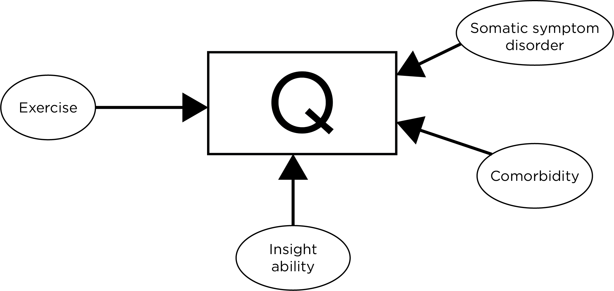

# Objective Personality Testing {#objective-personality}

## Overview of Personality Tests

There are two main types of personality tests: objective personality tests and projective personality tests. Of course, no measure is truly "objective" but some measures are more or less so. In a so-called *objective personality test* (or structured personality test), a stimulus is presented to a respondent, who makes a closed-ended (constrained) response, such as True/False or Likert ratings. Examples of objective personality or symptomatology tests include the [Minnesota Multiphasic Personality Inventory](#mmpi) (MMPI) and the Beck Depression Inventory (BDI). In a *projective personality test*, an ambiguous stimulus is presented to a respondent, who is asked to make an open-ended response. Examples of projective personality tests include the [Rorschach Inkblot Test](#rorschach) and the [Thematic Apperception Test](#tat) (TAT). Projective tests have largely fallen by the wayside now, but it is still helpful to think about their potential advantages. Projective tests are described in further detail in Chapter \@ref(projective).

### Projective Personality Tests

In a projective personality test, the client's response is not limited. Projective personality tests were designed from a psychodynamic perspective, and they are supposed to have limitless variability and therefore a freer access to the client's internal world. However, Card V of the [Rorschach Inkblot Test](#rorschach) looks like a moth or a bat, and around 90% of respondents likely give that response [@Wiggins1973], so projective tests are not completely limitless. Projective personality tests are designed to have ambiguous content. This is, in part, to make them hard to figure out what is being assessed. However, even so-called objective personality tests can have items that are ambiguous and that function similarly to a projective test. For instance, one of the items on the original [MMPI](#mmpi) asks respondents whether they like mechanics magazines. But in modern times, many people have never looked at a mechanics magazine. So, it becomes like a [Rorschach](#rorschach) question because the client starts to think about other factors.

Scoring of projective tests does not rely on the client's insight, so projective tests might get past social desirability of clients' responses and potential defensiveness. Therefore, projective tests are potentially difficult to fake. Faking good means to present oneself as better than one actually is, whereas faking bad means to present oneself as worse than one actually is. For instance, a client may want to fake good on a test if it allows them to keep custody of their child. By contrast, a client may want to fake bad to receive disability insurance.

As of 1995, the [TAT](#tat) and [Rorschach](#rorschach) were the #5 and #6 most widely used assessments, respectively, by clinical psychologists [@Watkins1995]. However, they and other projective techniques have lost considerable ground since then.

### Objective Personality Tests

In contrast to projective personality tests, objective personality tests, the client's responses are substantially constrained to the possible answers. Moreover, objective personality tests tend to be cheap and fast to administer, and can be scored by computers now. In addition, objective tests have more reliable scoring than projective tests. It takes a very long time to score the [Rorschach Inkblot Test](#rorschach) and it it still has very low [reliability](#reliability). With an objective test, by contrast, scoring [reliability](#reliability) approaches perfection. The earliest examples of objective personality tests were the [MMPI](#mmpi) and the Strong Vocational Interest Blank. The [MMPI](#mmpi) assesses personality, whereas the Strong Vocational Interest Blank assessed preferences for different jobs or professions. An overview of objective personality tests is provided by @Wiggins1973.

## Example of an Objective Personality Test: MMPI {#mmpi}

The MMPI is an example of a so-called "objective" personality test. But, the MMPI and other objective personality tests are not truly objective. Consider an example of a True/False item from the MMPI: "I hardly ever notice my heart pounding and I am seldom short of breath." The item is intended to assess somatic symptom disorder, with a response of "false" being more indicative of disorder. But, there are other factors that could influence a person's response to the question besides whether the person has somatic symptom disorder. Figure \@ref(fig:somaticSymptom) depicts how a person's response to the question could be influenced by several factors. A comorbidity of somatic symptom disorder could make it more likely that a person answers with a response of "false", in line with somatic symptom disorder. In addition, a person's insight ability may influence whether they answer with a response of "false." Also, people who exercise more may experience a pounding heart and shortness of breath more frequently (i.e., while exercising), and therefore answer with a response of "false." In sum, the item and the test as a whole is clearly not "objective" because constructs in the questions are not clearly defined. What does a "pounding heart" mean? How much is "hardly ever"? People may define "seldom" differently.

```{r somaticSymptom, out.width = "100%", fig.align = "center", fig.cap = "Depiction of some of the factors that could influence a respondent's answer to the True/False question: 'I hardly ever notice my heart pounding, and I am seldom short of breath.'.", echo = FALSE}

```

There are multiple forms of [measurement error](#measurementError) for a given item. For instance, there are situational sources of [measurement error](#measurementError). Consider the item "I hardly ever notice my heart pounding, and I am seldom short of breath." For example, how many stairs the participant climbed to get to the lab could influence their response to the question. Other situational factors could include whether they are dehydrated, whether they have a cold or are sick, and what they did over the past week. Another form of [measurement error](#measurementError) could result from the purpose of test taking. It is important to consider the purpose of the assessment. For example, if the assessment is for disability payments or to get a physical job, such as a firefighter, it may change a person's answers. [Response biases](methodBias), such as social desirability, could also influence a person's answers. In addition, memory limitations of the person could influence their responses.

There have been multiple versions of the MMPI. @Graham2011 provides an overview of how the MMPI was developed. The original MMPI was developed using the [external approach](#externalApproach) to scale construction. The second version of the MMPI (MMPI-2) placed greater emphasis on [content validity](#contentValidity) of the items, on removing items with outdated or offensive language, and on updating the [norms](#norm) to be more represenatitve. Later, restructured versions of the MMPI-2 were created, which became known as the MMPI-2-Restructured Forms (MMPI-2-RF). Evidence on the MMPI-2-RF is reviewed by @Sellbom2019.

## Problems with Objective True/False Measures

There are a number of problems with objective True/False measures. However, the problems are not necessarily unique to objective personality measures or to True/False measures.

One problem is related to the [response biases](methodBias) of acquiescence and disacquiescence. *Acquiescence* occurs when the person agrees in response to items regardless of item content. Acquiescence occurs oftentimes when the participant is just going along because they think the experimenter may want them to have certain characteristics, therefore they often just say "TRUE" a lot. That is, they may want to please the investigators. *Disacquiescence*, by contrast, is when the person disagrees in response to the items regardless of item content. Disacquiescence is also called opposition bias. Disacquiescence may occur if the person does not think they have the disorder or problem of the characteristics being explored.

True/False measures, just like other questionnaire formats, are influenced by multiple sources of variation. In an objective personality test, there is a high demand on respondents. For instance, on the [MMPI](#mmpi), respondents must be aware of recall over an unspecified period of time, which can cause confusion. The high demand on respondents can lead to inaccuracy of individuals' reading of the items. Additional sources of information could influence the respondents' answers to the item "I hardly ever notice my heart pounding, and I am seldom short of breath." Some respondents may be intoxicated while answering questions, which could influence physiological experiences. Some respondents may have comorbordities that influence their responses. Psychological and medical comorbidities could cause difficulty in interpreting the questions. For example, the respondent may wonder whether the investigator is inquiring about heart beating that reflects anxiety versus heart beating that reflects high blood pressure.

In addition, there are effort differences that influence people's responding. There has been a recent resurgence in how to assess respondents' effort. There are often limits to predicting phenomena due to individuals not putting effort into answering questions. Other potential sources of variation in an item could include psychopathology, stress, physical fitness, age, and gender. For instance, older people are more likely to notice shortness of breath because their lung capacity is less than what it used to be. Moreover, women more likely to say "FALSE" to this item than men, but the item has less social desirability bias than some other items, so women could be putting in more effort and giving different responses than men.

In sum, lots of factors beyond the construct of interest can influence a response on an item. It is valuable to scan through your measures and consider what goes into a person's answers. It is important to keep the content in mind of all things contributing to scores, and you should consider these potential factors when interpreting results!

Another problem with some questions are compound questions, also called double-barreled questions. Double-barreled questions following the structure: $\text{T/F: X} + \text{Y}$. An example of a compound question is, "True or False: Cars should be faster and safer." It is unclear which components of a compound question people are responding to. In conclusion, every objective test is partly projective—that is, the stimuli are interpreted in different ways by different people.

## Approaches to Developing Personality Measures

There are three primary approaches to developing personality measures and other scales:

1. An [external approach](#externalApproach) to scale construction, also called an empirical approach or criterion-keyed approach
2. A [deductive approach](#deductiveApproach) to scale construction, also called a rational, theoretical, or intuitive approach
3. An [inductive approach](#inductiveApproach) to scale construction, also called an internal or item-metric approach

However, these approaches are not mutually exclusive and can be combined.

### External Approach to Scale Contruction {#externalApproach}

The external approach to developing a personality measure is also called the empirical approach or the criterion-keyed approach. The external approach relies on an external [criterion](#criterionValidity). In general, a criterion-keyed approach examines scores on items in relation to the [criterion](#criterionValidity), and selects items that are associated with the c[criterion](#criterionValidity), regardless of the item content. The [MMPI](#mmpi) is an example of a scale that was developed using the external approach. For the [MMPI](#mmpi), the [criterion](#criterionValidity) was a group (i.e., a [criterion](#criterionValidity) group approach), or more accurately, multiple groups: patients with different disorders and controls. The original [MMPI](#mmpi) was not developed based on theory (e.g., theoretical understanding of the construct of depression); instead, it was developed based on its empirical associations with a [criterion](#criterionValidity) group. Because an external approach relies on an external [criterion](#criterionValidity), if people lost interest in the scale [criterion](#criterionValidity), the scale loses interest.

Consider the development of the [MMPI](#mmpi) as an example of a measure that was developed using the external approach to scale construction. The developers grouped people together based on their [criterion](#criterionValidity) status, for example one group of schizophrenics and a control group that does not have mental disorders. How did they develop the test? The idea of the external approach is to let nature decide what goes into the test. So, the [MMPI](#mmpi) developers sampled thousands of questions very broadly from pre-existing questionnaires of personality, symptoms, etc. Then, they had the [criterion](#criterionValidity) groups (e.g., schizophrenia) and control groups answer the questions. They examined the item responses to determine which items discriminate between groups (i.e., which items are associated with [criterion](#criterionValidity) group status). And if an item(s) is good at discriminating between the [criterion](#criterionValidity) and control groups, the items are selected for the measure. It was purely empirical business—i.e., [dustbowl empiricism](#theoryEmpiricism). In sum, using an external approach, item selection depends on the discriminatory power of each item to inform about an external [criterion](#criterionValidity) of interest. Such an approach does not require having any theoretical assumptions about item functioning.

#### Pros

There are several pros of using the external approach to develop measures:

- You do not need to know anything—it requires no theory or theoretical knowledge about disorders and their etiology
- There is likely to be some generalizability of the utility of the measure in the future because there is some carryover of [criterion-related validity](#criterionValidity)
- The measure has some practical utility given its relation to [criteria](#criterionValidity) of interest
- "Subtle items" with poor [face validity](#faceValidity) can be selected solely based on their discriminatory power. Subtle items are items that neither you nor the respondent predicted would show differences between groups. Subtle items provide an advantage that the data are moving beyond our ignorance. It is also an advantage that clients cannot fake subtle items as well as they can more obvious items.

#### Cons

There are also cons of using the external approach to develop measures:

- Measures developed using the external approach have lower [content validity](#contentValidity) and/or [face validity](#faceValidity) because they include subtle items. For example, the original version of the [MMPI](#mmpi) had low [content validity](#contentValidity) and [face validity](#faceValidity). Using the external approach, it is possible to construct a scale that makes no sense due to lack of consideration of [face validity](#faceValidity).
- The success of the external approach depends highly on the quality of the [criterion](#criterionValidity) and control groups—if a [criterion](#criterionValidity) falls out of favor as an indicator of the construct (or interest fades) then the [utility](#validity) of the test decreases because it is no longer applicable.
- Items will not always generalize because the generalizability depends on the representativeness of the sample and the quality of the groups—if you select poor groups, it is not a representative sample, which results in a biased measure. The [validity](#validity) of the scale depends on the representativeness of your groups in regard to the [criterion](#criterionValidity) of interest. It is possible that your findings might not be generalizable if your sample is not—this is especially problematic when you rely only on data and not on theory.
    - An example of the importance of the representativeness of the sample comes from the original [MMPI](#mmpi). The [norms](#norm) of the original [MMPI](#mmpi) were based on largely White participants from Scandinavian, German, and Irish Descent in the Midwestern U.S., with an average of an 8th grade education. The [norms](#norm) became known as "Minnesota farmers." Therefore, "Minnesota normals" (i.e., the control group) were pretty "dull" normals. In addition, to be included in the [norms](#norm), the respondents for the [MMPI](#mmpi) had to be waiting in the hospital (not everyone does that for family in the hospital) and had to be kind enough to take a 4–5 hour measure for psychologists (not all would do this). For all of these reasons, there were issues with poor generalizability of the original [MMPI](#mmpi) [norms](#norm) in the broader population. A scale is most likely to be valid when it is used with similar populations and in similar conditions.
- Shrinkage often occurs when using a measure developed using an external approach. As described in Section \@ref(modelAccuracy), *shrinkage* is when variables with stronger predictive power in the original data set tend to show somewhat smaller predictive power (smaller [validity](#validity) coefficients) when applied to new groups. When variables are selected empirically, they tend to show less predictive power (smaller [validity](#validity) coefficients) when applied to new groups during cross-validation. Shrinkage reflects a model [over-fitting](#overfitting), because it is somewhat capitalizing on chance in selecting items. Many subtle items may be instances of Type I error (false positives). Shrinkage is especially likely when the original sample is small and/or unrepresentative and the number of variables considered for inclusion is large
- Externally developed measures also have a problem of communicability [@Burisch1984]. For something to have meaning to others, it should have connection to constructs, which may not be true for many measures developed using the external approach.
- It can take a long time to develop measures using the external approach, and they tend to be longer to administer because of having more items. For instance, there are 567 items in the [MMPI-2](#mmpi).

#### MMPI Examples

Paul Meehl wrote his dissertation to develop the K scale of the [MMPI](#mmpi) to attempt to detect faking good. Faking good is reporting in a way to present as better than one actually is. In the context of the [MMPI](#mmpi), it would involve under-reporting of symptoms. He developed the K scale based on all positive qualities that around half of people typically endorse. So, it is not obvious that the items reflect faking good, and if someone is trying to respond in a socially desirable way, they endorse more of these positive qualities. There is also a "faking bad" version of the scale, too. "Faking bad" (F) scale was developed as an attempt to detect malingering (over-reporting of symptoms).

However, the [MMPI](#mmpi) could pathologize normality in some cases. Some psychotic patients may have been identified as "faking bad" because they actually have had a lot of odd experiences. And very healthy people may have gotten higher score on "faking good," but they just may be very positive and well-adjusted. As examples from the original [MMPI](#mmpi) from 1940, male teenagers tended to have elevated scores on the psychopathy and mania scales. Graduate students, including female graduate students, tended to have higher "masculine" scores on the Masculinity/Femininity (Mf) scale. This shows that non-clinical samples can still have "clinical" scores. In the 1930s–1940s, there was an emphasis on developing empirically based measures, where the researchers rely on data, not theory as previously emphasized.

### Deductive Approach to Scale Construction {#deductiveApproach}

The deductive approach to developing a personality measure is also called a rational, theoretical, or intuitive approach. Using a *deductive approach*, the choice and definition of constructs precede and govern the formulation of items. Item pools are generated using theoretical considerations, and item selection depends on possessing a rich theoretical knowledge about the construct and selecting which items assess the construct the best. In a deductive approach, the measure developer deduces the content; they do not rely on [criterion](#criterionValidity) data to select the content. Deducing the content involves thinking and talking about the construct, and having experts write items that they think would do well in eliciting information about the construct. The measure developer deduces from the construct which items to use. Therefore, the deductive approach completely depends on our ability to understand a given construct and translate this understanding to the generation of item content that will be understood by the examinees in such a way that it elicits accurate ratings for the construct of interest. Most assessments are developed using the deductive approach.

#### Pros

There are several pros of using the deductive approach to develop measures:

- Using the deductive approach is fast, easy, and short. Generating such scales requires few people, and is often fast and accurate. It does not typically take as much time to develop a measure using the deductive approach. Moreover, it allows the possibility of short scales that are quick to administer. By contrast to short scales developed by the deductive approach, the [MMPI](#mmpi) (developed using the [external approach](#externalApproach)) is very long.
- Measures developed (well) using the deductive approach are always [content valid](#contentValidity) because of the reliance on theory—items tend to be prototypical of the construct.
- Measures developed using the deductive approach are usually [face valid](#faceValidity), more likely than [external approach](#externalApproach). [Face validity](#faceValidity) is often an advantage, but not always. [Face validity](#faceValidity) can help with disseminability because others may be more likely to adopt it if it appears to assess what it claims to assess. However, [face validity](#faceValidity) is not desirable when trying to prevent faking good or faking bad.
- Measures developed using the deductive approach tend to have better communicability—i.e., how comprehensible the information communicated is to the examiner based on the responses.

#### Cons

There are also cons of using the deductive approach to develop measures:

- If your theory or understanding is wrong, your scale will be wrong!
- Additionally, if the construct itself is vague, and there are overlap between constructs, scales may be difficult to differentiate between, making it difficult to establish [discriminant validity](#discriminantValidity). Many theories and constructs overlap. Therefore, measures often overlap—even measures with very different names! For example, consider the Rosenberg Self-Esteem Scale and the Spielberger State-Trait Anxiety Inventory:

Items on the Rosenberg Self-Esteem Scale include:

- "At times, I think I am no good at all."
- "I certainly feel useless at times."
- "On the whole, I am satisfied with myself."

Items on the Spielberger State–Trait Anxiety Inventory (STAI):

- "I lack self-confidence"
- "I feel inadequate"
- "Satisfied with self"

### Inductive Approach to Scale Construct {#inductiveApproach}

The inductive approach to developing a personality measure is also called an internal or item-metric approach. The inductive approach is an empirical, data-driven approach for scale construction, in which scales are derived from the pre-existing internal associations between items. A large pool of items are selected, and scales are generated from the item pools based on the structure of the internal association between items. The inductive approach assumes that universal laws exist for personality structure, that is, that there is a natural structure. The hope is that personality has simple structure: that each item loads onto (i.e., reflects) one and only one factor. It is the hope of the inductive approach that there is simple structure because it makes the natural structure easier to detect using available methods.

The inductive approach is empirical because the answers comes from within the data. But, the inductive approach differs from the [external approach](#externalApproach). In the inductive approach, the data come from the internal structure of the measure's items. The empirical approach is also based on empirical data. Science involves prediction and both the inductive and empirical approach use prediction. The empirical approach examines how item predict some external criterion. By contrast, the inductive approach examines how items predict or relate to each other. The goal of the inductive approach is to to "describe nature at its joints."

According to the inductive approach, once you understand constructs, you can understand how they are connected to each other. The [external approach](#externalApproach) does not really care about the items themselves. In the inductive approach, you need to use theoretical knowledge to interpret findings. The [deductive approach](#deductiveApproach) uses theory up front to make the scale. The inductive approach concerns itself with the items and what inferences can be made. The method helps group the large set of items into subscales based on clusters of items that covary most strongly with each other using factor analysis, and it drops items with low item–total correlation.

[Factor analysis](#factorAnalysisOverview) is used is used for the inductive approach to developing measures. It is used to evaluate the internal structure of a measure, and ideally, the structure of a construct. Factor analysis is considered to be a "pure" data-driven method for structuring data, but as noted in Section \@ref(factorAnalysisDecisions), the "truth" that we get depends heavily on the decisions we make regarding the parameters of our factor analysis. In sum, factor analysis is not purely inductive because the result is influenced by many decisions by the investigator. Even though the inductive approach ([factor analysis](#factorAnalysisOverview)) is empirical, theory and interpretability should also inform decisions.

#### Pros

There are several pros of using the inductive approach to develop measures:

- The inductive approach yields estimates of associations between items and can arrive at simple, homogeneous construct.
- You do not need to know much to use the inductive approach (relative to the [deductive approach](#deductiveApproach)): just use the items you have and use a data reduction approach.
- The inductive approach can derive short, homogeneous scales. Then, you can see how constructs relate to other constructs.
- The inductive approach is a "purer" method of scale construction because it relies on the natural structure of the data, and no theoretical knowledge or validation to a [criterion](#criterionValidity) is required on the front end of scale development.
- The data are allowed to "speak for themselves."

#### Cons

There are also cons of using the inductive approach to develop measures:

- The inductivists (i.e., users of the inductive approach) hope that a simple structure exists within a set of items and that this structure can meaningfully differentiate between constructs. If there is no simple structure, interpretations of scales that emerge can be difficult.
- In addition, this approach is not "pure" because the structure we get depends on the analysis decisions we make. The answers you get depend on the decisions you make, and there really is no basis on which to make decisions. This is called indeterminacy. There are a number of decisions in [factor analysis](#factorAnalysisOverview), including decisions such as the number of factors and the nature of factors—i.e., how to interpret them.
- [Factor analysis](#factorAnalysisOverview) is not straightforward, and depends on decisions made along the way. Therefore, some argue because so much is in the hands of the investigator that [factor analysis](#factorAnalysisOverview) is really a semi-empirical approach.
- SPSS likely contributes to the problem because it makes so many decisions for you, and many have no idea what they are doing! SPSS is for ease of use, but it is limiting. In SPSS, you can use [principal components analysis (PCA)](#pcaOverview) for item extraction. Investigators often determine how many factors to keep based on the [criterion](#criterionValidity) of keeping factors with eigenvalues greater than one, often use orthogonal rotation of data, etc.
- A meta-analysis found that many researchers using [PCA](#pcaOverview) were making the same decisions. But why? Because all were using the default settings in SPSS! It is important to be aware of the settings in [factor analysis](#factorAnalysisOverview) and [PCA](#pcaOverview) and to use the appropriate ones given the data and question. [Factor analysis](#factorAnalysisOverview) and [PCA](#pcaOverview) are described in Chapter \@ref(factor-analysis-PCA).

### Hybrid Approach

The preceding discussion described the three primary approaches to developing objective personality measures. However, the approaches can be mixed. For instance, once could write a large set of items based on theory (i.e., the [deductive approach](#deductiveApproach)) and then pick items to keep based on their [criterion-related validity](#criterionValidity) (i.e., the [external approach](#externalApproach)), and group them into scales based on their internal structure (i.e., the [inductive approach](#inductiveApproach)). There is not strong evidence for the superiority of any of the approaches compared to the others.

## Measure Development and Item Selection {#measureDevelopment}

Despite not having strong evidence for the superiority of any of the approaches to scale construction, best practices to measure development include:

- Start with theory to define the construct and create item pools, using a [deductive approach](#deductiveApproach).
    - Be inclusive at this stage. Create more items than you will actually use—even if items are only tangentially related—so you have a broad pool of items.
    - Include items of other constructs to establish the boundaries of the construct, i.e., [discriminant validity](#discriminantValidity).
- Then, test these item pools, and consider their empirical relations to revise and/or drop items. Ideally, you would test the items in large and heterogeneous samples that are representative of the population.
    - Examine the items in relation to external [criteria](#criterionValidity), using an [empirical approach](#external approach).
    - And examine items in relation to each other, using an [inductive approach](#inductiveApproach). This likely involves [factor analysis](#factorAnalysisOverview) and/or [item response theory](#irt).
        - We want items, collectively, to span the full range of [difficulty/severity](#itemDifficulty) of the construct in the target range of interest. It is important for the items to have accuracy (i.e., strong [discrimination](#itemDiscrimination) and [information](#irtReliability)) in the target range of interest on the construct (e.g., low, medium, and/or high). The target range of interest depends on the purpose of the assessment, as described in Section \@ref(goodMeasure). For example, items used for diagnosis should focus on higher levels of the construct, whereas items used for screening should identify those with elevated risk but might not need to discriminate at higher levels. For assessing individual differences, you would want items that discriminate across the full range, including at the lower end.
        - Items should show some [internal consistency](internalConsistency), as evidenced by an inter-item or item–total correlation), but items should not be too highly inter-correlated. If items are too highly correlated, they are redundant and do not provide unique information. Inter-item correlations should only be moderate, e.g., should range from approximately .15 to .50. But, items should be highly correlated with the latent factor representing the target construct. That is, the items should have high [discrimination](#itemDiscrimination) or a strong factor loading.
- Then, interpret the results and label the factors based on theory.
- Evaluate multiple aspects of [reliability](#reliability) and [validity](#validity) of the scale.

Other ideas in scale development are discussed by @Burisch1984, @Clark1995, @Clark2019, and @Loevinger1957.

### The Response Scale

Evidence suggests that there may not benefits of having more than six response options for likert-scale items that assess personality [@Simms2019].

## Emerging Techniques

One emerging technique for developing personalized models of personality is the group iterative multiple model estimation (GIMME) model [@Wright2019b], as described in Section \@ref(nomotheticIdiographicApproaches).

## The Flawed Nature of Self-Assessments

It is a common finding that people tend to over-estimate their skill and abilities—most people tend to describe themselves as "above average", which is statistically impossible. People are over-confident, and they over-estimate the likelihood of achieving desirable outcomes and underestimate how long it will take to complete future projects. Self-report is only weakly associated with people's actual behavior.

There are there prominent ways in which self-assessment have been shown to be flawed:

- response [bias](#bias)
- ambiguity of items
- lack of insight

### Bias

One way that self-assessment has been shown to be flawed is in terms of [response bias](#bias). [Bias](#bias) involves a [systematic measurement error](#systematicError). For instance, it is not uncommon for participants to fake good or fake bad on assessments due to situational reasons or due to how questions are worded. Faking good involves presenting oneself in a more positive light than is true, often for external reasons such as to get a job or to win custody of a child. Faking bad involves presenting oneself in a more negative light than is true, often for external reasons such as to win disability claims or to be pronounced not guilty by reason of insanity. When answering questions, many people desire to seem better than they are. This phenomenon is called social desirability bias, which is a form of [method bias](#types-of-method-biases) in which people systematically adjust their responses to reflect more socially desirable attributes. The degree of a person's faking has been shown to be related to social desirability bias [@Bensch2019]. If you want to want to know the true prevalence of a given behavior, you can deal with social desirability bias using a [randomized response model](#randomizedResponseModel) , as described in Section \@ref(randomizedResponseModel). There are indicators of response bias that are worth considering [@Burchett2019].

### Ambiguity of Items

Another way that self-assessment has been shown to be flawed is in the ambiguity of items. People tend to have a difficult time providing an accurate characterizations of their skills on tasks that are poorly defined or ambiguous. For example, what does it mean to be a "warm" parent? Beyond this, even the language on self-assessments can be highly ambiguous. For example, how often is "rarely"? Such questions can systematically skew answers to self-assessments.

### Lack of Insight

A third way that self-assessment has been shown to be flawed is due to respondents' lack of insight into the required information to make good self-assessments. People often make poor judgments because they lack the required skills and information necessary to have insight into their actual performance, or they neglect it when it is available. The lack of insight into poor judgments can also be caused by errors of omission—in which they do not know that they have made a mistake because they do not know what the best alternative would have been. Also, people infrequently get feedback from others on the constructs we are attempting to assess—as a result, their self-views are not informed by objective feedback.

### Ways to Improve Self-Assessment

Ways to improve self-assessment are described by [@Dunning2004]:

- Use clear items that are behaviorally specific
- Provide frequent, timely, objective, and individualized feedback
- Use self-testing, after a delay after studying
- Review one's past performance
- Use peer assessment
- Target the motivational basis of the over-confidence
- Benchmark—compare one's performance against others' performance
- Introduce "desirable difficulties" to instruction, such as spreading training over several sessions and varying the circumstances of the training. These challenges can harm the speed that students learn but leaves them better able to retain what they learned and to transfer it to new situations in the future.
- To account for over-confidence, add in safety factors and buffer time. For instance, add 30%–50% extra time to all time completion estimates for projects.

### Satisficing (vs. Optimizing)

There have been new developments in gaining insight into the cognitive processes by which respondents generate answers to survey questions [@Krosnick1999].

#### Optimizing

*Optimizing* involves a respondent responding optimally to a question—i.e., responding in an [unbiased](#bias) and thorough manner. There are four cognitive steps or stages that respondents must complete to answer a question optimally:

1. They interpret the question
2. They search their memory for relevant information
3. They integrate all relevant information into a single judgment
4. They use that judgment to select a response

The complexity of the cognitive processes one must engage in when giving an optimal answer requires a lot of cognitive effort. Giving such effort can happen for a variety of reasons: desire of self-expression, being altruistic, desire for gratification, etc. The extent to which such motivations inspire a person to engage in the cognitive requirements to respond to questions in an [unbiased](#bias) and thorough manner is referred to as optimization. Optimizing deals with how hard the person worked and how much they care about giving their best response.

#### Satisficing

If, for some reason, a person is not motivated to expend the cognitive effort required to make an optimal response, and instead settle for a satisfactory response, they are said to be *satisficing*. That is, they are expending less effort that prevents obtaining the optimal answer. There are two types of satisficing: weak satisficing and strong satisficing. In *weak satisficing*, respondents execute all four cognitive steps, they are just less diligent about doing so, and they settle on selecting a satisfactory answer rather than the optimal answer. Weak satisficing may lead to selecting earlier response options without careful evaluation of later response options, which is susceptible to confirmation bias. In *strong satisficing*, a respondent skips the retrieval and judgment steps, interprets the question superficially and selects an answer based on what they think will be a reasonable (or "satisfactory") response. Their answer is not reflective of a person's actual feelings about the construct of interest. Answers could also be selected arbitrarily.

There are several conditions when satisficing is most likely to occur:

- The greater the task difficulty
- The lower the respondent's ability
- The lower the respondent's motivation
- When "No opinion" responses are an option

In sum, to reduce the likelihood of satisficing, match the task to the participant's ability, make sure they have motivation to respond correctly, and do not provide a "no opinion" response option.

## Observational Assessments

Given the challenges with self- and informant-report of personality, it can also be worth considering observational assessments. For example, one observational approach to assessing personality involves a "thin-slice" approach, in which observers briefly assess people's personality via observations across a range of situations or contexts [@Tackett2019b]. Observational ratings of personality can then be combined with self- and informant-rated personality in a [multitrait-multimethod matrix](#MTMM) [@Tackett2019b].

## Structure of Personality

The most well-supported structure of personality is the five-factor model of personality. The highest-order dimensions of the five-factor model are defined by the Big Five. The Big Five are known by the acronym OCEAN: **O**penness to experience (vs. closed-mindedness), **C**ontientiousness (versus disorganization), **E**xtraversion (versus intraversion), **A**greeableness (versus disagreeableness), and **N**euroticism (versus emotional stability).

## Personality Across the Lifespan

As described by @Costa2019, individual differences (i.e., rank-order) in personality is relatively stable from middle childhood to old age. It is unclear how extraversion and openness to new experiences change across the life span. On average, neuroticism tends to decline, and agreeableness and contientiousness tend to increase with age [@Costa2019].

## Conclusion

## Suggested Readings
