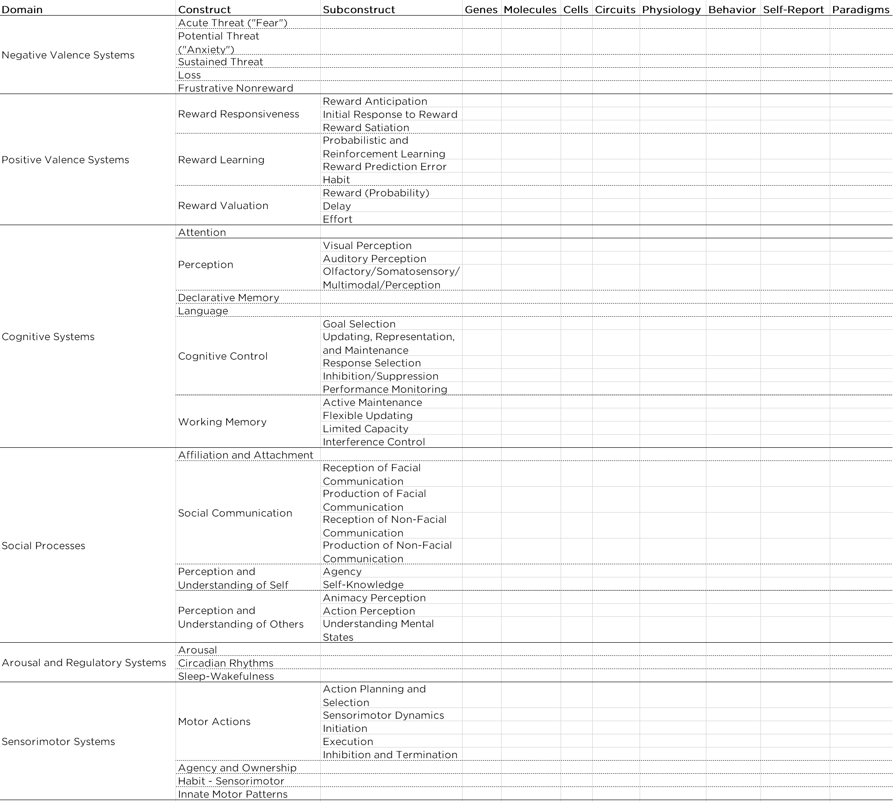

# Psychophysiological and Ambulatory Assessment {#psychophysiological}

There are a number of alternative conceptualizations of psychopathology compared to the conceptualization of psychopathology provided in the [Diagnostic and Statistical Manual of Mental Disorders](#dsm) (DSM).
One alternative conceptualization of psychopathology is the *p*-factor [@Caspi2014; @Smith2020].
The *p*-factor is a hierarchical view of psychopathology that accounts for covariation among various kinds of psychopathology.
The *p*-factor is a general psychopathology factor, similar to the general intelligence factor (*g*), and has three sub-factors: internalizing problems, externalizing problems, and thought-disordered problems.
Hierarchical conceptualizations tend to be advanced by lumpers, who group similar forms of psychopathology together, as opposed to splitters, who tend to split forms of psychopathology into separate categories.

Another hierarchical view of psychopathology is HiTOP, the Hierarchical Taxonomy of Psychopathology [@Kotov2017; @Kotov2021].

A third conceptualization of psychopathology is presented by the [Research Domain Criteria](#rdoc), also called (RDoC) from the National Institute of Mental Health (NIMH).
Recommendations for conducting assessment in a transdiagnostic way that is consistent with HiTOP and RDoC are provided by @Stanton2020.

## NIMH Research Domain Criteria (RDoC) {#rdoc}

The National Institute of Mental Health (NIMH) has funded research to understand the etiology of mental illnesses and how best to intervene.
Historically, NIMH funded considerable work on traditional [DSM](#dsm)-based diagnostic categories.
However, work studying [DSM](#dsm)-defined diagnostic categories has not had as much impact as NIMH would have liked.
So, the NIMH led an initiative known as the Research Domain Criteria, also called RDoC, to provide a template for research on psychopathology.

An overview of RDoC is provided by @Kozak2016.
There are several ways in which RDoC is different from the [DSM](#dsm).
Compared to the [DSM](#dsm), RDoC is dimensional, not categorical.
RDoC views psychopathology as existing on continua, not as discrete categories.
Another difference is that RDoC works from the ground up, starting with brain–behavior relations, and linking those to clinical symptoms.
By contrast, the [DSM](#dsm) is top-down, starting with diagnostic categories and determining what fits in those categories based on behavioral symptoms.
However, as discussed in Section \@ref(dsmConcerns), diagnoses are fictive categories that have poor diagnostic [validity](#validity).
The [DSM](#dsm)-defined categories are based on behavioral presentations.
That is, disorders are not things that people "have"; they are things that people "do."

The same behavior can occur for different underlying reasons, a principle known as equifinality.
Different neurodevelopmental trajectories may underlie the same behavior for two different people.
Behavioral presentations in the same disorder are heterogeneous.
The pathophysiology in a given [DSM](#dsm) category is not unitary.
[DSM](#dsm) categories also share symptoms and show lots of co-occurrence, so they are not entirely distinct.
The [DSM](#dsm) has resulted in the reification of these fictive diagnostic categories.

RDoC is a template for psychopathology research that consists of dimensional constructs integrating elements of psychology and biology.
It incorporates a wider range of data, and multiple levels of analysis, including genetics, brain structure and function, and physiology.
By contrast, the [DSM](#dsm) only incorporates symptoms.
In RDoC, there is a focus on narrower dimensions, such as cognition, emotion, reward seeking, fear, learning, memory, motivation, and perception, rather than disorders.
The focus on narrow dimensions is based on the idea that there is greater potential to relate biological processes to simpler, lower-order, narrower dimensions of psychological constructs compared to disorders.
These narrower dimensions of psychological constructs can be related to important clinical dimensions.
Psychopathology is thought to represent extremes on the psychobiological distribution: e.g., high fearfulness in phobia versus low fearfulness in psychopathy.
Thus, psychophysiological processes are a key emphasis in RDoC [@Miller2016].

### RDoC Matrix

The RDoC matrix is a matrix of two dimensions: six domains by eight units of analysis.
In the RDoC matrix, domains are constructs that include elements, processes, mechanisms, and responses.
The domains include: negative valence systems (i.e., negative affect: fear, anxiety, etc.), positive valence systems (i.e., positive affect: reward processing), cognitive systems (attention, perception, language, cognitive control, working memory), social processes (attachment, social communication, empathy), arousal and regulatory systems (sleep, circadian rhythms), sensorimotor systems (e.g., motor actions).

In the RDoC matrix, units of analysis are are classes of measurement that are similar to levels of analysis.
Units of analysis include: genes, molecules, cells, circuits, physiology, behaviors, self-reports, and paradigms.

The RDoC matrix is presented in Figure \@ref(fig:RDoC).

```{r RDoC, out.width = "100%", fig.align = "center", fig.cap = "National Institute of Mental Health (NIMH) Research Domain Criteria (RDoC) matrix.", echo = FALSE}

```

In the RDoC framework, there is theoretical neutrality of the units of analysis.
No unit of analysis is thought to be more important than any other; they are each thought to be important in their own right.
That is why they are referred to as *units* of analysis rather than *levels* of analysis.
"Levels" connotes order from basic to higher-order, and the developers of RDoC wanted to avoid suggesting that one level underlies another.

RDoC dimensional constructs are meant to be integrative rather than reductionistic.
It involves moving away from the subjectivist tradition and moving toward a heterophenomenological approach.
The subjectivist tradition is one in which subjective experience is deemed the primary measure of a phenomenon (e.g., fear).
The heterophenomenological approach combines multiple units of analysis to identify phenomena.

The domains and constructs will need to be added and refined with further research.
The RDoC matrix is just a tentative and incomplete starting template.
The goal is to understand the bridge (i.e., mechanisms) that link the different units of analysis for the same construct, for example, how the biological and psychological bases of fear influence each other.
Examples of mechanisms include endophenotypes, that are heritable, "unobservable," intermediary traits that signify disease liability, and that mediate the association between genotype and phenotypic expressions of psychopathology.
An example of an endophenotype is depicted in Figure \@ref(fig:endophenotype).

```{r endophenotype, fig.align = "center", fig.cap = "Example of an endophenotype.", echo = FALSE}
knitr::include_graphics("./Images/endophenotype.png")
```

The idea is that genes influence endophotypes and that endophenotypes lead to the phenotype.
An endophenotype is similar to "intermediate phenotype," but an intermediate phenotype does not have the requirement of a genetic cause.
An example of an intermediate phenotype is depicted in Figure \@ref(fig:intermediatePhenotype).
Endophenotypes and intermediate phenotypes are different from biomarkers, which are biological indicators (i.e., correlates) that are not necessarily causal.
All endophenotypes are biomarkers, but not all biomarkers are endophenotypes.

```{r intermediatePhenotype, fig.align = "center", fig.cap = "Example of an intermediate phenotype.", echo = FALSE}
knitr::include_graphics("./Images/intermediatePhenotype.png")
```

One dimension that the RDoC does not include is development.
It has been a challenge incorporating development into the RDoC matrix.
[**J of Abnormal Psychology Special Issue CITATION**]

## Psychophysiological Measures

Examples of psychophysiological measures include electroencephalography (EEG), event-related potential (ERP), (functional) magnetic resonance imaging (f)MRI, computerized axial tomography (CAT), magnetoencephalography (MEG), functional near infrared spectroscopy (fNIRS), electrocardiography (ECG or EKG), electromyography (EMG), electrooculography (EOG), eyetracking, and actigraphy.
@Miller2007 provide an overview of neuroimaging techniques for clinical assessment.

EEG caps can include 256 electrode sensors from millisecond to millisecond, with strong temporal resolution, yielding lots of data.
Having more sensors allows better estimates of spatial localization.
Psychophysiological measures are relevant because lots of behavior problems have important physiological facets.
But it is not always clear whether biological processes cause psychopathology or the reverse, or whether there are third variable confounds that influence both psychophysiology and behavior problems (that explain why they are associated, even though they are non-causally related).

Psychophysiological measures are not invulnerable to basic measurement issues, including [reliability](#reliability) and [validity](#validity).
Psychophysiological measures tend to be more expensive than questionnaire measures, so people traditionally were reluctant to consider issues of [reliability](#reliability) and [validity](#validity).

Galton and Cattell, nearly 200 years ago, were more interested in direct measures, like grip strength, than self-report.
Hans Berger made the first EEG recording in 1924: EEG has been around a long time.

### Reliability

[Reliability](#reliability) matters, especially when you are examining individual differences [@Dubois2016].
From a [generalizability theory](#gTheoryReliability) point of view, we could examine the consistency or inconsistency of scores across facets and factors to determine which ones matter and which ones do not matter.
Important considerations for evaluating [reliability](#reliability) are discussed by @Calamia2019.

[Internal consistency](#internalConsistency-reliability) involves examining the consistency of scores across trials to demonstrate that the measure assesses the same thing across trials.
An example of [internal consistency](#internalConsistency-reliability) that could be applied to psychophysiological data is [split-half reliability](#splitHalf-reliability).

Another important form of [reliability](#reliability) is [test–retest reliability](#testRetest-reliability), which involves examining the consistency of scores across time.
You could examine the consistency of individual differences across time, i.e., [stability](#stability), and the consistency of scores within a person across time, i.e., [repeatability](repeatability).
An example of [repeatability](repeatability) would be examining a [Bland-Altman plot](#blandAltmanPlot).

Another important form of [reliability](#reliability) is [inter-rater reliability](#interrater-reliability), which involves examining the consistency of scores across raters or processing methods.
The goal is to generalize across instruments (machines, operators, etc.) to identify the [reliability](#reliability) of the general method and not just the [reliability](#reliability) of a particular operator or machine.

[Parallel-forms reliability](#parallelForms-reliability) would involve examining the consistency of scores across slightly different stimuli thought to reflect the same cognitive processes.
For instance, one could examine the [reliability](#reliability) of scores across trials, time, raters, and stimuli.
And if the [reliability](#reliability) is low, it would be important to follow up to determine why the [reliability](#reliability) is low.

It can be beneficial to conduct sensitivity analyses.
Sensitivity analysis evaluate the robustness of findings by examining the extent to which findings differ based on changes in methods.
For instance, you could examine whether findings differ when using different processing methods.
If findings are consistent when using different processing methods, this provides further confidence in your findings because they do not appear to be due to the processing method chosen.
However, if the findings differ across processing methods, it tells you that the processing method has an important consequence in relation to your outcome of interest.
Sensitivity analysis can help you learn more about the phenomenon of interest.

### Lots of Data {#psychophysiologicalLotsOfData}

Psychophysiological measures yield lots of data.
Some of the variance in the data reflects garbage (noise), some of the variance in the data reflects signal.
So, when collecting lots of information, there's a possibility of finding an effect merely by chance.
There are so many researcher degrees of freedom.
There are so many ways to process the data.
There are so many brain voxels.
There are often multiple conditions.
And there are so many ways to analyze the data.
The researcher degrees of freedom can lead to *p*-hacking.

An example of the potential problem with researcher degrees of freedom is the "dead salmon study" [@Bennett2009; @Bennett2010].
In the study, activation was detected in voxels of a dead salmon during fMRI scanning.
The false positive activation detected was due to a failure to account for many multiple comparisons.
The point of the dead salmon study was not to invalidate fMRI, it was to show the importance of how rich data should be analyzed to adjust for multiple testing to lower the rate of Type I errors.

When dealing with lots of data, over-fitting is a common issue.
As described in Section \@ref(overfitting), over-fitting involves explaining noise variance, a finding which would not generalize to a new sample.
To avoid over-fitting when examining individual differences, such as with a correlation, it can be helpful to cross-validate the findings in an independent sample or in a hold-out sample.
A hold-out sample is when you sub-divide a sample into a training and test data set.
You develop the model on the training data set and see how the findings cross-validate on the hold-out (test) data set.
Cross-validation requires larger sample (typically $N > 100$), which is difficult with psychophysiological measures.
Most samples with psychophysiological data are relatively small, and as a result, have low power [@Button2013; @Button2013a].
With lots of data, researcher degrees of freedom, a small sample, and a statistical significance filter, reported findings have inflated estimates of effect sizes and poor replicability [@Loken2017].

One way to deal with the large data is to reduce the massive data down, and to use scoring and algorithms.
For instance, you can examine the [reliability](#reliability) of the scoring system, versus the [reliability](#reliability) of the person conducting the scoring system.
For data reduction, [principal component analysis](#pca) (PCA) is a useful technique.

Historically, psychophysiological data were averaged across subjects (group averaging) to improve the signal-to-noise ratio.
For example, data were averaged for a clinical group versus controls.
However, we think of psychopathology as dimensional and involving individual differences.
There have been recent attempts to examine data at the individual differences level.

Issues such as [reliability](#reliability) and [validity](#validity) are even more crucial when trying to make inferences about individual differences.
It is important to remove as much noise as possible without sacrificing signal.
Movement artifacts in psychophysiological measurements can lead to poor data quality.
It is important to correct for artifacts because they do not occur at random.
For example, patients with attention-deficit hyperactivity disorder (ADHD) and schizophrenia will likely show more movement artifacts than controls.
One approach is to regress out the artifact (e.g., heart rate), if you have an independent measure of the artifact.
If you do not have an independent measure of the artifact, you can use independent component analysis (ICA) to separate independent components of data and to remove artifacts.

### Validity

Consideration of aspects of [validity](#validity) are crucial for any measure, including psychophysiological measures.

Consideration of [construct validity](#constructValidity), whether the measure actually assesses what it intends to assess, is crucial.
For instance, performance on a measure of counting back by 7 is associated with many domains, including psychosis, anxiety, impulsivity, intelligence, etc.
It is a measure of many constructs.
It is important for our measures to have [convergent validity](#convergentValidity) in that they associated with what they should be associated with, but also [discriminant validity](#discriminantValidity), in that they should not be associated with things that we do not expect them to be associated with.

If the research identifies activation in a specific part of the brain in association with the task, it is important to consider whether it is the same region across participants.
For instance, the researcher should consider whether they are using a single atlas/head model for the whole sample or whether they are using a personalized atlas for each participant.
Oftentimes, a given brain region is involved in lots of different cognitive processes and behaviors.
This raises [construct validity](#constructValidity) questions.

Ask yourself, "What is the evidence to support my interpretation of these effects?"
Evidence is strengthened by showing evidence of [convergent](#convergentValidity) and [discriminant](#discriminantValidity) validity.
For example, differential deficits can provide stronger evidence of an effect.
For instance, people with schizophrenia show deficits, abnormalities, or differences in many different brain processes—but an important question is whether they show relatively greater abnormalities in a given neural process than another neural process.
This helps inform the specificity of the process (as opposed to other processes) for explaining differences in the condition of interest.

Another important question is: what is considered baseline?
For heart rate reactivity and many psychophysiological measures, a comparison is made to a "baseline", which yields a contrast or difference score.
But what should be considered "baseline"?
There are many different possibilities for what could be considered "baseline," and each could yield different results.
And, time during a participants' visit to the lab might not provide a good baseline because people may be anxious about being in a psychology lab.
In addition, participants' brains are not resting during "resting-state."

Another important consideration is the [ecological validity](#ecologicalValidity) of the measures.
Measures are often assessed in contexts and with stimuli that are not naturalistic.
Psychophysiological measures may not reflect a participant's typical functioning.
A goal would be to use more naturalistic contexts and task paradigms.
Another challenge that biological measures have is in relating the biological criteria to actual behavior in the real world.
It is not sufficient to show group differences on a biological measure; the researcher needs to show that the biological measure is associated with particular behaviors, that is, an independent measure in the same subjects.

When [reliability](#reliability) and [validity](#validity) of psychophysiological measures are improved, a goal is to have [norms](#norm) for their use, so you know where a person stands compared to the population on the measure of interest.

### Examples

#### Ambulatory Assessment {#ambulatory}

An ambulatory assessment is a measurement strategy designed to acquire minimally disruptive measures of a person engaging in normal activities in their natural environment.
Ambulatory biosensors are assessment tools that measure physiological or motor activity [@Haynes2007].
Ecological momentary assessment (EMA) is an example of an ambulatory assessment.
Ambulatory assessment allows rich measurement including, for example, audio, pictures, video, geolocation (global positioning system [GPS]), and physical activity (accelerometer).
Ambulatory assessment may provide more precise measurement of phenotypes because they can assess contextual and environmental influences.

Ambulatory assessments can collect many measurements passively, without the respondent needing to do anything.
Ambulatory assessment minimizes retrospective reporting biases because they can assess people in the moment.
They also allow alerts and notifications for compliance reminders so that the participant completes the measurement.
And they allow context-based triggers based on GPS.
Queries can be random, event-based, time-based, or location-based.
Some research suggests that event-based reporting may be preferable compared to signal-based reporting because participants may report that the target behavior occurs more frequently when using event-based reporting compared to signal-based reporting [@Himmelstein2019].

Ambulatory assessments can also connect to external sensors via Bluetooth to record, for instance, blood pressure.
They can provide data with high temporal resolution; for example, they can provide measurement samples from second to second or even millisecond to millisecond.
When dealing with rich data, one important question is the level of granularity you want to analyze the data: seconds, days, weeks, etc.
The optimal granularity depends on the research question.

Ambulatory assessment might provide opportunities for developing idiographic (personalized) models of the inter-relations among thoughts, feelings, behavior, physiology, and context [@Wright2019c].

In addition, ambulatory assessment might have [utility](#treatmentUtility) for intervention.
For instance, it could help provide a just-in-time intervention when an event or context occurs.
Ambulatory assessment can also be used for self-monitoring.
And alerts can be used to increase homework compliance.

The three most popular versions of ambulatory biosensors are those that monitor cardiovascular activity (e.g., heart rate and blood pressure), physical activity (e.g., actigraph and pedometer), and cortisol levels.
However, other ambulatory biosensors assess EEG, respiration, muscle tension, blood glucose, skin conductance, and other processes.

An applied example of an ambulatory biosensor is actigraphy.
Actigraphy is the tracking of physical movement.
Actigraphy uses an actigraph device.
An actigraphy is a watch-like device attached to wrist or ankle that has an accelerometer.
Smartphones can also serve as actigraphs because they have accelerometers.
Actigraphy is a peripheral measure because it assesses gross motor movements.
Actigraphy is also frequently used as a corresponding index of sleep because limb movements occur less frequently during sleep.
Actigraphy is considered a better index of sleep than self-/informant-report, but not as good as polysomnography (PSG).
However, actigraphy allows for greater [ecological validity](#ecologicalValidity) than a sleep study conducted in the lab, because a person can wear it while sleeping in their own bed at home.

In prior work, we took hundreds of sleep variables from actigraphy and using [PCA](#pca) to reduce the data down to key independent dimensions of sleep deficit: activity (sleep quality), (late) timing, (short) duration, and night-to-night variability [@Staples2019].

##### Pros

Pros of ambulatory assessment include:

- Ambulatory biosensors do not rely on participants to report their experience; they provide information about constructs that is derived from a different method—and they are useful in a multi-method assessment strategy.
Ambulatory biosensors lead to an increase in [incremental validity](#incrementalValidity) and can improve [specificity](#specificity) of decisions.
- Ambulatory biosensors are highly sensitive to change—they can track rapid changes in the variable of interest, with rapid timecourses (i.e., strong temporal resolution or precision).
- Ambulatory biosensors are portable, and have potential for greater [ecological validity](#ecologicalValidity).
Biosensor variables collected in naturalistic settings are often only weakly associated with biosensor variables collected in lab settings, possibly due to reactivity in a lab setting.
- Ambulatory biosensors allow concurrent evaluation of contexts that influence psycophysiological responses.

##### Cons

Cons of ambulatory assessment include:

- Ambulatory biosensors are expensive—they arepotentially not cost-efficient depending on the use—i.e., they are potentially too expensive for clinical use.
- Some devices can be intrusive, cumbersome, and technical.
- There is limited psychometric evaluation conducted with many ambulatory methods.
Ambulatory biosensors are potentially [unreliable](#reliability).
In addition, ambulatory biosensors are potentially not accurate for certain trait levels.
For example, heart rate devices may be less accurate at high levels of physical activity.
Ambulatory biosensors may not generalize well across time, devices, labs, and raters.
- The research investigator has less experimental control.
- There are practical challenges in conducting assessments outside of the research laboratory, as discussed by @Holmlund2019 and @Raugh2019.

#### Other Examples

Other examples of psychophysiological measures include eyetracking, which is used to assess attention, and wearables, which are smart "textiles" or clothing that has embedded biosensors.


### Virtual Reality (VR) {#virtualReality}

Virtual reality is an emerging approach to assessment that allows structured assessment in simulated but life-like situations.
It provides the investigator greater experimental control compared to [ambulatory assessment](#ambulatory) approaches.
Considerations in using virutal reality and other immersive technological approaches to assessment are described by @Roberts2019.

### Using Psychophysiological Measures

Ideally, we would be able to combine psychophysiological measures as objective measures with other measures, e.g., a performance-based assessment or self-/informant-report, in a multi-method measurement of constructs, as suggested by @Patrick2019.
Psychophysiological measures as part of a multi-method assessment approach helps to address the bias of participants and the bias in clinical judgment of clinicians.
Ambulatory measures can provide [incremental validity](#incrementalValidity) and increase the [specificity](#specificity) of clinical judgment.
Recommendations for using psychophysiological measures include to use them in an [ecologically valid](#ecologicalValidity) way, including [ambulatory](#ambulatory) approaches that allow ecological momentary assessment of contexts that influence psychophysiological responses, and conducting recordings over lengthy periods [@Raugh2019].
Recommendations for using ambulatory assessment in research on psychopathology is provided by @Trull2020.

Challenges exist in selecting the granularity of analysis—how fine-grained to assess at each level of analysis—and how to combine measures across multiple levels of analysis because each may operate at different timescales.
One option is to use multi-modal imaging, e.g., simultaneous recordings of EEG and fMRI or EEG and fNIRS, to cancel out weaknesses of each.
For instance, EEG has stronger temporal resolution than fMRI—it provides a faster timecourse—but EEG has weaker spatial resolution than fMRI—it provides less accurate estimates of where in the brain the neural activity is occurring.

It is worth considering combining multiple measures in a latent variable framework using, for example, [factor analysis](#factorAnalysisOverview) or [structural equation modeling](#sem).

Given the costs, challenges, and time-consuming nature of psychophysiological data collection, science may be best positioned to address issues of [reliability](#reliability) and [validity](#validity) issues by sharing and combining data sets through consortia and [open science](#openScience).
Consortia and data sharing can help ensure large enough sample sizes for adequate statistical power, especially for individual difference analyses.
Larger samples would also allow cross-validation of analyses in independent samples using out-of-sample prediction.

## Conclusion

The National Institute of Mental Health (NIMH) provided the [Research Domain Criteria](#rdoc) (RDoC) as an alternative structure of psychopathology.
Compared to the [DSM](#dsm), [RDoC](#rdoc) is dimensional and it works from the ground up, starting with brain–behavior relations, and linking those to clinical symptoms.
[RDoC](#rdoc) spans multiple domains—such as positive and negative valience systems—and units of analysis, including genes, molecules, cells, circuits, physiology, behaviors, self-reports, and paradigms.

Psychophysiological measures include electroencephalography (EEG), event-related potential (ERP), (functional) magnetic resonance imaging (f)MRI, computerized axial tomography (CAT), magnetoencephalography (MEG), functional near infrared spectroscopy (fNIRS), electrocardiography (ECG or EKG), electromyography (EMG), electrooculography (EOG), eyetracking, and actigraphy.
Psychophysiological measures are not invulnerable to basic measurement issues, including [reliability](#reliability) and [validity](#validity).
Another important consideration of psychophysiological measures is how to handle the [rich data](#psychophysiologicalLotsOfData) without increasing the likelihood of Type I errors.

Another class of measurement includes [ambulatory assessment](#ambulatory).
[Ambulatory assessment](#ambulatory) is designed to acquire minimally disruptive measures of a person engaging in normal activities in their natural environment.
[Ambulatory assessment](#ambulatory) allows rich measurement including, for example, audio, pictures, video, geolocation (global positioning system [GPS]), and physical activity (accelerometer).
[Ambulatory biosensors](#ambulatory) are assessment tools that measure physiological or motor activity, such as those that monitor cardiovascular activity (e.g., heart rate and blood pressure), physical activity (e.g., actigraph and pedometer), cortisol levels, EEG, respiration, muscle tension, blood glucose, skin conductance, and other processes.
[Virtual reality](#virtualReality) is an emerging approach that allows structured assessment in simulated but life-like situations.

## Suggested Readings

@Miller2007; @Haynes2007
