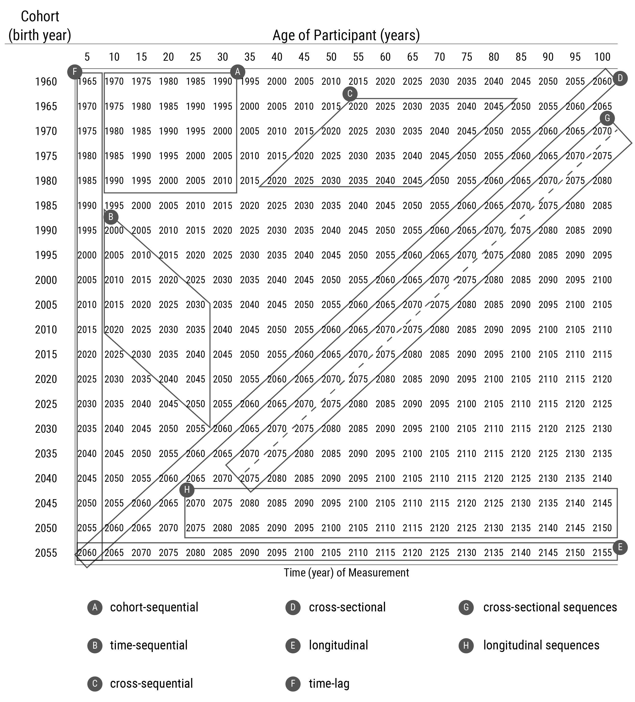
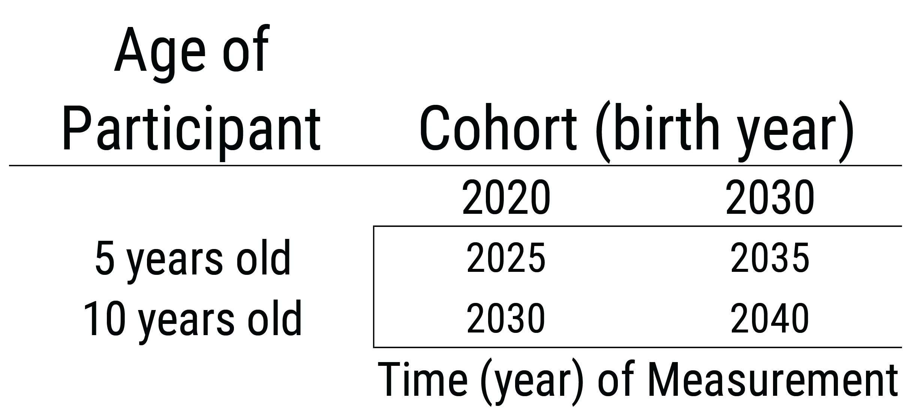

# Repeated Assessments across Time {#repeated-assessments}

[**Wright & Woods citation on personalized modeling of psychopathology**]


## Types of Research Designs

@Schaie1965, @Baltes1968, and @Schaie1975 proposed various types of research designs, in terms of the various combinations of age, period (i.e., time of measurement), and cohort. Age refers to a person's chronological age at the time of measurement. Period refers to the time of measurement (e.g., April 12, 2014 at 7:53 AM). Cohort refers to a person' year of birth (e.g., 2003). If you know two of these (e.g., age and period), you can determine the third (e.g., cohort). Here are the types of research designs based on combinations of age, period, and cohort: [**CITE LITTLE; SCHAIE; BALTES; MASCHE**]

- [cross-sectional](#crossSectional)
- [cross-sectional sequences](#crossSectionalSequences)
- [longitudinal](#longitudinal)
- [longitudinal sequences](#longitudinalSequences)
- [time-lag](#timeLag)
- [time-sequential](#timeSequential)
- [cross-sequential](#crossSequential)
- [cohort-sequential](#cohortSequential)

These research designs are depicted by age and cohort in Figure \@ref(fig:longitudinalDesigns1) and by time of measurement and cohort in Figure \@ref(fig:longitudinalDesigns2). Although the depictions of cohort-sequential and cross-sequential designs differ from the depictions by @Schaie2005, they are consistent with contemporary definitions of these designs [@Little2013; @Masche2004; @Whitbourne2019].

```{r longitudinalDesigns1, out.width = "100%", fig.align = "center", fig.cap = "Research designs by age and cohort. Values in the cells are the times (years) of measurement. Dashed line indicates different participants were assessed at each time of measurement.", echo = FALSE}

```

```{r longitudinalDesigns2, out.width = "100%", fig.align = "center", fig.cap = "Research designs by time of measurement and cohort. Values in the cells are ages of the participants. Dashed line indicates different participants were assessed at each time of measurement.", echo = FALSE}
knitr::include_graphics("./Images/longitudinalDesigns_2.png")
```

### Cross-sectional design {#crossSectional}

A *cross-sectional* design involves multiple participants, often spanning different ages, assessed at one time of measurement. A cross-sectional design is a single factor design, where the researcher is interested in comparing effects of one factor: age. However, in a cross-sectional design, cohort (i.e., birth year) is confounded with age differences. Thus, observed age-related differences could reflect cohort differences rather than true age differences. Additionally, sampling differences at each age could yield non-comparable age groups.

### Cross-sectional sequences design {#crossSectionalSequences}

A *cross-sectional sequences* design involves successive cross-sectional studies of different participants at different times of measurement.

### Longitudinal design {#longitudinal}

A *longitudinal* design involves following the same participants over time. The single-cohort longitudinal design is a single factor design: the researcher specifies one factor: age. However, in a single-cohort longitudinal design, cohort and time of measurement are confounded with age. Thus, any observed changes with age could be due to time-of-measurement effects or cohort effects (instead of people’s true change).

### Longitudinal sequences design {#longitudinalSequences}

A *longitudinal sequences* design involves following multiple cohorts across time.

### Time-lag design {#timeLag}

A time-lag design involves participants from different cohorts assessed at the same age. The time-lag design is a single factor design: the researcher specifies one factor: cohort. However, time of measurement is confounded with cohort. Thus, any cohort differences could reflect different times of measurement.

### Time-sequential design {#timeSequential}

A *time-sequential* design is depicted in Figure \@ref(fig:timeSequential). In a time-sequential design, multiple age groups are assessed at multiple times [@Whitbourne2019]. It is a repeated cross-sectional design, with some participants followed longitudinally. Additional age groups are added to a time-lag design, with some of the participants assessed at more than time point. In other words, the age range is kept the same and is repeatedly assessed (with only some participants being repeatedly assessed). The two factors a researcher specifies in a time-sequential design are age and time of measurement. A time-sequential design can be helpful for identifying age differences while controlling for time of measurement. However, cohort effects are confounded with the interaction of age and time of measurement [@Whitbourne2019]. Thus, observed differences as a function of age or time of measurement could reflect cohort effects.

```{r timeSequential, out.width = "100%", fig.align = "center", fig.cap = "Time-sequential research design.", echo = FALSE}
knitr::include_graphics("./Images/timeSequential.png")
```

## Cross-sequential design {#crossSequential}

A *cross-sequential* design is depicted in Figure \@ref(fig:crossSequential). In a cross-sequential design, multiple cohorts are assessed at multiple times [@Whitbourne2019]. It is is a cross of a cross-sectional and longitudinal design. It starts as a cross-sectional study with participants from multiple cohorts, and then all participants are followed longitudinally (typically across the same duration). It is also called an accelerated longitudinal design. The two factors a researcher specifies in a cross-sequential design are time of measurement and cohort. A cross-sequential design can be helpful for identifying cohort differences while controlling for time of measurement. However, age differences are confounded with the interaction between cohort and time of measurement. Thus, observed differences as a function of cohort or time of measurement could reflect age effects.

```{r crossSequential, out.width = "100%", fig.align = "center", fig.cap = "Cross-sequential research design.", echo = FALSE}
knitr::include_graphics("./Images/crossSequential.png")
```

### Cohort-sequential design {#cohortSequential}

A *cohort-sequential* design is depicted in  Figure \@ref(fig:cohortSequential). In a cohort-sequential design, multiple cohorts are assessed at multiple ages [@Whitbourne2019]. It starts multiple cohorts at the same age and then follows them longitudinally (typically across the same duration). It is like starting a longitudinal study at the same age over and over again. The two factors a researcher specifies in a cohort-sequential design are age and cohort. A cohort-sequential design can be helpful for identifying age differences while controlling for cohort differences. However, time-of-measurement effects are confounded with the interaction of age and cohort [@Whitbourne2019]. Thus, observed differences as a function of age or cohort could reflect time-of-measurement effects.

```{r cohortSequential, out.width = "100%", fig.align = "center", fig.cap = "Cohort-sequential research design.", echo = FALSE}

```

## Using Sequential Designs To Make Developmental Inferences

To have greater confidence that age-related differences reflect true change (development) rather than effects of cohort or time of measurement, we would conduct all three sequential designs. To the extent that the age-related effects in the time-sequential and cohort-sequential designs are stronger than the cohort- and time-of-measurement effects in the cross-sequential design, we have confidence that the observed age-related differences reflect development [@Whitbourne2019]. Moreover, there is an entire set of analytic approaches, known as age-period-cohort analysis [@Yang2013], whose goal is to disentangle the effects of age, period, and cohort.

## Heterotypic Continuity

Figure \@ref(fig:timeDifferingContent).

```{r timeDifferingContent, out.width = "100%", fig.align = "center", fig.cap = "Depiction of using only the construct-valid content at each age. Content set A corresponds to content that is construct-valid at only T1. Content set B corresponds to content that is construct-valid at both T1 and T2. Content set C corresponds to content that is construct-valid at only T2. The *common content* (content set B) is highlighted in gray. The three approaches to assessing a construct over time are as follows: (1) using *all possible content* across all ages: ABC at T1 and T2, (2) using *only common content* across all ages: B at T1 and T2, or (3) using *only construct-valid content* at each age: AB at T1 and BC at T2. Figure reprinted from @Petersen2021, Figure 1, p. e3. Petersen, I. T., LeBeau, B., (ref:ampersand) Choe, D. E. (2021). Creating a developmental scale to account for heterotypic continuity in development: A simulation study. *Child Development*, *92*(1), e1–e19. [https://doi.org/10.1111/cdev.13433](https://doi.org/10.1111/cdev.13433) Copyright (c) John Wiley and Sons. Used with permission.", echo = FALSE}
knitr::include_graphics("./Images/timeDifferingContent.png")
```

Figure \@ref(fig:developmentalScaling).

```{r developmentalScaling, out.width = "100%", fig.align = "center", fig.cap = "The figure illustrates the effect of linking the latent externalizing problems scores, $\theta$, across ages, using mother-reported externalizing problems at ages 4 and 5 as an example.The left panel illustrates the test characteristic curves representing the model-implied proportion out of total possible scores across the latent externalizing problems score at age 4 and 5, before the linking process. The right panel illustrates the test characteristic curves after the linking process. The shading between the age 4 and age 5 test characteristic curves represents differences between the two test characteristic curves in terms of discrimination and/or severity, where larger differences reflect scores that are less comparable. Linking minimizes differences between the discrimination and severity of the common items. Discrimination is depicted by the steepness of the slope at the inflection point of the test characteristic curve. Severity is represented by the value on the x-axis at the inflection point of the test characteristic curve. The left panel indicates that the externalizing problem items showed higher severity at age 5 than at age 4. The right panel shows considerably smaller differences between the two test characteristic curves, which provides empirical evidence that the linking successfully placed the latent externalizing problem scores across age on a more comparable scale (i.e., more similar discrimination and severity of the common items). Figure reprinted from @PetersenLeBeau2021, Figure 1, p. 7. Petersen, I. T., (ref:ampersand) LeBeau, B. (2021). Language ability in the development of externalizing behavior problems in childhood. *Journal of Educational Psychology*, *113*(1), 68–85. [https://doi.org/10.1037/edu0000461](https://doi.org/10.1037/edu0000461) Copyright (c) American Psychological Association. Used with permission.", echo = FALSE}
knitr::include_graphics("./Images/developmentalScaling.png")
```

Figure \@ref(fig:heterotypicContinuity).

```{r heterotypicContinuity, out.width = "100%", fig.align = "center", fig.cap = "Depiction of the three types of continuity in addition to discontinuity in the form of a 2 (behavioral manifestation, underlying processes) x 2 (same versus different across time) Latin square. "T1," "T2," and "T3" reflect time points 1, 2, and 3, respectively. The illustrations above the lines are buildings, representing the surface structure (i.e., behavioral manifestation). The illustrations below the lines depict the underlying processes supporting the buildings at each time point. The squares on the buildings are windows. The black windows represent content facets that are active across all time points (i.e., age-common content). The windows that contain X’s represent content facets that are active at some but not all time points (i.e., age-unique content). The white windows represent content facets that are inactive, and therefore are not part of the construct at that time point. The increasing size of the buildings at later time points reflects growth with development. The top row of the Latin square involves the same underlying processes across time, whereas the bottom row involves different underlying proccesses across time. The left column of the Latin square involves the same behavioral manifestation across time, whereas the right column involves a different behavioral manifestation across time. Homotypic continuity (top left) describes the same behaviorial manifestation with the same underlying process (i.e., construct) across development. Heterotypic continuity (top right) describes the same underlying process with a different behaviorial manifestation across development. Phenotypic continuity (or functional discontinuity) (bottom left) describes the same behavior with different underlying processes across development. Discontinuity (bottom right) describes different behavioral manifestations with different underlying processes across development. Thus, in both homotypic continuity and heterotypic continuity, the active content facets reflect the same construct or underlying process across time, whereas in phenotypic continuity and discontinuity, the active content facets do not reflect the same construct across time. Figure reprinted from @Petersen2020, Figure 1, p. 2. Petersen, I. T., Choe, D. E., (ref:ampersand) LeBeau, B. (2020). Studying a moving target in development: The challenge and opportunity of heterotypic continuity. *Developmental Review*, *58*, 100935. [https://doi.org/10.1016/j.dr.2020.100935](https://doi.org/10.1016/j.dr.2020.100935) Copyright (c) Elsevier. Used with permission.", echo = FALSE}
knitr::include_graphics("./Images/heterotypicContinuity.png")
```

Figure \@ref(fig:ageDifferingContent).

```{r ageDifferingContent, out.width = "100%", fig.align = "center", fig.cap = "Illustrative example of a vertical scaling design that uses common content to link the different measures at adjacent ages to be on the same scale. For example, content set B is administered at both kindergarten and 1st grade, and is the common content used to link scores at 1st grade to the same scale as kindergarten scores. Content set A is the unique content at kindergarten; content set C is the unique content at 1st grade (but it is common content with content set C at 2nd grade). The unique content represents age-specific manifestations of the construct. The procedure of linking measures that differ in difficulty to be on the same scale is called vertical scaling (as opposed to horizontal scaling) because the measures, especially in educational settings, tend to increase in difficulty with age (relative to a given level of ability; as depicted above with the upward-trend). Thus, vertical scaling is particularly useful for linking different measures across ages to be on the same scale. Horizontal scaling, by contrast, links different measures that have the same difficulty (commonly at the same age). To better align with the breadth of constructs in developmental psychology, we use the term "developmental scaling" instead of vertical scaling to refer to putting measures across development on the same scale. Figure reprinted from @Petersen2020, Figure 3, p. 9. Petersen, I. T., Choe, D. E., (ref:ampersand) LeBeau, B. (2020). Studying a moving target in development: The challenge and opportunity of heterotypic continuity. *Developmental Review*, *58*, 100935. [https://doi.org/10.1016/j.dr.2020.100935](https://doi.org/10.1016/j.dr.2020.100935) Copyright (c) Elsevier. Used with permission.", echo = FALSE}
knitr::include_graphics("./Images/ageDifferingContent.png")
```

## Conclusion
