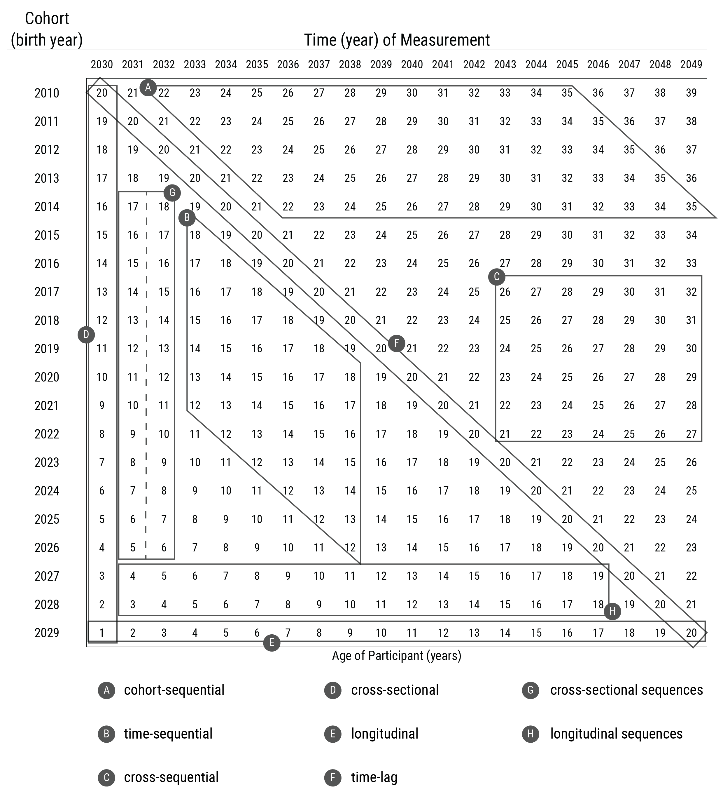
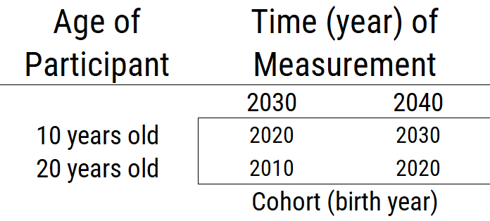
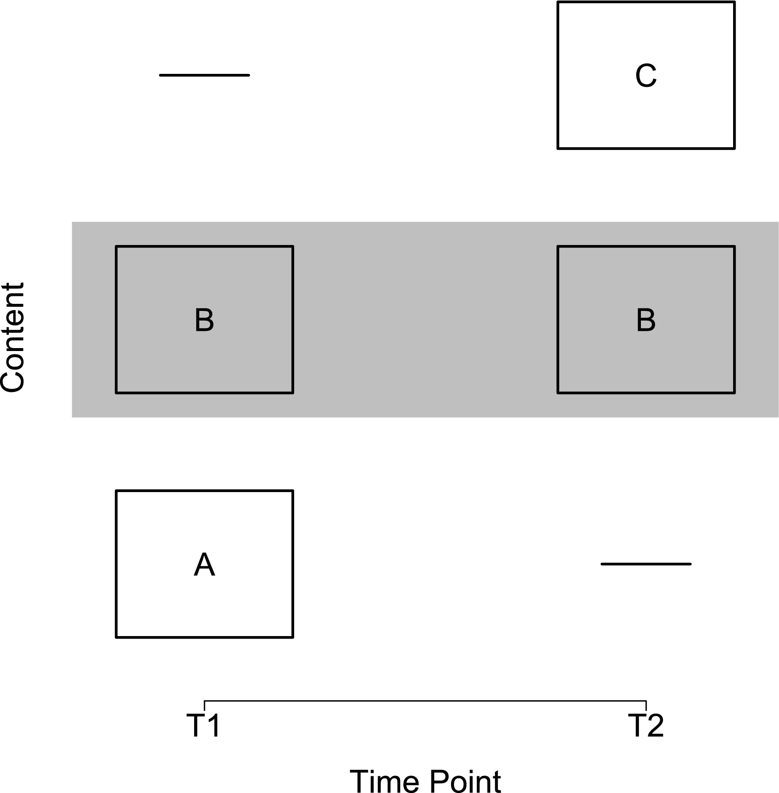
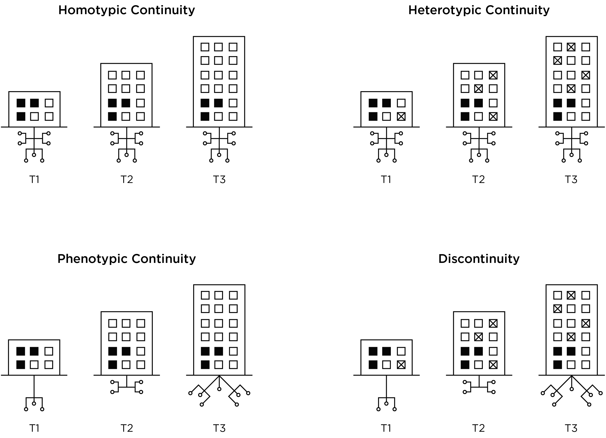

# Repeated Assessments across Time {#repeated-assessments}

[**Wright & Woods citation on personalized modeling of psychopathology**]


## Types of Research Designs

@Schaie1965, @Baltes1968, and @Schaie1975 proposed various types of research designs, in terms of the various combinations of age, period (i.e., time of measurement), and cohort. Age refers to a person's chronological age at the time of measurement. Period refers to the time of measurement (e.g., April 12, 2014 at 7:53 AM). Cohort refers to a person' year of birth (e.g., 2003). If you know two of these (e.g., age and period), you can determine the third (e.g., cohort). Here are the types of research designs based on combinations of age, period, and cohort: [**CITE LITTLE; SCHAIE; BALTES; MASCHE**]

- [cross-sectional](#crossSectional)
- [cross-sectional sequences](#crossSectionalSequences)
- [longitudinal](#longitudinal)
- [longitudinal sequences](#longitudinalSequences)
- [time-lag](#timeLag)
- [time-sequential](#timeSequential)
- [cross-sequential](#crossSequential)
- [cohort-sequential](#cohortSequential)

These research designs are depicted by age and cohort in Figure \@ref(fig:longitudinalDesigns1) and by time of measurement and cohort in Figure \@ref(fig:longitudinalDesigns2). Although the depictions of cohort-sequential and cross-sequential designs differ from the depictions by @Schaie2005, they are consistent with contemporary definitions of these designs [@Little2013; @Masche2004; @Whitbourne2019].

```{r longitudinalDesigns1, out.width = "100%", fig.align = "center", fig.cap = "Research designs by age and cohort. Values in the cells are the times (years) of measurement. Dashed line indicates different participants were assessed at each time of measurement.", echo = FALSE}
knitr::include_graphics("./Images/longitudinalDesigns_1.png")
```

```{r longitudinalDesigns2, out.width = "100%", fig.align = "center", fig.cap = "Research designs by time of measurement and cohort. Values in the cells are ages of the participants. Dashed line indicates different participants were assessed at each time of measurement.", echo = FALSE}

```

### Cross-sectional design {#crossSectional}

A *cross-sectional* design involves multiple participants, often spanning different ages, assessed at one time of measurement. A cross-sectional design is a single factor design, where the researcher is interested in comparing effects of one factor: age. However, in a cross-sectional design, cohort (i.e., birth year) is confounded with age differences. Thus, observed age-related differences could reflect cohort differences rather than true age differences. Additionally, sampling differences at each age could yield non-comparable age groups.

### Cross-sectional sequences design {#crossSectionalSequences}

A *cross-sectional sequences* design involves successive cross-sectional studies of different participants at different times of measurement.

### Longitudinal design {#longitudinal}

A *longitudinal* design involves following the same participants over time. The single-cohort longitudinal design is a single factor design: the researcher specifies one factor: age. However, in a single-cohort longitudinal design, cohort and time of measurement are confounded with age. Thus, any observed changes with age could be due to time-of-measurement effects or cohort effects (instead of people’s true change).

### Longitudinal sequences design {#longitudinalSequences}

A *longitudinal sequences* design involves following multiple cohorts across time.

### Time-lag design {#timeLag}

A time-lag design involves participants from different cohorts assessed at the same age. The time-lag design is a single factor design: the researcher specifies one factor: cohort. However, time of measurement is confounded with cohort. Thus, any cohort differences could reflect different times of measurement.

### Time-sequential design {#timeSequential}

A *time-sequential* design is depicted in Figure \@ref(fig:timeSequential). In a time-sequential design, multiple age groups are assessed at multiple times [@Whitbourne2019]. It is a repeated cross-sectional design, with some participants followed longitudinally. Additional age groups are added to a time-lag design, with some of the participants assessed at more than time point. In other words, the age range is kept the same and is repeatedly assessed (with only some participants being repeatedly assessed). The two factors a researcher specifies in a time-sequential design are age and time of measurement. A time-sequential design can be helpful for identifying age differences while controlling for time of measurement. However, cohort effects are confounded with the interaction of age and time of measurement [@Whitbourne2019]. Thus, observed differences as a function of age or time of measurement could reflect cohort effects.

```{r timeSequential, out.width = "100%", fig.align = "center", fig.cap = "Time-sequential research design.", echo = FALSE}

```

## Cross-sequential design {#crossSequential}

A *cross-sequential* design is depicted in Figure \@ref(fig:crossSequential). In a cross-sequential design, multiple cohorts are assessed at multiple times [@Whitbourne2019]. It is is a cross of a cross-sectional and longitudinal design. It starts as a cross-sectional study with participants from multiple cohorts, and then all participants are followed longitudinally (typically across the same duration). It is also called an accelerated longitudinal design. The two factors a researcher specifies in a cross-sequential design are time of measurement and cohort. A cross-sequential design can be helpful for identifying cohort differences while controlling for time of measurement. However, age differences are confounded with the interaction between cohort and time of measurement. Thus, observed differences as a function of cohort or time of measurement could reflect age effects.

```{r crossSequential, out.width = "100%", fig.align = "center", fig.cap = "Cross-sequential research design.", echo = FALSE}
knitr::include_graphics("./Images/crossSequential.png")
```

### Cohort-sequential design {#cohortSequential}

A *cohort-sequential* design is depicted in  Figure \@ref(fig:cohortSequential). In a cohort-sequential design, multiple cohorts are assessed at multiple ages [@Whitbourne2019]. It starts multiple cohorts at the same age and then follows them longitudinally (typically across the same duration). It is like starting a longitudinal study at the same age over and over again. The two factors a researcher specifies in a cohort-sequential design are age and cohort. A cohort-sequential design can be helpful for identifying age differences while controlling for cohort differences. However, time-of-measurement effects are confounded with the interaction of age and cohort [@Whitbourne2019]. Thus, observed differences as a function of age or cohort could reflect time-of-measurement effects.

```{r cohortSequential, out.width = "100%", fig.align = "center", fig.cap = "Cohort-sequential research design.", echo = FALSE}
knitr::include_graphics("./Images/cohortSequential.png")
```

## Using Sequential Designs To Make Developmental Inferences

To have greater confidence that age-related differences reflect true change (development) rather than effects of cohort or time of measurement, we would conduct all three sequential designs. To the extent that the age-related effects in the time-sequential and cohort-sequential designs are stronger than the cohort- and time-of-measurement effects in the cross-sequential design, we have confidence that the observed age-related differences reflect development [@Whitbourne2019]. Moreover, there is an entire set of analytic approaches, known as age-period-cohort analysis [@Yang2013], whose goal is to disentangle the effects of age, period, and cohort.

## Heterotypic Continuity

Figure \@ref(fig:timeDifferingContent).

```{r timeDifferingContent, out.width = "100%", fig.align = "center", fig.cap = "INSERT CAPTION AND REF.", echo = FALSE}

```

Figure \@ref(fig:developmentalScaling).

```{r developmentalScaling, out.width = "100%", fig.align = "center", fig.cap = "INSERT CAPTION AND REF.", echo = FALSE}
knitr::include_graphics("./Images/developmentalScaling.png")
```

Figure \@ref(fig:heterotypicContinuity).

```{r heterotypicContinuity, out.width = "100%", fig.align = "center", fig.cap = "INSERT CAPTION AND REF.", echo = FALSE}

```

Figure \@ref(fig:ageDifferingContent).

```{r ageDifferingContent, out.width = "100%", fig.align = "center", fig.cap = "INSERT CAPTION AND REF.", echo = FALSE}
knitr::include_graphics("./Images/ageDifferingContent.png")
```

## Conclusion
