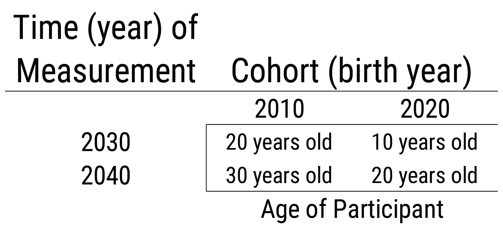
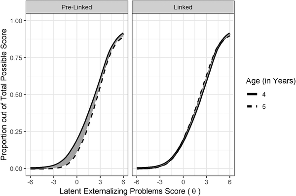

# Repeated Assessments across Time {#repeated-assessments}

[**Wright & Woods citation on personalized modeling of psychopathology**]

## Overview of Repeated Measurement

Repeated measurement enables examining within-person change in constructs. Relating within-person change in a construct to within-person change in another construct provides a stronger test of causality compared to simple bivariate correlations. Identifying that within-person change predicts in construct X predicta later within-person change in construct Y does not necessarily indicate that X causes Y but it provides stronger evidence consistent with causality than a simple bivariate association between X and Y. As described in Section \@ref(correlationCausation), there are three primary reasons why a correlation between X and Y does not necessarily mean that X causes Y: First, the association could reflect the opposite direction of effect, where Y actually causes X. Second, the association could reflect the influence of a third variable that influences both X and Y (i.e., a confound). Third, the association might be spurious.

If you find that within-person changes in sleep predict later within-person changes in mood, that is a stronger test of causality because (a) it demonstrates temporal precedence; it attenuates the possibility that the association is due to the opposite direction of effect; (b) it accounts for time-invariant confounds that differ between people because the association is examined *within* the individual. That is, the association examines whether the person's mood is better when they get more sleep compared to when that same person gets less sleep.

Repeated measurement also enables examination of the developmental timing of effects and sensitive periods. Furthermore, repeated measures designs are important for tests of mediation, which are tests of hypothesized causal mechanisms.

Repeated measurement involves more complex statistical analysis than cross-sectional measurement because multiple observations come from the same person, which would violate assumptions of traditional analyses that the observations (i.e., the residuals) are independent and uncorrelated. [Mixed-effects modeling](#mixedModels) (i.e., mixed modeling, multilevel modeling, hierarchical linear modeling) and other analyses, such as [structural equation modeling](#sem), can handle the longitudinal dependency or nesting of repeated measures data.

Repeated measurement can encompass many different timescales, such as milliseconds, days, or years.

## Examples of Repeated Measurement

Below are some examples of repeated measurement.

### Alcohol Timeline Followback

A clinically relevant example of repeated measurement is the Alcohol Timeline Followback, published by [**SOBEL & SOBEL CITATION, 2000 citation**]. The Alcohol Timeline Followback is  a method for retrospectively assessing the quantity of alcohol consumption on a daily basis. It provides retrospective estimates of people's drinking using a calendar of the number of drinks consumed each day. The Time frame can vary from 30 days to 360 days. The participant is given detailed instructions to enhance the accuracy of recall and reporting of their behavior.

Moreover, a specific definition is provided of what counts as a drink. The measure is intended to provide a detailed record of patterns of alcohol use to guide treatment and assess treatment outcome. The measure provides many summary statistics and norms are available.

The measure has several clinical uses. First, it can provide personalized feedback to the client regarding their drinking behavior compared to the population as part of enhancing their motivation to change, in a motivational interviewing framework. Second the measure can help identify high- and low-risk periods for a client to help them prevent relapse.

Because the measure provides detailed information with norms, it can be more useful than global estimates of drinking derived from less structured clinical interviews. The detailed instructions help respondents remember more accurately, so the clinician or researcher can examine how people's substance abuse influences other processes like parenting.

### Ambulatory Assessment

We discussed [ambulatory assessment](#ambulatory) in Section \@ref(ambulatory). Ambulatory assessment includes an array of methods used to study people in their natural environment. There is a proliferation of smartphone apps for ambulatory assessment. And the ambulatory assessments often, because of their temporal resolution, provide repeated measurements.

**Matthews et al. (2016) CITATION** provided an example of how they developed an ambulatory assessment using a smartphone app to assess the dynamic process of bipolar disorder. Regularity of social rhythms is disrupted in bipolar disorder, so the authors developed an app to help assess social rhythms. The authors used a participatory design in which they involved the patients in the development of the app to ensure it worked well for them. The app tracked the occurrence and timing of daily events, such as getting out of bed, starting your day, having dinner, and going to bed. It also passively detected daily events ("social rhythms") with many sensors on the smartphone using information from the light, accelerometer, and microphone of the smartphone. And the app used a machine learning algorithm to estimate level of physical activity and social interaction.

## Test Revisions

An important part of repeated measurements deals with test revisions. Tests are revised over time. Some test revisions are made to be consistent with improvements in the understanding of the construct. Other test revisions are made to make the norms more up to date. For instance, the Weschler Adult Intelligence Scale has multiple versions (WAIS-3, WAIS-IV, etc.). There are important considerations when dealing with test revisions.

When you assess people at different times, whether the same people at multiple timepoints (such as in a longitudinal study) or different people at different times, challenges may result in comparing scores across time. There can be benefits of keeping the same measure across ages or across time for comparability of scores. However, it is not necessarily good to use the same measure across ages or at different times merely for the sake of mathematical comparability of scores. If a measure was revised to improve its [validity](#validity) or if a measure is not [valid](#validity) at particular ages, it may make sense to use different measures across ages or across time. You would not want to use a measure at a given age if it is not [valid](#validity) at that age. Likewise, it does not make sense to use an invalid measure at a later timepoint if a more [valid](#validity) version becomes available, even if it was used at an earlier timepoint. That is, even if a measure's scores are *mathematically* comparable across ages or time, they may not be *conceptually* comparable across ages or time. If different measures are used across ages or across time, there may be ways to link scores from the different measures to be on the same scale, as described in Section \@ref(developmentalScaling).

One interesting phenomenon of time-related changes in scores is the Flynn effect, in which the population scores on intelligence tests rises around 3 points every decade. That is, intelligence, as measured by tests of cognitive abilities, increases from generation to generation. Test revisions can hide effects like the Flynn effect if we just keep using score transformations instead of raw scores.

To observe a person (or group's) growth, it is recommended to use raw scores rather than standardized scores that are age-normed, such as *T*-scores, *z*-scores, standard scores, and percentile ranks [@Moeller2015]. Age-normed scores prevent observing growth at the person-level or at the group-level (e.g, changes in means or variances over time). *T*-scores ($M = 50$, $SD = 10$), z-scores ($M = 0$, $SD = 1$), and standard scores ($M = 100$, $SD = 15$) have a fixed mean and standard deviation. Percentile ranks have a fixed range (0–100).

## Assessing Change

There are many important considerations for assessing change, that is changes in a person's level on a construct across time. There is a key challenge in assessing change between two time points. If a person's score differs between two time points, how do you know that the differences across time reflect a person's true change in their level on the construct rather than measurement error, such as regression to the mean? Regression to the mean occurs if an extreme observation on a measure at time 1 (T1) more closely approximates the person's mean at later time points, including time 2 (T2). For instance, clients with high levels of symptomatology tend to get better with the mere passage of time, which has been known as the self-righting reflect.

### Inferring Change

The inference of change is strengthened to the extent that: (a) the magnitude of the difference between the scores at the two time points is large (i.e., a large effect size), (b) the [measurement error](#measurementError) (unreliability) at both time points is small, and (c) the measure has the same meaning and is on a comparable scale at each time point (i.e., the measure's scores show [measurement invariance](#measurementInvariance) across time. [Measurement error](#measurementError) can be reduced by combining multiple measures of a construct into a latent variable, such as in [structural equation modeling](#sem) (SEM) or [item response theory](#irt) (IRT).

To detect change, it is important to use measures that are sensitive to change. For instance, the measures should not show range restriction owing to ceiling effects or floor effects.

### When and How Frequently to Assess

Key questions arise in terms of when (at what ages or times) and how often to assess the construct. If the measurement intervals are too long, you might miss important change in between. If the measurement intervals are too frequent, differences might reflect only measurement error. The Nyquist theorem provides guidance in terms of how frequently to assess a construct. According to the Nyquist theorem, in order to accurately reproduce a signal, you should sample it at twice the highest frequency you wish to detect. For instance, to detect a 15 Hz wave, you should sample it at least at 30 Hz (Herz means times per second). Thus, the frequency of assessment should as frequent as, if not more frequent than, the highest frequency of change you seek to observe.

### Practice Effects

However, it is also important to consider the potential for practice or retest effects. Practice/retest effects occur to the extent that a person improves on a task assessed at multiple time points for reasons due to the repeated assessment rather than true changes in the construct. That is, a person is likely to improve on a task if they complete the same task at multiple time points, even if they are not changing in their level on the construct. Practice and retest effects are especially likely to be larger the closer in time the re-test is to the prior testing. Improvement in scores across time might not reflect people's true change in the construct; thus, you might not be able to fairly compare people's scores who have completed the task different numbers of times.

In sum, the ages and frequency of assessment should depend on theory.

### Difference Scores

As described in Section \@ref(#differenceScore-reliability), difference scores (also called change scores) can have limitations because they can be less reliable than each of the individual measures that compose the difference score. The reliability of individual differences in change scores depends on the extent to which: (a) the measures used to calculate the change scores are reliable, and (b) the variability of true individual differences in change is large—that is, there are true individual differences in change.

#### Superior Approaches to Difference Scores

There are several options that are better than traditional difference scores or change scores. Instead of difference scores, use autoregressive cross-lagged models, latent change score models, or growth curve models.

##### Autoregressive Cross-Lagged Models

Autoregressive cross-lagged models with random intercepts can be fit in [path analysis](#pathAnalysis-sem) or [SEM](#sem). An autoregressive cross-lagged model with random intercepts examines relative change in a variable, that is, change in individual differences in the variable, but not changes in level on the variable. Such a model allows examining whether one variable predicts relative change in another variable. For example, I conducted a collaborative study that examined whether language ability predicts later behavior problems controlling for prior levels of behavior problems—that is, whether language ability predicts a person's change in behavior problems relative to other people in the sample [@Petersen2013a; @PetersenLeBeau2021].

##### Latent Change Score Models

Latent change score models can be fit in [SEM](#sem). Unlike autoregressive cross-lagged models, latent change score models examine absolute change—that is, people's changes in level. With latent change score models, you can examine change in latent variables that reflect the common variance among multiple measures. Latent variables are theoretically error-free, so latent change scores can be perfectly reliable, unlike traditional difference scores, whose reliability is strongly influenced by the measurement unreliability of the specific measures that compose them. Latent change score models are described by [**Kievit CITATION**]

##### Growth Curve Models

Growth curve models can be fit in [mixed-effects modeling](#mixedModels) or [SEM](#sem). Growth curve models require three or more time points to be able to account for measurement error in terms of the shape of a linear trajectory. Growth curve models examines absolute change, i.e., changes in level. Growth curve models include an intercept (starting point) and slope (amount of change), but you can model other nonlinear forms of change as well, such as quadratic, logistic, etc. with more time points. Growth curve models correct for measurement error in the shape of the person's trajectory. In addition, growth curve models can examine risk and protective factors as predictors of the intercepts and slopes. For instance, in collaboration, I examined risk and protective factors that predict the development of externalizing problems [@Petersen2015].

### Nomothetic vs. Idiographic

The approaches described above (autoregressive cross-lagged models, latent change score models, and growth curve models) tend to be nomothetic in nature. That is, they are interested in examining group-level phenomena and assume that all people come from the same population and can be described by the same parameters of change. That is, they assume a degree of homogeneity, even though allow each person to differ in their intercept and slope. This nomothetic (population) approach differs from an idiographic (individual) approach. In clinical work, we are often interested in making inferences or predictions at the level of the individual person, consistent with an idiographic approach.	But, fully ignoring the population estimates is unwise because they tend to be more accurate than individual-level judgments. Further, individual-level predictions may not generalize to the population. These nomothetic modeling approaches can be adapted to examine change for different sub-groups, for example, group-based trajectory models, latent class growth models, and growth mixture models if there are theoretically different populations.

For instance, [**Moffitt CITATION**] created the developmental taxonomy of antisocial behavior with the support of these approaches. Moffitt identified one subgroup that showed very low levels of antisocial behavior across the lifespan, which she labeled the "low" group. She identified one subgroup that showed antisocial behavior only in childhood, which she labeled the "childhood-limited" group. She hypothesized that the antisocial behavior among the childhood-limited group was influenced primarily by genetic factors and the early environment. She identified another subgroup that showed antisocial behavior only in adolescence, which she labeled the "adolescent-limited"group. She hypothesized that the antisocial behavior among the adolescent-limited group was largely socially mediated. She identified another subgroup that showed antisocial behavior across the lifespan, which she labeled the "life-course persistent" group. She hypothesized that the "life-course persistent" group reflected neuropsychological deficits.

An example of an approach that combines an idiographic (person-centered) approach with a nomothetic (population) approach to understand change is the group iterative multiple model estimation (GIMME) model, as described by **Beltz et al., 2016 CITATION**. The choices on which model to use depend on the research question and should be guided by theory.

### Structural Equation Modeling

[SEM](#sem) allows multiple dependent variables. This provides a key advantage in longitudinal designs, such that two constructs can each be represented by a dependent variable that is predicted by the other. If examining changes in two constructs in the context of [SEM](#sem), you could examine for instance whether one precedes the other in prediction, to better understand which might cause which and to help tease apart the chicken and the egg. For instance, in collaboration, I found that low language ability predicts later behavior problems stronger than behavior problems predict later language ability, suggesting that, if they are causally related, that language ability is more likely to have a causal effect on behavior problems than the reverse [@Petersen2013a]

### Attrition and Systematic Missingness

Rates of attrition in longitudinal studies can be substantial and missingness is often not completely at random. There is often selective and systematic attrition. For example, attrition often differs as a function of socioeconomic status and other important factors. It is Important to use approaches that examine and account for systematic missingness. It can be helpful to use full-information maximum likelihood (FIML) in [SEM](#sem) to make use of all available data. Multiple imputation is another approach that can be helpful for dealing with missingness. With multiple imputation, you can use predictors that might account for missingness, such as socioeconomic status and demographic factors. You can help account for practice effects with planned missingness designs in which participants are randomly assigned to receive or not receive a given measurement occasion.

### Measurement Invariance

Just like [measurement or factorial invariance](#measurementInvariance) can be tested and established across genders, races, ethnicities, cultures, etc. to ensure measurement equivalence, it can also be tested across ages or times. The goal is to establish longitudinal [measurement invariance](#measurementInvariance), i.e., [measurement invariance](#measurementInvariance) across ages, so that you know that you are assessing the same construct over time in a comparable way so that you know that differences across time reflect true change. To examine longitudinal [measurement invariance](#measurementInvariance), you can use [SEM](#sem) or [IRT](#irt). In [SEM](#sem), you could examine whether measures have the same intercepts and factor loadings across ages. In [IRT](#irt), you could examine whether items show [differential item functioning](#dif), versus whether they show the same difficulty and discrimination across ages.

But, there are times when we would expect a construct would, theoretically, fail to show longitudinal factorial invariance, as in the case of heterotypic continuity, described in Section \@ref(heterotypicContinuity).

## Types of Research Designs

@Schaie1965, @Baltes1968, and @Schaie1975 proposed various types of research designs, in terms of the various combinations of age, period (i.e., time of measurement), and cohort. Age refers to a person's chronological age at the time of measurement. Period refers to the time of measurement (e.g., April 12, 2014 at 7:53 AM). Cohort refers to a person' year of birth (e.g., 2003). If you know two of these (e.g., age and period), you can determine the third (e.g., cohort). Here are the types of research designs based on combinations of age, period, and cohort: [**CITE LITTLE; SCHAIE; BALTES; MASCHE**]

- [cross-sectional](#crossSectional)
- [cross-sectional sequences](#crossSectionalSequences)
- [longitudinal](#longitudinal)
- [longitudinal sequences](#longitudinalSequences)
- [time-lag](#timeLag)
- [time-sequential](#timeSequential)
- [cross-sequential](#crossSequential)
- [cohort-sequential](#cohortSequential)

These research designs are depicted by age and cohort in Figure \@ref(fig:longitudinalDesigns1) and by time of measurement and cohort in Figure \@ref(fig:longitudinalDesigns2). Although the depictions of cohort-sequential and cross-sequential designs differ from the depictions by @Schaie2005, they are consistent with contemporary definitions of these designs [@Little2013; @Masche2004; @Whitbourne2019].

```{r longitudinalDesigns1, out.width = "100%", fig.align = "center", fig.cap = "Research designs by age and cohort. Values in the cells are the times (years) of measurement. Dashed line indicates different participants were assessed at each time of measurement.", echo = FALSE}
knitr::include_graphics("./Images/longitudinalDesigns_1.png")
```

```{r longitudinalDesigns2, out.width = "100%", fig.align = "center", fig.cap = "Research designs by time of measurement and cohort. Values in the cells are ages of the participants. Dashed line indicates different participants were assessed at each time of measurement.", echo = FALSE}
knitr::include_graphics("./Images/longitudinalDesigns_2.png")
```

### Cross-sectional design {#crossSectional}

A *cross-sectional* design involves multiple participants, often spanning different ages, assessed at one time of measurement. A cross-sectional design is a single factor design, where the researcher is interested in comparing effects of one factor: age. However, in a cross-sectional design, cohort (i.e., birth year) is confounded with age differences. Thus, observed age-related differences could reflect cohort differences rather than true age differences. Additionally, sampling differences at each age could yield non-comparable age groups.

Cross-sectional designs are thus limited in their ability to describe developmental processes including change and stability over time. Any age-related differences are confounded with cohort differences and are strongly influenced by between age-group sampling variability. Cross-sectional studies are useful for preliminary data on [validity](#validity) of measures for the age groups, and for examining whether the age differences are in the expected direction. Cross-sectional studies are less costly and time-consuming than longitudinal studies. Therefore, they are widely used and provide a useful starting point.

However, findings from cross-sectional studies can differ from findings examining the same people over time, which violates the convergence assumption. In cross-sectional studies, the convergence assumption is the assumption that cross-sectional age differences and longitudinal age changes converge onto a common trajectory. However, it has been shown, for example, that cross-sectional studies over-estimate age-related cognitive declines (**Ackerman, 2013 CITATION**) compared to following the same people over time in a longitudinal study.


### Cross-sectional sequences design {#crossSectionalSequences}

A *cross-sectional sequences* design involves successive cross-sectional studies of different participants at different times of measurement. In a cross-sectional sequences design, cohort and time-of-measurement are confounded with age differences. Thus, observed age-related differences could reflect cohort differences or time-of-measurement differences rather than true age differences. This poses challenges for using cross-sectional sequences to estimate age-related changes due to time-related effects such as the Flynn effect.

### Longitudinal design {#longitudinal}

A *longitudinal* design involves following the same participants over time. The single-cohort longitudinal design is a single factor design: the researcher specifies one factor: age. However, in a single-cohort longitudinal design, cohort and time of measurement are confounded with age. Thus, any observed changes with age could be due to time-of-measurement effects or cohort effects (instead of people’s true change).

### Longitudinal sequences design {#longitudinalSequences}

A *longitudinal sequences* design involves following multiple cohorts across time.

### Time-lag design {#timeLag}

A time-lag design involves participants from different cohorts assessed at the same age. The time-lag design is a single factor design: the researcher specifies one factor: cohort. However, time of measurement is confounded with cohort. Thus, any cohort differences could reflect different times of measurement.

### Time-sequential design {#timeSequential}

A *time-sequential* design is depicted in Figure \@ref(fig:timeSequential). In a time-sequential design, multiple age groups are assessed at multiple times [@Whitbourne2019]. It is a repeated cross-sectional design, with some participants followed longitudinally. Additional age groups are added to a time-lag design, with some of the participants assessed at more than time point. In other words, the age range is kept the same and is repeatedly assessed (with only some participants being repeatedly assessed). The two factors a researcher specifies in a time-sequential design are age and time of measurement. A time-sequential design can be helpful for identifying age differences while controlling for time of measurement. However, cohort effects are confounded with the interaction of age and time of measurement [@Whitbourne2019]. Thus, observed differences as a function of age or time of measurement could reflect cohort effects.

```{r timeSequential, out.width = "100%", fig.align = "center", fig.cap = "Time-sequential research design.", echo = FALSE}
knitr::include_graphics("./Images/timeSequential.png")
```

### Cross-sequential design {#crossSequential}

A *cross-sequential* design is depicted in Figure \@ref(fig:crossSequential). In a cross-sequential design, multiple cohorts are assessed at multiple times [@Whitbourne2019]. It is is a cross of a cross-sectional and longitudinal design. It starts as a cross-sectional study with participants from multiple cohorts, and then all participants are followed longitudinally (typically across the same duration). It is also called an accelerated longitudinal design. The two factors a researcher specifies in a cross-sequential design are time of measurement and cohort. A cross-sequential design can be helpful for identifying cohort differences while controlling for time of measurement. However, age differences are confounded with the interaction between cohort and time of measurement. Thus, observed differences as a function of cohort or time of measurement could reflect age effects.

```{r crossSequential, out.width = "100%", fig.align = "center", fig.cap = "Cross-sequential research design.", echo = FALSE}

```

### Cohort-sequential design {#cohortSequential}

A *cohort-sequential* design is depicted in  Figure \@ref(fig:cohortSequential). In a cohort-sequential design, multiple cohorts are assessed at multiple ages [@Whitbourne2019]. It starts multiple cohorts at the same age and then follows them longitudinally (typically across the same duration). It is like starting a longitudinal study at the same age over and over again. The two factors a researcher specifies in a cohort-sequential design are age and cohort. A cohort-sequential design can be helpful for identifying age differences while controlling for cohort differences. However, time-of-measurement effects are confounded with the interaction of age and cohort [@Whitbourne2019]. Thus, observed differences as a function of age or cohort could reflect time-of-measurement effects.

```{r cohortSequential, out.width = "100%", fig.align = "center", fig.cap = "Cohort-sequential research design.", echo = FALSE}
knitr::include_graphics("./Images/cohortSequential.png")
```

## Using Sequential Designs To Make Developmental Inferences

Which research design you select should depend on which change function you are most interested in: age, cohort, or time of measurement. However, age is not the only metric for development; time after an exposure can also be an important time metric. There are many other potential metrics of time for studying development.

To have greater confidence that age-related differences reflect true change (development) rather than effects of cohort or time of measurement, we would conduct all three sequential designs. To the extent that the age-related effects in the time-sequential and cohort-sequential designs are stronger than the cohort- and time-of-measurement effects in the cross-sequential design, we have confidence that the observed age-related differences reflect development [@Whitbourne2019]. Moreover, there is an entire set of analytic approaches, known as age-period-cohort analysis [@Yang2013], whose goal is to disentangle the effects of age, period, and cohort.

## Heterotypic Continuity {#heterotypicContinuity}

Figure \@ref(fig:timeDifferingContent).

```{r timeDifferingContent, out.width = "100%", fig.align = "center", fig.cap = "Depiction of using only the construct-valid content at each age. Content set A corresponds to content that is construct-valid at only T1. Content set B corresponds to content that is construct-valid at both T1 and T2. Content set C corresponds to content that is construct-valid at only T2. The *common content* (content set B) is highlighted in gray. The three approaches to assessing a construct over time are as follows: (1) using *all possible content* across all ages: ABC at T1 and T2, (2) using *only common content* across all ages: B at T1 and T2, or (3) using *only construct-valid content* at each age: AB at T1 and BC at T2. Figure reprinted from @Petersen2021, Figure 1, p. e3. Petersen, I. T., LeBeau, B., (ref:ampersand) Choe, D. E. (2021). Creating a developmental scale to account for heterotypic continuity in development: A simulation study. *Child Development*, *92*(1), e1–e19. [https://doi.org/10.1111/cdev.13433](https://doi.org/10.1111/cdev.13433) Copyright (c) John Wiley and Sons. Used with permission.", echo = FALSE}
knitr::include_graphics("./Images/timeDifferingContent.png")
```

Figure \@ref(fig:developmentalScaling).

```{r developmentalScaling, out.width = "100%", fig.align = "center", fig.cap = "The figure illustrates the effect of linking the latent externalizing problems scores, $\theta$, across ages, using mother-reported externalizing problems at ages 4 and 5 as an example.The left panel illustrates the test characteristic curves representing the model-implied proportion out of total possible scores across the latent externalizing problems score at age 4 and 5, before the linking process. The right panel illustrates the test characteristic curves after the linking process. The shading between the age 4 and age 5 test characteristic curves represents differences between the two test characteristic curves in terms of discrimination and/or severity, where larger differences reflect scores that are less comparable. Linking minimizes differences between the discrimination and severity of the common items. Discrimination is depicted by the steepness of the slope at the inflection point of the test characteristic curve. Severity is represented by the value on the x-axis at the inflection point of the test characteristic curve. The left panel indicates that the externalizing problem items showed higher severity at age 5 than at age 4. The right panel shows considerably smaller differences between the two test characteristic curves, which provides empirical evidence that the linking successfully placed the latent externalizing problem scores across age on a more comparable scale (i.e., more similar discrimination and severity of the common items). Figure reprinted from @PetersenLeBeau2021, Figure 1, p. 7. Petersen, I. T., (ref:ampersand) LeBeau, B. (2021). Language ability in the development of externalizing behavior problems in childhood. *Journal of Educational Psychology*, *113*(1), 68–85. [https://doi.org/10.1037/edu0000461](https://doi.org/10.1037/edu0000461) Copyright (c) American Psychological Association. Used with permission.", echo = FALSE}

```

Figure \@ref(fig:heterotypicContinuity).

```{r heterotypicContinuity, out.width = "100%", fig.align = "center", fig.cap = "Depiction of the three types of continuity in addition to discontinuity in the form of a 2 (behavioral manifestation, underlying processes) x 2 (same versus different across time) Latin square. 'T1,' 'T2,' and 'T3' reflect time points 1, 2, and 3, respectively. The illustrations above the lines are buildings, representing the surface structure (i.e., behavioral manifestation). The illustrations below the lines depict the underlying processes supporting the buildings at each time point. The squares on the buildings are windows. The black windows represent content facets that are active across all time points (i.e., age-common content). The windows that contain X’s represent content facets that are active at some but not all time points (i.e., age-unique content). The white windows represent content facets that are inactive, and therefore are not part of the construct at that time point. The increasing size of the buildings at later time points reflects growth with development. The top row of the Latin square involves the same underlying processes across time, whereas the bottom row involves different underlying proccesses across time. The left column of the Latin square involves the same behavioral manifestation across time, whereas the right column involves a different behavioral manifestation across time. Homotypic continuity (top left) describes the same behaviorial manifestation with the same underlying process (i.e., construct) across development. Heterotypic continuity (top right) describes the same underlying process with a different behaviorial manifestation across development. Phenotypic continuity (or functional discontinuity) (bottom left) describes the same behavior with different underlying processes across development. Discontinuity (bottom right) describes different behavioral manifestations with different underlying processes across development. Thus, in both homotypic continuity and heterotypic continuity, the active content facets reflect the same construct or underlying process across time, whereas in phenotypic continuity and discontinuity, the active content facets do not reflect the same construct across time. Figure reprinted from @Petersen2020, Figure 1, p. 2. Petersen, I. T., Choe, D. E., (ref:ampersand) LeBeau, B. (2020). Studying a moving target in development: The challenge and opportunity of heterotypic continuity. *Developmental Review*, *58*, 100935. [https://doi.org/10.1016/j.dr.2020.100935](https://doi.org/10.1016/j.dr.2020.100935) Copyright (c) Elsevier. Used with permission.", echo = FALSE}
knitr::include_graphics("./Images/heterotypicContinuity.png")
```

Figure \@ref(fig:ageDifferingContent).

```{r ageDifferingContent, out.width = "100%", fig.align = "center", fig.cap = "Illustrative example of a vertical scaling design that uses common content to link the different measures at adjacent ages to be on the same scale. For example, content set B is administered at both kindergarten and 1st grade, and is the common content used to link scores at 1st grade to the same scale as kindergarten scores. Content set A is the unique content at kindergarten; content set C is the unique content at 1st grade (but it is common content with content set C at 2nd grade). The unique content represents age-specific manifestations of the construct. The procedure of linking measures that differ in difficulty to be on the same scale is called vertical scaling (as opposed to horizontal scaling) because the measures, especially in educational settings, tend to increase in difficulty with age (relative to a given level of ability; as depicted above with the upward-trend). Thus, vertical scaling is particularly useful for linking different measures across ages to be on the same scale. Horizontal scaling, by contrast, links different measures that have the same difficulty (commonly at the same age). To better align with the breadth of constructs in developmental psychology, we use the term 'developmental scaling' instead of vertical scaling to refer to putting measures across development on the same scale. Figure reprinted from @Petersen2020, Figure 3, p. 9. Petersen, I. T., Choe, D. E., (ref:ampersand) LeBeau, B. (2020). Studying a moving target in development: The challenge and opportunity of heterotypic continuity. *Developmental Review*, *58*, 100935. [https://doi.org/10.1016/j.dr.2020.100935](https://doi.org/10.1016/j.dr.2020.100935) Copyright (c) Elsevier. Used with permission.", echo = FALSE}
knitr::include_graphics("./Images/ageDifferingContent.png")
```

### Developmental Scaling {#developmentalScaling}

## Conclusion
