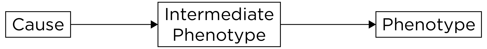
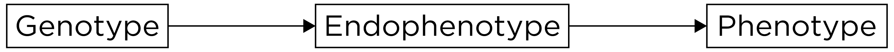

# Psychophysiological and Ambulatory Assessment {#psychophysiological}

There are a number of alternative conceptualizations of psychopathology compared to the conceptualization of psychopathology provided in the [Diagnostic and Statistical Manual of Mental Disorders](#dsm) (DSM).\index{Diagnostic and Statistical Manual of Mental Disorders}\index{psychopathology!structure of}
One alternative conceptualization of psychopathology is the *p*-factor [@Caspi2014; @Smith2020].\index{psychopathology!structure of}\index{p factor@\textit{p} factor}
The *p*-factor is a hierarchical view of psychopathology that accounts for covariation among various kinds of psychopathology.\index{psychopathology!structure of}\index{p factor@\textit{p} factor}
The *p*-factor is a general psychopathology factor, similar to the general intelligence factor (*g*), and has three sub-factors: internalizing problems, externalizing problems, and thought-disordered problems.\index{psychopathology!structure of}\index{p factor@\textit{p} factor}\index{intelligence!\textit{g}}
Hierarchical conceptualizations tend to be advanced by lumpers, who group similar forms of psychopathology together, as opposed to splitters, who tend to split forms of psychopathology into separate categories.\index{lumper}\index{splitter}

Another hierarchical view of psychopathology is HiTOP, the Hierarchical Taxonomy of Psychopathology [@Kotov2017; @Kotov2021].\index{psychopathology!structure of}\index{hierarchical taxonomy of psychopathology}

A third conceptualization of psychopathology is presented by the [Research Domain Criteria](#rdoc), also called (RDoC), from the National Institute of Mental Health (NIMH).\index{psychopathology!structure of}\index{Research Domain Criteria}
Recommendations for conducting assessment in a transdiagnostic way that is consistent with HiTOP and RDoC are provided by @Stanton2020.\index{psychopathology!structure of}\index{Research Domain Criteria}\index{hierarchical taxonomy of psychopathology}\index{transdiagnostic}

## NIMH Research Domain Criteria (RDoC) {#rdoc}

The National Institute of Mental Health (NIMH) has funded research to understand the etiology of mental illnesses and how best to intervene.\index{psychopathology!structure of}\index{Research Domain Criteria}
Historically, NIMH funded considerable work on traditional [DSM](#dsm)-based diagnostic categories.\index{psychopathology!structure of}\index{Research Domain Criteria}\index{Diagnostic and Statistical Manual of Mental Disorders}
However, work studying [DSM](#dsm)-defined diagnostic categories has not had as much impact as NIMH would have liked.\index{psychopathology!structure of}\index{Research Domain Criteria}\index{Diagnostic and Statistical Manual of Mental Disorders}
So, the NIMH led an initiative known as the Research Domain Criteria, also called RDoC, to provide a template for research on psychopathology.\index{psychopathology!structure of}\index{Research Domain Criteria}\index{Diagnostic and Statistical Manual of Mental Disorders}

An overview of RDoC is provided by @Kozak2016.\index{psychopathology!structure of}\index{Research Domain Criteria}
There are several ways in which RDoC is different from the [DSM](#dsm).\index{psychopathology!structure of}\index{Research Domain Criteria}\index{Diagnostic and Statistical Manual of Mental Disorders}
Compared to the [DSM](#dsm), RDoC is dimensional, not categorical.\index{psychopathology!structure of}\index{Research Domain Criteria}\index{dimensional!dimensional approach}\index{categorical!categorical approach}
RDoC views psychopathology as existing on continua, not as discrete categories.\index{psychopathology!structure of}\index{Research Domain Criteria}\index{dimensional!dimensional approach}\index{categorical!categorical approach}
Another difference is that RDoC works from the ground up, starting with brain–behavior relations, and linking those to clinical symptoms.\index{psychopathology!structure of}\index{Research Domain Criteria}
By contrast, the [DSM](#dsm) is top-down, starting with diagnostic categories and determining what fits in those categories based on behavioral symptoms.\index{psychopathology!structure of}\index{Research Domain Criteria}\index{Diagnostic and Statistical Manual of Mental Disorders}
However, as discussed in Section \@ref(dsmConcerns), diagnoses are fictive categories that have poor [diagnostic validity](#diagnosticValidity).\index{psychopathology!structure of}\index{Research Domain Criteria}\index{Diagnostic and Statistical Manual of Mental Disorders}\index{validity!diagnostic}
The [DSM](#dsm)-defined categories are based on behavioral presentations.\index{psychopathology!structure of}\index{Research Domain Criteria}\index{Diagnostic and Statistical Manual of Mental Disorders}\index{validity!diagnostic}
That is, disorders are not things that people "have"; they are things that people "do".\index{psychopathology!structure of}\index{Research Domain Criteria}\index{Diagnostic and Statistical Manual of Mental Disorders}\index{validity!diagnostic}

The same behavior can occur for different underlying reasons, a principle known as equifinality.\index{psychopathology!structure of}\index{Research Domain Criteria}
Different neurodevelopmental trajectories may underlie the same behavior for two different people.\index{psychopathology!structure of}\index{Research Domain Criteria}
Behavioral presentations in the same disorder are heterogeneous.\index{psychopathology!structure of}\index{Research Domain Criteria}
The pathophysiology in a given [DSM](#dsm) category is not unitary.\index{psychopathology!structure of}\index{Research Domain Criteria}\index{Diagnostic and Statistical Manual of Mental Disorders}
[DSM](#dsm) categories also share symptoms and show lots of co-occurrence, so they are not entirely distinct.\index{psychopathology!structure of}\index{Research Domain Criteria}\index{Diagnostic and Statistical Manual of Mental Disorders}
The [DSM](#dsm) has resulted in the reification of these fictive diagnostic categories.\index{psychopathology!structure of}\index{Research Domain Criteria}\index{Diagnostic and Statistical Manual of Mental Disorders}

RDoC is a template for psychopathology research that consists of dimensional constructs integrating elements of psychology and biology.\index{psychopathology!structure of}\index{Research Domain Criteria}
It incorporates a wider range of data, and multiple levels of analysis, including genetics, brain structure and function, and physiology.\index{psychopathology!structure of}\index{Research Domain Criteria}\index{biological assessment}
By contrast, the [DSM](#dsm) only incorporates symptoms.\index{psychopathology!structure of}\index{Research Domain Criteria}\index{Diagnostic and Statistical Manual of Mental Disorders}
In RDoC, there is a focus on narrower dimensions, such as cognition, emotion, reward seeking, fear, learning, memory, motivation, and perception, rather than disorders.\index{psychopathology!structure of}\index{Research Domain Criteria}
The focus on narrow dimensions is based on the idea that there is greater potential to relate biological processes to simpler, lower-order, narrower dimensions of psychological constructs compared to disorders.\index{psychopathology!structure of}\index{Research Domain Criteria}
These narrower dimensions of psychological constructs can be related to important clinical dimensions.\index{psychopathology!structure of}\index{Research Domain Criteria}
Psychopathology is thought to represent extremes on the psychobiological distribution, e.g., high fearfulness in phobia versus low fearfulness in psychopathy.\index{psychopathology!structure of}\index{Research Domain Criteria}
Thus, psychophysiological processes are a key emphasis in RDoC [@Miller2016].\index{psychopathology!structure of}\index{Research Domain Criteria}\index{biological assessment}

### RDoC Matrix {#rdocMatrix}

The RDoC matrix is a matrix of two dimensions: six domains by eight units of analysis.\index{psychopathology!structure of}\index{Research Domain Criteria!matrix}
In the RDoC matrix, domains are constructs that include elements, processes, mechanisms, and responses.\index{psychopathology!structure of}\index{Research Domain Criteria!matrix}
The domains include: negative valence systems (i.e., negative affect: fear, anxiety, etc.), positive valence systems (i.e., positive affect: reward processing), cognitive systems (attention, perception, language, cognitive control, working memory), social processes (attachment, social communication, empathy), arousal and regulatory systems (sleep, circadian rhythms), sensorimotor systems (e.g., motor actions).\index{psychopathology!structure of}\index{Research Domain Criteria!matrix}

In the RDoC matrix, units of analysis are classes of measurement that are similar to levels of analysis.\index{psychopathology!structure of}\index{Research Domain Criteria!matrix}
Units of analysis include: genes, molecules, cells, circuits, physiology, behaviors, self-reports, and paradigms.\index{psychopathology!structure of}\index{Research Domain Criteria!matrix}

The RDoC matrix is presented in Figure \@ref(fig:RDoC).\index{psychopathology!structure of}\index{Research Domain Criteria!matrix}

```{r RDoC, out.width = "100%", fig.align = "center", fig.cap = "National Institute of Mental Health (NIMH) Research Domain Criteria (RDoC) Matrix.", echo = FALSE}
knitr::include_graphics("./Images/RDoC.png")
```

In the RDoC framework, there is theoretical neutrality of the units of analysis.
No unit of analysis is thought to be more important than any other; they are each thought to be important in their own right.\index{psychopathology!structure of}\index{Research Domain Criteria!matrix}
That is why they are referred to as *units* of analysis rather than *levels* of analysis.\index{psychopathology!structure of}\index{Research Domain Criteria!matrix}
"Levels" connotes order from basic to higher-order, and the developers of RDoC wanted to avoid suggesting that one level underlies another.\index{psychopathology!structure of}\index{Research Domain Criteria!matrix}

RDoC dimensional constructs are meant to be integrative rather than reductionistic.\index{psychopathology!structure of}\index{Research Domain Criteria!matrix}
It involves moving away from the subjectivist tradition and moving toward a heterophenomenological approach.\index{psychopathology!structure of}\index{Research Domain Criteria!matrix}
The subjectivist tradition is one in which subjective experience is deemed the primary measure of a phenomenon (e.g., fear).\index{psychopathology!structure of}\index{Research Domain Criteria!matrix}
The heterophenomenological approach combines multiple units of analysis to identify phenomena.\index{psychopathology!structure of}\index{Research Domain Criteria!matrix}

The domains and constructs will need to be added and refined with further research.\index{psychopathology!structure of}\index{Research Domain Criteria!matrix}
The RDoC matrix is just a tentative and incomplete starting template.\index{psychopathology!structure of}\index{Research Domain Criteria!matrix}
The goal is to understand the bridge (i.e., mechanisms) that links the different units of analysis for the same construct, for example, how the biological and psychological bases of fear influence each other.\index{psychopathology!structure of}\index{Research Domain Criteria!matrix}
Examples of mechanisms include endophenotypes, that are heritable, "unobservable", intermediary traits that signify disease liability, and that mediate the association between genotype and phenotypic expressions of psychopathology.
An example of an endophenotype is depicted in Figure \@ref(fig:endophenotype).\index{psychopathology!structure of}\index{Research Domain Criteria!matrix}\index{endophenotype}

```{r endophenotype, out.width = "100%", fig.align = "center", fig.cap = "Example of an Endophenotype.", echo = FALSE}

```

The idea is that genes influence endophenotypes and that endophenotypes lead to the phenotype.\index{psychopathology!structure of}\index{Research Domain Criteria!matrix}\index{endophenotype}
An endophenotype is similar to "intermediate phenotype", but an intermediate phenotype does not have the requirement of a genetic cause.\index{Research Domain Criteria!matrix}\index{endophenotype}\index{intermediate phenotype}
An example of an intermediate phenotype is depicted in Figure \@ref(fig:intermediatePhenotype).\index{Research Domain Criteria!matrix}\index{intermediate phenotype}
Endophenotypes and intermediate phenotypes are different from biomarkers, which are biological indicators (i.e., correlates) that are not necessarily causal.\index{Research Domain Criteria!matrix}\index{endophenotype}\index{intermediate phenotype}\index{biomarker}
All endophenotypes are biomarkers, but not all biomarkers are endophenotypes.\index{Research Domain Criteria!matrix}\index{endophenotype}\index{intermediate phenotype}\index{biomarker}

```{r intermediatePhenotype, out.width = "100%", fig.align = "center", fig.cap = "Example of an Intermediate Phenotype.", echo = FALSE}

```

One dimension that the RDoC does not include is development.\index{Research Domain Criteria}
It has been a challenge incorporating development into the RDoC matrix [@Conradt2021; @Durbin2022].\index{Research Domain Criteria}

When considering the RDoC matrix, it is important to consider the RDoC dimensions—domains of functioning and units of analysis—within the context of environmental and developmental influences [@Lupien2017; @Woody2015], as depicted in Figure \@ref(fig:rdocDevelopment).

(ref:rdocDevelopmentCaption) Schematization Representation (From an Original idea from @Woody2015) of the Four-Dimensional Matrix of the RDoC Framework. Each row represents a sub-domain of functioning that could be studied in different studies or in a single study. Each column represents a unit of analysis. The different matrices are represented as a function of the environmental and developmental dimensions. For example, the domain of functioning in figure could represent the 'Negative Valence System' where '1' represents acute threat or fear, '2' represents potential threat of anxiety, '3' represents sustained threat, and '4' represents loss. The units of analysis could be represented by 'A' Genes; 'B' Stress Hormones; 'C' EEG; 'D' Brain imaging, and 'E': Metabolic markers. Each row of this schematized RDoC matrix represents a particular study (e.g., the gray boxes in Row #1 could represent a study measuring acute threat of fear as a function of stress hormones and brain imaging in an adult population) and the results of various studies are represented by the different filled boxes represented in rows and columns. Environmental and developmental factors could be added to all of these studies. (Figure reprinted from @Lupien2017, Figure 1, p. 9. Lupien, S. J., Sasseville, M., François, N., Giguère, C. E., Boissonneault, J., Plusquellec, P., Godbout, R., Xiong, L., Potvin, S., Kouassi, E., & Lesage, A. (2017). The DSM5/RDoC debate on the future of mental health research: implication for studies on human stress and presentation of the signature bank. *Stress*, *20*(1), 2-18. [https://doi.org/10.1080/10253890.2017.1286324](https://doi.org/10.1080/10253890.2017.1286324))

```{r rdocDevelopment, out.width = "100%", fig.align = "center", fig.cap = "(ref:rdocDevelopmentCaption)", fig.scap = "Schematization Representation of the Four Dimensional Matrix of the RDoC Framework.", echo = FALSE}

```

## Psychophysiological Measures {#psychophysiologicalMeasures}

Examples of psychophysiological measures include electroencephalography (EEG), event-related potential (ERP), (functional) magnetic resonance imaging (f)MRI, computerized axial tomography (CAT), magnetoencephalography (MEG), functional near infrared spectroscopy (fNIRS), electrocardiography (ECG or EKG), electromyography (EMG), electrooculography (EOG), eyetracking, and actigraphy.\index{biological assessment}
@Miller2007 provide an overview of neuroimaging techniques for clinical assessment.\index{biological assessment}\index{neuroimaging}\index{neurophysiological assessment}

EEG caps can include 256 electrode sensors from millisecond to millisecond, with strong temporal resolution, yielding lots of data.\index{biological assessment}\index{neurophysiological assessment}\index{rich data}
Having more sensors allows better estimates of spatial localization.\index{biological assessment}\index{neurophysiological assessment}
Psychophysiological measures are relevant because lots of behavior problems have important physiological facets.\index{biological assessment}\index{neurophysiological assessment}
But it is not always clear whether biological processes cause psychopathology or the reverse, or whether there are third variable confounds that influence both psychophysiology and behavior problems (that explain why they are associated, even though they are non-causally related).\index{biological assessment}\index{neurophysiological assessment}\index{correlation!causation}

Psychophysiological measures are not invulnerable to basic measurement issues, including [reliability](#reliability) and [validity](#validity).\index{biological assessment!reliability}\index{biological assessment!validity}
Psychophysiological measures tend to be more expensive than questionnaire measures, so people traditionally were reluctant to consider issues of [reliability](#reliability) and [validity](#validity).\index{biological assessment!reliability}\index{biological assessment!validity}

Galton and Cattell, nearly 200 years ago, were more interested in direct measures, like grip strength, than self-report.\index{performance-based assessment}\index{self-report}
Hans Berger made the first EEG recording in 1924: EEG has been around a long time.\index{biological assessment}\index{neurophysiological assessment}

### Reliability {#reliability-psychophysiology}

[Reliability](#reliability) matters, especially when you are examining individual differences [@Dubois2016].\index{biological assessment!reliability}
From a [generalizability theory](#gTheoryReliability) point of view, we could examine the consistency or inconsistency of scores across facets and factors to determine which ones matter and which ones do not matter.\index{biological assessment!reliability}\index{generalizability theory}
Important considerations for evaluating [reliability](#reliability) are discussed by @Calamia2019.\index{biological assessment!reliability}\index{ambulatory assessment}

[Internal consistency](#internalConsistency-reliability) involves examining the consistency of scores across trials to demonstrate that the measure assesses the same thing across trials.\index{biological assessment!reliability}\index{reliability!internal consistency}
An example of [internal consistency](#internalConsistency-reliability) that could be applied to psychophysiological data is [split-half reliability](#splitHalf-reliability).\index{biological assessment!reliability}\index{reliability!internal consistency!split-half}

Another important form of [reliability](#reliability) is [test–retest reliability](#testRetest-reliability), which involves examining the consistency of scores across time.\index{biological assessment!reliability}\index{reliability!test–retest}
You could examine the consistency of individual differences across time, i.e., [stability](#stability), and the consistency of scores within a person across time, i.e., [repeatability](#repeatability).\index{biological assessment!reliability}\index{reliability!test–retest}\index{reliability!test–retest!coefficient of stability}\index{reliability!test–retest!coefficient of repeatability}
An example of [repeatability](#repeatability) would be examining a [Bland-Altman plot](#blandAltmanPlot).\index{biological assessment!reliability}\index{reliability!test–retest!coefficient of repeatability}\index{reliability!test–retest!Bland-Altman plot}

Another important form of [reliability](#reliability) is [inter-rater reliability](#interrater-reliability), which involves examining the consistency of scores across raters or processing methods.\index{biological assessment!reliability}\index{reliability!inter-rater}
The goal is to generalize across instruments (machines, operators, etc.) to identify the [reliability](#reliability) of the general method and not just the [reliability](#reliability) of a particular operator or machine.\index{biological assessment!reliability}\index{generalizability theory}

[Parallel-forms reliability](#parallelForms-reliability) would involve examining the consistency of scores across slightly different stimuli thought to reflect the same cognitive processes.\index{biological assessment!reliability}\index{reliability!parallel forms}
For instance, one could examine the [reliability](#reliability) of scores across trials, time, raters, and stimuli.\index{biological assessment!reliability}\index{generalizability theory}
And if the [reliability](#reliability) is low, it would be important to follow up to determine why the [reliability](#reliability) is low.\index{biological assessment!reliability}

It can be beneficial to conduct sensitivity analyses.\index{biological assessment}\index{sensitivity analyses}
Sensitivity analyses evaluate the robustness of findings by examining the extent to which findings differ based on changes in methods.\index{biological assessment}\index{sensitivity analyses}
For instance, you could examine whether findings differ when using different processing methods.\index{sensitivity analyses}
If findings are consistent when using different processing methods, this provides further confidence in your findings because they do not appear to be due to the processing method chosen.\index{biological assessment}\index{sensitivity analyses}
However, if the findings differ across processing methods, it tells you that the processing method has an important consequence in relation to your outcome of interest.\index{biological assessment}\index{sensitivity analyses}
Sensitivity analysis can help you learn more about the phenomenon of interest.\index{biological assessment}\index{sensitivity analyses}

### Lots of Data {#psychophysiologicalLotsOfData}

Psychophysiological measures yield lots of data.\index{biological assessment}\index{rich data}
Some of the variance in the data reflects garbage (noise), some of the variance in the data reflects signal.\index{biological assessment}\index{rich data}
So, when collecting lots of information, there's a possibility of finding an effect merely by chance.\index{biological assessment}\index{rich data}
There are many researcher degrees of freedom.\index{biological assessment}\index{rich data}
There are many brain voxels.\index{biological assessment}\index{rich data}
There are often multiple conditions.\index{biological assessment}\index{rich data}
And there are many ways to analyze the data.\index{biological assessment}\index{rich data}
The researcher degrees of freedom can lead to *p*-hacking.\index{biological assessment}\index{ethics!questionable research practices}\index{rich data}

An example of the potential problem with researcher degrees of freedom is the "dead salmon study" [@Bennett2009; @Bennett2010].\index{biological assessment}\index{rich data}
In the study, activation was detected in voxels of a dead salmon during fMRI scanning.\index{biological assessment}\index{rich data}
The false positive activation detected was due to a failure to account for many multiple comparisons.\index{biological assessment}\index{false positive}\index{rich data}
The point of the dead salmon study was not to invalidate fMRI—it was to show the importance of how rich data should be analyzed to adjust for multiple testing to lower the rate of Type I errors.\index{biological assessment}\index{multiple testing}\index{rich data}

When dealing with lots of data, [over-fitting](#overfitting) is a common issue.\index{biological assessment}\index{over-fitting}\index{rich data}
As described in Section \@ref(overfitting), [over-fitting](#overfitting) involves explaining noise variance, a finding which would not generalize to a new sample.\index{biological assessment}\index{over-fitting}\index{rich data}
To avoid [over-fitting](#overfitting) when examining individual differences, such as with a correlation, it can be helpful to cross-validate the findings in an independent sample or in a hold-out sample.\index{biological assessment}\index{over-fitting}\index{cross-validation}\index{rich data}
A hold-out sample is when you sub-divide a sample into a training and test data set.\index{biological assessment}\index{cross-validation}\index{rich data}
You develop the model on the training data set and see how the findings cross-validate on the hold-out (test) data set.\index{biological assessment}\index{cross-validation}\index{rich data}
Cross-validation requires larger sample (typically $N > 100$), which is difficult with psychophysiological measures.\index{biological assessment}\index{cross-validation}\index{rich data}
Most samples with psychophysiological data are relatively small, and as a result, have low power [@Button2013; @Button2013a].\index{biological assessment}\index{statistical power}\index{rich data}
With lots of data, researcher degrees of freedom, a small sample, and a statistical significance filter, reported findings have inflated estimates of effect sizes and poor replicability [@Loken2017].\index{biological assessment}\index{statistical significance!filter}\index{effect size}\index{replication!failure to replicate}\index{rich data}

One way to deal with the large data is to reduce the massive data down, and to use scoring and algorithms.\index{biological assessment}\index{data!reduction}\index{rich data}
For instance, you can examine the [reliability](#reliability) of the scoring system, versus the [reliability](#reliability) of the person conducting the scoring system.\index{biological assessment!reliability}\index{rich data}
For data reduction, [principal component analysis](#pca) (PCA) is a useful technique.\index{data!reduction}\index{principal component analysis}\index{rich data}
An emerging technique for integrating information from high-dimensional data is machine learning [@GalatzerLevy2023].\index{machine learning}

Historically, psychophysiological data were averaged across subjects (group averaging) to improve the signal-to-noise ratio.\index{biological assessment}
For example, data were averaged for a clinical group versus controls.\index{biological assessment}
However, we think of psychopathology as dimensional and involving individual differences.\index{biological assessment}\index{dimensional}
There have been recent attempts to examine data at the individual differences level.\index{biological assessment}

Issues such as [reliability](#reliability) and [validity](#validity) are even more crucial when trying to make inferences about individual differences.\index{biological assessment!reliability}\index{biological assessment!validity}
It is important to remove as much noise as possible without sacrificing signal.\index{biological assessment!reliability}\index{biological assessment!validity}
Movement artifacts in psychophysiological measurements can lead to poor data quality.\index{biological assessment!reliability}\index{biological assessment!validity}
It is important to correct for artifacts because they do not occur at random.\index{biological assessment!reliability}\index{biological assessment!validity}
For example, patients with attention-deficit hyperactivity disorder (ADHD) and schizophrenia will likely show more movement artifacts than controls.\index{biological assessment!reliability}\index{biological assessment!validity}
One approach is to regress out the artifact (e.g., heart rate), if you have an independent measure of the artifact.\index{biological assessment!reliability}\index{biological assessment!validity}
If you do not have an independent measure of the artifact, you can use independent component analysis (ICA) to separate independent components of data and to remove artifacts.\index{biological assessment!reliability}\index{biological assessment!validity}\index{independent component analysis}

### Validity {#validity-psychophysiology}

Consideration of aspects of [validity](#validity) are crucial for any measure, including psychophysiological measures.\index{biological assessment!validity}

Consideration of [construct validity](#constructValidity), whether the measure actually assesses what it intends to assess, is crucial.\index{biological assessment!validity}\index{validity!construct}
For instance, performance on a measure of counting back by 7 is associated with many domains, including psychosis, anxiety, impulsivity, intelligence, etc.
It is a measure of many constructs.\index{biological assessment!validity}\index{validity!construct}
It is important for our measures to have [convergent validity](#convergentValidity) in that they are associated with what they should be associated with, but also [discriminant validity](#discriminantValidity), in that they should not be associated with things that we do not expect them to be associated with.\index{biological assessment!validity}\index{validity!convergent}\index{validity!discriminant}

If the research identifies activation in a specific part of the brain in association with the task, it is important to consider whether it is the same region across participants.\index{biological assessment!validity}
For instance, the researcher should consider whether they are using a single atlas/head model for the whole sample or whether they are using a personalized atlas for each participant.\index{biological assessment!validity}
Oftentimes, a given brain region is involved in lots of different cognitive processes and behaviors.\index{biological assessment!validity}
This raises [construct validity](#constructValidity) questions.\index{biological assessment!validity}\index{validity!construct}

Ask yourself, "What is the evidence to support my interpretation of these effects?"\index{biological assessment!validity}\index{validity!construct}
Evidence is strengthened by showing evidence of [convergent](#convergentValidity) and [discriminant](#discriminantValidity) validity.\index{biological assessment!validity}\index{validity!convergent}\index{validity!discriminant}
For example, differential deficits can provide stronger evidence of an effect.\index{biological assessment!validity}\index{validity!convergent}\index{validity!discriminant}\index{differential!differential deficit}
For instance, people with schizophrenia show deficits, abnormalities, or differences in many different brain processes—but an important question is whether they show relatively greater abnormalities in a given neural process than another neural process.\index{biological assessment!validity}\index{validity!convergent}\index{validity!discriminant}\index{differential!differential deficit}
This helps inform the specificity of the process (as opposed to other processes) for explaining differences in the condition of interest.\index{biological assessment!validity}\index{validity!convergent}\index{validity!discriminant}\index{differential!differential deficit}

Another important question is: what is considered baseline?\index{biological assessment!validity}
For heart rate reactivity and many psychophysiological measures, a comparison is made to a "baseline", which yields a contrast or difference score.\index{biological assessment!validity}
But what should be considered "baseline"?\index{biological assessment!validity}
There are many different possibilities for what could be considered "baseline," and each could yield different results.\index{biological assessment!validity}
And, time during a participant's visit to the lab might not provide a good baseline because people may be anxious about being in a psychology lab.\index{biological assessment!validity}
In addition, participants' brains are not resting during "resting-state".\index{biological assessment!validity}

Another important consideration is the [ecological validity](#ecologicalValidity) of the measures.\index{biological assessment!validity}\index{validity!ecological}
Measures are often assessed in contexts and with stimuli that are not naturalistic.\index{biological assessment!validity}\index{validity!ecological}
Psychophysiological measures may not reflect a participant's typical functioning.\index{biological assessment!validity}\index{validity!ecological}
A goal would be to use more naturalistic contexts and task paradigms.\index{biological assessment!validity}\index{validity!ecological}
Another challenge that biological measures have is in relating the biological criteria to actual behavior in the real world.\index{biological assessment!validity}\index{criterion}
It is not sufficient to show group differences on a biological measure; the researcher needs to show that the biological measure is associated with particular behaviors, that is, an independent measure in the same subjects.\index{biological assessment!validity}\index{criterion}

When [reliability](#reliability) and [validity](#validity) of psychophysiological measures are improved, a goal is to have [norms](#norm) for their use, so you know where a person stands compared to the population on the measure of interest.\index{biological assessment!reliability}\index{biological assessment!validity}\index{norm}

### Examples {#examplesOfPsychophysiologicalAssessment}

#### Ambulatory Assessment {#ambulatory}

An ambulatory assessment is a measurement strategy designed to acquire minimally disruptive measures of a person engaging in normal activities in their natural environment.\index{ambulatory assessment}
Ambulatory biosensors are assessment tools that measure physiological or motor activity [@Haynes2007].\index{ambulatory assessment}
Ecological momentary assessment (EMA) is an example of an ambulatory assessment.\index{ambulatory assessment}\index{ecological momentary assessment}
Stone and colleagues [-@Stone2023] discuss important considerations for EMA assessment.\index{ambulatory assessment}\index{ecological momentary assessment}
Ambulatory assessment allows rich measurement including, for example, audio, pictures, video, geolocation (global positioning system [GPS]), and physical activity (accelerometer).\index{ambulatory assessment}\index{ecological momentary assessment}
Ambulatory assessment may provide more precise measurement of phenotypes because they can assess contextual and environmental influences.\index{ambulatory assessment}\index{ambulatory assessment}

Ambulatory assessments can collect many measurements passively, without the respondent needing to do anything.\index{ambulatory assessment}
Ambulatory assessment minimizes retrospective [reporting biases](#methodBias) because they can assess people in the moment.\index{ambulatory assessment}
They also allow alerts and notifications for compliance reminders so that the participant completes the measurement.\index{ambulatory assessment}
And they allow context-based triggers based on GPS.\index{ambulatory assessment}
Queries can be random, event-based, time-based, or location-based.\index{ambulatory assessment}
Some research suggests that event-based reporting may be preferable compared to signal-based reporting because participants may report that the target behavior occurs more frequently when using event-based reporting compared to signal-based reporting [@Himmelstein2019].\index{ambulatory assessment}

Ambulatory assessments can also connect to external sensors via Bluetooth to record, for instance, blood pressure.\index{ambulatory assessment}
They can provide data with high temporal resolution; for example, they can provide measurement samples from second to second or even millisecond to millisecond.\index{ambulatory assessment}
When dealing with rich data, one important question is the level of granularity you want to analyze the data: seconds, days, weeks, etc.\index{ambulatory assessment}
The optimal granularity depends on the research question.\index{ambulatory assessment}

Ambulatory assessment might provide opportunities for developing idiographic (personalized) models of the inter-relations among thoughts, feelings, behavior, physiology, and context [@Wright2019c].\index{ambulatory assessment}\index{idiographic}

In addition, ambulatory assessment might have [utility](#treatmentUtility) for intervention.\index{ambulatory assessment}\index{validity!utility}
For instance, it could help provide a just-in-time intervention when an event or context occurs.\index{ambulatory assessment}
Ambulatory assessment can also be used for self-monitoring.\index{ambulatory assessment}
And alerts can be used to increase homework compliance.\index{ambulatory assessment}

The three most popular versions of ambulatory biosensors are those that monitor cardiovascular activity (e.g., heart rate and blood pressure), physical activity (e.g., actigraph and pedometer), and cortisol levels.\index{ambulatory assessment}
However, other ambulatory biosensors assess EEG, respiration, muscle tension, blood glucose, skin conductance, and other processes.\index{ambulatory assessment}

An applied example of an ambulatory biosensor is actigraphy.\index{ambulatory assessment}
Actigraphy is the tracking of physical movement.\index{ambulatory assessment}
Actigraphy uses an actigraph device.\index{ambulatory assessment}
An actigraphy is a watch-like device attached to the wrist or ankle that has an accelerometer.\index{ambulatory assessment}
Smartphones can also serve as actigraphs because they have accelerometers.\index{ambulatory assessment}
Actigraphy is a peripheral measure because it assesses gross motor movements.\index{ambulatory assessment}
Actigraphy is also frequently used as a corresponding index of sleep because limb movements occur less frequently during sleep.\index{ambulatory assessment}
Actigraphy is considered a better index of sleep than self-/informant-report, but not as good as polysomnography (PSG).\index{ambulatory assessment}
However, actigraphy allows for greater [ecological validity](#ecologicalValidity) than a sleep study conducted in the lab, because a person can wear it while sleeping in their own bed at home.\index{ambulatory assessment}\index{validity!ecological}

In prior work, we took hundreds of sleep variables from actigraphy and using [PCA](#pca) to reduce the data down to key independent dimensions of sleep deficit: activity (sleep quality), (late) timing, (short) duration, and night-to-night variability [@Staples2019].\index{ambulatory assessment}

##### Pros {#ambulatoryPros}

Pros of ambulatory assessment include:\index{ambulatory assessment}

- Ambulatory biosensors do not rely on participants to report their experience; they provide information about constructs that is derived from a different method—and they are useful in a multimethod assessment strategy.\index{ambulatory assessment}\index{self-report}\index{methods!multiple}
Ambulatory biosensors lead to an increase in [incremental validity](#incrementalValidity) and can improve [specificity](#specificity) of decisions.\index{ambulatory assessment}\index{validity!incremental}\index{specificity}
- Ambulatory biosensors are highly sensitive to change—they can track rapid changes in the variable of interest, with rapid timecourses (i.e., strong temporal resolution or precision).\index{ambulatory assessment}\index{change!sensitivity to}
- Ambulatory biosensors are portable, and have potential for greater [ecological validity](#ecologicalValidity).\index{ambulatory assessment}\index{validity!ecological}
Biosensor variables collected in naturalistic settings are often only weakly associated with biosensor variables collected in lab settings, possibly due to reactivity in a lab setting.\index{ambulatory assessment}
- Ambulatory biosensors allow concurrent evaluation of contexts that influence psychophysiological responses.\index{ambulatory assessment}

##### Cons {#ambulatoryCons}

Cons of ambulatory assessment include:\index{ambulatory assessment}

- Ambulatory biosensors are expensive—they are potentially not cost-efficient depending on the use—i.e., they are potentially too expensive for clinical use.\index{ambulatory assessment}
- Some devices can be intrusive, cumbersome, and technical.\index{ambulatory assessment}
- There is limited psychometric evaluation conducted with many ambulatory methods.\index{ambulatory assessment}\index{ambulatory assessment!reliability}\index{ambulatory assessment!validity}
Ambulatory biosensors are potentially [unreliable](#reliability).\index{ambulatory assessment}\index{ambulatory assessment!reliability}
In addition, ambulatory biosensors are potentially not accurate for certain trait levels.\index{ambulatory assessment!validity}
For example, heart rate devices may be less accurate at high levels of physical activity.\index{ambulatory assessment!validity}
Ambulatory biosensors may not generalize well across time, devices, labs, and raters.\index{ambulatory assessment!reliability}\index{generalizability theory}
- The research investigator has less experimental control.\index{ambulatory assessment}
- There are practical challenges in conducting assessments outside of the research laboratory, as discussed by @Holmlund2019 and @Raugh2019.\index{ambulatory assessment}

#### Other Examples {#otherPsyphysiologicalExamples}

Other examples of psychophysiological measures include eyetracking, which is used to assess attention, and wearables, which are smart "textiles" or clothing that has embedded biosensors.\index{biological assessment}

### Virtual Reality {#virtualReality}

Virtual reality (VR) is an emerging approach to assessment that allows structured assessment in simulated but life-like situations.\index{virtual reality assessment}
It provides the investigator greater experimental control compared to [ambulatory assessment](#ambulatory) approaches.\index{virtual reality assessment}\index{ambulatory assessment}
Considerations in using virtual reality and other immersive technological approaches to assessment are described by @Roberts2019.\index{virtual reality assessment}

### Using Psychophysiological Measures {#usingPsychophysiologicalMeasures}

Ideally, we would be able to combine psychophysiological measures as objective measures with other measures, e.g., a performance-based assessment or self-/informant-report, in a multimethod measurement of constructs, as suggested by @Patrick2019.\index{biological assessment}\index{performance-based assessment}\index{self-report}\index{informant report}\index{methods!multiple}
Psychophysiological measures as part of a multimethod assessment approach helps to address the [bias](#bias) of participants and the [bias](#bias) in clinical judgment of clinicians.\index{biological assessment}\index{bias}\index{methods!multiple}
Ambulatory measures can provide [incremental validity](#incrementalValidity) and increase the [specificity](#specificity) of clinical judgment.\index{biological assessment}\index{validity!incremental}\index{specificity}
Recommendations for using psychophysiological measures include using them in an [ecologically valid](#ecologicalValidity) way, including [ambulatory](#ambulatory) approaches that allow ecological momentary assessment of contexts that influence psychophysiological responses, and conducting recordings over lengthy periods [@Raugh2019].\index{biological assessment}\index{ambulatory assessment}\index{validity!ecological}\index{ecological momentary assessment}
Recommendations for using ambulatory assessment in research on psychopathology are provided by @Trull2020.\index{ambulatory assessment}

Challenges exist in selecting the granularity of analysis—how fine-grained to assess at each level of analysis—and how to combine measures across multiple levels of analysis because each may operate at different timescales.\index{biological assessment}
One option is to use multimodal imaging, e.g., simultaneous recordings of EEG and fMRI or EEG and fNIRS, to cancel out weaknesses of each.\index{biological assessment}\index{methods!multiple}
For instance, EEG has stronger temporal resolution than fMRI—it provides a faster timecourse—but EEG has weaker spatial resolution than fMRI—it provides less accurate estimates of where in the brain the neural activity is occurring.\index{biological assessment}

It is worth considering combining multiple measures in a latent variable framework using, for example, [factor analysis](#factorAnalysisOverview) or [structural equation modeling](#sem).\index{biological assessment}\index{latent variable}\index{factor analysis}\index{structural equation modeling}\index{aggregation}

Given the costs, challenges, and time-consuming nature of psychophysiological data collection, science may be best positioned to address [reliability](#reliability) and [validity](#validity) issues by sharing and combining data sets through consortia and [open science](#openScience).\index{biological assessment!reliability}\index{biological assessment!validity}\index{open science}
Consortia and data-sharing can help ensure large enough sample sizes for adequate statistical power, especially for individual difference analyses.\index{open science}\index{statistical power}
Larger samples would also allow cross-validation of analyses in independent samples using out-of-sample prediction.\index{cross-validation}

## Conclusion {#conclusion-psychophysiological}

The National Institute of Mental Health (NIMH) provided the [Research Domain Criteria](#rdoc) (RDoC) as an alternative structure of psychopathology.\index{psychopathology!structure of}\index{Research Domain Criteria}
Compared to the [DSM](#dsm), [RDoC](#rdoc) is dimensional and it works from the ground up, starting with brain–behavior relations, and linking those to clinical symptoms.\index{psychopathology!structure of}\index{Research Domain Criteria}\index{dimensional!dimensional approach}\index{Diagnostic and Statistical Manual of Mental Disorders}
[RDoC](#rdoc) spans multiple domains—such as positive and negative valience systems—and units of analysis, including genes, molecules, cells, circuits, physiology, behaviors, self-reports, and paradigms.\index{psychopathology!structure of}\index{Research Domain Criteria}

Psychophysiological measures include electroencephalography (EEG), event-related potential (ERP), (functional) magnetic resonance imaging (f)MRI, computerized axial tomography (CAT), magnetoencephalography (MEG), functional near infrared spectroscopy (fNIRS), electrocardiography (ECG or EKG), electromyography (EMG), electrooculography (EOG), eyetracking, and actigraphy.\index{biological assessment}
Psychophysiological measures are not invulnerable to basic measurement issues, including [reliability](#reliability) and [validity](#validity).\index{biological assessment!reliability}\index{biological assessment!validity}
Another important consideration of psychophysiological measures is how to handle the [rich data](#psychophysiologicalLotsOfData) without increasing the likelihood of Type I errors.\index{biological assessment}\index{false positive}\index{rich data}

Another class of measurement includes [ambulatory assessment](#ambulatory).\index{ambulatory assessment}
[Ambulatory assessment](#ambulatory) is designed to acquire minimally disruptive measures of a person engaging in normal activities in their natural environment.\index{ambulatory assessment}
[Ambulatory assessment](#ambulatory) allows rich measurement including, for example, audio, pictures, video, geolocation (global positioning system [GPS]), and physical activity (accelerometer).\index{ambulatory assessment}
[Ambulatory biosensors](#ambulatory) are assessment tools that measure physiological or motor activity, such as those that monitor cardiovascular activity (e.g., heart rate and blood pressure), physical activity (e.g., actigraph and pedometer), cortisol levels, EEG, respiration, muscle tension, blood glucose, skin conductance, and other processes.\index{ambulatory assessment}
[Virtual reality](#virtualReality) is an emerging approach that allows structured assessment in simulated but life-like situations.\index{virtual reality assessment}

## Suggested Readings {#readings-psychophysiological}

@Miller2007; @Haynes2007
