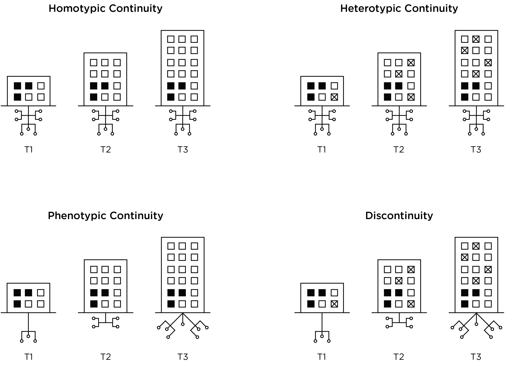
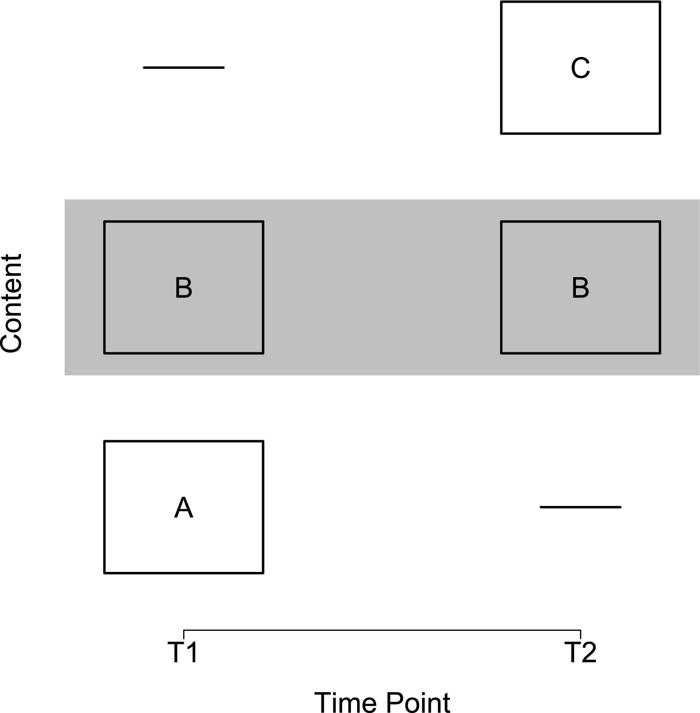
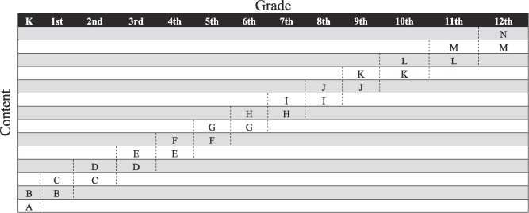
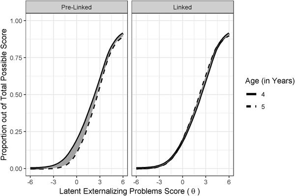

# Repeated Assessments Across Time {#repeated-assessments}

## Overview of Repeated Measurement {#overview-repeated-assessments}

Repeated measurement enables examining within-person change in constructs.\index{repeated measurement}
Relating within-person change in a construct to within-person change in another construct provides a stronger test of causality compared to simple bivariate correlations.\index{repeated measurement}\index{correlation!causation}
Identifying that within-person change in construct X predicts later within-person change in construct Y does not necessarily indicate that X causes Y but it provides stronger evidence consistent with causality than a simple bivariate association between X and Y.\index{repeated measurement}\index{correlation!causation}
As described in Section \@ref(correlationCausation), there are three primary reasons a correlation between X and Y does not necessarily mean that X causes Y: First, the association could reflect the opposite direction of effect, where Y actually causes X.\index{repeated measurement}\index{correlation!causation}
Second, the association could reflect the influence of a third variable that influences both X and Y (i.e., a confound).\index{correlation!causation}
Third, the association might be spurious.\index{repeated measurement}\index{correlation!causation}

If you find that within-person changes in sleep predict later within-person changes in mood, that is a stronger test of causality because (a) it demonstrates temporal precedence; it attenuates the possibility that the association is due to the opposite direction of effect; and (b) it accounts for all time-invariant confounds that differ between people (e.g., birth order) because the association is examined *within* the individual.\index{repeated measurement}\index{correlation!causation}
That is, the association examines whether the person's mood is better when they get more sleep compared to when that same person gets less sleep.\index{repeated measurement}\index{correlation!causation}
The association could still be due to time-varying confounds, but you can control for specific time-varying confounds if you measure them.\index{repeated measurement}\index{correlation!causation}

Repeated measurement also enables examination of the developmental timing of effects and sensitive periods.\index{repeated measurement}
Furthermore, repeated measures designs are important for tests of mediation, which are tests of hypothesized causal mechanisms.\index{repeated measurement}

Repeated measurement involves more complex statistical analysis than cross-sectional measurement because multiple observations come from the same person, which would violate assumptions of traditional analyses that the observations (i.e., the residuals) are independent and uncorrelated.\index{repeated measurement}
[Mixed-effects modeling](#mixedModels) (i.e., mixed modeling, multilevel modeling, hierarchical linear modeling) and other analyses, such as [structural equation modeling](#sem), can handle the longitudinal dependency or nesting of repeated measures data.\index{repeated measurement}\index{mixed model}\index{structural equation modeling}

Repeated measurement can encompass many different timescales, such as milliseconds, days, or years.\index{repeated measurement}

### Comparison of Approaches {#approaches-repeated-assessments}

Research designs can be compared in terms of their [internal validity](#internalValidity)—the extent to which we can be confident about causal inferences.\index{validity!internal}
A cross-sectional association is depicted in Figure \@ref(fig:crossSectional):\index{research design!cross-sectional}

```{r crossSectional, out.width = "20%", fig.align = "center", fig.cap = "Cross-Sectional Association.", echo = FALSE}
knitr::include_graphics("./Images/Longitudinal-01.png")
```

Among observational/correlational research designs, cross-sectional designs tend to have the weakest [internal validity](#internalValidity).\index{research design!cross-sectional}\index{validity!internal}
That is, if we observe a cross-sectional association between $X$ and $Y$, we have little confidence that $X$ causes $Y$.\index{research design!cross-sectional}\index{validity!internal}
Consider a lagged association, which is a slightly better approach:\index{research design!longitudinal}\index{cross-lagged}

```{r laggedAssociation, out.width = "100%", fig.align = "center", fig.cap = "Lagged Association.", echo = FALSE}
knitr::include_graphics("./Images/Longitudinal-02.png")
```

A lagged association has somewhat better [internal validity](#internalValidity) than a cross-sectional association because we have greater evidence of temporal precedence—that the influence of the predictor *precedes* the outcome because the predictor was assessed before the outcome and it shows a predictive association.\index{research design!longitudinal}\index{validity!internal}\index{cross-lagged}
However, part of the association between the predictor with later levels of the outcome could be due to prior levels of the outcome that are stable across time.\index{research design!longitudinal}\index{validity!internal}\index{cross-lagged}
Thus, consider an even stronger alternative—a lagged association that controls for prior levels of the outcome:\index{research design!longitudinal}\index{validity!internal}\index{cross-lagged}

```{r laggedAssociationControlPriorLevels, out.width = "100%", fig.align = "center", fig.cap = "Lagged Association, Controlling for Prior Levels of the Outcome.", echo = FALSE}
knitr::include_graphics("./Images/Longitudinal-03.png")
```

A lagged association controlling for prior levels of the outcome has better [internal validity](#internalValidity) than a lagged association that does not control for prior levels of the outcome.\index{research design!longitudinal}\index{validity!internal}\index{cross-lagged}
When we control for prior levels of the outcome in the prediction, we are essentially predicting (relative) change.\index{research design!longitudinal}\index{validity!internal}\index{cross-lagged}
Predicting change provides stronger evidence consistent with causality because it uses the individual as their own control and controls for many time-invariant confounds.\index{research design!longitudinal}\index{validity!internal}\index{cross-lagged}
However, consider an even stronger alternative—lagged associations that control for prior levels of the outcome and that simultaneously test each direction of effect:\index{research design!longitudinal}\index{validity!internal}\index{cross-lagged}

```{r crossLaggedPanelModel, out.width = "100%", fig.align = "center", fig.cap = "Lagged Association, Controlling for Prior Levels of the Outcome, Simultaneously Testing Both Directions Of Effect.", echo = FALSE}
knitr::include_graphics("./Images/Longitudinal-04.png")
```

Lagged associations that control for prior levels of the outcome and that simultaneously test each direction of effect provide the strongest [internal validity](#internalValidity) among correlational/observational designs, especially when examining whether within-person changes in the predictor predict later within-person changes in the outcome (and vice versa).\index{research design!longitudinal}\index{validity!internal}\index{cross-lagged}
Such a design can help better clarify which among the variables is the chicken and the egg—which variable is more likely to be the cause and which is more likely to be the effect.\index{research design!longitudinal}\index{validity!internal}\index{cross-lagged}
Or, if there are bidirectional, transactional effects, what the magnitude of each direction of effect are.\index{research design!longitudinal}\index{validity!internal}\index{cross-lagged}
The [cross-lagged panel model](#clpm) and [dual latent change score model](#lcsm) are examples of models that include lagged associations that control for prior levels of the outcome and that simultaneously test each direction of effect.\index{research design!longitudinal}\index{validity!internal}\index{cross-lagged}\index{cross-lagged!cross-lagged model}\index{latent change score model}
However, consider an even stronger model—lagged associations that control for prior levels of the outcome and for random intercepts and that simultaneously test each direction of effect:\index{research design!longitudinal}\index{validity!internal}\index{cross-lagged}

```{r crossLaggedPanelModelRandomIntercepts, out.width = "100%", fig.align = "center", fig.cap = "Lagged Association, Controlling for Prior Levels of the Outcome and Random Intercepts, Simultaneously Testing Both Directions Of Effect.", echo = FALSE}
knitr::include_graphics("./Images/Longitudinal-05.png")
```

Some researchers have called into question the cross-lagged panel model [@Berry2017; @Hamaker2015].\index{research design!longitudinal}\index{validity!internal}\index{cross-lagged}
A stronger alternative may be a cross-lagged model that controls for stable between-person differences (i.e., random intercepts) [@Hamaker2015].\index{research design!longitudinal}\index{validity!internal}\index{cross-lagged}
This is known as a random intercepts cross-lagged panel model.\index{research design!longitudinal}\index{validity!internal}\index{cross-lagged}

## Examples of Repeated Measurement {#examples-repeated-assessments}

Below are some examples of repeated measurement.\index{repeated measurement}

### Alcohol Timeline Followback {#alcoholTimelineFollowback}

A clinically relevant example of repeated measurement is the Alcohol Timeline Followback, published by @Sobell2008a.\index{repeated measurement}
The Alcohol Timeline Followback is a method for retrospectively assessing the quantity of alcohol consumption on a daily basis.\index{repeated measurement}
It provides retrospective estimates of people's drinking using a calendar of the number of drinks consumed each day.\index{repeated measurement}
The time frame can vary from 30 days to 360 days.\index{repeated measurement}
The participant is given detailed instructions to enhance the accuracy of recall and reporting of their behavior.\index{repeated measurement}

Moreover, a specific definition is provided of what counts as a drink.\index{repeated measurement}
The measure is intended to provide a detailed record of patterns of alcohol use to guide treatment and assess treatment outcome.\index{repeated measurement}
The measure provides many summary statistics and [norms](#norm) are available.\index{repeated measurement}\index{norm}

The measure has several clinical uses.\index{repeated measurement}
First, it can provide personalized feedback to the client regarding their drinking behavior compared to the population as part of enhancing their motivation to change, in a motivational interviewing framework.\index{repeated measurement}
Second, the measure can help identify high- and low-risk periods for a client to help them prevent relapse.\index{repeated measurement}

Because the measure provides detailed information with [norms](#norm), it can be more useful than global estimates of drinking derived from less structured clinical interviews.\index{repeated measurement}\index{norm}
The detailed instructions help respondents remember more accurately, so the clinician or researcher can examine how people's substance abuse influences other processes like parenting.\index{repeated measurement}

### Ambulatory Assessment {#ambulatory-repeated-assessments}

We discussed [ambulatory assessment](#ambulatory) in Section \@ref(ambulatory).
[Ambulatory assessment](#ambulatory) includes an array of methods used to study people in their natural environment.\index{ambulatory assessment}
There is a proliferation of smartphone apps for [ambulatory assessment](#ambulatory).\index{ambulatory assessment}
And the [ambulatory assessments](#ambulatory) often, because of their temporal resolution, provide repeated measurements.\index{ambulatory assessment}\index{repeated measurement}

For instance, @Carpenter2016 depicted the examination, during a drinking episode, of self-reported drinking in relation to physiological indices including skin temperature, heart rate, breathing rate, physical activity, and in relation to self-reported sadness and mood dysregulation.\index{ambulatory assessment}\index{repeated measurement}
The self-reported indices were assessed on various intervals (e.g., every 15 minutes) and upon various events (e.g., when they take a drink).\index{ambulatory assessment}\index{repeated measurement}
However, the physiological indices were assessed continuously from moment to moment.\index{ambulatory assessment}\index{repeated measurement}
These different timescales pose challenges for how to examine them in relation to each other.\index{ambulatory assessment}\index{repeated measurement}

@Matthews2016 provided an example of how they developed an [ambulatory assessment](#ambulatory) using a smartphone app to assess the dynamic process of bipolar disorder.\index{ambulatory assessment}\index{repeated measurement}
Regularity of social rhythms is disrupted in bipolar disorder, so the authors developed an app to help assess social rhythms.\index{ambulatory assessment}\index{repeated measurement}
The authors used a participatory design in which they involved the patients in the development of the app to ensure it worked well for them.\index{ambulatory assessment}\index{repeated measurement}
The app tracked the occurrence and timing of daily events, such as getting out of bed, starting your day, having dinner, and going to bed.\index{ambulatory assessment}\index{repeated measurement}
It also passively detected daily events ("social rhythms") with many sensors on the smartphone using information from the light, accelerometer, and microphone of the smartphone.\index{ambulatory assessment}\index{repeated measurement}
And the app used a machine learning algorithm to estimate level of physical activity and social interaction.\index{ambulatory assessment}\index{repeated measurement}

## Test Revisions {#testRevision}

An important part of repeated measurements deals with test revisions.\index{test revision}
Tests are revised over time.\index{test revision}
Some test revisions are made to be consistent with improvements in the understanding of the construct.\index{test revision}\index{validity!construct}
Other test revisions are made to make the norms more up-to-date.\index{test revision}
For instance, the Weschler Adult Intelligence Scale has multiple versions (WAIS-3, WAIS-IV, etc.).\index{test revision}\index{intelligence!Wechsler scales}
There are important considerations when dealing with test revisions.\index{test revision}

When you assess people at different times, whether the same people at multiple time points (such as in a longitudinal study) or different people at different times, challenges may result in comparing scores across time.\index{test revision}
There can be benefits of keeping the same measure across ages or across time for comparability of scores.\index{test revision}
However, it is not necessarily good to use the same measure across ages or at different times merely for the sake of mathematical comparability of scores.\index{test revision}
If a measure was revised to improve its [validity](#validity) or if a measure is not [valid](#validity) at particular ages, it may make sense to use different measures across ages or across time.\index{test revision}\index{validity}
You would not want to use a measure at a given age if it is not [valid](#validity) at that age.\index{test revision}\index{validity}
Likewise, it does not make sense to use an [invalid](#validity) measure at a later time point if a more [valid](#validity) version becomes available, even if it was used at an earlier time point.\index{test revision}\index{validity}
That is, even if a measure's scores are *mathematically* comparable across ages or time, they may not be *conceptually* comparable across ages or time.\index{test revision}
If different measures are used across ages or across time, there may be ways to link scores from the different measures to be on the same scale, as described in Section \@ref(developmentalScaling).\index{test revision}\index{linking}

One interesting phenomenon of time-related changes in scores is the Flynn effect, in which the population scores on intelligence tests rise around 3 points every decade.\index{Flynn effect}\index{intelligence}
That is, intelligence, as measured by tests of cognitive abilities, increases from generation to generation.\index{Flynn effect}\index{intelligence}
Test revisions can hide effects like the Flynn effect if we just keep using score transformations instead of raw scores.\index{Flynn effect}\index{intelligence}\index{test revision}

To observe a person's (or group's) growth, it is recommended to use raw scores rather than standardized scores that are age-normed, such as *T* scores, *z* scores, standard scores, and percentile ranks [@Moeller2015].\index{data!raw}\index{data!standardized}\index{norm-referenced!age}\index{data!\textit{z} score}\index{data!\textit{T} score}\index{data!standard score}\index{data!percentile rank}
Age-normed scores prevent observing growth at the person level or at the group level (e.g, changes in means or variances over time).\index{data!raw}\index{data!standardized}\index{norm-referenced!age}
*T* scores ($M = 50$, $SD = 10$), *z* scores ($M = 0$, $SD = 1$), and standard scores ($M = 100$, $SD = 15$) have a fixed mean and standard deviation.\index{data!raw}\index{data!standardized}\index{norm-referenced!age}\index{data!\textit{z} score}\index{data!\textit{T} score}\index{data!standard score}
Percentile ranks have a fixed range (0–100).\index{data!raw}\index{data!standardized}\index{norm-referenced!age}\index{data!percentile rank}

## Change and Stability {#changeAndStability}

A key goal of developmental science is to assess change and stability of people and constructs.\index{change}\index{stability}
Stability is often referred to in a general way.\index{stability}
For instance, you may read that intelligence and personality show "stability" over time.\index{stability}
However, this is not a useful way of describing the stability of people and/or constructs because stability is not one thing.\index{stability}
There are multiple types of stability, and it is important to refer to the types of stability considered.\index{stability}

Types of stability include, for instance, stability of level, rank order (individual differences), and structure.\index{stability!types of}
Stability of level refers to whether people show the same level on the construct over time.\index{stability!types of}
For example, stability of level considers whether people stay the same in their level of neuroticism across childhood to adulthood.\index{stability!types of}
Stability of people's level is evaluated with the [coefficient of repeatability](#repeatbility).\index{stability!types of}\index{reliability!test–retest!coefficient of repeatability}

Mean-level stability refers to whether the mean level stays the same across time.\index{stability!types of}
For example, mean-level stability considers whether the population average stays the same in their level of neuroticism across childhood to adulthood.\index{stability!types of}
Mean-level stability is evaluated by examining mean-level age-related differences; for instance, with a t-test or ANOVA, or by examining whether the construct is associated with age.\index{stability!types of}

Rank-order stability refers to whether individual differences stay the same across time.\index{stability!types of}
For instance, rank-order stability considers whether people who have higher neuroticism than their peers as children also tend to have higher neuroticism than their peers as adults.\index{stability!types of}
Rank-order stabiliy is examined by examining the association of people's level at T1 with people's level at T2 (e.g., correlation coefficient or regression coefficent).\index{stability!types of}

Stability of structure considers whether the structure of the construct stays the same across ages.\index{stability!types of}
For instance, stability of structure considers whether personality is characterized by the same five factors across ages (i.e., openness, conscientiousness, extraversion, agreeableness, and neuroticism).\index{stability!types of}
Stability of structure is examined using longitudinal [factorial invariance](#measurementInvariance).\index{stability!types of}\index{structural equation modeling!measurement invariance}

People and constructs can show stability in some types and not others.\index{stability!types of}
For instance, although intelligence and personality show *relative* stability in structure and rank-order, they do not show *absolute* stability in level.\index{stability!types of}\index{reliability!absolute}\index{reliability!relative}
Even though *individual differences* in intelligence and personality show relative stability, people tend to change across time in their absolute level of intelligence and various personality factors across ages.\index{stability!types of}
For instance, neuroticism decreases in later adulthood.\index{stability!types of}
Examining age-normed scores would preclude identifying mean-level change because age-normed scores have a fixed mean.\index{stability!types of}\index{norm-referenced!age}
Moreover, examining a strong correlation of intelligence and personality scores across time merely indicates that individual differences show relative stability; it does not indicate whether individuals show absolute stability in level.\index{stability!types of}\index{reliability!relative}\index{reliability!absolute}

## Assessing Change {#assessingChange}

There are many important considerations for assessing change, that is changes in a person's level on a construct across time.\index{change!assessing}
There is a key challenge in assessing change between two time points.\index{change!assessing}
If a person's score differs between two time points, how do you know that the differences across time reflect a person's true change in their level on the construct rather than [measurement error](#measurementError), such as regression to the mean?\index{change!assessing}\index{measurement error}
Regression to the mean occurs if an extreme observation on a measure at time 1 (T1) more closely approximates the person's mean at later time points, including time 2 (T2).\index{change!assessing}\index{regression to the mean}
For instance, clients with high levels of symptomatology tend to get better with the mere passage of time, which has been known as the self-righting reflex.\index{change!assessing}\index{regression to the mean}

### Inferring Change {#inferringChange}

The inference of change is strengthened to the extent that:\index{change!inferring}

a. the magnitude of the difference between the scores at the two time points is large (i.e., a large effect size)\index{change!inferring}\index{effect size}
b. the [measurement error](#measurementError) ([unreliability](#reliability)) at both time points is small\index{change!inferring}\index{measurement error}
c. the measure has the same meaning and is on a comparable scale at each time point (i.e., the measure's scores show [measurement invariance](#measurementInvariance) across time)\index{change!inferring}\index{structural equation modeling!measurement invariance}
d. evidence suggests that the differences across time are not likely to be due to [potential confounds of change](#potentialConfoundsOfChange) such as [practice effects](#practiceEffects), [cohort effects](#cohortEffects), and [time-of-measurement effects](#timeOfMeasurementEffects).\index{change!inferring}\index{change!confounds of}\index{practice effect}\index{cohort effect}\index{time-of-measurement effect}

[Measurement error](#measurementError) can be reduced by combining multiple measures of a construct into a latent variable, such as in [structural equation modeling](#sem) (SEM) or [item response theory](#irt) (IRT).\index{change!inferring}\index{measurement error}\index{latent variable}\index{structural equation modeling}\index{item response theory}\index{aggregation}

To detect change, it is important to use measures that are sensitive to change.\index{change!inferring}\index{change!sensitivity to}
For instance, the measures should not show range restriction owing to ceiling effects or floor effects.\index{change!inferring}\index{restricted range}\index{ceiling effect}\index{floor effect}

### Potential Confounds of Change {#potentialConfoundsOfChange}

Potential confounds of change include [practice effects](#practiceEffects), [cohort effects](#cohortEffects), and [time-of-measurement effects](#timeOfMeasurementEffects).\index{change!inferring}\index{change!confounds of}\index{practice effect}\index{cohort effect}\index{time-of-measurement effect}

#### Practice Effects {#practiceEffects}

It is important to consider the potential for practice or retest effects [@Hertzog2003].\index{change!confounds of}\index{practice effect}
Practice/retest effects occur to the extent that a person improves on a task assessed at multiple time points for reasons due to the repeated assessment rather than true changes in the construct.\index{change!confounds of}\index{practice effect}
That is, a person is likely to improve on a task if they complete the same task at multiple time points, even if they are not changing in their level on the construct.\index{change!confounds of}\index{practice effect}
Practice and retest effects are especially likely to be larger the closer in time the retest is to the prior testing.\index{change!confounds of}\index{practice effect}
Improvement in scores across time might not reflect people's true change in the construct; thus, you might not be able to fairly compare people's scores who have completed the task different numbers of times.\index{change!confounds of}\index{practice effect}

In sum, the ages and frequency of assessment should depend on theory.\index{change!inferring}\index{change!confounds of}\index{practice effect}

#### Cohort Effects {#cohortEffects}

It is also important to consider the potential for cohort effects [@Hertzog2003].
Cohorts often refer to birth cohorts—people who were born at the same time (e.g., the same year).\index{change!confounds of}\index{cohort effect}
Cohorts tend to have some similar experiences at similar ages, including major events (e.g., 9/11 terrorist attacks, assassination of John F. Kennedy, bombing of Pearl Harbor) and economic or socio-political climates (e.g., the Great Depression, coronavirus pandemic, Cold War, World War II).\index{change!confounds of}\index{cohort effect}
These collective differences in the different experiences between different cohorts may lead to apparent age-related differences between cohorts that are not actually due to age differences per se, but rather to differences in the experiences between the cohorts.\index{change!confounds of}\index{cohort effect}

#### Time-of-Measurement Effects {#timeOfMeasurementEffects}

It is also important to consider time-of-measurement effects.\index{change!confounds of}\index{cohort effect}\index{time-of-measurement effect}
For instance, people's general anxiety may be higher, on average, during the coronavirus pandemic.\index{change!confounds of}\index{cohort effect}\index{time-of-measurement effect}
Thus, some apparent age-related differences might be due to the time of measurement (i.e., a pandemic) rather than age.\index{change!confounds of}\index{cohort effect}\index{time-of-measurement effect}

### When and How Frequently to Assess {#whenAndHowFrequentlyToAssess}

Key questions arise in terms of when (at what ages or times) and how often to assess the construct.\index{change!inferring}
If the measurement intervals are too long, you might miss important change in between.\index{change!inferring}
If the measurement intervals are too frequent, differences might reflect only [measurement error](#measurementError).\index{change!inferring}\index{measurement error}
The Nyquist theorem provides guidance in terms of how frequently to assess a construct.\index{change!inferring}\index{Nyquist theorem}
According to the Nyquist theorem, in order to accurately reproduce a signal, you should sample it at twice the highest frequency you wish to detect.
For instance, to detect a 15 Hz wave, you should sample it at least at 30 Hz (Hertz means times per second).\index{change!inferring}\index{Nyquist theorem}
Thus, the frequency of assessment should be as frequent as, if not more frequent than, the highest frequency of change you seek to observe.\index{change!inferring}\index{Nyquist theorem}

### Difference Scores {#changeScores}

As described in Section \@ref(differenceScore-reliability), [difference scores](#differenceScores) (also called change scores) can have limitations because they can be less [reliable](#reliability) than each of the individual measures that compose the difference score.\index{difference score!reliability}
The [reliability](#reliability) of individual differences in [change scores](#differenceScores) depends on the extent to which: (a) the measures used to calculate the [change scores](#differenceScores) are reliable, and (b) the variability of true individual differences in change is large—that is, there are true individual differences in change.\index{difference score!reliability}

#### Superior Approaches to Difference Scores {#superiorApproachesToDifferenceScores}

There are several options that are better than traditional [difference scores](#differenceScores) or change scores.\index{difference score}
Instead of difference scores, use autoregressive cross-lagged models, latent change score models, or growth curve models.\index{difference score}\index{cross-lagged!cross-lagged model}\index{growth curve model}\index{latent change score model}

##### Autoregressive Cross-Lagged Models {#clpm}

Autoregressive cross-lagged models (aka cross-lagged panel models) can be fit in [path analysis](#pathAnalysis-sem) or [SEM](#sem).\index{cross-lagged!cross-lagged model}\index{path analysis}\index{structural equation modeling}
Cross-lagged panel models examine relative change in a variable, that is, change in individual differences in the variable, but not changes in level on the variable.\index{cross-lagged!cross-lagged model}
Such a model allows examining whether one variable predicts *relative* change in another variable.\index{cross-lagged!cross-lagged model}
The cross-lagged panel model tests whether individuals with low levels of X *relative to others* experience subsequent *rank-order increases* in Y [@Orth2021; @Evans2023].\index{cross-lagged!cross-lagged model}
By contrast, the random-intercepts cross-lagged panel model tests whether, when individuals experience *lower-than-their-own usual levels* of X, they experience subsequent increases in Y *relative to their usual level* [@Orth2021; @Evans2023].\index{cross-lagged!cross-lagged model}
As an example of a cross-lagged panel model, I conducted a collaborative study that examined whether language ability predicts later behavior problems controlling for prior levels of behavior problems—that is, whether language ability predicts a person's change in behavior problems relative to the change among other people in the sample [@Petersen2013a; @PetersenLeBeau2021].\index{cross-lagged!cross-lagged model}
Cross-lagged panel models predict relative (rank-order) change, not absolute change in level.\index{cross-lagged!cross-lagged model}
For tests of absolute change, models such as [change score models](#lcsm) or [growth curve models](#gcm) are necessary.\index{cross-lagged!cross-lagged model}\index{latent change score model}\index{growth curve model}

##### Latent Change Score Models {#lcsm}

Latent change score models can be fit in [SEM](#sem).\index{latent change score model}
Unlike autoregressive cross-lagged models, latent change score models examine *absolute* change—that is, people's changes in level.\index{latent change score model}\index{structural equation modeling}
With latent change score models, you can examine change in latent variables that reflect the common variance among multiple measures.\index{latent change score model}
Latent variables are theoretically error-free (at least of random error), so latent change scores can be perfectly [reliable](#reliability), unlike traditional difference scores, whose [reliability](#reliability) is strongly influenced by the [measurement unreliability](#reliability) of the specific measures that compose them.\index{latent change score model}\index{latent variable}\index{measurement error}\index{measurement error!random error}
Latent change score models are described by @Kievit2018.\index{latent change score model}

##### Growth Curve Models {#gcm}

Growth curve models can be fit in [mixed-effects modeling](#mixedModels) or [SEM](#sem).\index{growth curve model}\index{structural equation modeling}\index{mixed model}
Growth curve models require three or more time points to be able to account for [measurement error](#measurementError) in terms of the shape of a linear trajectory.\index{growth curve model}\index{measurement error}
Growth curve models examine absolute change, i.e., changes in level.\index{growth curve model}
Growth curve models include an intercept (starting point) and slope (amount of change), but you can model other nonlinear forms of change as well, such as quadratic, logistic, etc. with more time points.\index{growth curve model}
Growth curve models correct for [measurement error](#measurementError) in the shape of the person's trajectory.\index{growth curve model}\index{measurement error}
In addition, growth curve models can examine risk and protective factors as predictors of the intercepts and slopes.\index{growth curve model}
For instance, in collaboration, I examined risk and protective factors that predict the development of externalizing problems [@Petersen2015].\index{growth curve model}

### Nomothetic Versus Idiographic {#nomotheticIdiographicApproaches}

The approaches described above (autoregressive cross-lagged models, latent change score models, and growth curve models) tend to be nomothetic in nature.\index{cross-lagged!cross-lagged model}\index{latent change score model}\index{growth curve model}\index{nomothetic}
That is, they are interested in examining group-level phenomena and assume that all people come from the same population and can be described by the same parameters of change.\index{nomothetic}
That is, they assume a degree of homogeneity, even though they allow each person to differ in their intercept and slope.\index{nomothetic}
This nomothetic (population) approach differs from an idiographic (individual) approach.\index{nomothetic}\index{idiographic}
In clinical work, we are often interested in making inferences or predictions at the level of the individual person, consistent with an idiographic approach.\index{idiographic}
But fully ignoring the population estimates is unwise because they tend to be more accurate than individual-level judgments.\index{idiographic}\index{group level}\index{individual level}
Further, individual-level predictions may not generalize to the population.\index{idiographic}\index{group level}\index{individual level}
Nomothetic modeling approaches can be adapted to examine change for different subgroups if there are theoretically different populations.\index{nomothetic}
Approaches that examine different subgroups include group-based trajectory models, latent class growth models, and growth mixture models [@Fontaine2017; @vanderNest2020].\index{subgroup modeling}

For instance, Moffit [-@Moffitt1993; -@Moffitt2006; -@Moffitt2006a] created the developmental taxonomy of antisocial behavior with the support of these approaches.\index{subgroup modeling}
Moffitt identified one subgroup that showed very low levels of antisocial behavior across the lifespan, which she labeled the "low" group.\index{subgroup modeling}
She identified one subgroup that showed antisocial behavior only in childhood, which she labeled the "childhood-limited" group.\index{subgroup modeling}
She hypothesized that the antisocial behavior among the childhood-limited group was influenced primarily by genetic factors and the early environment.\index{subgroup modeling}
She identified another subgroup that showed antisocial behavior only in adolescence, which she labeled the "adolescent-limited"group.\index{subgroup modeling}
She hypothesized that the antisocial behavior among the adolescent-limited group was largely socially mediated.\index{subgroup modeling}
She identified another subgroup that showed antisocial behavior across the lifespan, which she labeled the "life-course persistent" group.\index{subgroup modeling}
She hypothesized that the "life-course persistent" group reflected neuropsychological deficits.\index{subgroup modeling}

Idiographic approaches for personalized modeling of psychopathology are described by @Wright2020.\index{idiographic}
An example of an approach that combines an idiographic (person-centered) approach with a nomothetic (population) approach to understand change is the group iterative multiple model estimation (GIMME) model, as described by @Beltz2016 and @Wright2019b.\index{idiographic}\index{nomothetic}\index{group iterative multiple model estimation}
The GIMME model is a data-driven approach to identifying person-specific time-series models.\index{idiographic}\index{nomothetic}\index{group iterative multiple model estimation}
The approach first identifies the associations among constructs that replicate across most participants.\index{idiographic}\index{nomothetic}\index{group iterative multiple model estimation}
The group-level associations are then used as a starting point for identifying person-specific associations.\index{idiographic}\index{nomothetic}\index{group iterative multiple model estimation}\index{group level}
Thus, the GIMME model provides an approach for developing personalized time-series models.\index{idiographic}\index{nomothetic}\index{group iterative multiple model estimation}\index{individual level}
The choices on which model to use depend on the research question and should be guided by theory.\index{theory}

### Structural Equation Modeling {#sem-repeated-measures}

[Structural equation modeling](#sem) (SEM) allows multiple dependent variables.\index{structural equation modeling}
This provides a key advantage in longitudinal designs, such that two constructs can each be represented by a dependent variable that is predicted by the other.\index{structural equation modeling}\index{cross-lagged}
If examining changes in two constructs in the context of [SEM](#sem), you could examine for instance whether one precedes the other in prediction, to better understand which might cause which and to help tease apart the chicken and the egg.\index{structural equation modeling}\index{cross-lagged}
For instance, in collaboration, I found that low language ability predicts later behavior problems stronger than behavior problems predict later language ability, suggesting that, if they are causally related, that language ability is more likely to have a causal effect on behavior problems than the reverse [@Petersen2013a].\index{structural equation modeling}\index{cross-lagged}

### Attrition and Systematic Missingness {#attrition-repeated-measures}

Rates of attrition in longitudinal studies can be substantial and missingness is often not completely at random.\index{missing data!systematic}\index{research design!longitudinal}
There is often selective and systematic attrition.\index{missing data!systematic}\index{research design!longitudinal}
For example, attrition often differs as a function of socioeconomic status and other important factors.\index{missing data!systematic}\index{research design!longitudinal}
It is important to use approaches that examine and account for systematic missingness.\index{missing data!systematic}\index{research design!longitudinal}
It can be helpful to use full-information maximum likelihood (FIML) in [SEM](#sem) to make use of all available data.\index{full information maximum likelihood}\index{missing data}
Multiple imputation is another approach that can be helpful for dealing with missingness.\index{multiple imputation}\index{missing data}
With multiple imputation, you can use predictors that might account for missingness, such as socioeconomic status and demographic factors.\index{multiple imputation}\index{missing data}
You can help account for [practice effects](#practiceEffects) with planned missingness designs in which participants are randomly assigned to receive or not receive a given measurement occasion.\index{practice effect}\index{missing data!planned}

### Measurement Invariance {#measurementInvariance-repeated-measures}

Just like [measurement or factorial invariance](#measurementInvariance) can be tested and established across genders, races, ethnicities, cultures, etc. to ensure measurement equivalence, it can also be tested across ages or times.\index{culture}\index{structural equation modeling!measurement invariance}
The goal is to establish longitudinal [measurement invariance](#measurementInvariance), i.e., [measurement invariance](#measurementInvariance) across ages, so that you know that you are assessing the same construct over time in a comparable way so that you know that differences across time reflect true change.\index{structural equation modeling!measurement invariance}\index{change!inferring}
To examine longitudinal [measurement invariance](#measurementInvariance), you can use [SEM](#sem) or [IRT](#irt).\index{structural equation modeling!measurement invariance}\index{item response theory!differential item functioning}
In [SEM](#sem), you could examine whether measures have the same intercepts, factor loadings, and residuals across ages.\index{structural equation modeling!measurement invariance}\index{structural equation modeling!intercept}\index{structural equation modeling!factor loading}\index{structural equation modeling!residual}
In [IRT](#irt), you could examine whether items show [differential item functioning](#dif), versus whether they show the same [difficulty](#itemDifficulty) and [discrimination](#itemDiscrimination) across ages.\index{item response theory!differential item functioning}\index{item response theory!item difficulty}\index{item response theory!item discrimination}

But there are times when we would expect a construct would, theoretically, fail to show longitudinal [factorial invariance](#measurementInvariance), as in the case of heterotypic continuity, described in Section \@ref(heterotypicContinuity).\index{structural equation modeling!measurement invariance}\index{heterotypic continuity}

## Types of Research Designs {#researchDesigns}

@Schaie1965, @Baltes1968, and @Schaie1975 proposed various types of research designs, in terms of the various combinations of age, period (i.e., time of measurement), and cohort.\index{research design!types}
Age refers to a person's chronological age at the time of measurement.
Period refers to the time of measurement (e.g., April 12, 2014 at 7:53 AM).
Cohort refers to a person's time (e.g., year) of birth (e.g., 2003).
If you know two of these (e.g., age and period), you can determine the third (e.g., cohort).
Here are the types of research designs based on combinations of age, period, and cohort:\index{research design!types}

- [cross-sectional](#crossSectional)\index{research design!types}\index{research design!cross-sectional}
- [cross-sectional sequences](#crossSectionalSequences)\index{research design!types}\index{research design!cross-sectional sequences}
- [time-lag](#timeLag)\index{research design!types}\index{research design!time-lag}
- [longitudinal](#longitudinal)\index{research design!types}\index{research design!longitudinal}
- [longitudinal sequences](#longitudinalSequences)\index{research design!types}\index{research design!longitudinal sequences}
    - [time-sequential](#timeSequential)\index{research design!types}\index{research design!time-sequential}\index{research design!longitudinal sequences}
    - [cross-sequential](#crossSequential)\index{research design!types}\index{research design!cross-sequential}\index{research design!longitudinal sequences}
    - [cohort-sequential](#cohortSequential)\index{research design!types}\index{research design!cohort-sequential}\index{research design!longitudinal sequences}

These research designs are depicted by age and cohort in Figure \@ref(fig:longitudinalDesigns1) and by time of measurement and cohort in Figure \@ref(fig:longitudinalDesigns2).\index{research design!types}\index{research design!cross-sectional}\index{research design!cross-sectional sequences}\index{research design!time-lag}\index{research design!longitudinal}\index{research design!longitudinal sequences}\index{research design!time-sequential}\index{research design!cross-sequential}\index{research design!cohort-sequential}
Although the depictions of cohort-sequential and cross-sequential designs differ from the depictions by @Schaie2005 (i.e., they are reversed), they are consistent with contemporary definitions of these designs [@Little2013; @Masche2004; @Whitbourne2019].\index{research design!cross-sequential}\index{research design!cohort-sequential}

```{r longitudinalDesigns1, out.width = "100%", fig.align = "center", fig.cap = "Research Designs by Age and Cohort. Values in the cells are the times (years) of measurement. Dashed line indicates different participants were assessed at each time of measurement.", fig.scap = "Research Designs by Age and Cohort.", echo = FALSE}
knitr::include_graphics("./Images/longitudinalDesigns_1.png")
```

```{r longitudinalDesigns2, out.width = "100%", fig.align = "center", fig.cap = "Research Designs by Time Of Measurement and Cohort. Values in the cells are ages of the participants. Dashed line indicates different participants were assessed at each time of measurement.", fig.scap = "Research Designs by Time Of Measurement and Cohort.", echo = FALSE}
knitr::include_graphics("./Images/longitudinalDesigns_2.png")
```

### Cross-Sectional Design {#crossSectional}

A *cross-sectional* design involves multiple participants, often spanning different ages, assessed at one time of measurement.\index{research design!types}\index{research design!cross-sectional}
A cross-sectional design is a single factor design, where the researcher is interested in comparing effects of one factor: age.\index{research design!types}\index{research design!cross-sectional}
However, in a cross-sectional design, cohort (i.e., birth year) is confounded with age differences.\index{research design!types}\index{research design!cross-sectional}
Thus, observed age-related differences could reflect [cohort differences](#cohortEffects) rather than true age differences.\index{research design!types}\index{research design!cross-sectional}\index{cohort effect}
Additionally, sampling differences at each age could yield non-comparable age groups.\index{research design!types}\index{research design!cross-sectional}

Cross-sectional designs are thus limited in their ability to describe developmental processes including change and stability over time.\index{research design!types}\index{research design!cross-sectional}
Any age-related differences are confounded with [cohort differences](#cohortEffects) and are strongly influenced by between age-group sampling variability.\index{research design!types}\index{research design!cross-sectional}\index{cohort effect}
Cross-sectional studies are useful for preliminary data on [validity](#validity) of measures for the age groups, and for examining whether the age differences are in the expected direction.\index{research design!types}\index{research design!cross-sectional}\index{validity}
Cross-sectional studies are less costly and time-consuming than longitudinal studies.\index{research design!types}\index{research design!cross-sectional}
Therefore, they are widely used and provide a useful starting point.\index{research design!types}\index{research design!cross-sectional}

However, findings from cross-sectional studies can differ from findings examining the same people over time, which violates the convergence assumption.\index{research design!types}\index{research design!cross-sectional}
In cross-sectional studies, the convergence assumption is the assumption that cross-sectional age differences and longitudinal age changes converge onto a common trajectory.\index{research design!types}\index{research design!cross-sectional}
However, it has been shown, for example, that cross-sectional studies over-estimate age-related cognitive declines compared to following the same people over time in a longitudinal study [@Ackerman2013].\index{research design!types}\index{research design!cross-sectional}

### Cross-Sectional Sequences Design {#crossSectionalSequences}

A *cross-sectional sequences* design involves successive cross-sectional studies of different participants at different times of measurement.\index{research design!types}\index{research design!cross-sectional sequences}
In a cross-sectional sequences design, cohort and time-of-measurement are confounded with age differences.\index{research design!types}\index{research design!cross-sectional sequences}
Thus, observed age-related differences could reflect [cohort differences](#cohortEffects) or [time-of-measurement differences](#timeOfMeasurementEffects) rather than true age differences.\index{research design!types}\index{research design!cross-sectional sequences}\index{cohort effect}\index{time-of-measurement effect}
This poses challenges for using cross-sectional sequences to estimate age-related changes due to [time-related effects](#timeOfMeasurementEffects) such as the Flynn effect.\index{research design!types}\index{research design!cross-sectional sequences}

### Time-Lag Design {#timeLag}

A time-lag design involves participants from different cohorts assessed at the same age.\index{research design!types}\index{research design!time-lag}
The time-lag design is a single factor design: the researcher specifies one factor: cohort.\index{research design!types}\index{research design!time-lag}
However, time of measurement is confounded with cohort.\index{research design!types}\index{research design!time-lag}
Thus, any cohort differences could reflect [different times of measurement](#timeOfMeasurementEffects).\index{research design!types}\index{research design!time-lag}\index{time-of-measurement effect}

### Longitudinal Design {#longitudinal}

A *longitudinal* design involves following the same participants over time.\index{research design!types}\index{research design!longitudinal}
The single-cohort longitudinal design is a single factor design: the researcher specifies one factor: age.\index{research design!types}\index{research design!longitudinal}
However, in a single-cohort longitudinal design, cohort and time of measurement are confounded with age.\index{research design!types}\index{research design!longitudinal}
Thus, any observed changes with age could be due to [time-of-measurement effects](#timeOfMeasurementEffects) or [cohort effects](#cohortEffects) (instead of people's true change).\index{research design!types}\index{research design!longitudinal}\index{time-of-measurement effect}\index{cohort effect}

### Longitudinal Sequences Design {#longitudinalSequences}

A *longitudinal sequences* design involves following multiple cohorts across time.\index{research design!types}\index{research design!longitudinal sequences}
There are three types of longitudinal sequences designs: [time-sequential](#timeSequential), [cross-sequential](#crossSequential), and [cohort-sequential](#cohortSequential) designs.\index{research design!types}\index{research design!longitudinal sequences}\index{research design!time-sequential}\index{research design!cross-sequential}\index{research design!cohort-sequential}
The three types of longitudinal sequences are depicted in Figure \@ref(fig:longitudinalSequences) as a function of which two factors are specified by the researcher.\index{research design!types}\index{research design!longitudinal sequences}\index{research design!time-sequential}\index{research design!cross-sequential}\index{research design!cohort-sequential}

```{r longitudinalSequences, out.width = "100%", fig.align = "center", fig.cap = "Types of Longitudinal Sequences as a Function of Which Two Factors are Specified by the Researcher.", echo = FALSE}
knitr::include_graphics("./Images/longitudinalSequences.png")
```

#### Time-Sequential Design {#timeSequential}

A *time-sequential* design is depicted in Figure \@ref(fig:timeSequential).\index{research design!types}\index{research design!longitudinal sequences}\index{research design!time-sequential}
In a time-sequential design, multiple age groups are assessed at multiple times [@Whitbourne2019].\index{research design!types}\index{research design!longitudinal sequences}\index{research design!time-sequential}
It is a repeated cross-sectional design, with some participants followed longitudinally.\index{research design!types}\index{research design!longitudinal sequences}\index{research design!time-sequential}
Additional age groups are added to a time-lag design, with some of the participants assessed at more than time point.\index{research design!types}\index{research design!longitudinal sequences}\index{research design!time-sequential}
In other words, the age range is kept the same and is repeatedly assessed (with only some participants being repeatedly assessed).\index{research design!types}\index{research design!longitudinal sequences}\index{research design!time-sequential}
The two factors a researcher specifies in a time-sequential design are age and time of measurement.\index{research design!types}\index{research design!longitudinal sequences}\index{research design!time-sequential}
A time-sequential design can be helpful for identifying age differences while controlling for [time-of-measurement differences](#timeOfMeasurementEffects), or for identifying [time-of-measurement differences](#timeOfMeasurementEffects) while controlling for age differences.\index{research design!types}\index{research design!longitudinal sequences}\index{research design!time-sequential}
However, [cohort effects](#cohortEffects) are confounded with the interaction of age and time of measurement [@Whitbourne2019].\index{research design!types}\index{research design!longitudinal sequences}\index{research design!time-sequential}\index{cohort effect}\index{time-of-measurement effect}
Thus, observed differences as a function of age or time of measurement could reflect [cohort effects](#cohortEffects).\index{research design!types}\index{research design!longitudinal sequences}\index{research design!time-sequential}\index{cohort effect}

```{r timeSequential, out.width = "100%", fig.align = "center", fig.cap = "Time-Sequential Research Design.", echo = FALSE}
knitr::include_graphics("./Images/timeSequential.png")
```

#### Cross-Sequential Design {#crossSequential}

A *cross-sequential* design is depicted in Figure \@ref(fig:crossSequential).\index{research design!types}\index{research design!longitudinal sequences}\index{research design!cross-sequential}
In a cross-sequential design, multiple cohorts are assessed at multiple times [@Whitbourne2019].\index{research design!types}\index{research design!longitudinal sequences}\index{research design!cross-sequential}
It is a cross of a cross-sectional and longitudinal design.\index{research design!types}\index{research design!longitudinal sequences}\index{research design!cross-sequential}\index{research design!longitudinal}\index{research design!cross-sectional}
It starts as a cross-sectional study with participants from multiple cohorts, and then all participants are followed longitudinally (typically across the same duration).\index{research design!types}\index{research design!longitudinal sequences}\index{research design!cross-sequential}\index{research design!longitudinal}\index{research design!cross-sectional}
It is also called an accelerated longitudinal design.
The two factors a researcher specifies in a cross-sequential design are time of measurement and cohort.\index{research design!types}\index{research design!longitudinal sequences}\index{research design!cross-sequential}
A cross-sequential design can be helpful for identifying [cohort differences](#cohortEffects) while controlling for [time-of-measurement differences](#timeOfMeasurementEffects), or for identifying [time-of-measurement differences](#timeOfMeasurementEffects) while controlling for [cohort differences](#cohortEffects).\index{research design!types}\index{research design!longitudinal sequences}\index{research design!cross-sequential}\index{cohort effect}\index{time-of-measurement effect}
However, age differences are confounded with the interaction between cohort and time of measurement.
Thus, observed differences as a function of cohort or time of measurement could reflect age effects.\index{research design!types}\index{research design!longitudinal sequences}\index{research design!cross-sequential}\index{cohort effect}\index{time-of-measurement effect}

```{r crossSequential, out.width = "100%", fig.align = "center", fig.cap = "Cross-Sequential Research Design.", echo = FALSE}
knitr::include_graphics("./Images/crossSequential.png")
```

#### Cohort-Sequential Design {#cohortSequential}

A *cohort-sequential* design is depicted in Figure \@ref(fig:cohortSequential).\index{research design!types}\index{research design!longitudinal sequences}\index{research design!cohort-sequential}
In a cohort-sequential design, multiple cohorts are assessed at multiple ages [@Whitbourne2019].\index{research design!types}\index{research design!longitudinal sequences}\index{research design!cohort-sequential}
It starts multiple cohorts at the same age and then follows them longitudinally (typically across the same duration).
It is like starting a longitudinal study at the same age over and over again.\index{research design!types}\index{research design!longitudinal sequences}\index{research design!cohort-sequential}
The two factors a researcher specifies in a cohort-sequential design are age and cohort.\index{research design!types}\index{research design!longitudinal sequences}\index{research design!cohort-sequential}
A cohort-sequential design can be helpful for identifying age differences while controlling for [cohort differences](#cohortEffects), or for identifying [cohort differences](#cohortEffects) while controlling for age differences.\index{research design!types}\index{research design!longitudinal sequences}\index{research design!cohort-sequential}\index{cohort effect}
However, [time-of-measurement effects](#timeOfMeasurementEffects) are confounded with the interaction of age and cohort [@Whitbourne2019].\index{research design!types}\index{research design!longitudinal sequences}\index{research design!cohort-sequential}\index{time-of-measurement effect}
Thus, observed differences as a function of age or cohort could reflect [time-of-measurement effects](#timeOfMeasurementEffects).\index{research design!types}\index{research design!longitudinal sequences}\index{research design!cohort-sequential}\index{time-of-measurement effect}

```{r cohortSequential, out.width = "100%", fig.align = "center", fig.cap = "Cohort-Sequential Research Design.", echo = FALSE}
knitr::include_graphics("./Images/cohortSequential.png")
```

## Using Sequential Designs To Make Developmental Inferences {#usingSequentialDesigns}

Which research design you select should depend on which change function you are most interested in: age, cohort, or time of measurement.\index{research design!types}\index{research design!longitudinal sequences}
However, age is not the only metric for development; time after an exposure (e.g., puberty onset) can also be an important time metric.\index{research design!types}\index{research design!longitudinal sequences}
There are many other potential metrics of time for studying development.\index{research design!types}\index{research design!longitudinal sequences}

To have greater confidence that age-related differences reflect true change (development) rather than effects of cohort or time of measurement, we would conduct all three sequential designs.\index{research design!types}\index{research design!longitudinal sequences}
To the extent that the age-related effects in the time-sequential and cohort-sequential designs are stronger than the [cohort-](#cohortEffects) and [time-of-measurement](#timeOfMeasurementEffects) effects in the cross-sequential design, we have confidence that the observed age-related differences reflect development [@Whitbourne2019].\index{research design!types}\index{research design!longitudinal sequences}\index{cohort effect}\index{time-of-measurement effect}
Moreover, there is an entire set of analytic approaches, known as age-period-cohort analysis [@Yang2013], whose goal is to disentangle the effects of age, period, and cohort.\index{research design!types}\index{research design!longitudinal sequences}

## Heterotypic Continuity {#heterotypicContinuity}

Heterotypic continuity is the persistence of an underlying construct with behavioral manifestations that change across development [@Caspi2006a; @Cicchetti2002; @Petersen2020].\index{heterotypic continuity}
@Patterson1993 described antisocial behavior like a chimera.\index{heterotypic continuity}
A chimera is a mythical creature with a body of a goat that, with development, grows the head of a lion and then a tail of a snake.\index{heterotypic continuity}
@Patterson1993 conceptualized antisocial behavior across development as having an underlying essence of oppositionality that is maintained while adding more mature features with age, including the ability to inflict serious damage with aggression and violence.\index{heterotypic continuity}
Other analogies of heterotypic continuity include the change from water to ice or steam, and the metamorphosis of a caterpillar to a butterfly—the same construct shows different manifestations across development.\index{heterotypic continuity}

The various types of continuity, including homotypic continuity, heterotypic continuity, and phenotypic continuity, in addition to discontinuity are depicted in Figure \@ref(fig:heterotypicContinuity).\index{heterotypic continuity}

(ref:heterotypicContinuityCaption) Three Types of Continuity in Addition to Discontinuity in the Form of a 2 (Behavioral Manifestation, Underlying Processes) x 2 (Same Versus Different Across Time) Latin Square. 'T1,' 'T2,' and 'T3' reflect time points 1, 2, and 3, respectively. The illustrations above the lines are buildings, representing the surface structure (i.e., behavioral manifestation). The illustrations below the lines depict the underlying processes supporting the buildings at each time point. The squares on the buildings are windows. The black windows represent content facets that are active across all time points (i.e., age-common content). The windows that contain X's represent content facets that are active at some but not all time points (i.e., age-unique content). The white windows represent content facets that are inactive, and therefore are not part of the construct at that time point. The increasing size of the buildings at later time points reflects growth with development. The top row of the Latin square involves the same underlying processes across time, whereas the bottom row involves different underlying proccesses across time. The left column of the Latin square involves the same behavioral manifestation across time, whereas the right column involves a different behavioral manifestation across time. Homotypic continuity (top left) describes the same behaviorial manifestation with the same underlying process (i.e., construct) across development. Heterotypic continuity (top right) describes the same underlying process with a different behaviorial manifestation across development. Phenotypic continuity (or functional discontinuity) (bottom left) describes the same behavior with different underlying processes across development. Discontinuity (bottom right) describes different behavioral manifestations with different underlying processes across development. Thus, in both homotypic continuity and heterotypic continuity, the active content facets reflect the same construct or underlying process across time, whereas in phenotypic continuity and discontinuity, the active content facets do not reflect the same construct across time. (Figure reprinted from @Petersen2020, Figure 1, p. 2. Petersen, I. T., Choe, D. E., & LeBeau, B. (2020). Studying a moving target in development: The challenge and opportunity of heterotypic continuity. *Developmental Review*, *58*, 100935. [https://doi.org/10.1016/j.dr.2020.100935](https://doi.org/10.1016/j.dr.2020.100935) Copyright (c) Elsevier. Used with permission.)

```{r heterotypicContinuity, out.width = "100%", fig.align = "center", fig.cap = "(ref:heterotypicContinuityCaption)", fig.scap = "The Three Types of Continuity in Addition to Discontinuity in the Form of a 2x2 Latin Square.", echo = FALSE}

```

### How to Identify Heterotypic Continuity {#identifyingHeterotypicContinuity}

Heterotypic continuity can be identified or quantified as changes in the factor structure (i.e., content) of a construct across time.\index{heterotypic continuity!identifying}
The content of a measure include the facets assessed by a given measure, such as individual behaviors, questionnaire items, or sub-dimensions of a broader construct.\index{heterotypic continuity!identifying}
The content of the measure can be compared to content of a construct to evaluate the [content validity](#contentValidity) of the measure.\index{heterotypic continuity!identifying}\index{validity!content}

Heterotypic continuity is present to the extent that the content of a construct show cross-time changes in: people's [rank-order stability](#stability), the content's level on the construct, and how strongly the content reflect the construct.\index{heterotypic continuity!identifying}\index{stability!rank-order}
Cross-time changes in people's [rank-order stability](#stability) indicate changes in the degree of stability of individual differences in the construct across time, and are examined with correlation of the content across time.\index{heterotypic continuity!identifying}\index{stability!rank-order}

The content's level on the construct is similar to the inverse of frequency, prevalence, or [base rate](#baseRate) of the content.\index{heterotypic continuity!identifying}\index{base rate}
The content's level on the construct is examined with [item difficulty](#itemDifficulty) (severity) in [IRT](#irt) or with intercepts in [SEM](#sem).\index{heterotypic continuity!identifying}\index{base rate}\index{item response theory!item difficulty}\index{structural equation modeling!intercept}
For example, the item "sets fires" has a higher item severity than the item "argues" because setting fires is less frequent than arguing.\index{heterotypic continuity!identifying}\index{base rate}\index{item response theory!item difficulty}\index{structural equation modeling!intercept}

How strongly the content reflect the construct, conceptually is the degree of a content's [construct validity](#constructValidity), and is examined with [item discrimination](#itemDiscrimination) in [IRT](#irt) or with factor loadings in [SEM](#sem).\index{heterotypic continuity!identifying}\index{item response theory!item discrimination}\index{structural equation modeling!factor loading}
For example, the item "hits others" has a higher [item discrimination](#itemDiscrimination) than "eats ice cream" for the construct of externalizing problems because hitting others is more strongly related to the construct (compared to eating ice cream).\index{heterotypic continuity!identifying}\index{item response theory!item discrimination}\index{structural equation modeling!factor loading}

Externalizing problems are an example of a construct that changes in behavioral manifestation with development [@Chen2015; @Miller2009; @Moffitt1993; @Patterson1993; @Petersen2015; @Petersen2022; @Wakschlag2010].\index{heterotypic continuity}
The content of externalizing problems show changes in the magnitude of rank-order stability, changes in the content's level on the construct, and changes in how strongly the construct reflect the construct.\index{heterotypic continuity}\index{stability!rank-order}
For example, inattention shows increases in the magnitude of [rank-order stability](#stability) with age [@Arnett2012].\index{heterotypic continuity}\index{stability!rank-order}
Drinking alcohol becomes more frequent in adolescence compared to childhood, so its [item severity](#itemDiscrimination) decreases.\index{heterotypic continuity}\index{item response theory!item difficulty}
Threatening other people is more strongly associated with externalizing problems in adolescence than in early childhood [@Lubke2018].\index{heterotypic continuity}
Moreover, externalizing content, including disobedience and biting, likely change in meaning with developoment.
In childhood, disobedience could be an indicator of externalizing problems.\index{heterotypic continuity}
In adulthood, disobedience could serve prosocial functions, including protesting against societally unjust actions, and thus shows weaker [construct validity](#constructValidity) for externalizing problems.\index{heterotypic continuity}\index{validity!construct}
In general, in early childhood, externalizing problems often manifest in overt forms, such as physical aggression and temper tantrums.\index{heterotypic continuity}
Later in development, externalizing problems tends to manifest in covert forms, such as indirect aggression, relational aggression, and substance use [@Miller2009].\index{heterotypic continuity}

In addition to externalizing problems, other constructs also likely show heterotypic continuity across development.\index{heterotypic continuity}
For instance, internalizing problems may show heterotypic continuity [@Weems2008; @Weiss2003] such that anxiety precedes depression [@Garber2010].\index{heterotypic continuity}
In addition, somatic complaints such as headaches, stomachaches, and heart pounding are more strongly associated with and more common in those with internalizing problems in childhood than adulthood [@Petersen2018a].\index{heterotypic continuity}
Other constructs that show heterotypic continuity include inhibitory control [@Petersen2021b; @Petersen2016b], substance use [@Schulenberg2009], sleep states [@Blumberg2013], and temperament [@Putnam2008].\index{heterotypic continuity}
In addition, constructs that are typically assessed with different measures across ages also likely show heterotypic continuity, including language ability [@Petscher2018], nonverbal ability [@McArdle2011], working memory [@McArdle2009a], and academic skills [@Tong2007].\index{heterotypic continuity}
In sum, many constructs show heterotypic continuity.\index{heterotypic continuity}

### The Problem {#theChallengeOfHeterotypicContinuity}

Heterotypic continuity poses challenges for longitudinal assessment.\index{heterotypic continuity}
According to the maxim, "what we know depends on how we know it".\index{heterotypic continuity}
If a construct changes in manifestation across time, and the measures do not align with the changing manifestation, the scores will not validly assess individual's growth.\index{heterotypic continuity}
Failing to account for heterotypic continuity leads to misidentified trajectories of people's growth [@Chen2015] and to trajectories that are less able to detect people's change [@Petersen2018a; @Petersen2021].\index{heterotypic continuity}
Thus, it is important that our measurement and statistical schemes account for heterotypic continuity when a construct changes in manifestation across time.\index{heterotypic continuity}
These measurement and statistical schemes are discussed below.\index{heterotypic continuity}

### Ways to Assess a Construct Across Development {#assessingConstructsAcrossDevelopment}

There are three ways of assessing a construct across development:\index{repeated measurement}

1. All possible content\index{repeated measurement}
1. Only the common content\index{repeated measurement}
1. Only the construct-valid content\index{repeated measurement}

Assume content A is construct-valid at T1, content B is content-valid at T1 and T2, and content C is content-valid at T2.\index{repeated measurement}
All possible content would assess: ABC at T1, ABC at T2.\index{repeated measurement}
Only the common content would assess: B at T1, B at T2.\index{repeated measurement}
Only the construct-valid content would assess: AB at T1, BC at T2.\index{repeated measurement}
A depiction of assessing only the construct-valid content is in Figure \@ref(fig:timeDifferingContent).\index{repeated measurement}

(ref:timeDifferingContentCaption) Using Only the Construct-Valid Content at Each Age. Content set A corresponds to content that is construct-valid at only T1. Content set B corresponds to content that is construct-valid at both T1 and T2. Content set C corresponds to content that is construct-valid at only T2. The *common content* (content set B) is highlighted in gray. The three approaches to assessing a construct over time are as follows: (1) using *all possible content* across all ages: ABC at T1 and T2, (2) using *only common content* across all ages: B at T1 and T2, or (3) using *only construct-valid content* at each age: AB at T1 and BC at T2. (Figure reprinted from @Petersen2021, Figure 1, p. e3. Petersen, I. T., LeBeau, B., & Choe, D.E. (2021). Creating a developmental scale to account for heterotypic continuity in development: A simulation study. *Child Development*, *92*(1), e1–e19. [https://doi.org/10.1111/cdev.13433](https://doi.org/10.1111/cdev.13433) Copyright (c) John Wiley and Sons. Used with permission.)

```{r timeDifferingContent, out.width = "100%", fig.align = "center", fig.cap = "(ref:timeDifferingContentCaption)", fig.scap = "Using Only the Construct-Valid Content at Each Age.", echo = FALSE}

```

#### All Possible Content {#allPossibleContent}

There are advantages and disadvantages of each.\index{repeated measurement}
Advantages of using all possible content include that it is comprehensive and allows examining change in each content facet.\index{repeated measurement}
However, it also has key disadvantages.\index{repeated measurement}
First, it is inefficient and assesses lots of items.\index{repeated measurement}
Second, it could assess developmentally inappropriate content.\index{repeated measurement}
And in the case of heterotypic continuity, it assesses content that lack [construct validity](#constructValidity), i.e., there are item intrusions.\index{repeated measurement}\index{heterotypic continuity}\index{validity!construct}

#### Only the Common Content {#onlyCommonContent}

Advantages of using only the common content include that it is efficient and may exclude developmentally inappropriate content.\index{repeated measurement}
Moreover, it permits examining consistent content across ages.\index{repeated measurement}
However, it also has key disadvantages.\index{repeated measurement}
First, it results in fewer items and a loss of [information](#irtReliability).\index{repeated measurement}\index{item response theory!information}
In particular, it may involve a systematic loss of content that reflects very low or very high levels on the construct.\index{repeated measurement}\index{item response theory!information}
Third, and due to the loss of [information](#irtReliability), it may be less sensitive to developmental change.\index{repeated measurement}\index{item response theory!information}\index{change!sensitivity to}
And in the case of heterotypic continuity, it assesses content that lack [content validity](#contentValidity) because all important facets of the construct are not assessed—i.e., there are item gaps.\index{repeated measurement}\index{validity!content}

#### Only the Construct-Valid Content {#onlyConstructValidContent}

There are disadvantages to using only the [construct-valid](#constructValidity) content.\index{repeated measurement}\index{validity!construct}
First, it is more time-intensive than assessing only the common content.\index{repeated measurement}
Second, it uses a different measure across time, which can pose challenges to ensuring scores across time are comparable.\index{repeated measurement}
Nevertheless, the approach has important advantages.\index{repeated measurement}
First, it is more efficient than using all possible content.\index{repeated measurement}
Second, it retains [content validity](#contentValidity) and [construct](#constructValidity) [validity](#validity).
And in the case of heterotypic continuity, it is recommended.\index{repeated measurement}\index{validity!content}\index{validity!construct}\index{heterotypic continuity}
Developmental theory requires that we account for changes in the construct's expression!\index{repeated measurement}\index{heterotypic continuity}

Many measures are used outside the age range for which they were designed and validated to use.\index{repeated measurement}
Many measures for children and adolescents are little more than downward extensions of those developed for use with adults [@Hunsley2007].\index{repeated measurement}
Use of the same measure across ages does not ensure [measurement equivalence](#measurementInvariance).\index{repeated measurement}\index{structural equation modeling!measurement invariance}
The problem is that even if the same measure is used across ages, the measure may lack [construct validity](#constructValidity) at some ages.\index{repeated measurement}\index{validity!construct}
Thus heterotypic continuity may require different measures at different ages to retain [construct validity](#constructValidity).\index{repeated measurement}\index{validity!construct}
But then there is the challenge of how to assess change when using different measures across time.\index{repeated measurement}

### Accounting for Heterotypic Continuity {#accountingForHeterotypicContinuity}

To account for heterotypic continuity, it is recommended to use different measures across time.\index{heterotypic continuity!accounting for}
Specifically, it is recommended to use (only) the [construct-valid](#constructValidity) content at each age when the content is valid for assessing the construct.\index{heterotypic continuity!accounting for}\index{validity!construct}
To ensure scores are comparable across time, despite the differing measures, it is important to take steps to ensure statistical and theoretical equivalence of scores across time.\index{heterotypic continuity!accounting for}

#### Ensuring Statistical Equivalence {#ensuringStatisticalEquivalence}

Historically, there have been various attempts to handle different measures across time to ensure statistical equivalence of scores—i.e., that measures are on the same mathematical metric.\index{heterotypic continuity!accounting for}

##### Age-norming {#ageNorming}

Age-norming includes standardized scores (e.g., *T* scores, *z* scores, standard scores) and percentile ranks.\index{norm-referenced!age}\index{data!standardized}
However, as discussed in Section \@ref(testRevision), standardized scores prevent observing individuals' or groups' absolute change over time.\index{norm-referenced!age}\index{data!standardized}
Moreover, despite putting scores on the same mathematical metric, they do not ensure scores are on the same conceptual metric.\index{norm-referenced!age}\index{data!standardized}\index{heterotypic continuity!accounting for}
Thus, age-norming is not recommended for putting different measures onto the same score to account for heterotypic continuity and examine individuals' growth.\index{norm-referenced!age}\index{data!standardized}\index{heterotypic continuity!accounting for}

##### Average or Proportion Scores {#averageOrProportionScores}

Average and proportion scores account for the different numbers of items in each measure.\index{heterotypic continuity!accounting for}
However, average and proportion scores assume that measures do not differ in [difficulty](#itemDifficulty) or [discrimination](#itemDiscrimination).\index{heterotypic continuity!accounting for}\index{item response theory!item difficulty}\index{item response theory!item discrimination}
Thus, average and proportion scores are not recommended to account for heterotypic continuity and examine individuals' growth.\index{heterotypic continuity!accounting for}

##### Developmental Scaling {#developmentalScaling}

A third approach to ensure statistical equivalence of measures is developmental scaling, which is also called vertical scaling (see Figure \@ref(fig:ageDifferingContent)).\index{heterotypic continuity!accounting for}\index{developmental scaling}
In developmental scaling, measures that differ in [difficulty](#itemDifficulty) and [discrimination](#itemDiscrimination) are placed on the same scale using the common content.\index{heterotypic continuity!accounting for}\index{developmental scaling}
The common content set the scale, but all content (including both age-common content and age-differing content) estimate each person's score on that scale.\index{heterotypic continuity!accounting for}\index{developmental scaling}
There are several approaches to developmental scaling, including Thurstone scaling, [factor analysis](#factorAnalysisOverview), and [IRT](#irt).\index{heterotypic continuity!accounting for}\index{developmental scaling}\index{factor analysis}\index{item response theory}

(ref:ageDifferingContentCaption) Illustrative Example of a Vertical Scaling Design That Uses Common Content to Link the Different Measures at Adjacent Ages to be on the Same Scale. For example, content set B is administered at both kindergarten and 1st grade, and is the common content used to link scores at 1st grade to the same scale as kindergarten scores. Content set A is the unique content at kindergarten; content set C is the unique content at 1st grade (but it is common content with content set C at 2nd grade). The unique content represents age-specific manifestations of the construct. The procedure of linking measures that differ in difficulty to be on the same scale is called vertical scaling (as opposed to horizontal scaling) because the measures, especially in educational settings, tend to increase in difficulty with age (relative to a given level of ability; as depicted above with the upward-trend). Thus, vertical scaling is particularly useful for linking different measures across ages to be on the same scale. Horizontal scaling, by contrast, links different measures that have the same difficulty (commonly at the same age). To better align with the breadth of constructs in developmental psychology, we use the term 'developmental scaling' instead of vertical scaling to refer to putting measures across development on the same scale. (Figure reprinted from @Petersen2020, Figure 3, p. 9. Petersen, I. T., Choe, D. E., & LeBeau, B. (2020). Studying a moving target in development: The challenge and opportunity of heterotypic continuity. *Developmental Review*, *58*, 100935. [https://doi.org/10.1016/j.dr.2020.100935](https://doi.org/10.1016/j.dr.2020.100935) Copyright (c) Elsevier. Used with permission.)

```{r ageDifferingContent, out.width = "100%", fig.align = "center", fig.cap = "(ref:ageDifferingContentCaption)", fig.scap = "Illustrative Example of a Vertical Scaling Design That Uses Common Content to Link the Different Measures at Adjacent Ages to be on the Same Scale.", echo = FALSE}

```

Thurstone scaling aligns the percentile scores of two measures based on *z* scores on the common content.\index{heterotypic continuity!accounting for}\index{developmental scaling}
It is an observed score approach.\index{heterotypic continuity!accounting for}\index{developmental scaling}
An example of Thurstone scaling is provided by @Petersen2018a.\index{heterotypic continuity!accounting for}\index{developmental scaling}

[Factor analysis](#factorAnalysisOverview) allows estimation of a latent variable using different content over time.\index{heterotypic continuity!accounting for}\index{developmental scaling}\index{factor analysis}
An example of a [factor analysis](#factorAnalysisOverview) approach to developmental scaling is provided by @Wang2013a.
[IRT](#irt) finds scaling parameters that put people's scores from the different measures on the same metric, and it links the measures' scales based on the [difficulty](#itemDifficulty) and [discrimination](#itemDiscrimination) of the common content.\index{heterotypic continuity!accounting for}\index{developmental scaling}\index{factor analysis}\index{item response theory!item difficulty}\index{item response theory!item discrimination}
Examples of an [IRT](#irt) approach to developmental scaling are provided by @Petersen2018a, @Petersen2021, @Petersen2022, and @PetersenLeBeau2021.\index{heterotypic continuity!accounting for}\index{developmental scaling}\index{item response theory}

The IRT approach to developmental scaling is depicted in Figure \@ref(fig:developmentalScaling).\index{heterotypic continuity!accounting for}\index{developmental scaling}\index{item response theory}

(ref:developmentalScalingCaption) Effect of Linking the Latent Externalizing Problems Scores, $\theta$, Across Ages, Using Mother-Reported Externalizing Problems at Ages 4 and 5 as an Example. The left panel illustrates the test characteristic curves representing the model-implied proportion out of total possible scores across the latent externalizing problems score at age 4 and 5, before the linking process. The right panel illustrates the test characteristic curves after the linking process. The shading between the age 4 and age 5 test characteristic curves represents differences between the two test characteristic curves in terms of discrimination and/or severity, where larger differences reflect scores that are less comparable. Linking minimizes differences between the discrimination and severity of the common items. Discrimination is depicted by the steepness of the slope at the inflection point of the test characteristic curve. Severity is represented by the value on the x-axis at the inflection point of the test characteristic curve. The left panel indicates that the externalizing problem items showed higher severity at age 5 than at age 4. The right panel shows considerably smaller differences between the two test characteristic curves, which provides empirical evidence that the linking successfully placed the latent externalizing problem scores across age on a more comparable scale (i.e., more similar discrimination and severity of the common items). (Figure reprinted from @PetersenLeBeau2021, Figure 1, p. 7. Petersen, I. T., & LeBeau, B. (2021). Language ability in the development of externalizing behavior problems in childhood. *Journal of Educational Psychology*, *113*(1), 68–85. [https://doi.org/10.1037/edu0000461](https://doi.org/10.1037/edu0000461) Copyright (c) American Psychological Association. Used with permission.)

```{r developmentalScaling, out.width = "100%", fig.align = "center", fig.cap = "(ref:developmentalScalingCaption)", fig.scap = "Example of the Effect of Linking the Latent Externalizing Problems Scores Across Ages.", echo = FALSE}

```

#### Ensuring Theoretical Equivalence {#ensuringTheoreticalEquivalence}

A number of pieces of evidence provide support for the theoretical equivalence of measures.\index{heterotypic continuity!accounting for}\index{theory}
The goal is for the measures to have [construct validity](#constructValidity) invariance—the measure should assess the same construct across time.\index{heterotypic continuity!accounting for}\index{validity!construct}
The content that are assessed at each age should be based on theory.\index{heterotypic continuity!accounting for}\index{theory}
The assessed content should reflect the same construct at relevant ages—i.e., the content should show [construct validity](#constructValidity) at each age they are assessed.\index{heterotypic continuity!accounting for}\index{validity!construct}
Second, the content should adequately sample all aspects of construct—i.e., the content should show [content validity](#constructValidity).\index{heterotypic continuity!accounting for}\index{validity!content}
Second, assuming the construct is thought to be relatively stable, the measures should show [test–retest reliability](#testRetest-reliability), at least in the short term.\index{heterotypic continuity!accounting for}\index{reliability!test–retest}
In addition, the measures should show [convergent](#convergentValidity) and [discriminant](#discriminant) validity.\index{heterotypic continuity!accounting for}\index{validity!convergent}\index{validity!discriminant}
Furthermore, the measures assessed should show a similar factor structure across time, based on [factor analysis](#factorAnalysisOverview).\index{heterotypic continuity!accounting for}\index{factor analysis}
In addition, the measures should have high [internal consistency reliability](#internalConsistency-reliability).\index{heterotypic continuity!accounting for}\index{reliability!internal consistency}

### Are There Measures that Can Span the Lifespan? {#measuresThatSpanLifetime}

There are measures that attempt to span the lifespan, including the NIH Toolbox [@Weintraub2013] and the Minnesota Executive Function Scale [@Carlson2014].\index{lifespan assessment}
However, I would argue that a single (non-[adaptive](#adaptiveTesting)) measure would not be able to [validly](#validity) assess the same construct across development if the construct shows heterotypic continuity.\index{lifespan assessment}\index{heterotypic continuity}\index{adaptive testing}
The content must change with changes in the construct's expression in order to remain valid for the construct given its changing behavioral manifestation.\index{lifespan assessment}\index{heterotypic continuity}

[Adaptive testing](#adaptiveTesting) may help to achieve this goal.\index{lifespan assessment}\index{adaptive testing}
However, just because something is on the same mathematical metric does not mean it is on the same conceptual metric.\index{lifespan assessment}\index{adaptive testing}
The same challenge can be relevant for many different types of data, including questionnaire items, reaction time, event-related potentials (ERPs), electrocardiography (ECG/EKG), and functional magnetic resonance imaging (fMRI).\index{lifespan assessment}\index{adaptive testing}

### Why not Just Study Development in a Piecewise Way? {#piecewiseStudyOfDevelopment}

If heterotypic continuity poses such challenges, why not just study development in a piecewise way?\index{heterotypic continuity}
Although there can be benefits to examining development in a piecewise way, relying on a fixed set of content restricts our ability to see growth over a longer time, and to understand key developmental transitions.
The pathways to outcomes can be just as important as the outcomes themselves.
Consistent with the principle of *multifinality*, the same genetic and environmental influences can lead to different outcomes for different people.
Conversely, consistent with the principle of *equifinality*, different genetic and environmental influences can lead to the same outcome for different people.

Longitudinal studies allow understanding antecedent-consequent effects, better estimation of change than difference scores derived from two time points, and separating age-related from [cohort effects](#cohortEffects).\index{cohort effect}\index{research design!longitudinal}

### Why not Just Study Individual Behaviors? {#studyIndividualBehaviors}

If higher-order constructs show heterotypic continuity, why not just study individual behaviors?\index{heterotypic continuity}
Individual behaviors can also show changes in meaning.
Moreover, there is utility in examining constructs rather than individual behaviors.
Theoretical constructs have better psychometric properties, including better [reliability](#reliability) than individual behaviors due to the principle of aggregation [@Rushton1983].\index{reliability}\index{aggregation}
Moreover, constructs are theoretically and empirically derived.
You can always reduce to a lower-level unit, and this reductionism can result in a loss of utility.

### Summary {#heterotypicContinuitySummary}

In summary, it is important to pay attention to whether constructs change in expression across development.\index{heterotypic continuity}
Use different measures across time to align with changes in the manifestation of the construct.\index{heterotypic continuity}
Use [developmental scaling](#developmentalScaling) approaches to link different measures on the same scale.\index{heterotypic continuity}\index{developmental scaling}
Use theoretical considerations to ensure the measures reflect the same construct across development.\index{heterotypic continuity}\index{theory}
In doing so, we will be better able to study development across the lifespan.\index{heterotypic continuity}\index{lifespan assessment}

## Conclusion {#conclusion-repeated-measures}

Repeated measurement is a design feature that can provide stronger tests of causality compared to concurrent associations.\index{repeated measurement}
By repeatedly assessing multiple constructs, we can examine lagged associations that control for prior levels of the outcome and that simultaneously test each direction of effect.\index{repeated measurement}
There are many important considerations for assessing change.\index{repeated measurement}
The inference of change is strengthened to the extent that (a) the magnitude of the difference between the scores at the two time points is large, (b) the [measurement error](#measurementError) at both time points is small, (c) the measure has the same meaning and is on a comparable scale at each time point, (d) the differences across time are not likely to be due to [potential confounds of change](#potentialConfoundsOfChange) such as [practice effects](#practiceEffects), [cohort effects](#cohortEffects), and [time-of-measurement effects](#timeOfMeasurementEffects).\index{repeated measurement}\index{change!inferring}\index{measurement error}\index{change}\index{change!confounds of}\index{practice effect}\index{cohort effect}\index{time-of-measurement effect}
Difference scores, though widely used, can have limitations because they can be less [reliable](#reliability) than each of the individual measures that compose the difference score.\index{repeated measurement}\index{difference score}\index{difference score!reliability}
Instead of using traditional difference scores to represent change, consider other approaches such as autoregressive cross-lagged models, latent change score models, or growth curve models.\index{cross-lagged!cross-lagged model}\index{latent change score model}\index{growth curve model}

There are a variety of [types of research designs](#researchDesigns) based on combinations of age, period, and cohort: [cross-sectional](#crossSectional), [cross-sectional sequences](#crossSectionalSequences), [time-lag](#timeLag), [longitudinal](#longitudinal), and [longitudinal sequences](#longitudinalSequences), such as [time-sequential](#timeSequential), [cross-sequential](#crossSequential), and [cohort-sequential](#cohortSequential) designs.\index{research design!types}\index{research design!cross-sectional}\index{research design!cross-sectional sequences}\index{research design!time-lag}\index{research design!longitudinal}\index{research design!longitudinal sequences}\index{research design!time-sequential}\index{research design!cross-sequential}\index{research design!cohort-sequential}
Which research design you select should depend on which change function you are most interested in: age, cohort, or time of measurement.\index{research design!types}
However, any single research design has either age, cohort, or time of measurement confounded, so the strongest inferences come from inferences drawn from more than one research design.\index{research design!types}

When considering people's change, it is important to consider changes in the behavioral manifestation of constructs, known as [heterotypic continuity](#heterotypicContinuity).\index{heterotypic continuity}
[Heterotypic continuity](#heterotypicContinuity) can be identified as changes in the factor structure (i.e., content) of a construct across time.\index{heterotypic continuity}
Use different measures across time to align with changes in the manifestation of the construct.\index{heterotypic continuity!accounting for}
Use [developmental scaling](#developmentalScaling) to link different measures on the same scale.\index{heterotypic continuity!accounting for}\index{developmental scaling}
Use theoretical considerations to ensure the measures reflect the same construct across development.\index{heterotypic continuity!accounting for}\index{theory}

## Suggested Readings {#readings-repeated-measures}

@Petersen2020; @Hertzog2003
