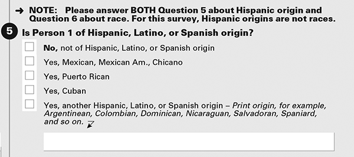
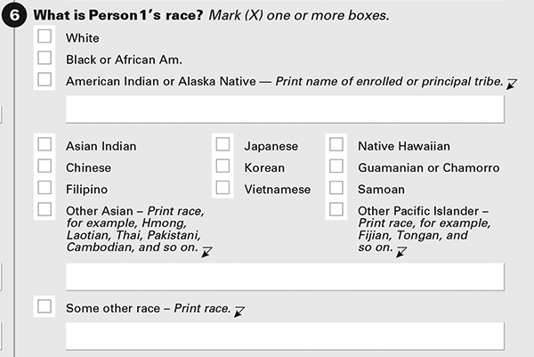

# Cultural and Individual Diversity {#diversity}

Like [ethics](#ethics), considerations of cultural and individual diversity are relevant to all of our domains as psychologists, including (but not limited to) research, teaching, assessment, intervention, and supervision. As a result, I have discussed important considerations about diversity throughout the book, including the chapters on [validity](#validity), [evidence-based assessment](#evidence-based), and [test bias](#bias). At the same time, given the importance of cultural and individual diversity, I also provide this section, which is devoted more fully to these issues within the assessment context. Diverse samples provide stronger tests of theories and better generalizability of findings ([external validity](#externalValidity)). On the assessment side, we need measures that provide us with the best information, and that are [reliable](#reliability) and [valid](#validity) for all people we use them with. Diversity is a broad concept, and it spans many dimensions of differences among people.

## Terminology

### DEI

#### Diversity {#deiDiversity}

*Diversity* refers to all aspects of differences between people. Diversity is a characteristic of a group, not a characteristic of an individual. Thus, a person is not diverse. There are many aspects of human difference, including but not limited to race, ethnicity, creed, color, sex, gender, gender identity, sexual orientation, socioeconomic status, language, culture, national origin, religion/spirituality, age, (dis)ability, military/veteran status, personality, political perspective, and associational preferences.

Having a diverse group (e.g., of participants, clients, patients, etc.) is insufficient. It is also important to make sure that we take steps for all groups to feel included ([inclusion](#inclusion)) and to thrive ([equity](#equity)).

#### Equity {#equity}

*Equity* refers to [fair](#fairness) and just practices and policies that ensure everyone can thrive. Equity is different from equality. *Equality* involves treating everyone equally (i.e., treating everyone the same). However, due to structural inequities—historic and current (e.g., structural racism and patriarchy)—some people are disadvantaged and marginalized more so than others. Structural racism refers to "the normalization and legitimization of an array of dynamics—historical, cultural, institutional, and interpersonal—that routinely advantage non-Latinx White persons while producing cumulative and chronic adverse outcomes for Black and other people with minoritized identities in housing, education, employment, health care, criminal justice, and psychology."
[@Byrd2021, p. 279]. Patriarchal societies reflect society's long history of wage gaps, gender discrimination, violence against women, etc. Treating people equally (equality) does not allow everyone to thrive given these different experiences and unequal access to opportunities. Thus, equity seeks to help everyone thrive, including those who are marginalized with fewer access to opportunities.

#### Inclusion {#inclusion}

*Inclusion* refers to providing a community where all members are and feel respected, have a sense of belonging, and are able to participate and achieve their potential.

### Aspects of Difference

There many aspects of difference. However, identifying labels to capture these differences can be challenging. "Asian" is an overly broad term. There are more than 4 billion people from Asian countries, and considerable heterogeneity. "Hispanic" is based on language (i.e., a person from a Spanish speaking country), whereas "Latino/a/x" and "African American" are based on geography (i.e., a person from a Latin American country). Traditional classifications of race/ethnicity by the National Institutes of Health miss groups that may be important to distinguish, including Arab, Middle Eastern, or North African (AMENA) populations.

Labels by the 2020 U.S. Census attempt to be more precise than traditional classifications of race and ethnicity by the National Institutes of Health. For the classification of "Hispanic, Latino, or Spanish origin" in the 2020 U.S. Census, see Figure \@ref(fig:census-hispanic). Notice how the question distinguishes between identities of people from (or whose ancestors were from) various countries, including Mexico, Puerto Rico, Cuba, etc.

```{r census-hispanic, out.width = "100%", fig.align = "center", fig.cap = "Question asking about one's Hispanic origin in the 2020 U.S. Census. Figure reprinted from the American Community Survey (2020): [https://censusreporter.org/topics/race-hispanic/](https://censusreporter.org/topics/race-hispanic/)", echo = FALSE}

```

For the classification of "Race" in the 2020 U.S. Census, see Figure \@ref(fig:census-race). Notice how the question distinguishes between identities of people from (or whose ancestors were from) various countries, including India, China, Philippines, etc.

```{r census-race, out.width = "100%", fig.align = "center", fig.cap = "Question asking about one's race in the 2020 U.S. Census. Figure reprinted from the American Community Survey (2020): [https://censusreporter.org/topics/race-hispanic/](https://censusreporter.org/topics/race-hispanic/)", echo = FALSE}

```

Society treats people differently based on factors that they are born into and are outside of their control, including their race and their family's socioeconomic status. Socioeconomic status refers to the social standing or class of an individual, and is often assessed as a combination of education, income, occupation, access to resources, privilege, power, and control [@Suzuki2013]. There is also growing attention to neighborhood- and community-level factors associated with deprivation.

There are also many other important aspects of difference to assess when thinking about individual differences in behavior. For instance, one important aspect of difference is family structure. Family structure includes lots of components, such as whether the parent is a single parent or whether there are two parents, whether the parents are working parents or whether the family has a stay-at-home parent, and whether there are other family members (e.g., grandparents) in the household.

Another important aspect of diversity includes one's sex, gender identity, and gender expression. Sex is the person's gender that was assigned at birth, and includes male, female, and intersex. Gender identity is how one self-identifies in terms of their gender. Gender identity is a spectrum in terms of the degree to which a person identifies as a female/woman/girl, a male/man/boy, or other genders, in terms of personality, likes/dislikes, jobs/hobbies, and roles and expectations. The person's gender identity may be non-binary or genderqueer if they do not identify as a man or woman (e.g., genderfluid). When the person's sex assigned at birth and their gender identity are aligned, the person is cis-gender. When the person's sex assigned at birth and their gender identity are not aligned, the person is transgender. Gender expression deals with how the person's gender is expressed to others, including their appearance.

Another dimension of diversity is whether someone is from a rural versus urban area. People from rural areas may have less access to resources. Another aspect of diversity is refugee or immigrant status. Refugee and immigrant groups may have less access to resources and may have language barriers, in addition to difficulty finding work, and fear of deportation.

It is also important to consider diversity in terms of sexual orientation and sexual behaviors. There is a distinction between one's sexual orientation (e.g., lesbian, gay, bisexual, heterosexual, pansexual, asexual)—that is, who one is sexually or romantically attracted to—versus who one has sex with (i.e., sexual behavior). There also differences in terms of the degree of people's sexual risk taking and sexual aggression.

Ability and disability are other important facets of diversity, including learning disabilities. Additionally, there are important brain-related differences that lead people to interact and experience with the world in different ways, as reflected in the term, neurodiversity. Neurodiversity can include differences related to autism and other conditions such as attention-deficit hyperactivity disorder.

Age is another important dimension of diversity. Consider the issue of [heterotypic continuity](#heterotypicContinuity). For example, externalizing problems look different at different ages and should be assessed in different ways with different measures at different ages [@Chen2015; @Miller2009; @Moffitt1993; @Patterson1993; @Petersen2015; @Petersen2021b; @Wakschlag2010].

Another important aspect of diversity is culture, which includes belief systems, value orientations, psychological processes, worldview, learned and transmitted beliefs, and practices [@Suzuki2013]. A person's culture has many facets, including but not limited to experiences related to geographic boundaries, language, religious belief, social class, gender, sexual orientation, and ability status [@Suzuki2013]. However, culture and one's related identities are dynamic and changing [@Suzuki2013], which makes them challenging to assess. Culture tends to be ignored in psychological research relative to other facets of diversity, but culture is arguably the most important in terms of influencing behavior. Additional dimensions of difference include religion and spirituality.

Another aspect of diversity is intersectionality, the intersecting of multiple identities. Intersectionality deals with how the combination of various identities can combine to influence behavior and [bias](#bias).

There are many other important aspects of difference, too. This was not an exhaustive list!

## Assessing Cultural and Individual Diversity: Multicultural Assessment Frameworks {#multiculturalFrameworks}
A review of frameworks for multicultural assessment is provided by @Edwards2017a.

### The ADDRESSING Model {#addressing}

The *ADDRESSING* model [@Hays2016] provides a framework to consider some of the commonly examined differences between people within a clinical context. ADDRESSING is an acronym that stands for:

- **A**ge and generational differences
- **D**evelopmental or other <br/>
  **D**isability
- **R**eligion and spiritual orientation
- **E**thnic and racial identity
- **S**ocioeconomic status
- **S**exual orientation
- **I**ndigenous heritage
- **N**ational origin
- **G**ender

These are important aspects of differences between people that can be helpful to understand when working with a client and how they self-identify. In addition to the aspects of diversity identified in ADDRESSING, there are other aspects of diversity and difference that may be worth considering, including but not limited to personality, culture, and political beliefs.

### DSM-5 Cultural Formulation Interview

The [Diagnostic and Statistical Manual of Mental Disorders](#dsm) (DSM) provides a framework for clinicians to organize cultural information about a client using the Cultural Formulation Interview [@LewisFernandez2014]. The Cultural Formulation Interview is a [semi-structured interview](#semiStructuredInterview) and is available here: https://www.psychiatry.org/File%20Library/Psychiatrists/Practice/DSM/APA_DSM5_Cultural-Formulation-Interview.pdf.

### Multicultural Assessment Procedure

The Multicultural Assessment Procedure was developed by @Ridley1998. The framework includes four phases:

1. gather clinical data, including cultural data, through history taking and multiple methods for the purpose of formulating a case conceptualization
2. interpret clinical and cultural data to formulate a hypothesis, while keeping in mind to:
    - differentiate the cultural data as being either idiosyncratic (i.e., unique to the individual client and would not necessarily be expected of other members of the client's culture) or culture-specific
    - consider [base rates](#baseRate)
    - differentiate dispositional from environmental stressors
    - differentiate clinically significant data from data that are not clinically significant
3. incorporate cultural data with other clinical information to test the hypotheses by ruling out medical explanations and using appropriate assessments and testing
4. arrive at a sound assessment decision (case conceptualization)

The procedure also includes debiasing strategies to minimize the likelihood of clinical judgment errors. @Ridley2001 expanded on this framework in consideration of [ethical issues](#ethics) in multicultural assessment.

### Multicultural Assessment–Intervention Process

The Multicultural Assessment–Intervention Process was developed by @Dana1998. The process provides a flowchart for clinicians to conduct assessment by asking relevant questions about cultural orientation, type of assessment instrument (e.g., etic or emic), cultural formulation for diagnosis, and intervention approach (e.g., universal, culture-general, culture-specific, identity-specific, etc.). *Etic* assessments are culture-general whereas *emic* assessments are culture-specific.

## Assessments with Ethnic, Linguistic, and Culturally Diverse Populations {#guidelinesForAssessmentWithDiversePopulations}

### Methodological and Conceptual Challenges in Research

Methodological and conceptual challenges for conducting research with ethnic minorities are described by @Okazaki1995. Guidelines for conducting research with diverse groups are described by @Burlew2019.

#### Use of Terms: Race, Ethnicity, Culture

Use of terminology with respect to race, ethnicity, and culture is a key challenge in assessment of ethnic minorities. Many people refer to race, ethnicity, and culture interchangeably, which reflects conceptual confusion. There is no definition of race, ethnicity, and culture that is universally agreed on [@Okazaki1995]. As described by @Okazaki1995, "the use of the term 'race' appears to imply biological factors, as races are typically defined by observerable physiognomic features such as skin color, hair type and color, eye color, stature, facial features, and so forth."
(p. 367). By contrast, ethnicity (ethnic status) has been defined as "an easily identifiable characteristic that implies a common cultural history with others possessing the same characteristic."
[@Eaton1980, p. 160]. Ethnic identifiers for evaluating whether people share a "common cultural history" include racial, national, tribal, religious, linguistic, or cultural origin or background. Thus, race and ethnicity, though conceptually distinct, are related as race can be an ethnic identifier.

Researchers have argued that race designations are arbitrary [@Helms2005], that race is a social, cultural, and/or political construct rather than a biological construct [@Yudell2016], that race has no genetic basis [@Yudell2016], that within-race differences are greater than between-race differences [@Zuckerman1990], and that racial categories lack conceptual meaning [@Helms2005]. However, even though race does not appear to have a genetic or biological basis and therefore appears to be a social construct rather than a biological construct, racism as a social problem is real and is a major issue [@Smedley2005]. People are born into different social reactions based on their race. Thus, race is important to consider from a perspective of racialized experiences and discrimination even if the racial categories do not represent underlying biological differences.

In terms of determining what to assess and analyze, it is important for the researcher to determine whether they are interested in evaluating race as a biological variable, ethnicity as a demographic variable, or an aspect of cultural experience as a psychological variable [@Okazaki1995]. Researchers often use race and/or ethnicity as proxy variables for psychological variables such as cultural values, self-concept, minority status, etc. However, race and ethnicity are distal to the variables that may be of most psychological interest. Some people identify their primary culture as being different from their self-identified ethnicity. It is thus important to assess the psychological processes of interest, rather than merely relying on racial or ethnic categories as proxies.

Culture refers to a psychological variable: i.e., the social context. Researchers often group people together based on race or ethnicity with the implicit assumption that they share some cultural experience. According to [@Okazaki1995], assumptions underlying the use of race or ethnicity in a study should be made explicit. Research should directly assess the underlying psychological variables associated with culture, such as different spiritual practices, that are hypothesized to produce the racial/ethnic/cultural differences. That is, it is generally best not to rely solely on race or ethnicity to classify people, which are imprecise, unless the goal is to classify people based on racialized reactions and experiences. Thus, the researcher can classify people according to race/ethnicity, but can also examine the more proximal cultural variables that are thought to drive group-related differences.

#### Whether to Examine Individual Differences or Group Characteristics

One question the researcher should consider is whether they are interested in understanding individual differences or group characteristics. Both can be valuable and important questions to examine. However, researchers should not under-estimate within-group heterogeneity [@Okazaki1995]. The greater the within-group heterogeneity, the less accurate predictions tend to be. Moreover, inferences at the group-level cannot necessarily be applied to the individual level; the confounding of an individual with the individual's culture leads to stereotyping [@Okazaki1995], which should be avoided.

#### Selecting Participants

One question is which groups to include in the research design and in what proportion. For group-related comparisons, the researcher would need a large enough sample size for every group examined to have adequate power to identify group-related differences. If the researcher is interested in studying a particular group, a question is whether to use a comparison group. A comparison group can provide a basis of comparison to better interpret the findings in the group of interest. However, inclusion of a comparison group can add time, cost, and as a result may lead to achieving a smaller sample in the group of interest. Moreover, the group comparison approach has been criticized for reinforcing racial stereotypes, reinforcing Whites as the standard group and non-White behavior as deviant, and overlooking within-group variation [@Okazaki1995]. Thus, decisions about which groups to include, in what proportion, and whether to include a comparison group should be guided by the questions and purpose of the study. Practical considerations can come into play, and having a comparison group should not be considered the necessary default for all studies. Moreover, White groups should not be considered the default.

#### Ensuring Fair Group Comparisons {#ensuringFairGroupComparisons}

Another issue is how to achieve fair group comparisons. One approach is to match groups by selecting participants a priori to be similar on relevant, secondary characteristics such as demographic characteristics (e.g., age, sex, socioeconomic status) or other abilities (e.g., intelligence). The goal of matching is for participants to be similar as possible in the relevant characteristics apart from their group classification. However, there are challenges to matching groups on all relevant characteristics. Another approach is to control for these secondary characteristics post hoc in the statistical analysis. Which variables to include as control variables is an important question that depends on the goal. A key question is which variables to match participants on. However, there is not an agreed-upon list of matching variables. Generally, researchers recommend controlling for social and demographic characteristics such as educational attainment, income level, and language fluency, when group-related differences exist on those variables and the researcher believes that such differences may moderate the associations of interest [@Okazaki1995]. When comparing Black and White participants, it is important to control for group differences in socioeconomic status, especially in the U.S.

In addition to main effects of group status, it may also be important to consider *interaction* effects of group status, consistent with an intersectionality approach. However, power to detect interactions tends to be weaker than power to detect main effects, both because of [smaller effect sizes](https://statmodeling.stat.columbia.edu/2018/03/15/need-16-times-sample-size-estimate-interaction-estimate-main-effect) and because of smaller sample sizes of the intersecting groups.

#### Sampling

Researchers face important questions with how to identify, sample, and recruit ethnic minority samples. Groups, such as ethnic groups, may be classified at a broad level (e.g., Latinx or Hispanic) or at a more specific level (e.g., Puerto Rican, Mexican American, etc.); however, these approaches do not need to be mutually exclusive. Researchers must also determine how to classify people of mixed racial or ethnic backgrounds. It is also important to note that it is an incorrect assumption that once people are identified as belonging to a particular ethnic-cultural group, that they share a common understanding of their own ethnicity or culture and identify with the ethnic-cultural group [@Okazaki1995].

There are challenges of recruiting a sizeable sample size with specific ethnic-cultural groups (e.g., Japanese Americans). This is partly a challenge of small overall population size (e.g., American Indians). This is also partly a challenge of difficult-to-reach populations who are distrustful of science and researchers. Research has exploited under-privileged populations (e.g., the Tuskegee syphilis study in Black men), which has led to changes in the consent process to ensure that participation is voluntary. There may also be selection effects, such that the people who are willing to participate in research may differ in important ways from those less willing to participate in research, which is a challenge to generalizability. To address sample size challenges, researchers often combine data from multiple ethnic-cultural groups with some common origin. For instance, researchers might combine Chinese Americans, Japanese Americans, and Korean Americans into one group. Or, researchers might combine people from multiple tribal groups among American Indians. However, broadening the ethnic grouping increases the heterogeneity of the groups, so the researcher must decide which are the sources of variability that can and cannot be overlooked [@Okazaki1995].

Much of the literature in general and on diversity, in particular, is from research on college students. There are limitations of conducting research on college students. College students are not representative of the broader population. Research using college students under-estimates the population heterogeneity in terms of demographic and psychosocial diversity.

One goal of research is to learn findings that apply to the broader population, with the goal of having a representative sample, where the mean of the sample is approximately the same as the mean of the population. However, having a population-representative sample is not as useful for comparing differences between groups. To do this, we would need large samples of each group—e.g., equally weighted samples. Most research is on participants from WEIRD countries [@Henrich2010]: Western, educated, industrialized, rich, and democratic (WEIRD) societies. This further limits the potential generalizability of findings to different cultures.

Provide a thorough description of the sample and sampling methodology used. For instance, it can be helpful to describe participants on additional dimensions to race and ethnicity, including generational status, acculturation, self-identification, ethnic and cultural composition of the neighborhoods or communities, etc. [@Okazaki1995]. Acculturation deals with the change that individuals undergo due to contact with members of different cultures, and it includes strategies such as assimilation, separation, marginalization, and integration [@Suzuki2013].

#### Establishing Equivalence of Measures Across Groups {#measurementEquivalence}

Five key areas need to be empirically evaluated in using or adapting instruments across cultures or groups to reduce or eliminate cultural [bias](#bias) [@Hunsley2007]:

- Conceptual equivalence
- Linguistic (or translation) equivalence
- Psychological equivalence of the items
- Functional equivalence
- Metric and scalar equivalence

Conceptual equivalence refers to establishing that the construct has the same meaning across groups. Linguistic (or translation) equivalence refers to the measure have the same linguistic meaning in each language to which it has been translated. Best practices for establishing translation equivalence include having experts translate and back-translate the measure, comparing both the original and back-translated versions, and revising the translation accordingly [@Okazaki1995]. Psychological equivalence of the items deals with establishing that the psychological effect each item has for each group or in the different versions.

Functional equivalence deals with establishing similar [predictive](#predictiveValidity) and [concurrent](#concurrentValidity) [criterion-related validity](#criterionValidity) to prevent [test bias](#bias) (i.e., similar regression intercepts and slopes between measure and criterion). Functional equivalence can be difficult to establish when both the test and the external criteria of interest are both rooted in the same dominant universalist cultural epistemology or worldview; instead, it may be advantageous to validate tests against  external criteria that are grounded in the nondominant group's culture [@Suzuki2013].

Metric and scalar equivalence deal with establishing that the construct is measured on the same metric across groups, that is, a particular score reflects the same level on the construct for people in each group. Metric equivalence deals with establishing that items' [discrimination](#itemDiscrimination) parameters (or factor loadings) are the same across groups, whereas scalar equivalence deals with establishing that both items' [discrimination](#itemDiscrimination) parameters (or factor loadings) and [difficulty](#itemDifficulty) parameters (or intercepts) are the same across groups.

#### Methods of Assessment

It is debatable whether some assessment methods may be more likely to result in cultural or ethnic [bias](#bias) compared to other assessment methods [@Okazaki1995]. Certain types of assessment techniques might be more likely to [bias](#bias) or obscure differences between cultural groups. This especially depends on who is doing the observing and their own beliefs. There may be selection biases regarding the types of people who are willing to participate in in-depth studies that involve [observational](#behavioral) or [psychophysiological](#psychophysiological) assessment. It may be worth considering supplementing quantitative measurement approaches with qualitative measurement approaches, such as interviews and life histories, which may be better able to capture cultural factors. In general, it is advantageous to assess people using multiple measures and methods to establish [convergent validity](#convergentValidity) of cultural constructs [@Okazaki1995].

#### Interpretation of Data

Another challenge deals with how to interpret data from group comparison designs. Historically, group differences in scores were most commonly interpreted from a deficit-based narrative rather than a strengths-based narrative [@Byrd2021].

### APA Guidelines

There are many disparities in psychological services for under-served populations, including health disparities, diagnostic disparities, and disparities in the use and availability of psychological services [@RiveraMindt2010]. To help address these disparities, the American Psychological Association (APA) Office of Ethnic Minority Affairs published guidelines for providers of psychological services to ethnic, linguistic, and culturally diverse populations [@APAOfficeEthnicMinorityAffairs1993]. Their guidelines included suggestions such as:

- Whenever possible, provide information in writing along with oral explanations.
- Whenever possible, provide the information and interact in the language that is understandable to the client. If that is not feasible, make an appropriate referral. If this is not possible, provide a translator with cultural knowledge and an appropriate professional background. When no translator is available, then use a trained paraprofessional from the client's culture as a translator.
- If you do not possess knowledge and training about an ethnic group, seek consultation with, and/or make referrals to, appropriate experts as necessary.
- Consider the [validity](#validity) of a given instrument or procedure and interpret the resulting data, while keeping in mind the cultural and linguistic characteristics of the client.
- Be aware of the test's reference population and possible limitations of using the instrument with other populations.
- Seek to help clients determine whether a "problem" stems from racism or [bias](#bias) in others so that the client does not inappropriately personalize problems.

The APA has also published guidelines for working with particular groups, including:

- groups based on [race and ethnicity](https://www.apa.org/about/policy/guidelines-race-ethnicity.pdf)
- [people with low income](https://www.apa.org/about/policy/guidelines-low-income.pdf)
- [people with disabilities](https://www.apa.org/pi/disability/resources/assessment-disabilities)
- [people who are transgender or gender nonconforming](https://www.apa.org/practice/guidelines/transgender.pdf)
- [sexual minorities](https://www.apa.org/about/policy/psychological-sexual-minority-persons.pdf)
- [girls and women](https://www.apa.org/about/policy/psychological-practice-girls-women.pdf)
- [boys and men](https://www.apa.org/about/policy/boys-men-practice-guidelines.pdf)

### Seek Training and Consultation {#trainingAndConsultation}

Research has shown that relatively few practitioners receive extensive training in multicultural assessment and few use frameworks for multicultural assessment [@Brickman2006; @Edwards2017a]. Researchers have encouraged increasing multicultural education, training, awareness, and knowledge, increasing multicultural psychological research, and increasing the provision of culturally competent psychological services to ethnic minorities [@RiveraMindt2010]. It can also be worthwhile to consult with informal support systems, including churches, ethnic clubs, family associations, and community leaders [@Leong2016].

### Develop Awareness of Cultural Differences {#awarenessOfCulturalDifferences}

One goal should be to develop cultural competence with the groups, communities, and individuals with which one works or interacts. It can be helpful to be aware of cultural differences, including cultural differences in communication style and use of language [@Leong2016].

### Show Cultural Humility {#culturalHumility}

Another goal should be to show cultural humility. @Tervalon1998 describe three key aspects of cultural humility: (1) a life-long commitment to self-evaluation and self-critique, (2) fixing power imbalances, and (3) developing mutually beneficial and nonparternalistic partnerships with communities who advocate for others. For instance, it is important to be aware of one's [biases](#bias) and stereotypical beliefs. Cultural humility involves treating the client as the expert on their experience. Therefore, cultural humility involves collaboration between the clinician and client, because each brings important knowledge. The client brings their knowledge of their situation, and their preferences. The clinician brings their scientific knowledge about strengths and difficulties, and about behavior change.

### Do Not Assume or Stereotype {#avoidAssumptions}

It is important to consider cultural factors; at the same time, groups are not monolithic and every person is unique. Do not assume about someone based on their demographics, which is stereotyping. Just because a person comes from a particular group does not mean the person shares all beliefs, behaviors, etc. with the group [@Okazaki1995]. Thus, it is important to be aware of within-group differences, as well [@Leong2016; @Okazaki1995], which are often as large or larger than between-group differences [@Zuckerman1990]. Show genuine interest and curiosity to get to know a person as an individual.

### Ensure Adequate Representation of Under-Represented Groups in Research {#adequateReprentations}

There are important issues of generalizability of research findings. Participant samples historically have been largely white and middle or upper middle class. This reduces the potential generalizability of findings, and limits effectiveness of treatments to under-represented populations, many of whom have experienced discrimination and social disadvantage. Many groups, including people who are Black or Latinx, and gender and sexual minorities have not been adequately represented in research studies. As a result, the knowledge gained from unrepresentative studies may not generalize to other under-represented groups. Science plays an important role in advancing knowledge that can lead to the development of new treatments. However, groups who are under-represented in research are less likely to benefit from the new treatments because the knowledge upon which the treatments were developed and tested may not generalize to the under-represented groups. Moreover, the lack of inclusion of under-represented groups in studies leads to inappropriate [normative data](#norm). Thus, it is crucial to have better representation of historically marginalized and minoritized groups in science, including people who are Black or Latinx, and gender and sexual minorities.

People from Finland and Sweden are often studied to examine health-related questions. Because they have a socialized health care system, the government keeps medical records on all citizens, so researchers can examine millions of participants, and can study rare conditions and behaviors with a low [base rate](#baseRate), like suicide [@Lysell2018]. However, there are questions of generalizability from the Scandinavian population and health care system to those of other countries, including the United States. One could hypothetically use propensity score matching for matching their sample to other populations, but one cannot really do that because they have too many empty cells for propensity score matching due to too few people of various under-represented racial/ethnic groups.

### Use Appropriate Measurement {#appropriateMeasurement}

#### Do Not Use Offensive Content or Procedures

It is important to use stimuli that are [valid](#validity) for the populations being tested. It is important to avoid using content or procedures that are culturally or racially insensitive, or that are racist, sexist, heteronormative, and/or ableist [@Byrd2021]. When developing assessments, it may be important to evaluate stimuli in focus groups to ensure they are not offensive.

One of the most widely used standardized assessments in psychological assessment is the Boston Naming Test, a measure of visual confrontation naming that is used to assess cognitive impairment, aphasia, and dementia. The Boston Naming Test includes a noose as one of the items. Historically, lynchings with a noose were used in the United States as a form of racial terror against Black people. Thus, the use of a noose as an item in the Boston Naming Test is racially insensitive and inappropriate for use because it is deeply offensive and has a harmful nature. It can have a strong negative impact on Black respondents in terms of distress, performance disparities, and health disparities [@Byrd2021].

Culturally offensive stimuli can lead to stereotype threat and compromise the [validity](#validity) of the assessment. Stereotype threat occurs when people are or feel at risk of conforming themselves to stereotypes about their social group, thus leading them to show poorer performance in ways that are consistent with the stereotype. Moreover, the use of offensive procedures likely contributes to greater distrust of the scientific and medical fields among under-served communities, which acts as a barrier to health care and to health disparities. Thus, removing and replacing offensive stimuli may be necessary from a moral and [ethical](#ethics) perspective to do no harm and to assure [valid](#validity) assessment, even if it risks modifying the standardized procedure from which the [norms](#norm) were developed [@Byrd2021]. When deviating from standardized procedures, it is important to describe such deviations in resulting papers or reports.

#### Use Culturally Valid Measures

Most measures originated from Western societies [@Suzuki2013] and have been validated only among non-Latinx, English-speaking Whites [@Manly2005]. It is important to use measures that have been validated for the populations with whom they will be used. Many measures have been used for different populations than the populations with which the instruments were developed and validated, such as with immigrants, refugees, or when exporting measures to different countries or cultural contexts. Exporting measures for use with people from different cultures assumes universality (i.e., cross-cultural [validity](#validity)). More work should examine adaptation and [validation](#validity) of measures for other cultures, countries, languages, etc. [@Leong2016]. However, some measures may not be able to be applied [validly](#validity) across cultures. Using [valid](#validity) measures for the target population may in some cases mean using culturally specific (etic) instruments rather than universal (emic) instruments. If using measures whose [validity](#validity) and [measurement equivalence](#measurementEquivalence) has not been established, it is important to interpret results with caution and to provide disclaimers in any resulting papers or reports [@Leong2016].

As described in Section \@ref(culturalValidity), it is also important for measures to have [cultural validity](#culturalValidity), which refers to "the effectiveness of a measure or the accuracy of a clinical diagnosis to address the existence and importance of essential cultural factors."
[@Leong2016, p. 58]. Essential cultural factors may include values, beliefs, experiences, communication patterns, and approaches to knowledge (epistemologies).

Threats to [cultural validity](#culturalValidity) of assessments includes: [pathoplasticity](#pathoplasticity) of psychological disorders, [bias in clinical judgment](#biasClinicalJudgment), [language capability](#linguisticallyAppropriate) of the client, [biased](#bias) measures, or inappropriate use or interpretation of measures [@Leong2016].

#### Use Linguistically Appropriate Assessment {#linguisticallyAppropriate}

It is important to use assessment approaches that are lingutistically appropriate for the examinee [@Leong2016]. First, the measure should be in a language that is understood by the examinee. Second, the measure should be consistent with the examinee's language ability. Sometimes interpretors or translators may be necessary. However, use of interpretors has been shown to lead to under-estimations of patients' emotion suffering and despair [@Leong2016]. In addition, clients and therapists can attach different meanings to the same words. It is thus important not to assume that you know what the client means by various terms and not to assume that the client knows what you mean by various terms.

#### Use Follow-Up As Necessary

As described by @Suzuki2013, it may be necessary to use follow-up procedures to clarify people's responses to items or to test the limits by readministering items with additional supports (e.g., modifying instructions to involve more or fewer cues, adjusting the pace of information presented, adjusting  memory demands, changing the response format) [@Sattler2006]. When deviating from standardized procedures, it is important to describe such deviations in resulting papers or reports.

#### Examine and Correct for Test Bias

As described in Chapter \@ref(bias), there are two types of [test bias](#bias): [predictive test bias](#predictiveBias) and [test structure bias](#testStructureBias). It is important to evaluate the possibility of both when using assessments across groups.

It is important to establish [measurement invariance](#measurementInvariance) across groups to ensure that scores have the same meaning for each group [@Burlew2019]. If measures are non-invariant, the means (i.e., level) and or associations between constructs could appear to (artifactually) differ across groups, when in reality they do not [@Chen2008]. [Measurement invariance](#measurementInvariance) can be examined in terms of item intercepts, item factor loadings, and item residuals. Establishing measurement invariance of just intercepts or factor loadings (or vice versa) is not sufficient to establish measurement invariance because tests can show strong [bias](#bias) in one dimension (e.g., intercepts) even if the test does not show bias in other dimensions (e.g., factor loadings)  [@Wicherts2010]. Approaches for evaluating [measurement invariance](#measurementInvariance) across groups are described by @Han2019. To help minimize the potential for [test bias](#bias), reseachers are encouraged to develop the scales simultaneously across the different groups or cultures [@Fernandez2018].

It is also important to determine whether the measure's scores shows similar relations to meaningful external criteria [@Burlew2019].

@Fernandez2018 provide strategies to address cross-cultural [bias](#bias), such as excluding words or concepts that are specific to one language or culture. Use of North American neuropsychological tests in other countries has shown to lead to considerable [false positives](#falsePositive), and the extent of misdiagnosis differs by country [@Daugherty2017].

It is important to examine factors that moderate the [validity](#validity) of assessment, e.g., groups for whom the assessment is [biased](#bias). Ways to investigate and detect [bias](#bias) are described in Section \@ref(detectBias). The number of potential moderating variables is so large, that it is not realistic to develop an assessment base that encompasses all of these factors and their interactions. Evidence should be used regarding which factors seem to matter for a given assessment purpose, that is the factors that have a medium-to-large effect size. It is valuable to examine the effect size of moderators; if the effects are small, it might not be sufficient to scrap the instrument for the population. Gender and cultural differences have shown a number of statistically significant effects for a number of different assessment purposes, but many of the observed effects are quite small and likely trivial, and do not present compelling reasons to change the assessment [@Youngstrom2016]. Nevertheless, if you do find evidence of [bias](#bias), it is important to correct for it. Ways to correct for [bias](#bias) using score adjustment and other approaches are discussed in Section \@ref(correctForBias).

### Consider Pathoplasticity of Constructs {#pathoplasticity}

Constructs can manifest differently across cultures. Pathoplasticity of mental disorders refers to the variability in symptoms, course, outcome, and distribution of mental disorders among various cultural groups [@Leong2016]. Some syndromes are considered culture-bound—that is, they exist in some cultures but not in other cultures. Hwabyung is a Korean culture-bound syndrome in which suppressed negative emotions manifest themselves in bodily ways such as  chest pains and difficulty breathing. In addition, features associated with a disorder, including the content, severity, or frequency of symptoms, may vary across cultures.

For instance, Asian Americans tend to report a greater degree of psychological disturbance than Whites, which could be due to several reasons [@Leong2016]. It is possible that Asian Americans (a) show higher rates of mental health problems than other groups, (b) under-utilize mental health services, and/or (c) are more likely than other groups to be misdiagnosed due to miscommunication, use of [invalid](#validity) instruments for Asian Americans, and/or lack of cultural knowledge on the part of therapists. In addition, how clients act in a diagnostic interview may depend on cultural factors, and it thus may be important to sample the clients more broadly than a diagnostic interview [@Leong2016].

For a case example of pathoplasticity, there is a disorder among the traditional Navajo called "Moth Madness" [@APAOfficeEthnicMinorityAffairs1993]. Symptoms of moth madness include seizure-like behaviors. This disorder is believed by the Navajo to be the supernatural result of incestuous thoughts or behaviors. Both differential diagnosis and intervention should take into consideration the traditional values of Moth Madness.

### Formulate a Culturally Informed Case Conceptualization {#culturallyInformedCaseConceptualization}

It can be helpful to discuss your diagnosis and case conceptualization with the client. For instance, you may learn that some behaviors are normative in their culture and may not be distressing or concerning to them. It can thus be helpful to consider client preferences in terms of what to address and how to address it, while adhering to [evidence-based](#evidence-based) approaches.
 
### Bias in Clinical Judgment {#biasClinicalJudgment}

As reviewed by @Garb1997, there is evidence of race [bias](#bias), social class [bias](#bias), and gender [bias](#bias) in clinical judgment. Race [bias](#bias), social class [bias](#bias), and gender [bias](#bias) in clinical judgment occurs when the accuracy of judgments varies as a function of client race, social class, or gender. That is, clinical judgment [bias](#bias) occurs when the accuracy of judgments varies as function of other variables (e.g., race, social class, gender). [Bias](#bias) is not when the *judgments* themselves vary as a function of other factors, but when the *accuracy* of those judgments varies. Examining how judments differ across groups does not control for differences in clinical severity between the groups. If a clinician rates more people in one group as having a disorder than another group, this is not necessarily evidence of [bias](#bias) because the true prevalance of the condition could differ across groups. Thus, it is important to compare groups with similar levels of symptomatology or to control for level of symptomatology. If clinical judgments are more accurate for White clients than Black clients, we would say that race [bias](#bias) exists.

Accuracy of judgments could vary by the client's race, social class, or gender for several reasons [@Garb1997]. One way in which judgments could be biased is if the diagnostic criteria are [biased](#bias)—for instance, if the diagnoses are more [valid](#validity) for one group (e.g., White clients) than for another group (e.g., Black clients). Another reason that accuracy of judgments could vary as a function of client race, social class, or gender is if the judgments are made based on a [biased](#bias) instrument. Another way that accuracy of judgments could vary as a function of client race, social class, or gender is related to confirmation [bias](#bias) or [biases](#bias) introduced during the usage of a measure. This could occur, for instance if clinicians do not consider alternative hypotheses, and based on their hypotheses, they choose the data to collect that support their hypotheses rather than collecting data that could refute their hypotheses. [Bias](#bias) could also occur in the way that data are integrated from multiple measures or methods. Another form of [bias](#bias) could arise from how test results are used, in terms of inequitable social consequences [@Suzuki2013].

Many studies do not find [bias](#bias) in clinical judgments as a function of race, social class, or gender, but some studies do find evidence of [bias](#bias) [@Garb1997].

#### Race Bias

One pattern of race [bias](#bias) is that Black and Latinx patients with a psychotic affective disorder are more likely than White patients to be misdiagnosed as having schizophrenia [@Garb1997]. That is, Black and Latinx patients are less likely than White patients to be diagnosed with psychotic affective disorder (with the same symptoms) and are more likely to be diagnosed as having schizophrenia, even when the measures do not indicate that a diagnosis of schizophrenia is justified. Another pattern of race [bias](#bias) is that the risk of violence is over-estimated for Black patients but not for White patients [@Garb1997]. In addition, cases of child abuse are more likely to be reported when children are White than when they are Black (even when comparing similar behavior) [@Garb1997]. Race [bias](#bias) has also been observed with respect to antipsychotic medication. Antipsychotic medications are more often prescribed for Black patients than for other patients even for similar levels of psychosis [@Garb1997]. Moreover, affective symptoms in patients who are severely ill are more often under-treated for Black or Latinx patients than for White patients [@Garb1997].

#### Social Class Bias

One pattern of social class [bias](#bias) is that child abuse is more likely to be reported if a child is from a lower-class background rather than a middle- or upper-class background (even when comparing similar behavior) [@Garb1997]. In addition, middle-class children are more likely to be referred to special education programs compared to lower-class children [@Garb1997]. There is also social class [bias](#bias) in clinicians' decisions about psychotherapy. Referrals for psychotherapy are more often made for middle-class clients than for lower-class clients [@Garb1997]. Clinicians are more likely to recommend psychotherapy and expect a client to do well in psychotherapy when the client is from a middle- or upper-class background compared to when the client is from a lower-class background, leading to a tendency for clinicians to refer clients to different types of treatments based on the client's social class [@Garb1997]. Specifically, lower-class clients are more likely to be referred for supportive psychotherapy whereas middle-class clients are more likely to be referred for insight-oriented psychotherapy.

#### Gender Bias

One pattern of gender [bias](#bias) is that women are more likely than men to be diagnosed with a histrionic personality disorder, whereas men are more likely than women to be diagnosed with antisocial personality disorder, even when female and male clients do not differ in symptomatology [@Garb1997]. Another pattern is that clinicians tend to over-estimate likelihood of violent behavior for male clients and under-estimate likelihood of violent behavior for female clients [@Garb1997; @McNiel1995]. Although males tend to show more violence than females, studies have shown that [false positives](#falsePositive) tend to be more common for male patients than female patients whereas [false negatives](#falseNegative) tend to be more common for female patients than male patients [@McNiel1995].

In terms of autism, some conceptualizations of autism consider it to be a manifestation of "extreme male brain" [@BaronCohen2002; @BaronCohen2010; @Greenberg2018]. Girls diagnosed with autism tend to be more severely affected than boys diagnosed with autism. People are less likely to notice autism in girls. This could possibly be due to girls with autism having fewer restricted interests and lower levels of repetitive behavior compared to boys. Research has tried to develop assessments to equate boys and girls, but girls and boys appear to be unequal in their underlying autism process—that is, boys and girls appear to show sex-specific autism phenotypes [@Frazier2014].

#### Recommendations for Reducing Bias in Clinical Judgment

@Garb1997 makes several recommendations for reducing [bias](#bias) in clinical judgment, including:

- Be aware of [biases](#bias) that have been reported in the clinical judgment literature.
- Use standardized and structured assessment approaches and attend strictly to diagnostic criteria when making diagnoses.
- Use [actuarial approaches](#actuarial) and statistical prediction rules.

### Use Appropriate Normative Data {#appropriateNorms}

When group-referenced judgments will be used, it is important to consider what the appropriate [norm](#norm) is. The question of whether separate [norms](#norm) should be used for various racial/ethnic minority groups is of considerable controversy [@Burlew2019]. Pros and cons of using group-specific [norms](#norm) are discussed in Section \@ref(withinGroupNorming) and reviewed by @Manly2005. The question about which [norms](#norm) to use are complex, and psychologists should evaluate the cost and benefit of each [norm](#norm), and use the [norm](#norm) with the greatest benefit and the least cost for the client [@Manly2007]. @Burlew2019 recommend limiting the use of measures that require the use of [norms](#norm) to interpret, and to note in the limitations of a paper or report if a [norm](#norm) based on one group is used to evaluate a person from a different group.

### Contextualize Group-Related Differences {#contextualizeGroupDifferences}

When conducting research and identifying different scores between groups, it is important to be cautious not to assume that differences in the scores between groups are caused by the group membership. That is, correlation does not necessarily mean causation! For instance, if the researcher identifies higher rates of suicide in transgender than cisgender individuals [as has been observed, @Toomey2018], it is important not to automatically assume the higher suicide rate is *because of* the person's transgender status, per se. Rather, there are likely many aspects of discrimination and victimization that transgender individuals experience that, unfortunately, may increase their suicide rate relative to cisgender individuals.

It is important to contextualize test score differences between groups within sociocultural and historical inequities rather than interpreting group-related differences in tests scores from a deficit-based narrative [@Byrd2021]. It is important to avoid interpretive [bias](#bias) and to pay attention not to over- or under-pathologize [@Okazaki1995]. Over-pathologizing can lead to stigmatization and institutionalization. Under-estimating psychopathology can deprive patients of treatments or services that they would benefit from. For instance, one should be aware of the danger of under-estimating psychopathology for clients from different cultures (from that of the therapist) through over-attributing bizarre behavior or thought patters to the client's culture [@Okazaki1995].

### Dissemination and Implementation

Dissemination and implementation deals not just with finding differences between groups, but what to do about these differences. Exemplary would be to custom-tailor treatments to individuals based on their individual characteristics. The goal is to identify the best treatment for each group, or ideally, each individual.

### Use Inclusive and Person-First Language {#inclusiveLanguage}

When writing reports, manuscripts, or in conversation, it can be helpful to use inclusive and person-first language. The aim of people-first language is to reduce stigma because it treats everyone as a human first. People-first language puts the person before the disability and describes the difficulties a person has rather than who a person is. For instance, say "a child with intellectual disability" instead of "an intellectually disabled child."
The APA guidelines for inclusive language are located here: https://www.apa.org/about/apa/equity-diversity-inclusion/language-guidelines.pdf

## Conclusion

Diverse samples provide stronger tests of theories and better generalizability of findings ([external validity](#externalValidity)). We need measures that are [reliable](#reliability) and [valid](#validity) for all people we use them with. There are various [multicultural frameworks to assessment](#multiculturalFrameworks). [Guidelines for assessment of diverse populations](#guidelinesForAssessmentWithDiversePopulations) are discussed. Recommendations include developing and using [appropriate](#appropriateMeasurement) and [valid](@validity) measures for the target population(s), [ensuring fair group comparisons](#ensuringFairGroupComparisons), seeking [training and consultation](#trainingAndConsultation), developing [awareness of cultural differences](#awarenessOfCulturalDifferences), showing [cultural humility](#culturalHumility), avoiding [assuming or stereotyping](#avoidAssumptions), ensuring [adequate representation](#adequateReprentations) of under-represented minorities, considering [pathoplasticity](#pathoplasticity) of constructs, formulating a [culturally informed case conceptualization](#culturallyInformedCaseConceptualization), using [appropriate normative data](#appropriateNorms), [contextualizing group-related differences](#contextualizeGroupDifferences), and using [inclusive language](#inclusiveLanguage).

## Suggested Readings

@Burlew2019; @Byrd2021; @Okazaki1995
