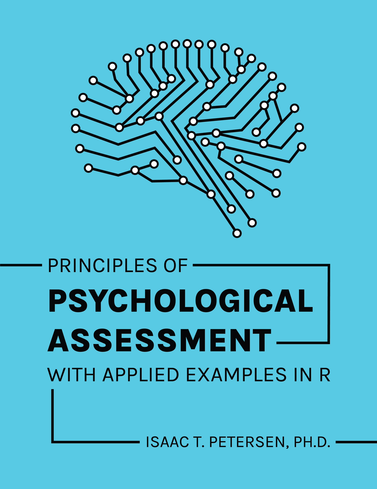

--- 
title: "Principles of Psychological Assessment: With Applied Examples in R"
author: "Isaac T. Petersen"
date: "`r Sys.Date()`"
site: bookdown::bookdown_site
documentclass: book
bibliography: [book.bib, packages.bib]
csl: apa.csl
link-citations: yes
description: "This book is a computational R notebook that is a companion to my PSY 5330 course on *Principles of Psychological Assessment*. The goal of this book is to provide computational examples to apply principles we discuss in class into practice."
github-repo:
cover-image: "Images/cover.png"
---

<!-- To add a comment, select the text you want to be a comment and press CTRL-SHIFT-C -->

<!---
Or for comment blocks,
do this.
-->

<!-- To save the entire book as a single html file, add `split_by: none` under `bookdown::gitbook:` of the file called `_output.yml` -->

<!---
To do:
-margin/side notes
-code folding

Graphics:
-book cover
-reliability, validity, bias as bullseye target
-images from other sources: individual- vs group-level bias, types of validity (Schneider)
-->

<!---
To include LaTeX code, see here:
https://bookdown.org/yihui/rmarkdown-cookbook/raw-latex.html
-->

<!---
To run chunk depending on whether it is HTML (including epub) or LaTeX/PDF, see here:
https://bookdown.org/yihui/rmarkdown-cookbook/latex-html.html

eval = knitr::is_html_output()
eval = knitr::is_latex_output()
-->

<!---
Display HTML in LaTeX/PDF:
https://bookdown.org/yihui/rmarkdown-cookbook/html-widgets.html
-->

<!---
Line breaks (https://stackoverflow.com/questions/33191744/how-to-add-new-line-in-markdown-presentation):
<br/>
&nbsp;
\
two spaces at end of line
-->

<!---
Tables:

library("rmarkdown")
paged_table(data)

library("DT")
DT::datatable(data, options = list(scrollX = TRUE))

library("kable")
kable(data)
-->

```{r setup, include = FALSE}
knitr::opts_chunk$set(message = FALSE, #don't show messages
                      warning = FALSE, #don't show warnings
                      error = TRUE, #do not interrupt generation in case of errors
                      echo = TRUE, #show R code
                      time_it = TRUE, #time code chunks
                      dev = "png", dev.args = list(type = "cairo-png")) #plot anti-aliasing using cairo-png
```

# Preface

This is a book in progress—it is incomplete. I will continue to add to and update it as I am able. If you have data or analysis examples that are you willing to share and include in the book, feel free to contact me.



  
The online version of this book is licensed under the [Creative Commons Attribution License](https://creativecommons.org/licenses/by/4.0/).

## Acknowledgments

This book was supported by an OpenHawks Open Educational Resources grants program from the University of Iowa Libraries.

This book would not be possible without the help of others. Much of the content of this book was inspired by Richard Viken's course in psychological assessment that I took as a graduate student. I also thank W. Joel Schneider who provided some of the data and examples that were adapted for this book. I also acknowledge my wife, Alyssa Varner, who helped design several of the graphics used in this book, in addition to all of her support throughout the process.

```{r include = FALSE}
#Working title:
#"Companion to PSY 5330: Principles of Psychological Assessment"
#or "Principles of Psychological Assessment: With Applied Examples in R"

# Time the code chunks
all_times <- list() # store the time for each chunk
knitr::knit_hooks$set(time_it = local({
  now <- NULL
  function(before, options) {
    if (before) {
      now <<- Sys.time()
    } else {
      res <- difftime(Sys.time(), now)
      all_times[[options$label]] <<- res
    }
  }
}))

# Automatically create a bib database for R packages
knitr::write_bib(c(
  .packages(), "bookdown", "knitr", "rmarkdown", "tidyverse", "readr", "here", "psych", "MBESS", "rms", "lavaan", "semPlot", "semTools", "semPlot", "simsem", "dagitty", "dmacs", "mirt", "mirtCAT", "blandr", "gtheory", "rockchalk", "pROC", "ResourceSelection", "PredictABEL", "snow", "mice", "grid", "gridExtra", "corrplot", "nFactors", "mnlfa", "aMNLFA", "tinytex", "kableExtra", "DT", "tufte", "servr", "MOTE", "Cairo" #, "MASS"
), 'packages_new.bib')
```
